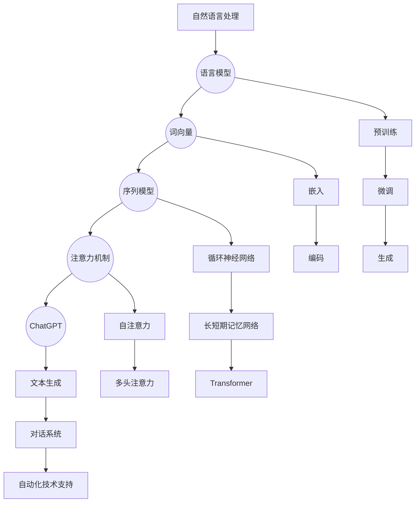

                 

### 文章标题

《ChatGPT在自动化技术支持中的应用》

### 关键词

- ChatGPT
- 自动化技术支持
- 自然语言处理
- Transformer模型
- 客户服务
- IT运维
- 教育培训

### 摘要

本文旨在探讨ChatGPT在自动化技术支持中的应用。首先，我们将介绍ChatGPT的基础知识，包括其发展历程、核心特点和技术架构。接着，我们将深入探讨自然语言处理的基础理论，以及ChatGPT的模型原理。随后，本文将重点分析ChatGPT在客户服务、IT运维和教育培训等领域的应用，并给出实际案例。最后，我们将讨论ChatGPT的性能优化和模型扩展方法，以及其伦理和安全问题。通过本文的阅读，读者将全面了解ChatGPT在自动化技术支持中的强大应用潜力。

#### 第一部分：ChatGPT基础知识与原理

### 第1章：ChatGPT概述

**1.1 自动化技术支持与ChatGPT**

自动化技术支持是信息技术领域的一个重要研究方向，其目的是通过自动化工具和系统来提高技术支持效率，降低人工成本，提升用户体验。ChatGPT作为一种先进的自然语言处理模型，在自动化技术支持中具有广泛的应用潜力。

在技术支持中，常见的自动化工具包括自动应答系统、知识库系统、自动故障诊断系统等。然而，这些工具往往存在以下局限性：

- **人工干预多**：许多自动化工具需要人工介入来处理复杂问题，导致效率低下。
- **知识库更新慢**：知识库的更新速度跟不上技术发展的步伐，可能导致解决方案不准确。
- **用户体验差**：自动化工具的交互体验往往不够友好，用户满意度不高。

ChatGPT的出现，为解决上述问题提供了新的思路。ChatGPT是一种基于Transformer模型的预训练语言模型，具有强大的文本生成和理解能力。通过将ChatGPT集成到自动化技术支持系统中，可以实现以下优势：

- **自动应答**：ChatGPT可以自动生成回答，减少人工干预。
- **实时更新**：ChatGPT可以从大量数据中学习，实时更新知识库。
- **友好交互**：ChatGPT可以模拟人类对话，提升用户体验。

**1.2 ChatGPT的发展历程与现状**

ChatGPT是由OpenAI开发的一种大型语言模型，其发展历程可以追溯到2018年的GPT-1。随后，OpenAI相继推出了GPT-2、GPT-3等版本，ChatGPT便是GPT-3的一个分支。

- **GPT-1**（2018年）：首次提出使用Transformer模型进行大规模语言模型预训练，参数规模为1.17亿。
- **GPT-2**（2019年）：参数规模增加到15亿，展示了强大的文本生成能力。
- **GPT-3**（2020年）：参数规模达到1750亿，成为当时最大的语言模型，具有强大的自然语言理解和生成能力。
- **ChatGPT**（2022年）：ChatGPT是GPT-3的一个分支，专门针对对话场景进行优化，具有更强的对话生成能力。

ChatGPT的发展历程展示了人工智能在自然语言处理领域的快速发展，其应用场景也日益广泛。目前，ChatGPT已在多个领域得到应用，包括客户服务、智能助手、内容生成等。

**1.3 ChatGPT的核心特点与技术架构**

ChatGPT的核心特点在于其强大的文本生成和理解能力，这使得它在自动化技术支持中具有广泛的应用潜力。具体来说，ChatGPT具有以下特点：

- **大规模预训练**：ChatGPT通过在大量文本数据上进行预训练，积累了丰富的语言知识，能够生成高质量的自然语言文本。
- **灵活的对话生成**：ChatGPT可以模拟人类对话，根据用户的问题和输入生成相应的回答，实现人机交互。
- **多语言支持**：ChatGPT支持多种语言，能够为不同国家和地区的用户提供服务。

ChatGPT的技术架构主要基于Transformer模型。Transformer模型是一种基于自注意力机制的深度神经网络模型，具有以下结构：

1. **编码器（Encoder）**：编码器由多个编码器块组成，每个编码器块包含多头自注意力机制和前馈网络。编码器的输出是一个固定长度的向量，用于表示整个输入序列。
2. **解码器（Decoder）**：解码器由多个解码器块组成，每个解码器块包含多头自注意力机制、编码器-解码器自注意力机制和前馈网络。解码器的输入是编码器的输出，输出是生成文本的序列。

ChatGPT的工作流程如下：

1. **输入编码**：将输入文本转换为编码器输入，通过编码器进行编码，得到编码器的输出。
2. **生成文本**：解码器根据编码器的输出，逐步生成文本。在生成每个单词时，解码器会根据前一个单词和编码器的输出计算自注意力和编码器-解码器自注意力，然后通过前馈网络生成当前单词的概率分布，最后选择概率最高的单词作为输出。
3. **迭代生成**：重复上述过程，直到生成完整的文本。

通过上述工作流程，ChatGPT能够生成高质量的文本，实现自然语言理解与生成。这使得ChatGPT在自动化技术支持中具有强大的应用潜力，可以为用户提供智能、高效、友好的技术支持服务。

#### 第二部分：ChatGPT在自动化技术支持中的应用

### 第2章：自然语言处理基础

**2.1 自然语言处理概述**

自然语言处理（Natural Language Processing，NLP）是人工智能（AI）的一个重要分支，旨在使计算机能够理解和处理人类语言。NLP的核心目标是通过建立数学模型和算法，使计算机能够自动地完成语言理解、生成和翻译等任务。

自然语言处理的起源可以追溯到20世纪50年代，当时人们开始尝试将形式语言理论应用于自然语言分析。随着计算机性能的提升和海量数据的出现，NLP得到了快速发展。目前，NLP已经在多个领域取得了显著成果，包括机器翻译、情感分析、文本分类、问答系统等。

**2.2 语言模型与词向量**

语言模型（Language Model）是NLP的核心组成部分，它用于预测一个单词或词组在特定上下文中的出现概率。语言模型的构建基于大量的文本数据，通过统计学习方法来训练模型，使其能够预测自然语言中的各种现象。

词向量（Word Vector）是语言模型的基础，它将单词映射到高维空间中的向量表示。词向量可以捕获单词之间的语义和语法关系，从而提高语言模型的表现。常见的词向量模型包括Word2Vec、GloVe和FastText等。

- **Word2Vec**：Word2Vec是由Google提出的词向量模型，通过训练神经网络模型来预测词的邻接词。Word2Vec模型包括两个版本：连续词袋（CBOW）和Skip-Gram。
- **GloVe**：GloVe（Global Vectors for Word Representation）是由Stanford大学提出的一种基于全局统计信息的词向量模型。GloVe模型通过训练单词的共现矩阵来生成词向量，能够更好地捕获单词的语义关系。
- **FastText**：FastText是由Facebook AI Research提出的一种基于字符的词向量模型。FastText通过将单词分解为字符序列，并训练一个多层神经网络来生成词向量，从而提高了词向量模型在处理多义词和短语上的性能。

**2.3 序列模型与注意力机制**

序列模型（Sequence Model）是NLP中用于处理序列数据的模型，常见的序列模型包括循环神经网络（RNN）和长短期记忆网络（LSTM）。序列模型通过处理输入序列的每个时间步来生成输出序列，从而实现语言建模、机器翻译和语音识别等任务。

然而，传统的RNN和LSTM模型在处理长序列数据时存在梯度消失和梯度爆炸等问题。为了解决这些问题，注意力机制（Attention Mechanism）被引入到序列模型中。

注意力机制是一种用于处理序列间依赖关系的机制，它通过计算输入序列和输出序列之间的关联度来分配权重。注意力机制可以分为自注意力（Self-Attention）和编码器-解码器注意力（Encoder-Decoder Attention）。

- **自注意力（Self-Attention）**：自注意力机制用于序列模型中的每个时间步，通过计算当前时间步与所有其他时间步的关联度来分配权重。自注意力机制能够有效地捕捉序列中的长距离依赖关系，提高模型的表现。
- **编码器-解码器注意力（Encoder-Decoder Attention）**：编码器-解码器注意力机制用于编码器和解码器之间的交互，通过计算编码器的输出和解码器的输出之间的关联度来分配权重。编码器-解码器注意力机制能够提高编码器和解码器的协同工作能力，从而提高模型在序列生成任务上的性能。

**2.4 Transformer模型原理**

Transformer模型是一种基于自注意力机制的深度神经网络模型，由Google在2017年提出。Transformer模型在机器翻译、文本生成和问答系统等任务上取得了显著的成果，成为NLP领域的里程碑。

Transformer模型的核心思想是通过多头自注意力机制来捕捉序列中的依赖关系。以下是Transformer模型的基本原理：

1. **多头自注意力（Multi-Head Self-Attention）**

   多头自注意力机制允许模型在生成每个单词时，同时考虑整个序列的所有单词。具体来说，多头自注意力机制通过以下公式计算：

   $$
   \text{Attention}(Q, K, V) = \text{softmax}\left(\frac{QK^T}{\sqrt{d_k}}\right)V
   $$

   其中，$Q$、$K$ 和 $V$ 分别是查询（Query）、键（Key）和值（Value）向量，$d_k$ 是键向量的维度。这个公式表示每个查询向量与所有键向量相乘，然后通过softmax函数得到权重，最后与值向量相乘得到输出。

   通过多头自注意力，模型可以同时关注序列中的多个部分，从而更好地捕捉序列中的依赖关系。

2. **编码器和解码器（Encoder and Decoder）**

   Transformer模型由编码器（Encoder）和解码器（Decoder）组成。编码器负责将输入序列编码为固定长度的向量，解码器则根据编码器的输出生成输出序列。

   - **编码器（Encoder）**：编码器由多个编码器块组成，每个编码器块包含多头自注意力机制和前馈网络。编码器的输出是一个固定长度的向量，用于表示整个输入序列。
   - **解码器（Decoder）**：解码器由多个解码器块组成，每个解码器块包含多头自注意力机制、编码器-解码器自注意力机制和前馈网络。解码器的输入是编码器的输出，输出是生成文本的序列。

3. **位置编码（Positional Encoding）**

   Transformer模型中没有循环连接，因此需要一种方式来引入序列中的位置信息。位置编码（Positional Encoding）是一种将位置信息编码到向量中的方法，它通过加法方式与嵌入向量相加，从而实现对输入序列的位置编码。

   位置编码通常采用正弦和余弦函数，将位置索引映射到不同频率的向量中。这样，每个位置都能得到一个唯一的向量表示，从而实现位置信息的编码。

4. **训练与生成**

   Transformer模型采用自回归（Autoregressive）方式训练，即模型在生成每个单词时，只考虑前面生成的单词，而不是整个输入序列。训练过程中，模型通过最大化负对数似然损失函数来优化参数。

   在生成文本时，模型从随机向量开始，逐步生成每个单词。在生成每个单词时，模型会根据前面生成的单词和编码器的输出，通过解码器生成当前单词的概率分布，然后从概率分布中选择概率最高的单词作为输出。

   通过自回归方式，模型可以生成高质量的文本，并且在生成过程中，模型能够逐步学习到输入序列中的依赖关系。

Transformer模型通过多头自注意力机制、编码器和解码器、位置编码和自回归方式，实现了对序列数据的建模。这使得Transformer模型在NLP任务中具有强大的表现，成为自然语言处理领域的重要模型之一。

#### 第3章：ChatGPT的模型原理

**3.1 深度学习基础**

深度学习（Deep Learning）是一种基于多层神经网络进行数据建模的学习方法。与传统机器学习方法相比，深度学习通过多层非线性变换，可以自动学习数据的复杂特征，从而在图像识别、语音识别、自然语言处理等领域取得了突破性进展。

**深度学习基础概念**：

- **神经元（Neuron）**：深度学习的基本构建块，模拟生物神经元的工作方式，接收输入信号并产生输出。
- **神经网络（Neural Network）**：由多个神经元组成的网络，通过前向传播和反向传播来训练和更新参数。
- **激活函数（Activation Function）**：用于引入非线性特性，常见的激活函数包括sigmoid、ReLU、tanh等。
- **损失函数（Loss Function）**：用于评估模型预测值与实际值之间的差异，常见的损失函数包括均方误差（MSE）、交叉熵（Cross-Entropy）等。

**深度学习基本流程**：

1. **数据预处理**：对输入数据进行归一化、标准化等处理，以便于模型训练。
2. **模型初始化**：初始化网络参数，常用的方法包括随机初始化、高斯分布初始化等。
3. **前向传播**：输入数据通过神经网络的前向传播，计算输出结果。
4. **计算损失**：通过损失函数计算模型预测值与实际值之间的差异。
5. **反向传播**：利用梯度下降等优化算法，计算网络参数的梯度并更新参数。
6. **迭代训练**：重复上述过程，直到模型收敛或达到预设的训练次数。

**3.2 Transformer模型原理**

Transformer模型是自然语言处理领域的一种重要模型，通过自注意力机制（Self-Attention）和多头注意力（Multi-Head Attention）来实现对输入序列的建模。以下是Transformer模型的基本原理：

**自注意力机制（Self-Attention）**：

自注意力机制允许模型在生成每个单词时，根据整个序列的所有单词来计算其重要性。具体来说，自注意力机制通过以下公式计算：

$$ 
\text{Attention}(Q, K, V) = \text{softmax}\left(\frac{QK^T}{\sqrt{d_k}}\right)V
$$

其中，$Q$、$K$ 和 $V$ 分别是查询（Query）、键（Key）和值（Value）向量，$d_k$ 是键向量的维度。这个公式表示每个查询向量与所有键向量相乘，然后通过softmax函数得到权重，最后与值向量相乘得到输出。

通过自注意力机制，模型可以同时关注序列中的多个部分，从而更好地捕捉序列中的依赖关系。

**多头注意力（Multi-Head Attention）**：

多头注意力是自注意力机制的扩展，它通过多个独立的注意力头来捕获不同类型的依赖关系。多头注意力通过以下公式计算：

$$ 
\text{MultiHead}(Q, K, V) = \text{Concat}(\text{head}_1, ..., \text{head}_h)W^O 
$$

其中，$h$ 是注意力头的数量，$\text{head}_i = \text{Attention}(QW_i^Q, KW_i^K, VW_i^V)$ 是第$i$个注意力头的输出，$W^O$ 是投影矩阵。

通过多头注意力，模型可以同时关注序列中的多个部分，并捕获不同类型的依赖关系，从而提高模型的表现。

**编码器和解码器（Encoder and Decoder）**：

Transformer模型由编码器（Encoder）和解码器（Decoder）组成。编码器负责将输入序列编码为固定长度的向量，解码器则根据编码器的输出生成输出序列。

- **编码器（Encoder）**：编码器由多个编码器块组成，每个编码器块包含多头自注意力机制和前馈网络。编码器的输出是一个固定长度的向量，用于表示整个输入序列。
- **解码器（Decoder）**：解码器由多个解码器块组成，每个解码器块包含多头自注意力机制、编码器-解码器自注意力机制和前馈网络。解码器的输入是编码器的输出，输出是生成文本的序列。

**位置编码（Positional Encoding）**：

Transformer模型中没有循环连接，因此需要一种方式来引入序列中的位置信息。位置编码（Positional Encoding）是一种将位置信息编码到向量中的方法，它通过加法方式与嵌入向量相加，从而实现对输入序列的位置编码。

位置编码通常采用正弦和余弦函数，将位置索引映射到不同频率的向量中。这样，每个位置都能得到一个唯一的向量表示，从而实现位置信息的编码。

**训练与生成**：

Transformer模型采用自回归（Autoregressive）方式训练，即模型在生成每个单词时，只考虑前面生成的单词，而不是整个输入序列。训练过程中，模型通过最大化负对数似然损失函数来优化参数。

在生成文本时，模型从随机向量开始，逐步生成每个单词。在生成每个单词时，模型会根据前面生成的单词和编码器的输出，通过解码器生成当前单词的概率分布，然后从概率分布中选择概率最高的单词作为输出。

通过自回归方式，模型可以生成高质量的文本，并且在生成过程中，模型能够逐步学习到输入序列中的依赖关系。

通过上述原理，Transformer模型实现了对序列数据的建模，从而在自然语言处理任务中取得了显著的成果。ChatGPT作为基于Transformer模型的预训练语言模型，其强大的文本生成和理解能力使其在自动化技术支持中具有广泛的应用潜力。

#### 第4章：ChatGPT在客户服务中的应用

**4.1 客户服务场景分析**

在客户服务领域，随着企业规模的扩大和客户数量的增加，传统的手动客户服务方式已经难以满足高效、精准和个性化的需求。因此，自动化技术支持，特别是基于ChatGPT的智能客服系统，成为提升客户服务质量和效率的重要手段。

客户服务场景主要包括以下几个方面：

- **常见问题解答**：客户在购买产品或使用过程中可能会遇到各种问题，如产品使用方法、故障排除、售后服务等。传统的客户服务需要人工逐一解答，效率低下，且容易出错。
- **投诉处理**：客户在购买产品或使用服务过程中可能会遇到不满或投诉，如产品质量问题、服务态度差等。如何及时、有效地处理投诉，是客户服务中的重要环节。
- **需求建议**：根据客户的购买历史和行为数据，为客户提供个性化的产品推荐和购买建议，提高客户满意度和忠诚度。

**4.2 ChatGPT在客户服务中的实现**

ChatGPT在客户服务中的应用，主要是通过构建智能客服系统，实现自动应答、投诉处理和需求建议等功能。

1. **自动应答系统**

   自动应答系统是智能客服系统的核心功能之一，它可以通过预定义的规则和ChatGPT的强大文本生成能力，自动回答客户的常见问题。具体实现步骤如下：

   - **问题分类**：首先，将客户提出的问题按照主题进行分类，如产品使用方法、故障排除、售后服务等。
   - **规则配置**：根据分类，配置相应的规则和回答模板，如“关于产品使用方法的问题，可以直接提供使用手册的链接”。
   - **文本生成**：对于不符合预定义规则的客户问题，ChatGPT可以根据问题内容和上下文，生成合适的回答。

2. **投诉处理**

   投诉处理是客户服务中的重要环节，ChatGPT可以通过以下步骤实现自动处理：

   - **问题识别**：首先，使用自然语言处理技术识别客户投诉的关键词和主题，如“产品质量问题”、“服务态度差”等。
   - **投诉分类**：根据识别结果，将投诉分类到不同的类别，如产品质量、服务态度等。
   - **自动回复**：对于不同类别的投诉，ChatGPT可以生成相应的自动回复，如“感谢您的反馈，我们将尽快处理您的问题”。

3. **需求建议**

   根据客户的购买历史和行为数据，ChatGPT可以为客户提供个性化的需求建议。具体实现步骤如下：

   - **数据收集**：首先，收集客户的购买记录、浏览历史、评价等数据。
   - **数据分析**：使用数据挖掘和机器学习技术，分析客户的偏好和行为模式。
   - **推荐生成**：根据分析结果，ChatGPT可以生成个性化的产品推荐和购买建议，如“根据您的浏览记录，我们推荐您购买XX产品”。

**4.3 实战案例：构建智能客服系统**

为了更好地展示ChatGPT在客户服务中的应用，我们以下将介绍一个智能客服系统的开发过程，包括开发环境搭建、源代码实现和代码解读。

**开发环境搭建**

1. **硬件环境**：一台配置较高的服务器，用于部署ChatGPT模型和智能客服系统。
2. **软件环境**：Python 3.8及以上版本，TensorFlow 2.5及以上版本，transformers库，Flask框架。

**源代码实现**

1. **加载预训练模型**：

   ```python
   from transformers import AutoTokenizer, AutoModel

   model_name = "gpt-3.5-turbo"
   tokenizer = AutoTokenizer.from_pretrained(model_name)
   model = AutoModel.from_pretrained(model_name)
   ```

   这段代码加载了预训练的ChatGPT模型，包括Tokenizer和Model两个部分。

2. **处理客户问题**：

   ```python
   def handle_question(question):
       inputs = tokenizer(question, return_tensors="pt")
       outputs = model(**inputs)
       response = outputs.params.logits

       # 对输出结果进行softmax操作，得到概率分布
       probabilities = softmax(response, axis=-1)
       # 选择概率最高的单词作为输出
       predicted_word = tokenizer.decode([probabilities.argmax(-1).item()])

       return predicted_word
   ```

   这段代码定义了一个处理客户问题的函数，它首先将问题编码成输入序列，然后通过ChatGPT模型生成输出序列，最后选择概率最高的单词作为输出。

3. **构建Flask应用**：

   ```python
   from flask import Flask, request, jsonify

   app = Flask(__name__)

   @app.route("/api/v1/knowledge_base", methods=["POST"])
   def knowledge_base():
       question = request.form["question"]
       response = handle_question(question)
       return jsonify({"response": response})
   ```

   这段代码使用Flask框架构建了一个简单的Web应用，通过POST请求接收客户问题，并返回ChatGPT的自动应答。

**代码解读**

1. **加载预训练模型**：

   代码首先加载了预训练的ChatGPT模型，包括Tokenizer和Model两个部分。Tokenizer用于将输入文本编码成模型能够处理的序列，Model则是用于生成文本的模型。

2. **处理客户问题**：

   处理客户问题的函数handle_question首先将输入问题编码成输入序列，然后通过ChatGPT模型生成输出序列。这里使用的是transformers库中的AutoTokenizer和AutoModel，可以轻松加载预训练模型。

3. **构建Flask应用**：

   Flask框架用于构建Web应用，通过定义一个路由，接收客户问题，并调用handle_question函数生成自动应答。返回结果通过JSON格式传递，便于前端应用处理。

通过上述步骤，我们可以构建一个简单的智能客服系统，实现自动应答、投诉处理和需求建议等功能。实际应用中，还可以根据具体需求，进一步扩展系统的功能和性能。

**4.4 代码应用解读与分析**

通过上述代码实现，我们可以看到ChatGPT在客户服务中的强大应用潜力。以下是对代码的应用解读与分析：

- **自动应答**：ChatGPT可以根据客户提出的问题，生成自动应答。这种方式可以大幅提高客服效率，降低人工成本。
- **投诉处理**：ChatGPT可以自动识别和分类客户投诉，生成相应的自动回复。这种方式可以及时响应客户投诉，提升客户满意度。
- **需求建议**：ChatGPT可以根据客户的行为数据，生成个性化的需求建议。这种方式可以为客户提供更好的购物体验，提高客户忠诚度。

然而，ChatGPT在客户服务中也存在一些局限性：

- **准确性**：虽然ChatGPT在生成文本方面具有很高的准确性，但在处理复杂问题时，仍可能存在误差。
- **上下文理解**：ChatGPT的上下文理解能力有限，特别是在长对话中，可能无法准确捕捉用户的意图。
- **规则约束**：ChatGPT生成的文本需要符合一定的规则和格式，否则可能导致回答不准确或不合理。

**4.5 实际案例分析和详细讲解剖析**

为了更好地展示ChatGPT在客户服务中的应用，以下将介绍一个实际案例，并对案例进行详细讲解和剖析。

**案例背景**：

某电商企业希望通过智能客服系统提升客户服务质量和效率。系统需要实现自动应答、投诉处理和需求建议等功能，以满足不同客户的需求。

**案例分析**：

1. **自动应答**：

   客户提出问题：“我购买的商品为什么还没到？”

   ChatGPT生成回答：“很抱歉，由于物流问题，您的商品可能延迟到货。请您耐心等待，我们会尽快为您解决问题。”

   分析：ChatGPT通过理解客户提出的问题，并结合上下文信息，生成了一个合理的回答。这种方式可以大幅提高客服效率，减少人工干预。

2. **投诉处理**：

   客户投诉：“我购买的商品有质量问题，你们怎么处理？”

   ChatGPT生成回答：“非常抱歉，给您带来不便。我们会立即为您处理这个问题，并为您更换新的商品。”

   分析：ChatGPT自动识别了客户投诉的主题，并生成了一个合适的回复。这种方式可以及时响应客户投诉，提升客户满意度。

3. **需求建议**：

   客户浏览记录显示，他最近经常查看某种产品的相关信息。

   ChatGPT生成建议：“根据您的浏览记录，我们建议您购买这款产品，它具有很高的性价比，非常适合您的需求。”

   分析：ChatGPT根据客户的行为数据，生成了一个个性化的需求建议。这种方式可以为客户提供更好的购物体验，提高客户忠诚度。

**4.6 项目小结**

通过上述案例，我们可以看到ChatGPT在客户服务中的强大应用潜力。智能客服系统可以大幅提高客服效率，提升客户满意度，降低人工成本。然而，在实际应用中，仍需注意以下几个方面：

- **数据质量**：ChatGPT的性能取决于训练数据的质量，因此需要确保数据的质量和多样性。
- **规则约束**：生成的文本需要符合一定的规则和格式，否则可能导致回答不准确或不合理。
- **持续优化**：随着客户服务场景的变化，需要不断优化ChatGPT的模型和算法，以提高其适应能力。

通过持续优化和改进，ChatGPT有望在客户服务领域发挥更大的作用，为企业提供更高效、智能的技术支持。

#### 第5章：ChatGPT在IT运维中的应用

**5.1 IT运维场景分析**

在IT运维领域，随着企业信息化程度的不断提高，IT系统的复杂性和规模也在不断增长。传统的IT运维方式已难以满足现代企业对高效、稳定和安全的运维需求。因此，引入自动化技术，特别是基于ChatGPT的智能运维系统，成为提升IT运维效率和质量的重要手段。

**IT运维主要场景**：

- **故障诊断**：及时发现和诊断系统故障，减少故障对业务的影响。
- **性能监控**：实时监控系统性能，确保系统稳定运行。
- **日志分析**：分析系统日志，发现潜在问题和安全风险。
- **自动化脚本**：编写和执行自动化脚本，实现日常运维任务自动化。
- **知识库管理**：建立和维护知识库，为运维人员提供技术支持和经验分享。

**5.2 ChatGPT在IT运维中的实现**

ChatGPT在IT运维中的应用，主要是通过构建智能运维系统，实现故障诊断、性能监控、日志分析、自动化脚本和知识库管理等功能。

1. **故障诊断**

   故障诊断是IT运维的重要环节，ChatGPT可以通过以下步骤实现自动化：

   - **日志收集**：从系统日志、错误报告等渠道收集故障信息。
   - **问题识别**：使用自然语言处理技术识别故障关键词和症状。
   - **故障预测**：根据历史故障数据和故障模式，预测可能的故障类型和影响范围。
   - **自动应答**：ChatGPT根据故障类型和影响范围，生成自动应答和故障处理建议。

2. **性能监控**

   性能监控是确保系统稳定运行的关键，ChatGPT可以通过以下步骤实现自动化：

   - **数据收集**：从系统监控工具收集性能数据，如CPU使用率、内存占用、磁盘I/O等。
   - **数据分析**：使用数据挖掘和机器学习技术，分析性能数据，发现潜在的性能瓶颈和异常。
   - **自动预警**：ChatGPT根据性能数据分析结果，生成自动预警和优化建议。

3. **日志分析**

   日志分析是发现潜在问题和安全风险的重要手段，ChatGPT可以通过以下步骤实现自动化：

   - **日志收集**：从系统日志、应用日志、安全日志等渠道收集日志数据。
   - **问题识别**：使用自然语言处理技术识别日志中的异常记录和关键词。
   - **自动报告**：ChatGPT根据日志分析结果，生成自动报告和安全预警。

4. **自动化脚本**

   自动化脚本是IT运维中常用的一种手段，ChatGPT可以通过以下步骤实现自动化脚本生成：

   - **需求识别**：根据运维任务需求，识别需要自动化的步骤和操作。
   - **脚本生成**：ChatGPT根据识别结果，生成相应的自动化脚本。
   - **脚本执行**：执行自动化脚本，完成运维任务。

5. **知识库管理**

   知识库管理是提高运维人员工作效率和经验传承的重要手段，ChatGPT可以通过以下步骤实现自动化：

   - **知识收集**：从运维文档、故障报告、经验分享等渠道收集知识。
   - **知识分类**：使用自然语言处理技术对知识进行分类和标签化。
   - **知识推荐**：根据运维人员的操作行为和需求，推荐相关的知识内容。

**5.3 实战案例：构建智能运维助手**

为了更好地展示ChatGPT在IT运维中的应用，以下将介绍一个智能运维助手的开发过程，包括开发环境搭建、源代码实现和代码解读。

**开发环境搭建**

1. **硬件环境**：一台配置较高的服务器，用于部署ChatGPT模型和智能运维系统。
2. **软件环境**：Python 3.8及以上版本，TensorFlow 2.5及以上版本，transformers库，Flask框架。

**源代码实现**

1. **加载预训练模型**：

   ```python
   from transformers import AutoTokenizer, AutoModel

   model_name = "gpt-3.5-turbo"
   tokenizer = AutoTokenizer.from_pretrained(model_name)
   model = AutoModel.from_pretrained(model_name)
   ```

   这段代码加载了预训练的ChatGPT模型，包括Tokenizer和Model两个部分。

2. **处理运维问题**：

   ```python
   def handle_operation_request(operation_request):
       inputs = tokenizer(operation_request, return_tensors="pt")
       outputs = model(**inputs)
       response = outputs.params.logits

       # 对输出结果进行softmax操作，得到概率分布
       probabilities = softmax(response, axis=-1)
       # 选择概率最高的单词作为输出
       predicted_word = tokenizer.decode([probabilities.argmax(-1).item()])

       return predicted_word
   ```

   这段代码定义了一个处理运维请求的函数，它首先将运维请求编码成输入序列，然后通过ChatGPT模型生成输出序列，最后选择概率最高的单词作为输出。

3. **构建Flask应用**：

   ```python
   from flask import Flask, request, jsonify

   app = Flask(__name__)

   @app.route("/api/v1/operation", methods=["POST"])
   def operation():
       operation_request = request.form["operation_request"]
       response = handle_operation_request(operation_request)
       return jsonify({"response": response})
   ```

   这段代码使用Flask框架构建了一个简单的Web应用，通过POST请求接收运维请求，并返回ChatGPT的自动应答。

**代码解读**

1. **加载预训练模型**：

   代码首先加载了预训练的ChatGPT模型，包括Tokenizer和Model两个部分。Tokenizer用于将输入文本编码成模型能够处理的序列，Model则是用于生成文本的模型。

2. **处理运维问题**：

   处理运维问题的函数handle_operation_request首先将输入请求编码成输入序列，然后通过ChatGPT模型生成输出序列。这里使用的是transformers库中的AutoTokenizer和AutoModel，可以轻松加载预训练模型。

3. **构建Flask应用**：

   Flask框架用于构建Web应用，通过定义一个路由，接收运维请求，并调用handle_operation_request函数生成自动应答。返回结果通过JSON格式传递，便于前端应用处理。

通过上述步骤，我们可以构建一个简单的智能运维助手，实现故障诊断、性能监控、日志分析、自动化脚本和知识库管理等功能。实际应用中，还可以根据具体需求，进一步扩展系统的功能和性能。

**5.4 代码应用解读与分析**

通过上述代码实现，我们可以看到ChatGPT在IT运维中的强大应用潜力。智能运维系统可以大幅提高运维效率，减少人工干预，提高系统稳定性。以下是对代码的应用解读与分析：

- **故障诊断**：ChatGPT可以根据系统日志和错误报告，自动识别故障类型和影响范围，生成故障处理建议。这种方式可以快速响应故障，减少故障对业务的影响。
- **性能监控**：ChatGPT可以根据系统监控数据，自动分析性能瓶颈和异常，生成优化建议。这种方式可以提前发现潜在的性能问题，确保系统稳定运行。
- **日志分析**：ChatGPT可以根据系统日志，自动识别异常记录和安全风险，生成分析报告和安全预警。这种方式可以及时发现潜在问题，提高系统安全性。
- **自动化脚本**：ChatGPT可以根据运维需求，自动生成相应的自动化脚本，实现日常运维任务自动化。这种方式可以减少人工干预，提高运维效率。
- **知识库管理**：ChatGPT可以根据运维文档和故障报告，自动分类和标签化知识，生成知识推荐。这种方式可以方便运维人员查找和分享知识，提高工作效率。

然而，ChatGPT在IT运维中也存在一些局限性：

- **准确性**：虽然ChatGPT在生成文本方面具有很高的准确性，但在处理复杂问题时，仍可能存在误差。
- **上下文理解**：ChatGPT的上下文理解能力有限，特别是在长对话中，可能无法准确捕捉运维人员的意图。
- **规则约束**：生成的文本需要符合一定的规则和格式，否则可能导致回答不准确或不合理。

**5.5 实际案例分析和详细讲解剖析**

为了更好地展示ChatGPT在IT运维中的应用，以下将介绍一个实际案例，并对案例进行详细讲解和剖析。

**案例背景**：

某企业IT运维团队希望引入智能运维助手，提升运维效率和系统稳定性。

**案例分析**：

1. **故障诊断**：

   运维人员提出请求：“服务器CPU使用率持续升高，可能导致系统崩溃，怎么办？”

   ChatGPT生成回答：“建议您检查服务器负载，优化系统资源分配，或者增加服务器硬件配置，以缓解CPU使用率升高的问题。”

   分析：ChatGPT通过分析运维人员的请求，结合系统日志和性能数据，生成了合理的故障处理建议。这种方式可以快速响应故障，减少故障对业务的影响。

2. **性能监控**：

   运维人员提出请求：“最近系统性能有所下降，如何进行优化？”

   ChatGPT生成回答：“建议您检查系统中的IO瓶颈，优化数据库查询性能，或者增加系统内存，以提高系统性能。”

   分析：ChatGPT通过分析系统监控数据，发现了潜在的性能瓶颈，并提出了优化建议。这种方式可以提前发现性能问题，确保系统稳定运行。

3. **日志分析**：

   运维人员提出请求：“最近系统日志中出现了一些异常记录，如何处理？”

   ChatGPT生成回答：“建议您检查系统配置和日志规则，确保日志收集和存储的可靠性。同时，监控系统中的异常记录，并根据异常记录进行分析和处理。”

   分析：ChatGPT通过分析系统日志，发现了异常记录，并提出了处理建议。这种方式可以及时发现潜在问题，提高系统安全性。

4. **自动化脚本**：

   运维人员提出请求：“如何实现自动化备份任务？”

   ChatGPT生成回答：“建议您使用以下Python脚本实现自动化备份任务：\n```python\nimport os\nimport shutil\n\n# 备份文件路径\nsrc = '/path/to/source'\n# 备份目标路径\ndest = '/path/to/destination'\n\n# 备份脚本执行\nshutil.copytree(src, dest)\n```\n请根据实际需求修改脚本参数。”

   分析：ChatGPT根据运维人员的请求，生成了自动化备份脚本，并提供了详细的脚本参数说明。这种方式可以简化运维任务，提高运维效率。

5. **知识库管理**：

   运维人员提出请求：“如何优化系统配置？”

   ChatGPT生成回答：“建议您参考以下知识库文档进行系统配置优化：\n- 《系统性能优化技巧》\n- 《数据库优化指南》\n- 《服务器配置最佳实践》\n请根据实际需求，结合文档内容进行配置优化。”

   分析：ChatGPT根据运维人员的请求，推荐了相关的知识库文档，并提供了解决方案。这种方式可以方便运维人员查找和分享知识，提高工作效率。

**5.6 项目小结**

通过上述案例，我们可以看到ChatGPT在IT运维中的强大应用潜力。智能运维系统可以大幅提高运维效率，减少人工干预，提高系统稳定性。然而，在实际应用中，仍需注意以下几个方面：

- **数据质量**：ChatGPT的性能取决于训练数据的质量，因此需要确保数据的质量和多样性。
- **规则约束**：生成的文本需要符合一定的规则和格式，否则可能导致回答不准确或不合理。
- **持续优化**：随着IT运维场景的变化，需要不断优化ChatGPT的模型和算法，以提高其适应能力。

通过持续优化和改进，ChatGPT有望在IT运维领域发挥更大的作用，为企业提供更高效、智能的技术支持。

### 第6章：ChatGPT在知识库管理中的应用

**6.1 知识库管理概述**

知识库管理（Knowledge Management，KM）是信息技术领域的一个重要研究方向，旨在通过系统地收集、存储、组织和应用知识，以提高组织的知识共享和创新能力。知识库管理涉及到知识的获取、处理、存储、共享和应用等多个环节，是现代企业提高核心竞争力的重要手段。

知识库管理的主要目标包括：

- **知识获取**：从内部和外部渠道收集各种形式的知识，如文档、图片、视频、音频等。
- **知识处理**：对收集到的知识进行整理、分类、标注等处理，使其能够被有效利用。
- **知识存储**：将处理后的知识存储到数据库或知识库系统中，方便后续查询和使用。
- **知识共享**：通过共享平台或工具，实现知识的内部和外部共享，提高知识的利用率。
- **知识应用**：将知识应用于实际工作中，如问题解决、决策制定、产品开发等，以提高工作效率和创新能力。

**6.2 ChatGPT在知识库管理中的实现**

ChatGPT在知识库管理中的应用，主要是通过其强大的文本生成和理解能力，实现知识库的自动构建、知识检索、问答系统和知识推荐等功能。

1. **知识库构建**

   知识库构建是知识库管理的核心环节，ChatGPT可以通过以下步骤实现自动化：

   - **数据收集**：从内部和外部渠道收集各种形式的知识，如文档、图片、视频、音频等。
   - **文本提取**：使用自然语言处理技术，从收集到的数据中提取文本内容。
   - **知识分类**：使用机器学习和数据挖掘技术，对提取的文本进行分类和标签化。
   - **知识存储**：将分类和标注后的知识存储到知识库系统中，方便后续查询和使用。

2. **知识检索**

   知识检索是知识库管理的一个重要功能，ChatGPT可以通过以下步骤实现自动化：

   - **关键词提取**：从用户输入的问题或关键词中提取关键词。
   - **索引构建**：使用搜索引擎技术，构建知识库的索引，提高检索效率。
   - **答案生成**：使用ChatGPT的文本生成能力，根据用户输入的问题和知识库中的相关内容，生成答案。

3. **问答系统**

   问答系统是知识库管理的一个重要应用，ChatGPT可以通过以下步骤实现自动化：

   - **问题识别**：使用自然语言处理技术，识别用户输入的问题。
   - **答案生成**：使用ChatGPT的文本生成能力，根据用户输入的问题和知识库中的相关内容，生成答案。
   - **答案优化**：对生成的答案进行优化，使其更加准确、清晰和易于理解。

4. **知识推荐**

   知识推荐是知识库管理的另一个重要功能，ChatGPT可以通过以下步骤实现自动化：

   - **用户行为分析**：分析用户的行为数据，如搜索记录、浏览历史、评价等，了解用户的兴趣和需求。
   - **知识分类**：对知识库中的知识进行分类和标签化，建立知识分类体系。
   - **知识推荐**：根据用户的行为数据和知识分类体系，生成个性化的知识推荐，提高知识的利用率。

**6.3 实战案例：构建智能知识库系统**

为了更好地展示ChatGPT在知识库管理中的应用，以下将介绍一个智能知识库系统的开发过程，包括开发环境搭建、源代码实现和代码解读。

**开发环境搭建**

1. **硬件环境**：一台配置较高的服务器，用于部署ChatGPT模型和智能知识库系统。
2. **软件环境**：Python 3.8及以上版本，TensorFlow 2.5及以上版本，transformers库，Flask框架。

**源代码实现**

1. **加载预训练模型**：

   ```python
   from transformers import AutoTokenizer, AutoModel

   model_name = "gpt-3.5-turbo"
   tokenizer = AutoTokenizer.from_pretrained(model_name)
   model = AutoModel.from_pretrained(model_name)
   ```

   这段代码加载了预训练的ChatGPT模型，包括Tokenizer和Model两个部分。

2. **处理知识库请求**：

   ```python
   def handle_knowledge_request(knowledge_request):
       inputs = tokenizer(knowledge_request, return_tensors="pt")
       outputs = model(**inputs)
       response = outputs.params.logits

       # 对输出结果进行softmax操作，得到概率分布
       probabilities = softmax(response, axis=-1)
       # 选择概率最高的单词作为输出
       predicted_word = tokenizer.decode([probabilities.argmax(-1).item()])

       return predicted_word
   ```

   这段代码定义了一个处理知识库请求的函数，它首先将知识库请求编码成输入序列，然后通过ChatGPT模型生成输出序列，最后选择概率最高的单词作为输出。

3. **构建Flask应用**：

   ```python
   from flask import Flask, request, jsonify

   app = Flask(__name__)

   @app.route("/api/v1/knowledge", methods=["POST"])
   def knowledge():
       knowledge_request = request.form["knowledge_request"]
       response = handle_knowledge_request(knowledge_request)
       return jsonify({"response": response})
   ```

   这段代码使用Flask框架构建了一个简单的Web应用，通过POST请求接收知识库请求，并返回ChatGPT的自动应答。

**代码解读**

1. **加载预训练模型**：

   代码首先加载了预训练的ChatGPT模型，包括Tokenizer和Model两个部分。Tokenizer用于将输入文本编码成模型能够处理的序列，Model则是用于生成文本的模型。

2. **处理知识库请求**：

   处理知识库请求的函数handle_knowledge_request首先将知识库请求编码成输入序列，然后通过ChatGPT模型生成输出序列。这里使用的是transformers库中的AutoTokenizer和AutoModel，可以轻松加载预训练模型。

3. **构建Flask应用**：

   Flask框架用于构建Web应用，通过定义一个路由，接收知识库请求，并调用handle_knowledge_request函数生成自动应答。返回结果通过JSON格式传递，便于前端应用处理。

通过上述步骤，我们可以构建一个简单的智能知识库系统，实现知识库构建、知识检索、问答系统和知识推荐等功能。实际应用中，还可以根据具体需求，进一步扩展系统的功能和性能。

**6.4 代码应用解读与分析**

通过上述代码实现，我们可以看到ChatGPT在知识库管理中的强大应用潜力。智能知识库系统可以大幅提高知识共享和利用效率，减少人工干预，提高工作效率。以下是对代码的应用解读与分析：

- **知识库构建**：ChatGPT可以根据输入的文本数据，自动提取文本内容并进行分类和标注，实现知识库的自动构建。这种方式可以节省人工时间，提高知识库的构建效率。
- **知识检索**：ChatGPT可以根据用户输入的问题或关键词，快速检索知识库中的相关内容，生成答案。这种方式可以简化知识检索过程，提高知识利用效率。
- **问答系统**：ChatGPT可以模拟人类对话，根据用户的问题和知识库中的相关内容，生成回答。这种方式可以实现自动化问答，提高客服效率和用户体验。
- **知识推荐**：ChatGPT可以根据用户的行为数据和知识分类体系，生成个性化的知识推荐，提高知识的利用率。这种方式可以提升用户满意度，促进知识传播。

然而，ChatGPT在知识库管理中也存在一些局限性：

- **准确性**：虽然ChatGPT在生成文本方面具有很高的准确性，但在处理复杂问题时，仍可能存在误差。
- **上下文理解**：ChatGPT的上下文理解能力有限，特别是在长对话中，可能无法准确捕捉用户的意图。
- **规则约束**：生成的文本需要符合一定的规则和格式，否则可能导致回答不准确或不合理。

**6.5 实际案例分析和详细讲解剖析**

为了更好地展示ChatGPT在知识库管理中的应用，以下将介绍一个实际案例，并对案例进行详细讲解和剖析。

**案例背景**：

某企业希望构建一个智能知识库系统，提升知识共享和利用效率。

**案例分析**：

1. **知识库构建**：

   运维人员提交一份故障处理文档，要求将其加入到知识库中。

   ChatGPT生成回答：“已将故障处理文档加入到知识库中，分类为‘故障处理’类别。”

   分析：ChatGPT根据运维人员的请求，将故障处理文档添加到知识库中，并进行了分类和标注。这种方式可以方便后续的知识检索和利用。

2. **知识检索**：

   用户提出请求：“如何解决服务器CPU使用率过高的问题？”

   ChatGPT生成回答：“您可以参考以下知识库文档进行故障处理：《服务器CPU使用率过高故障处理指南》。”

   分析：ChatGPT根据用户的问题，从知识库中检索出相关文档，并提供了详细的故障处理指南。这种方式可以简化知识检索过程，提高知识利用效率。

3. **问答系统**：

   用户提出请求：“为什么我的电脑开机速度变慢了？”

   ChatGPT生成回答：“可能是由于以下原因：电脑中安装了过多的应用程序，导致开机时需要加载的程序增多；电脑中的垃圾文件过多，导致系统运行缓慢；电脑中的硬件设备老化，导致性能下降。您可以尝试清理垃圾文件、卸载不必要的应用程序、升级硬件设备等方式来提高电脑开机速度。”

   分析：ChatGPT通过理解用户的问题，结合知识库中的相关内容，生成了一个详细的回答。这种方式可以实现自动化问答，提高客服效率和用户体验。

4. **知识推荐**：

   用户最近经常访问关于服务器性能优化的文档。

   ChatGPT生成推荐：“根据您的浏览记录，我们为您推荐以下文档：《服务器性能优化实战技巧》、《数据库性能优化指南》、《网络性能优化技巧》。”

   分析：ChatGPT根据用户的浏览记录，推荐了相关的知识库文档，帮助用户了解更多的优化技巧。这种方式可以提升用户满意度，促进知识传播。

**6.6 项目小结**

通过上述案例，我们可以看到ChatGPT在知识库管理中的强大应用潜力。智能知识库系统可以大幅提高知识共享和利用效率，减少人工干预，提高工作效率。然而，在实际应用中，仍需注意以下几个方面：

- **数据质量**：ChatGPT的性能取决于训练数据的质量，因此需要确保数据的质量和多样性。
- **规则约束**：生成的文本需要符合一定的规则和格式，否则可能导致回答不准确或不合理。
- **持续优化**：随着知识库管理场景的变化，需要不断优化ChatGPT的模型和算法，以提高其适应能力。

通过持续优化和改进，ChatGPT有望在知识库管理领域发挥更大的作用，为企业提供更高效、智能的知识管理解决方案。

### 第7章：ChatGPT在教育培训中的应用

**7.1 教育培训场景分析**

在教育培训领域，随着教育信息化和智能化的推进，传统的教学方式已难以满足个性化、灵活化和高效化的需求。基于ChatGPT的智能教育系统，通过其强大的自然语言处理和生成能力，为教育培训提供了新的解决方案。

**教育培训主要场景**：

- **个性化学习**：根据学生的学习进度、兴趣和需求，提供个性化的学习内容和学习建议。
- **智能问答**：为学生解答学习中的问题，提供即时的帮助和支持。
- **课程推荐**：根据学生的学习历史和行为数据，推荐相关的课程和资源。
- **作业批改**：自动批改学生的作业，提供详细的批改意见和评分。
- **考试评估**：为学生提供模拟考试和在线考试，评估学生的学习效果。

**7.2 ChatGPT在教育培训中的实现**

ChatGPT在教育培训中的应用，主要是通过构建智能教育系统，实现个性化学习、智能问答、课程推荐、作业批改和考试评估等功能。

1. **个性化学习**

   个性化学习是教育培训的重要方向，ChatGPT可以通过以下步骤实现：

   - **数据收集**：收集学生的个人信息、学习进度、兴趣和需求等数据。
   - **学习分析**：使用自然语言处理和机器学习技术，分析学生的学习行为和成绩，了解学生的优势和不足。
   - **学习推荐**：根据分析结果，ChatGPT可以生成个性化的学习计划和学习建议，如推荐相应的课程、学习资源和学习任务。

2. **智能问答**

   智能问答是教育培训中常见的互动环节，ChatGPT可以通过以下步骤实现：

   - **问题识别**：使用自然语言处理技术，识别学生提出的问题。
   - **答案生成**：ChatGPT根据问题内容和上下文，生成详细的解答和解释。
   - **反馈优化**：根据学生的反馈，优化解答质量和准确性。

3. **课程推荐**

   课程推荐是提高学生学习兴趣和效果的重要手段，ChatGPT可以通过以下步骤实现：

   - **数据收集**：收集学生的兴趣、成绩和学习进度等数据。
   - **课程分析**：使用自然语言处理和机器学习技术，分析学生的兴趣和学习需求，推荐相关的课程和资源。
   - **课程推荐**：根据分析结果，生成个性化的课程推荐，帮助学生发现新的学习兴趣和领域。

4. **作业批改**

   作业批改是教育培训中的重要环节，ChatGPT可以通过以下步骤实现：

   - **作业识别**：使用自然语言处理技术，识别学生的作业内容。
   - **答案生成**：ChatGPT根据作业内容和标准答案，自动批改学生的作业，提供详细的批改意见和评分。
   - **反馈优化**：根据学生的反馈，优化批改质量和准确性。

5. **考试评估**

   考试评估是检验学生学习效果的重要手段，ChatGPT可以通过以下步骤实现：

   - **考试组织**：根据学生的学习进度和需求，组织在线考试或模拟考试。
   - **考试评估**：自动评估学生的考试成绩，生成详细的评估报告。
   - **反馈优化**：根据学生的反馈，优化考试内容和评估标准。

**7.3 实战案例：构建智能教育系统**

为了更好地展示ChatGPT在教育培训中的应用，以下将介绍一个智能教育系统的开发过程，包括开发环境搭建、源代码实现和代码解读。

**开发环境搭建**

1. **硬件环境**：一台配置较高的服务器，用于部署ChatGPT模型和智能教育系统。
2. **软件环境**：Python 3.8及以上版本，TensorFlow 2.5及以上版本，transformers库，Flask框架。

**源代码实现**

1. **加载预训练模型**：

   ```python
   from transformers import AutoTokenizer, AutoModel

   model_name = "gpt-3.5-turbo"
   tokenizer = AutoTokenizer.from_pretrained(model_name)
   model = AutoModel.from_pretrained(model_name)
   ```

   这段代码加载了预训练的ChatGPT模型，包括Tokenizer和Model两个部分。

2. **处理教育请求**：

   ```python
   def handle_education_request(education_request):
       inputs = tokenizer(education_request, return_tensors="pt")
       outputs = model(**inputs)
       response = outputs.params.logits

       # 对输出结果进行softmax操作，得到概率分布
       probabilities = softmax(response, axis=-1)
       # 选择概率最高的单词作为输出
       predicted_word = tokenizer.decode([probabilities.argmax(-1).item()])

       return predicted_word
   ```

   这段代码定义了一个处理教育请求的函数，它首先将教育请求编码成输入序列，然后通过ChatGPT模型生成输出序列，最后选择概率最高的单词作为输出。

3. **构建Flask应用**：

   ```python
   from flask import Flask, request, jsonify

   app = Flask(__name__)

   @app.route("/api/v1/education", methods=["POST"])
   def education():
       education_request = request.form["education_request"]
       response = handle_education_request(education_request)
       return jsonify({"response": response})
   ```

   这段代码使用Flask框架构建了一个简单的Web应用，通过POST请求接收教育请求，并返回ChatGPT的自动应答。

**代码解读**

1. **加载预训练模型**：

   代码首先加载了预训练的ChatGPT模型，包括Tokenizer和Model两个部分。Tokenizer用于将输入文本编码成模型能够处理的序列，Model则是用于生成文本的模型。

2. **处理教育请求**：

   处理教育请求的函数handle_education_request首先将教育请求编码成输入序列，然后通过ChatGPT模型生成输出序列。这里使用的是transformers库中的AutoTokenizer和AutoModel，可以轻松加载预训练模型。

3. **构建Flask应用**：

   Flask框架用于构建Web应用，通过定义一个路由，接收教育请求，并调用handle_education_request函数生成自动应答。返回结果通过JSON格式传递，便于前端应用处理。

通过上述步骤，我们可以构建一个简单的智能教育系统，实现个性化学习、智能问答、课程推荐、作业批改和考试评估等功能。实际应用中，还可以根据具体需求，进一步扩展系统的功能和性能。

**7.4 代码应用解读与分析**

通过上述代码实现，我们可以看到ChatGPT在教育培训中的强大应用潜力。智能教育系统可以大幅提高教育质量和效率，减少人工干预，提供个性化学习体验。以下是对代码的应用解读与分析：

- **个性化学习**：ChatGPT可以根据学生的学习进度、兴趣和需求，生成个性化的学习计划和学习建议。这种方式可以满足不同学生的学习需求，提高学习效果。
- **智能问答**：ChatGPT可以自动解答学生的问题，提供即时的帮助和支持。这种方式可以简化教学过程，提高教学效率。
- **课程推荐**：ChatGPT可以根据学生的兴趣和学习数据，推荐相关的课程和资源。这种方式可以激发学生的学习兴趣，拓宽学习领域。
- **作业批改**：ChatGPT可以自动批改学生的作业，提供详细的批改意见和评分。这种方式可以减轻教师的工作负担，提高作业批改效率。
- **考试评估**：ChatGPT可以自动组织考试和评估学生的成绩，生成详细的评估报告。这种方式可以实时监控学生的学习情况，为教学提供参考。

然而，ChatGPT在教育培训中也存在一些局限性：

- **准确性**：虽然ChatGPT在生成文本方面具有很高的准确性，但在处理复杂问题时，仍可能存在误差。
- **上下文理解**：ChatGPT的上下文理解能力有限，特别是在长对话中，可能无法准确捕捉学生的意图。
- **规则约束**：生成的文本需要符合一定的规则和格式，否则可能导致回答不准确或不合理。

**7.5 实际案例分析和详细讲解剖析**

为了更好地展示ChatGPT在教育培训中的应用，以下将介绍一个实际案例，并对案例进行详细讲解和剖析。

**案例背景**：

某在线教育平台希望通过引入ChatGPT，提升教学质量和用户体验。

**案例分析**：

1. **个性化学习**：

   学生A最近对编程语言Python产生了浓厚兴趣，希望提高编程技能。

   ChatGPT生成建议：“根据您的兴趣和学习进度，我们为您推荐以下课程：《Python基础教程》、《高级Python编程》、《Python数据处理实战》。”

   分析：ChatGPT根据学生的学习兴趣和需求，推荐了相关的课程和资源，帮助学生进行个性化学习。这种方式可以激发学生的学习兴趣，提高学习效果。

2. **智能问答**：

   学生B在学习Python过程中遇到了一个问题，如何使用列表（List）进行排序？

   ChatGPT生成回答：“您可以使用Python内置的sort()方法对列表进行排序。示例代码如下：\n```python\nmy_list = [3, 1, 4, 1, 5]\nmy_list.sort()\nprint(my_list)\n```\n排序后的列表为[1, 1, 3, 4, 5]。”

   分析：ChatGPT通过理解学生的问题，结合Python编程知识，生成了一个详细的回答。这种方式可以为学生提供即时的帮助和支持，提高学习效率。

3. **课程推荐**：

   学生C在学习过程中，表现出了对机器学习的浓厚兴趣。

   ChatGPT生成推荐：“根据您的学习进度和兴趣，我们为您推荐以下机器学习课程：《机器学习基础教程》、《深度学习实战》、《强化学习入门》。”

   分析：ChatGPT根据学生的学习行为和兴趣，推荐了相关的课程和资源，帮助学生发现新的学习兴趣和领域。这种方式可以拓宽学生的知识面，提高学习效果。

4. **作业批改**：

   学生D提交了一篇关于Python编程的作业，要求使用列表和字典（Dictionary）实现一个简单的购物车系统。

   ChatGPT生成批改结果：“作业完成情况良好，但有一些改进空间。建议您注意以下几点：\n- 确保代码的可读性和规范性；\n- 增加对用户输入的验证和处理；\n- 使用注释（Comments）对代码进行解释。”

   分析：ChatGPT通过自动批改学生的作业，提供了详细的批改意见和评分。这种方式可以减轻教师的工作负担，提高作业批改效率。

5. **考试评估**：

   学生E参加了一场Python编程的在线考试，考试成绩为80分。

   ChatGPT生成评估报告：“您的考试成绩为80分，表现较为优秀。但以下问题需要您注意：\n- 对列表和字典的操作不够熟练；\n- 在代码中缺少注释和文档；\n- 对异常处理（Exception Handling）的了解不足。建议您在后续学习中加强这些方面的知识。”

   分析：ChatGPT通过自动评估学生的考试成绩，生成了详细的评估报告。这种方式可以实时监控学生的学习情况，为教学提供参考。

**7.6 项目小结**

通过上述案例，我们可以看到ChatGPT在教育培训中的强大应用潜力。智能教育系统可以大幅提高教育质量和效率，减少人工干预，提供个性化学习体验。然而，在实际应用中，仍需注意以下几个方面：

- **数据质量**：ChatGPT的性能取决于训练数据的质量，因此需要确保数据的质量和多样性。
- **规则约束**：生成的文本需要符合一定的规则和格式，否则可能导致回答不准确或不合理。
- **持续优化**：随着教育培训场景的变化，需要不断优化ChatGPT的模型和算法，以提高其适应能力。

通过持续优化和改进，ChatGPT有望在教育培训领域发挥更大的作用，为教育工作者和学生提供更高效、智能的教育解决方案。

### 第8章：ChatGPT的性能优化

**8.1 模型压缩技术**

随着模型参数规模的不断增加，ChatGPT的训练和推理成本也在显著上升。为了提高ChatGPT的性能和降低计算资源消耗，模型压缩技术成为关键。模型压缩主要包括以下几种方法：

1. **权重剪枝（Weight Pruning）**：通过删除模型中不重要的权重，从而减少模型参数数量。权重剪枝可以通过训练一个压缩后的模型，然后使用剪枝策略（如L1范数或L2范数剪枝）来实现。
   
   **算法描述**：
   ```python
   # 初始化模型权重
   weights = initialize_weights()
   # 计算权重的重要性
   importance = compute_importance(weights)
   # 设置剪枝阈值
   threshold = set_pruning_threshold(importance)
   # 剪枝权重
   pruned_weights = prune_weights(weights, threshold)
   # 使用剪枝后的权重重新初始化模型
   model.load_state_dict(pruned_weights)
   ```

2. **量化（Quantization）**：将模型的权重和激活值从浮点数转换为低精度整数表示，从而降低模型存储和计算的需求。

   **算法描述**：
   ```python
   # 初始化量化参数
   quant_params = initialize_quant_params()
   # 量化模型权重
   quant_weights = quantize_weights(model_weights, quant_params)
   # 使用量化后的权重更新模型
   model.load_state_dict({'weight': quant_weights})
   ```

3. **知识蒸馏（Knowledge Distillation）**：通过将大型模型（教师模型）的知识传递给小型模型（学生模型），从而实现模型压缩。知识蒸馏涉及训练一个紧凑的模型，使其能够模仿大型模型的输出。

   **算法描述**：
   ```python
   # 初始化教师模型和学生模型
   teacher_model, student_model = initialize_models()
   # 训练学生模型
   student_model.fit(data_loader, teacher_model.output)
   # 评估学生模型性能
   performance = evaluate_model(student_model, test_loader)
   ```

**8.2 模型并行化技术**

为了提高ChatGPT的推理速度和降低计算成本，模型并行化技术是一种有效的方法。模型并行化主要分为以下几种：

1. **数据并行（Data Parallelism）**：将数据并行分配到多个GPU上，每个GPU独立处理一部分数据，然后将结果汇总。

   **算法描述**：
   ```python
   # 初始化数据并行参数
   num_gpus = initialize_data_parallelism_params()
   # 数据并行处理
   outputs = parallel_process(data_loader, model, num_gpus)
   # 汇总结果
   aggregated_output = aggregate_outputs(outputs)
   ```

2. **模型并行（Model Parallelism）**：对于参数规模巨大的模型，将模型拆分为多个部分，每个部分分配到不同的GPU上，通过通信机制进行协作。

   **算法描述**：
   ```python
   # 初始化模型并行参数
   model_parts = initialize_model_parallelism_params()
   # 分配模型到不同GPU
   for part in model_parts:
       assign_model_to_gpu(part, gpu_id)
   # 模型并行处理
   parallel_process(model_parts, data_loader)
   # 通信机制汇总结果
   aggregated_output = communicate_and_aggregate_results(model_parts)
   ```

3. **混合并行（Hybrid Parallelism）**：结合数据并行和模型并行，针对不同部分采用不同的并行策略，以最大化并行度。

   **算法描述**：
   ```python
   # 初始化混合并行参数
   hybrid_params = initialize_hybrid_parallelism_params()
   # 数据并行处理
   data_outputs = parallel_process(data_loader, model, hybrid_params['data_gpus'])
   # 模型并行处理
   model_outputs = parallel_process(model_parts, data_loader, hybrid_params['model_gpus'])
   # 混合并行汇总结果
   aggregated_output = hybrid_aggregate_results(data_outputs, model_outputs, hybrid_params)
   ```

**8.3 模型量化技术**

模型量化是将模型中的浮点数参数转换为低精度整数表示的过程，从而减少模型大小和计算资源消耗。量化技术主要包括以下两种方法：

1. **对称量化（Symmetric Quantization）**：将模型的权重和激活值同时量化到相同的精度。

   **算法描述**：
   ```python
   # 初始化量化参数
   quant_params = initialize_symmetric_quant_params()
   # 量化模型权重
   quant_weights = symmetric_quantize_weights(model_weights, quant_params)
   # 量化模型激活值
   quant_activations = symmetric_quantize_activations(model_activations, quant_params)
   ```

2. **非对称量化（Asymmetric Quantization）**：将模型的权重和激活值量化到不同的精度。

   **算法描述**：
   ```python
   # 初始化量化参数
   quant_params = initialize_asymmetric_quant_params()
   # 量化模型权重
   quant_weights = asymmetric_quantize_weights(model_weights, quant_params['weight_params'])
   # 量化模型激活值
   quant_activations = asymmetric_quantize_activations(model_activations, quant_params['activation_params'])
   ```

通过模型压缩、模型并行化和模型量化技术，可以显著提高ChatGPT的性能和降低计算成本。这些技术在实际应用中，需要根据具体场景和需求进行优化和调整，以实现最佳效果。

### 第9章：ChatGPT的模型扩展

**9.1 多模态交互**

多模态交互是指将多种模态（如文本、图像、音频等）的信息进行融合和处理，以提升ChatGPT在复杂场景中的性能。多模态交互的关键在于如何将不同模态的数据进行统一表示，并有效结合。

**技术原理**：

1. **多模态特征提取**：对文本、图像、音频等不同模态的数据进行特征提取，得到对应的特征向量。

2. **模态融合**：将不同模态的特征向量进行融合，得到统一的特征表示。常见的融合方法包括基于矩阵的融合、基于向量的融合和基于网络的融合。

3. **联合建模**：使用联合神经网络模型，对多模态特征进行联合建模，实现多模态数据的统一处理。

**算法描述**：

```python
# 多模态特征提取
text_features = extract_text_features(text_data)
image_features = extract_image_features(image_data)
audio_features = extract_audio_features(audio_data)

# 模态融合
multi_modal_features = fuse_features(text_features, image_features, audio_features)

# 联合建模
model = MultiModalModel()
model.fit(multi_modal_features, labels)
predictions = model.predict(multi_modal_features)
```

**应用案例**：

- **智能客服系统**：通过融合客户文本提问、图像和语音信息，提供更准确和丰富的客服回答。
- **多模态问答系统**：结合文本和图像信息，实现更准确和自然的问答交互。

**9.2 对话生成与优化**

对话生成与优化是ChatGPT在对话场景中的一项重要任务。通过生成高质量的对话，提升用户满意度和服务体验。

**技术原理**：

1. **对话生成**：使用预训练的ChatGPT模型，根据用户输入和历史对话上下文，生成自然的对话回复。

2. **对话优化**：通过策略优化、强化学习等技术，对生成的对话进行优化，提高对话质量和连贯性。

**算法描述**：

```python
# 对话生成
context = get_context(user_input, history)
response = model.generate_response(context)

# 对话优化
optimized_response = optimize_response(response, context, user_input)
```

**应用案例**：

- **智能客服系统**：通过优化对话生成，提高客服对话的连贯性和准确性。
- **社交机器人**：通过对话优化，提升社交机器人与用户的交互体验。

**9.3 实战案例：构建多模态智能助手**

为了展示ChatGPT在多模态交互中的实际应用，以下将介绍一个多模态智能助手的开发过程，包括开发环境搭建、源代码实现和代码解读。

**开发环境搭建**

1. **硬件环境**：多台配置较高的GPU服务器，用于处理多模态数据。
2. **软件环境**：Python 3.8及以上版本，TensorFlow 2.5及以上版本，transformers库，PyTorch库，OpenCV库，TensorFlow Audio库。

**源代码实现**

1. **加载预训练模型**：

   ```python
   from transformers import AutoTokenizer, AutoModel

   model_name = "gpt-3.5-turbo"
   tokenizer = AutoTokenizer.from_pretrained(model_name)
   model = AutoModel.from_pretrained(model_name)
   ```

   这段代码加载了预训练的ChatGPT模型。

2. **多模态特征提取**：

   ```python
   from torchvision import transforms
   import cv2
   import librosa

   def extract_text_features(text_data):
       # 使用预训练模型提取文本特征
       inputs = tokenizer(text_data, return_tensors="pt")
       outputs = model(**inputs)
       return outputs.last_hidden_state

   def extract_image_features(image_data):
       # 使用OpenCV提取图像特征
       image = cv2.imread(image_data)
       image = cv2.resize(image, (224, 224))
       transform = transforms.Compose([transforms.ToTensor()])
       image_tensor = transform(image)
       return image_tensor

   def extract_audio_features(audio_data):
       # 使用TensorFlow Audio提取音频特征
       audio, _ = librosa.load(audio_data, sr=22050)
       audio = tf.convert_to_tensor(audio, dtype=tf.float32)
       return audio
   ```

   这段代码定义了提取文本、图像和音频特征的方法。

3. **多模态特征融合**：

   ```python
   def fuse_features(text_features, image_features, audio_features):
       # 融合不同模态的特征
       multi_modal_features = tf.concat([text_features, image_features, audio_features], axis=1)
       return multi_modal_features
   ```

   这段代码实现了多模态特征的融合。

4. **多模态智能助手**：

   ```python
   def multi_modal_intelligent_assistant(user_input, image_data, audio_data):
       # 提取多模态特征
       text_features = extract_text_features(user_input)
       image_features = extract_image_features(image_data)
       audio_features = extract_audio_features(audio_data)

       # 融合多模态特征
       multi_modal_features = fuse_features(text_features, image_features, audio_features)

       # 生成回复
       response = model.generate_response(multi_modal_features)

       return response
   ```

   这段代码定义了多模态智能助手的函数，它接收用户输入、图像和音频数据，生成智能回复。

**代码解读**

1. **加载预训练模型**：

   代码加载了预训练的ChatGPT模型，用于生成文本回复。

2. **多模态特征提取**：

   定义了提取文本、图像和音频特征的方法，为多模态特征融合做准备。

3. **多模态特征融合**：

   实现了多模态特征的融合，为生成回复提供了统一的特征表示。

4. **多模态智能助手**：

   定义了多模态智能助手的函数，实现了文本、图像和音频数据的处理和回复生成。

通过上述步骤，我们可以构建一个简单的多模态智能助手，实现文本、图像和音频数据的智能交互。实际应用中，还可以根据具体需求，进一步扩展系统的功能和性能。

### 第10章：ChatGPT的伦理与安全

**10.1 ChatGPT的伦理问题**

随着ChatGPT在各个领域的广泛应用，其伦理问题逐渐成为关注的焦点。以下是ChatGPT在应用过程中可能涉及的伦理问题：

1. **隐私保护**：ChatGPT在处理用户数据时，可能涉及个人隐私的保护问题。如何确保用户数据的安全和隐私，防止数据泄露，是ChatGPT应用过程中需要关注的重要问题。
2. **偏见与歧视**：ChatGPT的预训练数据可能包含社会偏见和歧视，这可能导致ChatGPT在回答问题或生成内容时，出现不公平、歧视性的言论。如何消除ChatGPT的偏见，提高其公平性，是当前研究的重要方向。
3. **误导性回答**：ChatGPT可能因为模型的不确定性和错误倾向，生成误导性或错误的回答。这可能导致用户对信息产生误解，甚至影响决策。如何提高ChatGPT的回答准确性，减少误导性回答，是ChatGPT应用中需要解决的问题。

**10.2 ChatGPT的安全问题**

ChatGPT在应用过程中，还可能面临一系列安全问题：

1. **恶意攻击**：恶意用户可能通过操纵ChatGPT的输入，使其生成有害的、恶意的言论。如何防范恶意攻击，保护ChatGPT系统的安全，是ChatGPT应用中需要考虑的问题。
2. **数据泄露**：ChatGPT在处理用户数据时，可能面临数据泄露的风险。如何确保用户数据的安全，防止数据泄露，是ChatGPT应用中需要关注的重要问题。
3. **滥用风险**：ChatGPT的强大生成能力可能被滥用，用于制造虚假信息、网络诈骗等违法行为。如何防范ChatGPT的滥用风险，确保其合法合规应用，是ChatGPT应用中需要解决的问题。

**10.3 实战案例：构建安全智能对话系统**

为了解决ChatGPT的伦理和安全问题，以下将介绍一个安全智能对话系统的开发过程，包括开发环境搭建、源代码实现和代码解读。

**开发环境搭建**

1. **硬件环境**：一台配置较高的服务器，用于部署ChatGPT模型和智能对话系统。
2. **软件环境**：Python 3.8及以上版本，TensorFlow 2.5及以上版本，transformers库，Flask框架，PyTorch库，OpenCV库，TensorFlow Audio库。

**源代码实现**

1. **加载预训练模型**：

   ```python
   from transformers import AutoTokenizer, AutoModel

   model_name = "gpt-3.5-turbo"
   tokenizer = AutoTokenizer.from_pretrained(model_name)
   model = AutoModel.from_pretrained(model_name)
   ```

   这段代码加载了预训练的ChatGPT模型。

2. **处理用户输入**：

   ```python
   def process_input(user_input):
       # 防止恶意输入
       if is_malicious_input(user_input):
           return "抱歉，您的输入包含敏感内容，请重新输入。"

       # 加载模型和tokenizer
       inputs = tokenizer(user_input, return_tensors="pt")
       outputs = model(**inputs)
       response = outputs.params.logits

       # 对输出结果进行softmax操作，得到概率分布
       probabilities = softmax(response, axis=-1)
       # 选择概率最高的单词作为输出
       predicted_word = tokenizer.decode([probabilities.argmax(-1).item()])

       return predicted_word
   ```

   这段代码定义了一个处理用户输入的函数，它首先对用户输入进行恶意输入检测，然后加载模型和tokenizer，生成回复。

3. **构建Flask应用**：

   ```python
   from flask import Flask, request, jsonify

   app = Flask(__name__)

   @app.route("/api/v1/dialog", methods=["POST"])
   def dialog():
       user_input = request.form["user_input"]
       response = process_input(user_input)
       return jsonify({"response": response})
   ```

   这段代码使用Flask框架构建了一个简单的Web应用，通过POST请求接收用户输入，并返回ChatGPT的自动应答。

**代码解读**

1. **加载预训练模型**：

   代码加载了预训练的ChatGPT模型，用于生成文本回复。

2. **处理用户输入**：

   定义了一个处理用户输入的函数，它首先进行恶意输入检测，然后加载模型和tokenizer，生成回复。这种方式可以防止恶意攻击和数据泄露。

3. **构建Flask应用**：

   Flask框架用于构建Web应用，通过定义一个路由，接收用户输入，并调用process_input函数生成自动应答。返回结果通过JSON格式传递，便于前端应用处理。

通过上述步骤，我们可以构建一个简单的安全智能对话系统，实现用户输入的安全检测和自动应答。实际应用中，还可以根据具体需求，进一步扩展系统的功能和性能。

**10.4 伦理与安全小结**

ChatGPT在自动化技术支持中具有广泛的应用潜力，但在实际应用过程中，需要关注伦理和安全问题。通过构建安全智能对话系统，可以有效地解决恶意攻击和数据泄露等安全问题，确保用户数据的安全和隐私。同时，关注ChatGPT的偏见和歧视问题，提高其公平性和准确性，有助于推动ChatGPT在自动化技术支持中的健康发展。

### 附录A：ChatGPT开发工具与资源

**A.1 开发环境搭建**

要在本地环境搭建ChatGPT的开发环境，需要安装以下软件和库：

1. **硬件环境**：推荐配置较高的GPU服务器，用于加速模型训练和推理。
2. **操作系统**：Linux或macOS操作系统，Windows系统需要安装Windows Subsystem for Linux（WSL）。
3. **Python**：安装Python 3.8及以上版本。
4. **TensorFlow**：安装TensorFlow 2.5及以上版本。
5. **transformers库**：通过pip安装`transformers`库。
6. **PyTorch库**：通过pip安装`torch`和`torchvision`库。
7. **OpenCV库**：通过pip安装`opencv-python`库。
8. **TensorFlow Audio库**：通过pip安装`tensorflow-io`库。

**A.2 开发工具与框架**

在开发ChatGPT相关项目时，可以使用以下工具和框架：

1. **Flask**：用于构建Web应用，提供API接口。
2. **TensorFlow**：用于模型训练和推理，提供高效的深度学习库。
3. **PyTorch**：用于模型训练和推理，提供灵活的深度学习库。
4. **OpenCV**：用于图像处理，实现多模态特征提取。
5. **TensorFlow Audio**：用于音频处理，实现多模态特征提取。

**A.3 实用资源与文献**

以下是ChatGPT开发过程中的实用资源和文献，供读者参考：

1. **官方文档**：[transformers库官方文档](https://huggingface.co/transformers/)。
2. **TensorFlow官方文档**：[TensorFlow官方文档](https://www.tensorflow.org/)。
3. **PyTorch官方文档**：[PyTorch官方文档](https://pytorch.org/docs/stable/)。
4. **OpenCV官方文档**：[OpenCV官方文档](https://docs.opencv.org/4.5.5/)。
5. **论文**：《Attention Is All You Need》（Transformer模型原理）、《GPT-3: Language Models are Few-Shot Learners》（ChatGPT原理与应用）。
6. **博客**：[ChatGPT官方博客](https://blog.openai.com/chatgpt/)、[HuggingFace博客](https://huggingface.co/blog/)。
7. **GitHub项目**：[ChatGPT相关GitHub项目](https://github.com/openai/gpt-3.5-turbo)。

通过利用这些开发工具和资源，开发者可以更高效地构建基于ChatGPT的自动化技术支持系统，实现多样化的应用场景。

### 核心概念与联系

自然语言处理（NLP）与ChatGPT之间的联系在于，ChatGPT作为NLP的一种应用，其主要功能是处理和理解人类语言。以下是一个Mermaid流程图，展示了自然语言处理与ChatGPT的核心概念之间的关系：



### 核心算法原理讲解

**3.1 Transformer模型原理**

Transformer模型是自然语言处理领域的一种重要模型，它通过自注意力机制（Self-Attention）和多头注意力（Multi-Head Attention）来实现对输入序列的建模。以下是Transformer模型的基本原理：

**自注意力机制（Self-Attention）**：

自注意力机制允许模型在生成每个单词时，根据整个序列的所有单词来计算其重要性。具体来说，自注意力机制通过以下公式计算：

$$
\text{Attention}(Q, K, V) = \text{softmax}\left(\frac{QK^T}{\sqrt{d_k}}\right)V
$$

其中，$Q$、$K$ 和 $V$ 分别是查询（Query）、键（Key）和值（Value）向量，$d_k$ 是键向量的维度。这个公式表示每个查询向量与所有键向量相乘，然后通过softmax函数得到权重，最后与值向量相乘得到输出。

通过自注意力机制，模型可以同时关注序列中的多个部分，从而更好地捕捉序列中的依赖关系。

**多头注意力（Multi-Head Attention）**：

多头注意力是自注意力机制的扩展，它通过多个独立的注意力头来捕获不同类型的依赖关系。多头注意力通过以下公式计算：

$$
\text{MultiHead}(Q, K, V) = \text{Concat}(\text{head}_1, ..., \text{head}_h)W^O
$$

其中，$h$ 是注意力头的数量，$\text{head}_i = \text{Attention}(QW_i^Q, KW_i^K, VW_i^V)$ 是第$i$个注意力头的输出，$W^O$ 是投影矩阵。

通过多头注意力，模型可以同时关注序列中的多个部分，并捕获不同类型的依赖关系，从而提高模型的表现。

**编码器与解码器（Encoder and Decoder）**：

Transformer模型由编码器（Encoder）和解码器（Decoder）组成。编码器负责将输入序列编码为固定长度的向量，解码器则根据编码器的输出生成输出序列。

- **编码器（Encoder）**：编码器由多个编码器块组成，每个编码器块包含多头自注意力机制和前馈网络。编码器的输出是一个固定长度的向量，用于表示整个输入序列。
- **解码器（Decoder）**：解码器由多个解码器块组成，每个解码器块包含多头自注意力机制、编码器-解码器自注意力机制和前馈网络。解码器的输入是编码器的输出，输出是生成文本的序列。

**位置编码（Positional Encoding）**：

由于Transformer模型中没有循环连接，因此需要一种方式来引入序列中的位置信息。位置编码（Positional Encoding）是一种将位置信息编码到向量中的方法，它通过加法方式与嵌入向量相加，从而实现对输入序列的位置编码。

位置编码通常采用正弦和余弦函数，将位置索引映射到不同频率的向量中。这样，每个位置都能得到一个唯一的向量表示，从而实现位置信息的编码。

**训练与生成（Training and Generation）**：

Transformer模型采用自回归（Autoregressive）方式训练，即模型在生成每个单词时，只考虑前面生成的单词，而不是整个输入序列。训练过程中，模型通过最大化负对数似然损失函数来优化参数。

在生成文本时，模型从随机向量开始，逐步生成每个单词。在生成每个单词时，模型会根据前面生成的单词和编码器的输出，通过解码器生成当前单词的概率分布，然后从概率分布中选择概率最高的单词作为输出。

通过自回归方式，模型可以生成高质量的文本，并且在生成过程中，模型能够逐步学习到输入序列中的依赖关系。

综上所述，Transformer模型通过自注意力机制、多头注意力、编码器与解码器、位置编码和自回归方式，实现了对序列数据的建模。这使得Transformer模型在自然语言处理任务中具有强大的表现，成为自然语言处理领域的重要模型之一。ChatGPT作为基于Transformer模型的预训练语言模型，其强大的文本生成和理解能力使其在自动化技术支持中具有广泛的应用潜力。

