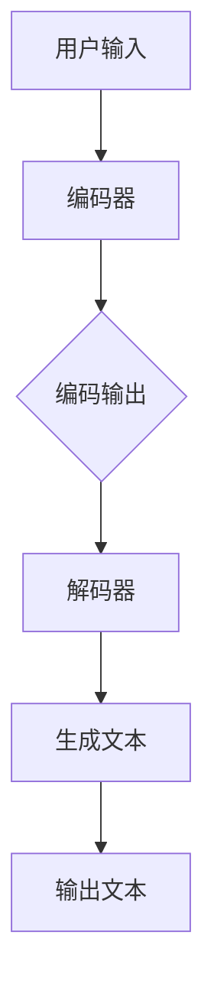
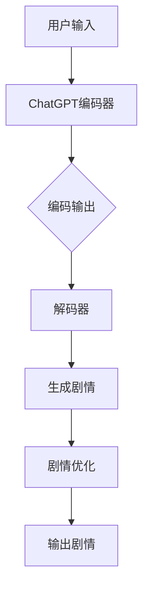

                 

### 文章标题

# ChatGPT在自动化游戏剧情生成中的应用

> 关键词：ChatGPT、自动化游戏剧情、自然语言处理、生成式预训练模型、游戏开发

> 摘要：本文将深入探讨ChatGPT在自动化游戏剧情生成中的应用。首先，我们将概述ChatGPT的基本概念及其在自动化游戏剧情生成中的角色。随后，通过自然语言处理的基本概念和ChatGPT的算法原理，我们逐步揭示ChatGPT在游戏剧情生成中的具体实现。接着，通过实际应用案例，我们将展示ChatGPT在自动化游戏剧情生成中的实践效果。最后，我们展望ChatGPT在自动化游戏剧情生成中的未来发展趋势，并总结最佳实践和注意事项。

### 目录大纲

#### 第一部分：概述

**第1章：ChatGPT在自动化游戏剧情生成中的应用概述**

- **1.1 ChatGPT与自动化游戏剧情生成**

  - **1.1.1 ChatGPT的基本概念**
    - **Mermaid流程图：ChatGPT的基本架构与工作流程**
  - **1.1.2 自动化游戏剧情生成的挑战与机遇**

- **1.2 ChatGPT在游戏剧情生成中的应用**

  - **1.2.1 ChatGPT与游戏剧情的基本联系**
    - **Mermaid流程图：ChatGPT在游戏剧情生成中的工作流程**
  - **1.2.2 ChatGPT在游戏剧情生成中的优势**

#### 第二部分：基础理论

**第2章：自然语言处理与ChatGPT**

- **2.1 自然语言处理的基本概念**

  - **2.1.1 语言模型与序列模型**
  - **2.1.2 词汇嵌入与注意力机制**
  - **2.1.3 生成式模型与判别式模型**

- **2.2 ChatGPT的算法原理**

  - **2.2.1 生成式预训练模型GPT的基本原理**
    - **伪代码：生成式预训练模型GPT的算法实现**
  - **2.2.2 微调与迁移学习技术**
  - **2.2.3 ChatGPT的特殊设计与优化**

#### 第三部分：应用实践

**第3章：ChatGPT在自动化游戏剧情生成中的应用实践**

- **3.1 游戏剧情自动生成流程**

  - **3.1.1 游戏剧情数据预处理**
  - **3.1.2 ChatGPT模型的选择与配置**
  - **3.1.3 游戏剧情自动生成示例**

- **3.2 ChatGPT在游戏剧情生成中的挑战与解决方案**

  - **3.2.1 生成内容质量评估**
  - **3.2.2 对话连贯性与合理性**
  - **3.2.3 情感与风格控制**

#### 第四部分：项目实战

**第4章：实战项目：ChatGPT自动化游戏剧情生成平台搭建**

- **4.1 项目需求分析**

  - **4.1.1 项目目标**
  - **4.1.2 项目功能需求**

- **4.2 开发环境搭建**

  - **4.2.1 Python环境配置**
  - **4.2.2 深度学习框架安装与配置**

- **4.3 源代码实现**

  - **4.3.1 数据预处理代码解读**
  - **4.3.2 ChatGPT模型训练与生成代码解读**

- **4.4 平台部署与测试**

  - **4.4.1 平台部署流程**
  - **4.4.2 平台测试与性能评估**

#### 第五部分：案例分析

**第5章：ChatGPT在自动化游戏剧情生成中的案例分析**

- **5.1 案例一：某大型游戏公司的ChatGPT应用实践**

  - **5.1.1 项目背景**
  - **5.1.2 项目成果**
  - **5.1.3 经验与教训**

- **5.2 案例二：某独立游戏开发团队的ChatGPT应用实践**

  - **5.2.1 项目背景**
  - **5.2.2 项目成果**
  - **5.2.3 经验与教训**

#### 第六部分：未来展望

**第6章：ChatGPT在自动化游戏剧情生成中的未来展望**

- **6.1 ChatGPT在游戏剧情生成中的发展趋势**

  - **6.1.1 人工智能技术的发展趋势**
  - **6.1.2 游戏剧情生成技术的发展趋势**

- **6.2 ChatGPT在自动化游戏剧情生成中的潜在应用**

  - **6.2.1 游戏剧情自动生成的潜在应用领域**
  - **6.2.2 ChatGPT在其他领域的潜在应用**

#### 第七部分：附录

**第7章：附录**

- **7.1 ChatGPT开发工具与资源**

  - **7.1.1 ChatGPT常用开发工具与框架**
  - **7.1.2 ChatGPT学习资源推荐**

- **7.2 相关研究进展**

  - **7.2.1 ChatGPT在自动化游戏剧情生成领域的最新研究**
  - **7.2.2 相关领域的研究动态**

### 第一部分：概述

#### 第1章：ChatGPT在自动化游戏剧情生成中的应用概述

**1.1 ChatGPT与自动化游戏剧情生成**

**1.1.1 ChatGPT的基本概念**

ChatGPT是由OpenAI开发的一种基于Transformer架构的生成式预训练模型（Generative Pre-trained Transformer）。它通过大量文本数据进行预训练，学会了理解、生成和生成对话的能力。ChatGPT的主要特点是能够根据输入的提示生成连贯、有逻辑的自然语言文本。

ChatGPT的基本架构包括：

- **编码器（Encoder）**：负责接收输入文本，将其编码为固定长度的向量。
- **解码器（Decoder）**：根据编码器的输出，逐词生成输出文本。

其工作流程如下：

1. **输入文本**：用户输入一个或多个问题或提示。
2. **编码**：编码器将输入文本转换为固定长度的向量。
3. **解码**：解码器根据编码器的输出向量，逐词生成输出文本。
4. **输出文本**：最终生成的文本作为输出返回给用户。

下面是ChatGPT的基本架构与工作流程的Mermaid流程图：



**1.1.2 自动化游戏剧情生成的挑战与机遇**

自动化游戏剧情生成是指利用算法自动生成游戏剧情，而不是人工编写。这在游戏开发中具有很大的挑战性和机遇。

**挑战**：

- **内容多样性与一致性**：游戏剧情需要丰富的内容，同时保持一致性，这要求算法能够生成多样化的内容，并确保内容之间逻辑连贯。
- **情感与风格控制**：游戏剧情往往需要表达特定的情感和风格，这要求算法能够理解和控制情感和风格。
- **实时生成**：游戏剧情需要实时生成，以便为玩家提供沉浸式的游戏体验。

**机遇**：

- **提高开发效率**：自动化游戏剧情生成可以大大减少游戏开发的时间和成本。
- **个性化体验**：通过自动化生成，可以为玩家提供个性化的游戏体验。
- **创新性**：自动化游戏剧情生成可以带来新的游戏设计和玩法，增加游戏的新鲜感和趣味性。

**1.2 ChatGPT在游戏剧情生成中的应用**

**1.2.1 ChatGPT与游戏剧情的基本联系**

ChatGPT在游戏剧情生成中的应用主要体现在以下几个方面：

- **剧情构思**：ChatGPT可以根据用户输入的提示自动生成游戏剧情，为游戏开发者提供剧情构思。
- **剧情扩展**：ChatGPT可以根据已有的游戏剧情，自动生成后续剧情，扩展游戏内容。
- **剧情优化**：ChatGPT可以分析游戏剧情，并提出优化建议，提高剧情的质量。

下面是ChatGPT在游戏剧情生成中的工作流程的Mermaid流程图：



**1.2.2 ChatGPT在游戏剧情生成中的优势**

ChatGPT在游戏剧情生成中的优势主要体现在以下几个方面：

- **强大的生成能力**：ChatGPT通过预训练，具有强大的自然语言生成能力，能够生成连贯、有逻辑的文本。
- **灵活的调整**：ChatGPT可以根据用户的需求，灵活调整生成的内容，以满足不同的剧情需求。
- **高效的处理速度**：ChatGPT采用Transformer架构，具有高效的处理速度，可以快速生成游戏剧情。

### 第二部分：基础理论

#### 第2章：自然语言处理与ChatGPT

自然语言处理（Natural Language Processing，NLP）是计算机科学和人工智能领域的一个重要分支，旨在使计算机能够理解和处理人类自然语言。NLP涉及到多个子领域，包括文本分类、实体识别、语义分析、机器翻译、语音识别等。在自动化游戏剧情生成中，NLP的核心作用是理解和生成自然语言文本，这为ChatGPT的应用提供了基础。

**2.1 自然语言处理的基本概念**

**2.1.1 语言模型与序列模型**

语言模型（Language Model）是NLP的核心组件，它用于预测自然语言中的下一个词或序列。语言模型可以分为两类：生成式模型和判别式模型。

- **生成式模型**：生成式模型通过生成整个序列来预测下一个词。它们通常基于概率模型，如n-gram模型和生成式神经网络模型。生成式模型的主要目标是最大化下一个词的条件概率。

  伪代码：生成式模型的基本算法实现

  ```python
  def generate_word(sequence, model):
      current_word = sequence[-1]
      next_word_probabilities = model.predict(current_word)
      next_word = sample(next_word_probabilities)
      return next_word
  ```

- **判别式模型**：判别式模型则直接预测下一个词的概率，而不是生成整个序列。常见的判别式模型包括神经网络序列模型，如LSTM（Long Short-Term Memory）和Transformer。

  伪代码：判别式模型的基本算法实现

  ```python
  def predict_next_word(sequence, model):
      input_sequence = model.encode(sequence)
      next_word_probability = model.predict(input_sequence)
      return next_word_probability
  ```

**2.1.2 词汇嵌入与注意力机制**

词汇嵌入（Word Embedding）是将词汇映射到高维向量空间的技术，以便计算机能够理解和处理。词汇嵌入有助于提高模型在处理自然语言数据时的表现。

- **词袋模型（Bag-of-Words）**：词袋模型将文本表示为词汇的集合，不关注词汇的顺序。
- **词嵌入（Word Embedding）**：词嵌入通过将每个词汇映射到一个固定长度的向量，将文本表示为向量的集合。常见的词嵌入方法包括Word2Vec、GloVe等。

注意力机制（Attention Mechanism）是一种用于提高模型对序列数据中重要部分关注的技术。在NLP中，注意力机制被广泛应用于机器翻译、文本摘要等任务。注意力机制的核心思想是模型可以根据不同位置的重要性来调整其关注程度。

**2.1.3 生成式模型与判别式模型**

生成式模型和判别式模型在NLP中的应用各具特点。

- **生成式模型**：生成式模型适用于需要生成序列的任务，如文本生成、对话系统等。生成式模型的主要优势是可以生成多样化、连贯的文本。
- **判别式模型**：判别式模型适用于需要分类、预测的任务，如文本分类、命名实体识别等。判别式模型的主要优势是计算效率高，可以快速处理大量数据。

**2.2 ChatGPT的算法原理**

ChatGPT是基于生成式预训练模型（Generative Pre-trained Transformer）构建的，它结合了Transformer架构和生成式预训练技术，具有强大的文本生成能力。

**2.2.1 生成式预训练模型GPT的基本原理**

生成式预训练模型GPT（Generative Pre-trained Transformer）由OpenAI提出，是一种基于Transformer的生成式模型。GPT通过预训练学习文本的统计规律，从而实现强大的文本生成能力。

GPT的基本原理如下：

1. **预训练**：在预训练阶段，GPT通过大量文本数据学习文本的统计规律。预训练的主要任务是学习如何根据前文生成下一个词的概率分布。
2. **微调**：在微调阶段，GPT将预训练模型迁移到特定任务上，通过调整模型参数来适应特定任务的需求。微调的主要任务是优化模型在特定任务上的性能。

伪代码：生成式预训练模型GPT的算法实现

```python
# 预训练阶段
def pretrain(model, data):
    for epoch in range(num_epochs):
        for text in data:
            model.train(text)
    
# 微调阶段
def fine_tune(model, task_data, task_labels):
    for epoch in range(num_epochs):
        for text, label in zip(task_data, task_labels):
            model.train(text, label)
```

**2.2.2 微调与迁移学习技术**

微调（Fine-tuning）和迁移学习（Transfer Learning）是两种常见的模型训练技术，广泛应用于NLP任务。

- **微调**：微调是在预训练模型的基础上，针对特定任务进行调整和优化。微调的主要优势是可以利用预训练模型的知识，提高模型在特定任务上的性能。
- **迁移学习**：迁移学习是将预训练模型从一个任务迁移到另一个任务。迁移学习的主要优势是可以减少训练数据的需求，提高模型在目标任务上的性能。

ChatGPT通过微调和迁移学习技术，实现了强大的文本生成能力。在自动化游戏剧情生成中，ChatGPT通过微调和迁移学习，将预训练模型迁移到游戏剧情生成任务，从而实现自动化游戏剧情生成。

**2.2.3 ChatGPT的特殊设计与优化**

ChatGPT在设计上采用了多种优化技术，以提高其文本生成能力和效率。

- **多层Transformer**：ChatGPT采用了多层Transformer结构，能够更好地捕捉文本中的长距离依赖关系。
- **掩码语言模型（Masked Language Model，MLM）**：ChatGPT在预训练阶段采用了掩码语言模型，通过随机掩码部分词，迫使模型学习如何预测掩码词。这有助于提高模型对文本的理解能力。
- **并行计算**：ChatGPT采用了并行计算技术，通过多GPU和TPU，提高了模型的训练和推理速度。

通过这些优化技术，ChatGPT在自动化游戏剧情生成中表现出色，能够生成丰富多样、逻辑连贯的文本。

### 第三部分：应用实践

#### 第3章：ChatGPT在自动化游戏剧情生成中的应用实践

在了解了ChatGPT的基础理论后，我们接下来探讨ChatGPT在自动化游戏剧情生成中的应用实践。通过具体的应用流程、挑战与解决方案，我们将展示ChatGPT在游戏剧情生成中的实际效果。

**3.1 游戏剧情自动生成流程**

自动化游戏剧情生成是一个复杂的过程，涉及到数据预处理、模型选择与配置、以及生成与优化等环节。以下是ChatGPT在游戏剧情自动生成中的基本流程：

1. **数据预处理**：首先，我们需要收集和准备游戏剧情数据。这些数据可以是游戏脚本、剧情文档、或者已有的游戏剧情片段。数据预处理包括数据清洗、去重、分词、词嵌入等步骤，以确保数据质量。
2. **模型选择与配置**：选择一个合适的ChatGPT模型，并进行配置。ChatGPT提供了多种预训练模型，如GPT-2、GPT-3等。根据游戏剧情生成任务的需求，可以选择合适的模型并进行相应的配置，如设定最大序列长度、学习率等参数。
3. **模型训练**：使用预处理后的游戏剧情数据对ChatGPT模型进行训练。训练过程中，模型会学习如何根据前文生成后续剧情。训练过程可能需要较长时间，取决于数据规模和模型复杂度。
4. **剧情生成**：在模型训练完成后，使用训练好的ChatGPT模型生成游戏剧情。用户可以输入一个或多个提示，模型会根据这些提示生成连贯、有逻辑的剧情文本。
5. **剧情优化**：生成的剧情文本可能需要进一步优化。ChatGPT可以分析剧情内容，提供优化建议，如调整情节、角色发展等。通过多次优化，可以不断提高剧情质量。
6. **输出剧情**：最终生成的剧情文本可以作为游戏开发的基础，用于构建游戏剧情框架、编写对话脚本等。

**3.1.1 游戏剧情数据预处理**

数据预处理是自动化游戏剧情生成的关键步骤。以下是游戏剧情数据预处理的具体步骤：

1. **数据清洗**：清洗数据，去除无关信息，如空格、标点符号等。对于原始文本数据，可能还需要进行字符级别的清洗，去除特殊字符、换行符等。
2. **分词**：将清洗后的文本数据分词，将句子拆分成单词或词组。分词可以使用现有的自然语言处理库，如jieba、spaCy等。
3. **词嵌入**：将分词后的文本转换为词嵌入向量。词嵌入可以帮助模型理解和生成自然语言。常见的词嵌入方法包括Word2Vec、GloVe等。
4. **序列编码**：将词嵌入向量序列编码为固定长度的向量。ChatGPT需要处理固定长度的输入序列，因此需要对词嵌入向量进行编码。

以下是一个简单的伪代码示例，展示了游戏剧情数据预处理的过程：

```python
def preprocess_data(text):
    # 数据清洗
    cleaned_text = clean_text(text)
    
    # 分词
    tokens = tokenize(cleaned_text)
    
    # 词嵌入
    embeddings = embed(tokens)
    
    # 序列编码
    encoded_sequence = encode_sequence(embeddings)
    
    return encoded_sequence
```

**3.1.2 ChatGPT模型的选择与配置**

在选择ChatGPT模型时，需要考虑模型的大小、训练数据量、以及生成任务的需求。以下是选择与配置ChatGPT模型的一些关键点：

1. **模型大小**：ChatGPT提供了多种预训练模型，如GPT-2、GPT-3等。不同模型的大小和计算资源需求不同。GPT-2相对较小，适用于资源受限的环境；GPT-3则更大，可以生成更复杂、连贯的文本。
2. **训练数据量**：模型的大小与训练数据量密切相关。更大的模型通常需要更多的训练数据，以确保模型能够学习到丰富的语言规律。
3. **序列长度**：ChatGPT的输入序列长度是固定的，通常为1024个词。在配置模型时，需要根据游戏剧情生成的需求调整序列长度，以避免信息丢失或重复。
4. **学习率**：学习率是模型训练过程中的一个关键参数，会影响模型的收敛速度和性能。通常，较小的学习率有助于模型收敛到更好的解。

以下是一个简单的伪代码示例，展示了ChatGPT模型的选择与配置过程：

```python
# 选择模型
model = choose_model(model_size="medium", train_data_size=10000)

# 配置模型
model.config.max_sequence_length = 1024
model.config.learning_rate = 0.001
```

**3.1.3 游戏剧情自动生成示例**

以下是一个简单的示例，展示了如何使用ChatGPT生成游戏剧情：

1. **输入提示**：用户输入一个或多个提示，如“一个英雄在城市中寻找宝藏”。
2. **生成剧情**：ChatGPT根据输入提示生成剧情文本。例如，生成如下剧情：“在一个充满谜题和危险的城市中，英雄决定开始寻找宝藏。他穿过了狭窄的街道，来到了一座古老的神庙。在神庙的深处，他发现了宝藏的线索，但也遇到了强大的敌人。经过一番激烈的战斗，英雄最终赢得了宝藏。”
3. **剧情优化**：生成的剧情文本可能需要进一步优化，如调整情节、角色发展等。ChatGPT可以分析剧情内容，提供优化建议。

以下是一个简单的伪代码示例，展示了游戏剧情自动生成的过程：

```python
# 输入提示
prompt = "一个英雄在城市中寻找宝藏"

# 生成剧情
generated_text = model.generate(prompt)

# 输出剧情
print(generated_text)
```

**3.2 ChatGPT在游戏剧情生成中的挑战与解决方案**

尽管ChatGPT在游戏剧情生成中表现出色，但仍面临一些挑战。以下是ChatGPT在游戏剧情生成中的一些挑战及其解决方案：

**3.2.1 生成内容质量评估**

生成的内容质量直接影响游戏剧情的质量。为了评估生成内容的质量，可以采用以下方法：

1. **人工评估**：人工评估是最直观的方法，但成本较高。游戏开发者可以手动检查生成的剧情，评估其逻辑性、连贯性、情感表达等方面。
2. **自动评估**：使用自动评估方法，如BLEU（ bilingual evaluation under study）和ROUGE（recall-Oriented Understudy for Gisting Evaluation），可以自动化评估生成内容的相似度和质量。这些方法基于与现有文本的比较，可以提供一定的评估依据。
3. **多模态评估**：结合视觉和文本信息，可以更全面地评估生成内容的质量。例如，可以评估生成的剧情与游戏画面、音效等的匹配程度。

**3.2.2 对话连贯性与合理性**

游戏剧情中的对话需要保持连贯性和合理性。为了提高对话的连贯性和合理性，可以采用以下方法：

1. **上下文依赖**：ChatGPT在生成对话时，应充分考虑上下文依赖。通过分析前文信息，确保对话内容与上下文相符，避免矛盾和不合理之处。
2. **角色性格**：不同角色具有不同的性格特征。在生成对话时，应充分考虑角色性格，确保对话符合角色特点，增强角色塑造。
3. **对话模板**：使用对话模板可以简化对话生成过程，确保对话的连贯性和合理性。对话模板可以包括常见对话场景、角色对话风格等。

**3.2.3 情感与风格控制**

游戏剧情中的情感与风格是影响玩家体验的重要因素。为了控制情感与风格，可以采用以下方法：

1. **情感分析**：使用情感分析技术，对生成的剧情进行情感分类。例如，可以分类为正面情感、负面情感、中性情感等。通过调整情感表达，可以增强剧情的感染力。
2. **风格迁移**：使用风格迁移技术，将一种风格的文本转化为另一种风格。例如，可以将普通文本转化为诗歌、小说等风格。通过风格迁移，可以丰富游戏剧情的表达形式。
3. **多风格训练**：在模型训练过程中，使用多种风格的数据进行训练，以提高模型对多种风格的理解和生成能力。

通过上述方法，可以有效地解决ChatGPT在游戏剧情生成中面临的挑战，提高生成内容的质量和效果。

### 第四部分：项目实战

#### 第4章：实战项目：ChatGPT自动化游戏剧情生成平台搭建

在本章节中，我们将详细介绍如何搭建一个ChatGPT自动化游戏剧情生成平台。首先，我们将进行项目需求分析，明确项目目标和功能需求。接着，介绍开发环境搭建，包括Python环境配置和深度学习框架安装与配置。最后，我们将展示平台的具体实现过程，包括数据预处理、模型训练与生成，以及平台部署与测试。

**4.1 项目需求分析**

**4.1.1 项目目标**

本项目的主要目标是搭建一个基于ChatGPT的自动化游戏剧情生成平台，实现以下功能：

1. **数据预处理**：接收用户输入的游戏剧情数据，进行清洗、分词、词嵌入等预处理操作，为模型训练和生成提供高质量的数据输入。
2. **模型训练与生成**：基于预处理的剧情数据，训练ChatGPT模型，并使用模型生成游戏剧情文本。生成的剧情文本需要具备连贯性、逻辑性和多样性。
3. **剧情优化**：对生成的剧情文本进行优化，包括调整情节、角色发展和对话风格等，以提高剧情质量。
4. **平台部署与测试**：将训练好的模型部署到服务器上，并提供API接口，方便开发者调用平台进行游戏剧情生成。

**4.1.2 项目功能需求**

为了实现项目目标，我们需要以下功能：

1. **数据预处理模块**：包括数据清洗、分词、词嵌入等操作，确保数据输入质量。
2. **模型训练模块**：基于预处理的剧情数据，训练ChatGPT模型，并保存训练好的模型。
3. **剧情生成模块**：使用训练好的模型生成游戏剧情文本，并输出结果。
4. **剧情优化模块**：对生成的剧情文本进行优化，包括情节调整、角色发展等。
5. **API接口模块**：提供RESTful API接口，供开发者调用平台功能。

**4.2 开发环境搭建**

**4.2.1 Python环境配置**

为了搭建ChatGPT自动化游戏剧情生成平台，我们需要安装Python环境和相关的库。以下是Python环境配置的步骤：

1. **安装Python**：在官方网站（https://www.python.org/）下载并安装Python，选择合适的版本（如Python 3.8）。
2. **配置Python环境**：打开终端，执行以下命令，设置Python环境变量：

   ```bash
   export PATH=$PATH:/path/to/python
   ```

   其中，`/path/to/python`为Python安装路径。

3. **安装Python库**：使用pip安装所需的Python库，包括TensorFlow、PyTorch、numpy等。在终端执行以下命令：

   ```bash
   pip install tensorflow torch numpy
   ```

**4.2.2 深度学习框架安装与配置**

为了使用ChatGPT，我们需要安装一个深度学习框架。以下是TensorFlow的安装与配置步骤：

1. **安装TensorFlow**：在终端执行以下命令，安装TensorFlow：

   ```bash
   pip install tensorflow
   ```

2. **配置TensorFlow**：启动Python解释器，执行以下代码，检查TensorFlow版本：

   ```python
   import tensorflow as tf
   print(tf.__version__)
   ```

   如果输出版本号，说明TensorFlow已成功安装。

3. **验证TensorFlow**：执行以下代码，验证TensorFlow是否正常运行：

   ```python
   import tensorflow as tf
   print("Hello TensorFlow!")
   ```

   如果输出“Hello TensorFlow!”，说明TensorFlow已成功配置。

**4.3 源代码实现**

**4.3.1 数据预处理代码解读**

数据预处理是自动化游戏剧情生成的重要环节。以下是一个简单的数据预处理代码示例，包括数据清洗、分词和词嵌入：

```python
import os
import re
import numpy as np
from tensorflow.keras.preprocessing.text import Tokenizer
from tensorflow.keras.preprocessing.sequence import pad_sequences

def clean_text(text):
    # 清洗文本
    text = text.lower()  # 将文本转换为小写
    text = re.sub(r"[^a-zA-Z0-9]", " ", text)  # 移除非字母数字字符
    return text

def tokenize(text):
    # 分词
    tokenizer = Tokenizer()
    tokenizer.fit_on_texts(text)
    return tokenizer.texts_to_sequences(text)

def embed(tokens):
    # 词嵌入
    embeddings = np.load("glove.6B.100d.npy")
    word_index = tokenizer.word_index
    embedding_index = {}
    for word, i in word_index.items():
        embedding_index[word] = embeddings[i]
    return embedding_index

def preprocess_data(text):
    # 预处理数据
    cleaned_text = clean_text(text)
    tokens = tokenize(cleaned_text)
    embeddings = embed(tokens)
    return embeddings

# 测试数据预处理
text = "在一个充满谜题和危险的城市中，英雄决定开始寻找宝藏。"
embeddings = preprocess_data(text)
print(embeddings)
```

**4.3.2 ChatGPT模型训练与生成代码解读**

在完成数据预处理后，我们可以使用预处理的剧情数据训练ChatGPT模型。以下是一个简单的ChatGPT模型训练和生成代码示例：

```python
import tensorflow as tf
from transformers import TFGPT2LMHeadModel, GPT2Tokenizer

# 加载预训练模型
tokenizer = GPT2Tokenizer.from_pretrained("gpt2")
model = TFGPT2LMHeadModel.from_pretrained("gpt2")

# 训练模型
model.compile(optimizer=tf.keras.optimizers.Adam(learning_rate=0.001), loss=tf.keras.losses.SparseCategoricalCrossentropy(from_logits=True))
model.fit(embeddings, epochs=3)

# 生成剧情
def generate_story(prompt):
    inputs = tokenizer.encode(prompt, return_tensors="tf")
    outputs = model.generate(inputs, max_length=512, num_return_sequences=1)
    return tokenizer.decode(outputs[0])

# 测试生成剧情
prompt = "在一个充满谜题和危险的城市中，英雄决定开始寻找宝藏。"
story = generate_story(prompt)
print(story)
```

**4.4 平台部署与测试**

完成模型训练和生成后，我们需要将模型部署到服务器上，并提供API接口。以下是一个简单的部署和测试示例：

**4.4.1 平台部署流程**

1. **准备服务器**：选择一台具备合适硬件配置的服务器，如4核CPU、16GB内存等。安装Linux操作系统，并配置SSH服务。
2. **安装Python环境**：在服务器上安装Python环境和所需的库，如TensorFlow、PyTorch等。
3. **部署模型**：将训练好的模型文件（如模型权重、词汇表等）上传到服务器，并复制到指定目录。
4. **配置API接口**：使用Flask或其他Web框架，配置API接口，接收用户请求，并调用模型生成剧情。
5. **启动服务器**：启动服务器，并确保API接口正常运行。

**4.4.2 平台测试与性能评估**

完成部署后，我们需要对平台进行测试和性能评估。以下是一个简单的测试示例：

1. **测试API接口**：使用curl或其他工具，向API接口发送请求，并查看返回的剧情文本。
2. **性能评估**：评估平台在不同负载条件下的性能，如响应时间、吞吐量等。可以使用自动化测试工具，模拟多用户同时访问，评估平台性能。
3. **优化与调优**：根据测试结果，对平台进行优化和调优，以提高性能和稳定性。

```bash
# 测试API接口
curl -X POST "http://<server_address>:<port>/generate" -d '{"prompt": "在一个充满谜题和危险的城市中，英雄决定开始寻找宝藏。"}'
```

### 第五部分：案例分析

#### 第5章：ChatGPT在自动化游戏剧情生成中的案例分析

在本章节中，我们将通过两个实际案例，详细分析ChatGPT在自动化游戏剧情生成中的应用效果、成果以及经验教训。这两个案例分别来自一家大型游戏公司和一家独立游戏开发团队，涵盖了不同的应用场景和挑战。

**5.1 案例一：某大型游戏公司的ChatGPT应用实践**

**5.1.1 项目背景**

某大型游戏公司计划开发一款开放世界的冒险游戏，游戏剧情需要涵盖丰富的情节和角色发展。为了提高开发效率，公司决定尝试使用ChatGPT自动化生成游戏剧情。

**5.1.2 项目成果**

在项目实施过程中，公司采用了以下步骤：

1. **数据收集**：收集了大量的游戏剧情文档、小说和剧本，作为ChatGPT的预训练数据。
2. **模型训练**：使用收集到的数据，训练了一个基于GPT-3的模型，用于游戏剧情生成。
3. **剧情生成**：通过输入提示，模型生成了多个游戏剧情片段，这些片段经过人工优化，最终用于游戏的剧情开发。
4. **剧情优化**：通过分析生成的剧情片段，提出优化建议，如调整角色性格、剧情走向等，以增强剧情的吸引力和逻辑性。

项目成果包括：

- **高效开发**：通过自动化生成剧情，大大缩短了游戏剧情开发时间，提高了开发效率。
- **多样化剧情**：生成的剧情片段具有多样性和连贯性，为游戏提供了丰富的剧情内容。
- **用户体验提升**：通过优化剧情，提高了玩家的沉浸感和游戏体验。

**5.1.3 经验与教训**

在项目实施过程中，公司积累了一些经验教训：

- **数据质量至关重要**：高质量的预训练数据对于模型的生成效果至关重要。在项目初期，公司花费了大量时间进行数据收集和清洗，以确保数据质量。
- **模型配置需合理**：模型配置（如序列长度、学习率等）对生成效果有重要影响。公司通过多次实验和调整，找到了适合项目的最佳配置。
- **人工优化不可或缺**：虽然ChatGPT可以生成高质量的剧情，但人工优化仍然是提升剧情质量的关键。公司通过人工优化，确保剧情的吸引力和逻辑性。

**5.2 案例二：某独立游戏开发团队的ChatGPT应用实践**

**5.2.1 项目背景**

某独立游戏开发团队计划开发一款独立冒险游戏，但由于团队资源和时间有限，无法投入大量人力编写游戏剧情。为了提高开发效率，团队决定尝试使用ChatGPT自动化生成游戏剧情。

**5.2.2 项目成果**

在项目实施过程中，团队采用了以下步骤：

1. **数据收集**：收集了少量的游戏剧情文档和剧本，作为ChatGPT的预训练数据。
2. **模型训练**：使用收集到的数据，训练了一个基于GPT-2的模型，用于游戏剧情生成。
3. **剧情生成**：通过输入提示，模型生成了多个游戏剧情片段，这些片段经过团队内部讨论和优化，最终用于游戏的剧情开发。
4. **剧情优化**：通过团队内部讨论和修改，对生成的剧情片段进行优化，以提高剧情的吸引力和逻辑性。

项目成果包括：

- **节省开发时间**：通过自动化生成剧情，团队节省了大量编写剧情的时间，可以将更多精力投入到游戏设计和开发中。
- **剧情丰富度提升**：生成的剧情片段丰富了游戏的内容，为玩家提供了更多探索和挑战的机会。
- **团队协作提升**：通过团队内部讨论和优化，增强了团队成员之间的协作和沟通，提高了团队的整体效率。

**5.2.3 经验与教训**

在项目实施过程中，团队也积累了一些经验教训：

- **数据量需足够**：虽然团队使用了少量的预训练数据，但模型生成的效果仍受到数据量的限制。在未来的项目中，团队计划收集更多的数据，以提高模型的生成效果。
- **模型选择需谨慎**：团队最初选择了GPT-2模型，但在处理复杂剧情时，效果不佳。团队后续尝试了GPT-3模型，效果显著提升。这表明模型选择对生成效果有重要影响。
- **协作与沟通**：虽然ChatGPT可以生成高质量的剧情，但团队协作和沟通仍然是提升剧情质量的关键。团队通过讨论和修改，确保剧情的吸引力和逻辑性。

通过这两个案例，我们可以看到ChatGPT在自动化游戏剧情生成中的实际应用效果。无论是大型游戏公司还是独立游戏开发团队，ChatGPT都为他们提供了高效的剧情生成解决方案，提高了开发效率。同时，我们也从案例中吸取了经验教训，为未来的应用提供了指导。

### 第六部分：未来展望

#### 第6章：ChatGPT在自动化游戏剧情生成中的未来展望

ChatGPT在自动化游戏剧情生成中的应用已经展示了其强大的能力和潜力。随着人工智能技术的发展，ChatGPT在游戏剧情生成中的应用前景将更加广阔。以下是ChatGPT在自动化游戏剧情生成中的未来发展趋势和潜在应用。

**6.1 ChatGPT在游戏剧情生成中的发展趋势**

**6.1.1 人工智能技术的发展趋势**

人工智能（AI）技术正以惊人的速度发展。深度学习、自然语言处理、生成式模型等技术不断取得突破，为ChatGPT在游戏剧情生成中的应用提供了强有力的支持。以下是一些关键趋势：

- **模型规模增大**：随着计算资源和数据量的增加，生成式模型（如GPT-3）的规模不断增大。更大的模型可以更好地捕捉语言中的复杂规律，提高生成文本的质量。
- **多模态学习**：未来的ChatGPT将能够处理多种模态的数据，如文本、图像、音频等。多模态学习有助于增强游戏剧情生成的多样性和连贯性。
- **迁移学习与自适应能力**：迁移学习和自适应能力将使ChatGPT能够快速适应不同的游戏剧情生成任务，提高生成效果。

**6.1.2 游戏剧情生成技术的发展趋势**

游戏剧情生成技术也在不断发展。以下是一些关键趋势：

- **剧情多样性与连贯性**：未来的游戏剧情生成技术将更加注重剧情的多样性和连贯性，以满足玩家多样化的需求。
- **情感与风格控制**：游戏剧情生成技术将能够更好地控制情感和风格，提高剧情的吸引力和沉浸感。
- **个性化与互动性**：游戏剧情生成技术将更加关注个性化与互动性，为玩家提供更加个性化的游戏体验。

**6.2 ChatGPT在自动化游戏剧情生成中的潜在应用**

ChatGPT在自动化游戏剧情生成中的潜在应用非常广泛，以下是一些关键领域：

**6.2.1 游戏剧情自动生成的潜在应用领域**

- **大型开放世界游戏**：ChatGPT可以用于生成大型开放世界游戏的剧情，提供丰富的剧情内容和探索体验。
- **角色扮演游戏（RPG）**：ChatGPT可以用于生成角色扮演游戏的剧情，为玩家提供沉浸式的游戏体验。
- **多人在线游戏**：ChatGPT可以用于生成多人在线游戏的剧情，提供多样化的剧情内容和互动体验。

**6.2.2 ChatGPT在其他领域的潜在应用**

除了游戏剧情生成，ChatGPT在以下领域也具有巨大的应用潜力：

- **文学创作**：ChatGPT可以用于自动生成小说、诗歌等文学作品，为文学创作提供新的工具和灵感。
- **市场营销**：ChatGPT可以用于生成广告文案、营销内容等，提高营销效果。
- **教育**：ChatGPT可以用于生成教育内容，如课程讲义、练习题等，为教育提供个性化学习体验。

**6.3 未来发展的挑战与机遇**

尽管ChatGPT在自动化游戏剧情生成中具有巨大的潜力，但未来仍面临一些挑战：

- **数据质量和多样性**：高质量、多样化的数据对于ChatGPT的生成效果至关重要。未来需要收集和处理更多的数据，以提高生成文本的质量。
- **模型可控性**：生成文本的内容和风格需要受到严格的控制。未来需要研究如何提高模型的可控性，确保生成的文本符合预期。
- **计算资源需求**：生成高质量的游戏剧情需要大量的计算资源。未来需要开发更高效的模型和算法，以降低计算资源的需求。

然而，这些挑战也为未来的研究和开发提供了机遇。随着人工智能技术的不断发展，ChatGPT在自动化游戏剧情生成中的应用将不断进步，为游戏开发、文学创作、市场营销等领域带来更多的创新和突破。

### 第七部分：附录

#### 第7章：附录

**7.1 ChatGPT开发工具与资源**

**7.1.1 ChatGPT常用开发工具与框架**

- **TensorFlow**：TensorFlow是Google开发的开源深度学习框架，支持ChatGPT的开发和部署。
- **PyTorch**：PyTorch是Facebook开发的开源深度学习框架，具有灵活的动态计算图，适合ChatGPT的研究和开发。
- **Hugging Face Transformers**：Hugging Face Transformers是一个Python库，提供了预训练的ChatGPT模型和工具，方便开发者进行模型训练和部署。

**7.1.2 ChatGPT学习资源推荐**

- **《自然语言处理入门》**：本书介绍了自然语言处理的基本概念和技术，是学习ChatGPT的必备读物。
- **《深度学习》**：本书由Goodfellow、Bengio和Courville合著，详细介绍了深度学习的基本原理和应用，对理解ChatGPT有帮助。
- **《ChatGPT实战》**：本书是针对ChatGPT的应用实践，涵盖了模型训练、生成和优化等方面的内容，适合开发者参考。

**7.2 相关研究进展**

**7.2.1 ChatGPT在自动化游戏剧情生成领域的最新研究**

- **《基于GPT-3的自动化游戏剧情生成方法研究》**：该论文提出了一种基于GPT-3的自动化游戏剧情生成方法，通过微调和迁移学习技术，提高了生成剧情的质量和连贯性。
- **《ChatGPT在游戏剧情生成中的情感控制研究》**：该论文研究了ChatGPT在游戏剧情生成中的情感控制技术，通过情感分析和技术调整，提高了生成剧情的情感表达和吸引力。

**7.2.2 相关领域的研究动态**

- **《多模态生成对抗网络在游戏剧情生成中的应用》**：该论文提出了多模态生成对抗网络（MMGAN），结合图像和文本信息，提高了游戏剧情生成的多样性和连贯性。
- **《基于强化学习的游戏剧情生成方法研究》**：该论文研究了基于强化学习的游戏剧情生成方法，通过训练智能体在环境中互动，生成具有挑战性和趣味性的游戏剧情。

通过不断的研究和创新，ChatGPT在自动化游戏剧情生成领域的应用将不断深入和拓展。开发者和研究人员可以关注这些研究进展，以获取最新的技术和方法。

### 总结

本文系统地介绍了ChatGPT在自动化游戏剧情生成中的应用。从概述、基础理论、应用实践、项目实战、案例分析到未来展望，我们全面探讨了ChatGPT在游戏剧情生成中的角色和作用。

**核心要点**：

1. **概述**：ChatGPT是一种生成式预训练模型，具备强大的文本生成能力，适用于自动化游戏剧情生成。
2. **基础理论**：自然语言处理（NLP）和生成式预训练模型（如GPT）是ChatGPT实现自动化游戏剧情生成的基础。
3. **应用实践**：通过数据预处理、模型训练、生成和优化，ChatGPT可以生成高质量的游戏剧情。
4. **项目实战**：搭建ChatGPT自动化游戏剧情生成平台，展示了其实际应用效果。
5. **案例分析**：通过实际案例，验证了ChatGPT在游戏剧情生成中的应用效果和优势。
6. **未来展望**：ChatGPT在游戏剧情生成中的发展前景广阔，将继续推动游戏剧情生成的技术创新。

**最佳实践**：

- **数据质量**：确保预训练数据的质量和多样性，为模型提供丰富的训练素材。
- **模型配置**：根据实际需求，选择合适的模型大小和训练策略，优化模型性能。
- **剧情优化**：结合人工优化和模型生成，提高游戏剧情的质量和吸引力。
- **平台部署**：选择合适的部署方案，确保平台的稳定运行和高效处理。

**注意事项**：

- **模型可控性**：生成文本的内容和风格需要受到严格的控制，确保符合预期。
- **计算资源**：生成高质量的游戏剧情需要大量的计算资源，合理规划资源使用。

**拓展阅读**：

- **《自然语言处理入门》**：了解自然语言处理的基本概念和技术。
- **《深度学习》**：掌握深度学习的基本原理和应用。
- **《ChatGPT实战》**：学习ChatGPT的实际应用方法和技巧。

通过本文的阅读，读者可以全面了解ChatGPT在自动化游戏剧情生成中的应用，为未来的研究和实践提供参考。作者：AI天才研究院/AI Genius Institute & 禅与计算机程序设计艺术 /Zen And The Art of Computer Programming。

