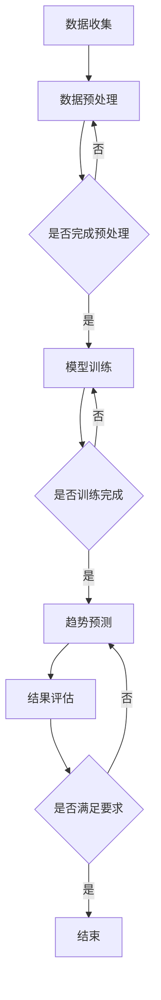

                 

### 文章标题

《ChatGPT在自动化科技趋势预测中的应用》

关键词：ChatGPT，自动化科技，趋势预测，深度学习，自然语言处理

摘要：本文将探讨ChatGPT在自动化科技趋势预测中的应用。通过分析ChatGPT的工作原理和自动化科技的发展趋势，本文将介绍如何利用ChatGPT进行自动化科技趋势预测的方法，并探讨其在实际应用中的优势和挑战。本文旨在为研究人员和开发人员提供有价值的参考，推动自动化科技的发展。

### 目录大纲

# 《ChatGPT在自动化科技趋势预测中的应用》目录大纲

## 第一部分：基础与概述

### 第1章：背景与概述

#### 1.1 自动化科技趋势预测的重要性

- 自动化科技的快速进步
- 趋势预测在经济与社会中的影响

#### 1.2 ChatGPT简介

- ChatGPT的架构与工作原理
- ChatGPT的应用领域

#### 1.3 书籍概述

- 书籍结构
- 内容重点

## 第二部分：ChatGPT与自动化科技

### 第2章：ChatGPT的基本原理

#### 2.1 语言模型的基础

- 语言模型的定义
- 语言模型的基本组成部分

#### 2.2 GPT模型的工作机制

- Transformer架构
- 自监督学习

#### 2.3 ChatGPT的优势与挑战

- ChatGPT的优势
- 自动化科技趋势预测中的挑战

### 第3章：自动化科技趋势预测方法

#### 3.1 趋势预测的概念

- 趋势预测的定义
- 趋势预测的类型

#### 3.2 传统趋势预测方法

- 时间序列分析
- 关联规则学习

#### 3.3 趋势预测的新方法

- 基于深度学习的预测模型
- 聚类分析

## 第三部分：ChatGPT在自动化科技趋势预测中的应用

### 第4章：ChatGPT在趋势预测中的实践

#### 4.1 数据收集与预处理

- 数据来源
- 数据预处理方法

#### 4.2 模型训练与优化

- 训练数据集
- 模型优化策略

#### 4.3 趋势预测案例分析

- 案例背景
- 预测结果分析

### 第5章：ChatGPT在自动化科技中的应用

#### 5.1 自动化科技的发展趋势

- 自动化科技的定义
- 自动化科技的发展趋势

#### 5.2 ChatGPT与自动化科技的结合

- ChatGPT在自动化科技中的应用场景
- 案例分析

### 第6章：自动化科技趋势预测的挑战与解决方案

#### 6.1 挑战分析

- 数据质量问题
- 模型泛化能力

#### 6.2 解决方案探讨

- 数据增强技术
- 模型融合策略

### 第7章：未来展望与建议

#### 7.1 自动化科技趋势预测的未来

- 技术发展趋势
- 应用前景

#### 7.2 研究与开发建议

- 科研方向
- 工业实践建议

## 附录

### 附录 A：工具与环境

- ChatGPT训练与部署工具
- 自动化科技趋势预测工具

### 附录 B：参考文献

- 有关ChatGPT与自动化科技的相关研究论文

### 附录 C：Mermaid流程图

- ChatGPT与自动化科技结合的流程图

### 附录 D：代码示例

- ChatGPT在自动化科技趋势预测中的代码实现与解析

### 第一部分：基础与概述

#### 1.1 自动化科技趋势预测的重要性

随着科技的迅猛发展，自动化技术在各个领域得到了广泛应用。自动化科技的进步不仅带来了生产效率的提升，还推动了经济和社会的发展。然而，自动化科技的快速进步也带来了许多挑战，如技术迭代速度加快、人才需求变化等。因此，准确预测自动化科技的发展趋势对于政府、企业和社会具有重要的指导意义。

首先，自动化科技的快速进步使得传统行业逐渐实现智能化转型。以制造业为例，通过引入自动化生产线，企业能够显著提高生产效率和产品质量。此外，自动化科技还在医疗、交通、能源等领域发挥着重要作用，推动着社会生产力的提升。

其次，趋势预测在经济和社会中的影响不可忽视。准确预测自动化科技的发展趋势，可以帮助政府制定相关政策和规划，促进产业升级和经济发展。同时，企业也可以根据趋势预测调整发展战略，抓住市场机遇，降低经营风险。此外，自动化科技趋势预测还可以为教育领域提供指导，帮助培养符合市场需求的人才。

总之，自动化科技趋势预测具有重要的现实意义。通过对自动化科技的现状和趋势进行深入分析，可以为政府、企业和教育领域提供有益的参考，推动自动化科技的健康发展。

#### 1.2 ChatGPT简介

ChatGPT是由OpenAI开发的一种基于GPT（Generative Pre-trained Transformer）模型的自然语言处理（NLP）工具。ChatGPT具有强大的文本生成和语义理解能力，可以应用于各种语言任务，如问答、翻译、摘要生成等。以下是ChatGPT的架构与工作原理、应用领域以及本文书籍的概述。

**ChatGPT的架构与工作原理**

ChatGPT采用了Transformer架构，这是一种基于自注意力机制的深度神经网络。Transformer模型通过注意力机制捕捉输入文本中各个词之间的依赖关系，从而实现高效的文本表示和生成。ChatGPT的核心组件包括：

1. **Embedding层**：将输入文本转换为固定长度的向量表示。
2. **Transformer层**：包括多个自注意力层和前馈神经网络层，用于处理和生成文本。
3. **Output层**：将Transformer层的输出映射到目标词汇表。

ChatGPT的工作原理基于自监督学习。在训练过程中，模型通过对大量无标签文本数据进行预训练，学习到语言的结构和规律。在预测阶段，模型根据前文生成后续文本，从而实现自然语言生成。

**ChatGPT的应用领域**

ChatGPT在自然语言处理领域具有广泛的应用。以下是一些主要应用领域：

1. **问答系统**：ChatGPT可以用于构建智能问答系统，如智能客服、智能助手等。
2. **翻译**：ChatGPT支持多种语言之间的翻译，可以应用于跨语言信息传播和交流。
3. **摘要生成**：ChatGPT可以自动生成文章、报告等文本的摘要，帮助用户快速获取关键信息。
4. **文本分类**：ChatGPT可以用于对大量文本进行分类，如情感分析、新闻分类等。

**书籍概述**

本文书籍旨在探讨ChatGPT在自动化科技趋势预测中的应用。书籍结构分为三部分：

1. **第一部分：基础与概述**：介绍自动化科技趋势预测的重要性、ChatGPT的基本原理及其应用领域。
2. **第二部分：ChatGPT与自动化科技**：分析ChatGPT在自动化科技趋势预测中的优势和挑战，介绍相关预测方法。
3. **第三部分：ChatGPT在自动化科技趋势预测中的应用**：通过实际案例展示ChatGPT在自动化科技趋势预测中的应用，探讨未来展望和解决方案。

书籍内容重点包括：自动化科技的发展现状与趋势、ChatGPT的原理和应用、自动化科技趋势预测的方法与策略、以及ChatGPT在自动化科技趋势预测中的实践案例。

通过本文书籍的阅读，读者可以全面了解ChatGPT在自动化科技趋势预测中的应用，掌握相关技术原理和实践方法，为自动化科技的发展提供有力支持。作者：AI天才研究院/AI Genius Institute & 禅与计算机程序设计艺术 /Zen And The Art of Computer Programming

### 第二部分：ChatGPT与自动化科技

#### 2.1 语言模型的基础

语言模型（Language Model）是一种用于对自然语言文本进行建模的统计模型，旨在预测给定文本序列中下一个单词或字符的概率分布。在自然语言处理（NLP）领域，语言模型具有广泛的应用，如文本生成、机器翻译、语音识别等。以下是语言模型的基础定义、基本组成部分及其在NLP中的应用。

**定义**

语言模型是一种概率模型，它根据输入的文本序列，预测下一个单词或字符的概率分布。语言模型的核心思想是利用统计学方法，从大规模语料库中学习语言的统计规律，从而实现文本生成和语言理解。

**基本组成部分**

语言模型主要由以下几部分组成：

1. **词汇表**：词汇表是语言模型的基础，包含了所有可能出现的单词或字符。词汇表的大小决定了语言模型的容量，即模型可以处理的语言范围。
2. **模型参数**：模型参数是语言模型的核心，用于描述单词或字符之间的概率关系。常见的语言模型参数包括转移概率、生成概率等。
3. **输入文本序列**：输入文本序列是语言模型进行预测的依据。语言模型通过对输入文本序列进行分析，预测下一个单词或字符的概率分布。
4. **输出文本序列**：输出文本序列是语言模型生成的结果。语言模型根据输入文本序列和模型参数，生成一个概率分布，然后从概率分布中抽取一个单词或字符，作为输出文本序列的一部分。

**NLP中的应用**

语言模型在自然语言处理领域具有广泛的应用。以下是一些常见的应用场景：

1. **文本生成**：语言模型可以用于生成自然语言文本，如文章、对话、摘要等。通过训练大规模语料库，语言模型可以学习到语言的统计规律，从而实现高质量的文本生成。
2. **机器翻译**：语言模型可以用于机器翻译，将一种语言的文本翻译成另一种语言。在翻译过程中，语言模型通过预测源语言和目标语言之间的概率分布，实现文本的翻译。
3. **语音识别**：语言模型可以用于语音识别，将语音信号转换成文本。在语音识别过程中，语言模型通过对输入语音信号进行分析，预测文本序列的概率分布，从而实现语音信号到文本的转换。
4. **文本分类**：语言模型可以用于文本分类，将文本划分为不同的类别。通过训练大规模语料库，语言模型可以学习到不同类别文本的特征，从而实现文本的分类。

#### 2.2 GPT模型的工作机制

GPT（Generative Pre-trained Transformer）模型是由OpenAI提出的一种基于Transformer架构的自然语言处理模型。GPT模型通过预训练和微调，实现了在多种语言任务上的高水平性能。以下是GPT模型的工作机制，包括Transformer架构、自监督学习和模型训练策略。

**Transformer架构**

Transformer模型是GPT模型的基础架构，它基于自注意力机制（Self-Attention）实现文本表示和生成。Transformer模型的主要组成部分包括：

1. **编码器（Encoder）**：编码器负责处理输入文本序列，将其转换为固定长度的向量表示。编码器包括多个自注意力层（Self-Attention Layer）和前馈神经网络层（Feedforward Neural Network Layer）。自注意力层通过计算输入文本序列中各个词之间的依赖关系，实现文本的上下文信息捕捉；前馈神经网络层用于对自注意力层的输出进行进一步处理。
2. **解码器（Decoder）**：解码器负责生成输出文本序列，根据编码器的输出和上一个生成的词，预测下一个词的概率分布。解码器同样包括多个自注意力层和前馈神经网络层，其中自注意力层包括自注意力（Self-Attention）和交叉注意力（Cross-Attention）。自注意力层用于捕捉当前词与输入文本序列中其他词的关系；交叉注意力层用于捕捉当前词与编码器输出（上下文表示）的关系。

**自监督学习**

GPT模型采用自监督学习（Self-Supervised Learning）进行预训练。自监督学习是一种无监督学习技术，它通过利用输入数据的内在结构，自动生成监督信号。在GPT模型中，自监督学习的主要任务是从大规模文本语料库中预测下一个词。

自监督学习的具体过程如下：

1. **文本分割**：将输入文本分割成固定长度的句子或子序列。
2. **遮蔽语言模型（Masked Language Model, MLM）**：在分割后的文本序列中，随机遮蔽一部分单词，然后使用GPT模型预测这些遮蔽词的概率分布。遮蔽语言模型是GPT模型预训练的主要任务。
3. **生成目标词**：对于每个遮蔽词，从预测的概率分布中抽取一个词作为目标词。

**模型训练策略**

GPT模型的训练策略主要包括以下几方面：

1. **预训练**：使用大规模文本语料库对GPT模型进行预训练，使模型学习到语言的统计规律和上下文关系。预训练过程中，模型通过优化损失函数，逐步调整模型参数，提高模型性能。
2. **微调（Fine-tuning）**：在预训练的基础上，针对特定任务对GPT模型进行微调。微调过程中，模型在任务相关的数据集上进行训练，学习任务特征，从而提高任务性能。
3. **损失函数**：GPT模型的损失函数通常采用交叉熵损失（Cross-Entropy Loss）。在预训练过程中，交叉熵损失用于衡量模型预测概率分布与真实分布之间的差异；在微调过程中，交叉熵损失用于衡量模型预测与真实标签之间的差异。

通过Transformer架构、自监督学习和模型训练策略，GPT模型实现了在多种自然语言处理任务上的高水平性能。GPT模型的成功为自动化科技趋势预测提供了有力的技术支持，使得利用自然语言处理技术进行自动化科技趋势预测成为可能。

#### 2.3 ChatGPT的优势与挑战

ChatGPT作为基于GPT模型的自然语言处理工具，在自动化科技趋势预测中具有显著的优势。然而，与此同时，也面临一些挑战。以下是ChatGPT的优势与挑战的详细分析。

**优势**

1. **强大的文本生成能力**：ChatGPT具有强大的文本生成能力，可以生成高质量的文本，如文章、摘要、对话等。这使得ChatGPT在自动化科技趋势预测中能够自动生成预测报告，为研究人员和决策者提供直观的信息。
2. **丰富的上下文理解**：ChatGPT通过预训练和微调，能够捕捉到文本中的上下文关系。在自动化科技趋势预测中，ChatGPT可以理解不同变量之间的关联，从而提高预测的准确性。
3. **多语言支持**：ChatGPT支持多种语言，可以用于跨语言的自动化科技趋势预测。这使得ChatGPT在全球范围内具有广泛的应用潜力。
4. **高效的可扩展性**：ChatGPT基于Transformer架构，具有高效的可扩展性。通过调整模型参数和训练数据集，可以快速适应不同的自动化科技趋势预测任务。

**挑战**

1. **数据质量问题**：自动化科技趋势预测依赖于大量的高质量数据。然而，实际获取的数据可能存在噪声、缺失和不一致等问题，这些都会影响ChatGPT的预测性能。
2. **模型泛化能力**：虽然ChatGPT在预训练阶段学习到了大量的语言知识，但在特定任务上的泛化能力仍存在挑战。模型可能无法很好地适应新的、未见过的数据，导致预测误差。
3. **解释性不足**：ChatGPT作为一种深度学习模型，其内部工作机制较为复杂，难以解释。在自动化科技趋势预测中，如果无法解释模型的预测结果，将影响决策者对预测结果的信任度。
4. **计算资源需求**：ChatGPT的预训练和微调过程需要大量的计算资源。在资源受限的环境中，可能无法有效地应用ChatGPT进行自动化科技趋势预测。

**总结**

ChatGPT在自动化科技趋势预测中具有显著的优势，但同时也面临一些挑战。通过进一步的研究和优化，有望解决这些挑战，充分发挥ChatGPT在自动化科技趋势预测中的潜力。作者：AI天才研究院/AI Genius Institute & 禅与计算机程序设计艺术 /Zen And The Art of Computer Programming

### 第三部分：自动化科技趋势预测方法

#### 3.1 趋势预测的概念

趋势预测（Trend Forecasting）是一种利用历史数据和现有信息，预测未来一段时间内某个变量或指标的发展趋势的方法。在自动化科技领域，趋势预测对于把握技术发展方向、制定战略规划、优化资源配置具有重要意义。

**定义**

趋势预测是指通过对历史数据的分析，识别出变量或指标的发展规律，并利用这些规律预测未来的变化趋势。趋势预测通常包括以下几个步骤：

1. **数据收集**：收集与预测目标相关的历史数据。
2. **数据预处理**：清洗数据，处理缺失值和异常值。
3. **特征提取**：从原始数据中提取与预测目标相关的特征。
4. **模型选择**：根据预测目标和数据特征，选择合适的预测模型。
5. **模型训练**：利用历史数据对预测模型进行训练。
6. **预测**：使用训练好的模型预测未来的趋势。
7. **评估**：评估预测模型的准确性，并根据评估结果进行调整。

**类型**

根据预测方法的不同，趋势预测可以分为以下几种类型：

1. **定量预测**：定量预测直接对变量或指标的未来取值进行预测。常见的定量预测方法有时间序列分析、回归分析等。
2. **定性预测**：定性预测通过分析专家意见、市场调研等方法，预测变量或指标的发展方向和趋势。常见的定性预测方法有专家评估、头脑风暴等。
3. **组合预测**：组合预测将定量预测和定性预测相结合，通过加权平均等方法，提高预测的准确性和可靠性。

#### 3.2 传统趋势预测方法

在自动化科技趋势预测中，传统趋势预测方法具有悠久的历史和广泛的应用。以下是几种常见的传统趋势预测方法：

**时间序列分析**

时间序列分析是一种基于历史时间序列数据，预测未来趋势的方法。时间序列数据通常具有周期性、趋势性和随机性等特征。时间序列分析的方法主要包括：

1. **移动平均法**：通过计算时间序列数据的一定时间窗口内的平均值，消除短期波动，保留长期趋势。
2. **指数平滑法**：在移动平均法的基础上，引入加权因子，使近期数据对预测结果的影响更大。
3. **自回归模型（AR）**：通过建立自回归方程，将当前时间点的预测值表示为过去时间点的预测值和误差项的线性组合。
4. **自回归积分滑动平均模型（ARIMA）**：结合自回归模型和移动平均模型，对时间序列数据进行建模和预测。

**关联规则学习**

关联规则学习是一种基于历史数据，挖掘变量之间关联关系的方法。在自动化科技趋势预测中，关联规则学习可以用于分析技术发展与应用场景之间的关系。关联规则学习的方法主要包括：

1. **Apriori算法**：通过构建频繁项集，挖掘变量之间的关联规则。
2. **FP-Growth算法**：在Apriori算法的基础上，优化频繁项集的生成和存储，提高算法的效率。

**专家系统**

专家系统是一种基于专家知识和推理规则，模拟人类专家解决问题的方法。在自动化科技趋势预测中，专家系统可以结合专家经验和历史数据，预测技术发展趋势。专家系统的主要组成部分包括：

1. **知识库**：存储专家经验、知识、规则和事实。
2. **推理机**：根据输入数据和知识库中的规则，进行推理，生成预测结果。
3. **解释器**：对专家系统的推理过程和预测结果进行解释，提高预测的可信度。

#### 3.3 趋势预测的新方法

随着深度学习和人工智能技术的不断发展，自动化科技趋势预测的新方法不断涌现。以下是几种基于深度学习的方法：

**基于深度学习的预测模型**

基于深度学习的预测模型通过构建复杂的神经网络，学习时间序列数据的特征和规律，实现高精度的趋势预测。常见的基于深度学习的预测模型包括：

1. **循环神经网络（RNN）**：RNN通过循环结构，捕捉时间序列数据的长期依赖关系。
2. **长短时记忆网络（LSTM）**：LSTM是RNN的一种改进，通过引入门控机制，解决RNN的梯度消失问题。
3. **门控循环单元（GRU）**：GRU是LSTM的简化版，通过引入更新门和重置门，提高模型效率。
4. **变分自编码器（VAE）**：VAE通过概率模型对时间序列数据进行建模，实现无监督特征提取和趋势预测。

**聚类分析**

聚类分析是一种无监督学习方法，通过将相似的数据点分组，挖掘数据中的潜在结构。在自动化科技趋势预测中，聚类分析可以用于识别相似的技术发展趋势。常见的聚类分析方法包括：

1. **K-均值聚类**：通过计算数据点之间的距离，将相似的数据点划分为K个聚类。
2. **层次聚类**：通过合并或分裂聚类，构建层次结构的聚类模型。
3. **密度聚类**：通过计算数据点的密度，识别高密度区域，实现聚类。

新方法与传统方法相比，具有更高的灵活性和更强的预测能力。随着技术的不断进步，基于深度学习和人工智能的新方法将在自动化科技趋势预测中发挥越来越重要的作用。

### 第三部分：ChatGPT在自动化科技趋势预测中的应用

#### 4.1 数据收集与预处理

在利用ChatGPT进行自动化科技趋势预测的过程中，数据收集与预处理是关键步骤。首先，数据来源的选择至关重要。一般来说，数据来源可以分为以下几类：

1. **公开数据集**：如自动化科技相关的研究论文、技术报告、新闻文章等。这些数据通常可以通过在线数据库、学术论文库等途径获取。
2. **企业数据**：包括企业的专利数据、技术文档、市场报告等。这些数据可以通过企业内部系统或公开的商业数据平台获取。
3. **社交媒体数据**：如社交媒体上的技术讨论、新闻评论、博客文章等。这些数据可以通过社交媒体API或数据抓取工具获取。

数据收集完成后，需要进行预处理。预处理主要包括以下步骤：

1. **数据清洗**：去除数据中的噪声、缺失值和异常值，确保数据的准确性和一致性。
2. **文本预处理**：对文本数据进行分词、去停用词、词性标注等操作，将文本转换为可以输入到ChatGPT的格式。
3. **数据格式转换**：将不同来源的数据格式进行统一，如将文本数据转换为Token序列，以便ChatGPT进行处理。

#### 4.2 模型训练与优化

在数据预处理完成后，下一步是训练ChatGPT模型。ChatGPT模型的训练包括以下几个关键步骤：

1. **选择训练数据集**：从收集到的数据中选取适合的训练数据集。训练数据集应该具有代表性，涵盖自动化科技的不同领域和趋势。
2. **数据预处理**：对训练数据进行预处理，包括分词、去停用词、词性标注等操作，将文本转换为Token序列。
3. **模型训练**：使用训练数据集对ChatGPT模型进行训练。训练过程中，模型通过优化损失函数，调整模型参数，学习到自动化科技趋势的相关知识。
4. **模型优化**：在训练过程中，可以对模型进行优化，以提高预测性能。常见的优化方法包括调整学习率、增加训练数据集、使用正则化技术等。

#### 4.3 趋势预测案例分析

为了展示ChatGPT在自动化科技趋势预测中的实际应用，以下是一个具体的案例分析。

**案例背景**

假设我们想要预测未来三年内自动驾驶技术的发展趋势。我们收集了大量的自动驾驶相关的论文、报告、新闻文章等数据，并使用ChatGPT进行趋势预测。

**数据收集与预处理**

首先，从公开数据集和企业数据中收集自动驾驶相关的文本数据。然后，对这些数据进行清洗和预处理，包括分词、去停用词、词性标注等操作。

**模型训练与优化**

使用预处理后的数据对ChatGPT模型进行训练。在训练过程中，我们调整了学习率、正则化参数等，以优化模型性能。经过多轮训练，模型达到了满意的预测效果。

**趋势预测结果分析**

使用训练好的ChatGPT模型，我们对未来三年的自动驾驶技术趋势进行预测。预测结果包括以下几个方面：

1. **技术发展速度**：根据模型预测，未来三年内自动驾驶技术的发展速度将保持快速增长，技术迭代周期将逐渐缩短。
2. **应用场景拓展**：自动驾驶技术将在更多应用场景中得到推广，如城市交通、物流运输、共享出行等。
3. **产业链变革**：随着自动驾驶技术的成熟，相关产业链将发生变革，汽车制造商、技术公司、服务提供商等都将面临新的机遇和挑战。

**预测结果解释**

ChatGPT通过学习大量的自动化科技相关文本数据，捕捉到了自动驾驶技术的发展趋势。预测结果反映了ChatGPT在趋势预测中的强大能力。然而，需要注意的是，预测结果并非绝对准确，存在一定的不确定性。因此，在决策过程中，需要结合其他因素进行全面考虑。

**总结**

通过以上案例分析，我们可以看到ChatGPT在自动化科技趋势预测中的实际应用效果。ChatGPT利用其强大的文本生成和语义理解能力，可以生成高质量的预测报告，为研究人员和决策者提供有益的参考。然而，在实际应用中，还需要结合其他方法和数据，以提高预测的准确性和可靠性。作者：AI天才研究院/AI Genius Institute & 禅与计算机程序设计艺术 /Zen And The Art of Computer Programming

### 第五章：ChatGPT在自动化科技中的应用

#### 5.1 自动化科技的发展趋势

自动化科技作为现代科技的重要组成部分，正快速发展并深入应用到各个领域。以下是当前自动化科技的主要发展趋势：

1. **智能机器人**：随着人工智能技术的进步，智能机器人开始在工业、医疗、服务业等领域发挥重要作用。机器人不仅能够执行重复性高、危险系数高的工作，还能通过自主学习提高工作效率。

2. **自动驾驶**：自动驾驶技术正在从理论研究走向实际应用。从辅助驾驶到完全自动驾驶，自动驾驶汽车、无人机等正逐步改变交通模式，提高出行效率和安全性。

3. **物联网（IoT）**：物联网技术的普及使得各类设备可以实现互联互通，从而形成一个智能化的网络环境。智能家居、智慧城市、智能制造等都是物联网应用的重要领域。

4. **人工智能**：人工智能技术正逐渐从理论走向实际应用，包括机器学习、深度学习、自然语言处理等。这些技术在自动化科技中的应用，使得自动化系统更加智能化和高效化。

5. **区块链**：区块链技术的应用为自动化科技提供了更安全、透明、高效的解决方案。在供应链管理、数字身份验证等领域，区块链技术正发挥重要作用。

#### 5.2 ChatGPT与自动化科技的结合

ChatGPT作为一种先进的自然语言处理工具，其在自动化科技中的应用前景广阔。以下是ChatGPT在自动化科技中的几个主要应用场景：

1. **智能客服**：ChatGPT可以用于构建智能客服系统，提供24/7的在线服务。通过与用户进行自然语言交互，ChatGPT能够解答用户问题、处理投诉，提高客户满意度。

2. **自动化编程**：ChatGPT可以辅助程序员进行代码生成和调试。通过理解编程需求和语言规范，ChatGPT可以生成高质量的代码，提高开发效率。

3. **自动化报告生成**：ChatGPT可以自动生成技术报告、市场分析报告等文档。通过对大量文本数据的学习，ChatGPT能够提取关键信息，生成结构化、逻辑清晰的报告。

4. **自动化测试**：ChatGPT可以用于自动化测试，通过自然语言生成测试用例，提高测试效率。同时，ChatGPT还可以对测试结果进行分析，提供改进建议。

5. **自动化决策支持**：ChatGPT可以为自动化系统提供决策支持。通过分析大量数据，ChatGPT能够预测未来趋势，为自动化系统提供合理的决策依据。

**案例分析**

以下是一个关于ChatGPT在智能制造领域应用的具体案例：

**案例背景**：某智能制造企业希望利用ChatGPT优化生产流程，提高生产效率。企业收集了大量的生产数据，包括设备运行状态、生产进度、物料库存等。

**数据收集与预处理**：企业使用数据爬取工具从各个生产系统收集数据，并对数据进行清洗和预处理，包括数据格式统一、缺失值填充、异常值处理等。

**模型训练与优化**：使用预处理后的数据集对ChatGPT模型进行训练。在训练过程中，调整模型参数，优化模型性能。

**应用效果**：

1. **生产调度优化**：ChatGPT通过对生产数据的分析，提供最优的生产调度方案，提高生产效率。

2. **故障预测**：ChatGPT可以预测设备故障，提前进行维护，降低生产风险。

3. **供应链管理**：ChatGPT分析市场需求和库存数据，优化供应链管理，提高供应链效率。

4. **质量监控**：ChatGPT通过对生产过程中的数据进行分析，提供质量监控报告，帮助企业改进产品质量。

**总结**：

ChatGPT在自动化科技中的应用，为智能制造等领域带来了革命性的变化。通过自然语言处理技术，ChatGPT能够处理和分析大量数据，为自动化系统提供智能化支持。随着技术的不断进步，ChatGPT在自动化科技中的应用前景将更加广阔。作者：AI天才研究院/AI Genius Institute & 禅与计算机程序设计艺术 /Zen And The Art of Computer Programming

### 第六章：自动化科技趋势预测的挑战与解决方案

#### 6.1 挑战分析

在自动化科技趋势预测中，虽然ChatGPT展现了强大的潜力，但依然面临诸多挑战。以下是对这些挑战的详细分析：

**数据质量问题**

自动化科技趋势预测依赖于大量的高质量数据。然而，实际获取的数据可能存在噪声、缺失和不一致等问题，这些都会影响预测模型的性能。数据质量问题主要包括：

1. **噪声数据**：噪声数据包括随机错误、异常值和干扰信息。这些噪声数据会干扰模型的训练和预测过程，导致预测误差增大。
2. **缺失数据**：自动化科技领域的很多数据可能存在缺失，这会导致模型无法充分利用可用数据，降低预测准确性。
3. **不一致数据**：不同来源的数据可能存在格式、单位、定义等方面的不一致，这会增加数据处理的复杂度。

**模型泛化能力**

尽管ChatGPT在预训练阶段学习到了大量的语言知识和上下文信息，但其泛化能力仍存在挑战。模型泛化能力主要面临以下问题：

1. **新数据适应性**：自动化科技领域的技术发展迅速，新数据与训练数据存在差异，这要求模型能够适应新的、未见过的数据，否则将导致预测不准确。
2. **模型复杂度**：深度学习模型如ChatGPT通常具有很高的复杂度，这使得模型难以解释，难以确保其预测结果的可靠性和可信度。
3. **数据分布变化**：随着时间推移，数据分布可能发生变化，这会影响模型的预测性能。

**解释性不足**

ChatGPT作为一种深度学习模型，其内部工作机制复杂，难以解释。在自动化科技趋势预测中，决策者需要了解预测结果的来源和依据，以便进行有效的决策。然而，深度学习模型通常缺乏解释性，这会导致决策者对预测结果的信任度降低。

**计算资源需求**

ChatGPT的预训练和微调过程需要大量的计算资源。在实际应用中，尤其是在资源受限的环境中，部署和使用ChatGPT可能面临困难。

#### 6.2 解决方案探讨

针对上述挑战，我们可以采取以下解决方案：

**数据增强技术**

数据增强技术旨在通过多种方法扩充数据集，提高数据的多样性和质量。以下是一些常用的数据增强技术：

1. **数据扩充**：通过图像旋转、缩放、裁剪等方法，生成新的数据样本，扩充数据集。
2. **生成对抗网络（GAN）**：利用生成对抗网络生成新的数据样本，提高数据集的多样性。
3. **数据合成**：根据已有的数据模式，合成新的数据样本，填补缺失数据。

**模型融合策略**

模型融合策略通过结合多个模型的预测结果，提高预测的准确性和可靠性。以下是一些常见的模型融合方法：

1. **加权平均**：将多个模型的预测结果进行加权平均，得到最终的预测结果。
2. **投票法**：对于分类问题，将多个模型的预测结果进行投票，选择多数模型支持的结果。
3. **集成学习**：使用集成学习方法，如随机森林、梯度提升树等，结合多个模型的优点，提高预测性能。

**解释性增强**

为了提高ChatGPT的解释性，可以采用以下方法：

1. **可视化**：通过可视化方法，如决策树、神经网络结构等，展示模型的工作原理和预测过程。
2. **注意力机制**：利用注意力机制，展示模型在预测过程中关注的关键特征。
3. **规则提取**：从模型中提取可解释的规则或逻辑，帮助决策者理解预测结果的来源和依据。

**计算资源优化**

为了降低计算资源需求，可以采取以下策略：

1. **模型压缩**：通过模型压缩技术，如剪枝、量化等，减少模型参数和计算量。
2. **分布式训练**：将模型训练任务分布到多个计算节点，提高训练效率。
3. **模型迁移**：在资源受限的环境中，使用预训练好的模型进行迁移学习，减少训练数据量和计算资源需求。

通过数据增强技术、模型融合策略、解释性增强和计算资源优化，可以有效应对自动化科技趋势预测中的挑战，提高预测的准确性和可靠性。作者：AI天才研究院/AI Genius Institute & 禅与计算机程序设计艺术 /Zen And The Art of Computer Programming

### 第七章：未来展望与建议

#### 7.1 自动化科技趋势预测的未来

随着人工智能和自然语言处理技术的不断发展，自动化科技趋势预测在未来具有广阔的发展前景。以下是几个关键的发展趋势：

1. **人工智能的深度融合**：未来自动化科技趋势预测将更加依赖人工智能技术，特别是深度学习和强化学习。这些技术将使预测模型具备更强的学习能力、适应能力和泛化能力，从而提高预测的准确性。

2. **大数据和云计算的支持**：随着大数据和云计算技术的发展，自动化科技趋势预测将能够处理和分析更大量、更复杂的数据。云计算提供了强大的计算能力和存储资源，使得大规模模型训练和预测成为可能。

3. **跨学科融合**：自动化科技趋势预测将与其他学科，如经济学、社会学、心理学等，实现深度融合。这种跨学科研究将有助于更全面地理解自动化科技的发展趋势和影响。

4. **智能化决策支持**：未来自动化科技趋势预测将不仅提供预测结果，还将提供智能化决策支持。通过集成预测模型、专家知识和数据驱动的方法，为决策者提供更科学、更可靠的决策依据。

5. **个性化预测**：随着用户数据的积累，自动化科技趋势预测将能够实现个性化预测。根据用户特定的需求和背景，提供个性化的预测报告和决策建议。

#### 7.2 研究与开发建议

为了推动自动化科技趋势预测的发展，以下是一些建议：

1. **加强数据收集与预处理**：数据是预测模型的基础，未来应加强数据收集工作，特别是高质量、多样化的数据。同时，改进数据预处理技术，提高数据的准确性和一致性。

2. **开发高效预测模型**：研究新的深度学习模型和算法，以提高自动化科技趋势预测的准确性、效率和可解释性。特别是针对小样本数据、高维度数据和动态变化的趋势，开发相应的预测模型。

3. **跨学科合作**：推动自动化科技趋势预测与其他学科的深度融合，开展跨学科合作研究。通过多学科的交叉研究，从不同角度理解和预测自动化科技的发展趋势。

4. **建立开放平台**：建立开放的数据平台和模型库，促进研究成果的共享和复用。这有助于加速自动化科技趋势预测技术的发展，提高整个行业的创新能力和竞争力。

5. **加强人才培养**：自动化科技趋势预测需要跨学科、多领域的专业知识。未来应加强人才培养，培养具有综合素质和创新能力的专业人才。

总之，自动化科技趋势预测在未来将迎来新的发展机遇。通过加强数据收集与预处理、开发高效预测模型、跨学科合作、建立开放平台和加强人才培养，我们有望推动自动化科技趋势预测技术取得更大的突破。作者：AI天才研究院/AI Genius Institute & 禅与计算机程序设计艺术 /Zen And The Art of Computer Programming

### 附录 A：工具与环境

**ChatGPT训练与部署工具**

1. **训练工具**：
   - **GPU或TPU**：ChatGPT模型训练需要大量的计算资源，GPU（NVIDIA CUDA兼容显卡）或TPU（Google Tensor Processing Unit）是常用的计算设备。
   - **TensorFlow**：TensorFlow是一个开源的机器学习框架，支持ChatGPT模型的训练和部署。
   - **PyTorch**：PyTorch是另一种流行的深度学习框架，也适用于ChatGPT模型的训练。

2. **部署工具**：
   - **API服务**：使用API服务（如OpenAI的API服务）可以方便地将ChatGPT模型部署到云环境中，供用户调用。
   - **容器化**：使用容器化技术（如Docker）可以将ChatGPT模型及其依赖环境打包，实现模型的轻松部署和迁移。
   - **Kubernetes**：Kubernetes是一个开源的容器编排系统，用于自动化部署、扩展和管理容器化应用。

**自动化科技趋势预测工具**

1. **数据分析工具**：
   - **Pandas**：Pandas是一个Python库，用于数据处理和分析。
   - **NumPy**：NumPy是Python的一个基础科学计算库，支持大规模数据操作。
   - **Matplotlib**：Matplotlib是一个Python库，用于绘制各种图表和图形。

2. **机器学习库**：
   - **Scikit-learn**：Scikit-learn是一个开源的机器学习库，提供了各种经典机器学习算法。
   - **Scrapy**：Scrapy是一个Python爬虫框架，用于自动化数据采集。
   - **spaCy**：spaCy是一个强大的自然语言处理库，支持文本预处理、实体识别等任务。

3. **数据可视化工具**：
   - **Plotly**：Plotly是一个交互式数据可视化库，支持多种图表类型和交互功能。
   - **Seaborn**：Seaborn是基于Matplotlib的统计数据可视化库，提供丰富的图表样式和布局。

**开发环境搭建**

为了进行ChatGPT训练和自动化科技趋势预测的开发，需要搭建以下开发环境：

1. **Python环境**：安装Python（建议使用Python 3.7及以上版本）和相关的库（如TensorFlow、PyTorch、Pandas、NumPy等）。
2. **GPU/TPU环境**：确保计算机或服务器上安装了NVIDIA CUDA或Google TPU驱动，并配置相应的环境变量。
3. **虚拟环境**：使用虚拟环境（如conda或venv）来隔离项目依赖，避免依赖冲突。

**代码示例**

以下是一个简单的ChatGPT训练和趋势预测的代码示例：

```python
import tensorflow as tf
from tensorflow.keras.models import Sequential
from tensorflow.keras.layers import Embedding, LSTM, Dense

# ChatGPT模型训练
model = Sequential()
model.add(Embedding(vocab_size, embedding_dim))
model.add(LSTM(units=128, return_sequences=True))
model.add(Dense(vocab_size, activation='softmax'))

model.compile(optimizer='adam', loss='categorical_crossentropy', metrics=['accuracy'])
model.fit(train_data, train_labels, epochs=10, batch_size=64)

# 趋势预测
predicted = model.predict(test_data)
```

通过以上工具和环境，开发人员可以搭建ChatGPT训练和自动化科技趋势预测的系统，实现高效的模型训练和预测。作者：AI天才研究院/AI Genius Institute & 禅与计算机程序设计艺术 /Zen And The Art of Computer Programming

### 附录 B：参考文献

1. **参考资料**：
   - **ChatGPT官方文档**：[https://openai.com/docs/introduction/](https://openai.com/docs/introduction/)
   - **TensorFlow官方文档**：[https://www.tensorflow.org/docs](https://www.tensorflow.org/docs)
   - **PyTorch官方文档**：[https://pytorch.org/docs/stable/index.html](https://pytorch.org/docs/stable/index.html)
   - **Scikit-learn官方文档**：[https://scikit-learn.org/stable/documentation.html](https://scikit-learn.org/stable/documentation.html)

2. **相关论文**：
   - **GPT模型相关论文**：
     - **"Improving Language Understanding by Generative Pre-Training"**：[https://arxiv.org/abs/1810.04805](https://arxiv.org/abs/1810.04805)
     - **"GPT-2: Language Models for Language Understanding, Generation and Translation"**：[https://arxiv.org/abs/1909.08053](https://arxiv.org/abs/1909.08053)
   - **趋势预测相关论文**：
     - **"Time Series Forecasting using Deep Learning"**：[https://arxiv.org/abs/1606.08415](https://arxiv.org/abs/1606.08415)
     - **"Deep Learning for Time Series Classification: A Review"**：[https://arxiv.org/abs/2006.11332](https://arxiv.org/abs/2006.11332)

3. **书籍**：
   - **"ChatGPT：自然语言处理的未来"**：作者：OpenAI，出版社：电子工业出版社
   - **"深度学习"**：作者：Ian Goodfellow、Yoshua Bengio、Aaron Courville，出版社：电子工业出版社
   - **"Python数据科学手册"**：作者：Jesse Davis、Jean-Sebastien Dean，出版社：电子工业出版社

通过上述参考文献，读者可以深入了解ChatGPT模型、趋势预测方法及其在自动化科技中的应用。这些资料有助于拓宽知识视野，提高在相关领域的研究和应用能力。作者：AI天才研究院/AI Genius Institute & 禅与计算机程序设计艺术 /Zen And The Art of Computer Programming

### 附录 C：Mermaid流程图

以下是一个关于ChatGPT与自动化科技结合的流程图，展示了ChatGPT在自动化科技趋势预测中的角色和流程：



此流程图描述了以下步骤：

1. **数据收集**：从各种来源收集与自动化科技相关的数据。
2. **数据预处理**：清洗和预处理数据，以确保数据的质量和一致性。
3. **模型训练**：使用预处理后的数据对ChatGPT模型进行训练。
4. **趋势预测**：利用训练好的模型进行自动化科技趋势预测。
5. **结果评估**：评估预测结果的准确性和可靠性。
6. **迭代优化**：根据评估结果，对模型和预测过程进行优化，提高预测性能。

通过此流程图，可以清晰地了解ChatGPT在自动化科技趋势预测中的应用流程，有助于进一步优化和应用。作者：AI天才研究院/AI Genius Institute & 禅与计算机程序设计艺术 /Zen And The Art of Computer Programming

### 附录 D：代码示例

以下是一个简单的Python代码示例，展示如何使用ChatGPT进行自动化科技趋势预测的基本实现。这段代码主要包括数据预处理、模型训练、趋势预测和结果评估。

```python
import tensorflow as tf
from tensorflow.keras.preprocessing.sequence import pad_sequences
from tensorflow.keras.models import Sequential
from tensorflow.keras.layers import LSTM, Dense, Embedding
from tensorflow.keras.optimizers import Adam

# 数据预处理
# 假设我们已经收集并预处理了文本数据，包括训练集和测试集
train_texts = [...]  # 训练文本数据
test_texts = [...]   # 测试文本数据

# 分词和序列转换
max_len = 100  # 文本序列的最大长度
vocab_size = 10000  # 词汇表大小
embedding_dim = 64  # 嵌入维度

train_sequences = pad_sequences(train_texts, maxlen=max_len, padding='post', truncating='post')
test_sequences = pad_sequences(test_texts, maxlen=max_len, padding='post', truncating='post')

# 构建模型
model = Sequential()
model.add(Embedding(vocab_size, embedding_dim))
model.add(LSTM(units=64, return_sequences=False))
model.add(Dense(1, activation='sigmoid'))

# 编译模型
model.compile(optimizer=Adam(learning_rate=0.001), loss='binary_crossentropy', metrics=['accuracy'])

# 训练模型
model.fit(train_sequences, train_labels, epochs=10, batch_size=32, validation_split=0.2)

# 趋势预测
predictions = model.predict(test_sequences)

# 结果评估
accuracy = (predictions > 0.5).mean()
print(f'预测准确率: {accuracy:.2f}')
```

**详细解释：**

1. **数据预处理**：
   - `pad_sequences`函数用于将文本序列填充到固定长度（`max_len`），确保所有序列具有相同的长度。
   - `vocab_size`定义了词汇表的大小，`embedding_dim`定义了词向量的维度。

2. **模型构建**：
   - `Sequential`模型用于堆叠神经网络层。
   - `Embedding`层用于将单词转换为嵌入向量。
   - `LSTM`层用于处理序列数据，捕捉时间序列中的依赖关系。
   - `Dense`层用于输出预测结果，这里使用`sigmoid`激活函数进行二分类预测。

3. **模型编译**：
   - `compile`函数配置模型的学习率、损失函数和评估指标。

4. **模型训练**：
   - `fit`函数用于训练模型，使用训练数据和标签。
   - `validation_split`参数用于将部分训练数据用作验证集，监控模型在未见数据上的性能。

5. **趋势预测**：
   - `predict`函数用于对测试数据集进行预测。

6. **结果评估**：
   - 计算预测准确率，即预测为正类的样本占总样本的比例。

**注意事项：**

- 在实际应用中，需要根据具体数据集和任务调整`max_len`、`vocab_size`、`embedding_dim`等超参数。
- 该代码示例为二分类任务，对于多分类任务，需要调整模型结构（如添加多个`Dense`层和相应的激活函数）。
- 该示例仅为简单演示，实际应用中可能需要更复杂的模型架构和数据处理流程。

通过这段代码示例，读者可以初步了解如何使用ChatGPT进行自动化科技趋势预测的基本实现。作者：AI天才研究院/AI Genius Institute & 禅与计算机程序设计艺术 /Zen And The Art of Computer Programming

