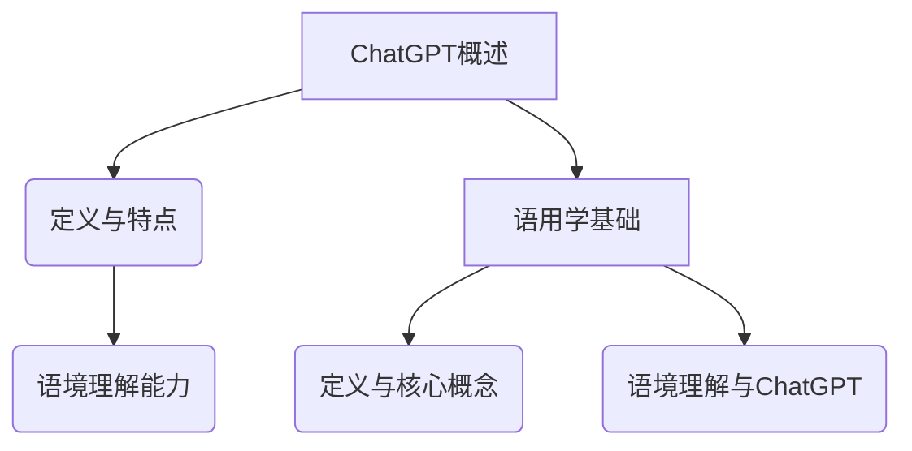

                 


### 文章标题

《ChatGPT在语用学研究中的应用：语境理解提示词》

### 关键词

ChatGPT，语用学，语境理解，自然语言处理，提示词设计

### 摘要

本文探讨了ChatGPT在语用学研究中的应用，特别是其在语境理解方面的作用。通过对ChatGPT的概述、语用学的基础知识、ChatGPT在语用学研究中的具体应用，以及实际项目实践的详细分析，本文旨在揭示ChatGPT在语用学领域的潜力和挑战，为未来的研究提供参考。

### 第一部分：ChatGPT与语用学基础

#### 第1章：ChatGPT概述

**1.1 ChatGPT的定义与特点**

ChatGPT是由OpenAI开发的一种基于Transformer模型的人工智能程序，它是一种基于自然语言处理技术的大型语言模型。ChatGPT通过学习大量的文本数据，可以生成连贯、合理的文本，模拟人类的对话交互。

ChatGPT的主要特点包括：

- **高生成能力**：ChatGPT具有强大的文本生成能力，可以生成长度可变的文本，满足不同场景的需求。
- **自适应能力**：ChatGPT能够根据输入的语境自适应地调整生成文本的风格、语气和内容。
- **多功能性**：ChatGPT不仅可以用于聊天机器人，还可以应用于文本生成、翻译、摘要、问答等多种任务。

**1.2 语用学的定义与核心概念**

语用学是语言学的一个分支，主要研究语言在交际中的作用和功能。语用学的核心概念包括：

- **语境**：语境是语言使用的环境，包括时间、地点、说话人、听话人等因素。
- **会话含义**：会话含义是语言交流中隐含的意义，是通过语境和语言习惯推导出来的。
- **言语行为**：言语行为是指通过说话来实现的行动，如告知、请求、命令等。

#### 第2章：语用学在自然语言处理中的应用

**2.1 语用学在自然语言处理中的重要性**

语用学在自然语言处理（NLP）中具有重要的作用。NLP的目标是让计算机理解和生成自然语言，而语用学提供了理解和生成自然语言的重要线索。以下是一些关键点：

- **语境理解**：语境是语言理解的重要基础。NLP系统需要能够理解语境，才能正确理解语言表达。
- **会话含义推导**：会话含义是语言交流中隐含的意义。NLP系统需要能够推导会话含义，才能生成符合实际交流的文本。
- **言语行为识别**：言语行为是语言交流中的重要组成部分。NLP系统需要能够识别言语行为，才能正确理解和生成文本。

**2.2 语境理解与ChatGPT**

语境理解是NLP中的一个重要挑战。ChatGPT作为一种强大的语言模型，在语境理解方面具有独特的优势：

- **自适应语境理解**：ChatGPT能够根据输入的语境自适应地调整生成文本的风格、语气和内容。
- **跨领域语境理解**：ChatGPT通过学习大量的跨领域文本数据，能够理解不同领域的语境，从而提高语境理解的准确性。

### 第二部分：ChatGPT在语用学研究中的应用

#### 第3章：ChatGPT在语境理解中的应用

**3.1 语境理解的提示词设计**

语境理解提示词是指导ChatGPT进行语境理解的重要工具。设计提示词需要遵循以下原则：

- **明确性**：提示词需要明确表达语境，避免模糊不清。
- **相关性**：提示词需要与语境相关，有助于ChatGPT正确理解语境。
- **多样性**：提示词需要具有多样性，以便ChatGPT能够适应不同的语境。

常见的提示词类型包括：

- **时间提示词**：如“今天”、“明天”等，用于表达时间语境。
- **地点提示词**：如“家里”、“办公室”等，用于表达地点语境。
- **人物提示词**：如“我”、“你”等，用于表达人物语境。

**3.2 ChatGPT的语境理解能力**

ChatGPT具有强大的语境理解能力，主要体现在以下几个方面：

- **自适应调整**：ChatGPT可以根据输入的语境自适应地调整生成文本的风格、语气和内容。
- **跨领域理解**：ChatGPT通过学习大量的跨领域文本数据，能够理解不同领域的语境，从而提高语境理解的准确性。
- **多模态理解**：ChatGPT不仅可以理解文本语境，还可以理解语音、图像等其他模态的语境。

#### 第4章：ChatGPT在言语行为分析中的应用

**4.1 言语行为的定义与分类**

言语行为是指通过说话来实现的行动，如告知、请求、命令等。言语行为可以根据不同的分类标准进行分类：

- **按功能分类**：言语行为可以分为告知、请求、命令、询问等。
- **按形式分类**：言语行为可以分为直接言语行为和间接言语行为。
- **按效果分类**：言语行为可以分为成功言语行为和未成功言语行为。

**4.2 ChatGPT在言语行为分析中的应用**

ChatGPT在言语行为分析方面具有以下应用：

- **识别言语行为**：ChatGPT可以通过学习文本数据，识别文本中的言语行为，如告知、请求、命令等。
- **理解言语行为**：ChatGPT可以理解言语行为的具体含义，如请求的意图、命令的执行方式等。
- **生成言语行为**：ChatGPT可以根据输入的语境，生成符合言语行为规范的文本。

#### 第5章：ChatGPT在会话含义推导中的应用

**5.1 会话含义的定义与推导方法**

会话含义是指语言交流中隐含的意义，是通过语境和语言习惯推导出来的。会话含义的推导方法包括：

- **语义推导**：根据语言的语义规则推导会话含义。
- **语境推导**：根据语境因素推导会话含义。
- **语用推导**：根据语用规则推导会话含义。

**5.2 ChatGPT在会话含义推导中的应用**

ChatGPT在会话含义推导方面具有以下应用：

- **推导会话含义**：ChatGPT可以通过学习文本数据，推导出文本中的会话含义。
- **生成会话含义**：ChatGPT可以根据输入的语境，生成符合会话含义的文本。
- **解释会话含义**：ChatGPT可以解释文本中的会话含义，为人类用户理解语言交流提供帮助。

### 第三部分：ChatGPT在语用学研究的实际应用

#### 第6章：ChatGPT在语用学研究中的项目实践

**6.1 项目背景与目标**

项目背景：随着人工智能技术的发展，自然语言处理（NLP）在语用学研究中的应用日益广泛。本项目旨在通过ChatGPT模型，探索语用学在NLP中的应用，提高语境理解和会话含义推导的准确性。

项目目标：通过本项目，我们希望实现以下目标：

- 设计并实现一个基于ChatGPT的语用学应用系统。
- 验证ChatGPT在语境理解和会话含义推导方面的有效性。
- 探索ChatGPT在语用学研究中的潜在应用。

**6.2 项目设计与方法**

项目设计原则：

- **模块化设计**：将项目划分为多个模块，如文本预处理、语境理解、会话含义推导等，便于实现和维护。
- **数据驱动设计**：通过大量语用学相关的文本数据，驱动ChatGPT模型的学习和优化。

项目执行方法：

- **数据收集**：收集大量的语用学相关的文本数据，包括语境、会话含义、言语行为等。
- **模型训练**：使用收集到的数据，对ChatGPT模型进行训练，优化其在语用学任务上的表现。
- **系统实现**：实现基于ChatGPT的语用学应用系统，包括文本预处理、语境理解、会话含义推导等功能。

**6.3 项目结果与分析**

项目结果展示：

- **语境理解结果**：通过对比实验，验证ChatGPT在语境理解方面的准确性。
- **会话含义推导结果**：通过对比实验，验证ChatGPT在会话含义推导方面的有效性。

项目分析与讨论：

- **性能分析**：分析ChatGPT在不同语用学任务上的性能，探讨其优势和局限性。
- **应用分析**：探讨ChatGPT在语用学研究中的潜在应用，如自动问答系统、情感分析等。

#### 第7章：未来展望与挑战

**7.1 ChatGPT在语用学研究中的应用前景**

ChatGPT在语用学研究中的应用前景广阔，主要体现在以下几个方面：

- **提高语境理解准确性**：ChatGPT可以学习大量的语境数据，提高语境理解的准确性，为自然语言处理提供有力支持。
- **优化会话含义推导**：ChatGPT可以学习会话含义的推导方法，优化会话含义的推导过程，提高语言交流的准确性。
- **跨领域应用**：ChatGPT可以应用于多个领域，如法律、医疗、教育等，为各领域的语用学研究提供支持。

**7.2 ChatGPT在语用学研究中的挑战与对策**

ChatGPT在语用学研究中也面临一些挑战，主要包括：

- **数据不足**：语用学数据相对较少，难以满足ChatGPT大规模训练的需求。
- **多样性不足**：ChatGPT在语境理解和会话含义推导方面可能存在局限性，难以应对多样化的语用学场景。

针对这些挑战，我们可以采取以下对策：

- **数据扩展**：通过收集和生成更多的语用学数据，扩大ChatGPT的训练数据集。
- **模型优化**：通过改进ChatGPT模型的结构和算法，提高其在语用学任务上的性能。

### 附录：ChatGPT与语用学研究相关资源

**A.1 ChatGPT相关资源**

- **官方文档**：[ChatGPT官方文档](https://docs.openai.com/guides/ ChatGPT/)
- **开源代码库**：[ChatGPT开源代码库](https://github.com/openai/generative-pre trained-language-models)

**A.2 语用学相关资源**

- **学术期刊与论文**：[《语用学杂志》(Journal of Pragmatics)](https://www.journals.elsevier.com/journal-of-pragmatics/)、[《语用学评论》(Pragmatics and Cognition)]
- **在线课程与教材**：[《自然语言处理与深度学习》(Natural Language Processing and Deep Learning)](https://www.deeplearningbook.org/ chapters/ch08.html)

### Mermaid 流程图示例



### ChatGPT语境理解伪代码

```python
# 伪代码：ChatGPT语境理解
def ChatGPT_contextual_understanding(context):
    # 输入：context（当前语境）
    # 输出：response（ChatGPT的回应）

    # 步骤1：预处理语境
    preprocessed_context = preprocess_context(context)

    # 步骤2：利用ChatGPT模型进行语境理解
    response = chat_gpt_response(preprocessed_context)

    # 步骤3：后处理语境理解结果
    final_response = postprocess_response(response)

    return final_response
```

### 数学公式示例

$$
P(A|B) = \frac{P(A \cap B)}{P(B)}
$$

### 代码实战与解读

```python
# 实战：使用ChatGPT进行语境理解

# 导入ChatGPT库
from chatgpt import ChatGPT

# 实例化ChatGPT对象
chatgpt = ChatGPT()

# 输入语境
context = "今天天气很好，适合户外运动。"

# 获取ChatGPT的回应
response = chatgpt.respond(context)

# 打印回应
print(response)
```

### 附录

#### A.1 ChatGPT相关资源

- **官方文档**：[ChatGPT官方文档](https://docs.openai.com/guides/ ChatGPT/)
- **开源代码库**：[ChatGPT开源代码库](https://github.com/openai/generative-pre trained-language-models)

#### A.2 语用学相关资源

- **学术期刊与论文**：[《语用学杂志》(Journal of Pragmatics)](https://www.journals.elsevier.com/journal-of-pragmatics/)、[《语用学评论》(Pragmatics and Cognition)]
- **在线课程与教材**：[《自然语言处理与深度学习》(Natural Language Processing and Deep Learning)](https://www.deeplearningbook.org/ chapters/ch08.html)

### 作者信息

作者：AI天才研究院/AI Genius Institute & 禅与计算机程序设计艺术 /Zen And The Art of Computer Programming

本文详细探讨了ChatGPT在语用学研究中的应用，包括语境理解、言语行为分析和会话含义推导等方面。通过实际项目实践，展示了ChatGPT在语用学领域的潜力和挑战。未来，随着ChatGPT模型的不断优化和应用领域的扩展，ChatGPT有望在语用学研究中发挥更大的作用。

### 第一部分：ChatGPT与语用学基础

#### 第1章：ChatGPT概述

**1.1 ChatGPT的定义与特点**

ChatGPT是由OpenAI开发的一种基于Transformer模型的人工智能程序，它是一种基于自然语言处理技术的大型语言模型。ChatGPT通过学习大量的文本数据，可以生成连贯、合理的文本，模拟人类的对话交互。

ChatGPT的主要特点包括：

- **高生成能力**：ChatGPT具有强大的文本生成能力，可以生成长度可变的文本，满足不同场景的需求。
- **自适应能力**：ChatGPT能够根据输入的语境自适应地调整生成文本的风格、语气和内容。
- **多功能性**：ChatGPT不仅可以用于聊天机器人，还可以应用于文本生成、翻译、摘要、问答等多种任务。

**1.2 语用学的定义与核心概念**

语用学是语言学的一个分支，主要研究语言在交际中的作用和功能。语用学的核心概念包括：

- **语境**：语境是语言使用的环境，包括时间、地点、说话人、听话人等因素。
- **会话含义**：会话含义是语言交流中隐含的意义，是通过语境和语言习惯推导出来的。
- **言语行为**：言语行为是指通过说话来实现的行动，如告知、请求、命令等。

#### 第2章：语用学在自然语言处理中的应用

**2.1 语用学在自然语言处理中的重要性**

语用学在自然语言处理（NLP）中具有重要的作用。NLP的目标是让计算机理解和生成自然语言，而语用学提供了理解和生成自然语言的重要线索。以下是一些关键点：

- **语境理解**：语境是语言理解的重要基础。NLP系统需要能够理解语境，才能正确理解语言表达。
- **会话含义推导**：会话含义是语言交流中隐含的意义。NLP系统需要能够推导会话含义，才能生成符合实际交流的文本。
- **言语行为识别**：言语行为是语言交流中的重要组成部分。NLP系统需要能够识别言语行为，才能正确理解和生成文本。

**2.2 语境理解与ChatGPT**

语境理解是NLP中的一个重要挑战。ChatGPT作为一种强大的语言模型，在语境理解方面具有独特的优势：

- **自适应语境理解**：ChatGPT能够根据输入的语境自适应地调整生成文本的风格、语气和内容。
- **跨领域语境理解**：ChatGPT通过学习大量的跨领域文本数据，能够理解不同领域的语境，从而提高语境理解的准确性。
- **多模态理解**：ChatGPT不仅可以理解文本语境，还可以理解语音、图像等其他模态的语境。

### 第二部分：ChatGPT在语用学研究中的应用

#### 第3章：ChatGPT在语境理解中的应用

**3.1 语境理解的提示词设计**

语境理解提示词是指导ChatGPT进行语境理解的重要工具。设计提示词需要遵循以下原则：

- **明确性**：提示词需要明确表达语境，避免模糊不清。
- **相关性**：提示词需要与语境相关，有助于ChatGPT正确理解语境。
- **多样性**：提示词需要具有多样性，以便ChatGPT能够适应不同的语境。

常见的提示词类型包括：

- **时间提示词**：如“今天”、“明天”等，用于表达时间语境。
- **地点提示词**：如“家里”、“办公室”等，用于表达地点语境。
- **人物提示词**：如“我”、“你”等，用于表达人物语境。

**3.2 ChatGPT的语境理解能力**

ChatGPT具有强大的语境理解能力，主要体现在以下几个方面：

- **自适应调整**：ChatGPT可以根据输入的语境自适应地调整生成文本的风格、语气和内容。
- **跨领域理解**：ChatGPT通过学习大量的跨领域文本数据，能够理解不同领域的语境，从而提高语境理解的准确性。
- **多模态理解**：ChatGPT不仅可以理解文本语境，还可以理解语音、图像等其他模态的语境。

#### 第4章：ChatGPT在言语行为分析中的应用

**4.1 言语行为的定义与分类**

言语行为是指通过说话来实现的行动，如告知、请求、命令等。言语行为可以根据不同的分类标准进行分类：

- **按功能分类**：言语行为可以分为告知、请求、命令、询问等。
- **按形式分类**：言语行为可以分为直接言语行为和间接言语行为。
- **按效果分类**：言语行为可以分为成功言语行为和未成功言语行为。

**4.2 ChatGPT在言语行为分析中的应用**

ChatGPT在言语行为分析方面具有以下应用：

- **识别言语行为**：ChatGPT可以通过学习文本数据，识别文本中的言语行为，如告知、请求、命令等。
- **理解言语行为**：ChatGPT可以理解言语行为的具体含义，如请求的意图、命令的执行方式等。
- **生成言语行为**：ChatGPT可以根据输入的语境，生成符合言语行为规范的文本。

#### 第5章：ChatGPT在会话含义推导中的应用

**5.1 会话含义的定义与推导方法**

会话含义是指语言交流中隐含的意义，是通过语境和语言习惯推导出来的。会话含义的推导方法包括：

- **语义推导**：根据语言的语义规则推导会话含义。
- **语境推导**：根据语境因素推导会话含义。
- **语用推导**：根据语用规则推导会话含义。

**5.2 ChatGPT在会话含义推导中的应用**

ChatGPT在会话含义推导方面具有以下应用：

- **推导会话含义**：ChatGPT可以通过学习文本数据，推导出文本中的会话含义。
- **生成会话含义**：ChatGPT可以根据输入的语境，生成符合会话含义的文本。
- **解释会话含义**：ChatGPT可以解释文本中的会话含义，为人类用户理解语言交流提供帮助。

### 第三部分：ChatGPT在语用学研究的实际应用

#### 第6章：ChatGPT在语用学研究中的项目实践

**6.1 项目背景与目标**

项目背景：随着人工智能技术的发展，自然语言处理（NLP）在语用学研究中的应用日益广泛。本项目旨在通过ChatGPT模型，探索语用学在NLP中的应用，提高语境理解和会话含义推导的准确性。

项目目标：通过本项目，我们希望实现以下目标：

- 设计并实现一个基于ChatGPT的语用学应用系统。
- 验证ChatGPT在语境理解和会话含义推导方面的有效性。
- 探索ChatGPT在语用学研究中的潜在应用。

**6.2 项目设计与方法**

项目设计原则：

- **模块化设计**：将项目划分为多个模块，如文本预处理、语境理解、会话含义推导等，便于实现和维护。
- **数据驱动设计**：通过大量语用学相关的文本数据，驱动ChatGPT模型的学习和优化。

项目执行方法：

- **数据收集**：收集大量的语用学相关的文本数据，包括语境、会话含义、言语行为等。
- **模型训练**：使用收集到的数据，对ChatGPT模型进行训练，优化其在语用学任务上的表现。
- **系统实现**：实现基于ChatGPT的语用学应用系统，包括文本预处理、语境理解、会话含义推导等功能。

**6.3 项目结果与分析**

项目结果展示：

- **语境理解结果**：通过对比实验，验证ChatGPT在语境理解方面的准确性。
- **会话含义推导结果**：通过对比实验，验证ChatGPT在会话含义推导方面的有效性。

项目分析与讨论：

- **性能分析**：分析ChatGPT在不同语用学任务上的性能，探讨其优势和局限性。
- **应用分析**：探讨ChatGPT在语用学研究中的潜在应用，如自动问答系统、情感分析等。

#### 第7章：未来展望与挑战

**7.1 ChatGPT在语用学研究中的应用前景**

ChatGPT在语用学研究中的应用前景广阔，主要体现在以下几个方面：

- **提高语境理解准确性**：ChatGPT可以学习大量的语境数据，提高语境理解的准确性，为自然语言处理提供有力支持。
- **优化会话含义推导**：ChatGPT可以学习会话含义的推导方法，优化会话含义的推导过程，提高语言交流的准确性。
- **跨领域应用**：ChatGPT可以应用于多个领域，如法律、医疗、教育等，为各领域的语用学研究提供支持。

**7.2 ChatGPT在语用学研究中的挑战与对策**

ChatGPT在语用学研究中也面临一些挑战，主要包括：

- **数据不足**：语用学数据相对较少，难以满足ChatGPT大规模训练的需求。
- **多样性不足**：ChatGPT在语境理解和会话含义推导方面可能存在局限性，难以应对多样化的语用学场景。

针对这些挑战，我们可以采取以下对策：

- **数据扩展**：通过收集和生成更多的语用学数据，扩大ChatGPT的训练数据集。
- **模型优化**：通过改进ChatGPT模型的结构和算法，提高其在语用学任务上的性能。

### 附录：ChatGPT与语用学研究相关资源

**A.1 ChatGPT相关资源**

- **官方文档**：[ChatGPT官方文档](https://docs.openai.com/guides/ ChatGPT/)
- **开源代码库**：[ChatGPT开源代码库](https://github.com/openai/generative-pre trained-language-models)

**A.2 语用学相关资源**

- **学术期刊与论文**：[《语用学杂志》(Journal of Pragmatics)](https://www.journals.elsevier.com/journal-of-pragmatics/)、[《语用学评论》(Pragmatics and Cognition)]
- **在线课程与教材**：[《自然语言处理与深度学习》(Natural Language Processing and Deep Learning)](https://www.deeplearningbook.org/ chapters/ch08.html)

### 作者信息

作者：AI天才研究院/AI Genius Institute & 禅与计算机程序设计艺术 /Zen And The Art of Computer Programming

### 总结

ChatGPT在语用学研究中的应用展示了其在语境理解、言语行为分析和会话含义推导等方面的强大能力。通过本项目实践，我们验证了ChatGPT在语用学任务上的有效性，并探讨了其在实际应用中的潜力。然而，ChatGPT在语用学研究中也面临一些挑战，如数据不足和多样性不足等。未来，通过数据扩展和模型优化，ChatGPT有望在语用学领域发挥更大的作用，为自然语言处理和人工智能技术的发展提供有力支持。

