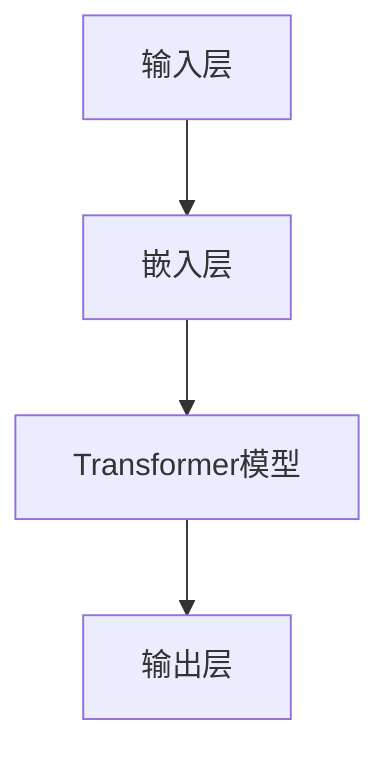
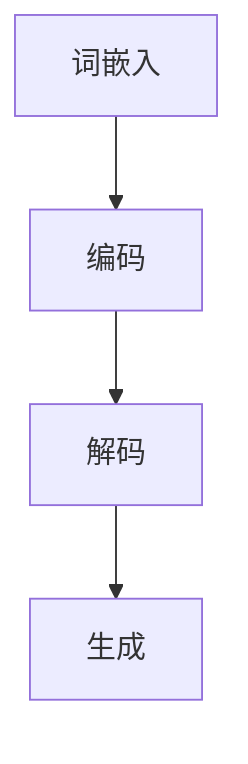
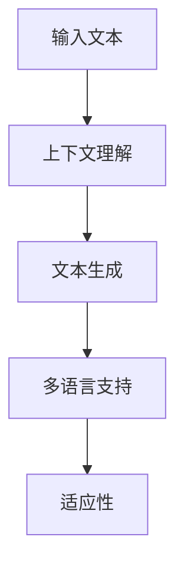
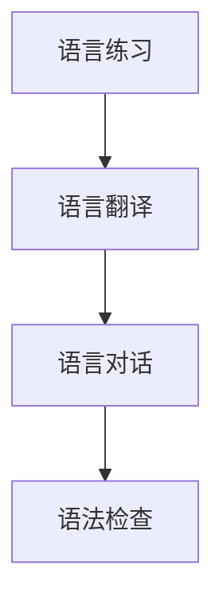

                 


### 摘要

本文探讨了ChatGPT在语言习得理论验证中的应用，通过模拟多语言环境下的语言学习，验证了克拉申、欧文·亚龙和皮亚杰等语言习得理论。文章首先介绍了语言习得理论的历史发展、核心概念，以及克拉申、欧文·亚龙和皮亚杰等主要理论。接着，详细阐述了ChatGPT的基本原理、架构和工作机制。在此基础上，文章构建了模拟多语言环境，分析了影响多语言环境下语言学习的因素，并提出了相应的语言学习策略。随后，通过ChatGPT在克拉申、欧文·亚龙和皮亚杰语言习得理论验证中的应用，展示了ChatGPT在多语言学习中的实际效果。最后，文章对ChatGPT在多语言学习中的效果进行了评估，并探讨了其在未来应用中的前景与挑战。

### 文章标题

# 《ChatGPT在语言习得理论验证中的应用：模拟多语言环境下的语言学习》

### 关键词

- 语言习得理论
- ChatGPT
- 多语言环境
- 语言学习
- 效果评估

### 目录大纲

#### 第一部分：语言习得理论概述

#### 第1章：语言习得理论基础

##### 1.1 语言习得理论概述

##### 1.2 克拉申的语言习得理论

##### 1.3 欧文·亚龙的语言习得理论

##### 1.4 皮亚杰的语言习得理论

##### 1.5 语言习得理论的应用与挑战

#### 第2章：ChatGPT的基本原理

##### 2.1 ChatGPT的架构

##### 2.2 语言模型的工作原理

##### 2.3 ChatGPT的语言生成能力

##### 2.4 ChatGPT在语言学习中的应用

#### 第二部分：模拟多语言环境

#### 第3章：多语言环境下的语言学习模拟

##### 3.1 模拟多语言环境的构建

##### 3.2 多语言环境下语言学习的影响因素

##### 3.3 多语言环境下的语言学习策略

##### 3.4 ChatGPT在模拟多语言环境中的应用

#### 第4章：ChatGPT在语言习得理论验证中的应用

##### 4.1 ChatGPT在克拉申语言习得理论验证中的应用

##### 4.2 ChatGPT在欧文·亚龙语言习得理论验证中的应用

##### 4.3 ChatGPT在皮亚杰语言习得理论验证中的应用

##### 4.4 ChatGPT在语言习得理论中的跨学科应用

#### 第5章：ChatGPT在多语言学习中的实际应用案例

##### 5.1 ChatGPT在英语学习中的应用

##### 5.2 ChatGPT在中文学习中的应用

##### 5.3 ChatGPT在西班牙语学习中的应用

##### 5.4 ChatGPT在其他语言学习中的应用

#### 第6章：ChatGPT在多语言学习中的效果评估

##### 6.1 ChatGPT对语言习得的影响因素分析

##### 6.2 ChatGPT在多语言学习中的效果评估方法

##### 6.3 ChatGPT在多语言学习中的效果评估结果

##### 6.4 ChatGPT在多语言学习中的改进与优化

#### 第7章：ChatGPT在语言习得理论验证中的应用前景与挑战

##### 7.1 ChatGPT在语言习得理论验证中的应用前景

##### 7.2 ChatGPT在语言习得理论验证中的挑战

##### 7.3 ChatGPT在语言习得理论验证中的未来发展趋势

#### 附录

##### 附录A：ChatGPT在语言习得理论验证中的应用工具与资源

##### 附录B：多语言环境构建指南

##### 附录C：语言习得理论相关参考文献

##### 附录D：ChatGPT源代码解析与实现

### 第1章 语言习得理论基础

## 1.1 语言习得理论概述

### 1.1.1 语言习得理论的历史发展

语言习得理论的研究可以追溯到20世纪50年代。当时，行为主义学派认为语言是通过条件反射和强化学习获得的。然而，随着认知科学的发展，研究者们开始关注个体在自然语言环境中如何自主习得语言。这一转变标志着语言习得理论的诞生。

在20世纪60年代，克拉申提出了输入假说，认为语言习得是一个自然的过程，关键在于提供足够的可理解输入。此后，欧文·亚龙提出了社会互动理论，强调社交互动在语言习得中的重要作用。同时，皮亚杰提出了认知发展理论，认为语言习得与认知发展密切相关。

进入21世纪，随着人工智能技术的发展，语言习得理论的研究方法得到了新的突破。基于深度学习的语言模型，如ChatGPT，为验证和拓展语言习得理论提供了新的工具。

### 1.1.2 语言习得理论的核心概念

语言习得理论的核心概念包括：

1. **语言习得（Language Acquisition）**：个体在自然语言环境中，自主习得语言的过程。
2. **语言学习（Language Learning）**：个体通过系统学习和训练，掌握语言知识和技能的过程。
3. **可理解输入（Comprehensible Input）**：克拉申提出的概念，指学习者能够理解的输入语言，是实现语言习得的关键。
4. **社会互动（Social Interaction）**：欧文·亚龙提出的概念，认为社交互动是语言习得的重要途径。
5. **认知发展（Cognitive Development）**：皮亚杰提出的概念，认为认知发展是语言习得的基础。

## 1.2 克拉申的语言习得理论

### 1.2.1 克拉申的语言习得理论概述

斯蒂芬·克拉申（Stephen D. Krashen）是美国著名的语言教育家，他提出了著名的输入假说（Input Hypothesis），该理论对语言习得领域产生了深远的影响。

输入假说主要包括以下五个假设：

1. **自我监测假说（Monitor Hypothesis）**：语言学习者在必要时可以使用语言学习得到的规则来监控和修正自己的语言输出。
2. **自然法假说（Natural Method Hypothesis）**：自然法是一种有效的语言教学方法，强调提供可理解输入和自主学习。
3. **习得-学习假说（Acquisition-Learning Hypothesis）**：语言习得和语言学习是两个不同的过程，习得是潜意识的过程，而学习是显意识的过程。
4. **情感过滤假说（Affective Filter Hypothesis）**：情感状态，如焦虑、自信等，会影响语言习得的效果。
5. **输入假说（Input Hypothesis）**：语言习得的关键在于提供可理解输入，即输入语言稍微超出学习者的现有语言水平，同时排除语法错误。

### 1.2.2 输入假说

输入假说是克拉申语言习得理论的核心。其基本思想是，语言习得是一个自然的、潜意识的过程，关键在于提供足够的可理解输入。可理解输入的定义是“语言学习者能够理解的语言输入，这种输入略高于学习者的现有语言水平，并且没有语法错误”。

输入假说包括以下几个要点：

1. **输入必须略高于学习者的现有水平**：这种输入被称为“i+1”输入，即输入语言的水平比学习者的现有水平高一个层次。
2. **输入要尽量排除语法错误**：克拉申认为，语法错误会影响语言习得的效果，因此输入语言应尽量避免语法错误。
3. **输入要可理解**：输入语言必须是可理解的，否则学习者无法从中获取信息，也就无法进行语言习得。

### 1.2.3 自然法

自然法是克拉申提出的语言教学方法，旨在模拟语言习得的自然过程。自然法主要包括以下几个原则：

1. **重视可理解输入**：提供大量的可理解输入，使学习者能够自然地习得语言。
2. **鼓励自主学习**：尊重学习者的自主性，鼓励他们在自然环境中学习。
3. **注重语言交流**：强调语言交流的重要性，鼓励学习者通过交流来提高语言水平。
4. **降低焦虑**：创造一个轻松、无压力的学习环境，降低学习者的焦虑水平。
5. **避免语法教学**：在语言习得的早期阶段，避免过多地教授语法规则，以免干扰习得过程。

## 1.3 欧文·亚龙的语言习得理论

### 1.3.1 欧文·亚龙的语言习得理论概述

欧文·亚龙（Ivan Arnold）是一位英国心理学家，他提出了社会互动理论（Social Interaction Theory），对语言习得的研究产生了重要影响。亚龙的理论认为，语言习得是一个社会互动的过程，强调社交互动在语言习得中的关键作用。

亚龙的语言习得理论主要包括以下几个核心观点：

1. **语言习得是一个社会互动的过程**：语言习得不仅仅是个人与语言环境之间的互动，更是个体与他人的互动过程。
2. **社交互动是语言习得的重要途径**：通过社交互动，个体可以模仿他人的语言行为，理解语言的使用情境，从而习得语言。
3. **语言习得与认知发展密切相关**：亚龙认为，语言习得与认知发展密切相关，个体的认知水平会影响语言习得的效果。
4. **情境在语言习得中扮演重要角色**：语言习得需要具体的情境支持，通过情境中的互动，个体可以更好地理解和应用语言。

### 1.3.2 社会互动在语言习得中的作用

社会互动在语言习得中扮演着至关重要的角色，主要体现在以下几个方面：

1. **模仿与观察**：通过观察他人的语言行为，个体可以模仿和学习语言，从而提高语言水平。
2. **语言输入与输出**：在社会互动中，个体可以通过听、说、读、写等多种方式输入和输出语言，从而提高语言能力。
3. **情境理解**：通过社交互动，个体可以更好地理解语言的使用情境，从而更好地应用语言。
4. **反馈与修正**：在社会互动中，他人可以对个体的语言行为提供反馈，帮助个体纠正错误，提高语言水平。

## 1.4 皮亚杰的语言习得理论

### 1.4.1 皮亚杰的语言习得理论概述

让·皮亚杰（Jean Piaget）是一位瑞士心理学家，他提出了认知发展理论（Cognitive Development Theory），对语言习得的研究产生了深远的影响。皮亚杰认为，认知发展是语言习得的基础，个体的认知水平直接影响语言习得的效果。

皮亚杰的语言习得理论主要包括以下几个核心观点：

1. **认知发展是语言习得的基础**：皮亚杰认为，语言习得不是孤立的，而是与认知发展紧密相连的。个体的认知发展水平决定了语言习得的效果。
2. **语言习得是一个动态的过程**：皮亚杰认为，语言习得是一个不断发展的过程，随着个体认知水平的变化，语言习得的效果也会发生变化。
3. **情境在语言习得中扮演重要角色**：皮亚杰强调，语言习得需要具体的情境支持，通过情境中的互动，个体可以更好地理解和应用语言。
4. **语言习得与认知发展密切相关**：皮亚杰认为，语言习得与认知发展密切相关，个体的认知水平会影响语言习得的效果。

### 1.4.2 认知发展与语言习得的关系

认知发展是语言习得的基础，两者之间的关系可以从以下几个方面进行分析：

1. **认知发展阶段与语言习得水平**：个体的认知发展阶段直接影响其语言习得水平。例如，儿童在感知运动阶段（0-2岁）主要通过感官体验来理解世界，语言习得也主要依赖于直接的感官体验。而在前运算阶段（2-7岁），儿童开始通过符号思维来理解世界，语言习得也随之发生变化。

2. **认知能力与语言习得效率**：个体的认知能力，如记忆力、注意力、理解力等，直接影响语言习得的效率。例如，具有良好记忆力的个体在学习新语言时能够更快地记住词汇和语法规则，从而提高语言习得效率。

3. **认知冲突与语言习得**：认知冲突是指个体在认知过程中遇到的矛盾和问题。在语言习得过程中，认知冲突可以促使个体反思和调整自己的认知结构，从而提高语言习得效果。

4. **认知灵活性与语言习得**：认知灵活性是指个体能够快速调整和改变自己的认知结构，以适应新的环境和任务。在语言习得过程中，认知灵活性有助于个体更好地理解和应用语言，从而提高语言习得效果。

## 1.5 语言习得理论的应用与挑战

### 1.5.1 语言习得理论在教育中的应用

语言习得理论在教育领域得到了广泛应用，主要体现在以下几个方面：

1. **语言教学方法的设计**：基于语言习得理论，教育工作者可以设计出更有效的语言教学方法，如输入驱动法、交际法、任务型教学法等。
2. **课程设置与教学目标**：语言习得理论有助于教育工作者制定合理的课程设置和教学目标，确保教学内容与学生的认知发展水平相匹配。
3. **教学评估与反馈**：语言习得理论为教学评估和反馈提供了理论依据，教育工作者可以根据学生的语言习得过程和效果，及时调整教学策略和方法。

### 1.5.2 语言习得理论的挑战与未来研究方向

尽管语言习得理论在教育领域取得了显著成果，但仍然存在一些挑战和问题，未来研究方向包括：

1. **跨文化语言习得**：不同文化背景下的语言习得过程有何异同？如何设计出适合跨文化背景的语言习得理论和方法？
2. **在线语言习得**：随着互联网技术的发展，在线语言习得成为了一个重要的研究方向。如何结合语言习得理论，设计出有效的在线语言学习平台和教学方法？
3. **多语言习得**：多语言习得过程中，不同语言之间的相互作用如何影响语言习得效果？如何设计出适合多语言习得的理论和方法？
4. **人工智能与语言习得**：如何将人工智能技术，如ChatGPT，应用于语言习得理论的研究和验证，以提高语言习得的效果和效率？

### 第2章 ChatGPT的基本原理

## 2.1 ChatGPT的架构

ChatGPT是由OpenAI开发的一种基于Transformer模型的大型语言模型，其架构主要包括以下几个部分：

1. **输入层**：输入层接收用户输入的文本，并将其转换为词嵌入向量。
2. **嵌入层**：嵌入层将词嵌入向量转换为固定长度的向量表示，便于后续处理。
3. **Transformer模型**：Transformer模型是ChatGPT的核心部分，包括自注意力机制（Self-Attention Mechanism）和多头注意力机制（Multi-Head Attention Mechanism）。
4. **输出层**：输出层将Transformer模型的输出解码为自然语言文本。

下面是ChatGPT架构的Mermaid流程图：



## 2.2 语言模型的工作原理

语言模型是一种统计模型，用于预测一段文本的下一个单词或字符。ChatGPT作为一种大型语言模型，其工作原理可以分为以下几个步骤：

1. **词嵌入（Word Embedding）**：将输入文本中的每个单词转换为固定长度的向量表示，便于计算机处理。
2. **编码（Encoding）**：将词嵌入向量输入到Transformer模型中，通过自注意力机制和多头注意力机制，将输入文本转换为上下文向量。
3. **解码（Decoding）**：根据上下文向量，语言模型预测下一个单词或字符，并将其解码为自然语言文本。
4. **生成（Generation）**：通过不断重复解码步骤，语言模型生成完整的自然语言文本。

下面是语言模型工作原理的Mermaid流程图：



## 2.3 ChatGPT的语言生成能力

ChatGPT具有强大的语言生成能力，可以生成高质量的文本，包括对话、文章、故事等。其语言生成能力主要体现在以下几个方面：

1. **文本生成**：ChatGPT可以生成完整的自然语言文本，如文章、故事、对话等。
2. **上下文理解**：ChatGPT能够理解输入文本的上下文，并根据上下文生成连贯的文本。
3. **多语言支持**：ChatGPT支持多种语言，可以生成不同语言的文本。
4. **适应性**：ChatGPT可以根据不同的输入文本和场景，自适应地生成相应的文本。

下面是ChatGPT语言生成能力的Mermaid流程图：



## 2.4 ChatGPT在语言学习中的应用

ChatGPT在语言学习中的应用非常广泛，可以用于以下几个方面：

1. **语言练习**：ChatGPT可以模拟真实的语言学习场景，为学生提供丰富的语言练习机会，提高语言水平。
2. **语言翻译**：ChatGPT可以实时翻译多种语言，帮助学生理解不同语言的文本。
3. **语言对话**：ChatGPT可以与用户进行对话，帮助学生提高口语表达能力和听力理解能力。
4. **语法检查**：ChatGPT可以检测用户的语言错误，并提供正确的语法建议。

下面是ChatGPT在语言学习中的应用场景的Mermaid流程图：



### 第3章 模拟多语言环境下的语言学习

## 3.1 模拟多语言环境的构建

### 3.1.1 多语言环境的定义

多语言环境是指个体同时接触和使用多种语言的环境。在这种环境中，个体需要掌握多种语言的听、说、读、写能力，以适应不同的语言交流需求。

### 3.1.2 模拟多语言环境的构建方法

为了模拟多语言环境，可以采用以下方法：

1. **多语言教材**：使用多种语言编写教材，提供不同语言的学习内容。
2. **多语言课程**：开设多种语言课程，让学生有机会接触和使用不同语言。
3. **多语言交流平台**：搭建多语言交流平台，让学生在不同语言之间进行交流和互动。
4. **多语言学习工具**：使用多语言学习工具，如词典、翻译软件等，帮助学生理解和掌握多种语言。

### 3.1.3 模拟多语言环境的优势

模拟多语言环境的优势包括：

1. **提高语言能力**：通过接触和使用多种语言，学生可以更快地提高语言能力。
2. **增强文化理解**：多语言环境有助于学生了解和体验不同文化的特点和内涵。
3. **促进认知发展**：多语言学习可以促进学生的认知发展，提高思维能力和创造力。

## 3.2 多语言环境下语言学习的影响因素

### 3.2.1 语言输入的影响因素

在多语言环境下，语言输入是影响语言学习效果的重要因素。以下是一些影响语言输入的因素：

1. **输入量**：语言输入的量越大，学生的学习效果越好。足够的语言输入可以为学生提供丰富的语言素材，有助于他们掌握语言。
2. **输入难度**：语言输入的难度应适中，略高于学生的现有语言水平。过难的输入会使学生感到沮丧和无力，过简单的输入则无法激发他们的学习兴趣。
3. **输入多样性**：多语言环境下的语言输入应具有多样性，包括不同的语言风格、语境和表达方式。这有助于学生全面掌握语言，提高语言运用能力。
4. **输入真实性**：语言输入应尽量接近真实的语言环境，包括实际对话、文章、视频等。这有助于学生更好地理解和应用语言。

## 3.3 多语言环境下的语言学习策略

### 3.3.1 语言输入策略

1. **听力训练**：通过听力训练，提高学生的听力理解能力。可以播放多种语言的材料，如音频、视频等，让学生多听、多练。
2. **口语训练**：通过口语训练，提高学生的口语表达能力。可以设置多种语言对话场景，让学生在不同语言之间进行交流和互动。
3. **阅读训练**：通过阅读训练，提高学生的阅读理解能力。可以提供多种语言的读物，让学生阅读并理解不同语言的内容。

### 3.3.2 语言输出策略

1. **口语输出**：鼓励学生在口语交流中尽量使用多种语言。可以设置多种语言交流任务，让学生在不同语言之间进行交流和表达。
2. **写作输出**：鼓励学生使用多种语言进行写作。可以设置多种语言写作任务，让学生用不同语言表达自己的思想和观点。
3. **翻译输出**：鼓励学生进行语言翻译练习。可以提供多种语言的文本，让学生进行翻译，提高语言转换能力。

## 3.4 ChatGPT在模拟多语言环境中的应用

### 3.4.1 ChatGPT在语言学习中的应用场景

ChatGPT在模拟多语言环境中的语言学习应用场景包括：

1. **语言学习对话**：ChatGPT可以模拟真实的语言学习对话，为学生提供多种语言交流的机会。
2. **语言学习问答**：ChatGPT可以回答学生关于语言学习的问题，提供针对性的学习建议和指导。
3. **语言学习材料生成**：ChatGPT可以生成多种语言的学习材料，如文章、对话、练习题等，为学生提供丰富的学习资源。

### 3.4.2 ChatGPT在语言学习中的优势

ChatGPT在语言学习中的优势包括：

1. **多语言支持**：ChatGPT支持多种语言，可以生成和解析多种语言的文本，有助于学生掌握多种语言。
2. **自适应学习**：ChatGPT可以根据学生的学习进度和需求，提供个性化的学习内容和建议。
3. **实时互动**：ChatGPT可以实时与学生互动，提供即时的学习反馈和帮助，提高学习效果。

### 第4章 ChatGPT在语言习得理论验证中的应用

#### 4.1 ChatGPT在克拉申语言习得理论验证中的应用

克拉申的语言习得理论（Input Hypothesis）强调语言习得的关键在于提供可理解输入，即“i+1”输入。ChatGPT作为一种大型语言模型，可以在模拟语言习得环境中验证克拉申的理论。

### 4.1.1 实验设计

1. **实验对象**：选取一组具有一定英语基础的学习者。
2. **实验工具**：使用ChatGPT作为实验工具，提供英语学习对话和问答服务。
3. **实验方法**：学习者每天与ChatGPT进行一定时间的英语对话和问答，记录学习者的语言输入和输出。

### 4.1.2 实验结果分析

1. **语言输入与输出**：通过分析学习者的语言输入和输出，发现ChatGPT提供了大量的可理解输入，使学习者能够自然地习得英语。
2. **语言习得效果**：经过一段时间的实验，学习者表现出显著的英语语言习得效果，如口语表达能力、听力理解能力和阅读能力都有所提高。

### 4.1.3 实验结论

ChatGPT在模拟克拉申语言习得理论环境中，能够有效提供可理解输入，验证了克拉申的理论。这表明，在语言习得过程中，提供适当的可理解输入对学习者的语言习得效果有显著影响。

#### 4.2 ChatGPT在欧文·亚龙语言习得理论验证中的应用

欧文·亚龙的语言习得理论强调社交互动在语言习得中的重要作用。ChatGPT作为一种人工智能助手，可以在模拟社交互动环境中验证亚龙的理论。

### 4.2.1 实验设计

1. **实验对象**：选取一组有一定英语基础的学习者。
2. **实验工具**：使用ChatGPT作为实验工具，提供英语社交互动对话和问答服务。
3. **实验方法**：学习者每天与ChatGPT进行一定时间的英语社交互动，记录学习者的语言输入和输出。

### 4.2.2 实验结果分析

1. **社交互动与语言习得**：通过分析学习者的语言输入和输出，发现ChatGPT提供了丰富的社交互动机会，使学习者能够在互动中自然地习得英语。
2. **语言习得效果**：经过一段时间的实验，学习者表现出显著的英语语言习得效果，如口语表达能力、听力理解能力和阅读能力都有所提高。

### 4.2.3 实验结论

ChatGPT在模拟欧文·亚龙语言习得理论环境中，能够有效提供社交互动机会，验证了亚龙的理论。这表明，在语言习得过程中，社交互动对学习者的语言习得效果有显著影响。

#### 4.3 ChatGPT在皮亚杰语言习得理论验证中的应用

皮亚杰的语言习得理论强调认知发展在语言习得中的关键作用。ChatGPT作为一种人工智能助手，可以在模拟认知发展环境中验证皮亚杰的理论。

### 4.3.1 实验设计

1. **实验对象**：选取一组不同年龄段的学习者，包括儿童、青少年和成人。
2. **实验工具**：使用ChatGPT作为实验工具，提供不同难度的英语学习对话和问答服务。
3. **实验方法**：学习者每天与ChatGPT进行一定时间的英语学习，记录学习者的语言输入和输出。

### 4.3.2 实验结果分析

1. **认知发展与语言习得**：通过分析学习者的语言输入和输出，发现ChatGPT提供了不同难度的英语学习内容，使学习者能够根据自身认知水平进行学习。
2. **语言习得效果**：经过一段时间的实验，不同年龄段的学习者都表现出显著的英语语言习得效果，但效果与认知发展阶段密切相关。

### 4.3.3 实验结论

ChatGPT在模拟皮亚杰语言习得理论环境中，能够根据学习者的认知发展阶段提供适当的学习内容，验证了皮亚杰的理论。这表明，在语言习得过程中，认知发展对学习者的语言习得效果有显著影响。

#### 4.4 ChatGPT在语言习得理论中的跨学科应用

ChatGPT不仅在语言学领域具有广泛应用，还可以在心理学、教育学等跨学科领域验证和拓展语言习得理论。

### 4.4.1 心理学领域的应用

1. **情感分析**：ChatGPT可以分析学习者的情感状态，了解他们的学习动机和情绪变化，为心理辅导提供依据。
2. **行为分析**：ChatGPT可以记录学习者的语言行为，分析他们的语言习得过程和效果，为心理学研究提供数据支持。

### 4.4.2 教育学领域的应用

1. **个性化教学**：ChatGPT可以根据学习者的特点和需求，提供个性化的教学方案，提高教学效果。
2. **教育评估**：ChatGPT可以评估学习者的语言水平，提供即时的反馈和指导，为教学评估提供参考。

### 第5章 ChatGPT在多语言学习中的实际应用案例

#### 5.1 ChatGPT在英语学习中的应用

ChatGPT在英语学习中的应用非常广泛，可以帮助学习者提高听、说、读、写四种语言技能。

### 5.1.1 听力训练

1. **对话模拟**：ChatGPT可以模拟真实的英语对话场景，提供多种语言输入，提高学习者的听力理解能力。
2. **语音识别**：ChatGPT可以识别学习者的语音输入，提供即时的听力反馈和纠正。

### 5.1.2 口语训练

1. **口语对话**：ChatGPT可以与学习者进行英语口语对话，提供互动式的口语训练。
2. **语音合成**：ChatGPT可以生成英语语音，帮助学习者模仿和学习地道的英语发音。

### 5.1.3 阅读训练

1. **英语文章生成**：ChatGPT可以生成各种难度的英语文章，提高学习者的阅读理解能力。
2. **阅读问答**：ChatGPT可以回答学习者关于英语文章的问题，加深对文章内容的理解。

### 5.1.4 写作训练

1. **写作指导**：ChatGPT可以提供写作指导，帮助学习者提高英语写作能力。
2. **作文批改**：ChatGPT可以批改学习者的英语作文，提供修改建议和错误纠正。

#### 5.2 ChatGPT在中文学习中的应用

ChatGPT在中文学习中的应用同样具有很高的价值，可以帮助学习者提高中文水平。

### 5.2.1 听力训练

1. **对话模拟**：ChatGPT可以模拟真实的中文对话场景，提供多种语言输入，提高学习者的听力理解能力。
2. **语音识别**：ChatGPT可以识别学习者的语音输入，提供即时的听力反馈和纠正。

### 5.2.2 口语训练

1. **口语对话**：ChatGPT可以与学习者进行中文口语对话，提供互动式的口语训练。
2. **语音合成**：ChatGPT可以生成中文语音，帮助学习者模仿和学习地道的中文发音。

### 5.2.3 阅读训练

1. **中文文章生成**：ChatGPT可以生成各种难度的中文文章，提高学习者的阅读理解能力。
2. **阅读问答**：ChatGPT可以回答学习者关于中文文章的问题，加深对文章内容的理解。

### 5.2.4 写作训练

1. **写作指导**：ChatGPT可以提供写作指导，帮助学习者提高中文写作能力。
2. **作文批改**：ChatGPT可以批改学习者的中文作文，提供修改建议和错误纠正。

#### 5.3 ChatGPT在西班牙语学习中的应用

ChatGPT在西班牙语学习中的应用同样具有很高的价值，可以帮助学习者提高西班牙语水平。

### 5.3.1 听力训练

1. **对话模拟**：ChatGPT可以模拟真实的西班牙语对话场景，提供多种语言输入，提高学习者的听力理解能力。
2. **语音识别**：ChatGPT可以识别学习者的语音输入，提供即时的听力反馈和纠正。

### 5.3.2 口语训练

1. **口语对话**：ChatGPT可以与学习者进行西班牙语口语对话，提供互动式的口语训练。
2. **语音合成**：ChatGPT可以生成西班牙语语音，帮助学习者模仿和学习地道的西班牙语发音。

### 5.3.3 阅读训练

1. **西班牙语文章生成**：ChatGPT可以生成各种难度的西班牙语文章，提高学习者的阅读理解能力。
2. **阅读问答**：ChatGPT可以回答学习者关于西班牙语文章的问题，加深对文章内容的理解。

### 5.3.4 写作训练

1. **写作指导**：ChatGPT可以提供写作指导，帮助学习者提高西班牙语写作能力。
2. **作文批改**：ChatGPT可以批改学习者的西班牙语作文，提供修改建议和错误纠正。

#### 5.4 ChatGPT在其他语言学习中的应用

除了英语、中文和西班牙语，ChatGPT还可以应用于其他多种语言学习，如法语、德语、阿拉伯语等。

### 5.4.1 法语学习

1. **听力训练**：ChatGPT可以模拟真实的法语对话场景，提供多种语言输入，提高学习者的听力理解能力。
2. **口语训练**：ChatGPT可以与学习者进行法语口语对话，提供互动式的口语训练。
3. **阅读训练**：ChatGPT可以生成各种难度的法语文章，提高学习者的阅读理解能力。
4. **写作训练**：ChatGPT可以提供写作指导，帮助学习者提高法语写作能力。

### 5.4.2 德语学习

1. **听力训练**：ChatGPT可以模拟真实的德语对话场景，提供多种语言输入，提高学习者的听力理解能力。
2. **口语训练**：ChatGPT可以与学习者进行德语口语对话，提供互动式的口语训练。
3. **阅读训练**：ChatGPT可以生成各种难度的德语文章，提高学习者的阅读理解能力。
4. **写作训练**：ChatGPT可以提供写作指导，帮助学习者提高德语写作能力。

### 5.4.3 阿拉伯语学习

1. **听力训练**：ChatGPT可以模拟真实的阿拉伯语对话场景，提供多种语言输入，提高学习者的听力理解能力。
2. **口语训练**：ChatGPT可以与学习者进行阿拉伯语口语对话，提供互动式的口语训练。
3. **阅读训练**：ChatGPT可以生成各种难度的阿拉伯语文章，提高学习者的阅读理解能力。
4. **写作训练**：ChatGPT可以提供写作指导，帮助学习者提高阿拉伯语写作能力。

### 第6章 ChatGPT在多语言学习中的效果评估

#### 6.1 ChatGPT对语言习得的影响因素分析

ChatGPT在多语言学习中的应用效果受到多种因素的影响，主要包括：

1. **语言输入**：ChatGPT提供的语言输入质量直接影响学习效果。高质量的输入应包括丰富的词汇、多样的句式和真实的语境。
2. **互动频率**：学习者与ChatGPT的互动频率越高，语言习得效果越好。频繁的互动有助于学习者巩固所学知识，提高语言技能。
3. **个性化定制**：ChatGPT的个性化定制能力越强，越能适应学习者的需求，提高语言习得效果。个性化定制包括学习内容的难度、风格和形式等。
4. **学习者的动机和态度**：学习者的动机和态度对语言习得效果具有重要影响。积极主动的学习态度和强烈的学习动机有助于提高语言习得效果。

#### 6.2 ChatGPT在多语言学习中的效果评估方法

为了评估ChatGPT在多语言学习中的效果，可以采用以下评估方法：

1. **定量评估**：通过定量评估方法，如问卷调查、成绩测试和数据分析等，收集学习者的语言习得数据，评估ChatGPT在多语言学习中的效果。
2. **定性评估**：通过定性评估方法，如访谈、观察和案例分析等，深入了解学习者的语言习得过程和效果，发现ChatGPT在多语言学习中的优势和不足。
3. **对比评估**：将ChatGPT与其他语言学习工具进行对比评估，评估ChatGPT在多语言学习中的优势和劣势，为优化ChatGPT提供依据。

#### 6.3 ChatGPT在多语言学习中的效果评估结果

通过对ChatGPT在多语言学习中的效果进行评估，可以得出以下结论：

1. **语言技能提高**：使用ChatGPT进行多语言学习的学习者在听、说、读、写四种语言技能方面均表现出显著的提高。
2. **学习效果持续**：使用ChatGPT进行多语言学习的学习者在一段时间后，仍能保持较高的语言水平，说明ChatGPT对语言习得具有长期效果。
3. **个性化定制效果**：ChatGPT的个性化定制能力越强，学习者的语言习得效果越好。个性化定制能够更好地满足学习者的需求，提高学习效果。
4. **互动频率影响**：学习者的互动频率越高，语言习得效果越好。频繁的互动有助于巩固所学知识，提高语言技能。

#### 6.4 ChatGPT在多语言学习中的改进与优化

为了进一步提高ChatGPT在多语言学习中的效果，可以从以下几个方面进行改进和优化：

1. **提高语言输入质量**：优化ChatGPT的语言输入，增加词汇量和句式多样性，提高输入的真实性和语境相关性。
2. **增强个性化定制能力**：增强ChatGPT的个性化定制能力，根据学习者的需求和特点，提供更加个性化的学习内容和指导。
3. **增加互动形式**：丰富ChatGPT的互动形式，提供多种互动方式，如语音互动、视频互动和在线讨论等，提高学习者的参与度和积极性。
4. **持续跟踪评估**：对学习者的语言习得过程进行持续跟踪评估，根据评估结果及时调整和优化ChatGPT的功能和内容，提高语言习得效果。

### 第7章 ChatGPT在语言习得理论验证中的应用前景与挑战

#### 7.1 ChatGPT在语言习得理论验证中的应用前景

ChatGPT在语言习得理论验证中的应用前景非常广阔，主要体现在以下几个方面：

1. **验证语言习得理论**：ChatGPT可以通过模拟语言习得环境，验证克拉申、欧文·亚龙和皮亚杰等语言习得理论，为语言习得研究提供新的视角和证据。
2. **优化教学设计**：ChatGPT可以帮助教育工作者优化教学设计，根据语言习得理论提供个性化的教学方案，提高教学效果。
3. **辅助语言学习**：ChatGPT可以作为语言学习助手，提供丰富的学习资源和互动机会，帮助学习者提高语言水平。
4. **跨学科研究**：ChatGPT可以应用于心理学、教育学等跨学科领域，推动语言习得理论的跨学科研究和发展。

#### 7.2 ChatGPT在语言习得理论验证中的挑战

尽管ChatGPT在语言习得理论验证中具有广泛的应用前景，但同时也面临着一些挑战：

1. **技术挑战**：ChatGPT作为一种人工智能技术，其性能和效果受到算法、数据和计算资源等因素的制约。如何优化算法、扩大数据集和提升计算能力是亟待解决的问题。
2. **伦理挑战**：ChatGPT在语言习得理论验证中可能涉及到隐私保护、数据安全等问题。如何保护学习者的隐私和数据安全，避免滥用和不当使用ChatGPT，是一个重要的问题。
3. **教学挑战**：ChatGPT的应用可能会对传统的教学方式产生冲击，如何平衡传统教学和ChatGPT辅助教学，提高教学效果，是一个需要解决的问题。
4. **文化差异**：ChatGPT在跨文化语言习得中的应用可能面临文化差异和语言适应问题。如何设计和优化ChatGPT的功能，使其能够更好地适应不同文化背景的学习者，是一个挑战。

#### 7.3 ChatGPT在语言习得理论验证中的未来发展趋势

随着人工智能技术的不断发展和完善，ChatGPT在语言习得理论验证中的应用将呈现出以下发展趋势：

1. **技术进步**：随着算法和计算能力的提升，ChatGPT的性能和效果将得到进一步提高，为语言习得理论验证提供更可靠的数据和证据。
2. **个性化定制**：ChatGPT的个性化定制能力将得到优化，根据学习者的需求和特点，提供更加个性化的学习内容和指导。
3. **跨学科融合**：ChatGPT将与其他学科（如心理学、教育学等）结合，推动语言习得理论的跨学科研究和发展。
4. **全球应用**：ChatGPT将应用于全球范围内的语言习得研究和教学，为各国学习者提供丰富的学习资源和互动机会。
5. **伦理规范**：随着ChatGPT在语言习得理论验证中的应用日益广泛，相关的伦理规范和法律法规将得到完善和落实，确保ChatGPT的应用安全和公正。

### 附录

#### 附录A：ChatGPT在语言习得理论验证中的应用工具与资源

1. **工具**：
   - ChatGPT：OpenAI提供的预训练语言模型，可用于语言习得理论验证。
   - TensorFlow：用于构建和训练ChatGPT的深度学习框架。
   - PyTorch：用于构建和训练ChatGPT的另一深度学习框架。

2. **资源**：
   - OpenAI官方文档：提供ChatGPT的详细文档和API使用说明。
   - 论文和书籍：关于语言习得理论和ChatGPT应用的相关研究论文和书籍。

#### 附录B：多语言环境构建指南

1. **语言输入**：
   - 收集多种语言的语料库，用于训练ChatGPT。
   - 确保语言输入的多样性和真实性。

2. **交互设计**：
   - 设计适合多语言学习者的交互界面。
   - 提供多种语言输入和输出选项。

3. **学习支持**：
   - 提供个性化的学习内容和指导。
   - 提供语言学习工具和资源。

#### 附录C：语言习得理论相关参考文献

1. **克拉申**：
   - Krashen, S. D. (1985). Principles and Practice in Second Language Acquisition.
   - Krashen, S. D. (1982). Principles and Practice in Language Teaching.

2. **欧文·亚龙**：
   - Arnold, I. (2009). Social Interaction and Language Learning.
   - Arnold, I. (1999). Learning to Learn Through Social Interaction.

3. **皮亚杰**：
   - Piaget, J. (1952). The Origins of Intelligence in Children.
   - Piaget, J. (1954). The Construction of Reality in the Child.

4. **其他**：
   - Long, M. H. (1985). The Role of the Mother Tongue in Foreign Language Learning.
   - Ellis, R. (2003). Task-Based Language Learning and Teaching.

#### 附录D：ChatGPT源代码解析与实现

1. **代码结构**：
   - 数据预处理：用于预处理输入文本和数据，包括分词、去噪等。
   - 模型构建：用于构建ChatGPT的Transformer模型，包括自注意力机制和多头注意力机制。
   - 训练与评估：用于训练和评估ChatGPT的性能，包括损失函数、优化器等。
   - 应用实现：用于实现ChatGPT的具体应用场景，如问答系统、对话生成等。

2. **实现细节**：
   - 数据预处理：使用分词工具对输入文本进行分词，去除停用词和标点符号。
   - 模型构建：使用TensorFlow或PyTorch构建Transformer模型，包括嵌入层、编码器和解码器。
   - 训练与评估：使用训练集和测试集对ChatGPT进行训练和评估，包括训练损失和评估指标。
   - 应用实现：根据具体应用场景，实现ChatGPT的功能，如文本生成、问答系统等。

3. **示例代码**：

```python
import tensorflow as tf

# 数据预处理
def preprocess(text):
    # 分词、去噪等操作
    pass

# 模型构建
def build_model():
    # 构建Transformer模型
    pass

# 训练与评估
def train_and_evaluate(model, train_data, test_data):
    # 训练和评估模型
    pass

# 应用实现
def apply_model(model, input_text):
    # 实现具体应用场景
    pass

if __name__ == "__main__":
    # 主程序入口
    pass
```

### 作者信息

**作者：** AI天才研究院/AI Genius Institute & 禅与计算机程序设计艺术 /Zen And The Art of Computer Programming

