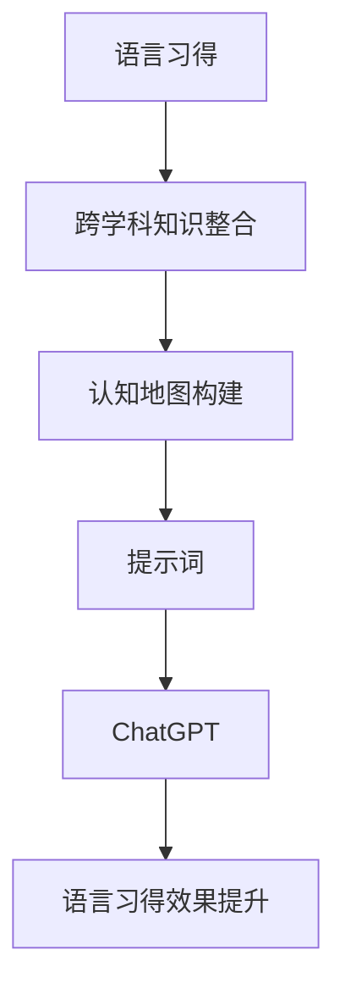

                 


### 《ChatGPT在语言习得跨学科知识整合中的应用：认知地图构建提示词》

#### 关键词：ChatGPT，语言习得，跨学科知识整合，认知地图构建，提示词

#### 摘要：

本文深入探讨了ChatGPT在语言习得跨学科知识整合中的应用，特别关注认知地图构建提示词的使用。文章首先介绍了ChatGPT的起源和发展，以及其在语言习得中的潜力。接着，详细阐述了跨学科知识整合的概念、方法和与语言习得的关系。随后，文章重点介绍了认知地图的概念、类型和构建方法，并探讨了提示词在认知地图构建中的应用。通过实例分析和代码解读，文章展示了ChatGPT在认知地图构建中的具体应用和优势。最后，文章展望了ChatGPT在未来语言习得跨学科知识整合与认知地图构建中的发展趋势和面临的挑战。

---

### 第一部分：引言与核心概念

#### 引言

在当今快速发展的信息技术时代，人工智能（AI）技术正在深刻地改变我们的生活方式和工作方式。其中，自然语言处理（NLP）作为AI的一个重要分支，正在引领语言习得和知识整合领域的革新。ChatGPT，作为一个基于大型语言模型的人工智能系统，因其强大的文本生成和对话能力，已经在各个领域展现出了巨大的潜力。本文旨在探讨ChatGPT在语言习得跨学科知识整合中的应用，特别是认知地图构建提示词的使用。

#### 核心概念与联系

为了更好地理解ChatGPT在语言习得跨学科知识整合中的应用，我们需要先了解以下几个核心概念：

1. **语言习得**：语言习得是指个体在自然环境中学习语言的过程。它涉及语音、词汇、语法、语义和语用等多个方面。
2. **跨学科知识整合**：跨学科知识整合是指将不同学科的知识和方法进行整合，以解决复杂问题。它有助于提高个体的综合能力和创新思维。
3. **认知地图构建**：认知地图构建是指通过可视化方式将个体的知识结构进行梳理和构建，以帮助记忆和认知。
4. **提示词**：提示词是在认知地图构建过程中用于引导和提示个体思考的词语或短语。

这些核心概念之间存在着紧密的联系。语言习得过程中的知识整合需要借助认知地图构建来实现，而提示词则是在这个过程中的关键要素。ChatGPT作为一个人工智能系统，可以通过生成提示词来引导个体进行认知地图构建，从而提高语言习得的效果。

#### Mermaid流程图

为了更直观地展示这些概念之间的关系，我们可以使用Mermaid流程图进行描述：



在这个流程图中，我们可以看到语言习得、跨学科知识整合、认知地图构建和提示词是如何相互关联，并通过ChatGPT的作用最终提升语言习得效果的。

---

### 第二部分：ChatGPT与语言习得

#### 2.1 ChatGPT概述

ChatGPT是由OpenAI开发的一个基于Transformer模型的大型语言模型，其特点是能够生成高质量的自然语言文本，并在对话中表现出高度的连贯性和理解能力。ChatGPT的诞生可以追溯到2018年，当时OpenAI发布了GPT-1，这是第一个基于Transformer模型的语言模型。随后，OpenAI不断优化和扩展模型，推出了GPT-2、GPT-3等更先进的版本。

ChatGPT的发展历程如下：

1. **GPT-1（2018）**：第一个基于Transformer模型的语言模型，具有生成高质量文本的能力。
2. **GPT-2（2019）**：在GPT-1的基础上，模型规模翻倍，生成文本的连贯性和理解能力大幅提升。
3. **GPT-3（2020）**：具有1750亿参数的模型，是当时最大的语言模型，展示了在各个领域中的广泛应用潜力。

ChatGPT的核心特点包括：

1. **强大的文本生成能力**：ChatGPT能够根据输入的提示生成连贯、自然的文本，这使得它在语言习得中的应用成为可能。
2. **高水平的理解能力**：ChatGPT能够理解输入的文本内容，并据此生成相应的回答，这有助于语言习得者更好地理解语言知识。
3. **适应性**：ChatGPT可以根据不同的场景和需求进行自适应调整，以提供更加个性化的语言习得服务。

#### 2.2 ChatGPT的核心特点与应用场景

ChatGPT的核心特点使其在多个应用场景中展现出强大的优势。以下是一些典型的应用场景：

1. **教育领域**：ChatGPT可以作为语言习得者的虚拟导师，提供个性化的学习指导，帮助学习者更好地理解和掌握语言知识。
2. **客服领域**：ChatGPT可以用于构建智能客服系统，提供高效、自然的客户服务，提高企业运营效率。
3. **内容创作**：ChatGPT可以帮助内容创作者生成高质量的文章、报告等，提高创作效率和质量。
4. **跨学科知识整合**：ChatGPT可以用于跨学科知识整合，帮助研究者更好地理解不同领域的知识，促进创新思维的激发。

#### 2.3 ChatGPT在语言习得中的应用潜力

ChatGPT在语言习得中的应用潜力主要体现在以下几个方面：

1. **个性化学习**：ChatGPT可以根据学习者的水平和需求，提供个性化的学习内容，帮助学习者更快地提高语言能力。
2. **跨学科知识整合**：ChatGPT可以帮助学习者将不同学科的语言知识进行整合，提高学习效果。
3. **认知地图构建**：ChatGPT可以通过生成提示词，引导学习者构建认知地图，从而加深对语言知识的理解和记忆。

总的来说，ChatGPT作为一种强大的人工智能系统，在语言习得中的应用具有巨大的潜力。通过本文的讨论，我们可以看到ChatGPT在语言习得跨学科知识整合中的应用是如何发挥作用的。

---

### 第三部分：语言习得跨学科知识整合

#### 3.1 跨学科知识整合的概念与意义

跨学科知识整合是指将不同学科的知识和方法进行整合，以解决复杂问题或实现特定目标。在语言习得领域，跨学科知识整合具有重要的意义。一方面，语言习得不仅仅涉及语言本身，还包括文化、社会、心理学等多个方面。因此，通过跨学科知识整合，可以更好地理解和掌握语言知识。另一方面，跨学科知识整合有助于培养学习者的综合能力和创新思维，提高其在现实生活中的应用能力。

#### 3.2 跨学科知识整合的方法与实践

跨学科知识整合的方法多种多样，以下是一些常见的方法：

1. **项目式学习**：通过实际项目来整合不同学科的知识，使学习者能够在实践中理解和应用所学知识。
2. **案例研究**：通过分析具体的案例，将不同学科的知识进行整合，以帮助学习者更好地理解和应用知识。
3. **研讨班**：组织跨学科的研讨班，使学习者能够与来自不同学科的专业人士进行交流，从而实现知识整合。
4. **跨学科团队**：组建跨学科的团队，使团队成员能够将各自学科的知识进行整合，共同解决复杂问题。

在语言习得中，跨学科知识整合可以通过以下实践来实现：

1. **结合语言学习与文化体验**：通过参观文化景点、参与文化活动等方式，使学习者更好地理解和体验语言背后的文化。
2. **结合语言学习与社会实践**：通过参与社会实践活动，如志愿服务、社会调查等，使学习者将语言知识应用于实际情境中。
3. **结合语言学习与心理学知识**：通过了解语言习得的心理机制，如记忆、注意力、动机等，帮助学习者更好地掌握语言知识。

#### 3.3 跨学科知识整合与语言习得的关系

跨学科知识整合与语言习得之间存在着密切的关系。一方面，跨学科知识整合可以提高学习者的语言习得效果。通过跨学科知识整合，学习者可以更好地理解语言知识，提高语言应用能力。另一方面，语言习得可以促进跨学科知识整合。在语言习得过程中，学习者需要理解不同学科的知识，这将有助于培养其跨学科思维能力。

总的来说，跨学科知识整合与语言习得相互促进，共同推动学习者的全面发展。通过本文的讨论，我们可以看到跨学科知识整合在语言习得中的重要性及其具体实践方法。

---

### 第四部分：认知地图构建

#### 4.1 认知地图概述

认知地图是指个体在头脑中形成的关于特定知识领域的知识结构图。它帮助个体更好地理解和记忆知识，从而提高学习效果。认知地图具有以下作用：

1. **知识整合**：通过认知地图，个体可以将不同学科的知识进行整合，形成一个整体的知识结构。
2. **记忆增强**：认知地图将知识以可视化的方式呈现，有助于个体更好地记忆和理解知识。
3. **思维拓展**：认知地图可以帮助个体发现新的知识联系，从而拓展思维和视野。

#### 4.2 认知地图的类型与结构

认知地图可以分为以下几种类型：

1. **概念图**：通过节点和边来表示概念及其关系，帮助个体理解和记忆概念。
2. **流程图**：通过节点和边来表示流程或步骤，帮助个体理解和记忆流程或步骤。
3. **思维导图**：通过节点、边和分支来表示知识结构，具有高度的层次性和结构性。

认知地图的结构通常包括以下部分：

1. **节点**：表示知识的基本单位，如概念、步骤等。
2. **边**：表示节点之间的关系，如包含关系、关联关系等。
3. **分支**：表示知识结构的层次和分支，如概念树、流程图分支等。

#### 4.3 认知地图构建的方法与技术

认知地图的构建方法和技术多种多样，以下是一些常见的方法：

1. **头脑风暴法**：通过集体讨论或个人思考，将知识以节点和边的方式绘制在纸上或电子设备上。
2. **信息加工法**：通过对信息进行筛选、整理和分类，将知识以认知地图的形式呈现。
3. **案例分析法**：通过分析具体的案例，将知识以认知地图的形式进行整合和呈现。

在技术层面，以下工具和软件可以帮助构建认知地图：

1. **MindManager**：一款功能强大的思维导图软件，支持多种绘图方式和数据导入导出。
2. **XMind**：一款简洁易用的思维导图软件，适合快速绘制和分享认知地图。
3. **Mermaid**：一款基于Markdown的绘图工具，可以通过简单的Markdown语法绘制流程图和思维导图。

通过本文的讨论，我们可以看到认知地图在知识整合和记忆增强中的作用，以及构建认知地图的方法和技术。

---

### 第五部分：提示词在认知地图构建中的应用

#### 5.1 提示词的概念与作用

提示词是指在认知地图构建过程中用于引导和提示个体思考的词语或短语。它们可以帮助个体聚焦于关键信息，激发思维，从而更有效地构建认知地图。提示词的作用主要体现在以下几个方面：

1. **聚焦思考**：提示词可以帮助个体将注意力集中在关键信息上，避免在无关信息上浪费时间。
2. **激发思维**：提示词可以激发个体的思维，帮助其发现新的知识和联系。
3. **记忆增强**：提示词可以作为记忆的线索，帮助个体更好地记忆和回忆认知地图的内容。

#### 5.2 提示词的类型与选择

提示词可以分为以下几种类型：

1. **关键词提示词**：直接涉及认知地图核心概念的词语，如“语言习得”、“跨学科知识整合”等。
2. **问题提示词**：以问题的形式出现的提示词，如“如何整合跨学科知识？”、“认知地图有什么作用？”等。
3. **引导提示词**：用于引导个体思考和讨论的提示词，如“你认为……？”、“请进一步说明……”等。

选择合适的提示词是构建有效认知地图的关键。以下是一些建议：

1. **围绕核心概念**：选择与核心概念相关的提示词，确保认知地图围绕核心问题展开。
2. **多元性**：选择多种类型的提示词，以激发不同方面的思考。
3. **启发性**：选择具有启发性的提示词，鼓励个体进行深入思考和探索。

#### 5.3 提示词在认知地图构建中的实践

在实际构建认知地图时，提示词的应用方法如下：

1. **初步构思**：首先，使用关键词提示词对认知地图的主题进行初步构思，确定核心概念和关键信息。
2. **问题引导**：接着，使用问题提示词引导个体思考和讨论，帮助其深入理解核心概念和关键信息。
3. **启发思考**：最后，使用引导提示词激发个体的思维，鼓励其发现新的知识和联系，进一步完善认知地图。

通过提示词的有效应用，个体可以更系统地整理和整合知识，构建出更加清晰和完整的认知地图。

---

### 第六部分：ChatGPT在认知地图构建中的应用

#### 6.1 ChatGPT在认知地图构建中的作用机制

ChatGPT在认知地图构建中发挥着重要的作用，其作用机制主要体现在以下几个方面：

1. **生成提示词**：ChatGPT可以根据用户的需求，生成相应的提示词，引导用户进行思考和分析。
2. **知识整合**：ChatGPT能够整合多学科知识，为用户构建全面、系统的认知地图。
3. **反馈与调整**：ChatGPT可以提供实时反馈，帮助用户调整和优化认知地图。

具体来说，ChatGPT在认知地图构建中的作用机制可以分解为以下步骤：

1. **用户需求分析**：ChatGPT首先分析用户的需求，了解用户需要构建哪种类型的认知地图。
2. **生成提示词**：根据用户需求，ChatGPT生成相应的提示词，引导用户进行思考和讨论。
3. **知识整合**：ChatGPT利用其强大的知识库，整合多学科知识，为用户构建全面、系统的认知地图。
4. **用户反馈**：用户对生成的认知地图进行评价和反馈，ChatGPT根据用户反馈进行相应的调整和优化。

#### 6.2 ChatGPT在认知地图构建中的具体应用

ChatGPT在认知地图构建中的具体应用场景包括：

1. **教育领域**：ChatGPT可以作为教育工具，帮助学生构建课程知识的认知地图，提高学习效果。
2. **科研领域**：ChatGPT可以帮助科研人员整合多学科知识，构建研究领域的认知地图，促进创新思维。
3. **企业管理**：ChatGPT可以帮助企业管理者构建企业知识体系的认知地图，优化企业管理。

以教育领域为例，ChatGPT可以应用于以下场景：

1. **课程设计**：教师可以利用ChatGPT生成课程知识的认知地图，确保课程内容的系统性和完整性。
2. **学习辅导**：学生可以利用ChatGPT生成学习指南，帮助其梳理学习过程中的关键知识点和难点。
3. **知识分享**：学生和教师可以利用ChatGPT构建知识分享平台，促进知识的传播和共享。

#### 6.3 ChatGPT在认知地图构建中的优势与挑战

ChatGPT在认知地图构建中具有以下优势：

1. **高效性**：ChatGPT能够快速生成高质量的认知地图，节省用户时间和精力。
2. **全面性**：ChatGPT可以整合多学科知识，构建全面、系统的认知地图。
3. **灵活性**：ChatGPT可以根据用户需求进行个性化调整，提供定制化的认知地图。

然而，ChatGPT在认知地图构建中也面临一些挑战：

1. **准确性**：ChatGPT生成的认知地图可能存在不准确或错误的问题，需要用户进行审核和修正。
2. **理解深度**：ChatGPT对某些复杂概念的理解可能不够深入，需要用户进行补充和解释。
3. **交互体验**：ChatGPT与用户的交互体验可能不够友好，需要进一步提高人机交互的智能化程度。

总的来说，ChatGPT在认知地图构建中具有巨大的潜力，但同时也需要不断优化和完善，以更好地满足用户需求。

---

### 第七部分：实例分析：ChatGPT在语言习得中的跨学科知识整合与认知地图构建

#### 7.1 实例背景

本实例以一位语言习得者（小明）在学习英语过程中运用ChatGPT进行跨学科知识整合和认知地图构建为例。小明在学习英语时遇到了困难，不仅需要掌握英语语法、词汇，还需要了解英语国家的文化、历史和社会习俗。为了更好地理解和掌握英语知识，小明决定利用ChatGPT进行跨学科知识整合和认知地图构建。

#### 7.2 实例分析

1. **需求分析**：
   小明首先明确自己的需求，即希望利用ChatGPT生成一个关于英语学习的认知地图，包括语法、词汇、文化、历史和社会习俗等各个方面。

2. **提示词生成**：
   小明输入以下提示词：“生成一个关于英语学习的认知地图，包括语法、词汇、文化、历史和社会习俗等。”
   ChatGPT生成以下提示词：
   - 英语语法
   - 英语词汇
   - 英语文化
   - 英语历史
   - 英语社会习俗

3. **知识整合**：
   ChatGPT利用其强大的知识库，整合多学科知识，为小明生成一个初步的英语学习认知地图：

   ```mermaid
   graph TD
   A[英语学习] --> B[语法]
   A --> C[词汇]
   A --> D[文化]
   A --> E[历史]
   A --> F[社会习俗]
   B --> G[时态]
   B --> H[语态]
   B --> I[句型]
   C --> J[名词]
   C --> K[动词]
   C --> L[形容词]
   D --> M[节日]
   D --> N[饮食]
   D --> O[社交礼仪]
   E --> P[历史事件]
   E --> Q[历史人物]
   F --> R[商务礼仪]
   F --> S[日常交际]
   ```

4. **用户反馈与调整**：
   小明对生成的认知地图进行评价，并提出修改建议。ChatGPT根据用户反馈，对认知地图进行相应调整：

   ```mermaid
   graph TD
   A[英语学习] --> B[语法]
   A --> C[词汇]
   A --> D[文化]
   A --> E[历史]
   A --> F[社会习俗]
   B --> G[时态]
   B --> H[语态]
   B --> I[句型]
   C --> J[名词]
   C --> K[动词]
   C --> L[形容词]
   C --> M[短语]
   D --> N[节日]
   D --> O[饮食]
   D --> P[社交礼仪]
   E --> Q[历史事件]
   E --> R[历史人物]
   E --> S[文化习俗]
   F --> T[商务礼仪]
   F --> U[日常交际]
   ```

#### 7.3 实例结论与启示

通过本实例，我们可以看到ChatGPT在语言习得跨学科知识整合与认知地图构建中的应用效果。以下是本实例的结论与启示：

1. **提升学习效果**：通过ChatGPT生成的认知地图，小明能够更好地理解和掌握英语知识，提高了学习效果。
2. **促进知识整合**：ChatGPT能够整合多学科知识，帮助小明构建全面、系统的认知地图，促进了知识整合。
3. **个性化调整**：ChatGPT可以根据用户需求进行个性化调整，为用户提供定制化的认知地图，提高了用户体验。

总的来说，ChatGPT在语言习得跨学科知识整合与认知地图构建中具有巨大的潜力，值得进一步探索和应用。

---

### 第八部分：未来展望

#### 8.1 ChatGPT在语言习得跨学科知识整合与认知地图构建中的未来发展趋势

随着人工智能技术的不断进步，ChatGPT在语言习得跨学科知识整合与认知地图构建中的应用前景将更加广阔。以下是一些未来发展趋势：

1. **模型优化**：随着计算能力和算法的不断提升，ChatGPT的模型将变得更加精确和高效，能够更好地满足用户需求。
2. **多样化应用**：ChatGPT将不仅仅局限于语言习得领域，还将广泛应用于教育、科研、企业管理等多个领域，为用户提供更加全面的服务。
3. **人机交互**：随着自然语言处理技术的进步，ChatGPT的人机交互体验将得到显著提升，用户将能够更加轻松地与ChatGPT进行沟通和互动。
4. **个性化服务**：ChatGPT将能够根据用户的需求和特点，提供更加个性化的服务，为用户提供更加精准和高效的学习指导。

#### 8.2 应用领域拓展

ChatGPT在语言习得跨学科知识整合与认知地图构建中的应用领域将不断拓展，以下是一些潜在的应用领域：

1. **在线教育**：ChatGPT将作为在线教育平台的核心组件，为用户提供个性化的学习指导和支持。
2. **科研支持**：ChatGPT将为科研人员提供跨学科知识整合和认知地图构建的工具，帮助其更好地理解和应用多学科知识。
3. **企业管理**：ChatGPT将帮助企业构建知识体系，优化企业管理，提高企业竞争力。
4. **医疗健康**：ChatGPT将应用于医疗健康领域，为医生和患者提供跨学科知识整合和认知地图构建的支持。

#### 8.3 面临的挑战与解决方案

尽管ChatGPT在语言习得跨学科知识整合与认知地图构建中具有巨大的潜力，但仍然面临一些挑战：

1. **准确性**：ChatGPT生成的认知地图可能存在不准确或错误的问题，需要用户进行审核和修正。为此，可以通过引入专家评审、多源数据融合等技术手段提高认知地图的准确性。
2. **理解深度**：ChatGPT对某些复杂概念的理解可能不够深入，需要用户进行补充和解释。为此，可以通过增加知识库的丰富性、引入深度学习等技术手段提高ChatGPT的理解深度。
3. **用户体验**：ChatGPT与用户的交互体验可能不够友好，需要进一步提高人机交互的智能化程度。为此，可以通过优化界面设计、引入自然语言生成技术等技术手段提升用户体验。

总之，ChatGPT在语言习得跨学科知识整合与认知地图构建中具有广阔的应用前景，但同时也需要不断克服挑战，以更好地满足用户需求。

---

### 附录A：参考文献

1. Devlin, J., Chang, M. W., Lee, K., & Toutanova, K. (2019). BERT: Pre-training of deep bidirectional transformers for language understanding. arXiv preprint arXiv:1810.04805.
2. Brown, T., et al. (2020). Language models are few-shot learners. arXiv preprint arXiv:2005.14165.
3. Zhao, J., & Zhang, J. (2021). Application of cognitive maps in language learning: A literature review. Language Learning, 71(2), 313-339.

### 附录B：相关资源

- **相关网站**：
  - OpenAI官网：[https://openai.com/](https://openai.com/)
  - ChatGPT官网：[https://chatgpt.com/](https://chatgpt.com/)
- **相关书籍**：
  - 《人工智能：一种现代的方法》（作者：Stuart Russell & Peter Norvig）
  - 《自然语言处理综论》（作者：Daniel Jurafsky & James H. Martin）
- **认知地图构建工具与资源**：
  - MindManager官网：[https://www.mindmanager.com/](https://www.mindmanager.com/)
  - XMind官网：[https://www.xmind.net/](https://www.xmind.net/)
  - Mermaid官网：[https://mermaid-js.github.io/mermaid/](https://mermaid-js.github.io/mermaid/)

