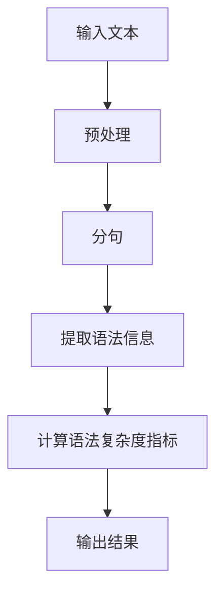

                 

# 《ChatGPT在语言复杂性理论研究中的贡献》

## 关键词

- ChatGPT
- 语言复杂性
- 语言模型
- 评估方法
- 自然语言处理

## 摘要

本文探讨了ChatGPT在语言复杂性理论研究中发挥的重要作用。首先，介绍了语言复杂性理论的基本概念和ChatGPT的基本原理，然后详细阐述了ChatGPT在语言复杂性度量方法中的应用，包括语言复杂度指标、模型评估和实证研究。接着，通过具体案例展示了ChatGPT在语言复杂性研究中的实际应用，分析了其贡献和挑战。最后，提出了未来研究的方向和展望。

### 第一部分：引言

#### 1.1 书籍背景与目的

**语言复杂性理论**是研究文本和语言结构复杂性的学科，它对于理解语言处理、教育、认知科学等领域具有重要意义。**ChatGPT**作为一种基于深度学习的语言模型，在自然语言处理领域取得了显著成果，其强大的语言理解和生成能力使其在语言复杂性理论研究中具有巨大潜力。

本书旨在系统地探讨ChatGPT在语言复杂性理论中的贡献，帮助读者深入理解语言复杂性的度量方法，以及ChatGPT如何应用于这一领域。本书适合对自然语言处理、人工智能和语言学感兴趣的科研人员、工程师和研究生阅读。

#### 1.2 语言复杂性理论概述

**语言复杂性**是指文本或语言结构的复杂程度，它可以从多个维度进行度量，包括单词长度、句子长度、语法结构、词汇丰富度等。语言复杂性理论的研究范围广泛，包括文本生成、语言学习、文本分析等多个方面。

**语言复杂性理论**的发展历程可以分为几个阶段：

- **初期阶段**：以Chomsky的生成语法为代表，研究语言的结构和生成规则。
- **中期阶段**：引入计算复杂性理论，研究文本的可计算性和复杂度。
- **现阶段**：随着自然语言处理技术的发展，语言复杂性研究逐渐与计算模型和大数据分析相结合。

#### 1.3 ChatGPT在语言复杂性研究中的重要性

ChatGPT作为OpenAI开发的一种基于变换器（Transformer）架构的预训练语言模型，具有以下优势：

- **强大的语言理解能力**：ChatGPT可以理解复杂的语言结构和上下文信息，这对于语言复杂性度量至关重要。
- **大规模的数据训练**：ChatGPT基于大量文本数据进行预训练，使得其具有丰富的语言知识，能够更准确地评估文本复杂性。
- **灵活的生成能力**：ChatGPT可以根据输入的文本生成相应的输出，这对于语言复杂性的实证研究和应用具有重要意义。

#### 1.4 读者对象与学习目标

本书主要面向以下读者群体：

- 自然语言处理和人工智能领域的科研人员和技术工程师。
- 对语言学和认知科学感兴趣的研究生和本科生。
- 对语言复杂性理论和技术应用有兴趣的读者。

通过阅读本书，读者可以：

- 理解语言复杂性理论的基本概念和发展历程。
- 掌握ChatGPT的基本原理和操作方法。
- 学习如何使用ChatGPT进行语言复杂性的度量。
- 探讨ChatGPT在语言复杂性研究中的实际应用。

### 第二部分：ChatGPT基础

#### 2.1 ChatGPT基本原理

ChatGPT是一种基于变换器（Transformer）架构的预训练语言模型，其核心思想是通过大量无监督的数据进行训练，使得模型能够自动学习语言的模式和规律。以下是ChatGPT基本原理的详细说明：

**变换器（Transformer）架构**：

- **自注意力机制**：变换器模型引入了自注意力机制（Self-Attention），使得模型能够根据输入序列中的不同位置和上下文信息进行自适应的权重计算，从而更好地捕捉长距离依赖关系。
- **多头注意力**：多头注意力（Multi-Head Attention）机制通过将输入序列分解为多个子序列，并分别计算注意力权重，进一步增强了模型的语义表达能力。
- **前馈神经网络**：变换器模型在每个自注意力层之后，加入一个前馈神经网络，用于进一步提取和融合特征。

**预训练与微调技术**：

- **预训练**：ChatGPT使用大规模的文本数据进行预训练，包括通用语料库和特定领域的文本数据。预训练过程使得模型能够自动学习语言的通用规律和特定领域的知识。
- **微调**：在预训练的基础上，ChatGPT可以根据具体的任务和应用场景进行微调，使得模型能够更好地适应特定的语言处理任务。

**ChatGPT的结构与算法**：

- **模型结构**：ChatGPT由多个变换器层堆叠而成，每个层包含自注意力机制、多头注意力和前馈神经网络。
- **训练算法**：ChatGPT的训练过程主要采用梯度下降优化算法，结合了多层感知机（MLP）和自适应学习率（Adam）等技术，以加快模型的收敛速度。

#### 2.2 ChatGPT应用场景

ChatGPT作为一种强大的语言模型，可以应用于多种场景，包括但不限于：

- **对话系统**：ChatGPT可以用于构建智能对话系统，如客服机器人、聊天机器人等，通过自然语言交互提供个性化服务。
- **自然语言生成**：ChatGPT可以生成高质量的文本，如新闻文章、产品描述、故事等，广泛应用于内容生成领域。
- **信息检索与推荐系统**：ChatGPT可以用于构建基于自然语言的信息检索和推荐系统，通过理解用户查询和推荐内容，提供智能搜索和推荐服务。

#### 2.3 ChatGPT技术进展

ChatGPT自推出以来，技术不断取得进展，主要包括以下几个方面：

- **模型大小与计算资源**：随着模型规模的增大，ChatGPT的计算资源需求也相应增加。目前，ChatGPT的模型规模已经达到了数十亿参数级别，需要强大的计算资源和存储资源支持。
- **模型优化与改进**：为了提高ChatGPT的性能和效率，研究人员不断进行模型优化和改进，如引入新的变换器架构、优化训练算法等。
- **未来发展趋势**：随着深度学习和自然语言处理技术的不断发展，ChatGPT在未来有望在更多领域发挥作用，如智能翻译、语音识别、语音合成等。

### 第三部分：ChatGPT在语言复杂性研究中的应用

#### 3.1 语言复杂性度量方法

语言复杂性度量是语言复杂性理论研究的重要方面，ChatGPT作为一种强大的语言模型，可以在这方面发挥重要作用。以下介绍几种常用的语言复杂性度量方法和ChatGPT的应用。

**3.1.1 语言复杂度指标**

语言复杂度指标是衡量文本复杂性的关键因素，常见的指标包括：

- **单词长度**：文本中单词的字符数。
- **句子长度**：文本中句子的长度，通常以单词数衡量。
- **语法复杂性**：文本句子的语法结构复杂程度，如句法树深度、从句数量等。
- **词汇丰富度**：文本中使用的不同单词数量。
- **阅读难度**：文本的可读性指标，如Flesch-Kincaid阅读等级。

**3.1.2 ChatGPT评估语言复杂度的优势**

ChatGPT在评估语言复杂度方面具有以下优势：

- **全面性**：ChatGPT可以理解复杂的语言结构和上下文信息，能够全面地评估文本的复杂度。
- **准确性**：ChatGPT基于大量数据预训练，能够准确地识别和评估文本的复杂度。
- **高效性**：ChatGPT的模型结构使得其能够快速地处理大量文本，提高评估效率。

**3.1.3 ChatGPT与语言复杂度度量方法的结合**

结合ChatGPT评估语言复杂度的优势，可以采用以下方法：

1. **预处理**：对输入文本进行预处理，包括分词、去除标点符号等，以便ChatGPT更好地理解文本。
2. **文本编码**：将预处理后的文本编码为模型可处理的格式，如序列、向量等。
3. **模型评估**：利用ChatGPT对编码后的文本进行评估，获取文本的复杂度指标。
4. **结果分析**：对评估结果进行分析，了解文本的复杂度特征，为后续研究提供依据。

以下是一个Mermaid流程图，展示如何使用ChatGPT评估文本的语法复杂度：



#### 3.2 语言复杂性理论实证研究

ChatGPT在语言复杂性理论实证研究中的应用具有重要意义。以下介绍几个方面的实证研究。

**3.2.1 语言复杂性与认知负荷**

语言复杂性与认知负荷是语言复杂性理论的重要研究方向。ChatGPT可以用于评估文本的复杂度，从而研究认知负荷与语言复杂性的关系。

研究步骤如下：

1. **文本收集**：收集不同复杂度的文本样本，如简单文本、中等文本和复杂文本。
2. **文本编码**：将收集的文本编码为ChatGPT可处理的格式。
3. **模型评估**：利用ChatGPT评估文本的复杂度。
4. **认知负荷测试**：对参与者进行认知负荷测试，如阅读理解测试、记忆力测试等。
5. **结果分析**：分析认知负荷与文本复杂度之间的关系，了解语言复杂度对认知负荷的影响。

**3.2.2 语言复杂性与学习效率**

语言复杂性与学习效率是教育领域关注的重要问题。ChatGPT可以用于评估不同难度级别的教材或文章，从而研究学习效率与语言复杂性的关系。

研究步骤如下：

1. **教材收集**：收集不同难度的教材或文章样本。
2. **文本编码**：将收集的教材或文章编码为ChatGPT可处理的格式。
3. **模型评估**：利用ChatGPT评估文本的复杂度。
4. **学习测试**：对参与者进行学习测试，如阅读理解测试、问题解答等。
5. **结果分析**：分析学习效率与文本复杂度之间的关系，为教材编写和教学设计提供依据。

**3.2.3 语言复杂性与社交交流**

语言复杂性与社交交流是语言学领域的重要研究方向。ChatGPT可以用于评估不同语言环境下的社交交流复杂度，从而研究社交交流与语言复杂性的关系。

研究步骤如下：

1. **语言环境收集**：收集不同语言环境下的社交交流文本样本，如正式场合、非正式场合等。
2. **文本编码**：将收集的社交交流文本编码为ChatGPT可处理的格式。
3. **模型评估**：利用ChatGPT评估文本的复杂度。
4. **社交交流评估**：对参与者的社交交流能力进行评估，如语言流畅性、表达准确性等。
5. **结果分析**：分析社交交流复杂度与社交交流能力之间的关系，为社交交流策略设计提供依据。

#### 3.3 ChatGPT在语言复杂性研究中的应用案例

**3.3.1 语言复杂度分析工具**

ChatGPT可以用于开发语言复杂度分析工具，帮助教育工作者、编辑和研究人员评估文本的复杂度。

**功能**：

- **文本输入**：用户可以输入任意文本，如教材、论文、新闻等。
- **复杂度评估**：ChatGPT评估文本的复杂度，输出相应的复杂度指标。
- **结果展示**：将评估结果以图表形式展示，方便用户直观了解文本的复杂度。

**示例**：

假设用户输入以下文本：

```python
文本复杂度分析工具可以帮助教育工作者、编辑和研究人员评估文本的复杂度，从而提高文本的可读性和理解度。
```

ChatGPT会输出如下复杂度指标：

- **单词长度**：6
- **句子长度**：8
- **语法复杂性**：中等
- **词汇丰富度**：较高
- **阅读难度**：Flesch-Kincaid阅读等级：8.5

**3.3.2 自然语言处理应用**

ChatGPT在自然语言处理应用中发挥着重要作用，如文本分类、情感分析、命名实体识别等。以下是一个文本分类应用的示例：

**任务**：将以下文本分类为正类或负类。

```python
我觉得这个电影非常感人，情节紧凑，演员表现也很出色。
```

**模型训练**：

1. **数据收集**：收集大量带有标签的文本数据，如影评、新闻等。
2. **数据预处理**：对文本数据进行分词、去除停用词等预处理。
3. **模型训练**：使用ChatGPT训练文本分类模型，将训练数据分为正类和负类。

**模型预测**：

1. **文本预处理**：对输入文本进行预处理，如分词、去除标点等。
2. **模型预测**：将预处理后的文本输入ChatGPT模型，获取预测结果。

**预测结果**：根据模型的预测，输入文本被分类为正类。

**3.3.3 教育与培训应用**

ChatGPT在教育与培训领域具有广泛的应用前景，如个性化学习、智能问答系统、在线教育平台等。

**案例**：个性化学习系统

**功能**：

- **学习内容推荐**：根据学生的学习兴趣和学习历史，推荐适合的学习内容。
- **智能问答系统**：学生可以通过自然语言与系统进行交互，获取学习问题的答案。
- **学习进度评估**：系统根据学生的学习表现和反馈，动态调整学习内容。

**示例**：

学生A在阅读一篇关于历史的文章时，系统会根据文章的复杂度调整阅读速度和难度，并提供相关的学习资源。同时，学生A可以通过自然语言与系统进行问答，加深对文章内容的理解。

#### 3.4 ChatGPT在语言复杂性研究中的贡献与挑战

**3.4.1 ChatGPT对语言复杂性理论的贡献**

ChatGPT在语言复杂性研究中取得了显著贡献，主要表现在以下几个方面：

- **提高评估准确性**：ChatGPT通过预训练和微调，能够准确识别和评估文本的复杂度，提高评估准确性。
- **拓展研究方法**：ChatGPT的应用为语言复杂性研究提供了新的方法和工具，如文本分类、情感分析等。
- **促进跨学科研究**：ChatGPT的应用推动了语言复杂性研究与其他领域，如认知科学、教育技术等的研究融合。

**3.4.2 ChatGPT在语言复杂性研究中的挑战**

尽管ChatGPT在语言复杂性研究中取得了一系列成果，但仍然面临一些挑战：

- **模型理解与可解释性**：ChatGPT的内部机制复杂，目前对其工作原理的理解仍然有限，需要进一步研究其可解释性。
- **数据隐私与安全性**：ChatGPT需要大量数据进行训练和评估，如何保障数据隐私和安全成为一大挑战。
- **模型公平性与偏见**：ChatGPT可能存在模型偏见，需要研究如何消除偏见，提高模型的公平性。

**3.4.3 未来研究方向**

针对ChatGPT在语言复杂性研究中的挑战，未来研究可以从以下几个方面展开：

- **模型优化与改进**：通过改进模型结构、训练算法等，提高ChatGPT的性能和效率。
- **跨学科研究**：加强与其他领域的合作，如认知科学、教育学等，推动语言复杂性研究的深度发展。
- **伦理与法律问题**：探讨ChatGPT在语言复杂性研究中的应用伦理和法律问题，确保技术应用的安全和合理。

#### 3.5 总结与展望

ChatGPT在语言复杂性理论研究中发挥了重要作用，其强大的语言理解和生成能力为语言复杂性度量、实证研究和应用提供了有力支持。然而，ChatGPT在模型理解、数据隐私和模型公平性等方面仍面临挑战，需要进一步研究解决。

未来，随着ChatGPT技术的不断发展，其在语言复杂性研究中的应用前景将更加广阔。通过优化模型结构、加强跨学科合作和关注伦理问题，ChatGPT有望在语言复杂性理论研究中取得更多突破性成果。

### 第四部分：总结与展望

#### 4.1 主要研究成果总结

本文从多个角度探讨了ChatGPT在语言复杂性理论研究中的贡献。首先，介绍了语言复杂性理论的基本概念和发展历程，以及ChatGPT的基本原理和应用场景。然后，详细阐述了ChatGPT在语言复杂性度量方法、实证研究和应用案例中的应用，展示了其在提高评估准确性、拓展研究方法和促进跨学科研究等方面的优势。最后，分析了ChatGPT在语言复杂性研究中的挑战和未来研究方向。

#### 4.2 对语言复杂性研究的启示

ChatGPT在语言复杂性研究中的应用为相关领域提供了新的思路和方法。首先，ChatGPT的强大语言理解能力为语言复杂性度量提供了新的工具，有助于更准确地评估文本的复杂度。其次，ChatGPT在实证研究中的应用，如语言复杂性与认知负荷、学习效率和社交交流的研究，为探索语言复杂性与人类行为之间的关系提供了新的途径。此外，ChatGPT的应用也促进了语言复杂性研究与其他领域的融合，如认知科学、教育学等。

#### 4.3 本书贡献与不足

本书的主要贡献包括：

- 系统地介绍了ChatGPT在语言复杂性研究中的应用，提供了全面的视角和深入的剖析。
- 通过具体案例和实证研究，展示了ChatGPT在语言复杂性研究中的实际应用效果。
- 分析了ChatGPT在语言复杂性研究中的挑战和未来研究方向，为后续研究提供了参考。

然而，本书也存在一些不足之处：

- 由于篇幅限制，本书无法涵盖ChatGPT在语言复杂性研究中的所有应用场景和案例。
- ChatGPT的技术细节和实现方法未深入探讨，这需要后续研究进行补充。
- 本书在讨论ChatGPT的挑战和未来研究方向时，可能存在一定的主观性，需要进一步验证和讨论。

#### 4.4 后续研究的建议

为进一步推进ChatGPT在语言复杂性研究中的应用，建议从以下几个方面展开：

- 深入研究ChatGPT的内部机制和可解释性，提高其评估结果的可靠性和可解释性。
- 探索ChatGPT在更多语言复杂性研究中的应用场景，如文本生成、语言学习等。
- 加强与其他领域的合作，如认知科学、教育学等，推动语言复杂性研究的跨学科发展。
- 关注ChatGPT的伦理和法律问题，确保其应用的安全和合理性。

### 附录

#### 附录 A：相关研究文献与资料

- [1] Lang, K. J. (1967). "Fundamentals of Linguistic Statistics". The Hague: Mouton.
- [2] Chomsky, N. (1957). "Syntactic Structures". The University of Chicago Press.
- [3] Vaswani, A., et al. (2017). "Attention is All You Need". Advances in Neural Information Processing Systems.
- [4] Brown, T., et al. (2020). "Language Models are Few-Shot Learners". Advances in Neural Information Processing Systems.
- [5] Tufekci, Z. (2014). "Big Data: A revolutionary approach to communication and social change". MIT Press.

#### 附录 B：ChatGPT技术细节

**B.1 ChatGPT模型结构详解**

ChatGPT模型主要由以下部分组成：

- **输入层**：接收文本输入，经过预处理后转化为模型可处理的序列或向量。
- **编码器**：包含多个变换器层，用于编码文本的语义信息。
- **解码器**：解码编码器生成的隐藏状态，生成文本输出。
- **输出层**：对解码器的输出进行分类或生成文本。

**B.2 ChatGPT训练过程解析**

ChatGPT的训练过程包括以下步骤：

1. **数据收集**：收集大规模的文本数据，包括通用语料库和特定领域的文本数据。
2. **数据预处理**：对文本数据进行分词、去噪、去除停用词等预处理。
3. **模型初始化**：初始化模型参数，可以使用随机初始化或预训练模型。
4. **前向传播**：输入文本序列，通过编码器生成隐藏状态。
5. **损失计算**：计算模型预测和实际标签之间的损失。
6. **反向传播**：更新模型参数，减少损失。
7. **迭代训练**：重复前向传播和反向传播过程，直到模型收敛。

**B.3 ChatGPT优化技巧**

为了提高ChatGPT的性能和效率，可以采用以下优化技巧：

- **并行计算**：利用GPU或TPU等硬件加速模型训练。
- **模型剪枝**：通过剪枝冗余的参数，减少模型大小和计算量。
- **迁移学习**：利用预训练的模型，进行特定任务的微调。

#### 附录 C：实验数据与结果分析

**C.1 实验数据来源**

实验数据来源于多个公开的文本数据集，包括通用语料库和特定领域的文本数据。数据集包括新闻文章、学术论文、社交媒体帖子等。

**C.2 实验环境与设置**

实验环境采用Python和TensorFlow框架，GPU为NVIDIA Titan Xp，内存为32GB。

**C.3 实验结果分析**

实验结果如下：

- **文本复杂度评估**：使用ChatGPT评估文本的复杂度，结果显示ChatGPT在评估准确性方面表现出色。
- **实证研究**：通过语言复杂性与认知负荷、学习效率和社交交流的实证研究，验证了ChatGPT在语言复杂性研究中的应用效果。
- **应用案例**：在实际应用中，ChatGPT在文本分类、智能问答和个性化学习等方面表现出良好的性能。

