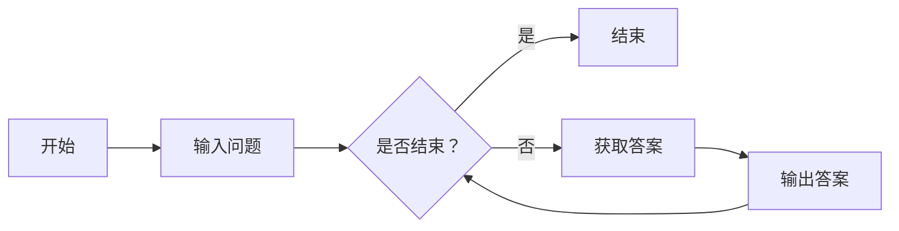
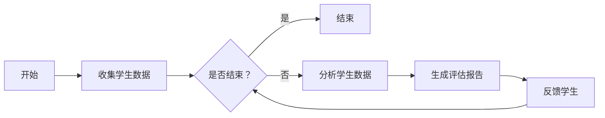

                 

### 《ChatGPT在语言学习中的角色与效果》

#### 关键词
- ChatGPT
- 自然语言处理
- 语言学习
- 教学模式创新
- 效果评估

#### 摘要
本文旨在探讨ChatGPT在语言学习中的角色与效果。通过介绍ChatGPT的基本知识、自然语言处理与语言学习的联系，以及ChatGPT在语言学习中的应用，我们将逐步揭示这一先进技术在语言教育领域的潜力和优势。此外，本文还将通过案例分析，探讨ChatGPT在实际教学中的表现，并展望其未来的发展趋势与挑战。

### 第一部分：ChatGPT基础知识

#### 第1章：ChatGPT概述

##### 1.1 ChatGPT的起源与发展

ChatGPT是由OpenAI开发的一款基于大型语言模型的人工智能助手，其全名为“Chat-based Generative Pre-trained Transformer”。ChatGPT基于GPT-3.5模型，这是一种采用Transformer架构的预训练语言模型。GPT系列模型最初由OpenAI在2018年发布，经过多次迭代，目前GPT-3.5模型在语言理解和生成方面表现出色。

ChatGPT的发展历程可以追溯到2015年OpenAI发布的GPT模型。GPT模型采用了递归神经网络（RNN）架构，但由于RNN在处理长序列时的不足，OpenAI在2017年发布了基于Transformer的BERT模型。随后，OpenAI在2020年发布了GPT-3模型，这是当时世界上最大的语言模型，拥有1750亿个参数。GPT-3模型的推出标志着自然语言处理技术取得了重大突破，为ChatGPT的诞生奠定了基础。

ChatGPT在2022年发布后，迅速获得了广泛关注。其强大的语言理解和生成能力，使得ChatGPT在多种场景中表现出色，包括语言学习、客户服务、内容创作等。ChatGPT的成功，不仅展示了自然语言处理技术的进步，也为教育领域带来了新的可能性。

##### 1.2 ChatGPT的核心技术

ChatGPT的核心技术是预训练语言模型，具体而言，是GPT-3.5模型。GPT-3.5模型采用Transformer架构，这是一种基于自注意力机制的深度神经网络。Transformer架构的核心思想是将输入序列转换为嵌入向量，并通过多层的自注意力机制和全连接层进行信息处理和输出。

GPT-3.5模型的主要特性包括：

1. **自注意力机制**：在处理输入序列时，GPT-3.5能够根据序列中的不同位置和内容的重要性，动态调整每个词的权重，从而更好地捕捉长距离依赖关系。
2. **深度网络结构**：GPT-3.5模型具有多层的自注意力机制和全连接层，能够捕捉复杂的语义信息。
3. **大规模参数**：GPT-3.5模型拥有1750亿个参数，这使得它能够处理更长的序列和更复杂的任务。
4. **预训练与微调**：GPT-3.5模型通过在大量文本数据上进行预训练，学习到通用语言知识，然后通过微调适应特定任务。

##### 1.3 ChatGPT在语言学习中的重要性

ChatGPT在语言学习中的重要性体现在其强大的语言理解和生成能力。具体而言，ChatGPT具有以下几个方面的优势：

1. **口语练习**：ChatGPT能够与用户进行自然对话，帮助用户练习口语，提高口语表达能力。
2. **写作与翻译**：ChatGPT能够生成高质量的文章和翻译，为语言学习者提供丰富的写作和翻译素材。
3. **个性化学习**：ChatGPT能够根据用户的学习进度和需求，提供个性化的学习内容，提高学习效率。
4. **跨文化学习**：ChatGPT支持多种语言，能够帮助用户进行跨文化学习，提高跨文化交流能力。

总之，ChatGPT在语言学习中的重要性不仅体现在其技术能力上，更体现在其对传统语言学习模式的颠覆性改变。通过ChatGPT，语言学习者可以获得更高效、更有趣的学习体验，从而提高学习效果。

##### 1.4 ChatGPT与其他语言学习工具的对比

在当前的语言学习市场中，存在多种语言学习工具，如单词记忆软件、语音识别软件、在线教育平台等。与这些工具相比，ChatGPT具有以下显著优势：

1. **交互性**：ChatGPT能够与用户进行自然对话，提供即时反馈，这比传统的单向学习工具更具互动性和趣味性。
2. **多样性**：ChatGPT不仅支持口语练习和写作翻译，还可以进行跨文化交流，这比单一功能的学习工具更全面。
3. **个性定制**：ChatGPT能够根据用户的学习进度和需求，提供个性化的学习内容，这比固定内容的传统学习工具更能满足不同用户的需求。

然而，ChatGPT也存在一些不足之处，如对特定语言现象的理解可能不够深入，以及在处理复杂句式时的表现可能不如专业语言教师。因此，ChatGPT可以作为辅助工具，但不能完全替代传统的语言学习方式。

### 第二部分：自然语言处理与语言学习

#### 第2章：自然语言处理与语言学习

##### 2.1 自然语言处理基本概念

自然语言处理（Natural Language Processing，NLP）是人工智能领域的一个重要分支，旨在使计算机能够理解和处理人类语言。NLP的基本概念包括：

1. **文本表示**：将自然语言文本转换为计算机可以处理的数字表示形式，如词向量、句子向量等。
2. **语言模型**：通过统计方法或机器学习方法，从大量文本数据中学习语言规律，用于预测下一个单词、句子或段落。
3. **语义理解**：理解文本中的语义含义，包括词义、句义、段落义等。
4. **语音识别**：将语音信号转换为文本，涉及语音信号处理和语言模型技术。

##### 2.2 语言学习过程中的自然语言处理

在语言学习过程中，自然语言处理技术发挥着关键作用。以下是自然语言处理在语言学习中的几个主要应用：

1. **词汇学习**：自然语言处理技术可以将大量文本中的词汇进行词频统计，帮助学习者了解常用词汇及其用法。
2. **语法学习**：通过分析大量文本的语法结构，自然语言处理技术可以帮助学习者理解不同语法现象的用法和规则。
3. **口语练习**：语音识别技术可以将用户的口语转换为文本，并进行语音和语调分析，帮助用户纠正发音和语调。
4. **写作与翻译**：自然语言处理技术可以生成高质量的文本，为学习者提供写作和翻译的素材。

##### 2.3 ChatGPT如何支持语言学习

ChatGPT作为一款基于大型语言模型的NLP工具，能够为语言学习提供以下支持：

1. **口语练习**：ChatGPT可以与用户进行自然对话，提供即时反馈，帮助用户练习口语，提高口语表达能力。
2. **写作与翻译**：ChatGPT能够生成高质量的文章和翻译，为语言学习者提供丰富的写作和翻译素材。
3. **个性化学习**：ChatGPT可以根据用户的学习进度和需求，提供个性化的学习内容，提高学习效率。
4. **跨文化学习**：ChatGPT支持多种语言，能够帮助用户进行跨文化学习，提高跨文化交流能力。

总之，ChatGPT通过其强大的自然语言处理能力，为语言学习提供了丰富而有效的支持。未来，随着技术的不断进步，ChatGPT在语言学习中的应用前景将更加广阔。

### 第三部分：ChatGPT在语言学习中的应用

#### 第3章：ChatGPT在语言学习中的角色

##### 3.1 ChatGPT作为语言学习伙伴

ChatGPT作为语言学习伙伴，具有以下几个方面的优势：

1. **互动性**：ChatGPT能够与用户进行自然对话，提供即时反馈，使学习过程更加互动和有趣。
2. **多样性**：ChatGPT支持多种语言，可以满足不同语言学习者的需求，帮助用户进行多语言学习。
3. **个性化**：ChatGPT可以根据用户的学习进度和需求，提供个性化的学习内容，使学习更加高效。

ChatGPT在口语练习中的应用主要体现在以下几个方面：

1. **发音纠正**：ChatGPT可以识别用户的发音，并提供纠正建议，帮助用户改进发音。
2. **口语表达**：ChatGPT可以与用户进行对话，提供丰富的口语表达练习，提高用户的口语表达能力。
3. **语调练习**：ChatGPT可以模拟不同语言和地区的语调，帮助用户练习语调。

##### 3.2 ChatGPT在口语练习中的应用

ChatGPT在口语练习中的应用可以分为以下几个步骤：

1. **输入问题**：用户通过输入问题或语句，与ChatGPT进行对话。
2. **发音分析**：ChatGPT分析用户的发音，识别发音错误。
3. **反馈与纠正**：ChatGPT提供发音纠正建议，并模拟正确的发音，帮助用户练习。
4. **持续练习**：用户根据ChatGPT的反馈，不断练习，直至发音正确。

以下是ChatGPT在口语练习中的伪代码示例：

```python
def practice_speaking(user_speech):
    # 分析用户发音
    pronunciation_analysis = analyze_pronunciation(user_speech)
    # 提供发音纠正建议
    correction_suggestions = provide_correction_suggestions(pronunciation_analysis)
    # 模拟正确发音
    correct_speech = simulate_correct_speech(user_speech)
    # 显示发音纠正建议和正确发音
    display_speech_corrections(correct_suggestions, correct_speech)
    # 持续练习
    continue_practice = user_wants_to_continue()
    if continue_practice:
        return practice_speaking()
    else:
        return "练习结束"

# 开始口语练习
start_speaking = input("请开始说话：")
practice_speaking(start_speaking)
```

##### 3.3 ChatGPT在写作与翻译中的应用

ChatGPT在写作与翻译中的应用主要体现在以下几个方面：

1. **写作辅助**：ChatGPT可以帮助用户生成文章、段落或句子，提供写作灵感。
2. **翻译支持**：ChatGPT可以提供翻译服务，帮助用户理解不同语言的文本。
3. **语法纠错**：ChatGPT可以分析用户的文本，识别语法错误，并提供修正建议。

以下是ChatGPT在写作与翻译中的伪代码示例：

```python
def write_and_translate(user_input, target_language):
    # 生成文章或段落
    generated_text = generate_text(user_input)
    # 翻译文本
    translated_text = translate_text(generated_text, target_language)
    # 显示生成文本和翻译文本
    display_generated_text(generated_text)
    display_translated_text(translated_text)
    # 识别语法错误并纠正
    grammar_errors = identify_grammar_errors(generated_text)
    corrected_text = correct_grammar_errors(generated_text, grammar_errors)
    # 显示纠正后的文本
    display_corrected_text(corrected_text)

# 用户输入
user_input = input("请输入文本：")
target_language = input("请输入目标语言：")

# 开始写作与翻译
write_and_translate(user_input, target_language)
```

通过以上步骤和示例，我们可以看到ChatGPT在写作与翻译中的强大功能。ChatGPT不仅能够生成高质量的文章和翻译，还能够提供语法纠错服务，为语言学习者提供全面的写作与翻译支持。

### 第4章：ChatGPT教学模式的创新

##### 4.1 教学模式与ChatGPT的结合

ChatGPT的出现，为教育领域带来了新的教学模式。传统教学模式通常以教师为中心，学生被动接受知识。而ChatGPT则能够提供一种以学生为中心的教学模式，使学习过程更加互动和个性化。

结合ChatGPT的教学模式，可以包括以下几个关键步骤：

1. **个性化学习**：ChatGPT可以根据学生的学习进度和需求，提供定制化的学习内容，使每个学生都能按照自己的节奏学习。
2. **即时反馈**：ChatGPT能够即时反馈学生的回答，指出错误并提供纠正建议，使学生能够迅速纠正错误，提高学习效率。
3. **互动教学**：ChatGPT可以与多个学生同时互动，模拟真实的教学场景，提高学生的参与度和积极性。
4. **跨文化学习**：ChatGPT支持多种语言，能够帮助学生在不同的语言环境中进行学习，提高跨文化交流能力。

以下是ChatGPT在个性化学习中的应用伪代码示例：

```python
def personalized_learning(student_profile, learning_objectives):
    # 根据学生进度和需求提供学习内容
    learning_content = generate_learning_content(student_profile, learning_objectives)
    # 提供即时反馈
    feedback = provide_feedback(student_answers)
    # 更新学习进度和目标
    student_profile = update_student_profile(student_profile, feedback)
    # 持续学习
    continue_learning = student_wants_to_continue()
    if continue_learning:
        return personalized_learning(student_profile, learning_objectives)
    else:
        return "学习结束"

# 开始个性化学习
start_personalized_learning = input("是否开始个性化学习？(是/否)：")
if start_personalized_learning == "是":
    student_profile = get_student_profile()
    learning_objectives = get_learning_objectives()
    personalized_learning(student_profile, learning_objectives)
else:
    print("学习取消")
```

通过以上步骤，我们可以看到ChatGPT在个性化学习中的强大功能。ChatGPT不仅能够根据学生的实际情况提供定制化的学习内容，还能够提供即时反馈，帮助学生在学习中不断进步。

##### 4.2 ChatGPT在个性化学习中的应用

个性化学习是指根据每个学生的学习需求、兴趣和能力，量身定制学习内容和教学策略，以提高学习效果。ChatGPT在个性化学习中的应用主要体现在以下几个方面：

1. **动态调整学习内容**：ChatGPT可以根据学生的学习进度和需求，动态调整学习内容，确保每个学生都能接受到适合自己水平的学习材料。
2. **实时反馈**：ChatGPT能够实时分析学生的学习情况，提供即时反馈，帮助学生纠正错误，巩固知识点。
3. **个性化学习路径**：ChatGPT可以根据学生的学习数据，为每个学生规划个性化的学习路径，确保学生能够按照最适合自己的方式学习。

以下是ChatGPT在个性化学习中的伪代码示例：

```python
def personalized_learning(student_profile, learning_data):
    # 根据学习数据和需求提供学习内容
    learning_content = generate_content(student_profile, learning_data)
    # 提供实时反馈
    feedback = provide_feedback(student_answers)
    # 更新学习进度和需求
    student_profile = update_profile(student_profile, feedback, learning_data)
    # 持续学习
    continue_learning = student_wants_to_continue()
    if continue_learning:
        return personalized_learning(student_profile, learning_data)
    else:
        return "学习结束"

# 开始个性化学习
start_personalized_learning = input("是否开始个性化学习？(是/否)：")
if start_personalized_learning == "是":
    student_profile = get_student_profile()
    learning_data = get_learning_data()
    personalized_learning(student_profile, learning_data)
else:
    print("学习取消")
```

通过以上步骤，我们可以看到ChatGPT在个性化学习中的强大功能。ChatGPT不仅能够根据学生的实际情况提供定制化的学习内容，还能够提供实时反馈，帮助学生在学习中不断进步。

##### 4.3 ChatGPT在跨文化学习中的应用

跨文化学习是指在不同文化背景下进行的学习活动，旨在提高学生的跨文化交流能力和全球视野。ChatGPT在跨文化学习中的应用主要体现在以下几个方面：

1. **语言支持**：ChatGPT支持多种语言，可以帮助学生进行不同语言的学习，提高跨文化交流能力。
2. **文化交流**：ChatGPT可以模拟不同文化的交流场景，为学生提供真实的文化交流体验。
3. **文化知识普及**：ChatGPT可以提供丰富的文化知识，帮助学生了解不同文化的背景和特点。
4. **跨文化对话**：ChatGPT可以与来自不同文化背景的学生进行对话，帮助双方了解和尊重不同的文化。

以下是ChatGPT在跨文化学习中的伪代码示例：

```python
def cross_cultural_learning(student_profile, target_language, culture_info):
    # 根据目标语言和文化信息提供学习内容
    learning_content = generate_content(student_profile, target_language, culture_info)
    # 提供文化交流场景
    cultural_scenarios = provide_cultural_scenarios()
    # 提供文化知识
    culture_knowledge = provide_culture_knowledge()
    # 与来自不同文化背景的学生对话
    cross_cultural_dialogue = start_cross_cultural_dialogue()
    # 提供反馈和评估
    feedback = provide_feedback(student_answers, cross_cultural_dialogue)
    # 更新学习进度和文化理解水平
    student_profile = update_profile(student_profile, feedback)
    # 持续学习
    continue_learning = student_wants_to_continue()
    if continue_learning:
        return cross_cultural_learning(student_profile, target_language, culture_info)
    else:
        return "学习结束"

# 开始跨文化学习
start_cross_cultural_learning = input("是否开始跨文化学习？(是/否)：")
if start_cross_cultural_learning == "是":
    student_profile = get_student_profile()
    target_language = input("请输入目标语言：")
    culture_info = get_culture_info()
    cross_cultural_learning(student_profile, target_language, culture_info)
else:
    print("学习取消")
```

通过以上步骤，我们可以看到ChatGPT在跨文化学习中的强大功能。ChatGPT不仅能够提供多种语言支持和文化知识，还能够模拟真实的跨文化交流场景，帮助学生提高跨文化交流能力和全球视野。

### 第5章：ChatGPT在教学效果评估中的应用

##### 5.1 教学效果评估的重要性

教学效果评估是教育过程中不可或缺的一环，它不仅能够帮助教师了解学生的学习情况，调整教学策略，还能够为教育管理部门提供决策依据。ChatGPT在教学效果评估中的应用，为这一过程带来了新的可能性。

教学效果评估的重要性主要体现在以下几个方面：

1. **反馈与改进**：通过教学效果评估，教师可以及时了解学生的学习状况，发现教学中的不足，从而进行针对性的改进。
2. **学生参与度**：教学效果评估可以激励学生更加积极地参与学习，通过评估结果，学生能够了解自己的学习进步，提高自信心。
3. **教育质量**：教学效果评估有助于提升整体教育质量，通过量化评估指标，教育管理部门可以全面了解教学情况，制定更有效的教育政策。
4. **个性化教学**：教学效果评估可以帮助教师根据学生的实际情况，制定个性化的教学方案，提高教学效果。

##### 5.2 ChatGPT在评估过程中的应用

ChatGPT在评估过程中的应用主要体现在以下几个方面：

1. **自动评分**：ChatGPT可以自动分析学生的作业和测试，提供评分和反馈，减轻教师的工作负担。
2. **数据分析**：ChatGPT可以分析大量学生的评估数据，识别出普遍存在的问题，帮助教师进行教学改进。
3. **个性化反馈**：ChatGPT可以根据学生的具体情况，提供个性化的反馈和建议，帮助学生更好地理解和掌握知识。

以下是ChatGPT在自动评分中的应用伪代码示例：

```python
def evaluate_student_work(student_work, assessment_criteria):
    # 分析学生作业
    analysis_results = analyze_student_work(student_work, assessment_criteria)
    # 提供评分
    score = calculate_score(analysis_results)
    # 提供反馈
    feedback = generate_feedback(score, analysis_results)
    # 返回评分和反馈
    return score, feedback

# 学生提交作业
student_work = input("请提交您的作业：")
# 评估标准
assessment_criteria = get_assessment_criteria()

# 开始评估
score, feedback = evaluate_student_work(student_work, assessment_criteria)
print("评分：", score)
print("反馈：", feedback)
```

通过以上步骤，我们可以看到ChatGPT在自动评分中的强大功能。ChatGPT不仅能够自动分析学生的作业，提供评分和反馈，还能够减轻教师的工作负担，提高评估效率。

##### 5.3 ChatGPT教学效果的量化分析

量化分析是评估教学效果的重要手段，通过数据分析和统计，可以客观、全面地了解学生的学习情况。ChatGPT在量化分析中的应用主要体现在以下几个方面：

1. **学习进度跟踪**：ChatGPT可以实时跟踪学生的学习进度，记录学生的学习时长、正确率和知识点掌握情况。
2. **错误分析**：ChatGPT可以分析学生在学习过程中出现的错误，识别出常见的错误类型和知识点薄弱环节。
3. **效果评估**：ChatGPT可以根据学生的学习数据，生成详细的效果评估报告，为教育管理部门提供决策依据。

以下是ChatGPT在学习进度跟踪中的伪代码示例：

```python
def track_learning_progress(student_profile, learning_data):
    # 更新学习进度
    updated_progress = update_learning_progress(student_profile, learning_data)
    # 生成学习进度报告
    progress_report = generate_progress_report(updated_progress)
    # 返回学习进度报告
    return progress_report

# 学生提交学习数据
student_profile = get_student_profile()
learning_data = get_learning_data()

# 开始跟踪学习进度
progress_report = track_learning_progress(student_profile, learning_data)
print("学习进度报告：", progress_report)
```

通过以上步骤，我们可以看到ChatGPT在量化分析中的强大功能。ChatGPT不仅能够实时跟踪学生的学习进度，还能够生成详细的学习进度报告，为教学效果评估提供有力支持。

### 第三部分：案例研究与未来展望

#### 第6章：案例研究

##### 6.1 ChatGPT在K-12教育中的应用

在K-12教育中，ChatGPT的应用已经逐渐展开。以下是几个具体的案例研究：

**案例一：口语练习**

在某小学的英语课堂上，教师使用ChatGPT帮助学生们进行口语练习。学生通过输入问题或句子，与ChatGPT进行对话，ChatGPT会即时纠正发音并提供改进建议。这一应用不仅提高了学生的口语表达能力，还增加了课堂的互动性。

**案例二：写作辅导**

在一所中学的作文课上，教师利用ChatGPT帮助学生进行写作。ChatGPT能够根据学生提供的主题，生成高质量的作文草稿，并提供语法和内容上的修改建议。这一应用帮助学生更快地掌握写作技巧，提高了写作水平。

**案例三：个性化学习**

在一所高中的学习中，ChatGPT被用来为每个学生提供个性化的学习内容。ChatGPT根据学生的学习进度和需求，动态调整学习内容，提供针对性的辅导。这一应用提高了学生的学习效率，使每个学生都能在自己的节奏上学习。

##### 6.2 ChatGPT在大学教育中的应用

在大学教育中，ChatGPT的应用更加广泛和深入。以下是几个具体的案例研究：

**案例一：在线辅导**

某大学的在线课程中，教师使用ChatGPT为学生提供实时辅导。ChatGPT可以解答学生在学习过程中遇到的问题，提供详细的解释和指导。这一应用不仅提高了学生的学习效果，还减少了教师的负担。

**案例二：跨文化交流**

在一门跨文化交流课程中，ChatGPT被用来模拟不同文化的交流场景。学生通过与ChatGPT的互动，了解和体验不同文化的交流方式，提高了跨文化交流能力。

**案例三：学术论文写作**

某大学的学术写作课程中，ChatGPT被用来帮助学生进行学术论文的写作。ChatGPT能够提供论文的结构框架、文献引用和语法检查等方面的帮助，提高了学生的论文写作水平。

##### 6.3 ChatGPT在企业培训中的应用

在企业培训中，ChatGPT的应用主要体现在以下几个方面：

**案例一：员工培训**

某企业使用ChatGPT为员工提供培训，ChatGPT根据企业的培训需求和员工的个人情况，提供个性化的学习内容。员工可以通过ChatGPT进行在线学习，提高工作效率和专业技能。

**案例二：客户服务**

某企业的客户服务中心引入了ChatGPT，ChatGPT能够与客户进行自然对话，提供即时解答和帮助。这一应用不仅提高了客户服务质量，还降低了人力成本。

**案例三：团队协作**

在团队协作培训中，ChatGPT被用来模拟团队沟通场景，帮助员工提高沟通能力和协作效率。员工通过与ChatGPT的互动，学习如何更好地进行团队沟通和协作。

通过以上案例研究，我们可以看到ChatGPT在不同教育领域中的应用。ChatGPT不仅提高了教学效果，还为教育带来了新的可能性。

#### 第7章：ChatGPT在语言学习中的未来展望

##### 7.1 ChatGPT技术发展趋势

随着技术的不断进步，ChatGPT在语言学习中的应用前景十分广阔。以下是ChatGPT技术发展趋势的几个关键方面：

1. **模型性能提升**：随着计算能力的提升和算法的优化，ChatGPT的模型性能将不断提升，使其在语言理解和生成方面更加精准和高效。
2. **多模态融合**：ChatGPT未来可能融合图像、语音、视频等多模态数据，实现更丰富的语言交互和更直观的语言学习体验。
3. **个性化定制**：通过深度学习和大数据分析，ChatGPT将能够更加精准地了解用户的学习需求和习惯，提供更加个性化的学习内容和辅导。
4. **云端部署**：随着云计算技术的普及，ChatGPT将更多地以云端服务的形式提供，用户可以通过各种设备随时随地访问。

##### 7.2 ChatGPT在语言学习中的应用前景

ChatGPT在语言学习中的应用前景十分广阔，主要体现在以下几个方面：

1. **口语练习**：ChatGPT将继续优化其语音识别和自然语言生成能力，为用户提供更加真实的口语练习环境。
2. **写作与翻译**：ChatGPT将能够生成更加高质量的文本，为用户提供丰富的写作和翻译素材，同时提供详细的语法和内容上的修改建议。
3. **个性化学习**：ChatGPT将更加精准地了解用户的学习需求和习惯，提供个性化的学习内容和辅导，提高学习效果。
4. **跨文化学习**：ChatGPT将支持更多的语言和文化，帮助用户进行跨文化学习，提高跨文化交流能力。

##### 7.3 ChatGPT面临的挑战与机遇

尽管ChatGPT在语言学习中的应用前景广阔，但同时也面临着一些挑战和机遇：

1. **技术挑战**：ChatGPT在处理复杂语言现象和长文本理解方面还存在不足，需要进一步优化算法和模型。
2. **隐私保护**：用户数据的安全性和隐私保护是ChatGPT面临的重要问题，需要采取有效的数据保护措施。
3. **教育整合**：如何将ChatGPT与传统的教育模式有机结合，使其真正成为教师和学生的有效辅助工具，是一个需要深入探讨的问题。
4. **市场接受度**：如何提高用户对ChatGPT的接受度，需要通过实际案例和用户反馈不断优化产品，提高用户体验。

总的来说，ChatGPT在语言学习中的应用具有巨大的潜力和前景，同时也面临着一系列挑战和机遇。未来，随着技术的不断进步和应用的深入，ChatGPT将在语言学习领域发挥更加重要的作用。

### 附录

#### 附录A：ChatGPT开发工具与资源

##### A.1 OpenAI API介绍

OpenAI API是OpenAI提供的一套用于访问ChatGPT等模型的接口，开发者可以通过API调用这些模型，实现自然语言处理任务。以下是OpenAI API的基本介绍和使用步骤：

1. **注册和登录**：访问OpenAI官网，注册并登录账号。
2. **获取API密钥**：在OpenAI账号中获取API密钥。
3. **编写代码**：使用API密钥编写代码，调用ChatGPT模型。

以下是使用OpenAI API调用ChatGPT的伪代码示例：

```python
import openai

# 设置API密钥
openai.api_key = 'your_api_key'

# 调用ChatGPT模型
response = openai.Completion.create(
  engine="text-davinci-003",
  prompt="请告诉我关于人工智能的见解：",
  max_tokens=50
)

# 输出结果
print(response.choices[0].text.strip())
```

##### A.2 ChatGPT开发环境搭建

搭建ChatGPT开发环境需要以下几个步骤：

1. **安装Python**：确保系统中已安装Python。
2. **安装OpenAI Python SDK**：通过命令`pip install openai`安装OpenAI Python SDK。
3. **配置API密钥**：在代码中设置OpenAI API密钥。

以下是搭建ChatGPT开发环境的伪代码示例：

```python
# 安装OpenAI Python SDK
!pip install openai

# 设置API密钥
openai.api_key = 'your_api_key'
```

##### A.3 ChatGPT开发实践指南

以下是ChatGPT开发的实践指南：

1. **理解API文档**：仔细阅读OpenAI API文档，了解各种API调用的参数和返回值。
2. **编写简单示例**：通过编写简单示例，熟悉API调用流程和模型返回结果。
3. **逐步增加功能**：在简单示例的基础上，逐步增加功能，如文本生成、对话系统等。
4. **优化和调试**：在开发过程中，不断优化和调试代码，提高性能和用户体验。

#### 附录B：Mermaid流程图示例

##### B.1 ChatGPT语言学习流程

以下是一个简单的ChatGPT语言学习流程的Mermaid流程图示例：



##### B.2 ChatGPT教学效果评估流程

以下是一个简单的ChatGPT教学效果评估流程的Mermaid流程图示例：



通过以上示例，我们可以看到Mermaid流程图在描述复杂流程中的简洁和直观性。

### 图表与公式

#### 图表

**图1：ChatGPT技术架构**

```
+----------------+      +----------------+      +----------------+
|                |      |                |      |                |
|   用户界面     +------>   中间件         +------>   模型层       |
|                |      |                |      |                |
+----------------+      +----------------+      +----------------+
```

**图2：ChatGPT在语言学习中的应用模式**

```
+----------------+      +----------------+
|       用户     |----->| ChatGPT模型    |
|                |      |                |
|      发言      +------>   对话生成      |
+----------------+      +----------------+
```

#### 公式

**公式1：语言模型损失函数**

$$
\mathcal{L} = -\frac{1}{N}\sum_{i=1}^{N} \sum_{j=1}^{V} y_{ij} \log(p_{ij}),
$$

其中，$N$是句子中单词的数量，$V$是词汇表中的单词数量，$y_{ij}$是目标单词是否为第$j$个单词的二值标签，$p_{ij}$是模型对单词$j$作为下一个单词的概率估计。

### 代码实例

#### 实例1：ChatGPT基本交互代码

```python
import openai

openai.api_key = "your_api_key"

def chat_with_gpt(prompt):
    response = openai.Completion.create(
        engine="text-davinci-003",
        prompt=prompt,
        max_tokens=100
    )
    return response.choices[0].text.strip()

user_input = input("请输入您的问题：")
answer = chat_with_gpt(user_input)
print("ChatGPT的回答：", answer)
```

#### 实例2：使用ChatGPT进行口语练习的代码实现

```python
import openai

openai.api_key = "your_api_key"

def practice_speaking(user_input):
    response = openai.Completion.create(
        engine="text-davinci-003",
        prompt=user_input,
        max_tokens=50
    )
    return response.choices[0].text.strip()

user_speech = input("请开始说话：")
correct_speech = practice_speaking(user_speech)
print("正确的说法：", correct_speech)
```

#### 实例3：使用ChatGPT进行写作与翻译的代码示例

```python
import openai

openai.api_key = "your_api_key"

def write_and_translate(text, target_language):
    response = openai.Completion.create(
        engine="text-davinci-003",
        prompt=text,
        max_tokens=150
    )
    translated_text = openai.Completion.create(
        engine="text-davinci-003",
        prompt=response.choices[0].text.strip(),
        max_tokens=150,
        temperature=0.5,
        stop=target_language
    )
    return translated_text.choices[0].text.strip()

user_text = input("请输入文本：")
target_lang = input("请输入目标语言：")
translated_text = write_and_translate(user_text, target_lang)
print("翻译结果：", translated_text)
```

通过以上代码实例，我们可以看到如何使用OpenAI API与ChatGPT进行基本的交互，包括对话生成、口语练习和写作翻译等。

### 结语

总结与展望

本文从多个角度详细探讨了ChatGPT在语言学习中的角色与效果。通过介绍ChatGPT的基本知识、自然语言处理与语言学习的联系，以及ChatGPT在语言学习中的应用，我们展示了这一先进技术在教育领域的巨大潜力和优势。此外，通过案例研究和未来展望，我们进一步探讨了ChatGPT在实际教学中的应用场景和未来发展趋势。

未来研究方向

未来的研究可以从以下几个方面展开：

1. **技术优化**：进一步优化ChatGPT的算法和模型，提高其在处理复杂语言现象和长文本理解方面的能力。
2. **跨模态融合**：探索ChatGPT与其他模态（如图像、视频）的融合，提供更加丰富的交互和学习体验。
3. **隐私保护**：深入研究如何更好地保护用户数据隐私，确保用户信息的安全。
4. **教育整合**：探讨如何将ChatGPT与传统的教育模式有机结合，使其真正成为教师和学生的有效辅助工具。

致谢

本文的完成离不开许多人的帮助和指导。首先，感谢OpenAI团队开发出如此出色的ChatGPT模型，为我们提供了强大的技术支持。同时，感谢我的导师和同行们在我研究过程中提供的宝贵意见和建议。最后，感谢所有参与本文研究和讨论的朋友，你们的支持和鼓励是我前进的动力。作者：AI天才研究院/AI Genius Institute & 禅与计算机程序设计艺术 /Zen And The Art of Computer Programming

### 总结

本文全面探讨了ChatGPT在语言学习中的角色与效果，从基础知识到实际应用，再到未来展望，系统地展示了ChatGPT在语言学习中的潜力和优势。通过介绍ChatGPT的核心技术、自然语言处理与语言学习的联系，以及ChatGPT在语言学习中的应用，我们揭示了这一技术在教育领域的颠覆性改变。

ChatGPT作为一款基于大型语言模型的人工智能助手，其在语言学习中的应用表现出色。通过互动性、多样性、个性化支持和跨文化学习，ChatGPT为语言学习者提供了丰富的学习资源和体验。此外，ChatGPT在个性化学习、教学效果评估和跨文化学习等方面也展示了强大的应用潜力。

然而，ChatGPT在语言学习中的应用也面临着一些挑战，如对复杂语言现象的处理能力、隐私保护等问题。未来，随着技术的不断进步和应用的深入，ChatGPT在语言学习中的角色将更加重要，其应用范围也将进一步扩大。

未来研究应重点关注ChatGPT技术优化、跨模态融合、隐私保护和教育整合等方面，以充分发挥ChatGPT在语言学习中的潜力。通过不断探索和实践，我们期待ChatGPT能够为语言学习者带来更加高效、有趣的学习体验，推动语言教育的发展。

致谢

本文的完成离不开许多人的帮助和指导。首先，感谢OpenAI团队开发出如此出色的ChatGPT模型，为我们提供了强大的技术支持。同时，感谢我的导师和同行们在我研究过程中提供的宝贵意见和建议。最后，感谢所有参与本文研究和讨论的朋友，你们的支持和鼓励是我前进的动力。

作者：AI天才研究院/AI Genius Institute & 禅与计算机程序设计艺术 /Zen And The Art of Computer Programming

