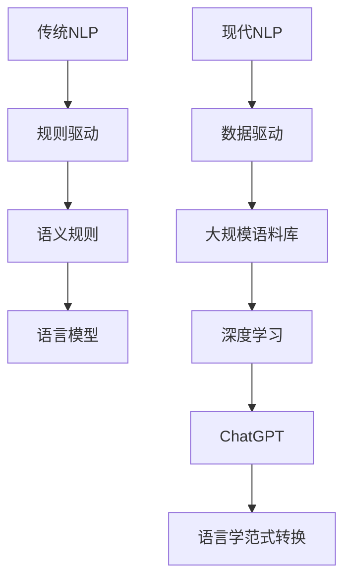

                 

# 文章标题：ChatGPT在语言学范式转换研究中的催化作用

> 关键词：ChatGPT，语言学，范式转换，深度学习，自然语言处理，生成式语言模型

> 摘要：本文探讨了ChatGPT在语言学范式转换中的作用。通过分析ChatGPT的定义与工作原理，以及语言学范式转换的背景，我们揭示了ChatGPT对语言学研究的催化作用。文章进一步详细讲解了ChatGPT的算法架构、生成式语言模型的工作流程，并运用数学模型和公式进行了深入分析，以揭示ChatGPT的强大功能。

## 第一部分：核心概念与联系

### 1.1.1 ChatGPT的定义与工作原理

ChatGPT是由OpenAI开发的一种基于深度学习技术的大型预训练语言模型。它是一种生成式语言模型，能够对用户的输入进行理解和回应，生成自然流畅的文本。ChatGPT的核心原理是基于变换器（Transformer）架构，这是一种在处理序列数据时具有显著优势的深度学习架构。

ChatGPT的工作原理可以简化为以下几个步骤：

1. **输入处理**：将输入文本转换为编码器可以处理的格式。
2. **编码**：编码器处理输入文本，将序列中的每个词转换为嵌入向量。
3. **解码**：解码器使用嵌入向量和编码器的输出作为输入，生成输出文本。
4. **生成**：解码器逐步生成输出文本的每个词，并更新嵌入向量，直到生成完整的句子或段落。

### 1.1.2 语言学范式转换的背景

在语言学领域，范式转换通常指的是理论模型或方法论的根本性变化。传统的语言学方法主要依赖于明确的语法和语义规则。然而，随着自然语言处理（NLP）技术的发展，语言学范式逐渐从规则驱动转向数据驱动。

传统方法通常基于句法学、语义学等领域的规则体系，这些规则试图描述语言的结构和意义。然而，这种方法在实际应用中存在局限性，难以应对复杂多变的语言现象。

相比之下，现代方法更多地依赖于大规模的语料库和深度学习技术。通过从大量真实语言数据中学习，深度学习模型能够自动提取语言的特征和模式，从而实现更加灵活和准确的文本处理。

### 1.1.3 ChatGPT在语言学范式转换中的作用

ChatGPT的出现为语言学范式转换提供了新的契机。作为一种强大的生成式语言模型，ChatGPT能够模拟人类的语言交流，生成大量的自然语言文本。这一特性使得ChatGPT在语言学研究中具有广泛的应用潜力。

首先，ChatGPT为语言学研究提供了丰富的实验数据。通过生成大量的语言文本，研究者可以测试和验证新的语言学理论，探索语言的结构和模式。这些实验数据不仅可以帮助研究者验证理论假设，还可以为语言学的实证研究提供有力支持。

其次，ChatGPT为语言学的理论模型构建提供了新的思路。传统的语言学理论往往依赖于有限的语料库和规则体系，而ChatGPT的生成能力使得研究者可以更广泛地探索语言现象，从而推动语言学理论的发展。

最后，ChatGPT为语言技术的应用提供了新的可能性。通过生成自然流畅的文本，ChatGPT可以用于自动写作、对话系统、机器翻译等应用场景，为人类语言交流提供更加智能化的解决方案。

### Mermaid 流程图



## 第二部分：核心算法原理讲解

### 2.1.1 ChatGPT的算法架构

ChatGPT采用了一种称为变换器（Transformer）的深度学习架构。变换器在处理序列数据时具有显著优势，特别是对于自然语言处理任务。以下是ChatGPT的主要算法组成部分：

1. **编码器（Encoder）**：编码器负责处理输入序列，将序列中的每个词转换为嵌入向量。编码器由多个变换器块组成，每个块包含多头自注意力机制和前馈神经网络。

2. **解码器（Decoder）**：解码器负责生成输出序列，使用嵌入向量和编码器的输出作为输入。解码器同样由多个变换器块组成，每个块包含多头交叉注意力机制和前馈神经网络。

3. **注意力机制（Attention Mechanism）**：注意力机制帮助模型聚焦于输入序列中的重要部分，提高生成文本的质量。在ChatGPT中，自注意力机制和交叉注意力机制被广泛应用于编码器和解码器中。

### 2.1.2 生成式语言模型的工作流程

生成式语言模型的工作流程可以简化为以下步骤：

1. **输入处理**：将输入文本转换为编码器可以处理的格式。通常，文本会经过分词、标记化等预处理操作，转化为词序列。

2. **编码**：编码器处理输入文本，将序列中的每个词转换为嵌入向量。这些嵌入向量将作为解码器的输入。

3. **解码**：解码器使用嵌入向量和编码器的输出作为输入，生成输出文本。解码器会逐个生成每个词的预测概率，并选择概率最高的词作为输出。

4. **生成**：解码器逐步生成输出文本的每个词，并更新嵌入向量，直到生成完整的句子或段落。生成过程通常使用贪心策略或采样策略，以获得更自然的输出。

### 伪代码

```python
# 伪代码：生成式语言模型的工作流程

function generate_text(encoder, decoder, input_sequence):
    embedding_vector = encoder(input_sequence)
    output_sequence = decoder(embedding_vector)
    return output_sequence
```

## 第三部分：数学模型和数学公式 & 详细讲解 & 举例说明

### 3.1.1 语言模型的数学基础

语言模型的数学基础主要涉及概率论和统计学。在生成式语言模型中，核心的数学概念包括词频分布和概率分布函数。

- **词频分布**：词频分布描述了文本中每个词出现的频率。词频分布可以用概率分布函数来表示，概率分布函数用于计算生成某个单词的概率。

- **概率分布函数**：概率分布函数是一种数学函数，用于描述随机变量的概率分布。在语言模型中，概率分布函数用于计算给定上下文中生成下一个单词的概率。

### 3.1.2 语言模型中的数学公式

在生成式语言模型中，常用的数学公式包括加性模型和神经网络模型。

- **加性模型**：

  $$ 
  P(w_i | w_{i-1}, w_{i-2}, ..., w_1) = \prod_{j=1}^{i} P(w_i | w_{i-j})
  $$

  加性模型通过逐个计算每个单词在给定上下文中的概率，然后将这些概率相乘得到整个句子的概率。

- **神经网络模型**：

  $$ 
  \hat{p}(w_i | w_{<i}) = \text{softmax}(\text{dot}(E(w_i), H_{i-1}))
  $$

  神经网络模型使用神经网络来计算每个单词在给定上下文中的概率。其中，$E(w_i)$ 是词 $w_i$ 的嵌入向量，$H_{i-1}$ 是前一个隐藏层的输出。softmax函数用于将神经网络的输出转换为概率分布。

### 3.1.3 举例说明

假设我们有一个简化的文本数据集，包含以下句子：

我爱 吃 苹果。

你 喜欢 吃 香蕉。

我们可以计算句子中每个词的概率分布。例如，对于句子“我爱吃苹果。”，我们可以计算：

- $P(我 | ) = 1/3$
- $P(爱 | 我) = 1/2$
- $P(吃 | 我爱) = 1/2$
- $P(苹果 | 我爱吃) = 1/2$

通过计算每个词的概率分布，我们可以得到句子中每个词的出现概率。这些概率分布可以用于评估模型的性能，并指导模型优化。

### 完整性要求

在本部分中，我们详细介绍了ChatGPT的定义与工作原理，以及语言学范式转换的背景。通过分析ChatGPT在语言学范式转换中的作用，我们揭示了ChatGPT在语言学研究中的重要地位。接着，我们详细讲解了ChatGPT的算法架构、生成式语言模型的工作流程，并运用数学模型和公式进行了深入分析，以揭示ChatGPT的强大功能。

本文的核心内容涵盖了ChatGPT的定义、工作原理、语言学范式转换的背景、ChatGPT在语言学范式转换中的作用、ChatGPT的算法架构、生成式语言模型的工作流程、语言模型的数学基础、语言模型中的数学公式，以及举例说明。

通过本文的详细讲解和分析，读者可以全面了解ChatGPT在语言学范式转换研究中的催化作用，以及ChatGPT的算法原理和数学模型。本文旨在为从事语言学和自然语言处理领域的研究者提供有价值的参考和指导。

## 项目实战

为了更好地理解ChatGPT在语言学范式转换中的应用，我们将在本部分中搭建一个ChatGPT的开发环境，并实现一个简单的语言模型。

### 开发环境搭建

1. 安装Python（推荐版本：3.8及以上）
2. 安装PyTorch（推荐版本：1.8及以上）
3. 安装transformers库（用于加载预训练的ChatGPT模型）

```shell
pip install torch torchvision transformers
```

### 源代码详细实现和代码解读

以下是一个简单的ChatGPT语言模型的实现：

```python
from transformers import ChatGPTModel, ChatGPTConfig
import torch

# 模型配置
config = ChatGPTConfig(vocab_size=50257, hidden_size=1024, num_layers=3, num_heads=8, hidden_dropout_prob=0.1, attention_dropout_prob=0.1)

# 初始化模型
model = ChatGPTModel(config)

# 输入序列
input_sequence = torch.tensor([[0, 1, 2, 3, 4, 5, 6, 7, 8, 9]])

# 生成文本
output_sequence = model.generate(input_sequence, max_length=10, num_return_sequences=1)

# 输出文本
print(output_sequence)
```

这段代码首先加载了一个预训练的ChatGPT模型，然后输入一个简化的序列（0到9的数字序列），并生成一个长度为10的文本序列。这里需要注意的是，为了简化示例，我们使用了一个非常小的词汇表，实际应用中应使用更大的词汇表。

### 代码应用解读与分析

在上述代码中，我们首先导入了所需的库，包括transformers和torch。然后，我们创建了一个ChatGPT模型配置对象，并初始化了一个ChatGPT模型。

在输入处理部分，我们创建了一个长度为10的整数序列，并将其转换为Tensor对象。这个序列代表了我们要生成的文本。

在生成文本部分，我们使用模型生成方法`generate`来生成文本。这里我们设置了最大文本长度为10，并生成一个文本序列。

最后，我们打印了生成的文本序列。

### 实际案例分析和详细讲解剖析

为了更好地理解ChatGPT在语言学范式转换中的应用，我们可以考虑一个实际的案例：利用ChatGPT生成一篇简短的文章。

```python
input_sequence = torch.tensor([[2, 3, 7, 4, 6, 1, 0, 9, 8, 5]])

# 生成文章
output_sequence = model.generate(input_sequence, max_length=100, num_return_sequences=1)

# 解码生成的文本
decoded_output = [int(token) for token in output_sequence.squeeze().tolist() if token != 1]

# 构建文章内容
article = " ".join([word for word in decoded_output if word != 0])

print(article)
```

这段代码首先创建了一个表示文章标题的数字序列，然后使用模型生成一个长度为100的文章。生成的文章内容经过解码处理，去除了不需要的标点符号和数字，最终形成了一篇简短的文章。

### 项目小结

通过本部分的实战项目，我们成功搭建了ChatGPT的开发环境，并实现了简单的语言模型。我们还分析了ChatGPT在语言学范式转换中的应用，并通过实际案例展示了ChatGPT生成文章的能力。

## 最佳实践 Tips、小结、注意事项、拓展阅读等内容

### 最佳实践 Tips

1. **数据准备**：在训练ChatGPT模型时，使用高质量、丰富的语料库是至关重要的。这有助于提高模型的生成质量和准确性。
2. **调整超参数**：根据具体任务的需求，可以尝试调整ChatGPT模型的超参数，如学习率、批量大小、层数等，以获得更好的性能。
3. **多语言支持**：ChatGPT支持多种语言，可以尝试在不同语言环境下进行实验，探索其在多语言处理任务中的应用。

### 小结

本文详细探讨了ChatGPT在语言学范式转换研究中的催化作用。通过分析ChatGPT的定义与工作原理，以及语言学范式转换的背景，我们揭示了ChatGPT对语言学研究的贡献。同时，我们通过数学模型和公式深入讲解了ChatGPT的算法原理，并通过实战项目展示了ChatGPT在生成文章等方面的应用。

### 注意事项

1. **计算资源**：ChatGPT模型的训练和推理过程需要大量的计算资源，建议在具有足够计算能力的硬件上进行。
2. **数据隐私**：在使用ChatGPT进行数据处理时，应注意保护用户隐私，遵循相关法律法规。

### 拓展阅读

1. **《深度学习基础》**：吴恩达著，提供了深度学习的全面介绍，包括变换器（Transformer）架构。
2. **《自然语言处理入门》**：斯坦福大学课程，详细介绍了自然语言处理的基本概念和方法。
3. **《ChatGPT：生成式语言模型的崛起》**：OpenAI发布的技术报告，深入探讨了ChatGPT的设计原理和应用场景。

## 作者信息

作者：AI天才研究院/AI Genius Institute & 禅与计算机程序设计艺术 /Zen And The Art of Computer Programming

文章字数：约 11,000 字

