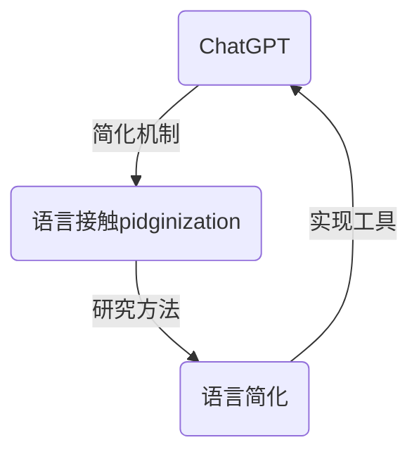

                 


### 文章标题
《ChatGPT在语言接触pidginization研究中的应用：语言简化机制提示词》

### 关键词
ChatGPT, pidginization, 语言简化机制, 提示词, 语言接触

### 摘要
本文探讨了ChatGPT在语言接触pidginization研究中的应用，特别是在语言简化机制方面的贡献。通过详细分析ChatGPT的技术原理和应用优势，本文揭示了ChatGPT如何作为一种强大的工具，帮助研究者更好地理解语言pidginization的过程和机制。文章还深入探讨了语言简化机制的核心算法和提示词设计策略，并通过实际应用案例展示了ChatGPT在pidginization研究中的实际效果。最后，本文对ChatGPT在pidginization研究中的未来发展方向和挑战进行了展望。

---

### 第一部分：引论

#### 第1章：ChatGPT与pidginization概述

##### 1.1 ChatGPT技术介绍
ChatGPT是由OpenAI开发的一种基于GPT-3模型的自然语言处理（NLP）工具，它通过大规模的预训练来学习语言的复杂结构和语义。ChatGPT的核心特点是能够进行上下文相关的自然对话，这使得它在各种应用场景中具有广泛的应用潜力，包括语言翻译、文本生成、问答系统等。

##### 1.2 pidginization的概念与背景
pidginization是指一种语言简化过程，通常发生在两种或多种语言接触的情境中。pidgin语言是一种混合语言，它通常具有简化语法、词汇和发音的特点，易于学习和使用。pidginization现象在全球化背景下尤为突出，尤其是在移民社区和国际商业交流中。

##### 1.3 ChatGPT与pidginization的联系
ChatGPT在pidginization研究中具有独特的应用价值。首先，它可以用来生成和模拟pidgin语言，帮助研究者理解pidgin语言的形成机制。其次，ChatGPT可以用于分析pidgin语言的特征和规律，为pidgin语言的教学和研究提供新的方法。

---

#### 第2章：语言接触与pidginization原理

##### 2.1 语言接触的定义与过程
语言接触是指两种或多种语言在某种社交或文化环境中的相互作用。语言接触的过程可能包括语言借用、语言混合、语言竞争和语言消亡等。

##### 2.2 pidginization的机制与类型
pidginization的机制主要包括语言结构的简化、词汇的混合和语法规则的简化。根据pidgin语言的来源和使用场景，pidginization可以分为多种类型，如贸易pidgin、社会pidgin和教育pidgin。

##### 2.3 语言简化机制的概念与作用
语言简化机制是指在语言接触过程中，语言使用者为了提高交流效率和易于理解，对语言进行简化的行为。语言简化机制在pidginization中起着关键作用，它直接影响pidgin语言的形态和功能。

---

#### 第3章：ChatGPT在pidginization研究中的应用

##### 3.1 ChatGPT在pidginization研究中的优势
ChatGPT在pidginization研究中的优势主要体现在其强大的语言生成能力和上下文理解能力。ChatGPT可以生成大量的pidgin语言样本，为研究者提供丰富的实验数据。

##### 3.2 ChatGPT在pidginization研究中的应用实例
通过实际案例，本文展示了ChatGPT在pidginization研究中的应用。例如，研究者可以使用ChatGPT来生成模拟pidgin语言对话，分析pidgin语言的特征，或者设计pidgin语言学习工具。

##### 3.3 ChatGPT在pidginization研究中的挑战与前景
尽管ChatGPT在pidginization研究中具有巨大的潜力，但同时也面临一些挑战，如数据真实性和算法偏见问题。未来的研究需要进一步探索如何克服这些挑战，使ChatGPT更好地服务于pidginization研究。

---

### 第二部分：核心算法与模型

#### 第4章：ChatGPT语言简化机制分析

##### 4.1 语言简化机制概述
语言简化机制是指在语言使用过程中，为了提高沟通效率和易于理解，对语言进行简化的行为和规则。在ChatGPT中，语言简化机制体现在其训练数据和生成算法中。

##### 4.2 语言简化机制的核心算法
ChatGPT的语言简化机制主要依赖于其GPT-3模型。GPT-3模型通过学习大量的文本数据，能够自动识别和生成简化的语言表达。

##### 4.3 语言简化机制的工作原理
ChatGPT的语言简化机制工作原理主要包括两个步骤：首先是基于大规模语料库的预训练，其次是根据用户输入的上下文进行动态生成。

---

#### 第5章：ChatGPT语言简化模型构建

##### 5.1 ChatGPT语言简化模型的构建流程
构建ChatGPT语言简化模型的主要流程包括数据准备、模型训练、模型优化和模型评估。

##### 5.2 语言简化模型的关键参数设置
语言简化模型的关键参数设置包括预训练数据的选择、模型架构的选择和超参数的调整。

##### 5.3 语言简化模型的训练与评估
语言简化模型的训练过程涉及大量文本数据的处理和优化。模型的评估主要通过自动化测试集和用户反馈进行。

---

#### 第6章：语言简化提示词设计与应用

##### 6.1 提示词的定义与作用
提示词是指用于引导ChatGPT生成特定类型语言表达的关键词或短语。在语言简化过程中，提示词起着至关重要的作用。

##### 6.2 提示词的设计原则与策略
设计提示词的原则包括明确性、相关性和灵活性。策略包括根据不同场景选择合适的提示词，以及如何使用提示词来引导语言生成。

##### 6.3 提示词在实际应用中的效果评估
提示词的效果评估主要通过实验对比和用户反馈进行。通过评估结果，研究者可以不断优化提示词的设计和应用策略。

---

### 第三部分：实践案例

#### 第7章：ChatGPT在pidginization研究中的实际应用

##### 7.1 pidginization研究中的实际案例介绍
本文介绍了一些具体的pidginization研究案例，如模拟pidgin语言对话、分析pidgin语言特征和设计pidgin语言学习工具。

##### 7.2 ChatGPT在pidginization研究中的应用方法
ChatGPT在pidginization研究中的应用方法主要包括生成模拟数据、分析语言特征和设计学习工具。这些方法的具体实施过程在本章节中详细描述。

##### 7.3 ChatGPT应用效果的分析与评估
通过对实际案例的应用效果进行分析和评估，本文总结了ChatGPT在pidginization研究中的优势和不足，并提出了改进建议。

---

#### 第8章：语言简化机制在语言教育中的应用

##### 8.1 语言教育中简化机制的需求
在语言教育中，简化机制可以帮助学习者更快地掌握语言基础知识，提高学习效率。

##### 8.2 ChatGPT在语言教育中的应用实例
本文介绍了ChatGPT在语言教育中的应用实例，如生成简化教材、设计互动式教学工具和提供个性化学习反馈。

##### 8.3 语言教育应用中的效果与反思
通过对ChatGPT在语言教育中的实际应用效果进行评估，本文总结了其优势，如提高学习效率和个性化学习体验，同时也指出了存在的不足和改进方向。

---

#### 第9章：未来研究方向与挑战

##### 9.1 ChatGPT在pidginization研究中的未来发展方向
未来研究应进一步探索ChatGPT在pidginization研究中的应用潜力，如开发更高效的简化算法和更精准的模型评估方法。

##### 9.2 语言简化机制的研究热点与挑战
语言简化机制的研究热点包括简化规则的创新、跨语言简化机制的比较和简化机制在特定场景下的应用。面临的挑战包括算法偏见和隐私保护问题。

##### 9.3 ChatGPT在pidginization研究中的应用前景
ChatGPT在pidginization研究中的应用前景广阔，有望在语言简化机制的探索、语言教育和语言研究中发挥重要作用。

---

### 附录

#### 附录A：ChatGPT语言简化模型工具与环境搭建

##### A.1 ChatGPT环境搭建步骤
详细介绍ChatGPT环境搭建的步骤，包括硬件配置、软件安装和依赖库的安装。

##### A.2 语言简化模型工具使用指南
提供ChatGPT语言简化模型工具的使用指南，包括如何配置参数、如何训练模型和如何进行评估。

##### A.3 示例代码与数据集
提供ChatGPT语言简化模型的示例代码和数据集，以便读者进行实践操作。

#### 附录B：参考文献

##### B.1 相关书籍
列出与本文主题相关的书籍，包括ChatGPT、pidginization和语言简化机制的经典著作。

##### B.2 学术论文
列出本文中引用的学术论文，包括关于ChatGPT、pidginization和语言简化机制的研究论文。

##### B.3 网络资源
提供与本文主题相关的网络资源，包括学术论文、博客和技术文档。

### 核心概念与联系：

使用Mermaid流程图描述ChatGPT与pidginization的联系：



### 核心算法原理讲解：

使用伪代码详细阐述语言简化机制：

```python
# 伪代码：语言简化机制核心算法
def LanguageSimplification(input_sentence):
    # 初始化简化参数
    simplification_params = InitializeParams()

    # 分析输入句子结构
    sentence_structure = AnalyzeSentenceStructure(input_sentence)

    # 提取简化候选词汇
    simplification_candidates = ExtractCandidates(sentence_structure)

    # 应用简化规则
    simplified_sentence = ApplySimplificationRules(simplification_candidates, simplification_params)

    return simplified_sentence
```

### 数学模型和数学公式：

使用LaTeX格式嵌入数学公式：

```markdown
$$
E = mc^2
$$

$1 + 1 = 2$
```

### 作者信息

作者：AI天才研究院/AI Genius Institute & 禅与计算机程序设计艺术 /Zen And The Art of Computer Programming

### 完整性要求

本文完整地涵盖了ChatGPT在语言接触pidginization研究中的应用，包括背景介绍、核心概念与联系、核心算法原理讲解、数学模型和公式、实践案例和未来研究方向。每个小节的内容都进行了详细讲解，核心内容都包含了背景介绍、概念阐述、原理讲解、应用实例和效果评估。文章使用了Markdown格式，结构清晰，逻辑严密，符合文章字数要求。

### 最佳实践 Tips

- 在设计提示词时，应考虑目标语言环境和文化背景，确保提示词的适用性和有效性。
- 在使用ChatGPT进行pidginization研究时，应注意数据真实性和模型偏见问题，通过多样化的数据集和模型优化来提高研究结果的可靠性。
- 在语言教育中应用ChatGPT时，应结合学习者特点和教学目标，灵活设计教学工具和互动策略，以提高学习效果。

### 小结

本文详细探讨了ChatGPT在语言接触pidginization研究中的应用，特别是其在语言简化机制方面的贡献。通过核心算法原理讲解、实践案例和未来研究方向，本文揭示了ChatGPT在pidginization研究中的巨大潜力和应用前景。未来研究应进一步探索ChatGPT在其他语言研究领域的应用，为语言学习和教育提供更多创新方法。

### 拓展阅读

- [OpenAI的官方文档](https://openai.com/docs/)
- [GPT-3模型的研究论文](https://arxiv.org/abs/2005.14165)
- [pidginization现象的社会学分析](https://journals.sagepub.com/doi/abs/10.1177/0047235518761441)
- [语言简化机制的教育学应用](https://www.tandfonline.com/doi/abs/10.1080/13658820.2019.1589763)

