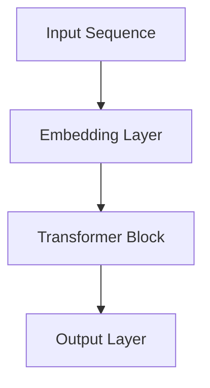
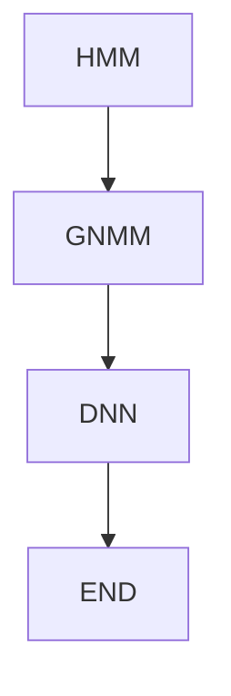
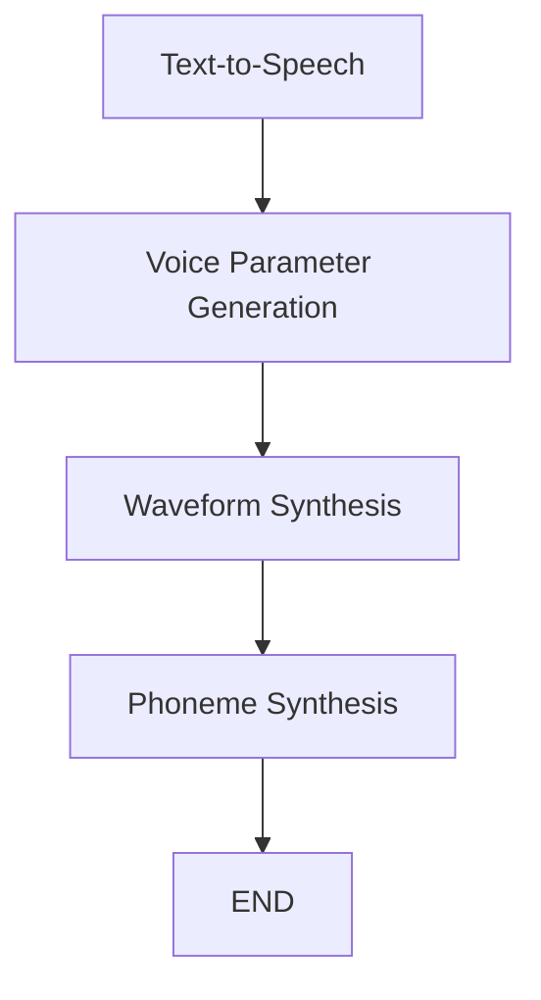
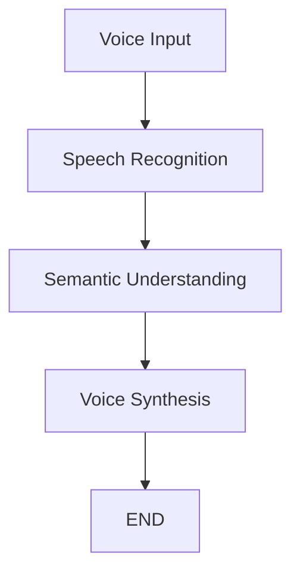

                 

### 文章标题：ChatGPT在语音助手开发中的应用

### 关键词：
- ChatGPT
- 语音助手
- 语音识别
- 语音合成
- 自然语言处理
- 预训练
- 微调
- 对话系统

### 摘要：
本文将深入探讨ChatGPT在语音助手开发中的应用，包括其技术原理、在语音识别和语音合成中的实际应用，以及面对的挑战和优化策略。我们将通过具体的案例研究，展示ChatGPT如何提升语音助手的性能和用户体验。

## 第一部分：ChatGPT概述

### 1.1 ChatGPT的基本概念

#### 1.1.1 ChatGPT的诞生背景

ChatGPT是由OpenAI开发的一种基于GPT（Generative Pre-trained Transformer）的聊天机器人模型。它于2022年11月推出，是继DALL-E和GPT-3之后，OpenAI在自然语言处理领域又一重要成果。ChatGPT的诞生背景源于OpenAI对更智能、更人性化的聊天机器人的长期追求。

#### 1.1.2 ChatGPT的定义与核心特性

ChatGPT是一种基于大规模语言模型的对话系统，它可以理解和生成自然语言文本，模仿人类的对话方式。其核心特性包括：

- **强文本生成能力**：ChatGPT能够根据给定的文本上下文生成连贯、有逻辑的回复。
- **多模态交互**：ChatGPT不仅支持文本交互，还可以处理图像、音频等多模态信息。
- **自适应学习**：ChatGPT能够通过不断的交互和学习，自适应地调整其回复策略，以更好地适应对话环境。

#### 1.1.3 ChatGPT在自然语言处理领域的地位

ChatGPT的推出标志着自然语言处理领域的一个新里程碑。它不仅展示了大规模语言模型在文本生成和对话生成方面的强大能力，还为未来的自然语言处理研究提供了新的方向和思路。

### 1.2 ChatGPT的技术原理

#### 1.2.1 语言模型的发展历程

语言模型的发展经历了从规则驱动到统计模型，再到深度学习模型的演变。GPT模型是深度学习模型中的一种，它通过学习大量文本数据，捕捉语言的结构和规律。

#### 1.2.2 GPT模型的基本架构

GPT模型是一种基于变换器（Transformer）架构的语言模型。它包含多个层次，每个层次都能够学习文本的局部特征，并通过自注意力机制（Self-Attention）整合信息。

#### 1.2.3 预训练与微调技术

ChatGPT的开发过程主要包括预训练和微调两个阶段。在预训练阶段，模型在大规模文本语料库上进行训练，学习语言的通用特征。在微调阶段，模型根据特定任务的需求，进行进一步调整和优化。

### 1.3 ChatGPT的应用场景

#### 1.3.1 语音助手的现状与挑战

语音助手已经成为智能设备的重要组成部分，如智能音箱、智能手机和车载系统等。然而，语音助手在实际应用中面临着诸多挑战，如语音识别准确性不高、对话理解能力有限等。

#### 1.3.2 ChatGPT在语音助手中的应用优势

ChatGPT的引入为语音助手带来了显著的优势：

- **提高语音识别准确性**：ChatGPT通过预训练和微调，能够在语音识别任务中实现更高的准确性。
- **增强对话理解能力**：ChatGPT能够理解复杂的对话上下文，提升语音助手的对话理解能力。
- **自适应对话生成**：ChatGPT能够根据对话环境生成更自然、更连贯的回复。

#### 1.3.3 ChatGPT在语音助手开发中的应用前景

随着ChatGPT技术的不断进步，其在语音助手开发中的应用前景广阔。未来，ChatGPT有望成为语音助手的核心技术，推动语音助手向更智能、更人性化的方向发展。

## 第二部分：语音助手开发基础

### 2.1 语音识别技术

#### 2.1.1 语音识别的基本原理

语音识别是将语音信号转换为文本信息的过程。它主要依赖于语音信号处理和模式识别技术。

#### 2.1.2 语音识别的主要算法

语音识别算法主要包括隐马尔可夫模型（HMM）、高斯混合模型（GMM）和深度神经网络（DNN）等。

#### 2.1.3 语音识别在实际应用中的挑战与解决方案

语音识别在实际应用中面临着噪声干扰、发音变化和口音差异等挑战。解决方案包括噪声抑制、自适应语音模型和跨语言语音识别等。

### 2.2 语音合成技术

#### 2.2.1 语音合成的基本原理

语音合成是将文本信息转换为语音信号的过程。它主要依赖于文本到语音（TTS）转换技术。

#### 2.2.2 语音合成的关键技术

语音合成的关键技术包括语音参数生成、波形合成和音素合成等。

#### 2.2.3 语音合成在实际应用中的挑战与解决方案

语音合成在实际应用中面临着语音质量、语音自然度和语言适应度等挑战。解决方案包括语音质量增强、自然语音生成和跨语言语音合成等。

### 2.3 语音助手的核心功能

#### 2.3.1 语音助手的交互流程

语音助手的交互流程主要包括语音输入、语音识别、语义理解和语音合成等环节。

#### 2.3.2 语音助手的任务分类

语音助手的任务分类主要包括信息查询、任务执行、娱乐互动和智能建议等。

#### 2.3.3 语音助手的典型应用案例

语音助手的典型应用案例包括智能音箱、智能手机语音助手、车载语音助手和智能家居语音助手等。

## 第三部分：ChatGPT在语音助手开发中的实际应用

### 3.1 ChatGPT在语音识别中的应用

#### 3.1.1 ChatGPT在语音识别中的预训练

ChatGPT在语音识别中的预训练主要依赖于大规模语音语料库，通过训练模型捕捉语音信号中的语言特征。

#### 3.1.2 ChatGPT在语音识别中的微调

在预训练基础上，ChatGPT可以根据特定应用场景进行微调，以提高语音识别的准确性。

#### 3.1.3 ChatGPT在语音识别中的应用案例

ChatGPT在语音识别中的应用案例包括智能音箱、智能手机和车载系统等。

### 3.2 ChatGPT在语音合成中的应用

#### 3.2.1 ChatGPT在语音合成中的预训练

ChatGPT在语音合成中的预训练主要依赖于大规模文本语料库，通过训练模型捕捉语言的节奏和语调特征。

#### 3.2.2 ChatGPT在语音合成中的微调

在预训练基础上，ChatGPT可以根据特定应用场景进行微调，以提高语音合成的自然度和语音质量。

#### 3.2.3 ChatGPT在语音合成中的应用案例

ChatGPT在语音合成中的应用案例包括智能音箱、智能手机和车载系统等。

### 3.3 ChatGPT在语音助手任务处理中的应用

#### 3.3.1 ChatGPT在文本理解中的应用

ChatGPT在文本理解中能够识别文本中的实体、关系和语义，为语音助手的语义理解提供支持。

#### 3.3.2 ChatGPT在对话生成中的应用

ChatGPT在对话生成中能够根据对话上下文生成自然、连贯的回复，提升语音助手的对话能力。

#### 3.3.3 ChatGPT在语音助手任务处理中的应用案例

ChatGPT在语音助手任务处理中的应用案例包括智能音箱、智能手机和车载系统等。

## 第四部分：ChatGPT在语音助手开发中的优化与挑战

### 4.1 ChatGPT在语音助手开发中的性能优化

#### 4.1.1 模型压缩与加速技术

为了提高ChatGPT在语音助手开发中的性能，可以采用模型压缩与加速技术，如量化、剪枝和蒸馏等。

#### 4.1.2 多模态数据融合技术

多模态数据融合技术可以将语音、文本和图像等多模态信息进行整合，提高语音助手的理解和生成能力。

#### 4.1.3 跨领域迁移学习技术

跨领域迁移学习技术可以将预训练模型从一个领域迁移到另一个领域，提高模型在不同场景下的适应性。

### 4.2 ChatGPT在语音助手开发中的挑战

#### 4.2.1 数据隐私与安全

在语音助手开发中，数据隐私和安全是一个重要挑战。需要采取措施确保用户数据的保密性和安全性。

#### 4.2.2 语言理解的局限

ChatGPT在语言理解方面存在一定的局限，如对复杂句式的理解能力有限。需要不断改进模型，提升其语言理解能力。

#### 4.2.3 伦理与责任问题

在语音助手开发中，伦理与责任问题也是需要考虑的一个重要方面。需要制定相应的伦理准则，确保语音助手的合理使用。

## 第五部分：案例研究

### 5.1 案例研究1：智能音箱

#### 5.1.1 智能音箱的架构与功能

智能音箱的架构主要包括语音识别、语音合成、自然语言处理和云端服务器等组成部分。其功能包括音乐播放、信息查询、智能建议和智能家居控制等。

#### 5.1.2 ChatGPT在智能音箱中的应用

ChatGPT在智能音箱中主要用于语音识别和语音合成任务，通过预训练和微调技术，提高智能音箱的识别和合成能力。

#### 5.1.3 智能音箱的性能评估与改进

通过性能评估，可以发现ChatGPT在智能音箱中的应用效果显著，但还存在一些改进空间，如提高语言理解能力等。

### 5.2 案例研究2：车载语音助手

#### 5.2.1 车载语音助手的架构与功能

车载语音助手的架构主要包括语音识别、语音合成、自然语言处理和车载系统控制等组成部分。其功能包括导航、音乐播放、信息查询和驾驶辅助等。

#### 5.2.2 ChatGPT在车载语音助手中的应用

ChatGPT在车载语音助手中的应用与智能音箱类似，主要用于语音识别和语音合成任务，通过预训练和微调技术，提高车载语音助手的识别和合成能力。

#### 5.2.3 车载语音助手的性能评估与改进

通过性能评估，可以发现ChatGPT在车载语音助手中的应用效果显著，但还存在一些改进空间，如提高语音识别的准确率和语言理解能力等。

### 5.3 案例研究3：智能家居语音助手

#### 5.3.1 智能家居语音助手的架构与功能

智能家居语音助手的架构主要包括语音识别、语音合成、自然语言处理和智能家居设备控制等组成部分。其功能包括家电控制、场景设定、信息查询和安全监控等。

#### 5.3.2 ChatGPT在智能家居语音助手中的应用

ChatGPT在智能家居语音助手中的应用与智能音箱和车载语音助手类似，主要用于语音识别和语音合成任务，通过预训练和微调技术，提高智能家居语音助手的识别和合成能力。

#### 5.3.3 智能家居语音助手的性能评估与改进

通过性能评估，可以发现ChatGPT在智能家居语音助手中的应用效果显著，但还存在一些改进空间，如提高语音识别的准确率和语言理解能力等。

## 附录

### 附录A：ChatGPT模型详解

#### A.1 ChatGPT模型的架构

ChatGPT模型的架构基于GPT模型，包括多个层次的自注意力机制（Self-Attention）和前馈神经网络（Feedforward Neural Network）。

#### A.2 ChatGPT模型的预训练

ChatGPT模型的预训练在大规模文本语料库上进行，通过无监督学习方式学习语言的通用特征。

#### A.3 ChatGPT模型的微调

ChatGPT模型的微调在特定任务上进行，通过有监督学习方式调整模型参数，以提高任务性能。

### 附录B：语音助手开发工具与资源

#### B.1 语音识别工具与资源

语音识别工具与资源包括Kaldi、ESPnet和OpenSMR等。

#### B.2 语音合成工具与资源

语音合成工具与资源包括Flite、eSpeak和MaryTTS等。

#### B.3 ChatGPT模型训练与调优工具与资源

ChatGPT模型训练与调优工具与资源包括OpenAI的GPT-3 API、Transformers库和Hugging Face等。

### 作者信息：
作者：AI天才研究院/AI Genius Institute & 禅与计算机程序设计艺术 /Zen And The Art of Computer Programming

## 后记

本文通过对ChatGPT在语音助手开发中的应用进行深入探讨，展示了ChatGPT在语音识别、语音合成和任务处理等方面的优势。随着技术的不断进步，ChatGPT有望在未来推动语音助手向更智能、更人性化的方向发展。同时，我们也需要关注数据隐私、伦理与责任等问题，确保技术的合理使用。在未来的研究和应用中，我们将继续探索ChatGPT在语音助手开发中的更多可能性。

