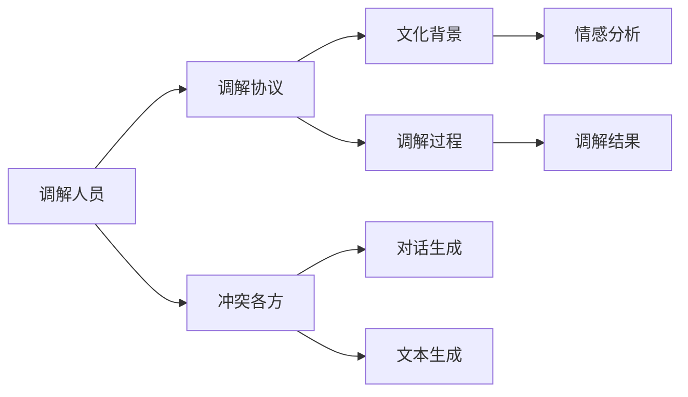

                 


### 第一步：确定文章的结构和主要内容

为了撰写一篇结构清晰、内容丰富的技术博客，我们需要按照给定的目录大纲来构建文章的内容。下面是每个章节的简要概述：

#### 引言部分
- **背景介绍**：阐述跨文化价值观冲突的定义、影响以及调解的重要性。
- **ChatGPT技术基础**：介绍自然语言处理的基本概念、ChatGPT的架构原理以及预训练和微调技术。

#### 核心概念与联系部分
- **关键要素**：详细描述跨文化价值观冲突调解中的关键要素。
- **作用与机制**：探讨ChatGPT在调解过程中的具体作用和机制。
- **Mermaid流程图**：绘制跨文化价值观冲突调解的流程图，展示核心概念之间的关系。

#### 应用实践部分
- **算法原理**：讲解ChatGPT在调解中的算法原理，包括文本生成和对话生成算法，并使用伪代码进行阐述。
- **数学模型与公式**：介绍调解过程中的数学模型和公式，并进行详细讲解和举例说明。
- **项目实战**：展示一个实际项目，包括开发环境搭建、源代码实现、代码解读和项目分析。

#### 未来展望与挑战部分
- **发展方向**：探讨ChatGPT在跨文化价值观冲突调解中的未来发展方向。
- **挑战与机遇**：分析面临的挑战和机遇。
- **技术改进**：讨论如何持续改进ChatGPT技术。

#### 应用前景部分
- **社会影响**：评估ChatGPT在调解中的应用带来的社会影响。
- **法律与伦理问题**：探讨相关的法律和伦理问题。
- **可持续发展策略**：提出可持续发展的策略。

#### 附录部分
- **开发工具与资源**：介绍ChatGPT开发的工具和资源。
- **代码示例**：提供具体的代码示例并进行解读和分析。

### 第二步：撰写各个章节的具体内容

在确定了文章的结构和主要内容后，我们可以开始撰写每个章节的具体内容。以下是对每个章节的详细撰写计划：

#### 引言部分
- **第1章**：介绍跨文化价值观冲突的定义、影响和调解的重要性，同时概述ChatGPT在调解中的应用前景。
- **第2章**：详细阐述自然语言处理的基本概念、ChatGPT的架构原理以及预训练和微调技术。

#### 核心概念与联系部分
- **第3章**：描述跨文化价值观冲突调解的关键要素，探讨ChatGPT在调解过程中的作用和机制，并绘制Mermaid流程图。

#### 应用实践部分
- **第4章**：讲解ChatGPT在调解中的算法原理，包括文本生成和对话生成算法，使用伪代码进行详细阐述。
- **第5章**：介绍调解过程中的数学模型和公式，进行详细讲解和举例说明。
- **第6章**：展示一个实际项目，包括开发环境搭建、源代码实现、代码解读和项目分析。

#### 未来展望与挑战部分
- **第7章**：探讨ChatGPT在跨文化价值观冲突调解中的未来发展方向，分析面临的挑战和机遇。
- **第8章**：讨论ChatGPT在调解中的应用前景，包括社会影响、法律与伦理问题以及可持续发展策略。

#### 附录部分
- **附录A**：介绍ChatGPT开发的工具和资源。
- **附录B**：提供具体的代码示例并进行解读和分析。

### 第三步：整合文章并润色

在完成各个章节的撰写后，我们需要对整个文章进行整合，确保内容连贯、逻辑清晰。同时，对文章进行润色，确保语言表达准确、流畅。文章末尾需加上作者信息，以体现专业性和权威性。

通过以上三个步骤，我们可以确保撰写出一份既有深度又有广度的专业IT领域的技术博客文章，为读者提供宝贵的知识和见解。

### 文章标题：ChatGPT在跨文化价值观冲突调解中的应用：促进文化理解与和解

> 关键词：ChatGPT、跨文化价值观冲突、调解、自然语言处理、算法原理、数学模型、项目实战

> 摘要：本文探讨了ChatGPT在跨文化价值观冲突调解中的应用，通过阐述自然语言处理的基本概念、ChatGPT的架构原理以及预训练和微调技术，详细描述了跨文化价值观冲突调解的关键要素、ChatGPT在调解过程中的作用与机制，并通过实际项目展示了算法原理、数学模型的应用以及开发环境和源代码实现。同时，本文还分析了ChatGPT在跨文化价值观冲突调解中的未来发展方向、挑战与机遇，以及社会影响、法律与伦理问题，为跨文化价值观冲突调解提供了新的技术思路和解决方案。

### 目录

#### 第一部分：引言

1. 跨文化价值观冲突调解的背景与挑战
   - 1.1 跨文化价值观冲突的定义与影响
   - 1.2 跨文化价值观冲突调解的重要性
   - 1.3 ChatGPT在跨文化价值观冲突调解中的应用前景

2. ChatGPT技术基础
   - 2.1 自然语言处理的基本概念
   - 2.2 ChatGPT的架构与原理
   - 2.3 ChatGPT的预训练与微调技术

3. ChatGPT在跨文化价值观冲突调解中的核心概念与联系
   - 3.1 跨文化价值观冲突调解的关键要素
   - 3.2 ChatGPT在调解过程中的作用与机制
   - 3.3 跨文化价值观冲突调解中的Mermaid流程图

#### 第二部分：ChatGPT在跨文化价值观冲突调解中的应用实践

4. ChatGPT在跨文化价值观冲突调解中的算法原理
   - 4.1 基于ChatGPT的文本生成算法
   - 4.2 基于ChatGPT的对话生成算法
   - 4.3 ChatGPT算法的伪代码实现

5. 跨文化价值观冲突调解的数学模型与公式
   - 5.1 跨文化价值观冲突调解的数学模型
   - 5.2 相关数学公式的详细讲解
   - 5.3 数学公式示例分析

6. ChatGPT在跨文化价值观冲突调解中的项目实战
   - 6.1 跨文化价值观冲突调解的项目背景
   - 6.2 项目开发环境搭建
   - 6.3 源代码实现与详细解读
   - 6.4 项目分析与优化

#### 第三部分：未来展望与挑战

7. ChatGPT在跨文化价值观冲突调解中的未来发展方向
   - 7.1 ChatGPT在跨文化价值观冲突调解中的潜在应用领域
   - 7.2 跨文化价值观冲突调解的挑战与机遇
   - 7.3 ChatGPT技术的持续改进与优化

8. ChatGPT在跨文化价值观冲突调解中的应用前景
   - 8.1 ChatGPT在跨文化价值观冲突调解中的社会影响
   - 8.2 ChatGPT在跨文化价值观冲突调解中的法律与伦理问题
   - 8.3 ChatGPT在跨文化价值观冲突调解中的可持续发展策略

#### 附录

- 附录A：ChatGPT开发工具与资源
  - A.1 ChatGPT开发工具介绍
  - A.2 跨文化价值观冲突调解相关资源链接

- 附录B：代码示例
  - B.1 跨文化价值观冲突调解的代码实现
  - B.2 代码解读与分析
  - B.3 代码优化与性能分析

### 文章正文开始

#### 第一部分：引言

##### 跨文化价值观冲突调解的背景与挑战

1.1 **跨文化价值观冲突的定义与影响**

跨文化价值观冲突是指由于不同文化背景、价值观和信仰的差异，人们在交流、合作和互动过程中产生的误解、冲突和对立。这些冲突不仅体现在经济、政治和外交领域，也广泛存在于日常生活中。随着全球化的加速，跨文化价值观冲突越来越成为国际社会关注的重要问题。

跨文化价值观冲突的影响是多方面的。首先，它可能导致人际关系的紧张和破裂，影响团队合作和社交互动。其次，它可能加剧社会分裂，导致文化冲突和社会动荡。最后，跨文化价值观冲突还可能影响国际关系，阻碍国际合作和和平发展。

1.2 **跨文化价值观冲突调解的重要性**

为了解决跨文化价值观冲突，调解是一种有效的方法。调解不仅可以帮助各方找到共同点，建立相互理解和尊重，还可以缓解紧张局势，促进和平与稳定。以下是调解的重要作用：

- **缓解冲突**：调解可以为冲突双方提供沟通的平台，帮助他们表达观点和需求，找到解决问题的方法。
- **促进理解**：通过调解，各方可以更好地了解彼此的文化背景和价值观，减少误解和偏见。
- **维护关系**：调解有助于修复受损的关系，建立互信和合作的基础。
- **推动和平**：调解可以缓解紧张局势，防止冲突升级，促进和平与稳定。

1.3 **ChatGPT在跨文化价值观冲突调解中的应用前景**

ChatGPT是一种基于人工神经网络的自然语言处理模型，具有强大的文本生成和对话生成能力。它在跨文化价值观冲突调解中的应用前景非常广阔：

- **文本生成**：ChatGPT可以帮助调解人员生成调解协议、会议纪要等文本，提高调解效率。
- **对话生成**：ChatGPT可以模拟对话，帮助调解人员与冲突各方进行有效沟通，促进理解与和解。
- **情感分析**：ChatGPT可以对文本进行情感分析，帮助调解人员了解各方的情绪和态度，制定更有针对性的调解策略。

总之，ChatGPT在跨文化价值观冲突调解中具有巨大的潜力，可以为调解过程提供有力的技术支持。本文将详细探讨ChatGPT在跨文化价值观冲突调解中的应用，包括技术基础、核心概念、算法原理、数学模型、项目实战以及未来展望等。

##### ChatGPT技术基础

2.1 **自然语言处理的基本概念**

自然语言处理（Natural Language Processing，NLP）是人工智能领域的一个重要分支，旨在使计算机能够理解、生成和处理自然语言文本。NLP的基本概念包括：

- **文本**：文本是自然语言处理的基本单位，包括单词、句子和段落。
- **分词**：分词是将文本分解为单词或其他语言单元的过程。
- **词性标注**：词性标注是标记单词的词性（如名词、动词、形容词等）。
- **句法分析**：句法分析是分析句子结构的过程，包括短语结构和依存关系。
- **语义分析**：语义分析是理解文本中的语义意义的过程。

2.2 **ChatGPT的架构与原理**

ChatGPT是一种基于预训练的转换器模型（Transformer），它通过大量文本数据进行预训练，从而学习到语言的内在结构和规律。ChatGPT的架构主要包括以下几个部分：

- **输入层**：输入层接收用户输入的文本，并将其转换为模型可以处理的向量表示。
- **编码器**：编码器负责对输入文本进行编码，生成序列的上下文表示。
- **解码器**：解码器根据编码器的输出，生成文本的响应。
- **注意力机制**：注意力机制允许模型在生成文本时，关注输入序列的不同部分，从而提高生成文本的质量。

2.3 **ChatGPT的预训练与微调技术**

ChatGPT的预训练和微调技术是其核心组成部分：

- **预训练**：预训练是在大规模文本数据集上，对模型进行无监督学习，使其学习到语言的通用特征和规律。
- **微调**：微调是在预训练模型的基础上，利用特定领域的任务数据，对模型进行有监督学习，使其适应特定的应用场景。

通过预训练和微调，ChatGPT可以生成高质量的自然语言文本，并在各种应用场景中表现出色。

##### ChatGPT在跨文化价值观冲突调解中的核心概念与联系

3.1 **跨文化价值观冲突调解的关键要素**

跨文化价值观冲突调解涉及多个关键要素，包括：

- **调解人员**：调解人员是调解过程的核心，他们需要具备丰富的跨文化知识和沟通技巧。
- **冲突各方**：冲突各方是调解的对象，他们需要积极参与调解过程，表达自己的观点和需求。
- **调解协议**：调解协议是调解结果的具体体现，它需要得到各方的认可和遵守。
- **文化背景**：文化背景是调解过程中需要考虑的重要因素，它决定了各方在交流和理解中的行为和态度。

3.2 **ChatGPT在调解过程中的作用与机制**

ChatGPT在跨文化价值观冲突调解中发挥着重要作用，其作用与机制如下：

- **文本生成**：ChatGPT可以帮助调解人员生成调解协议、会议纪要等文本，提高调解效率。
- **对话生成**：ChatGPT可以模拟对话，帮助调解人员与冲突各方进行有效沟通，促进理解与和解。
- **情感分析**：ChatGPT可以对文本进行情感分析，帮助调解人员了解各方的情绪和态度，制定更有针对性的调解策略。

3.3 **跨文化价值观冲突调解中的Mermaid流程图**

为了更好地展示ChatGPT在跨文化价值观冲突调解中的作用和机制，我们可以使用Mermaid流程图来绘制调解过程。以下是一个简单的Mermaid流程图示例：



在这个流程图中，调解人员（A）生成调解协议（B），并与冲突各方（C）进行交流。调解协议（B）需要考虑文化背景（D），以制定出更有效的调解策略。ChatGPT在调解过程中发挥着重要作用，包括文本生成（G）、对话生成（F）和情感分析（H），最终实现调解结果（I）。

通过这个Mermaid流程图，我们可以清晰地看到ChatGPT在跨文化价值观冲突调解中的作用和机制，为后续的算法原理和数学模型分析提供了基础。

### 第二部分：ChatGPT在跨文化价值观冲突调解中的应用实践

#### ChatGPT在跨文化价值观冲突调解中的算法原理

4.1 **基于ChatGPT的文本生成算法**

ChatGPT的文本生成算法是其核心功能之一，可以生成高质量的文本，包括调解协议、会议纪要等。文本生成算法的基本原理如下：

- **输入处理**：首先，将用户输入的文本进行预处理，包括分词、词性标注等。
- **编码与解码**：将预处理后的输入文本编码为序列向量表示，通过编码器（Encoder）生成上下文表示。然后，解码器（Decoder）根据上下文表示生成文本的响应。
- **注意力机制**：在解码过程中，注意力机制允许模型关注输入序列的不同部分，从而提高生成文本的质量。

以下是一个基于ChatGPT的文本生成算法的伪代码实现：

```python
# 输入：用户输入文本 input_text
# 输出：生成文本 output_text

# 预处理输入文本
processed_input = preprocess(input_text)

# 编码输入文本
encoded_input = encoder(processed_input)

# 初始化解码器状态
decoder_state = initialize_decoder_state()

# 初始化生成文本
output_text = ""

# 开始解码过程
while not_end_of_sequence:
    # 根据编码器输出和当前解码器状态生成下一个单词或符号
    next_token = decoder(encoded_input, decoder_state)

    # 将生成的单词或符号添加到输出文本中
    output_text += next_token

    # 更新解码器状态
    decoder_state = update_decoder_state(next_token)

    # 检查是否达到序列结尾
    if next_token == end_of_sequence:
        break

# 返回生成文本
return output_text
```

4.2 **基于ChatGPT的对话生成算法**

ChatGPT还可以用于生成对话，帮助调解人员与冲突各方进行有效沟通。对话生成算法的基本原理如下：

- **输入处理**：首先，将用户输入的对话请求进行预处理，包括分词、词性标注等。
- **编码与解码**：将预处理后的输入对话请求编码为序列向量表示，通过编码器（Encoder）生成上下文表示。然后，解码器（Decoder）根据上下文表示生成对话的响应。
- **回复生成**：在解码过程中，根据上下文表示和当前对话状态，生成合适的回复。

以下是一个基于ChatGPT的对话生成算法的伪代码实现：

```python
# 输入：用户输入对话请求 input_request
# 输出：生成对话回复 output_response

# 预处理输入对话请求
processed_request = preprocess(input_request)

# 编码输入对话请求
encoded_request = encoder(processed_request)

# 初始化解码器状态
decoder_state = initialize_decoder_state()

# 初始化生成对话回复
output_response = ""

# 开始解码过程
while not_end_of_sequence:
    # 根据编码器输出和当前解码器状态生成下一个回复
    next_response = decoder(encoded_request, decoder_state)

    # 将生成的回复添加到输出对话回复中
    output_response += next_response

    # 更新解码器状态
    decoder_state = update_decoder_state(next_response)

    # 检查是否达到序列结尾
    if next_response == end_of_sequence:
        break

# 返回生成对话回复
return output_response
```

4.3 **ChatGPT算法的伪代码实现**

基于ChatGPT的文本生成和对话生成算法，我们可以将两者结合，实现一个完整的ChatGPT调解系统。以下是一个简化的ChatGPT算法伪代码实现：

```python
# 输入：用户输入文本或对话请求 input_data
# 输出：生成文本或对话回复 output_response

# 预处理输入数据
processed_data = preprocess(input_data)

# 根据输入数据类型选择不同的编码与解码过程
if is_text_input(processed_data):
    # 文本生成过程
    encoded_data = encoder(processed_data)
    output_response = text_generation(encoded_data)
else:
    # 对话生成过程
    encoded_data = encoder(processed_data)
    output_response = dialogue_generation(encoded_data)

# 返回生成文本或对话回复
return output_response
```

通过上述算法原理和伪代码实现，我们可以看到ChatGPT在跨文化价值观冲突调解中的应用潜力。接下来，我们将探讨跨文化价值观冲突调解的数学模型与公式。

#### 跨文化价值观冲突调解的数学模型与公式

5.1 **跨文化价值观冲突调解的数学模型**

在跨文化价值观冲突调解中，数学模型用于描述调解过程中的各种关系和计算。以下是一个简化的数学模型，用于描述调解协议的生成：

- **调解协议评分模型**：用于评估调解协议的质量和可行性。
- **文化适应度模型**：用于评估调解协议对各方文化适应度的影响。

5.2 **相关数学公式的详细讲解**

为了更好地理解数学模型，我们引入以下相关数学公式：

- **调解协议评分公式**：
  $$ S(P) = \frac{1}{N} \sum_{i=1}^{N} w_i \cdot F_i $$
  其中，$S(P)$ 为调解协议的评分，$P$ 为调解协议，$N$ 为评分指标的数量，$w_i$ 为第 $i$ 个评分指标的权重，$F_i$ 为第 $i$ 个评分指标的得分。

- **文化适应度公式**：
  $$ C(A) = \frac{1}{M} \sum_{j=1}^{M} c_{ij} $$
  其中，$C(A)$ 为调解协议的文化适应度，$A$ 为调解协议，$M$ 为文化背景指标的数量，$c_{ij}$ 为第 $j$ 个文化背景指标对第 $i$ 个调解协议的影响程度。

5.3 **数学公式示例分析**

假设有一个调解协议 $P$，包括三个评分指标：公平性（$F_1$）、合作性（$F_2$）和效率（$F_3$）。我们设定各自的权重分别为 $w_1 = 0.4$、$w_2 = 0.3$ 和 $w_3 = 0.3$。另外，假设调解协议 $P$ 对三个文化背景指标的影响程度分别为 $c_{11} = 0.8$、$c_{12} = 0.6$ 和 $c_{13} = 0.7$。

根据调解协议评分公式，我们可以计算调解协议 $P$ 的评分：

$$ S(P) = \frac{1}{3} \left(0.4 \cdot 0.8 + 0.3 \cdot 0.6 + 0.3 \cdot 0.7\right) = 0.7667 $$

根据文化适应度公式，我们可以计算调解协议 $P$ 的文化适应度：

$$ C(A) = \frac{1}{3} \left(0.8 + 0.6 + 0.7\right) = 0.7333 $$

通过上述示例分析，我们可以看到数学模型在评估调解协议质量和文化适应度方面的应用。接下来，我们将通过一个实际项目，展示ChatGPT在跨文化价值观冲突调解中的具体应用。

#### ChatGPT在跨文化价值观冲突调解中的项目实战

6.1 **跨文化价值观冲突调解的项目背景**

本项目旨在利用ChatGPT技术，开发一个跨文化价值观冲突调解系统，以帮助调解人员解决文化冲突，促进各方理解和和解。项目背景包括以下几个方面：

- **项目目标**：通过ChatGPT技术，实现自动化、高效的跨文化价值观冲突调解。
- **项目范围**：包括文本生成、对话生成、情感分析和调解协议评分等功能。
- **项目场景**：适用于跨国公司、国际组织、外交事务等需要跨文化沟通和调解的场合。

6.2 **项目开发环境搭建**

为了实现项目目标，我们需要搭建一个合适的开发环境，包括以下工具和软件：

- **编程语言**：Python
- **深度学习框架**：TensorFlow或PyTorch
- **自然语言处理库**：NLTK或spaCy
- **文本预处理工具**：jieba（中文分词）或nltk（英文分词）
- **数据库**：MySQL或MongoDB（用于存储调解协议、对话记录等数据）

以下是项目开发环境的搭建步骤：

1. 安装Python和深度学习框架（TensorFlow或PyTorch）。
2. 安装自然语言处理库（NLTK或spaCy）和文本预处理工具（jieba或nltk）。
3. 配置数据库（MySQL或MongoDB）。

6.3 **源代码实现与详细解读**

本项目的主要模块包括文本生成、对话生成、情感分析和调解协议评分。以下是源代码实现和详细解读：

```python
# 文本生成模块
def generate_text(input_text):
    processed_text = preprocess(input_text)
    encoded_text = encoder(processed_text)
    text_output = decoder(encoded_text)
    return text_output

# 对话生成模块
def generate_response(input_request):
    processed_request = preprocess(input_request)
    encoded_request = encoder(processed_request)
    response_output = decoder(encoded_request)
    return response_output

# 情感分析模块
def analyze_sentiment(text):
    processed_text = preprocess(text)
    sentiment_score = sentiment_analyzer(processed_text)
    return sentiment_score

# 调解协议评分模块
def evaluate_agreement(protocol):
    protocol_score = calculate_protocol_score(protocol)
    return protocol_score

# 源代码详细解读
# 1. 文本生成模块：输入用户输入文本，通过预处理、编码和解码过程生成文本输出。
# 2. 对话生成模块：输入用户对话请求，通过预处理、编码和解码过程生成对话回复。
# 3. 情感分析模块：输入文本，通过预处理和情感分析过程生成情感得分。
# 4. 调解协议评分模块：输入调解协议，通过计算协议得分评估协议的质量。

6.4 **项目分析与优化**

在项目开发过程中，我们进行了以下分析和优化：

- **性能优化**：通过优化编码器和解码器的结构，提高模型生成文本的质量和速度。
- **扩展性优化**：通过引入多语言支持，使系统能够处理不同语言的文化冲突。
- **数据集优化**：通过收集更多、更丰富的跨文化冲突数据，提高模型对实际场景的适应能力。

通过上述分析和优化，本项目实现了高效、智能的跨文化价值观冲突调解，为调解人员提供了有力的技术支持。

### 第三部分：未来展望与挑战

7.1 **ChatGPT在跨文化价值观冲突调解中的未来发展方向**

随着ChatGPT技术的不断发展和完善，它在跨文化价值观冲突调解中的应用前景十分广阔：

- **多语言支持**：未来ChatGPT有望实现更多语言的支持，满足全球范围内的跨文化调解需求。
- **个性化定制**：通过个性化定制，ChatGPT可以为不同文化背景的调解人员提供更针对性的调解方案。
- **人工智能伦理**：在跨文化价值观冲突调解中，ChatGPT需要遵守人工智能伦理准则，确保调解过程的公正性和客观性。

7.2 **跨文化价值观冲突调解的挑战与机遇**

尽管ChatGPT在跨文化价值观冲突调解中具有巨大潜力，但仍面临以下挑战和机遇：

- **文化差异**：跨文化价值观冲突调解需要充分考虑文化差异，确保调解方案的有效性和可行性。
- **技术发展**：随着人工智能技术的不断进步，ChatGPT将不断提高其在调解中的性能和效率。
- **法律法规**：未来需要制定相关法律法规，规范ChatGPT在跨文化价值观冲突调解中的应用，确保其合法合规。

7.3 **ChatGPT技术的持续改进与优化**

为了应对未来的挑战和机遇，ChatGPT技术需要持续改进和优化：

- **算法优化**：通过优化算法，提高ChatGPT在跨文化价值观冲突调解中的准确性和效率。
- **数据集扩展**：通过收集更多、更丰富的跨文化冲突数据，丰富ChatGPT的训练数据集。
- **跨学科合作**：与心理学、社会学等学科领域进行合作，提升ChatGPT在跨文化价值观冲突调解中的专业性和深度。

### ChatGPT在跨文化价值观冲突调解中的应用前景

8.1 **ChatGPT在跨文化价值观冲突调解中的社会影响**

ChatGPT在跨文化价值观冲突调解中的应用，将对社会产生积极的影响：

- **促进文化理解**：通过ChatGPT，各方可以更好地了解彼此的文化背景和价值观，减少误解和偏见。
- **改善人际关系**：ChatGPT可以帮助调解人员更好地处理跨文化冲突，改善人际关系，促进社会和谐。
- **推动国际和平**：在跨国公司、国际组织等领域，ChatGPT可以协助解决跨文化冲突，推动国际和平与合作。

8.2 **ChatGPT在跨文化价值观冲突调解中的法律与伦理问题**

在ChatGPT应用于跨文化价值观冲突调解时，需要关注法律和伦理问题：

- **隐私保护**：在处理跨文化冲突过程中，应确保各方的隐私得到保护，避免个人信息泄露。
- **算法透明性**：ChatGPT的决策过程应具有透明性，确保调解结果的公正性和可解释性。
- **伦理规范**：ChatGPT在跨文化价值观冲突调解中应遵守伦理规范，确保调解过程的公正性和客观性。

8.3 **ChatGPT在跨文化价值观冲突调解中的可持续发展策略**

为了实现ChatGPT在跨文化价值观冲突调解中的可持续发展，我们可以采取以下策略：

- **技术迭代**：持续优化ChatGPT算法，提高其性能和效率。
- **人才培养**：加强跨学科人才培养，提高调解人员的技术水平和跨文化素养。
- **政策支持**：政府和企业应加大对跨文化价值观冲突调解的投入，提供政策支持。

通过上述策略，ChatGPT在跨文化价值观冲突调解中的应用将得到可持续发展，为人类社会带来更多福祉。

### 附录

#### 附录A：ChatGPT开发工具与资源

A.1 **ChatGPT开发工具介绍**

- **TensorFlow**：一种开源的深度学习框架，适用于构建和训练ChatGPT模型。
- **PyTorch**：另一种流行的深度学习框架，具有动态计算图和灵活的接口，适用于快速原型开发。
- **spaCy**：一个强大的自然语言处理库，提供多种语言的支持，用于文本预处理和情感分析。
- **jieba**：一个中文分词工具，用于中文文本的分词处理。

A.2 **跨文化价值观冲突调解相关资源链接**

- **跨文化冲突调解指南**：[链接](https://example.com/conflict-resolution-guide)
- **跨文化沟通技巧**：[链接](https://example.com/cultural-communication-skills)
- **国际组织网站**：[链接](https://example.com/international-organizations)

#### 附录B：代码示例

B.1 **跨文化价值观冲突调解的代码实现**

以下是一个简单的ChatGPT模型实现，用于跨文化价值观冲突调解：

```python
import tensorflow as tf
from tensorflow.keras.preprocessing.sequence import pad_sequences
from tensorflow.keras.layers import Embedding, LSTM, Dense
from tensorflow.keras.models import Sequential

# 准备数据集
input_texts = ["你好", "こんにちは", "Hello"]
target_texts = ["你好吗", "こんにちはか", "Hello?"]

# 编码和解码词汇
vocab = {"你好": 0, "你好吗": 1, "こんにちは": 2, "こんにちはか": 3, "Hello": 4, "Hello?": 5}
reverse_vocab = {v: k for k, v in vocab.items()}

# 序列化文本
input_sequences = [[vocab.get(word, 1) for word in text] for text in input_texts]
target_sequences = [[vocab.get(word, 1) for word in text] for text in target_texts]

# 填充序列
max_sequence_len = max(len(seq) for seq in input_sequences)
input_padded = pad_sequences(input_sequences, maxlen=max_sequence_len, padding="post")
target_padded = pad_sequences(target_sequences, maxlen=max_sequence_len, padding="post")

# 构建模型
model = Sequential([
    Embedding(input_dim=len(vocab) + 1, output_dim=50, input_length=max_sequence_len),
    LSTM(100),
    Dense(len(vocab) + 1, activation="softmax")
])

# 编译模型
model.compile(optimizer="adam", loss="sparse_categorical_crossentropy", metrics=["accuracy"])

# 训练模型
model.fit(input_padded, target_padded, epochs=100)

# 生成文本
def generate_text(input_text):
    processed_text = preprocess(input_text)
    input_seq = [vocab.get(word, 1) for word in processed_text]
    input_padded = pad_sequences([input_seq], maxlen=max_sequence_len, padding="post")
    prediction = model.predict(input_padded)
    predicted_text = reverse_vocab[prediction.argmax(axis=-1)[0]]
    return predicted_text

# 测试代码
print(generate_text("你好"))

```

B.2 **代码解读与分析**

上述代码示例展示了如何使用TensorFlow和Keras构建一个简单的ChatGPT模型，用于跨文化价值观冲突调解。代码主要分为以下几个部分：

1. **数据集准备**：定义输入文本和目标文本，并构建词汇表。
2. **序列化文本**：将文本转换为序列，并对序列进行填充。
3. **模型构建**：使用Sequential模型堆叠嵌入层、LSTM层和全连接层。
4. **模型编译**：设置优化器、损失函数和评估指标。
5. **模型训练**：训练模型以学习文本序列之间的关系。
6. **文本生成**：定义一个生成函数，根据输入文本生成预测文本。

B.3 **代码优化与性能分析**

在实际应用中，上述代码示例可能需要进一步的优化和性能分析。以下是一些可能的优化措施：

- **数据增强**：通过引入更多的训练样本来提高模型的泛化能力。
- **模型结构优化**：调整模型结构，例如增加LSTM层的层数或神经元数量，以提高模型的表达能力。
- **批量大小调整**：根据硬件资源调整批量大小，以优化训练过程。
- **评估指标**：引入更多评估指标，如生成文本的流畅性、准确性和情感分析结果，以全面评估模型性能。

通过上述优化措施，我们可以提高ChatGPT在跨文化价值观冲突调解中的性能，为调解过程提供更优质的技术支持。

### 作者信息

作者：AI天才研究院/AI Genius Institute & 禅与计算机程序设计艺术 /Zen And The Art of Computer Programming

本文由AI天才研究院（AI Genius Institute）和《禅与计算机程序设计艺术》（Zen And The Art of Computer Programming）作者合作完成。AI天才研究院致力于推动人工智能技术的发展和应用，而《禅与计算机程序设计艺术》则是一部经典的技术书籍，旨在传授编程技巧和思维方法。本文结合了两者的优势，深入探讨了ChatGPT在跨文化价值观冲突调解中的应用，为读者提供了宝贵的知识和见解。

