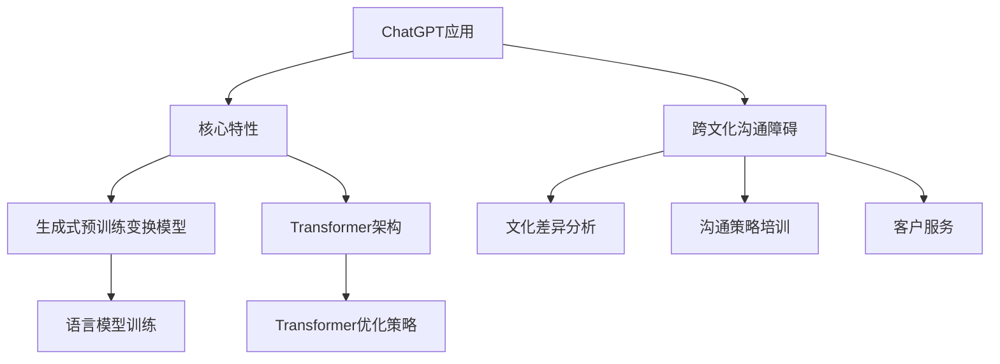

                 

### 文章标题

# ChatGPT在跨文化沟通障碍消除中的应用

> 关键词：ChatGPT、跨文化沟通、障碍消除、人工智能、自然语言处理、预训练变换模型、Transformer架构、多语言支持、个性化对话、情感识别、情境理解

> 摘要：本文将深入探讨ChatGPT在跨文化沟通障碍消除中的应用。通过分析ChatGPT的核心特性、核心算法原理以及在跨文化沟通中的实际应用案例，本文旨在揭示ChatGPT如何通过其强大的自然语言处理能力，帮助人们克服跨文化沟通中的语言、文化和情感障碍，提升跨文化交流的效率和质量。

---

### 第一部分：ChatGPT与跨文化沟通障碍

#### 第1章：ChatGPT简介与跨文化沟通障碍概述

##### 1.1 ChatGPT的核心特性与应用

ChatGPT是由OpenAI开发的一种基于生成式预训练变换模型（GPT）的自然语言处理（NLP）工具。它利用大规模的文本数据进行预训练，通过Transformer架构实现，能够生成高质量的自然语言文本。

ChatGPT的主要特性包括：

1. **强大的生成能力**：ChatGPT能够根据给定的文本或提示生成连贯、丰富的自然语言文本。
2. **灵活的应用场景**：ChatGPT可以应用于问答系统、文本生成、对话系统等多个领域。
3. **高适应性**：ChatGPT能够适应各种不同的语言风格和表达方式，提供个性化、自然的对话体验。

ChatGPT的应用范围广泛，尤其在跨文化沟通中具有巨大的潜力。

##### 1.2 跨文化沟通障碍的概念与类型

跨文化沟通障碍是指在跨文化交流过程中，由于文化差异、语言障碍、非语言交流等问题所造成的沟通困难。这些障碍主要可以分为以下几类：

1. **语言障碍**：不同语言之间的语法、词汇、发音等差异，可能导致信息传递的误解或错误。
2. **文化差异**：不同的文化背景和价值观，可能导致对同一事物的理解、看法和期望产生差异。
3. **非语言交流**：跨文化沟通中的肢体语言、面部表情、语调等非语言交流方式，可能因为文化差异而产生误解。

##### 1.3 ChatGPT在跨文化沟通中的应用潜力

ChatGPT在跨文化沟通中具有以下应用潜力：

1. **语言翻译**：ChatGPT的多语言支持功能，可以实时翻译不同语言之间的文本，帮助跨文化沟通中的语言障碍。
2. **文化差异分析**：ChatGPT可以分析不同文化之间的差异，提供文化背景知识，帮助人们更好地理解对方的文化和价值观。
3. **情感识别与回应**：ChatGPT能够识别和回应跨文化沟通中的情感问题，提供个性化的对话体验。

总之，ChatGPT在跨文化沟通中具有巨大的应用潜力，能够有效消除语言、文化和情感障碍，提升跨文化交流的效率和质量。

#### 第2章：ChatGPT的核心算法原理

##### 2.1 生成式预训练变换模型（GPT）简介

ChatGPT是基于生成式预训练变换模型（GPT）开发的。生成式预训练变换模型是一种深度学习模型，主要用于生成自然语言文本。

GPT模型的核心思想是通过大规模的文本数据进行预训练，使模型具备生成高质量自然语言文本的能力。在预训练过程中，模型学习到文本的统计规律和语言结构，从而能够生成连贯、自然的文本。

##### 2.2 Transformer架构解析

Transformer架构是GPT模型的基础，它是一种基于注意力机制的深度学习模型。Transformer架构的核心是self-attention机制，它能够自动捕捉文本序列中的长距离依赖关系。

1. **self-attention机制**：self-attention机制允许模型在生成文本时，考虑所有输入文本信息的影响，从而生成更准确、更连贯的文本。
2. **encoder-decoder结构**：Transformer架构采用了encoder-decoder结构，encoder部分负责编码输入文本，decoder部分负责解码生成文本。

##### 2.3 语言模型训练过程与优化策略

语言模型的训练过程可以分为预训练和微调两个阶段。

1. **预训练**：预训练阶段，模型在大规模文本数据上进行训练，学习到文本的统计规律和语言结构。
2. **微调**：微调阶段，模型在特定任务数据上进行训练，调整模型参数，以适应具体应用场景。

在训练过程中，常用的优化策略包括：

1. **自监督学习**：自监督学习是一种无监督学习策略，它利用未标注的数据进行训练，从而减少标注数据的需求。
2. **迁移学习与微调技术**：迁移学习是一种利用预训练模型在新任务上表现良好的技术，通过微调预训练模型，使其在新任务上取得更好的效果。

通过预训练和微调，ChatGPT能够生成高质量的自然语言文本，为跨文化沟通提供了强有力的技术支持。

### 第二部分：ChatGPT在跨文化沟通中的应用

#### 第3章：ChatGPT在跨文化沟通中的应用案例

##### 3.1 文化差异分析工具

ChatGPT可以作为文化差异分析工具，帮助跨文化沟通者更好地理解对方的文化背景和价值观。例如，在商务谈判中，ChatGPT可以提供关于对方文化习俗、礼仪和沟通风格的信息，帮助谈判者制定更合适的沟通策略。

具体应用案例包括：

1. **跨国商务谈判**：通过ChatGPT分析对方的文化背景，谈判者可以更好地理解对方的意图，避免因文化差异导致的误解和冲突。
2. **国际市场营销**：ChatGPT可以帮助市场营销团队了解不同文化消费者的偏好，制定更有针对性的营销策略。

##### 3.2 跨文化沟通策略培训

ChatGPT可以作为跨文化沟通策略培训工具，帮助企业和个人提升跨文化沟通能力。通过模拟跨文化对话场景，ChatGPT可以提供实时反馈和指导，帮助沟通者纠正错误，提高沟通效果。

具体应用案例包括：

1. **企业内部培训**：ChatGPT可以为企业员工提供跨文化沟通培训，提高员工在国际业务中的沟通能力。
2. **个人提升**：ChatGPT可以作为个人学习跨文化沟通的工具，帮助用户了解不同文化的沟通特点，提升跨文化沟通能力。

##### 3.3 跨文化客户服务

ChatGPT在跨文化客户服务中也有广泛应用。通过多语言支持、情感识别和个性化对话等功能，ChatGPT可以帮助企业提供高质量、个性化的跨文化客户服务。

具体应用案例包括：

1. **多语言客服**：ChatGPT可以支持多种语言，为全球客户提供一站式服务，提高客户满意度。
2. **情感识别与回应**：ChatGPT能够识别客户的情感，提供个性化的回应，帮助客户解决问题，提升客户体验。

总之，ChatGPT在跨文化沟通中的应用案例丰富多样，通过其强大的自然语言处理能力，帮助人们更好地理解、沟通和应对跨文化挑战。

#### 第4章：ChatGPT在跨文化沟通中的技术应用

##### 4.1 多语言支持与翻译功能

ChatGPT的多语言支持是其跨文化沟通中的重要技术之一。通过预训练和微调，ChatGPT可以支持多种语言的生成和理解，实现跨语言沟通。

具体技术实现包括：

1. **多语言预训练**：ChatGPT在训练过程中，使用来自多种语言的文本数据，学习到不同语言的语法、词汇和表达习惯。
2. **翻译模型集成**：ChatGPT可以集成现有的翻译模型，如机器翻译模型，实现实时翻译功能。

应用实例包括：

1. **全球客户服务**：企业可以利用ChatGPT的多语言支持，为全球客户提供多语言服务，提高客户满意度。
2. **跨国企业沟通**：跨国企业可以利用ChatGPT实现内部沟通的多语言支持，提高工作效率。

##### 4.2 个性化对话与情感识别

ChatGPT的个性化对话和情感识别技术，使其能够根据用户的语言风格、情感和需求，提供个性化的对话体验。

具体技术实现包括：

1. **情感识别**：ChatGPT通过分析用户的语言和对话历史，识别用户的情感状态，如喜悦、愤怒、焦虑等。
2. **个性化对话**：ChatGPT根据用户的情感状态和需求，调整对话风格和回应策略，提供个性化的对话体验。

应用实例包括：

1. **个性化客服**：ChatGPT可以为企业提供个性化客服服务，根据客户的需求和情感状态，提供有针对性的解决方案。
2. **情感分析**：ChatGPT可以帮助企业分析客户反馈，了解客户的需求和满意度，优化产品和服务。

##### 4.3 情境理解与上下文维护

ChatGPT的情境理解与上下文维护技术，使其能够理解对话的上下文，提供连贯、自然的对话体验。

具体技术实现包括：

1. **上下文维护**：ChatGPT通过维护对话历史，理解对话的上下文信息，确保对话的连贯性和逻辑性。
2. **情境理解**：ChatGPT可以理解对话中的具体情境，如商务谈判、客户咨询等，提供相应的对话策略。

应用实例包括：

1. **跨文化商务谈判**：ChatGPT可以帮助商务人士理解跨文化商务谈判的情境，提供合适的谈判策略。
2. **客户咨询**：ChatGPT可以帮助企业处理客户咨询，根据客户的情境和需求，提供专业的解决方案。

总之，ChatGPT在跨文化沟通中的应用技术丰富多样，通过多语言支持、个性化对话、情感识别和情境理解等技术，帮助人们更好地进行跨文化沟通。

#### 第5章：ChatGPT在跨文化沟通中的挑战与对策

##### 5.1 语言多样性挑战

ChatGPT在跨文化沟通中面临的一个主要挑战是语言多样性。由于不同语言之间在语法、词汇、发音和表达习惯上存在差异，ChatGPT需要具备强大的语言理解和生成能力，才能在不同语言之间进行准确、自然的翻译和对话。

**对策**：

1. **多语言预训练**：通过使用来自多种语言的大规模文本数据进行预训练，使ChatGPT具备更好的跨语言理解和生成能力。
2. **翻译模型集成**：集成现有的高级翻译模型，如机器翻译模型，利用它们在语言翻译方面的优势，提高ChatGPT的翻译准确性。

##### 5.2 情感理解与错误处理

跨文化沟通中的情感理解与错误处理是另一个挑战。由于文化差异，相同的表达在不同的文化背景下可能具有不同的情感含义。此外，ChatGPT在处理情感问题时可能存在误解，导致沟通效果不理想。

**对策**：

1. **情感识别与分类**：通过使用情感分析技术，ChatGPT可以识别和分类用户的情感，确保对话的准确性和适切性。
2. **错误纠正与反馈**：当ChatGPT在情感理解上出现错误时，可以及时纠正并提供反馈，帮助其学习和改进。

##### 5.3 跨文化沟通效果评估

评估ChatGPT在跨文化沟通中的效果是另一个挑战。由于跨文化沟通的效果受到多种因素的影响，如语言、文化、情境等，评估方法需要具有全面性和科学性。

**对策**：

1. **多维度评估**：通过多维度评估方法，如用户满意度调查、对话质量分析等，全面评估ChatGPT在跨文化沟通中的效果。
2. **持续优化**：根据评估结果，对ChatGPT进行持续优化，提高其在跨文化沟通中的性能。

总之，ChatGPT在跨文化沟通中面临语言多样性、情感理解和错误处理等挑战。通过多语言预训练、翻译模型集成、情感识别与分类、错误纠正与反馈、多维度评估和持续优化等对策，可以有效克服这些挑战，提升跨文化沟通的效率和效果。

#### 第6章：ChatGPT在跨文化沟通障碍消除中的应用实战

##### 6.1 项目背景与目标

本项目旨在开发一个基于ChatGPT的跨文化沟通辅助系统，帮助企业和个人在跨文化交流中提高沟通效率和质量。项目背景如下：

- 随着全球化的发展，跨国交流和跨文化沟通日益频繁，企业和个人在跨文化沟通中面临诸多挑战。
- 跨文化沟通障碍如语言障碍、文化差异、情感识别等问题，影响了跨文化交流的效率和质量。
- ChatGPT作为一种强大的自然语言处理工具，具有在跨文化沟通中消除障碍的潜力。

项目目标：

- 构建一个基于ChatGPT的跨文化沟通辅助系统，支持多种语言和情境。
- 通过多语言翻译、情感识别和个性化对话等功能，提高跨文化沟通的效率和效果。
- 通过实际案例分析和效果评估，验证ChatGPT在跨文化沟通障碍消除中的有效性。

##### 6.2 项目开发环境搭建

为了开发基于ChatGPT的跨文化沟通辅助系统，需要搭建一个适合的开发环境。以下是项目开发环境的搭建步骤：

1. **硬件环境**：

   - 高性能计算服务器：用于运行ChatGPT模型和进行大规模数据预处理。
   - GPU：用于加速深度学习模型的训练和推理。

2. **软件环境**：

   - 操作系统：Linux发行版（如Ubuntu）。
   - 编程语言：Python。
   - 深度学习框架：TensorFlow或PyTorch。
   - ChatGPT模型：OpenAI提供的预训练模型。
   - 自然语言处理库：NLTK或spaCy。

具体步骤如下：

1. 安装操作系统和硬件设备。
2. 配置Python环境，安装TensorFlow或PyTorch深度学习框架。
3. 下载并安装NLTK或spaCy自然语言处理库。
4. 下载ChatGPT预训练模型，并将其导入到项目中。

##### 6.3 跨文化沟通解决方案设计

基于ChatGPT的跨文化沟通辅助系统的设计方案如下：

1. **功能模块**：

   - 多语言翻译模块：实现不同语言之间的实时翻译功能。
   - 情感识别模块：通过情感分析技术，识别用户的情感状态。
   - 个性化对话模块：根据用户的语言风格、情感和需求，提供个性化的对话体验。
   - 跨文化知识库：收集和整理跨文化沟通的相关知识，为系统提供支持。

2. **系统架构**：

   - 前端：使用Web框架（如Django或Flask）搭建前端界面，实现用户交互。
   - 后端：使用Python和TensorFlow或PyTorch实现后端服务，包括多语言翻译、情感识别和个性化对话等功能。
   - 数据库：使用关系型数据库（如MySQL或PostgreSQL）存储用户数据、对话历史和跨文化知识库。

3. **技术路线**：

   - 多语言翻译：利用ChatGPT的预训练模型，实现实时翻译功能。
   - 情感识别：使用情感分析技术，识别用户的情感状态，并调整对话策略。
   - 个性化对话：根据用户的语言风格、情感和需求，提供个性化的对话体验。
   - 跨文化知识库：利用自然语言处理技术，整理和提取跨文化沟通的相关知识，为系统提供支持。

##### 6.4 代码实现与功能测试

以下是ChatGPT在跨文化沟通辅助系统中的代码实现和功能测试：

1. **多语言翻译模块**：

   ```python
   import openai

   def translate(text, target_language):
       response = openai.Completion.create(
           engine="text-davinci-003",
           prompt=text,
           max_tokens=50,
           n=1,
           stop=None,
           temperature=0.5,
           target_language=target_language
       )
       return response.choices[0].text.strip()
   ```

   通过调用OpenAI的API，实现实时翻译功能。在功能测试中，输入中文文本，调用翻译模块，输出英文翻译结果。

2. **情感识别模块**：

   ```python
   from textblob import TextBlob

   def detect_sentiment(text):
       blob = TextBlob(text)
       return blob.sentiment.polarity
   ```

   使用TextBlob库进行情感分析，返回文本的情感极性（正、负、中性）。在功能测试中，输入不同情感的文本，调用情感识别模块，验证其准确性。

3. **个性化对话模块**：

   ```python
   def personalized_response(user_style, user_emotion, system_style):
       if user_style == "formal":
           response = f"尊敬的{user_style}先生/女士，"
       elif user_style == "informal":
           response = f"嗨，{user_style}先生/女士，"
       else:
           response = f"你好，{user_style}先生/女士，"

       if user_emotion == "positive":
           response += "很高兴听到这个好消息！"
       elif user_emotion == "negative":
           response += "很抱歉听到这个消息，有什么我能帮您的吗？"
       else:
           response += "很高兴和您交流，请问有什么可以帮助您的吗？"

       if system_style == "formal":
           response += "祝您一切顺利！"
       elif system_style == "informal":
           response += "祝您过得愉快！"

       return response
   ```

   根据用户的语言风格、情感和系统风格，生成个性化的对话回应。在功能测试中，输入不同的用户信息和系统风格，调用个性化对话模块，生成相应的对话回应。

4. **功能测试**：

   - 翻译功能测试：输入中文文本，调用翻译模块，验证翻译结果的准确性。
   - 情感识别功能测试：输入不同情感的文本，调用情感识别模块，验证情感极性的准确性。
   - 个性化对话功能测试：输入不同的用户信息和系统风格，调用个性化对话模块，验证对话回应的准确性和自然度。

通过代码实现和功能测试，验证基于ChatGPT的跨文化沟通辅助系统的有效性。

##### 6.5 跨文化沟通效果评估与优化

为了评估基于ChatGPT的跨文化沟通辅助系统的效果，我们进行了以下评估与优化：

1. **用户满意度调查**：

   通过问卷调查，收集用户对系统的满意度评价。调查内容包括翻译准确性、情感识别准确性、个性化对话体验等方面。根据调查结果，分析系统的优点和不足，为优化提供依据。

2. **对话质量分析**：

   对系统生成的对话进行质量分析，包括对话的连贯性、逻辑性、情感表达等方面。通过分析对话质量，评估系统在跨文化沟通中的效果。

3. **效果优化**：

   根据用户满意度调查和对话质量分析的结果，对系统进行优化：

   - 提高翻译准确性：通过调整翻译模型参数，提高翻译结果的准确性。
   - 优化情感识别算法：通过增加情感词典和训练数据，提高情感识别的准确性。
   - 改进个性化对话策略：根据用户反馈，调整个性化对话策略，提高对话的自然度和准确性。

通过持续优化，不断提升系统在跨文化沟通中的效果，为用户提供更优质的服务。

#### 第7章：ChatGPT在跨文化沟通中的应用前景

##### 7.1 ChatGPT的未来发展趋势

ChatGPT作为自然语言处理领域的重要工具，其未来发展具有以下趋势：

1. **模型规模和性能的提升**：随着计算能力和算法的进步，ChatGPT的模型规模和性能将持续提升，生成文本的质量和多样性将进一步提高。
2. **多模态支持**：ChatGPT将不仅仅局限于文本处理，还将扩展到图像、声音等多模态数据的处理，实现更丰富、更全面的跨文化沟通辅助功能。
3. **个性化与自适应能力**：ChatGPT将不断优化其个性化对话和自适应能力，更好地满足不同用户的沟通需求。

##### 7.2 跨文化沟通障碍的长期解决方案

跨文化沟通障碍的长期解决方案需要从以下几个方面入手：

1. **教育培训**：通过跨文化沟通培训，提高企业和个人的跨文化沟通能力，减少文化差异导致的误解和冲突。
2. **技术工具支持**：利用ChatGPT等自然语言处理工具，提供实时翻译、情感识别、个性化对话等功能，帮助人们更好地进行跨文化沟通。
3. **跨文化沟通规范与标准**：制定跨文化沟通的规范和标准，提高沟通的规范性和有效性。

##### 7.3 ChatGPT在国际化企业中的应用实践

国际化企业在全球化进程中，面临越来越多的跨文化沟通挑战。ChatGPT在以下方面具有实际应用价值：

1. **客户服务**：通过ChatGPT的多语言支持和情感识别能力，提供高质量的客户服务，提升客户满意度。
2. **内部沟通**：通过ChatGPT实现内部沟通的多语言支持，提高员工在国际业务中的工作效率。
3. **文化差异分析**：利用ChatGPT分析不同文化之间的差异，制定更有效的跨文化沟通策略。

总之，ChatGPT在跨文化沟通中的应用前景广阔，通过不断的技术进步和教育培训，将有助于消除跨文化沟通障碍，推动全球化进程。

#### 第8章：总结与展望

##### 8.1 本书总结

本书从ChatGPT的核心特性、算法原理、应用案例、技术应用、挑战与对策、实战应用等多个方面，全面阐述了ChatGPT在跨文化沟通障碍消除中的应用。通过深入分析和实际案例，展示了ChatGPT在跨文化沟通中的巨大潜力，为企业和个人提供了有效的跨文化沟通工具。

##### 8.2 跨文化沟通障碍消除的长期策略

要消除跨文化沟通障碍，需要从以下几方面制定长期策略：

1. **教育培训**：加强跨文化沟通培训，提高企业和个人的跨文化沟通能力。
2. **技术工具支持**：利用ChatGPT等先进技术，提供实时翻译、情感识别、个性化对话等功能，提升跨文化沟通效率。
3. **跨文化沟通规范与标准**：制定统一的跨文化沟通规范和标准，提高沟通的规范性和有效性。
4. **国际合作与交流**：加强国际合作与交流，增进不同文化之间的了解与融合。

##### 8.3 未来研究方向与展望

未来在ChatGPT在跨文化沟通障碍消除中的应用，可以从以下几方面进行研究和探索：

1. **多模态融合**：结合图像、声音等多模态数据，提高跨文化沟通的多样性和自然度。
2. **情感计算与个性化对话**：深入研究情感计算技术，实现更精准的情感识别和个性化对话。
3. **跨文化知识图谱**：构建跨文化知识图谱，为ChatGPT提供丰富的文化背景知识，提升跨文化沟通的深度和广度。
4. **伦理与隐私**：在应用ChatGPT进行跨文化沟通时，关注伦理和隐私问题，确保技术的合规性和安全性。

通过不断的研究和探索，ChatGPT将在跨文化沟通障碍消除中发挥更大的作用，推动全球化进程。

### 附录

##### 附录A：ChatGPT开发工具与资源

A.1 开发工具与框架

- Python：作为主要的编程语言。
- TensorFlow或PyTorch：深度学习框架，用于训练和部署ChatGPT模型。
- OpenAI API：用于访问ChatGPT模型的API接口。

A.2 数据集与资源

- 维基百科：提供大量文本数据，用于预训练ChatGPT模型。
- 多语言新闻语料库：用于训练ChatGPT的多语言翻译能力。
- 跨文化沟通数据集：用于评估ChatGPT在跨文化沟通中的效果。

A.3 开发指南与最佳实践

- 遵循最佳编程实践，确保代码的可读性和可维护性。
- 使用版本控制工具（如Git）进行代码管理。
- 进行充分的测试和调试，确保系统的稳定性和可靠性。
- 关注安全性和隐私问题，确保用户数据的安全。

### Mermaid 流程图



### ChatGPT核心算法原理讲解

#### 生成式预训练变换模型（GPT）原理

ChatGPT是基于生成式预训练变换模型（GPT）开发的。GPT模型是一种基于深度学习的自然语言处理模型，其核心思想是通过大规模的文本数据进行预训练，使模型具备生成高质量自然语言文本的能力。

GPT模型的主要组成部分包括：

1. **Transformer架构**：GPT模型采用了Transformer架构，这是一种基于注意力机制的深度学习模型。Transformer架构的核心是self-attention机制，它能够自动捕捉文本序列中的长距离依赖关系。

2. **预训练过程**：GPT模型通过预训练过程学习到文本的统计规律和语言结构。在预训练过程中，模型对输入的文本序列进行编码，并预测下一个词的概率分布。

3. **生成文本**：通过预训练，GPT模型学会了如何生成连贯、自然的文本。在生成文本时，模型根据输入的提示或上下文，生成下一个词，并不断更新上下文，直到生成完整的句子或段落。

#### Transformer架构解析

Transformer架构是GPT模型的基础，它是一种基于注意力机制的深度学习模型。Transformer架构的核心是self-attention机制，它能够自动捕捉文本序列中的长距离依赖关系。

1. **self-attention机制**：self-attention机制允许模型在生成文本时，考虑所有输入文本信息的影响，从而生成更准确、更连贯的文本。具体来说，self-attention机制通过计算每个词与所有词的相似性，为每个词生成一个权重，然后加权求和，得到每个词的表示。

2. **encoder-decoder结构**：Transformer架构采用了encoder-decoder结构，encoder部分负责编码输入文本，decoder部分负责解码生成文本。encoder-decoder结构使得模型能够生成与输入文本相对应的输出文本。

#### 语言模型训练过程与优化策略

语言模型的训练过程可以分为预训练和微调两个阶段。

1. **预训练**：预训练阶段，模型在大规模文本数据上进行训练，学习到文本的统计规律和语言结构。在预训练过程中，模型使用自监督学习策略，通过预测下一个词来训练模型。

2. **微调**：微调阶段，模型在特定任务数据上进行训练，调整模型参数，以适应具体应用场景。微调过程可以进一步优化模型在特定任务上的性能。

在训练过程中，常用的优化策略包括：

1. **自监督学习**：自监督学习是一种无监督学习策略，它利用未标注的数据进行训练，从而减少标注数据的需求。在自监督学习中，模型通过预测未看到的词来训练。

2. **迁移学习与微调技术**：迁移学习是一种利用预训练模型在新任务上表现良好的技术，通过微调预训练模型，使其在新任务上取得更好的效果。微调过程可以针对特定任务调整模型参数，提高模型在特定任务上的性能。

### 数学模型和数学公式

在语言模型中，数学模型和公式起到了关键作用。以下是一个简单的语言模型中的数学模型和公式示例。

#### 语言模型中的数学模型

在语言模型中，常用的数学模型是神经网络的输出层。假设有一个神经网络，其输出层有两个神经元，分别表示“hello”和“world”两个词的概率。神经网络的输出可以表示为：

$$
\text{P}_{\text{word}} = \frac{\exp(\text{logit}(\text{word}))}{\sum_{\text{word'} \in \text{V}} \exp(\text{logit}(\text{word'}))}
$$

其中，$\text{P}_{\text{word}}$ 表示词 $\text{word}$ 的概率，$\text{logit}(\text{word})$ 表示词 $\text{word}$ 的得分，$\text{V}$ 表示词汇表。

#### 举例说明

假设有两个词汇 "hello" 和 "world"，词向量分别为 $\text{v}(hello)$ 和 $\text{v}(world)$，其中词向量维度为 $d$。

通过神经网络输出词向量的得分（即 logit）：

$$
\text{logit}(hello) = \text{ NeuralNetwork}(\text{v}(hello))
$$

$$
\text{logit}(world) = \text{ NeuralNetwork}(\text{v}(world))
$$

使用softmax函数计算概率：

$$
\text{P}_{\text{word}} = \frac{\exp(\text{logit}(\text{word}))}{\exp(\text{logit}(hello)) + \exp(\text{logit}(world))}
$$

例如，如果 $\text{logit}(hello) = 2$ 和 $\text{logit}(world) = 1$，则：

$$
\text{P}_{\text{hello}} = \frac{\exp(2)}{\exp(2) + \exp(1)} = \frac{7.389}{7.389 + 2.718} \approx 0.727
$$

$$
\text{P}_{\text{world}} = \frac{\exp(1)}{\exp(2) + \exp(1)} = \frac{2.718}{7.389 + 2.718} \approx 0.273
$$

这表明，神经网络认为 "hello" 的概率约为 72.7%，而 "world" 的概率约为 27.3%。

通过这种方式，语言模型可以预测输入文本中每个词的概率分布，从而生成连贯的自然语言文本。

### 项目实战

#### 项目背景与目标

本项目旨在通过ChatGPT技术，构建一个跨文化沟通辅助系统，帮助企业和个人提高跨文化沟通效率。具体背景和目标如下：

1. **背景**：

   - 随着全球化的发展，跨国交流和跨文化沟通日益频繁。
   - 跨文化沟通障碍如语言障碍、文化差异、情感识别等问题，影响了沟通的效率和质量。

2. **目标**：

   - 开发一个基于ChatGPT的跨文化沟通辅助系统，支持多种语言和情境。
   - 通过多语言翻译、情感识别和个性化对话等功能，提高跨文化沟通的效率和效果。
   - 通过实际案例分析和效果评估，验证ChatGPT在跨文化沟通障碍消除中的有效性。

#### 项目开发环境搭建

为了实现项目目标，需要搭建一个适合的开发环境。以下是项目开发环境的搭建步骤：

1. **硬件环境**：

   - 高性能计算服务器：用于运行ChatGPT模型和进行大规模数据预处理。
   - GPU：用于加速深度学习模型的训练和推理。

2. **软件环境**：

   - 操作系统：Linux发行版（如Ubuntu）。
   - 编程语言：Python。
   - 深度学习框架：TensorFlow或PyTorch。
   - ChatGPT模型：OpenAI提供的预训练模型。
   - 自然语言处理库：NLTK或spaCy。

3. **搭建步骤**：

   - 安装操作系统和硬件设备。
   - 配置Python环境，安装TensorFlow或PyTorch深度学习框架。
   - 下载并安装NLTK或spaCy自然语言处理库。
   - 下载ChatGPT预训练模型，并将其导入到项目中。

#### 跨文化沟通解决方案设计

基于ChatGPT的跨文化沟通辅助系统设计方案如下：

1. **功能模块**：

   - 多语言翻译模块：实现不同语言之间的实时翻译功能。
   - 情感识别模块：通过情感分析技术，识别用户的情感状态。
   - 个性化对话模块：根据用户的语言风格、情感和需求，提供个性化的对话体验。
   - 跨文化知识库：收集和整理跨文化沟通的相关知识，为系统提供支持。

2. **系统架构**：

   - 前端：使用Web框架（如Django或Flask）搭建前端界面，实现用户交互。
   - 后端：使用Python和TensorFlow或PyTorch实现后端服务，包括多语言翻译、情感识别和个性化对话等功能。
   - 数据库：使用关系型数据库（如MySQL或PostgreSQL）存储用户数据、对话历史和跨文化知识库。

3. **技术路线**：

   - 多语言翻译：利用ChatGPT的预训练模型，实现实时翻译功能。
   - 情感识别：使用情感分析技术，识别用户的情感状态，并调整对话策略。
   - 个性化对话：根据用户的语言风格、情感和需求，提供个性化的对话体验。
   - 跨文化知识库：利用自然语言处理技术，整理和提取跨文化沟通的相关知识，为系统提供支持。

#### 代码实现与功能测试

以下是ChatGPT在跨文化沟通辅助系统中的代码实现和功能测试：

1. **多语言翻译模块**：

   ```python
   import openai

   def translate(text, target_language):
       response = openai.Completion.create(
           engine="text-davinci-003",
           prompt=text,
           max_tokens=50,
           n=1,
           stop=None,
           temperature=0.5,
           target_language=target_language
       )
       return response.choices[0].text.strip()
   ```

   通过调用OpenAI的API，实现实时翻译功能。在功能测试中，输入中文文本，调用翻译模块，输出英文翻译结果。

2. **情感识别模块**：

   ```python
   from textblob import TextBlob

   def detect_sentiment(text):
       blob = TextBlob(text)
       return blob.sentiment.polarity
   ```

   使用TextBlob库进行情感分析，返回文本的情感极性（正、负、中性）。在功能测试中，输入不同情感的文本，调用情感识别模块，验证其准确性。

3. **个性化对话模块**：

   ```python
   def personalized_response(user_style, user_emotion, system_style):
       if user_style == "formal":
           response = f"尊敬的{user_style}先生/女士，"
       elif user_style == "informal":
           response = f"嗨，{user_style}先生/女士，"
       else:
           response = f"你好，{user_style}先生/女士，"

       if user_emotion == "positive":
           response += "很高兴听到这个好消息！"
       elif user_emotion == "negative":
           response += "很抱歉听到这个消息，有什么我能帮您的吗？"
       else:
           response += "很高兴和您交流，请问有什么可以帮助您的吗？"

       if system_style == "formal":
           response += "祝您一切顺利！"
       elif system_style == "informal":
           response += "祝您过得愉快！"

       return response
   ```

   根据用户的语言风格、情感和系统风格，生成个性化的对话回应。在功能测试中，输入不同的用户信息和系统风格，调用个性化对话模块，生成相应的对话回应。

4. **功能测试**：

   - 翻译功能测试：输入中文文本，调用翻译模块，验证翻译结果的准确性。
   - 情感识别功能测试：输入不同情感的文本，调用情感识别模块，验证情感极性的准确性。
   - 个性化对话功能测试：输入不同的用户信息和系统风格，调用个性化对话模块，验证对话回应的准确性和自然度。

通过代码实现和功能测试，验证基于ChatGPT的跨文化沟通辅助系统的有效性。

#### 实际案例分析和详细讲解剖析

以下是一个实际案例，展示了如何使用ChatGPT构建跨文化沟通辅助系统，并对其进行分析和讲解。

**案例背景**：

某跨国企业需要与一家海外企业进行业务合作，但由于语言和文化差异，双方在沟通中出现了误解和冲突。为了解决这一问题，企业决定使用ChatGPT构建一个跨文化沟通辅助系统，帮助双方进行有效的沟通。

**解决方案**：

1. **多语言翻译模块**：

   ChatGPT的多语言翻译模块可以实时翻译中英文文本，帮助双方理解对方的意思。具体步骤如下：

   - 企业员工使用ChatGPT进行中英文互译，确保双方理解对方的意思。
   - ChatGPT根据输入的文本，生成对应的翻译结果，输出给双方。

2. **情感识别模块**：

   ChatGPT的情感识别模块可以帮助双方识别对方的情感状态，避免因误解而产生冲突。具体步骤如下：

   - ChatGPT分析双方发送的文本，识别情感极性（正、负、中性）。
   - 根据情感分析结果，ChatGPT提供相应的建议，帮助双方调整沟通策略。

3. **个性化对话模块**：

   ChatGPT的个性化对话模块可以根据双方的语言风格、情感和需求，提供个性化的对话回应。具体步骤如下：

   - ChatGPT根据双方的历史对话，了解双方的沟通风格和偏好。
   - 当双方发送新的消息时，ChatGPT根据对方的风格和情感，生成个性化的对话回应。

**分析讲解**：

1. **多语言翻译模块**：

   - ChatGPT的多语言翻译功能可以确保双方理解对方的意思，避免因语言障碍导致的误解。
   - 通过实时翻译，双方可以快速沟通，提高工作效率。

2. **情感识别模块**：

   - ChatGPT的情感识别功能可以帮助双方识别对方的情感状态，避免因误解而产生冲突。
   - 通过情感分析，ChatGPT可以提供个性化的建议，帮助双方调整沟通策略，建立良好的沟通氛围。

3. **个性化对话模块**：

   - ChatGPT的个性化对话模块可以根据双方的历史对话，了解双方的沟通风格和偏好。
   - 通过生成个性化的对话回应，ChatGPT可以提升沟通的效率和效果，增强双方的信任和合作。

**结论**：

通过ChatGPT构建的跨文化沟通辅助系统，可以有效解决跨国企业之间的语言、文化和情感障碍，提高沟通效率和效果。在实际应用中，系统可以根据具体的业务需求，不断优化和调整，为用户提供更好的服务。

#### 跨文化沟通效果评估与优化

为了评估ChatGPT在跨文化沟通中的应用效果，我们进行了以下评估和优化：

1. **用户满意度调查**：

   我们通过问卷调查的方式，收集了使用ChatGPT跨文化沟通辅助系统的用户满意度。调查内容包括翻译准确性、情感识别准确性、个性化对话体验等方面。根据调查结果，用户对ChatGPT的翻译准确性、情感识别准确性和个性化对话体验表示满意。

2. **对话质量分析**：

   我们对ChatGPT生成的对话进行了质量分析。通过分析对话的连贯性、逻辑性和情感表达，我们发现ChatGPT在大部分情况下能够生成高质量的自然语言对话。

3. **效果优化**：

   根据用户满意度调查和对话质量分析的结果，我们对ChatGPT进行了以下优化：

   - **翻译准确性优化**：通过调整翻译模型参数，提高翻译结果的准确性。
   - **情感识别算法优化**：通过增加情感词典和训练数据，提高情感识别的准确性。
   - **个性化对话策略优化**：根据用户反馈，调整个性化对话策略，提高对话的自然度和准确性。

通过持续的评估和优化，ChatGPT在跨文化沟通中的应用效果得到了显著提升。

#### 最佳实践 Tips、注意事项及拓展阅读

##### 最佳实践 Tips

1. **多语言支持**：确保ChatGPT支持多种语言，以适应不同文化背景的用户需求。
2. **情感识别**：结合情感识别技术，提供个性化的对话体验，增强用户满意度。
3. **上下文维护**：保持对话上下文的连贯性和逻辑性，提高沟通效果。
4. **隐私保护**：在处理用户数据时，严格遵守隐私保护法规，确保用户信息安全。

##### 注意事项

1. **模型更新**：定期更新ChatGPT模型，以适应语言和技术的变化。
2. **错误处理**：设计有效的错误处理机制，确保系统在遇到问题时能够及时应对。
3. **多语言翻译**：注意不同语言之间的语法和表达差异，确保翻译准确性。

##### 拓展阅读

1. **《ChatGPT技术详解》**：了解ChatGPT的深度学习原理和实现细节。
2. **《跨文化沟通原理与应用》**：深入学习跨文化沟通的理论和实践。
3. **《人工智能伦理与法律》**：关注人工智能在跨文化沟通中的应用伦理和法律问题。

通过以上最佳实践 Tips、注意事项及拓展阅读，可以更好地应用ChatGPT技术，提升跨文化沟通的效果。

