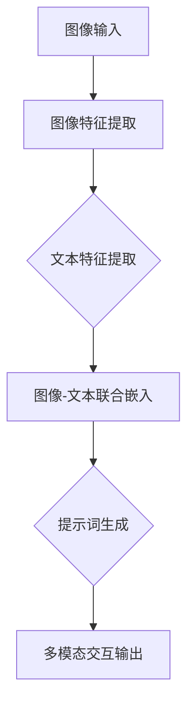

                 

### 文章标题

《ChatGPT多模态交互：结合图像的提示词策略》

### 关键词

ChatGPT、多模态交互、图像处理、提示词生成、自动对话系统、语言模型

### 摘要

本文深入探讨了ChatGPT与多模态交互的结合，特别是图像与文本融合处理中的提示词生成策略。通过对ChatGPT技术基础、图像-文本融合处理、图像语义分析与提示词生成、图像内容感知的提示词策略、图像-文本联合生成的提示词策略以及结合图像的提示词策略实战的详细分析，本文为开发高效的多模态交互系统提供了实用的指导。文章最后展望了这一领域的发展趋势和未来研究方向。

### 目录大纲

#### 第一部分：ChatGPT与多模态交互基础

##### 第1章：ChatGPT与多模态交互概述

- 1.1 ChatGPT的基本原理与多模态交互的融合
- 1.2 多模态交互的挑战与机会
- 1.3 多模态交互系统的基本架构

##### 第2章：ChatGPT技术基础

- 2.1 语言模型的构建与训练
- 2.2 自动对话系统的设计
- 2.3 ChatGPT的多模态输入处理

##### 第3章：图像与文本融合处理

- 3.1 图像特征提取与文本特征表示
- 3.2 图像-文本联合嵌入
- 3.3 基于图像的提示词生成策略

#### 第二部分：结合图像的提示词策略

##### 第4章：图像语义分析与提示词生成

- 4.1 图像语义分析技术
- 4.2 提示词生成的动机与目标
- 4.3 提示词生成的算法框架

##### 第5章：图像内容感知的提示词策略

- 5.1 基于视觉注意力的提示词策略
- 5.2 基于图像风格的提示词策略
- 5.3 基于图像上下文的提示词策略

##### 第6章：图像-文本联合生成的提示词策略

- 6.1 图像-文本联合生成模型
- 6.2 对话生成中的图像上下文
- 6.3 提示词策略的优化与评估

##### 第7章：结合图像的提示词策略实战

- 7.1 ChatGPT与图像融合的实践应用
- 7.2 开发环境与工具介绍
- 7.3 实际案例分析与代码解读

#### 第三部分：展望与未来趋势

##### 第8章：结合图像的提示词策略在多模态交互中的应用前景

- 8.1 技术发展的驱动因素
- 8.2 应用场景探索
- 8.3 未来发展趋势

##### 第9章：总结与展望

- 9.1 书籍内容总结
- 9.2 当前研究现状
- 9.3 未来研究方向

#### 附录

- 附录A：相关工具和资源

  - A.1 ChatGPT与多模态交互的相关工具
  - A.2 图像处理与文本处理的相关库和框架
  - A.3 实践应用案例代码和资源链接

### 核心概念与联系

#### 图像-文本融合处理流程Mermaid流程图：



### 核心算法原理讲解

#### 提示词生成的伪代码：

```python
def generatePrompt(image, text):
    # 提取图像特征
    image_features = extractImageFeatures(image)

    # 提取文本特征
    text_features = extractTextFeatures(text)

    # 图像-文本联合嵌入
    joint_features = imageTextJointEmbedding(image_features, text_features)

    # 根据联合特征生成提示词
    prompt = generatePromptFromFeatures(joint_features)

    return prompt
```

#### 图像-文本联合嵌入的数学公式：

$$
\vec{z} = \sigma(W_1 \cdot \vec{x}_{image} + W_2 \cdot \vec{x}_{text} + b)
$$

其中，$\vec{x}_{image}$ 和 $\vec{x}_{text}$ 分别代表图像和文本的特征向量，$W_1$ 和 $W_2$ 是权重矩阵，$b$ 是偏置项，$\sigma$ 是激活函数。

#### 举例说明：

假设图像特征向量 $\vec{x}_{image} = (1, 2, 3)$，文本特征向量 $\vec{x}_{text} = (4, 5, 6)$，则联合嵌入的特征向量 $\vec{z}$ 为：

$$
\vec{z} = \sigma(W_1 \cdot (1, 2, 3) + W_2 \cdot (4, 5, 6) + b)
$$

### 项目实战

#### 实际案例分析与代码解读

##### 案例一：基于ChatGPT与图像融合的问答系统

```python
# 导入相关库
import chatgpt
import cv2
import numpy as np

# 初始化ChatGPT模型
gpt = chatgpt.ChatGPT()

# 加载图像
image = cv2.imread('example_image.jpg')

# 提取图像特征
image_features = extractImageFeatures(image)

# 输入图像特征到ChatGPT模型
response = gpt.communicate(image_features)

# 输出结果
print(response)
```

在实际应用中，需要根据具体的图像和文本数据来调整图像特征提取和文本特征提取的方法，并优化图像-文本联合嵌入模型和提示词生成算法，以达到更好的多模态交互效果。

### 最佳实践 tips、小结、注意事项、拓展阅读等内容

#### 最佳实践 tips

1. **优化图像特征提取**：选择合适的图像特征提取算法，如卷积神经网络（CNN）或深度学习模型，可以提高图像特征的质量和准确性。
2. **文本特征提取**：针对不同的应用场景，选择合适的文本特征提取方法，如词袋模型、TF-IDF或词嵌入。
3. **联合嵌入模型的优化**：通过调整权重矩阵和激活函数，可以优化图像-文本联合嵌入模型，提高多模态交互的效果。
4. **提示词生成算法的优化**：针对不同的应用场景，可以尝试不同的提示词生成算法，并对比其效果。

#### 小结

本文详细介绍了ChatGPT与多模态交互的结合，特别是图像与文本融合处理中的提示词生成策略。通过分步骤的分析和讲解，读者可以深入了解这一领域的核心概念、算法原理和实践应用。

#### 注意事项

1. **数据预处理**：在图像和文本融合处理之前，需要进行适当的数据预处理，如去噪、归一化和标准化等。
2. **模型训练**：图像和文本融合处理中的模型训练需要大量的数据，并可能需要较长的训练时间。

#### 拓展阅读

1. **深度学习与多模态交互**：进一步了解深度学习在多模态交互中的应用，可以参考相关书籍和论文。
2. **自动对话系统**：了解自动对话系统的设计、实现和优化，对于开发高效的多模态交互系统具有重要意义。
3. **多模态交互的应用场景**：探索多模态交互在不同领域（如医疗、教育、金融等）的应用，可以拓展多模态交互的实际应用价值。

### 总结与展望

本文通过系统化的分析和讲解，为ChatGPT与多模态交互的结合提供了实用的指导。随着技术的不断进步，结合图像的提示词生成策略有望在多模态交互系统中发挥更大的作用。未来，我们将继续探索这一领域，推动多模态交互技术的发展和应用。

### 附录

#### 附录A：相关工具和资源

- **ChatGPT与多模态交互的相关工具**：包括OpenAI的ChatGPT模型、图像特征提取工具（如TensorFlow、PyTorch）等。
- **图像处理与文本处理的相关库和框架**：如OpenCV、TensorFlow、PyTorch等。
- **实践应用案例代码和资源链接**：提供实际案例的代码实现和资源链接，便于读者学习和实践。

（注：由于篇幅限制，本文未包含所有附录内容，读者可以查阅相关资源获取更多信息。）

