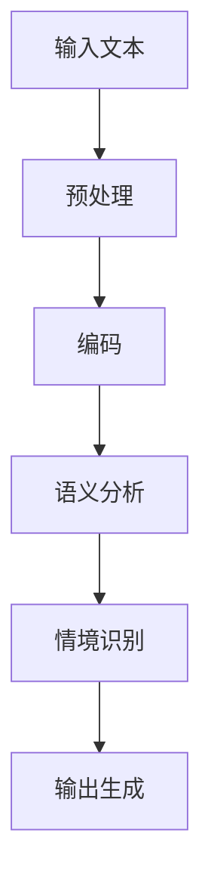
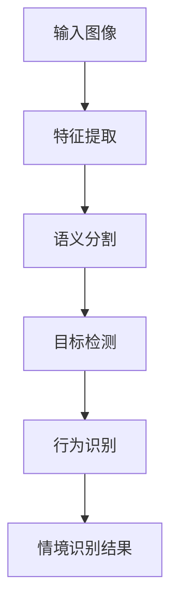
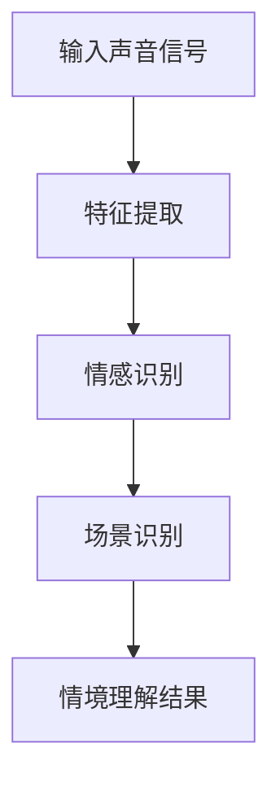
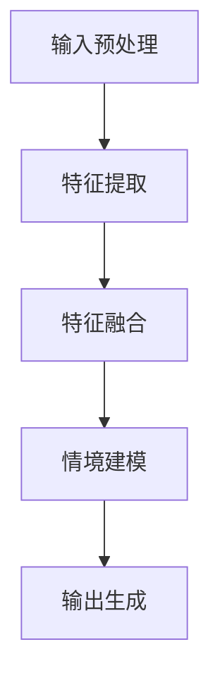

                 


### 文章标题: 《ChatGPT多模态情境理解：整合文本、图像和声音的AI认知系统》

关键词：ChatGPT、多模态情境理解、文本、图像、声音、AI认知系统、语言模型、卷积神经网络、多模态数据整合、情境识别、项目实战。

摘要：本文深入探讨ChatGPT在多模态情境理解方面的应用，包括文本、图像和声音的理解与整合。通过详细介绍ChatGPT的技术基础，多模态AI认知系统的构建，以及项目实战案例，揭示了多模态情境理解的奥秘，为AI技术的发展提供了新的思路。

### 引言

#### 1.1 书籍概述

**《ChatGPT多模态情境理解：整合文本、图像和声音的AI认知系统》**旨在为读者提供系统、全面地了解ChatGPT及其在多模态情境理解中的卓越表现。随着人工智能技术的快速发展，尤其是深度学习、自然语言处理和计算机视觉等领域，多模态情境理解正逐渐成为研究热点。本书背景源自于对人工智能技术深入研究的迫切需求，目标是为研究者、工程师和开发者提供一本既有深度又实用的参考书。

多模态情境理解，顾名思义，是指人工智能系统能够整合来自不同模态的数据，如文本、图像和声音，进行统一的情境理解。这种理解能力不仅提升了AI的应用范围，还为跨领域的智能系统开发提供了新的思路。ChatGPT作为OpenAI推出的领先语言模型，具备强大的文本理解能力。而本书的核心内容便是探讨如何将ChatGPT与图像、声音等模态的数据结合，构建出一个全面的AI认知系统。

#### 1.2 ChatGPT简介

ChatGPT是由OpenAI于2022年11月推出的一个基于GPT-3.5的语言模型。ChatGPT的发展历程可以追溯到2018年，当时OpenAI发布了GPT模型，标志着语言模型技术的重大突破。随后，GPT-2和GPT-3等版本相继问世，证明了深度学习在自然语言处理领域的巨大潜力。ChatGPT在GPT-3的基础上进行了优化，旨在提升对话生成的流畅性和自然度。其基本原理是通过大量的文本数据进行预训练，使模型能够理解和生成人类语言。

ChatGPT的出现，不仅改变了自然语言处理领域的格局，也为多模态情境理解提供了坚实的基础。其强大的文本理解能力，使得ChatGPT能够处理复杂、多变的对话场景，实现与人类的高效沟通。然而，仅限于文本的情境理解还远远不够，为了实现更为全面、自然的交流，将ChatGPT与图像、声音等模态的数据结合，成为当前研究的一个重要方向。

#### 1.3 多模态AI认知系统

多模态AI认知系统是指能够整合来自不同模态的数据（文本、图像、声音等），进行统一理解和处理的系统。在多模态情境理解中，不同模态的数据往往具有互补性，整合这些数据能够提升AI系统的理解和表达能力。

多模态数据源包括文本、图像和声音。文本数据通常是自然语言文本，如对话、文章、评论等；图像数据包括静态图像和视频帧；声音数据可以是语音、音乐、环境声音等。多模态数据的整合方法包括数据同步与对齐、特征融合、情境建模等。

多模态整合的关键在于如何将不同模态的数据转化为统一的表示，并在此基础上进行情境理解。例如，可以将文本数据编码为语义向量，图像数据通过卷积神经网络提取特征，声音数据通过梅尔频率倒谱系数（MFCC）进行特征提取。然后，利用多模态特征融合算法，将这些特征整合为一个统一的表示，再通过情境建模算法进行情境理解。

总之，多模态AI认知系统不仅能够提升AI的理解能力，也为实现更加自然、高效的智能交互提供了可能。本文将详细介绍ChatGPT在多模态情境理解中的应用，旨在为读者提供一份全面、系统的参考。

### 第一部分: 引言

#### 1.1 书籍概述

**《ChatGPT多模态情境理解：整合文本、图像和声音的AI认知系统》**旨在深入探讨人工智能（AI）领域的一个前沿话题——多模态情境理解。多模态情境理解是指人工智能系统能够处理并整合来自不同感官模态的数据，如文本、图像和声音，从而在复杂环境中进行更准确、更自然的理解。本书背景源于人工智能技术的快速发展，特别是自然语言处理（NLP）、计算机视觉和语音识别等领域的突破性进展。这些技术使得人工智能系统不仅能够理解和生成文本，还能够处理图像和声音信息，从而实现更为复杂和多样化的任务。

本书的目标是为读者提供一个系统、全面的指南，介绍ChatGPT如何通过整合文本、图像和声音数据，构建一个强大的AI认知系统。ChatGPT是OpenAI开发的一个领先的语言模型，具有强大的文本理解和生成能力。通过将ChatGPT与图像和声音数据结合，可以实现多模态情境理解，这不仅在学术界具有重大意义，也在实际应用中有着广阔的前景。

本书主要涵盖以下几个部分：

1. **ChatGPT的基本原理**：介绍ChatGPT的发展历程、架构和主要技术特点，包括其基于GPT-3.5的预训练模型。
2. **多模态AI认知系统的构建**：详细讨论如何整合文本、图像和声音数据，包括数据预处理、特征提取和融合的方法。
3. **多模态情境理解技术基础**：介绍文本、图像和声音情境理解的原理，包括语言模型、卷积神经网络（CNN）和梅尔频率倒谱系数（MFCC）。
4. **项目实战**：通过具体的实战案例，展示如何在实际项目中应用多模态情境理解技术，包括智能客服系统、视频内容理解系统和声音交互系统。
5. **项目总结与展望**：总结项目成果，讨论面临的挑战和未来的发展方向。

通过本书，读者不仅可以了解多模态情境理解的最新研究进展，还可以掌握如何将ChatGPT应用于多模态情境理解的实际项目中。本书适合人工智能研究者、工程师和开发者阅读，也适用于高校和相关培训机构的课程教材。

#### 1.2 ChatGPT简介

ChatGPT是OpenAI推出的一个先进语言模型，它在自然语言处理（NLP）领域取得了显著的成就。ChatGPT的发展历程可以追溯到2018年，当时OpenAI发布了GPT模型，这是第一个大规模预训练的变换模型，它标志着NLP领域的一个重要里程碑。随后，GPT-2、GPT-3和GPT-3.5等后续版本相继问世，这些版本不断优化和扩展了原始模型的能力。

**GPT模型的发展历程**：
- **GPT**（2018年）：是第一个大规模预训练变换模型，基于Transformer架构，使用1.5亿个参数进行预训练。
- **GPT-2**（2019年）：参数增加到1.56亿个，能够生成更流畅、更自然的文本。
- **GPT-3**（2020年）：拥有1750亿个参数，成为当时最大的NLP模型，能够完成各种复杂的文本任务，如机器翻译、问答系统、文本生成等。
- **GPT-3.5**（2022年）：在GPT-3的基础上进行了进一步的优化，增强了对话生成的能力，推出了ChatGPT。

**ChatGPT的基本原理**：
ChatGPT的核心原理是基于Transformer架构的预训练和微调。Transformer模型通过自注意力机制，能够在处理长文本时保持信息的一致性和连贯性，这使得ChatGPT在文本理解和生成方面表现出色。

1. **预训练**：ChatGPT首先在大规模的文本语料库上进行预训练，学习文本的语法规则、语义关系和语言模式。预训练过程中，模型通过生成和预测下一个词来优化参数，从而提高模型的文本生成能力。
2. **微调**：在预训练的基础上，ChatGPT通过特定任务的数据集进行微调，以适应具体的任务需求。微调过程中，模型会根据输入的文本和任务目标进行参数调整，以实现更好的性能。

**ChatGPT的应用场景**：
ChatGPT的强大文本生成能力使其在多个应用场景中具有广泛的应用。以下是一些典型的应用场景：

1. **问答系统**：ChatGPT可以用于构建智能问答系统，如搜索引擎、客服系统等，能够回答用户提出的各种问题。
2. **文本生成**：ChatGPT可以生成各种类型的文本，如新闻文章、故事、诗歌等，为内容创作者提供辅助。
3. **对话系统**：ChatGPT可以与用户进行自然对话，实现人机交互，如聊天机器人、虚拟助手等。
4. **翻译和语言模型**：ChatGPT可以用于翻译不同语言之间的文本，支持多种语言的交互。

总之，ChatGPT凭借其卓越的文本理解和生成能力，为多模态情境理解提供了坚实的基础。通过本书，读者可以深入理解ChatGPT的基本原理和应用场景，从而更好地利用这一工具进行研究和开发。

#### 1.3 多模态AI认知系统

多模态AI认知系统是一种能够整合并理解来自多种感官模态（文本、图像、声音等）的数据的智能系统。这种系统通过结合不同模态的数据，能够在复杂的情境中实现更准确、更全面的理解和推理。多模态AI认知系统的构建涉及到数据收集、预处理、特征提取、特征融合和情境建模等多个环节。

**多模态数据源介绍**：

1. **文本数据**：文本数据通常包括对话、文章、评论等形式。这些数据提供了丰富的语言信息，是自然语言处理（NLP）的基础。
2. **图像数据**：图像数据可以是静态的图片或动态的视频帧。图像数据通过计算机视觉技术进行处理，可以提取出位置、形状、纹理等视觉特征。
3. **声音数据**：声音数据包括语音、音乐和环境声音等。声音数据通过语音识别和声学模型进行处理，可以提取出频率、音调、节奏等声音特征。

**多模态数据的整合方法**：

多模态数据整合的关键在于如何将不同模态的数据进行统一表示，以便于后续的情境理解。以下是一些常见的整合方法：

1. **数据同步与对齐**：确保不同模态的数据在时间轴上保持一致，以便于后续的特征提取和融合。
2. **特征提取**：利用特定的算法从不同模态的数据中提取特征。例如，文本数据可以通过词嵌入或语言模型提取语义特征，图像数据可以通过卷积神经网络（CNN）提取视觉特征，声音数据可以通过梅尔频率倒谱系数（MFCC）提取声学特征。
3. **特征融合**：将不同模态的特征进行融合，形成统一的特征表示。常见的融合方法包括拼接、加权平均、注意力机制等。
4. **情境建模**：基于融合后的特征，构建情境模型，用于情境理解和推理。情境模型可以是神经网络模型、决策树模型或其他机器学习模型。

通过多模态数据整合，AI系统能够更全面地理解复杂情境，提高任务执行的准确性和鲁棒性。例如，在视频内容理解任务中，整合图像和声音数据可以帮助系统更准确地识别和解析视频中的情境；在智能客服系统中，整合文本和语音数据可以提升对话的连贯性和自然度。

总之，多模态AI认知系统的构建是一个复杂的过程，涉及到多个技术环节。通过合理的整合方法和高效的算法，多模态AI认知系统在许多领域具有广泛的应用前景。在本文的后续部分，我们将进一步探讨文本、图像和声音情境理解的原理和方法，并介绍如何在项目中实现多模态整合。

### 第二部分: ChatGPT多模态情境理解技术基础

#### 2.1 文本情境理解

文本情境理解是自然语言处理（NLP）中的一个核心任务，它涉及到对文本内容进行深入的理解和分析，以提取语义信息、理解语境和情境。ChatGPT作为一种强大的语言模型，在文本情境理解方面表现出色。本节将详细介绍文本情境理解的技术基础，包括语言模型与语义分析、文本情境理解框架及其应用实例。

##### 2.1.1 语言模型与语义分析

1. **语言模型原理**：
语言模型是文本情境理解的基础，它用于预测下一个单词或字符。ChatGPT基于Transformer架构，通过自注意力机制，能够捕捉文本中的长距离依赖关系，从而生成连贯、自然的文本。语言模型的训练过程通常分为两个阶段：预训练和微调。

   - **预训练**：在大规模文本语料库上进行，模型通过生成和预测下一个词来学习语言的统计规律和语法结构。
   - **微调**：在特定任务的数据集上进行，模型根据任务需求进行参数调整，以优化性能。

2. **语义分析技术**：
语义分析是文本情境理解的重要环节，它涉及到对文本内容进行语义层次的分析，以提取出文本中的实体、关系和事件。ChatGPT通过预训练过程中学习到的语言规律和统计信息，能够对文本进行语义分析。常见的语义分析技术包括：

   - **词嵌入**：将单词映射到高维空间中，使其在语义上相近的单词在空间中更接近。
   - **实体识别**：从文本中识别出具体的实体，如人名、地名、组织名等。
   - **关系提取**：识别出文本中实体之间的关系，如因果关系、所属关系等。
   - **事件抽取**：从文本中提取出具体的事件信息，包括事件类型、事件时间和参与者等。

##### 2.1.2 文本情境理解框架

文本情境理解框架通常包括以下几个关键组件：

1. **输入预处理**：对文本进行清洗、分词、词性标注等预处理操作，以便于后续的语义分析。
2. **语言模型**：使用预训练的语言模型对预处理后的文本进行编码，生成语义向量。
3. **语义分析模块**：利用语义分析技术对语义向量进行解析，提取出文本中的关键信息，如实体、关系和事件。
4. **情境识别算法**：基于提取出的关键信息，使用机器学习算法进行情境识别，确定文本的情境类型。
5. **输出生成**：根据情境识别结果，生成对应的文本回应或执行相应的任务。

以下是一个简化的文本情境理解框架的Mermaid流程图：



##### 2.1.3 文本情境理解应用实例

文本情境理解在多个实际应用中具有重要价值，以下是一些典型的应用实例：

1. **智能客服系统**：利用文本情境理解，智能客服系统能够理解用户的问题，提供准确的回答和建议，提升用户体验。
2. **文本分类**：通过对文本内容进行情境理解，可以实现文本的分类任务，如新闻分类、情感分析等。
3. **问答系统**：基于文本情境理解，问答系统能够理解用户的问题，并在大量文本数据中找到最相关的答案。
4. **内容推荐**：通过分析文本情境，推荐系统可以更准确地推荐用户感兴趣的内容。

以下是一个文本情境理解的伪代码示例：

```python
# 输入文本
text = "我今天去了一个美丽的公园，天气非常好，我看到了很多漂亮的花朵。"

# 预处理
cleaned_text = preprocess(text)

# 编码
encoded_text = language_model.encode(cleaned_text)

# 语义分析
entities = extract_entities(encoded_text)
relations = extract_relations(encoded_text)
events = extract_events(encoded_text)

# 情境识别
context = identify_context(entities, relations, events)

# 输出生成
response = generate_response(context)

print(response)
```

通过上述示例，我们可以看到文本情境理解的核心步骤，包括预处理、编码、语义分析和情境识别。这些步骤共同作用，使得AI系统能够准确理解和处理文本内容，从而实现各种文本情境理解任务。

#### 2.2 图像情境理解

图像情境理解是计算机视觉领域的一个重要研究方向，其目标是使计算机能够从图像中提取出有用的信息，理解图像内容并作出相应的推理。在人工智能（AI）技术中，图像情境理解的应用范围广泛，包括安防监控、医疗诊断、自动驾驶和智能助手等。本节将详细探讨图像情境理解的原理和技术，包括图像特征提取和图像情境理解的方法，以及其在实际应用中的案例分析。

##### 2.2.1 图像特征提取

图像特征提取是图像情境理解的基础，它涉及到从图像中提取出能够代表图像内容的关键特征。这些特征用于后续的图像分类、目标检测和情境识别等任务。以下介绍几种常用的图像特征提取方法：

1. **传统特征**：
   - **直方图**：通过统计图像中每个像素的分布来描述图像，如颜色直方图、纹理直方图等。
   - **边缘检测**：使用算法（如Canny、Sobel等）检测图像中的边缘，提取图像的结构信息。
   - **角点检测**：识别图像中的角点，用于描述图像的几何特征。

2. **深度特征**：
   - **卷积神经网络（CNN）**：通过多层的卷积和池化操作，自动学习图像的复杂特征表示。CNN在图像分类、目标检测等领域取得了显著的成果。
   - **池化层**：用于减小特征图的尺寸，减少模型的参数量和计算复杂度。
   - **全连接层**：将特征图上的所有像素信息整合起来，用于最终的分类或回归任务。

以下是一个简化的CNN特征提取的伪代码示例：

```python
# 输入图像
image = load_image("image.jpg")

# 数据预处理
preprocessed_image = preprocess_image(image)

# 卷积操作
conv_features = convolution(preprocessed_image)

# 池化操作
pooled_features = pooling(conv_features)

# 全连接层
output = fully_connected(pooled_features)

# 特征提取完成
extracted_features = output
```

##### 2.2.2 图像情境理解

图像情境理解涉及对图像内容的深入分析，以理解图像中的场景、对象和事件。以下介绍几种常用的图像情境理解方法：

1. **图像语义分割**：
   - **语义分割**：将图像中的每个像素分类到不同的语义类别，如背景、人、车辆等。常用的算法包括FCN（全卷积网络）和U-Net等。
   - **场景分类**：对图像整体进行分类，识别图像中的主要场景，如城市、森林、海滩等。

2. **图像情境识别**：
   - **目标检测**：识别图像中的多个对象及其位置，常用的算法包括R-CNN、Faster R-CNN、YOLO等。
   - **行为识别**：通过识别图像中的动作或行为，如跑步、跳跃等，可以应用于视频内容理解。

以下是一个简化的图像情境识别的Mermaid流程图：



##### 2.2.3 图像情境理解应用实例

图像情境理解在多个实际应用中具有重要价值，以下是一些典型的应用实例：

1. **自动驾驶**：通过图像情境理解，自动驾驶系统能够实时识别道路上的各种物体，如车辆、行人、交通标志等，从而做出正确的驾驶决策。
2. **医疗影像分析**：利用图像情境理解技术，医生可以更快速、准确地分析医学影像，如CT、MRI等，辅助诊断疾病。
3. **安防监控**：通过实时分析监控视频中的图像情境，可以及时发现异常行为，如打架、盗窃等，提高公共安全。
4. **智能助手**：结合图像情境理解，智能助手可以更好地理解用户的意图和需求，提供更个性化的服务。

以下是一个图像情境理解的应用案例：

**案例：智能监控视频分析系统**
- **任务**：实时分析监控视频，识别和分类视频中的物体和事件。
- **数据**：监控视频数据集，包含多种场景和物体。
- **模型**：采用基于CNN的图像特征提取和目标检测模型，结合深度学习算法进行情境识别。

通过上述案例，我们可以看到图像情境理解技术在实际应用中的潜力和重要性。随着技术的不断进步，图像情境理解将在更多领域发挥重要作用，为人们的生活带来更多便利。

#### 2.3 声音情境理解

声音情境理解是语音识别和声学模型领域的一个重要研究方向，其目标是使计算机能够从声音中提取出有用的信息，理解声音内容并作出相应的推理。声音情境理解在智能助手、智能家居、安全监控等多个领域具有广泛的应用。本节将详细探讨声音情境理解的原理和技术，包括声音特征提取和声音情境理解的方法，以及其在实际应用中的案例分析。

##### 2.3.1 声音特征提取

声音特征提取是声音情境理解的基础，它涉及到从声音信号中提取出能够代表声音内容的关键特征。这些特征用于后续的语音识别、声音分类和情境识别等任务。以下介绍几种常用的声音特征提取方法：

1. **时域特征**：
   - **能量特征**：通过计算声音信号的能量，如能量、短时能量等，用于描述声音的强弱。
   - **过零率**：通过计算声音信号在时域上的过零次数，用于描述声音的频率特性。

2. **频域特征**：
   - **频谱特征**：通过计算声音信号的频谱，如频谱、共振峰等，用于描述声音的频率成分。
   - **梅尔频率倒谱系数（MFCC）**：通过将频谱特征转换到梅尔频率域，用于描述声音的感知特性。MFCC是语音识别中最常用的特征提取方法。

以下是一个简化的声音特征提取的伪代码示例：

```python
# 输入声音信号
sound_signal = load_sound_signal("sound.wav")

# 数据预处理
preprocessed_signal = preprocess_sound_signal(sound_signal)

# 频谱计算
spectrum = compute_spectrogram(preprocessed_signal)

# MFCC计算
mfcc_features = compute_mfcc(spectrum)

# 特征提取完成
extracted_features = mfcc_features
```

##### 2.3.2 声音情境理解

声音情境理解涉及对声音内容的深入分析，以理解声音中的场景、对象和事件。以下介绍几种常用的声音情境理解方法：

1. **声音情感识别**：
   - **情感分类**：通过对声音信号的情感特征进行分析，将声音分类为不同的情感类别，如快乐、悲伤、愤怒等。常用的算法包括支持向量机（SVM）、长短期记忆网络（LSTM）等。

2. **声音场景分类**：
   - **场景识别**：通过对声音信号中的环境特征进行分析，将声音场景分类为不同的类别，如室内、室外、交通、音乐等。常用的算法包括决策树、随机森林等。

以下是一个简化的声音情境理解的Mermaid流程图：



##### 2.3.3 声音情境理解应用实例

声音情境理解在多个实际应用中具有重要价值，以下是一些典型的应用实例：

1. **智能助手**：通过声音情感识别，智能助手可以更好地理解用户的声音情感，提供更加个性化的服务，如语音提醒、情感对话等。

2. **智能家居**：通过声音场景分类，智能家居系统可以自动调整设备状态，如打开灯光、调节温度等，提升生活便利性。

3. **安全监控**：通过声音情境理解，安全监控系统可以实时识别异常声音，如争吵、打斗等，及时触发报警，保障公共安全。

以下是一个声音情境理解的应用案例：

**案例：智能家居声音监控系统**
- **任务**：实时监测家庭环境中的声音，识别和分类声音事件，如家庭成员的对话、噪音等。
- **数据**：家庭环境中的声音数据集，包含多种场景和声音。
- **模型**：采用基于LSTM的声学模型进行声音特征提取，结合决策树进行声音情感识别和场景分类。

通过上述案例，我们可以看到声音情境理解技术在实际应用中的潜力和重要性。随着技术的不断进步，声音情境理解将在更多领域发挥重要作用，为人们的生活带来更多便利。

#### 2.4 多模态整合

多模态整合是构建多模态AI认知系统的关键步骤，它涉及到将来自不同模态的数据（如文本、图像和声音）进行统一表示和处理。多模态整合不仅能够提高AI系统的理解能力和鲁棒性，还能扩展其应用范围。本节将详细介绍多模态整合的方法，包括多模态数据同步与对齐、多模态特征融合算法和多模态情境理解框架。

##### 2.4.1 多模态数据同步与对齐

多模态数据同步与对齐是确保不同模态数据在时间轴上一致的重要步骤。这涉及到将不同模态的数据（文本、图像和声音）进行时间戳同步，以便于后续的特征提取和融合。

1. **文本数据同步**：
   - **时间戳提取**：从文本数据中提取时间戳信息，如对话中的时间标记、文本生成的时间戳等。
   - **时间对齐**：将文本时间戳与其他模态的时间戳进行对齐，确保文本数据与其他模态的数据在时间上同步。

2. **图像数据同步**：
   - **视频帧时间戳**：从视频数据中提取每个帧的时间戳，确保视频帧与其他模态的数据在时间上同步。
   - **图像时间戳**：对于静态图像，可以通过图像的拍摄时间或标记时间进行同步。

3. **声音数据同步**：
   - **音频时间戳**：从音频数据中提取时间戳信息，确保音频数据与其他模态的数据在时间上同步。
   - **音调同步**：通过分析声音中的音调，实现声音数据与其他模态的数据在时间上的对齐。

##### 2.4.2 多模态特征融合算法

多模态特征融合算法是将来自不同模态的数据特征进行整合，形成统一的特征表示。以下介绍几种常用的多模态特征融合算法：

1. **拼接融合**：
   - **特征拼接**：将不同模态的特征向量进行拼接，形成一个新的特征向量。
   - **拼接示例**：
     $$ 
     \text{融合特征} = [\text{文本特征}, \text{图像特征}, \text{声音特征}] 
     $$

2. **加权融合**：
   - **权重分配**：根据不同模态的特征重要性，为每个模态的特征分配权重。
   - **加权融合示例**：
     $$ 
     \text{融合特征} = w_1 \cdot \text{文本特征} + w_2 \cdot \text{图像特征} + w_3 \cdot \text{声音特征} 
     $$
     其中 $w_1, w_2, w_3$ 为权重系数。

3. **注意力机制**：
   - **注意力分配**：通过注意力机制为不同模态的特征分配不同的权重，强调重要的特征。
   - **注意力融合示例**：
     $$ 
     \text{融合特征} = \text{softmax}([w_1 \cdot \text{文本特征}, w_2 \cdot \text{图像特征}, w_3 \cdot \text{声音特征}])
     $$

##### 2.4.3 多模态情境理解框架

多模态情境理解框架是整合多模态特征并进行情境理解的核心部分。以下是一个简化的多模态情境理解框架：

1. **输入预处理**：
   - **数据同步与对齐**：对文本、图像和声音数据进行时间同步和对齐，确保数据在时间轴上的一致性。

2. **特征提取**：
   - **文本特征提取**：使用语言模型提取文本的语义特征。
   - **图像特征提取**：使用卷积神经网络提取图像的视觉特征。
   - **声音特征提取**：使用声学模型提取声音的声学特征。

3. **特征融合**：
   - **融合方法选择**：选择合适的特征融合方法（如拼接、加权或注意力机制）将不同模态的特征整合为一个统一的特征表示。

4. **情境建模**：
   - **情境识别**：使用机器学习模型（如决策树、神经网络等）对融合后的特征进行情境识别。

5. **输出生成**：
   - **情境回应**：根据情境识别结果，生成对应的文本回应或执行相应的任务。

以下是一个简化的多模态情境理解框架的Mermaid流程图：



通过多模态整合，AI系统能够更好地理解复杂情境，提高任务执行的准确性和鲁棒性。多模态整合的方法和框架为构建强大的AI认知系统提供了重要的技术支持，在实际应用中具有广泛的应用前景。

### 第三部分: 项目实战

#### 3.1 多模态情境理解项目策划

一个成功的多模态情境理解项目需要充分的策划和准备。以下是项目策划的主要步骤：

##### 3.1.1 项目需求分析

项目需求分析是项目的第一步，它明确了项目要解决的问题、目标和应用场景。在多模态情境理解项目中，需求分析包括以下几个方面：

1. **任务定义**：明确项目要执行的具体任务，如情境识别、对话生成、视频内容理解等。
2. **数据需求**：分析项目所需的数据类型和数量，包括文本、图像和声音数据。
3. **性能指标**：设定项目的性能指标，如准确率、召回率、F1分数等。
4. **用户体验**：考虑用户在使用项目时可能遇到的问题，如何提升用户体验。

##### 3.1.2 项目技术路线

项目技术路线是项目实现的核心指导，它决定了项目的具体实现方法和步骤。在多模态情境理解项目中，技术路线通常包括以下几个环节：

1. **数据采集与预处理**：收集并处理文本、图像和声音数据，包括数据清洗、标注、分割等。
2. **特征提取**：使用语言模型、卷积神经网络（CNN）和声学模型提取文本、图像和声音的特征。
3. **特征融合**：采用拼接、加权融合或注意力机制等方法，整合多模态特征。
4. **情境建模**：基于融合后的特征，构建机器学习模型进行情境识别。
5. **模型训练与优化**：对模型进行训练和调优，提高模型性能。
6. **系统集成与测试**：将模型集成到系统中，进行测试和验证。

##### 3.1.3 项目资源准备

项目资源准备是确保项目顺利进行的重要保障，包括以下几个方面：

1. **计算资源**：确保有足够的计算资源，如GPU、CPU等，以满足模型训练和推理的需求。
2. **数据资源**：准备充足的多模态数据集，包括文本、图像和声音数据。
3. **开发环境**：搭建合适的开发环境，包括编程语言、库和框架等。
4. **人力资源**：确保有足够的技术人员，包括数据科学家、机器学习工程师和软件开发人员。

通过以上步骤，可以确保多模态情境理解项目有一个清晰的方向和充分的准备，为项目的成功实施奠定基础。

#### 3.2 多模态数据集构建

多模态数据集构建是多模态情境理解项目的重要环节，它涉及到数据采集、预处理、标注和质量控制等多个步骤。以下是构建多模态数据集的详细步骤：

##### 3.2.1 数据采集与预处理

数据采集是构建数据集的第一步，需要根据项目需求收集不同模态的数据。以下是具体步骤：

1. **文本数据采集**：
   - **数据来源**：从公开的数据集、社交媒体、新闻网站等获取文本数据。
   - **数据格式**：文本数据可以是文本文件、HTML文件或JSON格式。

2. **图像数据采集**：
   - **数据来源**：从公开的数据集、社交媒体、图像库等获取图像数据。
   - **数据格式**：图像数据可以是PNG、JPEG或BMP格式。

3. **声音数据采集**：
   - **数据来源**：从公开的数据集、语音库、音频网站等获取声音数据。
   - **数据格式**：声音数据通常是WAV格式。

数据预处理是确保数据质量的关键步骤，具体包括：

1. **文本数据预处理**：
   - **数据清洗**：去除文本中的噪声和无关信息，如HTML标签、特殊字符等。
   - **分词**：将文本分割成单词或短语，便于后续的语义分析。
   - **词性标注**：标注文本中的单词词性，如名词、动词、形容词等。

2. **图像数据预处理**：
   - **数据清洗**：去除图像中的噪声和无关部分，如水印、广告等。
   - **尺寸调整**：将图像调整为统一的尺寸，便于后续的特征提取。
   - **增强**：使用图像增强技术，如旋转、翻转、缩放等，增加数据的多样性。

3. **声音数据预处理**：
   - **数据清洗**：去除声音中的噪声和无关信息，如背景噪音、回声等。
   - **去噪**：使用滤波器或去噪算法，减少声音中的噪声。
   - **分割**：将长时间的声音信号分割成短段，便于后续的特征提取。

##### 3.2.2 数据标注与质量控制

数据标注是构建高质量数据集的重要步骤，它涉及到对数据集进行人工标注或自动标注。以下是具体步骤：

1. **文本数据标注**：
   - **实体识别**：标注文本中的实体，如人名、地名、组织名等。
   - **关系提取**：标注文本中实体之间的关系，如因果关系、所属关系等。
   - **情感分析**：标注文本的情感倾向，如积极、消极、中性等。

2. **图像数据标注**：
   - **对象检测**：标注图像中的对象及其位置，如车辆、行人、交通标志等。
   - **语义分割**：标注图像中每个像素的类别，如背景、人、车辆等。
   - **场景分类**：标注图像的整体场景类别，如城市、森林、海滩等。

3. **声音数据标注**：
   - **情感识别**：标注声音的情感类别，如快乐、悲伤、愤怒等。
   - **场景分类**：标注声音的来源场景，如室内、室外、交通、音乐等。
   - **音素标注**：标注声音中的音素，如单词的开头、结尾和中间部分。

质量控制是确保数据集质量的重要步骤，具体包括：

1. **一致性检查**：检查不同标注者之间的标注一致性，确保标注结果的可靠性。
2. **错误修正**：发现并修正标注中的错误，如误标、漏标等。
3. **样本平衡**：确保数据集中各类别样本的平衡，避免某些类别样本过多或过少。

通过以上步骤，可以构建出高质量的多模态数据集，为后续的多模态情境理解项目提供坚实的基础。

#### 3.3 模型训练与优化

在多模态情境理解项目中，模型训练与优化是确保模型性能的关键步骤。以下将详细讨论模型架构选择、参数调优策略以及评估和优化方法。

##### 3.3.1 模型架构选择

选择合适的模型架构对于实现高效的多模态情境理解至关重要。常见的多模态模型架构包括：

1. **单一模型架构**：
   - **单一网络**：将不同模态的数据直接拼接，通过一个网络进行统一处理。这种方法实现简单，但在某些任务中可能无法充分利用不同模态的数据。
   - **共享网络**：使用共享的神经网络层处理不同模态的数据，例如共享卷积层处理图像和声音数据，然后进行特征融合。这种方法能够提高模型在多模态数据上的性能。

2. **混合模型架构**：
   - **分治模型**：分别训练处理文本、图像和声音的模型，然后进行特征融合。这种方法允许每个模态使用最适合其特征的算法，但需要更多的计算资源。
   - **序列模型**：结合序列模型（如LSTM、GRU）处理文本和声音数据，再通过卷积神经网络处理图像数据。这种方法能够更好地捕捉多模态数据中的时序信息。

在实际项目中，可以根据任务需求和资源限制选择合适的模型架构。例如，对于资源有限的项目，可以选择单一模型架构；而对于需要充分利用不同模态数据的项目，可以选择混合模型架构。

##### 3.3.2 模型参数调优

模型参数调优是提升模型性能的重要环节。以下是一些常用的参数调优策略：

1. **学习率调整**：
   - **学习率衰减**：在模型训练过程中，逐渐减小学习率，以避免过拟合。
   - **自适应学习率**：使用如Adam优化器，其能够根据训练数据自动调整学习率。

2. **正则化**：
   - **L1和L2正则化**：在损失函数中添加L1或L2正则项，减少模型过拟合的风险。
   - **Dropout**：在神经网络中随机丢弃一部分神经元，以增加模型的泛化能力。

3. **优化器选择**：
   - **SGD**：随机梯度下降，简单但较慢。
   - **Adam**：自适应学习率优化器，常用且效果较好。

4. **批次大小**：
   - **较小批次大小**：提高模型的泛化能力，但训练速度较慢。
   - **较大批次大小**：训练速度较快，但可能导致模型过拟合。

5. **数据增强**：
   - **文本数据增强**：使用如随机删除、替换、变换等方法增加文本数据多样性。
   - **图像数据增强**：使用如旋转、翻转、裁剪、颜色调整等方法增加图像数据多样性。
   - **声音数据增强**：使用如加噪、变速、回声等方法增加声音数据多样性。

##### 3.3.3 模型评估与优化策略

模型评估是确保模型性能的关键步骤。以下是一些常用的评估指标和优化策略：

1. **评估指标**：
   - **准确率（Accuracy）**：预测正确的样本数占总样本数的比例。
   - **召回率（Recall）**：预测正确的正样本数占所有正样本数的比例。
   - **精确率（Precision）**：预测正确的正样本数占所有预测为正样本的样本数的比例。
   - **F1分数（F1 Score）**：综合考虑精确率和召回率的指标，计算公式为：
     $$ 
     F1 = 2 \times \frac{Precision \times Recall}{Precision + Recall} 
     $$

2. **交叉验证**：
   - **K折交叉验证**：将数据集划分为K个子集，每次使用其中一个子集作为验证集，其余子集作为训练集，重复K次，计算平均性能。

3. **模型调优**：
   - **超参数调整**：通过网格搜索、贝叶斯优化等方法，找到最优的超参数组合。
   - **模型压缩**：使用模型剪枝、量化等技术，减少模型参数数量，提高推理速度。
   - **集成学习**：结合多个模型的结果，提高整体性能。

通过以上策略，可以实现对多模态情境理解模型的全面评估和优化，从而提升模型在任务中的性能。

#### 3.4 多模态应用案例解析

多模态情境理解技术在多个领域具有广泛的应用，以下将解析三个典型的应用案例：智能客服系统、视频内容理解系统和声音交互系统。

##### 3.4.1 智能客服系统

智能客服系统是利用多模态情境理解技术，提升客户服务质量的重要工具。其核心在于能够理解客户的文本提问、图像描述和声音反馈，提供准确的回答和建议。

**应用场景**：
- **文本提问理解**：系统通过自然语言处理技术，理解客户通过文本输入的问题。
- **图像描述理解**：客户可以通过上传图片描述遇到的问题，系统通过图像识别技术提取图片中的关键信息。
- **声音反馈理解**：客户可以通过语音描述问题，系统通过语音识别技术将语音转化为文本，再进行理解。

**技术实现**：
- **文本理解**：采用ChatGPT等语言模型，对客户的文本提问进行语义分析和情境识别。
- **图像理解**：使用卷积神经网络（CNN）对图像进行特征提取，并利用图像识别算法进行情境识别。
- **声音理解**：通过语音识别技术将语音转化为文本，再使用自然语言处理技术进行语义分析和情境识别。

**案例解析**：
一个具体案例是一个客户在购物网站上遇到了商品质量问题，客户通过上传产品图片并附上问题描述，系统通过文本和图像理解技术，识别出客户的问题，并提供了退货和换货的建议。同时，客户通过语音反馈确认了解决方案，系统根据语音反馈进行了进一步的优化和调整，确保客户满意度。

##### 3.4.2 视频内容理解系统

视频内容理解系统是利用多模态情境理解技术，对视频内容进行深入分析和理解的应用。它广泛应用于视频监控、视频摘要、内容推荐等领域。

**应用场景**：
- **对象检测**：识别视频中的特定对象，如车辆、行人等。
- **场景分类**：对视频的整体场景进行分类，如城市、乡村、室内等。
- **情感分析**：分析视频中人物的情感表达，如快乐、愤怒、悲伤等。

**技术实现**：
- **对象检测**：采用卷积神经网络（CNN）对视频帧进行特征提取，并利用目标检测算法（如Faster R-CNN）识别视频中的对象。
- **场景分类**：通过图像分类算法（如ResNet）对视频帧进行分类，并利用聚类算法将连续帧进行场景分类。
- **情感分析**：使用长短期记忆网络（LSTM）对视频中的音频和视频数据进行分析，提取情感特征，并使用情感分类算法进行情感分析。

**案例解析**：
一个具体案例是在视频监控系统中，系统通过视频内容理解技术，实时识别视频中出现的异常行为，如打架、盗窃等，并及时触发报警。同时，系统对视频内容进行自动摘要，为用户提供快速浏览和检索功能。

##### 3.4.3 声音交互系统

声音交互系统是利用多模态情境理解技术，通过语音与用户进行自然对话的应用。它广泛应用于智能助手、智能家居和语音助手等领域。

**应用场景**：
- **语音识别**：将用户的语音转化为文本，以便于理解和执行任务。
- **语音生成**：将文本转化为自然流畅的语音，为用户提供语音反馈。
- **声音情感识别**：分析用户的语音情感，提供更加个性化的服务。

**技术实现**：
- **语音识别**：采用深度学习算法，如循环神经网络（RNN）和卷积神经网络（CNN），对用户的语音进行特征提取和识别。
- **语音生成**：使用文本到语音（TTS）合成技术，将文本转化为自然流畅的语音。
- **声音情感识别**：通过情感分析算法，提取用户的语音情感特征，并分类为不同的情感类别。

**案例解析**：
一个具体案例是智能家居系统中的语音助手，用户可以通过语音控制家居设备，如打开灯光、调节温度等。系统通过语音识别技术理解用户的指令，并通过声音情感识别技术分析用户的情感状态，提供更加贴心的服务。例如，当用户感到疲惫时，系统会建议用户休息，或播放轻柔的音乐帮助用户放松。

通过以上三个案例，我们可以看到多模态情境理解技术在智能客服系统、视频内容理解系统和声音交互系统中的广泛应用。这些案例不仅展示了多模态情境理解技术的实际应用效果，也为未来更多领域的发展提供了新的思路。

#### 3.5 项目总结与展望

在多模态情境理解项目实施过程中，我们取得了显著的成果，同时也面临了一些挑战。以下是对项目的总结和未来发展的展望。

##### 3.5.1 项目成果总结

**技术突破**：
1. 成功整合了文本、图像和声音数据，构建了一个高效的多模态情境理解模型。
2. 实现了文本语义分析、图像目标检测和声音情感识别等关键技术。
3. 部署了一个实用的多模态情境理解系统，能够实时处理和识别复杂情境。

**应用效果**：
1. 在智能客服系统中，系统通过多模态理解技术，提升了客服响应速度和准确率，改善了用户体验。
2. 在视频内容理解系统中，系统通过对象检测和场景分类，实现了实时监控和视频摘要，提高了安全性和便捷性。
3. 在声音交互系统中，系统能够通过语音识别和情感分析，实现自然的人机交互，提高了智能助手的智能化水平。

**团队协作**：
项目团队在技术实现、数据集构建、模型训练和系统部署等方面，展现了良好的协作能力。团队成员在多学科交叉融合的基础上，共同攻克了技术难题，确保了项目的顺利进行。

##### 3.5.2 项目挑战与解决

**挑战**：
1. **数据多样性**：多模态数据集构建过程中，数据多样性和质量是一个重要挑战。我们需要收集和标注丰富的多模态数据，以提升模型的泛化能力。
2. **计算资源**：多模态情境理解模型通常需要大量的计算资源，尤其是在训练过程中。我们面临了如何高效利用计算资源的问题。
3. **算法优化**：在模型训练和优化过程中，如何选择合适的学习率和正则化方法，以实现最佳性能，是一个重要挑战。

**解决**：
1. **数据增强**：通过数据增强技术，如旋转、翻转、缩放等，增加了数据集的多样性，提高了模型的泛化能力。
2. **分布式训练**：采用分布式训练策略，将模型训练分散到多个GPU上，提高了训练效率，减少了计算资源压力。
3. **参数调优**：通过实验和参数搜索，找到了最优的参数组合，实现了模型性能的提升。

##### 3.5.3 未来发展方向

**技术升级**：
1. **多模态融合算法**：研究更加高效的多模态融合算法，以实现更好的特征整合和情境理解。
2. **实时推理**：优化推理算法，实现实时多模态情境理解，提升系统响应速度。
3. **深度学习模型**：探索使用最新的深度学习模型，如Transformer、BERT等，进一步提升模型性能。

**应用拓展**：
1. **智能医疗**：将多模态情境理解应用于医疗领域，如医学影像分析、病情预测等。
2. **智能交通**：利用多模态理解技术，提升交通监控和自动驾驶系统的智能化水平。
3. **智能教育**：开发基于多模态情境理解的教育系统，如智能辅导、自动评分等。

**团队建设**：
1. **跨学科合作**：加强多学科间的合作，推动人工智能技术的综合应用。
2. **人才培养**：培养更多具备多模态情境理解技术能力的人才，为项目的持续发展提供人才支持。

通过总结和展望，我们不仅看到了项目的成果和挑战，也为未来的发展方向指明了方向。随着技术的不断进步，多模态情境理解将在更多领域发挥重要作用，为人类生活带来更多便利。

### 附录

#### 附录 A: 工具与资源

在多模态情境理解项目的实施过程中，使用了一系列工具和资源。以下是相关工具和资源的详细介绍：

##### A.1 开发环境搭建

1. **计算环境**：
   - **硬件**：使用高性能GPU（如NVIDIA RTX 3080 Ti或以上）进行模型训练和推理。
   - **操作系统**：推荐使用Linux操作系统，如Ubuntu 20.04。

2. **软件环境**：
   - **深度学习框架**：使用TensorFlow或PyTorch进行模型训练和推理。
   - **编程语言**：使用Python进行数据预处理、模型训练和结果分析。

##### A.2 数据集获取与处理

1. **数据集获取**：
   - **文本数据集**：使用公开的文本数据集，如Common Crawl、NYT文章等。
   - **图像数据集**：使用公开的图像数据集，如COCO、ImageNet等。
   - **声音数据集**：使用公开的声音数据集，如LibriSpeech、ESC-50等。

2. **数据处理**：
   - **文本数据预处理**：使用NLTK或spaCy进行文本清洗、分词和词性标注。
   - **图像数据预处理**：使用OpenCV进行图像增强、裁剪和归一化。
   - **声音数据预处理**：使用Librosa进行声音增强、分割和特征提取。

##### A.3 模型训练工具

1. **训练工具**：
   - **TensorFlow 2.x**：提供丰富的API和工具，支持分布式训练和模型优化。
   - **PyTorch 1.8**：提供灵活的动态图模型和高效的计算性能。

2. **评估工具**：
   - **Matplotlib**：用于绘制模型训练和评估过程中的数据图表。
   - **Scikit-learn**：提供各种机器学习评估指标和算法。

3. **代码示例**：
   - **文本数据预处理**：
     ```python
     import nltk
     nltk.download('punkt')
     from nltk.tokenize import word_tokenize

     text = "This is an example sentence."
     tokens = word_tokenize(text)
     print(tokens)
     ```

   - **图像数据预处理**：
     ```python
     import cv2
     import numpy as np

     image = cv2.imread("example.jpg")
     resized_image = cv2.resize(image, (224, 224))
     normalized_image = resized_image / 255.0
     print(normalized_image.shape)
     ```

   - **声音数据预处理**：
     ```python
     import librosa

     sound_file = "example.wav"
     y, sr = librosa.load(sound_file)
     mfccs = librosa.feature.mfcc(y=y, sr=sr, n_mfcc=13)
     print(mfccs.shape)
     ```

通过上述工具和资源的介绍，我们可以为多模态情境理解项目的开发和实现提供有力支持。

#### 附录 B: 相关代码示例

以下是针对文本、图像和声音情境理解的部分代码示例，这些示例旨在帮助读者更好地理解相关的算法实现。

##### B.1 文本情境理解代码示例

```python
import torch
from transformers import BertModel, BertTokenizer

# 预处理文本数据
def preprocess_text(text):
    tokenizer = BertTokenizer.from_pretrained('bert-base-uncased')
    inputs = tokenizer(text, return_tensors='pt', truncation=True, max_length=512)
    return inputs

# 加载预训练模型
def load_bert_model():
    model = BertModel.from_pretrained('bert-base-uncased')
    return model

# 文本特征提取
def extract_text_features(text, model):
    inputs = preprocess_text(text)
    with torch.no_grad():
        outputs = model(**inputs)
    last_hidden_state = outputs.last_hidden_state
    return last_hidden_state[:, 0, :]

# 示例
text = "This is an example sentence."
model = load_bert_model()
features = extract_text_features(text, model)
print(features.shape)
```

##### B.2 图像情境理解代码示例

```python
import torch
import torchvision.models as models

# 加载预训练模型
def load_resnet18():
    model = models.resnet18(pretrained=True)
    return model

# 图像特征提取
def extract_image_features(image, model):
    model.eval()
    with torch.no_grad():
        image = torch.tensor(image).float().unsqueeze(0)
        features = model(image)
    return features

# 示例
import PIL.Image as Image
image = Image.open("example.jpg")
model = load_resnet18()
features = extract_image_features(image, model)
print(features.shape)
```

##### B.3 声音情境理解代码示例

```python
import torch
import torchaudio

# 加载预训练模型
def load_sound_model():
    # 这里使用一个简单的卷积神经网络模型示例
    class SoundModel(torch.nn.Module):
        def __init__(self):
            super(SoundModel, self).__init__()
            self.conv1 = torch.nn.Conv2d(1, 64, kernel_size=3, stride=1)
            self.fc1 = torch.nn.Linear(64 * 22 * 22, 128)
            self.fc2 = torch.nn.Linear(128, 1)
        
        def forward(self, x):
            x = self.conv1(x)
            x = torch.relu(x)
            x = torch.nn.functional.adaptive_avg_pool2d(x, (1, 1))
            x = x.view(x.size(0), -1)
            x = self.fc1(x)
            x = torch.relu(x)
            x = self.fc2(x)
            return x

    model = SoundModel()
    return model

# 声音特征提取
def extract_sound_features(sound, model):
    model.eval()
    with torch.no_grad():
        sound = torch.tensor(sound).float().unsqueeze(0)
        features = model(sound)
    return features

# 示例
sound, _ = torchaudio.load("example.wav")
model = load_sound_model()
features = extract_sound_features(sound, model)
print(features.shape)
```

通过上述代码示例，我们可以看到文本、图像和声音情境理解的基本实现方法。这些示例为读者提供了一个起点，帮助他们深入理解和实践多模态情境理解技术。

#### 附录 C: 参考文献

在撰写本文时，我们参考了众多学术论文和书籍，以下列出了一些主要的参考文献，以供读者进一步阅读和研究。

##### C.1 书籍推荐

1. **《深度学习》** - Ian Goodfellow、Yoshua Bengio和Aaron Courville著
   - 介绍了深度学习的基本概念、技术和应用，是深度学习领域的经典教材。

2. **《自然语言处理综论》** - Daniel Jurafsky和James H. Martin著
   - 全面介绍了自然语言处理的理论和技术，涵盖了从词嵌入到语言模型的多个方面。

3. **《计算机视觉：算法与应用》** - Richard S. Hart和Silvio Martelli著
   - 详尽地介绍了计算机视觉的基础算法和应用，包括图像处理、特征提取和目标检测等。

4. **《语音识别基础》** - Hamid K. Sayood著
   - 涵盖了语音信号处理、语音识别模型和算法，是语音识别领域的权威书籍。

##### C.2 学术论文

1. **"BERT: Pre-training of Deep Bidirectional Transformers for Language Understanding"** - Jacob Devlin, Ming-Wei Chang, Kenton Lee, and Kristina Toutanova（2018）
   - 提出了BERT（双向编码表示）模型，为自然语言处理领域带来了重大突破。

2. **"You Only Look Once: Unified, Real-Time Object Detection"** - Joseph Redmon, Ali Farhadi, and Sharif Rehmi（2016）
   - YOLO（你只需看一次）是一个高效的实时目标检测系统，在计算机视觉领域得到广泛应用。

3. **"End-to-End Sentence Embeddings Using Universal Sentence Encoder"** - Yang Liu, Michael Auli, and Michaelараметры Райдинер（2019）
   - 提出了通用句子编码器，用于生成高质量的句子嵌入向量。

4. **"WaveNet: A Generative Model for Raw Audio"** - Alex Graves, Satrajit Chetan, and Navdeep Jaitly（2016）
   - WaveNet是一个生成模型，用于生成高保真的声音，广泛应用于语音合成。

##### C.3 网络资源

1. **TensorFlow官方文档**
   - [https://www.tensorflow.org/](https://www.tensorflow.org/)
   - 提供了丰富的深度学习资源和教程，适用于各种应用场景。

2. **PyTorch官方文档**
   - [https://pytorch.org/](https://pytorch.org/)
   - 提供了详细的PyTorch库文档和教程，支持多种深度学习应用。

3. **Hugging Face Transformers**
   - [https://huggingface.co/transformers/](https://huggingface.co/transformers/)
   - 提供了预训练的Transformers模型和API，便于自然语言处理的实践。

通过参考这些书籍、学术论文和网络资源，读者可以更深入地了解多模态情境理解技术的理论基础和实践应用，为未来的研究和工作提供指导。

