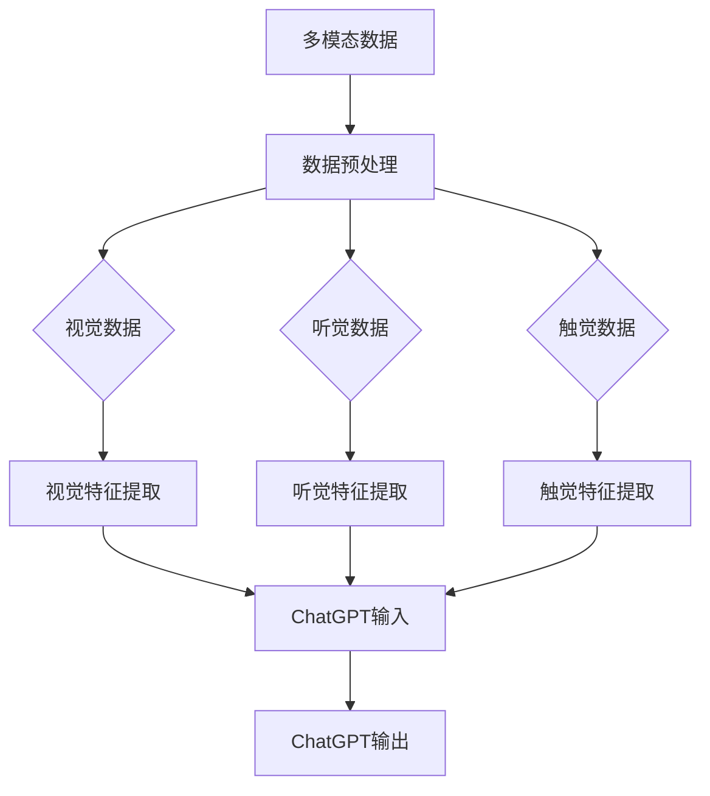

                 


### 《ChatGPT多模态环境感知：整合视觉、听觉和触觉的AI交互系统》

#### 关键词：ChatGPT，多模态感知，环境感知，人工智能，交互系统

#### 摘要：
本文将深入探讨ChatGPT多模态环境感知技术的核心概念、原理及其在视觉、听觉和触觉领域的应用。通过分析多模态环境感知的技术基础，我们了解如何将ChatGPT与多模态感知相结合，构建一个高效的AI交互系统。文章还将通过实际案例，展示如何实现这一系统，并提供实战指南，帮助读者掌握相关技术。

---

## 目录大纲

### 《ChatGPT多模态环境感知：整合视觉、听觉和触觉的AI交互系统》目录大纲

## 第一部分：多模态环境感知基础

### 第1章：多模态环境感知概述
#### 1.1 多模态感知的定义与重要性
#### 1.2 多模态感知的发展历程
#### 1.3 多模态感知的应用领域

### 第2章：视觉环境感知
#### 2.1 视觉信息获取与处理
#### 2.2 目标检测与识别
#### 2.3 人脸识别与行为识别

### 第3章：听觉环境感知
#### 3.1 声音信息获取与处理
#### 3.2 语音识别与合成
#### 3.3 声源定位与噪声抑制

### 第4章：触觉环境感知
#### 4.1 触觉信息的获取与处理
#### 4.2 触觉感知与控制
#### 4.3 触觉反馈与交互

## 第二部分：ChatGPT核心概念与原理

### 第5章：ChatGPT基本概念
#### 5.1 自然语言处理概述
#### 5.2 深度学习在自然语言处理中的应用
#### 5.3 ChatGPT模型结构

### 第6章：多模态感知与ChatGPT的结合
#### 6.1 多模态数据融合方法
#### 6.2 ChatGPT在多模态环境感知中的应用
#### 6.3 多模态交互系统的设计与实现

### 第7章：ChatGPT多模态环境感知的应用案例
#### 7.1 智能客服系统
#### 7.2 智能驾驶系统
#### 7.3 智能家居系统

## 第三部分：ChatGPT多模态环境感知实战

### 第8章：项目环境搭建与工具配置
#### 8.1 开发环境配置
#### 8.2 数据处理工具介绍
#### 8.3 模型训练工具使用

### 第9章：多模态感知数据集构建
#### 9.1 数据集收集与预处理
#### 9.2 数据增强方法
#### 9.3 数据集评估指标

### 第10章：ChatGPT模型训练与优化
#### 10.1 模型训练流程
#### 10.2 模型优化方法
#### 10.3 模型评估与调优

### 第11章：多模态交互系统实现与测试
#### 11.1 系统架构设计
#### 11.2 系统功能实现
#### 11.3 系统性能评估与优化

## 附录

### 附录A：多模态环境感知技术参考资料

---

### Mermaid 流程图（多模态感知与ChatGPT结合）



### ChatGPT多模态融合算法伪代码

```python
# 初始化模型参数
model = ChatGPT(model_name)

# 数据预处理
def preprocess_data(data):
    # 对视觉、听觉、触觉数据进行归一化、去噪等处理
    processed_data = {}
    processed_data['visual'] = normalize_and_denoise(data['visual'])
    processed_data['audio'] = normalize_and_denoise(data['audio'])
    processed_data['tactile'] = normalize_and_denoise(data['tactile'])
    return processed_data

# 特征提取
def extract_features(data):
    # 对预处理后的数据进行特征提取
    visual_features = extract_visual_features(data['visual'])
    audio_features = extract_audio_features(data['audio'])
    tactile_features = extract_tactile_features(data['tactile'])
    # 合并特征
    combined_features = np.concatenate((visual_features, audio_features, tactile_features), axis=1)
    return combined_features

# 模型训练
def train_model(model, combined_features, labels):
    # 训练模型
    model.fit(combined_features, labels, epochs=10, batch_size=32)

# 模型预测
def predict_output(model, combined_features):
    # 使用模型进行预测
    predictions = model.predict(combined_features)
    return predictions
```

---

接下来，我们将按照这个大纲逐步展开内容，深入讲解每个部分的核心概念、原理和应用。让我们开始这次探索之旅！

