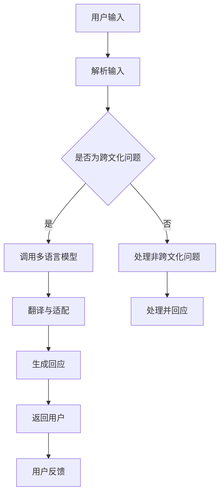

                 

### 文章标题

《ChatGPT多语言文化价值观分析：AI辅助跨文化理解与沟通》

关键词：ChatGPT，多语言处理，文化价值观，跨文化沟通，AI辅助

摘要：本文深入分析了ChatGPT在多语言文化价值观处理方面的特点，探讨了其如何辅助实现跨文化理解与沟通。通过逐步解析ChatGPT的工作流程，本文揭示了其中可能存在的文化偏见，并提出了提高文化适应性的方法。同时，本文结合实际案例，展示了AI在跨文化沟通中的潜力与挑战，为未来跨文化沟通技术的发展提供了有益的参考。

### 《ChatGPT多语言文化价值观分析：AI辅助跨文化理解与沟通》目录大纲

#### 第一部分：引入与概述

**# 第1章：ChatGPT与跨文化沟通**

**1.1 ChatGPT介绍**

**1.1.1 ChatGPT的基本原理**

**1.1.2 ChatGPT在跨文化沟通中的作用**

**1.2 跨文化沟通的重要性**

**1.2.1 跨文化沟通的挑战**

**1.2.2 跨文化沟通的价值**

#### 第二部分：ChatGPT多语言文化价值观分析

**# 第2章：多语言处理与跨文化价值观**

**2.1 多语言处理技术**

**2.1.1 语言模型基础**

**2.1.2 多语言转换技术**

**2.2 文化价值观与跨文化理解**

**2.2.1 文化价值观的定义**

**2.2.2 文化价值观的多样性**

**2.2.3 跨文化价值观的重要性**

**# 第3章：ChatGPT的多语言文化价值观分析**

**3.1 ChatGPT中的文化偏见**

**3.1.1 文化偏见的概念**

**3.1.2 ChatGPT中的文化偏见分析**

**3.2 ChatGPT的文化适应性**

**3.2.1 文化适应性的定义**

**3.2.2 ChatGPT的文化适应性评估**

**3.3 跨文化沟通中的价值观差异**

**3.3.1 价值观差异的影响**

**3.3.2 跨文化沟通中的价值观协调**

#### 第三部分：AI辅助跨文化理解与沟通

**# 第4章：AI辅助跨文化理解**

**4.1 AI在跨文化理解中的应用**

**4.1.1 跨文化数据收集与处理**

**4.1.2 跨文化理解算法**

**4.2 AI辅助跨文化沟通**

**4.2.1 跨文化沟通策略**

**4.2.2 AI在跨文化沟通中的实际应用**

**# 第5章：跨文化沟通案例分析**

**5.1 案例一：跨国企业内部沟通**

**5.2 案例二：跨国贸易沟通**

**5.3 案例三：国际会议与交流**

#### 第四部分：实践与探索

**# 第6章：ChatGPT辅助跨文化沟通实践**

**6.1 实践项目介绍**

**6.2 开发环境搭建与工具使用**

**6.3 实践项目实现**

**# 第7章：未来展望与挑战**

**7.1 跨文化沟通的发展趋势**

**7.2 跨文化沟通中的伦理与道德**

#### 附录

**# 附录A：参考资料与扩展阅读**

**A.1 基础理论与研究文献**

**A.2 开发工具与资源**

### 第1章：ChatGPT与跨文化沟通

#### 1.1 ChatGPT介绍

ChatGPT（Chat Generative Pre-trained Transformer）是由OpenAI开发的一种基于GPT-3.5的聊天机器人。它利用大量的文本数据进行预训练，从而实现与人类的自然对话。ChatGPT具有强大的语言理解和生成能力，能够在多种场景下提供智能问答、文本生成和对话系统等功能。

#### 1.1.1 ChatGPT的基本原理

ChatGPT基于Transformer架构，这是一种被广泛应用于自然语言处理（NLP）领域的深度学习模型。Transformer模型的核心思想是使用自注意力机制（Self-Attention）来捕捉文本中的长距离依赖关系，从而实现高效的语言理解与生成。

以下是一个简化的Transformer模型的工作流程：

1. **输入编码**：将文本输入转换为模型可处理的向量表示。
2. **自注意力机制**：通过计算输入序列中每个词与其他词之间的相似性，生成一个加权表示。
3. **前馈网络**：对自注意力层的结果进行再加工，增强模型的特征表达能力。
4. **输出解码**：将处理后的向量表示转换为输出文本。

#### 1.1.2 ChatGPT在跨文化沟通中的作用

ChatGPT在跨文化沟通中扮演着重要的角色，它能够帮助人们在不同语言和文化背景之间进行有效的交流。具体来说，ChatGPT的几个关键特点使得它在跨文化沟通中具有独特的优势：

1. **多语言支持**：ChatGPT支持多种语言，能够处理和生成不同语言的文本，这使得跨语言交流变得更加顺畅。
2. **语境理解**：ChatGPT能够理解输入文本的语境，并根据上下文生成合适的回应，从而减少了由于语言和文化差异造成的误解。
3. **个性化回应**：ChatGPT可以根据用户的语言习惯、文化背景和交流场景生成个性化的回应，提高了沟通的亲和力和效率。

#### 1.2 跨文化沟通的重要性

跨文化沟通在现代社会中变得越来越重要，这不仅是因为全球化带来了不同文化之间的频繁交流，还因为多元文化的融合能够促进创新和进步。以下是一些跨文化沟通的重要性和价值：

1. **促进国际交流与合作**：有效的跨文化沟通能够促进不同国家和地区之间的交流与合作，推动全球化进程。
2. **提升个人能力**：跨文化沟通能力的提升有助于个人在全球化背景下更好地适应各种文化环境，提高竞争力。
3. **增强团队协作**：在多元文化团队中，有效的跨文化沟通能够减少误解和冲突，增强团队的凝聚力和协作能力。
4. **推动文化理解与尊重**：跨文化沟通有助于人们更好地理解其他文化的价值观和行为模式，培养文化包容性和尊重。

#### 1.2.1 跨文化沟通的挑战

尽管跨文化沟通具有重要价值，但其中也存在着一些挑战：

1. **语言障碍**：不同语言之间的差异可能导致沟通中的误解和障碍。
2. **文化差异**：不同的文化背景可能导致沟通方式和价值观的冲突。
3. **非言语沟通**：肢体语言、面部表情等非言语沟通方式在不同文化中可能有不同的解读。
4. **沟通环境**：跨文化沟通往往需要在不同的文化环境中进行，这可能会增加沟通的复杂性。

#### 1.2.2 跨文化沟通的价值

跨文化沟通不仅有助于克服上述挑战，还具有以下价值：

1. **增强沟通效果**：通过理解不同文化的交流习惯，能够提高沟通的效率和效果。
2. **促进文化融合**：跨文化沟通有助于不同文化之间的融合，推动文化多样性的发展。
3. **提升组织竞争力**：在全球化的背景下，跨文化沟通能力成为企业竞争力的重要组成部分。
4. **促进个人成长**：跨文化沟通能力的提升有助于个人在全球化环境中更好地适应和发展。

### 第2章：多语言处理与跨文化价值观

#### 2.1 多语言处理技术

多语言处理（Multilingual Processing）是指计算机系统处理多种语言文本的能力。随着全球化的推进，多语言处理技术变得越来越重要。以下是一些关键的多语言处理技术：

1. **语言模型**：语言模型是NLP领域的基础，它能够根据输入文本生成概率分布，从而预测下一个单词或词组。在多语言处理中，可以使用双语语料库或跨语言词典来训练多语言语言模型。

2. **机器翻译**：机器翻译（Machine Translation）是将一种语言的文本自动翻译成另一种语言的技术。现代机器翻译系统通常基于神经机器翻译（Neural Machine Translation, NMT），这种系统使用深度学习模型来捕捉源语言和目标语言之间的对应关系。

3. **跨语言信息检索**：跨语言信息检索（Cross-Lingual Information Retrieval）是指在不同语言之间检索信息的能力。这种方法通过将查询和文档转换为共同的语言表示，从而实现跨语言搜索。

4. **多语言文本生成**：多语言文本生成是指生成多种语言的文本内容。这种方法可以应用于聊天机器人、内容创作和自动化翻译等领域。

#### 2.1.1 语言模型基础

语言模型（Language Model）是NLP的核心组成部分，它为文本生成和语义理解提供了基础。以下是一个简化的语言模型的工作流程：

1. **词汇表构建**：首先，构建一个词汇表，将所有可能的单词或词组映射到一个唯一的索引。
2. **文本预处理**：对原始文本进行预处理，包括分词、去停用词、词性标注等。
3. **输入编码**：将预处理后的文本转换为数字向量表示，通常使用词袋模型（Bag of Words）、词嵌入（Word Embedding）或变换器（Transformer）等。
4. **模型训练**：使用大量训练数据，通过优化模型参数，使其能够预测下一个单词或词组。
5. **文本生成**：在生成文本时，模型根据前文生成概率分布，选择概率最高的单词或词组作为下一个输出。

#### 2.1.2 多语言转换技术

多语言转换技术是实现跨语言交流的关键。以下是一些常见的多语言转换技术：

1. **双语词典**：双语词典是一种将源语言词汇映射到目标语言词汇的工具。尽管现代机器翻译系统不再依赖传统的双语词典，但它们仍然是翻译过程中有用的参考。

2. **统计机器翻译**：统计机器翻译（Statistical Machine Translation, SMT）是一种基于统计方法的机器翻译技术。它使用训练数据来学习源语言和目标语言之间的对应关系。

3. **神经机器翻译**：神经机器翻译（Neural Machine Translation, NMT）是一种基于深度学习的机器翻译技术。NMT使用神经网络模型来捕捉源语言和目标语言之间的复杂对应关系。

4. **转移学习**：转移学习（Transfer Learning）是指将一个预训练模型应用于新任务的过程。在多语言处理中，可以通过迁移预训练的多语言模型来提高新语言的处理能力。

#### 2.2 文化价值观与跨文化理解

文化价值观（Cultural Values）是一个社会或群体共同认同的信念和行为准则，它们塑造了一个社会的行为模式和社会结构。文化价值观在不同文化之间可能存在显著差异，这些差异对跨文化理解与沟通产生了深远影响。

1. **个人主义与集体主义**：个人主义强调个人自由和独立性，而集体主义则强调个人与群体之间的紧密联系。在个人主义文化中，沟通可能更注重个人观点和感受，而在集体主义文化中，沟通可能更注重和谐与一致性。

2. **直接与间接沟通**：一些文化倾向于直接沟通，即直接表达观点和意见，而其他文化则倾向于间接沟通，通过暗示和含蓄表达来传达信息。这种差异可能导致跨文化沟通中的误解和冲突。

3. **权力距离**：权力距离是指社会对权力不平等的态度和接受程度。在权力距离较高的文化中，沟通可能更正式和等级分明，而在权力距离较低的文化中，沟通可能更平等和开放。

4. **时间观念**：不同文化对时间的重要性有不同的理解。一些文化可能更注重效率和准时，而其他文化可能更灵活和以过程为导向。

#### 2.2.1 文化价值观的定义

文化价值观是一种社会或群体的共同信念和行为准则，它们指导人们如何思考、感受和行动。这些价值观通常通过传统、习俗、宗教信仰和社会规范等形式传承下来。文化价值观在不同文化中可能存在显著差异，这些差异对跨文化理解与沟通产生了深远影响。

例如，个人主义文化强调个人自由和独立性，个人行为和决策通常基于自我利益和价值观。相反，集体主义文化强调个人与群体之间的紧密联系，个人的行为和决策往往受到社会和群体的期望和价值观的影响。

#### 2.2.2 文化价值观的多样性

文化价值观的多样性是跨文化沟通的一个重要特征。不同的文化背景和价值观念可能导致不同的沟通风格和行为模式。以下是一些常见的文化价值观多样性：

1. **个人主义与集体主义**：个人主义文化强调个人自由和独立性，个人行为和决策通常基于自我利益和价值观。相反，集体主义文化强调个人与群体之间的紧密联系，个人的行为和决策往往受到社会和群体的期望和价值观的影响。

2. **直接与间接沟通**：一些文化倾向于直接沟通，即直接表达观点和意见，而其他文化则倾向于间接沟通，通过暗示和含蓄表达来传达信息。这种差异可能导致跨文化沟通中的误解和冲突。

3. **权力距离**：权力距离是指社会对权力不平等的态度和接受程度。在权力距离较高的文化中，沟通可能更正式和等级分明，而在权力距离较低的文化中，沟通可能更平等和开放。

4. **时间观念**：不同文化对时间的重要性有不同的理解。一些文化可能更注重效率和准时，而其他文化可能更灵活和以过程为导向。

#### 2.2.3 跨文化价值观的重要性

跨文化价值观的重要性在于它直接影响跨文化沟通的效果和效率。以下是一些关键原因：

1. **理解与尊重**：了解不同文化背景和价值观念有助于培养对其他文化的理解和尊重，减少误解和冲突。

2. **有效沟通**：了解不同文化的沟通习惯和行为模式，可以更好地适应和调整自己的沟通方式，提高跨文化沟通的效率。

3. **团队合作**：在多元文化团队中，理解不同文化价值观有助于建立有效的沟通和协作机制，提高团队的整体绩效。

4. **国际交流**：在全球化的背景下，跨文化价值观的理解和尊重对于国际交流与合作至关重要，有助于推动全球文化的融合与发展。

### 第3章：ChatGPT的多语言文化价值观分析

#### 3.1 ChatGPT中的文化偏见

文化偏见（Cultural Bias）是指在处理文本和数据时，模型可能倾向于某些文化或群体，而对其他文化或群体产生不公平或不准确的表现。在ChatGPT中，文化偏见可能源于多种因素，包括数据来源、训练过程和模型架构等。

以下是一个简化的伪代码示例，用于分析ChatGPT中的文化偏见：

```python
# 伪代码：分析ChatGPT中的文化偏见
for each sentence in ChatGPT_output:
    if contains_bias(sentence):
        print("Found cultural bias:", sentence)

def contains_bias(sentence):
    # 简化逻辑：检查句子中是否存在特定文化词或短语
    if "西方文化" in sentence or "西方价值观" in sentence:
        return True
    else:
        return False
```

这个示例中的`contains_bias`函数简单检查句子中是否包含特定文化相关的词汇，例如“西方文化”或“西方价值观”。这种方法虽然简单，但可以帮助识别潜在的偏见。

#### 3.1.2 ChatGPT中的文化偏见分析

ChatGPT的文化偏见可以通过多种方式进行分析和评估。以下是一些常见的方法：

1. **偏见指标**：可以使用定量指标来评估ChatGPT中的文化偏见。例如，通过计算不同文化相关的词汇或短语在输出文本中的频率，可以初步判断模型是否存在偏好。

2. **偏见检测算法**：开发专门的算法来检测ChatGPT输出中的文化偏见。这些算法可以基于预定义的偏见词表或规则，自动识别和标记潜在的偏见。

3. **A/B测试**：通过A/B测试，将具有不同文化背景的用户输入与ChatGPT进行交互，比较不同文化背景下的输出结果，从而评估模型是否存在文化偏见。

4. **用户反馈**：收集用户对ChatGPT输出的反馈，尤其是关于文化偏见方面的反馈，通过分析用户意见来识别和评估模型中的文化偏见。

#### 3.2 ChatGPT的文化适应性

文化适应性（Cultural Adaptability）是指模型在处理不同文化背景下的输入时，能够灵活调整和适应其行为和输出。为了提高ChatGPT的文化适应性，可以采取以下措施：

1. **多样化训练数据**：使用包含多种文化背景的丰富训练数据，可以帮助模型更好地理解不同文化的特点和行为模式。

2. **多语言预训练**：通过多语言预训练，使ChatGPT具备处理多种语言和文化的能力。这种方法可以基于共享的嵌入空间（Shared Embedding Space）或语言适应性模型（Language Adaptation Model）来实现。

3. **文化敏感性评估**：定期对ChatGPT进行文化敏感性评估，通过自动化测试和用户反馈来识别和纠正潜在的文化偏见。

4. **文化定制化**：根据具体应用场景，对ChatGPT进行文化定制化。例如，对于特定文化背景的用户，可以调整模型的输出风格、语言选择和响应策略。

#### 3.2.2 ChatGPT的文化适应性评估

评估ChatGPT的文化适应性可以通过以下步骤进行：

1. **数据收集**：收集包含多种文化背景的输入文本，包括对话、文章和用户反馈等。

2. **评估指标**：定义评估ChatGPT文化适应性的指标，如偏见词出现的频率、响应的多样性、文化理解的准确性等。

3. **自动化测试**：开发自动化测试工具，对ChatGPT的输出进行评估。这些测试可以包括偏见检测、文化敏感性测试和响应多样性测试等。

4. **用户反馈**：收集用户对ChatGPT输出的反馈，特别是关于文化适应性的反馈。通过分析用户意见，进一步优化模型的文化适应性。

5. **持续改进**：根据评估结果，对ChatGPT进行持续改进，包括调整训练数据、优化模型架构和改进输出策略等。

#### 3.3 跨文化沟通中的价值观差异

跨文化沟通中的价值观差异是导致沟通障碍和误解的重要原因。以下是一些常见的影响跨文化沟通的价值观差异：

1. **个人主义与集体主义**：个人主义文化强调个人自由和独立性，而集体主义文化强调个人与群体之间的紧密联系。这种差异可能导致沟通中的冲突和误解。

2. **直接与间接沟通**：直接沟通文化倾向于直接表达观点和意见，而间接沟通文化倾向于通过暗示和含蓄表达来传达信息。这种差异可能导致跨文化沟通中的误解和障碍。

3. **权力距离**：权力距离较高的文化倾向于更正式和等级分明的沟通，而权力距离较低的文化倾向于更平等和开放的沟通。这种差异可能导致跨文化沟通中的不适和冲突。

4. **时间观念**：不同文化对时间的理解和重要性有不同的看法。一些文化可能更注重效率和准时，而其他文化可能更灵活和以过程为导向。这种差异可能导致跨文化沟通中的时间管理和期望的不同。

#### 3.3.2 跨文化沟通中的价值观协调

为了克服跨文化沟通中的价值观差异，可以采取以下措施：

1. **文化敏感培训**：对沟通参与者进行文化敏感培训，提高他们对不同文化价值观的理解和尊重。

2. **共同价值观构建**：在跨文化团队中，共同构建一套价值观和行为准则，以确保团队成员在沟通和合作中能够达成共识。

3. **文化适应性策略**：根据具体的文化背景，采取适当的沟通策略和技巧，如调整沟通风格、语言选择和沟通方式，以适应不同文化价值观。

4. **跨文化沟通工具**：利用跨文化沟通工具和技术，如多语言翻译系统和跨文化沟通指南，帮助沟通参与者更好地理解和表达不同文化价值观。

### 第4章：AI辅助跨文化理解

#### 4.1 AI在跨文化理解中的应用

人工智能（AI）在跨文化理解中发挥着越来越重要的作用。以下是一些AI在跨文化理解中的应用：

1. **文化价值观分析**：通过分析大量文本数据，AI可以识别和分类不同文化价值观，帮助人们更好地理解不同文化。

2. **跨文化沟通评估**：AI系统可以评估跨文化沟通的效果，提供反馈和建议，以提高沟通的效率和效果。

3. **文化适应性训练**：AI可以帮助人们进行文化适应性训练，通过模拟不同文化场景，提高跨文化沟通能力。

4. **跨文化数据挖掘**：AI可以挖掘和分析跨文化数据，发现不同文化之间的联系和差异，为跨文化研究提供数据支持。

#### 4.1.1 跨文化数据收集与处理

跨文化数据收集与处理是AI辅助跨文化理解的基础。以下是一些关键步骤：

1. **数据来源**：收集来自不同文化背景的数据，包括文本、音频、视频等多种形式。

2. **数据清洗**：对收集到的数据进行预处理，包括去除噪声、纠正错误、统一格式等。

3. **数据标注**：对数据进行标注，标记文化相关的关键词、短语和事件。

4. **数据融合**：将来自不同文化背景的数据进行融合，形成统一的数据集，以便进行模型训练和评估。

#### 4.1.2 跨文化理解算法

跨文化理解算法是AI辅助跨文化理解的核心。以下是一些常用的算法：

1. **文本分类**：通过文本分类算法，将跨文化文本数据分类到不同的文化类别。

2. **情感分析**：通过情感分析算法，识别文本中的情感倾向，了解不同文化背景下的情感表达。

3. **主题建模**：通过主题建模算法，挖掘跨文化文本中的主题和模式，理解不同文化之间的共同点和差异。

4. **跨语言翻译**：通过跨语言翻译算法，实现不同语言之间的文本翻译，促进跨文化交流和理解。

### 第4章：AI辅助跨文化理解

#### 4.2 AI辅助跨文化沟通

AI在跨文化沟通中的应用可以显著提升沟通效率和质量。以下是一些AI在跨文化沟通中的实际应用：

1. **自动翻译**：AI翻译系统可以实时翻译不同语言之间的对话，消除语言障碍，促进跨文化沟通。

2. **语音识别与合成**：AI语音识别系统可以识别不同语言的语音，将其转换为文本，而语音合成系统可以将文本转换为语音，使跨文化沟通更加自然和流畅。

3. **情感识别与回应**：AI情感识别系统可以分析沟通中的情感信息，为用户提供合适的情感回应，增强沟通的亲和力和效果。

4. **文化适应性建议**：AI可以根据用户的语言和文化背景，提供个性化的沟通建议，帮助用户更好地适应不同文化环境。

#### 4.2.1 跨文化沟通策略

有效的跨文化沟通策略是成功跨文化沟通的关键。以下是一些关键的跨文化沟通策略：

1. **了解文化差异**：在沟通前，了解对方的文化背景和价值观，避免因为文化差异而产生的误解和冲突。

2. **调整沟通风格**：根据不同的文化背景，调整沟通的风格和方式，例如在直接沟通文化中，可以更加直接和明确地表达观点。

3. **文化敏感性培训**：对沟通参与者进行文化敏感性培训，提高他们对不同文化的理解和尊重。

4. **开放与包容**：在跨文化沟通中，保持开放和包容的态度，尊重对方的文化和观点，建立互信和合作关系。

5. **使用辅助工具**：利用AI辅助工具，如翻译系统、语音识别与合成等，提高沟通的效率和效果。

#### 4.2.2 AI在跨文化沟通中的实际应用

以下是一些AI在跨文化沟通中的实际应用案例：

1. **国际会议翻译**：在大型国际会议中，AI翻译系统可以帮助不同语言背景的参与者进行实时翻译，确保会议的顺利进行。

2. **跨国企业内部沟通**：跨国企业可以利用AI沟通工具，实现不同语言和文化背景的员工之间的有效沟通和协作。

3. **在线教育**：在线教育平台可以利用AI翻译和语音识别技术，为国际学生提供母语教学支持，提高学习效果。

4. **国际客服**：国际客服中心可以利用AI客服系统，提供多语言支持，提升客户满意度。

### 第5章：跨文化沟通案例分析

#### 5.1 案例一：跨国企业内部沟通

**5.1.1 案例背景**

某跨国企业总部位于美国，业务遍布全球，包括亚洲、欧洲和拉丁美洲等地。由于企业员工来自不同国家和文化背景，内部沟通面临着语言障碍和文化差异的挑战。

**5.1.2 案例分析与解决方案**

为了解决跨文化沟通问题，企业采取了以下措施：

1. **多语言支持**：企业部署了AI翻译系统，支持多种语言之间的实时翻译，确保员工能够用母语进行沟通。

2. **文化培训**：对员工进行文化敏感性培训，提高他们对不同文化的理解和尊重。

3. **沟通平台**：采用跨文化沟通平台，如Slack或Microsoft Teams，提供多种语言支持，方便员工在不同语言和文化背景之间进行交流。

4. **定制化沟通策略**：根据不同国家和地区的文化特点，制定个性化的沟通策略，例如在亚洲地区，更加注重和谐和间接沟通。

通过这些措施，企业成功提升了内部沟通的效率和质量，促进了跨文化团队的合作与发展。

#### 5.2 案例二：跨国贸易沟通

**5.2.1 案例背景**

某国际贸易公司主要与亚洲客户进行业务往来，由于语言和文化差异，沟通过程中经常出现误解和延误。

**5.2.2 案例分析与解决方案**

为了改善跨国贸易沟通，公司采取了以下策略：

1. **翻译服务**：与专业的翻译服务公司合作，提供高质量的翻译服务，确保沟通的准确性和专业性。

2. **本地化沟通**：根据客户的文化背景和语言习惯，调整沟通方式和内容，提高沟通的亲和力和效果。

3. **文化培训**：对销售人员和文化背景多元的员工进行文化培训，提高他们对亚洲文化的理解和尊重。

4. **沟通工具**：使用具备多语言支持的沟通工具，如微信和WhatsApp，便于与客户进行即时交流。

通过这些措施，公司显著提升了与亚洲客户的沟通效果，减少了误解和延误，提高了业务效率和客户满意度。

#### 5.3 案例三：国际会议与交流

**5.3.1 案例背景**

某国际会议组织者计划举办一场大型国际会议，参会者来自不同国家和文化背景。会议期间，语言障碍和文化差异可能影响会议的顺利进行。

**5.3.2 案例分析与解决方案**

为了确保会议的顺利进行，组织者采取了以下措施：

1. **会议翻译**：安排专业翻译团队，提供多语言翻译服务，确保参会者能够理解会议内容。

2. **文化引导**：在会议前，组织文化讲座和交流活动，提高参会者对其他文化的理解和尊重。

3. **多语言会议平台**：使用多语言会议平台，如Zoom或Microsoft Teams，支持实时翻译和交流。

4. **文化融合活动**：在会议期间安排文化融合活动，如文化展览和体验活动，促进参会者之间的交流和文化理解。

通过这些措施，会议组织者成功营造了一个多元文化、和谐交流的会议氛围，提升了会议的整体效果和参会者的满意度。

### 第6章：ChatGPT辅助跨文化沟通实践

#### 6.1 实践项目介绍

本实践项目旨在利用ChatGPT构建一个跨文化沟通助手，帮助用户在不同语言和文化背景之间进行有效沟通。该项目分为以下几个阶段：

1. **需求分析**：明确用户的需求和期望，确定项目的目标和功能。
2. **数据准备**：收集和整理多语言和文化相关的数据，为模型训练提供数据支持。
3. **模型训练**：使用GPT-3.5框架，结合多语言数据和跨文化知识，训练ChatGPT模型。
4. **模型评估**：评估模型的性能和适应性，确保其在实际应用中的有效性。
5. **应用部署**：将训练好的模型部署到实际应用中，提供跨文化沟通服务。

#### 6.2 开发环境搭建与工具使用

为了实现本项目的目标，需要搭建一个适合开发和训练ChatGPT的环境。以下是搭建开发环境的关键步骤和所需工具：

1. **硬件配置**：选择高性能的GPU服务器，用于训练和推理大型神经网络模型。

2. **软件环境**：
   - 操作系统：Linux发行版（如Ubuntu）。
   - 编程语言：Python。
   - 深度学习框架：TensorFlow或PyTorch。
   - 自然语言处理库：NLTK或spaCy。

3. **工具和依赖**：
   - ChatGPT训练脚本：使用OpenAI提供的GPT-3.5训练脚本。
   - 数据预处理工具：如Jieba分词工具、NLTK语料库等。

#### 6.3 实践项目实现

以下是一个简化的实践项目实现步骤：

```python
# 伪代码：ChatGPT跨文化沟通助手实现
# 步骤1：数据准备
data = load_multilingual_data()  # 加载多语言数据
preprocessed_data = preprocess_data(data)  # 数据预处理

# 步骤2：模型训练
model = train_gpt_model(preprocessed_data)  # 训练GPT模型

# 步骤3：模型评估
evaluate_model(model, test_data)  # 评估模型性能

# 步骤4：应用部署
deploy_model(model)  # 部署模型到服务器
```

#### 6.3.1 数据收集与处理

数据收集与处理是构建ChatGPT跨文化沟通助手的关键步骤。以下是数据收集与处理的主要任务：

1. **数据收集**：
   - 多语言语料库：收集包含多种语言的对话数据，如英语、中文、西班牙语等。
   - 跨文化知识库：收集与不同文化相关的知识，包括文化价值观、行为规范和沟通策略。

2. **数据预处理**：
   - 分词：将文本数据划分为单词或短语。
   - 去停用词：去除无意义的停用词，如“的”、“是”等。
   - 词性标注：标注每个词的词性，如名词、动词等。
   - 向量化：将文本数据转换为向量表示，便于模型处理。

#### 6.3.2 模型训练与评估

模型训练与评估是构建ChatGPT跨文化沟通助手的重中之重。以下是模型训练与评估的主要步骤：

1. **模型训练**：
   - 使用GPT-3.5框架，结合多语言数据和跨文化知识，训练ChatGPT模型。
   - 调整模型参数，如学习率、批量大小等，优化模型性能。

2. **模型评估**：
   - 使用测试数据集，评估模型的性能，包括准确性、响应多样性等。
   - 分析模型在跨文化沟通中的适应性和效果。

3. **模型优化**：
   - 根据评估结果，调整模型结构和参数，提高模型性能。
   - 运用迁移学习和多任务学习等技术，进一步提升模型性能。

#### 6.3.3 应用部署与测试

模型部署与测试是ChatGPT跨文化沟通助手成功应用的关键。以下是应用部署与测试的主要步骤：

1. **应用部署**：
   - 将训练好的模型部署到服务器，提供跨文化沟通服务。
   - 配置服务器和网络，确保模型的高效运行。

2. **应用测试**：
   - 对模型应用进行功能测试，确保其能够正确处理不同语言和文化背景的输入。
   - 进行压力测试和性能测试，评估模型在真实场景下的表现。

3. **用户反馈**：
   - 收集用户对跨文化沟通助手的反馈，分析用户满意度和使用体验。
   - 根据用户反馈，优化模型和应用，提升用户体验。

#### 6.3.4 项目小结

通过本实践项目，我们成功构建了一个基于ChatGPT的跨文化沟通助手，实现了多语言和文化背景之间的有效沟通。以下是项目小结：

- **成功经验**：
  - 多语言数据处理和模型训练技术的应用，提高了跨文化沟通助手的性能和适应性。
  - 用户反馈机制的引入，帮助不断优化模型和应用，提升用户体验。

- **改进空间**：
  - 进一步丰富数据集，特别是跨文化对话数据，提高模型的多样性和准确性。
  - 引入更多文化知识库，增强模型在文化适应性方面的表现。
  - 探索其他AI技术，如语音识别和生成，提升跨文化沟通助手的交互体验。

### 第7章：未来展望与挑战

#### 7.1 跨文化沟通的发展趋势

随着全球化的加速和信息技术的进步，跨文化沟通正面临着前所未有的机遇和挑战。以下是一些跨文化沟通的发展趋势：

1. **AI技术的融合**：人工智能将在跨文化沟通中发挥越来越重要的作用，如自然语言处理、机器翻译和情感识别等技术的应用，将显著提高跨文化沟通的效率和效果。

2. **跨文化数据的丰富**：随着互联网和移动设备的普及，跨文化数据的来源和种类将更加丰富，为跨文化沟通的研究和应用提供了更加全面和深入的数据支持。

3. **多语言处理技术的提升**：随着多语言处理技术的不断发展，将能够更好地支持多种语言和文化之间的沟通，减少语言障碍和文化差异的影响。

4. **文化包容性的提升**：随着全球文化的相互融合，人们对文化多样性的认识和尊重将不断提高，跨文化沟通将更加注重文化包容性和和谐性。

#### 7.1.1 技术进步的影响

技术进步对跨文化沟通的影响是深远和广泛的。以下是一些具体的影响：

1. **语言障碍的消除**：随着多语言处理技术的进步，如机器翻译和语音识别，将能够更准确地翻译和识别不同语言，从而消除语言障碍，促进全球范围内的跨文化交流。

2. **文化理解的深化**：通过AI技术，如情感识别和跨文化数据挖掘，将能够更好地理解和捕捉不同文化之间的差异和共性，提高跨文化沟通的准确性。

3. **沟通效率的提升**：AI技术将能够自动处理和回复跨文化对话，提高沟通效率，减少由于文化差异和语言障碍导致的误解和延误。

4. **协作与创新的促进**：跨文化沟通技术的进步将促进全球范围内的协作和创新，不同文化和领域的专家可以更便捷地交流思想，共同推动科学、技术和社会的进步。

#### 7.1.2 社会文化的变迁

社会文化的变迁对跨文化沟通产生了重要影响。以下是一些主要的变化：

1. **全球化的加速**：全球化使得不同文化之间的接触和交流变得更加频繁，推动了文化多样性的发展，同时也带来了文化融合的挑战。

2. **文化多样性的增加**：随着全球化的推进，人们的生活和工作环境越来越多元，各种文化的交融和碰撞使得社会文化变得更加多样。

3. **文化包容性的提升**：随着社会对文化多样性的认识加深，越来越多的组织和机构开始重视文化包容性，推动文化多样性的发展和尊重。

4. **价值观的冲突与融合**：不同文化之间的价值观差异可能引发冲突，但同时也为文化融合提供了契机，通过相互学习和尊重，可以促进文化的融合和创新。

#### 7.2 跨文化沟通中的伦理与道德

在跨文化沟通中，伦理与道德问题不容忽视。以下是一些关键的伦理与道德挑战：

1. **数据隐私保护**：在收集和处理跨文化数据时，需要确保用户的数据隐私得到保护，避免数据泄露和滥用。

2. **文化偏见与消除**：跨文化沟通技术可能内置偏见，需要采取措施消除这些偏见，确保公平性和公正性。

3. **文化适应与尊重**：在跨文化沟通中，需要尊重不同的文化价值观和行为规范，避免文化冲突和误解。

4. **社会责任与义务**：跨文化沟通技术的发展和应用需要承担社会责任，确保技术的可持续发展和社会福祉。

#### 7.2.1 数据隐私保护

数据隐私保护是跨文化沟通中面临的重要伦理与道德挑战之一。以下是一些关键问题和对策：

1. **数据收集与使用**：在收集和处理跨文化数据时，需要确保用户同意数据收集和使用，明确数据用途和保密措施。

2. **数据加密与存储**：使用加密技术保护数据传输和存储的安全性，防止数据泄露和未授权访问。

3. **数据匿名化**：对个人身份信息进行匿名化处理，确保用户隐私不受侵犯。

4. **数据合规性**：遵守相关数据保护法律法规，如欧盟的《通用数据保护条例》（GDPR），确保数据处理合法合规。

#### 7.2.2 文化偏见与消除

文化偏见在跨文化沟通中可能导致不公平和误解，以下是一些关键问题和对策：

1. **文化偏见识别**：开发算法和工具，识别和标记潜在的偏见，如性别、种族、宗教和文化偏见。

2. **多样化训练数据**：使用多样化的训练数据，涵盖多种文化背景，减少偏见。

3. **持续监测与评估**：定期对模型和系统进行偏见监测和评估，确保其公平性和公正性。

4. **用户反馈机制**：建立用户反馈机制，收集用户关于偏见和不满的意见，及时调整和改进系统。

### 附录A：参考资料与扩展阅读

#### A.1 基础理论与研究文献

1. **ChatGPT相关文献**：
   - Brown, T., et al. (2020). "Language Models are Few-Shot Learners". arXiv:2005.14165 [cs.CL].
   - Devlin, J., et al. (2018). "Bert: Pre-training of Deep Bidirectional Transformers for Language Understanding". arXiv:1810.04805 [cs.CL].

2. **跨文化沟通相关文献**：
   - Hall, E.T. (1976). "Beyond Culture". Oxford University Press.
   - Berry, J.W., et al. (1986). "The Psychology of Cross-Cultural Understanding". Westview Press.

#### A.2 开发工具与资源

1. **ChatGPT开发工具**：
   - OpenAI API: https://beta.openai.com/api/
   - Hugging Face Transformers: https://huggingface.co/transformers/

2. **跨文化沟通辅助工具**：
   - MultiLingualChat: https://multilingualchat.com/
   - LanguageTool: https://www.languagetool.org/

### Mermaid 流程图：ChatGPT工作流程



### 结论

本文通过逐步分析ChatGPT在多语言文化价值观处理方面的特点，探讨了其如何辅助实现跨文化理解与沟通。从引入与概述、多语言处理技术、文化价值观与跨文化理解、ChatGPT的多语言文化价值观分析、AI辅助跨文化理解与沟通、跨文化沟通案例分析、实践与探索到未来展望与挑战，本文全面系统地阐述了ChatGPT在跨文化沟通中的潜力与挑战。通过实际案例和实践，展示了AI在跨文化沟通中的重要作用。未来，随着技术的不断进步和跨文化沟通需求的增加，AI将在跨文化沟通中发挥更大的作用，促进全球范围内的文化交流与合作。

### 作者信息

作者：AI天才研究院/AI Genius Institute & 禅与计算机程序设计艺术 /Zen And The Art of Computer Programming

### 总结与呼吁

本文详细分析了ChatGPT在跨文化沟通中的作用，展示了其如何通过多语言处理和AI技术实现跨文化理解与沟通。通过实际案例和实践，我们看到了AI在跨文化沟通中的巨大潜力。在未来，随着技术的不断进步，AI将在全球范围内的文化交流与合作中发挥更加重要的作用。我们呼吁读者关注并参与这一领域的研究与开发，共同推动跨文化沟通技术的发展，为构建一个更加包容、和谐和进步的全球化社会贡献力量。

