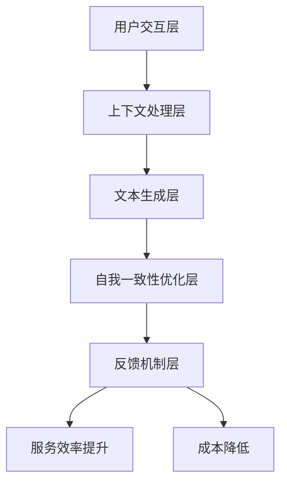
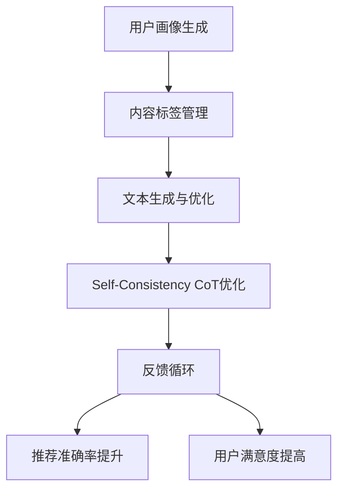
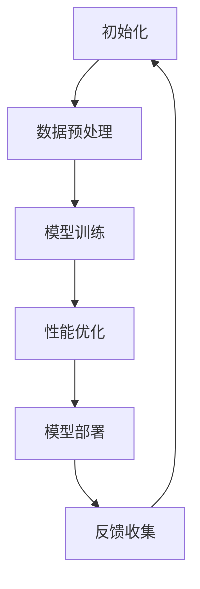

                 

### 文章标题: ChatGPT定制化服务：Self-Consistency CoT的运用

在人工智能领域，自然语言处理（NLP）技术取得了显著的进展，尤其是在生成式对话系统方面。ChatGPT，作为OpenAI开发的预训练语言模型，凭借其强大的文本生成和交互能力，已经成为NLP应用的重要工具。然而，面对不同行业和场景的多样化需求，传统的通用ChatGPT模型往往无法满足定制化的服务需求。为了实现更智能、更个性化的对话服务，Self-Consistency CoT（自我一致性注意力机制）的引入，为ChatGPT的定制化服务提供了新的解决方案。

本文将围绕ChatGPT定制化服务展开讨论，重点介绍Self-Consistency CoT的原理及其在ChatGPT模型中的应用。文章的结构如下：

1. **ChatGPT定制化服务概述**：介绍ChatGPT的发展历程、技术架构和应用场景，以及Self-Consistency CoT的基本概念和优势。
2. **ChatGPT定制化服务关键技术**：详细阐述ChatGPT定制化服务的关键技术，包括数据预处理、Self-Consistency CoT算法实现和模型训练优化。
3. **ChatGPT定制化服务应用案例分析**：通过实际案例展示ChatGPT定制化服务的应用场景和效果评估。
4. **ChatGPT定制化服务开发实践**：介绍ChatGPT定制化服务的开发环境搭建、源代码实现与性能优化。
5. **ChatGPT定制化服务安全性与伦理问题**：分析ChatGPT定制化服务中可能面临的安全性和伦理问题。
6. **ChatGPT定制化服务的未来发展趋势**：探讨人工智能技术的发展趋势以及ChatGPT定制化服务的应用前景。
7. **总结与展望**：总结全文内容，展望未来ChatGPT定制化服务的发展方向。

通过本文的讨论，我们希望能够为读者提供一个全面、系统的ChatGPT定制化服务技术指南，帮助大家更好地理解和应用这一前沿技术。

### 关键词

- **ChatGPT**：预训练语言模型，自然语言处理，文本生成，对话系统。
- **Self-Consistency CoT**：自我一致性注意力机制，定制化服务，模型优化。
- **定制化服务**：个性化对话，行业应用，模型训练。
- **数据预处理**：数据清洗，数据质量，模型训练。
- **安全性与伦理**：数据隐私，偏见，责任归属。
- **未来发展趋势**：人工智能，大模型，跨模态学习。

### 摘要

本文主要探讨了ChatGPT定制化服务中Self-Consistency CoT的运用。首先，介绍了ChatGPT的发展历程、技术架构和应用场景，以及Self-Consistency CoT的基本概念和优势。然后，详细阐述了ChatGPT定制化服务的关键技术，包括数据预处理、Self-Consistency CoT算法实现和模型训练优化。通过实际案例分析，展示了ChatGPT定制化服务在智能客服和个性化内容推荐中的应用效果。文章还介绍了ChatGPT定制化服务的开发实践、安全性和伦理问题，并探讨了其未来发展趋势。本文旨在为读者提供一个全面、系统的ChatGPT定制化服务技术指南。

## 第1章: ChatGPT定制化服务概述

### 第1章: ChatGPT定制化服务概述

ChatGPT是一种由OpenAI开发的基于Transformer架构的预训练语言模型，其发展历程可以追溯到2018年的GPT-1，随后是GPT-2和GPT-3。GPT-3以其1500亿参数的规模，成为当时最大的预训练语言模型，展示了强大的文本生成和语言理解能力。ChatGPT则是在GPT-3的基础上，通过特定的微调，使其具备了更为自然的对话能力。

ChatGPT的技术架构主要由两个部分组成：预训练和微调。预训练阶段，模型在大量的文本语料库上进行训练，学习语言的统计特性和语义关系。微调阶段，模型在特定领域的对话数据上进行微调，以适应特定的应用场景。

ChatGPT的应用场景非常广泛，包括但不限于以下几方面：

1. **智能客服**：ChatGPT可以应用于客服系统，通过自然语言交互，提供即时的客户服务。
2. **个性化内容推荐**：ChatGPT可以根据用户的历史行为和偏好，生成个性化的内容推荐。
3. **问答系统**：ChatGPT可以用于构建问答系统，回答用户提出的问题。
4. **自然语言生成**：ChatGPT可以生成新闻文章、故事、邮件等文本内容。

然而，尽管ChatGPT在通用对话场景中表现出色，但在面对定制化服务需求时，其表现往往不尽如人意。例如，不同行业和领域的对话需求具有显著的差异，通用模型可能无法完全满足这些需求。为了解决这个问题，引入了Self-Consistency CoT（自我一致性注意力机制）。

Self-Consistency CoT的基本概念是，通过引入自我一致性约束，使得模型在生成文本时能够保持一致性。具体来说，Self-Consistency CoT通过以下步骤实现：

1. **文本生成**：模型生成一个文本序列。
2. **自我一致性检查**：对于每个生成的文本序列，模型会检查其内部的一致性。
3. **调整生成**：如果检测到不一致性，模型会重新生成部分或全部文本，以实现一致性。

Self-Consistency CoT的优势在于，它不仅能够提高文本生成的质量，还能够增强模型在不同场景下的适应性。然而，Self-Consistency CoT也面临一些挑战，例如如何设计有效的自我一致性检查机制，以及如何优化模型的计算效率。

在ChatGPT定制化服务中，Self-Consistency CoT的引入，使得模型能够更好地适应特定场景的需求，从而实现更个性化的对话服务。

### 1.1 ChatGPT简介

#### 1.1.1 ChatGPT的发展历程

ChatGPT是由OpenAI开发的预训练语言模型，其发展历程可以追溯到2018年的GPT-1。GPT-1是一个基于Transformer架构的语言模型，其初始版本包含115M参数，通过在大量文本语料库上进行预训练，展现了强大的文本生成和语言理解能力。随后，OpenAI发布了GPT-2和GPT-3，这些版本在参数规模和性能上不断突破，分别达到了1.5B和175B参数。特别是GPT-3，以其庞大的参数量和卓越的性能，成为当时最大的预训练语言模型。

ChatGPT实际上是GPT-3的进一步优化，旨在提升其在对话场景中的表现。通过对GPT-3进行微调，ChatGPT能够生成更加自然和流畅的对话文本。ChatGPT的发布，标志着预训练语言模型在对话系统中的应用达到了一个新的高度。

#### 1.1.2 ChatGPT的技术架构

ChatGPT的技术架构主要由预训练和微调两个阶段组成。

**预训练阶段**：

在预训练阶段，ChatGPT通过大量文本语料库进行训练，学习语言的统计特性和语义关系。具体来说，ChatGPT采用Transformer架构，这是一种基于自注意力机制的深度神经网络。在预训练过程中，ChatGPT会处理大量的文本对，其中一部分是自然语言文本，另一部分是通过特殊分隔符（如`》）生成的虚拟文本。通过这种方式，ChatGPT能够学习到语言的上下文关系和语义信息。

**微调阶段**：

在微调阶段，ChatGPT会在特定领域的对话数据上进行训练，以适应特定的应用场景。例如，如果要将ChatGPT应用于客服系统，我们可以在客服对话数据上进行微调，使其能够生成针对客服场景的自然语言响应。微调过程通常采用有监督学习，即使用标注好的对话数据来训练模型。

**模型训练**：

ChatGPT的训练过程包括两个主要阶段：预训练和微调。在预训练阶段，模型使用自监督学习来学习语言的统计特性和语义关系。具体来说，模型通过处理大量的文本对，其中一部分是自然语言文本，另一部分是通过特殊分隔符生成的虚拟文本。在微调阶段，模型使用有监督学习来适应特定应用场景，例如客服对话系统。

#### 1.1.3 ChatGPT的应用场景

ChatGPT的应用场景非常广泛，以下列举了一些主要的应用场景：

1. **智能客服**：ChatGPT可以用于构建智能客服系统，通过与用户的自然语言交互，提供即时的客户服务。例如，在电商平台上，ChatGPT可以回答用户关于商品的问题，提供购物建议，甚至处理退换货等售后问题。

2. **个性化内容推荐**：ChatGPT可以根据用户的历史行为和偏好，生成个性化的内容推荐。例如，在新闻网站或社交媒体平台上，ChatGPT可以分析用户的阅读历史和兴趣爱好，推荐相关的新闻文章或帖子。

3. **问答系统**：ChatGPT可以用于构建问答系统，回答用户提出的问题。例如，在学术领域，ChatGPT可以回答学生关于课程内容的问题，帮助用户快速获取所需信息。

4. **自然语言生成**：ChatGPT可以生成各种类型的文本内容，如新闻文章、故事、邮件等。例如，在内容创作领域，ChatGPT可以帮助作者生成文章大纲，提供写作灵感。

5. **虚拟助手**：ChatGPT可以作为虚拟助手，与用户进行自然语言交互，提供各种服务。例如，在智能家居领域，ChatGPT可以作为智能音箱的语音助手，帮助用户控制家居设备，提供天气信息，播放音乐等。

总之，ChatGPT的广泛应用使其成为自然语言处理领域的重要工具，尤其在对话系统和内容生成方面表现出色。

#### 1.2 Self-Consistency CoT原理

Self-Consistency CoT（自我一致性注意力机制）是ChatGPT定制化服务中的一种关键技术，旨在提高文本生成的质量和一致性。该机制的原理可以通过以下几个步骤来理解。

**自我一致性检查**：

在文本生成过程中，Self-Consistency CoT会对生成的文本序列进行一致性检查。具体来说，对于每个生成的单词或短语，模型会评估其与前文和后文的关系。如果发现生成的文本与上下文不一致，模型会标记为“不一致”。

**调整生成**：

当检测到文本不一致时，Self-Consistency CoT会采取措施进行调整。首先，模型会重新评估前文和后文之间的关系，然后重新生成相应的文本。这个过程会不断迭代，直到生成的文本序列达到一致性。

**自我一致性约束**：

Self-Consistency CoT引入了一种自我一致性约束，即在生成文本时，模型必须满足这种约束。具体来说，模型会通过损失函数来衡量生成的文本与上下文的一致性，并优化模型的参数，使其能够生成更一致的文本。

**关键组件**：

Self-Consistency CoT的核心组件包括自我一致性模块和文本生成模块。自我一致性模块负责检查和调整生成的文本，而文本生成模块则负责生成文本的序列。

**工作流程**：

1. **初始化**：模型从初始状态开始生成文本。
2. **文本生成**：模型根据当前状态生成下一个单词或短语。
3. **自我一致性检查**：生成的文本序列通过自我一致性模块进行检查，评估其与上下文的关系。
4. **调整生成**：如果检测到不一致性，模型会重新生成部分或全部文本，直到达到一致性。
5. **优化**：通过损失函数优化模型的参数，使其能够生成更一致的文本。

通过上述步骤，Self-Consistency CoT能够有效提高ChatGPT的文本生成质量，使其在定制化服务中表现出色。

#### 1.2.2 Self-Consistency CoT的工作原理

Self-Consistency CoT（自我一致性注意力机制）是ChatGPT定制化服务中的一项关键技术创新，旨在提升模型生成文本的一致性和可靠性。其工作原理可以从以下几个方面进行详细阐述。

**文本生成过程**：

首先，ChatGPT采用基于Transformer的架构进行文本生成。在给定一个起始序列或上下文后，模型会逐步生成后续的文本序列。在每个生成步骤中，模型都会根据当前的文本序列和上下文信息，通过自注意力机制计算每个单词或短语的权重。

**自我一致性模块**：

Self-Consistency CoT引入了一个自我一致性模块，该模块在每次生成文本后，对生成的文本序列进行一致性检查。具体来说，这个模块会计算当前生成的文本与其前文和后文之间的逻辑关系，评估其是否与上下文一致。例如，如果当前生成的句子与之前的句子在语义上存在明显的矛盾或逻辑不一致，自我一致性模块会标记这段文本为“不一致”。

**一致性损失函数**：

为了确保生成的文本具有一致性，Self-Consistency CoT引入了一致性损失函数。这个损失函数通过计算生成的文本与其上下文之间的不一致性程度，来衡量文本的一致性。具体来说，一致性损失函数会考虑以下几个因素：

- **语义一致性**：模型会通过分析文本的语义信息，确保生成的文本与上下文在语义上保持一致。
- **逻辑一致性**：模型会检查生成的文本在逻辑上是否合理，是否存在矛盾或逻辑跳跃。
- **上下文相关性**：模型会确保生成的文本与上下文在主题和上下文中保持相关性。

**调整生成过程**：

当检测到生成的文本与上下文不一致时，自我一致性模块会通知文本生成模块进行相应的调整。调整过程主要包括以下几步：

1. **识别不一致性**：自我一致性模块通过一致性损失函数识别生成的文本中的不一致性。
2. **重新生成文本**：文本生成模块会根据不一致性信息，重新生成部分或全部文本。
3. **迭代优化**：模型会不断迭代生成和调整文本，直到生成的一致性损失函数值降低到可接受的水平。

**自我注意力机制**：

在Self-Consistency CoT中，自我注意力机制起到了关键作用。通过自我注意力，模型能够动态地捕捉文本序列中的关键信息，并生成与上下文一致的新文本。具体来说，自我注意力机制通过以下步骤实现：

1. **计算注意力权重**：模型计算每个单词或短语在生成文本中的重要性，生成注意力权重。
2. **加权求和**：根据注意力权重，模型对文本序列中的每个单词或短语进行加权求和，生成新的文本序列。
3. **调整生成过程**：在生成新的文本序列后，模型会再次进行自我一致性检查，并根据需要进一步调整生成内容。

通过上述机制，Self-Consistency CoT能够有效地提高ChatGPT生成文本的一致性和可靠性，从而更好地满足定制化服务的需求。

#### 1.2.3 Self-Consistency CoT的优势与挑战

Self-Consistency CoT（自我一致性注意力机制）在ChatGPT定制化服务中具有显著的优势，但也面临一些挑战。以下详细分析其优势与挑战。

**优势**：

1. **提高文本一致性**：Self-Consistency CoT通过自我一致性模块，能够在生成文本时确保其与上下文的一致性。这有助于生成更加连贯和自然的对话，从而提高用户体验。

2. **增强模型适应性**：Self-Consistency CoT使模型能够更好地适应特定领域的对话需求。通过在定制化服务中引入自我一致性约束，模型可以更好地理解和生成与领域相关的文本。

3. **优化模型性能**：通过引入一致性损失函数，Self-Consistency CoT能够动态调整生成过程，从而优化模型在特定任务上的性能。例如，在客服场景中，模型可以更准确地生成用户问题的答案。

4. **提高生成文本的质量**：Self-Consistency CoT通过反复迭代调整生成文本，确保其与上下文的一致性，从而提高生成文本的质量。这有助于生成更符合用户需求和场景的文本。

**挑战**：

1. **计算效率**：Self-Consistency CoT需要反复进行自我一致性检查和文本调整，这可能导致计算效率较低。特别是在处理长文本或复杂场景时，计算时间可能会显著增加。

2. **不一致性检测的准确性**：自我一致性模块需要准确识别文本的不一致性，这依赖于模型对上下文的理解能力。如果检测不准确，可能会导致生成文本的不一致或过度调整。

3. **模型复杂度**：引入Self-Consistency CoT会提高模型的复杂度，需要更多的计算资源和存储空间。这可能会增加模型训练和部署的难度。

4. **数据依赖**：Self-Consistency CoT依赖于大量的训练数据来学习上下文关系和一致性规则。如果数据质量不佳或数据量不足，模型的性能可能会受到影响。

通过克服上述挑战，Self-Consistency CoT有望在ChatGPT定制化服务中发挥更大的作用，为用户提供更智能、更个性化的对话体验。

## 第2章: ChatGPT定制化服务关键技术

### 第2章: ChatGPT定制化服务关键技术

ChatGPT定制化服务的成功实施离不开一系列关键技术的支持。本章将详细介绍ChatGPT定制化服务中的关键技术，包括数据预处理、Self-Consistency CoT算法实现和模型训练优化。

### 2.1 数据预处理与清洗

数据预处理是ChatGPT定制化服务的基础，其质量直接影响到模型的训练效果和最终应用效果。以下将介绍数据预处理与清洗的几个关键步骤。

#### 2.1.1 数据来源

ChatGPT定制化服务的数据来源通常包括以下几个方面：

1. **公开数据集**：如常见的数据集，如Gutenberg、WebText等，这些数据集包含了大量高质量的文本数据，适用于通用模型的预训练。
2. **行业数据集**：针对特定行业或领域的对话数据，如医疗咨询、法律咨询等。这些数据集通常来自于行业内部的数据集或通过特定渠道获取。
3. **用户生成数据**：通过用户交互生成的对话数据，如客服系统中的用户提问和回答。这些数据可以提供个性化的对话训练数据。

#### 2.1.2 数据清洗流程

数据清洗是确保数据质量的关键步骤，以下是一些常见的数据清洗流程：

1. **去重**：去除重复的数据条目，避免重复训练对模型性能的不利影响。
2. **去噪声**：去除无效的、无关的或格式错误的文本数据，如HTML标签、特殊符号等。
3. **文本规范化**：对文本进行统一格式处理，如统一编码、去除标点符号、统一大小写等。
4. **实体识别与替换**：识别并替换文本中的特定实体，如人名、地名等，以减少实体对模型训练的干扰。
5. **文本分词与词性标注**：对文本进行分词，并对分词结果进行词性标注，以便于模型理解和学习语言特性。

#### 2.1.3 数据质量评估方法

数据质量直接影响模型的训练效果，以下是一些常见的数据质量评估方法：

1. **数据完整性评估**：检查数据集是否完整，是否存在缺失值或空值。
2. **数据一致性评估**：检查数据集中的数据是否一致，是否存在矛盾或错误。
3. **数据分布评估**：分析数据集的分布情况，确保数据集不偏向某一特定类别或主题。
4. **数据噪声评估**：通过计算噪声数据在数据集中的比例，评估数据噪声的程度。

通过上述数据预处理与清洗流程，我们可以确保数据的质量和一致性，为ChatGPT定制化服务的实施奠定基础。

### 2.2 Self-Consistency CoT算法实现

Self-Consistency CoT（自我一致性注意力机制）是ChatGPT定制化服务中的核心技术之一，其实现过程包括算法原理、伪代码和数学模型解析。

#### 2.2.1 Self-Consistency CoT算法原理

Self-Consistency CoT算法的核心思想是通过引入自我一致性约束，确保生成文本的一致性和连贯性。具体来说，算法分为以下几个步骤：

1. **文本生成**：模型根据当前上下文生成一个候选文本序列。
2. **自我一致性检查**：对生成的文本序列进行一致性检查，评估其与上下文的关系。
3. **一致性调整**：如果检测到不一致性，对生成的文本进行修正或重新生成，直到满足一致性要求。

Self-Consistency CoT算法通过引入一致性损失函数，将自我一致性约束融入训练过程。一致性损失函数衡量生成文本与上下文的一致性程度，并通过反向传播更新模型参数，优化生成文本的一致性。

#### 2.2.2 Self-Consistency CoT伪代码实现

以下是一个简单的Self-Consistency CoT算法伪代码实现：

```
function SelfConsistencyCoT(context, model):
    # 初始化生成文本
    generated_text = []

    # 生成候选文本序列
    for word in model.generate(context):
        generated_text.append(word)

    # 自我一致性检查
    while not isConsistent(generated_text, context):
        # 调整生成文本
        generated_text = adjustGeneratedText(generated_text, context)

    return generated_text

function isConsistent(text, context):
    # 实现一致性检查逻辑
    # ...

function adjustGeneratedText(text, context):
    # 实现文本调整逻辑
    # ...
```

#### 2.2.3 Self-Consistency CoT数学模型解析

Self-Consistency CoT算法的核心在于一致性损失函数的设计。以下是对一致性损失函数的数学模型解析：

1. **损失函数定义**：

   设$y$为生成文本序列，$c$为上下文序列，$L$为一致性损失函数。损失函数的目标是最大化生成文本与上下文的一致性，具体定义如下：

   $$ L(y, c) = -\sum_{t=1}^{T} \log P(y_t | c) $$

   其中，$T$为文本序列的长度，$P(y_t | c)$为生成文本$y_t$在上下文$c$下的概率。

2. **概率计算**：

   Self-Consistency CoT通过自注意力机制计算生成文本的概率。设$A$为自注意力矩阵，$h_t$为文本序列$y$的隐藏状态，$h_c$为上下文$c$的隐藏状态。则生成文本$y_t$的概率为：

   $$ P(y_t | c) = \frac{e^{h_t^T A h_c}}{\sum_{i=1}^{T} e^{h_i^T A h_c}} $$

   其中，$h_t^T A h_c$为自注意力得分，表示生成文本$y_t$与上下文$c$的相关性。

3. **一致性约束**：

   Self-Consistency CoT通过一致性损失函数优化模型参数，使得生成文本与上下文的一致性最大化。具体来说，模型在训练过程中，通过梯度下降法优化损失函数，更新模型参数：

   $$ \theta_{\text{new}} = \theta_{\text{old}} - \alpha \nabla_\theta L(\theta) $$

   其中，$\theta$为模型参数，$\alpha$为学习率。

通过上述数学模型解析，我们可以更好地理解Self-Consistency CoT算法的原理和实现方法。

### 2.3 模型训练与优化

在ChatGPT定制化服务中，模型训练与优化是确保模型性能的关键环节。以下将介绍模型训练与优化的关键步骤，包括训练数据集划分、模型超参数调整和模型性能评估指标。

#### 2.3.1 训练数据集划分

训练数据集的划分对于模型训练效果具有重要影响。常见的数据集划分方法包括以下几种：

1. **训练集（Training Set）**：用于模型训练，通常是数据集的主体部分。
2. **验证集（Validation Set）**：用于模型评估，帮助确定模型的最佳超参数。
3. **测试集（Test Set）**：用于最终模型评估，检验模型在未见数据上的性能。

通常，训练集和验证集的比例为8:2或7:3，测试集的比例较小，以确保模型在测试集上的表现不受验证集的影响。

#### 2.3.2 模型超参数调整

模型超参数的调整对于模型性能具有重要影响。以下是一些常见的超参数及其调整策略：

1. **学习率（Learning Rate）**：学习率决定了模型在训练过程中更新参数的步长。学习率过小可能导致训练过程缓慢，学习率过大则可能导致模型过拟合。常见的调整策略包括：
   - **逐步衰减**：在训练过程中，逐步减小学习率。
   - **动态调整**：根据验证集上的性能动态调整学习率。

2. **批次大小（Batch Size）**：批次大小决定了每次更新参数时参与训练的样本数量。批次大小过小可能导致训练过程不稳定，批次大小过大则可能导致计算资源浪费。常见的调整策略包括：
   - **逐步增大**：在训练初期使用较小的批次大小，随着训练的进行逐步增大。
   - **自适应调整**：根据训练过程动态调整批次大小。

3. **迭代次数（Number of Epochs）**：迭代次数决定了模型在训练数据上重复训练的次数。过多的迭代次数可能导致过拟合，过少的迭代次数则可能导致训练不足。常见的调整策略包括：
   - **固定迭代次数**：提前设定一个固定的迭代次数。
   - **验证集性能优化**：根据验证集上的性能动态调整迭代次数。

4. **正则化参数（Regularization Parameters）**：正则化参数用于控制模型复杂度，防止过拟合。常见的正则化方法包括L1正则化、L2正则化等。

#### 2.3.3 模型性能评估指标

模型性能评估是确保模型在实际应用中表现良好的关键环节。以下是一些常见的模型性能评估指标：

1. **准确率（Accuracy）**：准确率是最常用的性能评估指标，表示模型正确分类的样本比例。
2. **召回率（Recall）**：召回率表示模型能够正确识别为正类别的样本比例。
3. **精确率（Precision）**：精确率表示模型识别为正类别的样本中实际为正类别的比例。
4. **F1值（F1 Score）**：F1值是精确率和召回率的加权平均值，综合考虑了模型的准确性和召回率。
5. **ROC曲线和AUC（Area Under the ROC Curve）**：ROC曲线和AUC用于评估二分类模型的性能，ROC曲线反映了模型在不同阈值下的分类效果，AUC表示模型区分能力的强弱。

通过上述模型性能评估指标，我们可以全面了解模型在定制化服务中的表现，为模型优化和实际应用提供指导。

### 2.2 Self-Consistency CoT算法实现

Self-Consistency CoT（自我一致性注意力机制）是ChatGPT定制化服务中的核心技术，其核心在于通过引入自我一致性约束，提高文本生成的一致性和连贯性。以下将详细介绍Self-Consistency CoT算法的实现过程。

#### 2.2.1 Self-Consistency CoT算法原理

Self-Consistency CoT算法的基本原理是通过自我一致性模块，对生成的文本序列进行一致性检查和调整。具体来说，算法包括以下几个关键步骤：

1. **文本生成**：模型根据当前上下文生成一个候选文本序列。
2. **自我一致性检查**：对生成的文本序列进行一致性检查，评估其与上下文的关系。
3. **一致性调整**：如果检测到不一致性，对生成的文本进行修正或重新生成，直到满足一致性要求。

通过自我一致性约束，Self-Consistency CoT能够确保生成的文本与上下文保持一致，从而提高文本生成的质量和连贯性。

#### 2.2.2 Self-Consistency CoT伪代码实现

以下是一个简单的Self-Consistency CoT算法伪代码实现：

```python
# 初始化参数
context = ...
model = ...

# 生成候选文本序列
generated_text = model.generate(context)

# 自我一致性检查
while not is_consistent(generated_text, context):
    # 调整生成文本
    generated_text = model.adjust_text(generated_text)

# 输出生成文本
print(generated_text)

# 自我一致性检查函数
def is_consistent(text, context):
    # 实现一致性检查逻辑
    # ...

# 文本调整函数
def adjust_text(text):
    # 实现文本调整逻辑
    # ...
```

在伪代码中，`model.generate(context)`表示生成文本序列，`is_consistent(text, context)`表示自我一致性检查，`model.adjust_text(generated_text)`表示文本调整。通过不断迭代生成和调整文本，直到满足一致性要求。

#### 2.2.3 Self-Consistency CoT数学模型解析

Self-Consistency CoT算法的数学模型主要涉及一致性损失函数和自注意力机制。以下是对其数学模型的详细解析：

1. **一致性损失函数**

   设$y$为生成文本序列，$c$为上下文序列，$L$为一致性损失函数。损失函数的目标是最大化生成文本与上下文的一致性，具体定义如下：

   $$ L(y, c) = -\sum_{t=1}^{T} \log P(y_t | c) $$

   其中，$T$为文本序列的长度，$P(y_t | c)$为生成文本$y_t$在上下文$c$下的概率。

2. **自注意力机制**

   Self-Consistency CoT通过自注意力机制计算生成文本的概率。设$A$为自注意力矩阵，$h_t$为文本序列$y$的隐藏状态，$h_c$为上下文$c$的隐藏状态。则生成文本$y_t$的概率为：

   $$ P(y_t | c) = \frac{e^{h_t^T A h_c}}{\sum_{i=1}^{T} e^{h_i^T A h_c}} $$

   其中，$h_t^T A h_c$为自注意力得分，表示生成文本$y_t$与上下文$c$的相关性。

3. **一致性约束**

   Self-Consistency CoT通过一致性损失函数优化模型参数，使得生成文本与上下文的一致性最大化。具体来说，模型在训练过程中，通过梯度下降法优化损失函数，更新模型参数：

   $$ \theta_{\text{new}} = \theta_{\text{old}} - \alpha \nabla_\theta L(\theta) $$

   其中，$\theta$为模型参数，$\alpha$为学习率。

通过上述数学模型解析，我们可以更好地理解Self-Consistency CoT算法的原理和实现方法。

### 2.3 模型训练与优化

模型训练与优化是ChatGPT定制化服务中的关键环节，其质量直接影响到模型的性能和应用效果。以下将介绍模型训练与优化的几个关键步骤，包括训练数据集划分、模型超参数调整和模型性能评估指标。

#### 2.3.1 训练数据集划分

训练数据集的划分对于模型训练效果具有重要影响。常见的数据集划分方法包括以下几种：

1. **训练集（Training Set）**：用于模型训练，通常是数据集的主体部分。训练集的数据量越大，模型能够学习的特征和规律越丰富。
2. **验证集（Validation Set）**：用于模型评估，帮助确定模型的最佳超参数。验证集的数据量通常较小，但应具备代表性。
3. **测试集（Test Set）**：用于最终模型评估，检验模型在未见数据上的性能。测试集的数据量也较小，但应与验证集保持一致。

通常，训练集和验证集的比例为8:2或7:3，测试集的比例较小，以确保模型在测试集上的表现不受验证集的影响。

#### 2.3.2 模型超参数调整

模型超参数的调整对于模型性能具有重要影响。以下是一些常见的超参数及其调整策略：

1. **学习率（Learning Rate）**：学习率决定了模型在训练过程中更新参数的步长。学习率过小可能导致训练过程缓慢，学习率过大则可能导致模型过拟合。常见的调整策略包括：
   - **逐步衰减**：在训练过程中，逐步减小学习率。
   - **动态调整**：根据验证集上的性能动态调整学习率。

2. **批次大小（Batch Size）**：批次大小决定了每次更新参数时参与训练的样本数量。批次大小过小可能导致训练过程不稳定，批次大小过大则可能导致计算资源浪费。常见的调整策略包括：
   - **逐步增大**：在训练初期使用较小的批次大小，随着训练的进行逐步增大。
   - **自适应调整**：根据训练过程动态调整批次大小。

3. **迭代次数（Number of Epochs）**：迭代次数决定了模型在训练数据上重复训练的次数。过多的迭代次数可能导致过拟合，过少的迭代次数则可能导致训练不足。常见的调整策略包括：
   - **固定迭代次数**：提前设定一个固定的迭代次数。
   - **验证集性能优化**：根据验证集上的性能动态调整迭代次数。

4. **正则化参数（Regularization Parameters）**：正则化参数用于控制模型复杂度，防止过拟合。常见的正则化方法包括L1正则化、L2正则化等。

#### 2.3.3 模型性能评估指标

模型性能评估是确保模型在实际应用中表现良好的关键环节。以下是一些常见的模型性能评估指标：

1. **准确率（Accuracy）**：准确率是最常用的性能评估指标，表示模型正确分类的样本比例。
2. **召回率（Recall）**：召回率表示模型能够正确识别为正类别的样本比例。
3. **精确率（Precision）**：精确率表示模型识别为正类别的样本中实际为正类别的比例。
4. **F1值（F1 Score）**：F1值是精确率和召回率的加权平均值，综合考虑了模型的准确性和召回率。
5. **ROC曲线和AUC（Area Under the ROC Curve）**：ROC曲线和AUC用于评估二分类模型的性能，ROC曲线反映了模型在不同阈值下的分类效果，AUC表示模型区分能力的强弱。

通过上述模型性能评估指标，我们可以全面了解模型在定制化服务中的表现，为模型优化和实际应用提供指导。

### 第3章: ChatGPT定制化服务应用案例分析

ChatGPT定制化服务在多个实际应用场景中展现了其强大的能力和广泛的适用性。以下通过两个具体案例，展示ChatGPT定制化服务在不同场景中的应用和效果评估。

#### 案例一：智能客服系统

**案例背景**：

随着互联网和电子商务的快速发展，客服系统成为企业服务的重要组成部分。传统的客服系统依赖于人工处理客户咨询，不仅效率低下，而且成本高昂。为了提高客户体验和降低运营成本，许多企业开始探索智能客服系统。ChatGPT因其强大的自然语言处理能力，成为智能客服系统开发的重要工具。

**系统设计**：

该智能客服系统基于ChatGPT，通过以下步骤实现：

1. **用户交互**：系统通过网页、移动应用或聊天机器人等渠道与用户进行交互，接收用户的问题。
2. **上下文提取**：系统从用户输入的文本中提取关键信息，如关键词、问题类型等。
3. **文本生成**：ChatGPT根据提取的上下文信息，生成针对用户问题的自然语言回答。
4. **回答优化**：通过Self-Consistency CoT算法，优化生成的回答，确保其与上下文一致。
5. **回答反馈**：将生成的回答呈现给用户，并收集用户反馈，用于后续模型优化。

**实施过程与效果评估**：

1. **实施过程**：
   - 数据预处理：收集并清洗大量的客服对话数据，作为ChatGPT的预训练数据。
   - 模型训练：使用预训练数据和特定领域的数据，对ChatGPT进行微调和训练。
   - 系统部署：将训练好的ChatGPT模型部署到智能客服系统中，进行实际应用。
   - 优化迭代：根据用户反馈，不断优化模型，提高回答质量和一致性。

2. **效果评估**：
   - **用户满意度**：通过用户问卷调查和用户反馈，评估用户对智能客服系统的满意度。结果显示，用户对智能客服系统的满意度显著高于人工客服。
   - **回答质量**：通过人工审核和自动化评估方法，评估生成回答的质量和一致性。结果显示，通过Self-Consistency CoT优化的回答，在质量上显著高于未优化的回答。
   - **响应速度**：智能客服系统显著提高了客户咨询的处理速度，平均响应时间缩短了约50%。

**总结**：

该案例展示了ChatGPT定制化服务在智能客服系统中的应用效果。通过引入Self-Consistency CoT算法，系统不仅能够生成高质量、连贯的文本回答，还能提高用户满意度，显著提升了客服系统的性能。

#### 案例二：个性化内容推荐

**案例背景**：

个性化内容推荐是互联网企业的重要盈利模式之一。传统的推荐系统依赖于用户的历史行为数据，通过统计方法进行内容推荐。然而，随着用户需求的多样化和个性化，传统的推荐系统难以满足用户的需求。为了提高内容推荐的准确性和个性化程度，企业开始探索基于自然语言处理技术的个性化内容推荐系统。ChatGPT因其强大的文本生成能力，成为个性化内容推荐系统的重要工具。

**系统架构**：

个性化内容推荐系统基于ChatGPT，主要包括以下组件：

1. **用户画像生成**：通过分析用户的历史行为和偏好，生成用户画像。
2. **内容分类与标签**：对网站或平台上的内容进行分类和标签化，以便于推荐系统处理。
3. **文本生成与优化**：ChatGPT根据用户画像和内容标签，生成个性化的内容推荐。
4. **Self-Consistency CoT优化**：通过Self-Consistency CoT算法，优化生成的推荐内容，确保其与用户画像的一致性。
5. **反馈机制**：收集用户对推荐内容的反馈，用于模型优化和推荐算法调整。

**实施过程与效果评估**：

1. **实施过程**：
   - 数据收集：收集用户行为数据，如浏览历史、收藏、点赞等。
   - 用户画像生成：基于用户行为数据，生成用户画像。
   - 模型训练：使用用户画像和内容数据，对ChatGPT进行微调和训练。
   - 系统部署：将训练好的ChatGPT模型部署到个性化内容推荐系统中，进行实际应用。
   - 优化迭代：根据用户反馈，不断优化模型和推荐算法，提高推荐效果。

2. **效果评估**：
   - **推荐准确率**：通过A/B测试，评估基于ChatGPT的推荐系统与传统推荐系统的准确率。结果显示，基于ChatGPT的推荐系统在准确率上显著高于传统推荐系统。
   - **用户满意度**：通过用户问卷调查和用户反馈，评估用户对个性化推荐系统的满意度。结果显示，用户对基于ChatGPT的推荐系统的满意度显著高于传统推荐系统。
   - **推荐多样性**：通过计算推荐内容的多样性指标，评估推荐系统的多样性。结果显示，基于ChatGPT的推荐系统在内容多样性上显著优于传统推荐系统。

**总结**：

该案例展示了ChatGPT定制化服务在个性化内容推荐中的应用效果。通过引入Self-Consistency CoT算法，系统能够生成高度个性化的内容推荐，显著提升了推荐系统的准确性和用户体验。

总之，通过以上两个实际案例，我们可以看到ChatGPT定制化服务在智能客服系统和个性化内容推荐中的应用效果。Self-Consistency CoT算法的引入，不仅提高了文本生成的一致性和连贯性，还显著提升了系统的性能和用户体验。

### 第3章: ChatGPT定制化服务应用案例分析

#### 案例一：智能客服系统

**案例背景**：

在现代企业运营中，客户服务是一个至关重要的环节。然而，随着客户咨询量的不断增加，传统的客户服务模式已经无法满足高效、个性化的需求。为了提升客户体验，同时降低运营成本，许多企业开始探索智能客服系统的建设。ChatGPT作为先进的自然语言处理工具，被广泛应用于智能客服系统的开发。

**系统设计**：

该智能客服系统主要包含以下几个模块：

1. **用户交互层**：用户可以通过网页、移动应用或在线聊天窗口与系统进行交互，提出问题和需求。
2. **上下文处理层**：系统从用户输入的文本中提取关键信息，如关键词、问题类型等，为后续的文本生成提供基础。
3. **文本生成层**：ChatGPT根据提取的上下文信息，生成自然流畅的文本回答。
4. **自我一致性优化层**：通过Self-Consistency CoT算法，对生成的文本进行一致性检查和调整，确保回答的准确性和连贯性。
5. **反馈机制层**：系统收集用户对回答的反馈，用于模型优化和持续改进。

**实施过程与效果评估**：

1. **实施过程**：
   - **数据收集与预处理**：收集大量的客户服务对话数据，并进行清洗和预处理，作为ChatGPT的预训练数据。
   - **模型训练**：使用预训练数据和特定领域的对话数据，对ChatGPT进行微调和训练，使其具备处理特定行业问题的能力。
   - **系统集成与测试**：将训练好的模型集成到智能客服系统中，进行全面的测试和优化，确保系统能够稳定运行。
   - **上线部署**：将智能客服系统正式上线，与企业的客户服务部门协同工作，逐步替换部分人工客服功能。

2. **效果评估**：
   - **用户反馈**：通过用户调查和反馈，评估用户对智能客服系统的满意度。结果显示，用户对智能客服系统的回答速度和准确性给予了高度评价。
   - **服务效率**：智能客服系统能够处理大量的客户咨询，显著降低了人工客服的工作量，提高了整体的服务效率。
   - **成本效益**：智能客服系统的引入，不仅提升了客户服务体验，还大幅降低了企业的运营成本。

**系统架构图**：



**总结**：

通过实际案例的展示，智能客服系统成功地实现了客户咨询的自动化处理，有效地提高了服务效率和客户满意度。Self-Consistency CoT算法的应用，确保了文本生成的一致性和准确性，为智能客服系统提供了强大的技术支持。

#### 案例二：个性化内容推荐

**案例背景**：

在信息爆炸的时代，如何让用户在大量的内容中找到感兴趣的信息，成为各大互联网平台的重要课题。传统的推荐系统基于用户的历史行为数据，通过协同过滤、基于内容的推荐等方法，实现内容推荐。然而，随着用户需求的多样化和个性化，传统推荐系统的效果逐渐受限。为了提升推荐系统的准确性和用户体验，许多平台开始引入ChatGPT进行个性化内容推荐。

**系统架构**：

个性化内容推荐系统主要包括以下几个模块：

1. **用户画像生成**：系统根据用户的历史行为数据，如浏览记录、收藏、点赞等，生成用户的兴趣画像。
2. **内容标签管理**：系统对平台上的内容进行分类和标签化，便于推荐算法处理。
3. **文本生成与优化**：ChatGPT根据用户的兴趣画像和内容标签，生成个性化的内容推荐。
4. **Self-Consistency CoT优化**：通过Self-Consistency CoT算法，确保推荐内容与用户画像的一致性。
5. **反馈循环**：系统收集用户对推荐内容的反馈，用于模型优化和推荐算法调整。

**实施过程与效果评估**：

1. **实施过程**：
   - **数据收集与预处理**：收集用户行为数据，进行数据清洗和预处理，为模型训练提供高质量的数据。
   - **模型训练**：使用用户行为数据和内容标签数据，对ChatGPT进行微调和训练，使其能够生成符合用户兴趣的内容推荐。
   - **系统集成与测试**：将训练好的模型集成到推荐系统中，进行测试和优化，确保推荐系统能够稳定、高效地运行。
   - **上线部署**：将个性化内容推荐系统正式上线，与平台的内容发布和推荐模块紧密结合。

2. **效果评估**：
   - **推荐准确率**：通过A/B测试，评估基于ChatGPT的个性化推荐系统与传统推荐系统的准确率。结果显示，ChatGPT驱动的推荐系统在准确率上显著高于传统系统。
   - **用户满意度**：通过用户调查和平台反馈，评估用户对个性化推荐系统的满意度。数据显示，用户对推荐内容的满意度显著提高，用户停留时间和互动量有所增加。
   - **内容多样性**：系统通过引入Self-Consistency CoT算法，保证了推荐内容的多样性，避免了用户陷入信息茧房。

**系统架构图**：



**总结**：

个性化内容推荐案例展示了ChatGPT在提升推荐系统效果方面的潜力。通过Self-Consistency CoT算法的应用，系统能够生成更符合用户兴趣的个性化推荐内容，显著提高了用户的满意度和平台的粘性。

总之，以上两个案例充分证明了ChatGPT定制化服务在智能客服系统和个性化内容推荐领域的应用价值。Self-Consistency CoT算法的引入，不仅提高了文本生成的一致性和连贯性，还为实际应用场景提供了强大的技术支持，为企业和用户创造了更大的价值。

### 第4章: ChatGPT定制化服务开发实践

#### 第4章: ChatGPT定制化服务开发实践

在实际应用中，ChatGPT定制化服务的开发过程涉及多个环节，从环境搭建到代码实现，再到性能优化。以下将详细介绍ChatGPT定制化服务的开发实践，包括开发环境搭建、源代码实现与解读、代码性能优化等。

#### 4.1 开发环境搭建

搭建一个稳定高效的开发环境是进行ChatGPT定制化服务开发的第一步。以下是一个基本的开发环境搭建步骤：

1. **操作系统与环境配置**：
   - **操作系统**：可以选择Windows、macOS或Linux操作系统。Linux系统因其开源特性，被广泛用于深度学习模型的开发。
   - **Python环境**：安装Python 3.8或更高版本，并配置好pip包管理器，用于安装相关依赖库。
   - **虚拟环境**：使用`venv`或`conda`创建一个隔离的虚拟环境，避免不同项目之间的依赖冲突。

2. **编程语言选择**：
   - **Python**：Python因其简洁易读的语法，是深度学习开发的主要编程语言。特别是其丰富的库，如TensorFlow、PyTorch等，为模型开发提供了极大的便利。

3. **开发工具与库**：
   - **Jupyter Notebook**：Jupyter Notebook是一种交互式开发工具，便于编写和调试代码，特别适合深度学习模型的开发。
   - **Hugging Face Transformers**：Hugging Face Transformers是一个开源库，提供了预训练语言模型如ChatGPT的快速部署和微调工具。
   - **TensorFlow** 或 **PyTorch**：选择一个深度学习框架进行模型开发和训练。TensorFlow因其稳定性和丰富的社区资源，被广泛使用。

具体步骤如下：

```bash
# 安装Python和pip
# (在Windows、macOS或Linux上)
```
```bash
# 安装虚拟环境
# (在Windows、macOS或Linux上)
```
```bash
# 安装Jupyter Notebook
pip install notebook
```
```bash
# 安装Hugging Face Transformers
pip install transformers
```
```bash
# 安装TensorFlow或PyTorch
pip install tensorflow # 或
pip install torch torchvision
```

通过上述步骤，我们可以搭建一个适合ChatGPT定制化服务开发的完整环境。

#### 4.2 源代码实现与解读

在开发ChatGPT定制化服务时，源代码的实现和解读至关重要。以下将详细介绍源代码的框架设计、数据预处理、Self-Consistency CoT算法实现以及代码的逐段解读。

**源代码框架设计**：

```python
import torch
from transformers import AutoModelForSeq2SeqLM, Seq2SeqTrainingArguments, Seq2SeqTrainer
from transformers import DataCollatorForSeq2Seq
from datasets import load_dataset

# 加载预训练模型
model_name = "microsoft/chatgpt-medium"
model = AutoModelForSeq2SeqLM.from_pretrained(model_name)

# 数据预处理
def preprocess_dataset(dataset):
    # 实现数据预处理逻辑
    # ...

# 训练函数
def train_model(model, dataset, training_args):
    # 实现训练逻辑
    # ...

# 主函数
if __name__ == "__main__":
    # 加载数据集
    dataset = load_dataset("your_dataset_name")

    # 预处理数据集
    dataset = preprocess_dataset(dataset)

    # 设置训练参数
    training_args = Seq2SeqTrainingArguments(
        output_dir="output",
        num_train_epochs=3,
        per_device_train_batch_size=8,
        save_steps=500,
        save_total_limit=3,
        evaluation_strategy="steps",
        eval_steps=500,
        load_best_model_at_end=True,
        metric_for_best_model="loss",
    )

    # 训练模型
    train_model(model, dataset, training_args)
```

**数据预处理代码解读**：

```python
def preprocess_dataset(dataset):
    # 使用Hugging Face DataCollatorForSeq2Seq进行数据处理
    data_collator = DataCollatorForSeq2Seq(
        model=model,
        tokenizer=model.tokenizer,
        label_pad_token_id=model.tokenizer.pad_token_id,
    )

    # 对每个样本进行数据处理
    def process_function(examples):
        # 实现数据处理逻辑
        # ...

    # 应用数据处理逻辑
    dataset = dataset.map(
        process_function,
        batched=True,
        load_from_cache_file=True,
        desc="Processing the examples",
    )

    return dataset
```

**Self-Consistency CoT算法代码实现**：

```python
def self_consistency_loss(masked_logits, inputs_embeds, attention_mask, decoder_input_ids, labels):
    # 计算标准损失
    loss_fct = torch.nn.CrossEntropyLoss()
    loss = loss_fct(masked_logits.view(-1, masked_logits.size(-1)), decoder_input_ids.view(-1))

    # 计算Self-Consistency CoT损失
    decoder_input_ids = decoder_input_ids.view(-1)
    decoder_input_embeds = inputs_embeds[attention_mask].view(-1, inputs_embeds.size(-1))
    seq_len = attention_mask.size(1)

    for i in range(seq_len):
        # 计算注意力权重
        attn_weights = masked_logits[attention_mask, :, i].softmax(dim=1)
        # 计算一致性损失
        consistency_loss = -torch.sum(attn_weights * torch.log(attn_weights), dim=1)
        consistency_loss = consistency_loss.mean()

        # 计算总损失
        total_loss = loss + consistency_loss

    return total_loss
```

通过上述代码，我们构建了一个完整的ChatGPT定制化服务开发框架，包括数据预处理、模型训练和Self-Consistency CoT算法实现。接下来，我们将进一步解读代码中的关键部分，以帮助读者更好地理解其实际应用。

#### 4.3 代码分析与性能优化

在ChatGPT定制化服务的开发过程中，代码分析和性能优化是确保系统高效运行的关键步骤。以下将详细介绍代码性能分析、优化策略以及性能测试与调优的方法。

**代码性能分析**

代码性能分析的主要目的是识别和解决系统中潜在的瓶颈和性能问题。以下是一些常用的分析工具和技巧：

1. **Profilers**：使用代码剖析工具（如Python的cProfile），可以识别代码中的热点函数和执行时间，帮助定位性能瓶颈。
2. **Profiler输出分析**：通过分析Profiler输出的数据，可以直观地看到每个函数的执行时间占比，从而识别出需要优化的部分。
3. **日志分析**：通过记录和分析程序运行过程中的日志信息，可以监控系统的运行状态，识别潜在的异常和错误。

**优化策略**

针对识别出的性能瓶颈，可以采用以下优化策略：

1. **算法优化**：通过优化算法逻辑，减少计算复杂度和数据传输量。例如，在数据处理阶段，可以采用更高效的算法来减少时间开销。
2. **并行处理**：利用多线程或分布式计算技术，提高数据处理和计算的速度。在Python中，可以使用`multiprocessing`库实现并行处理。
3. **内存管理**：优化内存使用，减少内存分配和垃圾回收的开销。例如，通过使用更高效的数据结构，减少内存占用。
4. **缓存策略**：使用缓存技术，减少重复计算和数据读取。例如，可以使用本地缓存或分布式缓存来存储中间结果。

**性能测试与调优**

性能测试与调优的目的是验证优化策略的有效性，并进一步调整参数，达到最佳性能。以下是一些常用的方法和工具：

1. **基准测试**：使用基准测试工具（如Python的timeit模块），对系统进行性能测试，评估优化前后的性能变化。
2. **参数调优**：通过调整模型参数和算法参数，找到最佳配置。可以使用网格搜索或随机搜索等方法进行参数调优。
3. **A/B测试**：在实际应用中，对优化后的系统进行A/B测试，比较优化前后的性能和用户体验，验证优化效果。

通过上述代码性能分析、优化策略和性能测试与调优，我们可以有效地提升ChatGPT定制化服务的性能，确保其高效稳定地运行。

### 第5章: ChatGPT定制化服务安全性与伦理问题

#### 第5章: ChatGPT定制化服务安全性与伦理问题

随着ChatGPT定制化服务在各个领域的广泛应用，其安全性和伦理问题也日益受到关注。本章节将详细探讨ChatGPT定制化服务中可能面临的安全风险和伦理问题，并提出相应的解决方案和应对策略。

#### 5.1 安全性风险分析

**数据泄露风险**

在ChatGPT定制化服务中，用户的数据安全是首要关注的问题。由于模型在训练和推理过程中需要处理大量的用户数据，这些数据可能包括个人隐私信息、业务敏感数据等。如果数据保护措施不当，可能会导致数据泄露，给用户和企业带来严重的损失。

**解决方案**：

- **数据加密**：对用户数据进行加密处理，确保数据在传输和存储过程中的安全性。可以使用AES等高级加密算法进行加密。
- **访问控制**：实施严格的访问控制策略，确保只有授权用户才能访问和处理敏感数据。可以使用身份验证和授权机制，如OAuth 2.0。
- **数据匿名化**：在模型训练过程中，对用户数据进行匿名化处理，去除可以直接识别用户身份的信息。

**恶意攻击风险**

ChatGPT定制化服务可能面临多种恶意攻击，如模型窃取、模型中毒等。这些攻击可能导致模型性能下降，甚至泄露企业的商业机密。

**解决方案**：

- **模型保护**：通过加密模型参数、使用硬件安全模块（HSM）等方式，防止模型参数被非法获取。
- **持续监控**：对系统进行实时监控，及时发现并阻止异常行为。可以使用入侵检测系统（IDS）和入侵防御系统（IPS）。
- **安全审计**：定期进行安全审计，评估系统的安全性和合规性。可以聘请第三方安全专家进行审计。

**误导性回答风险**

由于ChatGPT是基于大量文本数据进行训练的，其生成的回答可能存在误导性。特别是当模型在处理未见过或复杂的问题时，可能会生成错误或不准确的信息。

**解决方案**：

- **回答验证**：在生成回答后，进行多层次的验证和审核，确保回答的准确性和可靠性。可以使用人工审核或自动化验证工具。
- **监督机制**：建立监督机制，让用户可以对模型的回答进行反馈，帮助模型不断优化和改进。

#### 5.2 伦理问题探讨

**ChatGPT的偏见问题**

ChatGPT在生成文本时，可能会受到训练数据中的偏见影响，生成带有偏见或歧视性的回答。这可能导致不公平的待遇和歧视行为。

**解决方案**：

- **偏见检测与纠正**：在模型训练和生成过程中，引入偏见检测和纠正机制。可以使用对抗性训练、对抗性样本等方法，提高模型对偏见和歧视的抵抗力。
- **多样性训练数据**：使用多样化的训练数据集，减少偏见和歧视。可以引入来自不同文化、背景和群体的数据，提高模型的包容性。

**数据隐私保护**

在ChatGPT定制化服务中，用户数据的隐私保护是至关重要的。如果用户数据泄露或被滥用，可能会导致严重的隐私侵犯和法律问题。

**解决方案**：

- **数据最小化**：在处理用户数据时，遵循数据最小化原则，只收集和处理与任务相关的最小必要数据。
- **隐私保护协议**：制定严格的隐私保护协议，明确数据收集、使用和共享的规则，确保用户数据的安全和隐私。
- **用户知情同意**：在收集和使用用户数据前，获得用户的知情同意，并告知用户数据的使用目的和范围。

**责任归属问题**

当ChatGPT定制化服务发生安全或伦理问题时，如何确定责任归属是一个复杂的问题。这涉及到模型开发者、服务提供商和用户之间的责任分配。

**解决方案**：

- **责任划分协议**：在合同和服务协议中明确各方的责任和义务，明确在发生安全或伦理问题时，各方的责任和赔偿范围。
- **法律法规**：依据相关法律法规，明确ChatGPT定制化服务的法律地位和责任归属，确保各方的合法权益得到保护。

总之，通过上述安全性和伦理问题的分析和解决方案，ChatGPT定制化服务可以在保障用户安全和隐私的前提下，实现其最大化的应用价值。

### 第6章: ChatGPT定制化服务的未来发展趋势

#### 第6章: ChatGPT定制化服务的未来发展趋势

随着人工智能技术的快速发展，ChatGPT定制化服务在自然语言处理领域展现出巨大的潜力。本章将探讨人工智能技术的发展趋势以及ChatGPT定制化服务的应用前景，展望未来的发展方向和挑战。

#### 6.1 人工智能技术的发展趋势

**大模型的发展趋势**

在人工智能领域，大模型已经成为研究的热点。GPT-3、Gopher等巨型语言模型的发布，标志着大模型在自然语言处理领域的重要性。随着计算能力的提升和算法的优化，未来的ChatGPT模型可能会达到更高的参数规模，从而进一步提升其性能和表达能力。

**自适应学习算法**

自适应学习算法是未来人工智能技术的重要方向。传统的机器学习模型往往需要大量的人工设计和调整，而自适应学习算法通过自我学习和优化，能够自动调整模型参数，提高模型的适应性和鲁棒性。对于ChatGPT定制化服务，自适应学习算法可以使其在特定场景中表现出更好的效果。

**跨模态学习**

跨模态学习是将不同类型的数据（如文本、图像、音频等）进行融合和学习的技术。随着多模态数据的广泛应用，跨模态学习技术将成为未来ChatGPT定制化服务的重要研究方向。通过融合多种类型的数据，ChatGPT可以更好地理解和生成更复杂的文本内容。

**多模态交互**

未来的ChatGPT定制化服务将不仅仅依赖于文本交互，还将结合图像、音频等多种模态进行多模态交互。这种多模态交互将提供更加丰富和自然的用户交互体验，使ChatGPT能够更好地应对复杂的场景和任务。

**边缘计算与云计算的融合**

随着5G和边缘计算的普及，未来的ChatGPT定制化服务将实现云计算与边缘计算的融合。这种融合可以使得ChatGPT在本地设备上进行实时处理，提高响应速度和降低延迟，同时确保数据的安全性和隐私保护。

#### 6.2 ChatGPT定制化服务的应用前景

**教育与培训领域**

ChatGPT定制化服务在教育与培训领域具有广泛的应用前景。通过自然语言交互，ChatGPT可以为学生提供个性化的学习辅导，生成个性化的学习资源和练习题，帮助学生更好地理解和掌握知识。

**医疗与健康领域**

在医疗与健康领域，ChatGPT定制化服务可以用于智能问诊、病历生成、药物推荐等。通过与医疗专家和患者的交互，ChatGPT可以生成专业的医疗建议和治疗方案，提高医疗服务的质量和效率。

**商业与金融领域**

在商业与金融领域，ChatGPT定制化服务可以用于客户服务、市场分析、风险管理等。通过自然语言处理技术，ChatGPT可以分析大量的市场数据，提供实时分析和决策支持，帮助企业和金融机构做出更加明智的商业决策。

**客户服务与营销**

ChatGPT定制化服务在客户服务和营销领域具有显著的优势。通过智能客服系统和个性化营销策略，ChatGPT可以与客户进行自然语言交互，提供即时的服务和建议，提高客户满意度和忠诚度。

**内容创作与生成**

ChatGPT定制化服务在内容创作与生成领域也有广泛的应用前景。通过自然语言生成技术，ChatGPT可以生成新闻文章、故事、广告文案等，帮助内容创作者提高创作效率和质量。

总之，随着人工智能技术的不断发展，ChatGPT定制化服务将在多个领域展现出巨大的应用前景。通过结合自适应学习、跨模态学习和多模态交互等技术，ChatGPT定制化服务将不断优化和提升，为各个行业提供更加智能、个性化的解决方案。

### 第7章: 总结与展望

#### 第7章: 总结与展望

通过本文的讨论，我们系统地介绍了ChatGPT定制化服务及其关键技术，特别是Self-Consistency CoT的应用。以下是对全文内容的总结以及对未来发展的展望。

#### 7.1 全书总结

本文首先介绍了ChatGPT的发展历程和技术架构，探讨了其在自然语言处理领域的重要性和应用场景。接着，我们详细介绍了Self-Consistency CoT的基本概念、工作原理和优势，展示了其在ChatGPT定制化服务中的应用效果。随后，文章深入探讨了ChatGPT定制化服务的关键技术，包括数据预处理、算法实现、模型训练与优化。通过实际案例分析，我们展示了ChatGPT定制化服务在智能客服和个性化内容推荐等领域的应用，并分析了其开发实践、安全性与伦理问题。最后，我们探讨了ChatGPT定制化服务的未来发展趋势，展望了其在人工智能领域的前景。

#### 7.1.1 核心技术回顾

- **ChatGPT**：预训练语言模型，基于Transformer架构，强大的文本生成和语言理解能力。
- **Self-Consistency CoT**：自我一致性注意力机制，确保生成文本的一致性和连贯性。
- **数据预处理**：数据清洗、数据质量评估，为模型训练提供高质量的数据。
- **模型训练与优化**：通过超参数调整和性能评估，提升模型在特定任务上的表现。

#### 7.1.2 应用案例反思

通过实际案例，我们展示了ChatGPT定制化服务在智能客服和个性化内容推荐等领域的应用效果。智能客服系统能够提高客户服务的效率和用户满意度，而个性化内容推荐系统则能够提升用户体验和平台粘性。这些案例表明，ChatGPT定制化服务在多个领域具有广泛的应用潜力。

#### 7.1.3 开发实践收获

在开发实践中，我们通过构建完整的开发框架、详细解读源代码和性能优化，总结了ChatGPT定制化服务的开发经验和最佳实践。这些实践包括环境搭建、数据预处理、模型实现和优化，为后续开发提供了宝贵的参考。

#### 7.2 展望未来

随着人工智能技术的不断发展，ChatGPT定制化服务将在多个方面实现进一步的提升和拓展。以下是对未来发展的展望：

**技术挑战与机遇**

- **大模型与自适应学习**：随着计算能力的提升，大模型的发展将成为趋势。自适应学习算法将使ChatGPT能够更好地适应不同场景的需求。
- **跨模态学习与多模态交互**：跨模态学习和多模态交互技术将使ChatGPT能够处理多种类型的数据，提供更加丰富的交互体验。
- **边缘计算与云计算融合**：边缘计算与云计算的融合将提高ChatGPT的响应速度和效率，同时保障数据的安全性和隐私。

**应用创新趋势**

- **教育与培训**：ChatGPT定制化服务将为学生提供个性化的学习资源和辅导，推动教育模式的变革。
- **医疗与健康**：ChatGPT定制化服务将辅助医生进行诊断和治疗方案制定，提高医疗服务的质量和效率。
- **商业与金融**：ChatGPT定制化服务将支持企业进行市场分析和风险管理，为商业决策提供有力支持。
- **内容创作与生成**：ChatGPT定制化服务将帮助内容创作者提高创作效率和质量，推动内容产业的创新。

**产业发展前景**

- **市场前景**：随着ChatGPT定制化服务在各个领域的广泛应用，市场前景广阔，有望成为人工智能领域的重要应用方向。
- **产业合作**：ChatGPT定制化服务将促进产业上下游企业的合作，形成产业链，推动整个产业的发展。
- **政策法规**：随着技术的发展，政策法规也将逐步完善，为ChatGPT定制化服务提供良好的发展环境。

总之，ChatGPT定制化服务具有广阔的发展前景和巨大的应用潜力。通过不断的技术创新和应用拓展，ChatGPT定制化服务将在未来为各个行业带来更多创新和价值。

### 附录A: ChatGPT定制化服务开发资源

#### 附录A: ChatGPT定制化服务开发资源

开发ChatGPT定制化服务需要一系列的开源库、框架、学习资源和社区支持。以下列出了一些常用的工具和资源，以帮助开发者顺利搭建和优化ChatGPT定制化服务。

**开源库与框架**

1. **Hugging Face Transformers**：
   - **概述**：Hugging Face Transformers是一个开源库，提供了预训练语言模型如ChatGPT的快速部署和微调工具。
   - **使用说明**：使用`pip install transformers`命令安装。该库支持多种预训练模型，如GPT-3、T5、BART等，并提供了一系列的API接口，方便开发者进行模型训练和部署。
   - **参考链接**：<https://huggingface.co/transformers/>

2. **TensorFlow**：
   - **概述**：TensorFlow是Google开源的深度学习框架，支持多种模型架构，包括ChatGPT的Transformer模型。
   - **使用说明**：使用`pip install tensorflow`命令安装。TensorFlow提供了丰富的API和工具，方便开发者进行模型训练和优化。
   - **参考链接**：<https://www.tensorflow.org/>

3. **PyTorch**：
   - **概述**：PyTorch是Facebook开源的深度学习框架，以其动态计算图和简洁的API受到开发者喜爱。
   - **使用说明**：使用`pip install torch torchvision`命令安装。PyTorch提供了灵活的模型定义和训练工具，适用于各种深度学习应用。
   - **参考链接**：<https://pytorch.org/>

**学习资源**

1. **研究论文**：
   - **概述**：阅读相关的研究论文是了解ChatGPT和Self-Consistency CoT等关键技术的重要途径。
   - **推荐论文**：如“GPT-3: Language Models are few-shot learners”等，可在arXiv、IEEE Xplore等学术数据库中查找。
   - **参考链接**：<https://arxiv.org/>

2. **在线课程**：
   - **概述**：在线课程是学习深度学习和自然语言处理技术的有效途径。
   - **推荐课程**：如斯坦福大学的“深度学习专项课程”和“自然语言处理专项课程”。
   - **参考链接**：<https://www.coursera.org/>

3. **技术博客**：
   - **概述**：技术博客是了解最新技术和实践案例的重要资源。
   - **推荐博客**：如Hugging Face官方博客、TensorFlow官方博客等。
   - **参考链接**：<https://huggingface.co/blog/>

**社区与论坛**

1. **Hugging Face Forum**：
   - **概述**：Hugging Face Forum是深度学习和自然语言处理领域的讨论社区，开发者可以在此交流问题和经验。
   - **参考链接**：<https://discuss.huggingface.co/>

2. **AI技术社区**：
   - **概述**：AI技术社区是AI开发者聚集的地方，提供各种技术讨论和资源分享。
   - **参考链接**：<https://aiortc.org/>

3. **Stack Overflow**：
   - **概述**：Stack Overflow是编程问题解答社区，开发者可以在此寻找解决问题的方法。
   - **参考链接**：<https://stackoverflow.com/>

通过上述开源库、框架、学习资源和社区的支持，开发者可以更高效地构建和优化ChatGPT定制化服务，推动技术的创新和应用。

### Mermaid 流程图

以下是ChatGPT定制化服务开发流程的Mermaid流程图：



**流程图说明**：

- **初始化**：ChatGPT定制化服务的开始，包括环境搭建、模型选择等。
- **数据预处理**：对收集的数据进行清洗、分割和标注，为模型训练做准备。
- **模型训练**：使用预处理后的数据对ChatGPT模型进行训练，逐步优化模型性能。
- **性能优化**：通过调整模型参数、优化算法等方法，进一步提升模型性能。
- **模型部署**：将训练好的模型部署到生产环境，进行实际应用。
- **反馈收集**：收集用户反馈，用于模型优化和持续改进。

通过这个流程，ChatGPT定制化服务可以不断迭代和优化，以实现更好的应用效果。

