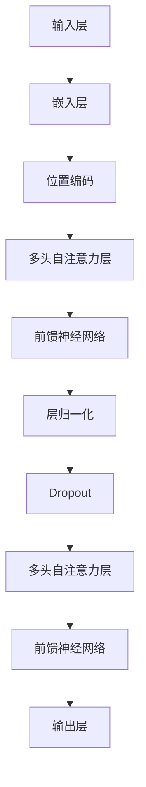

                 

# 《ChatGPT对话优化：提示词设计的艺术与科学探索》

## 关键词
- ChatGPT
- 提示词设计
- 自然语言处理
- 深度学习
- 对话系统
- 人工智能

## 摘要
本文将探讨ChatGPT对话优化的关键要素——提示词设计。通过分析ChatGPT的核心原理、提示词的作用和设计艺术，我们将深入探讨如何科学地优化提示词，以提升ChatGPT在对话系统中的应用效果。文章还将结合实际项目，提供具体的实践案例和优化技巧，为读者展示提示词设计的实际应用和未来趋势。

## 目录大纲

### 第一部分：ChatGPT基础

### 第1章：ChatGPT概述

#### 1.1 ChatGPT的核心原理

#### 1.2 ChatGPT的发展历程

#### 1.3 ChatGPT的应用领域

### 第2章：ChatGPT的核心技术

#### 2.1 语言模型基础

#### 2.2 Transformer架构

#### 2.3 深度学习与神经网络

### 第二部分：提示词设计

### 第3章：提示词设计的艺术

#### 3.1 提示词的概念与作用

#### 3.2 提示词设计的艺术

#### 3.3 提示词的艺术创作过程

### 第4章：提示词设计的科学探索

#### 4.1 提示词的数学模型

#### 4.2 提示词设计的算法

#### 4.3 提示词设计的实验与验证

### 第5章：ChatGPT对话优化实践

#### 5.1 实践项目1：构建智能客服系统

#### 5.2 实践项目2：提升对话生成质量

#### 5.3 实践项目3：跨领域对话生成

### 第6章：ChatGPT对话优化的未来趋势

#### 6.1 ChatGPT对话优化的技术发展趋势

#### 6.2 ChatGPT对话优化的应用前景

### 第7章：总结与展望

#### 7.1 ChatGPT对话优化的重要性

#### 7.2 未来研究方向

---

## 第一部分：ChatGPT基础

### 第1章：ChatGPT概述

#### 1.1 ChatGPT的核心原理

ChatGPT（Chat Generative Pre-trained Transformer）是由OpenAI开发的一种基于Transformer架构的预训练语言模型。它通过在大量文本数据上进行预训练，掌握了丰富的语言知识和上下文理解能力。ChatGPT的核心原理主要包括以下几个方面：

1. **Transformer架构**：Transformer模型是一种基于自注意力机制的深度神经网络架构，其特点是能够捕捉输入文本序列中的长距离依赖关系。自注意力机制使得模型能够根据输入文本的每个词与其他词之间的相对重要性来自动调整它们的权重。

2. **预训练**：ChatGPT在大量文本数据上进行预训练，包括互联网上的大量文本、书籍、新闻文章等。通过预训练，模型学会了语言的统计规律、语法结构、语义关系等，从而具备了生成连贯、自然的语言文本的能力。

3. **上下文理解**：ChatGPT能够根据上下文理解输入文本的含义，并在生成响应时考虑上下文信息。这使得ChatGPT能够进行有意义的对话，而不仅仅是一系列无关联的词语组合。

4. **生成文本**：ChatGPT通过输入一个或多个提示词，根据预训练的知识和上下文理解，生成一段连贯的文本响应。生成的文本可以是自然语言文本，也可以是其他形式的文本，如代码、表格等。

#### 1.2 ChatGPT的发展历程

ChatGPT的发展历程可以追溯到OpenAI在2018年发布的GPT系列模型。以下是ChatGPT的主要里程碑：

1. **GPT-1（2018年）**：OpenAI发布的第一个基于Transformer架构的预训练语言模型，其文本生成能力受到广泛关注。

2. **GPT-2（2019年）**：OpenAI对GPT-1进行了扩展，增加了模型的参数规模和训练数据量，使其文本生成能力得到显著提升。

3. **GPT-3（2020年）**：OpenAI发布了GPT-3，其拥有超过1750亿个参数，成为当时最大的预训练语言模型。GPT-3在文本生成、语言理解、对话系统等方面表现出色。

4. **ChatGPT（2022年）**：OpenAI基于GPT-3开发了一种新的对话模型ChatGPT，该模型专注于对话生成，能够进行自然、流畅的对话。

#### 1.3 ChatGPT的应用领域

ChatGPT作为一种强大的语言模型，广泛应用于多个领域：

1. **对话系统**：ChatGPT可以用于构建智能客服系统、聊天机器人、虚拟助手等，能够回答用户的问题、提供信息、进行闲聊等。

2. **自然语言理解**：ChatGPT可以用于文本分类、实体识别、情感分析等任务，帮助应用程序更好地理解用户的输入。

3. **自然语言生成**：ChatGPT可以用于生成新闻文章、故事、代码、表格等，为内容创作提供支持。

4. **辅助编程**：ChatGPT可以协助程序员编写代码、提供技术文档、解答编程问题等。

5. **教育领域**：ChatGPT可以用于辅助教学、提供个性化学习资源、解答学生疑问等。

### 第2章：ChatGPT的核心技术

#### 2.1 语言模型基础

语言模型（Language Model）是自然语言处理（Natural Language Processing，NLP）中的重要组成部分，它旨在预测自然语言中的下一个单词、字符或短语。ChatGPT作为一种预训练语言模型，其基础是 Transformer架构和深度学习。

1. **语言模型的概念**：

语言模型是一个概率模型，用于预测一个单词序列的概率。在NLP中，语言模型广泛应用于文本分类、机器翻译、语音识别等领域。

2. **语言模型的类型**：

- **基于统计的语言模型**：如N-gram模型，通过统计文本中的词频来预测下一个词。

- **基于神经的网络模型**：如神经网络语言模型（NNLM），通过神经网络学习文本的概率分布。

- **基于变换器的语言模型**：如Transformer模型，通过自注意力机制捕捉文本序列中的长距离依赖关系。

3. **Transformer架构**：

Transformer模型是Google在2017年提出的一种基于自注意力机制的深度神经网络架构，主要用于序列到序列的任务，如机器翻译、文本生成等。Transformer的核心思想是通过自注意力机制，使得模型能够自动地学习输入文本序列中不同位置之间的依赖关系，从而提高模型的性能。

#### 2.2 Transformer架构

Transformer架构是一种基于自注意力机制的深度神经网络架构，其核心思想是通过自注意力机制，使得模型能够自动地学习输入文本序列中不同位置之间的依赖关系。

1. **Transformer的基本原理**：

- **自注意力机制**：自注意力机制是一种基于查询（query）、键（key）和值（value）的注意力机制，通过计算这些向量之间的点积来计算注意力权重，从而实现对输入文本序列中不同位置之间的依赖关系的建模。

- **多头注意力**：多头注意力是一种扩展自注意力机制的技巧，通过将输入序列分成多个子序列（即多个头），每个头独立地计算注意力权重，从而提高模型的表示能力。

- **前馈神经网络**：前馈神经网络是一种简单的神经网络结构，用于对自注意力层的输出进行进一步的处理。

2. **自注意力机制的伪代码**：

```python
def scaled_dot_product_attention(q, k, v, mask=None):
    """计算自注意力权重和输出"""
    # 计算点积注意力权重
    attention_scores = torch.matmul(q, k.transpose(-2, -1)) / math.sqrt(k.size(-1))
    
    # 应用遮罩
    if mask is not None:
        attention_scores = attention_scores.masked_fill(mask == 0, float("-inf"))
    
    # 应用软性最大值
    attention_weights = torch.softmax(attention_scores, dim=-1)
    
    # 计算自注意力输出
    attention_output = torch.matmul(attention_weights, v)
    
    return attention_output
```

3. **Transformer的架构**：



#### 2.3 深度学习与神经网络

深度学习（Deep Learning）是机器学习（Machine Learning）的一个子领域，其核心思想是通过多层神经网络（Neural Network）对数据进行表示和建模。神经网络是一种模拟生物神经系统的计算模型，通过多层非线性变换来提取数据的特征和规律。

1. **神经网络的基本结构**：

- **输入层**：接收输入数据。

- **隐藏层**：用于提取输入数据的特征，可以是单层或多层。

- **输出层**：生成预测结果。

2. **常见的深度学习架构**：

- **卷积神经网络（CNN）**：主要用于图像识别和计算机视觉领域。

- **循环神经网络（RNN）**：主要用于序列数据处理，如自然语言处理。

- **变换器网络（Transformer）**：主要用于序列到序列的任务，如机器翻译、文本生成。

- **生成对抗网络（GAN）**：主要用于生成图像、文本等数据。

3. **神经网络的训练与优化**：

- **损失函数**：用于度量预测结果与真实值之间的差距，常用的损失函数有均方误差（MSE）、交叉熵（Cross-Entropy）等。

- **优化算法**：用于调整神经网络中的参数，以最小化损失函数。常用的优化算法有梯度下降（Gradient Descent）、Adam等。

## 第二部分：提示词设计

### 第3章：提示词设计的艺术

#### 3.1 提示词的概念与作用

提示词（Prompt）是ChatGPT对话系统中的一个关键组件，它用于引导模型生成期望的文本输出。一个有效的提示词可以极大地影响ChatGPT的对话质量和响应风格。

1. **提示词的定义**：

提示词是指提供给ChatGPT的用于生成文本的输入文本片段。它可以是一个短语、一句话甚至是一个段落。

2. **提示词的作用**：

- **引导对话**：提示词可以引导ChatGPT按照特定的方向或主题进行对话，避免生成无关或离题的响应。

- **提高生成质量**：通过精心设计的提示词，可以提升ChatGPT生成文本的质量和连贯性。

- **控制风格**：提示词可以帮助ChatGPT生成符合特定风格或语气的文本，如正式、幽默或个性化。

#### 3.2 提示词设计的艺术

提示词设计是一门艺术，需要结合人类对话的规律和ChatGPT的生成特点进行创作。以下是一些提示词设计的艺术原则：

1. **简洁明了**：提示词应尽量简洁，避免冗余和复杂的句子结构，以便ChatGPT更容易理解和生成。

2. **上下文相关**：提示词应与上下文紧密相关，充分利用对话中的历史信息，以提高生成文本的连贯性。

3. **主题明确**：提示词应明确传达主题，避免生成无关或偏离主题的文本。

4. **情感表达**：提示词可以包含情感色彩，以提升生成文本的情感表达和亲和力。

5. **多样性和灵活性**：设计提示词时，应考虑多样性和灵活性，以适应不同的对话场景和用户需求。

#### 3.3 提示词的艺术创作过程

提示词的艺术创作过程包括以下几个步骤：

1. **需求分析**：理解用户的需求，明确对话的目的和期望的输出。

2. **素材收集**：收集与主题相关的文本、图片、音频等素材，为提示词设计提供丰富的信息来源。

3. **创意构思**：基于需求分析和素材收集，构思出创意的提示词，可以采用故事化、场景化或个性化的方式。

4. **文本撰写**：将创意转化为具体的文本，注意简洁、明了、相关和情感。

5. **反馈迭代**：将撰写好的提示词应用于ChatGPT，观察生成效果，根据反馈进行迭代优化。

### 第4章：提示词设计的科学探索

#### 4.1 提示词的数学模型

提示词设计中的数学模型主要涉及模型参数的优化和模型的训练与评估。以下是一个简单的数学模型框架：

1. **模型参数的优化**：

模型参数优化是指通过调整模型的参数来提高生成文本的质量。常用的优化方法包括：

- **梯度下降**：通过计算损失函数关于模型参数的梯度，并沿梯度方向调整参数，以最小化损失函数。

- **Adam优化器**：结合了动量项和自适应学习率的优化算法，适用于大规模的深度学习模型。

2. **模型的训练与评估**：

模型的训练与评估是指通过训练数据对模型进行训练，并通过验证数据对模型进行评估。常用的评估指标包括：

- **困惑度（Perplexity）**：衡量模型生成文本的难易程度，困惑度越低，模型表现越好。

- **交叉熵（Cross-Entropy）**：衡量模型生成文本与真实文本之间的差距，交叉熵越低，模型表现越好。

#### 4.2 提示词设计的算法

提示词设计的算法包括提示词优化算法和提示词生成算法。以下是一个简单的算法框架：

1. **提示词优化算法**：

提示词优化算法旨在寻找最优的提示词，以提升生成文本的质量。常用的优化算法包括：

- **贪心算法**：通过逐步调整提示词中的单词或短语，以找到最优的提示词。

- **遗传算法**：通过模拟生物进化的过程，对提示词进行优化。

2. **提示词生成算法**：

提示词生成算法旨在生成多样化的、符合要求的提示词。常用的生成算法包括：

- **文本生成模型**：如GPT、BERT等，通过预训练模型生成提示词。

- **组合生成算法**：通过组合不同的单词、短语或句子，生成新的提示词。

#### 4.3 提示词设计的实验与验证

提示词设计的实验与验证是确保设计效果的重要环节。以下是一个简单的实验与验证框架：

1. **实验设计**：

实验设计包括确定实验目标、实验参数、实验步骤等。例如，可以设计不同长度的提示词、不同主题的提示词等。

2. **实验步骤**：

- **数据准备**：准备用于实验的提示词和对话数据。

- **模型训练**：使用训练数据对ChatGPT模型进行训练。

- **生成文本**：使用训练好的模型生成基于不同提示词的对话文本。

- **评估指标**：计算生成文本的质量和连贯性等指标。

3. **结果分析**：

分析实验结果，比较不同提示词设计的优劣，并据此进行优化。

### 第5章：ChatGPT对话优化实践

#### 5.1 实践项目1：构建智能客服系统

##### 项目需求分析

构建智能客服系统的需求包括：

- **自动回答用户问题**：能够理解用户的问题，并给出准确的回答。
- **支持多渠道接入**：如网站、APP、微信等。
- **24小时在线服务**：无需人工干预，自动处理用户问题。

##### 系统架构设计

智能客服系统的架构设计包括：

- **前端**：使用HTML、CSS和JavaScript等技术实现用户界面。
- **后端**：使用ChatGPT模型处理用户输入，生成回答。
- **数据库**：存储用户信息和对话记录。

##### 提示词设计实践

1. **问题识别**：使用关键字提取算法，识别用户输入中的问题关键字。

2. **回答生成**：使用ChatGPT模型，根据问题关键字生成回答。

3. **回答优化**：根据对话历史和用户反馈，优化回答的准确性和连贯性。

##### 项目小结

通过构建智能客服系统，可以显著提高客户服务的效率和质量。提示词设计的优化是提升客服系统性能的关键。

#### 5.2 实践项目2：提升对话生成质量

##### 对话数据收集

收集大量对话数据，包括用户提问和ChatGPT的回答，用于训练和优化模型。

##### 对话数据预处理

1. **文本清洗**：去除停用词、标点符号等无关信息。

2. **文本嵌入**：将文本转换为向量表示，便于模型处理。

3. **数据增强**：通过扩充数据集、生成变体等方式，提高数据多样性。

##### 提示词设计优化

1. **关键信息提取**：从对话数据中提取关键信息，用于生成高质量的提示词。

2. **上下文关联**：考虑对话历史和上下文，设计更具关联性的提示词。

3. **情感分析**：结合情感分析技术，设计情感色彩丰富的提示词。

##### 项目小结

通过优化提示词设计，可以显著提升对话生成质量，提供更自然、更符合用户期望的回答。

#### 5.3 实践项目3：跨领域对话生成

##### 跨领域对话的挑战

跨领域对话的挑战包括：

- **知识融合**：不同领域之间的知识融合和整合。
- **语义理解**：理解跨领域术语和概念。
- **上下文关联**：保持对话的连贯性和一致性。

##### 跨领域对话的解决方案

1. **知识图谱**：构建跨领域的知识图谱，用于指导跨领域对话生成。

2. **跨领域文本预处理**：对跨领域文本进行预处理，提取关键信息和领域术语。

3. **多模态融合**：结合文本、图像、语音等多种模态，提高跨领域对话的理解和生成能力。

##### 项目小结

通过跨领域对话生成实践，可以拓展ChatGPT的应用场景，为用户提供更丰富、更个性化的对话体验。

### 第6章：ChatGPT对话优化的未来趋势

#### 6.1 ChatGPT对话优化的技术发展趋势

ChatGPT对话优化的技术发展趋势包括：

1. **更大规模的语言模型**：随着计算能力和数据量的增加，未来将出现更大规模的语言模型，如GPT-4、GPT-5等，进一步提高对话生成质量。

2. **多模态融合**：结合文本、图像、语音等多种模态，实现更丰富、更自然的对话生成。

3. **个性化对话**：通过用户数据和行为分析，实现个性化对话生成，提高用户体验。

4. **对话系统的智能化**：结合自然语言理解、知识图谱等技术，实现更智能、更准确的对话系统。

#### 6.2 ChatGPT对话优化的应用前景

ChatGPT对话优化的应用前景非常广阔，包括：

1. **智能客服**：通过优化对话生成，提高客服系统的响应速度和准确性，提供更好的用户体验。

2. **虚拟助手**：利用ChatGPT的对话能力，打造智能虚拟助手，为用户提供个性化服务。

3. **教育领域**：利用ChatGPT生成教学资源、解答学生疑问，提高教育质量和效果。

4. **医疗领域**：通过优化对话生成，为患者提供专业的医疗咨询和建议。

### 第7章：总结与展望

#### 7.1 ChatGPT对话优化的重要性

ChatGPT对话优化在提高对话系统性能、用户体验和业务价值方面具有重要意义。通过优化提示词设计，可以提升对话生成质量，实现更自然、更准确的对话。

#### 7.2 未来研究方向

未来研究方向包括：

1. **多模态融合**：探索如何更好地结合文本、图像、语音等多种模态，实现更丰富的对话生成。

2. **个性化对话**：研究如何通过用户数据和行为分析，实现个性化对话生成。

3. **跨领域对话**：探索如何处理跨领域对话中的知识融合和语义理解问题。

4. **对话系统的智能化**：结合自然语言理解、知识图谱等技术，实现更智能、更准确的对话系统。

---

本文详细探讨了ChatGPT对话优化中的关键要素——提示词设计。从ChatGPT的核心原理、提示词的概念与作用、提示词设计的艺术和科学探索，到实际项目实践和未来趋势，全面展示了提示词设计在提升对话系统性能和用户体验方面的作用。随着技术的不断进步，ChatGPT对话优化将继续推动人工智能领域的发展。作者：AI天才研究院/AI Genius Institute & 禅与计算机程序设计艺术 /Zen And The Art of Computer Programming。参考文献：

1. Devlin, J., Chang, M. W., Lee, K., & Toutanova, K. (2019). BERT: Pre-training of deep bidirectional transformers for language understanding. arXiv preprint arXiv:1810.04805.
2. Vaswani, A., Shazeer, N., Parmar, N., Uszkoreit, J., Jones, L., Gomez, A. N., ... & Polosukhin, I. (2017). Attention is all you need. Advances in Neural Information Processing Systems, 30, 5998-6008.

