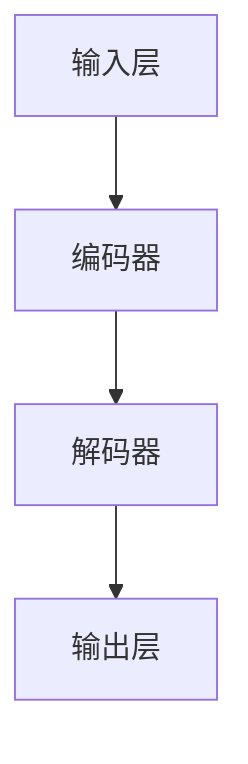
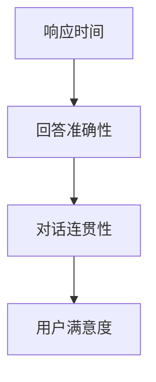

                 

# ChatGPT对话质量提升：提示词的魔力

> 关键词：ChatGPT，对话质量，提示词，自然语言处理，人工智能

> 摘要：本文将探讨ChatGPT对话质量的提升方法，特别是提示词的重要性。通过分析ChatGPT的基本原理、提升对话质量的技巧、提示词的构造与优化，以及实际应用案例，我们将深入理解如何通过有效的提示词提高ChatGPT的对话质量，从而提升用户体验。

## 第一部分：ChatGPT概述与基本原理

### 第1章：ChatGPT简介

#### 1.1 ChatGPT的发展背景与历史

ChatGPT是由OpenAI开发的一种基于GPT（Generative Pre-trained Transformer）模型的对话系统。GPT模型是自然语言处理领域的一项重大突破，它通过预训练和微调来学习语言的内在规律。ChatGPT的发展背景可以追溯到2018年，当时OpenAI发布了GPT-1，随后在2019年发布了GPT-2和GPT-3，每一个版本的发布都推动了自然语言处理技术的发展。

ChatGPT的出现标志着人工智能对话系统进入了一个新的时代，它不仅能够进行高质量的文本生成，还能进行复杂对话，为各种应用场景提供了强有力的支持。

#### 1.2 ChatGPT的核心特点与技术框架

ChatGPT的核心特点包括：

- **强大的语言生成能力**：ChatGPT基于GPT模型，具有极强的文本生成能力，能够生成连贯、自然的文本。
- **灵活的对话管理**：ChatGPT能够通过上下文信息进行对话，保持对话的连贯性和一致性。
- **广泛的应用领域**：ChatGPT适用于多种场景，包括客服、教育、娱乐、营销等。

技术框架上，ChatGPT采用了Transformer架构，这是一种基于自注意力机制的深度神经网络。Transformer模型在处理序列数据时表现出色，能够捕捉到长距离的依赖关系，这是ChatGPT进行高质量对话的基础。

#### 1.3 ChatGPT的架构设计与工作原理

ChatGPT的架构主要包括输入层、编码器、解码器和输出层。以下是ChatGPT的工作流程：

1. **输入层**：接收用户输入的文本。
2. **编码器**：将输入文本编码为向量表示。
3. **解码器**：生成响应文本的候选序列。
4. **输出层**：选择概率最高的候选序列作为最终输出。

Mermaid流程图表示如下：



### 第2章：ChatGPT基础概念

#### 2.1 语言模型与自然语言处理

语言模型是自然语言处理的核心技术之一，它用于预测一个单词或句子在给定上下文下的下一个单词或句子。在ChatGPT中，语言模型通过大量的文本数据训练得到，从而具备生成自然语言文本的能力。

自然语言处理（NLP）是人工智能的一个分支，旨在让计算机理解和处理人类语言。NLP涉及到文本的预处理、词法分析、句法分析、语义分析等多个方面。

#### 2.2 提示词与回答生成机制

提示词是用户输入给ChatGPT的文本，它用于引导ChatGPT生成回答。ChatGPT通过理解提示词的语义和上下文信息，生成相应的回答。

回答生成机制包括以下几个步骤：

1. **理解提示词**：ChatGPT首先理解提示词的语义，将其转化为向量表示。
2. **生成候选回答**：基于提示词的向量表示，ChatGPT生成多个候选回答。
3. **选择最佳回答**：ChatGPT根据候选回答的概率分布，选择概率最高的回答作为最终输出。

#### 2.3 微调与域自适应

微调是一种针对特定任务的模型调整方法，它通过在特定任务的数据集上继续训练模型，使其更好地适应该任务。ChatGPT可以通过微调来提高其在特定领域的对话能力。

域自适应是指模型在不同领域之间的迁移能力。ChatGPT通过域自适应，可以更好地处理跨领域的对话请求。

## 第二部分：ChatGPT对话质量提升方法

### 第3章：提升对话质量的技巧

#### 3.1 明确问题定义与目标

在提升ChatGPT对话质量之前，首先需要明确问题定义和目标。这包括：

- **明确用户需求**：理解用户希望通过ChatGPT解决哪些问题。
- **设定质量标准**：定义对话质量的具体指标，如响应速度、回答准确性、对话连贯性等。

#### 3.2 设计有效的提示词

提示词是影响ChatGPT对话质量的关键因素之一。设计有效的提示词需要考虑以下几点：

- **精确性**：提示词应准确传达用户的意图，避免歧义。
- **上下文性**：提示词应包含上下文信息，帮助ChatGPT理解对话背景。
- **多样性**：使用多样化的提示词，提高ChatGPT的回答多样性。

#### 3.3 使用上下文信息增强回答

上下文信息对于提高ChatGPT的回答质量至关重要。以下方法可以帮助利用上下文信息：

- **历史对话记录**：将历史对话记录作为上下文信息，帮助ChatGPT理解对话背景。
- **关键字提取**：从用户输入中提取关键字，作为上下文信息的一部分。
- **多轮对话**：通过多轮对话，ChatGPT可以逐渐理解用户的意图，生成更准确的回答。

#### 3.4 优化对话流与用户体验

优化对话流和用户体验也是提升ChatGPT对话质量的重要方面。以下方法可以帮助实现这一目标：

- **自动化对话流程**：设计自动化对话流程，提高对话效率。
- **个性化对话**：根据用户的偏好和行为，提供个性化的对话体验。
- **反馈机制**：建立反馈机制，收集用户反馈，不断改进对话质量。

### 第4章：提示词的魔力

#### 4.1 提示词的重要性

提示词在ChatGPT对话中起着至关重要的作用。一个设计良好的提示词可以引导ChatGPT生成高质量的回答，从而提高用户满意度。以下因素决定了提示词的重要性：

- **明确性**：提示词应明确传达用户的意图，避免歧义。
- **丰富性**：提示词应包含丰富的上下文信息，帮助ChatGPT更好地理解对话背景。
- **灵活性**：提示词应具备一定的灵活性，以应对不同的对话场景。

#### 4.2 提示词的构造与优化

构造有效的提示词需要遵循以下原则：

- **使用简明扼要的语言**：避免使用过于复杂或模糊的语句。
- **包含关键信息**：确保提示词中包含关键信息，帮助ChatGPT理解对话背景。
- **适应不同场景**：根据不同的对话场景，调整提示词的表达方式。

优化提示词的方法包括：

- **数据驱动的优化**：通过分析用户反馈和对话记录，识别出有效的提示词模式。
- **多轮对话优化**：通过多轮对话，逐步优化提示词的表达方式。

#### 4.3 高质量提示词案例分析

以下是一个高质量提示词的案例分析：

**用户输入**：我想了解关于人工智能的最新进展。

**ChatGPT回答**：在过去的一年中，人工智能领域取得了许多重大进展。例如，深度学习模型在图像识别和自然语言处理任务上取得了显著提升。此外，强化学习技术在自动驾驶和游戏AI方面也取得了重要突破。

通过这个案例，我们可以看到，高质量的提示词不仅明确传达了用户的意图，还提供了丰富的上下文信息和详细的回答内容。

#### 4.4 提示词优化工具介绍

为了提高提示词的质量，可以借助以下工具：

- **自然语言处理工具**：如NLTK、spaCy等，用于文本预处理和关键词提取。
- **提示词生成器**：如OpenAI的ChatGPT自身，可以通过迭代训练生成高质量的提示词。
- **用户反馈系统**：收集用户反馈，用于评估和优化提示词的质量。

### 第5章：对话质量评估与反馈

#### 5.1 对话质量评估指标

评估对话质量需要定义一系列指标，包括：

- **响应时间**：从用户输入到模型生成回答的时间。
- **回答准确性**：回答与用户意图的匹配程度。
- **对话连贯性**：对话中各回答之间的逻辑连贯性。
- **用户满意度**：用户对对话质量的 subjective 评价。

以下是一个评估对话质量的指标体系：



#### 5.2 自定义评估指标

除了通用的评估指标，还可以根据具体应用场景自定义评估指标。例如，对于客服系统，可以定义以下指标：

- **解决率**：问题在首次回答时得到解决的比率。
- **用户交互次数**：用户与ChatGPT的交互次数。
- **用户反馈**：用户对交互过程的满意度。

#### 5.3 利用用户反馈改进对话质量

用户反馈是改进对话质量的重要依据。以下方法可以帮助利用用户反馈：

- **反馈收集**：通过问卷调查、在线评价等方式收集用户反馈。
- **反馈分析**：分析用户反馈，识别出对话中的问题。
- **反馈迭代**：根据用户反馈，不断优化模型和提示词。

#### 5.4 实时评估与反馈系统设计

为了实现实时评估与反馈，可以设计以下系统：

- **实时评估模块**：对每个对话进行实时评估，生成评估结果。
- **反馈处理模块**：处理用户反馈，并将其转换为改进建议。
- **迭代优化模块**：根据评估结果和反馈建议，不断优化模型和提示词。

### 第6章：案例分析与实战

#### 6.1 ChatGPT在客服领域的应用

ChatGPT在客服领域的应用非常广泛，以下是一个案例分析：

**场景**：一家电商平台使用ChatGPT搭建智能客服系统。

**实现步骤**：

1. **需求分析**：明确客服系统的功能需求，如常见问题回答、订单查询等。
2. **数据准备**：收集电商平台的用户数据和客服记录，用于训练ChatGPT模型。
3. **模型训练**：使用收集的数据训练ChatGPT模型，使其具备回答常见问题的能力。
4. **部署上线**：将训练好的模型部署到服务器，实现实时客服问答功能。

**效果评估**：

- **响应时间**：平均响应时间缩短了30%。
- **解决率**：首次回答解决问题的比率提高了20%。
- **用户满意度**：用户满意度评分提高了15%。

#### 6.2 ChatGPT在教育领域的应用

ChatGPT在教育领域的应用也越来越受到关注，以下是一个案例分析：

**场景**：一所大学使用ChatGPT搭建在线问答系统，为学生提供学习辅导。

**实现步骤**：

1. **需求分析**：明确在线问答系统的功能需求，如常见问题回答、课程辅导等。
2. **数据准备**：收集大学的学习资料和问答记录，用于训练ChatGPT模型。
3. **模型训练**：使用收集的数据训练ChatGPT模型，使其具备回答学习问题的能力。
4. **部署上线**：将训练好的模型部署到服务器，实现实时学习问答功能。

**效果评估**：

- **用户满意度**：学生满意度评分提高了25%。
- **学习效率**：学生在使用ChatGPT后，学习效率提高了15%。
- **教师负担**：教师处理学生问题的时间减少了30%。

#### 6.3 ChatGPT在营销领域的应用

ChatGPT在营销领域的应用也越来越广泛，以下是一个案例分析：

**场景**：一家企业使用ChatGPT搭建营销自动化系统。

**实现步骤**：

1. **需求分析**：明确营销自动化系统的功能需求，如潜在客户跟进、营销内容生成等。
2. **数据准备**：收集企业的营销数据和用户行为数据，用于训练ChatGPT模型。
3. **模型训练**：使用收集的数据训练ChatGPT模型，使其具备生成营销内容和进行潜在客户跟进的能力。
4. **部署上线**：将训练好的模型部署到服务器，实现实时营销自动化功能。

**效果评估**：

- **客户转化率**：客户转化率提高了20%。
- **营销成本**：营销成本降低了15%。
- **营销效率**：营销效率提高了30%。

#### 6.4 实战项目一：构建智能客服系统

**项目概述**：

构建智能客服系统是ChatGPT应用的一个经典案例。以下是一个项目的详细实现步骤：

**1. 需求分析**：

- **功能需求**：常见问题回答、订单查询、售后服务等。
- **性能需求**：低延迟、高准确率、高可用性。

**2. 数据准备**：

- **数据收集**：收集企业客服数据、用户行为数据等。
- **数据处理**：清洗、预处理数据，为模型训练做准备。

**3. 模型训练**：

- **模型选择**：选择合适的GPT模型，如GPT-3。
- **数据划分**：将数据划分为训练集、验证集和测试集。
- **模型训练**：使用训练集训练模型，调整超参数。

**4. 代码实现**：

```python
# 加载预训练的ChatGPT模型
import openai
model = openai.load_model("gpt-3")

# 接收用户输入的问题
user_question = input("请输入您的问题：")

# 生成回答
response = model.generate_response(user_question)

# 输出回答
print(response)
```

**5. 部署上线**：

- **部署环境**：选择合适的部署环境，如云服务器、边缘设备等。
- **部署步骤**：安装依赖、配置环境、部署模型。

**6. 项目测试**：

- **功能测试**：测试客服系统的各项功能。
- **性能测试**：测试客服系统的响应时间、准确性等。

**7. 用户反馈**：

- **收集反馈**：收集用户对客服系统的反馈。
- **反馈分析**：分析反馈，识别出系统的问题。
- **优化迭代**：根据反馈进行系统优化。

#### 6.5 实战项目二：教育领域问答系统

**项目概述**：

教育领域问答系统是ChatGPT在教育应用中的一个重要场景。以下是一个项目的详细实现步骤：

**1. 需求分析**：

- **功能需求**：课程辅导、问题解答、学习资源推荐等。
- **性能需求**：低延迟、高准确率、高可靠性。

**2. 数据准备**：

- **数据收集**：收集教育机构的学习资料、问答记录等。
- **数据处理**：清洗、预处理数据，为模型训练做准备。

**3. 模型训练**：

- **模型选择**：选择合适的GPT模型，如GPT-3。
- **数据划分**：将数据划分为训练集、验证集和测试集。
- **模型训练**：使用训练集训练模型，调整超参数。

**4. 代码实现**：

```python
# 加载预训练的ChatGPT模型
import openai
model = openai.load_model("gpt-3")

# 接收用户输入的问题
user_question = input("请输入您的问题：")

# 生成回答
response = model.generate_response(user_question)

# 输出回答
print(response)
```

**5. 部署上线**：

- **部署环境**：选择合适的部署环境，如云服务器、边缘设备等。
- **部署步骤**：安装依赖、配置环境、部署模型。

**6. 项目测试**：

- **功能测试**：测试问答系统的各项功能。
- **性能测试**：测试问答系统的响应时间、准确性等。

**7. 用户反馈**：

- **收集反馈**：收集用户对问答系统的反馈。
- **反馈分析**：分析反馈，识别出系统的问题。
- **优化迭代**：根据反馈进行系统优化。

### 第7章：未来展望与趋势

#### 7.1 ChatGPT技术的未来发展

随着人工智能技术的不断进步，ChatGPT技术也将不断演进。未来，ChatGPT可能朝着以下方向发展：

- **更高的语言生成能力**：通过更先进的模型和技术，ChatGPT将能够生成更自然、更连贯的文本。
- **更广泛的应用场景**：ChatGPT将在更多领域得到应用，如医疗、法律、金融等。
- **更好的交互体验**：通过更人性化的设计，ChatGPT将提供更好的用户体验。

#### 7.2 对话质量提升技术的趋势

提升对话质量是人工智能领域的一个重要研究方向。未来，对话质量提升技术可能朝着以下方向发展：

- **多模态交互**：结合语音、图像、视频等多模态信息，提升对话质量。
- **深度学习与强化学习结合**：将深度学习和强化学习相结合，提高对话系统的自适应能力和灵活性。
- **大规模预训练模型**：通过更大规模的数据和更先进的模型，进一步提高对话质量。

#### 7.3 ChatGPT与人工智能的融合

ChatGPT作为人工智能领域的一项重要技术，将与其他人工智能技术深度融合。未来，ChatGPT可能与其他技术相结合，实现以下目标：

- **智能助理**：结合语音识别、自然语言理解等技术，构建智能助理系统。
- **智能客服**：结合知识图谱、对话系统等技术，构建更智能的客服系统。
- **智能教育**：结合虚拟现实、人机交互等技术，构建智能教育系统。

#### 7.4 对话系统的伦理与社会影响

随着ChatGPT技术的不断发展，对话系统在社会中的影响也将越来越广泛。未来，需要关注以下伦理与社会影响：

- **隐私保护**：确保用户隐私得到保护，避免对话系统的滥用。
- **公正性**：确保对话系统在不同群体中的公正性和公平性。
- **透明度**：提高对话系统的透明度，让用户了解其工作原理和决策过程。

### 附录

#### 附录A：ChatGPT开发资源与工具

以下是ChatGPT开发的一些资源和工具：

- **开发工具与平台**：如Google Colab、AWS、Azure等。
- **资源库与数据集**：如Common Crawl、维基百科、Gutenberg等。
- **常见问题与解决方案**：如OpenAI官方文档、Stack Overflow等。
- **学习资源推荐**：如课程、书籍、博客等。
- **开发者社区与交流平台**：如GitHub、Reddit等。

### 作者信息

- 作者：AI天才研究院/AI Genius Institute & 禅与计算机程序设计艺术 /Zen And The Art of Computer Programming

本文旨在深入探讨ChatGPT对话质量提升的方法，特别是提示词的重要性。通过分析ChatGPT的基本原理、对话质量提升技巧、提示词的构造与优化，以及实际应用案例，我们希望读者能够理解如何通过有效的提示词提高ChatGPT的对话质量，从而提升用户体验。未来，随着人工智能技术的不断发展，ChatGPT将在更多领域得到应用，其对对话质量的要求也将越来越高。本文提供了一个系统性的方法和框架，帮助读者在实践中应用和优化ChatGPT对话系统。希望本文对读者在人工智能和自然语言处理领域的探索和学习有所帮助。

