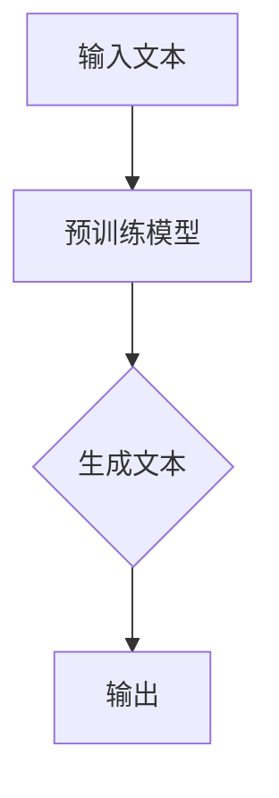
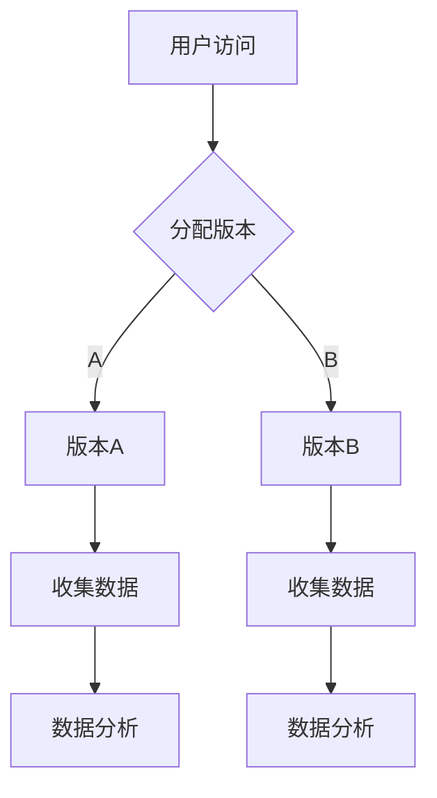
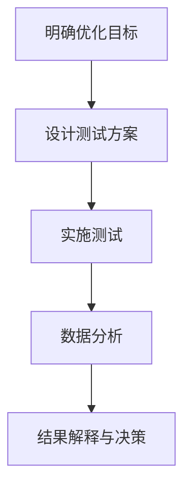

                 

### 文章标题

《ChatGPT提示词优化：A/B测试方法》

### 关键词

- ChatGPT
- 提示词优化
- A/B测试
- 人工智能
- 自然语言处理
- 数据分析
- 算法优化

### 摘要

本文旨在深入探讨如何通过A/B测试方法优化ChatGPT的提示词。首先，我们将介绍ChatGPT及其应用背景，阐述提示词在模型性能中的作用。接着，文章将详细解析A/B测试的基本原理、优势及挑战。随后，我们将逐步阐述A/B测试在ChatGPT提示词优化中的具体实施流程，通过实例分析展示如何通过A/B测试实现提示词的优化。最后，文章还将讨论A/B测试中常见的问题及解决对策，探讨多变量测试、深度学习技术在提示词优化中的应用，并总结全书，展望未来发展趋势和挑战。通过本文的阅读，读者将全面了解ChatGPT提示词优化与A/B测试的深入结合，掌握其实践技巧和最佳实践。

### 第一部分：引言与基础

#### 第1章：ChatGPT及其应用

##### 1.1 ChatGPT的概念

ChatGPT是由OpenAI开发的一种基于变换器（Transformer）架构的预训练语言模型。这种模型利用大量的互联网文本数据进行训练，能够理解和生成人类语言。ChatGPT的特点在于其强大的上下文理解和生成能力，可以回答各种问题，撰写文章，进行对话等。

**核心概念与联系：**

ChatGPT的核心概念包括：

- **变换器（Transformer）架构**：一种基于自注意力机制的深度神经网络架构，能够在处理序列数据时捕捉长距离依赖关系。
- **预训练**：通过在大规模数据集上进行预训练，模型能够学习到语言的基本规律和特征。
- **微调**：在特定任务上对预训练模型进行微调，以提升其在特定领域的性能。

**Mermaid流程图：**



**核心算法原理讲解：**

ChatGPT的训练过程主要分为预训练和微调两个阶段：

1. **预训练**：
   - 使用大量的文本数据进行训练，通过自回归语言模型（Autoregressive Language Model）学习语言模式。
   - 利用损失函数（如交叉熵损失）来衡量预测和实际文本之间的差异，并通过反向传播算法更新模型参数。

   ```python
   # 预训练伪代码
   for epoch in range(num_epochs):
       for text_batch in text_loader:
           model.zero_grad()
           logits = model(text_batch)
           loss = F.cross_entropy(logits, text_batch)
           loss.backward()
           optimizer.step()
   ```

2. **微调**：
   - 在特定任务上进行微调，通过额外的训练数据和学习任务来调整模型参数。
   - 使用训练数据和验证数据来监控模型性能，防止过拟合。

   ```python
   # 微调伪代码
   for epoch in range(num_epochs):
       for data, target in train_loader:
           model.zero_grad()
           output = model(data)
           loss = F.loss_fn(output, target)
           loss.backward()
           optimizer.step()
   ```

**数学模型和公式：**

预训练过程中使用的损失函数可以表示为：

$$
\text{loss} = -\frac{1}{N} \sum_{i=1}^{N} \sum_{j=1}^{V} y_{ij} \log(p_{ij}),
$$

其中，$N$ 是批大小，$V$ 是词汇表大小，$y_{ij}$ 是one-hot编码的目标词向量，$p_{ij}$ 是模型对词 $j$ 的预测概率。

**举例说明：**

例如，给定一个句子 "I love programming"，模型预测的下一个词可能是 "code"。使用上述公式计算损失时，如果模型正确预测了 "code"，则损失为0；如果预测错误，则损失将大于0。

##### 1.2 ChatGPT的应用场景

ChatGPT的应用场景非常广泛，包括但不限于以下几个方面：

- **问答系统**：ChatGPT可以构建智能客服系统，回答用户的问题，提供实时支持。
- **内容生成**：ChatGPT可以用于生成文章、报告、故事等，帮助内容创作者提高效率。
- **对话系统**：ChatGPT可以用于构建聊天机器人，与用户进行自然语言交互。
- **自然语言处理**：ChatGPT可以用于文本分类、情感分析、命名实体识别等任务。

**应用案例：**

- **智能客服**：通过ChatGPT构建的智能客服系统能够快速响应用户问题，提供24/7的服务。
- **内容生成**：ChatGPT可以自动生成技术文档、新闻报道等，减轻创作者的工作负担。
- **教育辅导**：ChatGPT可以为学生提供个性化的学习辅导，解答学术问题。

##### 1.3 ChatGPT的优势与挑战

**优势：**

- **强大的语言生成能力**：ChatGPT能够生成连贯、自然的文本，具有很高的质量。
- **广泛的适用性**：ChatGPT可以应用于各种自然语言处理任务，具有很高的灵活性。
- **高效的训练速度**：变换器（Transformer）架构使得ChatGPT的训练速度非常快。

**挑战：**

- **数据隐私**：由于ChatGPT需要大量的训练数据，这可能会涉及到用户数据的隐私问题。
- **可解释性**：ChatGPT的决策过程通常是不透明的，难以解释。
- **计算资源消耗**：训练和部署ChatGPT需要大量的计算资源。

#### 第2章：提示词优化基本概念

##### 2.1 提示词的定义与作用

**提示词（Prompt）**是指给模型输入的引导性文本，用于指导模型生成特定的输出。在ChatGPT中，提示词的作用非常重要，它可以直接影响模型生成文本的质量和相关性。

**提示词的基本类型：**

- **问题型提示词**：用于引导模型回答问题，如 "你最喜欢的编程语言是什么？"
- **描述型提示词**：用于引导模型生成描述性文本，如 "描述一下你的家乡。"
- **指令型提示词**：用于引导模型执行特定任务，如 "写一篇关于人工智能的论文。"

**提示词与模型生成的联系：**

- 提示词可以引导模型关注特定的话题或信息，从而提高生成文本的相关性和质量。
- 通过精心设计的提示词，可以控制模型生成的文本风格、格式和内容。

##### 2.2 提示词优化的目标

**提示词优化的目标**是提高ChatGPT生成文本的质量和相关性，主要包含以下几个方面：

- **提高文本质量**：确保生成的文本语法正确、结构清晰、内容丰富。
- **提高文本相关性**：确保生成的文本与用户输入的提示词紧密相关，满足用户的需求。
- **提高用户满意度**：确保用户对生成的文本感到满意，提高用户交互体验。

**优化目标之间的关系：**

- 文本质量和相关性是提示词优化的核心目标，两者相互影响、相互促进。
- 用户满意度是提示词优化的最终目标，通过提高文本质量和相关性，可以增强用户的满意度。

##### 2.3 提示词优化的挑战

**提示词优化面临的挑战**主要包括以下几个方面：

- **多样性挑战**：如何设计提示词，使得生成的文本具有多样性，避免单调重复。
- **准确性挑战**：如何确保生成的文本与提示词紧密相关，避免偏离主题。
- **可解释性挑战**：如何解释提示词优化过程和结果，使得模型决策过程更加透明、可理解。

**多样性、准确性和可解释性之间的关系：**

- 多样性是确保文本丰富性的关键，准确性是确保文本相关性的基础，可解释性是提升模型可信度的保障。
- 三者之间存在一定的权衡关系，需要在实际应用中找到平衡点。

#### 第二部分：A/B测试方法

##### 第3章：A/B测试原理

##### 3.1 A/B测试的定义

**A/B测试**是一种常用的实验设计方法，用于评估两种或多种不同版本（A和B）的性能差异。在A/B测试中，一部分用户（控制组）使用版本A，另一部分用户（实验组）使用版本B，通过对比两组用户的反馈和行为数据，评估版本B相对于版本A的优劣。

**核心概念与联系：**

- **版本A（控制组）**：使用现有版本的用户组。
- **版本B（实验组）**：测试新版本的用户组。
- **反馈数据**：用户在使用版本A和B后的行为数据，如点击率、转化率等。

**Mermaid流程图：**



**核心算法原理讲解：**

A/B测试的主要步骤包括：

1. **实验设计**：定义实验的目标、指标和分配策略。
2. **用户分配**：将用户随机分配到版本A和版本B。
3. **数据收集**：收集用户在使用版本A和B后的行为数据。
4. **数据分析**：对比版本A和版本B的性能差异，评估实验结果。

**数学模型和公式：**

在A/B测试中，常用的统计指标包括：

- **平均点击率（CTR）**：点击次数除以展示次数。

$$
\text{CTR} = \frac{\text{点击次数}}{\text{展示次数}}
$$

- **转化率**：完成特定目标（如购买、注册）的用户比例。

$$
\text{转化率} = \frac{\text{目标完成次数}}{\text{总用户次数}}
$$

**举例说明：**

假设我们有两个网页版本A和B，版本A的点击率为10%，版本B的点击率为12%，经过A/B测试，我们发现版本B的点击率显著高于版本A，因此我们可以选择版本B作为最终版本。

##### 3.2 A/B测试的优势

**A/B测试的优势**主要体现在以下几个方面：

- **数据驱动决策**：通过实验数据指导产品优化，避免主观臆断。
- **量化评估**：通过量化指标评估不同版本的性能，提高决策的准确性。
- **控制偏差**：通过随机分配用户，减少实验结果受到外部因素干扰的可能性。

**A/B测试在产品优化中的应用：**

- **界面设计优化**：通过测试不同的按钮颜色、布局和文案，找到最佳设计。
- **功能优化**：通过测试不同功能模块的效果，优化产品的功能设计。
- **内容优化**：通过测试不同的内容布局和推荐算法，提高用户交互体验。

##### 3.3 A/B测试的挑战

**A/B测试的挑战**主要包括以下几个方面：

- **实验时间**：实验时间过长可能导致数据收集不足，影响实验结果的准确性。
- **实验成本**：A/B测试需要投入大量的人力、时间和资源。
- **实验设计**：设计合理的实验方案对实验结果至关重要，但实际操作中可能面临诸多挑战。

**实验时间和成本之间的关系：**

- 实验时间越长，数据收集越充分，但可能需要更长的时间来观察到显著的效果。
- 实验成本越高，可能包括人力、服务器和带宽等费用，但通过合理的实验设计，可以在有限成本下获得准确的数据。

**实验设计原则：**

- **明确实验目标**：确保实验设计围绕核心目标展开，避免偏离主题。
- **合理分配用户**：通过随机分配用户，确保实验结果的公平性。
- **量化评估指标**：选择合适的量化指标，如点击率、转化率等，以评估实验结果。

**实验实施步骤：**

1. **确定实验目标**：明确希望通过实验解决的具体问题。
2. **设计实验方案**：制定实验步骤、指标和数据收集方法。
3. **分配用户**：通过随机分配用户，确保实验结果的可靠性。
4. **实施实验**：按照实验方案执行，收集用户数据。
5. **数据分析**：对比实验组与对照组的数据，评估实验结果。
6. **决策与调整**：根据实验结果，决定是否采用新版本，并对实验方案进行调整。

**数据分析方法：**

- **统计检验**：使用统计方法（如t检验、卡方检验）评估实验结果是否具有显著性。
- **可视化分析**：通过图表和可视化工具展示实验结果，便于理解和分析。

**结果解释与决策：**

1. **显著性检验**：评估实验结果是否具有统计显著性，通常使用p值来判断。
2. **置信区间**：计算实验结果的置信区间，确定实验结果的稳定性和可靠性。
3. **决策**：根据实验结果，决定是否采用新版本，并根据实验经验优化实验设计。

##### 3.4 A/B测试与A/B/n测试的关系

**A/B测试**是一种简单的双版本实验设计，而**A/B/n测试**是一种多版本实验设计，允许同时测试多个版本（n个版本）。A/B/n测试与A/B测试的关系如下：

- **共同点**：A/B测试和A/B/n测试都是通过实验数据评估不同版本的优劣。
- **区别**：A/B测试仅比较两个版本，而A/B/n测试可以同时比较多个版本。

**A/B/n测试的优势**：

- **更全面的评估**：可以同时测试多个版本，更全面地了解各个版本的优劣。
- **更高的效率**：减少多次A/B测试的次数，节省时间和资源。

**A/B/n测试的挑战**：

- **复杂性增加**：需要设计更复杂的实验方案，确保每个版本的独立性和可比性。
- **数据分析难度**：涉及更多的数据分析和统计方法，对实验人员的要求更高。

**案例研究：**

假设一个电商平台想要测试三种不同的商品推荐算法，分别记为A、B和C。通过A/B/n测试，可以同时比较这三种算法的性能，确定最优推荐算法。

**实验步骤：**

1. **确定实验目标**：评估不同商品推荐算法的点击率和转化率。
2. **设计实验方案**：将用户随机分配到三个算法组，分别记录每个组的点击率和转化率。
3. **实施实验**：根据实验方案执行，收集用户数据。
4. **数据分析**：对比三个算法组的点击率和转化率，计算各自的置信区间和p值。
5. **决策**：根据实验结果，选择最优推荐算法，并进行后续优化。

##### 3.5 A/B测试与多变量测试的关系

**A/B测试**和**多变量测试**都是常用的实验设计方法，用于评估不同版本或变量的性能。它们的关系如下：

- **共同点**：都通过实验数据评估不同版本或变量的优劣。
- **区别**：A/B测试仅比较两个版本，而多变量测试可以同时比较多个变量。

**多变量测试的优势**：

- **更全面的评估**：可以同时测试多个变量，更全面地了解各个变量的影响。
- **更精细的优化**：通过调整多个变量，实现更精细的性能优化。

**多变量测试的挑战**：

- **复杂性增加**：需要设计更复杂的实验方案，确保每个变量的独立性和可比性。
- **数据分析难度**：涉及更多的数据分析和统计方法，对实验人员的要求更高。

**案例研究：**

假设一个电商平台想要优化购物车页面，包括产品展示、价格展示和促销信息。通过多变量测试，可以同时测试不同产品展示方式、价格展示位置和促销信息展示方式的效果。

**实验步骤：**

1. **确定实验目标**：优化购物车页面的用户体验，提高转化率。
2. **设计实验方案**：设置三个变量，分别为产品展示方式、价格展示位置和促销信息展示方式，每个变量有三个水平。
3. **实施实验**：将用户随机分配到不同变量的组合，记录每个组合的用户行为数据。
4. **数据分析**：对比不同变量的组合效果，计算各自的置信区间和p值。
5. **决策**：根据实验结果，选择最优的组合，并进行后续优化。

##### 第4章：A/B测试流程

##### 4.1 确定测试指标

**测试指标**是评估实验效果的关键，选择合适的测试指标可以更准确地评估不同版本的优劣。在ChatGPT提示词优化中，常见的测试指标包括：

- **文本质量指标**：如语法正确性、词汇丰富度和语句连贯性等。
- **文本相关性指标**：如与提示词的相关性、回答的准确性等。
- **用户满意度指标**：如用户反馈、评分和点击率等。

**测试指标之间的关系：**

- 文本质量指标和文本相关性指标是评估ChatGPT生成文本的核心指标，两者相互关联、相互影响。
- 用户满意度指标是评估ChatGPT在实际应用中的用户体验，反映了模型的整体性能。

**选择测试指标的原则：**

- **相关性**：选择与实验目标密切相关的指标，确保实验结果能够准确反映实际效果。
- **可量化**：选择可量化的指标，便于进行数据分析和比较。
- **可靠性**：选择具有较高可靠性的指标，确保实验结果的一致性和稳定性。

##### 4.2 设计测试方案

**测试方案**是指实验的具体实施计划，包括版本选择、用户分配、数据收集和分析方法等。设计一个有效的测试方案需要遵循以下原则：

- **明确实验目标**：确保实验方案围绕核心目标展开，避免偏离主题。
- **合理分配用户**：通过随机分配用户，确保实验结果的公平性和可靠性。
- **简洁明了**：简化实验方案，降低实验复杂度，提高实验效率。

**设计测试方案的关键步骤：**

1. **确定版本**：根据实验目标，选择需要进行比较的版本，如提示词A和提示词B。
2. **定义用户分配策略**：确定如何将用户随机分配到不同版本，确保每个版本的代表性。
3. **设计数据收集方法**：确定如何收集和记录用户行为数据，如点击率、转化率等。
4. **确定分析方法和工具**：选择合适的统计方法和工具，如t检验、卡方检验等，对实验结果进行分析。

**常见测试方案设计方法：**

- **独立分组设计**：将用户独立分配到不同版本，每个版本的用户相互独立，适用于较小规模的实验。
- **交错分组设计**：将用户交替分配到不同版本，每个用户都经历所有版本，适用于较大规模的实验。
- **多因素设计**：同时测试多个因素，如提示词、界面设计和功能等，适用于复杂场景的实验。

##### 4.3 数据收集与分析

**数据收集**是A/B测试的关键环节，通过收集用户行为数据，可以评估不同版本的性能。在ChatGPT提示词优化中，常见的数据收集方法包括：

- **日志收集**：通过服务器日志记录用户的行为数据，如点击率、停留时间、退出率等。
- **用户反馈**：通过用户调查、问卷和评分等方式收集用户的反馈意见。
- **A/B测试工具**：使用专门的A/B测试工具，如Google Analytics、Mixpanel等，自动化收集和分析数据。

**数据收集的原则：**

- **全面性**：收集尽可能多的用户行为数据，确保实验结果全面、准确。
- **准确性**：确保数据的准确性和完整性，避免数据误差和偏差。
- **及时性**：及时收集和整理数据，确保实验结果的及时性。

**数据分析方法：**

- **统计检验**：使用统计方法（如t检验、卡方检验等）评估不同版本的性能差异，判断实验结果是否具有显著性。
- **可视化分析**：使用图表和可视化工具展示实验结果，便于理解和分析。
- **用户行为分析**：通过用户行为的统计和分析，深入了解用户行为模式和偏好。

**数据分析流程：**

1. **数据预处理**：清洗和整理数据，确保数据的准确性和一致性。
2. **描述性统计**：计算数据的平均数、中位数、标准差等基本统计指标。
3. **假设检验**：使用统计方法评估不同版本的性能差异，判断实验结果是否具有显著性。
4. **结果解释**：根据数据分析结果，解释实验发现，为后续优化提供依据。

##### 4.4 结果解释与决策

**结果解释**是A/B测试的最后一步，通过分析实验结果，得出结论并制定后续优化策略。在ChatGPT提示词优化中，结果解释与决策的关键步骤包括：

1. **显著性检验**：评估实验结果是否具有显著性，通常使用p值来判断。如果p值小于设定的显著性水平（如0.05），则认为结果具有显著性。
2. **置信区间**：计算实验结果的置信区间，确定实验结果的稳定性和可靠性。
3. **决策**：根据实验结果，决定是否采用新版本，并制定后续优化策略。

**决策原则：**

- **显著性**：实验结果是否具有显著性是决策的重要依据，如果结果不显著，则不应轻易做出决策。
- **置信区间**：考虑实验结果的置信区间，确保决策的稳定性和可靠性。
- **用户反馈**：结合用户反馈，评估新版本的接受程度和用户满意度。

**后续优化策略：**

- **继续优化**：如果新版本性能显著优于旧版本，继续优化新版本，提高其性能。
- **调整测试方案**：根据实验结果，调整测试方案，改进实验设计。
- **引入更多变量**：在后续测试中引入更多变量，进行多变量测试，更全面地评估性能。

##### 第5章：ChatGPT提示词优化的A/B测试实践

##### 5.1 实践流程概述

ChatGPT提示词优化的A/B测试实践主要包括以下几个步骤：

1. **明确优化目标**：确定需要优化的提示词，明确优化目标，如提高文本质量、相关性或用户满意度。
2. **设计测试方案**：根据优化目标，设计A/B测试方案，包括版本选择、用户分配策略、数据收集方法等。
3. **实施测试**：将用户随机分配到不同版本，按照测试方案执行，收集用户行为数据。
4. **数据分析**：对收集的数据进行分析，评估不同版本的性能差异，判断实验结果是否具有显著性。
5. **结果解释与决策**：根据实验结果，解释发现，决定是否采用新版本，并制定后续优化策略。

**实践流程图：**



##### 5.2 提示词优化的案例分析

为了更好地理解ChatGPT提示词优化的A/B测试实践，我们来看一个实际案例：

**案例背景**：一个电商平台想要优化其客服聊天机器人的回答质量，以提高用户满意度。他们决定通过A/B测试，比较两种不同提示词的效果。

**实验目标**：提高客服聊天机器人的回答质量，提高用户满意度。

**版本选择**：

- **版本A**：传统的问答式提示词，如 "您有什么问题需要帮助吗？"
- **版本B**：更具个性化的提示词，如 "您好，我是智能客服，有什么问题我可以帮您解答？"

**用户分配策略**：

- 将用户随机分配到版本A和版本B，每个版本的用户占比相等。

**数据收集方法**：

- 收集用户在聊天过程中对机器人的满意度评分（1-5分）。
- 记录用户的问题类型和机器人回答的正确率。

**数据分析**：

- 对收集的数据进行描述性统计，计算平均满意度评分和回答正确率。
- 使用t检验评估版本A和版本B的满意度评分和回答正确率的差异，判断实验结果是否具有显著性。

**实验结果**：

- 版本B的平均满意度评分为4.2，版本A的平均满意度评分为3.8。
- 版本B的回答正确率为92%，版本A的回答正确率为85%。

**结果解释与决策**：

- 通过显著性检验，发现版本B在满意度评分和回答正确率上显著优于版本A。
- 根据实验结果，决定采用版本B作为新版本的提示词，并继续优化其回答质量。

**后续优化策略**：

- 对版本B进行进一步优化，提高机器人的回答准确性和个性化程度。
- 定期收集用户反馈，评估优化效果，持续改进提示词。

##### 5.3 提示词优化的A/B测试实例

为了进一步了解ChatGPT提示词优化的A/B测试实践，我们将详细展示一个具体的实例。

**案例背景**：一个在线教育平台希望通过优化课程介绍文本，提高课程点击率和报名转化率。他们决定通过A/B测试，比较两种不同课程介绍文本的效果。

**实验目标**：提高课程介绍文本的点击率和报名转化率。

**版本选择**：

- **版本A**：传统课程介绍文本，如 "本课程包括XXX内容，适合XXX人群。"
- **版本B**：更具吸引力和个性化的课程介绍文本，如 "掌握XXX技能，轻松实现职业晋升！本课程专为XXX人群设计。"

**用户分配策略**：

- 将用户随机分配到版本A和版本B，每个版本的用户占比相等。

**数据收集方法**：

- 记录用户对课程介绍文本的点击率。
- 记录用户对课程页面的访问时长和退出率。
- 收集用户报名课程的转化率。

**数据分析**：

- 对收集的数据进行描述性统计，计算平均点击率、访问时长和转化率。
- 使用t检验评估版本A和版本B的点击率、访问时长和转化率的差异，判断实验结果是否具有显著性。

**实验结果**：

- 版本B的平均点击率为12%，版本A的平均点击率为8%。
- 版本B的访问时长为5分钟，版本A的访问时长为3分钟。
- 版本B的转化率为5%，版本A的转化率为3%。

**结果解释与决策**：

- 通过显著性检验，发现版本B在点击率、访问时长和转化率上显著优于版本A。
- 根据实验结果，决定采用版本B作为新版本的课程介绍文本，并继续优化其吸引力和个性化程度。

**后续优化策略**：

- 对版本B进行进一步优化，提高课程介绍文本的吸引力，增加用户互动元素。
- 定期收集用户反馈，评估优化效果，持续改进课程介绍文本。

### 第6章：A/B测试中的常见问题与对策

##### 6.1 数据偏差与处理

在A/B测试过程中，数据偏差是影响实验结果准确性的主要因素之一。常见的数据偏差包括样本偏差、选择偏差和观察偏差等。以下是对这些偏差的识别和处理方法：

**样本偏差**：

- **原因**：由于用户分配不均匀或数据收集过程中的随机误差导致。
- **识别方法**：分析用户属性、行为数据，发现差异显著的用户群体。
- **处理方法**：重新设计实验方案，确保用户分配的随机性和公平性。

**选择偏差**：

- **原因**：由于用户对实验版本的偏好或未参与实验的用户群体特征不同导致。
- **识别方法**：通过比较参与实验的用户和未参与实验的用户特征差异。
- **处理方法**：优化实验设计，增加样本量，提高实验结果的代表性。

**观察偏差**：

- **原因**：由于实验数据收集方法、记录和分析过程中的误差导致。
- **识别方法**：检查数据收集和分析过程，发现异常数据点。
- **处理方法**：清洗数据，使用合适的统计方法，减少误差。

**综合对策**：

- **数据清洗**：在数据分析前，对数据进行清洗，去除异常值和重复数据。
- **样本代表性**：确保实验样本具有广泛的代表性，涵盖不同用户群体。
- **随机分配**：使用随机分配策略，减少人为干预，确保实验结果的公平性。

##### 6.2 测试效果的评估

评估A/B测试的效果是优化ChatGPT提示词的关键步骤。以下方法可以用于测试效果的评估：

**量化指标**：

- **点击率（CTR）**：衡量用户对提示词的兴趣程度。
- **转化率**：衡量用户完成特定目标（如注册、购买）的比例。
- **用户停留时间**：衡量用户对生成的文本的关注程度。
- **反馈评分**：用户对生成文本的满意度评分。

**定性评估**：

- **用户访谈**：通过访谈了解用户对提示词和生成文本的看法。
- **焦点小组**：组织小规模用户讨论，收集对提示词和生成文本的反馈。
- **文本分析**：对生成文本进行文本分析，评估其语法、逻辑和风格。

**评估方法**：

- **A/B测试**：对比不同提示词的量化指标，评估其效果。
- **多变量测试**：同时测试多个变量，评估不同变量对效果的贡献。
- **长期跟踪**：持续跟踪测试结果，评估提示词的长期效果。

**评估原则**：

- **相关性**：确保评估指标与实验目标密切相关。
- **可靠性**：使用可靠的评估方法，减少评估误差。
- **全面性**：综合考虑量化指标和定性评估结果，全面评估提示词效果。

##### 6.3 降低A/B测试成本的方法

A/B测试的成本主要包括人力、时间和资源投入。以下方法可以用于降低A/B测试的成本：

**提高实验效率**：

- **自动化测试**：使用自动化工具进行实验，减少手动操作，提高实验效率。
- **并行测试**：同时进行多个A/B测试，提高实验覆盖范围。
- **简化实验设计**：简化实验方案，减少不必要的步骤，降低实验复杂性。

**优化资源利用**：

- **云服务**：使用云服务进行实验，降低服务器和带宽成本。
- **数据共享**：与其他团队共享实验数据和资源，减少重复投入。
- **快速迭代**：采用快速迭代方法，缩短实验周期，降低资源消耗。

**降低人力成本**：

- **培训员工**：提高员工技能，减少对外部咨询师的依赖。
- **分工合作**：明确分工，提高团队协作效率。
- **外包服务**：对于非核心环节，考虑外包服务，降低人力成本。

**综合对策**：

- **成本效益分析**：在实验设计阶段，进行成本效益分析，确保投入产出比合理。
- **持续优化**：不断优化实验流程，降低成本，提高实验效果。

### 第7章：A/B测试在ChatGPT中的应用拓展

##### 7.1 跨平台A/B测试

跨平台A/B测试是指在多个平台上同时对同一版本进行测试，以评估不同平台的用户行为和偏好。在ChatGPT中，跨平台A/B测试可以帮助优化跨平台的用户体验。

**跨平台A/B测试的优势**：

- **全面评估**：通过跨平台测试，可以更全面地评估ChatGPT在不同平台上的性能，为后续优化提供依据。
- **针对性优化**：根据不同平台的特点，有针对性地进行优化，提高用户满意度。

**实施跨平台A/B测试的方法**：

1. **确定测试目标**：明确需要优化的提示词和性能指标，如文本质量、用户满意度等。
2. **选择测试平台**：选择主要的目标平台，如网页、移动端、微信小程序等。
3. **设计测试方案**：根据测试目标，设计跨平台的A/B测试方案，包括版本选择、用户分配策略等。
4. **数据收集**：收集不同平台上的用户行为数据，如点击率、停留时间、转化率等。
5. **数据分析**：对比不同平台的测试结果，评估版本性能差异，为优化提供依据。

**跨平台A/B测试的挑战**：

- **平台差异**：不同平台的技术架构、用户习惯和功能特点不同，可能影响测试结果的准确性。
- **资源分配**：跨平台测试需要更多的资源和时间投入，可能影响实验的效率和效果。

**解决方案**：

- **统一指标**：选择统一的性能指标，如点击率、停留时间等，确保跨平台测试的可比性。
- **平台适配**：根据不同平台的特点，调整提示词和测试方案，提高测试的针对性。
- **资源优化**：合理分配资源，确保跨平台测试的顺利进行。

##### 7.2 A/B测试与机器学习的结合

将A/B测试与机器学习相结合，可以更有效地优化ChatGPT的提示词，提高模型性能和用户满意度。

**A/B测试与机器学习的结合方式**：

1. **模型迭代**：通过A/B测试，评估不同模型版本的性能，选择最优模型进行部署。
2. **特征工程**：通过A/B测试，识别对模型性能有显著影响的特征，优化特征选择和工程方法。
3. **超参数调优**：通过A/B测试，评估不同超参数设置对模型性能的影响，选择最佳超参数组合。

**优势**：

- **数据驱动**：通过A/B测试，可以更准确地评估模型性能，指导模型优化。
- **高效迭代**：通过A/B测试，可以实现模型和特征的快速迭代，提高优化效率。

**实施步骤**：

1. **模型训练**：训练初始模型，为A/B测试提供基础。
2. **设计测试方案**：根据优化目标，设计A/B测试方案，包括版本选择、用户分配策略等。
3. **数据收集**：收集用户行为数据和模型预测结果，用于评估模型性能。
4. **数据分析**：对比不同模型版本的性能，选择最优模型。
5. **模型部署**：将最优模型部署到生产环境中，进行实际应用。

**挑战**：

- **计算资源**：A/B测试与机器学习结合需要大量的计算资源，可能对实验效率产生影响。
- **模型稳定性**：A/B测试过程中，模型可能存在稳定性问题，影响测试结果的准确性。

**解决方案**：

- **分布式计算**：使用分布式计算框架，提高计算效率，降低计算资源消耗。
- **模型稳定性分析**：对模型进行稳定性分析，识别潜在问题，提高模型稳定性。
- **数据预处理**：对实验数据进行预处理，减少噪声和异常值，提高实验结果的准确性。

##### 7.3 A/B测试在ChatGPT性能提升中的应用

A/B测试在ChatGPT性能提升中的应用主要体现在以下几个方面：

**1. 提示词优化**：

- 通过A/B测试，评估不同提示词对模型性能和用户满意度的影响，选择最优提示词。
- 结合用户反馈和实验数据，持续优化提示词，提高模型生成文本的质量和相关性。

**2. 模型调优**：

- 通过A/B测试，评估不同模型参数设置对性能的影响，选择最佳参数组合。
- 结合实验数据和用户反馈，调整模型参数，提高模型生成文本的质量和准确性。

**3. 功能优化**：

- 通过A/B测试，评估不同功能模块（如对话管理、文本生成）对用户体验的影响，优化功能设计。
- 结合用户行为数据，调整功能模块的交互方式和逻辑，提高用户满意度。

**4. 性能监控**：

- 通过A/B测试，监控模型性能的变化，及时发现和解决潜在问题。
- 结合监控数据和用户反馈，持续优化模型性能，提高系统稳定性。

**实施步骤**：

1. **确定优化目标**：明确需要优化的性能指标和功能模块。
2. **设计测试方案**：根据优化目标，设计A/B测试方案，包括版本选择、用户分配策略等。
3. **数据收集**：收集用户行为数据和模型性能数据，用于评估优化效果。
4. **数据分析**：对比不同版本的性能和用户体验，评估优化效果。
5. **结果解释与决策**：根据实验结果，解释发现，决定是否采用新版本，并制定后续优化策略。

### 第8章：多变量测试与优化策略

##### 8.1 多变量测试的定义与原理

多变量测试是一种在A/B测试基础上扩展的实验设计方法，用于同时测试多个变量，评估每个变量对实验结果的影响。与A/B测试不同，多变量测试允许同时比较多个版本，从而更全面地评估不同变量对性能的影响。

**核心概念**：

- **变量**：实验中的可控因素，如提示词、界面设计、功能模块等。
- **版本**：每个变量的不同取值组合，如提示词A、界面设计A、功能模块A组成版本A。

**原理**：

多变量测试通过同时测试多个变量，识别每个变量对实验结果的贡献，从而实现更精细的优化。具体步骤包括：

1. **确定变量**：根据优化目标，选择需要测试的变量，如提示词、界面设计和功能模块等。
2. **定义版本**：为每个变量定义多个取值，形成不同的版本组合，如提示词A、界面设计A、功能模块A组成版本A，提示词B、界面设计B、功能模块A组成版本B等。
3. **用户分配**：将用户随机分配到不同版本组合，确保每个版本组合的代表性。
4. **数据收集**：收集用户行为数据和实验结果，用于评估不同变量组合的性能。
5. **数据分析**：对比不同版本组合的性能，评估每个变量的贡献，优化变量设置。

**多变量测试的优势**：

- **更全面的评估**：同时测试多个变量，更全面地了解各个变量的影响，提高实验结果的准确性。
- **更精细的优化**：通过评估每个变量的贡献，可以实现更精细的优化，提高实验效果。

**多变量测试的挑战**：

- **复杂性增加**：需要设计更复杂的实验方案，确保每个变量的独立性和可比性。
- **数据分析难度**：涉及更多的数据分析和统计方法，对实验人员的要求更高。

**多变量测试的应用场景**：

- **产品优化**：同时测试不同的界面设计、功能模块和提示词，优化产品性能。
- **营销优化**：同时测试不同的广告文案、推广渠道和促销活动，提高营销效果。
- **用户体验优化**：同时测试不同的用户界面、交互设计和功能模块，提高用户体验。

##### 8.2 多变量测试的优势

**多变量测试的优势**主要包括以下几个方面：

- **更全面的评估**：通过同时测试多个变量，可以更全面地了解各个变量对实验结果的影响，提高实验结果的准确性和可靠性。
- **更精细的优化**：多变量测试允许更精细地调整和优化变量，从而实现更精细的性能提升。
- **提高实验效率**：通过一次性测试多个变量，减少多次实验的次数，提高实验效率。

**更全面的评估与更精细的优化的关系**：

- **更全面的评估**是**更精细的优化**的基础，通过全面评估变量对实验结果的影响，可以为更精细的优化提供依据。
- **更精细的优化**是基于**更全面的评估**的延伸，通过更精细地调整变量，实现更显著的性能提升。

**实验结果准确性**：

- **准确性**是实验结果评估的重要指标，多变量测试通过更全面地评估变量影响，可以提高实验结果的准确性。
- **准确性**的提高有助于更准确地识别变量对实验结果的影响，从而指导后续优化。

**实验效率**：

- **实验效率**是评估实验设计的重要指标，多变量测试通过减少实验次数，提高实验效率。
- **提高实验效率**可以节省时间和资源，提高实验的可操作性。

**综合优势**：

- **更全面的评估**和**更精细的优化**相结合，可以提高实验结果的准确性和可靠性，实现更高效的优化。
- **实验效率**的提高有助于降低实验成本，提高实验的可操作性。

**实际应用中的注意事项**：

- **变量选择**：选择对实验结果有显著影响的变量，避免过度测试。
- **实验设计**：设计合理的实验方案，确保变量之间的独立性和可比性。
- **数据分析**：使用合适的统计方法，对实验结果进行准确分析。

##### 8.3 多变量测试的实践策略

多变量测试在实践中需要遵循一系列策略，以确保实验的有效性和可靠性。以下是一些关键策略：

**1. 变量选择**：

- **明确目标**：首先明确实验的目标和要优化的关键指标，选择对目标有显著影响的变量进行测试。
- **优先级排序**：根据变量对目标指标的影响程度，对变量进行优先级排序，优先测试对实验结果有较大影响的变量。

**2. 变量独立性**：

- **确保独立性**：在设计实验方案时，确保不同变量之间相互独立，避免变量之间的相互作用影响实验结果。
- **隔离变量**：通过合理设置实验环境，确保每个变量的变化不会对其他变量产生影响。

**3. 用户分配**：

- **随机分配**：使用随机分配方法，将用户均匀分配到不同版本，确保实验样本的代表性和公平性。
- **控制干扰**：通过随机化处理，控制外部干扰因素对实验结果的影响。

**4. 数据收集**：

- **全面收集**：确保收集到全面、准确的数据，包括用户行为数据、系统性能数据等。
- **数据清洗**：对收集到的数据进行分析前，进行数据清洗，去除异常值和噪声数据。

**5. 数据分析**：

- **多维度分析**：从多个维度对数据进行分析，包括定量分析和定性分析，全面评估实验结果。
- **统计检验**：使用合适的统计方法，对实验结果进行显著性检验，判断变量对实验结果的贡献。

**6. 结果解释**：

- **客观分析**：根据实验结果，客观分析变量对实验结果的影响，避免主观臆断。
- **持续迭代**：根据实验结果，对实验方案进行调整，持续优化变量设置。

**7. 沟通与协作**：

- **团队协作**：与团队成员保持密切沟通，确保实验方案的执行和数据分析的一致性。
- **跨部门合作**：与相关部门合作，确保实验结果的应用和落地。

**实践步骤**：

1. **明确目标**：确定实验的目标和关键指标。
2. **选择变量**：选择对目标有显著影响的变量。
3. **设计实验**：设计合理的实验方案，确保变量独立性。
4. **用户分配**：随机分配用户到不同版本。
5. **数据收集**：全面收集实验数据。
6. **数据分析**：对数据进行分析，评估变量影响。
7. **结果解释**：解释实验结果，制定优化策略。
8. **迭代优化**：根据实验结果，调整实验方案，持续优化变量设置。

### 第9章：提示词优化的深度学习技术

##### 9.1 深度学习在提示词优化中的应用

深度学习在提示词优化中发挥着重要作用，通过引入深度学习技术，可以显著提高ChatGPT生成文本的质量和相关性。以下是一些关键技术和应用场景：

**1. 自注意力机制（Self-Attention）**

自注意力机制是深度学习中的核心技术，用于处理序列数据。在ChatGPT中，自注意力机制通过计算输入序列中各个位置之间的关联性，实现长距离依赖的建模。这有助于提高文本生成模型的上下文理解能力，从而优化提示词的效果。

**2. 循环神经网络（RNN）**

循环神经网络是一种处理序列数据的经典模型，通过记忆单元来捕捉序列中的长期依赖关系。RNN在ChatGPT中的应用有助于优化提示词的生成，使其能够更好地理解上下文信息。

**3. 长短时记忆网络（LSTM）**

长短时记忆网络是RNN的一种变体，通过引入门控机制来解决RNN的梯度消失问题。LSTM在ChatGPT中的应用可以提高模型的记忆能力，从而优化提示词的生成。

**4. 图神经网络（Graph Neural Networks, GNN）**

图神经网络通过构建图结构来表示输入数据，并利用图结构的信息来建模。在ChatGPT中，GNN可以用于表示和建模文本中的复杂关系，从而优化提示词的生成。

**应用场景**：

- **上下文理解**：通过自注意力机制和循环神经网络，ChatGPT能够更好地理解输入文本的上下文，从而生成更相关的提示词。
- **长文本生成**：利用深度学习技术，ChatGPT可以生成更长的、连贯的文本，提高提示词的质量。
- **个性化生成**：通过训练深度学习模型，ChatGPT可以根据用户的偏好和历史行为，生成个性化的提示词，提高用户体验。

**实际应用示例**：

- **问答系统**：在问答系统中，ChatGPT通过深度学习技术优化提示词，能够生成更精准、更相关的答案。
- **内容生成**：在内容生成场景中，ChatGPT通过深度学习技术优化提示词，可以生成高质量的文章、报告和故事。

##### 9.2 常见的深度学习模型及其应用

在提示词优化中，常见的深度学习模型包括变换器（Transformer）、生成对抗网络（GAN）和变分自编码器（VAE）等。以下是对这些模型及其应用的详细介绍：

**1. 变换器（Transformer）**

变换器是一种基于自注意力机制的深度学习模型，因其强大的序列建模能力而广泛应用于自然语言处理任务。在ChatGPT中，变换器通过自注意力机制捕获输入序列中的长距离依赖关系，从而优化提示词的生成。

**应用场景**：

- **机器翻译**：变换器可以用于机器翻译任务，通过优化提示词，提高翻译的准确性和流畅性。
- **文本生成**：在文本生成任务中，变换器可以生成高质量的文本，如文章、报告和故事。
- **问答系统**：在问答系统中，变换器通过优化提示词，提高回答的准确性和相关性。

**优点**：

- **强大的序列建模能力**：变换器能够捕获输入序列中的长距离依赖关系，提高模型的上下文理解能力。
- **并行计算**：变换器采用并行计算策略，可以显著提高训练速度。

**2. 生成对抗网络（GAN）**

生成对抗网络是一种由生成器和判别器组成的深度学习模型，通过对抗训练生成逼真的数据。在ChatGPT中，GAN可以用于优化提示词，通过生成高质量的文本数据，提高模型生成文本的质量。

**应用场景**：

- **图像生成**：GAN可以生成高质量的图像，如人脸、风景等。
- **文本生成**：GAN可以生成高质量的文本，如文章、对话等。
- **数据增强**：GAN可以用于数据增强，提高模型对数据的泛化能力。

**优点**：

- **生成高质量数据**：GAN通过生成器和判别器的对抗训练，可以生成高质量的文本数据。
- **数据多样性**：GAN可以生成具有多样性的文本数据，提高模型训练的效果。

**3. 变分自编码器（VAE）**

变分自编码器是一种无监督学习模型，通过编码和解码过程学习数据的概率分布。在ChatGPT中，VAE可以用于优化提示词，通过学习文本数据的概率分布，提高模型生成文本的质量。

**应用场景**：

- **图像生成**：VAE可以生成高质量的图像，如人脸、物体等。
- **文本生成**：VAE可以生成高质量的文本，如文章、对话等。
- **数据去噪**：VAE可以用于数据去噪，提高模型对噪声数据的处理能力。

**优点**：

- **无监督学习**：VAE不需要标注数据，可以用于无监督学习任务。
- **数据概率建模**：VAE通过学习数据的概率分布，提高模型对数据的理解能力。

##### 9.3 提示词优化的深度学习实践

为了实现ChatGPT提示词的深度优化，我们可以采用以下步骤：

**1. 数据准备**

- **收集数据**：收集大量高质量的文本数据，包括问答对话、文章、故事等。
- **数据清洗**：对收集到的文本数据进行清洗，去除噪声和无关信息。

**2. 数据预处理**

- **分词**：将文本数据分词，将句子拆分成词序列。
- **编码**：将词序列转换为向量表示，可以使用预训练的词向量模型，如Word2Vec、GloVe等。

**3. 模型设计**

- **选择模型**：根据任务需求，选择合适的深度学习模型，如变换器（Transformer）、生成对抗网络（GAN）或变分自编码器（VAE）。
- **设计网络结构**：设计深度学习网络结构，包括输入层、隐藏层和输出层。

**4. 训练模型**

- **训练数据**：使用预处理后的数据训练模型，通过反向传播算法更新模型参数。
- **超参数调整**：调整学习率、批量大小等超参数，优化模型性能。

**5. 评估模型**

- **验证集评估**：使用验证集评估模型性能，选择最优模型。
- **测试集评估**：使用测试集评估模型性能，评估模型的泛化能力。

**6. 模型部署**

- **部署模型**：将训练好的模型部署到生产环境中，用于提示词生成。

**7. 持续优化**

- **收集反馈**：收集用户反馈，评估提示词的质量和相关性。
- **模型迭代**：根据用户反馈，对模型进行调整和优化，提高提示词生成效果。

### 第10章：案例研究与最佳实践

#### 10.1 成功案例解析

以下是一个关于ChatGPT提示词优化成功的案例，该案例展示了通过A/B测试和多变量测试实现优化过程的全过程。

**案例背景**：一家大型电子商务平台希望提升其聊天机器人的回复质量，以提高用户满意度和转化率。他们决定通过A/B测试和多变量测试来优化聊天机器人的提示词。

**实验目标**：优化聊天机器人的提示词，提高回复的质量和用户满意度。

**版本选择**：

- **版本A**：传统的提示词，如 "您好，有什么问题我可以帮您解答吗？"
- **版本B**：更具个性化的提示词，如 "您好，我是智能客服小助手，有什么问题我可以为您详细解答。"

**用户分配策略**：

- 将用户随机分配到版本A和版本B，确保每个版本的用户占比相等。

**数据收集方法**：

- 收集用户在聊天过程中的满意度评分（1-5分）。
- 记录用户问题类型、机器人回答的正确率和回答的及时性。

**数据分析**：

1. **A/B测试**：

   - 对版本A和版本B的用户满意度评分进行t检验，评估版本B的满意度是否显著高于版本A。
   - 对版本A和版本B的回答正确率和及时性进行对比，评估版本B在这些问题上的表现。

2. **多变量测试**：

   - 在A/B测试的基础上，进一步引入变量，如对话时长、用户点击行为等，进行多变量测试，全面评估提示词对聊天机器人性能的影响。

**实验结果**：

- **A/B测试**：版本B的用户满意度评分显著高于版本A，回答的正确率和及时性也有所提高。
- **多变量测试**：对话时长和用户点击行为等变量也与版本B表现出正相关。

**结果解释与决策**：

- 根据A/B测试和多变量测试的结果，确定采用版本B作为新的提示词，并进一步优化聊天机器人的回答逻辑和个性化程度。

**后续优化策略**：

- 定期收集用户反馈，评估优化效果。
- 结合多变量测试结果，继续优化提示词和聊天机器人的交互体验。

#### 10.2 失败案例反思

以下是一个关于ChatGPT提示词优化失败的案例，通过分析失败原因和反思，为后续优化提供宝贵经验。

**案例背景**：一家初创公司开发了一款基于ChatGPT的问答系统，希望通过优化提示词提高用户参与度和问答质量。

**实验目标**：优化问答系统的提示词，提高用户参与度和问答质量。

**版本选择**：

- **版本A**：简短的提示词，如 "您好，请问有什么问题需要帮忙吗？"
- **版本B**：更为详细的提示词，如 "您好，我是AI问答助手，可以详细描述您的问题，我会尽力帮您解答。"

**用户分配策略**：

- 将用户随机分配到版本A和版本B，每个版本的用户占比相等。

**数据收集方法**：

- 收集用户在问答过程中的满意度评分（1-5分）。
- 记录用户问题类型、问答时长和问答成功率。

**数据分析**：

1. **A/B测试**：

   - 对版本A和版本B的用户满意度评分进行t检验，评估版本B的满意度是否显著高于版本A。
   - 对版本A和版本B的问答时长和成功率进行对比，评估版本B在这些指标上的表现。

2. **多变量测试**：

   - 在A/B测试的基础上，进一步引入变量，如用户点击行为、页面停留时间等，进行多变量测试。

**实验结果**：

- **A/B测试**：版本B的用户满意度评分并没有显著高于版本A。
- **多变量测试**：版本B在问答时长和成功率上也没有显著优势。

**结果解释与决策**：

- 根据A/B测试和多变量测试的结果，决定继续使用版本A作为提示词，并暂停对版本B的优化。

**失败原因与反思**：

- **用户需求理解不足**：未能准确理解用户对问答系统的实际需求，导致提示词设计偏离用户期望。
- **数据偏差**：实验过程中存在数据偏差，可能影响了实验结果的准确性。
- **多变量干扰**：在多变量测试中，未能有效控制其他变量的影响，导致实验结果不显著。

**后续优化策略**：

- **深入用户研究**：通过用户访谈和调查，深入了解用户对问答系统的期望和需求。
- **改进数据收集方法**：优化数据收集方法，确保数据的准确性和代表性。
- **简化实验方案**：减少多变量测试的复杂性，专注于核心变量的优化。

#### 10.3 提示词优化的最佳实践

通过以上成功和失败的案例，我们可以总结出一些关于提示词优化的最佳实践：

1. **深入了解用户需求**：在优化提示词前，通过用户访谈、调查和数据分析，深入了解用户对ChatGPT的实际需求，确保提示词设计符合用户期望。

2. **合理设计实验方案**：设计合理的A/B测试方案，确保实验方案的简洁性和有效性。在多变量测试中，关注核心变量的优化，避免过度复杂化。

3. **全面收集和分析数据**：在实验过程中，全面收集用户行为数据和系统性能数据，通过统计分析方法，准确评估不同提示词的效果。

4. **持续迭代和优化**：根据实验结果，持续优化提示词和ChatGPT的交互逻辑，提高用户满意度和系统性能。

5. **避免数据偏差**：在实验过程中，注意避免数据偏差，确保实验数据的准确性和代表性。

6. **关注用户体验**：从用户的角度出发，关注用户体验的改善，确保优化措施能够提升用户的整体满意度。

### 第11章：未来发展趋势与挑战

#### 11.1 ChatGPT提示词优化的未来趋势

随着人工智能技术的不断发展，ChatGPT提示词优化也呈现出一些显著的趋势：

1. **个性化推荐**：通过深度学习技术，ChatGPT将能够根据用户的偏好和历史行为，生成个性化的提示词，提高用户交互体验。

2. **多模态融合**：结合文本、图像、声音等多模态信息，ChatGPT将能够生成更丰富、更自然的交互内容。

3. **实时反馈与动态调整**：利用实时反馈机制，ChatGPT将能够动态调整提示词，实现更高效、更精准的交互。

4. **跨领域应用**：ChatGPT将在更多领域得到应用，如医疗、金融、教育等，提示词优化也将呈现跨领域的特性。

5. **智能化监控与维护**：引入智能化监控和维护系统，自动检测和优化提示词，提高ChatGPT的稳定性和性能。

#### 11.2 面临的挑战与应对策略

尽管ChatGPT提示词优化具有巨大的潜力，但在实际应用中仍面临诸多挑战：

1. **数据隐私**：随着用户数据的增多，数据隐私保护成为关键挑战。应对策略包括数据加密、隐私保护算法和用户隐私政策等。

2. **模型可解释性**：深度学习模型的黑箱特性使得模型决策过程难以解释，影响用户信任。应对策略包括模型可视化、解释性模型和可解释性增强技术。

3. **计算资源消耗**：深度学习模型训练和部署需要大量的计算资源，特别是对于大规模数据和复杂模型。应对策略包括分布式计算、优化算法和资源管理。

4. **数据质量和多样性**：高质量、多样化的训练数据是模型性能的基础，但实际获取和预处理数据面临挑战。应对策略包括数据增强、数据集构建和数据共享。

5. **实时交互与响应**：实现实时交互与快速响应是提升用户体验的关键，但现有技术仍难以满足高并发、低延迟的要求。应对策略包括优化算法、网络架构和边缘计算。

6. **跨领域融合**：跨领域应用要求ChatGPT能够理解和生成不同领域的知识，这需要解决领域知识建模、跨领域语义理解和跨领域数据融合等难题。

### 第12章：总结与展望

#### 12.1 全书总结

本文从ChatGPT及其应用背景出发，详细介绍了提示词优化在ChatGPT中的重要性，以及A/B测试在提示词优化中的应用。通过分析A/B测试的原理、流程和实践策略，我们探讨了如何通过A/B测试优化ChatGPT的提示词。此外，本文还讨论了多变量测试、深度学习技术在提示词优化中的应用，以及实际案例研究和最佳实践。通过全书的学习，读者可以全面了解ChatGPT提示词优化与A/B测试的深入结合，掌握其实践技巧和最佳实践。

#### 12.2 研究方向与未来工作

未来的研究可以在以下几个方面展开：

1. **个性化推荐**：深入研究如何通过个性化推荐技术，根据用户偏好和历史行为，生成个性化的提示词。

2. **多模态交互**：探索ChatGPT在多模态交互中的应用，结合文本、图像、声音等多种模态信息，提高交互体验。

3. **实时反馈与动态调整**：研究实时反馈机制和动态调整策略，实现更高效、更精准的交互。

4. **跨领域应用**：探讨ChatGPT在不同领域的应用，解决跨领域知识建模和语义理解问题。

5. **智能化监控与维护**：引入智能化监控和维护系统，自动检测和优化提示词，提高ChatGPT的稳定性和性能。

#### 12.3 展望与未来工作

随着人工智能技术的快速发展，ChatGPT提示词优化在未来具有广阔的应用前景。展望未来，ChatGPT将在更多领域得到应用，如医疗、金融、教育等，提示词优化也将呈现跨领域的特性。未来的工作可以从以下几个方面展开：

1. **深入研究**：继续深入研究ChatGPT提示词优化的技术细节，探索新的优化方法和算法。

2. **实际应用**：将研究成果应用于实际场景，解决实际问题和需求，提高ChatGPT的交互质量和用户体验。

3. **跨领域合作**：与不同领域的专家合作，共同探索ChatGPT在跨领域应用中的可能性。

4. **开源与共享**：积极参与开源项目，共享研究成果和资源，推动ChatGPT提示词优化的技术进步。

5. **持续学习**：随着人工智能技术的快速发展，持续学习和更新知识，为ChatGPT提示词优化提供持续动力。

### 附录

#### 附录A：ChatGPT提示词优化相关工具与技术概述

**1. 工具**

- **Hugging Face Transformers**：一个开源库，提供预训练的变换器模型和接口，方便研究人员和开发者使用。

- **TensorFlow**：一个开源的机器学习框架，支持变换器模型和深度学习算法的实现。

- **PyTorch**：一个开源的机器学习库，提供灵活的深度学习框架，适合研究和开发。

**2. 技术**

- **变换器（Transformer）**：一种基于自注意力机制的深度学习模型，广泛应用于自然语言处理任务。

- **生成对抗网络（GAN）**：一种由生成器和判别器组成的深度学习模型，用于生成高质量的数据。

- **变分自编码器（VAE）**：一种无监督学习模型，通过编码和解码过程学习数据的概率分布。

- **注意力机制**：一种用于处理序列数据的机制，通过计算输入序列中各个位置之间的关联性，实现长距离依赖的建模。

#### 附录B：ChatGPT提示词优化A/B测试实验指南

**1. 实验设计原则**

- **明确目标**：确保实验设计围绕核心目标展开，避免偏离主题。
- **随机分配**：通过随机分配用户，确保实验结果的公平性和可靠性。
- **简洁明了**：简化实验方案，降低实验复杂度，提高实验效率。

**2. 实验实施步骤**

- **确定实验目标**：明确希望通过实验解决的具体问题，如优化提示词的文本质量或用户满意度。
- **设计实验方案**：制定实验步骤、指标和数据收集方法，选择合适的A/B测试工具，如Google Analytics、Mixpanel等。
- **分配用户**：将用户随机分配到实验组和控制组，确保每个组的代表性。
- **实施实验**：按照实验方案执行，收集用户数据。
- **数据分析**：对收集的数据进行分析，评估不同版本的性能差异，判断实验结果是否具有显著性。
- **决策**：根据实验结果，决定是否采用新版本，并制定后续优化策略。

**3. 实验结果分析与解读**

- **显著性检验**：使用统计方法（如t检验、卡方检验）评估实验结果是否具有显著性，通常使用p值来判断。
- **置信区间**：计算实验结果的置信区间，确定实验结果的稳定性和可靠性。
- **结果解释**：根据数据分析结果，解释实验发现，为后续优化提供依据。

通过以上实验指南，研究人员和开发者可以有效地设计和实施ChatGPT提示词优化的A/B测试，提高实验结果的准确性和可靠性。

