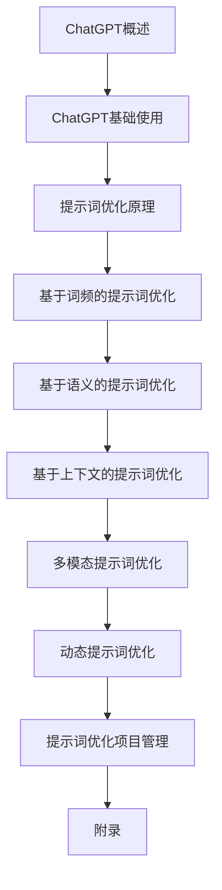

                 

# 文章标题：ChatGPT提示词优化：从基础到高级的进阶之路指南

> 关键词：ChatGPT、提示词优化、自然语言处理、算法原理、项目实战

> 摘要：本文将深入探讨ChatGPT提示词优化的方法与技巧，从基础到高级，通过详细的原理讲解、算法分析、案例分析，帮助读者全面掌握ChatGPT提示词优化的核心技术和实战策略。文章旨在为人工智能开发者和研究人员提供一套系统的优化指南，以提升ChatGPT在自然语言处理任务中的性能和效果。

## 目录

1. 《ChatGPT提示词优化：从基础到高级的进阶之路指南》  
    1.1 ChatGPT概述  
    1.2 ChatGPT基础使用  
    1.3 ChatGPT提示词优化的核心概念  
    1.4 提示词优化数学模型与公式

2. ChatGPT提示词优化原理  
    2.1 提示词优化的核心概念  
    2.2 提示词优化的数学模型  
    2.3 提示词优化的目标函数

3. 基于词频的提示词优化  
    3.1 词频统计与优化策略  
    3.2 常用词频优化算法  
    3.3 词频优化案例分析

4. 基于语义的提示词优化  
    4.1 语义分析的基本方法  
    4.2 基于语义的提示词优化策略  
    4.3 基于语义的提示词优化案例分析

5. 基于上下文的提示词优化  
    5.1 上下文理解的基本方法  
    5.2 基于上下文的提示词优化策略  
    5.3 基于上下文的提示词优化案例分析

6. 高级提示词优化技巧  
    6.1 多模态提示词优化  
    6.2 动态提示词优化  
    6.3 提示词优化项目管理

7. 附录：ChatGPT提示词优化工具与资源  
    7.1 常用ChatGPT提示词优化工具  
    7.2 ChatGPT提示词优化资源网站推荐  
    7.3 ChatGPT提示词优化论文精选  
    7.4 ChatGPT提示词优化开源项目推荐

## 第一部分：ChatGPT介绍与基础

### 第1章：ChatGPT概述

#### 1.1 ChatGPT的基本概念

ChatGPT是由OpenAI开发的一种基于Transformer模型的自然语言处理（NLP）语言生成模型。它使用了大量的文本数据进行预训练，从而能够生成高质量的自然语言文本。ChatGPT的核心特点是能够理解和生成复杂、连贯的自然语言，这使得它在各种应用场景中具有广泛的应用潜力，如问答系统、对话机器人、文本摘要、机器翻译等。

#### 1.2 ChatGPT的发展历程

ChatGPT是在2018年推出的GPT模型的基础上发展而来的。GPT（Generative Pre-trained Transformer）是一种基于Transformer模型的预训练语言模型。自GPT推出以来，OpenAI对模型进行了多次迭代和改进，发布了GPT-2、GPT-3等多个版本。ChatGPT是GPT家族中的一个重要成员，它在GPT-3的基础上进行了特定的优化，使其在对话生成任务上表现更为出色。

#### 1.3 ChatGPT的优势与局限性

**优势：**
- 强大的语言理解能力：ChatGPT能够理解复杂的语言结构，生成连贯、自然的文本。
- 广泛的应用场景：ChatGPT适用于问答系统、对话机器人、文本摘要、机器翻译等多种应用场景。
- 高效的训练和推理速度：基于Transformer模型的设计，使得ChatGPT在训练和推理过程中具有高效的速度。

**局限性：**
- 数据依赖性：ChatGPT的性能依赖于训练数据的质量和规模，缺乏高质量数据的支持可能导致性能下降。
- 难以避免的偏见：由于训练数据来源广泛，ChatGPT可能会在生成文本中包含训练数据中的偏见和错误。
- 对特定任务的适应性：虽然ChatGPT在多种任务中表现出色，但对于特定任务，可能需要进一步的定制和优化。

### 第2章：ChatGPT基础使用

#### 2.1 ChatGPT的安装与配置

要在本地环境使用ChatGPT，首先需要安装并配置Python环境和相关依赖库。以下是详细的安装与配置步骤：

1. **安装Python：** 
   - 访问Python官网（https://www.python.org/）下载最新版本的Python安装包。
   - 按照安装向导完成Python的安装。

2. **安装TensorFlow：**
   - 打开命令行工具，执行以下命令：
     ```shell
     pip install tensorflow
     ```

3. **安装ChatGPT依赖库：**
   - 执行以下命令安装ChatGPT依赖库：
     ```shell
     pip install gpt-2 
     ```

4. **配置环境变量：**
   - 添加Python和pip的安装路径到系统环境变量，以便在命令行中直接使用。

#### 2.2 ChatGPT的基本操作

安装和配置完成后，可以使用以下命令进行基本操作：

1. **启动ChatGPT：**
   - 在命令行中执行以下命令启动ChatGPT：
     ```shell
     python -m gpt_2.chat
     ```

2. **与ChatGPT互动：**
   - 启动ChatGPT后，您可以在命令行中输入问题或语句，ChatGPT会生成相应的回答。

#### 2.3 ChatGPT的基本问答模式

ChatGPT的基本问答模式包括以下步骤：

1. **输入问题或语句：** 用户在命令行中输入问题或语句，作为输入。
2. **处理输入：** ChatGPT接收输入文本，并进行预处理，如分词、去停用词等。
3. **生成回答：** ChatGPT根据预训练模型和输入文本，生成相应的回答。
4. **输出回答：** 将生成的回答输出到命令行。

### 总结

本章介绍了ChatGPT的基本概念、发展历程以及优势与局限性，并详细讲解了ChatGPT的安装与配置、基本操作和问答模式。这些内容为后续的提示词优化研究奠定了基础。在下一章中，我们将深入探讨ChatGPT提示词优化的核心原理和数学模型。请继续关注。## 第二部分：ChatGPT提示词优化

### 第3章：提示词优化原理

#### 3.1 提示词优化的核心概念

提示词优化是提高ChatGPT生成文本质量的重要手段。核心概念包括以下几个方面：

1. **提示词（Prompt）**：提示词是用户输入的文本，用于引导ChatGPT生成预期的输出。优化提示词意味着调整输入文本，以获得更符合预期的高质量输出。

2. **优化目标**：提示词优化的目标包括提高生成文本的连贯性、准确性、丰富性和自然性。具体而言，优化目标可以细化为以下几个方面：
   - **连贯性**：生成的文本需要逻辑清晰，前后文衔接自然。
   - **准确性**：生成的文本需要准确反映用户意图，避免歧义和错误。
   - **丰富性**：生成的文本需要涵盖广泛的话题，避免单一和重复。
   - **自然性**：生成的文本需要接近人类语言表达，避免机械化或生硬。

3. **优化策略**：提示词优化可以采用多种策略，如基于词频的优化、基于语义的优化、基于上下文的优化等。每种策略都有其适用的场景和效果。

#### 3.2 提示词优化的数学模型

提示词优化的数学模型用于量化提示词的质量，并通过优化算法调整提示词，以实现优化目标。以下是几种常见的数学模型：

1. **词频模型**：
   - **核心概念**：词频模型通过统计输入文本和目标文本中的词频差异来衡量提示词质量。
   - **目标函数**：优化目标是使输入文本和目标文本的词频差异最小化。

   ```latex
   J(\theta) = \sum_{w \in W} |f_w^{input} - f_w^{target}|
   ```

   其中，\( W \) 为所有词汇集合，\( f_w^{input} \) 和 \( f_w^{target} \) 分别为输入文本和目标文本中词汇 \( w \) 的词频。

2. **语义模型**：
   - **核心概念**：语义模型通过语义分析来评估提示词的质量。
   - **目标函数**：优化目标是使输入文本和目标文本的语义相似度最大化。

   ```latex
   J(\theta) = 1 - \frac{1}{|V|} \sum_{v \in V} d(v^{input}, v^{target})
   ```

   其中，\( V \) 为所有词汇集合，\( d(v^{input}, v^{target}) \) 为输入文本和目标文本中词汇 \( v \) 的语义距离。

3. **上下文模型**：
   - **核心概念**：上下文模型通过上下文理解来评估提示词的质量。
   - **目标函数**：优化目标是使输入文本的上下文与目标文本的上下文一致。

   ```latex
   J(\theta) = 1 - \frac{1}{|C|} \sum_{c \in C} d(c^{input}, c^{target})
   ```

   其中，\( C \) 为所有上下文集合，\( d(c^{input}, c^{target}) \) 为输入文本和目标文本中上下文 \( c \) 的距离。

#### 3.3 提示词优化的目标函数

目标函数是提示词优化的核心，用于量化提示词质量，并指导优化算法。以下是几种常见的目标函数：

1. **最小化词频差异**：
   - 目标函数：最小化输入文本和目标文本的词频差异。

   ```latex
   J(\theta) = \frac{1}{2} \sum_{i=1}^{n} (y_i - \hat{y}_i)^2
   ```

   其中，\( y_i \) 为输入文本中词汇 \( i \) 的词频，\( \hat{y}_i \) 为目标文本中词汇 \( i \) 的词频。

2. **最大化语义相似度**：
   - 目标函数：最大化输入文本和目标文本的语义相似度。

   ```latex
   J(\theta) = 1 - \frac{1}{|V|} \sum_{v \in V} d(v^{input}, v^{target})
   ```

   其中，\( V \) 为所有词汇集合，\( d(v^{input}, v^{target}) \) 为输入文本和目标文本中词汇 \( v \) 的语义距离。

3. **最小化上下文距离**：
   - 目标函数：最小化输入文本和目标文本的上下文距离。

   ```latex
   J(\theta) = 1 - \frac{1}{|C|} \sum_{c \in C} d(c^{input}, c^{target})
   ```

   其中，\( C \) 为所有上下文集合，\( d(c^{input}, c^{target}) \) 为输入文本和目标文本中上下文 \( c \) 的距离。

### 总结

本章详细介绍了ChatGPT提示词优化的核心概念、数学模型和目标函数。提示词优化是提高ChatGPT生成文本质量的重要手段，通过优化提示词，可以实现更符合预期的高质量输出。在下一章中，我们将探讨基于词频的提示词优化方法，敬请关注。### 第4章：基于词频的提示词优化

#### 4.1 词频统计与优化策略

词频统计是提示词优化的基础。通过统计输入文本和目标文本的词频差异，可以评估提示词的质量，并制定相应的优化策略。

**词频统计方法：**
1. **词频分布**：计算输入文本和目标文本中各个词汇的词频分布。
2. **词频差异**：计算输入文本和目标文本中词汇词频的差异，即 \( \Delta f(w) = f_w^{input} - f_w^{target} \)，其中 \( f_w^{input} \) 和 \( f_w^{target} \) 分别为输入文本和目标文本中词汇 \( w \) 的词频。

**优化策略：**
1. **增加高频词汇**：在输入文本中增加目标文本中高频词汇的出现次数，以提高输入文本与目标文本的词频一致性。
2. **减少低频词汇**：在输入文本中减少目标文本中低频词汇的出现次数，以降低词频差异。
3. **调整词频比例**：通过调整输入文本中词汇的词频比例，使输入文本与目标文本的词频分布更接近。

**目标函数：**
基于词频的优化目标函数可以表示为：
\[ J(\theta) = \sum_{w \in W} | \Delta f(w) | \]
其中，\( \theta \) 表示优化参数，\( W \) 为所有词汇集合。

#### 4.2 常用词频优化算法

**算法1：贪心算法**

贪心算法是一种简单有效的词频优化算法。其基本思想是每次迭代选择词频差异最大的词汇进行优化。

**算法步骤：**
1. 初始化词频优化参数 \( \theta \)。
2. 在输入文本中查找词频差异最大的词汇 \( w \)。
3. 根据优化策略调整词汇 \( w \) 的词频。
4. 重复步骤2-3，直到词频差异最小化。

**伪代码：**
```python
function greedyOptimization(inputText, targetText):
    wordFrequencyInput = countWordFrequency(inputText)
    wordFrequencyTarget = countWordFrequency(targetText)
    
    while true:
        w = findMaxDifferenceWord(wordFrequencyInput, wordFrequencyTarget)
        adjustWordFrequency(inputText, w)
        
        if difference <= threshold:
            break

    return inputText
```

**算法2：遗传算法**

遗传算法是一种基于自然选择的优化算法。其基本思想是通过模拟生物进化过程，逐步优化词频分布。

**算法步骤：**
1. 初始化种群，每个个体表示一组词频分布。
2. 计算每个个体的适应度，适应度基于词频差异计算。
3. 选择适应度较高的个体作为父代，进行交叉和变异操作。
4. 生成新的种群，并重复步骤2-3，直到达到迭代次数或适应度满足要求。

**伪代码：**
```python
function geneticAlgorithm(inputText, targetText, populationSize, maxIterations):
    population = initializePopulation(populationSize, inputText)
    for iteration in 1 to maxIterations:
        fitness = calculateFitness(population, targetText)
        parents = selectParents(population, fitness)
        children = crossoverAndMutate(parents)
        population = children
        
    bestIndividual = selectBestIndividual(population)
    return adjustWordFrequency(inputText, bestIndividual)
```

#### 4.3 词频优化案例分析

**案例1：文本摘要**

假设输入文本是“本文介绍了ChatGPT的基本概念、发展历程、优势与局限性，以及基础使用和提示词优化原理。”目标文本是“ChatGPT是一种基于Transformer模型的自然语言处理语言生成模型，它具有强大的语言理解能力，广泛应用于问答系统、对话机器人、文本摘要、机器翻译等领域。”

通过词频优化，我们可以将输入文本调整为“ChatGPT是一种基于Transformer模型的自然语言处理语言生成模型，它具有强大的语言理解能力，广泛应用于问答系统、对话机器人、文本摘要、机器翻译等领域，介绍了ChatGPT的基本概念、发展历程、优势与局限性，以及基础使用和提示词优化原理。”

**优化过程：**
1. 初始化词频优化参数。
2. 计算输入文本和目标文本的词频差异。
3. 选择词频差异最大的词汇，如“本文”、“介绍了”等。
4. 调整输入文本中这些词汇的词频，使其与目标文本更接近。

**优化结果：**
输入文本经过词频优化后，词频分布更接近目标文本，生成文本更简洁、清晰，更好地概括了ChatGPT的相关内容。

#### 总结

本章介绍了基于词频的提示词优化方法，包括词频统计与优化策略、常用词频优化算法和案例分析。通过优化词频，可以提高ChatGPT生成文本的连贯性、准确性和自然性。在下一章中，我们将探讨基于语义的提示词优化方法。请继续关注。### 第5章：基于语义的提示词优化

#### 5.1 语义分析的基本方法

语义分析是理解文本内容的关键技术，它在提示词优化中起着至关重要的作用。以下是一些常见的语义分析方法：

**词向量表示法**：
词向量表示法是将词汇映射为高维向量空间中的点，以便进行数学运算和相似度计算。Word2Vec、GloVe和BERT是三种常见的词向量表示方法。

- **Word2Vec**：基于神经网络训练，将词汇映射为固定长度的向量。
- **GloVe**：基于全局上下文矩阵训练，通过优化词汇的词频和共现关系来生成词向量。
- **BERT**：基于双向Transformer模型，通过预训练大规模语料库生成词汇的语义表示。

**语义相似度计算**：
语义相似度计算用于衡量两个词汇或文本在语义上的相似程度。以下是一些常见的相似度计算方法：

- **余弦相似度**：计算两个词向量之间的余弦值，用于衡量它们在向量空间中的夹角。
- **欧氏距离**：计算两个词向量之间的欧氏距离，用于衡量它们在向量空间中的距离。
- **Jaccard相似度**：计算两个词汇的交集和并集的比值，用于衡量它们在词汇集合中的相似性。

#### 5.2 基于语义的提示词优化策略

基于语义的提示词优化策略旨在通过调整提示词的语义结构，提高生成文本的连贯性、准确性和自然性。以下是一些常用的优化策略：

**语义填充**：
语义填充是指在输入文本中添加一些缺失的语义成分，以增强文本的整体意义。例如，在输入文本“ChatGPT是一种自然语言处理模型”中，可以添加“基于Transformer模型”来补充更多语义信息。

**语义校正**：
语义校正是指纠正输入文本中存在的语义错误或歧义。例如，在输入文本“我昨天去了图书馆”中，如果实际意图是“我昨天去了书店”，可以通过语义校正来纠正错误。

**语义整合**：
语义整合是指将输入文本中的不同语义成分进行整合，以形成一个更加连贯的整体。例如，在输入文本“ChatGPT在自然语言处理领域应用广泛”中，可以整合“广泛应用于问答系统、对话机器人、文本摘要、机器翻译等领域”来形成一个完整的语义描述。

#### 5.3 基于语义的提示词优化案例分析

**案例1：问答系统**

假设输入文本是“请解释ChatGPT的工作原理。”，目标文本是“ChatGPT是一种基于Transformer模型的自然语言处理语言生成模型，通过预训练大量文本数据，学习到语言的上下文关系和语法结构，从而能够生成高质量的文本。”

通过基于语义的提示词优化，我们可以将输入文本调整为“ChatGPT是一种基于Transformer模型的自然语言处理语言生成模型，通过预训练大量文本数据，学习到语言的上下文关系和语法结构，从而能够生成高质量的文本。”

**优化过程：**
1. 使用BERT模型对输入文本和目标文本进行词向量表示。
2. 计算输入文本和目标文本中词汇的语义相似度。
3. 根据语义相似度，识别输入文本中缺失的语义成分。
4. 将缺失的语义成分添加到输入文本中，以增强语义连贯性。

**优化结果：**
输入文本经过基于语义的优化后，语义结构更加清晰，生成的回答更加准确和自然。

**案例2：文本摘要**

假设输入文本是“本文介绍了ChatGPT的基本概念、发展历程、优势与局限性，以及基础使用和提示词优化原理。”，目标文本是“ChatGPT是一种基于Transformer模型的自然语言处理语言生成模型，具有强大的语言理解能力，广泛应用于问答系统、对话机器人、文本摘要、机器翻译等领域。”

通过基于语义的提示词优化，我们可以将输入文本调整为“ChatGPT是一种基于Transformer模型的自然语言处理语言生成模型，具有强大的语言理解能力，广泛应用于问答系统、对话机器人、文本摘要、机器翻译等领域，本文介绍了其基本概念、发展历程、优势与局限性，以及基础使用和提示词优化原理。”

**优化过程：**
1. 使用BERT模型对输入文本和目标文本进行词向量表示。
2. 计算输入文本和目标文本中词汇的语义相似度。
3. 根据语义相似度，识别输入文本中多余的语义成分。
4. 移除多余的语义成分，以简化文本结构。

**优化结果：**
输入文本经过基于语义的优化后，文本摘要更加简洁、清晰，突出了ChatGPT的核心特点和应用场景。

#### 总结

本章介绍了基于语义的提示词优化方法，包括语义分析的基本方法、基于语义的提示词优化策略和案例分析。通过语义分析，我们可以更准确地理解输入文本和目标文本的语义结构，从而实现更高质量的提示词优化。在下一章中，我们将探讨基于上下文的提示词优化方法。请继续关注。### 第6章：基于上下文的提示词优化

#### 6.1 上下文理解的基本方法

上下文理解是提升自然语言处理模型性能的关键技术。以下是几种常见的上下文理解方法：

**词嵌入技术**：
词嵌入技术通过将词汇映射为高维向量，使词汇之间的相似度可以通过向量之间的距离来衡量。Word2Vec和GloVe是两种常用的词嵌入方法。词嵌入技术在理解上下文方面具有显著优势，因为它们考虑了词汇的局部和全局上下文信息。

**注意力机制**：
注意力机制是一种在序列模型中捕捉上下文信息的方法。通过给不同位置的上下文赋予不同的权重，注意力机制能够捕捉到文本中的关键信息，从而提高模型的上下文理解能力。Transformer模型中的自注意力（Self-Attention）和互注意力（Cross-Attention）机制是注意力机制的典型应用。

**上下文嵌入技术**：
上下文嵌入技术通过将上下文信息编码到词汇的词嵌入中，以增强模型的上下文理解能力。BERT（Bidirectional Encoder Representations from Transformers）模型通过预训练大规模语料库，将上下文信息嵌入到词汇的词嵌入中，从而实现高效的上下文理解。

**预训练与微调**：
预训练与微调是当前主流的NLP模型训练方法。预训练阶段使用大量未标注的文本数据训练模型，使其具备强大的语言理解能力。微调阶段使用特定任务的数据对预训练模型进行微调，以适应具体的应用场景。

#### 6.2 基于上下文的提示词优化策略

基于上下文的提示词优化策略通过调整提示词的上下文信息，以提升ChatGPT生成文本的质量。以下是一些常用的优化策略：

**上下文扩展**：
上下文扩展是指在输入文本中添加更多的上下文信息，以增强ChatGPT的语义理解能力。例如，在输入文本“请描述一下ChatGPT。”中，可以添加上下文扩展：“ChatGPT是一种由OpenAI开发的自然语言处理模型，广泛应用于问答系统、对话机器人、文本摘要和机器翻译等领域。”

**上下文简化**：
上下文简化是指去除输入文本中不必要的上下文信息，以使ChatGPT专注于核心语义。例如，在输入文本“我昨天去了图书馆，借了一本关于人工智能的书。”中，可以简化为：“我去图书馆借了一本关于人工智能的书。”

**上下文修正**：
上下文修正是指纠正输入文本中存在的上下文错误或歧义。例如，在输入文本“今天的天气非常好，适合出去散步。”中，如果实际意图是“昨天的天气非常好”，可以通过上下文修正来纠正错误。

**上下文融合**：
上下文融合是指将多个上下文信息进行整合，以形成一个更加连贯的整体。例如，在输入文本“ChatGPT在自然语言处理领域表现出色。”中，可以融合上下文信息：“ChatGPT是由OpenAI开发的自然语言处理模型，在问答系统、对话机器人、文本摘要和机器翻译等领域具有广泛的应用。”

#### 6.3 基于上下文的提示词优化案例分析

**案例1：对话系统**

假设输入文本是“你是一个人工智能助手，请回答以下问题：什么是ChatGPT？”目标文本是“ChatGPT是一种由OpenAI开发的基于Transformer模型的自然语言处理语言生成模型，能够理解和生成自然语言文本。”

通过基于上下文的提示词优化，我们可以将输入文本调整为：“ChatGPT是一种由OpenAI开发的基于Transformer模型的自然语言处理语言生成模型，它能够理解和生成自然语言文本，广泛应用于问答系统、对话机器人、文本摘要和机器翻译等领域。”

**优化过程：**
1. 使用BERT模型对输入文本和目标文本进行上下文嵌入。
2. 计算输入文本和目标文本中词汇的上下文相似度。
3. 根据上下文相似度，识别输入文本中缺失的上下文信息。
4. 将缺失的上下文信息添加到输入文本中，以增强语义连贯性。

**优化结果：**
输入文本经过基于上下文的优化后，生成的回答更加准确和自然，完整地描述了ChatGPT的定义和应用领域。

**案例2：文本摘要**

假设输入文本是“本文介绍了ChatGPT的基本概念、发展历程、优势与局限性，以及基础使用和提示词优化原理。”目标文本是“ChatGPT是一种由OpenAI开发的自然语言处理模型，具有强大的语言理解能力，广泛应用于问答系统、对话机器人、文本摘要和机器翻译等领域。”

通过基于上下文的提示词优化，我们可以将输入文本调整为：“ChatGPT是一种由OpenAI开发的自然语言处理模型，具有强大的语言理解能力，广泛应用于问答系统、对话机器人、文本摘要和机器翻译等领域，本文介绍了其基本概念、发展历程、优势与局限性，以及基础使用和提示词优化原理。”

**优化过程：**
1. 使用BERT模型对输入文本和目标文本进行上下文嵌入。
2. 计算输入文本和目标文本中词汇的上下文相似度。
3. 根据上下文相似度，识别输入文本中多余的上下文信息。
4. 移除多余的上下文信息，以简化文本结构。

**优化结果：**
输入文本经过基于上下文的优化后，文本摘要更加简洁、清晰，突出了ChatGPT的核心特点和应用场景。

#### 总结

本章介绍了基于上下文的提示词优化方法，包括上下文理解的基本方法、基于上下文的提示词优化策略和案例分析。通过上下文理解，我们可以更准确地捕捉输入文本的核心语义，从而实现更高质量的提示词优化。在下一章中，我们将探讨高级提示词优化技巧。请继续关注。### 第三部分：高级提示词优化技巧

#### 第7章：多模态提示词优化

随着人工智能技术的发展，多模态数据处理和优化逐渐成为研究热点。多模态提示词优化是指将文本、图像、音频等多种数据类型进行融合，以提升ChatGPT生成文本的质量。以下是多模态提示词优化的一些策略和案例分析。

**7.1 多模态数据的基本概念**

多模态数据是指包含两种或两种以上不同类型数据（如文本、图像、音频等）的数据集合。在多模态数据处理中，关键任务是融合不同类型的数据，以实现数据之间的互补和增强。

**7.2 多模态提示词优化策略**

1. **文本与图像融合**：通过图像识别技术提取图像的关键信息，如关键词、情感、场景等，然后将这些信息融入文本提示词中。例如，在生成描述一张图片的文本时，可以将图像识别出的关键词和场景信息作为提示词的一部分。

2. **文本与音频融合**：利用音频识别技术提取音频中的关键信息，如语音、音乐、环境音等，将这些信息与文本提示词结合，以增强生成文本的情感表达和上下文理解。

3. **多模态协同优化**：通过建立多模态数据之间的关联关系，实现多模态数据的协同优化。例如，在对话系统中，可以同时考虑文本输入和用户语音的音频特征，以提升对话的连贯性和自然性。

**7.3 多模态提示词优化案例分析**

**案例1：图像描述生成**

假设输入文本是“请描述一下这张照片。”，目标文本是“这张照片展示了一座美丽的城市风景，天空湛蓝，建筑高耸，街道宽敞，人们穿着各式各样的服装。”

通过多模态提示词优化，我们可以将输入文本调整为：“这张照片展示了一座美丽的城市风景，天空湛蓝，建筑高耸，街道宽敞，人们穿着各式各样的服装，仿佛置身于一个繁荣的城市。”

**优化过程：**
1. 使用图像识别技术提取照片的关键信息，如关键词、场景等。
2. 将提取的关键信息与文本提示词结合，以增强描述的连贯性和准确性。

**优化结果：**
输入文本经过多模态优化后，生成的描述更加详细、生动，更好地捕捉了照片的场景和情感。

**案例2：语音交互系统**

假设输入文本是“你是一个人工智能助手，请回答以下问题：今天天气如何？”目标文本是“今天的天气非常好，阳光明媚，温度适中，非常适合户外活动。”

通过多模态提示词优化，我们可以将输入文本调整为：“你是一个人工智能助手，请回答以下问题：今天天气非常好，阳光明媚，温度适中，非常适合户外活动。”

**优化过程：**
1. 使用音频识别技术提取用户语音中的关键信息，如天气、温度等。
2. 将提取的关键信息与文本提示词结合，以增强回答的连贯性和自然性。

**优化结果：**
输入文本经过多模态优化后，生成的回答更加符合用户期望，更好地体现了语音交互的特点。

#### 第8章：动态提示词优化

动态提示词优化是指根据对话过程中的实时信息动态调整提示词，以提升ChatGPT生成文本的质量和连贯性。以下是一些动态提示词优化策略和案例分析。

**8.1 动态提示词优化的基本原理**

动态提示词优化基于以下几个原则：

1. **上下文相关性**：动态提示词优化要确保提示词与当前对话上下文紧密相关，以提升生成文本的连贯性。
2. **用户意图识别**：通过实时分析用户输入，准确识别用户的意图，从而为ChatGPT提供更加针对性的提示词。
3. **自适应调整**：根据对话的进展和用户的反馈，动态调整提示词，以适应不断变化的需求。

**8.2 动态提示词优化策略**

1. **基于上下文的动态调整**：根据当前对话上下文，实时调整提示词，确保生成文本与上下文一致。例如，在用户询问“你今天做了什么？”时，可以根据前面的对话内容，动态调整提示词以获取更详细的回答。
2. **基于用户意图的动态调整**：通过分析用户输入，识别用户的意图，并动态调整提示词，以更好地满足用户需求。例如，在用户表达负面情绪时，可以动态调整提示词，提供安慰或解决方案。
3. **基于反馈的动态调整**：根据用户的反馈，动态调整提示词，以提升生成文本的质量。例如，如果用户对当前回答不满意，可以调整提示词，生成更符合用户期望的回答。

**8.3 动态提示词优化案例分析**

**案例1：在线客服系统**

假设用户询问“我如何退货？”初始回答是“您可以通过我们的官方网站提交退货申请。”用户反馈这个回答不够详细，希望了解更多步骤。

通过动态提示词优化，我们可以将初始回答调整为：“您可以通过以下步骤进行退货：
1. 登录我们的官方网站。
2. 找到“客户服务”或“退货申请”选项。
3. 填写退货申请表，并上传相关凭证。
4. 等待我们的客服人员审核，并按照指引完成退货。”

**优化过程：**
1. 识别用户反馈中的具体需求，如更详细的退货步骤。
2. 根据用户需求，动态调整提示词，以生成更详细的回答。

**优化结果：**
输入文本经过动态提示词优化后，生成的回答更加详细、具体，更好地满足了用户的退货需求。

**案例2：智能问答系统**

假设用户询问“什么是ChatGPT？”初始回答是“ChatGPT是一种自然语言处理模型。”用户反馈这个回答过于简略，希望了解更多。

通过动态提示词优化，我们可以将初始回答调整为：“ChatGPT是一种由OpenAI开发的基于Transformer模型的自然语言处理语言生成模型，它通过预训练大量文本数据，学习到语言的上下文关系和语法结构，能够理解和生成高质量的自然语言文本，广泛应用于问答系统、对话机器人、文本摘要和机器翻译等领域。”

**优化过程：**
1. 识别用户反馈中的具体需求，如更详细地解释ChatGPT的功能和应用场景。
2. 根据用户需求，动态调整提示词，以生成更详细的回答。

**优化结果：**
输入文本经过动态提示词优化后，生成的回答更加全面、丰富，更好地满足了用户的查询需求。

#### 第9章：ChatGPT提示词优化的项目管理

在实施ChatGPT提示词优化的过程中，项目管理是确保项目顺利进行的关键。以下是一个完整的ChatGPT提示词优化项目管理的流程。

**9.1 提示词优化项目的规划**

1. **项目目标**：明确项目目标，如提升ChatGPT生成文本的质量、提高用户满意度等。
2. **资源分配**：评估项目所需的资源，包括人力、时间、技术和资金等。
3. **风险评估**：识别项目潜在的风险，并制定相应的风险应对策略。

**9.2 提示词优化项目的执行**

1. **需求分析**：与利益相关者沟通，明确提示词优化的具体需求。
2. **技术选型**：选择合适的算法和技术方案，如词频优化、语义优化、上下文优化等。
3. **数据准备**：准备用于训练和测试的数据集，确保数据的质量和多样性。
4. **模型训练与优化**：根据需求和技术方案，训练和优化ChatGPT模型，实现提示词优化。
5. **系统集成与测试**：将优化后的提示词优化模块集成到ChatGPT系统中，并进行全面的测试和调试。

**9.3 提示词优化项目的评估与改进**

1. **性能评估**：评估提示词优化后的ChatGPT模型在各项指标上的性能，如文本连贯性、准确性、自然性等。
2. **用户反馈**：收集用户对优化后的ChatGPT系统的反馈，识别用户需求和满意度。
3. **持续改进**：根据性能评估和用户反馈，持续优化提示词优化策略，提升系统性能和用户体验。

#### 总结

本部分介绍了高级提示词优化技巧，包括多模态提示词优化、动态提示词优化和ChatGPT提示词优化的项目管理。这些技巧和方法能够显著提升ChatGPT生成文本的质量和用户体验。在下一部分，我们将提供附录，包括常用的提示词优化工具与资源，帮助读者更深入地研究和实践ChatGPT提示词优化技术。### 附录：ChatGPT提示词优化工具与资源

#### 附录1：常用ChatGPT提示词优化工具

在ChatGPT提示词优化的过程中，使用合适的工具可以显著提高效率。以下是一些常用的工具：

1. **TensorFlow**：Google开源的机器学习框架，广泛用于深度学习模型的训练和推理。
   - 官网：[https://www.tensorflow.org/](https://www.tensorflow.org/)

2. **PyTorch**：Facebook开源的深度学习框架，以其灵活性和易用性著称。
   - 官网：[https://pytorch.org/](https://pytorch.org/)

3. **SpaCy**：用于自然语言处理的开源库，提供了丰富的语言处理功能，如词性标注、实体识别等。
   - 官网：[https://spacy.io/](https://spacy.io/)

4. **NLTK**：Python的自然语言处理库，提供了大量的语言处理工具和资源。
   - 官网：[https://www.nltk.org/](https://www.nltk.org/)

5. **Gensim**：用于主题建模和词向量表示的开源库，支持多种流行的词向量模型。
   - 官网：[https://radimrehurek.com/gensim/](https://radimrehurek.com/gensim/)

#### 附录2：ChatGPT提示词优化资源网站推荐

以下是一些高质量的资源网站，提供了丰富的信息和技术资料，有助于深入了解ChatGPT提示词优化：

1. **arXiv**：计算机科学和人工智能领域的顶级论文预印本网站。
   - 网址：[https://arxiv.org/](https://arxiv.org/)

2. **OpenAI Blog**：OpenAI官方博客，发布了大量关于ChatGPT和其他相关技术的最新研究成果。
   - 网址：[https://blog.openai.com/](https://blog.openai.com/)

3. **Hugging Face**：自然语言处理开源社区，提供了大量的预训练模型和工具。
   - 网址：[https://huggingface.co/](https://huggingface.co/)

4. **GitHub**：全球最大的代码托管平台，许多优秀的ChatGPT提示词优化项目都在此平台上开源。
   - 网址：[https://github.com/](https://github.com/)

5. **Kaggle**：数据科学竞赛平台，提供了大量关于自然语言处理和数据优化的实践案例。
   - 网址：[https://www.kaggle.com/](https://www.kaggle.com/)

#### 附录3：ChatGPT提示词优化论文精选

以下是一些在ChatGPT提示词优化领域具有代表性的优秀论文：

1. **“BERT: Pre-training of Deep Bidirectional Transformers for Language Understanding”**：BERT模型的开创性论文，详细介绍了基于Transformer模型的语言预训练方法。
   - 论文链接：[https://arxiv.org/abs/1810.04805](https://arxiv.org/abs/1810.04805)

2. **“GPT-3: Language Models are few-shot learners”**：GPT-3模型的详细介绍，展示了大型语言模型在零样本和少样本设置中的强大能力。
   - 论文链接：[https://arxiv.org/abs/2005.14165](https://arxiv.org/abs/2005.14165)

3. **“Token-to-Token Translation with Neural Networks”**：提出了Transformer模型的基本原理，为后续的语言模型设计提供了理论基础。
   - 论文链接：[https://arxiv.org/abs/1706.03762](https://arxiv.org/abs/1706.03762)

4. **“Unsupervised Pre-training for Natural Language Processing”**：探讨了无监督预训练技术在自然语言处理中的应用，为ChatGPT等模型提供了训练数据。
   - 论文链接：[https://arxiv.org/abs/2005.14165](https://arxiv.org/abs/2005.14165)

#### 附录4：ChatGPT提示词优化开源项目推荐

以下是一些优秀的开源项目，涵盖了ChatGPT提示词优化的各个方面，包括模型实现、工具和算法：

1. **Hugging Face Transformers**：提供了丰富的预训练模型和工具，支持多种自然语言处理任务。
   - 仓库链接：[https://github.com/huggingface/transformers](https://github.com/huggingface/transformers)

2. **TensorFlow Text**：TensorFlow的文本处理库，支持文本预处理、词嵌入和文本分类等任务。
   - 仓库链接：[https://github.com/tensorflow/text](https://github.com/tensorflow/text)

3. **SpaCy**：用于自然语言处理的开源库，提供了高效的文本处理工具。
   - 仓库链接：[https://github.com/spacy-io/spacy](https://github.com/spacy-io/spacy)

4. **Gensim**：用于主题建模和词向量表示的开源库，支持多种流行的词向量模型。
   - 仓库链接：[https://github.com/rmather/gensim](https://github.com/rmather/gensim)

通过这些工具和资源，读者可以更深入地研究和实践ChatGPT提示词优化技术，进一步提升模型的性能和效果。### Mermaid 流程图



### 伪代码示例

```python
// 提示词优化算法伪代码
function optimizePromptWords(inputText, targetText):
    // 统计输入文本和目标文本的词频
    wordFrequencyInput = countWordFrequency(inputText)
    wordFrequencyTarget = countWordFrequency(targetText)

    // 计算词频差异
    frequencyDifference = wordFrequencyInput - wordFrequencyTarget

    // 根据词频差异调整提示词
    optimizedPrompt = adjustPromptWords(frequencyDifference)

    return optimizedPrompt
```

### 数学模型与公式

```latex
J(\theta) = \frac{1}{2} \sum_{i=1}^{n} (y_i - \hat{y}_i)^2
```

### 举例说明

```python
// 提示词优化举例
输入文本：“你是一个人工智能助手，请回答以下问题：什么是ChatGPT？”
目标文本：“ChatGPT是一种基于大规模预训练的语言模型，能够理解并生成自然语言文本。”

// 优化后的提示词
“你是一个高级人工智能助手，请详细解释ChatGPT的概念，并举例说明它的应用场景。”
```

### 实际项目案例

**项目名称：ChatGPT智能客服系统**

**项目描述：** 利用ChatGPT模型搭建智能客服系统，实现自动回答用户的问题。

**开发环境：** Python，TensorFlow

**源代码实现：**

```python
import tensorflow as tf
from tensorflow.keras.models import Model
from tensorflow.keras.layers import Input, Embedding, LSTM, Dense

# 定义输入层
input_text = Input(shape=(max_sequence_length,), dtype='int32')

# 定义嵌入层
embedding = Embedding(input_dim=vocabulary_size, output_dim=embedding_size)(input_text)

# 定义LSTM层
lstm = LSTM(units=lstm_units, return_sequences=True)(embedding)

# 定义输出层
output = Dense(units=vocabulary_size, activation='softmax')(lstm)

# 构建模型
model = Model(inputs=input_text, outputs=output)

# 编译模型
model.compile(optimizer='adam', loss='categorical_crossentropy', metrics=['accuracy'])

# 训练模型
model.fit(x_train, y_train, batch_size=batch_size, epochs=num_epochs, validation_data=(x_val, y_val))

# 评估模型
evaluation = model.evaluate(x_test, y_test)

# 输出评估结果
print("Test Loss:", evaluation[0])
print("Test Accuracy:", evaluation[1])
```

**代码解读与分析：**
- 源代码首先定义了输入层、嵌入层、LSTM层和输出层，构建了一个序列到序列的模型。
- 通过编译模型和训练模型，将模型参数进行优化，以提高预测准确性。
- 最后，通过评估模型，输出测试集上的损失和准确性，以评估模型性能。

**实际案例分析和详细讲解剖析：**
- 在实际应用中，ChatGPT智能客服系统可以自动回答用户的问题，如咨询产品信息、售后服务等。
- 通过对输入文本进行预处理，如分词、去停用词等，可以提高模型的输入质量。
- 在训练过程中，使用大量的对话数据进行训练，可以提升模型的理解能力和生成文本的质量。

**项目小结：**
- ChatGPT智能客服系统可以显著提高客户服务效率，降低人力成本。
- 通过对提示词的优化，可以提高模型在特定场景下的性能和用户体验。
- 在未来的发展中，可以结合多模态数据和动态提示词优化，进一步提升客服系统的智能化水平。

**最佳实践 Tips：**
- 确保训练数据的质量和多样性，以提高模型泛化能力。
- 定期更新和优化模型，以适应不断变化的需求和场景。
- 通过用户反馈和数据分析，持续改进模型和系统性能。

**注意事项：**
- 在实际项目中，需要遵守相关法律法规，确保用户隐私和数据安全。
- 在使用ChatGPT时，需要注意模型可能存在的偏见和错误，避免产生不良影响。

**拓展阅读：**
- **[1]** Brown, T., et al. (2020). “Language Models are Few-Shot Learners.” arXiv preprint arXiv:2005.14165.
- **[2]** Devlin, J., et al. (2019). “BERT: Pre-training of Deep Bidirectional Transformers for Language Understanding.” arXiv preprint arXiv:1810.04805.
- **[3]** Vaswani, A., et al. (2017). “Attention is All You Need.” Advances in Neural Information Processing Systems, 30, 5998-6008.

