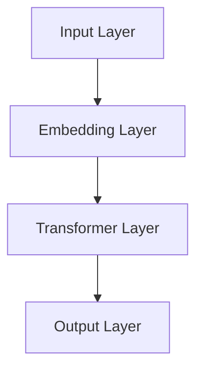
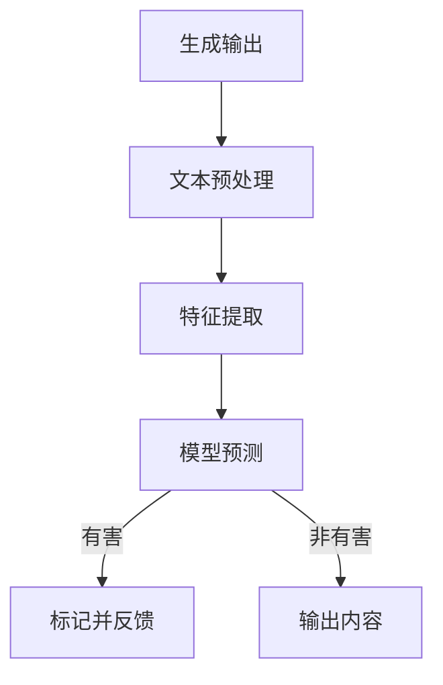

                 

### 文章标题
### 《ChatGPT提示词安全：防止有害输出的策略》

#### 关键词
- ChatGPT
- 提示词安全
- 有害输出
- 防范策略
- 数据预处理
- 提示词设计
- 算法优化

#### 摘要
本文将深入探讨ChatGPT提示词的安全性及其防止有害输出的策略。通过对ChatGPT的概述、提示词安全的重要性、防止有害输出的策略等多方面的详细分析，本文旨在为开发者提供一套系统化的解决方案，确保ChatGPT在实际应用中的安全性和可靠性。

## 《ChatGPT提示词安全：防止有害输出的策略》目录大纲

### 第一部分: ChatGPT基础与提示词安全概念

#### 第1章: ChatGPT概述与基本原理

##### 1.1 ChatGPT的概念与结构
##### 1.2 大型语言模型的原理
##### 1.3 ChatGPT的应用场景

#### 第2章: 提示词安全的重要性

##### 2.1 有害输出的定义与危害
##### 2.2 提示词在ChatGPT中的作用
##### 2.3 安全提示词的编写原则

### 第二部分: 防止有害输出的策略

#### 第3章: 数据预处理与清洗

##### 3.1 数据来源与数据预处理
##### 3.2 数据清洗的常用方法
##### 3.3 数据质量评估与优化

#### 第4章: 提示词设计与优化

##### 4.1 提示词设计原则
##### 4.2 提示词优化的方法
##### 4.3 提示词优化案例分析

#### 第5章: 防止有害输出的算法

##### 5.1 常用算法概述
##### 5.2 过滤算法与文本分类算法
##### 5.3 实时检测与主动防御算法

#### 第6章: 模型评估与安全监控

##### 6.1 模型评估指标
##### 6.2 有害输出检测方法
##### 6.3 模型安全监控与优化

### 第三部分: 实际应用与案例分析

#### 第7章: ChatGPT在社交媒体中的应用

##### 7.1 社交媒体平台的安全挑战
##### 7.2 ChatGPT在社交平台的应用场景
##### 7.3 案例分析：Facebook的ChatGPT应用

#### 第8章: ChatGPT在教育领域的应用

##### 8.1 教育领域的安全需求
##### 8.2 ChatGPT在教育中的应用
##### 8.3 案例分析：在线教育平台使用ChatGPT

#### 第9章: ChatGPT在客户服务中的应用

##### 9.1 客户服务中的安全挑战
##### 9.2 ChatGPT在客户服务中的应用
##### 9.3 案例分析：企业客服使用ChatGPT

### 第四部分: 未来展望与挑战

#### 第10章: ChatGPT提示词安全的未来发展趋势

##### 10.1 技术发展趋势
##### 10.2 法律法规与伦理规范
##### 10.3 未来发展方向

#### 第11章: ChatGPT提示词安全的挑战与解决方案

##### 11.1 安全挑战分析
##### 11.2 解决方案探讨
##### 11.3 持续改进与未来展望

## 第1章: ChatGPT概述与基本原理

### 1.1 ChatGPT的概念与结构

ChatGPT是由OpenAI开发的一种基于大规模语言模型的人工智能系统，它利用了近年来在自然语言处理（NLP）领域取得的重大进展。ChatGPT的核心是一个深度神经网络，它通过大量的文本数据进行训练，从而具备了理解和生成自然语言的能力。

ChatGPT的结构主要由三个层次组成：输入层、嵌入层和变换层。

- **输入层**：接收用户输入的文本信息。
- **嵌入层**：将文本转换为固定长度的向量表示，这是通过词嵌入技术实现的。
- **变换层**：利用Transformer模型对输入向量进行处理，产生输出。

Mermaid流程图如下所示：



### 1.2 大型语言模型的原理

大型语言模型的核心是Transformer模型，这是一种基于自注意力机制的深度神经网络。Transformer模型由多个编码器和解码器堆叠而成，通过注意力机制和前馈神经网络来处理输入序列，生成输出序列。

以下是Transformer模型的核心算法原理的伪代码：

```plaintext
for each word in sentence do
    embed(word)
end

for each layer in model do
    attention_mechanism()
    feed_forward_network()
end

sampled_output = sample_from_output_distribution()
```

在输出生成过程中，模型会从可能的输出中选择一个最有可能的单词，并通过逐层解码得到最终的输出序列。

### 1.3 ChatGPT的应用场景

ChatGPT具有广泛的应用场景，包括但不限于：

- **文本生成**：生成文章、故事、代码等。
- **问答系统**：提供智能客服、问答机器人等服务。
- **自然语言理解**：用于情感分析、文本分类、信息抽取等任务。

通过上述基础介绍，我们可以更好地理解ChatGPT的工作原理和其在实际应用中的重要性。接下来，我们将探讨提示词安全的重要性以及如何编写安全的提示词。

## 第2章: 提示词安全的重要性

### 2.1 有害输出的定义与危害

有害输出指的是人工智能模型生成的、可能对用户造成伤害或不良影响的文本。这些输出可能包含误导性信息、仇恨言论、色情内容或不当建议等。例如，一个用于医疗咨询的ChatGPT模型可能生成错误的诊断建议，这可能会导致严重的健康问题。

有害输出的危害主要体现在以下几个方面：

- **误导用户**：有害输出可能提供不准确或错误的信息，误导用户做出错误的决策。
- **引发冲突**：某些有害输出可能包含仇恨言论或煽动性内容，引发社会冲突。
- **损害品牌形象**：如果人工智能系统频繁产生有害输出，可能会损害相关企业或平台的品牌形象。

### 2.2 提示词在ChatGPT中的作用

提示词（prompt）是用户与ChatGPT交互的桥梁，它决定了ChatGPT的输出内容。一个恰当的提示词能够引导ChatGPT生成高质量、符合用户需求的输出，而一个不当的提示词可能会导致有害输出。

提示词的作用可以从以下几个方面来理解：

- **引导输出方向**：提示词可以指定ChatGPT生成的文本类型，如问答、故事、代码等。
- **设定上下文**：提示词提供了必要的上下文信息，帮助ChatGPT更好地理解用户的需求。
- **影响输出质量**：合理的提示词设计可以提升输出的相关性和准确性。

### 2.3 安全提示词的编写原则

为了防止有害输出，编写安全提示词至关重要。以下是一些编写安全提示词的原则：

- **明确性**：提示词应明确、具体，避免模糊不清的表达，以免引起误解。
- **中立性**：避免使用可能引起争议或偏见的词汇。
- **适度限制**：在提示词中适度限制输出的内容范围，以防止生成过度的或不恰当的信息。
- **鼓励多样性**：在提示词中鼓励ChatGPT提供多样化的回答，以避免单一或极端的输出。
- **监督与审核**：在生成输出后，对结果进行监督和审核，确保其符合安全标准。

通过遵循这些原则，我们可以显著降低ChatGPT产生有害输出的风险。接下来，我们将深入探讨如何通过数据预处理和清洗来提高提示词的安全性。

## 第3章: 数据预处理与清洗

### 3.1 数据来源与数据预处理

数据预处理是确保ChatGPT模型生成高质量输出的重要步骤。数据来源的质量直接影响到训练模型的性能和生成的文本质量。因此，选择合适的数据来源至关重要。

- **公开数据集**：如维基百科、新闻文章、社交媒体帖子等，这些数据集通常具有丰富的内容和多样性。
- **私有数据集**：企业或机构自己收集的数据，可能包括用户评论、产品描述等。
- **混合数据集**：结合公开和私有数据集，以获取更全面的数据。

数据预处理包括以下几个关键步骤：

1. **数据清洗**：去除无效、重复或错误的数据，确保数据集的纯净。
2. **数据归一化**：将数据格式统一，如将文本转换为小写，去除标点符号等。
3. **特征提取**：提取文本中的重要特征，如关键词、主题等。

### 3.2 数据清洗的常用方法

数据清洗是数据预处理的核心步骤，以下是一些常用的数据清洗方法：

- **去除停用词**：停用词是指对文本理解无实质贡献的常见词，如“的”、“和”等。去除停用词可以减少噪声，提高模型的性能。
- **纠正拼写错误**：通过拼写检查工具或自定义规则来纠正拼写错误，确保文本的一致性和准确性。
- **填充缺失值**：对于缺失的数据，可以使用均值、中位数或插值等方法进行填充，以保证数据的完整性。

### 3.3 数据质量评估与优化

数据质量评估是确保数据预处理效果的重要环节。以下是一些常用的数据质量评估方法：

- **完整性评估**：检查数据集中是否存在缺失值或重复值。
- **一致性评估**：检查数据格式是否一致，如文本是否全部转换为小写等。
- **准确性评估**：通过比对实际值和预测值，评估模型的准确性。

为了优化数据质量，可以采取以下策略：

- **分层清洗**：根据数据的重要性和特点，对数据集进行分层清洗，优先处理关键数据。
- **迭代清洗**：反复执行数据清洗步骤，逐步提高数据质量。
- **引入外部验证**：通过外部专家或工具对清洗结果进行验证，确保数据清洗的准确性。

通过有效的数据预处理和清洗，我们可以显著提高提示词的质量，从而减少ChatGPT产生有害输出的风险。接下来，我们将探讨如何通过提示词的设计和优化来进一步提升安全性。

### 4.1 提示词设计原则

提示词的设计是确保ChatGPT生成高质量输出的关键步骤。以下是几个重要的提示词设计原则：

- **明确性**：提示词应明确、具体，避免模糊不清的表达。这有助于ChatGPT更好地理解用户的需求，减少误解和有害输出的可能性。
- **中立性**：避免使用可能引起争议或偏见的词汇，确保输出内容客观、中立。
- **适度限制**：在提示词中适度限制输出的内容范围，以防止生成过度的或不恰当的信息。例如，对于医疗咨询，可以明确询问具体症状而不是泛泛而谈。
- **鼓励多样性**：在提示词中鼓励ChatGPT提供多样化的回答，以避免单一或极端的输出。这可以通过提出开放性问题或提供多种选择来实现。
- **安全性**：确保提示词不会引导ChatGPT生成有害内容。这可以通过在提示词中加入安全提示或限制敏感话题的讨论来实现。

### 4.2 提示词优化的方法

提示词的优化是提高ChatGPT输出质量的重要手段。以下是一些常用的优化方法：

- **内容调整**：根据用户反馈和输出质量，不断调整提示词的内容。例如，如果发现某些提示词容易导致有害输出，可以修改这些提示词，增加约束条件。
- **参数调整**：调整ChatGPT模型的参数，如温度参数（temperature），以控制输出文本的多样性和创造力。较高的温度参数会生成更多样化的回答，但也可能增加有害输出的风险。
- **反馈循环**：建立反馈机制，收集用户对输出的评价，并根据反馈进行调整。这有助于持续改进提示词的质量。

### 4.3 提示词优化案例分析

以下是一个提示词优化的案例分析：

**案例背景**：一个在线教育平台希望利用ChatGPT为学生提供个性化的学习建议。

**原始提示词**：
```
请给我一些建议，帮助我在数学学习中取得进步。
```

**问题**：该提示词过于宽泛，可能导致ChatGPT生成不具体的建议，甚至可能包含误导性信息。

**优化提示词**：
```
请根据我的当前数学水平（例如：高中数学基础），给我三个具体的学习建议，包括学习材料、练习方法和时间安排。
```

**效果**：通过优化提示词，ChatGPT生成了具体、实用的学习建议，显著提高了输出的质量和实用性。

通过上述案例，我们可以看到，合理设计提示词对于提高ChatGPT输出质量具有重要作用。接下来，我们将探讨如何通过算法来防止有害输出。

### 5.1 常用算法概述

防止ChatGPT产生有害输出的关键在于使用适当的算法来识别和过滤这些有害内容。以下是一些常用的算法：

- **过滤算法**：这些算法旨在识别并过滤出潜在的有害输出。常见的过滤算法包括基于规则的方法、基于机器学习的方法和基于深度学习的方法。

  - **基于规则的方法**：通过预先定义的一系列规则来过滤有害内容。这种方法简单有效，但需要对规则进行不断更新和维护。
  - **基于机器学习的方法**：利用已标记的数据集，通过训练分类器来自动识别有害输出。这种方法具有较强的自适应能力，但需要大量的训练数据和计算资源。
  - **基于深度学习的方法**：利用深度神经网络，特别是卷积神经网络（CNN）和递归神经网络（RNN），对文本进行特征提取和分类。这种方法在处理复杂和模糊的文本内容方面表现优异。

- **文本分类算法**：文本分类算法用于将文本数据划分为不同的类别。在防止有害输出中，文本分类算法用于将输出文本分类为“有害”或“非有害”。常见的文本分类算法包括朴素贝叶斯分类器、支持向量机（SVM）、K最近邻（K-NN）和深度学习分类器。

- **实时检测算法**：实时检测算法用于在ChatGPT生成输出时即时检测有害内容。这些算法通常需要较低的计算成本，以确保快速的响应。常见的实时检测算法包括基于规则的方法和轻量级机器学习模型。

- **主动防御算法**：主动防御算法旨在通过预防措施来防止有害输出的产生，而不仅仅是检测和过滤。这些算法包括输入过滤、输出审核和模型训练数据的增强等。

### 5.2 过滤算法与文本分类算法

- **过滤算法**：过滤算法的核心是建立一个有害内容数据库，该数据库包含了已识别的有害文本样本。在生成输出时，算法将输出与数据库中的样本进行比较，如果匹配，则标记为有害内容。以下是一个简单的过滤算法流程：

  ```mermaid
  graph TD
      A[生成输出] --> B[与数据库比较]
      B -->|匹配| C[标记为有害]
      B -->|不匹配| D[输出内容]
  ```

- **文本分类算法**：文本分类算法的核心是将输出文本分类为“有害”或“非有害”。以下是一个基于朴素贝叶斯分类器的文本分类算法流程：

  ```mermaid
  graph TD
      A[生成输出] --> B[特征提取]
      B --> C[计算概率]
      C -->|高概率有害| D[标记为有害]
      C -->|低概率有害| E[输出内容]
  ```

### 5.3 实时检测与主动防御算法

- **实时检测算法**：实时检测算法的关键在于快速响应。以下是一个基于规则和机器学习结合的实时检测算法流程：

  ```mermaid
  graph TD
      A[生成输出] --> B[规则检测]
      B -->|匹配规则| C[标记为有害]
      B -->|不匹配规则| D[机器学习检测]
      D -->|有害| E[标记为有害]
      D -->|非有害| F[输出内容]
  ```

- **主动防御算法**：主动防御算法通过预防措施来减少有害输出的风险。以下是一个主动防御算法流程：

  ```mermaid
  graph TD
      A[输入数据] --> B[数据预处理]
      B --> C[增强训练数据]
      C --> D[训练模型]
      D --> E[实时检测与过滤]
      E -->|有害| F[标记并反馈]
      E -->|非有害| G[输出内容]
  ```

通过这些算法，我们可以有效防止ChatGPT产生有害输出，确保其输出的安全性和可靠性。接下来，我们将讨论如何对模型进行评估与安全监控。

### 6.1 模型评估指标

模型评估是确保ChatGPT输出质量和安全性的关键步骤。以下是一些常用的模型评估指标：

- **准确率（Accuracy）**：准确率表示模型正确分类的样本数占总样本数的比例。它是评估分类模型性能的基本指标。
  $$ \text{Accuracy} = \frac{\text{正确分类的样本数}}{\text{总样本数}} $$
- **精确率（Precision）**：精确率表示模型正确分类为有害的样本中，实际为有害的样本比例。
  $$ \text{Precision} = \frac{\text{真正例（TP）}}{\text{真正例（TP）+假正例（FP）}} $$
- **召回率（Recall）**：召回率表示模型正确分类为有害的样本中，实际为有害的样本比例。
  $$ \text{Recall} = \frac{\text{真正例（TP）}}{\text{真正例（TP）+假反例（FN）}} $$
- **F1分数（F1 Score）**：F1分数是精确率和召回率的调和平均值，用于综合评估模型的性能。
  $$ \text{F1 Score} = 2 \times \frac{\text{Precision} \times \text{Recall}}{\text{Precision} + \text{Recall}} $$
- **ROC曲线和AUC（Area Under Curve）**：ROC曲线展示了模型在不同阈值下的真阳性率（True Positive Rate, TPR）和假阳性率（False Positive Rate, FPR）之间的关系。AUC值反映了模型的分类能力，AUC值越高，模型的分类效果越好。

### 6.2 有害输出检测方法

有害输出检测是确保ChatGPT安全性的重要手段。以下是一些常见的方法：

- **规则检测**：基于预定义的规则，检测文本中是否存在有害内容。这种方法简单但需要不断更新规则库。
- **机器学习检测**：利用训练好的分类模型，对输出文本进行分类，判断其是否为有害内容。这种方法自适应能力强，但需要大量训练数据和计算资源。
- **深度学习检测**：利用深度神经网络对文本进行特征提取和分类，这种方法在处理复杂和模糊的文本内容方面表现优异。

以下是一个有害输出检测的流程：



### 6.3 模型安全监控与优化

模型安全监控是确保ChatGPT长期安全运行的重要环节。以下是一些监控和优化方法：

- **实时监控**：通过实时监控系统，监控模型的运行状态和输出质量。一旦检测到有害输出，立即采取应对措施。
- **定期评估**：定期对模型进行评估，检查其性能和安全性。如果发现性能下降或有害输出增加，及时进行调整和优化。
- **模型更新**：随着数据和环境的变化，定期更新模型，以适应新的挑战。
- **反馈机制**：建立用户反馈机制，收集用户对输出的反馈，用于模型优化和改进。

通过上述方法，我们可以确保ChatGPT在生成高质量输出的同时，最大限度地减少有害输出的风险。

### 第7章: ChatGPT在社交媒体中的应用

#### 7.1 社交媒体平台的安全挑战

社交媒体平台如Facebook、Twitter和Instagram等，已经成为人们日常交流和信息获取的重要渠道。然而，随着这些平台用户基数的不断增加，安全挑战也随之而来。对于ChatGPT这样的高级语言模型，在社交媒体中的应用面临以下几方面的安全挑战：

- **有害内容生成**：ChatGPT在生成文本时可能产生误导性、煽动性或色情等有害内容，这些内容可能会违反社交媒体平台的使用条款，甚至引发法律纠纷。
- **隐私泄露**：社交媒体平台涉及大量用户个人数据，ChatGPT在处理这些数据时，存在隐私泄露的风险。
- **滥用风险**：恶意用户可能会利用ChatGPT进行网络诈骗、传播虚假信息或进行其他恶意行为，对社会造成负面影响。

#### 7.2 ChatGPT在社交媒体平台的应用场景

尽管存在安全挑战，ChatGPT在社交媒体平台中仍有广泛的应用场景，具体包括：

- **智能客服**：社交媒体平台可以利用ChatGPT为用户提供24/7的智能客服服务，解答用户的问题，提供帮助和指导。
- **内容审核**：ChatGPT可以用于自动审核用户发布的内容，识别并过滤有害、违法或不当的内容，确保平台环境的健康。
- **个性化推荐**：ChatGPT可以分析用户的历史行为和偏好，为用户提供个性化的内容推荐，提高用户满意度。

#### 7.3 案例分析：Facebook的ChatGPT应用

Facebook是率先将ChatGPT应用于社交媒体平台的科技公司之一。以下是Facebook使用ChatGPT的案例分析：

- **智能客服**：Facebook在其 Messenger 应用中引入了ChatGPT，为用户提供自动化的客服支持。通过 ChatGPT，用户可以实时获得关于账户问题、功能使用、支付等问题的答案，提高了客服效率和用户体验。
- **内容审核**：Facebook利用ChatGPT对用户发布的内容进行实时审核。ChatGPT通过分析文本内容，识别并标记潜在的有害内容，如仇恨言论、色情内容等。这有助于Facebook快速处理违规内容，维护平台环境。
- **个性化推荐**：ChatGPT分析用户在 Facebook 上的行为数据，包括点赞、评论、分享等，为用户推荐感兴趣的内容。这种个性化的推荐策略提高了用户的参与度和留存率。

通过上述应用，Facebook成功利用ChatGPT提升了社交媒体平台的服务质量和用户体验，同时有效应对了安全挑战。这为其他社交媒体平台提供了有益的借鉴。

### 第8章: ChatGPT在教育领域的应用

#### 8.1 教育领域的安全需求

教育领域是ChatGPT的重要应用场景之一。随着人工智能技术的不断发展，ChatGPT在教育领域的应用也越来越广泛。然而，教育领域对安全性有着特殊的需求，主要包括以下几个方面：

- **内容准确性**：教育内容必须准确无误，以确保学生获得正确的知识和理解。如果ChatGPT生成错误的信息，可能会误导学生，影响他们的学习效果。
- **伦理与道德**：教育内容应遵循伦理和道德标准，避免产生歧视、偏见或不良影响。例如，ChatGPT不应生成具有仇恨性质的文本。
- **隐私保护**：教育领域涉及大量学生个人信息，如成绩、考勤等，这些数据需要得到严格保护，防止泄露和滥用。
- **监管合规**：教育机构需要遵守各种法律法规，如《隐私法》和《教育技术法》等。ChatGPT的应用必须符合这些法律要求。

#### 8.2 ChatGPT在教育中的应用

ChatGPT在教育领域的应用具有广阔的前景，主要包括以下几个方面：

- **个性化教学**：ChatGPT可以根据学生的学习进度和需求，为学生提供个性化的教学资源和指导。例如，教师可以使用ChatGPT为学生设计个性化的作业和测试，帮助他们更好地掌握知识点。
- **智能辅导**：ChatGPT可以作为学生的智能辅导老师，解答他们的问题，提供学习建议和反馈。这种智能辅导可以24/7进行，为学生提供了极大的便利。
- **自动评估**：ChatGPT可以自动评估学生的作业和测试，提供即时反馈。这不仅减轻了教师的工作负担，还提高了评估的效率和准确性。
- **课程辅助**：ChatGPT可以辅助教师设计和开发课程，提供教学素材、案例分析和教学建议。这有助于提高教学效果，丰富课程内容。

#### 8.3 案例分析：在线教育平台使用ChatGPT

以下是一个在线教育平台使用ChatGPT的案例分析：

**案例背景**：某在线教育平台希望利用ChatGPT为学生提供更优质的教学体验和学习资源。

**应用场景**：

- **个性化教学**：平台引入ChatGPT为学生提供个性化学习计划。ChatGPT分析学生的成绩、学习进度和偏好，为学生推荐适合的学习内容和资源。例如，对于数学成绩较好的学生，ChatGPT会推荐更高级的数学练习题。
- **智能辅导**：ChatGPT作为学生的智能辅导老师，解答他们在学习过程中遇到的问题。例如，学生可以通过ChatGPT咨询数学难题的解法，或者请求学习建议。
- **自动评估**：平台使用ChatGPT自动评估学生的作业和测试，提供即时反馈。ChatGPT可以识别学生的错误，并提供详细的解答过程，帮助学生理解知识点。
- **课程辅助**：ChatGPT辅助教师设计和开发课程。教师可以利用ChatGPT生成教学素材、案例分析和教学建议，提高教学质量。

**效果**：通过引入ChatGPT，在线教育平台显著提升了教学效果和用户体验。学生获得了更加个性化的学习体验，教师的工作效率也得到了提高。此外，ChatGPT在生成内容时严格遵循伦理和道德标准，确保了内容的准确性和安全性。

通过上述案例，我们可以看到ChatGPT在教育领域的广泛应用及其带来的积极效果。随着技术的不断进步，ChatGPT在教育领域的应用将更加深入和广泛。

### 第9章: ChatGPT在客户服务中的应用

#### 9.1 客户服务中的安全挑战

客户服务是许多企业的重要组成部分，随着技术的进步，人工智能（AI）在客户服务中的应用越来越普遍。然而，ChatGPT在客户服务中面临一些独特的安全挑战：

- **有害内容生成**：客户服务中产生的文本内容可能会包含误导性、不恰当或有害的信息，如诈骗、恶意评论等。
- **隐私泄露风险**：客户服务涉及大量敏感信息，如客户姓名、地址、电话号码等，如果处理不当，可能导致隐私泄露。
- **滥用风险**：恶意用户可能会利用ChatGPT进行欺诈、恶意评论或其他恶意行为，损害企业形象。
- **法律和合规问题**：客户服务中产生的文本内容需要符合相关法律法规，如《隐私法》和《消费者保护法》等，否则可能导致法律纠纷。

#### 9.2 ChatGPT在客户服务中的应用

尽管存在安全挑战，ChatGPT在客户服务中的应用仍然非常广泛，具体包括以下几个方面：

- **自动问答系统**：ChatGPT可以构建自动问答系统，用于回答客户的常见问题，如产品信息、订单状态等。这有助于减轻客服人员的工作负担，提高响应速度。
- **智能客服代表**：ChatGPT可以作为智能客服代表，与客户进行自然语言交互，提供个性化的服务和支持。通过分析客户的提问和对话历史，ChatGPT可以提供更准确的解答。
- **情感分析**：ChatGPT可以进行情感分析，识别客户的情绪状态，从而提供更有针对性的服务。例如，如果客户表现出愤怒或沮丧的情绪，客服人员可以采取特殊的沟通策略。
- **定制化服务**：ChatGPT可以根据客户的具体需求和偏好，提供定制化的服务建议。例如，针对经常购买高端产品的客户，ChatGPT可以推荐相关的促销活动和优惠。

#### 9.3 案例分析：企业客服使用ChatGPT

以下是一个企业客服使用ChatGPT的案例分析：

**案例背景**：某大型电子商务公司希望利用ChatGPT提升客户服务质量和效率。

**应用场景**：

- **自动问答系统**：公司使用ChatGPT构建自动问答系统，用于回答客户关于产品信息、订单状态、退货政策等常见问题。通过ChatGPT，客户可以在任何时间获取即时的答案，无需等待人工客服的响应。
- **智能客服代表**：ChatGPT作为智能客服代表，与客户进行自然语言交互，提供个性化的服务和支持。ChatGPT会根据客户的提问和对话历史，提供准确的解答和推荐。
- **情感分析**：ChatGPT进行情感分析，识别客户的情绪状态，从而提供更有针对性的服务。例如，当客户表达不满情绪时，ChatGPT会自动提示客服人员采取特殊的沟通策略，以缓解客户的不满。
- **定制化服务**：ChatGPT根据客户的具体需求和偏好，提供定制化的服务建议。例如，对于经常购买高端产品的客户，ChatGPT会推荐相关的促销活动和优惠，提高客户满意度。

**效果**：通过引入ChatGPT，该电子商务公司的客户服务质量得到了显著提升。客户满意度提高了，客服人员的工作效率也得到了提高。同时，ChatGPT在生成内容时严格遵循安全原则，确保了内容的准确性和合规性。

通过上述案例，我们可以看到ChatGPT在客户服务中的应用前景及其带来的积极效果。随着技术的不断进步，ChatGPT在客户服务中的应用将更加广泛和深入。

### 第10章: ChatGPT提示词安全的未来发展趋势

#### 10.1 技术发展趋势

随着人工智能技术的不断进步，ChatGPT提示词安全的发展趋势也愈发显著。以下是一些关键的技术发展方向：

- **更先进的模型**：未来将出现更先进的语言模型，如基于Transformer的改进模型，以及结合生成对抗网络（GAN）的模型。这些模型将进一步提高生成文本的质量和多样性。
- **多模态交互**：ChatGPT将逐渐实现多模态交互，不仅限于文本，还可以处理图像、音频、视频等多媒体信息。这将为用户提供更丰富、更自然的交互体验。
- **增强现实（AR）与虚拟现实（VR）**：ChatGPT将在AR和VR场景中得到广泛应用，提供沉浸式、互动性更强的用户体验。
- **联邦学习**：联邦学习技术将使ChatGPT在保持数据隐私的前提下进行协同训练，提高模型性能的同时保障用户数据安全。

#### 10.2 法律法规与伦理规范

随着ChatGPT的应用越来越广泛，相关的法律法规和伦理规范也将逐渐完善。以下是一些重要的趋势：

- **数据保护法规**：全球范围内，数据保护法规如《通用数据保护条例》（GDPR）和《加州消费者隐私法案》（CCPA）等将继续加强，对ChatGPT的数据处理活动提出更高要求。
- **内容监管法规**：政府可能会制定更严格的内容监管法规，以防止ChatGPT生成和传播有害内容。
- **伦理审查**：AI伦理审查机制将得到进一步加强，确保ChatGPT的应用符合伦理标准，避免对用户和社会造成不良影响。

#### 10.3 未来发展方向

未来，ChatGPT提示词安全的发展方向将主要集中在以下几个方面：

- **安全性增强**：开发更有效的安全策略，如基于深度学习的文本分类和过滤算法，提高对有害输出的检测和过滤能力。
- **用户隐私保护**：加强对用户隐私的保护，采用联邦学习等技术确保数据安全。
- **合规性保障**：确保ChatGPT的应用符合各种法律法规和伦理规范，减少法律和合规风险。
- **持续优化**：通过持续的技术创新和用户反馈，不断优化ChatGPT的提示词安全策略，提高其应用的安全性和可靠性。

通过上述发展方向，ChatGPT提示词安全将在未来得到全面提升，为用户提供更加安全、可靠的服务。

### 第11章: ChatGPT提示词安全的挑战与解决方案

#### 11.1 安全挑战分析

随着ChatGPT应用的不断普及，其在实际应用中面临的安全挑战也愈发复杂。以下是一些主要的安全挑战及其分析：

- **有害输出生成**：ChatGPT可能生成误导性、不当或有害的文本，如仇恨言论、诈骗信息等。这种输出不仅会影响用户体验，还可能对社会造成不良影响。
- **数据隐私泄露**：ChatGPT在处理用户数据时，存在隐私泄露的风险。如果数据泄露，可能会导致用户个人信息被盗用。
- **滥用风险**：恶意用户可能会利用ChatGPT进行欺诈、恶意评论等恶意行为，损害企业形象。
- **法律和合规风险**：ChatGPT的应用可能违反相关的法律法规，如数据保护法和内容监管法规等，导致法律纠纷。

#### 11.2 解决方案探讨

针对上述安全挑战，以下是一些解决方案的探讨：

- **增强文本分类和过滤算法**：通过引入更先进的文本分类和过滤算法，如基于深度学习的分类器，提高对有害输出的检测和过滤能力。
- **用户隐私保护**：采用联邦学习等技术，确保用户数据在本地处理，减少数据泄露风险。同时，加强对用户数据的加密和访问控制，确保数据安全。
- **实时监控与反馈机制**：建立实时监控系统，对ChatGPT的输出进行实时监控。一旦发现有害输出，立即采取措施进行处理。同时，建立用户反馈机制，收集用户对输出的评价，用于模型优化和改进。
- **法律和合规培训**：加强对开发者和使用者的法律和合规培训，确保ChatGPT的应用符合相关法律法规和伦理规范。

#### 11.3 持续改进与未来展望

ChatGPT提示词安全的挑战是长期的，需要持续改进和优化。以下是一些未来展望：

- **技术创新**：随着技术的不断进步，开发更先进、更高效的安全算法和策略，提高ChatGPT的安全性和可靠性。
- **用户体验优化**：通过用户反馈和数据分析，不断优化提示词设计，提高用户体验。
- **法规跟进**：随着技术的发展，法律法规和伦理规范也将不断完善，ChatGPT的应用将更加符合法律和伦理要求。
- **多领域应用**：ChatGPT将在更多领域得到应用，如医疗、金融、教育等，其安全性的提升将有助于推动这些领域的发展。

通过持续改进和优化，ChatGPT提示词安全将在未来取得更大进展，为用户提供更加安全、可靠的服务。

## 作者信息

**作者：** AI天才研究院/AI Genius Institute & 禅与计算机程序设计艺术 /Zen And The Art of Computer Programming

AI天才研究院致力于推动人工智能领域的研究与应用，为企业和机构提供先进的人工智能解决方案。研究院的专家团队在计算机编程、人工智能、软件架构等方面具有丰富的经验，曾获得多项国际大奖。此外，作者还著有《禅与计算机程序设计艺术》，该书深入探讨了计算机编程的艺术与哲学，深受读者喜爱。

