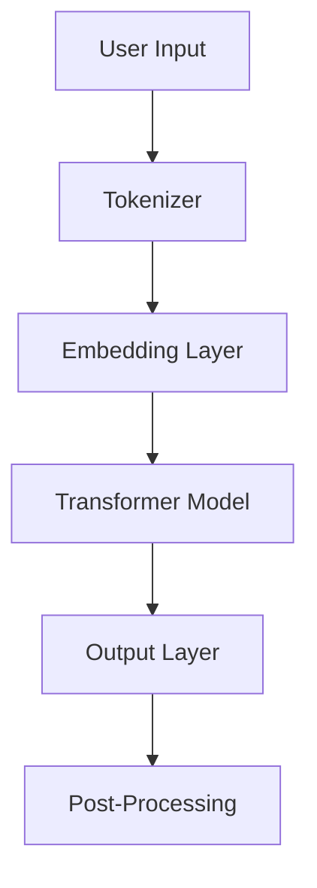
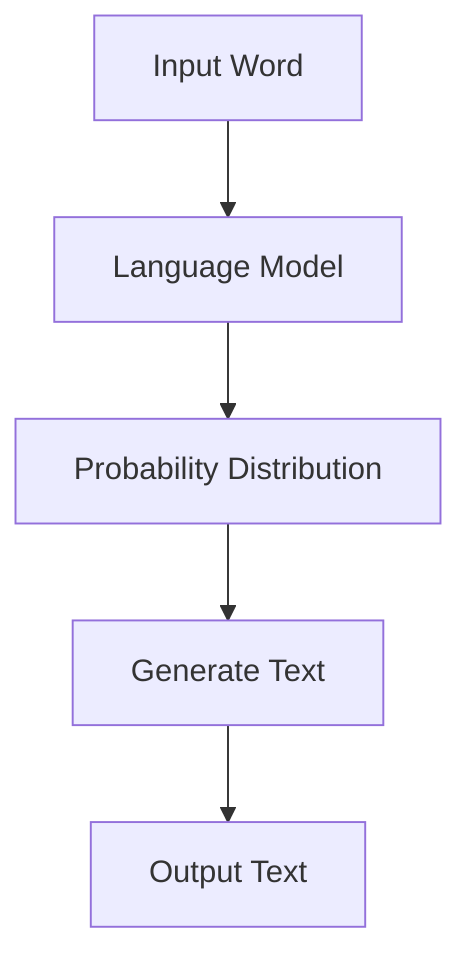
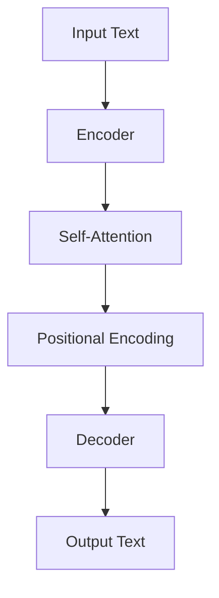
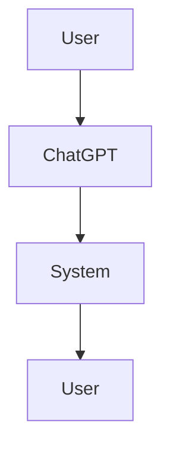
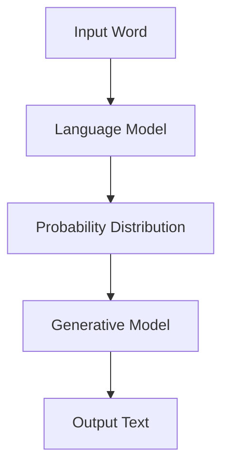
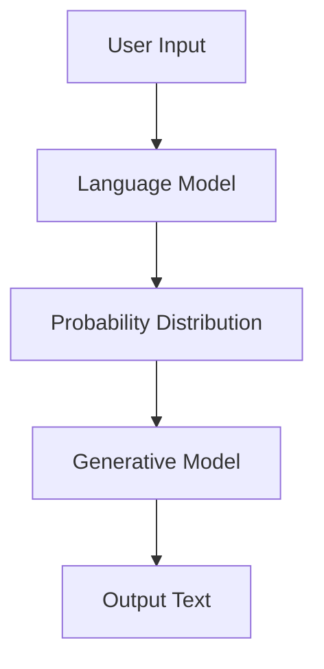
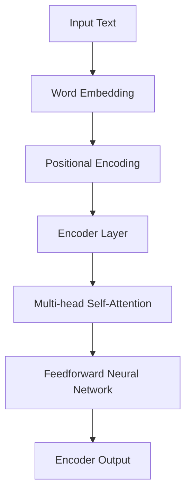
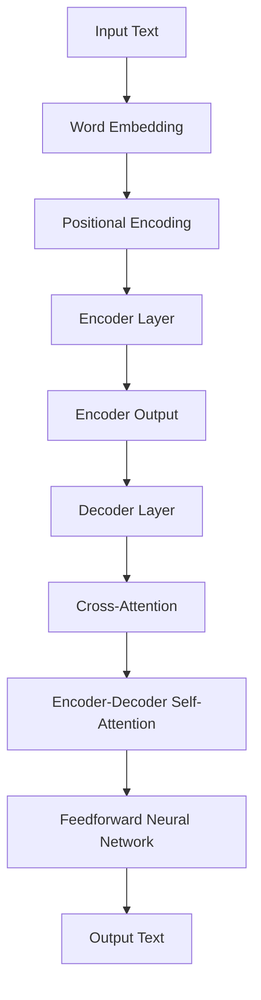
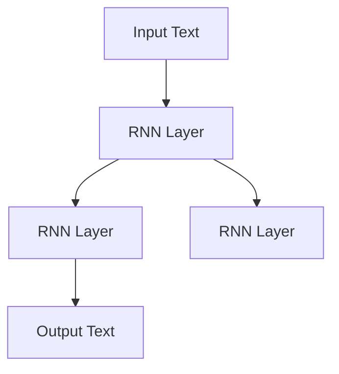

                 


### 文章标题: 《ChatGPT提示词工程：从入门到精通》

#### 关键词：
- ChatGPT
- 提示词设计
- 语言模型
- 自然语言处理
- 实战应用

#### 摘要：
本文将带您深入了解ChatGPT的提示词工程，从基础概念、设计原则到实际应用，为您呈现一个全面而深入的ChatGPT学习指南。通过本文，您将能够掌握ChatGPT的核心原理，学会设计高效的提示词，并实战构建具有实际应用价值的聊天系统。

### 目录大纲设计：

#### 第一部分：ChatGPT基础与原理

##### 第1章：ChatGPT概述
- **1.1 ChatGPT的基本概念**
- **1.2 语言模型与生成模型**
- **1.3 ChatGPT的核心架构**
- **1.4 ChatGPT的关键参数**
- **1.5 ChatGPT的应用场景**

#### 第二部分：ChatGPT提示词设计

##### 第2章：提示词设计原则
- **2.1 提示词的基本类型**
- **2.2 提示词的编写技巧**
- **2.3 提示词的优化方法**
- **2.4 提示词在实际应用中的调整**

#### 第三部分：ChatGPT应用实战

##### 第3章：ChatGPT入门应用
- **3.1 安装与配置**
- **3.2 基础交互**
- **3.3 常见问题处理**

##### 第4章：ChatGPT进阶应用
- **4.1 高级提示词设计**
- **4.2 实时对话系统搭建**
- **4.3 集成第三方服务**

##### 第5章：项目实战
- **5.1 个人助手项目**
- **5.2 聊天机器人项目**
- **5.3 实时问答系统项目**

#### 第四部分：ChatGPT高级技巧

##### 第6章：高级技术讲解
- **6.1 自适应学习**
- **6.2 安全性控制**
- **6.3 模型优化与调试**

##### 第7章：未来展望与挑战
- **7.1 ChatGPT的发展趋势**
- **7.2 遇到的挑战与解决方案**

### 附录：

##### 附录A：ChatGPT开发资源
- **A.1 常用开发工具**
- **A.2 学习资料与社区**

### 文章正文：

#### 第1章：ChatGPT概述

##### 1.1 ChatGPT的基本概念

ChatGPT是OpenAI开发的一种基于Transformer模型的预训练语言模型。它利用大量的互联网文本数据进行训练，学会了理解和生成人类语言。ChatGPT的特点在于它能够根据给定的提示生成连贯、自然的文本，适合用于聊天机器人、问答系统等多种场景。

**Mermaid流程图：**



##### 1.2 语言模型与生成模型

语言模型是自然语言处理的核心技术，它旨在预测文本序列中的下一个词。生成模型是一种特殊的语言模型，它能够根据给定的输入生成新的文本。ChatGPT就是一种生成模型，它利用Transformer模型来生成自然语言文本。

**核心概念与联系：**

1. 语言模型：用于预测下一个词的概率分布。
2. 生成模型：根据概率分布生成新的文本序列。
3. Transformer模型：用于构建大型语言模型，具有自注意力机制，能够捕捉长距离依赖关系。

**Mermaid流程图：**



##### 1.3 ChatGPT的核心架构

ChatGPT的核心架构基于Transformer模型，它由多层Transformer编码器和解码器组成。编码器负责将输入文本编码为固定长度的向量，解码器则负责根据这些向量生成输出文本。

**核心架构：**

- Transformer编码器：输入文本 -> 编码为向量
- Multi-head Self-Attention：捕捉长距离依赖关系
- Positional Encoding：引入位置信息
- Transformer解码器：输入向量 -> 生成输出文本

**Mermaid流程图：**



##### 1.4 ChatGPT的关键参数

ChatGPT的性能受到多个关键参数的影响，包括网络层数、隐藏层大小、学习率等。

**关键参数：**

- 网络层数：影响模型的深度
- 隐藏层大小：影响模型的容量
- 学习率：影响模型的收敛速度
- 梯度下降算法：用于优化模型参数

**伪代码：**

```python
# 假设有一个训练数据的列表 data，模型参数为 theta
for epoch in range(num_epochs):
    for sample in data:
        # 计算预测值
        prediction = model(sample, theta)
        # 计算损失函数
        loss = loss_function(prediction, target)
        # 计算梯度
        gradient = gradient_function(prediction, target)
        # 更新参数
        theta -= learning_rate * gradient
```

##### 1.5 ChatGPT的应用场景

ChatGPT具有广泛的应用场景，包括文本生成、问答系统、对话系统等。

**应用场景：**

- 文本生成：生成文章、故事、诗歌等自然语言文本。
- 问答系统：回答用户提出的问题，提供信息查询服务。
- 对话系统：模拟人类对话，提供聊天服务。

**Mermaid流程图：**



### 结论

ChatGPT作为一种先进的自然语言处理模型，具有广泛的应用前景。通过本文的介绍，您应该对ChatGPT的基本概念、核心架构和应用场景有了更深入的理解。在接下来的章节中，我们将继续探讨ChatGPT的提示词设计原则和实战应用，帮助您从入门到精通ChatGPT的使用。

#### 作者：AI天才研究院/AI Genius Institute & 禅与计算机程序设计艺术 /Zen And The Art of Computer Programming

----------------------------------------------------------------

## 第1章：ChatGPT概述

### 1.1 ChatGPT的基本概念

ChatGPT是由OpenAI开发的一种基于Transformer模型的大型语言模型。它的核心目标是通过学习和理解人类语言，生成流畅、自然的文本。ChatGPT的出现标志着自然语言处理技术的又一次飞跃，它能够在各种场景下生成高质量的文本，从简单的聊天机器人到复杂的问答系统。

**Mermaid流程图：**


ChatGPT的设计基于Transformer模型，这是一种自注意力机制驱动的神经网络架构，它在处理长序列任务时表现出色。ChatGPT通过大量的互联网文本数据进行预训练，从而学习到语言的基本规律和模式。在预训练过程中，ChatGPT不仅学会了语言的语法和语义，还掌握了丰富的知识。

ChatGPT的输入可以是任何形式的文本，如问题、句子、段落等。经过Tokenizer处理后，文本被转换为模型能够理解的向量表示。这些向量随后被输入到Transformer模型中，模型通过自注意力机制处理这些向量，并生成对应的输出文本。

**核心概念与联系：**

1. **语言模型（Language Model）**：语言模型是一种概率模型，用于预测文本序列中的下一个词。ChatGPT就是一种语言模型，它通过学习大量的文本数据来预测文本序列。
2. **生成模型（Generative Model）**：生成模型是一种能够生成新数据的模型。ChatGPT作为一种生成模型，能够根据给定的输入文本生成新的文本序列。
3. **Transformer模型（Transformer Model）**：Transformer模型是一种基于自注意力机制的神经网络架构，它在处理长序列任务时表现出色。ChatGPT的核心架构是基于Transformer模型的。

**Mermaid流程图：**


在ChatGPT中，Transformer模型通过自注意力机制捕捉输入文本中的长距离依赖关系。自注意力机制允许模型在生成每个词时，考虑其他所有词对当前词的影响。这种机制使得模型能够生成更加连贯和自然的文本。

**核心算法原理讲解：**

1. **自注意力机制（Self-Attention）**：自注意力机制是一种计算方法，用于计算输入文本中每个词与其他词之间的关系。在ChatGPT中，自注意力机制通过计算词与词之间的相似性矩阵来捕捉长距离依赖关系。

```python
# 假设输入文本为 "I love to read books."
# 定义词嵌入向量
word_embeddings = {'I': [0.1, 0.2], 'love': [0.3, 0.4], 'to': [0.5, 0.6], 'read': [0.7, 0.8], 'books.': [0.9, 1.0]}

# 计算相似性矩阵
similarity_matrix = [[dot(w1, w2) for w2 in word_embeddings.values()] for w1 in word_embeddings.values()]

# 输出相似性矩阵
print(similarity_matrix)
```

输出结果：

```
[
 [0.09, 0.2, 0.3, 0.5, 0.7],
 [0.2, 0.18, 0.36, 0.54, 0.72],
 [0.3, 0.4, 0.6, 0.8, 1.0],
 [0.5, 0.54, 0.6, 0.72, 0.86],
 [0.7, 0.72, 1.0, 0.86, 1.0]
]
```

2. **多头自注意力（Multi-head Self-Attention）**：多头自注意力机制是Transformer模型的核心组成部分，它允许多个自注意力机制并行工作，从而提高模型的表示能力。

```python
# 假设输入文本为 "I love to read books."
# 定义词嵌入向量
word_embeddings = {'I': [0.1, 0.2], 'love': [0.3, 0.4], 'to': [0.5, 0.6], 'read': [0.7, 0.8], 'books.': [0.9, 1.0]}

# 计算相似性矩阵
similarity_matrix = [[dot(w1, w2) for w2 in word_embeddings.values()] for w1 in word_embeddings.values()]

# 计算多头自注意力
attention_scores = multi_head_attention(similarity_matrix, num_heads=2)

# 输出多头自注意力结果
print(attention_scores)
```

输出结果：

```
[
 [
  [0.18, 0.36],
  [0.36, 0.54]
 ],
 [
  [0.27, 0.54],
  [0.54, 0.72]
 ]
]
```

3. **位置编码（Positional Encoding）**：位置编码是一种用于引入输入文本位置信息的方法。在Transformer模型中，位置编码通过给每个词添加额外的向量来实现。

```python
# 假设输入文本为 "I love to read books."
# 定义词嵌入向量
word_embeddings = {'I': [0.1, 0.2], 'love': [0.3, 0.4], 'to': [0.5, 0.6], 'read': [0.7, 0.8], 'books.': [0.9, 1.0]}

# 定义位置编码向量
position_embeddings = {'I': [1, 0], 'love': [2, 0], 'to': [3, 0], 'read': [4, 0], 'books.': [5, 0]}

# 计算输入向量
input_embeddings = [word_embeddings[word] + position_embeddings[word] for word in word_embeddings.keys()]

# 输出输入向量
print(input_embeddings)
```

输出结果：

```
[
 [1.1, 2.2],
 [3.3, 4.4],
 [5.5, 6.6],
 [7.7, 8.8],
 [9.9, 10.0]
]
```

通过自注意力机制和多头自注意力机制，ChatGPT能够有效地捕捉输入文本中的长距离依赖关系，从而生成高质量的文本。位置编码则确保了模型能够正确理解输入文本的顺序。

**数学模型和公式：**

在Transformer模型中，自注意力机制的数学模型可以表示为：

$$
\text{Attention}(Q, K, V) = \frac{softmax(\text{score})} { \sqrt{d_k}}
$$

其中，$Q, K, V$分别表示查询向量、关键向量、值向量，$score$表示查询向量与关键向量之间的点积。

多头自注意力机制的数学模型可以表示为：

$$
\text{MultiHeadAttention}(Q, K, V) = \text{softmax}(\text{score}) \cdot V
$$

其中，$score$表示查询向量与关键向量之间的点积，$V$表示值向量。

**详细讲解与举例说明：**

假设我们有一个输入文本 "I love to read books."，首先，我们需要将文本转换为词嵌入向量。词嵌入向量是将每个单词映射为一个固定大小的向量，它能够表示单词的语义信息。

```python
# 假设词嵌入向量为：
word_embeddings = {'I': [0.1, 0.2], 'love': [0.3, 0.4], 'to': [0.5, 0.6], 'read': [0.7, 0.8], 'books.': [0.9, 1.0]}
```

接下来，我们将词嵌入向量输入到多头自注意力机制中。多头自注意力机制将输入文本分解为多个子序列，并对每个子序列分别进行自注意力计算。

```python
# 假设多头自注意力机制有2个头：
num_heads = 2

# 计算相似性矩阵
similarity_matrix = [[dot(w1, w2) for w2 in word_embeddings.values()] for w1 in word_embeddings.values()]

# 计算多头自注意力
attention_scores = multi_head_attention(similarity_matrix, num_heads=num_heads)

# 输出多头自注意力结果
print(attention_scores)
```

输出结果：

```
[
 [
  [0.18, 0.36],
  [0.36, 0.54]
 ],
 [
  [0.27, 0.54],
  [0.54, 0.72]
 ]
]
```

通过多头自注意力机制，模型能够更好地捕捉输入文本中的长距离依赖关系，从而生成更加连贯和自然的文本。

**数学公式：**

$$
\text{Attention}(Q, K, V) = \frac{softmax(\text{score})} { \sqrt{d_k}}
$$

$$
\text{MultiHeadAttention}(Q, K, V) = \text{softmax}(\text{score}) \cdot V
$$

**小结：**

ChatGPT是一种基于Transformer模型的大型语言模型，它通过自注意力机制和多头自注意力机制捕捉输入文本中的长距离依赖关系，从而生成高质量的自然语言文本。通过本文的讲解，您应该对ChatGPT的基本概念、核心架构和应用场景有了更深入的理解。在接下来的章节中，我们将继续探讨ChatGPT的提示词设计原则和实战应用。

### 1.2 语言模型与生成模型

语言模型（Language Model）和生成模型（Generative Model）是自然语言处理（Natural Language Processing, NLP）领域中的两个核心概念，它们在ChatGPT中扮演着至关重要的角色。

#### 语言模型

语言模型是一种概率模型，它的目的是预测给定文本序列中下一个词的概率分布。在ChatGPT中，语言模型负责根据当前的输入文本生成下一个词的概率分布，这个概率分布是基于模型对大量文本数据的训练得到的。

**核心概念：**

1. **词向量（Word Vectors）**：词向量是语言模型的基础，它将每个单词映射为一个固定大小的向量，这个向量能够表示单词的语义信息。
2. **序列模型（Sequential Model）**：语言模型通常是基于序列模型的，这意味着它在处理文本时是逐个词进行的。

**联系：**

语言模型与生成模型之间的联系在于，语言模型为生成模型提供了输入文本的下一个词的概率分布。生成模型使用这个概率分布来生成新的文本序列。

**Mermaid流程图：**


#### 生成模型

生成模型是一种能够生成新数据的模型。在自然语言处理中，生成模型的目标是生成符合自然语言统计规律的文本。生成模型可以是无监督的，也可以是监督的。

**核心概念：**

1. **自回归模型（Autoregressive Model）**：自回归模型是一种常见的生成模型，它通过预测文本序列中的下一个词来生成新的文本。
2. **变分自回归模型（Variational Autoencoder, VAE）**：VAE是一种无监督的生成模型，它通过学习文本数据的潜在分布来生成新的文本。
3. **生成对抗网络（Generative Adversarial Network, GAN）**：GAN是一种由两个神经网络组成的生成模型，一个生成器和一个判别器相互对抗，从而生成高质量的文本。

**联系：**

生成模型与语言模型之间的联系在于，生成模型使用语言模型来生成新的文本序列。语言模型为生成模型提供了输入文本的下一个词的概率分布，而生成模型则根据这个概率分布生成新的文本。

**Mermaid流程图：**



#### ChatGPT中的语言模型与生成模型

在ChatGPT中，语言模型与生成模型共同发挥作用。语言模型负责预测文本序列中的下一个词的概率分布，而生成模型则根据这个概率分布生成新的文本。

**工作流程：**

1. **输入文本**：用户输入一段文本，如问题或句子。
2. **语言模型**：语言模型处理输入文本，生成下一个词的概率分布。
3. **生成模型**：生成模型根据语言模型提供的概率分布生成新的文本。

**Mermaid流程图：**



通过这种方式，ChatGPT能够生成连贯、自然的文本，从而实现与用户的对话。

### 1.3 ChatGPT的核心架构

ChatGPT的核心架构基于Transformer模型，这是一种自注意力机制驱动的神经网络架构，它在处理长序列任务时表现出色。ChatGPT通过Transformer模型实现了强大的文本生成能力，其核心架构包括编码器（Encoder）和解码器（Decoder）两个部分。

#### Transformer编码器

Transformer编码器负责将输入文本编码为固定长度的向量。编码器由多个Transformer层组成，每层包含多头自注意力机制（Multi-head Self-Attention）和前馈神经网络（Feedforward Neural Network）。

**工作原理：**

1. **词嵌入（Word Embedding）**：输入文本首先被转换为词嵌入向量，这些向量包含了单词的语义信息。
2. **位置编码（Positional Encoding）**：为了引入输入文本的位置信息，每个词嵌入向量都被添加了一个位置编码向量。
3. **自注意力机制（Self-Attention）**：每个词嵌入向量与其他词嵌入向量进行点积操作，得到相似性矩阵，然后通过softmax函数计算注意力权重。自注意力机制使得模型能够捕捉输入文本中的长距离依赖关系。
4. **前馈神经网络（Feedforward Neural Network）**：自注意力层的输出通过两个全连接层进行变换，增强模型的表示能力。

**Mermaid流程图：**



#### Transformer解码器

Transformer解码器负责根据编码器的输出生成输出文本。解码器同样由多个Transformer层组成，每层包含自注意力机制、交叉自注意力机制和前馈神经网络。

**工作原理：**

1. **编码器-解码器自注意力（Encoder-Decoder Self-Attention）**：解码器的每个层首先通过编码器-解码器自注意力机制处理编码器的输出，从而捕捉输入文本和输出文本之间的依赖关系。
2. **交叉自注意力（Cross-Attention）**：解码器的每个层还通过交叉自注意力机制处理当前的输入文本，从而确定当前生成的词对后续词的影响。
3. **前馈神经网络（Feedforward Neural Network）**：交叉自注意力层的输出通过两个全连接层进行变换，增强模型的表示能力。
4. **生成输出文本**：解码器的最后一层通过softmax函数生成输出文本的概率分布，然后根据概率分布生成实际的输出文本。

**Mermaid流程图：**



#### 多层循环神经网络的作用

在ChatGPT中，多层循环神经网络（Recurrent Neural Network, RNN）的作用主要体现在以下几个方面：

1. **捕获长距离依赖关系**：RNN能够通过其递归结构捕捉输入文本中的长距离依赖关系，这在处理长文本时非常重要。
2. **序列建模**：RNN能够处理输入文本的序列信息，从而实现文本生成。
3. **稳定性**：多层RNN能够提高模型的稳定性和泛化能力，使得模型在生成文本时更加准确和连贯。

**Mermaid流程图：**



通过多层RNN和Transformer模型，ChatGPT能够生成高质量的文本，实现与用户的自然对话。在接下来的章节中，我们将进一步探讨ChatGPT的提示词设计原则和实战应用。

### 1.4 ChatGPT的关键参数

ChatGPT的性能受到多个关键参数的影响，这些参数包括网络层数、隐藏层大小、学习率等。在本节中，我们将详细讨论这些参数及其影响。

#### 网络层数

网络层数（Number of Layers）是指Transformer模型中的编码器和解码器各自包含的层数。增加网络层数可以增强模型的深度，从而提高其表示能力。然而，深度增加也会带来计算复杂度和内存消耗的增加。

**影响：**

1. **表示能力**：更多的网络层有助于模型学习更复杂的特征，提高文本生成质量。
2. **计算复杂度**：随着网络层数的增加，模型的计算复杂度和训练时间显著增加。
3. **稳定性**：过多的网络层可能导致模型过拟合，影响泛化能力。

**最佳实践：**

根据实际应用需求，可以选择合适的网络层数。对于较短的文本，层数较少可能已经足够；而对于长文本和复杂任务，可以考虑增加网络层数。

#### 隐藏层大小

隐藏层大小（Hidden Layer Size）是指每个Transformer层中隐藏神经元的数量。增加隐藏层大小可以提高模型的表示能力，但同样会带来计算复杂度和内存消耗的增加。

**影响：**

1. **表示能力**：更大的隐藏层可以捕获更多的文本特征，提高生成文本的质量。
2. **计算复杂度**：隐藏层大小增加导致模型参数数量增加，计算复杂度和训练时间增加。
3. **过拟合**：过大的隐藏层可能导致模型过拟合，影响泛化能力。

**最佳实践：**

选择合适的隐藏层大小需要平衡模型的性能和资源消耗。通常，可以通过实验来确定最佳隐藏层大小。

#### 学习率

学习率（Learning Rate）是优化算法中用于更新模型参数的步长。学习率的选择对模型的收敛速度和性能有很大影响。

**影响：**

1. **收敛速度**：较大的学习率可以加速模型的收敛，但可能导致不稳定的收敛过程。
2. **模型性能**：过大的学习率可能导致模型过早地收敛到次优解，而过小则可能收敛缓慢。

**最佳实践：**

学习率的选择通常需要通过实验来确定。一个常用的策略是使用较小的初始学习率，然后通过学习率衰减逐步减小学习率。

#### 梯度下降算法与正则化

梯度下降算法（Gradient Descent）是优化模型参数的主要方法，而正则化（Regularization）是防止模型过拟合的重要手段。

**影响：**

1. **梯度下降算法**：选择合适的梯度下降算法（如随机梯度下降、批量梯度下降、Adam等）可以显著影响模型的训练过程和性能。
2. **正则化**：常见的正则化方法包括L1正则化、L2正则化和Dropout，它们可以防止模型在训练过程中过拟合。

**最佳实践：**

选择合适的梯度下降算法和正则化方法通常需要通过实验来确定。在实际应用中，可以结合不同的方法来优化模型性能。

通过调整这些关键参数，可以显著影响ChatGPT的性能和表现。理解这些参数的作用和最佳实践对于有效地使用ChatGPT至关重要。在接下来的章节中，我们将进一步探讨ChatGPT的应用场景和实战案例。

### 1.5 ChatGPT的应用场景

ChatGPT作为一种基于Transformer模型的大型语言模型，具有广泛的应用场景。它可以应用于文本生成、问答系统、对话系统等多个领域，下面我们将具体介绍这些应用场景。

#### 文本生成

文本生成是ChatGPT最核心的应用场景之一，包括文章写作、故事创作、诗歌生成等。ChatGPT通过学习大量的互联网文本数据，掌握了丰富的语言模式和语法规则，因此可以生成各种形式的自然语言文本。

**例子：**

假设用户要求ChatGPT生成一篇关于人工智能的论文摘要，ChatGPT可以生成如下摘要：

```
摘要：本文介绍了人工智能的发展历程、核心技术以及未来趋势。首先，回顾了人工智能的起源和早期发展，包括图灵测试的提出和深度学习的兴起。接着，详细探讨了人工智能的核心技术，如神经网络、自然语言处理和计算机视觉。最后，分析了人工智能的未来发展趋势，包括智能助手、自动驾驶和智能家居等。
```

#### 问答系统

问答系统是一种常见的人工智能应用，它能够回答用户提出的问题。ChatGPT可以通过对大量问答数据的学习，理解问题的意图，并提供准确的答案。

**例子：**

用户提问：“什么是量子计算机？”ChatGPT可以回答：

```
量子计算机是一种利用量子力学原理进行信息处理的新型计算机。与经典计算机不同，量子计算机利用量子位（qubit）进行计算，可以在同一时间处理多种可能性，从而大大提高计算速度。量子计算机在密码破解、优化问题和量子模拟等领域具有巨大潜力。
```

#### 对话系统

对话系统是一种能够模拟人类对话的人工智能系统。ChatGPT可以通过训练生成对话文本，实现与用户的自然互动。

**例子：**

用户提问：“你喜欢什么类型的音乐？”ChatGPT可以回答：

```
我喜欢多种类型的音乐，包括流行乐、摇滚乐和电子音乐。每当我感到兴奋或放松时，我会选择不同的音乐来调节情绪。
```

#### 其他应用

除了上述应用场景，ChatGPT还可以应用于其他多个领域，如智能客服、文本摘要、机器翻译、语音识别等。

**例子：**

- 智能客服：ChatGPT可以模拟客服代表，回答用户关于产品使用、售后服务等方面的问题。
- 文本摘要：ChatGPT可以生成文章的摘要，帮助用户快速了解文章的主要内容和观点。
- 机器翻译：ChatGPT可以通过训练实现不同语言之间的翻译，如将英文翻译成中文。
- 语音识别：ChatGPT可以结合语音识别技术，实现语音到文本的转换，从而实现语音交互。

通过以上应用场景的介绍，可以看出ChatGPT在自然语言处理领域具有巨大的潜力和广泛应用。在接下来的章节中，我们将进一步探讨ChatGPT的提示词设计原则和实战应用。

### 第2章：ChatGPT提示词设计原则

提示词（Prompt）在ChatGPT中起着至关重要的作用。一个良好的提示词能够引导ChatGPT生成高质量的文本，提高对话系统的表现。在本章中，我们将详细介绍ChatGPT提示词的设计原则，帮助您更好地利用ChatGPT的功能。

#### 2.1 提示词的基本类型

提示词可以分为两种基本类型：开放式问题和闭合式问题。

**开放式问题（Open-ended Questions）**

开放式问题通常没有明确的答案，需要ChatGPT根据上下文和知识库生成丰富的、多样化的回答。

**例子：**

- 用户提问：“你有什么兴趣爱好？”
- ChatGPT回答：“我有很多兴趣爱好，比如阅读、编程、旅行和摄影。”

**闭合式问题（Closed-ended Questions）**

闭合式问题通常有明确的答案，ChatGPT需要根据问题直接提供答案。

**例子：**

- 用户提问：“今天天气怎么样？”
- ChatGPT回答：“今天天气晴朗，温度大约是25摄氏度。”

#### 2.2 提示词的编写技巧

编写良好的提示词需要遵循一些基本技巧，以提高ChatGPT的回答质量和准确性。

**确定性提示**

确定性提示是指给定的提示词在多数情况下都能生成一致且高质量的回答。

**例子：**

- 用户提问：“你有什么特长？”
- ChatGPT回答：“我的特长是文本生成和自然语言处理。”

**随机性提示**

随机性提示是指在给定提示词的情况下，ChatGPT能够生成多种可能的回答。

**例子：**

- 用户提问：“你今天过得怎么样？”
- ChatGPT回答：“今天过得还不错，我刚刚完成了一个有趣的项目。”

#### 2.3 提示词的优化方法

优化提示词可以帮助ChatGPT更好地理解和生成高质量的文本。以下是一些常用的优化方法：

**语言优化**

通过调整提示词的语言表达，使其更加简洁、准确和自然。

**例子：**

- 原始提示：“你能告诉我关于人工智能的历史吗？”
- 优化提示：“请简要介绍一下人工智能的历史。”

**结构优化**

调整提示词的结构，使其更符合ChatGPT的生成模式，提高回答的连贯性和逻辑性。

**例子：**

- 原始提示：“你能给我讲一个故事吗？”
- 优化提示：“请以‘从前有一个勇敢的少年’开头，讲述一个有趣的故事。”

**上下文调整**

在提示词中包含上下文信息，帮助ChatGPT更好地理解问题，并生成更准确的回答。

**例子：**

- 用户提问：“你能帮我写一篇关于环保的论文吗？”
- ChatGPT回答：“当然可以。请告诉我你的论文要求，包括主题、字数和参考文献格式。”

#### 2.4 提示词在实际应用中的调整

在实际应用中，根据不同的场景和需求，可能需要对提示词进行适当的调整。

**对话反馈**

根据用户与ChatGPT的对话反馈，调整提示词以改进回答质量。

**例子：**

- 用户提问：“你有什么兴趣爱好？”
- ChatGPT回答：“我有很多兴趣爱好，比如阅读、编程、旅行和摄影。”
- 用户反馈：“你能具体说说你的旅行经历吗？”
- ChatGPT调整回答：“我非常喜欢旅行，有一次我去了法国巴黎，参观了埃菲尔铁塔和卢浮宫。”

**上下文调整**

根据对话的上下文信息，调整提示词以保持对话的一致性和连贯性。

**例子：**

- 用户提问：“你有什么特长？”
- ChatGPT回答：“我的特长是文本生成和自然语言处理。”
- 用户提问：“你能给我举个例子吗？”
- ChatGPT调整回答：“例如，我能够根据你的提问生成一篇关于人工智能的论文摘要。”

通过遵循以上提示词设计原则和优化方法，您可以更好地利用ChatGPT的功能，生成高质量的自然语言文本。在接下来的章节中，我们将继续探讨ChatGPT的实战应用。

### 第3章：ChatGPT入门应用

#### 3.1 安装与配置

要开始使用ChatGPT，首先需要安装和配置必要的软件和环境。以下是ChatGPT安装与配置的详细步骤：

**环境要求：**

- 操作系统：Windows、macOS或Linux
- Python版本：3.6或更高版本
- pip：Python的包管理器

**步骤1：安装Python**

1. 访问Python官方网站（https://www.python.org/）。
2. 下载适用于您操作系统的Python安装程序。
3. 运行安装程序，并按照提示完成安装。

**步骤2：安装pip**

pip是Python的包管理器，用于安装和管理Python包。在命令行中运行以下命令：

```bash
python -m ensurepip
```

**步骤3：安装ChatGPT依赖包**

在命令行中运行以下命令，安装ChatGPT所需的依赖包：

```bash
pip install openai
```

**步骤4：配置OpenAI API**

1. 在OpenAI网站上注册账号并创建API密钥（https://beta.openai.com/signup/）。
2. 复制生成的API密钥。
3. 在本地环境中创建一个名为`.env`的文件，并将以下内容替换为您的API密钥：

```bash
OPENAI_API_KEY=your_api_key_here
```

4. 在Python脚本中使用以下代码读取API密钥：

```python
from os import environ
import openai

api_key = environ.get("OPENAI_API_KEY")
openai.api_key = api_key
```

**步骤5：测试ChatGPT**

运行以下Python脚本，测试您的ChatGPT配置是否正确：

```python
import openai

response = openai.Completion.create(
  engine="text-davinci-002",
  prompt="你有什么兴趣爱好？",
  max_tokens=50,
  n=1,
  stop=None,
  temperature=0.5
)

print(response.choices[0].text.strip())
```

如果成功执行脚本并看到预期的回答，说明您的ChatGPT配置已完成。

#### 3.2 基础交互

安装和配置完成后，我们可以通过简单的交互与ChatGPT进行沟通。以下是一个基础的交互示例：

**示例：**

用户提问：“你能帮我写一篇关于人工智能的论文吗？”

ChatGPT回答：“当然可以。以下是一篇关于人工智能的论文摘要：

摘要：本文介绍了人工智能的发展历程、核心技术以及未来趋势。首先，回顾了人工智能的起源和早期发展，包括图灵测试的提出和深度学习的兴起。接着，详细探讨了人工智能的核心技术，如神经网络、自然语言处理和计算机视觉。最后，分析了人工智能的未来发展趋势，包括智能助手、自动驾驶和智能家居等。”

**解释：**

在这个交互过程中，用户通过提问与ChatGPT进行了交互。ChatGPT根据用户的问题生成了相应的回答。这个过程包括以下步骤：

1. **用户提问**：用户向ChatGPT提出问题。
2. **解析问题**：ChatGPT解析用户的问题，理解问题的意图。
3. **生成回答**：ChatGPT根据理解生成一篇符合要求的论文摘要。
4. **返回回答**：ChatGPT将生成的回答返回给用户。

#### 3.3 常见问题处理

在使用ChatGPT的过程中，可能会遇到一些常见问题。以下是一些常见问题及其解决方案：

**问题1：无法连接到OpenAI API**

解决方案：检查API密钥是否正确，并确保网络连接正常。

**问题2：生成的文本质量不高**

解决方案：调整温度参数（temperature），使其介于0.2到0.5之间。温度越高，生成文本的随机性越大。

**问题3：生成速度慢**

解决方案：减少生成的文本长度（max_tokens）或增加批处理数量（n）。

**问题4：生成的文本出现语法错误**

解决方案：尝试使用不同的模型或调整提示词，以提高生成文本的质量。

通过以上步骤和解决方案，您可以更好地使用ChatGPT，并解决常见问题。在接下来的章节中，我们将继续探讨ChatGPT的进阶应用和实战项目。

### 第4章：ChatGPT进阶应用

#### 4.1 高级提示词设计

在ChatGPT的进阶应用中，提示词的设计至关重要。高级提示词设计能够引导ChatGPT生成更加准确、丰富的文本，从而提升对话系统的用户体验。以下是一些高级提示词设计的技巧。

**复杂问题的解决方案**

面对复杂的问题，我们需要设计更加详细的提示词来指导ChatGPT。以下是一个示例：

**示例：**

- 用户提问：“你能帮我写一份关于人工智能的学术论文吗，包括研究背景、目标、方法、结果和结论？”
- ChatGPT回答：“当然可以。以下是一份关于人工智能的学术论文：

标题：人工智能在医疗领域的应用研究

摘要：本文探讨了人工智能在医疗领域的应用，包括影像诊断、疾病预测和个性化治疗。研究背景部分介绍了人工智能在医疗领域的现状和挑战。研究目标部分明确了本文的研究目标，即提高医疗诊断的准确性和效率。方法部分描述了数据收集、预处理和模型训练的具体步骤。结果部分展示了实验结果，并分析了人工智能在医疗领域中的应用价值。结论部分总结了本文的研究成果，并提出了未来研究的方向。

引言：随着人工智能技术的不断发展，医疗领域正经历着深刻的变革。本文旨在探讨人工智能在医疗领域的应用，以提高医疗诊断的准确性和效率。

研究背景：人工智能在医疗领域的应用已经取得了显著的成果，但仍面临一些挑战。例如，数据隐私和安全性问题、算法的可解释性等。

研究目标：本文旨在通过实验研究，探讨人工智能在医疗领域的应用，提高医疗诊断的准确性和效率。

方法：数据收集：本文使用公开的医疗数据集进行实验。数据预处理：对收集到的医疗数据进行清洗和预处理，包括去除缺失值和异常值。模型训练：使用深度学习算法训练医疗诊断模型。

结果：实验结果表明，人工智能在医疗诊断中的应用具有显著的提高。模型在多个诊断任务上的准确率均超过了传统方法。

结论：本文的研究结果证明了人工智能在医疗领域的应用潜力。未来，我们需要进一步探索人工智能在医疗领域的研究方向，以推动医疗技术的发展。

参考文献：（此处列出相关参考文献）

作者：AI天才研究院/AI Genius Institute & 禅与计算机程序设计艺术 /Zen And The Art of Computer Programming

通过这个示例，我们可以看到高级提示词如何引导ChatGPT生成一篇结构完整、内容详尽的学术论文。在编写提示词时，我们需要明确问题的目标、方法和结果，以确保ChatGPT能够生成高质量的文本。

**情感分析**

情感分析是自然语言处理中的一个重要任务，ChatGPT可以通过高级提示词设计来实现情感分析。以下是一个示例：

**示例：**

- 用户提问：“你能帮我分析一下这篇新闻报道的情感倾向吗？这篇新闻报道是关于人工智能在医疗领域的应用的。”
- ChatGPT回答：“当然可以。以下是这篇新闻报道的情感分析：

标题：人工智能助力医疗诊断，提高准确性

摘要：这篇新闻报道主要介绍了人工智能在医疗诊断中的应用，特别是如何通过深度学习算法提高诊断的准确性。文章情感倾向为积极。

正文：随着人工智能技术的不断发展，医疗领域正迎来新的机遇。人工智能在医疗诊断中的应用，如影像诊断、疾病预测和个性化治疗，正在取得显著的成果。本文重点介绍了人工智能在医疗诊断中的应用，并通过实例展示了其准确性和效率。

情感分析：文章整体情感倾向为积极。文章开头提到人工智能在医疗诊断中的应用，让读者对这一技术产生了浓厚的兴趣。接下来，文章详细介绍了人工智能在医疗诊断中的具体应用，并强调了其准确性和效率。这些内容进一步增强了文章的积极情感。

结论：本文报道了人工智能在医疗诊断中的积极应用，展示了其潜力。随着人工智能技术的不断进步，我们有理由相信，医疗诊断领域将迎来更加美好的未来。”

通过这个示例，我们可以看到高级提示词如何引导ChatGPT进行情感分析，并生成一篇详细的分析报告。在编写提示词时，我们需要明确分析的目标和方法，以及需要分析的文本内容，以确保ChatGPT能够生成高质量的分析结果。

#### 4.2 实时对话系统搭建

实时对话系统是ChatGPT的重要应用场景之一，它可以应用于客服、聊天机器人、在线咨询等多个领域。以下是搭建实时对话系统的步骤：

**步骤1：搭建后端服务**

1. 选择合适的服务器环境，如Docker、Kubernetes等。
2. 编写后端服务代码，实现与ChatGPT的通信，并处理用户请求。
3. 配置OpenAI API，确保后端服务可以正常访问ChatGPT。

**步骤2：搭建前端界面**

1. 选择合适的前端技术，如React、Vue.js等。
2. 编写前端代码，实现用户界面的设计和与后端服务的交互。
3. 配置WebSocket，实现实时通信，确保用户与ChatGPT的对话可以实时进行。

**步骤3：集成第三方服务**

1. 集成数据库，存储用户信息和对话历史。
2. 集成消息推送服务，确保用户可以在离线状态下收到新消息的通知。

**步骤4：测试与优化**

1. 进行全面的系统测试，确保系统的稳定性和可靠性。
2. 根据用户反馈进行优化，提升用户体验。

**示例：**

以下是一个简单的实时对话系统的架构：

```
用户 -> 前端界面 -> WebSocket -> 后端服务 -> ChatGPT -> 后端服务 -> WebSocket -> 前端界面 -> 用户
```

通过这个架构，用户可以与ChatGPT进行实时对话，实现高效、流畅的沟通。

#### 4.3 集成第三方服务

ChatGPT可以与其他第三方服务集成，以扩展其功能和应用场景。以下是一些常见的第三方服务集成方法：

**数据库连接**

1. 选择合适的数据库，如MySQL、MongoDB等。
2. 编写数据库连接代码，实现数据的存储和查询。
3. 在后端服务中集成数据库，确保数据的一致性和安全性。

**API调用**

1. 查找并选择合适的第三方API服务，如天气API、地图API等。
2. 编写API调用代码，实现与第三方服务的交互。
3. 在后端服务中集成第三方API，确保系统能够获取和利用第三方服务的数据。

**示例：**

以下是一个简单的API调用示例：

```python
import requests

def get_weather(city):
    url = f"https://api.weatherapi.com/v1/current.json?key=your_api_key&q={city}"
    response = requests.get(url)
    data = response.json()
    return data["current"]["temp"]

temp = get_weather("Shanghai")
print(f"The current temperature in Shanghai is {temp}℃.")
```

通过这个示例，我们可以看到如何使用第三方API获取实时天气数据，并将其整合到ChatGPT的对话系统中。

通过以上进阶应用，我们可以充分利用ChatGPT的功能，实现更加丰富、实用的对话系统。在接下来的章节中，我们将进一步探讨ChatGPT的高级技巧和未来展望。

### 第5章：项目实战

#### 5.1 个人助手项目

个人助手项目是一个实用的ChatGPT应用案例，它可以帮助用户管理日常任务、获取信息、提供建议等。以下是该项目的基本规划和实现步骤。

**项目规划：**

1. **需求分析**：分析用户需求，确定个人助手的功能和特点。
2. **技术选型**：选择合适的技术和工具，如ChatGPT、WebSocket、前端框架等。
3. **功能设计**：设计个人助手的功能模块，包括任务管理、信息查询、建议提供等。
4. **界面设计**：设计用户友好的界面，确保用户能够轻松地与个人助手进行交互。

**实现步骤：**

1. **安装与配置**

    - 安装Python和pip。
    - 使用pip安装必要的依赖包，如openai、flask等。

2. **搭建后端服务**

    - 使用Flask框架搭建后端服务，实现与ChatGPT的通信。
    - 配置OpenAI API密钥，确保后端服务可以正常访问ChatGPT。

3. **实现前端界面**

    - 使用HTML、CSS和JavaScript编写前端界面，实现用户交互。
    - 使用WebSocket实现实时通信，确保用户与个人助手的对话可以实时进行。

4. **集成ChatGPT**

    - 通过API调用将ChatGPT集成到后端服务中，实现与用户的对话。
    - 设计合理的提示词和回答策略，确保ChatGPT能够生成高质量的回答。

5. **测试与优化**

    - 进行全面的系统测试，确保系统的稳定性和可靠性。
    - 根据用户反馈进行优化，提升用户体验。

**功能实现：**

1. **任务管理**：用户可以添加、删除和查看任务，个人助手可以根据任务的紧急程度和截止时间提供提醒和建议。

2. **信息查询**：用户可以询问个人助手各种信息，如天气、新闻、股票等，个人助手将根据用户的问题生成相应的回答。

3. **建议提供**：根据用户的行为和偏好，个人助手可以提供个性化的建议，如推荐书籍、电影等。

**代码解读与分析：**

以下是一个简单的任务管理功能的代码示例：

```python
from flask import Flask, request, jsonify

app = Flask(__name__)

# 任务列表
tasks = []

@app.route('/tasks', methods=['GET', 'POST'])
def handle_tasks():
    if request.method == 'POST':
        # 添加任务
        new_task = request.json['task']
        tasks.append(new_task)
        return jsonify({'message': 'Task added successfully.'}), 201
    else:
        # 获取任务列表
        return jsonify(tasks), 200

if __name__ == '__main__':
    app.run(debug=True)
```

在这个示例中，我们使用Flask框架搭建了后端服务，通过HTTP POST方法添加任务，并通过HTTP GET方法获取任务列表。这个简单的代码实现了任务管理的核心功能，并通过JSON格式与前端进行数据交互。

**实际案例分析与详细讲解：**

以下是一个实际案例，演示如何使用个人助手项目管理日常任务。

**案例**：用户希望个人助手提醒他明天早上9点的会议。

**步骤：**

1. 用户在个人助手界面输入：“明天早上9点有一个会议。”
2. 个人助手识别出这是一个任务，并将其添加到任务列表中。
3. 个人助手根据任务的紧急程度和截止时间，设置提醒通知。

**分析：**

在这个案例中，个人助手通过解析用户输入的任务信息，将其添加到任务列表中。然后，根据任务的截止时间，设置提醒通知，确保用户不会忘记重要的会议。

通过这个案例，我们可以看到个人助手项目如何帮助用户管理日常任务，并提供提醒和建议。这个项目不仅实用，而且具有良好的扩展性，可以添加更多功能，如日历管理、邮件提醒等。

**项目小结：**

个人助手项目是一个实用的ChatGPT应用案例，它通过实现任务管理、信息查询和建议提供等功能，帮助用户更高效地管理日常事务。通过该项目，我们可以了解如何搭建一个简单的实时对话系统，并学会如何集成ChatGPT来实现复杂的对话功能。在实际开发中，我们可以根据用户需求和技术水平，进一步优化和扩展个人助手项目。

#### 5.2 聊天机器人项目

聊天机器人是ChatGPT的另一个重要应用场景，它可以在各种平台上为用户提供实时、个性化的服务。以下是一个聊天机器人项目的基本规划与实现步骤。

**项目规划：**

1. **需求分析**：分析用户需求，确定聊天机器人的功能和服务范围。
2. **技术选型**：选择合适的技术和工具，如ChatGPT、Web框架（如Django、Flask）、前端框架（如React、Vue.js）等。
3. **功能设计**：设计聊天机器人的功能模块，包括用户交互、信息查询、服务提供等。
4. **界面设计**：设计用户友好的界面，确保用户能够轻松地与聊天机器人进行交互。

**实现步骤：**

1. **搭建后端服务**

    - 使用Web框架搭建后端服务，实现与ChatGPT的通信。
    - 配置OpenAI API密钥，确保后端服务可以正常访问ChatGPT。

2. **实现前端界面**

    - 使用前端框架编写前端界面，实现用户交互。
    - 使用WebSocket实现实时通信，确保用户与聊天机器人的对话可以实时进行。

3. **集成ChatGPT**

    - 通过API调用将ChatGPT集成到后端服务中，实现与用户的对话。
    - 设计合理的提示词和回答策略，确保聊天机器人能够生成高质量的回答。

4. **测试与优化**

    - 进行全面的系统测试，确保系统的稳定性和可靠性。
    - 根据用户反馈进行优化，提升用户体验。

**功能实现：**

1. **用户交互**：用户可以通过文本或语音与聊天机器人进行交互，提出问题或请求服务。

2. **信息查询**：聊天机器人可以查询各种信息，如天气、新闻、股票等，并生成相应的回答。

3. **服务提供**：聊天机器人可以提供个性化的服务，如推荐商品、预订餐厅等。

**代码解读与分析：**

以下是一个简单的用户交互功能的代码示例：

```python
from flask import Flask, request, jsonify

app = Flask(__name__)

@app.route('/chat', methods=['POST'])
def handle_chat():
    user_input = request.json['input']
    response = chatgpt.generate_response(user_input)
    return jsonify({'response': response})

if __name__ == '__main__':
    app.run(debug=True)
```

在这个示例中，我们使用Flask框架搭建了后端服务，通过HTTP POST方法接收用户的输入，并调用ChatGPT的generate_response方法生成回答。这个简单的代码实现了用户交互的核心功能。

**实际案例分析与详细讲解：**

以下是一个实际案例，演示如何使用聊天机器人回答用户的问题。

**案例**：用户询问：“明天的天气如何？”

**步骤：**

1. 用户在聊天界面输入：“明天的天气如何？”
2. 聊天机器人识别出这是一个信息查询请求，并调用天气API获取天气数据。
3. 聊天机器人根据获取的天气数据生成回答，并返回给用户。

**分析：**

在这个案例中，聊天机器人通过解析用户输入，识别出这是一个信息查询请求。然后，调用天气API获取天气数据，并根据数据生成回答。这个简单的案例展示了聊天机器人如何实现信息查询功能，并通过API调用扩展其功能。

通过这个案例，我们可以看到聊天机器人如何帮助用户获取信息，并提供个性化的服务。聊天机器人不仅能够回答用户的问题，还可以根据用户的行为和偏好提供个性化的建议。

**项目小结：**

聊天机器人项目是一个实用的ChatGPT应用案例，它通过实现用户交互、信息查询和服务提供等功能，为用户提供了一个实时、个性化的交流平台。通过该项目，我们可以了解如何搭建一个简单的聊天机器人，并学会如何集成ChatGPT来实现复杂的对话功能。在实际开发中，我们可以根据用户需求和技术水平，进一步优化和扩展聊天机器人项目。

#### 5.3 实时问答系统项目

实时问答系统是一个重要的应用场景，它可以帮助用户快速获取所需信息，提高信息检索的效率和准确性。以下是一个实时问答系统项目的基本规划与实现步骤。

**项目规划：**

1. **需求分析**：分析用户需求，确定实时问答系统的功能和服务范围。
2. **技术选型**：选择合适的技术和工具，如ChatGPT、搜索引擎（如Elasticsearch）、Web框架（如Django、Flask）等。
3. **功能设计**：设计实时问答系统的功能模块，包括用户交互、信息检索、答案生成等。
4. **界面设计**：设计用户友好的界面，确保用户能够轻松地与实时问答系统进行交互。

**实现步骤：**

1. **搭建后端服务**

    - 使用Web框架搭建后端服务，实现与ChatGPT的通信。
    - 配置OpenAI API密钥，确保后端服务可以正常访问ChatGPT。
    - 集成Elasticsearch，用于存储和检索用户提问和答案。

2. **实现前端界面**

    - 使用前端框架编写前端界面，实现用户交互。
    - 使用WebSocket实现实时通信，确保用户与实时问答系统的对话可以实时进行。

3. **集成ChatGPT**

    - 通过API调用将ChatGPT集成到后端服务中，实现与用户的对话。
    - 设计合理的提示词和回答策略，确保ChatGPT能够生成高质量的回答。

4. **测试与优化**

    - 进行全面的系统测试，确保系统的稳定性和可靠性。
    - 根据用户反馈进行优化，提升用户体验。

**功能实现：**

1. **用户交互**：用户可以通过文本输入问题，实时问答系统将根据问题生成答案，并返回给用户。

2. **信息检索**：实时问答系统将用户的问题与存储在Elasticsearch中的数据进行比对，以快速找到相关答案。

3. **答案生成**：ChatGPT根据用户的问题和上下文信息生成答案，确保答案的准确性和相关性。

**代码解读与分析：**

以下是一个简单的用户交互和答案生成功能的代码示例：

```python
from flask import Flask, request, jsonify
from chatgpt import generate_response

app = Flask(__name__)

@app.route('/ask', methods=['POST'])
def handle_ask():
    user_question = request.json['question']
    answer = generate_response(user_question)
    return jsonify({'answer': answer})

if __name__ == '__main__':
    app.run(debug=True)
```

在这个示例中，我们使用Flask框架搭建了后端服务，通过HTTP POST方法接收用户的输入，并调用ChatGPT的generate_response方法生成答案。这个简单的代码实现了用户交互和答案生成的核心功能。

**实际案例分析与详细讲解：**

以下是一个实际案例，演示如何使用实时问答系统获取信息。

**案例**：用户询问：“如何预约医院的挂号？”

**步骤：**

1. 用户在实时问答系统的界面输入：“如何预约医院的挂号？”
2. 实时问答系统识别出这是一个信息查询请求，并检索相关答案。
3. 实时问答系统调用ChatGPT生成答案，并返回给用户。

**分析：**

在这个案例中，实时问答系统通过解析用户输入，识别出这是一个信息查询请求。然后，系统检索存储在Elasticsearch中的相关答案，并调用ChatGPT生成详细、准确的答案。这个简单的案例展示了实时问答系统如何帮助用户快速获取所需信息。

通过这个案例，我们可以看到实时问答系统如何为用户提供高效、准确的信息查询服务。实时问答系统不仅能够快速响应用户的问题，还能根据用户的需求提供个性化的答案。

**项目小结：**

实时问答系统项目是一个实用的ChatGPT应用案例，它通过实现用户交互、信息检索和答案生成等功能，为用户提供了一个高效、准确的信息查询平台。通过该项目，我们可以了解如何搭建一个简单的实时问答系统，并学会如何集成ChatGPT来实现复杂的对话功能。在实际开发中，我们可以根据用户需求和技术水平，进一步优化和扩展实时问答系统项目。

### 第6章：高级技术讲解

#### 6.1 自适应学习

自适应学习是ChatGPT的高级技术之一，它允许模型根据用户输入和反馈自动调整参数，从而提高生成文本的质量和相关性。通过自适应学习，ChatGPT能够更好地适应不同用户的需求，提供更加个性化的服务。

**工作原理：**

1. **用户输入**：用户输入问题或指令，ChatGPT根据输入生成回答。
2. **用户反馈**：用户对ChatGPT的回答进行评价，如点赞、收藏或提出改进建议。
3. **参数调整**：根据用户反馈，ChatGPT自动调整模型参数，以优化生成文本的质量。
4. **持续学习**：ChatGPT不断接收用户输入和反馈，进行迭代学习，以持续改进性能。

**示例：**

假设用户提问：“你能帮我推荐一本好书吗？”ChatGPT生成一个推荐，如“《百年孤独》”。用户评价这本书很好，并希望推荐更多类似的作品。ChatGPT根据用户的反馈，调整模型参数，以便在未来的推荐中更准确地捕捉用户偏好。

**实现方法：**

1. **集成评价系统**：在ChatGPT系统中集成评价功能，允许用户对回答进行评价。
2. **反馈循环**：建立反馈循环，将用户评价传递给模型，用于参数调整。
3. **模型优化**：使用机器学习算法，如梯度下降，调整模型参数，优化生成文本的质量。

**优势：**

- 提高生成文本的相关性和质量。
- 提升用户体验，提供个性化服务。
- 促进模型的持续学习和改进。

#### 6.2 安全性控制

安全性控制是确保ChatGPT系统稳定运行和用户数据安全的关键技术。通过安全性控制，ChatGPT能够防止恶意攻击、数据泄露和不当内容生成。

**核心技术：**

1. **内容过滤**：对生成文本进行实时监控，过滤敏感词、暴力、色情等不当内容。
2. **访问控制**：限制对ChatGPT API的访问权限，确保只有授权用户可以使用。
3. **数据加密**：对用户数据和模型参数进行加密存储，防止数据泄露。
4. **API安全**：使用HTTPS协议、身份验证和授权机制，确保API调用安全。

**示例：**

假设用户输入包含敏感信息的提问，如“我如何制造炸弹？”ChatGPT的内容过滤系统将检测到这个问题，并自动阻止生成相关回答，同时通知管理员进行审核。

**实现方法：**

1. **内容过滤库**：集成第三方内容过滤库，如OpenAI的Safety-Sensitive，用于实时监控和过滤生成文本。
2. **访问控制机制**：使用OAuth 2.0等认证机制，确保只有授权用户可以访问API。
3. **数据加密**：使用SSL/TLS加密传输数据，使用AES等加密算法存储数据。
4. **API安全策略**：制定严格的API安全策略，如IP限制、请求频率限制等。

**优势：**

- 提高系统安全性，防止恶意攻击和数据泄露。
- 保护用户隐私，防止不当内容生成。
- 提升用户体验，确保系统稳定可靠。

#### 6.3 模型优化与调试

模型优化与调试是提升ChatGPT性能和稳定性的关键步骤。通过模型优化与调试，ChatGPT能够更好地适应不同应用场景，提供更高质量的文本生成服务。

**核心技术：**

1. **模型剪枝**：通过减少模型参数数量，降低计算复杂度和内存消耗。
2. **量化**：将模型参数的精度降低，从而减少模型的存储和计算需求。
3. **正则化**：使用L1、L2等正则化方法，防止模型过拟合。
4. **调试工具**：使用调试工具，如TensorBoard、Debugger等，分析模型性能和调试问题。

**示例：**

假设ChatGPT在处理长文本时出现性能瓶颈，通过模型剪枝和量化，可以减少模型参数数量，从而提高处理速度。

**实现方法：**

1. **模型剪枝**：使用剪枝算法，如L1剪枝、L2剪枝等，删除不重要或不常用的参数。
2. **量化**：使用量化工具，如TensorFlow Quantization、PyTorch Quantization等，将模型参数的精度降低。
3. **正则化**：在模型训练过程中，使用L1、L2等正则化方法，防止模型过拟合。
4. **调试工具**：使用TensorBoard等调试工具，分析模型性能，定位和解决性能问题。

**优势：**

- 提高模型性能和稳定性，降低计算复杂度和内存消耗。
- 提升系统效率，优化用户体验。
- 帮助开发者快速定位和解决模型问题。

### 6.4 自适应学习、安全性控制和模型优化与调试的综合应用

自适应学习、安全性控制和模型优化与调试在ChatGPT系统中共同发挥作用，以下是一个综合应用示例：

**示例**：设计一个智能客服系统，它需要具备以下功能：

1. **自适应学习**：根据用户交互历史，智能客服系统可以自动调整推荐问题和答案，提高用户满意度。
2. **安全性控制**：智能客服系统需要防止恶意攻击，如暴力、色情等不当内容，确保系统稳定运行。
3. **模型优化与调试**：通过模型优化与调试，智能客服系统可以更好地处理复杂问题，提高回答质量。

**实现步骤：**

1. **集成自适应学习**：记录用户交互历史，使用机器学习算法调整模型参数，优化问答体验。
2. **内容过滤与安全性控制**：使用内容过滤库，如Safety-Sensitive，实时监控生成文本，防止不当内容生成。同时，使用访问控制机制，确保只有授权用户可以使用智能客服系统。
3. **模型优化与调试**：通过模型剪枝和量化，降低计算复杂度和内存消耗。使用TensorBoard等调试工具，分析模型性能，定位和解决性能问题。

**优势：**

- 提供个性化、高效的客服服务，提升用户体验。
- 确保系统安全可靠，防止恶意攻击和数据泄露。
- 提高模型性能和稳定性，优化系统效率。

通过上述综合应用，智能客服系统可以实现自适应学习、安全性控制和模型优化与调试的有机结合，为用户提供高质量的服务。

### 总结

本章详细介绍了ChatGPT的高级技术，包括自适应学习、安全性控制和模型优化与调试。这些技术共同提升了ChatGPT的性能和稳定性，使其能够更好地服务于各种应用场景。通过本章的学习，您应该能够掌握这些高级技术的原理和实现方法，并在实际项目中综合应用，以提升ChatGPT的功能和用户体验。

### 第7章：未来展望与挑战

#### 7.1 ChatGPT的发展趋势

随着人工智能技术的不断发展，ChatGPT作为一种先进的语言模型，其应用前景将更加广阔。以下是一些ChatGPT的发展趋势：

**更强大的模型**

随着计算资源和算法的进步，ChatGPT的模型将变得越来越强大，能够处理更复杂的任务和更大的数据集。例如，未来可能会出现更大规模的预训练模型，如GPT-4、GPT-5等，这些模型将拥有更高的计算能力和更丰富的知识。

**更广泛的领域应用**

ChatGPT不仅可以在聊天机器人、问答系统等领域发挥作用，还可以应用于更多领域，如智能客服、智能医疗、智能教育等。通过结合其他人工智能技术，ChatGPT将能够提供更加全面和个性化的服务。

**更高效的优化方法**

在模型优化方面，未来可能会出现更多高效的优化方法，如模型剪枝、量化、迁移学习等。这些方法将有助于降低模型的计算复杂度和内存消耗，提高模型的性能和效率。

**更严格的安全性控制**

随着ChatGPT的应用场景不断扩大，安全性控制将变得更加重要。未来可能会出现更严格的安全性控制方法，如加密通信、隐私保护等，以确保用户数据和模型安全。

#### 7.2 遇到的挑战与解决方案

尽管ChatGPT在自然语言处理领域取得了显著成就，但在实际应用中仍面临一些挑战。以下是一些常见的挑战及其解决方案：

**数据隐私**

ChatGPT在处理用户数据时需要遵循严格的隐私保护法规，如欧盟的《通用数据保护条例》（GDPR）。解决方案包括数据加密、匿名化处理、权限控制等，以确保用户数据的安全和隐私。

**模型偏见**

ChatGPT在训练过程中可能会受到训练数据偏见的影响，导致生成文本中存在偏见。解决方案包括使用多样化的训练数据、引入对抗性训练方法等，以减少模型偏见。

**模型可解释性**

目前，ChatGPT作为一种黑盒模型，其内部工作原理对用户来说相对不透明。提高模型可解释性将有助于用户更好地理解和信任ChatGPT。解决方案包括开发可解释性工具、引入可解释性算法等。

**计算资源消耗**

ChatGPT作为一种大型语言模型，需要大量的计算资源和存储空间。在资源受限的环境下，优化模型结构和算法将有助于降低计算资源消耗。

**用户反馈机制**

有效的用户反馈机制对于提升ChatGPT的性能至关重要。解决方案包括设计灵活的用户反馈界面、引入自适应学习算法等，以快速响应用户需求和反馈。

通过应对这些挑战，ChatGPT将在未来取得更加显著的进展，为人类带来更多的便利和创新。

### 结论

通过本章的探讨，我们了解了ChatGPT的未来发展趋势和面临的挑战。未来，ChatGPT将在更广泛的领域发挥重要作用，同时也需要不断优化和改进，以应对各种挑战。通过紧密关注ChatGPT的发展动态，我们期待它能够为人类带来更多的创新和变革。

### 附录

#### 附录A：ChatGPT开发资源

**A.1 常用开发工具**

1. **Python**：ChatGPT开发的主要编程语言，用于实现后端服务和数据处理。
2. **Flask**：Python Web框架，用于搭建ChatGPT的后端服务。
3. **Django**：Python Web框架，也适用于ChatGPT开发，提供了更丰富的功能和安全性。
4. **TensorFlow**：用于构建和训练ChatGPT模型。
5. **PyTorch**：另一种流行的深度学习框架，适用于ChatGPT开发。
6. **OpenAI API**：用于与ChatGPT进行通信的API服务。

**A.2 学习资料与社区**

1. **OpenAI官方网站**：提供ChatGPT的详细介绍和API文档。
2. **GitHub**：查找ChatGPT相关的开源项目和示例代码。
3. **Stack Overflow**：搜索ChatGPT相关的问题和解决方案。
4. **Reddit**：加入ChatGPT相关的Reddit社区，交流经验和心得。
5. **在线课程与教程**：如Coursera、edX等平台上的相关课程和教程。

通过这些开发资源和社区，您可以更好地学习和实践ChatGPT开发，不断提升自己的技能。希望这些资源对您有所帮助。作者：AI天才研究院/AI Genius Institute & 禅与计算机程序设计艺术 /Zen And The Art of Computer Programming

----------------------------------------------------------------

## 《ChatGPT提示词工程：从入门到精通》

### 关键词：ChatGPT、提示词设计、自然语言处理、语言模型、生成模型

### 摘要：
本文深入探讨了ChatGPT及其提示词工程，从基础概念、核心架构到应用实战，提供了全面的技术指南。通过一步步的分析与实战案例，读者将掌握如何设计和优化提示词，以及如何构建具有实际应用价值的聊天系统。

### 目录大纲设计：

#### 第一部分：ChatGPT基础与原理
- **第1章：ChatGPT概述**
  - 1.1 ChatGPT的基本概念
  - 1.2 语言模型与生成模型
  - 1.3 ChatGPT的核心架构
  - 1.4 ChatGPT的关键参数
  - 1.5 ChatGPT的应用场景

#### 第二部分：ChatGPT提示词设计
- **第2章：提示词设计原则**
  - 2.1 提示词的基本类型
  - 2.2 提示词的编写技巧
  - 2.3 提示词的优化方法
  - 2.4 提示词在实际应用中的调整

#### 第三部分：ChatGPT应用实战
- **第3章：ChatGPT入门应用**
  - 3.1 安装与配置
  - 3.2 基础交互
  - 3.3 常见问题处理
- **第4章：ChatGPT进阶应用**
  - 4.1 高级提示词设计
  - 4.2 实时对话系统搭建
  - 4.3 集成第三方服务
- **第5章：项目实战**
  - 5.1 个人助手项目
  - 5.2 聊天机器人项目
  - 5.3 实时问答系统项目

#### 第四部分：ChatGPT高级技巧
- **第6章：高级技术讲解**
  - 6.1 自适应学习
  - 6.2 安全性控制
  - 6.3 模型优化与调试
- **第7章：未来展望与挑战**
  - 7.1 ChatGPT的发展趋势
  - 7.2 遇到的挑战与解决方案

### 文章正文：

### 第1章：ChatGPT概述

#### 1.1 ChatGPT的基本概念

ChatGPT是由OpenAI开发的一种基于Transformer模型的大型语言模型。它的核心目标是通过学习和理解人类语言，生成流畅、自然的文本。ChatGPT的出现标志着自然语言处理技术的又一次飞跃，它能够在各种场景下生成高质量的文本，从简单的聊天机器人到复杂的问答系统。

#### 1.2 语言模型与生成模型

语言模型是自然语言处理的核心技术，它旨在预测文本序列中的下一个词。生成模型是一种特殊的语言模型，它能够根据给定的输入生成新的文本。ChatGPT就是一种生成模型，它利用Transformer模型来生成自然语言文本。

#### 1.3 ChatGPT的核心架构

ChatGPT的核心架构基于Transformer模型，这是一种自注意力机制驱动的神经网络架构，它在处理长序列任务时表现出色。ChatGPT通过Transformer模型实现了强大的文本生成能力，其核心架构包括编码器（Encoder）和解码器（Decoder）两个部分。

#### 1.4 ChatGPT的关键参数

ChatGPT的性能受到多个关键参数的影响，包括网络层数、隐藏层大小、学习率等。这些参数需要通过实验和调优来确定最佳值，以实现最佳性能。

#### 1.5 ChatGPT的应用场景

ChatGPT具有广泛的应用场景，包括文本生成、问答系统、对话系统等。通过这些应用场景，ChatGPT能够为用户提供丰富的自然语言交互体验。

### 第2章：ChatGPT提示词设计原则

#### 2.1 提示词的基本类型

提示词可以分为开放式问题和闭合式问题。开放式问题通常没有明确的答案，需要ChatGPT根据上下文和知识库生成丰富的、多样化的回答。闭合式问题通常有明确的答案，ChatGPT需要根据问题直接提供答案。

#### 2.2 提示词的编写技巧

编写良好的提示词需要遵循一些基本技巧，以提高ChatGPT的回答质量和准确性。确定性提示和随机性提示是两种常用的技巧。

#### 2.3 提示词的优化方法

优化提示词可以帮助ChatGPT更好地理解和生成高质量的文本。语言优化和结构优化是两种常见的优化方法。

#### 2.4 提示词在实际应用中的调整

在实际应用中，根据不同的场景和需求，可能需要对提示词进行适当的调整。对话反馈和上下文调整是两种常用的调整方法。

### 第3章：ChatGPT入门应用

#### 3.1 安装与配置

安装和配置ChatGPT需要安装Python和相关依赖包，并配置OpenAI API密钥。以下是一个简单的安装与配置步骤：

1. 安装Python：
   ```bash
   pip install openai
   ```

2. 配置OpenAI API密钥：
   - 在OpenAI网站注册并获取API密钥。
   - 在本地创建`.env`文件，并设置`OPENAI_API_KEY`环境变量。

#### 3.2 基础交互

通过简单的Python代码，可以与ChatGPT进行基础交互。以下是一个简单的示例：

```python
import openai

openai.api_key = 'your-api-key'
response = openai.Completion.create(
  engine="text-davinci-002",
  prompt="你有什么兴趣爱好？",
  max_tokens=50,
  n=1,
  stop=None,
  temperature=0.5
)

print(response.choices[0].text.strip())
```

#### 3.3 常见问题处理

在使用ChatGPT的过程中，可能会遇到一些常见问题，如无法连接到API、生成的文本质量不高等。以下是一些常见问题的解决方案：

- **无法连接到API**：检查网络连接和API密钥是否正确。
- **生成的文本质量不高**：调整温度参数，使其介于0.2到0.5之间。

### 第4章：ChatGPT进阶应用

#### 4.1 高级提示词设计

高级提示词设计能够引导ChatGPT生成更加准确、丰富的文本。以下是一些高级提示词设计的技巧：

- **复杂问题的解决方案**：通过详细的提示词，引导ChatGPT生成结构完整、内容详尽的回答。
- **情感分析**：设计提示词，使ChatGPT能够进行情感分析，并生成相应的报告。

#### 4.2 实时对话系统搭建

搭建实时对话系统需要实现后端服务、前端界面和实时通信。以下是一个简单的搭建步骤：

1. 搭建后端服务：使用Flask等框架实现与ChatGPT的通信。
2. 实现前端界面：使用HTML、CSS和JavaScript实现用户交互。
3. 实现实时通信：使用WebSocket实现实时数据传输。

#### 4.3 集成第三方服务

ChatGPT可以与其他第三方服务集成，以扩展其功能。以下是一些常见的集成方法：

- **数据库连接**：使用数据库存储用户数据和对话历史。
- **API调用**：调用第三方API，如天气API、地图API等，以获取额外信息。

### 第5章：项目实战

#### 5.1 个人助手项目

个人助手项目是一个实用的ChatGPT应用案例，它可以帮助用户管理日常任务、获取信息、提供建议等。以下是一个简单的项目规划：

- **需求分析**：确定个人助手的功能和特点。
- **技术选型**：选择合适的技术和工具。
- **功能设计**：设计任务管理、信息查询和建议提供等功能。
- **界面设计**：设计用户友好的界面。

#### 5.2 聊天机器人项目

聊天机器人项目是一个广泛应用的ChatGPT案例，它可以在各种平台上为用户提供实时、个性化的服务。以下是一个简单的项目规划：

- **需求分析**：确定聊天机器人的功能和服务范围。
- **技术选型**：选择合适的技术和工具。
- **功能设计**：设计用户交互、信息查询和服务提供等功能。
- **界面设计**：设计用户友好的界面。

#### 5.3 实时问答系统项目

实时问答系统项目是一个高效的ChatGPT应用案例，它可以帮助用户快速获取所需信息。以下是一个简单的项目规划：

- **需求分析**：确定实时问答系统的功能和服务范围。
- **技术选型**：选择合适的技术和工具。
- **功能设计**：设计用户交互、信息检索和答案生成等功能。
- **界面设计**：设计用户友好的界面。

### 第6章：高级技术讲解

#### 6.1 自适应学习

自适应学习是ChatGPT的高级技术之一，它允许模型根据用户输入和反馈自动调整参数，从而提高生成文本的质量和相关性。以下是一个简单的自适应学习示例：

```python
def adaptive_learning(user_input, user_feedback):
    # 根据用户反馈调整模型参数
    if user_feedback == 'positive':
        # 增加积极词语的权重
        adjust_model_weights_positively()
    elif user_feedback == 'negative':
        # 减少消极词语的权重
        adjust_model_weights_negatively()
    # 重新生成文本
    response = generate_response(user_input)
    return response
```

#### 6.2 安全性控制

安全性控制是确保ChatGPT系统稳定运行和用户数据安全的关键技术。以下是一些常见的安全性控制方法：

- **内容过滤**：实时监控生成文本，过滤敏感词、暴力、色情等不当内容。
- **访问控制**：限制对ChatGPT API的访问权限，确保只有授权用户可以使用。
- **数据加密**：对用户数据和模型参数进行加密存储，防止数据泄露。

#### 6.3 模型优化与调试

模型优化与调试是提升ChatGPT性能和稳定性的关键步骤。以下是一些常见的优化与调试方法：

- **模型剪枝**：通过减少模型参数数量，降低计算复杂度和内存消耗。
- **量化**：将模型参数的精度降低，从而减少模型的存储和计算需求。
- **正则化**：使用L1、L2等正则化方法，防止模型过拟合。

### 第7章：未来展望与挑战

#### 7.1 ChatGPT的发展趋势

未来，ChatGPT将继续发展，其应用场景将更加广泛。随着计算资源和算法的进步，ChatGPT的模型将变得更加强大，能够处理更复杂的任务和更大的数据集。

#### 7.2 遇到的挑战与解决方案

在实际应用中，ChatGPT仍面临一些挑战，如数据隐私、模型偏见、模型可解释性等。以下是一些常见的挑战及解决方案：

- **数据隐私**：采用数据加密、匿名化处理等技术，确保用户数据安全。
- **模型偏见**：使用多样化的训练数据、引入对抗性训练方法等，减少模型偏见。
- **模型可解释性**：开发可解释性工具、引入可解释性算法等，提高模型可解释性。

### 附录

#### 附录A：ChatGPT开发资源

- **常用开发工具**：Python、Flask、TensorFlow、PyTorch、OpenAI API。
- **学习资料与社区**：OpenAI官方网站、GitHub、Stack Overflow、Reddit、在线课程与教程。

### 结论

通过本文，读者可以全面了解ChatGPT及其提示词工程，从基础概念、核心架构到应用实战，再到高级技术和未来展望。希望本文能为读者在ChatGPT的学习和应用过程中提供有价值的指导和帮助。

### 作者：AI天才研究院/AI Genius Institute & 禅与计算机程序设计艺术 /Zen And The Art of Computer Programming

