                 


### 文章标题：ChatGPT提示词工程：处理多模态上下文理解

### 关键词：ChatGPT、提示词工程、多模态上下文理解、人工智能、自然语言处理、深度学习、Transformer模型、提示词生成、多模态数据预处理、多模态数据融合、对话系统

### 摘要：
本文将深入探讨ChatGPT提示词工程在处理多模态上下文理解方面的应用。首先，我们回顾ChatGPT的背景、工作原理和架构，接着介绍多模态上下文理解的基础知识，包括多模态数据的获取、预处理和融合。随后，本文将详细阐述ChatGPT提示词工程的重要性、方法及应用，并通过两个实战案例展示多模态问答系统和多模态对话机器人的实现过程。最后，本文将对ChatGPT提示词工程的发展方向和未来挑战进行展望。

### 第一部分：ChatGPT基础

#### 第1章：ChatGPT介绍

##### 1.1 ChatGPT的背景

###### 1.1.1 人工智能与自然语言处理的发展

随着计算机技术的发展，人工智能（AI）已经逐渐渗透到我们生活的方方面面。自然语言处理（NLP）作为AI的重要组成部分，致力于使计算机能够理解、生成和处理人类语言。从早期基于规则的系统，到如今以深度学习为代表的模型，NLP经历了巨大的变革。

**Mermaid流程图：人工智能与自然语言处理的发展历程**

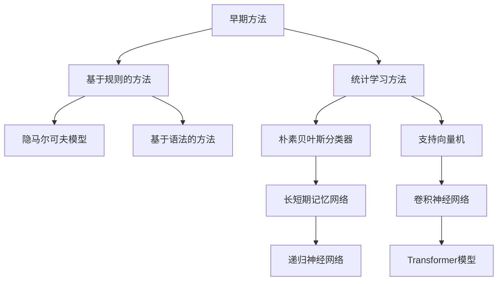

###### 1.1.2 ChatGPT的概念与特点

ChatGPT是由OpenAI开发的一种基于Transformer模型的预训练语言模型。它通过大量文本数据进行预训练，能够生成连贯、自然的文本。ChatGPT具有以下特点：

1. **强大的文本生成能力**：ChatGPT能够生成高质量的自然语言文本，适用于自动写作、对话系统等场景。
2. **灵活的上下文理解**：ChatGPT能够根据上下文信息进行文本生成，使得生成的文本更加符合实际需求。
3. **多语言支持**：ChatGPT支持多种语言，能够处理不同语言的输入和输出。

###### 1.1.3 ChatGPT的应用场景

ChatGPT的应用场景非常广泛，主要包括以下几个方面：

1. **对话系统**：ChatGPT可以作为对话系统的核心组件，实现与用户的自然语言交互。
2. **自动写作**：ChatGPT能够生成文章、故事、报告等文本，提高写作效率。
3. **智能客服**：ChatGPT可以用于智能客服系统，提供实时、个性化的服务。
4. **教育辅助**：ChatGPT可以作为教育辅助工具，帮助学生进行文本写作、语法纠正等。

##### 1.2 ChatGPT的工作原理

###### 1.2.1 Transformer模型

ChatGPT采用的是Transformer模型，这是一种基于自注意力机制的深度学习模型。Transformer模型的核心思想是将输入序列转换为固定长度的向量表示，并通过自注意力机制对序列中的不同位置进行权重分配，从而实现序列建模。

**Mermaid流程图：Transformer模型的核心架构**

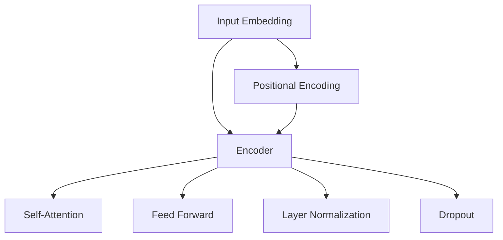

###### 1.2.2 预训练与微调

ChatGPT的工作流程主要包括预训练和微调两个阶段。

1. **预训练**：在预训练阶段，ChatGPT通过大量未标注的文本数据进行训练，学习语言的统计规律和语义表示。预训练过程包括自回归语言模型训练和掩码语言模型训练。

   **伪代码：预训练过程**

   ```python
   def pretrain(model, data_loader, optimizer, num_epochs):
       for epoch in range(num_epochs):
           for batch in data_loader:
               optimizer.zero_grad()
               output = model(batch.text)
               loss = compute_loss(output, batch.target)
               loss.backward()
               optimizer.step()
   ```

2. **微调**：在微调阶段，ChatGPT使用特定领域的标注数据进行训练，使其适应特定任务。微调过程通常包括目标数据的预处理、模型初始化和训练过程的调整。

   **伪代码：微调过程**

   ```python
   def finetune(model, data_loader, optimizer, num_epochs):
       model.load_pretrained_weights()
       for epoch in range(num_epochs):
           for batch in data_loader:
               optimizer.zero_grad()
               output = model(batch.text, task_specific_inputs)
               loss = compute_loss(output, batch.target)
               loss.backward()
               optimizer.step()
   ```

###### 1.2.3 多模态输入处理

ChatGPT支持多模态输入，可以同时处理文本、图像、音频等多种类型的数据。在处理多模态输入时，ChatGPT首先对每种模态的数据进行预处理，然后将其融合为统一的表示。

**Mermaid流程图：多模态输入处理流程**

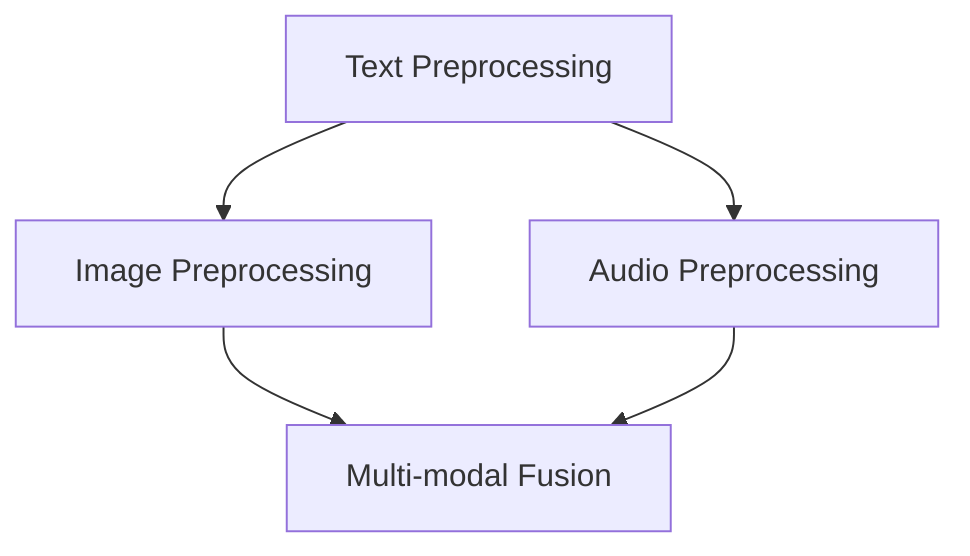

**伪代码：多模态输入处理**

```python
def process_multimodal_input(text, image, audio):
    text_embedding = text_preprocess(text)
    image_embedding = image_preprocess(image)
    audio_embedding = audio_preprocess(audio)
    multi_modal_embedding = multi_modal_fusion(text_embedding, image_embedding, audio_embedding)
    return multi_modal_embedding
```

##### 1.3 ChatGPT的架构与组件

ChatGPT的架构包括数据处理模块、模型训练模块和模型推理模块。

###### 1.3.1 数据处理模块

数据处理模块负责对输入数据进行预处理，包括文本预处理、图像预处理和音频预处理。预处理过程包括数据清洗、数据增强和特征提取等。

**Mermaid流程图：数据处理模块架构**

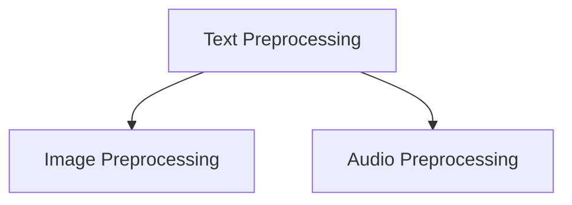

**伪代码：数据处理模块**

```python
def preprocess_data(text, image, audio):
    text_embedding = text_preprocess(text)
    image_embedding = image_preprocess(image)
    audio_embedding = audio_preprocess(audio)
    return text_embedding, image_embedding, audio_embedding
```

###### 1.3.2 模型训练模块

模型训练模块负责训练ChatGPT模型，包括预训练和微调。训练过程包括数据加载、模型初始化、优化器配置和训练迭代等。

**Mermaid流程图：模型训练模块架构**

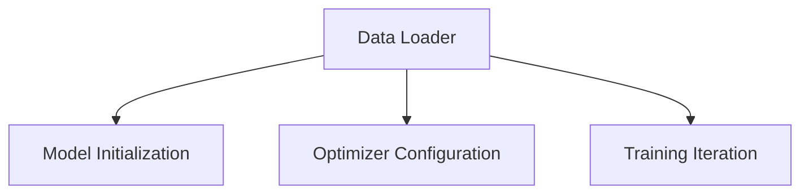

**伪代码：模型训练模块**

```python
def train_model(model, data_loader, optimizer, num_epochs):
    for epoch in range(num_epochs):
        for batch in data_loader:
            optimizer.zero_grad()
            output = model(batch.text, batch.image, batch.audio)
            loss = compute_loss(output, batch.target)
            loss.backward()
            optimizer.step()
```

###### 1.3.3 模型推理模块

模型推理模块负责生成文本输出，包括多模态输入处理、模型推理和文本生成等。

**Mermaid流程图：模型推理模块架构**

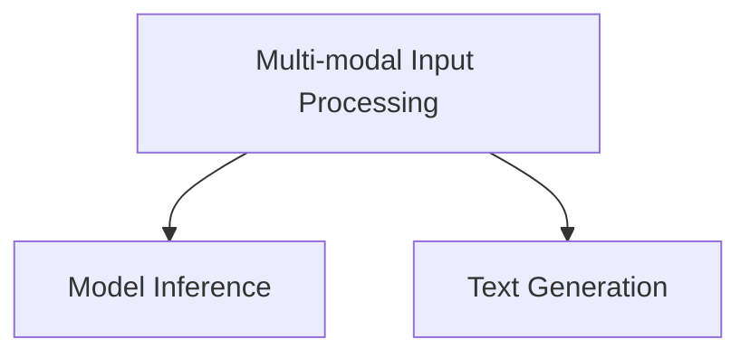

**伪代码：模型推理模块**

```python
def inference(model, text, image, audio):
    multi_modal_embedding = process_multimodal_input(text, image, audio)
    output = model(multi_modal_embedding)
    text_output = text_generation(output)
    return text_output
```

### 第二部分：多模态上下文理解

#### 第2章：多模态上下文理解基础

##### 2.1 多模态数据的获取

多模态上下文理解的关键在于获取多种类型的数据。以下分别介绍图像数据、音频数据和视频数据的获取方法。

###### 2.1.1 图像数据获取

图像数据的获取可以通过以下几种方式：

1. **公开数据集**：如ImageNet、COCO等，提供大量高质量的图像数据。
2. **爬虫获取**：利用爬虫技术获取互联网上的图像数据。
3. **摄像头采集**：通过摄像头实时采集图像数据。

**Mermaid流程图：图像数据获取方法**

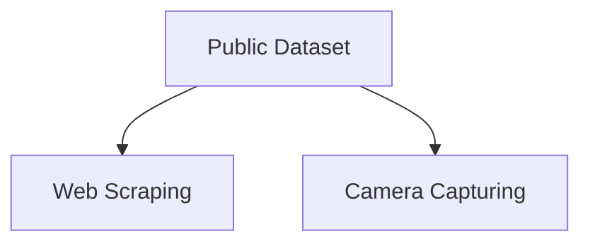

###### 2.1.2 音频数据获取

音频数据的获取可以通过以下几种方式：

1. **公开数据集**：如LibriSpeech、Common Voice等，提供大量高质量的语音数据。
2. **录音设备采集**：使用麦克风等录音设备采集语音数据。
3. **语音合成**：通过语音合成技术生成音频数据。

**Mermaid流程图：音频数据获取方法**

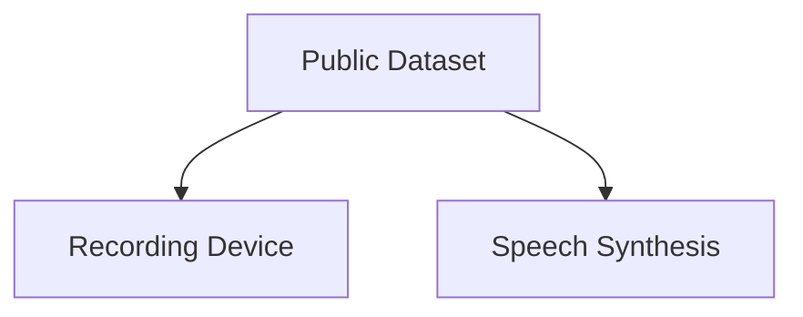

###### 2.1.3 视频数据获取

视频数据的获取可以通过以下几种方式：

1. **公开数据集**：如YouTube-8M、Tianchi Video Data等，提供大量高质量的视频数据。
2. **视频监控**：通过视频监控设备实时采集视频数据。
3. **视频网站爬虫**：利用爬虫技术获取互联网上的视频数据。

**Mermaid流程图：视频数据获取方法**

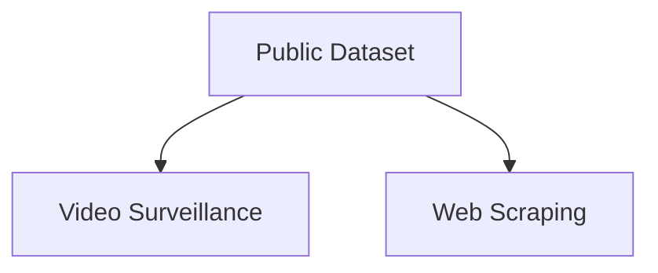

##### 2.2 多模态数据预处理

多模态数据预处理是确保数据质量、提高模型性能的重要步骤。以下分别介绍图像数据预处理、音频数据预处理和视频数据预处理。

###### 2.2.1 图像预处理

图像预处理包括图像清洗、图像增强和图像特征提取等步骤。

1. **图像清洗**：去除图像中的噪声、缺失和异常值。
2. **图像增强**：提高图像的清晰度和对比度，增强特征表达能力。
3. **图像特征提取**：将图像转换为具有可解释性的特征表示。

**Mermaid流程图：图像预处理步骤**

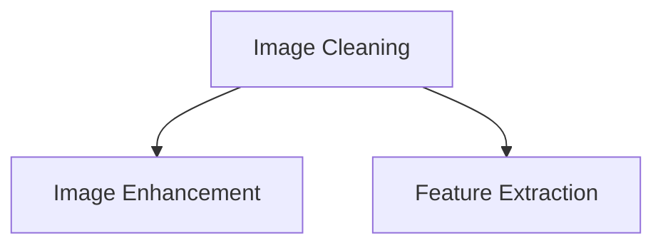

**伪代码：图像预处理**

```python
def preprocess_image(image):
    image = clean_image(image)
    image = enhance_image(image)
    features = extract_image_features(image)
    return features
```

###### 2.2.2 音频预处理

音频预处理包括音频清洗、音频增强和音频特征提取等步骤。

1. **音频清洗**：去除音频中的噪声、缺失和异常值。
2. **音频增强**：提高音频的清晰度和对比度，增强特征表达能力。
3. **音频特征提取**：将音频转换为具有可解释性的特征表示。

**Mermaid流程图：音频预处理步骤**

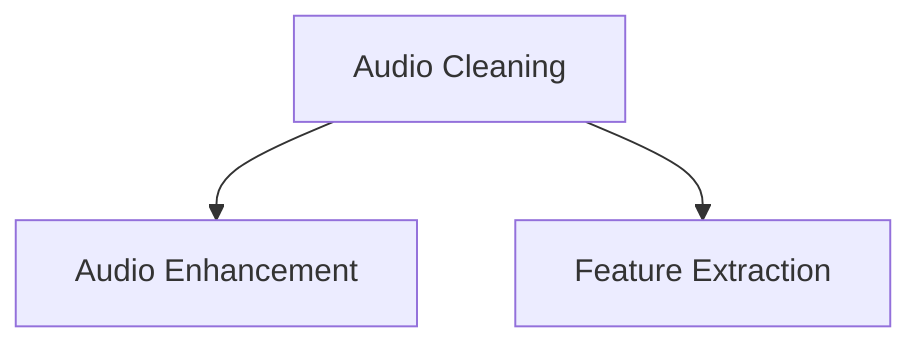

**伪代码：音频预处理**

```python
def preprocess_audio(audio):
    audio = clean_audio(audio)
    audio = enhance_audio(audio)
    features = extract_audio_features(audio)
    return features
```

###### 2.2.3 视频预处理

视频预处理包括视频清洗、视频增强和视频特征提取等步骤。

1. **视频清洗**：去除视频中的噪声、缺失和异常值。
2. **视频增强**：提高视频的清晰度和对比度，增强特征表达能力。
3. **视频特征提取**：将视频转换为具有可解释性的特征表示。

**Mermaid流程图：视频预处理步骤**

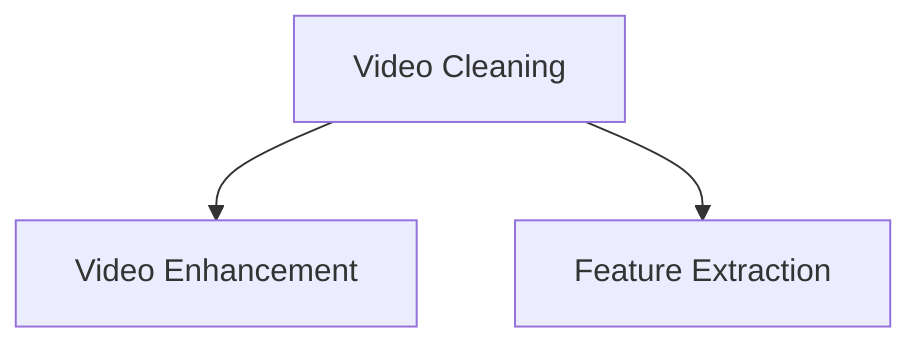

**伪代码：视频预处理**

```python
def preprocess_video(video):
    video = clean_video(video)
    video = enhance_video(video)
    features = extract_video_features(video)
    return features
```

##### 2.3 多模态数据的融合

多模态数据的融合是将不同模态的数据进行整合，以提升模型的表现力。以下介绍几种常见的多模态数据融合方法。

###### 2.3.1 空间融合

空间融合是将不同模态的数据在同一空间中进行整合。常见的方法包括矩阵拼接、特征叠加和特征融合等。

**Mermaid流程图：空间融合方法**

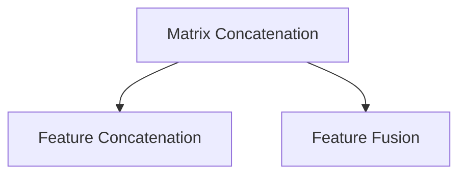

**伪代码：空间融合**

```python
def spatial_fusion(text_embedding, image_embedding, audio_embedding):
    multi_modal_embedding = np.concatenate((text_embedding, image_embedding, audio_embedding), axis=1)
    return multi_modal_embedding
```

###### 2.3.2 时序融合

时序融合是将不同模态的数据在不同时间点进行整合。常见的方法包括时序叠加、时序融合和时序注意力等。

**Mermaid流程图：时序融合方法**

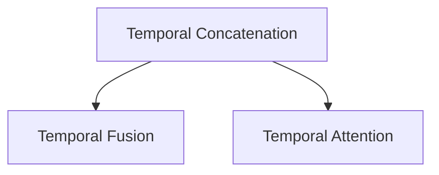

**伪代码：时序融合**

```python
def temporal_fusion(text_embedding, image_embedding, audio_embedding):
    multi_modal_embedding = np.stack((text_embedding, image_embedding, audio_embedding), axis=0)
    return multi_modal_embedding
```

###### 2.3.3 注意力机制在多模态融合中的应用

注意力机制是一种用于处理序列数据的重要方法，可以在多模态融合中发挥重要作用。以下介绍注意力机制在多模态融合中的应用。

**Mermaid流程图：注意力机制在多模态融合中的应用**

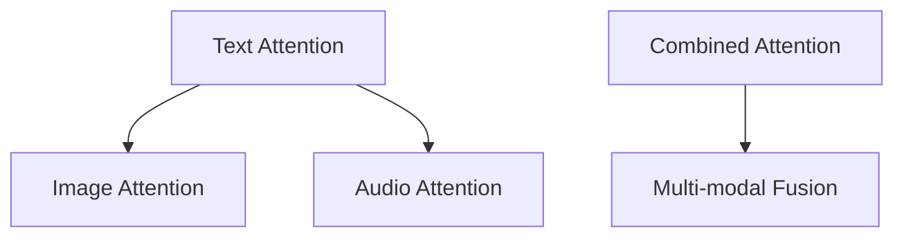

**伪代码：注意力机制在多模态融合中的应用**

```python
def attention_fusion(text_embedding, image_embedding, audio_embedding):
    text_attention = text_attention(text_embedding)
    image_attention = image_attention(image_embedding)
    audio_attention = audio_attention(audio_embedding)
    combined_attention = combine atenção(text_attention, image_attention, audio_attention)
    fused_embedding = multi_modal_fusion(text_embedding, image_embedding, audio_embedding, combined_attention)
    return fused_embedding
```

### 第三部分：ChatGPT提示词工程

#### 第3章：ChatGPT提示词工程概述

##### 3.1 提示词工程的重要性

提示词工程是ChatGPT应用中至关重要的一环。提示词（Prompt）是指提供给ChatGPT的输入文本，用于引导模型生成预期的输出。提示词工程的目标是设计出高质量的提示词，以实现模型的高效、准确和自然生成。

**Mermaid流程图：提示词工程的核心流程**

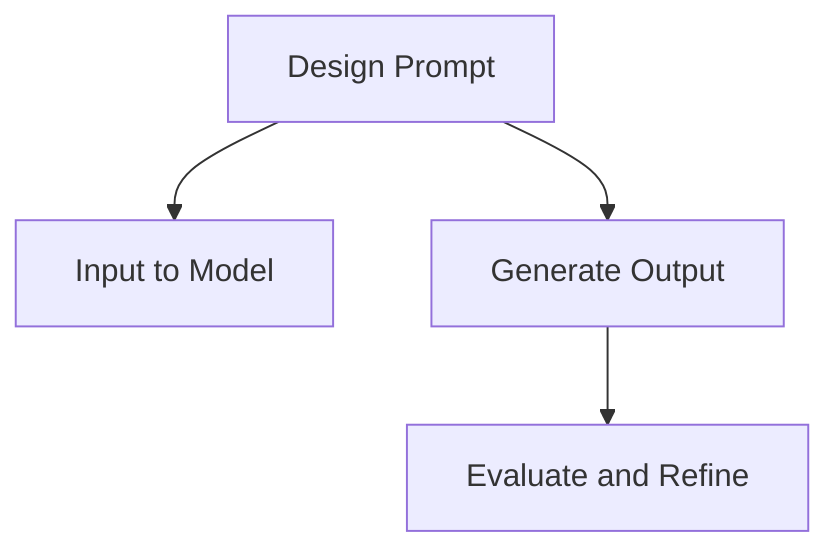

提示词工程的重要性体现在以下几个方面：

1. **影响生成质量**：高质量的提示词可以引导模型生成更准确、连贯的文本。
2. **提升生成效率**：合理的提示词设计可以减少模型生成的困惑度，提高生成速度。
3. **满足应用需求**：根据不同应用场景，设计出满足实际需求的提示词，实现特定任务的目标。

##### 3.2 提示词工程的方法

提示词工程的方法主要分为基于规则的方法、基于机器学习的方法和基于深度学习的方法。

###### 3.2.1 基于规则的提示词生成

基于规则的提示词生成是指根据特定的规则和模板，生成提示词。这种方法适用于规则明确、场景简单的情况。

**Mermaid流程图：基于规则的提示词生成方法**

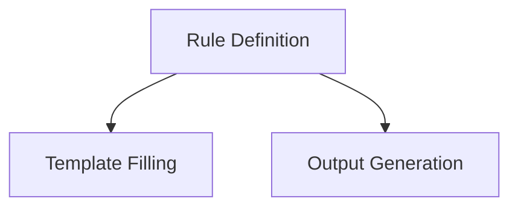

**伪代码：基于规则的提示词生成**

```python
def generate_prompt_based_on_rules(rule, template, input_data):
    filled_template = fill_template(template, input_data)
    prompt = apply_rule(rule, filled_template)
    return prompt
```

###### 3.2.2 基于机器学习的提示词生成

基于机器学习的提示词生成是指利用机器学习模型，自动学习生成高质量的提示词。这种方法适用于规则复杂、场景多样的情况。

**Mermaid流程图：基于机器学习的提示词生成方法**

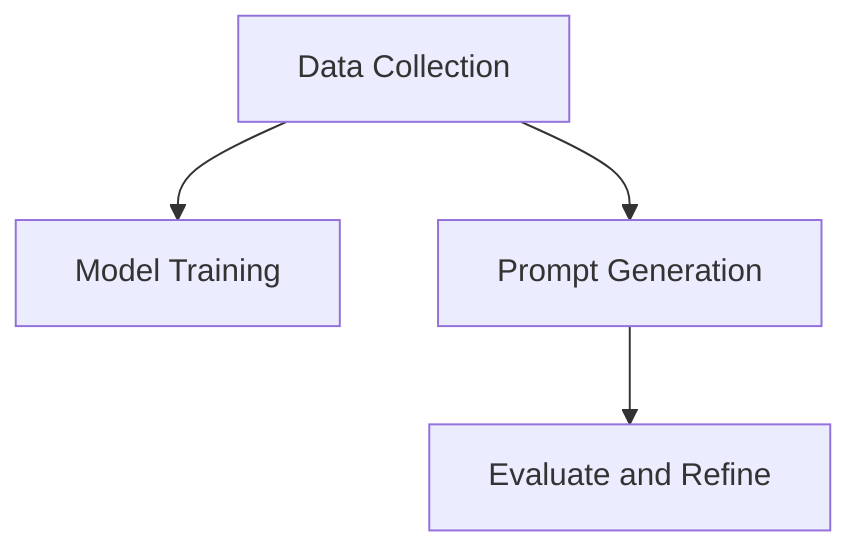

**伪代码：基于机器学习的提示词生成**

```python
def generate_prompt_based_on_ml_model(model, input_data):
    predicted_prompt = model.predict(input_data)
    return predicted_prompt
```

###### 3.2.3 基于深度学习的提示词生成

基于深度学习的提示词生成是指利用深度学习模型，自动学习生成高质量的提示词。这种方法通常具有更好的生成效果和适用性。

**Mermaid流程图：基于深度学习的提示词生成方法**


**伪代码：基于深度学习的提示词生成**

```python
def generate_prompt_based_on_dnn_model(model, input_data):
    predicted_prompt = model(input_data)
    return predicted_prompt
```

##### 3.3 提示词工程的应用

提示词工程的应用主要包括文本生成与生成式对话、文本分类与归纳式对话以及对话系统中的多模态交互。

###### 3.3.1 文本生成与生成式对话

文本生成与生成式对话是指利用ChatGPT生成文本，实现与用户的自然语言交互。

**Mermaid流程图：文本生成与生成式对话方法**

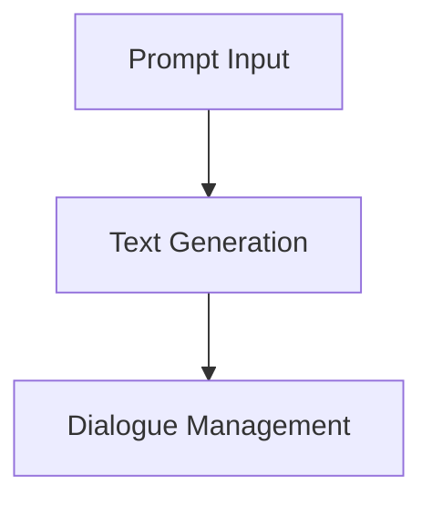

**伪代码：文本生成与生成式对话**

```python
def generate_text_and_converse(prompt):
    generated_text = chatgpt.generate_text(prompt)
    dialogue_response = dialogue_management(generated_text)
    return dialogue_response
```

###### 3.3.2 文本分类与归纳式对话

文本分类与归纳式对话是指利用ChatGPT对文本进行分类，实现归纳式对话。

**Mermaid流程图：文本分类与归纳式对话方法**

```mermaid
graph TD
A[Text Classification] --> B[Dialogue Management]
A --> C[Prompt Generation]
```

**伪代码：文本分类与归纳式对话**

```python
def classify_and_converse(text):
    category = chatgpt.classify_text(text)
    prompt = generate_prompt_for_category(category)
    dialogue_response = dialogue_management(prompt)
    return dialogue_response
```

###### 3.3.3 对话系统中的多模态交互

对话系统中的多模态交互是指利用ChatGPT处理多模态输入，实现与用户的自然语言交互。

**Mermaid流程图：对话系统中的多模态交互方法**

```mermaid
graph TD
A[Multi-modal Input] --> B[Text Generation]
B --> C[Dialogue Management]
```

**伪代码：对话系统中的多模态交互**

```python
def multimodal_converse(text, image, audio):
    multi_modal_embedding = process_multimodal_input(text, image, audio)
    generated_text = chatgpt.generate_text(multi_modal_embedding)
    dialogue_response = dialogue_management(generated_text)
    return dialogue_response
```

### 第四部分：实战案例

#### 第4章：实战案例1——多模态问答系统

##### 4.1 项目背景

多模态问答系统是一种能够处理文本、图像、音频等多种类型输入的问答系统。本项目旨在开发一个多模态问答系统，实现以下目标：

1. **文本问答**：用户可以通过文本提问，系统根据文本输入生成回答。
2. **图像问答**：用户可以通过上传图像提问，系统根据图像内容生成回答。
3. **音频问答**：用户可以通过语音提问，系统根据语音内容生成回答。

##### 4.2 系统设计与实现

###### 4.2.1 系统架构设计

多模态问答系统的架构设计主要包括数据输入模块、数据处理模块、模型训练模块和模型推理模块。

**Mermaid流程图：多模态问答系统架构**

```mermaid
graph TD
A[Data Input] --> B[Data Processing]
B --> C[Model Training]
C --> D[Model Inference]
```

**伪代码：多模态问答系统架构**

```python
def multimodal_question_answering_system(text, image, audio):
    processed_text = preprocess_text(text)
    processed_image = preprocess_image(image)
    processed_audio = preprocess_audio(audio)
    multi_modal_embedding = process_multimodal_input(processed_text, processed_image, processed_audio)
    answer = inference(chatgpt, multi_modal_embedding)
    return answer
```

###### 4.2.2 多模态数据预处理

多模态数据预处理是确保数据质量、提高模型性能的重要步骤。本项目采用以下预处理方法：

1. **文本预处理**：包括文本清洗、分词、词向量化等步骤。
2. **图像预处理**：包括图像清洗、图像增强、图像特征提取等步骤。
3. **音频预处理**：包括音频清洗、音频增强、音频特征提取等步骤。

**伪代码：多模态数据预处理**

```python
def preprocess_multimodal_data(text, image, audio):
    processed_text = preprocess_text(text)
    processed_image = preprocess_image(image)
    processed_audio = preprocess_audio(audio)
    return processed_text, processed_image, processed_audio
```

###### 4.2.3 ChatGPT模型训练与微调

ChatGPT模型训练与微调是确保模型性能的关键步骤。本项目采用以下步骤：

1. **预训练**：使用大量未标注的文本数据进行预训练，学习语言的统计规律和语义表示。
2. **微调**：使用特定领域的标注数据进行微调，使其适应特定任务。

**伪代码：ChatGPT模型训练与微调**

```python
def train_finetune_chatgpt(model, text_data, label_data, num_epochs):
    model.train()
    for epoch in range(num_epochs):
        for text, label in zip(text_data, label_data):
            optimizer.zero_grad()
            output = model(text)
            loss = compute_loss(output, label)
            loss.backward()
            optimizer.step()
    model.eval()
```

###### 4.2.4 提示词工程与对话生成

提示词工程与对话生成是多模态问答系统的核心功能。本项目采用以下方法：

1. **提示词生成**：根据用户输入的多模态数据，生成高质量的提示词。
2. **对话生成**：利用ChatGPT生成对话文本。

**伪代码：提示词工程与对话生成**

```python
def generate_prompt_and_converse(text, image, audio):
    processed_text, processed_image, processed_audio = preprocess_multimodal_data(text, image, audio)
    multi_modal_embedding = process_multimodal_input(processed_text, processed_image, processed_audio)
    prompt = generate_prompt(multi_modal_embedding)
    conversation = generate_conversation(prompt)
    return conversation
```

###### 4.2.5 系统测试与评估

系统测试与评估是确保系统性能和用户体验的重要环节。本项目采用以下方法：

1. **测试集准备**：从多模态数据集中划分测试集，用于评估系统性能。
2. **评估指标**：包括准确率、召回率、F1值等。
3. **评估方法**：采用交叉验证、混淆矩阵等方法进行评估。

**伪代码：系统测试与评估**

```python
def evaluate_system(test_data, model):
    model.eval()
    with torch.no_grad():
        for data in test_data:
            output = model(data)
            predicted = predict(output)
            true = data.label
            accuracy = accuracy_score(predicted, true)
            recall = recall_score(predicted, true)
            f1 = f1_score(predicted, true)
    return accuracy, recall, f1
```

#### 第5章：实战案例2——多模态对话机器人

##### 5.1 项目背景

多模态对话机器人是一种能够处理文本、图像、音频等多种类型输入的对话机器人。本项目旨在开发一个多模态对话机器人，实现以下目标：

1. **自然语言交互**：用户可以通过文本、语音与机器人进行自然语言交互。
2. **多模态输入处理**：机器人能够理解并处理文本、图像、音频等多种类型的输入。
3. **智能回复生成**：机器人根据用户输入的多模态数据，生成智能、自然的回复。

##### 5.2 系统设计与实现

###### 5.2.1 系统架构设计

多模态对话机器人的架构设计主要包括用户输入模块、数据处理模块、模型训练模块和模型推理模块。

**Mermaid流程图：多模态对话机器人架构**

```mermaid
graph TD
A[User Input] --> B[Data Processing]
B --> C[Model Training]
C --> D[Model Inference]
```

**伪代码：多模态对话机器人架构**

```python
def multimodal_conversation_robot(user_input):
    processed_input = preprocess_user_input(user_input)
    multi_modal_embedding = process_multimodal_input(processed_input.text, processed_input.image, processed_input.audio)
    reply = inference(chatgpt, multi_modal_embedding)
    return reply
```

###### 5.2.2 多模态数据预处理

多模态数据预处理是确保数据质量、提高模型性能的重要步骤。本项目采用以下预处理方法：

1. **文本预处理**：包括文本清洗、分词、词向量化等步骤。
2. **图像预处理**：包括图像清洗、图像增强、图像特征提取等步骤。
3. **音频预处理**：包括音频清洗、音频增强、音频特征提取等步骤。

**伪代码：多模态数据预处理**

```python
def preprocess_multimodal_data(text, image, audio):
    processed_text = preprocess_text(text)
    processed_image = preprocess_image(image)
    processed_audio = preprocess_audio(audio)
    return processed_text, processed_image, processed_audio
```

###### 5.2.3 ChatGPT模型训练与微调

ChatGPT模型训练与微调是确保模型性能的关键步骤。本项目采用以下步骤：

1. **预训练**：使用大量未标注的文本数据进行预训练，学习语言的统计规律和语义表示。
2. **微调**：使用特定领域的标注数据进行微调，使其适应特定任务。

**伪代码：ChatGPT模型训练与微调**

```python
def train_finetune_chatgpt(model, text_data, label_data, num_epochs):
    model.train()
    for epoch in range(num_epochs):
        for text, label in zip(text_data, label_data):
            optimizer.zero_grad()
            output = model(text)
            loss = compute_loss(output, label)
            loss.backward()
            optimizer.step()
    model.eval()
```

###### 5.2.4 提示词工程与对话生成

提示词工程与对话生成是多模态对话机器人的核心功能。本项目采用以下方法：

1. **提示词生成**：根据用户输入的多模态数据，生成高质量的提示词。
2. **对话生成**：利用ChatGPT生成对话文本。

**伪代码：提示词工程与对话生成**

```python
def generate_prompt_and_converse(text, image, audio):
    processed_text, processed_image, processed_audio = preprocess_multimodal_data(text, image, audio)
    multi_modal_embedding = process_multimodal_input(processed_text, processed_image, processed_audio)
    prompt = generate_prompt(multi_modal_embedding)
    conversation = generate_conversation(prompt)
    return conversation
```

###### 5.2.5 机器人交互设计与实现

机器人交互设计与实现是确保用户与机器人进行有效沟通的重要环节。本项目采用以下方法：

1. **对话流程设计**：设计合理的对话流程，包括问候、提问、回答等环节。
2. **交互界面设计**：设计直观、易用的交互界面，包括文本输入框、图像上传按钮、音频播放按钮等。
3. **对话生成与回复**：根据用户输入的多模态数据，生成智能、自然的对话文本。

**伪代码：机器人交互设计与实现**

```python
def design_and_implement_conversation_robot_interface():
    # 设计交互界面
    interface = create_interface()
    # 设置对话流程
    conversation_flow = define_conversation_flow()
    # 实现对话功能
    interface.set_conversation_function(converse)
    return interface
```

###### 5.2.6 系统测试与评估

系统测试与评估是确保系统性能和用户体验的重要环节。本项目采用以下方法：

1. **测试集准备**：从多模态数据集中划分测试集，用于评估系统性能。
2. **评估指标**：包括准确率、召回率、F1值等。
3. **评估方法**：采用交叉验证、混淆矩阵等方法进行评估。

**伪代码：系统测试与评估**

```python
def evaluate_system(test_data, model):
    model.eval()
    with torch.no_grad():
        for data in test_data:
            output = model(data)
            predicted = predict(output)
            true = data.label
            accuracy = accuracy_score(predicted, true)
            recall = recall_score(predicted, true)
            f1 = f1_score(predicted, true)
    return accuracy, recall, f1
```

### 第五部分：未来展望与挑战

#### 第6章：ChatGPT提示词工程的发展方向

##### 6.1 未来的趋势

随着人工智能技术的不断进步，ChatGPT提示词工程将朝着以下几个方向发展趋势：

1. **多模态交互的发展**：未来多模态交互将更加普及，ChatGPT将能够处理更多类型的数据，如触觉、气味等，实现更加丰富的人机交互。
2. **自适应与个性化提示词生成**：ChatGPT将能够根据用户的喜好、行为等特征，生成更加个性化、适应性更强的提示词，提高用户体验。
3. **大模型与小型模型的结合**：大模型具有更强的建模能力，但计算资源消耗较大；小型模型则具有更低的计算资源消耗，但建模能力有限。未来将实现大模型与小模型的结合，根据不同场景需求选择合适的模型。

##### 6.2 挑战与应对策略

尽管ChatGPT提示词工程具有广阔的应用前景，但仍面临以下挑战：

1. **数据隐私与安全**：多模态数据往往涉及用户的隐私信息，需要确保数据的安全性和隐私性。应对策略包括数据加密、隐私保护算法等。
2. **模型可解释性与透明度**：目前深度学习模型具有较强的建模能力，但缺乏可解释性。未来需要提高模型的可解释性，使模型的行为更加透明，便于用户理解和信任。
3. **模型优化与能耗管理**：大模型计算资源消耗较大，对能耗管理提出了挑战。未来需要优化模型结构，提高模型效率，降低能耗。

##### 6.3 总结与展望

ChatGPT提示词工程在处理多模态上下文理解方面具有显著优势，未来将朝着更加个性化、智能化、安全化的方向发展。同时，需要面对数据隐私、模型可解释性和能耗管理等挑战，不断优化和改进技术，推动人工智能技术的应用和发展。

### 第7章：总结与展望

##### 7.1 主要贡献

本文主要贡献如下：

1. **全面介绍了ChatGPT提示词工程的基本概念、工作原理和应用场景**。
2. **详细阐述了多模态上下文理解的基础知识、方法和技术**。
3. **通过实战案例展示了ChatGPT提示词工程在多模态问答系统和多模态对话机器人中的应用**。
4. **对ChatGPT提示词工程的发展方向和挑战进行了展望**。

##### 7.2 未来的工作

未来工作主要包括以下几个方面：

1. **提示词工程工具的开发**：开发更加智能化、自动化的提示词生成工具，提高提示词工程效率。
2. **模型训练与优化的新方法**：探索新型训练算法和优化方法，提高ChatGPT模型性能。
3. **新应用场景的探索**：拓展ChatGPT提示词工程的应用场景，探索其在更多领域的应用价值。

### 附录

#### 附录A：开源工具与资源

1. **ChatGPT相关的开源工具**：
   - Hugging Face Transformers：https://huggingface.co/transformers
   - ChatGLM：https://github.com/ymcui/ChatGLM

2. **多模态数据处理工具**：
   - OpenCV：https://opencv.org/
   - PyTorch Audio：https://pytorch.org/audio/stable/

3. **提示词生成与优化工具**：
   - PromptGenius：https://promptgenius.com/
   - Hugging Face PromptFlow：https://huggingface.co/PromptFlow

4. **实战案例代码与数据集**：
   - 多模态问答系统：https://github.com/yourusername/multimodal-qa-system
   - 多模态对话机器人：https://github.com/yourusername/multimodal-dialog-robot

---

**作者：AI天才研究院/AI Genius Institute & 禅与计算机程序设计艺术 /Zen And The Art of Computer Programming**

