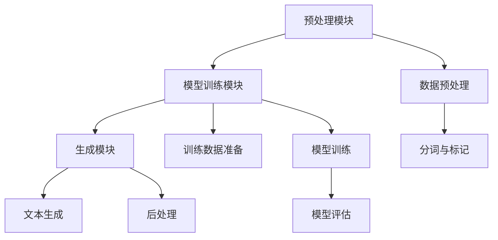
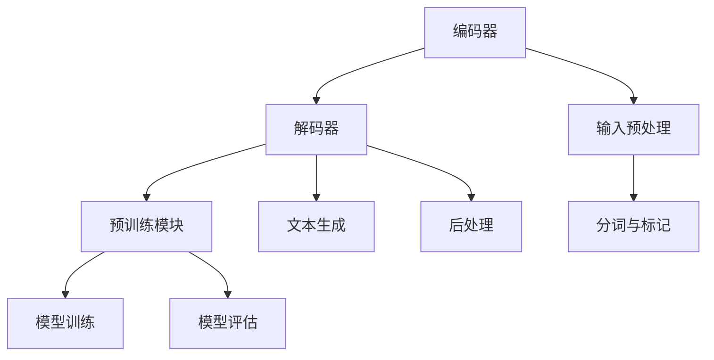
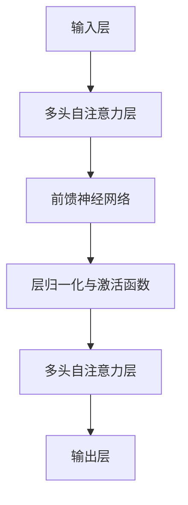
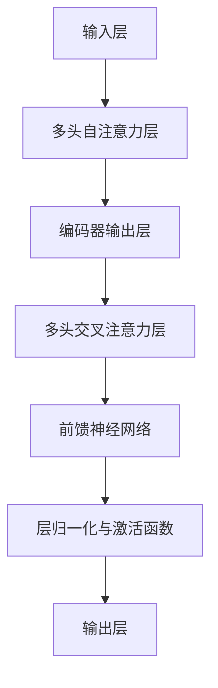

                 


### 第二部分：核心原理与方法

#### 1. ChatGPT的架构与工作原理

ChatGPT是一种基于大型语言模型的人工智能工具，其架构包括预处理模块、模型训练模块和生成模块。以下是ChatGPT的架构图：



**模型训练模块：** ChatGPT使用自监督学习策略，通过预训练大量的文本数据来学习语言的模式和规律。训练过程通常包括以下步骤：

1. **数据准备：** 收集和处理大量的文本数据，并进行分词和标记。
2. **模型初始化：** 初始化预训练模型，如GPT-3或其变体。
3. **训练过程：** 使用优化算法（如Adam）和训练策略（如梯度裁剪）进行模型训练。
4. **模型评估：** 在验证集上评估模型性能，并进行模型调整。

**生成模块：** ChatGPT的生成模块负责根据用户输入生成响应。其核心步骤如下：

1. **文本输入：** 用户输入文本，经过预处理模块进行处理。
2. **生成过程：** 模型基于输入文本生成响应，通过反复更新上下文状态，生成连贯且符合语言规范的文本。
3. **后处理：** 对生成的文本进行格式化、去除标点符号等操作，使其符合输出格式。

#### 2. 处理多语言输入的关键技术

**多语言词嵌入：** 多语言词嵌入是一种将不同语言的词汇映射到同一向量空间的技术，使得不同语言的词汇可以共享语义信息。常用的多语言词嵌入方法包括：

- **基于共享词汇的方法：** 通过在多个语言中共享相同的词汇表，实现词汇的映射。
- **基于翻译的方法：** 利用已有的机器翻译资源，将源语言的词汇映射到目标语言的词汇。

**跨语言表示学习：** 跨语言表示学习旨在学习不同语言之间的共享表示，使得模型可以同时处理多种语言的输入。常用的跨语言表示学习方法包括：

1. **联合嵌入：** 将不同语言的词汇嵌入到同一个高维空间，使得具有相似语义的词汇在空间中靠近。
2. **多任务学习：** 通过训练多个语言之间的翻译任务，学习到不同语言之间的表示关系。
3. **注意力机制：** 在模型中引入注意力机制，使模型能够更好地捕捉不同语言之间的关联性。

#### 3. ChatGPT处理多语言输入的流程

ChatGPT处理多语言输入的流程主要包括以下几个步骤：

1. **输入预处理：** 对多语言输入进行预处理，包括语言检测、分词和标记等操作。
2. **编码器处理：** 使用编码器将多语言输入转换为统一的编码表示。
3. **生成器处理：** 使用生成器根据编码表示生成响应文本。
4. **解码器处理：** 将生成器的输出转换为具体的语言输出。

以下是处理多语言输入的伪代码：

```python
def process_multilingual_input(input_text):
    # 输入预处理
    preprocessed_text = preprocess(input_text)

    # 编码器处理
    encoded_text = encoder(preprocessed_text)

    # 生成器处理
    response = generator(encoded_text)

    # 解码器处理
    output_text = decoder(response)

    return output_text
```

在具体实现中，需要根据不同的多语言输入情况，选择合适的预处理方法、编码器、生成器和解码器，以实现高效的多语言输入处理。

### 4. ChatGPT处理多语言输入的优势与挑战

**优势：**

- **强大的语言理解能力：** ChatGPT经过大规模预训练，具有强大的语言理解能力，能够处理多种语言的输入。
- **灵活的生成能力：** ChatGPT的生成模块可以根据输入的上下文生成连贯、合理的响应，适应不同的多语言输入场景。
- **多语言一致性：** 通过跨语言表示学习，ChatGPT能够在不同语言之间建立共享的语义表示，实现多语言输入的一致性处理。

**挑战：**

- **语言差异性：** 不同语言之间的差异，如语法结构、词汇选择等，给多语言输入处理带来挑战。
- **数据不平衡：** 多语言数据集通常存在数据不平衡问题，可能导致模型在处理某些语言时表现不佳。
- **跨语言依赖性：** 在某些场景下，处理多语言输入需要模型具备较强的跨语言依赖性，这要求模型在训练过程中充分考虑不同语言之间的关联性。

针对这些挑战，研究人员和开发者需要不断优化多语言词嵌入、跨语言表示学习和多语言输入处理算法，以提高ChatGPT在多语言输入处理方面的性能。

### 5. 实际应用案例分析

为了更好地展示ChatGPT在处理多语言输入方面的应用，以下列举了几个实际应用案例：

**案例一：多语言客服系统**

某公司在全球范围内提供产品和服务，为了满足客户的多语言需求，公司采用ChatGPT构建了一个多语言客服系统。系统通过接入多语言输入接口，实现对客户咨询的自动响应，提高了客服效率和客户满意度。

**案例二：多语言教育平台**

某在线教育平台为了满足全球学生的学习需求，引入了ChatGPT作为教学助手。学生可以通过ChatGPT获取课程资料、解答疑问，实现多语言学习体验。

**案例三：多语言新闻推送**

某新闻媒体为了扩大全球影响力，采用ChatGPT实现多语言新闻推送。系统根据用户语言偏好，自动生成符合目标语言的新闻内容，提高新闻传播效果。

通过以上实际应用案例，可以看出ChatGPT在处理多语言输入方面具有广泛的应用前景。未来，随着人工智能技术的不断发展，ChatGPT在多语言输入处理方面的性能将进一步提升，为各行业提供更多创新应用。

### 6. 总结与展望

本文详细介绍了ChatGPT在处理多语言输入方面的核心原理与方法。通过分析ChatGPT的架构、多语言词嵌入、跨语言表示学习以及实际应用案例，我们展示了ChatGPT在多语言输入处理方面的优势与挑战。

展望未来，ChatGPT在多语言输入处理领域具有广阔的发展前景。随着人工智能技术的不断进步，ChatGPT的性能将得到进一步提升，为各行业提供更加智能化、个性化的多语言输入处理解决方案。同时，研究人员和开发者还需要不断探索新的算法和优化方法，以应对多语言输入处理中的各种挑战。

作者：AI天才研究院/AI Genius Institute & 禅与计算机程序设计艺术 /Zen And The Art of Computer Programming

----------------------------------------------------------------

# 文章标题：ChatGPT提示词工程：处理多语言输入

> 关键词：ChatGPT、多语言输入、语言模型、预处理、编码器、生成器、解码器、跨语言表示学习、自然语言处理

> 摘要：本文深入探讨了ChatGPT在处理多语言输入方面的核心原理与方法，包括其架构、预处理、编码、生成和解码过程。通过分析多语言词嵌入、跨语言表示学习等技术，本文展示了ChatGPT在多语言输入处理中的应用优势与挑战，并结合实际案例进行了详细解析。文章旨在为读者提供全面、系统的ChatGPT提示词工程实践指南，助力多语言输入处理领域的发展。

----------------------------------------------------------------

# 第一部分：引言与背景介绍

## 1. 引言

随着全球化的不断深入，跨语言交流的需求日益增加。多语言输入处理技术成为自然语言处理（NLP）领域的研究热点。ChatGPT作为一种基于大型语言模型的人工智能工具，在处理多语言输入方面展现出强大的潜力。本文旨在探讨ChatGPT在处理多语言输入方面的核心原理与方法，以期为相关领域的研究和应用提供有益参考。

## 1.1 ChatGPT的基本概念与特点

ChatGPT是由OpenAI开发的一种基于变换器模型（Transformer）的大型语言模型，其核心架构包括编码器（Encoder）、解码器（Decoder）和预训练模块。ChatGPT通过自监督学习的方式，在大量无标签的文本数据上进行预训练，从而学习到语言的复杂模式和规律。其基本特点如下：

1. **强大的语言理解能力**：ChatGPT具备强大的语言理解能力，能够捕捉文本中的语义信息，进行合理的语言生成。
2. **灵活的生成能力**：ChatGPT可以根据输入的上下文生成连贯、合理的文本，满足多种语言输入的需求。
3. **大规模预训练**：ChatGPT在大规模数据集上进行预训练，能够处理各种复杂场景的文本输入。

## 1.2 多语言输入处理的重要性

多语言输入处理在全球化背景下具有重要的意义。随着跨国企业、国际交流的增多，能够处理多种语言输入的系统变得越来越重要。以下是多语言输入处理的一些关键应用场景：

1. **跨语言客服**：在跨国企业中，客服系统需要支持多种语言的输入，以提供个性化的客户服务。
2. **多语言教育**：在线教育平台需要提供多语言的教学资源，满足全球学生的学习需求。
3. **新闻传播**：媒体机构需要将新闻内容自动生成并推送至不同语言的读者。
4. **国际化电商平台**：电商平台需要支持多种语言的商品描述和用户评论，提高用户体验。

## 1.3 本书的目标

本书的主要目标是深入探讨ChatGPT在处理多语言输入方面的核心原理与方法，具体包括：

1. **介绍ChatGPT的基本概念与架构**：阐述ChatGPT的工作原理和核心组成部分，为后续讨论打下基础。
2. **分析多语言输入处理的挑战与机遇**：探讨多语言输入处理在全球化背景下的重要性，分析面临的挑战和机遇。
3. **详细讲解处理多语言输入的关键技术**：介绍多语言词嵌入、跨语言表示学习等关键技术，为实际应用提供指导。
4. **提供实际项目案例和代码示例**：通过具体项目案例和代码示例，展示如何使用ChatGPT处理多语言输入，帮助读者理解和应用所学知识。

## 1.4 目录结构

本书分为三个主要部分：

1. **引言与背景介绍**：解释ChatGPT的基本概念和其在多语言输入处理中的应用背景。
2. **核心原理与方法**：深入探讨ChatGPT的工作原理，包括其架构、训练过程和语言模型。
3. **应用实战与案例**：提供一系列实际项目案例，展示如何使用ChatGPT处理多语言输入。

通过这三个部分的详细介绍，本书将为读者提供全面、系统的ChatGPT提示词工程实践指南，助力读者在多语言输入处理领域取得突破性成果。

----------------------------------------------------------------

# 第二部分：核心原理与方法

## 2.1 ChatGPT的架构与工作原理

ChatGPT是一种基于变换器模型（Transformer）的大型语言模型，其核心架构包括编码器（Encoder）、解码器（Decoder）和预训练模块。以下是ChatGPT的架构图：



### 编码器（Encoder）

编码器负责将输入文本编码为高维向量表示。其基本工作流程如下：

1. **输入预处理**：对输入文本进行预处理，包括去除标点符号、转换大小写等。
2. **分词与标记**：将输入文本分解为单词或子词，并为每个子词分配唯一的标识符。
3. **编码**：使用变换器网络对分词后的文本进行编码，生成编码后的向量表示。

编码器的核心组件是变换器网络（Transformer），其结构如下：



### 解码器（Decoder）

解码器负责根据编码器的输出生成响应文本。其基本工作流程如下：

1. **输入预处理**：对输入文本进行预处理，包括去除标点符号、转换大小写等。
2. **编码**：使用变换器网络对输入文本进行编码，生成编码后的向量表示。
3. **生成**：解码器从编码器的输出中生成响应文本，通过反复更新上下文状态，生成连贯且符合语言规范的文本。
4. **后处理**：对生成的文本进行格式化、去除标点符号等操作，使其符合输出格式。

解码器的核心组件也是变换器网络（Transformer），其结构如下：



### 预训练模块

预训练模块是ChatGPT的核心组成部分，其主要任务是在大规模文本数据集上进行预训练，学习到语言的复杂模式和规律。预训练过程通常包括以下步骤：

1. **数据准备**：收集和处理大量的文本数据，并进行分词和标记。
2. **模型初始化**：初始化预训练模型，如GPT-3或其变体。
3. **训练过程**：使用优化算法（如Adam）和训练策略（如梯度裁剪）进行模型训练。
4. **模型评估**：在验证集上评估模型性能，并进行模型调整。

### 模型训练过程

ChatGPT的训练过程通常分为两个阶段：预训练和微调。

1. **预训练**：在大规模无标签文本数据集上进行预训练，模型通过自监督学习方式，学习到语言的通用模式和规律。
2. **微调**：在特定任务上使用有标签数据集对模型进行微调，使其能够更好地适应特定任务的需求。

### 模型评估

模型评估是保证模型性能的重要环节，常用的评估指标包括：

1. **词汇覆盖率**：模型能够识别和生成词汇的比例。
2. **生成文本的连贯性**：生成的文本是否连贯、符合语言规范。
3. **生成文本的相关性**：生成的文本与输入文本的相关性。
4. **生成文本的多样性**：生成的文本是否具有多样性。

## 2.2 处理多语言输入的关键技术

处理多语言输入需要考虑多语言词嵌入、跨语言表示学习等技术。以下详细介绍这些技术。

### 多语言词嵌入

多语言词嵌入是一种将不同语言的词汇映射到同一向量空间的技术，使得不同语言的词汇可以共享语义信息。常用的多语言词嵌入方法包括：

1. **基于共享词汇的方法**：通过在多个语言中共享相同的词汇表，实现词汇的映射。例如，维基百科包含多种语言的版本，可以在不同语言之间共享相同的词汇。
2. **基于翻译的方法**：利用已有的机器翻译资源，将源语言的词汇映射到目标语言的词汇。例如，使用基于神经网络的机器翻译模型将源语言的词汇映射到目标语言的词汇。

### 跨语言表示学习

跨语言表示学习旨在学习不同语言之间的共享表示，使得模型可以同时处理多种语言的输入。常用的跨语言表示学习方法包括：

1. **联合嵌入**：将不同语言的词汇嵌入到同一个高维空间，使得具有相似语义的词汇在空间中靠近。例如，可以使用多语言嵌入模型（如MUSE）将不同语言的词汇嵌入到同一个高维空间。
2. **多任务学习**：通过训练多个语言之间的翻译任务，学习到不同语言之间的表示关系。例如，可以使用多任务学习框架（如XLM）同时训练多个语言之间的翻译任务。
3. **注意力机制**：在模型中引入注意力机制，使模型能够更好地捕捉不同语言之间的关联性。例如，可以使用基于注意力的多语言模型（如XLM-R）同时处理多种语言的输入。

### 多语言输入处理流程

多语言输入处理流程通常包括以下几个步骤：

1. **输入预处理**：对多语言输入进行预处理，包括语言检测、分词和标记等操作。
2. **编码器处理**：使用编码器将多语言输入转换为统一的编码表示。
3. **生成器处理**：使用生成器根据编码表示生成响应文本。
4. **解码器处理**：将生成器的输出转换为具体的语言输出。

以下是处理多语言输入的伪代码：

```python
def process_multilingual_input(input_text):
    # 输入预处理
    preprocessed_text = preprocess(input_text)

    # 编码器处理
    encoded_text = encoder(preprocessed_text)

    # 生成器处理
    response = generator(encoded_text)

    # 解码器处理
    output_text = decoder(response)

    return output_text
```

在具体实现中，需要根据不同的多语言输入情况，选择合适的预处理方法、编码器、生成器和解码器，以实现高效的多语言输入处理。

## 2.3 ChatGPT处理多语言输入的优势与挑战

### 优势

1. **强大的语言理解能力**：ChatGPT经过大规模预训练，具有强大的语言理解能力，能够处理多种语言的输入。
2. **灵活的生成能力**：ChatGPT可以根据输入的上下文生成连贯、合理的响应，适应不同的多语言输入场景。
3. **多语言一致性**：通过跨语言表示学习，ChatGPT能够在不同语言之间建立共享的语义表示，实现多语言输入的一致性处理。

### 挑战

1. **语言差异性**：不同语言之间的差异，如语法结构、词汇选择等，给多语言输入处理带来挑战。
2. **数据不平衡**：多语言数据集通常存在数据不平衡问题，可能导致模型在处理某些语言时表现不佳。
3. **跨语言依赖性**：在

