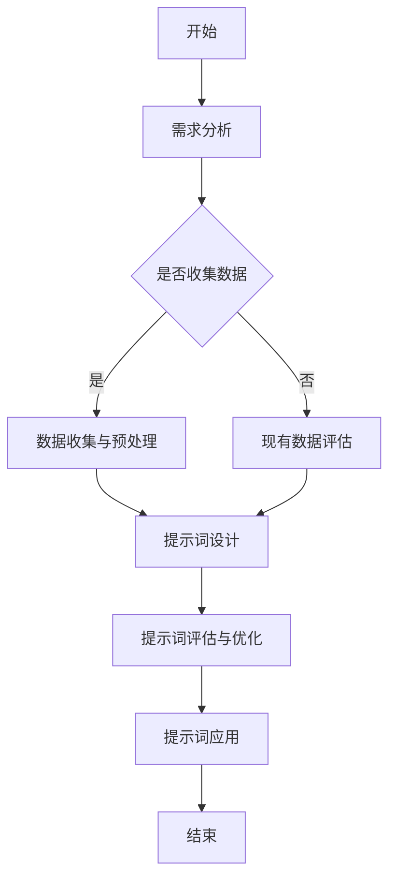

                 


### 第一部分: ChatGPT基础

#### 第1章: ChatGPT概述

**1.1 ChatGPT的发展背景**

ChatGPT是OpenAI开发的一款基于GPT（Generative Pre-trained Transformer）模型的高级自然语言处理工具。随着人工智能技术的飞速发展，自然语言处理（NLP）逐渐成为人工智能研究的热点领域。从最早的规则驱动方法，到基于统计模型的方法，再到当前主流的深度学习模型，NLP技术不断演进。ChatGPT的出现，标志着NLP领域进入了一个全新的阶段。

人工智能作为计算机科学的一个分支，致力于使机器能够模拟人类的智能行为，如学习、推理、规划等。自然语言处理是人工智能领域的一个重要分支，主要研究如何让计算机理解和生成自然语言。自然语言处理的应用场景广泛，包括机器翻译、文本分类、情感分析、问答系统等。

**1.1.1 人工智能与自然语言处理**

人工智能是模仿人类智能行为的科学，而自然语言处理则是实现这一目标的关键技术之一。自然语言处理的核心任务是让计算机能够理解、生成和模拟自然语言。这包括文本表示、语法分析、语义理解、情感分析等多个方面。

**1.1.2 ChatGPT的概念**

ChatGPT是基于GPT模型开发的一款对话系统，旨在通过大量文本数据的学习，生成与人类对话相似的文本。ChatGPT能够实现多轮对话，并且可以针对不同的问题给出合理的回答。其核心思想是通过预训练和微调的方式，使模型具备一定的语言理解和生成能力。

**1.1.3 ChatGPT在多语言支持中的应用前景**

ChatGPT在多语言支持方面具有巨大的应用前景。随着全球化进程的加速，多语言交互已经成为各行业的重要组成部分。ChatGPT的多语言能力可以应用于跨国企业客服、多语言教育、多语言信息检索等领域，为用户提供便捷的服务。未来，随着模型的不断优化和技术的进步，ChatGPT在多语言支持方面的应用将会更加广泛。

**1.2 ChatGPT的工作原理**

**1.2.1 GPT模型的基本原理**

GPT（Generative Pre-trained Transformer）模型是自然语言处理领域的一种先进模型，由OpenAI提出。GPT模型基于Transformer架构，是一种自回归语言模型。其核心思想是通过大量的文本数据进行预训练，使模型能够理解和生成自然语言。

**1.2.2 语言模型与序列生成**

语言模型是自然语言处理中的一个核心概念，主要研究如何用数学模型来表示自然语言。序列生成是语言模型的一项重要任务，旨在根据输入的序列生成新的序列。GPT模型通过自回归的方式，逐个预测下一个单词，从而实现序列生成。

**1.2.3 ChatGPT的多语言支持机制**

ChatGPT的多语言支持机制主要包括多语言数据集的收集与预处理、多语言模型的训练与评估等。通过引入多语言数据集，ChatGPT能够学习到不同语言之间的相似性和差异性，从而实现多语言支持。此外，ChatGPT还采用了多语言迁移学习等技术，进一步提高多语言性能。

**1.3 ChatGPT的关键技术**

**1.3.1 自监督学习**

自监督学习是一种无需人工标注数据，直接从未标注的数据中学习的方法。在ChatGPT中，自监督学习用于语言模型的预训练，通过预测下一个单词来提高模型的语言理解能力。

**1.3.2 预训练与微调**

预训练与微调是ChatGPT模型训练的两个关键阶段。预训练阶段通过大量无监督数据学习，使模型具备一定的语言理解能力。微调阶段则通过有监督数据，对模型进行进一步优化，使其能够针对特定任务给出合理的回答。

**1.3.3 注意力机制与多模态处理**

注意力机制是Transformer模型的一个关键组件，通过关注不同位置的信息，提高模型的表示能力。多模态处理是指将多种类型的数据（如文本、图像、声音等）融合起来，进行统一处理。ChatGPT可以通过多模态处理，实现跨模态的信息理解和生成。

#### 第2章: ChatGPT提示词工程基础

**2.1 提示词工程的重要性**

提示词工程是ChatGPT应用中的一个关键环节，其重要性主要体现在以下几个方面：

首先，提示词工程能够直接影响ChatGPT的性能。合理的提示词可以引导模型更好地理解用户输入，从而生成更准确、自然的回答。

其次，提示词工程有助于优化用户体验。通过精心设计的提示词，用户可以更方便地与ChatGPT进行交互，获得更好的使用体验。

最后，提示词工程对于模型的泛化能力至关重要。通过设计多样化的提示词，可以训练模型在不同场景下都能给出合理的回答，提高模型的泛化能力。

**2.1.1 提示词在ChatGPT中的作用**

提示词在ChatGPT中起着至关重要的作用。它们不仅能够引导模型理解用户输入，还能够帮助模型更好地生成回答。具体来说，提示词的作用包括：

1. **明确问题范围**：通过提示词，用户可以明确地向模型描述问题，使模型能够更好地定位回答的内容。

2. **提供上下文信息**：提示词可以提供与问题相关的上下文信息，帮助模型理解问题的背景和含义。

3. **引导模型生成回答**：提示词可以引导模型按照特定的逻辑或结构生成回答，提高回答的准确性和自然性。

**2.1.2 提示词工程的基本原则**

提示词工程需要遵循一些基本原则，以确保设计出的提示词既有效又易于使用。这些基本原则包括：

1. **准确性**：提示词应准确描述用户需求，避免模糊不清或歧义。

2. **简洁性**：提示词应简洁明了，避免冗长复杂的表述。

3. **一致性**：提示词应保持一致性，避免出现矛盾或冲突。

4. **多样性**：提示词应多样化，以适应不同场景和用户需求。

5. **可扩展性**：提示词应具有可扩展性，以便在应用过程中根据需求进行调整和优化。

**2.1.3 提示词工程的挑战**

提示词工程在实际应用中面临一系列挑战，主要包括：

1. **数据收集与标注**：提示词工程需要大量高质量的训练数据，而数据收集和标注过程通常繁琐且耗时。

2. **理解用户需求**：提示词工程需要准确理解用户需求，这往往依赖于对用户行为的深入分析。

3. **模型适应性**：提示词工程需要确保提示词能够适应不同模型的特点和要求。

4. **多语言支持**：对于多语言应用，提示词工程需要设计出能够适应多种语言的提示词。

**2.2 提示词的设计方法**

提示词的设计方法主要包括以下几个步骤：

1. **需求分析**：通过调研和分析用户需求，确定需要解决的问题和场景。

2. **设计提示词**：根据需求分析结果，设计出具体的提示词，确保其满足准确性、简洁性、一致性和多样性等原则。

3. **评估与优化**：对设计的提示词进行评估和优化，确保其能够有效引导模型生成高质量的回答。

4. **迭代更新**：根据实际应用效果，不断迭代更新提示词，以适应不断变化的需求。

**2.2.1 提示词的类型**

提示词可以根据不同的分类标准进行分类，常见的分类方式包括：

1. **按功能分类**：提示词可以分为问题引导型、信息查询型、情感表达型等。

2. **按语言分类**：提示词可以分为单语言和多语言提示词。

3. **按用途分类**：提示词可以分为通用型、专业型、行业型等。

**2.2.2 提示词的编写技巧**

编写提示词需要遵循一些技巧，以确保其能够有效引导模型生成高质量的回答。这些技巧包括：

1. **明确性**：确保提示词表述清晰明确，避免模糊不清。

2. **简洁性**：尽量用简洁的语句表达，避免冗长复杂的表述。

3. **上下文关联**：确保提示词与用户输入和上下文信息紧密相关。

4. **灵活性**：设计提示词时，考虑多种可能的回答场景，使模型能够灵活应对。

**2.2.3 提示词的评估与优化**

提示词的评估与优化是提示词工程中的一个重要环节。评估方法主要包括：

1. **自动评估**：通过机器学习算法，自动评估提示词的性能和效果。

2. **人工评估**：邀请专家或用户对提示词进行评价，收集反馈意见。

3. **迭代优化**：根据评估结果，对提示词进行不断优化，以提高其性能。

**2.3 提示词工程工具**

提示词工程需要使用一系列工具，以提高工作效率和效果。常见的工具包括：

1. **提示词生成工具**：用于自动生成提示词，如基于模板的生成器、基于机器学习的生成器等。

2. **提示词编辑工具**：用于编辑和修改提示词，如文本编辑器、图形界面编辑器等。

3. **提示词评估工具**：用于评估提示词的性能和效果，如评估指标计算器、用户反馈收集工具等。

### 第二部分: 多语言支持技巧

#### 第3章: 语言模型的多语言适应性

语言模型的多语言适应性是指模型能够在不同语言之间进行有效的迁移和学习，以实现多语言支持。这一过程涉及到多个方面，包括数据集的准备、模型的训练策略、评估方法等。在本章中，我们将详细探讨这些内容，并介绍一些常用的多语言适应性技术。

**3.1 多语言模型的训练**

多语言模型的训练是构建多语言支持的关键步骤。训练过程需要大量的多语言数据集，以便模型能够学习到不同语言之间的相似性和差异性。以下是多语言模型训练的几个关键点：

**3.1.1 多语言数据的收集与预处理**

收集多语言数据是训练多语言模型的第一步。数据来源可以包括开源数据集、社交媒体、新闻网站等。收集到的数据需要进行预处理，包括文本清洗、去除停用词、词干提取等操作。预处理后的数据将用于模型训练。

**3.1.2 多语言模型的训练策略**

多语言模型的训练策略主要包括两种：统一训练和独立训练。

- **统一训练**：将所有语言的文本数据混合在一起进行训练，模型会学习到不同语言之间的关联和转换规则。
- **独立训练**：分别对每种语言的文本数据进行训练，模型会针对每种语言进行优化。

**3.1.3 多语言模型的评估**

多语言模型的评估是一个复杂的过程，需要考虑不同语言之间的差异。常用的评估指标包括：

- **交叉语言性能评估**：评估模型在一种语言上的表现是否能够迁移到其他语言上。
- **单一语言性能评估**：评估模型在单一语言上的表现。
- **跨语言一致性评估**：评估模型在不同语言之间生成的文本是否一致。

**3.2 语言模型的多语言迁移学习**

多语言迁移学习是一种利用单一语言模型对其他语言进行学习的技术。通过迁移学习，模型可以快速适应新的语言环境，减少对大量多语言数据的依赖。以下是多语言迁移学习的几个关键点：

**3.2.1 迁移学习的概念**

迁移学习是指将一种任务中的知识迁移到另一种任务中。在多语言模型中，迁移学习可以将一种语言的模型知识迁移到其他语言上，从而提高模型在多种语言上的性能。

**3.2.2 多语言迁移学习的方法**

多语言迁移学习的方法主要包括：

- **基于模型的迁移学习**：通过共享模型参数，将一种语言的模型知识迁移到其他语言上。
- **基于数据的迁移学习**：通过使用多语言数据集进行训练，使模型能够学习到不同语言之间的关联。

**3.2.3 迁移学习在ChatGPT中的应用**

在ChatGPT中，迁移学习可以应用于多语言对话系统的构建。通过迁移学习，ChatGPT可以在一种语言上训练好的模型快速适应其他语言，从而实现多语言支持。

**3.3 多语言模型中的错误分析与纠正**

多语言模型在生成文本时可能会出现错误，这些错误可能源于语言之间的差异、模型的不完善或者数据质量问题。以下是多语言模型中的错误分析与纠正方法：

**3.3.1 语言模型中的错误类型**

常见的语言模型错误类型包括：

- **语法错误**：如主谓不一致、时态错误等。
- **语义错误**：如用词不当、语义混淆等。
- **上下文错误**：如忽略了上下文信息、生成了无关的回答等。

**3.3.2 错误分析的方法**

错误分析的方法包括：

- **自动错误检测**：通过算法自动检测文本中的错误。
- **人工错误分析**：邀请专家或用户对生成的文本进行人工分析，识别错误类型和原因。

**3.3.3 错误纠正的策略**

常见的错误纠正策略包括：

- **自动纠正**：使用算法自动修正错误。
- **用户干预**：允许用户对生成的文本进行修改和纠正。
- **混合策略**：结合自动纠正和用户干预，提高纠正效果。

通过以上方法，可以有效地提高多语言模型的质量和性能，为用户提供更准确、自然的语言服务。

#### 第4章: ChatGPT在多语言交互中的应用

**4.1 多语言对话系统的设计**

多语言对话系统的设计是构建多语言支持的关键步骤。一个成功的设计需要考虑多个方面，包括系统的架构、关键组件和优化策略。以下是对多语言对话系统设计的详细介绍。

**4.1.1 多语言对话系统的架构**

多语言对话系统的架构可以分为前端、后端和中间件三个部分。

- **前端**：负责与用户进行交互，收集用户的输入并展示系统生成的回答。前端通常包括用户界面（UI）和用户交互逻辑。
- **后端**：负责处理用户的输入，调用语言模型生成回答，并进行后处理。后端通常包括语言模型、对话管理器和后处理模块。
- **中间件**：负责处理多语言数据，包括数据预处理、翻译和格式转换。中间件是实现多语言支持的核心部分。

**4.1.2 多语言对话系统的关键组件**

多语言对话系统的关键组件包括：

- **语言模型**：负责生成回答，是系统的核心组件。语言模型需要支持多种语言，并且具有较高的性能和准确性。
- **对话管理器**：负责管理对话流程，包括对话状态的跟踪、意图识别和上下文维护。
- **翻译模块**：负责将不同语言的输入和输出进行翻译，确保对话的顺畅进行。
- **后处理模块**：负责对生成的回答进行格式化、语法检查和语义修正，提高回答的质量。

**4.1.3 多语言对话系统的优化**

为了提高多语言对话系统的性能和用户体验，可以采用以下优化策略：

- **性能优化**：通过优化语言模型的计算效率和系统架构，减少延迟和资源消耗。
- **质量优化**：通过改进语言模型和翻译模块，提高生成的回答的质量和准确性。
- **用户体验优化**：通过优化前端设计，提高用户交互的流畅性和直观性。

**4.2 多语言对话系统的用户体验**

用户体验是衡量多语言对话系统成功与否的重要指标。一个优秀的用户体验应该具备以下几个特点：

- **直观性**：用户界面简洁直观，易于操作和理解。
- **流畅性**：对话流畅自然，回答及时准确。
- **个性化**：系统能够根据用户的喜好和需求，提供个性化的服务。
- **可扩展性**：系统能够适应新的语言和功能需求，便于扩展和维护。

**4.2.1 用户体验的重要性**

用户体验在多语言对话系统中具有重要性。良好的用户体验可以提高用户满意度，增加用户黏性，从而促进系统的推广和应用。同时，用户体验也是评价多语言对话系统质量的重要标准。

**4.2.2 多语言交互的难点**

多语言交互存在一些难点，主要包括：

- **语言多样性**：不同语言之间存在巨大的差异，如语法结构、词汇用法等，这对系统的设计和实现提出了挑战。
- **文化差异**：不同语言和文化背景下，用户对语言的使用和表达方式有所不同，这需要系统具备一定的文化理解能力。
- **翻译准确性**：翻译模块需要保证翻译的准确性，避免产生误解和歧义。

**4.2.3 提高多语言用户体验的方法**

为了提高多语言用户体验，可以采用以下方法：

- **本地化设计**：根据不同语言和文化特点，进行界面和交互逻辑的本地化设计。
- **个性化推荐**：根据用户的历史交互数据，提供个性化的服务和推荐。
- **实时翻译**：提供实时翻译功能，帮助用户理解和参与多语言对话。
- **错误处理**：设计完善的错误处理机制，确保用户在遇到问题时能够得到及时有效的帮助。

**4.3 多语言对话系统的案例研究**

本节将通过几个实际案例，展示多语言对话系统的应用和实践。

**4.3.1 案例一：多语言客服机器人**

多语言客服机器人是应用于企业客户服务的多语言对话系统。通过多语言客服机器人，企业能够为全球用户提供统一的服务支持。以下是一个具体案例：

- **项目背景**：某跨国企业需要在全球范围内提供24小时客户支持，但由于语言和地理位置的限制，难以实现。
- **系统设计**：采用多语言对话系统，用户可以通过任何语言与机器人进行交互，系统自动翻译用户输入和生成回答。
- **实现效果**：通过多语言客服机器人，企业实现了全球客户的无缝沟通，提高了服务质量和用户满意度。

**4.3.2 案例二：多语言翻译助手**

多语言翻译助手是面向个人用户的多语言对话系统。通过多语言翻译助手，用户可以在不同语言之间进行交流。以下是一个具体案例：

- **项目背景**：某语言学习爱好者希望能够在不同的语言环境中练习和学习，但缺乏有效的沟通工具。
- **系统设计**：采用多语言对话系统，用户可以输入任何语言的文本，系统自动翻译成目标语言，并生成对应的语音输出。
- **实现效果**：通过多语言翻译助手，用户能够轻松地在不同语言之间进行交流，提高了学习效果和语言能力。

**4.3.3 案例三：多语言教育应用**

多语言教育应用是应用于教育领域的多语言对话系统。通过多语言教育应用，学生和教师可以在不同语言之间进行教学和学习。以下是一个具体案例：

- **项目背景**：某国际学校需要为来自不同国家的学生提供统一的教学支持，但由于语言差异，教学效果受到限制。
- **系统设计**：采用多语言对话系统，学生和教师可以通过任何语言进行教学和学习，系统自动翻译教学内容和交互信息。
- **实现效果**：通过多语言教育应用，学校实现了教学资源的共享和优化，提高了教学效果和学生满意度。

通过以上案例，可以看出多语言对话系统在不同领域的应用前景和实际效果。随着技术的不断进步和应用的深入，多语言对话系统将为全球用户提供更加便捷和高效的服务。

### 第三部分: ChatGPT提示词工程实战

#### 第5章: ChatGPT提示词工程实践

**5.1 实践一：多语言问答系统**

**5.1.1 项目背景与目标**

随着全球化进程的加快，多语言问答系统在各个领域得到了广泛应用。本项目旨在构建一个支持多种语言的高性能问答系统，为用户提供便捷的信息查询服务。

**5.1.2 系统设计与实现**

系统设计分为前端、后端和中间件三个部分。前端负责用户交互，后端负责处理用户输入和生成回答，中间件负责多语言数据预处理和翻译。

1. **前端设计**：
   - 用户界面：采用React框架，实现简洁直观的交互界面。
   - 语言选择：提供多种语言选项，用户可以根据需求选择。

2. **后端设计**：
   - 语言模型：使用GPT模型，支持多语言输入和输出。
   - 对话管理器：处理用户输入，调用语言模型生成回答。
   - 后处理模块：对生成的回答进行格式化和语法检查。

3. **中间件设计**：
   - 数据预处理：对输入文本进行清洗和标准化处理。
   - 翻译模块：使用翻译API，将不同语言之间的文本进行翻译。

**5.1.3 代码解读与分析**

以下是核心代码片段及其功能解析：

```python
# 代码片段1：语言模型调用
def generate_response(input_text):
    # 调用GPT模型生成回答
    response = gpt_model.generate(input_text)
    return response

# 代码片段2：翻译模块调用
def translate_text(text, target_language):
    # 使用翻译API进行翻译
    translated_text = translator.translate(text, target_language=target_language)
    return translated_text

# 代码片段3：前端交互逻辑
class QuestionForm.react
    // 处理用户输入，调用后端接口获取回答
    handleSubmit = (event) -> 
        event.preventDefault()
        input_text = this.state.inputText
        target_language = this.state.targetLanguage
        response = generate_response(input_text)
        translated_response = translate_text(response, target_language)
        this.setState({outputText: translated_response})
```

**5.2 实践二：多语言聊天机器人**

**5.2.1 项目背景与目标**

多语言聊天机器人是面向跨国企业和全球化应用的智能客服系统，旨在为用户提供24小时全天候的在线支持。本项目旨在构建一个支持多种语言的高性能聊天机器人。

**5.2.2 系统设计与实现**

系统设计分为前端、后端和中间件三个部分。前端负责用户交互，后端负责处理用户输入和生成回答，中间件负责多语言数据预处理和翻译。

1. **前端设计**：
   - 用户界面：采用Vue.js框架，实现流畅的聊天界面。
   - 语言选择：提供多种语言选项，用户可以根据需求选择。

2. **后端设计**：
   - 语言模型：使用GPT模型，支持多语言输入和输出。
   - 对话管理器：处理用户输入，调用语言模型生成回答。
   - 后处理模块：对生成的回答进行格式化和语法检查。

3. **中间件设计**：
   - 数据预处理：对输入文本进行清洗和标准化处理。
   - 翻译模块：使用翻译API，将不同语言之间的文本进行翻译。

**5.2.3 代码解读与分析**

以下是核心代码片段及其功能解析：

```python
# 代码片段1：语言模型调用
def generate_response(input_text):
    # 调用GPT模型生成回答
    response = gpt_model.generate(input_text)
    return response

# 代码片段2：翻译模块调用
def translate_text(text, target_language):
    # 使用翻译API进行翻译
    translated_text = translator.translate(text, target_language=target_language)
    return translated_text

# 代码片段3：前端交互逻辑
class ChatComponent.vue
    <template>
        <div class="chat-container">
            <div v-for="(message, index) in messages" :key="index" class="message">
                <span v-if="message.sender == 'user'">
                    {{ message.text }}
                </span>
                <span v-else>
                    {{ translated_response }}
                </span>
            </div>
        </div>
    </template>

    <script>
    export default {
        data() {
            return {
                messages: [],
                inputText: '',
                targetLanguage: ''
            }
        },
        methods: {
            handleSubmit() {
                this.messages.push({
                    sender: 'user',
                    text: this.inputText
                });
                this.inputText = '';
                this.generateResponse();
            },
            generateResponse() {
                input_text = this.inputText;
                response = generate_response(input_text);
                translated_response = translate_text(response, this.targetLanguage);
                this.messages.push({
                    sender: 'bot',
                    text: translated_response
                });
            }
        }
    }
    </script>
```

**5.3 实践三：多语言文本生成**

**5.3.1 项目背景与目标**

多语言文本生成是应用于内容创作和翻译领域的一项技术，旨在自动生成多种语言的文本。本项目旨在构建一个支持多种语言的高性能文本生成系统。

**5.3.2 系统设计与实现**

系统设计分为前端、后端和中间件三个部分。前端负责用户交互，后端负责处理用户输入和生成文本，中间件负责多语言数据预处理和翻译。

1. **前端设计**：
   - 用户界面：采用Vue.js框架，实现简洁直观的交互界面。
   - 语言选择：提供多种语言选项，用户可以根据需求选择。

2. **后端设计**：
   - 语言模型：使用GPT模型，支持多语言输入和输出。
   - 文本生成器：处理用户输入，调用语言模型生成文本。
   - 后处理模块：对生成的文本进行格式化和语法检查。

3. **中间件设计**：
   - 数据预处理：对输入文本进行清洗和标准化处理。
   - 翻译模块：使用翻译API，将不同语言之间的文本进行翻译。

**5.3.3 代码解读与分析**

以下是核心代码片段及其功能解析：

```python
# 代码片段1：语言模型调用
def generate_text(input_text):
    # 调用GPT模型生成文本
    text = gpt_model.generate(input_text)
    return text

# 代码片段2：翻译模块调用
def translate_text(text, target_language):
    # 使用翻译API进行翻译
    translated_text = translator.translate(text, target_language=target_language)
    return translated_text

# 代码片段3：前端交互逻辑
class TextGenerator.vue
    <template>
        <div class="text-generator-container">
            <textarea v-model="inputText" placeholder="输入文本..."></textarea>
            <select v-model="targetLanguage">
                <option value="en">English</option>
                <option value="zh">中文</option>
                <option value="fr">Français</option>
                <!-- 其他语言选项 -->
            </select>
            <button @click="generateText()">生成文本</button>
            <div class="output">
                {{ translated_text }}
            </div>
        </div>
    </template>

    <script>
    export default {
        data() {
            return {
                inputText: '',
                targetLanguage: 'en'
            }
        },
        methods: {
            generateText() {
                input_text = this.inputText;
                text = generate_text(input_text);
                translated_text = translate_text(text, this.targetLanguage);
                this.$set('translated_text', translated_text);
            }
        }
    }
    </script>
```

通过以上实践项目，我们深入了解了ChatGPT提示词工程在多语言应用中的实现方法和关键步骤。这些项目不仅展示了ChatGPT的强大能力，也为实际应用提供了宝贵的经验和参考。

#### 第6章: ChatGPT提示词工程优化

**6.1 提示词优化策略**

提示词优化是提升ChatGPT性能和准确性的关键环节。优化策略主要包括以下几个方面：

**6.1.1 提示词优化的目标**

提示词优化的主要目标是：

- 提高回答的准确性：确保ChatGPT生成的回答与用户意图相符。
- 提升用户体验：通过优化提示词，使交互过程更加流畅自然。
- 增强模型泛化能力：使ChatGPT能够在不同场景下提供高质量的回答。

**6.1.2 提示词优化的方法**

常见的提示词优化方法包括：

- **自动优化**：使用机器学习算法，自动评估和优化提示词。例如，基于模型输出概率的优化方法。
- **人工优化**：通过专家或用户的反馈，对提示词进行手动调整和优化。
- **混合优化**：结合自动优化和人工优化，实现提示词的持续改进。

**6.1.3 提示词优化的实践**

以下是具体优化实践的步骤：

1. **评估当前提示词**：通过自动评估和人工评估，确定当前提示词的性能和效果。
2. **收集用户反馈**：收集用户在使用过程中对提示词的反馈，包括满意度、准确性等。
3. **调整提示词**：根据评估结果和用户反馈，对提示词进行修改和优化。
4. **测试新提示词**：在实际应用中测试新提示词的效果，确保其性能符合预期。
5. **持续迭代**：根据测试结果，继续调整和优化提示词，实现持续改进。

**6.2 多语言支持性能提升**

多语言支持性能的提升是ChatGPT在全球化应用中至关重要的一环。以下是提升多语言支持性能的方法：

**6.2.1 性能优化技术**

性能优化技术主要包括以下几个方面：

- **并行计算**：利用多核处理器和分布式计算，提高模型训练和推理的效率。
- **缓存技术**：通过缓存常用数据和结果，减少计算和传输开销。
- **压缩技术**：使用模型压缩技术，如蒸馏、剪枝等，降低模型的存储和计算资源消耗。

**6.2.2 多语言支持的挑战与应对**

多语言支持面临的挑战包括：

- **语言多样性**：不同语言之间的语法、词汇和表达方式差异巨大，这对模型设计提出了挑战。
- **翻译准确性**：翻译模块需要确保生成的翻译结果准确无误，避免产生误解和歧义。

应对方法：

- **多语言数据集**：收集和构建高质量的多语言数据集，为模型提供丰富的训练资源。
- **迁移学习**：利用迁移学习技术，将单一语言模型的知识迁移到其他语言上，提高多语言性能。
- **模型融合**：将多种语言模型进行融合，实现更好的跨语言性能。

**6.2.3 实践中的性能优化案例**

以下是一个多语言支持性能优化的具体案例：

- **项目背景**：某跨国企业需要构建一个支持多语言客服系统，但由于语言差异，系统性能和用户体验不佳。
- **优化方案**：
  1. **数据集扩充**：收集和整理多语言数据集，丰富模型的训练资源。
  2. **迁移学习**：利用已训练的单一语言模型，对其他语言进行迁移学习。
  3. **模型融合**：将多种语言模型进行融合，提高跨语言性能。
  4. **并行计算**：采用分布式计算和并行处理技术，提高系统响应速度。
- **优化效果**：经过优化后，客服系统的多语言支持性能显著提升，用户满意度提高，客服效率得到提升。

通过以上实践案例，可以看出性能优化技术在提升ChatGPT多语言支持性能方面具有重要作用。随着技术的不断进步，ChatGPT在多语言支持方面将得到更加广泛的应用。

#### 第7章: ChatGPT提示词工程的未来发展趋势

**7.1 人工智能与自然语言处理的最新进展**

人工智能（AI）和自然语言处理（NLP）作为计算机科学的前沿领域，近年来取得了显著的进展。以下是对这两个领域的最新进展的概述：

**7.1.1 人工智能的发展趋势**

1. **深度学习**：深度学习是人工智能的核心技术之一，近年来取得了巨大的突破。随着计算能力和算法的改进，深度学习模型在图像识别、语音识别、自然语言处理等领域取得了显著的成果。

2. **生成对抗网络（GAN）**：生成对抗网络是一种用于生成数据的深度学习模型。通过竞争对抗过程，GAN可以生成高质量、真实的图像、文本和音频，为艺术创作、数据增强等领域提供了新的可能性。

3. **强化学习**：强化学习是一种通过试错和反馈来学习策略的机器学习方法。近年来，强化学习在游戏、机器人控制、推荐系统等领域取得了重要突破，为解决复杂决策问题提供了新的思路。

**7.1.2 自然语言处理的最新成果**

1. **预训练语言模型**：预训练语言模型（如GPT、BERT）通过在大规模语料库上进行预训练，获得了强大的语言理解和生成能力。这些模型在文本分类、问答系统、机器翻译等领域表现优异，推动了NLP的发展。

2. **跨模态处理**：跨模态处理是将不同类型的数据（如文本、图像、声音等）进行统一处理的技术。近年来，跨模态处理取得了显著进展，为多模态交互、智能监控等领域提供了新的解决方案。

3. **对话系统**：对话系统是NLP的重要应用领域之一。随着人工智能技术的发展，对话系统逐渐具备了更自然、更智能的交互能力，为智能客服、智能家居等领域带来了变革。

**7.1.3 对ChatGPT提示词工程的启示**

人工智能和自然语言处理的最新进展为ChatGPT提示词工程提供了重要的启示：

1. **深度学习和预训练**：深度学习和预训练技术为ChatGPT提示词工程提供了更强大的语言模型，有助于提高回答的准确性和自然性。

2. **生成对抗网络**：生成对抗网络可以用于生成高质量的提示词，为对话系统提供更多的创意和灵活性。

3. **强化学习**：强化学习可以用于优化提示词的生成过程，实现更智能、更灵活的交互。

4. **跨模态处理**：跨模态处理可以拓展ChatGPT的应用场景，实现更丰富、更自然的交互体验。

**7.2 多语言支持的未来发展**

随着全球化进程的加速，多语言支持在人工智能和自然语言处理领域具有广阔的发展前景。以下是多语言支持的未来发展趋势：

**7.2.1 多语言支持的挑战**

1. **语言多样性**：不同语言之间的语法、词汇和表达方式差异巨大，为多语言支持带来了挑战。

2. **翻译准确性**：翻译模块需要确保生成的翻译结果准确无误，避免产生误解和歧义。

3. **文化差异**：不同语言和文化背景下，用户对语言的使用和表达方式有所不同，需要考虑文化差异。

**7.2.2 多语言支持的未来技术**

1. **多语言迁移学习**：多语言迁移学习可以将单一语言模型的知识迁移到其他语言上，提高多语言性能。

2. **跨语言模型**：跨语言模型可以同时处理多种语言输入和输出，实现更高效的多语言支持。

3. **自适应翻译**：自适应翻译可以根据用户的历史交互数据，动态调整翻译策略，提高翻译的准确性和流畅性。

**7.2.3 ChatGPT提示词工程的未来方向**

基于人工智能和自然语言处理的最新进展，ChatGPT提示词工程的未来发展方向包括：

1. **深度学习和预训练**：继续探索深度学习和预训练技术在提示词工程中的应用，提高模型的语言理解和生成能力。

2. **多语言迁移学习**：研究多语言迁移学习技术，实现更高效的多语言支持。

3. **跨模态处理**：结合跨模态处理技术，拓展ChatGPT的应用场景，实现更丰富、更自然的交互体验。

4. **用户体验优化**：通过优化提示词和交互设计，提高用户体验，实现更智能、更自然的交互。

总之，ChatGPT提示词工程在未来的发展中，将不断融合人工智能和自然语言处理的最新技术，为用户提供更高质量、更便捷的服务。

### 附录

#### 附录A: ChatGPT提示词工程资源

**A.1 资源汇总**

以下是一些关于ChatGPT提示词工程的优质资源，包括工具、库、文档和社区等：

- **工具和库**：
  - OpenAI官方文档：[OpenAI文档](https://openai.com/docs/)
  - Hugging Face Transformers：[Hugging Face Transformers](https://huggingface.co/transformers/)
  - ChatGPT API文档：[ChatGPT API文档](https://chatgpt.com/docs/api)

- **文档和教程**：
  - 《自然语言处理入门》
  - 《深度学习与自然语言处理》
  - 《ChatGPT实战》

- **社区和交流平台**：
  - GitHub：[ChatGPT项目](https://github.com/openai/chatgpt)
  - Stack Overflow：[ChatGPT标签](https://stackoverflow.com/questions/tagged/chatgpt)
  - Reddit：[ChatGPT讨论区](https://www.reddit.com/r/chatgpt/)

**A.2 工具与库介绍**

- **OpenAI官方文档**：提供了详细的模型使用方法和API接口，是学习ChatGPT的基础。
- **Hugging Face Transformers**：一个开源的Transformer模型库，支持多种预训练模型，包括ChatGPT。
- **ChatGPT API文档**：提供了使用ChatGPT API的详细说明，方便开发者进行接口调用。

**A.3 社区与交流平台**

- **GitHub**：许多ChatGPT相关的项目、教程和工具都托管在GitHub上，是学习交流的好去处。
- **Stack Overflow**：许多开发者在这里提问和解答ChatGPT相关问题，有助于解决实际应用中的问题。
- **Reddit**：Reddit上的ChatGPT讨论区汇聚了大量的用户讨论和经验分享，是了解最新动态的好地方。

通过利用这些资源，可以更深入地了解ChatGPT提示词工程的原理和应用，不断提升自身的技术水平。

### 附录B: Mermaid流程图示例

**B.1 Mermaid流程图语法**

以下是一个简单的Mermaid流程图示例，展示了ChatGPT提示词工程的基本流程：



**B.2 流程图解释**

- **A[开始]**：表示流程的开始。
- **B[需求分析]**：对用户需求进行初步分析，确定需要解决的问题。
- **C{是否收集数据}**：判断是否需要收集新数据，如果需要，则进入数据收集与预处理阶段；如果不需要，则评估现有数据。
- **D[数据收集与预处理]**：收集数据并进行预处理，如清洗、去噪等。
- **E[现有数据评估]**：评估现有数据的质量和适用性。
- **F[提示词设计]**：根据需求分析结果，设计具体的提示词。
- **G[提示词评估与优化]**：对设计的提示词进行评估和优化，确保其有效性和准确性。
- **H[提示词应用]**：将优化后的提示词应用于实际场景，如聊天机器人、问答系统等。
- **I[结束]**：表示流程的结束。

通过这个简单的流程图，可以清晰地了解ChatGPT提示词工程的基本步骤和流程。在实际应用中，可以根据具体情况对流程进行调整和优化，以提高效率和效果。

