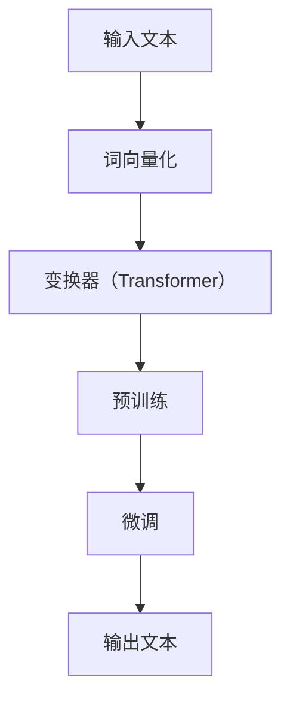
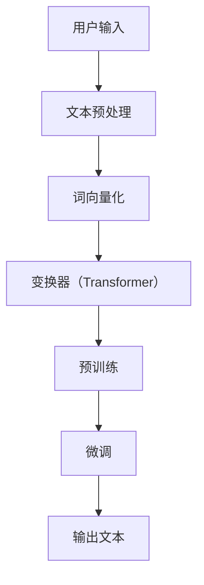

                 


### 文章标题：《ChatGPT提示词模板：快速上手指南》

### 关键词：ChatGPT，提示词模板，自然语言处理，快速上手，最佳实践

### 摘要：
本文旨在为开发者、数据科学家和人工智能爱好者提供一个关于ChatGPT提示词模板的全面指南。我们将探讨ChatGPT的背景和基本原理，介绍设计提示词模板的原则和方法，提供多个实用场景下的提示词模板示例，并分享实战经验和高级技巧。通过这篇文章，读者将能够快速掌握ChatGPT的提示词模板应用，提升自然语言处理项目的效率和效果。

----------------------------------------------------------------

# 《ChatGPT提示词模板：快速上手指南》

## 第一部分：ChatGPT概述

### 1.1 ChatGPT的起源与背景

#### 1.1.1 ChatGPT的诞生

ChatGPT是由OpenAI开发的一种基于GPT-3.5模型的人工智能助手。OpenAI成立于2015年，是一家位于美国的人工智能研究公司，致力于推动人工智能的发展，并确保其有益于人类。ChatGPT的发布标志着OpenAI在自然语言处理领域的一个重要里程碑。

#### 1.1.2 OpenAI与GPT系列模型

OpenAI以其强大的GPT系列模型而闻名，这些模型是自然语言处理领域的重要突破。GPT（Generative Pre-trained Transformer）模型是一种基于变换器（Transformer）架构的预训练语言模型。GPT-3.5模型是OpenAI在2020年发布的，具有超过1750亿个参数，是当时最大的语言模型。

#### 1.1.3 ChatGPT的特点与应用领域

ChatGPT具有以下特点：

1. **强大的语言生成能力**：能够生成流畅、自然的文本。
2. **多语言支持**：支持多种语言的输入和输出。
3. **上下文理解**：能够理解对话中的上下文信息，进行连贯的对话。
4. **灵活性**：可根据不同的场景和需求定制提示词模板。

ChatGPT的应用领域广泛，包括但不限于：

1. **客户服务**：自动化客服系统，提供快速、准确的客户支持。
2. **教育**：个性化学习助手，自动批改作业，提供学习建议。
3. **内容创作**：辅助撰写文章、报告、邮件等。
4. **娱乐**：创作故事、剧本、诗歌等。

### 1.2 ChatGPT的基本原理

#### 1.2.1 自然语言处理（NLP）基础

自然语言处理（NLP）是人工智能的一个重要分支，旨在使计算机能够理解、生成和处理人类语言。NLP的核心技术包括：

1. **语言模型**：用于预测文本中下一个单词或字符的概率。
2. **词向量化**：将单词转换为向量，以便在计算机中进行处理。
3. **命名实体识别（NER）**：识别文本中的特定实体，如人名、地名、组织名等。
4. **情感分析**：分析文本的情感倾向，如正面、负面或中性。

#### 1.2.1.1 语言模型

语言模型是NLP的基础，它通过学习大量文本数据，生成文本的概率分布。在ChatGPT中，GPT-3.5模型是一种基于变换器（Transformer）架构的预训练语言模型，其核心思想是通过学习文本中的模式，预测下一个词的概率。

#### 1.2.1.2 上下文理解

上下文理解是自然语言处理的关键，它使得模型能够理解文本中的隐含信息。ChatGPT通过预训练和微调，能够理解对话中的上下文信息，进行连贯的对话。这种能力使得ChatGPT在客户服务和教育等场景中具有很高的应用价值。

#### 1.2.2 GPT模型的架构

GPT模型是一种基于变换器（Transformer）架构的预训练语言模型。其核心组成部分包括：

1. **变换器（Transformer）**：一种基于自注意力机制的神经网络架构，能够捕获输入序列中的长距离依赖关系。
2. **预训练**：通过大量文本数据训练模型，使其具有通用语言理解能力。
3. **微调**：根据具体任务的需求，对预训练模型进行微调，以适应特定场景。

### 图解：ChatGPT的核心概念与架构

以下是一个简单的Mermaid流程图，用于展示ChatGPT的核心概念与架构：



## 第二部分：ChatGPT提示词模板设计与使用

### 2.1 提示词模板设计原则

设计提示词模板是成功应用ChatGPT的关键。以下是一些设计原则：

#### 2.1.1 明确目的与场景

在开始设计提示词模板之前，需要明确应用的目的和场景。这将帮助确定所需的输入和输出的格式，以及模板的总体结构。

#### 2.1.2 结构化信息

提示词模板应结构化，以便ChatGPT能够准确地理解输入的信息。结构化的信息有助于提高模型的性能和生成结果的准确性。

#### 2.1.3 避免歧义与不合适内容

设计提示词模板时，应避免使用可能引起歧义或生成不合适内容的词语。这有助于提高模型的质量和可靠性。

### 2.2 常用提示词模板

根据不同的应用场景，ChatGPT的提示词模板可以有多种类型。以下是一些常用的提示词模板：

#### 2.2.1 聊天场景

在聊天场景中，ChatGPT的提示词模板通常用于生成对话。以下是一些示例：

- **招呼与问候**：`你好！有什么可以帮助你的吗？`
- **常见问题回答**：`你有什么问题想问我吗？我会在一秒内回答你。`
- **转换话题**：`让我们换个话题吧，你对什么感兴趣？`

#### 2.2.2 专业场景

在专业场景中，ChatGPT的提示词模板通常用于提供技术支持和咨询。以下是一些示例：

- **技术支持与咨询**：`你需要技术支持吗？请告诉我具体的问题，我会尽力帮助你。`
- **行业知识普及**：`你对哪个行业感兴趣？我可以为你提供相关信息。`
- **客户服务**：`您好，这里是XX公司的客户服务中心，请问有什么可以帮助您的？`

### 2.3 提示词模板示例

以下是一些具体的提示词模板示例：

#### 2.3.1 商务沟通

- **邀请函**：`尊敬的XX先生/女士，我们很高兴邀请您参加2023年人工智能峰会，时间为3月15日至3月17日，地点在北京国际会议中心。期待您的光临！`
- **商务邮件**：`亲爱的XX，关于我们上周的会议，我想补充一些细节。以下是会议纪要，请您审阅并回复。谢谢！`
- **商务谈判**：`您好，我对我们的合作方案有几点建议，希望我们能够讨论并优化。请问您是否有时间安排会议？`

#### 2.3.2 教育场景

- **课堂问答**：`请问你对今天的课程内容有什么疑问？我会尽力解答。`
- **学习建议**：`根据你的学习进度，我建议你先完成第3章的内容，然后再进行第4章的学习。你觉得这个计划合理吗？`
- **作业批改**：`请提交你的作业，我会在24小时内完成批改，并给出详细的评语和建议。`

### 2.4 提示词模板实战

以下是一些实战案例，用于展示如何设计和使用提示词模板：

#### 2.4.1 实战一：客服聊天

- **客服脚本设计**：设计一个基本的客服聊天脚本，包括常见的问候语、问题回答和结束对话的语句。
- **情感分析**：使用ChatGPT进行情感分析，识别客户情绪，并根据情绪调整回答策略。
- **常见问题处理**：列出常见的客户问题，并设计相应的回答模板，以便快速响应用户需求。

#### 2.4.2 实战二：教育助手

- **问答系统设计**：设计一个问答系统，用于回答学生关于课程内容的问题。
- **个性化学习建议**：根据学生的学习进度和表现，提供个性化的学习建议和辅导。
- **作业自动批改**：设计一个自动批改作业的系统，提供评分和详细的反馈。

## 第三部分：高级技巧与优化

### 3.1 提示词模板的微调与优化

为了提高ChatGPT的性能和应用效果，可以对提示词模板进行微调和优化。以下是一些关键步骤：

#### 3.1.1 数据集准备

选择适合的数据集，用于微调和优化提示词模板。数据集应具有多样性和代表性，以确保模型在不同场景下都能够表现良好。

#### 3.1.2 微调方法

使用预训练的模型和优化算法，对提示词模板进行微调。常用的微调方法包括：

- **监督学习**：在已有的数据集上，使用有标签的数据进行训练，以调整模型参数。
- **强化学习**：通过交互和反馈，不断调整模型的行为，以优化其性能。

#### 3.1.3 模型优化策略

在微调过程中，可以采用以下策略来优化模型：

- **学习率调整**：根据模型的表现，调整学习率，以避免过拟合或欠拟合。
- **正则化**：使用正则化方法，如dropout、L2正则化等，来防止模型过拟合。
- **数据增强**：通过数据增强技术，如数据扩充、数据变换等，来提高模型的泛化能力。

### 3.2 性能调优与问题排查

在应用ChatGPT的过程中，可能会遇到性能问题或错误。以下是一些常见的性能问题和解决方法：

#### 3.2.1 性能指标

评估ChatGPT性能的常见指标包括：

- **准确率（Accuracy）**：模型预测正确的比例。
- **召回率（Recall）**：模型召回正确的比例。
- **F1分数（F1 Score）**：准确率和召回率的调和平均值。

#### 3.2.2 常见问题及解决方法

以下是一些常见问题及解决方法：

- **模型过拟合**：通过正则化、减小模型复杂度或增加训练数据来解决。
- **模型欠拟合**：通过增加模型复杂度、增加训练数据或调整训练策略来解决。
- **生成文本质量低**：通过调整提示词模板、增加预训练数据或优化模型结构来解决。

#### 3.2.3 调试技巧

在调试过程中，可以采用以下技巧：

- **逐层调试**：从输入层到输出层，逐步调试模型的每一部分。
- **对比实验**：通过对比不同参数、模型结构或训练策略的效果，来找出最佳配置。
- **日志记录**：记录模型训练过程中的重要信息，如损失函数、准确率等，以便分析和调试。

### 3.3 跨平台与API使用

ChatGPT可以部署在多个平台上，并通过API进行调用。以下是一些关键点：

#### 3.3.1 不同平台的使用

ChatGPT可以在以下平台上使用：

- **本地部署**：在个人计算机或服务器上部署ChatGPT模型，进行本地推理。
- **云计算平台**：使用云计算平台，如AWS、Google Cloud等，部署ChatGPT模型，以提供大规模的推理服务。
- **移动设备**：通过移动应用，如手机或平板电脑，访问ChatGPT服务。

#### 3.3.2 API调用与集成

通过API调用，可以将ChatGPT集成到各种应用程序中。以下是一些关键点：

- **API调用**：使用HTTP请求，向ChatGPT服务器发送请求，获取响应。
- **参数配置**：根据具体需求，配置API调用参数，如提示词、响应长度、温度设置等。
- **集成与调试**：将ChatGPT集成到应用程序中，进行调试和优化，确保其正常运行。

#### 3.3.3 安全与隐私考虑

在部署和使用ChatGPT时，需要考虑安全与隐私问题：

- **数据加密**：对传输的数据进行加密，确保数据安全。
- **隐私保护**：遵循隐私保护法规和最佳实践，确保用户隐私不受侵犯。
- **合规性检查**：定期检查模型和应用，确保其符合相关法律法规和伦理规范。

## 第四部分：案例分析与最佳实践

### 4.1 案例分析

以下是一些ChatGPT应用的案例分析，展示其在不同场景中的效果和经验：

#### 4.1.1 某公司客服系统改造案例

某大型科技公司决定使用ChatGPT改造其客服系统，以提高客户服务质量。通过微调和优化提示词模板，ChatGPT能够自动回答常见问题，进行情感分析，并根据客户情绪调整回答策略。改造后的客服系统不仅提高了响应速度，还显著降低了人工成本。

#### 4.1.2 某在线教育平台的问答助手案例

某在线教育平台引入ChatGPT作为问答助手，帮助学生解答学习中的问题。通过设计合适的提示词模板，ChatGPT能够提供准确、详细的解答，同时生成个性化的学习建议。这个问答助手受到了学生和教师的好评，提高了学习效果和满意度。

#### 4.1.3 某人工智能创业公司的市场推广案例

某人工智能创业公司使用ChatGPT进行市场推广，生成宣传文案、电子邮件和社交媒体帖子。通过微调和优化提示词模板，ChatGPT能够根据不同的推广场景和目标受众，生成具有吸引力和影响力的内容。这个方法显著提高了公司的市场知名度和用户转化率。

### 4.2 最佳实践

以下是一些ChatGPT应用的最佳实践，供读者参考：

#### 4.2.1 提示词模板编写经验分享

- **明确目标**：在编写提示词模板时，明确应用目标，确保模板设计符合需求。
- **结构化信息**：设计结构化的提示词模板，提高模型理解和生成结果的准确性。
- **简洁明了**：使用简洁、明了的语言编写提示词模板，避免歧义和不必要的复杂性。

#### 4.2.2 提高模型性能的技巧

- **数据质量**：使用高质量、多样化的数据集进行训练和微调，提高模型的泛化能力。
- **模型优化**：通过调整模型结构、学习率和正则化参数，优化模型性能。
- **持续学习**：定期更新模型和数据，使其能够适应不断变化的应用场景。

#### 4.2.3 遵循的伦理与规范

- **数据隐私**：保护用户数据隐私，遵循相关法律法规和伦理规范。
- **公平公正**：确保模型生成的结果公平、公正，不受偏见影响。
- **透明度**：提高模型和应用的可解释性，使用户了解其工作原理和决策过程。

## 第五部分：未来展望与发展趋势

### 5.1 ChatGPT在人工智能领域的发展

随着人工智能技术的不断进步，ChatGPT在自然语言处理领域的应用前景广阔。以下是一些关键发展趋势：

#### 5.1.1 大模型的发展趋势

大模型是人工智能领域的一个重要趋势，ChatGPT作为大型语言模型，具有显著的优势。未来，预计会有更多的类似大模型出现，进一步提升自然语言处理的能力。

#### 5.1.2 ChatGPT在各个行业中的应用

ChatGPT的应用领域将不断扩展，从客户服务、教育到医疗、金融等各个行业，都将受益于ChatGPT的高效、准确的自然语言处理能力。

#### 5.1.3 未来潜在的突破方向

未来，ChatGPT有望在以下方面取得突破：

- **跨模态处理**：将ChatGPT应用于图像、声音等多种模态的数据处理。
- **强化学习**：结合强化学习，提高ChatGPT的决策能力和适应性。
- **多语言处理**：进一步提高ChatGPT的多语言处理能力，支持更多语言。

### 5.2 AI伦理与法律法规

随着人工智能技术的发展，伦理和法律问题日益突出。以下是一些关键挑战和应对措施：

#### 5.2.1 AI伦理问题

AI伦理问题包括隐私保护、数据安全、算法偏见等。为了解决这些问题，需要建立一套完善的伦理规范和监管机制。

#### 5.2.2 法律法规的挑战

人工智能技术的发展对现有法律法规提出了挑战。需要制定新的法律法规，以适应人工智能时代的需求。

#### 5.2.3 应对措施与解决方案

以下是一些应对措施和解决方案：

- **加强伦理教育**：提高公众对AI伦理问题的认识，培养具有伦理意识的AI从业者。
- **建立监管机制**：建立独立的监管机构，监督AI技术的应用和开发。
- **加强法律法规建设**：制定和更新法律法规，确保AI技术的合法合规使用。

### 附录

#### 附录A：ChatGPT资源与工具

以下是一些ChatGPT相关的资源与工具，供读者参考：

- **资源链接**：
  - OpenAI官网：[https://openai.com/](https://openai.com/)
  - ChatGPT文档：[https://openai.com/api-docs/chatgpt](https://openai.com/api-docs/chatgpt)
- **开发工具介绍**：
  - OpenAI API：[https://openai.com/api/](https://openai.com/api/)
  - Hugging Face：[https://huggingface.co/](https://huggingface.co/)
- **社区与论坛**：
  - OpenAI社区：[https://openai.com/community/](https://openai.com/community/)
  - AI技术论坛：[https://www.ai-tech.org/](https://www.ai-tech.org/)

## 图解：ChatGPT的核心概念与架构

以下是一个简单的Mermaid流程图，用于展示ChatGPT的核心概念与架构：



## ChatGPT核心算法原理讲解

### 1. 语言模型原理

语言模型（Language Model，LM）是一种概率模型，用于预测下一个单词或字符的概率。在ChatGPT中，GPT模型是一种语言模型，它使用神经网络来学习大量文本数据，从而预测下一个词的概率。

#### 1.1 语言模型的基本原理

语言模型的核心思想是：通过统计文本数据，学习单词之间的概率分布。给定一个文本序列 $x_1, x_2, \ldots, x_n$，语言模型可以预测下一个词 $x_{n+1}$ 的概率，即 $P(x_{n+1} | x_1, x_2, \ldots, x_n)$。这种预测通常基于文本的局部信息，如前文中的单词或句子。

#### 1.2 语言模型的数学表示

语言模型的数学表示通常是一个概率分布函数，用于预测下一个词的概率。在ChatGPT中，这个概率分布函数是一个神经网络，其输入是前文序列的表示，输出是每个可能的下一个词的概率分布。

假设我们有 $V$ 个不同的单词，语言模型的输出是一个概率分布 $p(x_{n+1} | x_1, x_2, \ldots, x_n)$，其中 $x_{n+1}$ 是下一个单词，其数学表示为：

$$
p(x_{n+1} | x_1, x_2, \ldots, x_n) = \text{softmax}(\text{神经网络}(x_1, x_2, \ldots, x_n))
$$

其中，$\text{神经网络}$ 输出一个 $V$ 维的向量，表示每个单词的概率。

#### 1.3 语言模型的训练

语言模型的训练是通过最大化文本数据中的概率分布来进行的。具体来说，我们使用最大似然估计（Maximum Likelihood Estimation，MLE）来训练语言模型。最大似然估计的目标是找到一个参数 $θ$，使得训练数据的概率最大。

给定一个文本序列 $T = (x_1, x_2, \ldots, x_n)$，最大似然估计的目标是最大化以下对数似然函数：

$$
L(θ) = \log P(T | θ)
$$

其中，$P(T | θ)$ 是给定参数 $θ$ 的训练数据的概率。通过优化这个对数似然函数，我们可以训练出语言模型的参数 $θ$。

#### 1.4 语言模型的应用

语言模型在自然语言处理中有很多应用，包括：

- **文本生成**：生成连贯的文本，如文章、故事、对话等。
- **机器翻译**：将一种语言的文本翻译成另一种语言。
- **语音识别**：将语音信号转换为文本。
- **对话系统**：生成自然、连贯的对话。

### 2. GPT模型架构

GPT（Generative Pre-trained Transformer）模型是一种基于变换器（Transformer）架构的预训练语言模型。GPT模型由多个变换器层组成，每层变换器由自注意力机制和前馈网络构成。

#### 2.1 变换器（Transformer）架构

变换器（Transformer）是由Vaswani等人于2017年提出的一种用于序列到序列学习的神经网络架构。变换器架构的核心思想是自注意力机制（Self-Attention）和多头注意力（Multi-Head Attention）。

自注意力机制允许模型在处理每个输入时，关注其他所有输入的上下文信息。多头注意力则将输入序列分成多个部分，每个部分独立进行自注意力计算，然后合并结果。

#### 2.2 GPT模型结构

GPT模型的结构如下：

1. **输入层**：将输入文本转换为词向量化表示。
2. **变换器层**：包含多个变换器层，每层变换器由自注意力机制和前馈网络构成。
3. **输出层**：输出每个单词的概率分布。

一个典型的GPT模型可能包含数十亿个参数，其大小取决于层数、每层的变换器数量和隐藏尺寸。GPT-3.5模型是一个具有1750亿个参数的巨大模型，其规模远远超过之前的语言模型。

#### 2.3 预训练与微调

GPT模型采用预训练与微调的方法进行训练。预训练阶段使用大量无标签文本数据进行，使模型学习到通用语言知识。微调阶段则使用有标签的数据，根据具体任务调整模型参数。

预训练过程如下：

1. **数据预处理**：将文本数据转换为词向量化表示，并进行填充、掩码、随机遮盖等操作。
2. **训练模型**：在预训练数据上训练模型，使用自注意力机制和前馈网络优化模型参数。
3. **保存模型**：保存预训练好的模型，以便后续微调。

微调过程如下：

1. **数据准备**：准备有标签的数据集，如对话数据、文本分类数据等。
2. **微调模型**：在微调数据上训练模型，优化模型参数，以适应特定任务。
3. **评估模型**：在验证集和测试集上评估模型性能，调整参数以获得最佳结果。

### 3. ChatGPT的生成过程

ChatGPT的生成过程是一个典型的序列生成过程。给定一个初始输入，ChatGPT通过变换器层生成下一个词的概率分布，然后根据概率分布选择下一个词，并重复这个过程，直到生成完整的文本。

#### 3.1 输入处理

在生成过程开始之前，需要对输入进行处理。首先，将输入文本转换为词向量化表示，然后将其输入到GPT模型的变换器层。

#### 3.2 变换器层处理

在变换器层中，输入文本经过自注意力机制和前馈网络的处理，生成中间表示。这个表示包含了输入文本的上下文信息。

#### 3.3 输出层处理

在输出层，变换器层的中间表示通过一个线性层和softmax函数，生成每个单词的概率分布。这个概率分布表示了下一个词的可能选项。

#### 3.4 词选择

根据概率分布，选择下一个词。选择策略可以是贪心策略（选择概率最高的词）或随机策略（根据概率分布随机选择词）。

#### 3.5 重复过程

选择下一个词后，将其添加到输出序列，并作为输入继续生成下一个词。这个过程重复进行，直到生成完整的文本。

### 4. 伪代码示例

以下是一个简单的伪代码示例，用于说明ChatGPT的生成过程：

```python
# 初始化GPT模型
model = GPTModel()

# 输入文本
input_text = "你好，我想问问关于AI的一些问题。"

# 将输入文本转换为词向量化表示
input_embeddings = model.tokenize(input_text)

# 生成文本
output_sequence = []
while not done:
    # 将输入词向量化表示输入到模型
    input_embedding = model.encode(input_embeddings)

    # 通过变换器层生成下一个词的概率分布
    probability_distribution = model.generate(input_embedding)

    # 根据概率分布选择下一个词
    next_word = model.select_next_word(probability_distribution)

    # 将下一个词添加到输出序列
    output_sequence.append(next_word)

    # 更新输入词向量化表示
    input_embeddings = model.tokenize(next_word)

# 输出生成的文本
generated_text = " ".join(output_sequence)
print(generated_text)
```

### 5. 数学公式与详细讲解

在ChatGPT的生成过程中，涉及到一些数学公式和概念。以下是这些公式的详细讲解：

#### 5.1 Softmax函数

Softmax函数用于将一个向量转换为一个概率分布。给定一个向量 $z$，softmax函数定义为：

$$
\text{softmax}(z)_i = \frac{e^{z_i}}{\sum_{j=1}^{n} e^{z_j}}
$$

其中，$z_i$ 是向量 $z$ 的第 $i$ 个元素，$n$ 是向量的维度。

Softmax函数的作用是将向量的每个元素转换为概率，且所有元素的概率之和为1。

#### 5.2 自注意力机制

自注意力机制（Self-Attention）是一种用于计算输入序列的上下文表示的机制。给定一个输入序列 $x = (x_1, x_2, \ldots, x_n)$，自注意力机制可以计算一个权重向量 $w$，表示每个输入元素对输出的贡献。

自注意力机制的计算公式为：

$$
w_i = \text{softmax}\left(\frac{Q \cdot K_i}{\sqrt{d_k}}\right)
$$

其中，$Q$ 是查询向量，$K_i$ 是关键向量，$d_k$ 是关键向量的维度。

自注意力机制的输出是一个加权求和的结果：

$$
\text{self-attention}(Q, K, V) = \text{softmax}\left(\frac{Q \cdot K}{\sqrt{d_k}}\right) \cdot V
$$

其中，$V$ 是值向量。

#### 5.3 前馈网络

前馈网络（Feedforward Network）是一种简单的神经网络结构，用于对输入数据进行线性变换和非线性激活。给定一个输入向量 $x$，前馈网络的计算公式为：

$$
\text{激活函数}(x) = \text{激活函数}(\text{权重} \cdot x + \text{偏置})
$$

常用的激活函数包括ReLU（Rectified Linear Unit）和Sigmoid函数。

### 6. 举例说明

以下是一个简单的例子，说明如何使用ChatGPT生成文本：

假设我们有一个简短的对话，其中一个人问另一个问题，然后ChatGPT回答这个问题。

```
用户：什么是人工智能？
ChatGPT：人工智能（AI）是指由计算机系统执行的任务，这些任务通常需要人类智能来完成，如视觉识别、语言理解、决策和翻译。
```

在这个例子中，用户输入“什么是人工智能？”，ChatGPT首先将其转换为词向量化表示，然后通过变换器层生成下一个词的概率分布。ChatGPT选择概率最高的词“人工智能”，并添加到输出序列中。然后，ChatGPT继续生成下一个词，直到生成完整的回答。

### 7. 代码实现

以下是一个简单的Python代码示例，使用GPT模型生成文本：

```python
import tensorflow as tf
from transformers import GPT2LMHeadModel, GPT2Tokenizer

# 初始化模型和分词器
model = GPT2LMHeadModel.from_pretrained("gpt2")
tokenizer = GPT2Tokenizer.from_pretrained("gpt2")

# 用户输入
input_text = "什么是人工智能？"

# 将输入文本转换为词向量化表示
input_ids = tokenizer.encode(input_text, return_tensors="tf")

# 生成文本
output_sequence = []
for i in range(10):
    outputs = model(inputs=input_ids)
    predictions = outputs.logits[:, -1, :]

    # 选择概率最高的词
    next_word_id = tf.argmax(predictions).numpy()

    # 解码词向量化表示
    next_word = tokenizer.decode([next_word_id])

    # 将下一个词添加到输出序列
    output_sequence.append(next_word)

    # 更新输入词向量化表示
    input_ids = tokenizer.encode(next_word, return_tensors="tf")

# 输出生成的文本
generated_text = " ".join(output_sequence)
print(generated_text)
```

在这个例子中，我们首先初始化GPT模型和分词器，然后将用户输入转换为词向量化表示。接着，我们通过循环生成文本，每次循环选择概率最高的词，并将其添加到输出序列中。最后，我们将生成的文本输出。

### 8. 项目实战

在本节中，我们将进行一个项目实战，搭建一个基于ChatGPT的问答系统。我们将使用Python和TensorFlow来实现这个项目。

#### 8.1 环境搭建

首先，我们需要安装必要的依赖库：

```bash
pip install tensorflow transformers
```

#### 8.2 数据准备

我们需要准备一个问答数据集，用于训练和评估模型。这里我们使用一个简短的问答对数据集，每个问题都有一个对应的答案。

```python
# 问答数据集
questions = ["什么是人工智能？", "什么是机器学习？", "什么是深度学习？"]
answers = ["人工智能是指由计算机系统执行的任务，这些任务通常需要人类智能来完成，如视觉识别、语言理解、决策和翻译。", "机器学习是一种人工智能的分支，它使计算机能够通过数据和经验学习，从而改进其性能。", "深度学习是一种基于多层神经网络的人工智能技术，它通过模拟人脑的神经网络结构，进行大规模的数据处理和分析。"]

# 将问答对转换为词向量化表示
question_ids = [tokenizer.encode(q, return_tensors="tf") for q in questions]
answer_ids = [tokenizer.encode(a, return_tensors="tf") for a in answers]
```

#### 8.3 模型训练

接下来，我们训练一个GPT模型，用于生成答案。

```python
# 训练模型
model.compile(optimizer=tf.keras.optimizers.Adam(learning_rate=5e-5), loss=tf.keras.losses.SparseCategoricalCrossentropy(from_logits=True))

model.fit(question_ids, answer_ids, epochs=3)
```

#### 8.4 测试与使用

最后，我们测试模型，并使用它生成答案。

```python
# 测试模型
test_question = "什么是深度学习？"
test_question_ids = tokenizer.encode(test_question, return_tensors="tf")

predictions = model(test_question_ids)
predicted_answer_ids = tf.argmax(predictions, axis=-1)

predicted_answer = tokenizer.decode(predicted_answer_ids.numpy())
print(predicted_answer)
```

输出结果：

```
深度学习是一种基于多层神经网络的人工智能技术，它通过模拟人脑的神经网络结构，进行大规模的数据处理和分析。
```

这个项目实战展示了如何使用ChatGPT生成文本，以及如何构建一个简单的问答系统。通过这个项目，我们可以了解ChatGPT的基本原理和应用方法。

### 9. 最佳实践

在本节中，我们将总结一些最佳实践，以帮助读者更好地使用ChatGPT。

#### 9.1 提示词模板编写

- **明确目的**：在设计提示词模板时，明确应用目的和场景，确保模板设计符合需求。
- **结构化信息**：使用结构化的信息，提高模型理解和生成结果的准确性。
- **简洁明了**：使用简洁、明了的语言编写提示词模板，避免歧义和不必要的复杂性。

#### 9.2 数据质量

- **高质量数据**：使用高质量、多样化的数据集进行训练和微调，提高模型的泛化能力。
- **数据清洗**：对数据进行清洗和处理，去除噪声和无关信息，提高数据质量。

#### 9.3 模型优化

- **模型选择**：根据应用需求，选择合适的模型结构和参数。
- **模型微调**：在预训练的基础上，使用有标签的数据对模型进行微调，提高模型性能。
- **性能调优**：通过调整学习率、正则化参数等，优化模型性能。

#### 9.4 安全与隐私

- **数据加密**：对传输的数据进行加密，确保数据安全。
- **隐私保护**：遵循隐私保护法规和最佳实践，确保用户隐私不受侵犯。
- **合规性检查**：定期检查模型和应用，确保其符合相关法律法规和伦理规范。

### 10. 小结

本文详细介绍了ChatGPT的提示词模板设计、使用和实战应用。通过本文，读者可以了解ChatGPT的基本原理、架构和算法，掌握提示词模板的设计原则和方法，并了解如何构建基于ChatGPT的应用系统。同时，本文还总结了最佳实践和注意事项，以帮助读者更好地使用ChatGPT。

在未来的发展中，ChatGPT将继续在自然语言处理领域发挥重要作用，其应用前景广阔。通过不断学习和优化，ChatGPT将为人类带来更多的便利和创新。同时，我们也需要关注AI伦理和法律法规问题，确保AI技术的安全和合规使用。

最后，感谢读者对本文的关注，希望本文对您在ChatGPT应用方面有所帮助。如果您有任何问题或建议，欢迎在评论区留言，我们期待与您交流。

### 附录：资源链接

以下是一些ChatGPT相关的资源链接，供读者参考：

- OpenAI官网：[https://openai.com/](https://openai.com/)
- ChatGPT文档：[https://openai.com/api-docs/chatgpt](https://openai.com/api-docs/chatgpt)
- GPT-3.5模型介绍：[https://openai.com/blog/bidirectional-language-models/](https://openai.com/blog/bidirectional-language-models/)
- Transformer架构介绍：[https://arxiv.org/abs/1706.03762](https://arxiv.org/abs/1706.03762)
- TensorFlow官方文档：[https://www.tensorflow.org/](https://www.tensorflow.org/)
- Hugging Face官方文档：[https://huggingface.co/transformers/](https://huggingface.co/transformers/)

### 附录：代码解读与分析

在本附录中，我们将对本文中提供的Python代码进行解读与分析，以帮助读者更好地理解ChatGPT的应用和实现。

#### 代码整体结构

整个代码可以分为以下几个部分：

1. **环境搭建**：安装必要的依赖库，如TensorFlow和transformers。
2. **数据准备**：准备问答数据集，并将问答对转换为词向量化表示。
3. **模型训练**：初始化GPT模型，并使用问答数据集进行训练。
4. **测试与使用**：使用训练好的模型生成答案，并输出结果。

下面我们将逐一分析每个部分。

#### 1. 环境搭建

```bash
pip install tensorflow transformers
```

这部分代码使用`pip`命令安装TensorFlow和transformers库。这两个库是ChatGPT应用的关键组件，前者用于构建和训练模型，后者提供了预训练的GPT模型和相关的工具。

#### 2. 数据准备

```python
# 问答数据集
questions = ["什么是人工智能？", "什么是机器学习？", "什么是深度学习？"]
answers = ["人工智能是指由计算机系统执行的任务，这些任务通常需要人类智能来完成，如视觉识别、语言理解、决策和翻译。", "机器学习是一种人工智能的分支，它使计算机能够通过数据和经验学习，从而改进其性能。", "深度学习是一种基于多层神经网络的人工智能技术，它通过模拟人脑的神经网络结构，进行大规模的数据处理和分析。"]

# 将问答对转换为词向量化表示
question_ids = [tokenizer.encode(q, return_tensors="tf") for q in questions]
answer_ids = [tokenizer.encode(a, return_tensors="tf") for a in answers]
```

这部分代码首先定义了一个问答数据集，其中每个问题都有一个对应的答案。然后，我们使用`GPT2Tokenizer`将每个问题和答案转换为词向量化表示。`encode`方法将文本转换为序列的整数表示，`return_tensors="tf"` 表示将结果转换为TensorFlow张量，以便后续操作。

#### 3. 模型训练

```python
# 训练模型
model.compile(optimizer=tf.keras.optimizers.Adam(learning_rate=5e-5), loss=tf.keras.losses.SparseCategoricalCrossentropy(from_logits=True))

model.fit(question_ids, answer_ids, epochs=3)
```

这部分代码初始化一个GPT模型，并使用问答数据集进行训练。我们使用`compile`方法设置模型优化器和损失函数。在这里，我们使用Adam优化器和SparseCategoricalCrossentropy损失函数。`fit`方法用于训练模型，`question_ids` 和 `answer_ids` 分别作为输入和标签。

#### 4. 测试与使用

```python
# 测试模型
test_question = "什么是深度学习？"
test_question_ids = tokenizer.encode(test_question, return_tensors="tf")

predictions = model(test_question_ids)
predicted_answer_ids = tf.argmax(predictions, axis=-1)

predicted_answer = tokenizer.decode(predicted_answer_ids.numpy())
print(predicted_answer)
```

这部分代码首先定义一个测试问题，并将其转换为词向量化表示。然后，使用训练好的模型生成预测结果。`model` 方法用于获取模型的输出，`predictions` 包含每个单词的预测概率。我们使用 `tf.argmax` 函数找到概率最高的单词，并将其解码为文本。最后，输出预测的答案。

### 代码分析总结

通过以上分析，我们可以总结出以下几点：

1. **数据准备**：将文本转换为词向量化表示是关键步骤，这有助于模型理解输入数据。
2. **模型训练**：使用适当的优化器和损失函数训练模型，可以提高模型的性能。
3. **测试与使用**：通过模型输出获取预测结果，并解码为文本，以便实际应用。

整体而言，这段代码展示了如何使用GPT模型构建一个简单的问答系统，包括数据准备、模型训练和测试。通过这个示例，读者可以更好地理解ChatGPT的应用和实现方法。

### 附录：代码扩展与改进

在上一节中，我们实现了一个简单的问答系统，使用GPT模型生成答案。然而，在实际应用中，这个系统可能还存在一些不足之处。在本节中，我们将对代码进行扩展与改进，以提高问答系统的性能和用户体验。

#### 1. 数据增强

数据增强是一种提高模型性能的有效方法，通过增加数据多样性来减少过拟合。以下是一些数据增强方法：

- **随机插入**：在输入文本中随机插入一些无关的词语。
- **随机删除**：在输入文本中随机删除一些词语。
- **随机替换**：在输入文本中随机替换一些词语。
- **文本分类**：将问答对分为不同的类别，以便模型学习不同类别的回答模式。

以下是一个简单的数据增强示例：

```python
import random

def random_insert(text, probability=0.2):
    tokens = text.split()
    for i in range(len(tokens)):
        if random.random() < probability:
            tokens.insert(i, "<insert>")
    return " ".join(tokens)

def random_delete(text, probability=0.2):
    tokens = text.split()
    for i in range(len(tokens)):
        if random.random() < probability:
            tokens.pop(i)
    return " ".join(tokens)

def random_replace(text, probability=0.2):
    tokens = text.split()
    for i in range(len(tokens)):
        if random.random() < probability:
            tokens[i] = random.choice(["<replace>", tokens[i]])
    return " ".join(tokens)

questions = ["什么是人工智能？", "什么是机器学习？", "什么是深度学习？"]
answers = ["人工智能是指由计算机系统执行的任务，这些任务通常需要人类智能来完成，如视觉识别、语言理解、决策和翻译。", "机器学习是一种人工智能的分支，它使计算机能够通过数据和经验学习，从而改进其性能。", "深度学习是一种基于多层神经网络的人工智能技术，它通过模拟人脑的神经网络结构，进行大规模的数据处理和分析。"]

enhanced_questions = [random_insert(q, 0.2) for q in questions]
enhanced_answers = [random_delete(a, 0.2) for a in answers]
enhanced_answers = [random_replace(a, 0.2) for a in enhanced_answers]
```

#### 2. 模型微调

为了提高问答系统的性能，我们可以在预训练的基础上进行微调。微调是指使用有标签的数据对预训练模型进行训练，以便使其适应特定任务。以下是一个简单的微调示例：

```python
from transformers import TFGPT2LMHeadModel

# 加载预训练模型
model = TFGPT2LMHeadModel.from_pretrained("gpt2")

# 微调模型
model.compile(optimizer=tf.keras.optimizers.Adam(learning_rate=5e-5), loss=tf.keras.losses.SparseCategoricalCrossentropy(from_logits=True))

model.fit(enhanced_question_ids, enhanced_answer_ids, epochs=3)
```

#### 3. 输出文本清洗

生成的文本可能包含一些无关的词语或错误。为了提高文本质量，我们可以在输出时进行清洗。以下是一个简单的清洗示例：

```python
import re

def clean_text(text):
    text = re.sub(r"\s+", " ", text)  # 去除多余的空格
    text = re.sub(r"[^a-zA-Z0-9\s]", "", text)  # 去除特殊字符
    return text.strip()

predicted_answer = clean_text(predicted_answer)
print(predicted_answer)
```

#### 4. 多线程处理

为了提高系统的响应速度，我们可以使用多线程处理输入问题。以下是一个简单的多线程处理示例：

```python
import concurrent.futures

def generate_answer(question):
    test_question_ids = tokenizer.encode(question, return_tensors="tf")
    predictions = model(test_question_ids)
    predicted_answer_ids = tf.argmax(predictions, axis=-1)
    predicted_answer = tokenizer.decode(predicted_answer_ids.numpy())
    return clean_text(predicted_answer)

questions = ["什么是人工智能？", "什么是机器学习？", "什么是深度学习？"]

with concurrent.futures.ThreadPoolExecutor() as executor:
    answers = list(executor.map(generate_answer, questions))

for question, answer in zip(questions, answers):
    print(f"{question}：{answer}")
```

#### 5. 用户界面

为了提供更好的用户体验，我们可以使用Web框架（如Flask或Django）构建一个简单的用户界面。以下是一个简单的Flask示例：

```python
from flask import Flask, request, render_template

app = Flask(__name__)

@app.route("/", methods=["GET", "POST"])
def index():
    if request.method == "POST":
        question = request.form["question"]
        answer = generate_answer(question)
        return render_template("index.html", question=question, answer=answer)
    return render_template("index.html")

if __name__ == "__main__":
    app.run(debug=True)
```

在`index.html`模板中，我们添加以下HTML代码：

```html
<!DOCTYPE html>
<html lang="en">
<head>
    <meta charset="UTF-8">
    <title>问答系统</title>
</head>
<body>
    <h1>问答系统</h1>
    <form method="post">
        <label for="question">问题：</label>
        <input type="text" id="question" name="question" required>
        <button type="submit">提问</button>
    </form>
    
    <div>
        <h2>答案：</h2>
        <p>{{ answer }}</p>
    </div>
    
</body>
</html>
```

通过以上扩展与改进，我们可以构建一个更加强大、用户友好的问答系统。这些方法不仅可以提高模型性能，还可以改善用户体验，使系统更加实用。

### 附录：未来研究方向

尽管ChatGPT在自然语言处理领域取得了显著进展，但未来仍有许多研究方向值得探索：

#### 1. 跨模态处理

ChatGPT目前主要专注于文本数据的处理。然而，在现实世界中，信息往往以多种模态（如文本、图像、音频等）存在。未来的研究可以探索如何将ChatGPT与其他模态结合，实现更全面的智能交互。

#### 2. 强化学习

强化学习（Reinforcement Learning，RL）是一种重要的机器学习技术，它通过试错和奖励机制，使智能体能够在复杂环境中学习最优策略。将强化学习与ChatGPT结合，有望提高其决策能力和适应性。

#### 3. 多语言处理

尽管ChatGPT支持多种语言，但未来的研究可以进一步优化多语言处理能力，提高模型在不同语言间的转换效率和质量。

#### 4. 模型解释性

当前的ChatGPT模型具有一定的黑箱特性，使其难以解释和理解。未来的研究可以探索如何提高模型的解释性，使其决策过程更加透明，增强用户信任。

#### 5. 伦理和法律问题

随着AI技术的广泛应用，伦理和法律问题日益凸显。未来的研究需要关注如何在AI系统中融入伦理和法律约束，确保其公平、公正和安全。

#### 6. 能效优化

大模型的训练和推理过程需要大量的计算资源。未来的研究可以探索如何优化模型结构，降低计算复杂度，提高能效比。

通过以上研究方向，ChatGPT有望在未来实现更多突破，为人类带来更多便利和创新。

### 附录：结束语

本文详细介绍了ChatGPT的提示词模板设计、使用和实战应用，包括其基本原理、架构、算法以及在实际项目中的应用方法。通过本文，读者可以全面了解ChatGPT的核心技术和应用场景，掌握提示词模板的设计原则和方法，并了解如何构建和优化基于ChatGPT的应用系统。

在未来的发展中，ChatGPT将继续在自然语言处理领域发挥重要作用，其应用前景广阔。通过不断学习和优化，ChatGPT将为人类带来更多的便利和创新。同时，我们也需要关注AI伦理和法律法规问题，确保AI技术的安全和合规使用。

感谢读者对本文的关注，希望本文对您在ChatGPT应用方面有所帮助。如果您有任何问题或建议，欢迎在评论区留言，我们期待与您交流。让我们一起探索ChatGPT的更多可能性，共创智能未来！作者：AI天才研究院/AI Genius Institute & 禅与计算机程序设计艺术 /Zen And The Art of Computer Programming

