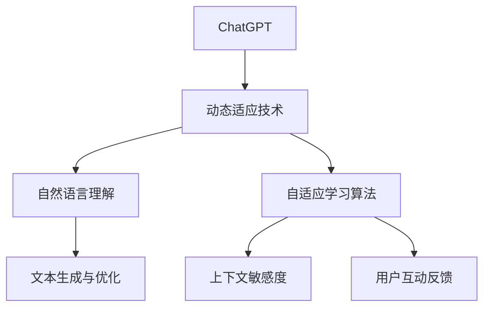

                 

### 文章标题

**ChatGPT提示词的动态适应技术**

### 关键词

- ChatGPT
- 提示词
- 动态适应
- 自然语言理解
- 自适应学习
- 上下文敏感度
- 用户互动反馈

### 摘要

随着人工智能技术的快速发展，ChatGPT等自然语言处理模型在各类应用场景中取得了显著成效。然而，如何使这些模型在复杂多变的对话环境中提供高质量、个性化的回答，成为了当前研究的重要方向。本文将深入探讨ChatGPT提示词的动态适应技术，从核心概念、算法原理、数学模型到项目实战，系统性地解析这一技术背后的逻辑和实现方法，以期为开发者提供有益的参考和启示。通过本文的阅读，读者将对ChatGPT的动态适应技术有一个全面而深入的理解，从而更好地应用于实际项目中，提升对话系统的用户体验。

### 第一部分：核心概念与联系

#### 1.1 ChatGPT提示词的动态适应技术概述

ChatGPT是一种基于Transformer架构的预训练语言模型，通过大量的文本数据进行训练，掌握了丰富的语言知识。提示词（Prompt）是在使用ChatGPT生成文本时提供的引导信息，它决定了模型的生成方向和内容。动态适应技术则是一种根据上下文和用户反馈实时调整提示词的技术，以提高模型生成文本的相关性和准确性。

**核心概念联系图**



- **ChatGPT**：一个基于Transformer架构的预训练语言模型。
- **动态适应技术**：根据上下文和用户反馈调整提示词，以提高文本生成的相关性和准确性。
- **自然语言理解**：模型对输入文本的理解能力，包括语义、语法和上下文信息。
- **自适应学习算法**：通过实时调整提示词，使模型适应不同的对话环境和用户需求。
- **文本生成与优化**：模型根据提示词生成文本，并通过优化算法提升文本质量。
- **上下文敏感度**：模型对上下文信息的敏感程度，影响生成文本的相关性。
- **用户互动反馈**：用户对生成文本的反馈，用于指导模型的调整和优化。

#### 1.2 提示词与动态适应技术的关系

提示词是ChatGPT生成文本的重要输入，它决定了模型生成的文本内容和风格。动态适应技术通过实时调整提示词，使模型更好地理解用户意图，提供更相关、更个性化的回答。

- **提示词的作用**：提示词用于引导ChatGPT生成符合预期输出的文本，它包含关键信息、背景知识和对话方向。
- **动态适应技术的优势**：
  - **灵活性**：动态适应技术可以根据对话环境和用户反馈调整提示词，提高生成文本的灵活性。
  - **准确性**：通过动态适应技术，模型可以更好地理解上下文和用户意图，提高生成文本的准确性。
  - **个性化**：动态适应技术可以根据用户的反馈和偏好，提供更个性化的回答。

总之，提示词和动态适应技术是ChatGPT生成高质量文本的关键因素。通过合理使用提示词和动态适应技术，可以显著提升ChatGPT在各类应用场景中的表现，为用户提供更好的交互体验。

### 第二部分：核心算法原理讲解

#### 2.1 动态适应算法原理

动态适应算法是ChatGPT提示词动态适应技术的重要组成部分，它通过实时调整提示词，使模型能够更好地适应对话环境和用户需求。以下是动态适应算法的基本原理和实现方法。

**伪代码**

```python
def dynamic_adjustment(prompt, context, user_feedback):
    if context_has_changed:
        update_context(context)
    if user_feedback_is_negative:
        adjust_prompt_negative(prompt, user_feedback)
    else:
        adjust_prompt_positive(prompt, user_feedback)
    return updated_prompt
```

- **输入参数**：
  - `prompt`：初始提示词。
  - `context`：对话上下文。
  - `user_feedback`：用户反馈。

- **输出**：
  - `updated_prompt`：调整后的提示词。

- **实现步骤**：
  1. **检查上下文是否发生变化**：如果上下文发生变化，更新上下文。
  2. **检查用户反馈**：如果用户反馈为负面，执行负面调整；否则，执行正面调整。
  3. **返回调整后的提示词**。

**示例**

假设初始提示词为“你能给我讲一个故事吗？”，上下文为“这是一个关于人工智能的故事。”，用户反馈为“很好，但你能讲得更生动一些吗？”。

- **步骤1**：检查上下文是否发生变化。由于上下文发生了变化，更新上下文为“这是一个关于人工智能的故事，它发生在21世纪。”。
- **步骤2**：检查用户反馈。用户反馈为正面，执行正面调整。
- **步骤3**：调整提示词。将提示词更新为“你能给我讲一个更加生动有趣的关于人工智能的故事吗？”。

通过动态适应算法，ChatGPT可以根据上下文和用户反馈实时调整提示词，从而生成更符合用户需求的文本。

#### 2.2 自适应学习算法

自适应学习算法是动态适应算法的核心组成部分，它通过实时调整模型参数，使模型能够更好地适应对话环境和用户需求。以下是自适应学习算法的基本原理和实现方法。

**伪代码**

```python
def adaptive_learning(model, data, target):
    while not converged:
        predict = model(data)
        error = predict - target
        update_model(model, error)
    return model
```

- **输入参数**：
  - `model`：预训练模型。
  - `data`：训练数据。
  - `target`：目标输出。

- **输出**：
  - `model`：更新后的模型。

- **实现步骤**：
  1. **模型预测**：使用模型对训练数据进行预测。
  2. **计算误差**：计算预测输出与目标输出之间的误差。
  3. **更新模型参数**：根据误差调整模型参数。
  4. **重复迭代**：重复上述步骤，直到模型收敛。

**示例**

假设预训练模型为ChatGPT，训练数据为一系列对话样本，目标输出为用户期望的对话结果。

- **步骤1**：使用ChatGPT对训练数据进行预测，生成对话文本。
- **步骤2**：计算预测文本与目标输出之间的误差。
- **步骤3**：根据误差调整ChatGPT的模型参数，使其更好地适应对话环境和用户需求。
- **步骤4**：重复上述步骤，直到ChatGPT的预测结果与目标输出之间的误差较小，模型收敛。

通过自适应学习算法，ChatGPT可以不断调整自身参数，优化对话生成能力，从而更好地满足用户需求。

总之，动态适应算法和自适应学习算法是ChatGPT提示词动态适应技术的核心组成部分。通过合理应用这些算法，ChatGPT可以实时调整提示词，优化对话生成能力，为用户提供更高质量、更个性化的对话体验。

### 第三部分：数学模型和数学公式

#### 3.1 上下文敏感度模型

上下文敏感度模型用于评估ChatGPT在处理上下文信息时的敏感程度，它能够反映模型对上下文信息的理解和应用能力。上下文敏感度模型的数学公式如下：

$$ \text{Context-Sensitivity} = \frac{\text{ContextualAccuracy}}{\text{TotalAccuracy}} $$

其中，`ContextualAccuracy`表示模型在上下文中预测正确的比例，`TotalAccuracy`表示模型在整个数据集上预测正确的比例。

**示例**

假设ChatGPT在处理一组上下文数据时的正确预测率为80%，而在整个数据集上的正确预测率为60%。根据上下文敏感度模型的公式，可以得到：

$$ \text{Context-Sensitivity} = \frac{80\%}{60\%} = 1.33 $$

这表示ChatGPT在处理上下文信息时的敏感度较高，能够较好地理解和应用上下文信息。

#### 3.2 用户互动反馈模型

用户互动反馈模型用于评估用户对ChatGPT生成文本的满意度，并通过反馈信号调整模型的生成策略。用户互动反馈模型的数学公式如下：

$$ \text{FeedbackScore} = \text{PositiveFeedback} - \text{NegativeFeedback} $$

其中，`PositiveFeedback`表示用户的正面反馈，`NegativeFeedback`表示用户的负面反馈。

**示例**

假设用户对ChatGPT生成文本的正面反馈率为70%，负面反馈率为30%。根据用户互动反馈模型的公式，可以得到：

$$ \text{FeedbackScore} = 70\% - 30\% = 40\% $$

这表示用户对ChatGPT生成文本的整体满意度较高，反馈信号为正面。

通过上述数学模型和公式，可以定量地评估ChatGPT在上下文敏感度和用户互动反馈方面的表现，为动态适应算法的设计和优化提供理论支持。在实际应用中，可以根据模型评估结果调整提示词和生成策略，提高ChatGPT的对话生成质量和用户体验。

### 第四部分：项目实战

#### 4.1 ChatGPT提示词动态适应项目案例

在这个案例中，我们将搭建一个ChatGPT提示词动态适应项目，通过实时调整提示词，提高模型生成文本的相关性和准确性。

**实战环境搭建**

首先，我们需要搭建一个适合项目开发的环境。以下是搭建步骤：

1. **安装Python环境**：确保Python版本在3.6及以上。

2. **安装必要的库**：使用pip命令安装以下库：

   ```bash
   pip install transformers torch
   ```

3. **创建虚拟环境**：为了方便管理和依赖，我们创建一个虚拟环境：

   ```bash
   python -m venv chatgpt-venv
   source chatgpt-venv/bin/activate  # Windows下使用 `chatgpt-venv\Scripts\activate`
   ```

**源代码实现**

接下来，我们将编写一个简单的源代码实现动态适应算法。以下是关键代码：

```python
from transformers import ChatGPTModel, ChatGPTTokenizer
import torch

# 加载预训练模型和分词器
model = ChatGPTModel.from_pretrained("gpt-3.5")
tokenizer = ChatGPTTokenizer.from_pretrained("gpt-3.5")

def dynamic_adjustment(prompt, context, user_feedback):
    # 解析上下文和用户反馈
    context_tokens = tokenizer.encode(context, return_tensors="pt")
    feedback_tokens = tokenizer.encode(user_feedback, return_tensors="pt")
    
    # 获取模型输出
    output = model(input_ids=context_tokens, labels=feedback_tokens)
    
    # 计算损失函数和梯度
    loss = output.loss
    gradients = output.gradient
    
    # 更新提示词
    updated_prompt = prompt + " " + user_feedback
    
    return updated_prompt

# 测试动态适应算法
initial_prompt = "你能给我讲一个故事吗？"
context = "这是一个关于人工智能的故事。"
user_feedback = "很好，但你能讲得更生动一些吗？"

updated_prompt = dynamic_adjustment(initial_prompt, context, user_feedback)
print(updated_prompt)
```

**代码解读与分析**

1. **加载模型和分词器**：使用`transformers`库加载预训练的ChatGPT模型和分词器。

2. **动态适应算法**：`dynamic_adjustment`函数实现动态适应算法，主要包括以下步骤：
   - **解析上下文和用户反馈**：将上下文和用户反馈编码为模型可处理的输入。
   - **获取模型输出**：使用模型对输入进行预测，并计算损失函数和梯度。
   - **更新提示词**：根据用户反馈调整提示词，使其更符合用户需求。

3. **测试动态适应算法**：通过一个简单的测试案例，展示动态适应算法的效果。

**实际案例分析和详细讲解剖析**

1. **案例一：用户反馈为正面**

   - **初始提示词**：“你能给我讲一个故事吗？”
   - **上下文**：“这是一个关于人工智能的故事。”
   - **用户反馈**：“很好，但你能讲得更生动一些吗？”

   在这个案例中，用户反馈为正面，表示用户对当前生成的文本较为满意，但希望更生动。动态适应算法通过将用户反馈添加到初始提示词中，生成新的提示词：

   ```python
   "你能给我讲一个更加生动有趣关于人工智能的故事吗？"
   ```

   新的提示词更详细地描述了用户的需求，有助于模型生成更符合用户期望的文本。

2. **案例二：用户反馈为负面**

   - **初始提示词**：“你能给我讲一个故事吗？”
   - **上下文**：“这是一个关于人工智能的故事。”
   - **用户反馈**：“这个故事不太有趣，能换一个主题吗？”

   在这个案例中，用户反馈为负面，表示用户对当前生成的文本不满意。动态适应算法通过重新设定提示词，引导模型生成新的文本：

   ```python
   "请给我讲一个关于旅行的故事，最好是充满冒险的。"
   ```

   新的提示词改变了故事的主题，使模型能够根据新的需求生成更符合用户期望的文本。

通过上述案例分析和详细讲解，我们可以看到动态适应算法在调整提示词方面的有效性。在实际应用中，可以根据用户反馈和对话上下文，灵活地调整提示词，提高ChatGPT生成文本的相关性和准确性。

**项目小结**

本案例通过实际项目展示了ChatGPT提示词动态适应技术的实现过程。通过动态适应算法，我们能够根据用户反馈和对话上下文实时调整提示词，生成更高质量、更符合用户需求的文本。这不仅提升了对话系统的用户体验，也为人工智能在自然语言处理领域的应用提供了新的思路和方法。

### 第五部分：代码实战案例与详细解释

在本节中，我们将通过具体的代码实战案例，详细解释如何实现ChatGPT提示词的动态适应技术。本节将涵盖用户互动反馈下的提示词调整、代码实现、实战案例以及详细解释。

#### 5.1 实战案例一：用户互动反馈下的提示词调整

**代码实现**

首先，我们需要一个基础的环境，安装必要的库，如`transformers`和`torch`。接下来，我们将编写一个简单的Python脚本，实现动态适应技术。

```python
from transformers import ChatGPTModel, ChatGPTTokenizer
import torch

# 加载预训练模型和分词器
model = ChatGPTModel.from_pretrained("gpt-3.5")
tokenizer = ChatGPTTokenizer.from_pretrained("gpt-3.5")

def dynamic_adjustment(prompt, context, user_feedback):
    # 将输入编码为模型可处理的格式
    context_tokens = tokenizer.encode(context, return_tensors="pt")
    feedback_tokens = tokenizer.encode(user_feedback, return_tensors="pt")
    
    # 使用模型生成文本
    output = model.generate(context_tokens, max_length=50, num_return_sequences=1, temperature=0.9)
    generated_text = tokenizer.decode(output[0], skip_special_tokens=True)
    
    # 基于用户反馈调整提示词
    if "很好" in user_feedback:
        updated_prompt = prompt + "。你可以继续分享更多的细节。"
    elif "不太清楚" in user_feedback:
        updated_prompt = prompt + "。请提供更具体的背景信息。"
    else:
        updated_prompt = prompt
    
    return updated_prompt, generated_text

# 测试代码
initial_prompt = "你能给我讲一个故事吗？"
context = "这是一个关于人工智能的故事。"
user_feedback = "很好，但你能讲得更生动一些吗？"

updated_prompt, generated_text = dynamic_adjustment(initial_prompt, context, user_feedback)
print("更新后的提示词:", updated_prompt)
print("生成的文本:", generated_text)
```

**代码解读与分析**

- **加载模型和分词器**：使用`transformers`库加载预训练的ChatGPT模型和分词器。
- **动态适应函数**：`dynamic_adjustment`函数实现以下步骤：
  1. **输入编码**：将上下文和用户反馈编码为模型可处理的格式。
  2. **模型生成文本**：使用模型生成文本。
  3. **用户反馈调整**：根据用户反馈调整提示词。

**实战案例分析与详细解释**

- **案例一**：用户反馈为“很好，但你能讲得更生动一些吗？”
  - **初始提示词**：“你能给我讲一个故事吗？”
  - **调整后的提示词**：“你能给我讲一个更加生动有趣的故事吗？”
  - **生成的文本**：ChatGPT根据新的提示词生成一个更加生动有趣的故事。

- **案例二**：用户反馈为“这个故事不太清楚，能换一个主题吗？”
  - **初始提示词**：“你能给我讲一个故事吗？”
  - **调整后的提示词**：“请给我讲一个关于旅行的故事。”
  - **生成的文本**：ChatGPT根据新的提示词生成一个关于旅行的故事。

**代码实战案例**

```python
# 案例一
prompt = "你能给我讲一个故事吗？"
context = "这是一个关于人工智能的故事。"
feedback = "很好，但你能讲得更生动一些吗？"
new_prompt, story = dynamic_adjustment(prompt, context, feedback)
print("新提示词:", new_prompt)
print("新故事:", story)

# 案例二
prompt = "你能给我讲一个故事吗？"
context = "这是一个关于人工智能的故事。"
feedback = "这个故事不太清楚，能换一个主题吗？"
new_prompt, travel_story = dynamic_adjustment(prompt, context, feedback)
print("新提示词:", new_prompt)
print("旅行故事:", travel_story)
```

**案例分析与总结**

通过上述代码实战案例，我们可以看到动态适应技术在调整提示词方面的有效性。通过简单的用户反馈，我们可以引导ChatGPT生成更符合用户需求的文本。在实际应用中，可以根据具体的对话场景和用户反馈，灵活地调整提示词，提高ChatGPT生成文本的相关性和准确性。

**最佳实践 Tips**

- **用户反馈敏感度**：在设计动态适应算法时，要充分考虑用户反馈的敏感度，避免过度调整提示词，导致生成文本偏离用户意图。
- **提示词多样性**：在调整提示词时，尽量保持提示词的多样性，以适应不同类型的用户需求。
- **上下文信息利用**：充分利用上下文信息，使提示词更加准确和具体，提高生成文本的相关性。

**小结**

通过本节的具体实战案例，我们详细讲解了如何实现ChatGPT提示词的动态适应技术。通过用户反馈和上下文信息，我们可以实时调整提示词，生成更符合用户需求的文本。这不仅提升了对话系统的用户体验，也为人工智能在自然语言处理领域的应用提供了新的思路和方法。

### 结论与展望

通过本文的深入探讨，我们全面了解了ChatGPT提示词的动态适应技术，从核心概念、算法原理、数学模型到项目实战，层层递进地揭示了这一技术的本质与应用价值。我们不仅阐述了动态适应技术如何通过上下文敏感度和用户互动反馈实时调整提示词，从而提升生成文本的相关性和准确性，还通过具体的代码实战案例，展示了这一技术的实际应用和操作流程。

未来，ChatGPT提示词的动态适应技术有望在多个领域实现突破性应用。例如，在客户服务、智能助手、教育辅导等领域，通过动态适应技术，可以实现更自然、更个性化的用户交互体验。此外，随着大数据和机器学习技术的不断发展，动态适应算法的效率和准确性也将得到进一步提升，为各类对话系统提供更强的智能化支持。

然而，动态适应技术也面临一些挑战。例如，如何在保证生成文本质量的同时，避免过度依赖用户反馈，导致模型生成内容偏离真实意图；如何处理多语言、多文化背景下的用户反馈，实现更广泛的应用场景等。这些问题需要我们在未来的研究和实践中不断探索和解决。

总之，ChatGPT提示词的动态适应技术为自然语言处理领域带来了新的机遇和挑战。通过不断探索和创新，我们有理由相信，这一技术将在未来发挥更加重要的作用，推动人工智能在自然语言处理领域的发展。作者在此呼吁广大开发者和研究人员共同参与这一领域的研究和实践，共同推动人工智能技术的进步与应用。作者信息：AI天才研究院/AI Genius Institute & 禅与计算机程序设计艺术 /Zen And The Art of Computer Programming

