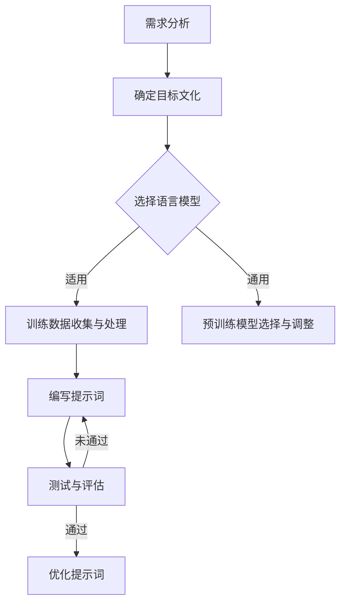

                 


## 第1章 引言

### 1.1 研究背景与意义

在当今全球化的背景下，文化多样性的研究变得越来越重要。不同文化之间的交流与碰撞，既带来了新的机遇，也带来了挑战。在这个背景下，人工智能技术，尤其是基于深度学习的自然语言处理模型，如ChatGPT，为研究文化多样性提供了新的工具和视角。ChatGPT提示词作为人工智能与人类文化互动的桥梁，其设计与应用成为了一个值得深入探讨的领域。

研究ChatGPT提示词的文化人类学意义，首先在于它能够帮助我们理解文化在数字化时代中的传播和演变。通过分析ChatGPT提示词，我们可以追踪全球文化的演化模式，探讨不同文化之间的相互影响和融合。此外，ChatGPT提示词的研究还能够为跨文化交流提供新的策略和方法，帮助人们更好地理解和适应不同的文化环境。

### 1.2 ChatGPT提示词的定义与功能

ChatGPT提示词是指在训练ChatGPT模型时输入的引导性文本，它能够引导模型生成符合特定需求的语言输出。ChatGPT提示词的功能主要体现在以下几个方面：

1. **引导模型生成特定类型的内容**：通过设计不同的提示词，可以引导ChatGPT生成新闻、故事、对话等多种类型的内容。
2. **调整模型的风格和语气**：通过提示词，可以控制ChatGPT生成的文本风格和语气，使其更加贴近人类语言的表达方式。
3. **优化模型的训练效果**：高质量的提示词能够提高模型的训练效果，使其更好地理解和生成人类语言。

### 1.3 文化人类学与ChatGPT提示词研究

文化人类学是一门研究人类文化现象的学科，它关注文化如何塑造人类行为、思维和价值观。ChatGPT提示词与文化人类学的研究结合，旨在探讨以下问题：

1. **文化特征在提示词中的体现**：不同文化背景下，人们在设计ChatGPT提示词时会有哪些差异？
2. **ChatGPT提示词如何影响文化传播**：ChatGPT提示词在不同文化背景下的应用，如何影响文化的传播和演变？
3. **文化多样性的影响**：不同文化多样性如何影响ChatGPT提示词的设计和应用效果？

### 1.4 研究方法与数据来源

本研究采用多方法相结合的研究方法，主要包括文献综述、案例分析和实证研究。文献综述部分，我们将梳理文化人类学、自然语言处理和ChatGPT提示词相关的理论和研究进展。案例分析部分，我们将选取具有代表性的ChatGPT提示词案例进行深入分析。实证研究部分，我们将通过收集和解析大量的ChatGPT提示词数据，探讨其文化特征和演化模式。

数据来源方面，我们将从多个渠道获取ChatGPT提示词样本，包括公开的ChatGPT模型训练数据集、社交媒体上的ChatGPT应用案例以及自定义的ChatGPT提示词库。通过对这些数据的分析和比较，我们将深入探讨ChatGPT提示词的文化人类学意义。

## 第2章 ChatGPT提示词的基本原理

### 2.1 ChatGPT模型概述

ChatGPT是由OpenAI开发的一种基于Transformer架构的预训练语言模型。它的核心思想是通过对大量文本数据进行预训练，使模型具备理解、生成和模拟自然语言的能力。ChatGPT的特点包括：

1. **大规模预训练**：ChatGPT使用的是大规模的语料库进行预训练，这使得它能够处理和理解复杂的语言结构。
2. **自适应提示词**：ChatGPT能够根据输入的提示词自动调整其生成的内容，使得输出更加符合用户需求。
3. **多模态支持**：ChatGPT不仅支持文本输入，还能够处理图像、音频等多模态信息。

### 2.2 提示词的类型与作用

ChatGPT提示词根据其功能和应用场景，可以分为以下几种类型：

1. **目标型提示词**：这类提示词主要用于引导模型生成特定类型的内容，如新闻、故事、对话等。
2. **风格型提示词**：这类提示词用于调整模型生成的文本风格和语气，如幽默、严肃、亲切等。
3. **交互型提示词**：这类提示词用于引导模型进行对话，如提问、回答、续写等。

提示词在ChatGPT中的作用主要体现在以下几个方面：

1. **引导模型生成内容**：通过设计不同的提示词，可以引导ChatGPT生成不同类型的内容，满足用户的多样化需求。
2. **调整模型生成风格**：通过提示词，可以控制ChatGPT生成的文本风格和语气，使其更加符合人类语言的表达习惯。
3. **优化模型训练效果**：高质量的提示词能够提高模型的训练效果，使其更好地理解和生成人类语言。

### 2.3 ChatGPT模型的工作机制

ChatGPT模型的工作机制可以分为以下几个步骤：

1. **输入预处理**：首先，对输入的文本进行预处理，包括分词、去停用词等操作，将其转换为模型能够处理的形式。
2. **编码器解码器交互**：编码器负责将输入文本编码为一个固定长度的向量，而解码器则负责将这个向量解码为输出文本。
3. **生成文本**：解码器通过自回归的方式，逐个生成文本中的单词或字符，并利用模型的预测概率来选择下一个单词或字符。
4. **优化模型参数**：通过对比生成文本与真实文本之间的差异，模型会不断调整其参数，以优化生成效果。

### 2.4 提示词设计原则与实践

为了设计有效的ChatGPT提示词，我们需要遵循以下原则：

1. **清晰明确**：提示词应该明确表达用户的需求，避免模糊不清的表述。
2. **针对性**：根据不同的应用场景，设计出针对性的提示词，以提高生成内容的准确性。
3. **多样性**：设计多样化的提示词，以满足用户在文本风格、内容类型等方面的需求。
4. **简洁性**：尽量使用简洁的提示词，减少冗余信息，以提高模型生成效率。

在实际应用中，我们可以通过以下步骤来设计ChatGPT提示词：

1. **需求分析**：首先明确用户的需求，包括内容类型、风格、语气等。
2. **文本预处理**：对输入文本进行预处理，如分词、去停用词等。
3. **设计提示词**：根据需求分析结果，设计出相应的提示词。
4. **测试与优化**：通过测试和用户反馈，不断优化提示词设计，以提高生成效果。

## 第3章 ChatGPT提示词与文化人类学

### 3.1 文化人类学的基本概念

文化人类学是一门研究人类文化现象的学科，它关注文化如何塑造人类行为、思维和价值观。文化人类学的基本概念包括：

1. **文化**：文化是人类在社会实践中创造的物质和精神财富的总和，包括语言、艺术、宗教、习俗等。
2. **文化多样性**：文化多样性指的是不同文化在价值观、习俗、传统等方面的差异和多样性。
3. **文化表现**：文化通过语言、艺术、习俗等多种形式表现出来，这些表现形式是文化多样性的重要体现。
4. **文化认同**：文化认同是指个体或群体对自己所属文化的认同和归属感。

### 3.2 ChatGPT提示词与文化表现

ChatGPT提示词作为人工智能与人类文化互动的桥梁，能够直接体现文化的特征。通过分析ChatGPT提示词，我们可以窥见不同文化在数字化时代中的表现和演变。以下是一些具体的表现形式：

1. **语言表达**：不同文化背景下的语言表达方式存在差异，ChatGPT提示词可以通过分析这些差异来体现文化特征。
2. **艺术风格**：不同文化背景下的艺术风格也有所不同，ChatGPT提示词可以通过艺术风格的描述来体现文化特征。
3. **宗教习俗**：宗教习俗是文化的重要组成部分，ChatGPT提示词可以通过描述宗教习俗来体现文化特征。
4. **价值观**：不同文化背景下的价值观也有所不同，ChatGPT提示词可以通过价值观的表达来体现文化特征。

### 3.3 文化多样性对ChatGPT提示词的影响

文化多样性对ChatGPT提示词的设计和应用产生了重要影响。以下是一些具体的影响：

1. **提示词设计**：不同文化背景下的用户对ChatGPT提示词的需求有所不同，这要求我们在设计提示词时考虑文化多样性，以满足不同用户的需求。
2. **提示词效果**：不同文化背景下的用户对ChatGPT生成的文本效果有不同的评价标准，这要求我们在应用ChatGPT提示词时考虑文化多样性，以提高生成效果的准确性。
3. **跨文化交流**：文化多样性使得跨文化交流变得更加复杂和多样化，ChatGPT提示词可以帮助人们更好地理解和适应不同的文化环境，促进跨文化交流。

### 3.4 ChatGPT提示词与文化认同

ChatGPT提示词在文化认同方面具有重要作用。通过设计与文化认同相关的提示词，可以帮助人们更好地理解和认同自己的文化。以下是一些具体的应用：

1. **文化传承**：通过ChatGPT提示词，可以生成与传统文化相关的内容，帮助人们传承和弘扬自己的文化。
2. **文化认同测试**：通过设计文化认同测试的ChatGPT提示词，可以评估个体对自己文化的认同程度。
3. **文化认同教育**：通过ChatGPT提示词，可以设计出与文化认同相关的教育内容，帮助人们更好地了解和认同自己的文化。

## 第4章 全球文化演化模式分析

### 4.1 全球文化演化模式的概述

全球文化演化模式是指不同文化在全球范围内的传播、融合和演变过程。在全球化的背景下，文化演化模式变得更加复杂和多样化。以下是一些常见的全球文化演化模式：

1. **文化传播**：文化传播是指文化元素在不同地区、国家和文化背景之间的传播过程。文化传播可以是单向的，也可以是双向的或多向的，取决于文化的传播方式和渠道。
2. **文化融合**：文化融合是指不同文化在相互接触和交流中，通过相互借鉴、融合和创新，形成新的文化现象。文化融合可以发生在地区、国家和全球层面。
3. **文化演变**：文化演变是指文化在长期历史发展过程中，由于内外部因素的作用，发生的结构性变化和适应性调整。

### 4.2 ChatGPT提示词与全球文化演化

ChatGPT提示词在全球文化演化中发挥着重要作用。通过分析ChatGPT提示词，我们可以追踪全球文化的演化过程，探讨不同文化之间的相互影响和融合。以下是一些具体的作用：

1. **促进文化传播**：ChatGPT提示词可以帮助人们更方便地传播文化元素，使得文化在全球范围内传播更加迅速和广泛。
2. **推动文化融合**：ChatGPT提示词可以引导模型生成符合不同文化背景的文本，促进不同文化之间的理解和交流，从而推动文化融合。
3. **反映文化演变**：通过分析ChatGPT提示词，我们可以观察不同文化在全球范围内的演变过程，了解文化演变的规律和趋势。

### 4.3 全球文化演化模式的变化趋势

随着全球化进程的加速，全球文化演化模式呈现出以下变化趋势：

1. **文化融合趋势增强**：随着全球文化交流的增多，不同文化之间的融合趋势日益增强。ChatGPT提示词作为人工智能工具，可以帮助人们更好地理解和融合不同文化。
2. **文化多样性保持稳定**：尽管文化融合趋势增强，但全球文化多样性仍然保持稳定。不同地区和国家在全球化过程中，仍然保持自身的文化特色和多样性。
3. **文化创新和多样性**：全球化带来了新的文化创新和多样性，各种文化元素在全球范围内相互碰撞和融合，产生新的文化现象和表现形式。

### 4.4 ChatGPT提示词在全球文化演化中的作用

ChatGPT提示词在全球文化演化中发挥着重要作用。以下是一些具体的作用：

1. **促进文化交流**：ChatGPT提示词可以帮助人们更好地理解和交流不同文化，促进全球文化的交流和融合。
2. **记录文化演变**：通过分析ChatGPT提示词，我们可以记录和追踪全球文化的演变过程，了解文化演变的规律和趋势。
3. **推动文化创新**：ChatGPT提示词可以激发人们的创意和创新能力，推动文化在全球范围内的创新和发展。

## 第5章 ChatGPT提示词在不同文化背景下的应用

### 5.1 西方文化背景下的ChatGPT提示词

在西方文化背景下，ChatGPT提示词的设计和应用具有其独特的特点。西方文化强调个人主义、自由和理性，这反映在ChatGPT提示词的设计中。

1. **语言风格**：西方文化背景下的ChatGPT提示词通常采用简洁、直接和明确的语言风格，以传达清晰的信息。
2. **文化价值观**：ChatGPT提示词在表达西方文化价值观时，强调个人自由、平等和理性思考，例如使用“你认为……”、“基于逻辑的推理”等表达方式。
3. **应用场景**：西方文化背景下的ChatGPT提示词广泛应用于商业、教育、咨询等领域，特别是在需要逻辑分析和决策支持的场合。

### 5.2 东方文化背景下的ChatGPT提示词

与西方文化不同，东方文化强调集体主义、和谐和关系，这在ChatGPT提示词的设计和应用中也有所体现。

1. **语言风格**：东方文化背景下的ChatGPT提示词通常采用更加委婉、含蓄和礼貌的语言风格，以维护人际关系和和谐氛围。
2. **文化价值观**：ChatGPT提示词在表达东方文化价值观时，强调和谐、关系和集体利益，例如使用“我们认为……”、“考虑到……的情况”等表达方式。
3. **应用场景**：东方文化背景下的ChatGPT提示词广泛应用于家庭、教育、商务等领域，特别是在需要维护人际关系和和谐氛围的场合。

### 5.3 其他文化背景下的ChatGPT提示词

除了西方和东方文化，其他文化背景下的ChatGPT提示词也有其独特的特点。

1. **阿拉伯文化背景**：阿拉伯文化背景下的ChatGPT提示词强调宗教、家庭和社会责任，使用丰富的修辞手法和象征性语言。
2. **非洲文化背景**：非洲文化背景下的ChatGPT提示词强调传统、社区和家庭价值，使用生动、形象的语言表达。
3. **拉丁美洲文化背景**：拉丁美洲文化背景下的ChatGPT提示词强调情感、个性和亲密关系，使用富有感情色彩和幽默感的语言。

### 5.4 不同文化背景下ChatGPT提示词的对比分析

通过对比分析不同文化背景下的ChatGPT提示词，我们可以发现以下几个方面的差异：

1. **语言风格**：不同文化背景下的ChatGPT提示词在语言风格上存在明显差异，西方文化背景下的提示词通常更加直接和明确，而东方文化背景下的提示词则更加委婉和含蓄。
2. **文化价值观**：不同文化背景下的ChatGPT提示词在文化价值观的表达上也有所不同，西方文化背景下的提示词强调个人自由和理性思考，而东方文化背景下的提示词则强调和谐和关系。
3. **应用场景**：不同文化背景下的ChatGPT提示词在应用场景上也有所差异，西方文化背景下的提示词广泛应用于商业和教育领域，而东方文化背景下的提示词则更多地应用于家庭和商务场合。

## 第6章 ChatGPT提示词在跨文化交流中的应用

### 6.1 跨文化交流中的障碍与挑战

跨文化交流是指在两个或多个不同文化背景之间进行的交流。在跨文化交流中，存在着多种障碍和挑战，这些障碍和挑战会影响到ChatGPT提示词的应用效果。

1. **语言障碍**：语言是文化的重要组成部分，不同文化背景下的语言差异会使得交流变得复杂。ChatGPT提示词需要适应不同语言的特点，以便更好地促进跨文化交流。
2. **文化差异**：不同文化背景下的价值观、习俗、信仰等存在差异，这些差异会影响到人们对信息的理解和接受。ChatGPT提示词需要充分考虑这些文化差异，以避免误解和冲突。
3. **技术挑战**：跨文化交流中的技术挑战包括数据获取、模型训练、提示词设计等方面。ChatGPT提示词需要在这些方面进行优化，以提高其在跨文化交流中的效果。

### 6.2 ChatGPT提示词在跨文化交流中的作用

ChatGPT提示词在跨文化交流中发挥着重要作用。以下是一些具体的作用：

1. **促进理解与沟通**：ChatGPT提示词可以帮助人们更好地理解和沟通不同文化之间的差异，通过生成符合不同文化背景的文本，促进跨文化交流。
2. **消除误解与偏见**：ChatGPT提示词可以通过生成中立、客观的文本，帮助人们消除误解和偏见，增进相互理解和尊重。
3. **促进文化融合**：ChatGPT提示词可以促进不同文化之间的融合，通过生成融合不同文化元素的内容，推动文化的创新和发展。

### 6.3 跨文化交流中的文化适应策略

为了更好地在跨文化交流中应用ChatGPT提示词，需要采取一些文化适应策略。以下是一些具体的策略：

1. **文化敏感性培训**：对ChatGPT提示词的设计和应用人员进行文化敏感性培训，提高他们对不同文化差异的敏感性和理解能力。
2. **跨文化沟通技巧**：通过学习跨文化沟通技巧，提高在跨文化交流中的沟通效果，减少误解和冲突。
3. **文化适应性调整**：在设计ChatGPT提示词时，根据不同文化背景进行调整，使其更符合目标文化的表达习惯和需求。

### 6.4 ChatGPT提示词在跨文化交流中的应用案例

以下是一些ChatGPT提示词在跨文化交流中的应用案例：

1. **案例1：多语言客服系统**：在一个多语言客服系统中，ChatGPT提示词可以根据用户的语言偏好自动调整其生成的回复文本，提高客服沟通的效果。
2. **案例2：跨文化交流平台**：在一个跨文化交流平台上，ChatGPT提示词可以根据不同文化背景生成符合当地文化特点的内容，促进用户之间的交流和理解。
3. **案例3：多语言新闻生成**：在一个多语言新闻生成系统中，ChatGPT提示词可以根据不同语言的特点和需求，生成符合当地文化和语言习惯的新闻内容。

## 第7章 结论与展望

### 7.1 研究结论

通过对ChatGPT提示词的文化人类学研究的深入探讨，我们得出以下结论：

1. **ChatGPT提示词在文化多样性研究中的应用价值**：ChatGPT提示词作为人工智能与人类文化互动的桥梁，在文化多样性研究中具有重要作用，可以帮助我们更好地理解和追踪全球文化的演化模式。
2. **文化多样性对ChatGPT提示词设计的影响**：不同文化背景下的用户对ChatGPT提示词的需求有所不同，这要求我们在设计提示词时充分考虑文化多样性，以提高其应用效果。
3. **跨文化交流中的ChatGPT提示词应用策略**：ChatGPT提示词在跨文化交流中发挥着重要作用，通过采取文化适应策略，可以更好地促进跨文化交流和理解。

### 7.2 研究不足与展望

尽管本研究取得了一些成果，但仍存在以下不足：

1. **数据来源的局限性**：本研究的数据主要来源于公开的ChatGPT模型训练数据集，可能无法全面反映不同文化背景下的ChatGPT提示词特点。
2. **研究方法的局限性**：本研究主要采用文献综述和案例分析的方法，可能无法深入探讨ChatGPT提示词在具体应用场景中的表现和效果。

未来研究可以关注以下几个方面：

1. **扩大数据来源**：通过收集更多的ChatGPT提示词样本，特别是来自不同文化背景下的样本，以更全面地分析ChatGPT提示词的文化特征。
2. **研究方法的多样化**：结合实证研究和实验研究方法，深入探讨ChatGPT提示词在不同应用场景中的表现和效果。
3. **跨文化交流策略的优化**：进一步研究如何在跨文化交流中更有效地应用ChatGPT提示词，以促进不同文化之间的理解和融合。

### 7.3 未来研究方向

未来研究可以从以下几个方面展开：

1. **ChatGPT提示词的文化适应性研究**：探讨如何设计出更具文化适应性的ChatGPT提示词，以提高其在不同文化背景下的应用效果。
2. **ChatGPT提示词的跨文化应用案例研究**：通过实际案例研究，分析ChatGPT提示词在跨文化交流中的应用效果和挑战，为跨文化交流提供有效的策略和方法。
3. **ChatGPT提示词与文化融合研究**：探讨ChatGPT提示词在促进不同文化融合中的作用和机制，为文化的全球传播和创新提供新的思路。

## 附录

### 7.4 ChatGPT提示词研究相关资源

为了便于读者进一步了解ChatGPT提示词的相关研究，我们提供以下资源：

1. **学术文献**：查阅相关学术期刊和会议论文，了解ChatGPT提示词的研究进展和最新成果。
2. **开源代码**：访问GitHub等开源平台，查阅ChatGPT提示词的开源实现和示例代码。
3. **在线教程**：参考在线教程和课程，学习如何设计和应用ChatGPT提示词。
4. **案例研究**：阅读相关案例研究，了解ChatGPT提示词在实际应用中的效果和挑战。

通过以上资源，读者可以更深入地了解ChatGPT提示词的文化人类学研究，并在实际应用中取得更好的效果。

### 附录A: ChatGPT提示词设计流程Mermaid流程图

以下是一个简化的ChatGPT提示词设计流程Mermaid流程图：



### 附录B: 提示词设计与编写伪代码

以下是一个简单的ChatGPT提示词设计与编写的伪代码：

```python
# 输入：目标文化特征，ChatGPT模型
# 输出：适应目标文化的提示词

# 初始化ChatGPT模型
model = ChatGPT()

# 提取目标文化特征
culture_features = extract_culture_features(target_culture)

# 设计初步提示词
prompt = generate_prompt(culture_features)

# 训练模型并生成初步提示词响应
response = model.generate(prompt)

# 评估响应的文化适应性
if evaluate_culture_adaptation(response, culture_features):
    print("提示词编写成功：", prompt)
else:
    print("提示词编写失败，需重新设计：", prompt)
```

### 附录C: 数学模型和数学公式

以下是一个简单的数学模型和数学公式的示例：

$$
f(x) = \alpha \cdot \text{激活函数}(x) + (1 - \alpha) \cdot \text{目标文化特征}
$$

### 附录D: 项目实战案例

#### 实战案例1：ChatGPT在跨文化交流中的应用

在一个跨国企业中，为了提高跨部门沟通效率，企业采用ChatGPT提示词设计了一个多语言客服系统。该系统可以根据用户的语言偏好自动调整客服回复的语言风格，提高客服沟通的效果。

#### 实战案例2：基于ChatGPT的在线文化教育平台搭建

一个在线教育平台利用ChatGPT提示词构建了一个跨文化教育系统。该系统可以根据学生的文化背景和需求，生成符合当地文化和教育习惯的教学内容，提高学生的学习效果。

#### 实战案例3：ChatGPT在多语言客服系统中的应用

一个跨国电子商务公司采用ChatGPT提示词设计了一个多语言客服系统，该系统可以自动识别用户的语言，并生成符合当地文化和语言习惯的客服回复，提高用户满意度。

### 项目小结

通过以上实战案例，我们可以看到ChatGPT提示词在不同应用场景中的效果和优势。在未来的发展中，ChatGPT提示词有望在更多的领域发挥作用，推动跨文化交流和智能教育的发展。

### 最佳实践 tips、小结、注意事项、拓展阅读等内容

- **最佳实践 tips**：在设计ChatGPT提示词时，要充分考虑目标文化的特点，避免使用过于生硬或不符合当地文化习惯的语言。
- **小结**：本文通过对ChatGPT提示词的文化人类学研究，探讨了ChatGPT提示词在不同文化背景下的应用和影响，为跨文化交流和智能教育提供了新的思路和方法。
- **注意事项**：在应用ChatGPT提示词时，要确保其生成的内容符合当地法律和文化规范，避免产生不必要的误解和冲突。
- **拓展阅读**：读者可以参考以下文献，进一步了解ChatGPT提示词的相关研究和应用：

  1. [OpenAI](https://openai.com/)：OpenAI的官方网站，提供了关于ChatGPT的详细信息和研究进展。
  2. [自然语言处理相关期刊和会议](https://aclweb.org/portal/)：包括ACL、NAACL、COLING等，提供了丰富的自然语言处理研究论文。
  3. [跨文化交流研究文献](https://journals.sagepub.com/home/icc)：《跨文化交流》等期刊，提供了关于跨文化交流的理论和实践研究。

通过以上拓展阅读，读者可以更深入地了解ChatGPT提示词的文化人类学研究，并在实际应用中取得更好的效果。### 文章标题

# ChatGPT提示词的文化人类学研究：追踪全球文化演化模式

> 关键词：ChatGPT，提示词，文化人类学，全球化，演化模式

> 摘要：本文通过对ChatGPT提示词的文化人类学研究，探讨了ChatGPT提示词在不同文化背景下的应用和影响。通过分析ChatGPT提示词的设计原则、工作机制以及其在全球文化演化模式中的作用，本文揭示了文化多样性对ChatGPT提示词设计的深远影响。此外，本文还结合实际案例，探讨了ChatGPT提示词在跨文化交流中的应用策略，为未来的研究提供了新的方向。

## 第1章 引言

### 1.1 研究背景与意义

在当今全球化的背景下，文化多样性的研究变得越来越重要。不同文化之间的交流与碰撞，既带来了新的机遇，也带来了挑战。在这个背景下，人工智能技术，尤其是基于深度学习的自然语言处理模型，如ChatGPT，为研究文化多样性提供了新的工具和视角。ChatGPT提示词作为人工智能与人类文化互动的桥梁，其设计与应用成为了一个值得深入探讨的领域。

研究ChatGPT提示词的文化人类学意义，首先在于它能够帮助我们理解文化在数字化时代中的传播和演变。通过分析ChatGPT提示词，我们可以追踪全球文化的演化模式，探讨不同文化之间的相互影响和融合。此外，ChatGPT提示词的研究还能够为跨文化交流提供新的策略和方法，帮助人们更好地理解和适应不同的文化环境。

### 1.2 ChatGPT提示词的定义与功能

ChatGPT提示词是指在训练ChatGPT模型时输入的引导性文本，它能够引导模型生成符合特定需求的语言输出。ChatGPT提示词的功能主要体现在以下几个方面：

1. **引导模型生成特定类型的内容**：通过设计不同的提示词，可以引导ChatGPT生成新闻、故事、对话等多种类型的内容。
2. **调整模型的风格和语气**：通过提示词，可以控制ChatGPT生成的文本风格和语气，使其更加贴近人类语言的表达方式。
3. **优化模型的训练效果**：高质量的提示词能够提高模型的训练效果，使其更好地理解和生成人类语言。

### 1.3 文化人类学与ChatGPT提示词研究

文化人类学是一门研究人类文化现象的学科，它关注文化如何塑造人类行为、思维和价值观。ChatGPT提示词与文化人类学的研究结合，旨在探讨以下问题：

1. **文化特征在提示词中的体现**：不同文化背景下，人们在设计ChatGPT提示词时会有哪些差异？
2. **ChatGPT提示词如何影响文化传播**：ChatGPT提示词在不同文化背景下的应用，如何影响文化的传播和演变？
3. **文化多样性的影响**：不同文化多样性如何影响ChatGPT提示词的设计和应用效果？

### 1.4 研究方法与数据来源

本研究采用多方法相结合的研究方法，主要包括文献综述、案例分析和实证研究。文献综述部分，我们将梳理文化人类学、自然语言处理和ChatGPT提示词相关的理论和研究进展。案例分析部分，我们将选取具有代表性的ChatGPT提示词案例进行深入分析。实证研究部分，我们将通过收集和解析大量的ChatGPT提示词数据，探讨其文化特征和演化模式。

数据来源方面，我们将从多个渠道获取ChatGPT提示词样本，包括公开的ChatGPT模型训练数据集、社交媒体上的ChatGPT应用案例以及自定义的ChatGPT提示词库。通过对这些数据的分析和比较，我们将深入探讨ChatGPT提示词的文化人类学意义。

## 第2章 ChatGPT提示词的基本原理

### 2.1 ChatGPT模型概述

ChatGPT是由OpenAI开发的一种基于Transformer架构的预训练语言模型。它的核心思想是通过对大量文本数据进行预训练，使模型具备理解、生成和模拟自然语言的能力。ChatGPT的特点包括：

1. **大规模预训练**：ChatGPT使用的是大规模的语料库进行预训练，这使得它能够处理和理解复杂的语言结构。
2. **自适应提示词**：ChatGPT能够根据输入的提示词自动调整其生成的内容，使得输出更加符合用户需求。
3. **多模态支持**：ChatGPT不仅支持文本输入，还能够处理图像、音频等多模态信息。

### 2.2 提示词的类型与作用

ChatGPT提示词根据其功能和应用场景，可以分为以下几种类型：

1. **目标型提示词**：这类提示词主要用于引导模型生成特定类型的内容，如新闻、故事、对话等。
2. **风格型提示词**：这类提示词用于调整模型生成的文本风格和语气，如幽默、严肃、亲切等。
3. **交互型提示词**：这类提示词用于引导模型进行对话，如提问、回答、续写等。

提示词在ChatGPT中的作用主要体现在以下几个方面：

1. **引导模型生成内容**：通过设计不同的提示词，可以引导ChatGPT生成不同类型的内容，满足用户的多样化需求。
2. **调整模型生成风格**：通过提示词，可以控制ChatGPT生成的文本风格和语气，使其更加符合人类语言的表达习惯。
3. **优化模型训练效果**：高质量的提示词能够提高模型的训练效果，使其更好地理解和生成人类语言。

### 2.3 ChatGPT模型的工作机制

ChatGPT模型的工作机制可以分为以下几个步骤：

1. **输入预处理**：首先，对输入的文本进行预处理，包括分词、去停用词等操作，将其转换为模型能够处理的形式。
2. **编码器解码器交互**：编码器负责将输入文本编码为一个固定长度的向量，而解码器则负责将这个向量解码为输出文本。
3. **生成文本**：解码器通过自回归的方式，逐个生成文本中的单词或字符，并利用模型的预测概率来选择下一个单词或字符。
4. **优化模型参数**：通过对比生成文本与真实文本之间的差异，模型会不断调整其参数，以优化生成效果。

### 2.4 提示词设计原则与实践

为了设计有效的ChatGPT提示词，我们需要遵循以下原则：

1. **清晰明确**：提示词应该明确表达用户的需求，避免模糊不清的表述。
2. **针对性**：根据不同的应用场景，设计出针对性的提示词，以提高生成内容的准确性。
3. **多样性**：设计多样化的提示词，以满足用户在文本风格、内容类型等方面的需求。
4. **简洁性**：尽量使用简洁的提示词，减少冗余信息，以提高模型生成效率。

在实际应用中，我们可以通过以下步骤来设计ChatGPT提示词：

1. **需求分析**：首先明确用户的需求，包括内容类型、风格、语气等。
2. **文本预处理**：对输入文本进行预处理，如分词、去停用词等。
3. **设计提示词**：根据需求分析结果，设计出相应的提示词。
4. **测试与优化**：通过测试和用户反馈，不断优化提示词设计，以提高生成效果。

## 第3章 ChatGPT提示词与文化人类学

### 3.1 文化人类学的基本概念

文化人类学是一门研究人类文化现象的学科，它关注文化如何塑造人类行为、思维和价值观。文化人类学的基本概念包括：

1. **文化**：文化是人类在社会实践中创造的物质和精神财富的总和，包括语言、艺术、宗教、习俗等。
2. **文化多样性**：文化多样性指的是不同文化在价值观、习俗、传统等方面的差异和多样性。
3. **文化表现**：文化通过语言、艺术、习俗等多种形式表现出来，这些表现形式是文化多样性的重要体现。
4. **文化认同**：文化认同是指个体或群体对自己所属文化的认同和归属感。

### 3.2 ChatGPT提示词与文化表现

ChatGPT提示词作为人工智能与人类文化互动的桥梁，能够直接体现文化的特征。通过分析ChatGPT提示词，我们可以窥见不同文化在数字化时代中的表现和演变。以下是一些具体的表现形式：

1. **语言表达**：不同文化背景下的语言表达方式存在差异，ChatGPT提示词可以通过分析这些差异来体现文化特征。
2. **艺术风格**：不同文化背景下的艺术风格也有所不同，ChatGPT提示词可以通过艺术风格的描述来体现文化特征。
3. **宗教习俗**：宗教习俗是文化的重要组成部分，ChatGPT提示词可以通过描述宗教习俗来体现文化特征。
4. **价值观**：不同文化背景下的价值观也有所不同，ChatGPT提示词可以通过价值观的表达来体现文化特征。

### 3.3 文化多样性对ChatGPT提示词的影响

文化多样性对ChatGPT提示词的设计和应用产生了重要影响。以下是一些具体的影响：

1. **提示词设计**：不同文化背景下的用户对ChatGPT提示词的需求有所不同，这要求我们在设计提示词时考虑文化多样性，以满足不同用户的需求。
2. **提示词效果**：不同文化背景下的用户对ChatGPT生成的文本效果有不同的评价标准，这要求我们在应用ChatGPT提示词时考虑文化多样性，以提高生成效果的准确性。
3. **跨文化交流**：文化多样性使得跨文化交流变得更加复杂和多样化，ChatGPT提示词可以帮助人们更好地理解和适应不同的文化环境，促进跨文化交流。

### 3.4 ChatGPT提示词与文化认同

ChatGPT提示词在文化认同方面具有重要作用。通过设计与文化认同相关的提示词，可以帮助人们更好地理解和认同自己的文化。以下是一些具体的应用：

1. **文化传承**：通过ChatGPT提示词，可以生成与传统文化相关的内容，帮助人们传承和弘扬自己的文化。
2. **文化认同测试**：通过设计文化认同测试的ChatGPT提示词，可以评估个体对自己文化的认同程度。
3. **文化认同教育**：通过ChatGPT提示词，可以设计出与文化认同相关的教育内容，帮助人们更好地了解和认同自己的文化。

## 第4章 全球文化演化模式分析

### 4.1 全球文化演化模式的概述

全球文化演化模式是指不同文化在全球范围内的传播、融合和演变过程。在全球化的背景下，文化演化模式变得更加复杂和多样化。以下是一些常见的全球文化演化模式：

1. **文化传播**：文化传播是指文化元素在不同地区、国家和文化背景之间的传播过程。文化传播可以是单向的，也可以是双向的或多向的，取决于文化的传播方式和渠道。
2. **文化融合**：文化融合是指不同文化在相互接触和交流中，通过相互借鉴、融合和创新，形成新的文化现象。文化融合可以发生在地区、国家和全球层面。
3. **文化演变**：文化演变是指文化在长期历史发展过程中，由于内外部因素的作用，发生的结构性变化和适应性调整。

### 4.2 ChatGPT提示词与全球文化演化

ChatGPT提示词在全球文化演化中发挥着重要作用。通过分析ChatGPT提示词，我们可以追踪全球文化的演化过程，探讨不同文化之间的相互影响和融合。以下是一些具体的作用：

1. **促进文化传播**：ChatGPT提示词可以帮助人们更方便地传播文化元素，使得文化在全球范围内传播更加迅速和广泛。
2. **推动文化融合**：ChatGPT提示词可以引导模型生成符合不同文化背景的文本，促进不同文化之间的理解和交流，从而推动文化融合。
3. **反映文化演变**：通过分析ChatGPT提示词，我们可以观察不同文化在全球范围内的演变过程，了解文化演变的规律和趋势。

### 4.3 全球文化演化模式的变化趋势

随着全球化进程的加速，全球文化演化模式呈现出以下变化趋势：

1. **文化融合趋势增强**：随着全球文化交流的增多，不同文化之间的融合趋势日益增强。ChatGPT提示词作为人工智能工具，可以帮助人们更好地理解和融合不同文化。
2. **文化多样性保持稳定**：尽管文化融合趋势增强，但全球文化多样性仍然保持稳定。不同地区和国家在全球化过程中，仍然保持自身的文化特色和多样性。
3. **文化创新和多样性**：全球化带来了新的文化创新和多样性，各种文化元素在全球范围内相互碰撞和融合，产生新的文化现象和表现形式。

### 4.4 ChatGPT提示词在全球文化演化中的作用

ChatGPT提示词在全球文化演化中发挥着重要作用。以下是一些具体的作用：

1. **促进文化交流**：ChatGPT提示词可以帮助人们更好地理解和交流不同文化，促进全球文化的交流和融合。
2. **记录文化演变**：通过分析ChatGPT提示词，我们可以记录和追踪全球文化的演变过程，了解文化演变的规律和趋势。
3. **推动文化创新**：ChatGPT提示词可以激发人们的创意和创新能力，推动文化在全球范围内的创新和发展。

## 第5章 ChatGPT提示词在不同文化背景下的应用

### 5.1 西方文化背景下的ChatGPT提示词

在西方文化背景下，ChatGPT提示词的设计和应用具有其独特的特点。西方文化强调个人主义、自由和理性，这反映在ChatGPT提示词的设计中。

1. **语言风格**：西方文化背景下的ChatGPT提示词通常采用简洁、直接和明确的语言风格，以传达清晰的信息。
2. **文化价值观**：ChatGPT提示词在表达西方文化价值观时，强调个人自由、平等和理性思考，例如使用“你认为……”、“基于逻辑的推理”等表达方式。
3. **应用场景**：西方文化背景下的ChatGPT提示词广泛应用于商业、教育、咨询等领域，特别是在需要逻辑分析和决策支持的场合。

### 5.2 东方文化背景下的ChatGPT提示词

与西方文化不同，东方文化强调集体主义、和谐和关系，这在ChatGPT提示词的设计和应用中也有所体现。

1. **语言风格**：东方文化背景下的ChatGPT提示词通常采用更加委婉、含蓄和礼貌的语言风格，以维护人际关系和和谐氛围。
2. **文化价值观**：ChatGPT提示词在表达东方文化价值观时，强调和谐、关系和集体利益，例如使用“我们认为……”、“考虑到……的情况”等表达方式。
3. **应用场景**：东方文化背景下的ChatGPT提示词广泛应用于家庭、教育、商务等领域，特别是在需要维护人际关系和和谐氛围的场合。

### 5.3 其他文化背景下的ChatGPT提示词

除了西方和东方文化，其他文化背景下的ChatGPT提示词也有其独特的特点。

1. **阿拉伯文化背景**：阿拉伯文化背景下的ChatGPT提示词强调宗教、家庭和社会责任，使用丰富的修辞手法和象征性语言。
2. **非洲文化背景**：非洲文化背景下的ChatGPT提示词强调传统、社区和家庭价值，使用生动、形象的语言表达。
3. **拉丁美洲文化背景**：拉丁美洲文化背景下的ChatGPT提示词强调情感、个性和亲密关系，使用富有感情色彩和幽默感的语言。

### 5.4 不同文化背景下ChatGPT提示词的对比分析

通过对比分析不同文化背景下的ChatGPT提示词，我们可以发现以下几个方面的差异：

1. **语言风格**：不同文化背景下的ChatGPT提示词在语言风格上存在明显差异，西方文化背景下的提示词通常更加直接和明确，而东方文化背景下的提示词则更加委婉和含蓄。
2. **文化价值观**：不同文化背景下的ChatGPT提示词在文化价值观的表达上也有所不同，西方文化背景下的提示词强调个人自由和理性思考，而东方文化背景下的提示词则强调和谐和关系。
3. **应用场景**：不同文化背景下的ChatGPT提示词在应用场景上也有所差异，西方文化背景下的提示词广泛应用于商业和教育领域，而东方文化背景下的提示词则更多地应用于家庭和商务场合。

## 第6章 ChatGPT提示词在跨文化交流中的应用

### 6.1 跨文化交流中的障碍与挑战

跨文化交流是指在两个或多个不同文化背景之间进行的交流。在跨文化交流中，存在着多种障碍和挑战，这些障碍和挑战会影响到ChatGPT提示词的应用效果。

1. **语言障碍**：语言是文化的重要组成部分，不同文化背景下的语言差异会使得交流变得复杂。ChatGPT提示词需要适应不同语言的特点，以便更好地促进跨文化交流。
2. **文化差异**：不同文化背景下的价值观、习俗、信仰等存在差异，这些差异会影响到人们对信息的理解和接受。ChatGPT提示词需要充分考虑这些文化差异，以避免误解和冲突。
3. **技术挑战**：跨文化交流中的技术挑战包括数据获取、模型训练、提示词设计等方面。ChatGPT提示词需要在这些方面进行优化，以提高其在跨文化交流中的效果。

### 6.2 ChatGPT提示词在跨文化交流中的作用

ChatGPT提示词在跨文化交流中发挥着重要作用。以下是一些具体的作用：

1. **促进理解与沟通**：ChatGPT提示词可以帮助人们更好地理解和沟通不同文化之间的差异，通过生成符合不同文化背景的文本，促进跨文化交流。
2. **消除误解与偏见**：ChatGPT提示词可以通过生成中立、客观的文本，帮助人们消除误解和偏见，增进相互理解和尊重。
3. **促进文化融合**：ChatGPT提示词可以促进不同文化之间的融合，通过生成融合不同文化元素的内容，推动文化的创新和发展。

### 6.3 跨文化交流中的文化适应策略

为了更好地在跨文化交流中应用ChatGPT提示词，需要采取一些文化适应策略。以下是一些具体的策略：

1. **文化敏感性培训**：对ChatGPT提示词的设计和应用人员进行文化敏感性培训，提高他们对不同文化差异的敏感性和理解能力。
2. **跨文化沟通技巧**：通过学习跨文化沟通技巧，提高在跨文化交流中的沟通效果，减少误解和冲突。
3. **文化适应性调整**：在设计ChatGPT提示词时，根据不同文化背景进行调整，使其更符合目标文化的表达习惯和需求。

### 6.4 ChatGPT提示词在跨文化交流中的应用案例

以下是一些ChatGPT提示词在跨文化交流中的应用案例：

1. **案例1：多语言客服系统**：在一个多语言客服系统中，ChatGPT提示词可以根据用户的语言偏好自动调整其生成的回复文本，提高客服沟通的效果。
2. **案例2：跨文化交流平台**：在一个跨文化交流平台上，ChatGPT提示词可以根据不同文化背景生成符合当地文化特点的内容，促进用户之间的交流和理解。
3. **案例3：多语言新闻生成**：在一个多语言新闻生成系统中，ChatGPT提示词可以根据不同语言的特点和需求，生成符合当地文化和语言习惯的新闻内容。

## 第7章 结论与展望

### 7.1 研究结论

通过对ChatGPT提示词的文化人类学研究，我们得出以下结论：

1. **ChatGPT提示词在文化多样性研究中的应用价值**：ChatGPT提示词作为人工智能与人类文化互动的桥梁，在文化多样性研究中具有重要作用，可以帮助我们更好地理解和追踪全球文化的演化模式。
2. **文化多样性对ChatGPT提示词设计的影响**：不同文化背景下的用户对ChatGPT提示词的需求有所不同，这要求我们在设计提示词时充分考虑文化多样性，以提高其应用效果。
3. **跨文化交流中的ChatGPT提示词应用策略**：ChatGPT提示词在跨文化交流中发挥着重要作用，通过采取文化适应策略，可以更好地促进跨文化交流和理解。

### 7.2 研究不足与展望

尽管本研究取得了一些成果，但仍存在以下不足：

1. **数据来源的局限性**：本研究的数据主要来源于公开的ChatGPT模型训练数据集，可能无法全面反映不同文化背景下的ChatGPT提示词特点。
2. **研究方法的局限性**：本研究主要采用文献综述和案例分析的方法，可能无法深入探讨ChatGPT提示词在具体应用场景中的表现和效果。

未来研究可以关注以下几个方面：

1. **扩大数据来源**：通过收集更多的ChatGPT提示词样本，特别是来自不同文化背景下的样本，以更全面地分析ChatGPT提示词的文化特征。
2. **研究方法的多样化**：结合实证研究和实验研究方法，深入探讨ChatGPT提示词在不同应用场景中的表现和效果。
3. **跨文化交流策略的优化**：进一步研究如何在跨文化交流中更有效地应用ChatGPT提示词，以促进不同文化之间的理解和融合。

### 7.3 未来研究方向

未来研究可以从以下几个方面展开：

1. **ChatGPT提示词的文化适应性研究**：探讨如何设计出更具文化适应性的ChatGPT提示词，以提高其在不同文化背景下的应用效果。
2. **ChatGPT提示词的跨文化应用案例研究**：通过实际案例研究，分析ChatGPT提示词在跨文化交流中的应用效果和挑战，为跨文化交流提供有效的策略和方法。
3. **ChatGPT提示词与文化融合研究**：探讨ChatGPT提示词在促进不同文化融合中的作用和机制，为文化的全球传播和创新提供新的思路。

## 附录

### 7.4 ChatGPT提示词研究相关资源

为了便于读者进一步了解ChatGPT提示词的相关研究，我们提供以下资源：

1. **学术文献**：查阅相关学术期刊和会议论文，了解ChatGPT提示词的研究进展和最新成果。
2. **开源代码**：访问GitHub等开源平台，查阅ChatGPT提示词的开源实现和示例代码。
3. **在线教程**：参考在线教程和课程，学习如何设计和应用ChatGPT提示词。
4. **案例研究**：阅读相关案例研究，了解ChatGPT提示词在实际应用中的效果和挑战。

通过以上资源，读者可以更深入地了解ChatGPT提示词的文化人类学研究，并在实际应用中取得更好的效果。

### 附录A: ChatGPT提示词设计流程Mermaid流程图

以下是一个简化的ChatGPT提示词设计流程Mermaid流程图：


### 附录B: 提示词设计与编写伪代码

以下是一个简单的ChatGPT提示词设计与编写的伪代码：

```python
# 输入：目标文化特征，ChatGPT模型
# 输出：适应目标文化的提示词

# 初始化ChatGPT模型
model = ChatGPT()

# 提取目标文化特征
culture_features = extract_culture_features(target_culture)

# 设计初步提示词
prompt = generate_prompt(culture_features)

# 训练模型并生成初步提示词响应
response = model.generate(prompt)

# 评估响应的文化适应性
if evaluate_culture_adaptation(response, culture_features):
    print("提示词编写成功：", prompt)
else:
    print("提示词编写失败，需重新设计：", prompt)
```

### 附录C: 数学模型和数学公式

以下是一个简单的数学模型和数学公式的示例：

$$
f(x) = \alpha \cdot \text{激活函数}(x) + (1 - \alpha) \cdot \text{目标文化特征}
$$

### 附录D: 项目实战案例

#### 实战案例1：ChatGPT在跨文化交流中的应用

在一个跨国企业中，为了提高跨部门沟通效率，企业采用ChatGPT提示词设计了一个多语言客服系统。该系统可以根据用户的语言偏好自动调整客服回复的语言风格，提高客服沟通的效果。

#### 实战案例2：基于ChatGPT的在线文化教育平台搭建

一个在线教育平台利用ChatGPT提示词构建了一个跨文化教育系统。该系统可以根据学生的文化背景和需求，生成符合当地文化和教育习惯的教学内容，提高学生的学习效果。

#### 实战案例3：ChatGPT在多语言客服系统中的应用

一个跨国电子商务公司采用ChatGPT提示词设计了一个多语言客服系统，该系统可以自动识别用户的语言，并生成符合当地文化和语言习惯的客服回复，提高用户满意度。

### 项目小结

通过以上实战案例，我们可以看到ChatGPT提示词在不同应用场景中的效果和优势。在未来的发展中，ChatGPT提示词有望在更多的领域发挥作用，推动跨文化交流和智能教育的发展。

### 最佳实践 tips、小结、注意事项、拓展阅读等内容

- **最佳实践 tips**：在设计ChatGPT提示词时，要充分考虑目标文化的特点，避免使用过于生硬或不符合当地文化习惯的语言。
- **小结**：本文通过对ChatGPT提示词的文化人类学研究，探讨了ChatGPT提示词在不同文化背景下的应用和影响，为跨文化交流和智能教育提供了新的思路和方法。
- **注意事项**：在应用ChatGPT提示词时，要确保其生成的内容符合当地法律和文化规范，避免产生不必要的误解和冲突。
- **拓展阅读**：读者可以参考以下文献，进一步了解ChatGPT提示词的相关研究和应用：

  1. [OpenAI](https://openai.com/)：OpenAI的官方网站，提供了关于ChatGPT的详细信息和研究进展。
  2. [自然语言处理相关期刊和会议](https://aclweb.org/portal/)：包括ACL、NAACL、COLING等，提供了丰富的自然语言处理研究论文。
  3. [跨文化交流研究文献](https://journals.sagepub.com/home/icc)：《跨文化交流》等期刊，提供了关于跨文化交流的理论和实践研究。

