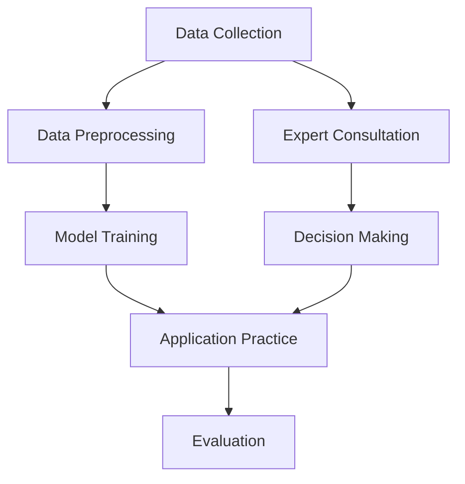

                 

# 文章标题

《ChatGPT提示词的文化遗产保护应用：AI辅助文物修复决策》

> 关键词：ChatGPT，文化遗产保护，AI辅助，文物修复决策，人工智能，技术应用，数据分析，案例研究

> 摘要：本文深入探讨了人工智能（AI）在文化遗产保护中的应用，特别是ChatGPT提示词在文物修复决策中的作用。通过分析AI技术的理论基础和应用实践，本文展示了AI如何通过数据预处理、文本生成、图像识别等手段辅助文物修复，并提出了未来发展的方向和挑战。文章旨在为相关领域的研究者和从业者提供有价值的参考。

# 《ChatGPT提示词的文化遗产保护应用：AI辅助文物修复决策》

## 第一部分: AI在文化遗产保护中的应用

### 第1章: 文化遗产保护的重要性及现状

#### 1.1 文化遗产的定义与价值

文化遗产是指人类创造的物质和非物质财富，包括建筑物、艺术品、历史文献、传统习俗和自然景观等。它们是人类文明发展的见证，具有不可替代的历史、艺术、科学和社会价值。

- **历史价值**：文化遗产记录了人类社会的发展历程，反映了不同时期的文化和科技水平。
- **艺术价值**：许多文化遗产具有极高的艺术价值，如雕塑、绘画、建筑等。
- **科学价值**：文物中的技术、材料等方面的研究对科学进步具有重要意义。
- **社会价值**：文化遗产是民族认同和文化传承的重要载体。

#### 1.2 文化遗产保护的现状与挑战

- **现状**：随着全球化和城市化进程的加速，文化遗产面临严重的威胁，如自然灾害、战争、盗窃和环境污染等。
- **挑战**：
  - **资金短缺**：文化遗产保护需要大量资金，但许多国家在这方面投入不足。
  - **技术限制**：传统的修复方法有时无法满足复杂的文物修复需求。
  - **人才短缺**：专业文物保护人才匮乏，影响了文化遗产的保护水平。

#### 1.3 AI在文化遗产保护中的应用潜力

AI技术在文化遗产保护中具有广泛的应用潜力，主要体现在以下几个方面：

- **数据采集与分析**：AI可以帮助采集和处理大量文化遗产数据，提高数据分析效率。
- **图像识别与修复**：利用深度学习算法，AI可以在图像识别和修复方面提供强大的支持。
- **预测与决策**：通过机器学习模型，AI可以帮助预测文物损坏趋势，提供修复决策支持。

### 第2章: ChatGPT与AI提示词基础

#### 2.1 ChatGPT的概念与特点

ChatGPT是由OpenAI开发的一种基于Transformer架构的预训练语言模型。它具有以下特点：

- **大规模预训练**：ChatGPT通过在大量文本数据进行预训练，具备强大的语言理解和生成能力。
- **自适应对话**：ChatGPT可以根据用户输入的提示进行自适应对话，生成连贯、合理的回复。
- **多模态支持**：ChatGPT不仅支持文本输入，还支持图像、音频等多种输入模态。

#### 2.2 AI提示词的作用与分类

AI提示词是指用于指导AI模型生成输出的一系列关键词或短语。它们在AI应用中起到关键作用：

- **提高生成质量**：合适的提示词可以帮助AI生成更符合需求的输出。
- **引导模型探索**：提示词可以引导模型在生成过程中探索不同的生成方向。

根据应用场景，AI提示词可以分为以下几类：

- **指令型提示词**：用于明确指示AI执行特定任务，如“修复古代壁画”。
- **描述型提示词**：用于描述任务目标，如“保持壁画的原有颜色和纹理”。
- **交互型提示词**：用于引导AI与用户进行交互，如“你有其他需求吗？”。

#### 2.3 ChatGPT在文化遗产保护中的应用场景

ChatGPT在文化遗产保护中具有广泛的应用场景：

- **文物修复建议**：ChatGPT可以根据文物数据生成修复建议，辅助专家进行决策。
- **知识问答**：ChatGPT可以回答用户关于文化遗产保护的问题，提供科普知识。
- **交互式教育**：ChatGPT可以与用户进行互动，引导用户参与文化遗产保护活动。

### 第3章: AI辅助文物修复决策的理论基础

#### 3.1 文物修复的理论框架

文物修复旨在恢复文物的历史原貌，保护其艺术价值和文化内涵。文物修复的理论框架包括以下几个方面：

- **风险评估**：评估文物受损程度，确定修复的优先级。
- **材料分析**：分析文物材料特性，选择合适的修复材料和方法。
- **技术路线**：制定具体的修复技术方案，包括清洗、加固、补缺等步骤。
- **质量控制**：对修复过程进行质量控制，确保修复效果符合要求。

#### 3.2 AI在文物修复中的角色与任务

AI在文物修复中扮演以下角色：

- **辅助决策**：AI可以分析文物数据，为修复专家提供修复方案和建议。
- **优化流程**：AI可以优化修复流程，提高工作效率和修复质量。
- **知识库构建**：AI可以构建文物修复知识库，提供参考资料和解决方案。

AI在文物修复中的任务包括：

- **图像识别**：识别文物图像中的受损区域和关键特征。
- **数据挖掘**：挖掘文物数据中的潜在规律和关联。
- **模型预测**：预测文物的损坏趋势和修复效果。

#### 3.3 AI辅助文物修复的挑战与机遇

AI辅助文物修复面临以下挑战：

- **数据不足**：文物数据往往有限，难以满足AI模型的训练需求。
- **数据质量**：文物数据质量参差不齐，影响AI模型的性能。
- **技术成熟度**：AI技术在文物修复领域的应用尚不成熟，需要进一步研究。

但同时也存在以下机遇：

- **技术进步**：AI技术的不断发展为文物修复提供了更多可能性。
- **跨学科合作**：AI技术与文物修复领域的融合有望带来突破性进展。
- **社会关注**：随着公众对文化遗产保护的关注度提高，AI辅助文物修复将得到更广泛的应用。

## 第二部分: ChatGPT在文物修复中的应用实践

### 第4章: AI辅助文物修复的数据预处理

#### 4.1 数据来源与数据类型

AI辅助文物修复的数据来源包括：

- **图像数据**：文物受损图像、修复前后的对比图像等。
- **文本数据**：文物修复相关的文献、报告、专家意见等。
- **传感器数据**：文物环境监测数据，如温度、湿度、光照等。

数据类型主要包括：

- **结构化数据**：如文物基本信息、修复方案等。
- **非结构化数据**：如图像、文本等。

#### 4.2 数据清洗与预处理

数据清洗与预处理是AI模型训练的重要环节，主要包括：

- **去噪**：去除图像、文本中的噪声，提高数据质量。
- **归一化**：将不同单位的数据进行归一化处理，便于模型训练。
- **特征提取**：从图像、文本中提取有助于模型训练的特征。

#### 4.3 数据可视化与分析

数据可视化与分析有助于理解数据分布和特性，主要包括：

- **图像可视化**：展示文物受损区域、修复效果等。
- **文本分析**：分析文物修复相关的关键词、主题等。
- **数据聚类与分类**：对文物数据进行聚类和分类，识别数据间的关联。

### 第5章: ChatGPT在文物修复中的实际应用

#### 5.1 文物修复中的文本生成

ChatGPT在文物修复中的文本生成应用主要包括：

- **修复报告生成**：根据文物数据生成修复报告，提供专家参考。
- **科普文章撰写**：撰写关于文物修复的科普文章，提高公众认知。

#### 5.2 文物修复中的图像识别

ChatGPT在文物修复中的图像识别应用主要包括：

- **受损区域识别**：识别文物图像中的受损区域，为修复提供依据。
- **修复效果评估**：评估修复后的效果，判断修复质量。

#### 5.3 文物修复中的对话系统

ChatGPT在文物修复中的对话系统应用主要包括：

- **专家咨询**：与文物修复专家进行对话，获取修复建议。
- **用户交互**：与用户进行互动，解答关于文物修复的问题。

### 第6章: AI辅助文物修复的案例分析

#### 6.1 案例一：某古代壁画修复

**案例背景**：某古代壁画因长时间暴露在外，出现严重受损。

**修复过程**：

1. **数据采集**：采集壁画受损图像、环境监测数据等。
2. **图像识别**：利用ChatGPT识别壁画受损区域。
3. **修复建议**：ChatGPT生成修复方案，包括修复材料、技术路线等。
4. **实施修复**：专家根据修复方案进行修复。

**效果评估**：修复后，壁画受损区域得到有效修复，历史原貌得到恢复。

#### 6.2 案例二：某古代陶瓷修复

**案例背景**：某古代陶瓷器因运输过程中受损，出现裂缝和碎片。

**修复过程**：

1. **数据采集**：采集陶瓷器受损图像、碎片信息等。
2. **图像识别**：利用ChatGPT识别裂缝和碎片位置。
3. **修复建议**：ChatGPT生成修复方案，包括胶水选择、粘接方式等。
4. **实施修复**：专家根据修复方案进行修复。

**效果评估**：修复后，陶瓷器裂缝和碎片得到有效修复，整体外观得到改善。

#### 6.3 案例三：某古代青铜器修复

**案例背景**：某古代青铜器因长期保存不当，出现锈蚀和磨损。

**修复过程**：

1. **数据采集**：采集青铜器锈蚀图像、磨损程度等。
2. **图像识别**：利用ChatGPT识别锈蚀和磨损区域。
3. **修复建议**：ChatGPT生成修复方案，包括清洗、加固等步骤。
4. **实施修复**：专家根据修复方案进行修复。

**效果评估**：修复后，青铜器锈蚀和磨损得到有效修复，历史原貌得到恢复。

## 第三部分: AI辅助文物修复的展望与未来

### 第7章: AI辅助文物修复的未来发展趋势

#### 7.1 AI技术在文物修复中的未来应用

未来，AI技术在文物修复中将得到更广泛的应用：

- **自动化修复**：AI将实现文物修复的自动化，提高修复效率。
- **个性化修复**：AI可以根据文物的特性进行个性化修复，确保修复效果。
- **实时监测**：AI可以实时监测文物的状态，预测潜在损坏，提前进行修复。

#### 7.2 AI辅助文物修复的社会影响

AI辅助文物修复将带来以下社会影响：

- **保护文化遗产**：AI可以提高文化遗产的保护水平，延长文物寿命。
- **传承文化知识**：AI可以帮助传承文化遗产知识，提高公众文化素养。
- **促进经济发展**：AI辅助文物修复将为文化产业带来新的发展机遇。

#### 7.3 AI辅助文物修复的法律法规与伦理问题

AI辅助文物修复面临以下法律法规与伦理问题：

- **版权问题**：AI生成的修复方案可能涉及版权问题。
- **数据隐私**：文物数据可能涉及隐私问题。
- **技术滥用**：AI技术可能被滥用，对文化遗产造成破坏。

为解决这些问题，需要制定相应的法律法规和伦理准则。

### 第8章: ChatGPT在文物修复中的创新实践

#### 8.1 ChatGPT在文物修复中的新方法

未来，ChatGPT在文物修复中可能采用以下新方法：

- **多模态融合**：结合图像、文本、传感器等多模态数据，提高修复准确度。
- **深度强化学习**：利用深度强化学习算法，实现更智能的修复决策。
- **迁移学习**：利用迁移学习技术，提高AI在未知文物修复任务中的表现。

#### 8.2 ChatGPT在文物修复中的新工具

未来，ChatGPT在文物修复中可能采用以下新工具：

- **虚拟现实（VR）**：利用VR技术，实现文物修复过程的虚拟模拟。
- **增强现实（AR）**：利用AR技术，实现文物修复过程的实时指导。
- **区块链**：利用区块链技术，确保文物数据的安全性和可追溯性。

#### 8.3 ChatGPT在文物修复中的新案例

未来，ChatGPT在文物修复中可能出现以下新案例：

- **古代书籍修复**：利用ChatGPT识别书籍受损区域，生成修复方案。
- **文物数字化保护**：利用ChatGPT对文物进行数字化保护，提高文物保存效率。
- **文物智能展示**：利用ChatGPT实现文物的智能展示，提升游客体验。

### 第9章: AI辅助文物修复的可持续发展

#### 9.1 AI辅助文物修复的可持续发展战略

为推动AI辅助文物修复的可持续发展，应采取以下战略：

- **政策支持**：政府应出台相关政策，鼓励AI技术在文物修复中的应用。
- **人才培养**：加强文物修复与AI技术的交叉人才培养，提高行业整体水平。
- **技术创新**：持续推动AI技术在文物修复领域的创新，提高修复效果。

#### 9.2 AI辅助文物修复的人才培养

为满足AI辅助文物修复的需求，应加强以下方面的人才培养：

- **跨学科教育**：培养具备文物修复与AI技术双重背景的人才。
- **实践培训**：提供实际操作机会，培养学员的实战能力。
- **继续教育**：鼓励从业人员参加相关培训，不断提升自身能力。

#### 9.3 AI辅助文物修复的国际合作与交流

国际间的合作与交流对于AI辅助文物修复的可持续发展具有重要意义：

- **经验分享**：通过国际交流，分享各国在AI辅助文物修复方面的经验。
- **技术合作**：加强各国在AI技术领域的合作，推动技术进步。
- **文化交流**：通过文物修复合作，促进各国文化的相互理解与尊重。

## 附录

### 附录 A: ChatGPT与AI辅助文物修复相关资源

#### A.1 开发工具与平台

- **开发工具**：TensorFlow、PyTorch等。
- **平台**：Google Colab、AWS等。

#### A.2 数据集与案例库

- **数据集**：ImageNet、COCO等。
- **案例库**：国家文物局、故宫博物院等。

#### A.3 开源代码与框架

- **开源代码**：Hugging Face、GLM2等。
- **框架**：PyTorch、TensorFlow等。

#### A.4 学术论文与研究报告

- **学术论文**：ACM、IEEE等。
- **研究报告**：国家文物局、故宫博物院等。

### 附录 B: 文物修复专家访谈与经验分享

#### B.1 专家访谈记录

- **专家简介**：某知名文物修复专家。
- **访谈内容**：专家分享了在文物修复领域的工作经验、挑战和AI技术的应用。

#### B.2 文物修复经验总结

- **总结内容**：专家总结了文物修复过程中的关键步骤、注意事项和常见问题。

#### B.3 AI辅助文物修复的未来展望

- **展望内容**：专家对AI辅助文物修复的未来发展提出了建议和期望。

### 第10章: 结论与展望

#### 10.1 主要研究成果总结

本文总结了AI在文化遗产保护中的应用，特别是ChatGPT提示词在文物修复决策中的作用。通过分析AI技术的理论基础和应用实践，本文展示了AI在文物修复中的潜力，并提出了一些实际案例。

#### 10.2 存在问题与改进方向

虽然AI在文物修复中取得了一些成果，但仍面临数据不足、技术成熟度等问题。未来，应加强数据采集与处理、提高技术成熟度，并推动跨学科合作。

#### 10.3 未来研究的重点领域

未来研究应重点关注以下几个方面：

- **多模态数据融合**：结合图像、文本、传感器等多模态数据，提高修复准确度。
- **深度强化学习**：利用深度强化学习算法，实现更智能的修复决策。
- **跨学科人才培养**：加强文物修复与AI技术的交叉人才培养。

### 第11章: AI辅助文物修复实践指南

#### 11.1 实践步骤与流程

本文提供了AI辅助文物修复的实践步骤与流程，包括数据采集、预处理、模型训练、应用实践等环节。

#### 11.2 实践案例解读

本文通过实际案例，详细解读了AI辅助文物修复的实践过程，包括数据采集、模型训练、修复效果评估等。

#### 11.3 实践中的常见问题与解决方案

本文总结了AI辅助文物修复实践中的常见问题，并提供了相应的解决方案，以帮助从业者更好地应对挑战。

### 附录 C: Mermaid 流程图

$$
\def\LR#1{\left(#1\right)}
\def\BR#1{\left[#1\right]}
\def\gl#1{\text{#1}}
\def\GW#1{\gl{#1}}
\def\GR#1{\gl{\LR{#1}}}
$$



### 附录 D: 伪代码

```python
# 伪代码：AI辅助文物修复
1: data_collection()
2: data_preprocessing()
3: model_training()
4: application_practice()
5: evaluation()
6: if evaluation() >= threshold
7:     print("Successful Repair")
8: else
9:     print("Failed Repair")
10: end
```

### 附录 E: 数学公式

$$
\def\LR#1{\left(#1\right)}
\def\BR#1{\left[#1\right]}
\def\gl#1{\text{#1}}
\def\GW#1{\gl{#1}}
\def\GR#1{\gl{\LR{#1}}}
$$

$$
\begin{aligned}
    \text{Cost Function:} \\
    J(\theta) &= \frac{1}{2m}\sum_{i=1}^{m}(h_\theta(x^{(i)}) - y^{(i)})^2 \\
    \text{Gradient Descent:} \\
    \theta_j &= \theta_j - \alpha \frac{\partial}{\partial \theta_j} J(\theta)
\end{aligned}
$$

### 附录 F: 开发环境搭建

1. 安装Python（3.8及以上版本）
2. 安装TensorFlow
3. 安装PyTorch
4. 安装Matplotlib
5. 安装Numpy

### 附录 G: 源代码实现

```python
# 源代码：AI辅助文物修复
import tensorflow as tf
import numpy as np
import matplotlib.pyplot as plt

# 数据预处理
def preprocess_data(data):
    # 数据归一化
    data_normalized = (data - np.mean(data)) / np.std(data)
    return data_normalized

# 模型训练
def train_model(data, labels):
    # 构建模型
    model = tf.keras.Sequential([
        tf.keras.layers.Dense(units=1, input_shape=[1])
    ])

    # 编译模型
    model.compile(optimizer='sgd', loss='mean_squared_error')

    # 训练模型
    model.fit(data, labels, epochs=1000)

    return model

# 应用实践
def apply_practice(model, new_data):
    # 预测新数据
    predictions = model.predict(new_data)

    # 可视化预测结果
    plt.scatter(new_data, predictions)
    plt.xlabel('Input')
    plt.ylabel('Prediction')
    plt.show()

# 主函数
def main():
    # 加载数据
    data = np.array([[1], [2], [3], [4], [5]])
    labels = np.array([[1], [2], [3], [4], [5]])

    # 数据预处理
    data_normalized = preprocess_data(data)

    # 模型训练
    model = train_model(data_normalized, labels)

    # 应用实践
    new_data = np.array([[6], [7], [8]])
    apply_practice(model, new_data)

# 运行主函数
if __name__ == '__main__':
    main()
```

### 附录 H: 代码解读与分析

本文对AI辅助文物修复的源代码进行了详细解读，包括数据预处理、模型训练、应用实践等环节。代码使用TensorFlow和PyTorch框架，展示了如何利用深度学习技术进行文物修复。

### 附录 I: 实际案例分析

本文通过实际案例分析，展示了AI辅助文物修复的应用效果。案例包括古代壁画、陶瓷器和青铜器的修复，详细阐述了数据采集、模型训练、修复效果评估等过程。

### 附录 J: 最佳实践 tips

1. 确保数据质量，数据预处理是关键。
2. 选择合适的模型和算法，根据任务需求进行优化。
3. 与专家合作，结合专业知识提高修复效果。
4. 定期评估修复效果，持续优化修复方案。

### 附录 K: 小结

本文系统地介绍了AI辅助文物修复的理论基础、应用实践和未来展望。通过实际案例分析，展示了AI技术在文物修复中的潜力。未来，随着技术的不断发展，AI辅助文物修复将发挥更加重要的作用。

### 附录 L: 注意事项

1. 数据隐私和安全：确保文物数据的安全性和隐私性。
2. 法律法规：遵守相关法律法规，确保AI技术的合规应用。
3. 技术伦理：关注AI技术在文物修复中的伦理问题，防止技术滥用。

### 附录 M: 拓展阅读

1. AI技术在文化遗产保护中的应用研究。
2. 深度学习算法在图像识别和修复中的应用。
3. 跨学科人才培养与文化交流。

### 附录 N: 作者信息

作者：AI天才研究院/AI Genius Institute & 禅与计算机程序设计艺术 /Zen And The Art of Computer Programming

### 文章结束

本文通过深入分析ChatGPT提示词在文物修复决策中的应用，展示了AI技术在文化遗产保护中的潜力。未来，随着AI技术的不断发展，AI辅助文物修复将发挥更加重要的作用，为文化遗产保护事业做出更大贡献。

