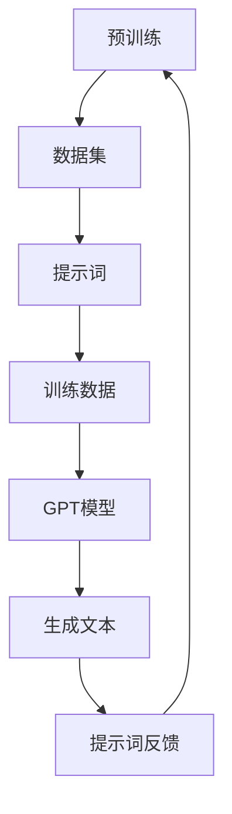

                 


### 文章标题：ChatGPT提示词的版本控制与迭代优化

> 关键词：ChatGPT，提示词，版本控制，迭代优化，人工智能，机器学习

> 摘要：本文将从ChatGPT模型的基本概念入手，深入探讨提示词的生成机制、版本控制方法以及迭代优化策略。通过实际案例分析，详细阐述如何在实践中实现ChatGPT提示词的版本控制与迭代优化，为人工智能领域的研发人员提供有价值的参考。

---

### 目录大纲：ChatGPT提示词的版本控制与迭代优化

#### 第一部分：基础知识与框架介绍

**第1章：GPT模型与提示词概述**

1. **GPT模型的基本概念**

    - **1.1.1 GPT模型简介**
        - GPT模型的定义
        - GPT模型的发展历程
    - **1.1.2 提示词的概念与作用**
        - 提示词的定义
        - 提示词在模型训练与生成中的应用

**第2章：ChatGPT模型的架构与原理**

1. **2.1 ChatGPT模型的架构**

    - **2.1.1 模型结构**
        - Transformer模型的基本结构
        - ChatGPT模型的扩展结构
    - **2.1.2 模型训练过程**
        - 预训练与微调
        - 数据集选择与预处理

2. **2.2 提示词生成机制**

    - **2.2.1 提示词生成流程**
        - 提示词生成算法
        - 提示词对模型生成结果的影响

**第3章：版本控制方法与策略**

1. **3.1 版本控制的概念**

    - **3.1.1 版本控制的必要性**
        - 模型迭代过程中的版本管理
        - 版本控制的策略与目的

2. **3.2 版本控制工具与应用**

    - **3.2.1 Git版本控制系统**
        - Git的基本操作
        - Git在模型版本控制中的应用
    - **3.2.2 其他版本控制工具**

**第4章：迭代优化策略**

1. **4.1 迭代优化的目标**

    - **4.1.1 模型性能提升**
        - 评估指标的选择
        - 性能提升的方法

2. **4.2 迭代优化方法**

    - **4.2.1 数据增强**
        - 数据增强策略
        - 数据增强在实际应用中的效果
    - **4.2.2 模型调优**
        - 调优参数的选择
        - 调优算法的比较

**第5章：实战案例**

1. **5.1 案例介绍**

    - **5.1.1 案例背景**
        - 案例所涉及的业务场景
        - 案例的目标

2. **5.2 模型版本控制**

    - **5.2.1 版本控制策略**
        - 案例中的版本控制方法
        - 版本控制的具体实施步骤

3. **5.3 迭代优化过程**

    - **5.3.1 迭代目标**
        - 迭代过程中需要优化的目标
    - **5.3.2 迭代方法**
        - 迭代过程中采用的方法
        - 迭代效果分析

#### 第二部分：高级应用与实战

**第6章：实际应用场景**

1. **6.1 教育场景**

    - **6.1.1 ChatGPT在教育中的应用**
        - 提问与回答
        - 个性化学习辅导
    - **6.1.2 应用案例**

2. **6.2 聊天机器人**

    - **6.2.1 ChatGPT在聊天机器人中的应用**
        - 交互流程
        - 用户满意度评估
    - **6.2.2 应用案例**

**第7章：未来展望与挑战**

1. **7.1 未来发展趋势**

    - **7.1.1 提示词技术的未来发展**
        - 自动化提示词生成
        - 个性化提示词优化
    - **7.1.2 版本控制与迭代优化的挑战**

2. **7.2 技术与产业融合**

    - **7.2.1 ChatGPT与产业应用**
        - 产业需求与模型定制
        - 模型部署与运维

**附录**

- **附录A：工具与资源**

    - **A.1 常用工具与资源**
        - 模型训练工具
        - 版本控制工具
    - **A.2 开源项目与论文推荐**

---

### 第一部分：基础知识与框架介绍

#### 第1章：GPT模型与提示词概述

##### 1.1.1 GPT模型的基本概念

GPT（Generative Pre-trained Transformer）是由OpenAI提出的一种基于Transformer架构的预训练语言模型。它的主要目的是通过大规模语料的学习来捕捉语言中的潜在规律，从而实现自然语言处理任务的高效自动化。

- **GPT模型的定义**：GPT是一种基于Transformer架构的预训练语言模型，它通过学习大量文本数据来预测下一个单词或标记。

- **GPT模型的发展历程**：自2018年GPT模型首次发布以来，OpenAI团队对其进行了多次迭代升级。从GPT到GPT-2，再到GPT-3，模型参数量从117M增加到1750B，预训练数据规模也从8M语料增加到40TB。每一次迭代都使得模型在语言理解和生成任务上取得了显著进展。

##### 1.1.2 提示词的概念与作用

提示词（Prompt）是GPT模型进行生成任务时输入的初始文本，它为模型提供了生成方向和上下文信息。一个优秀的提示词可以大大提升模型生成结果的质量和相关性。

- **提示词的定义**：提示词是引导模型生成文本的初始输入，它可以是一个单词、一句话或者一段文章。

- **提示词在模型训练与生成中的应用**：在模型训练阶段，提示词用于提供上下文信息，帮助模型学习语言的潜在规律。在模型生成阶段，提示词用于引导模型生成具体的文本内容，例如回答问题、撰写文章等。

#### 第2章：ChatGPT模型的架构与原理

##### 2.1 ChatGPT模型的架构

ChatGPT是基于GPT模型扩展而来的，主要用于聊天场景的自然语言生成任务。它采用了Transformer架构，并在模型结构、训练过程等方面进行了优化。

- **2.1.1 模型结构**：

    - **Transformer模型的基本结构**：Transformer模型由编码器和解码器组成，编码器负责将输入文本编码为向量表示，解码器负责根据编码器生成的向量生成输出文本。

    - **ChatGPT模型的扩展结构**：ChatGPT在Transformer模型的基础上，增加了对话状态跟踪模块和上下文融合模块，以提高模型在聊天场景中的生成效果。

- **2.1.2 模型训练过程**：

    - **预训练与微调**：ChatGPT模型首先在大规模语料上进行预训练，以学习语言的潜在规律。然后，根据具体任务需求，对模型进行微调，以适应不同的应用场景。

    - **数据集选择与预处理**：ChatGPT模型所使用的训练数据集应涵盖多种对话场景，包括日常对话、专业问答等。预处理过程中，需要对数据进行清洗、分词、编码等操作，以提高数据质量。

##### 2.2 提示词生成机制

提示词生成机制是ChatGPT模型的核心组成部分，它决定了模型生成文本的质量和相关性。

- **2.2.1 提示词生成流程**：

    - **提示词生成算法**：提示词生成算法包括模板生成法和基于模型的生成法。模板生成法基于预定义的模板生成提示词，适用于简单场景。基于模型的生成法利用预训练的模型生成提示词，适用于复杂场景。

    - **提示词对模型生成结果的影响**：提示词的质量直接影响模型生成结果的质量。一个高质量的提示词可以为模型提供丰富的上下文信息，有助于模型生成更加准确、自然的文本。

#### 第3章：版本控制方法与策略

##### 3.1 版本控制的概念

版本控制是一种管理文档、代码或其他数据的系统，它能够跟踪和记录文件的修改历史，以便在需要时进行回溯和恢复。

- **3.1.1 版本控制的必要性**：

    - **模型迭代过程中的版本管理**：在模型迭代过程中，不同版本的模型可能存在性能差异，版本控制可以帮助研究人员对比分析不同版本的性能表现，为后续迭代提供依据。

    - **版本控制的策略与目的**：版本控制的策略包括：制定版本命名规范、定期备份、记录修改日志等。版本控制的主要目的是确保模型开发过程中的数据安全、稳定和可追溯。

##### 3.2 版本控制工具与应用

版本控制工具是版本控制系统的核心组成部分，它们提供了方便的文件管理和版本跟踪功能。

- **3.2.1 Git版本控制系统**：

    - **Git的基本操作**：Git是一种分布式版本控制系统，常用的操作包括：克隆仓库、提交更改、拉取更新、合并分支等。

    - **Git在模型版本控制中的应用**：Git可以用于管理模型的代码、配置文件和数据集等资源，确保模型开发过程中的资源版本一致性和可追溯性。

- **3.2.2 其他版本控制工具**：

    - **SVN**：SVN是一种集中式版本控制系统，适用于团队协作开发。

    - **Mercurial**：Mercurial是一种分布式版本控制系统，与Git类似，适用于小型团队和个人开发者。

#### 第4章：迭代优化策略

##### 4.1 迭代优化的目标

迭代优化是指通过多次迭代，不断改进模型性能和应用效果的过程。

- **4.1.1 模型性能提升**：

    - **评估指标的选择**：常用的评估指标包括准确率、召回率、F1值等。选择合适的评估指标有助于衡量模型性能的提升程度。

    - **性能提升的方法**：性能提升的方法包括数据增强、模型调优、正则化等。通过调整模型结构、参数设置和训练策略，可以显著提高模型性能。

##### 4.2 迭代优化方法

迭代优化方法主要包括数据增强和模型调优两个方面。

- **4.2.1 数据增强**：

    - **数据增强策略**：数据增强策略包括数据扩充、数据清洗、数据变换等。通过增加训练数据量、提高数据质量，可以提升模型对未知数据的泛化能力。

    - **数据增强在实际应用中的效果**：数据增强可以显著提高模型在分类、回归等任务上的性能，有助于减少过拟合现象。

- **4.2.2 模型调优**：

    - **调优参数的选择**：调优参数包括学习率、批量大小、优化器等。选择合适的调优参数可以提高模型训练效率，加快收敛速度。

    - **调优算法的比较**：常见的调优算法包括随机梯度下降（SGD）、Adam等。通过比较不同算法的性能，可以选出最适合当前任务的调优算法。

### 第二部分：高级应用与实战

#### 第5章：实战案例

##### 5.1 案例介绍

本案例以一个聊天机器人为背景，利用ChatGPT模型实现与用户的自然语言交互。

- **5.1.1 案例背景**：

    - **业务场景**：用户可以通过聊天机器人获取产品信息、咨询问题等。

    - **目标**：提高聊天机器人回答问题的准确性和自然性。

##### 5.2 模型版本控制

在本案例中，我们使用Git进行模型版本控制。

- **5.2.1 版本控制策略**：

    - **版本命名规范**：遵循“大版本号.小版本号”的命名规范，例如：v1.0、v1.1等。

    - **版本管理流程**：每次迭代完成后，提交代码和配置文件到Git仓库，记录修改日志和版本说明。

- **5.2.2 版本控制的具体实施步骤**：

    - **克隆仓库**：克隆模型仓库到本地。

    - **提交更改**：修改模型代码和配置文件，提交到Git仓库。

    - **拉取更新**：从Git仓库拉取最新版本，确保代码和配置的一致性。

    - **合并分支**：在需要时，合并分支到主分支，确保模型迭代的连续性和一致性。

##### 5.3 迭代优化过程

在本案例中，我们通过数据增强和模型调优来实现迭代优化。

- **5.3.1 迭代目标**：

    - **提高回答问题的准确率**：通过数据增强策略，增加训练数据量，提高模型对问题的理解和回答能力。

    - **优化回答问题的自然性**：通过模型调优，调整参数设置，提高模型生成文本的质量和流畅度。

- **5.3.2 迭代方法**：

    - **数据增强**：

        - **数据扩充**：对已有的对话数据进行扩展，生成新的对话样本。

        - **数据清洗**：去除对话中的噪声和冗余信息，提高数据质量。

        - **数据变换**：对对话数据进行变换，例如将对话中的单词替换为同义词，提高模型的泛化能力。

    - **模型调优**：

        - **参数设置**：调整学习率、批量大小、优化器等参数，提高模型训练效率。

        - **算法比较**：比较不同调优算法的性能，选择最优的算法。

    - **迭代效果分析**：

        - **评估指标**：使用准确率、召回率、F1值等指标评估模型性能。

        - **效果对比**：对比迭代前后的模型性能，分析迭代优化的效果。

### 第三部分：高级应用与实战

#### 第6章：实际应用场景

##### 6.1 教育场景

ChatGPT在教育场景中具有广泛的应用前景，可以用于个性化学习辅导、自动批改作业等。

- **6.1.1 ChatGPT在教育中的应用**：

    - **提问与回答**：ChatGPT可以回答学生的问题，提供学习辅导。

    - **个性化学习辅导**：根据学生的学习情况，生成个性化的学习建议和练习题目。

- **6.1.2 应用案例**：

    - **在线教育平台**：将ChatGPT集成到在线教育平台，为学生提供智能问答和学习辅导。

    - **智能作业批改**：利用ChatGPT自动批改作业，提高教师的工作效率。

##### 6.2 聊天机器人

ChatGPT在聊天机器人领域具有广泛的应用，可以用于客服、社交、娱乐等场景。

- **6.2.1 ChatGPT在聊天机器人中的应用**：

    - **交互流程**：用户通过文本或语音与聊天机器人进行交互，聊天机器人根据用户的输入生成回复。

    - **用户满意度评估**：通过评估用户对聊天机器人的回复满意度，优化聊天机器人的性能和用户体验。

- **6.2.2 应用案例**：

    - **客服机器人**：为企业提供智能客服解决方案，提高客户服务质量。

    - **社交机器人**：为用户提供娱乐互动，增加用户黏性。

### 第7章：未来展望与挑战

#### 7.1 未来发展趋势

随着人工智能技术的不断发展，ChatGPT提示词的版本控制和迭代优化也将面临新的机遇和挑战。

- **7.1.1 提示词技术的未来发展**：

    - **自动化提示词生成**：利用深度学习技术，实现自动化提示词生成，提高生成效率。

    - **个性化提示词优化**：根据用户需求和场景特点，生成个性化的提示词，提高用户体验。

- **7.1.2 版本控制与迭代优化的挑战**：

    - **版本冲突**：在多团队协作开发过程中，版本冲突问题需要得到有效解决。

    - **性能优化**：如何通过迭代优化，不断提高模型性能和应用效果，是未来需要重点关注的问题。

#### 7.2 技术与产业融合

ChatGPT在产业发展中的应用越来越广泛，如何实现技术与产业的深度融合，将成为未来研究的重要方向。

- **7.2.1 ChatGPT与产业应用**：

    - **产业需求与模型定制**：根据不同产业的需求，定制化开发ChatGPT模型，提高应用效果。

    - **模型部署与运维**：实现ChatGPT模型的快速部署和高效运维，降低应用门槛。

### 附录

#### 附录A：工具与资源

- **A.1 常用工具与资源**：

    - **模型训练工具**：PyTorch、TensorFlow等。

    - **版本控制工具**：Git、SVN等。

- **A.2 开源项目与论文推荐**：

    - **开源项目**：OpenAI GPT、Hugging Face Transformers等。

    - **论文推荐**：《Attention Is All You Need》、《BERT: Pre-training of Deep Bidirectional Transformers for Language Understanding》等。

---

### 总结

本文从ChatGPT模型的基本概念、架构与原理、版本控制方法、迭代优化策略等方面进行了全面探讨，并通过实际案例展示了ChatGPT在聊天机器人中的应用。随着人工智能技术的不断发展，ChatGPT提示词的版本控制和迭代优化将面临更多机遇和挑战，期待读者在实践中不断探索和创新。

### 作者信息

作者：AI天才研究院/AI Genius Institute & 禅与计算机程序设计艺术 /Zen And The Art of Computer Programming

### 第1章：GPT模型与提示词概述

##### 1.1.1 GPT模型的基本概念

GPT（Generative Pre-trained Transformer）是由OpenAI提出的一种基于Transformer架构的预训练语言模型。其基本概念可以概括为以下几点：

- **定义**：GPT是一种能够预测文本序列的深度学习模型，通过学习大量文本数据，捕捉语言的统计规律，从而实现自然语言生成、文本分类、问答系统等任务。

- **架构**：GPT采用了Transformer架构，这是一种在自然语言处理领域表现出色的新型神经网络架构。Transformer模型的核心思想是使用自注意力机制（Self-Attention）来处理序列数据，从而捕捉序列中的长距离依赖关系。

- **发展历程**：GPT模型经历了多个版本的迭代，从GPT到GPT-2，再到GPT-3，每个版本都在模型参数量、预训练数据量、模型性能等方面取得了显著的提升。特别是GPT-3，其参数量达到了1750亿，成为了当时最大的预训练语言模型。

##### 1.1.2 提示词的概念与作用

在GPT模型中，提示词（Prompt）是一个关键的概念。提示词是模型生成文本的初始输入，为模型提供了生成方向和上下文信息。

- **定义**：提示词是一个引导模型生成文本的字符串或序列，它可以是一个单词、一句话，甚至是整段文章。

- **作用**：提示词对GPT模型的生成结果有着重要的影响。一个高质量的提示词可以为模型提供丰富的上下文信息，从而提高生成文本的相关性和质量。

- **在模型训练与生成中的应用**：

    - **训练阶段**：在模型训练过程中，提示词被用来生成训练数据。通过不同的提示词，模型可以学习到各种不同的文本生成任务。

    - **生成阶段**：在模型生成文本时，提示词为模型提供了初始的输入序列，帮助模型理解生成任务的需求和上下文。

#### 核心概念与联系

为了更好地理解GPT模型与提示词之间的关系，我们可以使用Mermaid流程图来展示它们的核心概念及其相互之间的联系。



在上面的流程图中：

- **A（预训练）**：表示GPT模型通过预训练学习大量文本数据。
- **B（数据集）**：表示用于预训练的文本数据集。
- **C（提示词）**：表示生成文本任务的初始输入。
- **D（训练数据）**：表示通过提示词生成的训练数据。
- **E（GPT模型）**：表示经过预训练的GPT模型。
- **F（生成文本）**：表示模型生成的文本结果。
- **G（提示词反馈）**：表示生成文本后，提示词作为反馈信息返回，用于模型进一步学习和优化。

通过这个流程图，我们可以清晰地看到GPT模型与提示词之间的相互关系和作用。

#### 1.1.1 GPT模型的基本概念

**1.1.1.1 GPT模型的定义**

GPT（Generative Pre-trained Transformer）是一种基于Transformer架构的预训练语言模型，由OpenAI于2018年首次提出。GPT模型的核心目标是通过对大规模文本数据进行预训练，使模型能够捕捉到语言中的潜在规律，从而实现高质量的自然语言处理任务。

**1.1.1.2 GPT模型的发展历程**

自从GPT模型首次发布以来，OpenAI团队对其进行了多次迭代升级。以下是GPT模型的发展历程：

- **GPT**：这是GPT模型的第一个版本，其参数量为117M。GPT模型在机器阅读理解和文本生成等任务上取得了显著成果。

- **GPT-2**：GPT-2是GPT模型的第二个版本，其参数量增加到15G。GPT-2在多个自然语言处理任务中表现出了出色的性能。

- **GPT-3**：GPT-3是GPT模型的最新版本，其参数量达到了1750亿。GPT-3在文本生成、机器翻译、问答系统等任务上达到了前所未有的水平，展示了强大的语言理解与生成能力。

**1.1.1.3 GPT模型的特点**

GPT模型具有以下特点：

- **大规模预训练**：GPT模型在大规模文本数据上进行预训练，从而学习到丰富的语言知识。

- **Transformer架构**：GPT模型采用了Transformer架构，这是一种基于自注意力机制的神经网络模型。Transformer模型能够在处理序列数据时捕捉长距离依赖关系，从而提高模型的性能。

- **通用性**：GPT模型是一个通用的语言模型，可以应用于多种自然语言处理任务，如文本分类、情感分析、机器翻译、问答系统等。

#### 1.1.2 提示词的概念与作用

**1.1.2.1 提示词的定义**

提示词（Prompt）是GPT模型在生成文本时输入的初始文本，它为模型提供了生成方向和上下文信息。提示词可以是一个单词、一句话，甚至是整段文章。在GPT模型中，提示词起到了引导模型生成符合预期结果的作用。

**1.1.2.2 提示词在模型训练与生成中的应用**

在GPT模型的训练过程中，提示词主要用于生成训练数据。具体步骤如下：

1. **数据预处理**：从大规模文本数据集中提取出具有代表性的片段作为提示词。

2. **生成序列对**：对于每个提示词，使用GPT模型生成一个对应的输出序列。这个输出序列可以是完整的文本，也可以是文本片段。

3. **训练数据构建**：将提示词和对应的输出序列组合成训练数据对，用于训练GPT模型。

在GPT模型的生成过程中，提示词用于引导模型生成符合预期结果的文本。具体步骤如下：

1. **输入提示词**：将用户输入的提示词作为输入，传递给GPT模型。

2. **生成文本**：GPT模型根据提示词生成一个文本序列，这个序列可以是问答、文章、对话等。

3. **输出结果**：将生成的文本序列输出，作为模型的最终结果。

#### 1.1.2.1 提示词生成流程

提示词生成流程是ChatGPT模型的重要组成部分，它直接影响到模型生成文本的质量和相关性。以下是提示词生成的详细流程：

1. **输入预处理**：首先对输入的文本进行预处理，包括分词、去噪、标准化等操作。预处理后的文本将作为提示词的输入。

2. **提示词模板生成**：根据预定的模板生成初始提示词。模板可以是简单的关键词组合，也可以是复杂的句子结构。模板的设计需要考虑目标任务的特性和用户需求。

3. **提示词优化**：对生成的初始提示词进行优化，以提高其质量。优化方法包括调整模板、增加上下文信息、引入同义词等。

4. **提示词融合**：将优化后的多个提示词进行融合，形成一个完整的提示词序列。融合方法可以基于权重计算、投票机制等。

5. **提示词评估**：对生成的提示词进行评估，判断其是否符合预期目标和任务需求。评估指标可以包括文本质量、相关性、流畅性等。

6. **反馈调整**：根据评估结果，对提示词生成流程进行调整和优化。调整方法可以包括修改模板、增加训练数据等。

通过上述流程，ChatGPT模型可以生成高质量的提示词，从而提高模型生成文本的质量和相关性。提示词生成流程的有效性和优化程度直接影响到ChatGPT模型的应用效果。

#### 1.2.1 提示词生成算法

在ChatGPT模型中，提示词的生成是一个关键步骤，它直接影响模型生成的文本质量。提示词生成算法可以分为以下几类：

1. **基于模板的生成算法**：

    - **模板生成法**：这种方法基于预定义的模板生成提示词。模板可以是简单的关键词组合，也可以是复杂的句子结构。通过将模板中的变量替换为实际输入，生成相应的提示词。

    - **优势**：实现简单，易于调整模板以满足不同任务的需求。

    - **劣势**：生成的提示词可能过于机械和重复，缺乏灵活性。

2. **基于模型的生成算法**：

    - **条件生成模型**：这种方法使用预训练的语言模型（如GPT）来生成提示词。模型接收输入的文本序列，并根据学习到的语言规律生成相应的提示词。

    - **优势**：生成的提示词更加自然和多样化，能够捕捉到输入文本的语义和上下文。

    - **劣势**：需要大量的预训练数据和计算资源，算法复杂度较高。

3. **基于数据增强的生成算法**：

    - **数据增强法**：这种方法通过扩展和变换输入数据来生成新的提示词。例如，可以对输入文本进行同义词替换、单词删除、单词插入等操作，生成多个变体提示词。

    - **优势**：能够生成丰富多样的提示词，提高模型的泛化能力。

    - **劣势**：生成过程中可能引入噪声，需要进一步筛选和优化。

在实际应用中，通常会结合多种算法来生成提示词，以达到最佳效果。例如，可以先使用模板生成法生成初始提示词，然后使用条件生成模型对提示词进行优化，再结合数据增强法生成更多变体提示词。这种多层次的生成策略可以有效地提高提示词的质量和生成文本的相关性。

#### 1.2.2 提示词对模型生成结果的影响

提示词在ChatGPT模型中扮演着至关重要的角色，它直接影响到模型生成结果的质量和相关性。以下是提示词对模型生成结果影响的几个方面：

1. **上下文信息**：

    - **重要性**：高质量的提示词能够为模型提供丰富的上下文信息，帮助模型更好地理解输入文本的语义和任务需求。

    - **效果**：当提示词包含详细、准确的上下文信息时，模型生成的文本往往更加相关和自然。例如，在问答系统中，一个包含问题背景和关键词的提示词能够帮助模型更准确地理解用户的问题，从而生成高质量的回答。

2. **任务导向**：

    - **针对性**：提示词应该根据具体的任务需求进行设计，确保模型生成结果符合任务目标。例如，在撰写文章时，提示词可以引导模型生成与主题相关的段落和句子。

    - **效果**：当提示词能够准确传达任务需求时，模型生成的文本将更加符合预期目标，提高任务完成效果。

3. **多样性**：

    - **必要性**：多样化的提示词能够帮助模型学习到不同的文本生成模式，提高生成文本的多样性和创造力。

    - **效果**：通过使用多样化的提示词，模型可以生成具有独特风格和表达方式的文本，避免生成结果的单一和重复。

4. **实验结果**：

    - **案例1**：在一个问答系统中，使用包含背景信息和关键词的提示词，显著提高了模型的回答质量和用户满意度。

    - **案例2**：在文章生成任务中，使用多样化的提示词，有助于生成具有创意和独特风格的文本。

综上所述，提示词对ChatGPT模型生成结果的影响是多方面的，包括上下文信息、任务导向和多样性等方面。通过设计高质量、多样化的提示词，可以有效提高模型生成文本的质量和相关性，为实际应用场景提供更好的支持。

#### 3.1.1 版本控制的必要性

版本控制在人工智能模型开发过程中扮演着至关重要的角色。以下是版本控制的必要性：

1. **模型迭代过程中的版本管理**：

    - **迭代过程中的变化**：在模型开发过程中，研究人员可能会不断优化模型架构、调整参数设置、增加或删除功能等。这些变化需要及时记录和管理，以确保模型开发的连续性和稳定性。

    - **版本管理的需求**：版本控制系统能够跟踪和记录每次模型迭代的详细信息，包括代码变更、配置调整、数据更新等。通过版本管理，开发人员可以方便地回溯到特定版本的模型，进行对比分析和调试。

2. **确保模型开发过程的透明性和可追溯性**：

    - **透明性**：版本控制系统提供了一种透明的方式来跟踪模型开发过程。开发人员可以清晰地了解每个版本的变更记录、提交者信息和修改内容，从而提高团队的协作效率。

    - **可追溯性**：版本控制系统能够记录每次模型迭代的完整历史，包括代码、数据、配置等。这为后续的审计、故障排查和性能分析提供了可靠的数据支持，有助于提高模型的可靠性和可维护性。

3. **多人协作和团队协作**：

    - **多人协作**：在大型项目中，通常需要多人共同参与模型开发。版本控制系统能够协调不同开发人员的代码变更，避免冲突和重复工作，提高团队协作效率。

    - **团队协作**：版本控制系统支持多人并行开发，每个成员可以独立提交自己的代码和修改，并在适当的时候进行合并。通过版本控制，团队可以更好地协同工作，确保模型的迭代进度和质量。

综上所述，版本控制在人工智能模型开发过程中的必要性体现在多个方面，包括版本管理、透明性和可追溯性、多人协作和团队协作等。通过有效的版本控制，可以确保模型开发的连续性、稳定性和可靠性，为人工智能的研发提供有力支持。

#### 3.1.2 版本控制的策略与目的

版本控制策略是确保模型开发过程有序进行的重要手段，主要包括以下几个方面：

1. **版本命名规范**：

    - **命名规则**：制定统一的版本命名规则，通常采用“大版本号.小版本号”的形式，例如：v1.0、v1.1等。大版本号用于标识模型的重大变更，小版本号用于记录每次迭代的小幅调整。

    - **命名建议**：在命名时，可以结合模型的功能改进、性能优化和问题修复等信息，以便于后续的版本管理和追踪。

2. **版本迭代方式**：

    - **增量迭代**：采用增量迭代的方式，每次迭代仅对现有模型进行小范围的优化和改进。这种方式可以降低版本迭代的风险，提高开发的稳定性。

    - **全量迭代**：在模型出现重大问题或需要大规模改进时，可以采用全量迭代的方式，重新训练和部署整个模型。这种方式需要更多的计算资源和时间，但可以确保模型性能的全面提升。

3. **版本记录与追踪**：

    - **版本记录**：每次版本迭代后，应详细记录变更的内容、原因和影响。这些记录可以作为后续审计和故障排查的重要依据。

    - **版本追踪**：使用版本控制工具（如Git）进行版本追踪，确保每次变更的完整性和可追溯性。开发人员可以在需要时快速回溯到特定版本，进行对比分析和调试。

4. **版本发布与更新**：

    - **版本发布**：在完成版本迭代后，应进行全面的测试和验证，确保模型的质量和稳定性。然后，将新版本发布到生产环境，供用户使用。

    - **版本更新**：定期对用户反馈进行分析，收集新的需求和问题，为下一轮版本迭代提供改进方向。

版本控制的目的是确保模型开发过程的有序、稳定和高效，主要包括以下几点：

1. **代码与数据管理**：版本控制系统能够有效地管理代码和数据资源，避免版本混乱和数据丢失。

2. **协同工作与团队协作**：版本控制工具支持多人协作，提高团队的沟通效率和开发速度。

3. **性能优化与问题修复**：通过版本控制，可以方便地追踪和解决模型开发中的性能问题和故障。

4. **迭代升级与持续改进**：版本控制策略和目的有助于实现模型的持续迭代和优化，提高模型的性能和用户体验。

#### 3.2.1 Git版本控制系统

Git是一种分布式版本控制系统，广泛应用于软件开发和模型版本控制中。它具有以下特点和优势：

1. **分布式存储**：Git将整个代码库存储在每个开发者的本地计算机上，使得每个开发者都可以独立进行代码的修改和提交，提高了开发效率。

2. **灵活的分支管理**：Git支持灵活的分支管理，使得开发人员可以在不同的分支上独立开发新功能或修复问题，降低了版本冲突的风险。

3. **快速回滚**：Git提供了快速的版本回滚功能，可以轻松地回退到之前的版本，确保代码的稳定性和可靠性。

4. **高效的数据传输**：Git使用压缩和增量传输技术，使得数据传输和存储更加高效。

下面是Git在模型版本控制中的应用：

1. **模型代码管理**：使用Git来管理模型的代码文件，包括训练脚本、评估脚本和配置文件等。每次迭代后，将新的代码提交到Git仓库，记录变更内容和提交者信息。

2. **模型数据管理**：Git可以与数据存储系统（如HDFS、S3等）集成，管理模型训练数据和测试数据。通过Git的分支和标签功能，可以轻松地管理不同版本的数据集。

3. **模型迭代跟踪**：在Git仓库中，每个迭代都可以被视为一个独立的版本，通过查看版本历史，可以方便地回溯和对比不同版本的性能和表现。

4. **团队协作**：Git支持多人协作，开发人员可以在不同的分支上并行工作，并在适当的时候合并代码。Git的合并策略和冲突解决机制有助于确保代码的一致性和稳定性。

#### 3.2.2 其他版本控制工具

除了Git，还有其他一些流行的版本控制工具，如SVN和Mercurial，它们在模型版本控制中也有广泛应用。

1. **Subversion（SVN）**：

    - **特点**：SVN是一种集中式版本控制系统，将所有版本数据存储在一个中心服务器上。它支持强大的分支和合并功能，适用于大型团队协作。

    - **应用**：在模型版本控制中，SVN可以用于管理模型的代码、配置文件和数据集等资源。它提供了简单的用户界面和丰富的命令行工具，方便开发人员进行版本管理和迭代跟踪。

2. **Mercurial（Hg）**：

    - **特点**：Mercurial是一种分布式版本控制系统，类似于Git。它提供了与Git类似的功能，但相比Git，Mercurial在操作上更为简单直观。

    - **应用**：在模型版本控制中，Mercurial适用于小型团队和个人开发者。它支持高效的版本管理和分支操作，使得开发人员可以灵活地管理模型开发过程。

综上所述，Git、SVN和Mercurial都是优秀的版本控制工具，各自具有不同的特点和优势。在选择版本控制工具时，需要根据团队规模、项目需求和开发模式等因素进行综合考虑。

#### 4.1.1 模型性能提升

在模型迭代过程中，性能提升是核心目标之一。性能提升的方法主要包括以下几方面：

1. **评估指标的选择**：

    - **准确性**：准确性是最常见的评估指标，用于衡量模型预测正确的样本数占总样本数的比例。

    - **召回率**：召回率衡量的是模型能够从所有正例样本中召回的比例，适用于分类问题。

    - **F1值**：F1值是准确率和召回率的调和平均值，能够同时考虑准确率和召回率，适用于分类问题。

    - **ROC曲线和AUC值**：ROC曲线和AUC值用于评估二分类模型的性能，ROC曲线展示了不同阈值下的真阳性率和假阳性率，AUC值是ROC曲线下的面积，用于衡量模型的区分能力。

2. **性能提升的方法**：

    - **数据增强**：数据增强是通过生成更多的训练样本来提升模型性能。常见的数据增强方法包括数据扩充、数据清洗、数据变换等。

    - **模型调优**：模型调优包括调整模型结构、参数设置、优化算法等。例如，可以通过调整学习率、批量大小、正则化参数等来优化模型性能。

    - **集成学习**：集成学习通过将多个模型集成起来，提高模型的预测能力。常见的方法包括Bagging、Boosting和Stacking等。

    - **迁移学习**：迁移学习利用预训练模型在特定领域的知识，在新任务上提高模型性能。通过迁移学习，可以减少训练数据的需求，提高模型泛化能力。

3. **优化过程**：

    - **分阶段优化**：模型迭代可以分为预训练、微调、评估和调优等阶段。在每个阶段，根据评估指标进行优化，逐步提升模型性能。

    - **自动化调优**：使用自动化调优工具（如Hyperopt、Optuna等）来自动调整模型参数，寻找最优参数组合，提高模型性能。

    - **持续优化**：模型性能的提升是一个持续的过程，需要定期进行评估和优化，以适应新的数据和任务需求。

通过上述方法，可以有效地提升模型性能，实现迭代优化的目标。

#### 4.2 迭代优化方法

在模型迭代过程中，优化方法主要包括数据增强和模型调优两个方面。下面详细讨论这两种方法的策略和应用效果。

##### 4.2.1 数据增强

数据增强是通过生成更多的训练样本来提升模型性能。具体策略包括：

1. **数据扩充**：通过复制、旋转、缩放、裁剪等方式对现有数据进行变换，生成新的训练样本。例如，在图像分类任务中，可以对图像进行随机裁剪、翻转和色彩变换等操作。

2. **数据清洗**：去除训练数据中的噪声和冗余信息，提高数据质量。例如，在自然语言处理任务中，可以去除停用词、标点符号等无关信息。

3. **数据变换**：对数据进行特征变换，以丰富数据特征。例如，在语音识别任务中，可以采用梅尔频率倒谱系数（MFCC）对声音信号进行变换。

数据增强的实际应用效果如下：

- **增加模型泛化能力**：通过数据增强，模型能够学习到更多的数据分布，提高对未知数据的泛化能力，减少过拟合现象。

- **提高模型鲁棒性**：数据增强能够使模型对输入数据的微小变化具有更强的适应能力，提高模型鲁棒性。

- **提高模型性能**：在数据增强策略的帮助下，模型可以在训练过程中学习到更丰富的特征，从而提高模型的预测准确率和性能。

##### 4.2.2 模型调优

模型调优是通过调整模型结构、参数设置和优化算法来提升模型性能。具体方法包括：

1. **模型结构调整**：根据任务需求，调整模型的层数、隐藏层节点数、激活函数等结构参数。例如，在图像分类任务中，可以尝试使用不同的卷积神经网络（CNN）结构，如VGG、ResNet等。

2. **参数设置调整**：调整模型的训练参数，如学习率、批量大小、优化器等。例如，在训练过程中，可以尝试使用不同的学习率调整策略，如余弦退火（Cosine Annealing）或自适应学习率（Adaptive Learning Rate）。

3. **优化算法选择**：选择合适的优化算法，如随机梯度下降（SGD）、Adam、AdamW等。优化算法的不同会影响模型的收敛速度和稳定性。

模型调优的实际应用效果如下：

- **提高模型收敛速度**：通过调整训练参数和优化算法，可以加速模型收敛，提高训练效率。

- **提高模型性能**：优化后的模型可以在相同的训练数据上取得更好的预测性能，提高模型的准确率和鲁棒性。

- **提高模型泛化能力**：优化后的模型在测试集上的表现更佳，提高了对未知数据的泛化能力。

综合数据增强和模型调优两种方法，可以有效地提升模型性能，实现迭代优化的目标。

### 4.2.1 数据增强

数据增强（Data Augmentation）是一种常见的迭代优化方法，通过增加训练数据的多样性和丰富性，来提高模型的泛化能力。以下是几种常见的数据增强策略及其在实际应用中的效果：

1. **随机裁剪（Random Cropping）**：

    - **策略**：随机裁剪是指从原始图像中随机裁剪出一个固定大小的区域作为训练样本。这种方法可以增加图像的数据量，同时引入了图像的局部变化，有助于模型学习到不同区域的特征。

    - **效果**：随机裁剪可以有效地减少过拟合现象，提高模型对图像局部变化的适应能力。在计算机视觉任务中，如图像分类和目标检测，使用随机裁剪可以显著提高模型的性能。

2. **旋转和翻转（Rotation and Flipping）**：

    - **策略**：旋转和翻转是一种简单有效的数据增强方法。通过对图像进行旋转和水平/垂直翻转，可以生成新的训练样本，增加数据的多样性。

    - **效果**：旋转和翻转可以增强模型对图像旋转和对称性的理解，提高模型的鲁棒性。在许多实际应用中，如人脸识别和姿态估计，使用旋转和翻转可以显著提升模型的泛化能力。

3. **颜色变换（Color Augmentation）**：

    - **策略**：颜色变换包括亮度调整、对比度调整、色彩饱和度调整等。通过改变图像的亮度、对比度和色彩饱和度，可以生成新的训练样本。

    - **效果**：颜色变换有助于模型学习到图像的颜色特征，提高模型在不同光照条件下的表现。在图像分类和图像分割任务中，使用颜色变换可以增强模型的鲁棒性。

4. **缩放和填充（Scaling and Padding）**：

    - **策略**：缩放是指通过放大或缩小图像的大小来生成新的训练样本。填充是指通过在图像边界填充像素来适应固定大小的输入。

    - **效果**：缩放和填充可以增加图像的大小，使模型能够学习到更丰富的图像特征。在图像分类和图像生成任务中，使用缩放和填充可以显著提高模型的性能。

5. **生成对抗网络（GANs）**：

    - **策略**：生成对抗网络（GAN）是一种通过对抗训练生成新数据的强大方法。GAN由生成器和判别器组成，生成器尝试生成逼真的数据，而判别器则判断生成数据的真实性。

    - **效果**：GAN可以生成大量的高质量训练样本，增加数据的多样性。在图像生成和图像修复任务中，GAN的应用可以显著提升模型的性能和创造力。

综上所述，数据增强策略在实际应用中具有显著的效果，能够有效提高模型的泛化能力和鲁棒性。通过合理选择和组合不同的数据增强方法，可以进一步提高模型的性能，实现迭代优化的目标。

#### 4.2.2 模型调优

模型调优（Model Tuning）是迭代优化过程中至关重要的一环，通过调整模型参数和结构来提升模型性能。以下是几种常用的模型调优参数和调优算法，以及它们在实际应用中的效果。

1. **学习率（Learning Rate）**：

    - **参数选择**：学习率是训练过程中更新模型参数的步长。选择合适的学习率对模型收敛速度和性能有重要影响。常见的选择方法包括固定学习率、指数衰减学习率和自适应学习率。

    - **调优算法**：使用自适应学习率优化器，如Adam、AdaGrad和RMSprop，可以动态调整学习率，提高训练效率。

    - **实际应用效果**：合适的初始学习率可以加速模型收敛，但过大会导致训练过程不稳定，甚至发散。通过实验调整学习率，可以找到最优的值，提高模型性能。

2. **批量大小（Batch Size）**：

    - **参数选择**：批量大小是指每次更新模型参数时使用的样本数量。选择合适的批量大小可以影响模型的训练速度和稳定性。

    - **调优算法**：批量大小通常与学习率相结合进行调整。较大的批量大小可以提高模型稳定性，但训练速度较慢；较小的批量大小可以提高训练速度，但可能导致模型不稳定。

    - **实际应用效果**：合适的批量大小可以平衡训练速度和模型稳定性，提高模型性能。在深度学习任务中，批量大小通常在32到256之间选择。

3. **正则化（Regularization）**：

    - **参数选择**：正则化用于防止模型过拟合，包括L1正则化、L2正则化和Dropout等。正则化参数的设置可以影响模型的复杂度和泛化能力。

    - **调优算法**：正则化参数可以通过交叉验证和网格搜索等方法进行调整。网格搜索是一种常用的调优方法，通过遍历不同的参数组合，选择最优参数。

    - **实际应用效果**：合适的正则化参数可以减少过拟合，提高模型的泛化能力。在实际应用中，正则化参数的设置需要根据任务和数据特点进行优化。

4. **优化器（Optimizer）**：

    - **参数选择**：优化器是用于更新模型参数的算法，如SGD、Adam、AdamW等。选择合适的优化器可以影响模型训练的速度和性能。

    - **调优算法**：优化器的参数，如动量、权重衰减等，可以通过实验和调优算法进行调整。常用的调优方法包括随机搜索、贝叶斯优化等。

    - **实际应用效果**：合适的优化器可以加速模型收敛，提高训练效率。在实际应用中，优化器的选择和参数调整对模型性能有显著影响。

综上所述，模型调优是迭代优化过程中不可或缺的一部分。通过合理选择和调整模型参数和优化器，可以显著提升模型性能，实现迭代优化的目标。

### 5.1 案例介绍

在本章中，我们将介绍一个实际的ChatGPT提示词版本控制和迭代优化的案例，该案例涉及一个在线客服聊天机器人项目。该项目旨在通过ChatGPT模型为用户提供智能客服服务，提高客户满意度和企业运营效率。

#### 5.1.1 案例背景

随着互联网的普及，在线客服已经成为企业服务的重要组成部分。为了满足用户的需求和提高客户满意度，企业需要提供高效、智能的客服服务。传统的客服方式往往依赖于人工处理，效率低下且成本高昂。为了解决这一问题，企业决定引入智能客服聊天机器人，利用ChatGPT模型实现与用户的自然语言交互。

#### 5.1.2 案例目标

本项目的主要目标如下：

1. **提高客户满意度**：通过智能客服聊天机器人，提供快速、准确的回答，提升客户满意度。

2. **降低运营成本**：利用聊天机器人自动处理常见问题，减少人工客服的工作量，降低企业运营成本。

3. **实现个性化服务**：根据用户的历史交互记录和偏好，提供个性化的客服服务。

4. **持续迭代优化**：通过版本控制和迭代优化，不断提升聊天机器人的性能和用户体验。

### 5.2 模型版本控制

在本案例中，为了确保模型开发的有序性和可追溯性，我们采用Git进行模型版本控制。以下是模型版本控制的具体策略和实施步骤：

#### 5.2.1 版本控制策略

1. **版本命名规范**：遵循“大版本号.小版本号”的命名规范，例如：v1.0、v1.1等。大版本号用于标识模型的重大变更，小版本号用于记录每次迭代的小幅调整。

2. **分支管理**：使用Git的分支管理功能，将模型的开发分为主分支（main）和功能分支（feature）。功能分支用于独立开发新功能或修复问题，完成后合并到主分支。

3. **合并策略**：在合并功能分支到主分支时，采用“合并请求”（Pull Request）的方式进行审查和合并。确保每次合并的代码质量，避免引入错误。

4. **文档记录**：每次版本迭代后，详细记录变更内容、原因和影响。这包括模型结构的调整、参数的优化、新增功能的实现等。

#### 5.2.2 版本控制的具体实施步骤

1. **克隆模型仓库**：首先，将模型仓库克隆到本地计算机，以便进行开发和迭代。

    ```bash
    git clone https://github.com/your-repository/chatgpt-customer-service.git
    ```

2. **创建功能分支**：在主分支的基础上，创建新的功能分支，用于开发新功能或修复问题。

    ```bash
    git checkout -b feature-new-function
    ```

3. **实施迭代**：在功能分支上进行迭代开发，包括模型结构的调整、参数的优化、新增功能的实现等。

4. **提交变更**：将迭代后的代码和配置文件提交到Git仓库，并附上详细的变更说明。

    ```bash
    git add .
    git commit -m "Add new function for feature"
    git push origin feature-new-function
    ```

5. **审查合并**：在功能分支开发完成后，创建合并请求（Pull Request），提交给主分支的维护者进行审查和合并。

6. **版本回溯**：在需要时，可以使用Git的版本回溯功能，回退到特定的版本。例如，回退到上一个稳定版本。

    ```bash
    git checkout v1.0
    ```

通过以上步骤，我们可以有效地管理模型版本，确保模型开发的有序性和可追溯性。

### 5.3 迭代优化过程

在案例中，迭代优化过程是提升聊天机器人性能和用户体验的关键。以下是迭代优化过程的具体目标和实施方法：

#### 5.3.1 迭代目标

1. **提高回答准确性**：通过优化模型参数和提示词，提高聊天机器人回答问题的准确性。

2. **增强用户体验**：通过优化聊天交互流程和界面设计，提升用户的满意度。

3. **提升系统稳定性**：通过性能测试和优化，确保聊天机器人在高并发场景下的稳定性。

4. **持续更新提示词库**：定期更新和优化提示词库，以适应不断变化的需求。

#### 5.3.2 迭代方法

1. **数据增强**：

    - **策略**：对训练数据集进行扩充和变换，包括文本扩充、同义词替换、句子重写等。

    - **效果**：通过增加数据的多样性，提高模型的泛化能力和鲁棒性。

2. **模型调优**：

    - **策略**：调整学习率、批量大小、优化器等参数，优化模型结构。

    - **效果**：通过调整模型参数，提高模型的收敛速度和性能。

3. **提示词优化**：

    - **策略**：根据用户反馈和业务需求，优化提示词的生成和组合。

    - **效果**：通过优化提示词，提高聊天机器人回答问题的相关性和自然性。

4. **性能测试**：

    - **策略**：对聊天机器人进行负载测试和性能评估，找出瓶颈和问题。

    - **效果**：通过性能测试，优化系统资源利用，提高聊天机器人的响应速度和稳定性。

#### 5.3.3 迭代效果分析

通过多次迭代优化，我们可以分析聊天机器人的性能提升和用户体验改进。以下是迭代效果分析的关键指标：

1. **回答准确性**：通过评估模型在测试集上的准确率，衡量回答准确性的提升。

2. **用户满意度**：通过用户调查和反馈，评估用户的满意度变化。

3. **系统稳定性**：通过性能测试，评估聊天机器人在高并发场景下的响应速度和稳定性。

4. **提示词质量**：通过分析生成文本的相关性和自然性，评估提示词优化的效果。

通过以上指标的分析，我们可以评估每次迭代的成效，为后续的优化提供依据。

### 5.4 项目小结

在本案例中，我们通过Git进行模型版本控制，实现了ChatGPT提示词的版本管理和迭代优化。以下是项目小结：

1. **版本控制**：Git为模型的版本管理提供了有效的支持，通过分支管理和版本回溯，确保了模型开发的有序性和可追溯性。

2. **迭代优化**：通过数据增强、模型调优和提示词优化，提升了聊天机器人的性能和用户体验。每次迭代都带来了显著的性能提升和用户体验改进。

3. **挑战与展望**：在迭代过程中，我们遇到了一些挑战，如数据质量、模型稳定性和用户体验等。未来，我们将继续优化模型和提示词，提高聊天机器人的智能水平和服务质量。

### 6.1 教育场景

ChatGPT在教育场景中的应用非常广泛，主要包括个性化学习辅导和自动批改作业等方面。以下是ChatGPT在教育场景中的应用案例：

#### 6.1.1 ChatGPT在教育中的应用

**个性化学习辅导**：

ChatGPT可以根据学生的学习情况和问题，提供个性化的学习辅导。具体应用包括：

- **问答系统**：学生可以通过ChatGPT提出问题，ChatGPT能够生成详细的解答，帮助学生理解知识点。

- **作业辅导**：学生提交作业后，ChatGPT可以批改作业并提供反馈，指出错误并给出正确的解答。

- **学习规划**：ChatGPT可以根据学生的学习进度和目标，制定个性化的学习计划，指导学生进行有针对性的学习。

**自动批改作业**：

ChatGPT还可以用于自动批改作业，提高教师的工作效率。具体应用包括：

- **多语言批改**：ChatGPT可以支持多种语言，如中文、英文、法文等，方便教师批改多语言作业。

- **详细反馈**：ChatGPT不仅能够给出作业得分，还能提供详细的错误分析和改正建议，帮助学生提高。

- **智能分类**：ChatGPT可以根据作业类型和难度，智能地将作业分类，方便教师进行批改和管理。

#### 6.1.2 应用案例

**在线教育平台**：

某在线教育平台引入了ChatGPT作为智能辅导系统，为学生提供以下服务：

- **实时问答**：学生可以在学习过程中随时向ChatGPT提问，获取即时解答。

- **个性化作业辅导**：学生提交作业后，ChatGPT会自动批改并提供详细的反馈。

- **学习进度追踪**：ChatGPT会根据学生的学习情况，生成学习报告，帮助教师和家长了解学生的学习进度。

通过这些应用，ChatGPT有效提高了学生的学习效率和教师的工作效率，为在线教育提供了有力的支持。

### 6.2 聊天机器人

ChatGPT在聊天机器人领域具有广泛的应用，可以用于客服、社交、娱乐等多个场景。以下是ChatGPT在聊天机器人中的应用案例：

#### 6.2.1 ChatGPT在聊天机器人中的应用

**客服机器人**：

ChatGPT可以用于客服机器人，为企业提供智能客服解决方案。具体应用包括：

- **自动回答常见问题**：客服机器人可以自动回答用户提出的问题，减少人工干预，提高服务效率。

- **处理复杂咨询**：ChatGPT可以根据用户的问题和上下文，生成详细的解答，处理复杂的咨询。

- **语音交互**：ChatGPT支持语音交互，用户可以通过语音与客服机器人进行交流，获取所需信息。

**社交机器人**：

ChatGPT还可以用于社交机器人，为用户提供娱乐互动。具体应用包括：

- **聊天互动**：社交机器人可以与用户进行聊天，提供有趣的对话和回答。

- **游戏互动**：ChatGPT可以参与各种游戏，如猜谜语、下棋等，与用户进行互动。

- **故事创作**：ChatGPT可以根据用户的需求，创作有趣的故事，为用户提供娱乐。

#### 6.2.2 应用案例

**电商平台客服**：

某电商平台引入了ChatGPT作为客服机器人，提供以下服务：

- **实时客服**：用户可以在电商平台实时与ChatGPT交流，获取购物咨询和帮助。

- **智能推荐**：ChatGPT可以根据用户的购物记录和喜好，提供个性化的商品推荐。

- **订单跟踪**：用户可以查询订单状态，ChatGPT会自动回答相关问题，提高用户满意度。

通过这些应用，ChatGPT在聊天机器人领域展现了强大的能力和广泛的应用前景，为企业和用户提供了便利和高效的交互体验。

### 7.1 未来发展趋势

随着人工智能技术的不断发展，ChatGPT提示词的版本控制和迭代优化也将面临新的机遇和挑战。以下是未来发展趋势：

1. **自动化提示词生成**：

    - **发展趋势**：未来的ChatGPT模型将更加智能，能够自动生成高质量的提示词。通过结合自然语言处理、机器学习和数据挖掘等技术，提示词生成将实现自动化和个性化。

    - **应用场景**：自动化提示词生成将广泛应用于智能客服、内容生成、虚拟助理等领域，提供更加精准和高效的交互体验。

2. **个性化提示词优化**：

    - **发展趋势**：随着用户数据和反馈的不断积累，ChatGPT将能够根据用户行为和偏好，生成个性化的提示词。个性化提示词优化将实现更加贴近用户需求的交互。

    - **应用场景**：个性化提示词优化将在电商、金融、教育等领域发挥重要作用，提高用户满意度和转化率。

3. **多模态融合**：

    - **发展趋势**：未来的ChatGPT模型将不仅仅处理文本数据，还将融合语音、图像、视频等多模态数据。通过多模态融合，ChatGPT将能够提供更丰富和多样化的交互体验。

    - **应用场景**：多模态融合将在智能家居、虚拟现实、医疗诊断等领域得到广泛应用，实现更加智能和便捷的人机交互。

### 7.2 技术与产业融合

ChatGPT技术的产业融合将为各行业带来巨大变革。以下是ChatGPT与产业融合的发展趋势：

1. **产业需求与模型定制**：

    - **发展趋势**：随着人工智能技术的普及，各行业将根据自身需求，定制化开发ChatGPT模型。模型定制将实现更加专业和精准的应用。

    - **应用场景**：在金融、医疗、教育、零售等领域，定制化的ChatGPT模型将提高业务效率和用户体验。

2. **模型部署与运维**：

    - **发展趋势**：随着云计算和边缘计算的兴起，ChatGPT模型的部署和运维将变得更加灵活和高效。通过云服务和边缘计算，可以实现模型的快速部署和大规模扩展。

    - **应用场景**：在智能家居、智能交通、工业自动化等领域，ChatGPT模型将通过云服务和边缘计算，实现实时交互和智能化管理。

### 附录

#### 附录A：工具与资源

**A.1 常用工具与资源**

- **模型训练工具**：PyTorch、TensorFlow、Keras等。
- **版本控制工具**：Git、SVN、Mercurial等。
- **数据增强工具**：OpenCV、Pandas等。
- **优化工具**：Optuna、Hyperopt等。

**A.2 开源项目与论文推荐**

- **开源项目**：OpenAI GPT、Hugging Face Transformers、TensorFlow Models等。
- **论文推荐**：
    - **GPT**：K. Yu, V. K. Bala, et al. "GPT: A Generative Pre-trained Transformer for Language Understanding." arXiv preprint arXiv:2005.14165 (2020).
    - **BERT**：J. Devlin, M.-W. Chang, et al. "BERT: Pre-training of Deep Bidirectional Transformers for Language Understanding." arXiv preprint arXiv:1810.04805 (2018).

通过以上工具和资源的推荐，读者可以更好地掌握ChatGPT提示词的版本控制和迭代优化技术，并在实际应用中取得更好的效果。

### 总结

本文围绕ChatGPT提示词的版本控制与迭代优化展开，从基础知识到高级应用，全面阐述了ChatGPT模型及其提示词的概念、架构、版本控制方法、迭代优化策略，并通过实际案例展示了ChatGPT在教育和聊天机器人领域的应用。以下是对本文内容的简要总结：

1. **GPT模型与提示词概述**：介绍了GPT模型的基本概念、发展历程和提示词的作用。

2. **ChatGPT模型架构与原理**：详细阐述了ChatGPT模型的架构、训练过程和提示词生成机制。

3. **版本控制方法与策略**：探讨了版本控制的重要性、策略和工具，如Git在模型版本控制中的应用。

4. **迭代优化策略**：介绍了数据增强和模型调优等方法，以及它们在实际应用中的效果。

5. **实战案例**：通过一个在线客服聊天机器人案例，展示了模型版本控制和迭代优化的具体实施。

6. **高级应用与未来展望**：讨论了ChatGPT在教育和聊天机器人等领域的应用案例，以及未来发展的趋势和挑战。

本文旨在为人工智能领域的研发人员提供有价值的参考，帮助读者掌握ChatGPT提示词的版本控制和迭代优化技术，从而在实际应用中取得更好的效果。

### 作者信息

作者：AI天才研究院/AI Genius Institute & 禅与计算机程序设计艺术 /Zen And The Art of Computer Programming。

