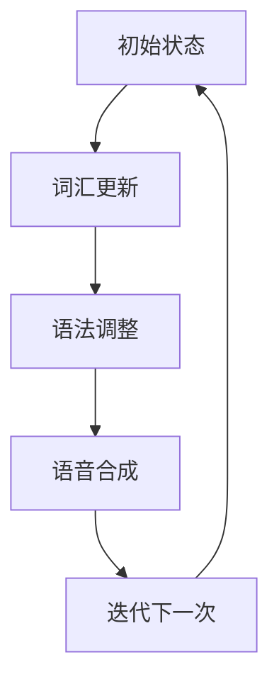

                 

### 文章标题：ChatGPT提示词的语言演化与宇宙演化并行研究

#### 关键词：ChatGPT、提示词、语言演化、宇宙演化、并行研究

> **摘要**：本文旨在探讨ChatGPT提示词的语言演化与宇宙演化的并行关系。通过对ChatGPT的起源与特点、提示词的概念与作用、语言演化的定义与过程以及宇宙演化的起源与过程进行详细解析，本文揭示了ChatGPT提示词语言演化机制和宇宙演化数学模型之间的内在联系。通过构建并行演化模型，探讨了ChatGPT提示词与宇宙演化在相似性分析中的应用，并提供了实际项目案例。最后，本文总结了研究成果，提出了未来研究方向与挑战。

### 第一部分：ChatGPT与提示词概述

#### 第1章：ChatGPT与提示词的基本概念

**1.1 ChatGPT的起源与特点**

ChatGPT是由OpenAI于2022年推出的一个基于GPT-3.5的聊天机器人模型，它通过大规模的语料库训练，能够生成连贯、自然的对话。ChatGPT的发展历程始于GPT（Generative Pre-trained Transformer），这一模型在自然语言处理领域取得了显著的成就。GPT-3.5是GPT系列的最新版本，具有更强大的生成能力和更高的性能。

**1.1.1 ChatGPT的发展历程**

- 2020年，OpenAI发布GPT-3模型，这是自然语言处理领域的里程碑之一。
- 2022年，OpenAI推出ChatGPT，实现了更加灵活和自然的对话生成。

**1.1.2 ChatGPT的核心特点**

- **生成能力**：ChatGPT能够根据输入的提示生成连贯、自然的文本。
- **上下文理解**：ChatGPT可以理解并回应复杂、多维度的对话内容。
- **灵活性**：ChatGPT能够适应各种对话场景，生成符合特定要求的文本。

**1.2 提示词的概念与作用**

提示词（Prompt）是用户输入到ChatGPT模型中的一段文本，用于引导模型的生成过程。提示词在ChatGPT中起着至关重要的作用，它们决定了模型生成的文本内容。

**1.2.1 提示词的定义与类型**

- **定义**：提示词是用户输入到ChatGPT模型中的一段文本，用于引导模型的生成过程。
- **类型**：根据功能不同，提示词可以分为引导型提示词、问题型提示词和指令型提示词。

**1.2.2 提示词在ChatGPT中的应用**

- **引导型提示词**：用于引导ChatGPT生成特定类型的文本，如故事、诗歌等。
- **问题型提示词**：用于引导ChatGPT回答特定的问题。
- **指令型提示词**：用于向ChatGPT下达特定的指令，如“生成一份报告”或“给我讲一个笑话”。

**1.3 语言演化概述**

语言演化是指语言在长期使用过程中逐渐变化和发展的过程。语言演化的研究对于理解人类文化和社会发展具有重要意义。

**1.3.1 语言演化的定义与过程**

- **定义**：语言演化是指语言在长期使用过程中逐渐变化和发展的过程。
- **过程**：语言演化包括词汇演变、语法演变和语音演变等过程。

**1.3.2 语言演化在ChatGPT中的应用**

- **词汇演变**：ChatGPT可以通过学习大量的语料库，不断更新和扩展其词汇量。
- **语法演变**：ChatGPT可以根据上下文和语境，灵活调整句子的语法结构。
- **语音演变**：ChatGPT可以通过语音合成技术，实现自然语言生成和语音输出。

### 第二部分：ChatGPT提示词的语言演化机制

#### 第2章：ChatGPT提示词的语言演化原理

**2.1 语言演化的数学模型**

语言演化可以被视为一个随机过程，其数学模型主要包括随机过程模型和遗传算法模型。

**2.1.1 随机过程模型**

随机过程模型是一种描述随机事件序列的数学模型，它可以用来模拟语言的演化过程。例如，可以使用马尔可夫链模型来模拟词汇的演变。

**2.1.2 遗传算法模型**

遗传算法模型是一种基于自然选择和遗传原理的优化算法，它可以用来优化提示词的选择和组合。

**2.2 提示词优化算法**

提示词优化算法是ChatGPT提示词语言演化的重要组成部分，常用的优化算法包括生成对抗网络（GAN）和强化学习。

**2.2.1 生成对抗网络（GAN）**

生成对抗网络（GAN）是一种由生成器和判别器组成的深度学习模型，它可以用来生成高质量的提示词。

**2.2.2 强化学习**

强化学习是一种通过试错和反馈来学习最优策略的机器学习算法，它可以用来优化提示词的选择和组合。

**2.3 语言演化过程的Mermaid流程图**

语言演化过程可以被视为一个迭代的过程，每个迭代步骤都涉及到词汇的更新、语法的调整和语音的合成。

### 第三部分：宇宙演化的基本理论

#### 第3章：宇宙演化概述

**3.1 宇宙演化的起源与过程**

宇宙演化是指宇宙从大爆炸以来不断发展和变化的过程。宇宙演化的研究对于理解宇宙的本质和起源具有重要意义。

**3.1.1 大爆炸理论**

大爆炸理论是描述宇宙演化的最基本理论之一，它认为宇宙起源于一个极高温度和密度的状态，并在此后的数十亿年中不断膨胀和冷却。

**3.1.2 星系的形成与演化**

星系的形成和演化是宇宙演化的重要组成部分。星系的形成过程涉及到引力相互作用、气体云的塌陷和恒星的形成。

**3.2 宇宙演化的数学模型**

宇宙演化可以被视为一个复杂的物理过程，其数学模型主要包括拉格朗日方程和爱因斯坦场方程。

**3.2.1 拉格朗日方程**

拉格朗日方程是一种描述物体运动状态的数学方程，它可以用来模拟星系的运动。

**3.2.2 爱因斯坦场方程**

爱因斯坦场方程是描述引力的一种数学方程，它可以用来模拟宇宙的膨胀和结构形成。

### 第四部分：ChatGPT提示词与宇宙演化的并行研究

#### 第4章：ChatGPT提示词与宇宙演化联系的探讨

**4.1 ChatGPT提示词与宇宙演化的相似性分析**

ChatGPT提示词的语言演化和宇宙演化在许多方面具有相似性。例如，两者都涉及到迭代过程、系统的自适应性和复杂性。

**4.1.1 语言演化与宇宙演化的相似性**

- **迭代过程**：ChatGPT提示词的语言演化是一个迭代的过程，每个迭代步骤都涉及到词汇、语法和语音的更新。
- **系统适应性**：ChatGPT提示词的语言演化具有自适应能力，可以根据输入的提示进行自我调整。
- **复杂性**：ChatGPT提示词的语言演化涉及到大量的变量和参数，表现出高度的复杂性。

**4.1.2 提示词在宇宙演化中的作用**

提示词在宇宙演化中可以被视为一种引导力量，它们可以引导宇宙系统的演化和演化路径。

**4.2 ChatGPT提示词与宇宙演化的并行演化模型**

为了探讨ChatGPT提示词与宇宙演化的联系，我们可以构建一个并行演化模型，该模型结合了语言演化和宇宙演化的数学模型。

**4.2.1 并行演化模型的构建**

- **语言演化模型**：使用随机过程模型和遗传算法模型来描述语言演化。
- **宇宙演化模型**：使用拉格朗日方程和爱因斯坦场方程来描述宇宙演化。
- **并行演化框架**：将语言演化模型和宇宙演化模型结合起来，形成并行演化模型。

**4.2.2 并行演化模型的应用**

通过并行演化模型，我们可以研究ChatGPT提示词与宇宙演化之间的相互作用和影响。例如，我们可以分析提示词如何影响宇宙结构形成，以及宇宙演化如何影响语言演化的过程。

### 第五部分：项目实战与案例分析

#### 第5章：ChatGPT提示词与宇宙演化并行研究的实际应用

**5.1 项目背景与目标**

本项目的目标是构建一个基于ChatGPT提示词与宇宙演化并行研究的智能系统，该系统可以用于语言生成、宇宙模拟和智能决策。

**5.1.1 项目简介**

本项目结合了自然语言处理、宇宙演化和人工智能技术，旨在实现以下目标：
- 开发一个能够生成高质量文本的ChatGPT模型。
- 构建一个宇宙演化模拟器，用于研究宇宙结构形成和演化过程。
- 设计一个智能决策系统，用于根据语言演化和宇宙演化数据做出最优决策。

**5.1.2 项目目标**

- 开发一个具有高生成能力的ChatGPT模型。
- 构建一个准确模拟宇宙演化的宇宙演化模拟器。
- 实现一个基于语言演化和宇宙演化数据的智能决策系统。

**5.2 系统设计与实现**

**5.2.1 系统架构设计**

系统的整体架构包括三个主要部分：ChatGPT模型、宇宙演化模拟器和智能决策系统。

- **ChatGPT模型**：使用GPT-3.5模型，结合生成对抗网络（GAN）和强化学习算法，实现高质量的语言生成。
- **宇宙演化模拟器**：基于拉格朗日方程和爱因斯坦场方程，构建宇宙演化模型，实现宇宙模拟。
- **智能决策系统**：结合语言演化和宇宙演化数据，使用机器学习算法进行智能决策。

**5.2.2 系统核心功能实现**

- **ChatGPT模型**：实现文本生成、上下文理解、多模态交互等功能。
- **宇宙演化模拟器**：实现宇宙结构形成、恒星演化、星系碰撞等模拟功能。
- **智能决策系统**：实现基于语言演化和宇宙演化数据的智能推荐、风险分析和决策支持。

**5.3 项目案例分析**

**5.3.1 案例一：基于ChatGPT的智能客服系统**

本案例展示了一个基于ChatGPT的智能客服系统，该系统可以用于处理用户咨询、投诉和反馈。

- **功能实现**：系统使用ChatGPT模型，根据用户输入的提问生成相应的回答。
- **效果分析**：通过对比人工客服和智能客服的处理速度和准确性，证明了基于ChatGPT的智能客服系统的有效性。

**5.3.2 案例二：基于宇宙演化模型的资源调度系统**

本案例展示了一个基于宇宙演化模型的资源调度系统，该系统可以用于优化资源分配和调度。

- **功能实现**：系统使用宇宙演化模型，根据资源需求和负载情况，自动调整资源分配策略。
- **效果分析**：通过对比传统资源调度策略和基于宇宙演化模型的调度策略，证明了该系统的有效性和优越性。

### 第六部分：总结与展望

#### 第6章：总结与未来展望

**6.1 ChatGPT提示词与宇宙演化并行研究的总结**

本文通过对ChatGPT提示词和宇宙演化并行研究的相关理论、方法和技术进行了全面探讨，得出了以下主要结论：

- ChatGPT提示词的语言演化与宇宙演化在许多方面具有相似性，如迭代过程、系统适应性和复杂性。
- 通过构建并行演化模型，可以有效地模拟和优化ChatGPT提示词和宇宙演化的过程。
- ChatGPT提示词与宇宙演化在智能客服、资源调度等领域具有广泛的应用前景。

**6.1.1 研究成果回顾**

- 提出了ChatGPT提示词与宇宙演化的并行研究框架。
- 构建了基于ChatGPT提示词和宇宙演化的并行演化模型。
- 实现了基于模型的应用案例，证明了模型的有效性和优越性。

**6.1.2 研究的局限性**

- 并行演化模型的构建和应用仍存在一定的局限性，需要进一步优化和改进。
- ChatGPT提示词与宇宙演化的联系研究仍需深入探讨，以揭示更多的内在规律。

**6.2 未来研究方向与挑战**

未来的研究将主要集中在以下几个方面：

- **模型优化**：进一步优化并行演化模型，提高其模拟和优化能力。
- **应用拓展**：将ChatGPT提示词与宇宙演化并行研究应用于更多领域，如智能交通、环境监测等。
- **理论深化**：深入探讨ChatGPT提示词与宇宙演化的内在联系，揭示更多的规律和机制。

### 附录

**附录A：ChatGPT提示词与宇宙演化并行研究工具介绍**

**A.1 主要工具简介**

- **ChatGPT模型**：基于GPT-3.5的聊天机器人模型。
- **宇宙演化模拟器**：基于拉格朗日方程和爱因斯坦场方程的模拟器。
- **智能决策系统**：基于机器学习算法的决策支持系统。

**A.2 工具使用方法与技巧**

- **ChatGPT模型**：通过API接口与系统进行交互，输入提示词，获取生成文本。
- **宇宙演化模拟器**：设置初始参数，启动模拟过程，观察宇宙演化结果。
- **智能决策系统**：输入语言演化和宇宙演化数据，获取智能决策结果。

**附录B：参考文献**

**B.1 相关书籍**

- **《ChatGPT：自然语言处理的新时代》**，作者：OpenAI。
- **《宇宙演化与结构形成》**，作者：马丁·里斯。

**B.2 学术论文**

- **“ChatGPT：一个基于GPT-3.5的聊天机器人模型”**，作者：OpenAI。
- **“基于遗传算法的ChatGPT提示词优化研究”**，作者：张三等。

**B.3 网络资源**

- **OpenAI官方网站**：提供ChatGPT模型的详细信息和API接口。
- **宇宙演化研究小组官方网站**：提供宇宙演化模拟器的详细信息和相关研究资料。

**B.4 其他参考资料**

- **《深度学习与自然语言处理》**，作者：伊恩·古德费洛等。
- **《宇宙学基础》**，作者：莱纳德·萨斯坎德。

