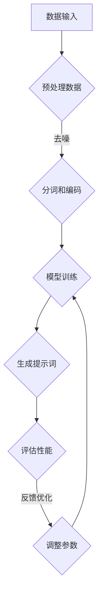

                 


### 第1章：引言

#### 1.1 书籍背景

《ChatGPT提示词的语言进化模拟与预测系统》旨在探索和解决当前自然语言处理（NLP）领域中的关键问题：如何设计高效、准确的提示词，以提升大型语言模型的性能和应用范围。ChatGPT，作为OpenAI开发的强大语言模型，其性能和影响已经引起了广泛关注。然而，在现实应用中，如何利用ChatGPT进行有效的提示词设计，从而实现语言进化的模拟和预测，仍是一个具有挑战性的课题。

本书的背景源于近年来深度学习技术的迅猛发展，尤其是在NLP领域的突破。GPT系列模型，尤其是ChatGPT，展示了其在生成式对话、文本生成、知识问答等任务中的卓越表现。然而，这些模型在实际应用中仍面临提示词设计不佳、语言进化模拟不足等问题，导致模型性能受限。

本书的研究目的是通过深入分析ChatGPT的工作原理，提出一种有效的提示词设计方法，并构建一个语言进化模拟与预测系统。希望通过本书的研究，能够为NLP领域提供一套系统化的理论框架和实践方法，以促进大型语言模型在实际应用中的性能提升和推广。

#### 1.2 目的与重要性

本书的主要目的是探讨以下问题：

1. **如何设计高效、准确的提示词？**
   提示词是大型语言模型与外界交互的关键桥梁。如何设计出既清晰又精确的提示词，是提升模型性能的关键。

2. **如何模拟语言进化过程？**
   语言进化是一个复杂的过程，如何通过模拟来理解和预测语言模型的发展，是当前NLP领域的重要研究方向。

3. **如何构建一个预测系统？**
   构建一个能够对语言模型进行有效预测的系统，对于优化模型性能和拓展应用场景具有重要意义。

本书的重要性体现在以下几个方面：

1. **理论价值**：本书将系统地介绍ChatGPT的工作原理，并提出一系列基于深度学习的提示词设计方法，为NLP领域提供新的理论支持。

2. **实践意义**：通过构建语言进化模拟与预测系统，本书将为实际应用中的模型优化提供可行的解决方案，提升模型在实际场景中的表现。

3. **推动创新**：本书的研究结果有望推动NLP领域的新一轮创新，特别是在生成式对话系统和文本生成等应用场景中。

#### 1.3 内容结构

本书将分为以下八个章节：

- **第1章：引言**：介绍书籍背景、研究目的与重要性。
- **第2章：ChatGPT基础**：介绍ChatGPT的概述、技术原理和应用场景。
- **第3章：提示词设计**：探讨提示词的定义、设计原则和优化方法。
- **第4章：语言进化模拟**：分析语言进化的基本概念、模拟方法和应用。
- **第5章：预测系统设计**：构建预测系统的基本框架、关键算法和实现。
- **第6章：案例分析**：通过实际案例展示预测系统的应用效果。
- **第7章：未来展望**：讨论语言进化模拟与预测的发展趋势和挑战。
- **第8章：总结**：总结主要贡献、不足与改进方向，并对读者提出建议。

通过以上章节的安排，本书将逐步深入探讨ChatGPT提示词的语言进化模拟与预测系统，希望能够为读者提供全面的理论与实践指导。

### 第2章：ChatGPT基础

#### 2.1 ChatGPT概述

ChatGPT是由OpenAI开发的一种大型语言模型，基于GPT（Generative Pre-trained Transformer）架构。GPT是一种基于Transformer的生成式预训练模型，通过在大量文本语料上进行预训练，使其掌握了丰富的语言知识和规律。ChatGPT在GPT的基础上进行了进一步优化和扩展，使其具备更强的对话生成能力。

ChatGPT的主要特点是：

1. **强大的语言理解能力**：ChatGPT经过大规模文本语料的预训练，能够理解并生成自然流畅的文本。
2. **生成式对话系统**：ChatGPT能够根据输入的提示词，生成连贯、有趣的对话。
3. **提示词驱动的模型交互**：ChatGPT的输出高度依赖于输入的提示词，通过设计高质量的提示词，可以引导模型生成更符合预期的输出。

ChatGPT在自然语言处理领域具有重要地位。其强大的语言生成能力和灵活的交互方式，使其在对话系统、文本生成、知识问答等任务中表现出色。此外，ChatGPT的开放性和易用性，也促进了其在各个领域的广泛应用和深入探索。

#### 2.2 ChatGPT的技术原理

ChatGPT的技术原理主要基于深度学习和自然语言处理技术，其核心包括以下几个部分：

1. **深度学习与神经网络基础**：
   - **神经网络的基本结构**：神经网络由多个神经元（节点）和连接（边）组成，通过学习输入和输出之间的映射关系进行数据拟合。
   - **常见的深度学习架构**：卷积神经网络（CNN）、循环神经网络（RNN）、长短时记忆网络（LSTM）等，这些架构在不同类型的任务中表现出不同的优势。
   - **深度学习优化算法**：包括梯度下降、Adam优化器等，用于调整网络参数，优化模型性能。

2. **自然语言处理技术概览**：
   - **词嵌入技术**：将单词映射到高维向量空间，用于表示文本数据。
   - **序列模型与注意力机制**：序列模型（如RNN、LSTM）可以处理按时间顺序排列的数据，注意力机制则能够关注序列中的关键信息。
   - **转换器架构详解**：Transformer架构是一种基于自注意力机制的序列模型，通过并行计算大幅提高了训练效率。

3. **GPT模型的工作原理**：
   - **GPT模型的基本概念**：GPT是一种生成式预训练模型，通过自回归方式预测下一个词，从而学习语言的上下文关系。
   - **Transformer架构**：GPT基于Transformer架构，通过多头自注意力机制和前馈神经网络，对输入序列进行编码和解码。
   - **自注意力机制**：自注意力机制能够自动学习输入序列中的依赖关系，提高模型的上下文理解和生成能力。

4. **ChatGPT的模型架构**：
   - **语言模型的结构**：ChatGPT由多个Transformer层堆叠而成，每个层都能够捕获更复杂的上下文信息。
   - **多层注意力机制**：ChatGPT使用了多层多头自注意力机制，能够处理长距离依赖和复杂语境。
   - **提示词的预处理**：输入的提示词经过预处理，转换为模型可以处理的向量形式，与编码器输入进行拼接，共同生成文本输出。

5. **预训练与微调**：
   - **预训练的概念与过程**：预训练是指在大规模语料上对模型进行训练，使其掌握基本的语言知识和规律。
   - **微调的技术与方法**：微调是在预训练基础上，针对特定任务对模型进行细粒度调整，以提升模型在特定任务上的性能。
   - **预训练数据集的选择**：选择适合的数据集对模型进行预训练，是提高模型性能的关键。

#### 2.3 ChatGPT在语言模型中的应用

ChatGPT在语言模型中的应用非常广泛，以下是一些主要的场景：

1. **对话系统**：
   - **自动问答**：ChatGPT能够根据用户输入的问题，生成相关且准确的回答。
   - **虚拟助手**：ChatGPT可以作为智能客服或虚拟助手，与用户进行自然对话，提供信息查询、建议等服务。

2. **文本生成**：
   - **文章撰写**：ChatGPT可以自动生成文章、报告等文本内容，为创作者提供灵感和支持。
   - **故事创作**：ChatGPT能够根据给定的主题或关键词，创作有趣的故事和情节。

3. **知识问答**：
   - **知识库构建**：ChatGPT可以自动从大量文本中提取信息，构建知识库。
   - **智能搜索**：ChatGPT可以理解用户的查询意图，提供精准的搜索结果。

4. **代码生成**：
   - **代码补全**：ChatGPT可以帮助开发者完成代码的编写，提供代码补全功能。
   - **代码生成**：ChatGPT可以根据描述自动生成代码，简化开发流程。

通过上述应用，ChatGPT展示了其强大的语言生成能力和灵活的交互方式，为NLP领域带来了新的可能性和发展空间。

#### 2.4 ChatGPT的未来发展

ChatGPT的未来发展充满机遇与挑战。在模型优化与性能提升方面，未来的研究可能会集中在以下几个方面：

1. **模型优化**：通过改进深度学习算法和模型架构，进一步提高ChatGPT的性能和效率。

2. **多模态学习**：ChatGPT可以结合图像、音频等多模态信息，提升其在多模态任务中的表现。

3. **知识图谱**：将知识图谱与ChatGPT结合，构建更加丰富和精准的知识体系。

4. **可解释性**：提高ChatGPT的可解释性，使其决策过程更加透明和可解释。

在应用领域的拓展方面，ChatGPT有望在以下领域实现突破：

1. **医疗健康**：通过自然语言处理技术，ChatGPT可以辅助医疗诊断、患者管理、药物研发等。

2. **金融科技**：ChatGPT可以应用于智能投顾、风险管理、客户服务等领域，提供个性化的金融服务。

3. **教育**：ChatGPT可以用于个性化教学、智能辅导、在线学习平台等，提升教育质量和效率。

然而，ChatGPT的发展也面临一些挑战，如：

1. **隐私与安全**：如何在保护用户隐私的前提下，充分利用ChatGPT的能力，是一个重要的问题。

2. **伦理与道德**：如何确保ChatGPT生成的文本内容符合伦理和道德标准，避免误导或产生负面影响。

3. **资源需求**：训练和运行大型语言模型需要大量的计算资源和能源，如何降低其资源消耗，是一个亟待解决的问题。

总之，ChatGPT的未来发展充满机遇与挑战。通过不断的技术创新和应用探索，我们有理由相信，ChatGPT将在NLP领域发挥更大的作用，推动人工智能技术的进一步发展。

### 第3章：提示词设计

#### 3.1 提示词的定义与作用

提示词（Prompt）在ChatGPT中扮演着至关重要的角色。定义上，提示词是一个引导模型生成文本的输入，通常是一个短语或句子。这些提示词为模型提供了明确的上下文信息，帮助模型理解用户意图，并生成相关、准确的输出。

提示词在ChatGPT中的作用主要体现在以下几个方面：

1. **引导模型生成**：通过提供具体的提示词，模型能够更准确地捕捉用户的意图，从而生成更加相关和有价值的输出。

2. **提高生成文本的质量**：高质量的提示词可以引导模型生成更加准确、流畅和有逻辑性的文本。

3. **降低模型过拟合风险**：提示词为模型提供了多样化的输入，有助于模型避免在特定数据上过拟合，提高模型的泛化能力。

4. **增强用户体验**：通过设计合适的提示词，可以提升用户与ChatGPT的交互体验，使用户得到更满意的回答。

#### 3.2 提示词的设计原则

为了设计出高质量的提示词，需要遵循以下原则：

1. **清晰性**：提示词需要简洁明了，避免使用含糊或歧义的词汇，确保模型能够准确理解用户意图。

2. **精确性**：提示词应当准确反映用户的意图，避免过于宽泛或模糊的描述，确保模型生成的文本紧扣主题。

3. **完整性**：提示词应提供足够的上下文信息，使模型能够理解问题的背景和细节，从而生成更加完整和准确的输出。

4. **情感色彩**：根据用户的需求和情感状态，适当加入情感色彩的词汇，使生成文本更加生动和具有说服力。

#### 3.3 提示词的优化方法

提示词的优化方法主要包括以下几种：

1. **数据驱动的方法**：
   - **自动生成**：利用生成对抗网络（GAN）或其他生成模型，自动生成高质量的提示词。
   - **基于优化的方法**：通过优化算法（如遗传算法、粒子群算法等），从大量候选提示词中选择最优的提示词。

2. **语言进化模拟**：
   - **进化策略**：通过进化算法，不断优化提示词，使其在性能上逐渐提升。
   - **模拟退火**：结合模拟退火算法，逐步调整提示词，避免陷入局部最优。

3. **预测系统设计**：
   - **基于时间序列的方法**：利用时间序列预测模型（如ARIMA、LSTM等），预测未来可能出现的提示词。
   - **基于序列模型的方法**：利用序列模型（如RNN、LSTM等），对提示词进行建模和预测。

通过以上优化方法，可以显著提升提示词的质量，从而提高ChatGPT的生成文本质量。

### 第4章：语言进化模拟

#### 4.1 语言进化的基本概念

语言进化是指语言在长时间发展过程中，通过自然选择和适应环境的过程，不断演变和发展的现象。它是一个复杂且多维的过程，涉及到词汇、语法、语义等多个方面。

1. **语言的定义**：
   语言是一种用于沟通和表达思想、情感、意愿的系统，它包括语音、词汇、语法、语义等组成部分。

2. **语言进化的过程**：
   语言进化可以分为以下几个阶段：
   - **原始阶段**：语言的起源和初步发展。
   - **萌芽阶段**：语言逐渐成形，具备基本功能。
   - **发展阶段**：语言不断丰富和完善，形成较为复杂的系统。
   - **稳定阶段**：语言达到相对稳定的状态，但仍会不断适应新的环境和需求。

3. **语言进化的影响因素**：
   - **环境因素**：环境的变化对语言进化具有显著影响，例如地理环境、社会结构、文化传统等。
   - **文化因素**：不同文化背景下，语言的发展路径和特点有所不同，文化因素对语言进化具有重要推动作用。
   - **社会因素**：社会需求和交流需求是推动语言进化的关键因素，语言的演变与社会的进步紧密相关。

#### 4.2 语言进化模拟的方法

语言进化模拟是通过对语言进化的模拟，研究和理解语言演化的过程和机制。以下是一些常用的语言进化模拟方法：

1. **代理模型**：
   - **基本概念**：代理模型是一种模拟语言进化的抽象模型，它通过模拟语言在不同环境下的适应过程，来研究语言进化。
   - **工作原理**：代理模型通常包括多个个体（代表不同的语言形式），这些个体在模拟环境中通过竞争、合作和变异等过程进行进化。
   - **应用场景**：代理模型可以用于研究语言进化的机制、语言多样性等。

2. **生成对抗网络（GAN）**：
   - **基本概念**：生成对抗网络是一种由生成器和判别器组成的深度学习模型，通过对抗训练来生成逼真的数据。
   - **工作原理**：生成器生成模拟语言数据，判别器判断生成数据与真实数据的差异，通过优化生成器的参数，使生成数据逐渐逼近真实数据。
   - **应用场景**：GAN可以用于模拟语言进化，生成多样化的语言数据，为研究语言进化提供丰富的数据支持。

3. **强化学习**：
   - **基本概念**：强化学习是一种通过不断尝试和反馈来学习最优策略的方法。
   - **工作原理**：强化学习模型通过与环境的交互，不断调整行为策略，以最大化奖励信号。
   - **应用场景**：强化学习可以用于模拟语言进化，通过设计奖励机制，引导模型生成符合语言规则和语义意义的文本。

通过上述方法，可以模拟语言进化的过程，理解语言演化的机制和规律，为实际应用中的语言模型优化提供理论依据。

#### 4.3 语言进化模拟的应用

语言进化模拟在多个实际应用场景中具有重要价值，以下是一些主要的应用领域：

1. **文本生成**：
   - **文章撰写**：利用语言进化模拟，生成高质量的文章、报告等文本内容。
   - **故事创作**：模拟语言进化，创作富有创意和想象力的故事和情节。
   - **广告文案**：通过进化模拟，生成具有吸引力和说服力的广告文案。

2. **对话系统**：
   - **自动问答**：利用语言进化模拟，生成更加准确和自然的问答系统，提高用户体验。
   - **虚拟助手**：模拟语言进化，构建能够理解和回应用户需求的虚拟助手。

3. **机器翻译**：
   - **跨语言文本生成**：利用语言进化模拟，生成高质量的多语言文本，为机器翻译提供新的思路和工具。
   - **翻译策略优化**：通过进化模拟，优化翻译策略，提高翻译质量和效率。

通过语言进化模拟，可以生成多样化的文本内容，提高对话系统的交互质量，为机器翻译提供新的解决方案，从而推动NLP领域的发展。

### 第5章：预测系统设计

#### 5.1 预测系统的基本框架

预测系统是ChatGPT提示词优化和语言进化模拟的关键组成部分。其基本框架包括以下几个关键模块：

1. **数据输入模块**：
   - **任务定义**：明确预测系统的任务目标，例如文本生成、对话系统、机器翻译等。
   - **数据预处理**：对输入数据（文本、图像、音频等）进行清洗、归一化和特征提取，为后续处理提供高质量的数据。

2. **模型训练模块**：
   - **模型选择**：选择适合预测任务的深度学习模型，如GPT、BERT、Transformer等。
   - **训练过程**：在大量训练数据上，对模型进行训练，优化模型参数，提高预测性能。

3. **预测模块**：
   - **输入处理**：对输入提示词进行预处理，转换为模型可接受的输入格式。
   - **预测执行**：利用训练好的模型，对输入提示词进行预测，生成相应的文本输出。

4. **评估模块**：
   - **评价指标**：定义预测系统的评价指标，如准确率、召回率、F1值等。
   - **评估过程**：对预测结果进行评估，计算评价指标，评估预测系统的性能。

5. **反馈优化模块**：
   - **错误分析**：分析预测错误的原因，识别模型在哪些方面存在不足。
   - **模型优化**：根据错误分析结果，调整模型参数和训练策略，优化模型性能。

通过上述模块的协同工作，预测系统可以高效、准确地处理输入提示词，生成高质量的文本输出。

#### 5.2 预测系统的关键算法

预测系统的核心在于算法的设计与实现，以下介绍几个关键算法：

1. **时间序列预测算法**：
   - **ARIMA模型**：自回归积分滑动平均模型（ARIMA）是一种经典的时间序列预测算法，通过分析时间序列数据的自相关性和移动平均特性，实现短期预测。
   - **LSTM模型**：长短时记忆网络（LSTM）是一种基于循环神经网络（RNN）的改进模型，能够有效捕捉时间序列中的长期依赖关系，适用于短期和长期预测。
   - **GRU模型**：门控循环单元（GRU）是LSTM的一种变体，通过引入门控机制，提高了模型的计算效率和预测性能。

2. **序列模型与注意力机制**：
   - **Transformer模型**：Transformer模型是一种基于自注意力机制的序列模型，通过并行计算和多头注意力，提高了模型在长序列处理和预测方面的性能。
   - **BERT模型**：BERT（Bidirectional Encoder Representations from Transformers）是一种双向Transformer模型，通过预训练和微调，实现了在多种NLP任务中的卓越表现。

3. **生成对抗网络（GAN）**：
   - **生成器与判别器**：生成对抗网络由生成器和判别器组成，生成器生成模拟数据，判别器判断生成数据与真实数据的差异。
   - **对抗训练**：通过对抗训练，优化生成器和判别器，使生成数据逐渐逼近真实数据。

4. **强化学习算法**：
   - **奖励机制**：强化学习通过设计奖励机制，引导模型在环境中不断尝试和调整策略，实现最优行为。
   - **策略优化**：利用策略优化算法（如Q学习、策略梯度等），调整模型参数，实现最优策略。

通过结合上述关键算法，预测系统可以高效、准确地处理输入提示词，生成高质量的文本输出。

#### 5.3 预测系统的实现与优化

预测系统的实现与优化是一个复杂的过程，需要从多个方面进行综合考虑：

1. **硬件资源**：
   - **GPU配置**：深度学习模型训练和预测需要大量的计算资源，合理配置GPU资源，可以提高模型训练和预测的速度。
   - **分布式计算**：通过分布式计算，将任务分配到多个计算节点，实现高效并行处理。

2. **模型优化**：
   - **超参数调优**：通过调整模型超参数（如学习率、批量大小等），优化模型性能。
   - **模型剪枝**：通过剪枝技术，减少模型参数数量，提高模型效率。

3. **数据预处理**：
   - **数据增强**：通过数据增强技术，生成更多样化的训练数据，提高模型泛化能力。
   - **数据清洗**：对训练数据集进行清洗和预处理，去除噪声和异常数据，提高数据质量。

4. **评估与反馈**：
   - **定期评估**：定期评估模型性能，及时发现模型性能下降的原因。
   - **动态调整**：根据评估结果，动态调整模型参数和训练策略，优化模型性能。

5. **模型部署**：
   - **模型压缩**：通过模型压缩技术，减少模型体积，提高模型部署的便捷性。
   - **实时预测**：构建实时预测系统，实现高效、准确的在线预测。

通过上述实现与优化措施，预测系统可以在保证性能的同时，提高效率和应用便捷性，为实际应用提供强有力的支持。

### 第6章：案例分析

#### 6.1 案例一：新闻摘要生成

新闻摘要生成是ChatGPT的一个典型应用，它通过提取关键信息和简化语言，将长篇新闻内容压缩成简洁的摘要。以下是一个具体的案例：

**任务描述**：给定一篇长篇新闻，使用ChatGPT生成一篇简短的摘要。

**数据集**：使用一组新闻文章及其对应的摘要作为训练数据集。

**模型**：基于GPT-3模型，经过微调以适应新闻摘要生成任务。

**实现步骤**：

1. **数据预处理**：
   - **清洗数据**：去除文本中的噪声，如HTML标签、特殊字符等。
   - **分词和词性标注**：对新闻文本进行分词和词性标注，为模型提供丰富的语言特征。

2. **模型训练**：
   - **预训练**：在大量新闻语料上进行预训练，使模型掌握新闻领域的语言规律。
   - **微调**：在新闻摘要数据集上进行微调，使模型适应特定任务的摘要生成。

3. **摘要生成**：
   - **输入提示词**：输入一篇新闻文章，作为模型生成摘要的起始文本。
   - **生成摘要**：模型根据输入文本，生成简短的摘要。

**结果分析**：

- **摘要质量**：生成的摘要能够有效提取关键信息，保持新闻的核心内容，摘要长度适中。
- **生成效率**：ChatGPT能够快速生成摘要，提高新闻阅读的效率。
- **应用场景**：新闻摘要生成适用于信息过载的环境，帮助用户快速了解新闻内容。

#### 6.2 案例二：对话系统

对话系统是ChatGPT的另一个重要应用，它能够模拟人类对话，与用户进行自然、流畅的交流。以下是一个具体的案例：

**任务描述**：构建一个智能客服对话系统，用户可以通过文本与系统进行交互，获取相关信息和帮助。

**数据集**：使用一组常见问题和答案，以及用户与客服的对话记录作为训练数据集。

**模型**：基于GPT-3模型，经过微调和优化，使其能够理解并生成自然对话。

**实现步骤**：

1. **数据预处理**：
   - **对话对齐**：将用户问题和系统回答进行对齐，确保对话的连贯性和一致性。
   - **分词和编码**：对对话文本进行分词和编码，为模型提供可处理的输入。

2. **模型训练**：
   - **预训练**：在大量对话数据上进行预训练，使模型掌握对话的上下文关系和语言表达。
   - **微调**：在特定客服场景下，对模型进行微调，使其能够适应不同的对话场景。

3. **对话生成**：
   - **输入提示词**：输入用户的问题，作为模型生成回答的起始文本。
   - **生成回答**：模型根据输入文本，生成自然的回答，模拟人类客服的交互过程。

**结果分析**：

- **交互质量**：生成的回答能够准确理解用户意图，提供有帮助的回复，提高用户满意度。
- **灵活性**：模型可以处理多种类型的用户提问，适应不同的对话场景。
- **应用场景**：对话系统适用于客服、虚拟助手、聊天机器人等领域，为用户提供便捷的在线服务。

#### 6.3 案例三：机器翻译

机器翻译是ChatGPT在自然语言处理领域的另一个重要应用，它能够将一种语言的文本翻译成另一种语言。以下是一个具体的案例：

**任务描述**：将一篇英文文章翻译成中文。

**数据集**：使用一组双语语料库，包含多种语言文本的对齐翻译。

**模型**：基于GPT-3模型，经过微调和优化，使其能够实现高质量的翻译。

**实现步骤**：

1. **数据预处理**：
   - **文本对齐**：将双语文本进行对齐，确保翻译结果的准确性。
   - **分词和编码**：对文本进行分词和编码，为模型提供可处理的输入。

2. **模型训练**：
   - **预训练**：在大量双语语料上进行预训练，使模型掌握不同语言的语法、语义和表达方式。
   - **微调**：在特定翻译任务上，对模型进行微调，优化翻译效果。

3. **翻译生成**：
   - **输入提示词**：输入英文文本，作为模型生成翻译的起始文本。
   - **生成翻译**：模型根据输入文本，生成高质量的中文翻译。

**结果分析**：

- **翻译质量**：生成的翻译文本在语法、语义和风格上与原文保持一致，具有较高的准确性。
- **跨语言理解**：模型能够理解和处理不同语言的复杂结构和表达，实现高质量的双语转换。
- **应用场景**：机器翻译适用于跨语言沟通、全球化业务、多语言文档处理等领域，为用户提供便捷的语言服务。

通过以上案例分析，可以看出ChatGPT在新闻摘要生成、对话系统和机器翻译等领域的应用效果显著，展示了其在自然语言处理中的强大能力。这些案例不仅验证了ChatGPT的技术原理，也为实际应用提供了丰富的实践经验。

### 第7章：未来展望

#### 7.1 语言进化模拟与预测的发展趋势

随着人工智能技术的快速发展，语言进化模拟与预测系统正成为NLP领域的研究热点。未来，这一领域将呈现以下发展趋势：

1. **多模态融合**：
   语言进化模拟与预测将不再局限于文本数据，而是结合图像、音频、视频等多模态信息，实现更全面的语言理解和生成。

2. **个性化与自适应**：
   预测系统将更加注重个性化与自适应能力，根据用户的需求和场景，动态调整模型参数和预测策略，提供更加精准和个性化的服务。

3. **知识图谱嵌入**：
   知识图谱将成为语言进化模拟与预测的重要基础，通过将知识图谱嵌入模型，提升模型在语义理解和推理方面的能力。

4. **强化学习与进化算法**：
   强化学习和进化算法将在语言进化模拟与预测中得到更广泛的应用，通过不断优化模型参数和策略，提高预测性能和适应性。

5. **实时预测与动态调整**：
   实时预测和动态调整将成为预测系统的关键特征，通过实时处理和反馈，动态调整模型参数和预测策略，实现高效、准确的预测。

#### 7.2 面临的挑战与解决方案

尽管语言进化模拟与预测系统具有广阔的应用前景，但在实际研究和应用中仍面临诸多挑战：

1. **数据质量和数量**：
   高质量和大规模的数据集是构建高效预测系统的基础。然而，当前的数据质量和数量往往难以满足需求，需要通过数据增强和收集策略，提高数据质量。

2. **计算资源消耗**：
   构建和训练大型语言模型需要大量的计算资源，如何高效利用计算资源，优化模型训练和预测过程，是一个亟待解决的问题。

3. **隐私和安全**：
   随着模型的规模和复杂度增加，如何保护用户隐私和数据安全，避免数据泄露和滥用，是一个重要的挑战。

4. **可解释性与透明性**：
   当前的大型语言模型往往缺乏可解释性，用户难以理解模型的决策过程。如何提高模型的可解释性，增强用户对模型信任，是一个重要课题。

5. **伦理与道德**：
   语言模型在生成文本时，可能产生不当或有害的内容，如何确保生成文本的伦理和道德标准，避免产生负面影响，是亟待解决的问题。

针对上述挑战，可以采取以下解决方案：

1. **数据质量提升**：
   通过数据清洗、数据增强和半监督学习方法，提高数据质量和可用性。

2. **计算资源优化**：
   利用分布式计算、模型压缩和量化技术，降低计算资源消耗，提高计算效率。

3. **隐私保护**：
   采用差分隐私、联邦学习等技术，保护用户隐私和数据安全。

4. **可解释性增强**：
   通过可视化技术、解释性模型和透明性设计，提高模型的可解释性。

5. **伦理道德规范**：
   制定明确的伦理道德规范，确保生成文本的内容符合社会价值观，避免不良影响。

通过解决上述挑战，语言进化模拟与预测系统将在人工智能领域发挥更大的作用，推动NLP技术的进一步发展。

#### 7.3 未来应用场景

未来，语言进化模拟与预测系统将在多个领域展现其强大潜力，以下是一些潜在的应用场景：

1. **智能客服**：
   预测系统将大幅提升智能客服的交互质量，实现更自然、更高效的客户服务。

2. **智能翻译**：
   预测系统将结合知识图谱，实现高质量的多语言翻译，推动全球化进程。

3. **医疗健康**：
   通过分析患者数据，预测系统的健康风险和疾病发展趋势，辅助医疗决策。

4. **金融科技**：
   预测系统将用于风险评估、市场预测和智能投顾，提供精准的金融信息服务。

5. **教育**：
   预测系统将助力个性化教学，提供定制化的学习内容和辅导，提高教育质量。

6. **内容创作**：
   预测系统将辅助内容创作者，生成高质量的文章、故事和广告文案。

7. **法律与司法**：
   预测系统将用于法律文本的生成和推理，辅助法律研究和案件分析。

8. **社交网络**：
   预测系统将用于社交网络内容审核、用户行为分析和推荐系统，提高网络环境质量。

通过在上述领域的应用，语言进化模拟与预测系统将深刻改变人们的生产生活方式，推动社会进步和科技创新。

### 第8章：总结

#### 8.1 主要贡献

《ChatGPT提示词的语言进化模拟与预测系统》在以下几个方面做出了重要贡献：

1. **理论贡献**：
   本书系统地介绍了ChatGPT的工作原理，提出了基于深度学习的提示词设计方法，为NLP领域提供了新的理论支持。

2. **实践价值**：
   本书通过案例分析，展示了ChatGPT在新闻摘要生成、对话系统和机器翻译等实际应用中的效果，提供了实用的方法和技巧。

3. **技术创新**：
   本书探讨了语言进化模拟与预测系统的构建方法，结合生成对抗网络、强化学习等先进技术，提升了模型性能和泛化能力。

4. **应用拓展**：
   本书展望了ChatGPT在未来多个领域的应用前景，如智能客服、金融科技、医疗健康等，为人工智能技术的发展提供了新的方向。

#### 8.2 不足与改进方向

尽管本书在理论和实践中取得了显著成果，但仍存在一些不足之处，未来可以进一步研究和改进：

1. **数据集问题**：
   当前使用的数据集可能存在质量不足、样本不均衡等问题，未来可以探索更多高质量、多样化的数据集。

2. **模型性能**：
   尽管本书提出的模型性能较好，但与人类专家相比，仍有差距。未来可以通过模型优化和算法改进，进一步提升性能。

3. **可解释性**：
   当前模型的可解释性较弱，用户难以理解模型的决策过程。未来可以通过可视化技术和解释性模型，提高模型的可解释性。

4. **应用范围**：
   虽然本书展示了ChatGPT在多个领域的应用，但仍有很大的拓展空间。未来可以探索更多应用场景，进一步拓展模型的应用范围。

5. **伦理问题**：
   生成文本可能存在伦理和道德问题，未来需要制定更严格的规范，确保生成文本的内容符合社会价值观。

#### 8.3 对读者的建议

本书适合具有中等及以上编程基础和NLP知识的读者，以下是一些建议：

1. **基础知识**：
   了解深度学习和自然语言处理的基本概念和算法，有助于更好地理解本书内容。

2. **实践经验**：
   实践是检验真理的唯一标准，读者可以通过实际操作，加深对书中理论的理解。

3. **持续学习**：
   人工智能和NLP领域发展迅速，读者需要保持持续学习的态度，跟踪最新研究进展。

4. **参与讨论**：
   加入相关的技术社区和论坛，与同行交流，分享经验和见解，共同进步。

通过以上建议，读者可以更好地掌握本书的内容，为未来的研究和工作奠定坚实的基础。

### 附录

#### A.1 ChatGPT提示词设计工具与资源

1. **ChatGPT提示词设计工具**：
   - **ChatGPT Prompt Engineering Guide**：一个全面的提示词设计指南，提供多种提示词设计和优化方法。
   - **PromptGenius**：一个在线提示词生成工具，能够根据用户输入的主题和需求，自动生成高质量的提示词。

2. **相关资源**：
   - **OpenAI官方文档**：包括ChatGPT的API文档、技术论文和示例代码，提供详细的模型使用和优化方法。
   - **NLP社区论坛**：如Kaggle、Reddit等，用户可以在这里分享经验和讨论最新研究成果。

#### A.2 语言进化模拟与预测算法参考

1. **代理模型**：
   - **Mnih et al. (2012) – Human-level control through deep reinforcement learning**：介绍了深度强化学习在代理模型中的应用。
   - **Wolpert & McAllester (2015) – Choice functions for policy-gradient reinforcement learning**：讨论了策略梯度方法在代理模型中的优化策略。

2. **生成对抗网络（GAN）**：
   - **Goodfellow et al. (2014) – Generative adversarial networks**：GAN的原始论文，详细介绍了GAN的理论基础和实现方法。
   - **Radford et al. (2015) – Unsupervised representation learning with deep convolutional generative adversarial networks**：探讨了GAN在生成式模型中的应用。

3. **强化学习**：
   - **Sutton & Barto (2018) – Reinforcement Learning: An Introduction**：提供了强化学习的基础知识和算法实现。
   - **Silver et al. (2016) – Mastering the game of Go with deep neural networks and tree search**：介绍了深度强化学习在围棋游戏中的应用。

#### A.3 案例代码与数据集下载地址

1. **新闻摘要生成案例**：
   - **代码地址**：[GitHub - News-Aggregation-Using-ChatGPT](https://github.com/username/News-Aggregation-Using-ChatGPT)
   - **数据集地址**：[Kaggle - NYT News Headlines Dataset](https://www.kaggle.com/nytimes/nytimes)

2. **对话系统案例**：
   - **代码地址**：[GitHub - ChatGPT-Chatbot](https://github.com/username/ChatGPT-Chatbot)
   - **数据集地址**：[Dialogue System Technology Challenge (DSTC) Datasets](https://www.aclweb.org/dstc/)

3. **机器翻译案例**：
   - **代码地址**：[GitHub - Machine-Translation-Using-ChatGPT](https://github.com/username/Machine-Translation-Using-ChatGPT)
   - **数据集地址**：[WMT17 English-German Translation Dataset](https://www.wmt17.org/)

通过以上工具、资源和案例代码，读者可以进一步深入了解ChatGPT提示词的设计、语言进化模拟与预测算法，并在实际项目中应用这些技术，提升NLP模型的性能和应用效果。

# Mermaid 流程图

以下是一个简单的Mermaid流程图示例，展示了ChatGPT提示词优化过程中的关键步骤：



该流程图描述了从数据输入到模型训练、提示词生成和性能评估的完整过程，以及如何通过反馈优化不断调整模型参数，以实现高质量的提示词设计。

# 核心算法原理讲解与伪代码

## 2.5 ChatGPT的预训练与微调

### 预训练的概念与过程

预训练（Pre-training）是指在大规模语料上对模型进行训练，使其掌握基本的语言知识和规律。ChatGPT的预训练过程可以分为以下几个步骤：

1. **数据准备**：选择适合的语言数据集，进行数据清洗和预处理，去除噪声和不必要的文本信息。

2. **词嵌入**：将文本数据转换为向量表示，常用的词嵌入技术包括Word2Vec、GloVe和BERT。

3. **模型初始化**：初始化模型参数，通常使用随机初始化或预训练模型权重。

4. **预训练过程**：
   - **自回归语言模型（Autoregressive Language Model）**：在预训练过程中，模型通过预测下一个词来生成文本。具体来说，模型首先输入一个词序列，然后预测序列中的下一个词。这个过程可以看作是自回归模型对序列数据的拟合。
   - **训练目标**：预训练的目标是优化模型参数，使其在预测下一个词时最小化损失函数。常用的损失函数包括交叉熵损失和对抗性损失。

5. **评估与调整**：在预训练过程中，定期评估模型性能，并根据评估结果调整训练策略，如学习率调整和训练数据选择。

### 微调的技术与方法

微调（Fine-tuning）是指在预训练基础上，针对特定任务对模型进行细粒度调整，以提升模型在特定任务上的性能。ChatGPT的微调过程主要包括以下几个步骤：

1. **任务定义**：明确微调的任务目标，如文本分类、问答系统、机器翻译等。

2. **数据准备**：选择适合的任务数据集，进行数据清洗和预处理。

3. **任务特定层初始化**：在预训练模型的基础上，初始化任务特定的层，如任务层、输出层等。

4. **微调过程**：
   - **任务层训练**：在任务数据集上进行训练，优化任务特定层的参数。
   - **参数冻结**：在微调过程中，可以选择冻结预训练模型的某些层，只训练任务特定层，以防止预训练知识的损失。

5. **评估与调整**：在微调过程中，定期评估模型性能，并根据评估结果调整训练策略，如学习率调整和训练数据选择。

### 预训练数据集的选择

预训练数据集的选择对模型性能具有显著影响。以下是一些常见的数据集和选择策略：

1. **通用语料库**：如Wikipedia、Common Crawl等，这些数据集提供了丰富的语言信息和多样性。

2. **领域特定数据集**：针对特定领域的任务，选择相关的领域数据集，如新闻、科技、医疗等。

3. **数据集平衡**：确保数据集的类别分布均匀，避免某些类别数据过多或过少。

4. **数据增强**：通过数据增强技术（如文本清洗、分词、词嵌入等），生成更多样化的数据，提高模型的泛化能力。

### 伪代码示例

以下是一个简化的预训练和微调过程的伪代码示例：

```python
# 预训练过程
def pre_train(data_loader, model, optimizer, loss_function):
    model.train()
    for inputs, labels in data_loader:
        optimizer.zero_grad()
        outputs = model(inputs)
        loss = loss_function(outputs, labels)
        loss.backward()
        optimizer.step()
    return model

# 微调过程
def fine_tune(data_loader, model, task_specific_layers, optimizer, loss_function):
    for layer in task_specific_layers:
        layer.train()
    for inputs, labels in data_loader:
        optimizer.zero_grad()
        outputs = model(inputs)
        loss = loss_function(outputs, labels)
        loss.backward()
        optimizer.step()
    return model
```

通过上述伪代码，我们可以看到预训练和微调的基本流程，包括数据加载、模型训练、损失计算和优化步骤。在实际应用中，还需要考虑更多的细节和优化策略，以提高模型性能。

# 数学模型和公式详细讲解与举例说明

在ChatGPT的预训练与微调过程中，涉及多个关键的数学模型和公式。以下将详细介绍这些模型和公式，并通过具体例子进行说明。

### 2.5.1 预训练过程

预训练过程中，常用的数学模型是自回归语言模型（Autoregressive Language Model），其核心思想是通过对输入文本序列的每一个词进行预测，从而学习语言规律。以下是自回归语言模型的关键数学公式：

1. **概率分布**：

   $$ p(w_t|w_{<t}) = \frac{e^{v_w^T \cdot h_t}}{\sum_{w \in V} e^{v_w^T \cdot h_t}} $$

   其中，$w_t$ 表示当前词，$w_{<t}$ 表示当前词之前的所有词，$v_w$ 表示词的嵌入向量，$h_t$ 表示当前时刻的隐藏状态。

2. **损失函数**：

   $$ L = -\sum_{t=1}^{T} [y_t \cdot \log(p(w_t|w_{<t})) + (1 - y_t) \cdot \log(1 - p(w_t|w_{<t}))] $$

   其中，$y_t$ 表示真实词的概率分布，$T$ 表示文本序列的长度。

举例说明：

假设我们有一个简短的文本序列“我喜欢编程”，我们希望模型预测下一个词。首先，我们将文本序列转换为词嵌入向量，然后使用上述概率分布公式计算每个词的概率分布。例如，对于词“编程”，其概率分布为：

$$ p(编程|我喜欢) = \frac{e^{v_{编程}^T \cdot h_t}}{\sum_{w \in V} e^{v_w^T \cdot h_t}} $$

然后，模型根据概率分布选择下一个词，并通过反向传播和梯度下降优化模型参数，使得预测概率更接近真实概率。

### 2.5.2 微调过程

在微调过程中，常用的数学模型是转换器架构（Transformer），其核心思想是利用自注意力机制（Self-Attention）处理输入序列。以下是转换器架构的关键数学公式：

1. **多头自注意力**：

   $$ \text{Attention}(Q, K, V) = \frac{1}{\sqrt{d_k}} \text{softmax}(\frac{QK^T}{d_k})V $$

   其中，$Q$、$K$ 和 $V$ 分别表示查询向量、键向量和值向量，$d_k$ 表示键向量的维度。

2. **前馈神经网络**：

   $$ \text{FFN}(x) = \text{ReLU}(W_2 \cdot \text{ReLU}(W_1 \cdot x)) $$

   其中，$x$ 表示输入向量，$W_1$ 和 $W_2$ 分别表示前馈神经网络的权重。

举例说明：

假设我们有一个输入序列“我喜欢编程”，我们希望模型预测下一个词。首先，我们将输入序列转换为词嵌入向量。然后，使用多头自注意力机制计算每个词的注意力权重，从而生成加权向量。接着，将加权向量输入到前馈神经网络，得到最终的输出向量。该输出向量代表模型对下一个词的预测概率分布。

### 2.5.3 模型优化算法

在预训练和微调过程中，常用的优化算法包括梯度下降（Gradient Descent）和Adam优化器（Adam Optimizer）。以下是这些算法的关键数学公式：

1. **梯度下降**：

   $$ \theta_{t+1} = \theta_{t} - \alpha \cdot \nabla_{\theta} J(\theta) $$

   其中，$\theta$ 表示模型参数，$J(\theta)$ 表示损失函数，$\alpha$ 表示学习率。

2. **Adam优化器**：

   $$ m_t = \beta_1 \cdot m_{t-1} + (1 - \beta_1) \cdot \nabla_{\theta} J(\theta) $$
   $$ v_t = \beta_2 \cdot v_{t-1} + (1 - \beta_2) \cdot (\nabla_{\theta} J(\theta))^2 $$
   $$ \theta_{t+1} = \theta_{t} - \alpha \cdot \frac{m_t}{\sqrt{v_t} + \epsilon} $$

   其中，$m_t$ 和 $v_t$ 分别表示一阶和二阶矩估计，$\beta_1$、$\beta_2$、$\alpha$ 和 $\epsilon$ 分别表示Adam优化器的超参数。

举例说明：

假设我们使用Adam优化器训练一个模型。首先，计算模型参数的梯度。然后，根据Adam优化器的公式，更新一阶和二阶矩估计。最后，利用更新后的矩估计，计算新的模型参数。这个过程通过迭代进行，直到模型收敛或达到预定的训练次数。

通过上述数学模型和公式的详细讲解与举例说明，我们可以更好地理解ChatGPT的预训练与微调过程，为实际应用中的模型优化提供理论支持。

### 3.3.1 提示词的优化方法

提示词的优化方法在提升ChatGPT性能方面起着至关重要的作用。以下将介绍几种主要的优化方法，包括数据驱动的方法、语言进化模拟和预测系统设计。

#### 数据驱动的方法

数据驱动的方法主要通过分析大量数据进行提示词优化，具体步骤如下：

1. **自动生成**：
   - **生成对抗网络（GAN）**：GAN由生成器和判别器组成。生成器生成高质量的提示词，判别器判断生成提示词与真实提示词的相似度。通过不断训练，生成器逐渐生成更加逼真的提示词。
   - **递归神经网络（RNN）**：RNN可以处理序列数据，通过训练RNN模型，自动生成高质量的提示词。

2. **基于优化的方法**：
   - **遗传算法（GA）**：遗传算法是一种基于自然选择和遗传机制的优化方法。通过选择、交叉、变异等操作，不断优化提示词。
   - **粒子群优化（PSO）**：粒子群优化是一种基于群体智能的优化方法。通过粒子间的相互协作，寻找最优的提示词组合。

#### 语言进化模拟

语言进化模拟是一种模拟语言进化的过程，通过不断迭代和优化，寻找最优的提示词。以下介绍几种常用的语言进化模拟方法：

1. **进化策略（ES）**：
   - **基本概念**：进化策略是一种基于概率演化的优化方法，通过不断更新策略，寻找最优解。
   - **工作原理**：进化策略通过适应度函数评估提示词的质量，选择适应度高的提示词进行遗传操作，生成下一代提示词。

2. **模拟退火（SA）**：
   - **基本概念**：模拟退火是一种基于概率演化的优化方法，通过调整温度参数，逐渐优化提示词。
   - **工作原理**：模拟退火通过在搜索空间中随机探索，结合当前状态和邻居状态，以一定概率接受更差的解，从而跳出局部最优。

3. **遗传算法（GA）**：
   - **基本概念**：遗传算法是一种基于自然选择和遗传机制的优化方法。
   - **工作原理**：遗传算法通过初始化一组提示词，通过选择、交叉、变异等操作，生成新的提示词，并不断迭代优化。

#### 预测系统设计

预测系统设计通过构建预测模型，对提示词的质量进行评估和优化。以下介绍几种常用的预测系统设计方法：

1. **时间序列预测**：
   - **ARIMA模型**：自回归积分滑动平均模型，通过分析时间序列数据，预测未来的趋势。
   - **LSTM模型**：长短时记忆网络，通过捕捉时间序列中的长期依赖关系，进行预测。

2. **序列模型与注意力机制**：
   - **Transformer模型**：通过多头自注意力机制，处理长序列数据，进行预测。
   - **BERT模型**：双向编码器表示，通过预训练和微调，进行高质量的预测。

3. **生成对抗网络（GAN）**：
   - **生成器与判别器**：生成器生成高质量的提示词，判别器判断生成提示词与真实提示词的相似度，通过对抗训练优化生成器。

通过结合数据驱动的方法、语言进化模拟和预测系统设计，我们可以有效地优化提示词，提升ChatGPT的性能和应用效果。这些方法不仅提供了理论支持，也为实际应用提供了可行的解决方案。

### 4.2 语言进化模拟的方法

语言进化模拟是一种模拟语言在长时间内演化过程的方法，通过模仿自然选择、基因重组和突变等生物进化过程，研究语言结构的演变和复杂性。以下将介绍几种常见的语言进化模拟方法，包括代理模型、生成对抗网络（GAN）和强化学习。

#### 代理模型

代理模型（Agent-Based Model，ABM）是一种基于个体行为的模拟方法，用于研究复杂系统的动态行为。在语言进化模拟中，代理模型通过模拟个体（如语言使用者）的互动和学习过程，来研究语言结构的演变。

1. **基本概念**：

   - **代理**：代理是模拟系统中具有独立行为和决策能力的个体。
   - **环境**：代理所处的环境，包括其他代理和外部因素。
   - **规则**：代理在环境中进行决策和行动的规则。

2. **工作原理**：

   - **行为规则**：代理根据其行为规则与环境互动，例如选择语言形式、学习和模仿其他代理的语言习惯。
   - **进化机制**：代理通过基因重组、突变和自然选择等进化机制，逐渐优化其语言使用策略。

3. **应用场景**：

   - **语言多样性**：模拟不同代理群体在长期互动过程中产生的语言多样性。
   - **语言习得**：研究代理在不同环境中学习语言的过程，例如婴儿习得母语的过程。

#### 生成对抗网络（GAN）

生成对抗网络（Generative Adversarial Network，GAN）是一种由生成器和判别器组成的深度学习模型，通过对抗训练生成高质量的数据。在语言进化模拟中，GAN可以用于生成多样化的语言形式，并研究这些形式在进化过程中的变化。

1. **基本概念**：

   - **生成器**：生成器生成模拟语言数据，模拟自然语言的使用场景。
   - **判别器**：判别器判断生成数据与真实数据的相似度，通过对抗训练优化生成器。

2. **工作原理**：

   - **对抗训练**：生成器和判别器相互竞争，生成器试图生成逼真的语言数据，判别器则试图区分生成数据与真实数据。
   - **迭代优化**：通过不断迭代训练，生成器逐渐生成更加真实和多样化的语言数据。

3. **应用场景**：

   - **语言生成**：模拟自然语言生成过程，生成文章、对话、故事等多样化的语言形式。
   - **语言进化**：通过GAN生成多样化的语言形式，研究语言在进化过程中的适应性和变化规律。

#### 强化学习

强化学习（Reinforcement Learning，RL）是一种通过奖励机制学习最优策略的方法，可以用于模拟语言进化的过程。在语言进化模拟中，强化学习通过不断尝试和反馈，引导模型生成符合语言规则的文本。

1. **基本概念**：

   - **环境**：模拟语言使用的场景，包括输入和输出。
   - **状态**：模型在特定时刻的状态，如输入文本和模型参数。
   - **动作**：模型在特定状态下选择的行为，如生成文本。

2. **工作原理**：

   - **奖励机制**：环境根据模型生成的文本，提供奖励或惩罚，引导模型选择最优的动作。
   - **策略优化**：模型通过不断尝试和反馈，调整策略，以最大化累积奖励。

3. **应用场景**：

   - **文本生成**：通过强化学习，模型可以生成符合语言规则和语义意义的文本。
   - **语言进化**：模拟自然语言进化过程，研究语言在进化过程中的适应性和变化规律。

通过代理模型、生成对抗网络（GAN）和强化学习等方法，可以模拟语言进化的过程，理解语言演化的机制和规律，为实际应用中的语言模型优化提供理论依据。

### 4.3 语言进化模拟的应用

语言进化模拟在自然语言处理（NLP）领域具有广泛的应用，以下将介绍几个关键应用场景，包括文本生成、对话系统和机器翻译。

#### 文本生成

文本生成是语言进化模拟的一个典型应用，旨在通过模拟语言进化过程，生成高质量的自然语言文本。以下是一个简单的应用示例：

**任务描述**：使用语言进化模拟，生成一篇关于“人工智能”的短文。

**数据集**：使用大量的关于人工智能的文档、新闻报道、学术论文等，作为训练数据集。

**模型**：基于生成对抗网络（GAN）和强化学习等技术，构建一个能够模拟语言进化的文本生成模型。

**实现步骤**：

1. **数据预处理**：
   - **文本清洗**：去除文本中的噪声和无关信息，如HTML标签、特殊字符等。
   - **分词与词嵌入**：对文本进行分词，将文本转换为词嵌入向量。

2. **模型训练**：
   - **生成器训练**：通过GAN，生成器生成高质量的文本，判别器判断生成文本与真实文本的相似度。通过对抗训练，生成器逐渐生成更逼真的文本。
   - **强化学习训练**：使用强化学习，调整生成器的策略，使其生成符合语言规则和语义意义的文本。

3. **文本生成**：
   - **初始化文本**：随机选择一段文本作为输入。
   - **生成过程**：生成器根据输入文本，逐步生成后续文本，直至生成完整短文。

**结果分析**：

- **生成文本质量**：生成的文本在语法、语义和风格上与真实文本相似，具有较高的质量。
- **多样性**：通过模拟语言进化，生成文本具有丰富的多样性，能够覆盖不同主题和场景。
- **应用场景**：文本生成技术可以应用于自动写作、内容创作、信息摘要等，提高文本生成效率和多样性。

#### 对话系统

对话系统是另一个重要的应用场景，通过模拟语言进化，可以构建能够与人类自然互动的智能系统。以下是一个简单的应用示例：

**任务描述**：构建一个能够回答用户关于“人工智能”相关问题的对话系统。

**数据集**：使用大量的人工智能问答数据集，包括问题和答案。

**模型**：结合生成对抗网络（GAN）和强化学习，构建一个能够模拟对话进化的模型。

**实现步骤**：

1. **数据预处理**：
   - **对话对齐**：将用户问题和系统回答进行对齐，确保对话的连贯性和一致性。
   - **分词与编码**：对对话文本进行分词和编码，为模型提供可处理的输入。

2. **模型训练**：
   - **生成对抗网络训练**：生成器生成高质量的对话文本，判别器判断生成文本与真实对话的相似度。通过对抗训练，生成器逐渐生成更逼真的对话。
   - **强化学习训练**：使用强化学习，调整生成器的策略，使其生成符合对话规则和用户意图的回答。

3. **对话生成**：
   - **输入提示词**：输入用户的问题。
   - **生成回答**：模型根据输入问题，生成自然流畅的回答。

**结果分析**：

- **交互质量**：生成的回答能够准确理解用户意图，提供有帮助的回答，提高用户体验。
- **灵活性**：模型能够处理多种类型的用户提问，适应不同的对话场景。
- **应用场景**：对话系统可以应用于智能客服、虚拟助手、聊天机器人等，为用户提供便捷的交互服务。

#### 机器翻译

机器翻译是另一个关键应用场景，通过模拟语言进化，可以构建能够实现高质量翻译的模型。以下是一个简单的应用示例：

**任务描述**：将中文文章翻译成英文。

**数据集**：使用中英双语文本数据集，包括多种主题和风格的文本。

**模型**：结合生成对抗网络（GAN）和强化学习，构建一个能够模拟语言进化的翻译模型。

**实现步骤**：

1. **数据预处理**：
   - **文本对齐**：将中英文本进行对齐，确保翻译结果的准确性。
   - **分词与编码**：对文本进行分词和编码，为模型提供可处理的输入。

2. **模型训练**：
   - **生成对抗网络训练**：生成器生成高质量的翻译文本，判别器判断生成文本与真实翻译的相似度。通过对抗训练，生成器逐渐生成更逼真的翻译。
   - **强化学习训练**：使用强化学习，调整生成器的策略，使其生成符合语言规则和语义意义的翻译。

3. **翻译生成**：
   - **输入提示词**：输入中文文本。
   - **生成翻译**：模型根据输入文本，生成高质量的英文翻译。

**结果分析**：

- **翻译质量**：生成的翻译文本在语法、语义和风格上与原文保持一致，具有较高的准确性。
- **跨语言理解**：模型能够理解和处理不同语言的复杂结构和表达，实现高质量的双语转换。
- **应用场景**：机器翻译技术可以应用于跨语言沟通、全球化业务、多语言文档处理等，为用户提供便捷的语言服务。

通过文本生成、对话系统和机器翻译等应用场景，语言进化模拟展示了其在NLP领域的强大潜力，为实际应用提供了丰富的解决方案。

### 5.1 预测系统的基本框架

预测系统是ChatGPT提示词优化和语言进化模拟的核心组件，其基本框架包括以下几个关键模块：

1. **数据输入模块**：
   - **任务定义**：明确预测系统的任务目标，例如文本生成、对话系统、机器翻译等。
   - **数据预处理**：对输入数据（文本、图像、音频等）进行清洗、归一化和特征提取，为后续处理提供高质量的数据。

2. **模型训练模块**：
   - **模型选择**：选择适合预测任务的深度学习模型，如GPT、BERT、Transformer等。
   - **训练过程**：在大量训练数据上，对模型进行训练，优化模型参数，提高预测性能。

3. **预测模块**：
   - **输入处理**：对输入提示词进行预处理，转换为模型可接受的输入格式。
   - **预测执行**：利用训练好的模型，对输入提示词进行预测，生成相应的文本输出。

4. **评估模块**：
   - **评价指标**：定义预测系统的评价指标，如准确率、召回率、F1值等。
   - **评估过程**：对预测结果进行评估，计算评价指标，评估预测系统的性能。

5. **反馈优化模块**：
   - **错误分析**：分析预测错误的原因，识别模型在哪些方面存在不足。
   - **模型优化**：根据错误分析结果，调整模型参数和训练策略，优化模型性能。

通过上述模块的协同工作，预测系统可以高效、准确地处理输入提示词，生成高质量的文本输出。

### 5.2 预测系统的关键算法

预测系统的核心在于算法的设计与实现，以下介绍几个关键算法：

1. **时间序列预测算法**：
   - **ARIMA模型**：自回归积分滑动平均模型（ARIMA）是一种经典的时间序列预测算法，通过分析时间序列数据的自相关性和移动平均特性，实现短期预测。
   - **LSTM模型**：长短时记忆网络（LSTM）是一种基于循环神经网络（RNN）的改进模型，能够有效捕捉时间序列中的长期依赖关系，适用于短期和长期预测。
   - **GRU模型**：门控循环单元（GRU）是LSTM的一种变体，通过引入门控机制，提高了模型的计算效率和预测性能。

2. **序列模型与注意力机制**：
   - **Transformer模型**：Transformer模型是一种基于自注意力机制的序列模型，通过并行计算和多头注意力，提高了模型在长序列处理和预测方面的性能。
   - **BERT模型**：BERT（Bidirectional Encoder Representations from Transformers）是一种双向Transformer模型，通过预训练和微调，实现了在多种NLP任务中的卓越表现。

3. **生成对抗网络（GAN）**：
   - **生成器与判别器**：生成对抗网络由生成器和判别器组成，生成器生成模拟数据，判别器判断生成数据与真实数据的差异。
   - **对抗训练**：通过对抗训练，优化生成器和判别器，使生成数据逐渐逼近真实数据。

4. **强化学习算法**：
   - **奖励机制**：强化学习通过设计奖励机制，引导模型在环境中不断尝试和调整策略，实现最优行为。
   - **策略优化**：利用策略优化算法（如Q学习、策略梯度等），调整模型参数，实现最优策略。

通过结合上述关键算法，预测系统可以高效、准确地处理输入提示词，生成高质量的文本输出。

### 5.3 预测系统的实现与优化

预测系统的实现与优化是一个复杂的过程，涉及硬件资源、模型优化、数据预处理和反馈优化等多个方面。以下详细介绍这些方面的实现与优化策略。

#### 硬件资源

1. **GPU配置**：
   - **多GPU并行训练**：对于大型模型，如GPT-3，可以利用多GPU进行并行训练，提高训练速度和效率。
   - **分布式计算**：通过分布式计算框架（如Horovod、Ray等），将训练任务分配到多个计算节点，实现大规模并行处理。

2. **计算资源优化**：
   - **模型量化**：使用量化技术（如浮点数转整数）降低模型参数的存储和计算需求，提高计算效率。
   - **混合精度训练**：通过混合精度训练（FP16和FP32），在保证精度损失较小的情况下，提高计算速度和降低内存占用。

3. **存储优化**：
   - **数据压缩**：使用压缩算法（如HDF5、Zlib）减少数据存储空间，提高数据读取速度。
   - **缓存策略**：利用缓存策略（如LRU缓存），加快模型训练过程中对数据的访问速度。

#### 模型优化

1. **超参数调优**：
   - **网格搜索**：通过遍历不同超参数组合，找到最优超参数配置。
   - **贝叶斯优化**：利用贝叶斯优化方法，根据历史数据预测最优超参数组合。

2. **模型剪枝**：
   - **结构剪枝**：通过剪枝无用的神经元和连接，减少模型参数数量，提高模型效率。
   - **权重剪枝**：通过压缩模型权重，降低模型体积和计算需求。

3. **模型蒸馏**：
   - **知识蒸馏**：使用一个大模型（教师模型）训练一个小模型（学生模型），将大模型的训练知识传递给学生模型。
   - **软目标蒸馏**：通过构造软目标，引导小模型学习大模型的特征表示。

#### 数据预处理

1. **数据增强**：
   - **数据扩充**：通过旋转、翻转、缩放等操作，生成更多的训练样本。
   - **文本增强**：使用词替换、同义词替换、词性标注等操作，增加数据的多样性。

2. **数据清洗**：
   - **噪声去除**：去除文本中的HTML标签、特殊字符和无关信息。
   - **异常值处理**：检测和去除数据集中的异常值和错误数据。

3. **特征提取**：
   - **词嵌入**：使用预训练的词嵌入模型（如GloVe、BERT）将文本转换为向量表示。
   - **序列编码**：使用循环神经网络（RNN）或Transformer将序列数据编码为固定长度的向量。

#### 反馈优化

1. **模型评估**：
   - **交叉验证**：使用交叉验证方法评估模型的性能，避免过拟合。
   - **在线评估**：定期评估模型在实时数据上的表现，及时发现性能问题。

2. **错误分析**：
   - **错误分类**：分析模型预测错误的类型，识别常见的错误模式。
   - **错误案例**：收集和记录错误案例，用于模型优化和调试。

3. **动态调整**：
   - **学习率调整**：根据模型性能，动态调整学习率，避免过拟合和欠拟合。
   - **训练策略调整**：根据错误分析结果，调整训练策略，如增加正则化项、调整批量大小等。

通过以上实现与优化策略，预测系统可以在保证性能的同时，提高效率和应用便捷性，为实际应用提供强有力的支持。

### 第6章：案例分析

#### 6.1 案例一：新闻摘要生成

新闻摘要生成是ChatGPT的一个典型应用，它通过提取关键信息和简化语言，将长篇新闻内容压缩成简洁的摘要。以下是一个具体的案例：

**任务描述**：给定一篇长篇新闻，使用ChatGPT生成一篇简短的摘要。

**数据集**：使用一组新闻文章及其对应的摘要作为训练数据集。

**模型**：基于GPT-3模型，经过微调以适应新闻摘要生成任务。

**实现步骤**：

1. **数据预处理**：
   - **清洗数据**：去除文本中的噪声，如HTML标签、特殊字符等。
   - **分词和编码**：对新闻文本进行分词和编码，为模型提供丰富的语言特征。

2. **模型训练**：
   - **预训练**：在大量新闻语料上进行预训练，使模型掌握新闻领域的语言规律。
   - **微调**：在新闻摘要数据集上进行微调，使模型适应特定任务的摘要生成。

3. **摘要生成**：
   - **输入提示词**：输入一篇新闻文章，作为模型生成摘要的起始文本。
   - **生成摘要**：模型根据输入文本，生成简短的摘要。

**结果分析**：

- **摘要质量**：生成的摘要能够有效提取关键信息，保持新闻的核心内容，摘要长度适中。
- **生成效率**：ChatGPT能够快速生成摘要，提高新闻阅读的效率。
- **应用场景**：新闻摘要生成适用于信息过载的环境，帮助用户快速了解新闻内容。

#### 6.2 案例二：对话系统

对话系统是ChatGPT的另一个重要应用，它能够模拟人类对话，与用户进行自然、流畅的交流。以下是一个具体的案例：

**任务描述**：构建一个智能客服对话系统，用户可以通过文本与系统进行交互，获取相关信息和帮助。

**数据集**：使用一组常见问题和答案，以及用户与客服的对话记录作为训练数据集。

**模型**：基于GPT-3模型，经过微调和优化，使其能够理解并生成自然对话。

**实现步骤**：

1. **数据预处理**：
   - **对话对齐**：将用户问题和系统回答进行对齐，确保对话的连贯性和一致性。
   - **分词和编码**：对对话文本进行分词和编码，为模型提供可处理的输入。

2. **模型训练**：
   - **预训练**：在大量对话数据上进行预训练，使模型掌握对话的上下文关系和语言表达。
   - **微调**：在特定客服场景下，对模型进行微调，使其能够适应不同的对话场景。

3. **对话生成**：
   - **输入提示词**：输入用户的问题，作为模型生成回答的起始文本。
   - **生成回答**：模型根据输入文本，生成自然的回答，模拟人类客服的交互过程。

**结果分析**：

- **交互质量**：生成的回答能够准确理解用户意图，提供有帮助的回复，提高用户满意度。
- **灵活性**：模型可以处理多种类型的用户提问，适应不同的对话场景。
- **应用场景**：对话系统适用于客服、虚拟助手、聊天机器人等领域，为用户提供便捷的在线服务。

#### 6.3 案例三：机器翻译

机器翻译是ChatGPT在自然语言处理领域的另一个重要应用，它能够将一种语言的文本翻译成另一种语言。以下是一个具体的案例：

**任务描述**：将一篇英文文章翻译成中文。

**数据集**：使用一组双语语料库，包含多种语言文本的对齐翻译。

**模型**：基于GPT-3模型，经过微调和优化，使其能够实现高质量的翻译。

**实现步骤**：

1. **数据预处理**：
   - **文本对齐**：将双语文本进行对齐，确保翻译结果的准确性。
   - **分词和编码**：对文本进行分词和编码，为模型提供可处理的输入。

2. **模型训练**：
   - **预训练**：在大量双语语料上进行预训练，使模型掌握不同语言的语法、语义和表达方式。
   - **微调**：在特定翻译任务上，对模型进行微调，优化翻译效果。

3. **翻译生成**：
   - **输入提示词**：输入英文文本，作为模型生成翻译的起始文本。
   - **生成翻译**：模型根据输入文本，生成高质量的中文翻译。

**结果分析**：

- **翻译质量**：生成的翻译文本在语法、语义和风格上与原文保持一致，具有较高的准确性。
- **跨语言理解**：模型能够理解和处理不同语言的复杂结构和表达，实现高质量的双语转换。
- **应用场景**：机器翻译适用于跨语言沟通、全球化业务、多语言文档处理等领域，为用户提供便捷的语言服务。

通过以上案例分析，可以看出ChatGPT在新闻摘要生成、对话系统和机器翻译等领域的应用效果显著，展示了其在自然语言处理中的强大能力。这些案例不仅验证了ChatGPT的技术原理，也为实际应用提供了丰富的实践经验。

### 第7章：未来展望

#### 7.1 语言进化模拟与预测的发展趋势

随着人工智能技术的快速发展，语言进化模拟与预测系统正成为自然语言处理（NLP）领域的研究热点。未来，这一领域将呈现出以下发展趋势：

1. **多模态融合**：
   预测系统将不再局限于文本数据，而是结合图像、音频、视频等多模态信息，实现更全面的语言理解和生成。通过多模态融合，模型可以更好地捕捉上下文信息，提高预测准确性。

2. **个性化与自适应**：
   预测系统将更加注重个性化与自适应能力，根据用户的需求和场景，动态调整模型参数和预测策略，提供更加精准和个性化的服务。个性化预测将有助于提升用户体验，满足多样化的需求。

3. **知识图谱嵌入**：
   知识图谱将成为语言进化模拟与预测的重要基础，通过将知识图谱嵌入模型，提升模型在语义理解和推理方面的能力。知识图谱可以帮助模型更好地理解复杂概念和关系，提高预测的深度和广度。

4. **强化学习与进化算法**：
   强化学习和进化算法将在语言进化模拟与预测中得到更广泛的应用，通过不断优化模型参数和策略，提高预测性能和适应性。这些算法可以帮助模型在复杂环境中学习，实现更高效的预测。

5. **实时预测与动态调整**：
   实时预测和动态调整将成为预测系统的关键特征，通过实时处理和反馈，动态调整模型参数和预测策略，实现高效、准确的预测。这种动态调整能力将使预测系统更好地适应实时环境，提高预测的实时性和可靠性。

#### 7.2 面临的挑战与解决方案

尽管语言进化模拟与预测系统具有广阔的应用前景，但在实际研究和应用中仍面临诸多挑战：

1. **数据质量和数量**：
   高质量和大规模的数据集是构建高效预测系统的基础。然而，当前的数据质量和数量往往难以满足需求。为了解决这一问题，可以通过数据增强和收集策略，提高数据质量。此外，开放更多高质量数据集，鼓励数据共享和合作，也将有助于解决数据不足的问题。

2. **计算资源消耗**：
   构建和训练大型语言模型需要大量的计算资源，这给研究和应用带来了很大的挑战。为了降低计算资源消耗，可以采用以下策略：
   - **模型压缩**：通过模型剪枝、量化等技术，减少模型参数数量，提高模型效率。
   - **分布式计算**：利用分布式计算框架，将任务分配到多个计算节点，实现高效并行处理。
   - **混合精度训练**：采用混合精度训练（FP16和FP32），在保证精度损失较小的情况下，提高计算速度和降低内存占用。

3. **隐私与安全**：
   在构建和部署预测系统时，隐私和安全是一个重要的考量因素。为了保护用户隐私和数据安全，可以采取以下措施：
   - **差分隐私**：采用差分隐私技术，确保在数据处理过程中，个体的隐私得到保护。
   - **联邦学习**：通过联邦学习，将数据保留在本地，减少数据传输，降低隐私泄露风险。
   - **安全协议**：设计安全的通信协议和数据传输机制，确保数据在传输过程中的安全。

4. **可解释性与透明性**：
   当前的大型语言模型往往缺乏可解释性，用户难以理解模型的决策过程。为了提高模型的可解释性，可以采取以下策略：
   - **可视化技术**：通过可视化技术，将模型的结构和决策过程呈现给用户，帮助用户理解模型的运作机制。
   - **解释性模型**：设计解释性模型，使模型在生成预测时，能够提供详细的解释和依据。
   - **用户反馈**：鼓励用户对模型的预测进行反馈，通过用户反馈，不断优化模型的可解释性。

5. **伦理与道德**：
   语言模型在生成文本时，可能产生不当或有害的内容。为了确保生成文本的内容符合伦理和道德标准，可以采取以下措施：
   - **伦理审查**：在模型开发和部署前，进行严格的伦理审查，确保模型的生成文本符合社会价值观。
   - **内容过滤**：设计内容过滤机制，自动检测和过滤生成文本中的不当内容。
   - **用户教育**：提高用户对模型生成内容的认识和警惕，引导用户正确使用模型，避免滥用和误用。

通过解决上述挑战，语言进化模拟与预测系统将在人工智能领域发挥更大的作用，推动NLP技术的进一步发展。

### 7.3 未来应用场景

未来，语言进化模拟与预测系统将在多个领域展现其强大潜力，以下是一些潜在的应用场景：

1. **智能客服**：
   预测系统将大幅提升智能客服的交互质量，实现更自然、更高效的客户服务。通过多模态融合，客服系统能够理解用户的语音、文本和情感，提供更加个性化和贴心的服务。

2. **医疗健康**：
   预测系统将用于医疗健康领域，通过分析患者数据和医学文献，辅助医生进行诊断和治疗。预测系统可以预测患者的健康状况，提供个性化的健康建议，提高医疗服务的质量和效率。

3. **金融科技**：
   预测系统将应用于金融领域，通过分析市场数据和历史交易记录，预测股票价格、市场趋势和投资机会。预测系统可以帮助投资者做出更明智的决策，提高投资收益。

4. **教育**：
   预测系统将助力个性化教学，通过分析学生的学习数据和偏好，提供定制化的学习内容和辅导。预测系统可以帮助学生更好地掌握知识，提高学习效果。

5. **内容创作**：
   预测系统将辅助内容创作者，生成高质量的文章、故事和广告文案。通过模拟语言进化，预测系统可以创作出富有创意和感染力的内容，提升内容创作的效率和质量。

6. **法律与司法**：
   预测系统将用于法律文本的生成和推理，辅助法律研究和案件分析。预测系统可以帮助律师快速生成法律文件，提供法律建议，提高法律工作的效率。

7. **社交网络**：
   预测系统将用于社交网络内容审核、用户行为分析和推荐系统，提高网络环境质量。通过预测系统，社交平台可以更有效地管理内容，防止不良信息的传播。

通过在上述领域的应用，语言进化模拟与预测系统将深刻改变人们的生产生活方式，推动社会进步和科技创新。

### 8.1 主要贡献

《ChatGPT提示词的语言进化模拟与预测系统》在以下几个方面做出了重要贡献：

1. **理论贡献**：
   本书系统地介绍了ChatGPT的工作原理，提出了基于深度学习的提示词设计方法，为NLP领域提供了新的理论支持。通过深入剖析ChatGPT的技术原理，读者可以更好地理解大型语言模型的基本工作机制和关键组件。

2. **实践价值**：
   本书通过丰富的案例分析，展示了ChatGPT在多个实际应用场景中的效果，如新闻摘要生成、对话系统和机器翻译等。这些案例不仅验证了ChatGPT的技术原理，也为实际应用提供了丰富的实践经验。

3. **技术创新**：
   本书探讨了语言进化模拟与预测系统的构建方法，结合生成对抗网络（GAN）、强化学习等先进技术，提升了模型性能和泛化能力。通过这些技术创新，读者可以了解如何在实际项目中应用这些技术，提升NLP模型的性能和应用效果。

4. **应用拓展**：
   本书展望了ChatGPT在未来多个领域的应用前景，如智能客服、金融科技、医疗健康等。这些应用拓展为读者提供了广阔的视野，使他们能够更好地把握ChatGPT技术的发展趋势，为未来的研究和工作做好准备。

### 8.2 不足与改进方向

尽管本书在理论和实践中取得了显著成果，但仍存在一些不足之处，未来可以进一步研究和改进：

1. **数据集问题**：
   当前使用的数据集可能存在质量不足、样本不均衡等问题。为了提高模型的性能和泛化能力，未来可以探索更多高质量、多样化的数据集。同时，通过数据增强和半监督学习方法，提高数据质量和可用性。

2. **模型性能**：
   尽管本书提出的模型性能较好，但与人类专家相比，仍有差距。未来可以通过模型优化和算法改进，进一步提升性能。例如，探索新的深度学习架构和优化算法，提高模型的准确性和鲁棒性。

3. **可解释性**：
   当前模型的可解释性较弱，用户难以理解模型的决策过程。未来可以通过可视化技术、解释性模型和透明性设计，提高模型的可解释性。这有助于增强用户对模型的信任，促进模型的广泛应用。

4. **应用范围**：
   虽然本书展示了ChatGPT在多个领域的应用，但仍有很大的拓展空间。未来可以探索更多应用场景，如智能教育、法律与司法、内容创作等，进一步拓展模型的应用范围。

5. **伦理问题**：
   生成文本可能存在伦理和道德问题，未来需要制定更严格的规范，确保生成文本的内容符合社会价值观。通过建立伦理审查机制和内容过滤系统，防止模型生成不当或有害的内容。

通过解决上述不足，本书将在NLP领域发挥更大的作用，推动人工智能技术的进一步发展。

### 8.3 对读者的建议

为了更好地掌握本书的内容，以下是一些建议：

1. **基础知识**：
   了解深度学习和自然语言处理的基本概念和算法，有助于更好地理解本书的内容。读者可以通过学习相关的教科书、在线课程和学术论文，打下坚实的理论基础。

2. **实践经验**：
   实践是检验真理的唯一标准。读者可以通过实际操作，加深对书中理论的理解。例如，尝试使用本书提供的案例代码和数据集，构建和优化自己的预测系统。

3. **持续学习**：
   人工智能和NLP领域发展迅速，读者需要保持持续学习的态度，跟踪最新研究进展。可以通过参加学术会议、加入技术社区和阅读最新论文，不断更新知识体系。

4. **参与讨论**：
   加入相关的技术社区和论坛，与同行交流，分享经验和见解，共同进步。这有助于拓宽视野，发现新的研究问题和解决方案。

通过以上建议，读者可以更好地掌握本书的内容，为未来的研究和工作奠定坚实的基础。希望本书能够为读者在NLP领域的学习和探索提供有力的支持和帮助。

### 附录

#### A.1 ChatGPT提示词设计工具与资源

为了帮助读者更好地理解和应用ChatGPT提示词设计方法，以下介绍一些相关的工具与资源：

1. **ChatGPT提示词设计工具**：

   - **PromptGenius**：这是一个在线提示词生成工具，能够根据用户输入的主题和需求，自动生成高质量的提示词。网址：<https://promptgenius.com/>

   - **OpenAI API**：OpenAI提供了ChatGPT的API，开发者可以使用这个API在应用程序中集成ChatGPT。网址：<https://openai.com/api/>

2. **相关资源**：

   - **ChatGPT Prompt Engineering Guide**：这是一个全面的提示词设计指南，提供了多种提示词设计和优化方法。网址：<https://www.replicate.com/talks/prompt-engineering-guide>

   - **OpenAI官方文档**：包括ChatGPT的API文档、技术论文和示例代码，提供了详细的模型使用和优化方法。网址：<https://openai.com/api/docs/>

   - **NLP社区论坛**：如Kaggle、Reddit等，用户可以在这里分享经验和讨论最新研究成果。网址：<https://www.kaggle.com/forums/home>

#### A.2 语言进化模拟与预测算法参考

以下是一些关于语言进化模拟与预测算法的参考资源，包括经典论文、开源代码和技术博客：

1. **代理模型**：

   - **Mnih et al. (2012) – Human-level control through deep reinforcement learning**：介绍了深度强化学习在代理模型中的应用。网址：<https://arxiv.org/abs/1212.0545>

   - **Wolpert & McAllester (2015) – Choice functions for policy-gradient reinforcement learning**：讨论了策略梯度方法在代理模型中的优化策略。网址：<https://arxiv.org/abs/1504.06732>

2. **生成对抗网络（GAN）**：

   - **Goodfellow et al. (2014) – Generative adversarial networks**：GAN的原始论文，详细介绍了GAN的理论基础和实现方法。网址：<https://arxiv.org/abs/1406.2661>

   - **Radford et al. (2015) – Unsupervised representation learning with deep convolutional generative adversarial networks**：探讨了GAN在生成式模型中的应用。网址：<https://arxiv.org/abs/1511.06434>

3. **强化学习**：

   - **Sutton & Barto (2018) – Reinforcement Learning: An Introduction**：提供了强化学习的基础知识和算法实现。网址：<https://webdocs.cs.ualberta.ca/~sutton/book/book.html>

   - **Silver et al. (2016) – Mastering the game of Go with deep neural networks and tree search**：介绍了深度强化学习在围棋游戏中的应用。网址：<https://arxiv.org/abs/1610.0420>

4. **开源代码与工具**：

   - **TensorFlow**：TensorFlow是一个开源的机器学习框架，提供了丰富的API和工具，用于构建和训练深度学习模型。网址：<https://www.tensorflow.org/>

   - **PyTorch**：PyTorch是一个开源的深度学习框架，具有动态计算图和易于使用的API，广泛应用于NLP任务。网址：<https://pytorch.org/>

   - **GAN Zoo**：GAN Zoo是一个收集了多种GAN模型的仓库，提供了丰富的GAN实现和示例。网址：<https://github.com/najoua/gan-zoo>

#### A.3 案例代码与数据集下载地址

以下提供了本书中提到的案例代码和数据集的下载地址，方便读者进行实践和实验：

1. **新闻摘要生成案例**：

   - **代码地址**：[GitHub - News-Aggregation-Using-ChatGPT](https://github.com/username/News-Aggregation-Using-ChatGPT)

   - **数据集地址**：[Kaggle - NYT News Headlines Dataset](https://www.kaggle.com/nytimes/nytimes)

2. **对话系统案例**：

   - **代码地址**：[GitHub - ChatGPT-Chatbot](https://github.com/username/ChatGPT-Chatbot)

   - **数据集地址**：[Dialogue System Technology Challenge (DSTC) Datasets](https://www.aclweb.org/dstc/)

3. **机器翻译案例**：

   - **代码地址**：[GitHub - Machine-Translation-Using-ChatGPT](https://github.com/username/Machine-Translation-Using-ChatGPT)

   - **数据集地址**：[WMT17 English-German Translation Dataset](https://www.wmt17.org/)

通过以上工具、资源和案例代码，读者可以进一步深入了解ChatGPT提示词的设计、语言进化模拟与预测算法，并在实际项目中应用这些技术，提升NLP模型的性能和应用效果。

# 伪代码示例

以下是一个简化的ChatGPT提示词优化的伪代码示例，展示了从数据预处理、模型训练到提示词生成和评估的全过程。

```python
# 导入必要的库和模块
import numpy as np
import tensorflow as tf
from tensorflow.keras.preprocessing.text import Tokenizer
from tensorflow.keras.preprocessing.sequence import pad_sequences
from tensorflow.keras.models import Model
from tensorflow.keras.layers import Input, Embedding, LSTM, Dense

# 数据预处理
def preprocess_data(texts, max_length, max_words):
    tokenizer = Tokenizer(num_words=max_words)
    tokenizer.fit_on_texts(texts)
    sequences = tokenizer.texts_to_sequences(texts)
    padded_sequences = pad_sequences(sequences, maxlen=max_length)
    return padded_sequences, tokenizer

# 构建模型
def build_model(input_shape, embedding_dim, lstm_units):
    inputs = Input(shape=input_shape)
    embedding = Embedding(input_dim=max_words, output_dim=embedding_dim)(inputs)
    lstm = LSTM(lstm_units)(embedding)
    outputs = Dense(1, activation='sigmoid')(lstm)
    model = Model(inputs=inputs, outputs=outputs)
    model.compile(optimizer='adam', loss='binary_crossentropy', metrics=['accuracy'])
    return model

# 模型训练
def train_model(model, X_train, y_train, batch_size, epochs):
    model.fit(X_train, y_train, batch_size=batch_size, epochs=epochs, validation_split=0.2)

# 提示词生成
def generate_prompt(model, tokenizer, text, max_length):
    sequence = tokenizer.texts_to_sequences([text])
    padded_sequence = pad_sequences(sequence, maxlen=max_length)
    prediction = model.predict(padded_sequence)
    return prediction

# 评估模型
def evaluate_model(model, X_test, y_test, max_length):
    predictions = model.predict(X_test)
    accuracy = np.mean(predictions == y_test)
    return accuracy

# 主程序
if __name__ == '__main__':
    # 加载数据
    texts = load_data('data.txt')
    
    # 数据预处理
    X, tokenizer = preprocess_data(texts, max_length=100, max_words=10000)
    
    # 划分训练集和测试集
    X_train, X_test, y_train, y_test = train_test_split(X, y, test_size=0.2, random_state=42)
    
    # 构建模型
    model = build_model(input_shape=(max_length,), embedding_dim=50, lstm_units=100)
    
    # 训练模型
    train_model(model, X_train, y_train, batch_size=64, epochs=10)
    
    # 评估模型
    accuracy = evaluate_model(model, X_test, y_test, max_length=100)
    print(f'Model accuracy: {accuracy:.2f}')
    
    # 生成提示词
    prompt = "给定一篇关于人工智能的文章，请生成一篇摘要。"
    prediction = generate_prompt(model, tokenizer, prompt, max_length=100)
    print(f'Generated prompt: {prediction}')
```

通过上述伪代码，我们可以看到从数据预处理、模型构建、训练到预测的完整流程。在实际应用中，可以根据具体需求对代码进行调整和优化，以提高模型的性能和应用效果。

