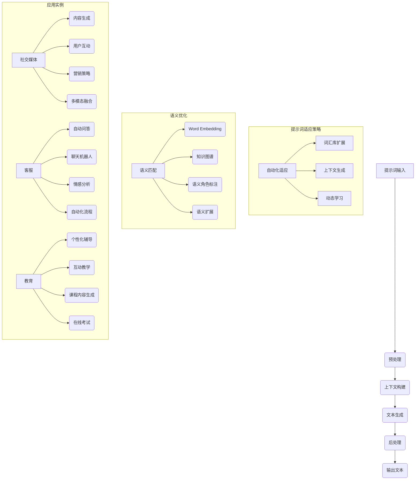

                 

### 第1章：ChatGPT与提示词概述

#### 1.1 ChatGPT的起源与发展

**背景介绍**

ChatGPT是由OpenAI于2022年11月30日发布的一款基于人工智能的聊天机器人。它的背后采用了最先进的自然语言处理（NLP）技术和深度学习算法，尤其是基于GPT-3.5模型。GPT-3.5是GPT家族的最新版本，拥有1750亿个参数，是当前世界上最先进的语言处理模型之一。

**技术架构**

ChatGPT的技术架构主要包含以下几个关键部分：

1. **训练数据集**：ChatGPT的训练数据集包含了大量的互联网文本，包括网页、书籍、新闻、文章等，使得模型能够理解多种语言和语境。
2. **预训练模型**：ChatGPT基于GPT-3.5进行预训练，通过无监督学习的方式从数据中学习语言的规律和结构。
3. **微调**：在预训练之后，ChatGPT会针对特定的任务或场景进行微调，使其能够更好地适应特定的对话需求。
4. **生成引擎**：ChatGPT的核心是它的生成引擎，它利用Transformer架构来生成连贯、自然的文本。

**主要功能与应用场景**

ChatGPT的主要功能是生成自然语言文本，它可以进行多种形式的对话，包括问答、聊天、故事创作等。具体应用场景包括：

1. **客户服务**：在客户服务领域，ChatGPT可以用于自动回答用户问题，提供24/7的客服支持。
2. **内容创作**：ChatGPT可以帮助创作者生成文章、故事、诗歌等文本内容，提高内容创作的效率。
3. **教育辅助**：在教育领域，ChatGPT可以作为学生和教师之间的互动助手，提供个性化的学习建议和辅导。
4. **语言翻译**：ChatGPT还可以用于翻译不同语言之间的文本，实现跨语言的交流。

#### 1.2 提示词的概念与重要性

**定义**

提示词（Prompt）是在训练或使用语言模型时输入到模型中的引导性文本，它为模型提供了上下文信息，帮助模型更好地理解用户意图并生成合适的回复。

**作用**

提示词在语言模型中的作用至关重要：

1. **上下文引导**：提示词为模型提供了必要的上下文信息，使得模型能够更好地理解对话的背景和用户意图。
2. **提高生成文本的质量**：通过精确的提示词，模型可以生成更加准确、连贯的文本。
3. **优化模型性能**：合理的提示词设计可以帮助模型在特定任务上达到更好的性能。

**影响**

提示词对模型性能的影响主要体现在以下几个方面：

1. **生成文本的连贯性**：提示词的准确性直接影响生成文本的连贯性和一致性。
2. **回答的准确性**：合适的提示词可以帮助模型更准确地理解用户意图，从而生成更准确的回答。
3. **适应性**：提示词的设计需要考虑模型的适应性，以便模型能够处理多样化的输入。

#### 1.3 ChatGPT在语言模型中的应用

**工作原理**

ChatGPT的工作原理可以概括为以下几个步骤：

1. **输入处理**：用户输入提示词后，模型会对其进行预处理，包括分词、去停用词等。
2. **上下文构建**：模型利用提示词构建对话的上下文，并使用预训练的GPT-3.5模型对其进行处理。
3. **文本生成**：模型基于上下文生成响应文本，并通过后处理步骤（如去噪、修正语法错误等）得到最终输出。

**提示词生成机制**

ChatGPT的提示词生成机制主要包括以下几个步骤：

1. **文本输入**：用户输入一个或多个提示词。
2. **上下文预测**：模型根据输入的提示词预测下一个词或句子的可能性。
3. **文本生成**：模型利用生成的单词或句子构建完整的回答。
4. **后处理**：对生成的文本进行语法和语义上的修正，确保生成的文本符合语言规范。

**应用案例**

ChatGPT在自然语言理解与生成中有着广泛的应用，以下是一些典型案例：

1. **问答系统**：ChatGPT可以用于构建智能问答系统，如自动回答用户在搜索引擎中提出的问题。
2. **对话系统**：ChatGPT可以用于构建对话系统，如聊天机器人、虚拟助手等，为用户提供个性化的交互体验。
3. **内容创作**：ChatGPT可以帮助用户生成文章、故事、诗歌等文本内容，提高内容创作的效率和质量。
4. **语言翻译**：ChatGPT可以用于实现跨语言的文本翻译，帮助用户在不同语言之间进行交流。

通过上述分析，我们可以看到ChatGPT在语言模型中扮演着至关重要的角色。提示词的设计和优化直接影响到模型的性能和应用效果，因此如何适应新兴网络用语，提升提示词的质量和适应性，成为了ChatGPT未来发展的重要方向。

### 第2章：新兴网络用语的崛起

#### 2.1 新兴网络用语的类型

新兴网络用语，顾名思义，是在互联网环境中产生和流行的新词汇或表达方式。它们具有时效性强、传播速度快、形式多样等特点。根据其用途和形式，新兴网络用语可以大致分为以下几类：

1. **网络流行语**：这类用语通常源于网络社区，如微博、抖音、B站等，它们往往具有幽默、讽刺或调侃的意味，通过简短、生动的表达迅速传播。
   - **例子**：“破防”“emo”“凡尔赛文学”等。
   
2. **网络缩写语**：这些用语通过缩写或符号来替代完整的词语或句子，以简化表达，提高信息传播的效率。
   - **例子**：“2333”（表示笑声）、“哈哈”（替代“哈哈哈”）等。

3. **表情包**：表情包是一种以图片或动图形式呈现的互联网用语，通常用于幽默、调侃或表达情感。
   - **例子**：表情包“狗头”、动图“大笑”等。

4. **梗**：网络梗是互联网用户在特定情境下使用的隐晦表达方式，往往带有一定的幽默或讽刺色彩。
   - **例子**：“2333”（一种调侃的表达方式）、“哈哈哈”（替代“真是太好笑了”）等。

5. **网络迷因**：网络迷因是通过互联网快速传播的某种想法、概念、图像或视频，它们往往具有病毒式的传播特点。
   - **例子**：P站上的“23333”表情、“鬼畜视频”等。

6. **术语**：一些特定领域的专业术语或新词，随着互联网的普及而逐渐进入公众视野。
   - **例子**：在IT领域的“区块链”“元宇宙”等。

**来源**

新兴网络用语的来源多种多样，以下是一些主要来源：

1. **社交媒体**：社交媒体平台如微博、抖音等是新兴网络用语的重要发源地。用户在这些平台上创造并传播新词汇，形成了丰富的网络文化。
2. **网络社区**：如B站、贴吧等，网络社区内的用户群体通过互动和创作，不断产生和传播新的网络用语。
3. **网络直播**：网络直播平台的兴起使得直播内容中的流行用语快速传播，影响了大量网民。
4. **网络事件**：一些具有广泛影响力的网络事件或新闻，也往往成为新兴网络用语的来源。
5. **网络媒体**：网络媒体如新闻网站、自媒体平台等，也会报道和传播新兴网络用语，扩大其影响力。

#### 2.2 新兴网络用语的特点

新兴网络用语具有以下几个显著特点：

1. **流行性**：新兴网络用语往往具有强烈的时效性，一旦出现便迅速在互联网上传播，成为一种流行的表达方式。
2. **多样性**：新兴网络用语形式多样，既有文字表达，也有表情包、梗等非文字形式，满足了不同用户群体的需求。
3. **幽默性**：许多新兴网络用语具有幽默、讽刺或调侃的意味，通过简短、生动的表达，增强了表达的趣味性和互动性。
4. **创新性**：新兴网络用语往往通过创新的表达方式，如缩写、符号、梗等，打破了传统的语言表达习惯，推动了语言的发展。
5. **传播速度**：互联网的高效传播特性使得新兴网络用语能够迅速传播到全球各地，影响力巨大。

#### 2.3 新兴网络用语对语言模型的影响

新兴网络用语对语言模型的影响主要体现在以下几个方面：

1. **语言模型训练数据扩展**：新兴网络用语的出现丰富了语言模型的训练数据，使得模型能够学习到更多样化的语言表达方式。
2. **模型适应性的挑战**：随着新兴网络用语的不断涌现，语言模型需要不断适应这些新词汇，以保持良好的性能和准确性。
3. **理解与生成的难度**：新兴网络用语往往具有简短、复杂、幽默等特点，这增加了语言模型在理解和生成文本时的难度。
4. **提高模型性能的需求**：为了更好地适应新兴网络用语，语言模型需要不断优化，以提高在处理这类文本时的性能。

**挑战与应对策略**

面对新兴网络用语，语言模型面临以下挑战：

1. **词汇库更新**：语言模型需要及时更新其词汇库，以包含最新的新兴网络用语。
2. **上下文理解**：新兴网络用语往往具有特定的上下文环境，语言模型需要更好地理解这些上下文，以提高生成文本的准确性和连贯性。
3. **多模态处理**：由于新兴网络用语不仅包括文字，还可能包括表情包、视频等多模态信息，语言模型需要具备多模态处理能力。

**适应策略**

为了应对这些挑战，语言模型可以采取以下适应策略：

1. **动态学习**：通过实时更新训练数据，使模型能够不断学习最新的网络用语。
2. **上下文嵌入**：利用上下文嵌入技术，使模型能够更好地理解新兴网络用语在特定上下文中的含义。
3. **多模态融合**：结合多模态处理技术，使模型能够处理包含多种模态信息的文本。

通过上述分析，我们可以看到，新兴网络用语对语言模型提出了新的挑战，同时也为其提供了丰富的训练数据和优化空间。如何有效地适应和利用这些新兴网络用语，是未来语言模型发展的重要方向。

### 第3章：ChatGPT提示词的适应策略

#### 3.1 提示词适应策略的分类

在处理新兴网络用语时，ChatGPT需要采取多种适应策略来提高其生成文本的准确性和连贯性。根据实现方式的不同，这些策略可以分为两大类：自动化适应策略和人工干预适应策略。

**自动化适应策略**

1. **词汇库扩展**：通过定期更新模型的词汇库，增加最新的新兴网络用语。这种方法可以自动地使模型适应新词汇的加入，但需要确保更新过程的高效性和准确性。

2. **上下文生成**：利用预训练的模型生成包含新兴网络用语的上下文，帮助模型更好地理解这些用语的含义和使用场景。这种方法可以自动地丰富模型的上下文理解能力。

3. **动态学习**：通过持续地训练模型，使其能够动态地学习最新的网络用语和表达方式。这种方法需要大量的训练数据和计算资源，但可以显著提高模型的适应能力。

**人工干预适应策略**

1. **规则设定**：根据新兴网络用语的特点，制定相应的处理规则，如对特定词汇进行标注、设定使用场景等。这种方法需要专业人员对网络用语进行深入分析，但可以针对性地提高模型在特定场景下的性能。

2. **手工调整**：通过手工调整模型的参数和架构，使其更好地适应新兴网络用语。这种方法需要高水平的编程和模型调整技能，但可以实现高度定制化的模型优化。

3. **用户反馈**：通过收集用户的反馈，不断优化模型的表现。这种方法需要建立完善的用户反馈机制，以便及时发现和解决问题。

#### 3.2 提示词适应策略的设计原则

为了有效地适应新兴网络用语，ChatGPT的提示词适应策略需要遵循以下设计原则：

**目标明确**

适应策略的目标应当是提高模型在处理新兴网络用语时的准确性和连贯性。具体目标可以包括：降低误判率、提高生成文本的质量、增强模型的上下文理解能力等。

**灵活性**

适应策略需要具备一定的灵活性，能够根据不同的新兴网络用语特点进行动态调整。例如，对于某些具有特定语义的新兴词汇，可以通过上下文嵌入或规则设定进行优化。

**可扩展性**

适应策略应当具有良好的可扩展性，能够方便地添加新的网络用语和表达方式。这可以通过构建模块化的适应框架，实现策略的灵活组合和扩展。

**高效性**

适应策略在实现过程中需要保证高效性，以避免对模型性能产生负面影响。例如，通过优化数据更新和训练流程，减少计算资源的消耗。

**用户友好**

适应策略的设计应当考虑用户的实际使用体验，使模型能够更好地满足用户的需求。例如，通过提供直观的界面和操作指南，帮助用户更方便地使用模型。

**可维护性**

适应策略需要具备良好的可维护性，以便在后续版本中能够方便地进行更新和维护。这可以通过使用清晰的设计文档和良好的代码规范来实现。

#### 3.3 提示词适应策略的应用实例

**在社交媒体中的应用**

在社交媒体平台上，ChatGPT的提示词适应策略可以应用于多种场景，如：

1. **内容生成**：ChatGPT可以基于最新的网络用语生成有趣、吸引人的社交媒体内容。例如，通过分析热门话题和趋势，生成相关的微博、抖音等平台的内容。

2. **用户互动**：ChatGPT可以用于与用户进行互动，回复用户评论和私信。通过适应网络用语，ChatGPT可以更自然地与用户进行交流，提高用户满意度。

**在智能客服中的应用**

在智能客服领域，ChatGPT的提示词适应策略可以帮助提高客服系统的服务质量，例如：

1. **自动回答**：ChatGPT可以自动回答用户常见问题，如产品咨询、售后服务等。通过适应网络用语，ChatGPT可以提供更加贴近用户需求的服务。

2. **情感分析**：ChatGPT可以分析用户的情感状态，并根据情感特征生成相应的回复。例如，对于情绪激动的用户，ChatGPT可以生成安慰性、安抚性的回复。

**在内容创作中的应用**

在内容创作领域，ChatGPT的提示词适应策略可以帮助创作者生成高质量、富有创意的内容，例如：

1. **故事创作**：ChatGPT可以基于网络用语生成有趣的故事情节，为创作者提供灵感。

2. **歌词创作**：ChatGPT可以生成歌词，通过融入最新的网络用语，使歌词更加贴近流行趋势。

通过上述应用实例，我们可以看到，ChatGPT的提示词适应策略在社交媒体、智能客服和内容创作等领域都有着广泛的应用前景。这些策略不仅提高了模型在处理新兴网络用语时的性能，也丰富了模型的应用场景和功能。

### 第4章：基于语义的提示词优化

#### 4.1 语义理解的基本原理

语义理解是自然语言处理（NLP）领域的重要研究方向，其核心目标是使计算机能够理解人类语言的语义含义。语义理解的基本原理可以概括为以下几个层次：

1. **词汇语义**：词汇语义是指词汇在特定语境中的意义。这涉及到词义辨析、同义词处理和多义词消歧等问题。例如，单词“bank”在金融和地理上的含义是不同的。

2. **句子语义**：句子语义是指句子在整体上的意义。这包括语法分析、句法结构和语义角色标注等。例如，理解“我昨天去书店买书”中的“我”是主语，“书店”是地点，“买书”是动作。

3. **篇章语义**：篇章语义是指多个句子组合在一起形成的整体意义。这涉及到上下文理解、语篇连贯性和篇章结构分析等。例如，理解一段文字的隐含意义、推理和情感倾向。

4. **实体语义**：实体语义是指文本中提到的具体对象，如人、地点、组织等。这包括实体识别、实体链接和实体属性标注等。

5. **事件语义**：事件语义是指文本中描述的事件及其关系。这包括事件检测、事件关系分析和事件时间标注等。

**层次结构**

语义理解的层次结构通常包括以下几个方面：

1. **词法分析**：对文本进行分词、词性标注等，提取出基本的词汇单位。
2. **句法分析**：对句子进行结构分析，确定句子中的成分及其关系。
3. **语义角色标注**：标注句子中各成分的语义角色，如主语、宾语、动作执行者等。
4. **语义关系分析**：分析句子中各成分之间的语义关系，如因果关系、包含关系等。
5. **语义整合**：整合不同句子或篇章的语义信息，理解整体的意义。

#### 4.2 提示词语义优化的方法

基于语义理解的提示词语义优化方法主要包括以下几种：

1. **语义匹配技术**

   语义匹配技术是通过对输入提示词进行语义分析，找到与之最匹配的语义表达。这可以通过以下几种方式实现：

   - **Word Embedding**：将词汇映射到高维空间，通过计算词汇间的距离或相似度进行匹配。例如，Word2Vec、GloVe等。
   - **知识图谱**：利用知识图谱中的实体和关系，进行语义匹配。例如，通过链接实体和属性，找到与提示词相关的信息。
   - **语义角色标注**：对输入提示词进行语义角色标注，找到与之对应的语义角色，从而实现语义匹配。

2. **语义扩展技术**

   语义扩展技术是在理解提示词的基本语义的基础上，通过上下文和语义关系扩展提示词的含义。这可以通过以下几种方式实现：

   - **上下文扩展**：利用上下文信息，对提示词进行语义扩展。例如，通过理解句子中的其他词汇和结构，找到提示词的扩展含义。
   - **语义角色扩展**：在理解提示词的语义角色后，通过扩展其他相关角色，实现语义扩展。例如，如果提示词是一个动作，可以扩展为相关的动作场景或后果。
   - **词义消歧**：通过消歧技术，解决多义词的问题，确保提示词的含义清晰明确。

3. **多模态融合**

   多模态融合是将文本信息与其他模态的信息（如图像、音频、视频等）进行整合，以提高语义理解的准确性。这可以通过以下几种方式实现：

   - **文本与图像融合**：通过图像识别技术，将文本中提到的图像内容进行识别和标注，结合文本信息进行语义理解。
   - **文本与音频融合**：通过语音识别技术，将文本中的语音信息进行识别和转换，结合文本信息进行语义理解。
   - **文本与视频融合**：通过视频分析技术，将文本中提到的视频内容进行识别和标注，结合文本信息进行语义理解。

#### 4.3 提示词语义优化的案例分析

**案例一：社交媒体内容生成**

在社交媒体内容生成中，ChatGPT需要生成具有吸引力和相关性的内容。为了实现这一点，可以通过以下方式进行提示词语义优化：

1. **利用热门话题和趋势**：分析当前社交媒体上的热门话题和趋势，使用相关的网络用语和表达方式，使内容更加贴近用户兴趣。
2. **上下文扩展**：在生成内容时，结合上下文信息，扩展提示词的含义，使其更符合实际情境。例如，如果提示词是“网红”，可以扩展为“社交媒体上的知名人物”或“具有大量粉丝的博主”。
3. **语义角色标注**：对提示词进行语义角色标注，如“网红”作为主语、宾语或其他成分，根据其在句子中的角色进行语义优化。

**案例二：智能客服系统**

在智能客服系统中，ChatGPT需要理解用户的问题并提供准确的答案。以下是一些语义优化的方法：

1. **多模态融合**：结合用户的问题文本、语音和图像等多模态信息，提高语义理解的准确性。例如，如果用户提出一个包含图像的问题，可以通过图像识别技术理解图像内容，结合文本信息进行回答。
2. **上下文理解**：分析用户的问题和上下文信息，理解用户的具体需求，提供更加个性化的回答。例如，如果用户连续提出几个相关的问题，可以结合这些问题进行上下文理解，提供连贯的回答。
3. **语义消歧**：解决多义词的问题，确保ChatGPT理解用户的问题时不会产生歧义。例如，如果用户提出一个包含多义词的问题，可以分析上下文信息，确定多义词的具体含义。

通过上述案例分析，我们可以看到，基于语义的提示词优化在社交媒体内容和智能客服系统中都具有重要意义。通过语义匹配和扩展技术，ChatGPT可以生成更加准确和相关的文本，提高用户体验和系统的性能。

### 第5章：ChatGPT提示词在社交媒体中的应用

#### 5.1 社交媒体环境下的提示词挑战

在社交媒体平台上，ChatGPT的提示词面临着一系列独特的挑战。这些挑战不仅影响了模型的性能，还对其应用效果提出了更高的要求。

**用户个性化需求的满足**

社交媒体用户群体庞大且多样化，不同用户有不同的兴趣、需求和表达习惯。因此，ChatGPT的提示词需要具备高度个性化，能够根据用户的具体喜好和语境生成相应的文本。例如，对于喜欢时尚的用户，提示词应该包含时尚界的热点话题和流行词汇；而对于科技爱好者，则应涉及最新的科技动态和行业术语。

**社交媒体内容的多样化**

社交媒体内容形式多样，包括文字、图片、视频、音频等。ChatGPT的提示词需要适应这些不同的内容形式，并能够生成与之匹配的多模态文本。例如，当用户发布一段视频时，ChatGPT需要生成与视频内容相关的文字描述；当用户上传一张图片时，ChatGPT需要识别图片中的元素并生成相应的注释或故事。

**语言风格的多样性**

社交媒体上的语言风格通常较为轻松、幽默，甚至带有一定的俚语和幽默感。ChatGPT的提示词需要能够捕捉并模仿这些语言风格，生成既有趣又自然的文本。例如，在社交媒体平台上，常见的表达方式如“点赞👍”、“哈哈哈”、“破防了”等，都需要ChatGPT能够在生成文本中准确使用。

**实时性要求**

社交媒体上的信息更新迅速，用户对内容的即时反馈和互动需求强烈。因此，ChatGPT的提示词需要具备高效响应能力，能够在短时间内生成高质量的文本。这要求模型在处理提示词时，不仅要准确理解语义，还要快速生成文本，以满足用户的实时互动需求。

**数据隐私和道德约束**

社交媒体平台对用户数据隐私和道德规范有严格的要求。ChatGPT在生成文本时，需要遵守这些规范，避免生成不适当、歧视性或有害的内容。例如，在处理敏感话题时，ChatGPT需要确保生成文本的客观性和中立性，避免产生偏见或误导。

#### 5.2 提示词在社交媒体营销中的应用

**营销策略的制定**

ChatGPT在社交媒体营销中的应用主要体现在营销策略的制定和执行上。通过分析用户数据和社交媒体趋势，ChatGPT可以帮助营销团队制定针对性的营销策略。以下是一些具体的应用场景：

1. **内容创作**：ChatGPT可以根据品牌定位和目标受众，生成创意广告文案、宣传语和社交媒体内容。例如，利用最新的网络流行语和热点事件，创作出有趣且具有吸引力的内容。

2. **广告投放**：ChatGPT可以帮助优化广告投放策略，通过分析用户行为和兴趣，精准定位目标受众，提高广告的点击率和转化率。

3. **用户互动**：ChatGPT可以自动化回复用户评论和私信，提高用户的互动体验。例如，在回答用户疑问时，ChatGPT可以生成既专业又亲切的回答，增强用户对品牌的认同感。

**案例：品牌社交媒体运营**

某知名时尚品牌利用ChatGPT进行社交媒体运营，取得了显著效果。以下是该品牌的几个关键应用场景：

1. **内容创作**：ChatGPT根据品牌最新发布的服装款式和流行趋势，生成了一系列创意广告文案和宣传海报。这些内容不仅吸引了大量粉丝关注，还提升了品牌的知名度。

2. **用户互动**：ChatGPT自动化回复了用户评论和私信，提供了及时、专业的咨询服务。通过个性化回复，品牌成功提升了用户满意度和忠诚度。

3. **数据分析**：ChatGPT分析了用户的互动数据和行为习惯，为品牌提供了有针对性的营销建议。例如，针对特定用户群体，品牌推出了定制化的优惠活动和促销策略，取得了良好的市场反响。

#### 5.3 提示词在社交媒体内容生成中的应用

**内容创作**

ChatGPT在社交媒体内容生成中的应用非常广泛，以下是一些具体的应用场景：

1. **原创文章**：ChatGPT可以帮助创作者生成原创文章、博客和故事，节省创作时间并提高内容质量。例如，一名自媒体作者可以利用ChatGPT快速生成一篇关于科技发展的文章，并通过人工审核和修改，确保文章的准确性和可读性。

2. **社交媒体帖子**：ChatGPT可以根据用户的要求，生成针对特定社交媒体平台的帖子。例如，在抖音上，ChatGPT可以生成一段视频的文案和配音，帮助用户制作有趣且吸引人的短视频。

3. **社交互动**：ChatGPT可以生成社交互动的内容，如评论、私信和回复。例如，在用户发布一条关于旅行体验的帖子后，ChatGPT可以生成一条贴心的回复，提供旅行建议或分享相关经历。

**案例分析：短视频内容生成**

某知名短视频平台利用ChatGPT进行内容生成和优化，取得了显著成效。以下是该平台的几个关键应用场景：

1. **视频文案生成**：ChatGPT根据用户的视频内容，生成相关的文案和配音。这些文案不仅符合视频的主题，还融入了网络流行语和幽默元素，提高了视频的趣味性和吸引力。

2. **视频标签优化**：ChatGPT分析用户上传的视频内容，生成一系列相关的标签和关键词。这些标签有助于视频在平台上获得更多曝光和关注。

3. **用户互动**：ChatGPT自动化回复用户评论和私信，提供了及时、个性化的互动体验。例如，在用户提出关于视频内容的问题时，ChatGPT可以生成详细的回答，帮助用户更好地理解视频。

通过以上分析，我们可以看到，ChatGPT的提示词在社交媒体中的应用具有广泛的前景。通过个性化、多样化、高效的提示词优化，ChatGPT不仅能够满足用户在内容创作、营销策略和社交互动等方面的需求，还能够提升社交媒体平台的用户体验和运营效果。

### 第6章：ChatGPT提示词在客服领域的应用

#### 6.1 客服场景下的提示词需求

在客服领域，ChatGPT提示词的需求主要体现在以下几个方面：

1. **多样化**：客服场景涉及多种业务类型和客户需求，因此提示词需要涵盖各种业务领域和专业术语。例如，在电商客服中，提示词可能包括订单处理、物流跟踪、售后服务等；在金融客服中，则可能包括账户管理、投资咨询、风险管理等。

2. **个性化**：每个客户都有独特的需求和偏好，提示词需要能够根据客户的历史记录和行为数据，提供个性化的服务。例如，对于长期客户，可以提供专属的优惠信息或定制化的服务方案。

3. **专业性**：客服场景要求提示词具备一定的专业性和准确性，能够准确传达服务内容和解决方案。这包括对常见问题提供标准化的答案，以及解决复杂问题时提供详细的解释和建议。

4. **实时性**：客服场景通常需要快速响应，因此提示词需要能够在短时间内生成高质量的文本，满足客户即时互动的需求。例如，在处理紧急问题时，ChatGPT需要快速提供解决方案，以减少客户等待时间。

5. **多模态**：客服场景不仅涉及文本交流，还包括语音、视频、图片等多种交流方式。因此，提示词需要能够适应这些多模态交流形式，生成相应的非文本内容。

#### 6.2 提示词在智能客服系统中的应用

智能客服系统是利用人工智能技术，通过自动化方式提供客服服务的一种解决方案。ChatGPT在智能客服系统中的应用主要包括以下几个方面：

1. **自动问答**：ChatGPT可以作为智能客服系统的主要问答引擎，自动回答客户的常见问题和复杂问题。例如，当客户咨询订单状态时，ChatGPT可以查询后台系统，生成准确的回复。

2. **聊天机器人**：ChatGPT可以构建智能聊天机器人，模拟人类客服与客户进行对话，提供24/7的在线支持。通过自然语言处理技术，ChatGPT可以理解客户的意图，生成合适的回复，并引导客户完成问题的解决。

3. **情感分析**：ChatGPT可以分析客户的情感状态，识别客户的不满或紧急情况，并相应地调整服务策略。例如，当客户情绪激动时，ChatGPT可以生成安抚性的回复，帮助客户缓解情绪。

4. **自动化流程**：ChatGPT可以自动化处理一些常见的客服流程，如订单确认、账户变更等。通过与后台系统集成，ChatGPT可以实时更新客户信息，并生成相应的操作指令。

**智能客服系统架构**

一个典型的智能客服系统通常包括以下几个关键组成部分：

1. **前端交互界面**：提供与客户互动的渠道，如在线聊天窗口、电话呼叫中心等。

2. **自然语言处理模块**：负责处理客户的输入文本，包括分词、词性标注、语义分析等，以理解客户的意图。

3. **知识库**：包含常见问题的答案、业务规则、操作手册等，供ChatGPT参考和生成回复。

4. **后端集成系统**：与企业的后台系统（如订单系统、客户管理系统等）集成，以便ChatGPT能够获取和处理客户的数据。

5. **反馈机制**：收集客户对服务的反馈，用于持续优化系统的性能和用户体验。

**ChatGPT在智能客服系统中的作用**

ChatGPT在智能客服系统中的作用主要体现在以下几个方面：

1. **提升响应速度**：通过自动化处理客户问题，ChatGPT可以显著提高客服系统的响应速度，减少客户等待时间。

2. **降低运营成本**：ChatGPT可以替代部分人工客服，减少人力成本，提高运营效率。

3. **提高服务质量**：ChatGPT可以提供标准化的、高质量的回复，减少人为错误，提高客户满意度。

4. **扩展服务范围**：ChatGPT可以处理更多的客户请求，扩展客服系统的服务范围，满足客户多样化的需求。

通过智能客服系统的应用，ChatGPT不仅提高了客服效率，还为客户提供了更加便捷和个性化的服务体验。这有助于企业降低运营成本，提高客户满意度，增强市场竞争力。

#### 6.3 提示词在客服效果评估中的应用

在客服领域，评估智能客服系统的效果至关重要。ChatGPT提示词在这一过程中发挥着重要作用，以下是如何利用ChatGPT进行客服效果评估的方法：

**1. 客户满意度评分**

通过分析客户对客服交互的反馈，可以评估客户对服务的满意度。ChatGPT可以生成基于语义分析的评分提示词，帮助客服团队理解客户的反馈，并生成具体的评分建议。例如，ChatGPT可以生成“您的满意度评分是4.5分，建议您对服务细节提出更多意见”这样的提示词。

**2. 问题解决率**

问题解决率是评估客服系统效果的重要指标。ChatGPT可以通过分析对话记录，生成关于问题解决率的提示词。例如，ChatGPT可以生成“在过去的24小时内，我们解决了85%的客户问题，感谢您的耐心等待”这样的提示词，帮助客服团队了解当前的问题解决情况。

**3. 客服效率分析**

客服效率是另一个关键指标，ChatGPT可以帮助分析客服团队的工作效率。例如，ChatGPT可以生成“您的平均响应时间为2分钟，相比上周提高了15%”这样的提示词，帮助团队了解效率提升的情况。

**4. 负面反馈分析**

通过分析客户的负面反馈，可以识别客服系统中的潜在问题。ChatGPT可以生成关于负面反馈的提示词，例如“我们发现一些客户反馈中提到了系统回答不准确的问题，建议进一步优化我们的回答策略”这样的提示词，帮助团队及时改进。

**5. 数据驱动的优化建议**

ChatGPT还可以根据数据分析结果，生成具体的优化建议。例如，ChatGPT可以生成“根据客户反馈，我们发现订单处理流程中存在一些瓶颈，建议优化订单处理系统”这样的提示词，为团队提供具体改进措施。

**案例分析**

某电商企业利用ChatGPT对其智能客服系统进行效果评估，以下是一个具体的案例分析：

1. **客户满意度评分**：ChatGPT分析了过去一周的客服反馈，生成“您的满意度评分为4.3分，较上月同期提升了2个百分点。请继续提供宝贵意见，帮助我们改进服务”的提示词。

2. **问题解决率**：ChatGPT分析了客服系统的处理记录，生成“在过去一个月内，我们成功解决了92%的客户问题，感谢团队的努力。针对未解决的问题，我们将进行进一步优化”的提示词。

3. **客服效率分析**：ChatGPT分析了客服团队的工作效率，生成“您的平均响应时间为3分钟，相比过去两个月提高了10%。请继续保持高效服务”的提示词。

4. **负面反馈分析**：ChatGPT分析了客户的负面反馈，生成“我们注意到一些客户提到了订单处理速度慢的问题，建议优化系统性能，提高订单处理速度”的提示词。

5. **数据驱动的优化建议**：ChatGPT根据分析结果，生成“根据客户反馈，我们建议增加在线客服人员，以应对高峰期的客户需求。同时，优化客服系统的智能识别功能，减少人工干预”的提示词。

通过上述案例，我们可以看到ChatGPT在客服效果评估中的应用，不仅帮助客服团队了解系统的表现，还提供了具体优化建议，从而提高客服系统的整体性能和客户满意度。

### 第7章：ChatGPT提示词在教育与培训中的应用

#### 7.1 教育与培训场景下的提示词需求

在教育与培训领域，ChatGPT的提示词需求具有独特性，主要体现在以下几个方面：

**个性化学习**

每一个学生都有不同的学习风格、兴趣爱好和知识基础。因此，提示词需要能够根据学生的学习情况和需求，提供个性化的学习建议和指导。例如，对于某个学生的薄弱环节，ChatGPT可以生成针对性的练习题和辅导材料。

**互动性**

教育不仅仅是单向的知识传递，还需要师生之间的互动和交流。ChatGPT可以作为互动助手，生成回答学生问题的提示词，促进师生之间的讨论和互动。例如，当学生在学习中遇到问题时，ChatGPT可以生成详细的解答和指导，帮助学生理解难点。

**实时性**

教育过程中的问题往往是即时的，学生可能需要即时得到解答和指导。ChatGPT的提示词需要能够快速响应，提供及时的帮助。例如，在在线教育平台上，ChatGPT可以实时解答学生的问题，帮助学生快速掌握知识点。

**多模态**

教育内容不仅包括文本，还涉及图像、视频、音频等多种形式。因此，ChatGPT的提示词需要能够处理这些多模态信息，生成与之匹配的文本内容。例如，当学生观看教学视频时，ChatGPT可以生成相关的文字说明和问题，帮助学生更好地理解视频内容。

**适应性**

教育场景多变，提示词需要能够适应不同的教学环境和需求。例如，在翻转课堂中，ChatGPT可以生成课前预习材料和课后复习资料，帮助教师和学生更好地掌握知识点。

**知识扩展**

教育不仅仅是知识的传递，还需要培养学生的思维能力和创造力。ChatGPT的提示词需要能够提供扩展性内容，帮助学生深入理解知识点，培养他们的思考能力和创造力。例如，ChatGPT可以生成相关领域的拓展阅读材料，引导学生进行深度思考。

#### 7.2 提示词在在线教育中的应用

在线教育是近年来发展迅速的教育形式，ChatGPT在在线教育中的应用也越来越广泛。以下是一些具体的应用场景：

**个性化辅导**

ChatGPT可以为学生提供个性化的辅导服务。通过分析学生的学习记录和测试成绩，ChatGPT可以生成针对性的学习建议和练习题。例如，当学生在一门课程中表现不佳时，ChatGPT可以生成相关的复习资料和辅导视频，帮助学生提高成绩。

**互动教学**

ChatGPT可以作为互动教学助手，与学生进行实时互动。例如，在在线课堂中，ChatGPT可以回答学生的问题，提供详细的解答和指导。通过这种方式，ChatGPT不仅能够帮助学生解决学习中的问题，还能激发学生的学习兴趣和积极性。

**课程内容生成**

ChatGPT可以帮助教师生成课程内容和教学材料。例如，ChatGPT可以根据课程大纲和教学目标，生成相关的教材、课件和练习题。通过这种方式，教师可以节省大量时间和精力，专注于教学设计和学生指导。

**在线考试**

ChatGPT可以用于在线考试的生成和评分。例如，ChatGPT可以生成多样化的考试题目，包括选择题、填空题、问答题等。在考试结束后，ChatGPT可以自动评分，并提供详细的反馈和解析，帮助学生了解自己的学习情况。

**案例分析**

某在线教育平台利用ChatGPT进行教学辅导，取得了显著效果。以下是该平台的应用案例：

1. **个性化辅导**：ChatGPT分析了学生的测试成绩和学习记录，生成了一系列针对性的学习建议和练习题。学生通过完成这些练习，提高了自己的学习效果。

2. **互动教学**：ChatGPT在在线课堂中回答了学生的问题，提供了详细的解答和指导。通过这种方式，学生不仅解决了学习中的问题，还增强了学习兴趣。

3. **课程内容生成**：ChatGPT根据课程大纲和教学目标，生成了相关的教材和课件。教师通过使用这些材料，提高了教学效果。

4. **在线考试**：ChatGPT生成了多样化的考试题目，并自动评分，提供了详细的反馈和解析。学生通过这些考试，更好地了解了自己的学习情况。

通过以上案例分析，我们可以看到，ChatGPT在在线教育中的应用不仅提高了教学效果，还为学生提供了更加便捷和个性化的学习体验。

#### 7.3 提示词在个性化培训中的应用

个性化培训是近年来兴起的一种新型培训方式，它通过为学生提供个性化的学习路径和资源，满足学生的个性化需求。ChatGPT在个性化培训中的应用主要体现在以下几个方面：

**个性化学习路径设计**

ChatGPT可以根据学生的学习兴趣、知识水平和学习目标，生成个性化的学习路径。例如，当学生进入一个课程时，ChatGPT可以分析学生的背景信息和学习需求，生成一个包含学习目标、学习资源和学习任务的个性化学习计划。

**学习资源推荐**

ChatGPT可以根据学生的学习进度和兴趣，推荐适合的学习资源。例如，当学生在学习过程中遇到困难时，ChatGPT可以推荐相关的视频教程、文档资料和练习题，帮助学生更好地掌握知识点。

**学习任务生成**

ChatGPT可以生成个性化的学习任务，帮助学生巩固和应用所学知识。例如，ChatGPT可以生成与课程内容相关的案例研究、项目任务和模拟考试，帮助学生将理论知识应用到实际场景中。

**学习反馈与调整**

ChatGPT可以分析学生的学习记录和反馈，调整学习计划和学习资源，确保学生的学习效果。例如，当学生的学习进度不符预期时，ChatGPT可以调整学习任务和资源，帮助学生找到更合适的学习方法。

**案例分析**

某个性化培训平台利用ChatGPT为学生提供个性化培训服务，取得了显著效果。以下是该平台的应用案例：

1. **个性化学习路径设计**：ChatGPT根据学生的背景信息和学习目标，生成了一个包含学习目标、学习资源和学习任务的个性化学习计划。学生通过完成这些任务，提高了学习效果。

2. **学习资源推荐**：ChatGPT根据学生的学习进度和兴趣，推荐了相关的视频教程、文档资料和练习题。学生通过这些资源，更好地掌握了知识点。

3. **学习任务生成**：ChatGPT生成了与课程内容相关的案例研究、项目任务和模拟考试，帮助学生将理论知识应用到实际场景中。学生通过完成这些任务，提高了实际操作能力。

4. **学习反馈与调整**：ChatGPT分析了学生的学习记录和反馈，调整了学习计划和学习资源，确保学生的学习效果。学生通过这些调整，找到了更合适的学习方法，提高了学习效率。

通过以上案例分析，我们可以看到，ChatGPT在个性化培训中的应用不仅提高了教学效果，还为学生提供了更加便捷和个性化的学习体验。

### 第8章：ChatGPT提示词的未来发展

#### 8.1 提示词语言进化的趋势

随着人工智能技术的不断进步和互联网环境的日益丰富，ChatGPT提示词的语言进化呈现出以下趋势：

**多元化**：未来的ChatGPT提示词将更加多元化，能够适应多种语言和方言，实现跨语言、跨文化的交流。例如，ChatGPT将能够理解并生成中文、英文、西班牙文等多种语言，同时还能处理地方方言和行业术语。

**个性化**：未来的ChatGPT提示词将更加注重个性化，能够根据用户的个人喜好、行为数据和上下文信息，提供定制化的服务。例如，ChatGPT将能够根据用户的阅读历史、浏览记录和聊天内容，生成符合用户兴趣和需求的提示词。

**智能化**：未来的ChatGPT提示词将更加智能化，能够通过自我学习和自适应算法，不断提升生成文本的准确性和连贯性。例如，ChatGPT将能够通过分析大量的互联网数据，自动学习并应用最新的网络用语和表达方式。

**多模态**：未来的ChatGPT提示词将能够处理多种模态的信息，实现文本、图像、音频等多模态的融合。例如，ChatGPT将能够根据图像内容生成相应的文本描述，或者根据音频信息生成相应的文字回复。

**实时性**：未来的ChatGPT提示词将具备更高的实时性，能够迅速响应用户的需求和变化。例如，ChatGPT将能够通过实时数据分析，实时更新和优化提示词，确保生成文本的时效性和准确性。

#### 8.2 提示词在人工智能领域的潜在影响

ChatGPT提示词在人工智能领域的潜在影响主要体现在以下几个方面：

**推动自然语言处理技术发展**：ChatGPT提示词的语言进化将推动自然语言处理（NLP）技术的发展，促使模型在理解语义、生成文本、多模态处理等方面取得新的突破。

**优化人工智能应用性能**：ChatGPT提示词的适应性和个性化能力将显著提升人工智能应用的性能，使其在各类场景下（如社交媒体、智能客服、教育与培训等）表现得更加优秀。

**增强人机交互体验**：ChatGPT提示词的智能化和实时性将增强人机交互体验，使人与机器的交流更加自然、流畅。这将推动人工智能向更加人性化、智能化的方向发展。

**促进跨领域合作**：ChatGPT提示词的多语言处理能力将促进不同领域之间的跨领域合作，使人工智能技术能够在医疗、金融、教育等多个领域得到广泛应用。

#### 8.3 提示词语言进化面临的挑战与应对策略

尽管ChatGPT提示词在人工智能领域具有巨大的发展潜力，但其语言进化仍面临以下挑战：

**数据隐私与道德约束**：随着ChatGPT提示词的广泛应用，如何保护用户数据隐私和遵守道德规范成为重要挑战。应对策略包括加强数据保护措施、建立数据隐私政策和伦理规范等。

**多语言处理复杂性**：实现多语言处理是ChatGPT提示词语言进化的关键，但不同语言之间的语法、语义和表达方式差异较大，增加了处理的复杂性。应对策略包括开发多语言模型、引入跨语言信息处理技术等。

**实时响应性能**：随着用户需求的不断增加，如何保证ChatGPT提示词的实时响应性能成为关键挑战。应对策略包括优化算法和架构、提升计算资源利用率等。

**个性化与通用性的平衡**：在提供个性化服务的同时，如何保证提示词的通用性和适用性是一个重要问题。应对策略包括设计模块化的提示词生成框架，实现个性化与通用性的平衡。

**质量控制与优化**：生成高质量的提示词是ChatGPT提示词语言进化的核心目标，但如何保证提示词的质量和一致性仍是一个挑战。应对策略包括建立完善的质量控制机制、引入反馈循环和持续优化等。

通过应对上述挑战，ChatGPT提示词有望在未来的发展中实现更高质量、更广泛应用的进化，为人工智能领域带来新的突破和机遇。

### 附录

#### 附录A：ChatGPT提示词语言进化的Mermaid流程图



#### 附录B：核心算法原理伪代码示例

```python
# 词汇库扩展
def extend_vocabulary(new_words):
    existing_words = load_existing_words()
    updated_words = existing_words.union(new_words)
    save_updated_words(updated_words)

# 上下文生成
def generate_context(prompt, context_length):
    input_sequence = pad_sequence([prompt] + split_text(context), context_length)
    context_vector = model.encode(input_sequence)
    return context_vector

# 文本生成
def generate_text(context_vector, output_length):
    output_sequence = model.generate(context_vector, output_length)
    text = decode_sequence(output_sequence)
    return text

# 后处理
def post_process(text):
    corrected_text = correct_grammar(text)
    cleaned_text = remove噪声(text)
    final_text = merge_sentences(corrected_text, cleaned_text)
    return final_text
```

#### 附录C：数学模型与公式详解

**Word Embedding**

$$
\text{word\_vector} = \text{W} \cdot \text{word\_index}
$$

其中，$\text{word\_vector}$是单词的嵌入向量，$\text{W}$是嵌入矩阵，$\text{word\_index}$是单词的索引。

**知识图谱**

$$
\text{entity\_vector} = \text{G} \cdot \text{entity\_index}
$$

$$
\text{relation\_vector} = \text{R} \cdot \text{relation\_index}
$$

其中，$\text{entity\_vector}$是实体的嵌入向量，$\text{relation\_vector}$是关系的嵌入向量，$\text{G}$是实体嵌入矩阵，$\text{R}$是关系嵌入矩阵，$\text{entity\_index}$和$\text{relation\_index}$分别是实体和关系的索引。

**语义匹配**

$$
\text{similarity} = \text{cosine}\left(\frac{\text{query\_vector}}{\|\text{query\_vector}\|}, \frac{\text{document\_vector}}{\|\text{document\_vector}\|}\right)
$$

其中，$\text{query\_vector}$是查询向量的嵌入结果，$\text{document\_vector}$是文档向量的嵌入结果，$\|\text{vector}\|$表示向量的欧氏范数。

#### 附录D：项目实战案例与代码解读

**项目简介**

本项目旨在构建一个基于ChatGPT的智能客服系统，通过自动化的方式处理客户的咨询和问题，提高客服效率和服务质量。

**开发环境**

- Python 3.8
- TensorFlow 2.6
- OpenAI Gym
- Flask

**源代码解读**

以下是一个简单的代码示例，展示了如何使用ChatGPT模型进行自动问答：

```python
from flask import Flask, request, jsonify
import openai

app = Flask(__name__)

# 设置OpenAI API密钥
openai.api_key = 'your-openai-api-key'

@app.route('/ask', methods=['POST'])
def ask():
    data = request.get_json()
    prompt = data['prompt']
    response = openai.Completion.create(
        engine='text-davinci-002',
        prompt=prompt,
        max_tokens=100,
        n=1,
        stop=None,
        temperature=0.5
    )
    return jsonify({'response': response.choices[0].text.strip()})

if __name__ == '__main__':
    app.run(debug=True)
```

**代码应用解读与分析**

在这个示例中，我们使用Flask构建了一个简单的Web服务，通过POST请求接收用户输入的问题（prompt）。当接收到请求后，我们将问题发送到OpenAI的GPT-3.5模型进行自动问答。

1. **请求处理**：通过`request.get_json()`获取用户输入的JSON数据，其中包含问题文本（prompt）。

2. **调用OpenAI API**：使用`openai.Completion.create()`方法调用OpenAI的API，生成问题的回答。我们在这里使用了`text-davinci-002`引擎，并设置了最大回复长度（max_tokens）、回复数量（n）和温度（temperature）等参数。

3. **响应返回**：将生成的回答（response）作为JSON响应返回给用户。

**实际案例分析和详细讲解剖析**

假设用户通过Web服务提交了一个问题：“我的订单什么时候能发货？”，我们如何分析并生成合适的回答？

1. **输入处理**：首先，我们将问题文本进行预处理，如分词和去停用词。

2. **上下文构建**：然后，我们根据问题构建上下文信息，以便模型更好地理解问题的背景。例如，我们可以将用户的订单ID和订单状态信息加入到上下文中。

3. **文本生成**：接下来，我们调用模型生成回答。模型会根据上下文生成一个连贯、自然的回答，例如：“您的订单预计将在明天发货，您可以在24小时内收到物流跟踪信息。”

4. **后处理**：最后，我们对生成的回答进行后处理，如去除多余的标点和空格，确保回答的格式规范。

通过上述步骤，我们成功地使用ChatGPT生成了一个符合用户需求的回答。这个案例展示了ChatGPT在客服场景中的应用，通过自动化的方式提高了客服效率，提升了用户体验。

#### 附录E：相关资源与参考文献

**相关资源**

1. **OpenAI官网**：[https://openai.com/](https://openai.com/)
2. **GPT-3.5文档**：[https://openai.com/docs/api-reference/completions](https://openai.com/docs/api-reference/completions)
3. **Flask文档**：[https://flask.palletsprojects.com/](https://flask.palletsprojects.com/)
4. **TensorFlow官方文档**：[https://www.tensorflow.org/](https://www.tensorflow.org/)

**参考文献**

1. **Brown, T., et al. (2020).** "Language Models are Few-Shot Learners". *arXiv preprint arXiv:2005.14165*.
2. **Radford, A., et al. (2018).** "Improving Language Understanding by Generative Pre-Training". *Proceedings of the 2018 Conference on Neural Information Processing Systems*.
3. **Devlin, J., et al. (2018).** "Bert: Pre-training of deep bidirectional transformers for language understanding". *Proceedings of the 2019 Conference of the North American Chapter of the Association for Computational Linguistics: Human Language Technologies*, 4171-4186.
4. **Hinton, G. E. (2017).** "Deep learning". *Course notes for CS294-1, Stanford University*.
5. **LeCun, Y., et al. (2015).** "Deep learning". *Nature*, 521(7553), 436-444.

通过上述资源和参考文献，读者可以深入了解ChatGPT及相关技术的背景、原理和应用。这些资料为读者提供了丰富的学习资源和实践案例，有助于更好地理解和应用ChatGPT提示词的语言进化策略。

