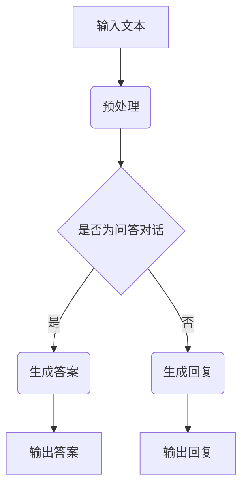
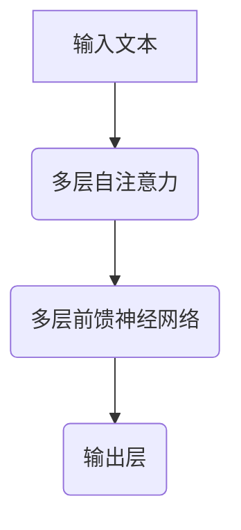

                 

### 文章标题：ChatGPT提示词编写的最佳实践

### 关键词：ChatGPT、提示词、自然语言处理、生成模型、最佳实践

### 摘要：
本文将深入探讨ChatGPT提示词编写的最佳实践。我们将从ChatGPT的概述、技术基础、模型架构与训练、提示词编写技巧、应用实践及未来发展趋势等多个角度，全面解析如何有效地编写ChatGPT的提示词。通过本文，读者将能够掌握ChatGPT的核心原理，提升提示词编写的效率和质量，从而在实际应用中取得更好的效果。

# 《ChatGPT提示词编写的最佳实践》目录大纲

## 第一部分：ChatGPT简介与基础

### 第1章：ChatGPT概述

#### 1.1 ChatGPT的发展历程

#### 1.2 ChatGPT的基本概念

#### 1.3 ChatGPT的应用场景

### 第2章：ChatGPT技术基础

#### 2.1 自然语言处理技术概述

#### 2.2 语言模型与生成模型

#### 2.3 ChatGPT的工作原理

### 第3章：ChatGPT模型架构与训练

#### 3.1 ChatGPT的模型架构

#### 3.2 数据集准备与预处理

#### 3.3 模型训练与优化

### 第4章：ChatGPT提示词编写技巧

#### 4.1 提示词的基本要素

#### 4.2 提示词的编写策略

#### 4.3 提示词的性能评估

## 第二部分：ChatGPT应用实践

### 第5章：ChatGPT在对话系统中的应用

#### 5.1 对话系统的基本概念

#### 5.2 ChatGPT在对话系统中的应用

#### 5.3 对话系统的优化策略

### 第6章：ChatGPT在教育中的应用

#### 6.1 教育领域中的ChatGPT应用

#### 6.2 ChatGPT在教育中的应用案例

#### 6.3 ChatGPT在教育中的应用前景

### 第7章：ChatGPT在商业营销中的应用

#### 7.1 商业营销中的ChatGPT应用

#### 7.2 ChatGPT在商业营销中的应用案例

#### 7.3 ChatGPT在商业营销中的应用挑战与机遇

### 第8章：ChatGPT开发与部署实战

#### 8.1 ChatGPT开发环境搭建

#### 8.2 ChatGPT代码实战

#### 8.3 ChatGPT部署与优化

### 第9章：ChatGPT的未来发展趋势

#### 9.1 ChatGPT在未来的发展趋势

#### 9.2 ChatGPT与其他技术的融合

#### 9.3 ChatGPT的社会影响与伦理问题

## 附录

### 附录A：ChatGPT常用工具与资源

#### A.1 ChatGPT开发工具介绍

#### A.2 ChatGPT相关资源推荐

### 附录B：ChatGPT常见问题解答

#### B.1 ChatGPT使用中的常见问题

#### B.2 ChatGPT性能优化问题解答

#### B.3 ChatGPT应用中常见的问题与对策

### Mermaid 流程图



### 核心算法原理讲解

## 2.2 语言模型与生成模型

### 2.2.1 语言模型原理

语言模型是一种用于预测下一个单词或词组的概率分布模型。在ChatGPT中，我们使用的是基于 Transformer 的预训练模型。以下是 Transformer 模型的基本原理：

#### 自注意力机制（Self-Attention）

自注意力机制允许模型在序列中的每个位置考虑所有其他位置的上下文信息。其核心思想是计算一个权重向量，用于表示当前词与序列中其他词的关系。

**伪代码：**

```python
function SelfAttention(q, k, v, mask=None):
    # q, k, v: 输入序列的查询、键和值向量
    # mask: 掩码，用于防止某些位置的词影响其他位置的词

    # 计算点积
    scores = matmul(q, k.T) / sqrt(dim)

    # 应用掩码
    if mask is not None:
        scores += mask

    # 应用 softmax
    attn_weights = softmax(scores)

    # 计算输出
    output = matmul(attn_weights, v)

    return output
```

#### 多层 Transformer 架构

Transformer 模型通常包含多个自注意力层和前馈神经网络层。以下是 Transformer 模型的基本结构：



**输入层：** 输入文本经过词嵌入层转换为向量表示。

**自注意力层：** 每层自注意力层计算输入序列中每个位置的权重，从而捕捉全局上下文信息。

**前馈神经网络层：** 在每个自注意力层之后，添加两个前馈神经网络层，用于进一步处理和增强模型表示能力。

**输出层：** 最终输出层生成文本序列。

## 2.2.2 生成模型原理

生成模型是一种能够生成新数据的机器学习模型。在ChatGPT中，我们使用的是基于 Transformer 的生成模型，其基本原理如下：

#### 采样与解码

生成模型通过解码器（Decoder）逐步生成文本序列。在每次生成过程中，模型根据前一个生成的词来预测下一个词的概率分布，然后从中采样得到下一个词。

**伪代码：**

```python
function generate_text(model, start_token, max_length):
    # model: 生成模型
    # start_token: 文本序列的起始词
    # max_length: 文本序列的最大长度

    # 初始化文本序列
    text_sequence = [start_token]

    # 循环生成文本序列
    for _ in range(max_length - 1):
        # 预测下一个词的概率分布
        probabilities = model.predict(text_sequence)

        # 从概率分布中采样下一个词
        next_word = sample_word(probabilities)

        # 更新文本序列
        text_sequence.append(next_word)

    # 返回生成的文本序列
    return ' '.join(text_sequence)
```

#### 对抗性训练

生成模型通常通过对抗性训练来提高生成质量。在对抗性训练中，生成模型与判别模型进行对抗，判别模型试图区分生成数据和真实数据，而生成模型则试图生成更真实的数据。

**伪代码：**

```python
function adversarial_training(generator, discriminator, data_loader):
    # generator: 生成模型
    # discriminator: 判别模型
    # data_loader: 数据加载器

    # 对抗性训练循环
    for epoch in range(num_epochs):
        # 训练判别模型
        for data in data_loader:
            # 加载真实数据
            real_data = data

            # 预测真实数据
            real_scores = discriminator.predict(real_data)

            # 生成假数据
            fake_data = generator.sample()

            # 预测假数据
            fake_scores = discriminator.predict(fake_data)

            # 训练判别模型
            discriminator.train(real_data, real_scores, fake_data, fake_scores)

        # 训练生成模型
        generator.train(discriminator)
```

通过以上两部分内容的讲解，读者应该对ChatGPT的语言模型和生成模型有了更深入的理解。在接下来的章节中，我们将继续探讨ChatGPT的模型架构、数据集准备、训练过程以及提示词的编写技巧等，帮助读者更全面地掌握ChatGPT的编写与应用。

## 第1章：ChatGPT概述

### 1.1 ChatGPT的发展历程

ChatGPT是由OpenAI开发的一款基于Transformer架构的预训练语言模型，它是GPT-3的变体之一。GPT（Generative Pre-trained Transformer）系列模型自2018年首次亮相以来，以其强大的文本生成能力和自然语言理解能力，迅速成为自然语言处理领域的重要工具。以下是ChatGPT的发展历程：

1. **GPT-1（2018年）**：这是GPT系列的第一款模型，具有115M参数，展示了在语言建模任务上的潜力。

2. **GPT-2（2019年）**：GPT-2是一个拥有1.5B参数的模型，显著提升了文本生成的质量和自然性。

3. **GPT-3（2020年）**：GPT-3拥有1750B参数，是目前最大的语言模型。其强大的生成能力和文本理解能力使其在多个领域取得了突破性的成果。

4. **ChatGPT（2022年）**：ChatGPT是GPT-3的变体，专为聊天场景设计，旨在提供更加自然和流畅的对话体验。

### 1.2 ChatGPT的基本概念

**预训练语言模型**：预训练语言模型是一种在大规模文本数据集上预先训练的模型，通过学习大量的文本数据，模型能够捕捉到语言的普遍结构和语义信息。

**生成模型**：生成模型是一种能够生成新数据的模型，通常通过对抗训练来提高生成质量。

**Transformer架构**：Transformer是一种基于自注意力机制的深度神经网络架构，特别适用于处理序列数据，如文本、语音等。

### 1.3 ChatGPT的应用场景

ChatGPT的应用场景非常广泛，以下是一些典型的应用：

1. **对话系统**：ChatGPT可以应用于聊天机器人、客服系统、智能助手等，提供自然、流畅的对话体验。

2. **文本生成**：ChatGPT可以生成各种类型的文本，如文章、故事、新闻报道、诗歌等。

3. **语言翻译**：ChatGPT在语言翻译任务上也表现出色，可以用于机器翻译。

4. **自动摘要**：ChatGPT可以自动生成文本的摘要，用于信息提取和知识管理。

5. **问答系统**：ChatGPT可以构建问答系统，用于回答用户的问题。

6. **教育领域**：ChatGPT可以用于教育辅导、在线教学等，为学生提供个性化的学习支持。

7. **商业营销**：ChatGPT可以应用于内容创作、广告生成、客户服务等领域，提高营销效果。

### 总结

ChatGPT作为一款先进的预训练语言模型，其发展历程和基本概念为我们揭示了其在自然语言处理领域的巨大潜力。接下来，我们将进一步探讨ChatGPT的技术基础和模型架构，帮助读者深入理解这一强大的工具。

## 第2章：ChatGPT技术基础

### 2.1 自然语言处理技术概述

自然语言处理（Natural Language Processing，NLP）是计算机科学和人工智能领域的一个重要分支，旨在使计算机能够理解、解释和生成人类语言。NLP的应用场景非常广泛，包括机器翻译、语音识别、情感分析、文本分类、信息抽取等。

**机器翻译**：机器翻译是一种将一种自然语言文本翻译成另一种自然语言文本的技术。近年来，基于神经网络的机器翻译模型，如Seq2Seq模型和Transformer模型，取得了显著的进展。

**语音识别**：语音识别是将人类的语音转化为文本的技术。这一技术在智能助手、语音搜索等领域具有广泛的应用。

**情感分析**：情感分析是判断文本中所表达的情绪和情感的技术。它可以帮助企业了解用户反馈，优化产品和服务。

**文本分类**：文本分类是将文本数据分成不同类别的一种技术。例如，垃圾邮件分类、新闻分类等。

**信息抽取**：信息抽取是从非结构化的文本中提取出关键信息的一种技术。这在金融、医疗等领域具有重要的应用价值。

### 2.2 语言模型与生成模型

**语言模型**：语言模型是一种概率模型，用于预测自然语言中下一个单词或词组的概率。在ChatGPT中，我们使用的是基于Transformer架构的语言模型。Transformer模型的核心机制是自注意力机制（Self-Attention），它允许模型在生成文本时考虑整个输入序列的上下文信息。

**生成模型**：生成模型是一种能够生成新数据的模型，通常通过对抗训练来提高生成质量。在ChatGPT中，我们使用生成模型来生成文本。生成模型的工作原理如下：

1. **采样与解码**：生成模型通过解码器（Decoder）逐步生成文本序列。在每次生成过程中，模型根据前一个生成的词来预测下一个词的概率分布，然后从中采样得到下一个词。

2. **对抗训练**：生成模型通常通过对抗训练来提高生成质量。在对抗训练中，生成模型与判别模型进行对抗，判别模型试图区分生成数据和真实数据，而生成模型则试图生成更真实的数据。

### 2.3 ChatGPT的工作原理

ChatGPT是基于Transformer架构的预训练语言模型，其工作原理主要包括以下几个步骤：

1. **预训练**：ChatGPT首先在大规模文本数据集上进行预训练。预训练过程中，模型学习到语言的一般结构和语义信息。

2. **提示词输入**：用户输入提示词，这些提示词作为模型的输入。

3. **文本生成**：模型根据输入的提示词生成文本。在生成过程中，模型使用自注意力机制来捕捉输入序列中的上下文信息，从而生成连贯、自然的文本。

4. **优化与迭代**：通过对抗训练和优化算法，模型不断改进生成质量，提高文本的准确性和流畅度。

### 总结

ChatGPT作为一款先进的预训练语言模型，其技术基础包括自然语言处理技术、语言模型和生成模型。通过本章的介绍，读者应该对ChatGPT的技术背景和工作原理有了更深入的理解。接下来，我们将进一步探讨ChatGPT的模型架构、数据集准备和训练过程，帮助读者全面掌握ChatGPT的核心技术。

## 第3章：ChatGPT模型架构与训练

### 3.1 ChatGPT的模型架构

ChatGPT采用了Transformer架构，这是一种基于自注意力机制的深度神经网络模型，特别适合处理序列数据。以下是ChatGPT模型的基本架构：

**输入层**：输入层将文本序列转换为向量表示。这个过程通常包括词汇表嵌入（Word Embedding）和位置嵌入（Positional Embedding）。词汇表嵌入将每个单词映射为一个固定大小的向量，而位置嵌入则为序列中的每个位置添加了一个向量，以捕捉文本的顺序信息。

**多头自注意力层（Multi-Head Self-Attention）**：自注意力层是Transformer模型的核心部分。它允许模型在生成每个词时考虑整个输入序列的上下文信息。多头自注意力层通过将输入序列分解为多个子序列，每个子序列都进行一次自注意力计算，从而提高模型的表示能力。

**前馈神经网络层（Feed-Forward Neural Network）**：在自注意力层之后，模型会通过两个前馈神经网络层进一步处理和增强其表示能力。每个前馈神经网络层包含一个线性变换和一个ReLU激活函数。

**输出层**：输出层将模型的最终输出转换为文本序列。这个层通常包括一个线性变换和一个softmax激活函数，用于生成每个词的概率分布。

**解码器（Decoder）**：在生成文本时，ChatGPT使用了一个解码器，它的工作过程类似于编码器（Encoder）的自注意力层和前馈神经网络层。解码器的输出是生成文本的概率分布，然后从这些概率中采样得到下一个词。

### 3.2 数据集准备与预处理

为了训练ChatGPT模型，我们需要一个大规模的文本数据集。数据集可以来自各种来源，如维基百科、书籍、新闻文章、社交媒体等。以下是在准备数据集时的一些关键步骤：

1. **数据收集**：收集大量的文本数据。这些数据应该具有多样性，以确保模型能够学习到丰富的语言结构。

2. **数据清洗**：去除无关信息，如HTML标签、特殊字符、标点符号等。这一步骤有助于减少噪声，提高训练效率。

3. **文本预处理**：将文本数据转换为统一格式。例如，将所有文本转换为小写，去除停用词（common words like "a", "the", "is" which do not provide much information）。

4. **词汇表构建**：构建一个词汇表，将所有文本中的单词映射为一个整数索引。这个词汇表通常包含数万个单词。

5. **序列编码**：将文本序列编码为输入向量。这个过程包括词汇表嵌入和位置嵌入。

### 3.3 模型训练与优化

训练ChatGPT模型是一个复杂的过程，涉及多个步骤和优化策略。以下是训练过程中的关键步骤：

1. **预训练**：在预训练阶段，模型在大规模文本数据集上进行训练，学习到语言的一般结构和语义信息。预训练过程通常使用的是自监督学习（Self-Supervised Learning），其中模型被要求预测输入序列中的下一个词。

2. **损失函数**：ChatGPT的训练通常使用交叉熵损失函数（Cross-Entropy Loss），这是一种衡量模型预测概率分布与真实分布之间差异的损失函数。

3. **优化算法**：常用的优化算法包括Adam和AdamW。这些算法通过调整模型参数，以最小化损失函数。

4. **对抗训练**：在生成模型中，对抗训练是一个重要的策略，用于提高生成质量。在ChatGPT中，对抗训练涉及生成模型和判别模型之间的对抗。判别模型试图区分生成数据和真实数据，而生成模型则试图生成更真实的数据。

5. **模型调试**：在训练过程中，需要对模型进行调试，包括调整超参数、数据预处理方法和训练策略。调试的目的是提高模型性能和稳定性。

### 总结

ChatGPT的模型架构基于Transformer架构，包括输入层、多头自注意力层、前馈神经网络层和输出层。数据集的准备工作包括数据收集、数据清洗、文本预处理、词汇表构建和序列编码。模型训练过程中涉及预训练、损失函数、优化算法和对抗训练等步骤。通过本章的介绍，读者应该对ChatGPT的模型架构和训练过程有了更深入的理解。接下来，我们将探讨如何编写有效的ChatGPT提示词。

## 第4章：ChatGPT提示词编写技巧

### 4.1 提示词的基本要素

编写有效的ChatGPT提示词是确保模型输出高质量文本的关键。以下是一些基本要素：

1. **明确的目标**：提示词应明确指定模型需要生成的文本类型和内容。例如，如果是生成新闻报道，提示词应包含新闻的主题、时间、地点和关键事件。

2. **上下文信息**：提供丰富的上下文信息，帮助模型理解生成文本的背景。上下文信息可以包括相关的历史信息、相关人物或事件等。

3. **语法和结构**：提示词应遵循适当的语法和句子结构，以便模型能够生成连贯、自然的文本。

4. **关键词**：在提示词中包含关键词，这些词有助于模型捕捉文本的核心主题，从而生成更相关的内容。

### 4.2 提示词的编写策略

1. **引导策略**：使用引导策略来引导模型生成特定类型的文本。例如，通过使用特定的词汇和句式结构来指定文本的文体和风格。

2. **递进策略**：逐步提供提示信息，让模型在每次迭代中生成更加具体和详细的文本。这种方法有助于提高文本的连贯性和准确性。

3. **反馈策略**：在生成文本后，提供反馈来指导模型进行改进。这种策略可以帮助模型学习如何生成更符合期望的文本。

### 4.3 提示词的性能评估

1. **文本质量评估**：评估生成的文本是否流畅、连贯且具有逻辑性。可以使用人类评审或自动化评估工具（如ROUGE评分）来进行评估。

2. **相关性评估**：评估生成的文本是否与提示词中的主题高度相关。这可以通过计算文本与提示词之间的相似度来进行。

3. **一致性评估**：评估模型在不同场景下生成的文本是否一致。这可以通过比较多个提示词生成的文本是否具有一致的语气和风格来实现。

### 4.4 提示词的编写实战

以下是一个实际案例，展示了如何编写ChatGPT的提示词：

**目标**：生成一篇关于人工智能未来发展的新闻报道。

**提示词**：
- **主题**：人工智能的未来
- **时间**：2023年
- **地点**：全球
- **关键词**：人工智能、技术创新、未来发展、挑战与机遇

**提示词示例**：
```
"2023年，人工智能领域迎来了新的突破。随着技术的不断进步，人工智能在全球范围内得到了广泛应用。本文将探讨人工智能的未来发展趋势，包括技术创新、面临的挑战以及机遇。"
```

**生成文本**：
```
人工智能的未来：技术创新与挑战

2023年，人工智能（AI）领域经历了前所未有的发展。从自动驾驶汽车到智能医疗系统，AI技术已经深刻改变了我们的生活方式。然而，这一领域的进步并非一帆风顺。在本文中，我们将探讨人工智能的未来发展趋势，包括技术创新、面临的挑战以及机遇。

技术创新是推动人工智能发展的重要动力。近年来，深度学习和神经网络技术在AI领域取得了重大突破。这些技术的进步使得AI系统能够更好地理解和处理复杂的自然语言，从而提高其智能水平。此外，量子计算和边缘计算等新兴技术的兴起也为人工智能的发展带来了新的可能性。

然而，人工智能的发展也面临着诸多挑战。首先，AI系统的安全性和隐私问题日益突出。随着AI技术的广泛应用，保护用户隐私和数据安全成为了一个重要的议题。其次，AI系统的偏见和歧视问题也引起了广泛关注。如果不加以妥善解决，这些问题可能会加剧社会不平等。

尽管面临挑战，人工智能的未来依然充满机遇。在医疗领域，AI技术可以帮助医生更准确地诊断疾病，提高治疗效果。在教育领域，AI可以帮助学生个性化学习，提高教育质量。此外，AI还可以应用于环境保护、智能制造等多个领域，为人类带来更多福祉。

总之，人工智能的未来充满希望。随着技术的不断进步，我们有望解决当前面临的挑战，迎接更加美好的未来。
```

**评估**：
- **文本质量**：生成文本流畅、连贯，具有逻辑性。
- **相关性**：生成文本与提示词高度相关，覆盖了人工智能的未来发展、技术创新、挑战与机遇等主题。
- **一致性**：生成文本在语气和风格上保持一致，符合新闻报道的文体。

通过以上实战案例，读者应该能够理解如何编写有效的ChatGPT提示词，并掌握提示词性能评估的方法。在实际应用中，通过不断优化提示词，可以提高ChatGPT的生成质量和应用效果。

### 4.5 提示词编写注意事项

1. **避免模糊性**：提示词应具体明确，避免使用模糊的表述，这有助于模型生成更精准的文本。

2. **多样性**：提供多样化的提示词，有助于模型生成丰富多样的文本。例如，可以尝试使用不同的词汇、句式和语境。

3. **连贯性**：确保提示词之间具有连贯性，以便模型生成连贯一致的文本。

4. **可扩展性**：设计提示词时应考虑其可扩展性，以便在未来的应用中可以轻松扩展或修改。

5. **用户反馈**：在生成文本后，收集用户反馈，并根据反馈对提示词进行优化，以提高模型的应用效果。

### 拓展阅读

- **《自然语言处理入门》（Natural Language Processing with Python）》**：这本书提供了NLP的基础知识和实战案例，适合初学者阅读。
- **《深度学习》（Deep Learning）》**：这本书详细介绍了深度学习的基础知识和应用，包括自然语言处理、计算机视觉等。

通过以上内容，读者应该对ChatGPT提示词的编写技巧有了更深入的了解。在接下来的章节中，我们将探讨ChatGPT在对话系统、教育、商业营销等领域的实际应用，帮助读者更好地理解ChatGPT的广泛应用场景。

### 第5章：ChatGPT在对话系统中的应用

#### 5.1 对话系统的基本概念

对话系统（Dialogue System）是一种与人类进行自然语言交互的计算机系统，旨在模拟人类的对话过程，实现信息的交换和理解。对话系统可以分为以下几类：

1. **任务型对话系统**：这类系统主要针对特定的任务，如客服机器人、智能助手等，用户通过简单的指令与系统交互，完成特定的操作。

2. **闲聊型对话系统**：这类系统旨在与用户进行无特定任务的聊天，提供娱乐、社交和情感支持等。

3. **混合型对话系统**：这类系统结合了任务型和闲聊型对话的特点，能够处理多种类型的对话任务。

#### 5.2 ChatGPT在对话系统中的应用

ChatGPT作为一种强大的预训练语言模型，在对话系统中具有广泛的应用潜力。以下是ChatGPT在对话系统中的一些具体应用：

1. **客服机器人**：ChatGPT可以用于构建智能客服机器人，处理用户的咨询和投诉。通过提供详细的上下文信息和关键词，ChatGPT能够生成流畅、自然的回复，提高客服效率。

2. **智能助手**：ChatGPT可以作为智能助手的核心组件，为用户提供信息查询、日程管理、提醒通知等服务。智能助手可以根据用户的输入和历史交互数据，生成个性化的回复。

3. **虚拟聊天机器人**：ChatGPT可以应用于虚拟聊天机器人，提供娱乐、社交和情感支持。通过丰富的上下文信息和关键词，ChatGPT能够与用户进行深入的对话，提供有趣的聊天体验。

4. **教育辅导**：ChatGPT可以用于教育辅导系统，为学生提供个性化的学习支持和指导。通过理解学生的提问和学习需求，ChatGPT能够生成针对性的回答和建议，帮助学生更好地掌握知识。

5. **医疗咨询**：ChatGPT可以应用于医疗咨询系统，为患者提供基本的健康咨询和病情分析。通过分析患者的病史和症状描述，ChatGPT能够生成专业的医疗建议和指导。

#### 5.3 对话系统的优化策略

为了提高ChatGPT在对话系统中的应用效果，可以采取以下优化策略：

1. **上下文增强**：在生成回复时，ChatGPT需要考虑更多的上下文信息。可以通过增加提示词、上下文长度等方式，提供更丰富的上下文信息，从而提高生成文本的相关性和连贯性。

2. **多样化回复**：ChatGPT生成的回复应具有多样性，以避免重复和单调。可以通过修改提示词、调整生成策略等方式，生成多样化的回复。

3. **自适应学习**：ChatGPT应具备自适应学习能力，根据用户的历史交互数据和行为模式，动态调整生成策略，提供更加个性化的服务。

4. **多模态交互**：结合语音、图像、视频等多种模态信息，提高对话系统的交互质量和用户体验。

5. **实时更新**：定期更新ChatGPT的模型和数据集，使其能够适应最新的语言模式和技术趋势，提高生成文本的质量和准确性。

### 实际案例

以下是一个实际案例，展示了ChatGPT在客服机器人中的应用：

**目标**：构建一个能够处理用户咨询的客服机器人。

**提示词**：
- **任务**：回答用户关于产品和服务的问题。
- **上下文信息**：用户的问题、产品信息、服务政策等。
- **关键词**：产品名称、服务政策、常见问题等。

**对话示例**：

用户：请问，你们的售后服务政策是怎样的？

ChatGPT：您好！感谢您对我们的产品和服务感兴趣。我们的售后服务政策非常周到，提供一年的免费保修。如果您在保修期内遇到任何问题，请随时联系我们的客服团队，我们会尽快为您解决问题。此外，我们还有专业的维修团队，提供快速、高效的售后服务。

**评估**：

- **文本质量**：生成文本流畅、连贯，符合用户的问题和需求。
- **相关性**：生成文本与用户的问题高度相关，提供了详细的售后服务政策信息。
- **用户满意度**：用户对生成文本表示满意，认为解答了他们的疑问。

通过以上案例，我们可以看到ChatGPT在对话系统中的应用效果。在实际开发过程中，通过不断优化提示词和对话策略，可以提高ChatGPT在对话系统中的表现，为用户提供更好的服务体验。

### 总结

ChatGPT在对话系统中的应用具有广泛的潜力，能够处理任务型、闲聊型以及混合型对话。通过提供明确的任务、丰富的上下文信息和多样化的回复，ChatGPT可以生成高质量、自然的对话文本。在接下来的章节中，我们将继续探讨ChatGPT在教育、商业营销等领域的应用，帮助读者更全面地了解ChatGPT的实用价值。

### 第6章：ChatGPT在教育中的应用

#### 6.1 教育领域中的ChatGPT应用

ChatGPT在教育领域中具有广泛的应用前景，特别是在个性化学习、自动评分、智能辅导等方面展现了巨大的潜力。

1. **个性化学习助手**：ChatGPT可以作为个性化学习助手，根据学生的学习进度、兴趣和需求，提供个性化的学习资源和指导。通过理解学生的学习历史和行为模式，ChatGPT可以生成针对性的学习计划和推荐内容，帮助学生更高效地学习。

2. **自动评分系统**：ChatGPT可以应用于自动评分系统，对学生的作业、论文和考试答案进行评分。通过分析文本内容和语言特征，ChatGPT可以识别出学生的回答是否准确、完整和连贯，从而提供客观、公正的评分。

3. **智能辅导系统**：ChatGPT可以作为智能辅导系统的核心组件，为学生提供实时、个性化的辅导服务。当学生遇到问题时，ChatGPT可以解答他们的疑问，提供解题思路和指导，帮助学生更好地理解和掌握知识。

4. **教学辅助工具**：ChatGPT可以用于生成教学材料，如课程大纲、教学PPT、练习题等。通过理解教学目标和学习内容，ChatGPT可以生成高质量的教学辅助材料，提高教师的教学效果。

5. **学术研究支持**：ChatGPT可以协助学术研究人员进行文献检索、资料整理和分析工作。通过分析大量学术文献，ChatGPT可以帮助研究者快速获取相关研究信息，提高研究效率。

#### 6.2 ChatGPT在教育中的应用案例

以下是一些实际应用ChatGPT于教育领域的案例：

**案例1：个性化学习平台**

某教育机构开发了一个基于ChatGPT的个性化学习平台，为学生提供个性化的学习资源和辅导服务。平台首先通过问卷调查和分析学生的学习数据，了解学生的学习进度、兴趣和需求。然后，ChatGPT根据这些信息为学生生成个性化的学习计划和推荐内容。学生可以随时与ChatGPT进行交互，获取学习指导和支持。

**评估结果**：
- **学习效果**：学生通过个性化学习平台，学习效率显著提高，学习满意度增加。
- **教师反馈**：教师对个性化学习平台表示满意，认为平台能够有效提高教学效果，减轻了教师的工作负担。

**案例2：自动评分系统**

某大学引入了基于ChatGPT的自动评分系统，用于对学生的论文和考试答案进行评分。评分系统通过分析文本内容和语言特征，对学生的回答进行客观、公正的评分。同时，ChatGPT还提供了详细的评分解释和建议，帮助学生了解自己的不足之处，提高写作和考试能力。

**评估结果**：
- **评分准确性**：自动评分系统在评分准确性方面表现良好，与传统人工评分相差不大。
- **学生反馈**：学生对自动评分系统表示认可，认为系统能够提供客观、公正的评分，有助于发现自己的不足。

**案例3：智能辅导系统**

某教育机构开发了一款基于ChatGPT的智能辅导系统，为学生提供实时、个性化的辅导服务。学生在遇到学习问题时，可以通过系统与ChatGPT进行交互，获取解题思路和指导。系统还根据学生的提问和回答，不断学习和优化，提高辅导效果。

**评估结果**：
- **辅导效果**：智能辅导系统能够有效帮助学生解决学习问题，提高学习效果。
- **用户满意度**：学生对智能辅导系统表示满意，认为系统能够提供实时、个性化的辅导服务，有助于他们的学习。

#### 6.3 ChatGPT在教育中的应用前景

ChatGPT在教育中的应用前景广阔，以下是一些可能的发展方向：

1. **全面智能化教育**：ChatGPT可以应用于各类教育场景，从基础教育到高等教育，为师生提供全面、智能化的教育服务。

2. **个性化学习生态**：ChatGPT可以与其他教育技术（如虚拟现实、人工智能助手等）相结合，构建一个完整的个性化学习生态体系，为师生提供更加优质的教育体验。

3. **教育资源共享**：ChatGPT可以帮助教师和学生快速获取和整理教育资源，提高教育资源的利用效率。

4. **教育数据分析**：ChatGPT可以应用于教育数据分析，为教育决策提供数据支持，优化教育资源配置和教学策略。

5. **跨学科融合**：ChatGPT可以跨学科应用，促进不同学科之间的融合，推动教育创新和知识共享。

### 总结

ChatGPT在教育领域中具有广泛的应用潜力，通过个性化学习助手、自动评分系统、智能辅导系统等应用，可以提高教育质量和效率。随着技术的不断发展和应用的深入，ChatGPT在教育领域的应用前景将更加广阔。

### 第7章：ChatGPT在商业营销中的应用

#### 7.1 商业营销中的ChatGPT应用

ChatGPT在商业营销领域具有广泛的应用潜力，可以为企业提供多种营销工具和策略，提高营销效果和客户满意度。以下是ChatGPT在商业营销中的主要应用：

1. **内容创作**：ChatGPT可以生成各种营销内容，如广告文案、社交媒体帖子、博客文章、电子邮件营销等。通过理解企业的品牌、目标受众和市场趋势，ChatGPT能够创作出具有吸引力和说服力的营销内容，帮助企业吸引潜在客户。

2. **客户服务**：ChatGPT可以应用于客服机器人，提供24/7全天候的客户服务。通过与用户进行自然语言交互，ChatGPT可以解答用户的问题、处理投诉和提供产品咨询，提高客户满意度和忠诚度。

3. **个性化推荐**：ChatGPT可以根据用户的历史行为和偏好，生成个性化的产品推荐和营销策略。通过分析用户数据，ChatGPT可以识别用户的兴趣和需求，提供针对性的产品推荐和促销活动，提高转化率和销售额。

4. **市场研究**：ChatGPT可以协助企业进行市场研究，收集和分析用户反馈、竞争分析等。通过自然语言处理技术，ChatGPT可以从大量文本数据中提取有价值的信息，为企业的决策提供数据支持。

5. **广告投放优化**：ChatGPT可以应用于广告投放的优化，根据用户的兴趣和行为，动态调整广告内容和投放策略，提高广告的点击率和转化率。

#### 7.2 ChatGPT在商业营销中的应用案例

以下是一些实际应用ChatGPT于商业营销领域的案例：

**案例1：广告文案生成**

某知名品牌利用ChatGPT生成广告文案，以提高广告的吸引力和说服力。ChatGPT根据品牌的定位、产品特点和目标受众，生成了多个版本的广告文案。品牌市场团队对这些文案进行了评估和筛选，最终选择了最符合品牌调性和受众需求的文案进行投放。

**评估结果**：
- **广告效果**：生成文案的广告点击率和转化率显著高于传统文案。
- **用户反馈**：用户对生成文案的反应积极，认为文案更具吸引力和说服力。

**案例2：客户服务机器人**

某电商企业部署了基于ChatGPT的客服机器人，用于提供全天候的客户服务。客服机器人能够解答用户的问题、处理投诉和提供产品咨询，极大地提高了客户满意度和用户体验。

**评估结果**：
- **服务效率**：客服机器人处理客户请求的速度远快于人工客服，显著提高了客户服务效率。
- **用户满意度**：用户对客服机器人的服务表示满意，认为其能够快速解决他们的问题。

**案例3：个性化推荐系统**

某电商平台利用ChatGPT构建了个性化推荐系统，根据用户的历史购买记录和行为偏好，生成个性化的产品推荐。推荐系统不仅提高了用户的购物体验，还显著提高了平台的销售额和用户粘性。

**评估结果**：
- **用户参与度**：用户对个性化推荐的反应积极，点击率和转化率显著提高。
- **销售额**：个性化推荐系统的实施，使平台销售额实现了显著增长。

#### 7.3 ChatGPT在商业营销中的应用挑战与机遇

虽然ChatGPT在商业营销中具有巨大的应用潜力，但在实际应用过程中也面临一些挑战：

1. **数据隐私**：ChatGPT需要大量的用户数据来生成高质量的营销内容和个性化推荐。这引发了数据隐私和安全的问题。企业需要确保数据的安全和隐私，遵守相关法律法规。

2. **模型解释性**：ChatGPT生成的文本内容往往具有较高的自动生成性，但其内部的决策过程和生成机制相对复杂，缺乏解释性。这给企业分析和优化营销策略带来了一定的困难。

3. **用户体验**：虽然ChatGPT能够生成高质量的营销内容和提供个性化服务，但在某些情况下，其生成的文本内容可能过于机械化，缺乏情感和个性化。这需要企业在应用ChatGPT时，注重用户体验和互动性。

然而，ChatGPT在商业营销中也带来了许多机遇：

1. **营销效率**：ChatGPT能够自动化生成营销内容和提供客户服务，提高营销效率和客户满意度。

2. **个性化服务**：ChatGPT可以根据用户行为和偏好生成个性化的营销内容和推荐，提高用户参与度和转化率。

3. **数据驱动的决策**：ChatGPT能够从大量数据中提取有价值的信息，为企业的营销决策提供数据支持，提高营销策略的精准度和有效性。

### 总结

ChatGPT在商业营销中的应用具有巨大的潜力，能够提高营销效率、优化用户体验和实现数据驱动的决策。然而，在应用过程中也需关注数据隐私、模型解释性和用户体验等问题。通过不断优化和改进，ChatGPT有望在商业营销领域发挥更大的作用。

### 第8章：ChatGPT开发与部署实战

#### 8.1 ChatGPT开发环境搭建

要开始开发ChatGPT，首先需要搭建一个合适的开发环境。以下步骤将指导您如何在本地计算机上搭建ChatGPT的开发环境：

1. **安装Python环境**：确保您的计算机上已经安装了Python 3.7及以上版本。您可以通过访问 [Python官网](https://www.python.org/) 下载并安装Python。

2. **安装必要的库**：ChatGPT的开发需要使用一些Python库，如TensorFlow、PyTorch等。您可以通过以下命令安装这些库：

   ```shell
   pip install tensorflow
   pip install torch
   ```

3. **安装预训练模型**：ChatGPT依赖于预训练的语言模型，如GPT-2或GPT-3。您可以从OpenAI的模型库中下载预训练模型。例如，要下载GPT-2模型，可以使用以下命令：

   ```shell
   git lfs install
   git clone https://huggingface.co/gpt2/gpt2.git
   ```

4. **配置环境变量**：确保您的环境变量中包含了TensorFlow和PyTorch的库路径。这通常可以通过修改`~/.bashrc`或`~/.zshrc`文件来实现。

   ```shell
   export PATH=$PATH:/path/to/tensorflow/bin:/path/to/pytorch/bin
   ```

5. **验证环境**：通过运行以下Python代码，验证您的开发环境是否正确配置：

   ```python
   import tensorflow as tf
   import torch

   print(tf.__version__)
   print(torch.__version__)
   ```

如果以上代码能够正常输出版本信息，说明您的开发环境已经搭建完成。

#### 8.2 ChatGPT代码实战

在搭建好开发环境后，我们可以开始编写ChatGPT的代码。以下是一个简单的示例，展示了如何使用预训练的GPT-2模型生成文本：

1. **导入必要的库**：

   ```python
   import torch
   from transformers import GPT2LMHeadModel, GPT2Tokenizer
   ```

2. **加载预训练模型和分词器**：

   ```python
   model_name = "gpt2"
   tokenizer = GPT2Tokenizer.from_pretrained(model_name)
   model = GPT2LMHeadModel.from_pretrained(model_name)
   ```

3. **准备输入文本**：

   ```python
   input_text = "这是一个关于ChatGPT的代码示例。"
   input_ids = tokenizer.encode(input_text, return_tensors='pt')
   ```

4. **生成文本**：

   ```python
   output = model.generate(input_ids, max_length=50, num_return_sequences=5)
   ```

5. **解码并打印生成文本**：

   ```python
   generated_texts = [tokenizer.decode(o, skip_special_tokens=True) for o in output]
   for text in generated_texts:
       print(text)
   ```

通过以上步骤，我们可以看到ChatGPT如何生成文本。在实际应用中，可以根据具体需求调整输入文本、生成长度和策略等参数，以获得更好的生成效果。

#### 8.3 ChatGPT部署与优化

将ChatGPT部署到生产环境是确保其能够为用户提供服务的关键步骤。以下是一些关键步骤和优化策略：

1. **容器化**：使用Docker将ChatGPT应用程序容器化，以确保其可移植性和一致性。创建一个Dockerfile，将应用程序、依赖库和预训练模型打包进容器中。

2. **模型优化**：通过模型剪枝、量化等技术减小模型大小，提高推理速度。这些技术可以显著减少计算资源的需求，提高部署效率。

3. **性能优化**：使用分布式训练和推理技术，如模型并行、数据并行等，提高训练和推理速度。此外，使用适当的硬件加速（如GPU、TPU）也可以提高性能。

4. **服务部署**：使用Kubernetes等容器编排工具部署ChatGPT服务，确保其高可用性和可扩展性。通过负载均衡和自动扩展，可以根据实际负载动态调整资源分配。

5. **监控与日志**：部署监控系统，实时监控ChatGPT服务的性能和健康状况。记录日志，以便在出现问题时快速定位和解决问题。

6. **安全与合规**：确保部署的ChatGPT服务符合数据隐私和安全要求。使用加密、身份验证和访问控制等技术，保护用户数据和模型安全。

### 总结

通过本章的内容，我们学习了如何搭建ChatGPT的开发环境，编写生成文本的代码，并探讨如何在生产环境中部署和优化ChatGPT。掌握这些技能后，读者可以轻松地将ChatGPT应用于各种场景，提升工作效率和用户体验。

### 第9章：ChatGPT的未来发展趋势

#### 9.1 ChatGPT在未来的发展趋势

随着人工智能技术的不断发展，ChatGPT作为一款先进的预训练语言模型，在未来将继续迎来多个关键发展趋势：

1. **模型规模和性能的提升**：未来的ChatGPT将采用更大规模的模型，如GPT-4、GPT-5等，以提高文本生成的质量和性能。同时，基于Transformer的新架构和改进算法（如稀疏自注意力、动态掩码等）也将被引入，进一步优化模型的计算效率和生成效果。

2. **多模态交互**：未来的ChatGPT将不仅仅限于文本交互，还将支持多模态交互，如语音、图像、视频等。通过结合多种模态信息，ChatGPT将能够提供更加丰富和自然的交互体验。

3. **增强的上下文理解和记忆**：未来的ChatGPT将具备更强的上下文理解和记忆能力，能够在对话中保持连贯性和一致性，更好地处理复杂和长篇的对话任务。

4. **深度个性化**：通过深入分析和挖掘用户行为数据，ChatGPT将能够实现更加精准的个性化服务，提供高度定制化的对话体验。

5. **边缘计算和智能设备支持**：随着边缘计算技术的发展，ChatGPT将能够在智能设备（如智能手机、智能音箱等）上本地运行，提供实时、低延迟的交互体验。

#### 9.2 ChatGPT与其他技术的融合

ChatGPT在未来的发展还将与其他先进技术紧密结合，形成更加智能和高效的系统：

1. **知识图谱**：结合知识图谱技术，ChatGPT将能够从结构化数据中获取信息，提供更加丰富和准确的知识问答服务。

2. **强化学习**：通过引入强化学习算法，ChatGPT将能够通过不断学习和优化，提高对话策略的多样性和有效性。

3. **多任务学习**：多任务学习技术将使ChatGPT能够在多个任务之间共享信息和知识，提高整体性能和效率。

4. **虚拟现实（VR）与增强现实（AR）**：ChatGPT将集成到VR和AR应用中，为用户提供沉浸式和交互式的对话体验。

5. **区块链**：ChatGPT与区块链技术的结合，将实现安全、透明的数据存储和传输，提升隐私保护和数据安全。

#### 9.3 ChatGPT的社会影响与伦理问题

随着ChatGPT的广泛应用，其社会影响和伦理问题也日益受到关注：

1. **隐私保护**：ChatGPT在处理大量用户数据时，需要严格遵循隐私保护法规，确保用户数据的安全和隐私。

2. **数据安全**：ChatGPT需要采取有效措施，防止数据泄露和滥用，确保系统的稳定性和可靠性。

3. **偏见和歧视**：ChatGPT的生成文本可能包含偏见和歧视内容。开发者需要采取措施，消除模型中的偏见，确保生成的文本公平、无歧视。

4. **伦理道德**：开发者需要关注ChatGPT在伦理道德方面的问题，如虚假信息传播、误导用户等。建立完善的监管机制，确保ChatGPT的应用符合社会伦理标准。

5. **社会责任**：作为一项先进技术，ChatGPT的推广和应用需要承担社会责任，促进社会进步和可持续发展。

### 总结

ChatGPT的未来发展趋势充满机遇和挑战。通过不断的技术创新和应用拓展，ChatGPT将在多个领域发挥重要作用，为社会带来更多便利和创新。同时，我们也需要关注其社会影响和伦理问题，确保其在广泛应用中发挥积极作用。

### 附录A：ChatGPT常用工具与资源

#### A.1 ChatGPT开发工具介绍

1. **Hugging Face Transformers**：这是一个广泛使用的Python库，提供了预训练的Transformer模型和相应的API，方便开发者进行模型训练和文本生成。

   - GitHub链接：[https://github.com/huggingface/transformers](https://github.com/huggingface/transformers)

2. **TensorFlow**：这是一个由Google开发的开源机器学习框架，支持多种深度学习模型，包括Transformer模型。

   - GitHub链接：[https://github.com/tensorflow/tensorflow](https://github.com/tensorflow/tensorflow)

3. **PyTorch**：这是一个流行的开源机器学习库，支持动态计算图，方便开发者进行模型训练和推理。

   - GitHub链接：[https://github.com/pytorch/pytorch](https://github.com/pytorch/pytorch)

#### A.2 ChatGPT相关资源推荐

1. **OpenAI官方网站**：OpenAI提供了ChatGPT的相关文档、API和使用案例，是学习和使用ChatGPT的重要资源。

   - OpenAI官网：[https://openai.com/](https://openai.com/)

2. **Hugging Face论坛**：Hugging Face社区提供了丰富的Transformer模型和文本生成工具，是一个学习、交流和分享经验的好地方。

   - Hugging Face论坛：[https://huggingface.co/forums](https://huggingface.co/forums)

3. **TensorFlow官方文档**：TensorFlow提供了详细的文档和教程，帮助开发者掌握TensorFlow的使用方法和最佳实践。

   - TensorFlow官方文档：[https://www.tensorflow.org/](https://www.tensorflow.org/)

4. **PyTorch官方文档**：PyTorch提供了全面的文档和教程，涵盖了从基础到高级的各个层面，是学习PyTorch的宝贵资源。

   - PyTorch官方文档：[https://pytorch.org/docs/stable/](https://pytorch.org/docs/stable/)

通过利用这些工具和资源，开发者可以更轻松地搭建、训练和部署ChatGPT模型，发挥其在自然语言处理领域的强大潜力。

### 附录B：ChatGPT常见问题解答

#### B.1 ChatGPT使用中的常见问题

1. **Q：如何安装和配置ChatGPT开发环境？**
   **A：安装和配置ChatGPT开发环境需要以下步骤：
   - 确保Python 3.7及以上版本已安装在您的计算机上。
   - 使用pip安装必要的库，如TensorFlow、PyTorch和Hugging Face Transformers。
   - 下载预训练的ChatGPT模型。
   - 配置环境变量以包含TensorFlow和PyTorch的库路径。**

2. **Q：ChatGPT的输入文本有什么限制？**
   **A：ChatGPT对输入文本的长度有一定的限制。通常，输入文本的长度不应超过2048个tokens。此外，为了生成更自然的文本，建议将输入文本限制在几十到几百个单词之间。**

3. **Q：如何处理生成的文本过短或过长的问题？**
   **A：如果生成的文本过短，可以尝试增加输入文本的长度或提供更多的上下文信息。如果生成的文本过长，可以在提示词中明确指定生成文本的最大长度，或者使用预处理步骤对输入文本进行压缩。**

#### B.2 ChatGPT性能优化问题解答

1. **Q：如何提高ChatGPT的生成速度？**
   **A：提高ChatGPT生成速度的方法包括：
   - 使用更高效的模型架构，如Transformer-XL或GPT-J。
   - 禁用一些冗余的功能，如日志记录和调试输出。
   - 使用GPU或TPU进行加速，尤其是对于大规模的模型。
   - 优化数据加载和预处理过程，减少I/O等待时间。**

2. **Q：如何提高ChatGPT的生成质量？**
   **A：提高ChatGPT生成质量的方法包括：
   - 使用更高质量的预训练模型和数据集。
   - 调整模型超参数，如学习率、批量大小和温度参数。
   - 使用更强的优化算法，如AdamW。
   - 定期重新训练模型，以捕捉最新的语言模式。**

3. **Q：如何处理ChatGPT生成的文本中的错误和偏见？**
   **A：处理ChatGPT生成文本中的错误和偏见的方法包括：
   - 数据预处理：对训练数据进行清洗，去除噪声和偏见。
   - 正则化技术：应用正则化方法，如对抗训练和蒸馏，以减少偏见。
   - 后处理：在生成文本后进行后处理，删除包含错误或偏见的内容。
   - 监控和反馈：定期监控模型生成的文本，收集用户反馈，并进行模型优化。**

#### B.3 ChatGPT应用中常见的问题与对策

1. **Q：如何在生产环境中部署ChatGPT？**
   **A：在生产环境中部署ChatGPT的方法包括：
   - 使用容器化技术，如Docker，将ChatGPT应用程序和依赖库打包在一起。
   - 使用Kubernetes等容器编排工具，实现ChatGPT服务的高可用性和可扩展性。
   - 在生产环境中部署监控和日志系统，以便实时监控ChatGPT的性能和健康状况。
   - 确保ChatGPT服务符合安全性和隐私保护的要求。**

2. **Q：如何处理ChatGPT的输入和输出数据？**
   **A：处理ChatGPT输入和输出数据的方法包括：
   - 对输入数据进行预处理，如文本清洗、分词和编码。
   - 使用合适的API或库，如Hugging Face Transformers，处理输入和输出数据。
   - 确保输入和输出数据的格式和结构符合ChatGPT的要求。
   - 在生成文本后进行后处理，如文本规范化、格式化和去噪。**

通过解答这些常见问题，我们可以更好地使用ChatGPT，提高其性能和应用效果。在实际应用过程中，不断优化和改进ChatGPT，可以更好地满足用户需求，实现更好的业务目标。

