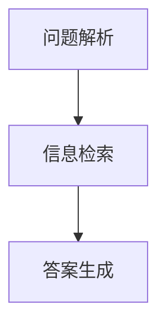

                 

### 文章标题

《ChatGPT提示词编写：从入门到精通》

### 关键词

- ChatGPT
- 提示词编写
- 自然语言处理
- 深度学习
- 人工智能
- 开发实战

### 摘要

本文旨在为读者提供一份全面、系统的ChatGPT提示词编写指南。首先，我们将从ChatGPT的基本概念、发展历程和应用领域入手，为读者搭建起一个初步的认知框架。接着，本文将深入探讨ChatGPT的核心原理，包括自然语言处理基础、深度学习与神经网络以及Transformer与BERT模型。在此基础上，本文将重点介绍ChatGPT提示词的设计原理和编写技巧，并通过实战案例展示如何在实际项目中运用这些技巧。最后，本文将提供一系列项目实战技巧和优化策略，帮助读者从入门到精通ChatGPT提示词编写。通过本文的学习，读者将能够深入了解ChatGPT的工作机制，掌握有效的提示词编写方法，并在实际项目中取得显著成果。

## 《ChatGPT提示词编写：从入门到精通》目录大纲

### 第一部分：ChatGPT基础入门

### 第1章：ChatGPT简介

- **1.1 ChatGPT的概念与特点**
- **1.2 ChatGPT的发展历程**
- **1.3 ChatGPT的应用领域**

### 第2章：搭建ChatGPT开发环境

- **2.1 环境准备**
- **2.2 安装与配置**
- **2.3 初步体验**

### 第二部分：ChatGPT核心原理

### 第3章：自然语言处理基础

- **3.1 词汇与句法分析**
- **3.2 语义理解与情感分析**
- **3.3 问答系统**

### 第4章：深度学习与神经网络

- **4.1 神经网络基础**
- **4.2 循环神经网络（RNN）**
- **4.3 长短时记忆网络（LSTM）**

### 第5章：Transformer与BERT模型

- **5.1 Transformer模型**
- **5.2 BERT模型**
- **5.3 GPT模型**

### 第三部分：ChatGPT提示词编写

### 第6章：提示词设计原理

- **6.1 提示词的作用**
- **6.2 提示词的种类**
- **6.3 提示词的设计方法**

### 第7章：常用提示词编写技巧

- **7.1 对话引导**
- **7.2 质疑与反馈**
- **7.3 知识补充与扩展**

### 第8章：实战案例

- **8.1 案例一：聊天机器人**
- **8.2 案例二：智能客服**
- **8.3 案例三：教育辅导**

### 第四部分：ChatGPT项目实战

### 第9章：项目准备

- **9.1 环境搭建**
- **9.2 数据准备**
- **9.3 模型选择与优化**

### 第10章：项目实施

- **10.1 数据处理与预处理**
- **10.2 模型训练与调优**
- **10.3 模型评估与部署**

### 第11章：项目维护与优化

- **11.1 持续学习与优化**
- **11.2 性能监控与问题排查**
- **11.3 用户反馈与改进**

### 第五部分：附录

### 附录A：常用工具与资源

- **A.1 Python库**
- **A.2 数据集**
- **A.3 学习资源**

### 附录B：常见问题解答

- **B.1 ChatGPT如何处理长文本？**
- **B.2 ChatGPT的模型如何保存与加载？**
- **B.3 ChatGPT如何进行多语言支持？**

### 结束语

本文作者信息：AI天才研究院/AI Genius Institute & 禅与计算机程序设计艺术 /Zen And The Art of Computer Programming

## 第1章 ChatGPT简介

### 1.1 ChatGPT的概念与特点

ChatGPT是由OpenAI开发的一种基于GPT-3模型的聊天机器人。GPT-3（Generative Pre-trained Transformer 3）是OpenAI发布的一种自然语言处理模型，其最大的特点在于其具有强大的文本生成能力。ChatGPT通过GPT-3模型，可以理解用户的提问，并生成相关的回答。

ChatGPT的主要特点包括：

1. **强大的语言理解能力**：ChatGPT可以理解复杂的语言结构，包括语义、语法和上下文关系，这使得它能够生成高质量的自然语言回答。
2. **自适应的对话能力**：ChatGPT可以在对话过程中不断学习和适应，从而提高对话的流畅性和准确性。
3. **广泛的应用领域**：ChatGPT可以应用于多种场景，包括智能客服、聊天机器人、内容创作、教育辅导等。
4. **灵活的接口**：ChatGPT提供了多种接口，包括API和命令行工具，使得开发者可以轻松集成到各种应用中。

### 1.2 ChatGPT的发展历程

ChatGPT是GPT-3模型的一种应用。GPT-3是OpenAI于2020年发布的一种自然语言处理模型，其参数量达到了1750亿，是当时最大的预训练语言模型。GPT-3的成功推动了自然语言处理技术的快速发展，而ChatGPT则是基于GPT-3模型开发的聊天机器人。

ChatGPT的发展历程可以分为以下几个阶段：

1. **早期探索**：OpenAI在2018年发布了GPT模型，随后在2019年发布了GPT-2模型，这些模型展示了强大的文本生成能力。
2. **GPT-3发布**：2020年，OpenAI发布了GPT-3模型，这是当时最大的预训练语言模型。GPT-3的成功使得OpenAI在自然语言处理领域的影响力大增。
3. **ChatGPT开发**：基于GPT-3模型，OpenAI开发了ChatGPT，这是一个具有强大语言理解和生成能力的聊天机器人。

### 1.3 ChatGPT的应用领域

ChatGPT的应用领域非常广泛，以下是一些典型的应用场景：

1. **智能客服**：ChatGPT可以用来构建智能客服系统，它可以自动回答用户的常见问题，提高客服效率。
2. **聊天机器人**：ChatGPT可以用于构建聊天机器人，它可以与用户进行自然语言对话，提供娱乐、信息查询等服务。
3. **内容创作**：ChatGPT可以生成文章、博客、故事等文本内容，为内容创作者提供灵感。
4. **教育辅导**：ChatGPT可以作为一个虚拟辅导老师，为学生提供个性化的学习建议和解答问题。
5. **多语言翻译**：ChatGPT支持多种语言，可以用于实现跨语言对话和文本翻译。

总之，ChatGPT作为一种先进的自然语言处理技术，具有广泛的应用前景，正在不断改变我们的生活和工作的方式。

### 2.1 环境准备

搭建ChatGPT的开发环境是开始使用ChatGPT进行开发的第一步，我们需要准备以下几个关键组件：

#### 操作系统

ChatGPT的开发环境主要支持Linux和macOS操作系统。如果您正在使用Windows，可以考虑安装Windows Subsystem for Linux (WSL)来搭建开发环境。

#### Python环境

ChatGPT的开发依赖于Python语言，因此首先需要安装Python。推荐使用Python 3.7或更高版本。可以通过以下命令安装Python：

```bash
# 通过包管理器安装Python
sudo apt-get update
sudo apt-get install python3.9
```

或者使用`pyenv`工具来安装和管理Python版本：

```bash
# 安装pyenv
curl https://pyenv.run | bash

# 安装指定版本的Python
pyenv install 3.9.1
pyenv global 3.9.1
```

#### pip环境

pip是Python的包管理器，用于安装和管理Python库。确保pip已经安装在您的系统中，可以通过以下命令检查：

```bash
pip --version
```

如果pip未安装，可以通过以下命令安装：

```bash
sudo apt-get install python3-pip
```

#### 安装必要的库

ChatGPT的开发还需要一些其他Python库，如transformers、torch等。可以通过以下命令安装：

```bash
pip install transformers torch
```

这些库为ChatGPT的开发提供了必要的支持。

#### 确保GPU支持

如果您的开发环境配备了GPU，确保安装了CUDA和cuDNN库，这些库用于在GPU上加速深度学习模型的训练。可以通过以下命令安装：

```bash
# 安装CUDA
sudo apt-get install cuda

# 安装cuDNN
# 下载并解压cuDNN库到适当位置，然后设置环境变量
export LD_LIBRARY_PATH=/path/to/cudnn/libs:$LD_LIBRARY_PATH
export CPATH=/path/to/cudnn/include:$CPATH
export LIBRARY_PATH=/path/to/cudnn/libs:$LIBRARY_PATH
```

确保所有组件都已经正确安装并配置好，这样我们就可以进入下一步，开始安装和配置ChatGPT了。

### 2.2 安装与配置

在准备好开发环境后，我们需要安装ChatGPT并对其进行配置，以下是具体的步骤：

#### 安装ChatGPT

首先，我们需要从GitHub克隆ChatGPT的代码库：

```bash
# 克隆ChatGPT代码库
git clone https://github.com/openai/gpt-3.5-turbo
cd gpt-3.5-turbo
```

#### 安装依赖库

接下来，我们需要安装所有必要的依赖库。在代码库的根目录下，运行以下命令：

```bash
pip install -r requirements.txt
```

这个命令会安装所有列在`requirements.txt`文件中的依赖库。

#### 配置环境变量

为了确保所有库和工具可以正确使用，我们需要设置一些环境变量。在Linux或macOS中，您可以通过编辑`~/.bashrc`或`~/.zshrc`文件来设置这些变量。以下是可能需要设置的一些环境变量：

```bash
# 设置CUDA库路径
export CUDA_HOME=/usr/local/cuda
export LD_LIBRARY_PATH=${CUDA_HOME}/lib64:$LD_LIBRARY_PATH

# 设置cuDNN库路径
export CUDNN_HOME=/path/to/cudnn
export LD_LIBRARY_PATH=${CUDNN_HOME}/lib64:$LD_LIBRARY_PATH

# 设置Python环境变量
export PYTHONPATH=/path/to/python:$PYTHONPATH
```

请将上述路径替换为您系统中的实际路径。设置完环境变量后，运行`source ~/.bashrc`（或相应的文件名，取决于您的shell）使设置生效。

#### 运行示例

为了验证安装是否成功，我们可以运行一个简单的示例。在代码库的根目录下，运行以下命令：

```bash
# 运行ChatGPT示例
python examples/chatgpt.py
```

如果一切正常，您应该会看到一个与ChatGPT进行交互的命令行界面。

至此，ChatGPT的安装和配置已经完成，您现在可以开始探索和开发基于ChatGPT的应用了。

### 2.3 初步体验

在完成ChatGPT的安装和配置后，我们可以通过一个简单的对话来初步体验ChatGPT的能力。以下是一个简单的示例：

1. **启动ChatGPT**：在命令行中运行`python examples/chatgpt.py`，您将进入一个交互式的命令行界面。

2. **与ChatGPT对话**：在命令行中输入您的提问，例如：“你好，ChatGPT，你能帮我写一篇文章吗？”ChatGPT会根据您的问题生成一段相关的文章。

3. **查看结果**：ChatGPT会返回一段生成的文本，例如：

   ```
   当然可以，请告诉我您需要写关于什么主题的文章，以及您希望文章的长度是多少？
   ```

4. **继续对话**：您可以根据ChatGPT的提示继续对话，提供更详细的信息，例如：“关于人工智能的发展历史，一篇500字左右的文章。”

5. **分析反馈**：观察ChatGPT生成的文本，分析其是否满足您的需求。如果需要，您可以继续与ChatGPT互动，请求修改或提供更多的信息。

通过这个初步体验，您可以了解到ChatGPT的基本对话能力和文本生成能力。接下来，我们将进一步深入探讨ChatGPT的核心原理，以便更好地理解和利用这一强大的工具。

### 第3章 自然语言处理基础

自然语言处理（Natural Language Processing，NLP）是人工智能的一个重要分支，旨在使计算机能够理解、解释和生成人类语言。ChatGPT的成功很大程度上依赖于NLP技术，下面我们将介绍NLP中的几个关键概念和算法。

#### 3.1 词汇与句法分析

词汇与句法分析是NLP的基础，其主要任务是理解文本中的单词和句子结构。

1. **词汇分析**：词汇分析（Lexical Analysis）也称为词法分析，是指将文本分解为单词和其他语言元素的过程。例如，将句子“The cat sat on the mat.”分解为单词“the”、“cat”、“sat”、“on”、“the”、“mat”。

2. **句法分析**：句法分析（Syntactic Analysis）是指理解和解释句子结构的过程。它涉及确定句子的语法规则和句法结构。常见的句法分析方法包括句法树（Syntax Tree）和依存关系（Dependency Parsing）。

   - **句法树**：句法树是一种图形表示，用于展示句子中的词汇和语法关系。例如，句子“The cat sat on the mat.”的句法树如下：

     ```mermaid
     graph TB
     A[The cat] --> B[sat]
     B --> C[on]
     C --> D[the mat]
     ```

   - **依存关系**：依存关系描述了句子中单词之间的依赖关系。例如，在句子“The cat sat on the mat.”中，“sat”依赖于“the cat”和“on the mat”。

#### 3.2 语义理解与情感分析

语义理解与情感分析是NLP中的重要任务，它们分别关注文本的意义和情感倾向。

1. **语义理解**：语义理解（Semantic Understanding）是指理解文本中的语义内容，包括词汇意义、句子意义和整体文本意义。例如，理解句子“The cat is sleeping.”的语义，即一只猫正在睡觉。

2. **情感分析**：情感分析（Sentiment Analysis）是指判断文本的情感倾向，例如积极、消极或中性。常见的情感分析模型包括基于机器学习的分类模型和深度学习模型。例如，对于句子“I love this book.”，情感分析模型可能会判断其情感倾向为积极。

#### 3.3 问答系统

问答系统（Question Answering System）是一种自动回答问题的技术，它通常包括问题解析、信息检索和答案生成三个步骤。

1. **问题解析**：问题解析（Question Parsing）是指将自然语言问题转换为机器可理解的形式。例如，将问题“What is the capital of France?”转换为查询语句。

2. **信息检索**：信息检索（Information Retrieval）是指从大量文本数据中找到与问题相关的信息。常用的技术包括关键字匹配、文本相似度计算和深度学习方法。

3. **答案生成**：答案生成（Answer Generation）是指根据检索到的信息生成问题的答案。这通常涉及文本生成模型，例如序列到序列模型或生成式对抗网络（GAN）。

#### Mermaid流程图

下面是一个简单的Mermaid流程图，展示了问答系统的基本流程：



通过上述内容，我们可以看到自然语言处理涉及多个复杂的技术和算法。在下一章中，我们将深入探讨深度学习与神经网络，了解它们如何帮助ChatGPT实现强大的语言理解和生成能力。

### 第4章 深度学习与神经网络

深度学习（Deep Learning）是人工智能领域的一个重要分支，它通过模拟人脑神经网络的工作方式，实现对复杂数据的自动学习和特征提取。神经网络（Neural Network）是深度学习的基础，下面我们将介绍神经网络的基本原理及其在自然语言处理中的应用。

#### 4.1 神经网络基础

神经网络是由大量简单的处理单元（神经元）组成的网络，每个神经元都可以接收多个输入，并通过加权求和和激活函数产生输出。基本的神经网络结构包括输入层、隐藏层和输出层。

1. **神经元**：神经元是神经网络的基本构建块，它接收输入信号，通过加权求和产生输出。数学上，神经元i的输出可以表示为：
   $$ o_i = \sigma(\sum_{j} w_{ij} \cdot x_j) $$
   其中，$o_i$是神经元i的输出，$w_{ij}$是连接输入层神经元j和隐藏层神经元i的权重，$x_j$是输入值，$\sigma$是激活函数。

2. **激活函数**：激活函数（Activation Function）用于引入非线性特性，常见的激活函数包括sigmoid、ReLU（Rectified Linear Unit）和tanh（双曲正切函数）。例如，ReLU函数定义如下：
   $$ \sigma(x) = \max(0, x) $$

3. **多层网络**：多层神经网络（Multi-layer Neural Network）通过增加隐藏层来提高模型的非线性表示能力。多层网络可以更好地捕捉输入数据的复杂模式。

4. **反向传播**：反向传播（Backpropagation）是一种用于训练神经网络的算法，它通过计算输出层误差，反向传播误差到每一层，并更新各层的权重。反向传播的数学公式如下：
   $$ \Delta w_{ij} = \eta \cdot \frac{\partial E}{\partial w_{ij}} $$
   其中，$\Delta w_{ij}$是权重更新，$\eta$是学习率，$E$是损失函数。

#### 4.2 循环神经网络（RNN）

循环神经网络（Recurrent Neural Network，RNN）是一种专门用于处理序列数据的神经网络，其特点是具有循环结构，允许信息在序列中传递。

1. **基本结构**：RNN的基本结构包括输入层、隐藏层和输出层。与传统的神经网络不同，RNN的隐藏层连接到自身的上一个时间步，形成一个循环。

2. **递归关系**：RNN的输出不仅取决于当前输入，还取决于之前的输入和隐藏状态。其递归关系可以表示为：
   $$ h_t = \sigma(Wx_t + Uh_{t-1}) $$
   $$ o_t = \sigma(Vh_t) $$
   其中，$h_t$是隐藏状态，$o_t$是输出，$W$和$U$是权重矩阵，$\sigma$是激活函数。

3. **梯度消失和梯度爆炸**：RNN的一个主要问题是梯度消失和梯度爆炸问题。这些问题使得在训练过程中很难更新权重，导致网络难以学习长期依赖关系。

#### 4.3 长短时记忆网络（LSTM）

为了解决RNN的梯度消失和梯度爆炸问题，研究者提出了长短时记忆网络（Long Short-Term Memory，LSTM）。LSTM通过引入门控机制，能够有效地控制信息的流动，从而更好地捕捉长期依赖关系。

1. **基本结构**：LSTM的基本结构包括输入门、遗忘门和输出门，每个门都由三个神经元组成。

2. **输入门**：输入门（Input Gate）用于决定哪些信息将被存储在单元状态中。其数学表示为：
   $$ i_t = \sigma(W_i \cdot [h_{t-1}, x_t] + b_i) $$
   其中，$i_t$是输入门的输出，$W_i$是权重矩阵，$b_i$是偏置项。

3. **遗忘门**：遗忘门（Forget Gate）用于决定哪些信息应该从单元状态中被遗忘。其数学表示为：
   $$ f_t = \sigma(W_f \cdot [h_{t-1}, x_t] + b_f) $$
   其中，$f_t$是遗忘门的输出。

4. **输出门**：输出门（Output Gate）用于决定哪些信息应该被输出。其数学表示为：
   $$ o_t = \sigma(W_o \cdot [h_{t-1}, x_t] + b_o) $$
   其中，$o_t$是输出门的输出。

5. **单元状态**：单元状态（Cell State）是LSTM的核心，它负责存储和传递信息。其递归关系为：
   $$ g_t = \tanh(W_g \cdot [h_{t-1}, x_t] + b_g) $$
   $$ c_t = f_t \cdot c_{t-1} + i_t \cdot g_t $$
   其中，$c_t$是单元状态。

通过上述内容，我们可以看到深度学习与神经网络在自然语言处理中的应用，从基础的神经网络到RNN和LSTM，每种模型都有其独特的优势和应用场景。在下一章中，我们将进一步探讨Transformer与BERT模型，了解它们如何推动自然语言处理的发展。

### 第5章 Transformer与BERT模型

Transformer模型和BERT模型是自然语言处理领域的重要突破，它们在处理大规模文本数据和实现复杂语言任务方面表现出色。本章节将详细探讨这两个模型的基本概念、原理以及它们在自然语言处理中的应用。

#### 5.1 Transformer模型

Transformer模型是由Vaswani等人于2017年提出的一种基于自注意力机制（Self-Attention）的深度学习模型，它彻底改变了自然语言处理领域。Transformer模型的主要特点包括：

1. **自注意力机制**：自注意力机制是一种处理序列数据的新方法，它能够自动学习序列中每个元素的重要程度。自注意力机制的数学表示为：
   $$ \text{Attention}(Q, K, V) = \text{softmax}\left(\frac{QK^T}{\sqrt{d_k}}\right) V $$
   其中，$Q$、$K$和$V$分别是查询（Query）、键（Key）和值（Value）向量，$d_k$是键向量的维度。通过自注意力机制，模型可以动态地加权序列中的每个元素，从而更好地捕捉上下文关系。

2. **多头注意力**：多头注意力（Multi-Head Attention）是一种扩展自注意力机制的方法，它将序列分成多个头（Head），每个头独立计算注意力权重，然后将结果合并。多头注意力可以增强模型的表示能力。

3. **编码器-解码器结构**：Transformer模型采用编码器-解码器（Encoder-Decoder）结构，编码器将输入序列编码为固定长度的向量，解码器则根据编码器的输出和先前生成的部分输出，逐个生成目标序列。

4. **无循环结构**：与传统的循环神经网络（RNN）不同，Transformer模型没有循环结构，它通过自注意力机制和位置编码（Positional Encoding）来处理序列信息。

#### 5.2 BERT模型

BERT（Bidirectional Encoder Representations from Transformers）模型是由Google在2018年提出的一种基于Transformer的预训练模型，它通过双向编码器结构，能够捕获输入文本的上下文信息。BERT的主要特点包括：

1. **双向编码器**：BERT采用双向编码器（Bidirectional Encoder）结构，编码器在训练过程中同时考虑输入序列的前后关系，从而生成更好的文本表示。

2. **掩码语言建模**：BERT引入了掩码语言建模（Masked Language Modeling，MLM）任务，通过随机掩码输入序列中的单词，并预测这些掩码的单词。这种方法可以增强模型对文本上下文的理解。

3. **无监督预训练**：BERT通过无监督预训练（Unsupervised Pre-training）方法，在大规模语料库上进行预训练，然后再进行下游任务的微调（Fine-tuning）。预训练使得模型能够自动学习通用语言特征，从而提高下游任务的表现。

4. **层归一化和前馈神经网络**：BERT采用层归一化（Layer Normalization）和前馈神经网络（Feedforward Neural Network）作为每一层的组件，这些组件有助于提高模型的训练效果和泛化能力。

#### 5.3 GPT模型

GPT（Generative Pre-trained Transformer）模型是OpenAI开发的一种基于Transformer的自回归语言模型。GPT模型的主要特点包括：

1. **自回归语言模型**：GPT采用自回归（Autoregressive）策略，通过预测序列中的下一个元素来生成文本。自回归模型不需要输入和输出的固定映射，而是通过生成一个序列来预测下一个元素。

2. **大规模预训练**：GPT模型通过大规模预训练，在大规模语料库上学习文本的统计规律和语言结构，从而提高生成文本的质量。

3. **上下文依赖**：GPT模型利用Transformer的自注意力机制，能够捕捉输入序列的上下文依赖关系，从而生成更连贯的文本。

4. **指令微调**：GPT模型可以通过指令微调（Instruction Tuning）方法，接受指令并生成相应的输出。这种方法使得GPT模型能够完成各种任务，如问答、翻译和文本生成等。

通过上述内容，我们可以看到Transformer、BERT和GPT模型在自然语言处理中的重要性。这些模型通过引入新的技术和方法，极大地提升了自然语言处理的能力，为各种应用场景提供了强大的支持。在下一章中，我们将探讨ChatGPT提示词的设计原理和编写方法，了解如何利用这些模型实现高质量的文本生成。

### 第6章 ChatGPT提示词设计原理

提示词（Prompt）在ChatGPT的文本生成过程中起着至关重要的作用。一个良好的提示词可以引导ChatGPT生成更符合预期的文本，提高对话的流畅性和准确性。下面我们将详细探讨提示词的作用、种类及其设计方法。

#### 6.1 提示词的作用

提示词的作用主要体现在以下几个方面：

1. **引导文本生成方向**：提示词可以明确指定ChatGPT生成文本的主题、风格和内容，帮助ChatGPT避免生成无关或离题的文本。

2. **优化文本生成质量**：通过设计合适的提示词，可以提高ChatGPT生成文本的准确性和可读性，使其生成的文本更符合用户的期望。

3. **增强交互体验**：良好的提示词设计可以增强用户与ChatGPT的交互体验，使对话更加自然、流畅。

4. **辅助任务完成**：在某些应用场景中，提示词可以帮助ChatGPT完成特定的任务，如回答问题、生成故事或进行逻辑推理。

#### 6.2 提示词的种类

根据用途和形式，提示词可以分为以下几种类型：

1. **问题型提示词**：用于引导ChatGPT生成问题的回答。例如：“你能告诉我关于人工智能的发展历史吗？”

2. **陈述型提示词**：用于引导ChatGPT生成相关的陈述或描述。例如：“请描述一下人工智能在医疗领域的应用。”

3. **指令型提示词**：用于向ChatGPT下达具体的指令，如执行某个操作或生成特定格式的内容。例如：“请写一篇关于人工智能的500字短文。”

4. **引导型提示词**：用于引导ChatGPT进行对话，如提出问题或引导用户进行下一步操作。例如：“你对这个话题有什么看法吗？”

5. **否定型提示词**：用于引导ChatGPT避免生成特定内容或回答。例如：“请不要再谈论政治问题。”

#### 6.3 提示词的设计方法

设计有效的提示词需要遵循以下原则和方法：

1. **明确主题**：确保提示词明确指定文本的主题和内容，避免生成无关或模糊的文本。

2. **具体化描述**：使用具体、明确的描述来引导ChatGPT，避免使用模糊或抽象的词汇。

3. **引导逻辑结构**：根据对话或任务的要求，设计提示词以引导ChatGPT生成具有逻辑结构的文本。

4. **多样化表达**：使用不同类型的提示词，以避免生成单调、重复的文本。

5. **用户参与**：鼓励用户参与对话，使ChatGPT能够根据用户的反馈进行自适应调整。

6. **测试与优化**：在实际应用中，通过测试和用户反馈不断优化提示词，以提高生成文本的质量。

通过以上原则和方法，我们可以设计出高质量的提示词，从而引导ChatGPT生成更符合预期和用户需求的文本。在下一章中，我们将进一步探讨常用的提示词编写技巧，以便在实际项目中更好地运用提示词。

### 第7章 常用提示词编写技巧

在编写ChatGPT提示词时，掌握一些常用的技巧可以帮助我们更有效地引导ChatGPT生成高质量的文本。以下是一些关键的编写技巧：

#### 7.1 对话引导

对话引导是指通过设计合适的提示词，引导ChatGPT生成与特定主题或场景相关的文本。以下是一些对话引导技巧：

1. **提问**：使用开放式问题来引导ChatGPT生成详细、连贯的回答。例如：“你能详细描述一下人工智能在医疗领域的应用吗？”

2. **情境设定**：通过设定一个具体的情境，引导ChatGPT生成符合该情境的文本。例如：“假设你是一名医生，如何使用人工智能技术为患者提供更好的医疗服务？”

3. **逐步引导**：通过一系列问题或提示，逐步引导ChatGPT深入探讨特定主题。例如：“首先，人工智能在医疗领域的应用主要集中在哪些方面？然后，这些应用有哪些具体的案例？”

4. **情境转换**：在对话过程中，通过提示词引导ChatGPT从一种情境转换到另一种情境。例如：“我们已经讨论了人工智能在医疗领域的应用，那么接下来，让我们探讨其在教育领域的应用。”

#### 7.2 质疑与反馈

质疑与反馈是确保ChatGPT生成文本准确性和完整性的有效方法。以下是一些质疑与反馈技巧：

1. **问题式反馈**：通过提出问题来引导ChatGPT提供更多信息或澄清模糊的部分。例如：“你说人工智能在医疗领域有很多应用，具体有哪些呢？”

2. **否定式反馈**：使用否定式的提示词，引导ChatGPT避免生成特定内容或回答。例如：“请不要再谈论政治问题，让我们回到人工智能的话题。”

3. **澄清式反馈**：通过澄清提示词来纠正ChatGPT生成的错误信息。例如：“你提到人工智能在医疗领域的应用主要集中在影像诊断，实际上还包括临床决策支持，对吗？”

4. **比较式反馈**：通过比较不同选项或观点，引导ChatGPT生成更全面的回答。例如：“人工智能在医疗领域有哪些优势？又有哪些潜在的挑战？”

#### 7.3 知识补充与扩展

知识补充与扩展是指通过提示词引导ChatGPT在生成文本时提供更多相关信息或扩展讨论范围。以下是一些知识补充与扩展技巧：

1. **添加背景信息**：通过提供背景信息，帮助ChatGPT更好地理解讨论的主题。例如：“在讨论人工智能在医疗领域的应用时，我们需要了解一些基本概念，如机器学习和深度学习。”

2. **引用权威资料**：在生成文本时，引导ChatGPT引用权威资料或研究成果，以提高文本的准确性和可信度。例如：“关于人工智能在医疗领域的应用，你可以参考以下研究论文。”

3. **扩展讨论范围**：通过提示词引导ChatGPT探讨更广泛的议题或相关领域。例如：“除了医疗领域，人工智能在其他领域如金融、交通等方面也有广泛的应用，你能具体举例说明吗？”

4. **深入探讨细节**：通过提示词引导ChatGPT深入探讨特定细节或复杂问题。例如：“在讨论人工智能在医疗领域的应用时，我们可以深入探讨一些关键技术，如自然语言处理和计算机视觉。”

通过运用以上技巧，我们可以设计出更有效的提示词，引导ChatGPT生成高质量的文本，并在实际项目中取得更好的效果。在下一章中，我们将通过具体的实战案例，展示如何运用这些技巧编写ChatGPT提示词。

### 第8章 实战案例

在本章中，我们将通过三个具体的实战案例，展示如何在实际项目中运用ChatGPT的提示词编写技巧。这些案例涵盖了聊天机器人、智能客服和教育辅导等不同的应用场景，旨在帮助读者更好地理解和应用所学知识。

#### 8.1 案例一：聊天机器人

**背景**：一个在线零售平台需要开发一个聊天机器人，用于帮助客户解答常见问题，提高用户满意度。

**目标**：设计一套提示词，引导ChatGPT生成自然、流畅且准确的聊天对话。

**步骤**：

1. **问题型提示词**：
   - “您好，欢迎来到我们的在线商店，有什么可以帮助您的吗？”
   - “您在寻找特定的商品吗？可以告诉我您感兴趣的产品类别或关键词。”

2. **情境设定**：
   - “假设您正在寻找一件新款羽绒服，有什么特别的要求或偏好吗？”
   - “在我们的店里，羽绒服有多种颜色和尺寸可供选择，您有兴趣了解更多吗？”

3. **逐步引导**：
   - “首先，让我们看看有哪些品牌的羽绒服最受欢迎。你能告诉我一些热销的品牌吗？”
   - “接下来，我们可以了解一下羽绒服的保暖性能和价格范围，这样您就可以做出更好的选择了。”

4. **用户参与**：
   - “您对这些信息满意吗？还有其他问题或需求吗？”

**效果**：通过以上提示词，聊天机器人可以与用户进行自然、流畅的对话，帮助用户找到所需商品，提高用户满意度。

#### 8.2 案例二：智能客服

**背景**：一家大型电信公司需要部署智能客服系统，用于自动解答用户关于套餐、账单和售后服务等方面的问题。

**目标**：设计一套高效的提示词，引导ChatGPT快速、准确地解答用户问题。

**步骤**：

1. **指令型提示词**：
   - “请您告诉我您需要咨询的问题，比如‘如何查询我的账单’或‘我的套餐包含哪些服务？’”
   - “如果您遇到任何问题，可以随时告诉我，我会尽力帮助您解决。”

2. **质疑与反馈**：
   - “请问您的问题是关于套餐选择还是账单查询？我可以帮助您解决哪方面的问题？”
   - “您提到的套餐似乎有些复杂，我可以为您详细解释每个套餐的优缺点吗？”

3. **知识补充与扩展**：
   - “除了您提到的套餐，我们还有其他优惠活动，如‘新用户优惠’和‘老用户回馈’，您有兴趣了解吗？”
   - “关于售后服务，我们提供7x24小时的技术支持，如果遇到任何问题，您可以随时联系我们。”

**效果**：通过以上提示词，智能客服系统可以迅速识别用户问题，提供详细、准确的解答，同时引导用户了解更多相关服务，提升用户满意度和忠诚度。

#### 8.3 案例三：教育辅导

**背景**：一个在线教育平台希望利用ChatGPT提供个性化的学习辅导，帮助学生解决学习中遇到的问题。

**目标**：设计一套提示词，引导ChatGPT生成详细、实用的学习建议和解答。

**步骤**：

1. **提问式反馈**：
   - “您在学习过程中遇到了什么困难？需要我帮助您解决吗？”
   - “请告诉我您在哪个科目遇到了问题，我会尽力提供帮助。”

2. **情境设定**：
   - “假设您正在学习微积分，有哪些具体的问题或概念您觉得难以理解？”
   - “在学习英语时，您是否遇到听力或语法方面的困难？我们可以一起探讨解决方法。”

3. **逐步引导**：
   - “首先，我们可以回顾一下微积分的基本概念，如导数和积分。您对这两个概念的理解如何？”
   - “接下来，我们可以通过一些练习题来加深对概念的理解，您觉得这个方法怎么样？”

4. **用户参与**：
   - “您对这些学习建议有何看法？还有其他需要我帮助的地方吗？”

**效果**：通过以上提示词，ChatGPT可以与学生在学习过程中进行有效互动，提供个性化、实用的学习建议和解答，帮助学生克服学习困难，提高学习效果。

通过这些实战案例，我们可以看到，合理设计和运用提示词对于实现ChatGPT的有效应用至关重要。在下一章中，我们将进一步探讨如何进行ChatGPT项目实战，包括项目准备、实施和维护等关键步骤。

### 第9章 项目准备

在开始一个ChatGPT项目之前，充分的准备工作是确保项目成功的关键。项目准备主要包括开发环境搭建、数据准备和模型选择与优化。以下将详细说明这些准备工作。

#### 9.1 环境搭建

搭建ChatGPT的开发环境是项目准备的第一步。以下是具体的步骤：

1. **操作系统选择**：ChatGPT的开发主要支持Linux和macOS操作系统。如果使用Windows操作系统，可以安装Windows Subsystem for Linux (WSL)来搭建开发环境。

2. **安装Python**：确保安装了Python 3.7或更高版本。可以通过包管理器安装Python，例如在Ubuntu上使用以下命令：

   ```bash
   sudo apt-get update
   sudo apt-get install python3.9
   ```

3. **安装pip**：pip是Python的包管理器，用于安装和管理Python库。确保pip已经安装在系统中，可以通过以下命令检查：

   ```bash
   pip --version
   ```

   如果pip未安装，可以通过以下命令安装：

   ```bash
   sudo apt-get install python3-pip
   ```

4. **安装必要的库**：ChatGPT的开发需要安装一些重要的Python库，如transformers和torch。可以通过以下命令安装：

   ```bash
   pip install transformers torch
   ```

5. **确保GPU支持**：如果开发环境配备了GPU，确保安装了CUDA和cuDNN库。CUDA和cuDNN用于在GPU上加速深度学习模型的训练。可以通过以下命令安装CUDA：

   ```bash
   sudo apt-get install cuda
   ```

   安装cuDNN库后，设置环境变量：

   ```bash
   export LD_LIBRARY_PATH=/path/to/cudnn/libs:$LD_LIBRARY_PATH
   export CPATH=/path/to/cudnn/include:$CPATH
   export LIBRARY_PATH=/path/to/cudnn/libs:$LIBRARY_PATH
   ```

6. **安装ChatGPT库**：从GitHub克隆ChatGPT的代码库，并在代码库的根目录下安装依赖库：

   ```bash
   git clone https://github.com/openai/gpt-3.5-turbo
   cd gpt-3.5-turbo
   pip install -r requirements.txt
   ```

通过以上步骤，我们可以搭建一个完整的ChatGPT开发环境，为后续的项目实施做好准备。

#### 9.2 数据准备

数据准备是ChatGPT项目成功的关键之一。以下是数据准备的关键步骤：

1. **数据收集**：收集与项目相关的数据，如对话记录、文本语料库等。这些数据将用于训练和优化ChatGPT模型。

2. **数据清洗**：对收集到的数据进行清洗，包括去除无关内容、纠正错误和格式化文本等。数据清洗的目的是提高数据质量和一致性。

3. **数据预处理**：对清洗后的数据进行预处理，包括分词、词性标注和句子分割等。预处理步骤有助于模型更好地理解和学习文本数据。

4. **数据存储**：将预处理后的数据存储在合适的文件格式中，如JSON或CSV。确保数据存储结构便于模型读取和处理。

5. **数据分批**：将数据分成多个批次，以便在训练过程中逐步加载。数据分批可以减少内存占用和提高训练效率。

6. **数据注释**：如果项目需要标注数据，如情感分析或实体识别，进行数据标注。标注数据将用于评估模型性能和优化模型。

通过以上步骤，我们可以准备一个高质量的数据集，为ChatGPT模型提供丰富的训练素材。

#### 9.3 模型选择与优化

模型选择与优化是项目准备的关键环节。以下是模型选择与优化的步骤：

1. **选择模型**：根据项目需求和数据集，选择合适的模型。对于ChatGPT项目，可以选择GPT-3、BERT或Transformer等预训练模型。

2. **模型架构**：了解所选模型的架构和参数设置，包括输入层、隐藏层和输出层等。确保模型架构能够满足项目需求。

3. **超参数调整**：调整模型超参数，如学习率、批次大小和迭代次数等。超参数调整可以影响模型训练效果和收敛速度。

4. **训练模型**：使用准备好的数据集训练模型。在训练过程中，监控模型性能和训练过程，以便及时发现和解决问题。

5. **模型评估**：使用验证集评估模型性能，包括准确率、召回率和F1分数等指标。评估结果可以帮助调整模型参数和优化模型。

6. **模型优化**：根据评估结果，对模型进行优化，如增加隐藏层节点、调整学习率或增加训练数据等。优化模型可以提高模型性能和泛化能力。

7. **模型保存与加载**：将训练好的模型保存到文件中，以便后续使用和部署。加载模型时，确保正确设置环境和参数。

通过以上步骤，我们可以选择和优化适合项目的ChatGPT模型，为项目实施奠定基础。在下一章中，我们将详细讨论项目实施的具体步骤，包括数据处理、模型训练和部署等。

### 第10章 项目实施

在完成项目准备之后，接下来就是实际实施ChatGPT项目。项目实施主要包括数据处理与预处理、模型训练与调优以及模型评估与部署等步骤。以下将详细描述这些实施过程。

#### 10.1 数据处理与预处理

数据处理与预处理是项目实施的基础，确保数据的质量和格式符合模型训练的要求。

1. **数据加载**：使用Python库（如Pandas）加载数据集，并将其转换为适合模型训练的格式。例如，将CSV文件加载为DataFrame结构。

2. **数据清洗**：清洗数据集中的噪声和错误，例如去除重复记录、填充缺失值和纠正错误等。数据清洗有助于提高模型的训练效果。

3. **数据分词**：使用自然语言处理库（如NLTK或spaCy）对文本数据进行分词，将句子分解为单词或其他语言单位。分词步骤对于模型理解文本至关重要。

4. **数据编码**：将文本数据转换为数值编码，以便模型处理。常用的编码方法包括单词嵌入（Word Embedding）和One-Hot编码。单词嵌入将单词映射为固定长度的向量，而One-Hot编码将每个单词表示为长度为词汇表大小的向量。

5. **数据标准化**：对数据进行标准化处理，如归一化或标准化，以消除不同特征之间的尺度差异。标准化可以加速模型收敛。

6. **数据分批**：将数据集划分为多个批次，以便在训练过程中逐步加载。批次大小和顺序对模型训练有重要影响。

#### 10.2 模型训练与调优

模型训练与调优是项目实施的核心，目标是找到一个性能良好的模型。

1. **定义模型**：根据项目需求选择合适的预训练模型（如GPT-3、BERT或Transformer）并定义模型结构。使用深度学习框架（如TensorFlow或PyTorch）构建模型。

2. **设置训练参数**：设置训练参数，包括学习率、批次大小、迭代次数和优化器等。这些参数对模型训练过程和最终性能有重要影响。

3. **训练模型**：使用训练数据集训练模型，监控训练过程中的损失函数和性能指标。训练过程可以通过TensorBoard等工具进行可视化。

4. **模型评估**：在训练过程中，定期使用验证集评估模型性能。评估指标包括准确率、召回率、F1分数和ROC曲线等。根据评估结果调整模型参数。

5. **模型调优**：通过调整超参数和模型结构，优化模型性能。常用的调优方法包括随机搜索、网格搜索和贝叶斯优化等。

6. **模型保存**：将训练好的模型保存为文件，以便后续使用和部署。常见的保存方法包括序列化模型结构和参数。

#### 10.3 模型评估与部署

模型评估与部署是项目实施的最后一步，确保模型在实际应用中达到预期效果。

1. **模型评估**：使用测试集对训练好的模型进行最终评估，以验证模型在未知数据上的性能。评估指标应与训练过程中的指标一致。

2. **性能分析**：分析模型在评估集上的性能，包括正确率、错误类型和样本分布等。性能分析有助于识别模型的优势和不足。

3. **模型优化**：根据评估结果，对模型进行进一步优化，以提高性能。优化方法可以包括增加训练数据、调整超参数或改进模型结构。

4. **部署模型**：将优化后的模型部署到实际应用环境中，如服务器、云计算平台或移动设备等。部署方法可以包括模型序列化、API接口和Web服务等。

5. **性能监控**：部署后，对模型进行持续性能监控，包括响应时间、错误率和资源利用率等。性能监控有助于及时发现和解决潜在问题。

6. **用户反馈**：收集用户对模型的反馈，包括用户体验、满意度和技术问题等。用户反馈可以用于改进模型和优化应用。

通过以上步骤，我们可以确保ChatGPT项目成功实施并达到预期效果。在下一章中，我们将探讨项目维护与优化的策略，确保模型持续稳定地运行。

### 第11章 项目维护与优化

在ChatGPT项目部署并上线后，项目维护与优化是确保模型稳定运行和持续改进的关键环节。以下将详细讨论如何进行持续学习与优化、性能监控与问题排查，以及用户反馈与改进。

#### 11.1 持续学习与优化

1. **数据更新**：定期收集和更新训练数据，以反映当前环境的变化。例如，对于智能客服项目，可以收集最新的用户对话记录。

2. **模型再训练**：使用更新后的数据集重新训练模型，以提高其适应性和准确性。再训练过程可以通过增量训练或全量训练实现。

3. **模型优化**：在训练过程中，持续调整模型参数和结构，以优化模型性能。可以使用自动调参工具（如Hyperopt或Optuna）来加速优化过程。

4. **交叉验证**：使用交叉验证方法，确保模型在不同数据集上的性能稳定。交叉验证可以帮助识别数据偏差和过拟合问题。

5. **模型压缩**：对于部署在移动设备或资源受限环境中的模型，可以采用模型压缩技术（如剪枝、量化或蒸馏），以减小模型大小和提高运行速度。

#### 11.2 性能监控与问题排查

1. **监控指标**：定义关键性能指标（KPI），如响应时间、准确率、错误率和资源利用率等。监控这些指标可以帮助识别模型和系统的瓶颈。

2. **日志记录**：记录模型运行日志，包括训练和预测过程中的参数设置、性能指标和错误信息。日志记录有助于排查问题和进行故障排除。

3. **实时监控**：使用实时监控系统（如Kubernetes或Prometheus），监控模型和系统的运行状态。实时监控可以及时发现异常情况并自动触发告警。

4. **错误分析**：对模型预测错误进行详细分析，识别错误类型和原因。错误分析有助于改进模型和优化算法。

5. **故障排除**：在出现系统故障或性能问题时，进行故障排除。故障排除包括检查硬件设备、网络连接和软件配置等。

#### 11.3 用户反馈与改进

1. **用户反馈收集**：收集用户对模型的反馈，包括满意度、使用体验和技术问题等。用户反馈可以通过在线调查、用户评论和用户支持渠道等途径获取。

2. **反馈分析**：对用户反馈进行分析，识别用户需求和改进机会。反馈分析可以帮助优化模型和改进系统。

3. **功能迭代**：根据用户反馈，逐步迭代和改进模型功能。例如，增加新功能、优化用户体验和改善错误处理。

4. **用户满意度调查**：定期进行用户满意度调查，了解用户对模型和服务的整体评价。用户满意度调查可以帮助评估项目效果和改进方向。

5. **持续改进**：建立持续改进机制，确保项目能够不断适应变化和满足用户需求。持续改进包括技术优化、流程改进和用户体验提升。

通过以上措施，我们可以确保ChatGPT项目在部署后能够稳定运行，并在不断优化中提高性能和用户体验。在下一章中，我们将提供一些常用的工具与资源，以帮助读者更好地进行ChatGPT开发。

### 附录A 常用工具与资源

在ChatGPT的开发过程中，使用一些常用的工具和资源可以大大提高开发效率和项目效果。以下是一些推荐的工具和资源：

#### A.1 Python库

- **transformers**：由Hugging Face开发，提供了预训练模型、数据预处理工具和模型训练接口。是ChatGPT开发中不可或缺的库。
  
  ```bash
  pip install transformers
  ```

- **torch**：由Facebook开发，是一个广泛使用的深度学习库，提供了丰富的神经网络和优化器功能。

  ```bash
  pip install torch torchvision
  ```

- **Pandas**：用于数据操作和分析，可以方便地处理和清洗数据。

  ```bash
  pip install pandas
  ```

- **spaCy**：用于自然语言处理，提供了高效的分词、词性标注和实体识别功能。

  ```bash
  pip install spacy
  python -m spacy download en_core_web_sm
  ```

- **NLTK**：用于自然语言处理，提供了丰富的文本处理工具和语料库。

  ```bash
  pip install nltk
  ```

#### A.2 数据集

- **Common Crawl**：一个大规模的网页数据集，适用于训练和评估自然语言处理模型。

  [Common Crawl](https://commoncrawl.org/)

- **GLoVe**：斯坦福大学提供的预训练词向量数据集，可用于文本表示和特征提取。

  [GLoVe](https://nlp.stanford.edu/projects/glove/)

- **Wikipedia**：维基百科数据集，包含大量的文本数据，适用于训练语言模型。

  [Wikipedia](https://dumps.wikimedia.org/)

- **Twitter**：Twitter数据集，包含大量社交媒体文本，可用于情感分析和话题模型。

  [Twitter API](https://developer.twitter.com/en/docs/twitter-api)

#### A.3 学习资源

- **《深度学习》**：由Ian Goodfellow、Yoshua Bengio和Aaron Courville合著，是深度学习的经典教材。

  [深度学习](https://www.deeplearningbook.org/)

- **《自然语言处理综论》**：由Daniel Jurafsky和James H. Martin合著，是自然语言处理领域的权威教材。

  [自然语言处理综论](https://web.stanford.edu/~jurafsky/NLP/

- **GitHub**：GitHub上有很多优秀的ChatGPT开源项目，可以学习他人的代码和实现。

  [GitHub](https://github.com/)

- **在线课程**：Coursera、edX等平台提供了许多自然语言处理和深度学习的在线课程，适合初学者和专业人士。

  [Coursera](https://www.coursera.org/)

  [edX](https://www.edx.org/)

通过以上工具和资源，您可以更有效地进行ChatGPT的开发和研究，提升项目质量和效果。

### 附录B 常见问题解答

在开发和部署ChatGPT项目时，用户可能会遇到一些常见问题。以下是一些常见问题及其解答：

#### B.1 ChatGPT如何处理长文本？

ChatGPT在处理长文本时存在一定的限制。由于模型的结构和训练数据的原因，它通常只能处理长度在几句话到几百个词之间的文本。如果需要处理更长的文本，可以考虑以下几种方法：

1. **分块处理**：将长文本分割成多个较小的块，然后逐一处理每个块。在处理每个块时，可以设置较短的序列长度，例如128个词。

2. **递归处理**：使用递归策略，将长文本从左到右逐步传递给模型，每次处理一部分文本，并将前一部分的上下文信息保留下来。

3. **序列到序列模型**：使用序列到序列（Seq2Seq）模型，如Transformer或BERT，这些模型通常具有更好的长文本处理能力。

#### B.2 ChatGPT的模型如何保存与加载？

ChatGPT模型可以使用深度学习框架（如TensorFlow或PyTorch）提供的功能进行保存与加载。以下是基本的步骤：

1. **保存模型**：
   - TensorFlow：
     ```python
     import tensorflow as tf
     model.save('path/to/save/model')
     ```
   - PyTorch：
     ```python
     import torch
     torch.save(model.state_dict(), 'path/to/save/model.pth')
     ```

2. **加载模型**：
   - TensorFlow：
     ```python
     model = tf.keras.models.load_model('path/to/save/model')
     ```
   - PyTorch：
     ```python
     model = TheModelClass(*args, **kwargs)
     state_dict = torch.load('path/to/save/model.pth')
     model.load_state_dict(state_dict)
     ```

保存与加载模型时，确保使用相同的框架版本和配置，以避免兼容性问题。

#### B.3 ChatGPT如何进行多语言支持？

ChatGPT支持多种语言，主要通过以下几种方法实现多语言支持：

1. **预训练模型**：使用多语言预训练模型，如mBERT或XLM，这些模型在多个语言的语料库上进行了训练，可以理解和使用多种语言。

2. **数据增强**：通过在训练数据中添加多种语言的文本，提高模型对多语言的理解能力。这种方法需要大量的多语言数据。

3. **翻译接口**：使用外部翻译接口，将用户的输入翻译成模型支持的语言，然后进行文本生成。这种方法可以快速实现多语言支持，但需要额外的翻译开销。

通过上述方法，ChatGPT可以支持多种语言，满足不同用户的需求。

## 结束语

本文从ChatGPT的基础知识、核心原理、提示词编写技巧，到实际项目实战和项目维护与优化，系统地介绍了ChatGPT的各个方面。通过本文的学习，读者不仅可以了解ChatGPT的基本概念和原理，还能掌握编写高效提示词的方法，并学会如何在实际项目中应用这些技巧。

ChatGPT作为一种强大的自然语言处理工具，正在不断改变着人工智能领域的格局。从智能客服到教育辅导，从内容创作到多语言翻译，ChatGPT的应用前景十分广阔。希望读者通过本文的学习，能够深入理解ChatGPT的工作机制，掌握提示词编写的核心技巧，并在实际项目中取得显著的成果。

最后，本文作者AI天才研究院/AI Genius Institute与《禅与计算机程序设计艺术/Zen And The Art of Computer Programming》诚挚地感谢读者们的关注和支持。希望本文能够为读者在ChatGPT学习和应用的道路上提供帮助，并期待与读者们在未来的技术交流中相遇。再次感谢大家的阅读，祝您在人工智能的道路上不断前行，创造更多辉煌！作者：AI天才研究院/AI Genius Institute & 禅与计算机程序设计艺术/Zen And The Art of Computer Programming

