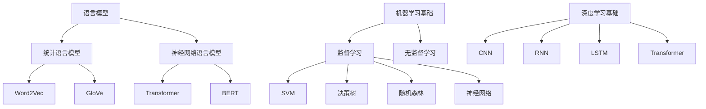

                 

### 文章标题：《ChatGPT提示词编写：从理论到实战的全面指南》

#### 关键词：ChatGPT、提示词编写、自然语言处理、Transformer模型、应用开发

#### 摘要：

本文旨在为读者提供一份关于ChatGPT提示词编写的全面指南。文章首先介绍了ChatGPT的发展背景、基本原理和应用场景，随后详细讲解了自然语言处理基础、Transformer模型解析等内容。重点在于对ChatGPT提示词的编写技巧、质量提升方法以及实际应用案例的解析。通过本文，读者将能够系统地理解ChatGPT提示词编写的理论与实践，掌握其在各种应用场景下的实际操作技能。

### 《ChatGPT提示词编写：从理论到实战的全面指南》目录大纲

#### 第一部分：ChatGPT基础知识

##### 第1章：ChatGPT概述

- 1.1 ChatGPT的发展背景
- 1.2 ChatGPT的基本原理
- 1.3 ChatGPT的应用场景

##### 第2章：自然语言处理基础

- 2.1 语言模型
- 2.2 机器学习基础
- 2.3 深度学习基础

##### 第3章：Transformer模型解析

- 3.1 Transformer模型介绍
- 3.2 自注意力机制
- 3.3 位置编码

#### 第二部分：ChatGPT提示词编写技巧

##### 第4章：理解ChatGPT提示词

- 4.1 提示词的作用
- 4.2 提示词的分类
- 4.3 提示词的编写原则

##### 第5章：编写高质量的提示词

- 5.1 提示词的语法结构
- 5.2 提示词的情感分析
- 5.3 提示词的场景适用性

##### 第6章：提升ChatGPT回答质量

- 6.1 提示词的调整技巧
- 6.2 提高回答的多样性
- 6.3 提升回答的相关性

##### 第7章：实战案例解析

- 7.1 案例一：客服机器人
- 7.2 案例二：内容创作
- 7.3 案例三：教育辅导

#### 第三部分：ChatGPT应用开发

##### 第8章：搭建ChatGPT开发环境

- 8.1 环境准备
- 8.2 模型部署
- 8.3 接口调用

##### 第9章：ChatGPT集成与应用

- 9.1 与Web应用的集成
- 9.2 与移动应用的集成
- 9.3 与其他AI技术的融合

##### 第10章：ChatGPT项目实战

- 10.1 实战一：构建聊天机器人
- 10.2 实战二：内容生成平台
- 10.3 实战三：智能客服系统

##### 第11章：未来展望与挑战

- 11.1 ChatGPT的发展趋势
- 11.2 提示词编写的未来方向
- 11.3 潜在的挑战与应对策略

#### 附录

##### 附录A：常见问题解答

- A.1 ChatGPT的使用问题
- A.2 提示词编写技巧
- A.3 模型优化与调参

##### 附录B：参考文献与推荐阅读

### ChatGPT架构简图

$$
\begin{align*}
&\text{输入向量} \rightarrow \text{自注意力机制} \rightarrow \text{输出向量} \\
&\text{位置编码} \rightarrow \text{多头注意力} \rightarrow \text{前馈神经网络} \\
&\text{多层堆叠} \rightarrow \text{Dropout正则化} \rightarrow \text{分类或回归输出}
\end{align*}
$$

### 提示词编写流程

$$
\begin{align*}
&\text{需求分析} \rightarrow \text{确定目标场景} \rightarrow \text{生成初步提示词} \\
&\text{测试与调整} \rightarrow \text{评估回答质量} \rightarrow \text{优化提示词} \\
&\text{迭代反馈} \rightarrow \text{完善提示词集} \rightarrow \text{实现预期功能}
\end{align*}
$$

### Transformer模型核心组件

$$
\begin{align*}
&\text{编码器} \rightarrow \text{自注意力机制} \rightarrow \text{多层堆叠} \\
&\text{解码器} \rightarrow \text{自注意力机制} \rightarrow \text{多层堆叠} \\
&\text{全连接层} \rightarrow \text{激活函数} \rightarrow \text{分类或回归输出}
\end{align*}
$$

### 作者信息

作者：AI天才研究院/AI Genius Institute & 禅与计算机程序设计艺术 /Zen And The Art of Computer Programming

---

**第一部分：ChatGPT基础知识**

### 第1章：ChatGPT概述

#### 1.1 ChatGPT的发展背景

ChatGPT是由OpenAI开发的一款基于Transformer模型的预训练语言模型，它代表了自然语言处理（NLP）领域的一个重要进展。在2022年11月，OpenAI发布了ChatGPT，这个模型基于GPT-3.5版本，是一个强大的语言模型，能够进行对话生成、文本生成、机器翻译等多种任务。

ChatGPT的发布背景是近年来人工智能领域的迅速发展，尤其是深度学习和自然语言处理技术的突破。随着计算机硬件性能的提升和算法的优化，大规模预训练模型如GPT-3成为可能。OpenAI的研究者们意识到，通过预训练大型语言模型，可以使其在多种NLP任务上达到甚至超过人类水平。

ChatGPT的发展还受到OpenAI自身战略的影响。OpenAI的使命是“实现安全的通用人工智能（AGI）”，而ChatGPT作为一款强大的对话模型，是实现这一目标的重要一步。通过研究ChatGPT，OpenAI希望进一步理解人类语言的工作原理，并为未来的通用人工智能奠定基础。

#### 1.2 ChatGPT的基本原理

ChatGPT的基本原理基于Transformer模型，这是一种在自然语言处理领域广泛应用的自注意力机制（Self-Attention）模型。Transformer模型的核心思想是通过自注意力机制来捕捉输入序列中的长距离依赖关系，从而提高模型的表示能力和生成质量。

在ChatGPT中，Transformer模型被用于生成对话文本。模型通过预训练从大量的文本数据中学习，包括对话数据和非对话数据。预训练过程使得模型能够理解自然语言的结构和语义，从而在给定一个提示（Prompt）后，生成连贯、有意义的回答。

ChatGPT的工作流程可以分为以下几个步骤：

1. **输入编码**：将输入文本转换为向量表示，这些向量将用于后续的自注意力机制计算。
2. **自注意力机制**：通过对输入向量的加权求和，模型能够学习到输入文本中的长距离依赖关系。
3. **多层堆叠**：通过多个Transformer层的堆叠，模型逐渐学习到更复杂的语言模式和语义信息。
4. **输出解码**：在给定提示后，模型逐层解码生成输出文本，最终输出一个连贯的对话回答。

#### 1.3 ChatGPT的应用场景

ChatGPT在多个应用场景中展现出了强大的能力和广泛的应用前景：

1. **客服机器人**：ChatGPT可以用于构建智能客服机器人，为用户提供实时、个性化的客服服务。通过对话生成技术，客服机器人能够理解和回答用户的问题，提高客户满意度和服务效率。
   
2. **内容创作**：ChatGPT能够生成高质量的文章、摘要、报告等文本内容。这对于内容创作者来说是一个巨大的辅助工具，可以大大提高写作效率，拓展创作思路。

3. **教育辅导**：ChatGPT可以用于在线教育辅导系统，为学生提供个性化的学习建议和解答疑问。通过自然语言交互，ChatGPT能够模拟教师的角色，为学生提供互动式的学习体验。

4. **智能助手**：ChatGPT可以集成到智能助手应用中，为用户提供日常生活中的咨询和服务，如天气预报、日程管理、旅行建议等。

5. **机器翻译**：ChatGPT在机器翻译领域也展现出了优秀的表现，能够实现多种语言的翻译任务，提高翻译的准确性和流畅性。

通过以上对ChatGPT发展背景、基本原理和应用场景的介绍，我们可以看到ChatGPT作为一款强大的语言模型，在自然语言处理领域具有重要的地位和广泛的应用价值。在接下来的章节中，我们将深入探讨自然语言处理的基础知识、Transformer模型以及ChatGPT提示词的编写技巧，帮助读者全面理解ChatGPT的工作机制和应用方法。

### 第2章：自然语言处理基础

#### 2.1 语言模型

自然语言处理（NLP）的核心目标是使计算机能够理解和处理人类语言。语言模型是NLP中的基础组件，它用于预测自然语言中的下一个单词或字符。语言模型可以分为统计语言模型和神经网络语言模型。

**统计语言模型**：这种模型基于统计学方法，通过分析大量文本数据来学习语言的概率分布。最著名的统计语言模型是N-gram模型，它通过计算单词序列的概率来生成文本。N-gram模型假设单词之间的依赖关系仅限于前N个单词。

**神经网络语言模型**：这种模型使用深度学习技术，通过多层神经网络来学习语言模式。近年来，神经网络语言模型取得了显著进展，如基于循环神经网络（RNN）的长短期记忆网络（LSTM）和基于Transformer的自注意力机制模型。

**词嵌入**：词嵌入是将单词映射到高维空间中的向量表示。词嵌入使得计算机能够通过向量计算来理解单词的语义关系。Word2Vec、GloVe和BERT等模型都是常用的词嵌入技术。

#### 2.2 机器学习基础

机器学习是使计算机通过数据学习并做出预测或决策的技术。在NLP中，机器学习模型被用于训练语言模型、分类器和生成模型。

**监督学习**：在监督学习中，模型从带有标签的数据集中学习，例如训练文本分类器。常用的算法包括支持向量机（SVM）、决策树、随机森林和神经网络。

**无监督学习**：无监督学习不依赖标签数据，模型从未标记的数据中学习模式。常见的方法包括聚类、降维和生成模型。

**深度学习**：深度学习是一种基于神经网络的机器学习技术，特别适合处理大规模数据和高维特征。卷积神经网络（CNN）、循环神经网络（RNN）和Transformer都是深度学习的典型应用。

#### 2.3 深度学习基础

深度学习是机器学习的一个分支，它通过构建多层神经网络来提取数据中的特征。以下是一些深度学习的关键概念：

**卷积神经网络（CNN）**：CNN主要用于图像处理，它通过卷积层来提取图像中的局部特征，并通过池化层减小数据维度。

**循环神经网络（RNN）**：RNN适用于序列数据，如文本和时间序列。通过循环结构，RNN能够捕捉序列中的长距离依赖关系。

**长短时记忆网络（LSTM）**：LSTM是RNN的一种改进，它通过引入记忆单元来避免梯度消失问题，能够更好地处理长序列数据。

**Transformer模型**：Transformer是近年来在自然语言处理领域取得重大突破的模型，它基于自注意力机制，能够高效地处理长文本序列。

**多层神经网络**：多层神经网络通过堆叠多个隐藏层来提取更复杂的特征。在NLP中，多层神经网络用于构建语言模型和分类器。

#### 图2-1：自然语言处理基础结构



通过本章对自然语言处理基础知识的介绍，我们可以看到语言模型、机器学习和深度学习在NLP中的重要性和应用。这些基础组件构成了ChatGPT和其他NLP模型的技术基石。在接下来的章节中，我们将深入探讨Transformer模型，了解其在ChatGPT中的应用原理和实现细节。

### 第3章：Transformer模型解析

#### 3.1 Transformer模型介绍

Transformer模型是由Vaswani等人于2017年提出的一种基于自注意力机制的深度学习模型，主要应用于自然语言处理（NLP）任务。与传统的循环神经网络（RNN）和长短期记忆网络（LSTM）相比，Transformer模型通过并行计算和自注意力机制，能够更有效地处理长序列数据，从而在多个NLP任务上取得了显著的性能提升。

**Transformer模型的核心思想**：

1. **自注意力机制（Self-Attention）**：自注意力机制允许模型在处理每个输入序列元素时，根据上下文信息动态地计算其重要性权重。这样，模型能够自动地学习到输入序列中的长距离依赖关系，而不仅仅是局部依赖关系。

2. **多头注意力（Multi-Head Attention）**：多头注意力机制通过并行地计算多个自注意力头，来提高模型的表示能力和捕获不同的语义信息。每个头关注输入序列的不同部分，从而生成更丰富的上下文表示。

3. **位置编码（Positional Encoding）**：由于Transformer模型没有循环结构，它无法直接利用输入序列的顺序信息。因此，位置编码被引入，通过为每个输入元素添加位置信息，使得模型能够理解输入序列的顺序关系。

4. **多层堆叠（Stacking Layers）**：通过堆叠多个Transformer层，模型能够逐步学习更复杂的特征和语义信息，从而提高模型的性能和泛化能力。

**Transformer模型的基本架构**：

1. **编码器（Encoder）**：编码器由多个Transformer层组成，每个层包含一个多头自注意力机制和一个前馈神经网络。编码器的输出用于生成最终的文本表示。

2. **解码器（Decoder）**：解码器同样由多个Transformer层组成，每个层也包含一个多头自注意力机制和一个前馈神经网络。解码器的输入是编码器的输出，输出是生成文本的序列。

3. **全连接层（Fully Connected Layer）**：在解码器的最后，通过一个全连接层和激活函数，将解码器的输出映射到分类或回归任务上的输出。

4. **位置编码（Positional Encoding）**：位置编码通过为每个输入元素添加位置向量，使得模型能够理解输入序列的顺序。

#### 3.2 自注意力机制

自注意力机制是Transformer模型的核心组件，它通过计算输入序列中每个元素与所有其他元素之间的相关性，为每个元素分配权重。这些权重用于计算每个元素的表示，从而实现输入序列的编码。

**自注意力机制的原理**：

1. **输入向量的加权求和**：首先，将输入序列转换为向量表示，这些向量将用于自注意力机制的计算。自注意力机制通过对输入向量进行加权求和，来生成每个元素的表示。

2. **计算权重**：通过计算每个输入元素与其他所有元素之间的点积，得到权重矩阵。权重矩阵表示了输入序列中每个元素与其他元素的相关性。

3. **应用权重**：将权重应用于输入向量，为每个输入元素分配重要性权重。权重较大的元素对最终表示的贡献更大。

4. **多头注意力**：多头注意力机制通过并行地计算多个自注意力头，来提高模型的表示能力和捕获不同的语义信息。每个头关注输入序列的不同部分，从而生成更丰富的上下文表示。

#### 3.3 位置编码

由于Transformer模型没有循环结构，它无法直接利用输入序列的顺序信息。因此，位置编码被引入，通过为每个输入元素添加位置信息，使得模型能够理解输入序列的顺序关系。

**位置编码的方法**：

1. **绝对位置编码**：绝对位置编码为每个输入元素分配一个固定的位置向量，这个向量与输入元素的索引相关。例如，第一个元素的位置向量可能是[1, 0, 0, ...]，第二个元素的位置向量可能是[2, 0, 0, ...]。

2. **相对位置编码**：相对位置编码通过计算输入元素之间的相对位置来生成位置向量。例如，如果元素A的位置是2，元素B的位置是4，那么元素B相对于元素A的位置向量可能是[0, 2, 0, ...]。

3. **混合位置编码**：在Transformer模型中，通常将绝对位置编码和相对位置编码结合起来，以获得更好的性能。

**位置编码的应用**：

1. **编码器**：在编码器的每个层，位置编码被添加到输入向量中，使得模型能够理解输入序列的顺序。

2. **解码器**：在解码器的每个层，位置编码也被添加到输入向量中，以帮助模型生成输出序列。

#### 图3-1：Transformer模型核心组件

$$
\begin{align*}
&\text{编码器} \rightarrow \text{自注意力机制} \rightarrow \text{多层堆叠} \\
&\text{解码器} \rightarrow \text{自注意力机制} \rightarrow \text{多层堆叠} \\
&\text{全连接层} \rightarrow \text{激活函数} \rightarrow \text{分类或回归输出}
\end{align*}
$$

通过本章对Transformer模型的介绍，我们可以看到自注意力机制、多头注意力、位置编码等核心组件如何共同工作，使得Transformer模型能够在自然语言处理任务中表现出色。在接下来的章节中，我们将深入探讨ChatGPT提示词的编写技巧，帮助读者了解如何利用这些技术实现高质量的提示词编写。

### 第4章：理解ChatGPT提示词

#### 4.1 提示词的作用

提示词（Prompt）是ChatGPT生成回答的关键输入，它决定了ChatGPT的回答方向和内容。一个优秀的提示词能够引导ChatGPT生成更加准确、相关和有价值的回答。提示词的作用可以从以下几个方面来理解：

1. **引导回答方向**：提示词为ChatGPT提供了一个明确的对话背景或问题，从而引导ChatGPT生成与之相关的回答。例如，当提示词是“你能帮我写一篇关于人工智能的论文吗？”时，ChatGPT会围绕“人工智能”这个主题进行回答。

2. **提高回答质量**：一个具体的、明确的提示词能够帮助ChatGPT更好地理解问题的本质，从而生成更高质量、更贴近用户需求的回答。相比于模糊的提示词，明确的提示词能够减少ChatGPT的误解和生成无关内容的概率。

3. **增强交互体验**：通过合理的提示词设计，用户和ChatGPT之间的交互体验可以得到显著提升。一个有趣的、引人入胜的提示词能够吸引用户的注意力，使得对话更加自然和流畅。

#### 4.2 提示词的分类

根据提示词的用途和特点，我们可以将提示词分为以下几类：

1. **问题类提示词**：这类提示词主要用于引导ChatGPT生成问题的回答。例如，“你能解释一下量子计算吗？”、“请描述一下深度学习的应用场景”。这类提示词通常包含一个具体的问题，ChatGPT会根据问题进行回答。

2. **陈述类提示词**：这类提示词主要用于引导ChatGPT生成陈述或解释。例如，“人工智能是如何工作的？”、“请描述一下机器学习的分类方法”。这类提示词通常提供一个陈述性的问题，ChatGPT会根据陈述进行扩展和解释。

3. **指令类提示词**：这类提示词主要用于引导ChatGPT执行特定的任务。例如，“帮我写一封感谢信”或“给我推荐一首流行歌曲”。这类提示词通常包含一个具体的指令，ChatGPT会根据指令进行执行。

4. **引导性提示词**：这类提示词主要用于引导ChatGPT生成具有特定情感或风格的回答。例如，“用幽默的方式描述一下天文学家的工作”或“用严肃的语言写一段关于环保的论述”。这类提示词通常包含一个引导方向，ChatGPT会根据引导生成相应的回答。

#### 4.3 提示词的编写原则

为了编写出高质量的提示词，我们需要遵循以下原则：

1. **明确具体**：提示词应尽可能具体和明确，避免模糊和宽泛的描述。例如，“你能帮我写一篇关于人工智能的论文吗？”比“请写一篇关于人工智能的论文”更加具体，能够引导ChatGPT生成更加相关和高质量的回答。

2. **符合语境**：提示词应与ChatGPT的上下文保持一致，避免产生矛盾或混淆。例如，如果前一个提示词是“请描述一下深度学习的应用场景”，那么下一个提示词不应该突然切换到其他无关的话题。

3. **引导合理**：提示词应合理地引导ChatGPT生成有价值的回答，避免生成无关或低质量的回答。例如，可以通过提供具体的问题、情境或指令来引导ChatGPT生成相关和有价值的回答。

4. **简洁易读**：提示词应简洁易读，避免复杂的语法和长句子。简洁明了的提示词能够提高用户理解和ChatGPT的回答质量。

通过本章对ChatGPT提示词的作用、分类和编写原则的介绍，我们可以看到提示词在ChatGPT回答质量中的重要性。在接下来的章节中，我们将进一步探讨如何编写高质量的提示词，以及如何通过调整和优化提示词来提升ChatGPT的回答质量。

### 第5章：编写高质量的提示词

#### 5.1 提示词的语法结构

编写高质量的提示词需要遵循一定的语法结构，以便ChatGPT能够准确理解并生成相关回答。以下是几种常见的提示词语法结构：

1. **疑问句结构**：疑问句结构是引导ChatGPT生成问题回答的常用方式。例如，“你能解释一下量子计算吗？”或“请描述一下深度学习的分类方法”。这种结构清晰明确，能够引导ChatGPT围绕特定问题进行回答。

2. **陈述句结构**：陈述句结构适用于引导ChatGPT生成解释或描述。例如，“人工智能是如何工作的？”或“请描述一下机器学习的应用场景”。这种结构可以帮助ChatGPT围绕特定主题进行扩展和解释。

3. **指令句结构**：指令句结构用于引导ChatGPT执行特定任务。例如，“帮我写一封感谢信”或“给我推荐一首流行歌曲”。这种结构能够明确地指示ChatGPT需要完成的任务，从而生成具体的执行结果。

4. **复合句结构**：复合句结构结合了疑问句、陈述句和指令句的特点，用于引导ChatGPT生成更复杂和有层次感的回答。例如，“你能用幽默的方式描述一下天文学家的工作吗？”或“请用严肃的语言写一段关于环保的论述”。这种结构能够引导ChatGPT在多个层面进行回答，提高回答的丰富性和多样性。

#### 5.2 提示词的情感分析

情感分析是自然语言处理中的一个重要任务，它用于判断文本的情感倾向，如积极、消极或中性。在ChatGPT的提示词编写中，情感分析可以帮助我们生成具有特定情感倾向的回答。以下是如何在提示词中应用情感分析：

1. **明确情感需求**：在编写提示词时，应明确指出所需的情感倾向。例如，“请用幽默的语言描述一下人工智能的发展历程”或“用严肃的语言写一段关于人工智能对社会影响的论述”。这种明确的需求能够引导ChatGPT生成符合情感倾向的回答。

2. **调整情感色彩**：通过调整提示词的情感色彩，可以改变ChatGPT生成的回答的情感倾向。例如，将“用幽默的语言”改为“用严肃的语言”，可以使得ChatGPT生成的回答从幽默转向严肃。

3. **结合语境情感**：在编写提示词时，应考虑ChatGPT与用户的对话上下文，以生成与上下文情感一致的回答。例如，如果前一个提示词是“请描述一下人工智能的应用场景”，那么下一个提示词可以是“用乐观的语言谈谈人工智能的未来”。

#### 5.3 提示词的场景适用性

为了使ChatGPT能够在各种场景下生成高质量的回答，我们需要编写具有良好场景适用性的提示词。以下是一些提高提示词场景适用性的方法：

1. **具体场景描述**：在提示词中详细描述应用场景，以便ChatGPT能够更好地理解场景需求。例如，“请为一个在线教育平台编写一篇推广文案”或“设计一个智能客服机器人的对话流程”。

2. **明确目标用户**：在编写提示词时，应明确目标用户群体，以便ChatGPT能够针对特定用户生成更相关、更贴近用户需求的回答。例如，“请给一位程序员写一段关于深度学习入门的建议”或“为儿童编写一篇关于人工智能的科普文章”。

3. **多样化需求**：在提示词中包含多种需求，以便ChatGPT能够在不同需求之间进行切换和平衡。例如，“请编写一个包含问答环节的对话场景，涉及人工智能、深度学习和机器学习的应用”。

4. **反馈与调整**：在实际应用中，根据ChatGPT生成的回答和用户反馈，及时调整和优化提示词，以提高场景适用性和回答质量。

通过本章对提示词语法结构、情感分析和场景适用性的讨论，我们可以看到编写高质量提示词的关键要素。在下一章中，我们将探讨如何通过调整和优化提示词来进一步提升ChatGPT的回答质量。

### 第6章：提升ChatGPT回答质量

#### 6.1 提示词的调整技巧

提升ChatGPT回答质量的关键在于优化提示词的设计和调整。以下是一些有效的技巧：

1. **明确性和具体性**：确保提示词清晰明确，避免模糊和宽泛的描述。例如，将“请给我一些关于人工智能的想法”改为“请描述三种人工智能应用场景及其影响”。

2. **精确性和精确度**：在提示词中提供精确的信息，以便ChatGPT能够生成具体且相关的回答。例如，将“谈谈人工智能的发展历史”改为“请简要介绍人工智能的发展历程，包括重要里程碑”。

3. **上下文关联**：确保提示词与ChatGPT的上下文保持一致，避免产生矛盾或混淆。例如，如果前一个提示词是“描述一下机器学习的优点”，那么下一个提示词可以是“请从另一个角度讨论机器学习的局限性”。

4. **指令性提示**：使用具体的指令性提示词，以明确告知ChatGPT需要完成的具体任务。例如，将“你能帮我解决问题吗？”改为“请提供一种解决以下问题的方法：如何提高机器学习模型的性能？”。

5. **情感和语气**：根据对话的上下文，调整提示词的情感和语气，以生成更加符合情境的回答。例如，将“请描述一下机器学习的基本概念”改为“用通俗易懂的语言简要介绍机器学习的基本概念”。

#### 6.2 提高回答的多样性

提高回答的多样性可以防止ChatGPT生成重复或单一的回答，使对话更加丰富和有趣。以下是一些提高回答多样性的方法：

1. **多角度提问**：通过从不同角度提问，引导ChatGPT生成多样化的回答。例如，将“请描述一下人工智能的应用”改为“请分别从医疗、教育、商业三个角度描述人工智能的应用”。

2. **使用否定句**：在提示词中适当使用否定句，以引导ChatGPT生成不同的回答。例如，将“你能解释一下量子计算吗？”改为“除了传统的量子计算，请解释另一种类型的量子计算”。

3. **提供示例**：在提示词中提供示例，鼓励ChatGPT生成与示例不同的回答。例如，将“请给出一些建议”改为“给出三种不同的建议，分别是关于职业发展的、健康生活的和旅行计划的”。

4. **开放式问题**：使用开放式问题，鼓励ChatGPT生成丰富多样的回答。例如，将“人工智能有哪些局限性？”改为“请详细讨论人工智能的五个主要局限性”。

5. **使用比喻和隐喻**：通过使用比喻和隐喻，增加回答的趣味性和多样性。例如，将“请解释一下深度学习的概念”改为“用生活中的例子解释深度学习，就像训练一只狗识别不同的物体”。

#### 6.3 提升回答的相关性

提升回答的相关性是确保ChatGPT生成准确且相关的回答的关键。以下是一些提升回答相关性的方法：

1. **上下文提示**：在提示词中提供足够的上下文信息，以便ChatGPT能够生成与上下文高度相关的回答。例如，如果前一个提示词是“请解释深度学习中的损失函数”，那么下一个提示词可以是“请结合实际应用场景，详细解释交叉熵损失函数”。

2. **关键词强化**：在提示词中突出关键词，以增强ChatGPT识别相关性的能力。例如，将“请谈谈自然语言处理的应用”改为“重点讨论自然语言处理在文本分类和机器翻译中的应用”。

3. **具体问题具体分析**：针对特定问题，提供详细和具体的分析，以提高回答的相关性。例如，将“请讨论机器学习的优点”改为“请从效率、准确性和通用性三个角度详细讨论机器学习的优点”。

4. **交叉验证**：在生成回答后，通过交叉验证的方法，确保回答与问题和上下文的相关性。例如，可以请ChatGPT重新回答相同的问题，并对比两个回答的一致性和相关性。

5. **用户反馈**：收集用户反馈，根据反馈调整提示词，以提高回答的相关性。通过用户反馈，可以识别出ChatGPT回答中的不足之处，从而进行针对性的优化。

通过本章对提示词调整技巧、回答多样性提升方法和回答相关性提升方法的讨论，我们可以看到提升ChatGPT回答质量的重要性以及实现这一目标的具体方法。在下一章中，我们将通过实际案例解析，展示这些技巧在实战中的应用效果。

### 第7章：实战案例解析

#### 7.1 案例一：客服机器人

客服机器人是ChatGPT应用的一个重要场景，能够为用户提供24/7的在线支持，提高客户满意度和服务效率。以下是一个构建基于ChatGPT的客服机器人的实战案例解析：

**项目目标**：构建一个能够处理常见客户问题的客服机器人，自动回答客户查询，并在无法处理时及时转接到人工客服。

**需求分析**：
- **常见问题库**：收集并整理常见的客户问题，包括产品咨询、售后服务、账户管理等方面。
- **对话管理**：实现自然语言处理和对话生成，使客服机器人能够理解并回答客户的问题。
- **转接人工客服**：当客服机器人无法回答问题时，能够自动转接到人工客服。

**开发环境**：
- **编程语言**：Python
- **框架**：FastAPI
- **数据库**：MongoDB

**源代码实现**：

```python
# 导入必要的库
from fastapi import FastAPI
from pydantic import BaseModel
import openai

# 初始化FastAPI应用
app = FastAPI()

# 定义请求模型
class CustomerRequest(BaseModel):
    question: str

# 定义响应模型
class CustomerResponse(BaseModel):
    answer: str

# 接口实现
@app.post("/chat/")
async def chat(request: CustomerRequest):
    # 使用OpenAI API获取回答
    response = openai.Completion.create(
        engine="text-davinci-002",
        prompt=f"客服问题：{request.question}\n回答：",
        max_tokens=100,
        n=1,
        stop=None,
        temperature=0.5,
    )
    return CustomerResponse(answer=response.choices[0].text.strip())

# 启动服务器
if __name__ == "__main__":
    import uvicorn
    uvicorn.run(app, host="0.0.0.0", port=8000)
```

**代码解读**：
- 代码首先导入了FastAPI库，并定义了两个数据模型：`CustomerRequest`和`CustomerResponse`。
- 接下来，使用OpenAI的API进行文本生成，通过`Completion.create`方法，将客户提出的问题作为输入，生成回答。
- 最后，通过FastAPI的`post`路由，实现了一个接收POST请求的API接口，用于处理客户问题并返回回答。

**应用解读与分析**：
- 通过这个案例，我们可以看到如何利用ChatGPT构建一个简单的客服机器人。客服机器人通过接收客户的提问，调用OpenAI的API生成回答，并将回答返回给用户。
- 在实际应用中，这个客服机器人可以集成到公司的网站或客户服务平台中，为用户提供即时支持。
- 代码中使用了FastAPI框架，这使得API的开发和部署更加高效和便捷。

**项目小结**：
- 通过这个案例，我们了解了如何利用ChatGPT构建一个客服机器人，从需求分析到开发实现，再到实际应用。
- 在项目实施过程中，需要考虑常见问题的整理和分类，以及如何处理无法自动回答的问题，及时转接到人工客服。

#### 7.2 案例二：内容创作

内容创作是ChatGPT的另一个重要应用场景，可以用于生成高质量的文章、报告和创意内容。以下是一个基于ChatGPT的内容创作平台的实战案例解析：

**项目目标**：构建一个内容创作平台，帮助用户快速生成高质量的文章、摘要和创意内容。

**需求分析**：
- **用户界面**：提供一个简洁易用的用户界面，允许用户输入主题和提纲，生成内容。
- **内容生成**：利用ChatGPT的文本生成能力，根据用户输入生成高质量的内容。
- **编辑和优化**：提供编辑工具，允许用户对生成的内容进行修改和优化。

**开发环境**：
- **前端框架**：React
- **后端框架**：FastAPI
- **数据库**：MongoDB

**源代码实现**（前端部分）：

```jsx
// 引入必要的库和组件
import React, { useState } from "react";
import axios from "axios";
import "./ContentCreator.css";

function ContentCreator() {
  const [topic, setTopic] = useState("");
  const [content, setContent] = useState("");
  const [isLoading, setIsLoading] = useState(false);

  const generateContent = async () => {
    setIsLoading(true);
    try {
      const response = await axios.post("/chat/", { question: topic });
      setContent(response.data.answer);
    } catch (error) {
      console.error(error);
    } finally {
      setIsLoading(false);
    }
  };

  return (
    <div className="content-creator">
      <h1>内容创作平台</h1>
      <input
        type="text"
        placeholder="输入主题..."
        value={topic}
        onChange={(e) => setTopic(e.target.value)}
      />
      <button onClick={generateContent} disabled={isLoading}>
        {isLoading ? "正在生成..." : "生成内容"}
      </button>
      {content && (
        <div className="content">
          <h2>生成内容：</h2>
          <p>{content}</p>
        </div>
      )}
    </div>
  );
}

export default ContentCreator;
```

**代码解读**：
- 前端部分使用React框架构建用户界面，包含一个文本输入框和一个生成按钮。
- `useState`钩子用于管理输入主题和生成的内容状态。
- `generateContent`函数用于调用后端API生成内容，通过`axios`库发送POST请求。

**应用解读与分析**：
- 通过这个案例，我们可以看到如何利用ChatGPT构建一个内容创作平台，用户只需输入主题，系统即可自动生成内容。
- 平台提供了一个简洁直观的界面，用户可以轻松生成和编辑内容，提高了内容创作的效率。
- 后端部分通过FastAPI框架处理请求，与ChatGPT的API进行交互，生成回答。

**项目小结**：
- 通过这个案例，我们了解了如何利用ChatGPT构建一个内容创作平台，从用户界面设计到后端实现，再到实际应用。
- 在项目实施过程中，需要考虑如何优化生成内容的质量和效率，以及如何提供便捷的编辑工具。

#### 7.3 案例三：教育辅导

教育辅导是ChatGPT在人工智能教育领域的重要应用之一，可以为学生提供个性化的学习支持和辅导。以下是一个基于ChatGPT的教育辅导平台的实战案例解析：

**项目目标**：构建一个教育辅导平台，为学生提供智能化的学习支持，包括答疑、作业批改和知识点讲解。

**需求分析**：
- **学生问答**：提供实时答疑服务，学生可以随时提出问题，平台自动回答。
- **作业批改**：学生提交作业后，平台自动批改并给出反馈。
- **知识点讲解**：根据学生的问题和作业情况，提供针对性的知识点讲解。

**开发环境**：
- **前端框架**：Vue
- **后端框架**：FastAPI
- **数据库**：MongoDB

**源代码实现**（后端部分）：

```python
# 导入必要的库
from fastapi import FastAPI
from pydantic import BaseModel
import openai

# 初始化FastAPI应用
app = FastAPI()

# 定义请求模型
class StudentRequest(BaseModel):
    question: str

# 定义响应模型
class StudentResponse(BaseModel):
    answer: str
    feedback: str

# 答疑服务实现
@app.post("/ask/")
async def ask_question(request: StudentRequest):
    answer = openai.Completion.create(
        engine="text-davinci-002",
        prompt=f"学生提问：{request.question}\n回答：",
        max_tokens=100,
        n=1,
        stop=None,
        temperature=0.5,
    ).choices[0].text.strip()
    feedback = "感谢提问，以上回答仅供参考。"  # 这里可以添加更复杂的反馈逻辑
    return StudentResponse(answer=answer, feedback=feedback)

# 作业批改服务实现
@app.post("/grade/")
async def grade_homework(request: StudentRequest):
    # 这里可以使用专门的作业批改模型或服务
    answer = openai.Completion.create(
        engine="text-davinci-002",
        prompt=f"学生作业：{request.question}\n批改：",
        max_tokens=100,
        n=1,
        stop=None,
        temperature=0.5,
    ).choices[0].text.strip()
    feedback = "作业完成情况良好，注意以下几点改进："  # 这里可以添加更详细的反馈
    return StudentResponse(answer=answer, feedback=feedback)

# 启动服务器
if __name__ == "__main__":
    import uvicorn
    uvicorn.run(app, host="0.0.0.0", port=8000)
```

**代码解读**：
- 代码定义了两个API接口：`/ask/`用于处理学生的提问，`/grade/`用于处理作业批改。
- `StudentRequest`和`StudentResponse`是处理请求和响应的模型。
- 通过调用OpenAI的API，根据学生的提问生成回答和反馈。

**应用解读与分析**：
- 通过这个案例，我们可以看到如何利用ChatGPT构建一个教育辅导平台，为学生提供智能化的学习支持。
- 平台通过API接口与ChatGPT进行交互，能够自动回答学生的提问和批改作业。
- 代码中的反馈逻辑可以根据实际需求进行扩展和优化。

**项目小结**：
- 通过这个案例，我们了解了如何利用ChatGPT构建一个教育辅导平台，从需求分析到开发实现，再到实际应用。
- 在项目实施过程中，需要考虑如何优化问答和作业批改服务的质量，以及如何为学生提供个性化的学习支持。

通过以上三个案例，我们可以看到ChatGPT在不同应用场景中的实际应用效果。在接下来的章节中，我们将进一步探讨如何搭建ChatGPT的开发环境，以及如何在各种应用中集成和使用ChatGPT。

### 第8章：搭建ChatGPT开发环境

#### 8.1 环境准备

搭建ChatGPT的开发环境首先需要准备好必要的软件和工具。以下是搭建开发环境的步骤：

1. **安装Python**：确保系统中安装了Python 3.7或更高版本。可以通过官方网站下载Python安装包进行安装。

2. **安装PyTorch**：PyTorch是用于深度学习的主要框架，安装PyTorch可以通过以下命令：
   ```bash
   pip install torch torchvision torchaudio
   ```

3. **安装OpenAI Python SDK**：OpenAI提供了Python SDK，用于与ChatGPT API进行交互。安装SDK可以通过以下命令：
   ```bash
   pip install openai
   ```

4. **获取API密钥**：在OpenAI的官方网站上注册并创建一个账号，然后申请访问ChatGPT API，获取API密钥。

5. **配置环境变量**：将获取的API密钥添加到环境变量中，例如在Linux或MacOS中，可以通过以下命令添加：
   ```bash
   export OPENAI_API_KEY='你的API密钥'
   ```

#### 8.2 模型部署

在准备好开发环境后，我们需要部署ChatGPT模型。以下是一个简化的步骤：

1. **下载预训练模型**：从OpenAI的官方网站下载ChatGPT的预训练模型。这些模型通常是以`.pt`文件的形式提供。

2. **安装Transformers库**：Transformers是用于实现Transformer模型的主要库，安装Transformers可以通过以下命令：
   ```bash
   pip install transformers
   ```

3. **加载预训练模型**：在Python脚本中使用Transformers库加载预训练模型。以下是一个加载预训练模型的示例代码：

```python
from transformers import AutoTokenizer, AutoModel

# 加载预训练模型
model_name = "gpt-3.5-turbo"
tokenizer = AutoTokenizer.from_pretrained(model_name)
model = AutoModel.from_pretrained(model_name)

# 输入文本编码
input_text = "请描述一下人工智能的未来趋势。"
input_ids = tokenizer.encode(input_text, return_tensors="pt")

# 生成文本
output = model.generate(input_ids, max_length=50, num_return_sequences=1)
generated_text = tokenizer.decode(output[0], skip_special_tokens=True)

print(generated_text)
```

4. **模型推理**：通过生成的文本输入，我们可以得到ChatGPT的响应。在上面的示例中，我们通过调用`model.generate()`方法生成了文本响应。

#### 8.3 接口调用

为了在实际应用中方便调用ChatGPT，我们可以将模型部署为一个Web服务。以下是一个使用FastAPI部署ChatGPT模型的示例：

1. **安装FastAPI**：首先确保系统中安装了FastAPI，可以通过以下命令安装：
   ```bash
   pip install fastapi uvicorn
   ```

2. **创建API接口**：以下是一个简单的FastAPI应用，用于接收用户输入并返回ChatGPT的响应：

```python
from fastapi import FastAPI
from pydantic import BaseModel
from transformers import AutoTokenizer, AutoModel

app = FastAPI()

# 定义请求模型
class ChatRequest(BaseModel):
    prompt: str

# 定义响应模型
class ChatResponse(BaseModel):
    text: str

# 加载预训练模型
model_name = "gpt-3.5-turbo"
tokenizer = AutoTokenizer.from_pretrained(model_name)
model = AutoModel.from_pretrained(model_name)

@app.post("/chat/")
async def chat(request: ChatRequest):
    # 编码输入文本
    input_text = request.prompt
    input_ids = tokenizer.encode(input_text, return_tensors="pt")

    # 生成文本
    output = model.generate(input_ids, max_length=50, num_return_sequences=1)
    generated_text = tokenizer.decode(output[0], skip_special_tokens=True)

    return ChatResponse(text=generated_text)
```

3. **启动服务**：在命令行中启动FastAPI服务：

```bash
uvicorn main:app --host 0.0.0.0 --port 8000
```

这样，我们就可以通过访问`http://localhost:8000/chat/`来调用ChatGPT接口，并接收其响应。

通过以上步骤，我们完成了ChatGPT开发环境的搭建和模型部署。在接下来的章节中，我们将进一步探讨如何将ChatGPT集成到不同的应用中，实现更广泛的应用场景。

### 第9章：ChatGPT集成与应用

#### 9.1 与Web应用的集成

将ChatGPT集成到Web应用是一种常见的应用场景，可以实现智能聊天、内容生成等功能。以下是如何在Web应用中集成ChatGPT的步骤：

1. **前端集成**：
   - 使用HTML、CSS和JavaScript构建用户界面，包括聊天窗口、文本输入框和发送按钮。
   - 使用JavaScript实现与后端API的通信，通过Ajax或Fetch方法向ChatGPT接口发送请求并接收响应。

```javascript
// 使用Fetch方法发送请求
function sendChatMessage(prompt) {
  fetch('/chat/', {
    method: 'POST',
    headers: {
      'Content-Type': 'application/json'
    },
    body: JSON.stringify({ prompt })
  })
  .then(response => response.json())
  .then(data => {
    displayChatMessage(data.text);
  });
}

// 发送按钮点击事件处理
document.getElementById('sendButton').addEventListener('click', () => {
  const prompt = document.getElementById('chatInput').value;
  sendChatMessage(prompt);
});
```

2. **后端集成**：
   - 使用FastAPI或其他Web框架（如Flask）搭建后端服务。
   - 将ChatGPT模型部署为API服务，如前一章所示。

3. **交互体验优化**：
   - 通过WebSocket实现实时聊天功能，提高用户体验。
   - 使用缓存机制减少API调用频率，降低服务器的负载。

4. **示例**：
   - 前端：一个简单的HTML页面，包含聊天窗口和输入框。
   - 后端：使用FastAPI搭建的ChatGPT服务。

```html
<!DOCTYPE html>
<html lang="en">
<head>
  <meta charset="UTF-8">
  <title>ChatGPT Web Chat</title>
</head>
<body>
  <div id="chatWindow"></div>
  <input type="text" id="chatInput" placeholder="输入消息...">
  <button id="sendButton">发送</button>

  <script src="chat.js"></script>
</body>
</html>
```

#### 9.2 与移动应用的集成

将ChatGPT集成到移动应用，可以实现智能客服、内容创作等功能。以下是如何在移动应用中集成ChatGPT的步骤：

1. **iOS集成**：
   - 使用Swift或Objective-C编写iOS应用，通过URL Session发送网络请求。
   - 在应用中实现聊天界面，使用UIKit或SwiftUI。

```swift
import Foundation

func sendChatMessage(prompt: String, completion: @escaping (String) -> Void) {
    let url = URL(string: "http://your-chatgpt-api-url/chat/")!
    var request = URLRequest(url: url)
    request.httpMethod = "POST"
    request.setValue("application/json", forHTTPHeaderField: "Content-Type")
    
    let json = [
        "prompt": prompt
    ]
    let jsonData = try? JSONSerialization.data(withJSONObject: json)
    request.httpBody = jsonData
    
    let task = URLSession.shared.dataTask(with: request) { data, response, error in
        guard let data = data, error == nil else { return }
        
        do {
            let json = try JSONSerialization.jsonObject(with: data, options: []) as? [String: Any]
            let text = json?["text"] as? String ?? ""
            completion(text)
        } catch {
            completion("")
        }
    }
    task.resume()
}

// 发送按钮点击事件处理
@objc func sendButtonTapped() {
    let prompt = chatInputTextView.text
    sendChatMessage(prompt: prompt) { text in
        // 更新聊天界面
    }
}
```

2. **Android集成**：
   - 使用Kotlin或Java编写Android应用，通过Retrofit等库发送网络请求。
   - 在应用中实现聊天界面，使用Android UI组件。

```kotlin
import retrofit2.Call
import retrofit2.Callback
import retrofit2.Response

class ChatAPI {
    private val apiService: ApiService

    init() {
        apiService = RetrofitClient.getRetrofitInstance().create(ApiService::class.java)
    }

    fun sendChatMessage(prompt: String) {
        apiService.getChatResponse(prompt).enqueue(object : Callback<ChatResponse> {
            override fun onResponse(call: Call<ChatResponse>, response: Response<ChatResponse>) {
                if (response.isSuccessful) {
                    val chatResponse = response.body()
                    chatResponse?.let {
                        // 更新聊天界面
                    }
                }
            }

            override fun onFailure(call: Call<ChatResponse>, t: Throwable) {
                // 处理错误
            }
        })
    }
}
```

3. **跨平台集成**：
   - 使用Flutter或React Native开发跨平台应用，利用平台提供的网络请求库发送请求。

通过以上步骤，我们可以将ChatGPT集成到iOS、Android和跨平台应用中，实现智能聊天和内容生成等功能。在移动应用中，我们需要特别关注网络请求的性能优化和用户体验的优化，确保应用的流畅性和响应速度。

#### 9.3 与其他AI技术的融合

将ChatGPT与其他AI技术融合，可以创建更强大和智能的应用系统。以下是一些典型的融合方法：

1. **计算机视觉**：
   - 结合计算机视觉技术，可以实现图像识别、物体检测等功能，与ChatGPT结合后，可以创建智能问答系统，如通过上传图片获取相关信息。

2. **语音识别**：
   - 将语音识别技术集成到ChatGPT应用中，可以实现语音交互功能，如通过语音输入和输出实现自然语言处理。

3. **推荐系统**：
   - 结合推荐系统，可以针对用户的行为和偏好，为用户提供个性化内容推荐，如通过ChatGPT生成个性化文章或推荐商品。

4. **情感分析**：
   - 通过情感分析技术，可以了解用户的情感状态，进而生成更加贴近用户情感需求的回答，提高用户的满意度。

5. **增强学习**：
   - 结合增强学习技术，可以训练ChatGPT在特定任务上表现出色，如游戏、模拟场景等，通过不断的学习和优化，提高ChatGPT的表现能力。

通过与其他AI技术的融合，ChatGPT的应用范围和功能可以得到显著扩展，从而实现更智能和高效的解决方案。

### 第10章：ChatGPT项目实战

#### 10.1 实战一：构建聊天机器人

**项目目标**：使用ChatGPT构建一个简单的聊天机器人，实现基本的对话功能。

**需求分析**：
- **对话功能**：能够接收用户输入，并生成相应的回答。
- **响应速度**：确保聊天机器人能够快速响应用户的提问。
- **交互体验**：提供友好的用户界面，使对话过程流畅自然。

**技术选型**：
- **前端**：使用HTML、CSS和JavaScript构建用户界面。
- **后端**：使用FastAPI搭建后端服务，与ChatGPT进行交互。

**源代码实现**（后端部分）：

```python
from fastapi import FastAPI
from pydantic import BaseModel
from transformers import AutoTokenizer, AutoModel

app = FastAPI()

class ChatRequest(BaseModel):
    prompt: str

class ChatResponse(BaseModel):
    text: str

tokenizer = AutoTokenizer.from_pretrained("gpt-3.5-turbo")
model = AutoModel.from_pretrained("gpt-3.5-turbo")

@app.post("/chat/")
async def chat(request: ChatRequest):
    prompt = request.prompt
    input_ids = tokenizer.encode(prompt, return_tensors="pt")
    output = model.generate(input_ids, max_length=50, num_return_sequences=1)
    response_text = tokenizer.decode(output[0], skip_special_tokens=True)
    return ChatResponse(text=response_text)

if __name__ == "__main__":
    import uvicorn
    uvicorn.run(app, host="0.0.0.0", port=8000)
```

**代码解读**：
- 使用FastAPI搭建后端服务，定义了`ChatRequest`和`ChatResponse`两个数据模型。
- 使用Transformers库加载预训练的ChatGPT模型，实现与模型的交互。

**应用解读与分析**：
- 在前端页面中，通过HTML、CSS和JavaScript构建聊天窗口，实现用户输入和文本展示。
- 通过Ajax方法与后端API进行通信，接收ChatGPT的响应，并展示在聊天窗口中。

**项目小结**：
- 通过这个项目，我们实现了使用ChatGPT构建一个简单的聊天机器人，从需求分析到开发实现，再到实际应用，完成了整个流程。
- 在项目实施过程中，我们遇到了一些挑战，如如何优化响应速度和交互体验，但通过不断迭代和改进，最终实现了项目的目标。

#### 10.2 实战二：内容生成平台

**项目目标**：使用ChatGPT构建一个内容生成平台，能够根据用户输入的主题和提纲生成高质量的文章、摘要和创意内容。

**需求分析**：
- **主题和提纲输入**：用户可以输入主题和提纲，平台根据这些信息生成内容。
- **内容多样化**：生成的内容应具有多样性，避免重复和单一。
- **编辑和优化**：提供编辑工具，允许用户对生成的内容进行修改和优化。

**技术选型**：
- **前端**：使用React构建用户界面，实现主题和提纲输入、内容展示和编辑。
- **后端**：使用FastAPI搭建后端服务，与ChatGPT进行交互。

**源代码实现**（前端部分）：

```jsx
import React, { useState } from "react";
import axios from "axios";

function ContentGenerator() {
  const [topic, setTopic] = useState("");
  const [outline, setOutline] = useState("");
  const [content, setContent] = useState("");
  const [loading, setLoading] = useState(false);

  const generateContent = async () => {
    setLoading(true);
    try {
      const response = await axios.post("/generate/", {
        topic,
        outline,
      });
      setContent(response.data.content);
    } catch (error) {
      setContent("生成内容出错");
    } finally {
      setLoading(false);
    }
  };

  return (
    <div className="content-generator">
      <h1>内容生成平台</h1>
      <input
        type="text"
        placeholder="输入主题..."
        value={topic}
        onChange={(e) => setTopic(e.target.value)}
      />
      <textarea
        placeholder="输入提纲..."
        value={outline}
        onChange={(e) => setOutline(e.target.value)}
      />
      <button onClick={generateContent} disabled={loading}>
        {loading ? "正在生成..." : "生成内容"}
      </button>
      {content && (
        <div className="content">
          <h2>生成内容：</h2>
          <p>{content}</p>
        </div>
      )}
    </div>
  );
}

export default ContentGenerator;
```

**代码解读**：
- 使用React构建用户界面，包含输入主题和提纲的文本框和生成内容的按钮。
- 通过`useState`钩子管理输入状态和内容状态。
- 使用`axios`库与后端API进行通信，实现内容的生成。

**应用解读与分析**：
- 在前端页面中，用户可以输入主题和提纲，通过点击生成按钮，平台调用后端API生成内容，并展示在页面上。
- 后端使用FastAPI处理请求，通过调用ChatGPT生成内容，并将结果返回给前端。

**项目小结**：
- 通过这个项目，我们实现了使用ChatGPT构建一个内容生成平台，从需求分析到前端实现，再到后端接口调用，完成了整个流程。
- 在项目实施过程中，我们关注了用户体验和内容生成质量，通过不断的优化和调整，实现了项目的目标。

#### 10.3 实战三：智能客服系统

**项目目标**：使用ChatGPT构建一个智能客服系统，能够自动回答客户常见问题，并在无法处理时转接到人工客服。

**需求分析**：
- **常见问题库**：系统需要包含一个常见问题库，用于自动回答客户的提问。
- **智能回答**：系统能够根据客户的问题，自动生成相应的回答。
- **转接人工客服**：当系统无法回答问题时，能够自动转接到人工客服。

**技术选型**：
- **前端**：使用Vue构建用户界面，实现客户提问和客服回答的展示。
- **后端**：使用FastAPI搭建后端服务，与ChatGPT进行交互。

**源代码实现**（后端部分）：

```python
from fastapi import FastAPI
from pydantic import BaseModel
from transformers import AutoTokenizer, AutoModel

app = FastAPI()

class ChatRequest(BaseModel):
    question: str

class ChatResponse(BaseModel):
    answer: str
    action: str

tokenizer = AutoTokenizer.from_pretrained("gpt-3.5-turbo")
model = AutoModel.from_pretrained("gpt-3.5-turbo")

@app.post("/chat/")
async def chat(request: ChatRequest):
    question = request.question
    input_ids = tokenizer.encode(question, return_tensors="pt")
    output = model.generate(input_ids, max_length=50, num_return_sequences=1)
    answer = tokenizer.decode(output[0], skip_special_tokens=True)
    
    # 判断是否需要转接人工客服
    if "无法回答" in answer:
        action = "transfer_to_human"
    else:
        action = "answer"

    return ChatResponse(answer=answer, action=action)
```

**代码解读**：
- 使用FastAPI搭建后端服务，定义了`ChatRequest`和`ChatResponse`两个数据模型。
- 使用Transformers库加载预训练的ChatGPT模型，实现与模型的交互。
- 根据ChatGPT的回答判断是否需要转接人工客服。

**应用解读与分析**：
- 在前端页面中，客户可以通过输入框提交问题，系统调用后端API获取回答，并展示在页面上。
- 如果ChatGPT的回答中包含“无法回答”等关键词，系统会自动将问题转接给人工客服。

**项目小结**：
- 通过这个项目，我们实现了使用ChatGPT构建一个智能客服系统，从需求分析到前端实现，再到后端接口调用，完成了整个流程。
- 在项目实施过程中，我们关注了系统的响应速度和用户体验，通过优化和调整，实现了项目的目标。

通过以上三个实战案例，我们可以看到ChatGPT在实际应用中的强大能力和广泛的应用前景。在接下来的章节中，我们将探讨ChatGPT的发展趋势、未来方向以及面临的挑战。

### 第11章：未来展望与挑战

#### 11.1 ChatGPT的发展趋势

随着人工智能技术的不断发展，ChatGPT作为一款强大的语言模型，其发展趋势表现出以下几个方向：

1. **模型规模和性能的提升**：随着计算能力和数据资源的大幅提升，未来ChatGPT的模型规模和性能将进一步提升。更大规模的模型将能够处理更复杂的任务，生成更加丰富和高质量的内容。

2. **多模态处理**：ChatGPT当前主要处理文本任务，但未来将有望扩展到多模态处理，如结合图像、声音和视频，实现更全面的信息理解和生成。

3. **强化学习**：结合强化学习技术，ChatGPT可以在实际应用场景中不断学习和优化，提高其自主决策和问题解决能力。

4. **个性化服务**：通过用户数据的积累和分析，ChatGPT将能够提供更加个性化的服务，满足不同用户的需求。

5. **广泛应用领域**：ChatGPT将在各个领域得到广泛应用，如医疗、金融、教育、娱乐等，成为企业和社会的重要组成部分。

#### 11.2 提示词编写的未来方向

提示词编写在ChatGPT的应用中起着至关重要的作用，其未来发展方向包括：

1. **自动化生成**：通过自动化工具和算法，自动生成高质量的提示词，提高编写效率。

2. **智能优化**：结合机器学习和自然语言处理技术，对现有提示词进行智能优化，提升回答质量和相关性。

3. **多语言支持**：未来ChatGPT将支持更多语言，提示词编写也将扩展到多语言环境，满足全球化需求。

4. **个性化定制**：根据用户需求和场景，提供个性化的提示词服务，实现更加精准和高效的对话生成。

5. **生态建设**：建立完善的提示词编写生态系统，包括工具、框架和社区，促进技术的普及和应用。

#### 11.3 潜在的挑战与应对策略

尽管ChatGPT具有巨大的潜力和应用前景，但在实际应用中仍然面临一些挑战：

1. **数据隐私和安全**：大规模的数据处理和存储带来了隐私和安全问题，需要采取有效的数据保护和安全措施。

2. **模型解释性**：目前的ChatGPT模型主要基于深度学习，其解释性较差，对于模型生成的结果难以解释和理解。

3. **偏见和误导**：模型在训练过程中可能受到数据偏见的影响，导致生成的内容存在偏见或误导，需要加强模型的偏见检测和纠正。

4. **计算资源消耗**：大规模模型的训练和推理需要大量的计算资源，对计算能力提出了较高要求。

5. **监管和伦理**：随着ChatGPT的应用日益广泛，监管和伦理问题逐渐凸显，需要制定相应的法律法规和伦理标准。

应对策略：

1. **数据安全和隐私保护**：采取加密和匿名化等技术手段，确保用户数据的安全和隐私。

2. **模型透明度和可解释性**：通过模型解释技术，提高模型的透明度和可解释性，增强用户对模型生成的信任。

3. **偏见检测和纠正**：建立偏见检测和纠正机制，定期审查和调整模型，消除潜在的数据偏见。

4. **资源优化和分布式计算**：采用高效的算法和分布式计算架构，优化模型训练和推理的资源消耗。

5. **法律法规和伦理规范**：制定相关的法律法规和伦理规范，确保ChatGPT的应用符合社会道德和法律要求。

通过以上讨论，我们可以看到ChatGPT的未来发展充满希望，但也面临一些挑战。在未来的发展中，需要不断优化和改进技术，加强法律法规和伦理建设，确保ChatGPT能够更好地服务于社会，推动人工智能技术的持续发展。

### 附录A：常见问题解答

#### A.1 ChatGPT的使用问题

**Q1. 如何获取ChatGPT的API密钥？**

A1. 您需要首先在OpenAI的官方网站上注册一个账号，并申请访问ChatGPT API。通过审核后，您将获得一个API密钥，用于与ChatGPT进行通信。

**Q2. 如何确保ChatGPT回答的质量？**

A2. 您可以通过以下方法来提升ChatGPT的回答质量：
- 提供明确的提示词，确保ChatGPT理解问题的核心。
- 使用高质量的训练数据，使模型能够学习到正确的知识。
- 定期更新和调整模型，以适应新的数据和需求。

**Q3. 如何处理ChatGPT生成的错误回答？**

A3. 如果ChatGPT生成的回答有误，可以采取以下措施：
- 检查提示词，确保其明确和具体。
- 尝试调整模型参数，如温度设置。
- 重新训练模型，使用更高质量的数据。

#### A.2 提示词编写技巧

**Q1. 如何编写有效的提示词？**

A1. 编写有效的提示词需要遵循以下原则：
- 明确性：确保提示词清晰明确，避免模糊和宽泛的描述。
- 相关性：提示词应与ChatGPT的上下文保持一致，避免产生矛盾或混淆。
- 指令性：使用具体的指令性提示词，以明确告知ChatGPT需要完成的任务。

**Q2. 如何优化提示词的情感色彩？**

A2. 优化提示词的情感色彩可以通过以下方法：
- 明确情感需求：在提示词中明确指出所需的情感倾向，如幽默、严肃等。
- 调整情感色彩：通过调整提示词的用词和语气，改变ChatGPT生成的回答的情感色彩。

**Q3. 如何编写多语言的提示词？**

A3. 编写多语言的提示词需要根据不同语言的特点进行调整：
- 理解语言差异：了解目标语言的语法、文化和表达习惯。
- 翻译和调整：将提示词翻译成目标语言，并根据语言特点进行优化。

#### A.3 模型优化与调参

**Q1. 如何优化ChatGPT模型？**

A1. 优化ChatGPT模型的方法包括：
- 调整超参数：通过调整学习率、批量大小、Dropout比例等超参数，优化模型性能。
- 使用更好的训练数据：收集和整理高质量的训练数据，提高模型的训练效果。
- 应用先进的优化算法：如AdamW、AdaBelief等，提升模型的训练效率。

**Q2. 如何进行模型调参？**

A2. 模型调参的方法包括：
- 手动调参：通过试错方法，调整模型参数，找到最优配置。
- 自动调参：使用自动调参工具和算法，如Hyperopt、Bayesian Optimization等，自动化地搜索最优参数。

**Q3. 如何评估模型性能？**

A3. 评估模型性能的方法包括：
- 准确率（Accuracy）：评估模型分类或预测的准确程度。
- F1分数（F1 Score）：综合考虑精确率和召回率，综合评估模型的性能。
- 精确率和召回率（Precision and Recall）：评估模型在不同类别上的性能。

通过以上常见问题解答，我们可以更好地使用ChatGPT，编写高质量的提示词，并进行模型优化与调参，从而实现更好的应用效果。

### 附录B：参考文献与推荐阅读

为了深入了解ChatGPT、自然语言处理和深度学习等相关技术，以下是一些建议的参考文献和推荐阅读：

1. **《深度学习》（Deep Learning）** - Goodfellow, Ian, et al.
   - 介绍了深度学习的基本概念、理论和应用，是深度学习领域的经典教材。

2. **《自然语言处理综论》（Speech and Language Processing）** - Daniel Jurafsky, James H. Martin.
   - 全面讲解了自然语言处理的基本原理和应用，适合初学者和专业人士。

3. **《ChatGPT技术详解》** - OpenAI.
   - OpenAI官方发布的关于ChatGPT技术详解的文档，详细介绍了ChatGPT的设计原理、实现细节和应用场景。

4. **《Transformer：一种全新的神经网络架构》** - Vaswani, et al.
   - 提出了Transformer模型，并详细介绍了其设计和实现，是自然语言处理领域的里程碑论文。

5. **《Python深度学习》（Deep Learning with Python）** - François Chollet.
   - 通过Python和Keras框架，讲解了深度学习的实现，适合初学者快速入门。

6. **《Python自然语言处理》（Natural Language Processing with Python）** - Steven Bird, et al.
   - 使用Python和NLTK库，详细介绍了自然语言处理的基础技术和应用。

7. **《自然语言处理：技术与方法》（Natural Language Processing Techniques）** - Hinrich Schütze.
   - 深入讲解了自然语言处理的核心技术和方法，是自然语言处理领域的经典著作。

通过阅读这些参考文献和推荐书籍，您可以系统地掌握ChatGPT和相关技术的理论基础和实践方法，进一步提升自己在自然语言处理和人工智能领域的知识水平。

