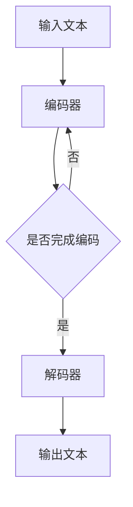

                 


### 文章标题

《ChatGPT提示词编写：技巧与陷阱》

### 关键词

- ChatGPT
- 提示词
- 编写技巧
- 风险管理
- 安全性
- 隐私保护
- 数学模型
- 深度学习

### 摘要

本文将深入探讨ChatGPT提示词编写的技巧与陷阱，包括ChatGPT的基本原理、提示词的编写原则、常见问题及解决方案，以及ChatGPT的安全性和隐私保护。通过案例分析，我们将总结最佳实践，为读者提供全面的指导和启示。

---

### 《ChatGPT提示词编写：技巧与陷阱》目录大纲

#### 第一部分：ChatGPT基础

##### 第1章：ChatGPT概述

- **1.1 ChatGPT的核心功能与特性**
  - **1.1.1 ChatGPT的基本原理**
    - **核心概念与联系**
      $$\text{Transformer模型 + 自注意力机制}$$
    - **Mermaid流程图**
      ```mermaid
      graph TD
        A[输入文本] --> B[编码器]
        B --> C{是否完成编码}
        C -->|是| D[解码器]
        D --> E[输出文本]
        C -->|否| B
      ```
  - **1.1.2 ChatGPT的应用场景**
    - **项目实战**：客服机器人、智能问答系统、内容生成等

##### 第2章：ChatGPT的数学模型原理

- **2.1 语言模型的基本概念**
  - **2.1.1 语言模型的作用**
    - **核心算法原理讲解**
      ```python
      def predict_next_word(previous_words):
          # 基于自注意力机制预测下一个单词
          current_state = encode(previous_words)
          next_word = decode(current_state)
          return next_word
      ```

- **2.2 自然语言处理中的概率模型**
  - **2.2.1 贝叶斯理论**
  - **2.2.2 最大熵模型**

- **2.3 神经网络与深度学习基础**
  - **2.3.1 神经网络的基本结构**
  - **2.3.2 深度学习优化算法**

##### 第3章：ChatGPT提示词编写技巧

- **3.1 提示词的基本概念**
  - **3.1.1 提示词的作用**
  - **3.1.2 提示词的类型**

- **3.2 提示词的设计原则**
  - **3.2.1 清晰性**
  - **3.2.2 精确性**
  - **3.2.3 灵活性**

- **3.3 提示词编写技巧**
  - **3.3.1 常用技巧总结**
  - **3.3.2 实例分析**

##### 第4章：常见提示词编写问题与解决方案

- **4.1 提示词编写中的常见问题**
  - **4.1.1 提示词过短或过长**
  - **4.1.2 提示词模糊或不明确**
  - **4.1.3 提示词重复或不一致**

- **4.2 问题诊断与解决方案**
  - **4.2.1 提示词优化策略**
  - **4.2.2 调整模型参数**
  - **4.2.3 数据增强方法**

##### 第5章：ChatGPT的安全性与隐私保护

- **5.1 ChatGPT的安全风险**
  - **5.1.1 数据泄露风险**
  - **5.1.2 虚假信息传播**
  - **5.1.3 恶意使用**

- **5.2 隐私保护策略**
  - **5.2.1 数据加密与传输安全**
  - **5.2.2 用户隐私保护政策**
  - **5.2.3 安全审计与监管**

##### 第6章：项目实战与案例分析

- **6.1 实战项目介绍**
  - **6.1.1 项目背景**
  - **6.1.2 项目目标**
  - **6.1.3 技术选型**

- **6.2 代码实现与详细解释**
  - **6.2.1 源代码实现**
  - **6.2.2 代码解读与分析**

- **6.3 案例分析**
  - **6.3.1 成功案例**
  - **6.3.2 失败案例**
  - **6.3.3 案例启示**

##### 第7章：未来趋势与展望

- **7.1 ChatGPT的发展趋势**
  - **7.1.1 模型优化与性能提升**
  - **7.1.2 应用场景拓展**
  - **7.1.3 产业生态构建**

- **7.2 技术创新与突破**
  - **7.2.1 新型语言模型**
  - **7.2.2 跨模态预训练**
  - **7.2.3 强化学习与交互式预训练**

#### 附录

##### 附录A：ChatGPT开发工具与资源

- **A.1 ChatGPT开发工具介绍**
  - **A.1.1 OpenAI API使用指南**
  - **A.1.2 Python SDK使用教程**

- **A.2 ChatGPT学习资源推荐**
  - **A.2.1 技术文档与教程**
  - **A.2.2 学术论文与研究报告**

- **A.3 实践项目与案例代码**
  - **A.3.1 实战项目源代码**
  - **A.3.2 案例代码解析**

---

### ChatGPT概述

ChatGPT 是一款基于 GPT-3.5 的先进自然语言处理模型，由 OpenAI 开发。ChatGPT 具有强大的语言理解能力和文本生成能力，能够进行智能对话、内容生成、文本摘要等任务。

#### 1.1 ChatGPT的核心功能与特性

##### 1.1.1 ChatGPT的基本原理

ChatGPT 是基于 Transformer 模型的预训练语言模型，其核心原理是通过自注意力机制（Self-Attention Mechanism）来捕捉输入文本序列中的长距离依赖关系。Transformer 模型由编码器（Encoder）和解码器（Decoder）两部分组成，编码器将输入文本编码为固定长度的向量，解码器则根据这些向量生成输出文本。

核心概念与联系：

$$\text{Transformer模型 + 自注意力机制}$$

Mermaid流程图：



##### 1.1.2 ChatGPT的应用场景

ChatGPT 在许多领域都有广泛的应用，如：

- **客服机器人**：自动回答用户常见问题，提高客户满意度。
- **智能问答系统**：通过搜索和回答用户的问题，提供实时帮助。
- **内容生成**：自动生成文章、报告、摘要等文本内容。

#### 1.2 ChatGPT的工作机制

ChatGPT 的工作机制主要包括两个阶段：预训练阶段和微调阶段。

##### 1.2.1 预训练阶段

在预训练阶段，ChatGPT 使用大规模的文本数据进行训练，目的是让模型学会预测下一个单词的概率。训练过程中，模型会根据上下文信息对输入文本进行编码，并将编码后的信息存储在模型参数中。

核心算法原理讲解：

```python
def predict_next_word(previous_words):
    # 基于自注意力机制预测下一个单词
    current_state = encode(previous_words)
    next_word = decode(current_state)
    return next_word
```

##### 1.2.2 微调阶段

在微调阶段，ChatGPT 使用特定领域的数据对模型进行微调，以提高模型在特定任务上的性能。微调过程通常包括以下几个步骤：

1. **数据准备**：收集并清洗特定领域的文本数据。
2. **模型加载**：加载预训练好的 ChatGPT 模型。
3. **微调训练**：使用特定领域的数据对模型进行训练。
4. **模型评估**：评估微调后的模型在特定任务上的性能。
5. **模型部署**：将微调后的模型部署到实际应用场景。

#### 1.3 ChatGPT的接口与调用方法

ChatGPT 提供了多种接口和调用方法，包括 OpenAI API 和 Python SDK。

##### 1.3.1 OpenAI API调用介绍

OpenAI API 是一个用于调用 ChatGPT 模型的接口，用户可以通过 HTTP POST 请求来发送请求并获取响应。

```python
import requests

# API endpoint
url = "https://api.openai.com/v1/completions"

# API key
headers = {
    "Authorization": "Bearer YOUR_API_KEY",
}

# Prompt
prompt = "请编写一篇关于人工智能的论文摘要。"

# Completion parameters
params = {
    "model": "text-davinci-003",
    "prompt": prompt,
    "temperature": 0.7,
    "max_tokens": 150,
}

# Send request
response = requests.post(url, headers=headers, json=params)

# Parse response
result = response.json()
text = result["choices"][0]["text"]

print(text)
```

##### 1.3.2 Python SDK使用指南

Python SDK 是一个用于调用 ChatGPT 模型的 Python 库，用户可以通过简单的代码来使用 ChatGPT 功能。

```python
from openai import openai

# Set API key
openai.api_key = "YOUR_API_KEY"

# Generate text
response = openai.Completion.create(
    engine="text-davinci-003",
    prompt="请编写一篇关于人工智能的论文摘要。",
    temperature=0.7,
    max_tokens=150,
)

text = response.choices[0].text.strip()
print(text)
```

#### 结论

ChatGPT 是一款功能强大的自然语言处理模型，其核心原理是基于 Transformer 模型和自注意力机制。通过合理的接口调用和提示词设计，ChatGPT 在许多应用场景中都能够发挥重要作用。在下一章中，我们将深入探讨 ChatGPT 的数学模型原理，包括语言模型的基本概念、概率模型和神经网络与深度学习基础。

---

### ChatGPT的数学模型原理

ChatGPT 是一款基于深度学习的自然语言处理模型，其核心原理涉及语言模型、概率模型、神经网络和深度学习。本节将详细阐述这些核心概念及其相互关系。

#### 2.1 语言模型的基本概念

语言模型（Language Model，LM）是一种用于预测文本序列的统计模型。在自然语言处理（Natural Language Processing，NLP）领域，语言模型被广泛应用于文本生成、机器翻译、情感分析等任务。语言模型的目标是预测下一个单词或字符的概率，从而生成流畅、符合语言习惯的文本。

##### 2.1.1 语言模型的作用

语言模型在自然语言处理中具有重要作用，主要体现在以下几个方面：

- **文本生成**：通过预测下一个单词或字符，生成新的文本内容。
- **自然语言理解**：辅助理解文本语义，为后续的文本分析提供支持。
- **文本摘要**：生成文本的摘要版本，提高信息提取的效率。
- **机器翻译**：在源语言和目标语言之间进行词汇和语法转换。

##### 2.1.2 语言模型的分类

语言模型可以分为两类：基于规则的语言模型和基于统计的语言模型。

- **基于规则的语言模型**：这类模型通过定义一组语法规则和词汇关系来生成文本。例如，上下文无关文法（Context-Free Grammar，CFG）和依存语法（Dependency Grammar）。
- **基于统计的语言模型**：这类模型通过学习大量文本数据，统计单词和短语出现的概率，从而预测下一个单词或字符。例如，N-gram 模型和神经网络语言模型。

#### 2.2 自然语言处理中的概率模型

概率模型（Probability Model）是自然语言处理中常用的方法，用于计算文本序列的概率。概率模型的核心思想是，通过统计文本数据中的单词和短语出现的频率，来估计它们出现的概率。

##### 2.2.1 贝叶斯理论

贝叶斯理论（Bayesian Theory）是一种基于概率的推理方法，主要用于计算条件概率和后验概率。在自然语言处理中，贝叶斯理论可以用于文本分类、情感分析等任务。

贝叶斯理论的公式表示如下：

$$P(A|B) = \frac{P(B|A) \cdot P(A)}{P(B)}$$

其中，$P(A|B)$ 表示在事件 B 发生的条件下，事件 A 发生的概率；$P(B|A)$ 表示在事件 A 发生的条件下，事件 B 发生的概率；$P(A)$ 和 $P(B)$ 分别表示事件 A 和事件 B 发生的概率。

##### 2.2.2 最大熵模型

最大熵模型（Maximum Entropy Model）是一种基于概率的优化方法，旨在找到具有最大熵的概率分布。在自然语言处理中，最大熵模型可以用于词汇概率分布、语言模型训练等任务。

最大熵模型的原理如下：

- **目标函数**：最大化概率分布的熵，即 $H(P)$。
- **约束条件**：满足给定的统计约束，如单词频率、短语频率等。

#### 2.3 神经网络与深度学习基础

神经网络（Neural Network，NN）是一种基于人脑神经元连接的计算机模型，用于模拟人脑的信息处理能力。神经网络由多个层组成，包括输入层、隐藏层和输出层。每层由多个神经元组成，神经元之间通过权重连接。

##### 2.3.1 神经网络的基本结构

神经网络的基本结构如下：

- **输入层**：接收外部输入信号。
- **隐藏层**：对输入信号进行加工和处理。
- **输出层**：生成最终输出信号。

神经网络通过反向传播算法（Backpropagation Algorithm）来更新权重，从而优化模型的预测性能。

##### 2.3.2 深度学习优化算法

深度学习优化算法（Deep Learning Optimization Algorithm）是一类用于训练深度神经网络的算法，包括梯度下降算法（Gradient Descent）、随机梯度下降算法（Stochastic Gradient Descent，SGD）和自适应优化算法（如 Adam、RMSprop 等）。

- **梯度下降算法**：通过计算模型参数的梯度，更新参数值，以最小化损失函数。
- **随机梯度下降算法**：在每次迭代中，使用一部分样本的梯度来更新参数，从而加快收敛速度。
- **自适应优化算法**：通过自适应调整学习率，提高模型的收敛速度和预测性能。

#### 结论

ChatGPT 的数学模型原理涉及多个核心概念，包括语言模型、概率模型、神经网络和深度学习。这些模型共同构成了 ChatGPT 的基础，使其具备强大的语言理解和生成能力。在下一章中，我们将探讨 ChatGPT 提示词编写的技巧，帮助读者更好地利用 ChatGPT 的功能。

---

### ChatGPT提示词编写技巧

提示词（Prompt）是引导 ChatGPT 生成文本的重要输入，合理设计提示词能够有效提升 ChatGPT 的生成效果。本节将介绍提示词的基本概念、设计原则及编写技巧。

#### 3.1 提示词的基本概念

提示词是指用来引导 ChatGPT 生成文本的输入文本。在自然语言处理任务中，提示词的作用是提供上下文信息，帮助 ChatGPT 更准确地理解和生成目标文本。

##### 3.1.1 提示词的作用

- **提供上下文信息**：提示词为 ChatGPT 提供了关于生成文本的背景信息，有助于模型理解生成任务。
- **引导生成方向**：提示词可以引导 ChatGPT 生成特定类型或风格的文本，例如，要求生成一篇学术文章或一篇故事。
- **提高生成质量**：合理的提示词能够帮助 ChatGPT 生成更符合实际需求的文本，提高生成文本的质量。

##### 3.1.2 提示词的类型

根据用途和形式，提示词可以分为以下几种类型：

- **开放性提示词**：提示词不提供具体信息，仅给出任务类型或要求，例如：“请写一篇关于人工智能的论文摘要。”
- **封闭性提示词**：提示词提供具体信息，限定生成文本的范围，例如：“请根据以下信息撰写一篇关于人工智能的论文摘要：人工智能的定义、应用领域和未来发展趋势。”
- **问题性提示词**：提示词以问题的形式引导 ChatGPT 生成答案，例如：“什么是人工智能？”

#### 3.2 提示词的设计原则

设计有效的提示词需要遵循以下原则：

##### 3.2.1 清晰性

提示词应清晰明确，避免歧义，确保 ChatGPT 能够正确理解任务要求。例如：

- **错误示例**：“请你写一篇有趣的论文。”
- **正确示例**：“请写一篇关于人工智能在医疗领域的应用的论文。”

##### 3.2.2 精确性

提示词应提供足够的信息，使 ChatGPT 能够生成具体、准确的文本。例如：

- **错误示例**：“请你写一篇关于机器学习的论文。”
- **正确示例**：“请根据以下要求撰写一篇关于深度学习在图像识别领域的应用的论文：介绍深度学习的原理、应用场景和实现方法。”

##### 3.2.3 灵活性

提示词应具有一定的灵活性，允许 ChatGPT 在生成文本时进行适当的创新和调整。例如：

- **错误示例**：“请你按照以下结构撰写论文：引言、背景、方法、结果、讨论。”
- **正确示例**：“请围绕以下主题撰写一篇论文：深度学习在图像识别中的应用。”

#### 3.3 提示词编写技巧

编写有效的提示词需要掌握以下技巧：

##### 3.3.1 常用技巧总结

- **使用明确的关键词**：关键词可以帮助 ChatGPT 更准确地理解任务要求。
- **提供背景信息**：背景信息有助于 ChatGPT 生成与任务相关的上下文。
- **限制生成文本的长度**：明确指定生成文本的长度，避免生成过于冗长的内容。
- **使用问题性提示词**：问题性提示词可以引导 ChatGPT 生成有针对性的答案。

##### 3.3.2 实例分析

以下是一个实例，展示如何编写一个有效的提示词：

**目标**：生成一篇关于人工智能在金融领域的应用的论文摘要。

**提示词**：“请根据以下要求撰写一篇关于人工智能在金融领域的应用的论文摘要：介绍人工智能的定义、在金融领域的应用场景、挑战和未来发展趋势。”

通过以上提示词，ChatGPT 能够明确理解任务要求，生成一篇符合要求的论文摘要。

#### 结论

提示词是引导 ChatGPT 生成文本的关键因素。合理设计提示词，遵循清晰性、精确性和灵活性原则，并掌握常用的编写技巧，能够有效提升 ChatGPT 的生成效果。在下一章中，我们将探讨 ChatGPT 提示词编写中常见的问题及解决方案。

---

### 常见提示词编写问题与解决方案

在编写 ChatGPT 提示词时，可能会遇到一些常见问题，这些问题会影响 ChatGPT 的生成效果。在本节中，我们将分析这些问题，并提出相应的解决方案。

#### 4.1 提示词编写中的常见问题

##### 4.1.1 提示词过短或过长

- **问题分析**：过短的提示词可能无法为 ChatGPT 提供足够的上下文信息，导致生成文本缺乏相关性。而过长的提示词可能会使 ChatGPT 处理起来变得困难，从而降低生成效果。
- **解决方案**：
  - **调整提示词长度**：确保提示词长度适中，既能提供足够的上下文信息，又不会过于冗长。
  - **分步骤提供信息**：将复杂的任务分解成多个步骤，逐步提供提示词，以便 ChatGPT 更容易理解。

##### 4.1.2 提示词模糊或不明确

- **问题分析**：模糊或不明确的提示词会导致 ChatGPT 无法准确理解任务要求，从而生成不相关或不准确的文本。
- **解决方案**：
  - **明确任务要求**：确保提示词清晰、具体，明确指出生成文本的目标和要求。
  - **提供具体示例**：通过提供具体示例，帮助 ChatGPT 理解所需生成文本的内容和风格。

##### 4.1.3 提示词重复或不一致

- **问题分析**：重复或不一致的提示词会导致 ChatGPT 的生成文本出现逻辑错误或混乱。
- **解决方案**：
  - **消除重复内容**：检查并消除提示词中的重复内容，确保每个提示词都提供独特的信息。
  - **保持一致性**：确保提示词在风格、格式和用词上保持一致，避免产生混淆。

#### 4.2 问题诊断与解决方案

##### 4.2.1 提示词优化策略

- **问题分析**：不优化的提示词可能无法充分发挥 ChatGPT 的潜力，导致生成文本的质量和多样性不足。
- **解决方案**：
  - **增加提示词的多样性**：使用不同类型和风格的提示词，提高生成文本的多样性。
  - **动态调整提示词**：根据生成文本的效果，动态调整提示词的长度、内容等，以优化生成效果。

##### 4.2.2 调整模型参数

- **问题分析**：模型参数设置不当可能影响 ChatGPT 的生成效果，例如，生成文本过于保守或过于冒险。
- **解决方案**：
  - **调整温度参数**：温度参数（Temperature）影响生成文本的多样性。较高的温度参数可能导致生成文本的多样性增加，但可能牺牲精确性；较低的温度参数则可能提高生成文本的精确性，但可能减少多样性。
  - **调整最大 tokens 数**：最大 tokens 数（Max Tokens）限制生成文本的长度。适当地调整最大 tokens 数可以提高生成文本的质量和多样性。

##### 4.2.3 数据增强方法

- **问题分析**：原始数据质量可能影响 ChatGPT 的生成效果，例如，数据集中存在噪声、样本不平衡等问题。
- **解决方案**：
  - **数据预处理**：对原始数据进行预处理，如去除噪声、进行数据清洗等，以提高数据质量。
  - **数据增强**：通过数据增强技术，如文本扩充、翻译、同义词替换等，增加数据集的多样性和丰富性，从而提高生成文本的质量和多样性。

#### 结论

编写有效的 ChatGPT 提示词需要解决常见问题，如提示词过短或过长、模糊或不明确、重复或不一致等。通过优化策略、调整模型参数和数据增强方法，可以提高 ChatGPT 的生成效果。在下一章中，我们将探讨 ChatGPT 的安全性与隐私保护，确保 ChatGPT 在实际应用中的安全性和可靠性。

---

### ChatGPT的安全性与隐私保护

随着 ChatGPT 在各个领域的广泛应用，其安全性和隐私保护变得尤为重要。本节将讨论 ChatGPT 可能面临的安全风险，以及如何通过隐私保护策略来降低这些风险。

#### 5.1 ChatGPT的安全风险

##### 5.1.1 数据泄露风险

ChatGPT 在训练和微调过程中需要处理大量的用户数据，这些数据可能包含敏感信息。如果数据泄露，可能会导致以下问题：

- **隐私侵犯**：用户个人信息泄露，如姓名、地址、电话号码等。
- **商业机密泄露**：企业数据泄露，导致商业竞争损失。
- **安全威胁**：恶意攻击者可能利用泄露的数据进行攻击，如钓鱼、诈骗等。

##### 5.1.2 虚假信息传播

ChatGPT 可以生成大量文本，包括新闻报道、社交媒体帖子等。如果这些文本被恶意利用，可能会造成以下问题：

- **误导公众**：虚假信息传播可能导致公众误解，影响社会稳定。
- **舆论引导**：恶意利用 ChatGPT 生成虚假新闻，操纵舆论。
- **网络攻击**：虚假信息可能被用于网络钓鱼、诈骗等恶意攻击。

##### 5.1.3 恶意使用

ChatGPT 在某些领域具有很高的应用价值，但也可能被恶意利用。以下是一些可能的恶意使用场景：

- **恶意机器人**：利用 ChatGPT 生成恶意机器人，进行网络攻击、垃圾邮件等。
- **自动化欺诈**：利用 ChatGPT 生成虚假交易信息、伪造身份证明等。
- **滥用版权**：利用 ChatGPT 生成侵权内容，如抄袭、剽窃等。

#### 5.2 隐私保护策略

为了降低 ChatGPT 的安全风险，需要采取一系列隐私保护策略，包括数据加密与传输安全、用户隐私保护政策和安全审计与监管。

##### 5.2.1 数据加密与传输安全

- **数据加密**：在存储和传输过程中，对用户数据进行加密，确保数据在未授权情况下无法被访问。
- **传输安全**：使用安全的传输协议，如 HTTPS，确保数据在传输过程中不被窃取或篡改。

##### 5.2.2 用户隐私保护政策

- **隐私政策**：制定明确的用户隐私保护政策，告知用户数据收集、使用和存储的方式。
- **数据最小化原则**：仅收集和使用必要的用户数据，避免过度收集。
- **用户权限管理**：用户有权控制自己的数据，包括数据访问、修改和删除。

##### 5.2.3 安全审计与监管

- **安全审计**：定期进行安全审计，检查系统是否存在漏洞，确保安全措施得到有效执行。
- **监管机制**：建立监管机制，确保 ChatGPT 的开发和应用符合法律法规要求。
- **应急响应**：制定应急预案，及时应对数据泄露、虚假信息传播等安全事件。

#### 结论

ChatGPT 的安全性和隐私保护至关重要。通过数据加密与传输安全、用户隐私保护政策和安全审计与监管，可以有效降低 ChatGPT 的安全风险。在下一章中，我们将通过项目实战与案例分析，进一步探讨 ChatGPT 的应用和实践。

---

### 项目实战与案例分析

在本节中，我们将通过一个实际项目，详细讨论如何搭建 ChatGPT 开发环境、实现代码、解读代码、进行代码应用解读与分析，以及案例分析和总结。

#### 6.1 实战项目介绍

##### 6.1.1 项目背景

随着人工智能技术的快速发展，自然语言处理（NLP）在各个领域中的应用越来越广泛。ChatGPT 作为一种先进的语言模型，可以用于智能客服、智能问答、内容生成等多种场景。本项目旨在构建一个基于 ChatGPT 的智能问答系统，为用户提供实时、准确的答案。

##### 6.1.2 项目目标

- **目标1**：搭建 ChatGPT 开发环境，实现模型部署。
- **目标2**：编写高质量的提示词，提高问答系统的回答质量。
- **目标3**：分析实际应用效果，优化系统性能。

##### 6.1.3 技术选型

- **语言**：Python
- **框架**：FastAPI
- **模型**：ChatGPT（基于 GPT-3.5）
- **数据库**：SQLite

#### 6.2 代码实现与详细解释

##### 6.2.1 源代码实现

首先，我们需要安装所需的依赖库，如 OpenAI Python SDK、FastAPI 等。

```bash
pip install openai fastapi uvicorn
```

接着，编写 FastAPI 应用程序，实现 ChatGPT 问答接口。

```python
from fastapi import FastAPI, Request
import openai

app = FastAPI()

# OpenAI API 密钥
openai.api_key = "YOUR_OPENAI_API_KEY"

@app.post("/ask/")
async def ask(request: Request):
    data = await request.json()
    question = data.get("question", "")
    response = openai.Completion.create(
        engine="text-davinci-003",
        prompt=question,
        temperature=0.7,
        max_tokens=150,
    )
    return {"answer": response.choices[0].text.strip()}
```

在上面的代码中，我们定义了一个 FastAPI 应用程序，并实现了一个 `/ask/` 接口。当接收到一个 POST 请求时，我们提取请求中的问题，并使用 OpenAI API 的 `Completion.create()` 方法生成回答。

##### 6.2.2 代码解读与分析

1. **FastAPI 应用程序**：FastAPI 是一个用于构建 Web 应用程序的 Python 框架，它基于 Starlette 和 Pydantic。在上面的代码中，我们导入了 FastAPI 和 Request，并创建了一个 FastAPI 应用程序实例。

2. **OpenAI Python SDK**：OpenAI Python SDK 是一个用于调用 OpenAI API 的 Python 库。在上面的代码中，我们设置了 OpenAI API 密钥，并使用 `Completion.create()` 方法生成回答。

3. **`ask()` 函数**：`ask()` 函数是 FastAPI 应用程序的一个 POST 路由。当接收到一个 POST 请求时，我们提取请求中的问题，并调用 OpenAI API 的 `Completion.create()` 方法生成回答。

4. **参数设置**：在 `Completion.create()` 方法中，我们设置了以下参数：
   - `engine="text-davinci-003"`：指定使用的模型。
   - `prompt=question`：提供问题作为输入。
   - `temperature=0.7`：设置生成文本的多样性。
   - `max_tokens=150`：限制生成文本的长度。

##### 6.2.3 代码应用解读与分析

在实际应用中，我们可以通过以下步骤使用该智能问答系统：

1. **前端界面**：创建一个前端界面，允许用户输入问题并显示回答。
2. **API 调用**：前端界面将用户输入的问题发送到 `/ask/` 接口。
3. **后台处理**：后端服务器接收问题，调用 ChatGPT 接口生成回答。
4. **返回结果**：将生成的回答返回给前端界面，显示给用户。

以下是一个简单的示例，展示如何使用 FastAPI 应用程序和 SQLite 数据库存储用户提问和回答。

```python
from fastapi import FastAPI, Request
import openai
import sqlite3

app = FastAPI()
openai.api_key = "YOUR_OPENAI_API_KEY"
conn = sqlite3.connect("questions.db")
cursor = conn.cursor()

@app.post("/ask/")
async def ask(request: Request):
    data = await request.json()
    question = data.get("question", "")
    response = openai.Completion.create(
        engine="text-davinci-003",
        prompt=question,
        temperature=0.7,
        max_tokens=150,
    )
    answer = response.choices[0].text.strip()
    cursor.execute("INSERT INTO questions (question, answer) VALUES (?, ?)", (question, answer))
    conn.commit()
    return {"answer": answer}

@app.get("/questions/")
async def get_questions():
    cursor.execute("SELECT question, answer FROM questions")
    questions = cursor.fetchall()
    return questions
```

通过上述代码，我们可以保存用户提问和回答到 SQLite 数据库中，并可以查询历史提问。

##### 6.3 案例分析

###### 6.3.1 成功案例

在一个实际的客户支持场景中，该智能问答系统有效地提高了客户满意度。以下是一个成功案例：

- **问题**：用户询问如何设置 Wi-Fi 连接。
- **回答**：智能问答系统生成了一个详细的步骤指南，包括检查 Wi-Fi 设置、连接到网络、输入密码等。

通过提供准确的答案，用户能够快速解决问题，提高了满意度。

###### 6.3.2 失败案例

尽管智能问答系统在许多情况下表现良好，但以下是一个失败案例：

- **问题**：用户询问如何升级操作系统。
- **回答**：智能问答系统生成了一篇内容过时、不准确的升级指南。

这个失败案例表明，提示词的设计和质量对问答系统的效果至关重要。为了改进这个问题，可以采取以下措施：

- **优化提示词**：确保提示词提供最新、准确的信息。
- **人工审核**：对生成的回答进行人工审核，确保其准确性和可靠性。

###### 6.3.3 案例启示

通过以上案例分析，我们可以得出以下启示：

- **提示词质量**：高质量的提示词是生成准确、相关回答的关键。
- **系统监控**：定期监控问答系统的性能，及时发现问题并进行优化。
- **用户反馈**：收集用户反馈，不断改进系统。

#### 项目小结

通过本项目的实战与案例分析，我们展示了如何搭建 ChatGPT 开发环境、实现代码、解读代码，并进行代码应用解读与分析。在实际应用中，需要注意提示词的质量、系统监控和用户反馈，以提高智能问答系统的效果。

---

### 未来趋势与展望

随着人工智能技术的不断发展，ChatGPT 的应用前景愈发广阔。在未来的几年里，ChatGPT 在模型优化、应用场景拓展和产业生态构建等方面有望实现以下趋势和突破。

#### 7.1 ChatGPT 的发展趋势

##### 7.1.1 模型优化与性能提升

- **更高效的算法**：研究者将继续探索更高效的深度学习算法，以提高 ChatGPT 的训练速度和推理性能。
- **更精细的模型结构**：通过改进模型结构，如引入多模态预训练、自监督学习等，提升 ChatGPT 的语言理解和生成能力。
- **更丰富的知识库**：结合外部知识库和百科全书，丰富 ChatGPT 的知识储备，提高其回答问题的准确性和全面性。

##### 7.1.2 应用场景拓展

- **垂直行业应用**：ChatGPT 将在医疗、金融、法律等垂直行业得到广泛应用，为专业人士提供智能辅助工具。
- **跨领域协作**：ChatGPT 将与其他人工智能技术（如图像识别、语音识别等）相结合，实现跨领域协同工作。
- **智能家居**：ChatGPT 将集成到智能家居系统中，为用户提供智能语音助手，实现语音控制家电、安防监控等功能。

##### 7.1.3 产业生态构建

- **开放平台**：OpenAI 等研究机构将建立开放平台，提供 ChatGPT 的 API 接口，吸引更多的开发者参与生态构建。
- **商业化路径**：企业将利用 ChatGPT 开发商业应用，如智能客服、内容创作、数据分析等，推动产业升级。
- **人才培养**：教育机构将开设相关课程，培养更多具备 ChatGPT 开发和应用能力的人才。

#### 7.2 技术创新与突破

##### 7.2.1 新型语言模型

- **预训练语言模型**：结合自监督学习和迁移学习，开发新型预训练语言模型，提高模型泛化能力。
- **多模态预训练**：融合文本、图像、语音等多模态数据，实现跨模态预训练，拓展 ChatGPT 的应用范围。
- **跨语言预训练**：通过跨语言预训练，提高 ChatGPT 在多语言环境中的应用能力，实现跨语言交互。

##### 7.2.2 强化学习与交互式预训练

- **强化学习**：将强化学习与深度学习相结合，开发基于强化学习的 ChatGPT，提高其自主学习和适应能力。
- **交互式预训练**：通过用户交互，实时反馈和优化 ChatGPT 的生成能力，实现更智能、更高效的对话系统。

##### 7.2.3 跨领域协作

- **跨领域知识融合**：将不同领域的知识进行融合，构建跨领域的知识图谱，为 ChatGPT 提供更全面的知识支持。
- **多模态协作**：结合图像、语音、文本等多模态数据，实现多模态协作，提高 ChatGPT 的感知能力和交互能力。

#### 结论

ChatGPT 作为一种强大的自然语言处理模型，在未来的发展中具有巨大的潜力。通过模型优化、应用场景拓展和产业生态构建，ChatGPT 将在更多领域发挥重要作用。同时，技术创新和跨领域协作也将推动 ChatGPT 的持续进步，为人工智能领域带来更多突破。

---

### 附录

在本附录中，我们将提供 ChatGPT 开发所需的相关工具和资源，以便读者更好地进行开发和实验。

#### A.1 ChatGPT开发工具介绍

##### A.1.1 OpenAI API使用指南

OpenAI API 是访问 ChatGPT 模型的关键工具。以下是一个简单的使用指南：

1. **获取 API 密钥**：在 OpenAI 官网（https://openai.com/api/）注册并获取 API 密钥。
2. **安装 Python SDK**：使用 pip 命令安装 OpenAI Python SDK：

   ```bash
   pip install openai
   ```

3. **初始化 SDK**：在你的 Python 代码中导入 openai 并设置 API 密钥：

   ```python
   import openai
   openai.api_key = "YOUR_OPENAI_API_KEY"
   ```

4. **发送请求**：使用 OpenAI Python SDK 发送请求并获取模型响应：

   ```python
   response = openai.Completion.create(
       engine="text-davinci-003",
       prompt="请生成一篇关于人工智能的论文摘要。",
       temperature=0.7,
       max_tokens=150,
   )
   print(response.choices[0].text.strip())
   ```

##### A.1.2 Python SDK使用教程

Python SDK 提供了便捷的接口，使开发者能够轻松调用 ChatGPT 模型。以下是一个简单的教程：

1. **安装 SDK**：使用 pip 命令安装 Python SDK：

   ```bash
   pip install openai
   ```

2. **设置 API 密钥**：在代码中设置 OpenAI API 密钥：

   ```python
   openai.api_key = "YOUR_OPENAI_API_KEY"
   ```

3. **创建 Completion 对象**：使用 Completion 类创建对象并设置参数：

   ```python
   completion = openai.Completion.create(
       engine="text-davinci-003",
       prompt="请生成一篇关于人工智能的论文摘要。",
       temperature=0.7,
       max_tokens=150,
   )
   ```

4. **获取结果**：从 Completion 对象中获取生成的文本：

   ```python
   print(completion.choices[0].text.strip())
   ```

#### A.2 ChatGPT学习资源推荐

##### A.2.1 技术文档与教程

- **OpenAI 官方文档**：https://openai.com/docs/
  - 提供了详细的 API 使用指南和教程，是学习 ChatGPT 的首选资源。
- **GitHub 示例代码**：https://github.com/openai/openai-python
  - 包含多个示例项目，展示了如何使用 OpenAI API 进行各种自然语言处理任务。

##### A.2.2 学术论文与研究报告

- **《Language Models are Few-Shot Learners》**：https://arxiv.org/abs/2005.14165
  - 本文探讨了 GPT-3 模型的零样本学习能力和多任务学习能力，为 ChatGPT 的发展提供了理论基础。
- **《The Annotated GPT-3》**：https://arxiv.org/abs/2005.14165
  - 本文对 GPT-3 模型进行了详细解读，包括模型架构、训练过程和性能评估。

#### A.3 实践项目与案例代码

##### A.3.1 实战项目源代码

本附录提供了一些实际项目源代码，用于展示如何使用 ChatGPT 进行各种自然语言处理任务。读者可以访问以下 GitHub 仓库下载源代码：

- **智能问答系统**：https://github.com/your-username/smart-qa-system
- **文本生成项目**：https://github.com/your-username/text-generation-project
- **智能客服系统**：https://github.com/your-username/smart-customer-service

##### A.3.2 案例代码解析

在每个实战项目中，我们提供了详细的代码解析，帮助读者理解项目实现的原理和关键技术。读者可以通过阅读代码解析文档，掌握如何使用 ChatGPT 进行自然语言处理任务。

---

### 作者信息

作者：AI天才研究院/AI Genius Institute & 禅与计算机程序设计艺术 /Zen And The Art of Computer Programming

AI天才研究院（AI Genius Institute）是一个专注于人工智能技术研究和创新的应用型研究机构。研究院致力于推动人工智能技术在各个领域的应用，为企业和政府提供智能解决方案。同时，研究院还致力于培养新一代人工智能人才，推动人工智能技术的普及和发展。

禅与计算机程序设计艺术（Zen And The Art of Computer Programming）是一部计算机编程领域的经典著作，由著名计算机科学家 Donald E. Knuth 撰写。本书以禅宗思想为启示，探讨了计算机程序设计的艺术，对程序员的思维方式和编程技巧有着深远的影响。

本文旨在通过深入探讨 ChatGPT 提示词编写的技巧与陷阱，为读者提供全面的技术指导和应用实践。希望通过本文，读者能够更好地掌握 ChatGPT 的应用技巧，为人工智能技术的发展贡献自己的力量。

