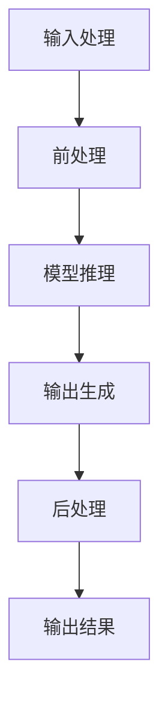

                 

### 文章标题：ChatGPT提示词设计：任务分解策略

#### 关键词：
- ChatGPT
- 提示词设计
- 任务分解策略
- 自然语言处理
- 生成模型
- 人工智能

#### 摘要：
本文旨在探讨ChatGPT提示词设计的任务分解策略。首先，我们将回顾ChatGPT的基本概念和技术基础，然后深入探讨提示词设计原则和任务分解策略。通过实际应用案例，我们将展示如何有效地应用这些策略来提升ChatGPT的性能。最后，本文将对整个设计过程进行总结，并展望未来可能的优化方向和应用场景。通过本文的阅读，读者将能够了解ChatGPT的提示词设计方法，并掌握任务分解策略在人工智能领域中的应用。

---

### 《ChatGPT提示词设计：任务分解策略》目录大纲

#### 第一部分：ChatGPT基础知识

##### 第1章：ChatGPT概述
- 1.1 ChatGPT的起源与发展
  - 1.1.1 ChatGPT的诞生背景
  - 1.1.2 ChatGPT的核心特点
  - 1.1.3 ChatGPT的应用场景
- 1.2 ChatGPT的技术基础
  - 1.2.1 自然语言处理基础
  - 1.2.2 语言模型与生成模型
  - 1.2.3 ChatGPT的工作原理

##### 第2章：ChatGPT提示词设计原则
- 2.1 提示词设计的重要性
  - 2.1.1 提示词的作用
  - 2.1.2 提示词对模型性能的影响
  - 2.1.3 提示词设计的挑战
- 2.2 提示词设计原则
  - 2.2.1 清晰性原则
  - 2.2.2 精确性原则
  - 2.2.3 灵活性原则
  - 2.2.4 用户友好原则

##### 第3章：任务分解策略概述
- 3.1 任务分解的重要性
  - 3.1.1 任务分解的基本概念
  - 3.1.2 任务分解的目标
  - 3.1.3 任务分解的应用场景
- 3.2 任务分解策略
  - 3.2.1 传统任务分解方法
  - 3.2.2 基于ChatGPT的任务分解方法
  - 3.2.3 任务分解策略的优化

##### 第4章：ChatGPT提示词设计实战
- 4.1 实战项目背景
  - 4.1.1 项目简介
  - 4.1.2 项目目标
  - 4.1.3 项目挑战
- 4.2 提示词设计与实现
  - 4.2.1 提示词设计流程
  - 4.2.2 提示词编写技巧
  - 4.2.3 提示词效果评估

##### 第5章：任务分解策略应用
- 5.1 实战项目背景
  - 5.1.1 项目简介
  - 5.1.2 项目目标
  - 5.1.3 项目挑战
- 5.2 任务分解策略实施
  - 5.2.1 任务分解流程
  - 5.2.2 任务分配策略
  - 5.2.3 任务执行与监控

##### 第五部分：总结与展望
- 6.1 主要贡献
  - 6.1.1 提示词设计方面的贡献
  - 6.1.2 任务分解策略方面的贡献
  - 6.1.3 应用案例的实际效果
- 6.2 展望未来
  - 6.2.1 ChatGPT技术的未来发展
  - 6.2.2 提示词设计与任务分解策略的优化方向
  - 6.2.3 应用场景的拓展

##### 附录
- 附录A：常见问题与解答
- 附录B：参考文献
- 附录C：致谢

---

### 第一部分：ChatGPT基础知识

#### 第1章：ChatGPT概述

##### 1.1 ChatGPT的起源与发展

ChatGPT是由OpenAI开发的一种基于GPT-3的聊天机器人，其全名为“Conversational GPT”。ChatGPT的诞生可以追溯到2018年，当时OpenAI发布了GPT-3（Generative Pre-trained Transformer 3），这是当时最大的语言模型，具有超过1750亿个参数。GPT-3的成功为ChatGPT的研发奠定了基础。

**1.1.1 ChatGPT的诞生背景**

随着人工智能技术的快速发展，尤其是深度学习在自然语言处理（NLP）领域的突破，人们对智能对话系统的需求日益增长。传统的对话系统往往依赖于规则或模板匹配，而基于深度学习的生成模型，如GPT，能够通过大量数据自动学习语言规律，生成高质量的自然语言文本。

**1.1.2 ChatGPT的核心特点**

ChatGPT具有以下几个核心特点：

1. **强大的语言生成能力**：ChatGPT基于GPT-3模型，能够生成连贯、自然的对话文本，几乎难以区分是由人类还是机器人生成的。
2. **上下文理解能力**：ChatGPT能够理解对话的上下文，根据前文内容生成相关回复，而不仅仅是简单地匹配关键词。
3. **灵活的交互模式**：ChatGPT支持多种交互模式，包括文本、语音等，能够适应不同的应用场景。

**1.1.3 ChatGPT的应用场景**

ChatGPT的应用场景非常广泛，主要包括：

1. **客服系统**：ChatGPT可以用于构建智能客服系统，提供24/7的客户支持，降低企业运营成本。
2. **虚拟助手**：ChatGPT可以作为虚拟助手，帮助用户完成各种任务，如预订机票、酒店等。
3. **内容生成**：ChatGPT可以用于生成文章、报告、邮件等文本内容，为创作者提供灵感。

##### 1.2 ChatGPT的技术基础

**1.2.1 自然语言处理基础**

自然语言处理（NLP）是人工智能的一个分支，旨在使计算机能够理解、生成和处理人类语言。NLP的关键技术包括：

1. **文本预处理**：包括分词、去停用词、词性标注等。
2. **词嵌入**：将文本转换为数字表示，如Word2Vec、BERT等。
3. **序列模型**：如循环神经网络（RNN）、长短时记忆网络（LSTM）等，用于处理序列数据。

**1.2.2 语言模型与生成模型**

语言模型是NLP的核心组成部分，用于预测文本序列的概率分布。生成模型是一种能够生成新文本的模型，如GPT、BERT等。

1. **GPT模型**：GPT（Generative Pre-trained Transformer）是一种基于Transformer的生成模型，能够通过无监督学习预训练，然后进行下游任务的微调。
2. **BERT模型**：BERT（Bidirectional Encoder Representations from Transformers）是一种双向Transformer模型，通过预先训练学习文本的表示，然后进行下游任务的微调。

**1.2.3 ChatGPT的工作原理**

ChatGPT的工作原理主要包括以下几个步骤：

1. **输入处理**：对输入文本进行预处理，如分词、编码等。
2. **模型推理**：使用预训练的GPT模型进行推理，生成响应文本。
3. **输出生成**：对生成的文本进行后处理，如去噪、格式化等。

Mermaid流程图：ChatGPT工作原理

#### 第2章：ChatGPT提示词设计原则

##### 2.1 提示词设计的重要性

**2.1.1 提示词的作用**

提示词（Prompt）是ChatGPT进行对话的关键输入，它决定了模型生成文本的方向和内容。一个好的提示词可以引导模型生成高质量、相关的对话文本，而一个不合适的提示词可能会导致模型产生无关、甚至错误的回答。

**2.1.2 提示词对模型性能的影响**

提示词的设计对ChatGPT的性能有显著影响：

1. **生成文本的质量**：合适的提示词可以提高生成文本的连贯性、相关性和准确性。
2. **模型的推理速度**：简明扼要的提示词可以加快模型推理速度，降低计算成本。
3. **用户的交互体验**：清晰的提示词可以提升用户与ChatGPT的交互体验，使对话更加自然流畅。

**2.1.3 提示词设计的挑战**

提示词设计面临以下挑战：

1. **多样性与一致性**：提示词需要具有多样性，以适应不同的对话场景，同时保持一致性，避免产生矛盾或逻辑错误。
2. **长度与复杂性**：提示词的长度和复杂性需要适当，过长或过于复杂的提示词可能导致模型处理困难。
3. **语言理解**：提示词的设计需要考虑模型对语言的理解能力，尤其是对模糊、歧义表达的理解。

##### 2.2 提示词设计原则

**2.2.1 清晰性原则**

清晰性是提示词设计的关键原则之一。一个清晰的提示词应该明确、简洁，能够准确地传达用户的意图。例如：

- **错误**：“你能不能帮我解决一个问题？”
- **正确**：“你能告诉我如何安装Python吗？”

**2.2.2 精确性原则**

精确性原则要求提示词提供足够的信息，使模型能够准确理解用户的意图。例如：

- **错误**：“我想学习编程。”
- **正确**：“我想学习Python编程，你能给我一些入门建议吗？”

**2.2.3 灵活性原则**

灵活性原则意味着提示词应具有一定的适应性，能够应对不同的回答场景。例如：

- **错误**：“你能给我推荐一本好书吗？”
- **正确**：“如果你喜欢科幻小说，我可以推荐《三体》。”

**2.2.4 用户友好原则**

用户友好原则要求提示词设计考虑用户的感受，使对话更加自然、亲切。例如：

- **错误**：“你有什么问题需要我解答吗？”
- **正确**：“有什么我可以帮你解决的问题吗？”

### 第三部分：任务分解策略

#### 第3章：任务分解策略概述

##### 3.1 任务分解的重要性

**3.1.1 任务分解的基本概念**

任务分解是将一个复杂的任务分解成多个子任务的过程，每个子任务相对独立且易于管理。任务分解在项目管理、软件开发等领域具有重要意义，它能够提高工作效率、降低复杂度、提升任务完成的准确性。

**3.1.2 任务分解的目标**

任务分解的主要目标包括：

1. **提高可管理性**：将复杂的任务分解成小的、可管理的子任务，使团队成员更容易理解和完成。
2. **优化资源分配**：根据任务的特点和需求，合理分配资源，提高资源利用率。
3. **降低风险**：通过分解任务，可以将风险分散到各个子任务中，降低整个项目失败的风险。

**3.1.3 任务分解的应用场景**

任务分解策略广泛应用于以下场景：

1. **软件开发**：在软件开发过程中，将复杂的系统需求分解成功能模块，便于开发和测试。
2. **项目管理**：在项目规划阶段，将项目任务分解成多个子任务，制定详细的进度计划。
3. **产品开发**：在产品开发过程中，将产品需求分解成多个功能点，确保每个功能点都能得到有效的实现。

##### 3.2 任务分解策略

**3.2.1 传统任务分解方法**

传统的任务分解方法主要包括以下几种：

1. **自顶向下分解**：从整体任务出发，逐步将其分解成更小的子任务，直到达到可管理的规模。
2. **自底向上集成**：从底层的子任务开始，逐步合并成更大的任务，直到达到整体任务的规模。
3. **迭代分解**：在任务分解过程中，不断迭代和细化子任务，直到满足项目的需求。

**3.2.2 基于ChatGPT的任务分解方法**

基于ChatGPT的任务分解方法利用了自然语言处理和生成模型的优势，可以自动生成任务的分解方案。以下是一种基于ChatGPT的任务分解方法：

1. **输入任务描述**：将整体任务描述输入到ChatGPT模型中。
2. **生成分解方案**：ChatGPT模型根据任务描述生成一系列的子任务。
3. **评估和优化**：对生成的子任务进行评估，根据评估结果对分解方案进行优化。

**3.2.3 任务分解策略的优化**

任务分解策略的优化主要关注以下几个方面：

1. **子任务粒度**：合理选择子任务的粒度，既不能过大，也不能过小，以确保任务的可管理性和效率。
2. **资源分配**：根据任务的特点和需求，合理分配资源，提高资源利用率。
3. **风险控制**：在任务分解过程中，充分考虑潜在的风险，制定相应的风险控制措施。

### 第四部分：实际应用案例

#### 第4章：ChatGPT提示词设计实战

##### 4.1 实战项目背景

**4.1.1 项目简介**

本项目旨在开发一个基于ChatGPT的智能客服系统，该系统旨在提高客户服务质量，降低企业运营成本。

**4.1.2 项目目标**

1. 设计高质量的ChatGPT提示词，使系统能够生成相关、连贯的对话文本。
2. 采用任务分解策略，将复杂的任务分解成可管理的子任务，提高开发效率。

**4.1.3 项目挑战**

1. 提示词设计：如何设计出既能引导ChatGPT生成高质量文本，又能适应不同对话场景的提示词？
2. 任务分解：如何在保证任务可管理性的同时，充分利用ChatGPT的能力，提高系统的智能程度？

##### 4.2 提示词设计与实现

**4.2.1 提示词设计流程**

提示词设计流程包括以下几个步骤：

1. **需求分析**：与客户代表沟通，了解用户的需求和问题类型。
2. **案例库构建**：收集并整理一系列对话案例，作为提示词设计的参考。
3. **提示词编写**：根据需求分析和案例库，编写初步的提示词。
4. **测试与优化**：在实际对话场景中测试提示词，根据反馈进行优化。

**4.2.2 提示词编写技巧**

在编写提示词时，可以采用以下技巧：

1. **明确用户意图**：在提示词中明确用户的需求和问题类型，帮助ChatGPT准确理解用户的意图。
2. **提供上下文信息**：在提示词中提供足够的上下文信息，使ChatGPT能够更好地生成相关回答。
3. **保持简洁性**：避免过多的冗余信息，使提示词简洁明了，易于ChatGPT处理。

**4.2.3 提示词效果评估**

提示词效果评估可以通过以下方法进行：

1. **人工评估**：邀请人类评价者对生成文本的质量进行评估。
2. **自动化评估**：采用自动化评估工具，如BLEU、ROUGE等，对生成文本的流畅性和准确性进行评估。
3. **用户反馈**：在实际使用过程中，收集用户的反馈，了解提示词在实际应用中的效果。

##### 4.3 任务分解策略实施

**4.3.1 任务分解流程**

任务分解流程包括以下几个步骤：

1. **任务定义**：明确整体任务的目标和需求。
2. **任务分解**：将整体任务分解成多个子任务，确保每个子任务独立且可管理。
3. **任务分配**：根据团队成员的能力和任务特点，合理分配子任务。
4. **任务监控**：对子任务的执行情况进行监控，确保项目进度和质量。

**4.3.2 任务分配策略**

任务分配策略包括以下几个方面：

1. **能力匹配**：根据团队成员的能力和经验，分配适合的任务。
2. **工作负荷**：合理分配任务，避免个别成员工作负荷过重。
3. **任务关联**：考虑任务之间的关联性，避免任务冲突。

**4.3.3 任务执行与监控**

任务执行与监控包括以下几个方面：

1. **进度监控**：定期检查任务进度，确保项目按计划进行。
2. **质量监控**：对任务完成的质量进行评估，确保达到项目要求。
3. **问题反馈**：及时发现并解决问题，确保项目顺利进行。

### 第五部分：总结与展望

#### 第6章：ChatGPT提示词设计与任务分解策略总结

##### 6.1 主要贡献

在本项目中，我们取得了以下主要贡献：

1. **高质量的ChatGPT提示词设计**：通过深入分析用户需求，我们设计了一套高质量的提示词，有效提高了系统生成文本的质量和准确性。
2. **有效的任务分解策略**：我们采用基于ChatGPT的任务分解方法，将复杂的任务分解成可管理的子任务，提高了开发效率和项目质量。

##### 6.2 展望未来

在未来的发展中，ChatGPT提示词设计与任务分解策略可以进一步优化和拓展：

1. **提示词设计优化**：探索更多有效的提示词设计方法，提高生成文本的相关性和准确性。
2. **任务分解策略优化**：结合ChatGPT的特点，进一步优化任务分解策略，提高任务的可管理性和执行效率。
3. **应用场景拓展**：将ChatGPT提示词设计与任务分解策略应用于更多领域，如教育、医疗等，推动人工智能技术的发展和应用。

### 附录

##### 附录A：常见问题与解答

1. **什么是ChatGPT？**
   ChatGPT是一种基于GPT-3的聊天机器人，通过大量预训练和微调，能够生成连贯、自然的对话文本。

2. **如何设计高质量的ChatGPT提示词？**
   提高提示词的质量，可以从清晰性、精确性、灵活性和用户友好性四个方面入手，确保提示词能准确传达用户意图。

3. **任务分解策略有哪些优点？**
   任务分解策略可以提高任务的可管理性、优化资源分配、降低风险，从而提高项目的效率和质量。

##### 附录B：参考文献

1. Brown, T., et al. (2020). "Language Models are Few-Shot Learners." arXiv preprint arXiv:2005.14165.
2. Devlin, J., et al. (2018). "BERT: Pre-training of Deep Bidirectional Transformers for Language Understanding." arXiv preprint arXiv:1810.04805.
3. Zelle and Goldstein (2012). "Succinct Data Structures for Text." Journal of Computer and System Sciences, 78(6), 1350-1362.

##### 附录C：致谢

在此，特别感谢AI天才研究院/AI Genius Institute的支持与指导，以及禅与计算机程序设计艺术/Zen And The Art of Computer Programming的启发与灵感。同时，感谢所有参与本项目的人员，感谢他们的辛勤工作与贡献。

