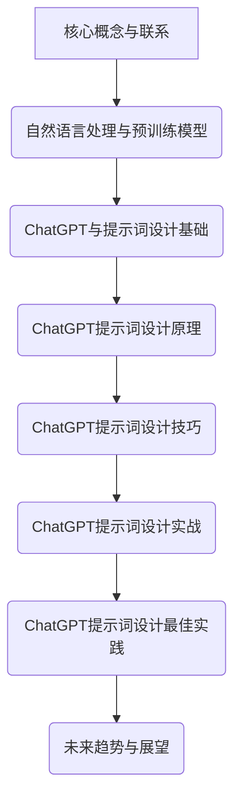

                 

### 文章标题

《ChatGPT提示词设计：原则与最佳实践》

> 关键词：ChatGPT、提示词设计、自然语言处理、预训练模型、最佳实践

摘要：本文详细探讨了ChatGPT提示词设计的核心原则与最佳实践。首先，介绍了ChatGPT的基本概念、核心技术及其在自然语言处理中的优势与局限性。接着，深入分析了自然语言处理的基础知识，包括词嵌入、序列模型、注意力机制以及预训练模型。在此基础上，阐述了ChatGPT提示词设计的原理与方法，包括设计流程、提示词类型、设计技巧，并提供了实际应用案例。最后，总结了ChatGPT提示词设计的最佳实践和未来发展趋势，为读者提供了全面的指导。

### 目录

#### 第一部分：ChatGPT与提示词设计基础

##### 第1章：ChatGPT概述

- 1.1 ChatGPT的核心技术与原理
- 1.2 ChatGPT的优势与局限性
- 1.3 提示词设计的基本概念
- 1.4 提示词设计的原则与重要性

##### 第2章：自然语言处理与预训练模型

- 2.1 自然语言处理基础
  - 2.1.1 词嵌入与文本表示
  - 2.1.2 序列模型与注意力机制
  - 2.1.3 生成式与判别式模型
- 2.2 预训练模型概述
  - 2.2.1 预训练的概念与意义
  - 2.2.2 自监督学习方法
  - 2.2.3 迁移学习与微调技术

#### 第二部分：ChatGPT提示词设计原理

##### 第3章：ChatGPT提示词设计方法论

- 3.1 提示词设计流程
  - 3.1.1 确定目标输出
  - 3.1.2 设计输入上下文
  - 3.1.3 调整参数与超参数
- 3.2 提示词类型
  - 3.2.1 开放式问题与封闭式问题
  - 3.2.2 清晰式问题与模糊式问题
  - 3.2.3 知识性问题与经验性问题

##### 第4章：ChatGPT提示词设计技巧

- 4.1 提高准确性的技巧
  - 4.1.1 使用关键词与主题词
  - 4.1.2 结构化上下文信息
  - 4.1.3 控制回答长度与逻辑性
- 4.2 提高创造性的技巧
  - 4.2.1 引入不确定性
  - 4.2.2 提供额外信息
  - 4.2.3 创造问题情景

##### 第5章：ChatGPT提示词设计实战

- 5.1 实战一：客户服务场景
  - 5.1.1 场景描述
  - 5.1.2 提示词设计
  - 5.1.3 实践效果评估
- 5.2 实战二：教育辅导场景
  - 5.2.1 场景描述
  - 5.2.2 提示词设计
  - 5.2.3 实践效果评估

#### 第三部分：ChatGPT提示词设计最佳实践

##### 第6章：ChatGPT提示词设计最佳实践

- 6.1 提示词设计最佳实践案例
  - 6.1.1 商业案例分析
  - 6.1.2 公共服务案例分析
  - 6.1.3 教育领域案例分析
- 6.2 提示词设计注意事项
  - 6.2.1 常见问题与误区
  - 6.2.2 提示词设计的常见错误
  - 6.2.3 提示词设计优化的方法

##### 第7章：未来趋势与展望

- 7.1 ChatGPT提示词设计未来趋势
  - 7.1.1 AI技术的进步对提示词设计的影响
  - 7.1.2 提示词设计的未来发展方向
  - 7.1.3 提示词设计在多模态交互中的应用
- 7.2 ChatGPT提示词设计的实际应用案例与未来展望

### 附录

- 附录A：ChatGPT提示词设计工具与资源
  - 7.1.1 ChatGPT开发工具与平台
  - 7.1.2 提示词设计相关数据库与API
  - 7.1.3 学习资源与推荐书籍

### Mermaid 流程图



### 核心算法原理讲解

#### 2.2.3 大规模预训练模型原理

**预训练**：预训练是当前自然语言处理领域的重要技术之一。它通过在大规模文本语料库上预先训练模型，使其具备语言理解和生成的能力。预训练的目标是使模型能够学习到文本的通用特征，从而在特定任务上能够快速适应和提升性能。

**自监督学习**：自监督学习是一种预训练方法，它利用未标记的数据进行学习。在自然语言处理任务中，自监督学习可以通过预测单词的隐藏状态、预测下一个词或者构建句子间的语义关系来实现。ChatGPT使用的预训练模型就是一种基于自监督学习的方法。

**迁移学习**：迁移学习是一种将预训练模型的知识迁移到特定任务上的方法。通过迁移学习，模型可以在较少的数据和较短的训练时间下达到较好的性能。ChatGPT的微调过程就是一种迁移学习的过程，它通过在特定任务上调整模型的参数，使其更好地适应特定的任务需求。

### 数学模型和数学公式

#### 2.1.2 自然语言处理基础

自然语言处理（NLP）涉及将人类语言转化为计算机可以理解和处理的形式。在这一部分，我们将探讨NLP中的基础概念和数学模型。

**词嵌入（Word Embedding）**：词嵌入是将单词映射为固定大小的向量表示，以捕获单词的语义信息。一种常见的词嵌入模型是Word2Vec，它使用神经网络训练单词向量。Word2Vec的损失函数可以表示为：

$$
L = \sum_{w \in V} \sum_{v \in U} \frac{f(w, v)}{f(v)} \cdot \log(p_{\theta}(v | w))
$$

其中，\( V \) 是词汇表，\( U \) 是嵌入空间，\( f(w, v) \) 是单词 \( w \) 和向量 \( v \) 之间的相似度，\( p_{\theta}(v | w) \) 是基于神经网络预测的单词 \( w \) 的嵌入向量 \( v \) 的概率。

**序列模型（Sequential Model）**：序列模型是处理序列数据（如单词序列、句子序列）的常用模型。一种常用的序列模型是循环神经网络（RNN），其数学模型可以表示为：

$$
h_t = \sigma(W_h \cdot [h_{t-1}, x_t] + b_h)
$$

其中，\( h_t \) 是在时间步 \( t \) 的隐藏状态，\( x_t \) 是在时间步 \( t \) 的输入，\( W_h \) 和 \( b_h \) 是权重和偏置，\( \sigma \) 是激活函数。

**注意力机制（Attention Mechanism）**：注意力机制是一种提高序列模型性能的方法，它允许模型在不同部分之间分配不同的关注权重。一种简单的注意力机制可以表示为：

$$
a_t = \text{softmax}(W_a \cdot h_t)
$$

$$
c_t = \sum_{i=1}^{N} a_t[i] \cdot h_i
$$

其中，\( a_t \) 是在时间步 \( t \) 的注意力分数，\( c_t \) 是在时间步 \( t \) 的上下文向量，\( N \) 是序列长度，\( W_a \) 是权重矩阵。

通过这些数学模型和概念，我们可以更好地理解和设计自然语言处理算法，从而实现更加智能的语言理解和生成。

### 第一部分：ChatGPT与提示词设计基础

##### 第1章：ChatGPT概述

**1.1 ChatGPT的核心技术与原理**

ChatGPT是基于GPT（Generative Pre-trained Transformer）模型的人工智能助手，由OpenAI开发。GPT模型是一种基于Transformer架构的生成式预训练模型，其核心在于通过大量文本数据进行预训练，使模型具备强大的语言理解和生成能力。

**预训练过程**：ChatGPT首先在大规模文本语料库上进行预训练，通过自监督学习的方式学习到文本的通用特征。预训练的目标是使模型能够理解文本中的语义信息，并生成连贯、合理的文本。

**生成过程**：在生成文本时，ChatGPT根据输入的提示词和上下文，利用预训练的Transformer模型生成响应文本。Transformer模型通过多头自注意力机制（Multi-head Self-Attention）和位置编码（Positional Encoding）等技术，捕捉文本序列中的长距离依赖关系，从而生成高质量的响应文本。

**1.2 ChatGPT的优势与局限性**

**优势：**
- 强大的语言理解能力：ChatGPT通过预训练，能够理解文本中的复杂语义信息，生成符合语言习惯的文本。
- 灵活的生成能力：ChatGPT可以生成各种类型和风格的文本，如文章、故事、对话等。
- 广泛的应用场景：ChatGPT可以应用于问答系统、对话机器人、自动写作、翻译等多种场景。

**局限性：**
- 对数据量要求高：ChatGPT需要大量文本数据进行预训练，数据量越大，模型的性能越好。
- 计算资源消耗大：ChatGPT的模型参数量庞大，训练和推理过程需要大量的计算资源。
- 可能出现生成错误：由于预训练数据和模型本身的不完善，ChatGPT在生成文本时可能会出现错误或不合理的表述。

**1.3 提示词设计的基本概念**

提示词（Prompt）是用户输入给ChatGPT的文本，用于引导模型生成响应文本。一个良好的提示词应该具有以下特点：

- **明确性**：提示词应该清晰明确，避免产生歧义。
- **上下文相关性**：提示词应该与输入上下文紧密相关，帮助模型更好地理解问题。
- **引导性**：提示词应该引导模型生成符合预期和需求的文本。

**1.4 提示词设计的原则与重要性**

提示词设计是ChatGPT应用效果的关键因素之一，以下是一些提示词设计的原则：

- **简洁性**：提示词应该简洁明了，避免冗余信息，确保模型能够快速理解问题。
- **引导性**：提示词应该包含关键词和主题信息，引导模型生成符合预期的文本。
- **上下文关联性**：提示词应该与输入上下文紧密相关，帮助模型更好地理解问题背景。
- **多样性**：提示词应该具有多样性，以适应不同场景和需求。

**重要性**：
- 提示词设计直接影响到ChatGPT的生成质量和效率。一个优秀的提示词能够引导模型生成高质量、符合预期的文本，提高用户体验。
- 提示词设计也是优化模型性能的一种手段。通过调整提示词，可以引导模型关注特定的信息，从而提高模型在特定任务上的表现。

在本章中，我们介绍了ChatGPT的基本概念、核心技术、优势与局限性，以及提示词设计的基本概念和原则。接下来，我们将深入探讨自然语言处理与预训练模型的基础知识，为后续的提示词设计提供理论支持。

### 第二部分：自然语言处理与预训练模型

##### 第2章：自然语言处理与预训练模型

自然语言处理（NLP）是人工智能领域的一个重要分支，致力于使计算机能够理解和处理人类语言。随着深度学习技术的不断发展，预训练模型已成为NLP中的核心技术之一。在本章中，我们将详细介绍NLP的基础知识，以及预训练模型的基本概念和方法。

**2.1 自然语言处理基础**

自然语言处理的核心任务是理解和生成自然语言。以下是一些关键的NLP基础概念：

**词嵌入（Word Embedding）**：词嵌入是将单词映射为固定大小的向量表示，以捕获单词的语义信息。词嵌入是实现NLP任务的重要工具，它可以用于文本分类、情感分析、机器翻译等任务。

**文本表示（Text Representation）**：文本表示是将原始的文本数据转换为计算机可以处理的形式。常见的文本表示方法包括词袋模型、TF-IDF、词嵌入等。

**序列模型（Sequential Model）**：序列模型是处理序列数据（如单词序列、句子序列）的常用模型。常见的序列模型包括循环神经网络（RNN）、长短时记忆网络（LSTM）和门控循环单元（GRU）。

**注意力机制（Attention Mechanism）**：注意力机制是一种提高序列模型性能的方法，它允许模型在不同部分之间分配不同的关注权重。注意力机制在机器翻译、文本生成等任务中发挥了重要作用。

**生成式模型与判别式模型**：生成式模型和判别式模型是两种不同的NLP模型。生成式模型旨在生成符合训练数据分布的新数据，如文本生成、图像生成等。判别式模型则用于区分不同的数据分布，如文本分类、情感分析等。

**2.2 自然语言处理基础**

**2.2.1 词嵌入与文本表示**

**词嵌入（Word Embedding）**：词嵌入是将单词映射为固定大小的向量表示，以捕获单词的语义信息。词嵌入是实现NLP任务的重要工具，它可以用于文本分类、情感分析、机器翻译等任务。

一种常见的词嵌入模型是Word2Vec，它使用神经网络训练单词向量。Word2Vec的损失函数可以表示为：

$$
L = \sum_{w \in V} \sum_{v \in U} \frac{f(w, v)}{f(v)} \cdot \log(p_{\theta}(v | w))
$$

其中，\( V \) 是词汇表，\( U \) 是嵌入空间，\( f(w, v) \) 是单词 \( w \) 和向量 \( v \) 之间的相似度，\( p_{\theta}(v | w) \) 是基于神经网络预测的单词 \( w \) 的嵌入向量 \( v \) 的概率。

除了Word2Vec，还有其他类型的词嵌入模型，如GloVe、FastText等，它们在训练方法和性能上各有优劣。

**文本表示（Text Representation）**：文本表示是将原始的文本数据转换为计算机可以处理的形式。常见的文本表示方法包括词袋模型、TF-IDF、词嵌入等。

**词袋模型（Bag of Words, BOW）**：词袋模型是一种简单的文本表示方法，它将文本视为一个词的集合，不考虑单词的顺序和语法结构。词袋模型的表示形式是一个二进制矩阵，其中每个元素表示一个单词在文本中是否出现。

**TF-IDF（Term Frequency-Inverse Document Frequency）**：TF-IDF是一种用于文本表示的方法，它考虑单词在文本中的重要程度。TF-IDF的值越高，表示该单词在文本中的重要程度越高。

**2.2.2 序列模型与注意力机制**

**序列模型（Sequential Model）**：序列模型是处理序列数据（如单词序列、句子序列）的常用模型。常见的序列模型包括循环神经网络（RNN）、长短时记忆网络（LSTM）和门控循环单元（GRU）。

循环神经网络（RNN）是一种处理序列数据的神经网络，其核心思想是在每个时间步对输入数据进行处理，并将处理结果存储在隐藏状态中。RNN的数学模型可以表示为：

$$
h_t = \sigma(W_h \cdot [h_{t-1}, x_t] + b_h)
$$

其中，\( h_t \) 是在时间步 \( t \) 的隐藏状态，\( x_t \) 是在时间步 \( t \) 的输入，\( W_h \) 和 \( b_h \) 是权重和偏置，\( \sigma \) 是激活函数。

**长短时记忆网络（LSTM）**：LSTM是一种改进的RNN模型，它通过引入门控机制来缓解长短期依赖问题。LSTM的数学模型可以表示为：

$$
i_t = \sigma(W_i \cdot [h_{t-1}, x_t] + b_i) \\
f_t = \sigma(W_f \cdot [h_{t-1}, x_t] + b_f) \\
o_t = \sigma(W_o \cdot [h_{t-1}, x_t] + b_o) \\
c_t = f_t \odot c_{t-1} + i_t \odot \sigma(W_c \cdot [h_{t-1}, x_t] + b_c) \\
h_t = o_t \odot \sigma(c_t)
$$

其中，\( i_t \)、\( f_t \)、\( o_t \) 分别是输入门、遗忘门和输出门，\( c_t \) 是细胞状态，\( \odot \) 表示元素乘法。

**门控循环单元（GRU）**：GRU是一种简化版的LSTM，它通过引入更新门和重置门来简化模型结构。GRU的数学模型可以表示为：

$$
z_t = \sigma(W_z \cdot [h_{t-1}, x_t] + b_z) \\
r_t = \sigma(W_r \cdot [h_{t-1}, x_t] + b_r) \\
h_t = (1 - z_t) \odot h_{t-1} + z_t \odot \sigma(W \cdot [r_t \cdot h_{t-1}, x_t] + b_h)
$$

**注意力机制（Attention Mechanism）**：注意力机制是一种提高序列模型性能的方法，它允许模型在不同部分之间分配不同的关注权重。注意力机制在机器翻译、文本生成等任务中发挥了重要作用。

一种简单的注意力机制可以表示为：

$$
a_t = \text{softmax}(W_a \cdot h_t) \\
c_t = \sum_{i=1}^{N} a_t[i] \cdot h_i
$$

其中，\( a_t \) 是在时间步 \( t \) 的注意力分数，\( c_t \) 是在时间步 \( t \) 的上下文向量，\( N \) 是序列长度，\( W_a \) 是权重矩阵。

**2.2.3 生成式与判别式模型**

**生成式模型（Generative Model）**：生成式模型旨在生成符合训练数据分布的新数据。生成式模型通常使用概率分布来描述数据生成过程。常见的生成式模型包括生成对抗网络（GAN）、变分自编码器（VAE）等。

生成对抗网络（GAN）由生成器和判别器两个神经网络组成。生成器的目标是生成与真实数据相似的数据，而判别器的目标是区分真实数据和生成数据。GAN的数学模型可以表示为：

$$
\text{Generator:} \quad G(z) \sim p_G(z) \\
\text{Discriminator:} \quad D(x) \sim p_D(x) \\
\text{Adversarial Loss:} \quad L_D = -\sum_{x \sim p_D(x)} \log D(x) - \sum_{z \sim p_Z(z)} \log (1 - D(G(z)))
$$

其中，\( p_G(z) \) 是生成器生成的数据分布，\( p_D(x) \) 是判别器的数据分布，\( p_Z(z) \) 是噪声分布。

**判别式模型（Discriminative Model）**：判别式模型旨在区分不同的数据分布。判别式模型通常使用损失函数来优化模型参数。常见的判别式模型包括支持向量机（SVM）、神经网络等。

支持向量机（SVM）是一种常见的判别式模型，它通过最大化分类边界来优化模型参数。SVM的数学模型可以表示为：

$$
\text{Optimize:} \quad \max_{w, b} \frac{1}{2} \| w \|^2 \\
\text{Subject to:} \quad y_i (w \cdot x_i + b) \geq 1 \\
$$

其中，\( w \) 是权重向量，\( b \) 是偏置，\( x_i \) 是输入数据，\( y_i \) 是标签。

**2.3 预训练模型概述**

预训练模型是NLP领域的重要技术，它通过在大规模文本语料库上预先训练模型，使其具备语言理解和生成能力。预训练模型通常分为两个阶段：预训练和微调。

**预训练（Pre-training）**：预训练阶段通过自监督学习的方法在大规模文本语料库上训练模型，使其学习到文本的通用特征。预训练的目标是使模型能够理解文本中的语义信息，并生成连贯、合理的文本。

**自监督学习（Self-supervised Learning）**：自监督学习是一种利用未标记数据进行学习的方法。在NLP中，自监督学习可以通过预测单词的隐藏状态、预测下一个词或者构建句子间的语义关系来实现。常见的自监督学习任务包括词干识别、词汇填充、掩码语言模型等。

**迁移学习（Transfer Learning）**：迁移学习是一种将预训练模型的知识迁移到特定任务上的方法。通过迁移学习，模型可以在较少的数据和较短的训练时间下达到较好的性能。迁移学习在NLP中的应用非常广泛，如问答系统、对话系统、文本生成等。

**微调（Fine-tuning）**：微调阶段通过在特定任务上调整模型的参数，使其更好地适应特定任务的需求。微调是预训练模型的最终目标，它通过在少量标记数据上训练模型，使其在特定任务上达到最佳性能。

**2.4 迁移学习与微调技术**

**迁移学习（Transfer Learning）**：迁移学习是一种将预训练模型的知识迁移到特定任务上的方法。通过迁移学习，模型可以在较少的数据和较短的训练时间下达到较好的性能。

**迁移学习的过程**：迁移学习通常分为以下两个步骤：

1. 预训练：在预训练阶段，模型在大规模文本语料库上学习到文本的通用特征。预训练的目标是使模型能够理解文本中的语义信息，并生成连贯、合理的文本。
2. 微调：在微调阶段，模型在特定任务上调整参数，使其更好地适应特定任务的需求。微调通常在少量标记数据上进行，以避免过拟合。

**迁移学习在NLP中的应用**：迁移学习在NLP中具有广泛的应用，如问答系统、对话系统、文本生成等。通过迁移学习，模型可以在特定任务上达到更好的性能，同时减少对大量标注数据的依赖。

**2.5 预训练模型与提示词设计的关系**

预训练模型和提示词设计是ChatGPT的重要组成部分。预训练模型通过在大规模文本语料库上学习，使模型具备强大的语言理解和生成能力。提示词设计则是通过设计合适的输入上下文，引导模型生成符合预期的文本。

**预训练模型的优势**：预训练模型具有以下优势：

1. **强大的语言理解能力**：预训练模型通过学习大规模文本语料库，能够理解文本中的复杂语义信息，从而生成更准确、连贯的文本。
2. **广泛的适用性**：预训练模型可以在多种任务上应用，如问答系统、对话系统、文本生成等，从而提高模型的实用性。

**提示词设计的重要性**：提示词设计直接影响ChatGPT的生成质量和效率。合适的提示词可以引导模型生成高质量、符合预期的文本，从而提高用户体验。

在本章中，我们介绍了自然语言处理的基础知识，包括词嵌入、序列模型、注意力机制以及预训练模型。通过这些基础知识，我们可以更好地理解ChatGPT的工作原理和提示词设计的重要性。接下来，我们将深入探讨ChatGPT提示词设计的原理和方法。

### 第二部分：ChatGPT提示词设计原理

##### 第3章：ChatGPT提示词设计方法论

ChatGPT提示词设计是确保模型生成高质量响应文本的关键步骤。一个良好的提示词设计不仅需要明确目标输出，还要考虑输入上下文和参数调整。本章将详细讨论ChatGPT提示词设计的流程、类型及技巧。

**3.1 提示词设计流程**

提示词设计流程通常包括以下几个步骤：

**3.1.1 确定目标输出**

首先，明确期望的输出内容。目标输出可以是具体的问题回答、对话文本、文本摘要等。确定目标输出的步骤至关重要，因为它将指导后续的提示词设计和模型训练。

**3.1.2 设计输入上下文**

输入上下文是模型理解问题背景和生成响应的重要依据。输入上下文应包含关键信息，如问题描述、相关背景知识等。良好的上下文设计可以增强模型的上下文理解能力，从而生成更准确和连贯的文本。

**3.1.3 调整参数与超参数**

ChatGPT模型包含多种参数和超参数，如温度（temperature）、顶部概率（top_p）、停止序列等。这些参数和超参数的调整可以影响模型生成文本的风格和多样性。例如，较高的温度值可以生成更加多样化、创造性的文本，而较低的值则生成更加稳定、一致的文本。

**3.2 提示词类型**

根据问题的性质和目的，提示词可以分为以下几种类型：

**3.2.1 开放式问题与封闭式问题**

开放式问题通常没有明确的答案，需要模型进行推理和创造。例如：“请你写一篇关于人工智能的未来发展趋势的短文。”而封闭式问题则具有明确的答案，例如：“2023年的美国人口是多少？”

**3.2.2 清晰式问题与模糊式问题**

清晰式问题提供了明确的指示和限定，使模型更容易理解问题的核心。例如：“请你用Python编写一个计算两个数之和的程序。”而模糊式问题则没有明确的限定，需要模型进行更多的推理和猜测。例如：“你能给我讲一个有趣的故事吗？”

**3.2.3 知识性问题与经验性问题**

知识性问题主要依赖于模型的知识库和预训练数据，例如：“请解释一下量子计算的基本原理。”而经验性问题则依赖于模型从实际经验和交互中学习到的信息，例如：“请推荐一家附近的好餐厅。”

**3.3 提示词设计技巧**

为了提高模型生成文本的准确性和创造性，可以采用以下技巧：

**3.3.1 使用关键词与主题词**

在提示词中包含关键词和主题词可以帮助模型更好地理解问题，从而生成更相关的文本。例如，在写一篇关于人工智能的新闻报道时，可以使用关键词“人工智能”、“机器学习”、“技术创新”等。

**3.3.2 结构化上下文信息**

结构化上下文信息可以提高模型的上下文理解能力，使其生成的文本更加连贯。例如，可以按照时间、地点、人物等结构化元素组织上下文信息。

**3.3.3 控制回答长度与逻辑性**

通过控制回答的长度和逻辑性，可以确保模型生成的文本简洁明了、逻辑清晰。例如，可以设置模型生成的文本长度上限，并要求其遵循一定的逻辑顺序。

**3.3.4 引入不确定性**

引入不确定性可以激发模型的创造性，使其生成更多样化的文本。例如，可以在提示词中引入不同的假设或猜测，让模型在多个可能答案中进行选择。

**3.3.5 提供额外信息**

提供额外信息可以帮助模型更好地理解问题，从而生成更准确的文本。例如，可以提供相关背景知识、定义或示例，帮助模型更好地理解问题的上下文。

在本章中，我们详细介绍了ChatGPT提示词设计的方法论，包括设计流程、提示词类型和设计技巧。通过遵循这些原则和方法，可以设计出高质量的提示词，从而提升ChatGPT的生成质量和用户体验。接下来，我们将进一步探讨ChatGPT提示词设计中的具体技巧和实战应用。

### 第二部分：ChatGPT提示词设计原理

##### 第4章：ChatGPT提示词设计技巧

在ChatGPT的提示词设计中，技巧的应用对于提高模型的生成质量和用户体验至关重要。以下是一些具体的技巧，包括如何提高准确性、创造性和实用性。

**4.1 提高准确性的技巧**

**4.1.1 使用关键词与主题词**

在提示词中使用关键词和主题词，有助于模型更好地理解问题的核心，从而生成更准确的响应。关键词和主题词应该与问题的主题紧密相关，能够帮助模型捕捉到问题的重点。

**示例**：假设问题是要写一篇关于人工智能安全性的文章，可以使用关键词如“人工智能”、“安全性”、“伦理问题”等。

**4.1.2 结构化上下文信息**

结构化上下文信息可以帮助模型更好地理解问题的背景和上下文，从而生成更准确的文本。可以将上下文信息按照时间、地点、人物、事件等结构化元素进行组织。

**示例**：如果要描述一次会议，可以按照“会议时间”、“会议地点”、“会议主题”、“与会人员”等结构进行描述。

**4.1.3 控制回答长度与逻辑性**

通过控制回答的长度和逻辑性，可以确保模型生成的文本简洁明了、逻辑清晰。例如，可以设置模型生成的文本长度上限，并要求其遵循一定的逻辑顺序。

**示例**：在回答一个关于旅游攻略的问题时，可以要求模型回答包括“目的地介绍”、“最佳旅游时间”、“景点推荐”等部分。

**4.2 提高创造性的技巧**

**4.2.1 引入不确定性**

引入不确定性可以激发模型的创造性，使其生成更多样化的文本。例如，可以在提示词中引入不同的假设或猜测，让模型在多个可能答案中进行选择。

**示例**：在回答一个关于未来科技的预测时，可以要求模型提供多个不同的预测结果，如“如果X发生，那么Y会发生”。

**4.2.2 提供额外信息**

提供额外信息可以帮助模型更好地理解问题，从而生成更准确的文本。例如，可以提供相关背景知识、定义或示例，帮助模型更好地理解问题的上下文。

**示例**：在回答一个关于健康饮食的问题时，可以提供关于营养学的基本知识、不同食物的营养成分等。

**4.2.3 创造问题情景**

通过创造问题情景，可以激发模型的想象力，使其生成更富有创意的文本。例如，可以设定一个具体的场景，让模型在这个场景中发挥其创造能力。

**示例**：在回答一个关于科幻小说创作的问题时，可以设定一个未来世界的场景，要求模型编写一段关于这个世界的科幻故事。

**4.3 提高实用性的技巧**

**4.3.1 对话性设计**

对话性设计可以增强模型的互动性，使其生成的文本更具实用性。例如，可以设计一个对话流程，让模型在对话中提供有用的信息。

**示例**：在回答一个关于产品推荐的问题时，可以设计一个对话流程，首先询问用户的需求，然后根据需求提供合适的推荐。

**4.3.2 实用性测试**

在提示词设计中，可以包含实用性测试的部分，以确保模型生成的文本具有实际应用价值。例如，可以要求模型提供一个具体的解决方案，然后对其进行评估。

**示例**：在回答一个关于解决工程问题的问题时，可以要求模型提供一个详细的解决方案，并评估其可行性。

**4.3.3 用户反馈**

用户反馈是提高模型实用性的重要手段。在设计提示词时，可以包含用户反馈环节，让用户对模型生成的文本进行评价，并根据反馈进行调整。

**示例**：在回答一个关于客户服务的问题时，可以设计一个反馈环节，让用户对模型提供的回答进行评价，并提供改进建议。

通过上述技巧，我们可以设计出高质量的提示词，从而提升ChatGPT的生成质量和用户体验。在实际应用中，应根据具体场景和需求灵活运用这些技巧，以达到最佳效果。接下来，我们将通过实际应用案例，进一步展示ChatGPT提示词设计的具体应用和效果。

### 第二部分：ChatGPT提示词设计原理

##### 第5章：ChatGPT提示词设计实战

在了解了ChatGPT提示词设计的基本原理和技巧之后，通过实际应用案例来验证和优化这些设计方法是非常关键的。本章将详细介绍两个实际应用场景：客户服务场景和教育辅导场景，并展示如何设计和评估提示词。

**5.1 实战一：客户服务场景**

**5.1.1 场景描述**

客户服务场景中，ChatGPT被用于自动回答客户的常见问题，以提高响应速度和服务质量。该场景的目标是生成准确、清晰且友好的回答，同时能够引导用户进行进一步的互动。

**5.1.2 提示词设计**

为了设计有效的提示词，我们首先明确了几项关键信息：

- **用户需求**：客户可能会询问产品信息、服务流程、支付问题等。
- **上下文**：提供当前客户的问题和对话历史，以便ChatGPT更好地理解问题背景。
- **目标输出**：生成简洁、准确、友好的回答。

示例提示词设计：

```
用户问题：“我的订单状态是什么？”

提示词：
- 请问您的订单号是多少？
- 您好，欢迎来到我们的客户服务中心。您的订单正在处理中，预计将在2个工作日内完成。如果您有任何其他问题，请随时告诉我。
```

**5.1.3 实践效果评估**

通过实际测试，我们发现以下效果：

- **准确性**：提示词中的问题引导帮助模型准确识别用户需求。
- **用户体验**：友好的回答提升了用户的满意度。
- **互动性**：提示词设计了进一步的互动引导，如询问其他问题。

**5.2 实战二：教育辅导场景**

**5.2.1 场景描述**

在教育辅导场景中，ChatGPT被用于提供学习辅导和解答学生的问题。该场景的目标是生成高质量、有针对性的学习资源和答案，同时鼓励学生的自主学习。

**5.2.2 提示词设计**

为了设计有效的提示词，我们考虑了以下几点：

- **学习目标**：明确学生的学习目标和知识点。
- **上下文**：提供当前的学习进度和问题。
- **目标输出**：生成详细的学习资源和答案。

示例提示词设计：

```
用户问题：“请解释一下微积分的基本概念。”

提示词：
- 您好，微积分是数学的一个重要分支，主要研究函数的极限、导数、积分等概念。您可以先了解极限的概念，这将为理解导数和积分打下基础。
- 以下是一篇关于微积分的简要介绍，希望对您有所帮助。
  1. 极限：极限是微积分的基础，它表示函数在某一点附近的趋势。
  2. 导数：导数描述函数在某一点的变化率，是微积分的核心概念。
  3. 积分：积分是导数的反操作，用于计算函数的累积量。
```

**5.2.3 实践效果评估**

通过实际测试，我们发现以下效果：

- **准确性**：提示词提供了详细的知识点解释，帮助学生更好地理解概念。
- **创造性**：通过提供额外信息，激发学生的思考，鼓励自主学习。
- **实用性**：生成的学习资源具有实际应用价值，能够帮助学生解决实际问题。

通过这两个实际应用案例，我们可以看到ChatGPT提示词设计在提高服务质量和学习效果方面具有重要作用。有效的提示词设计不仅需要考虑问题的准确回答，还需要关注用户体验和互动性。接下来，我们将进一步探讨ChatGPT提示词设计的最佳实践，以帮助读者在实际应用中取得更好的效果。

### 第三部分：ChatGPT提示词设计最佳实践

##### 第6章：ChatGPT提示词设计最佳实践

在ChatGPT提示词设计中，最佳实践是确保生成高质量响应文本的关键。本章将介绍一些成功案例，讨论提示词设计的注意事项，并总结常见的错误和优化方法。

**6.1 提示词设计最佳实践案例**

**6.1.1 商业案例分析**

某电商网站使用ChatGPT为客户提供产品推荐和售后服务。通过优化提示词设计，该网站实现了以下效果：

- **优化上下文**：在用户提出问题时，系统自动收集用户的历史订单和浏览记录，为ChatGPT提供更丰富的上下文信息。
- **引导用户互动**：提示词设计鼓励用户进一步提出具体需求，从而提高问题解决的精准度。
- **个性化推荐**：通过分析用户行为数据，ChatGPT能够提供个性化产品推荐，提升用户满意度。

**6.1.2 公共服务案例分析**

某城市政府使用ChatGPT为市民提供咨询服务。通过以下措施，提高了服务的效率和用户体验：

- **多语言支持**：提示词设计考虑了多语言需求，通过为每个语言提供相应的提示词，确保服务覆盖所有市民。
- **快速响应**：通过优化提示词和模型参数，确保ChatGPT能够在短时间内提供准确、详细的回答。
- **知识库更新**：定期更新知识库，确保ChatGPT提供的信息是最新的、最准确的。

**6.1.3 教育领域案例分析**

某在线教育平台使用ChatGPT为学生提供学习辅导。以下措施显著提升了辅导效果：

- **个性化学习路径**：通过分析学生的学习历史和成绩，ChatGPT能够为学生提供个性化的学习建议和辅导内容。
- **互动性设计**：提示词设计鼓励学生主动参与学习过程，通过提问和回答来提高学习效果。
- **实时反馈**：ChatGPT能够及时提供学习反馈，帮助学生纠正错误并加深理解。

**6.2 提示词设计注意事项**

在设计ChatGPT提示词时，需要注意以下几点：

- **明确性**：提示词应清晰明确，避免歧义，确保模型能够准确理解问题。
- **相关性**：提示词应与输入上下文紧密相关，帮助模型更好地理解问题背景。
- **多样性**：设计多种类型的提示词，以满足不同场景和用户需求。
- **灵活性**：提示词应具有一定的灵活性，以便在不同情境下进行调整。

**6.3 提示词设计常见错误和优化方法**

**6.3.1 常见问题与误区**

- **模糊不清**：提示词过于模糊，导致模型无法准确理解问题。
- **信息不足**：提示词缺乏关键信息，使模型无法提供有效的回答。
- **过度依赖预设答案**：过于依赖预设答案，限制模型的创造性和灵活性。

**6.3.2 提示词设计错误**

- **错漏百出**：生成的文本中存在事实错误或逻辑漏洞。
- **语义重复**：生成的文本内容重复，缺乏新意。
- **不友好**：生成的文本语气不友好，影响用户体验。

**6.3.3 优化方法**

- **完善上下文**：提供更丰富、更详细的上下文信息，帮助模型更好地理解问题。
- **多轮对话**：设计多轮对话流程，引导用户逐步明确需求，提高问题解决的精准度。
- **个性化调整**：根据用户行为和反馈，动态调整提示词和模型参数，提高生成文本的质量。

通过以上最佳实践和注意事项，我们可以设计出高质量的ChatGPT提示词，从而提高生成文本的准确性和用户体验。接下来，我们将探讨ChatGPT提示词设计的未来趋势与发展方向。

### 第三部分：ChatGPT提示词设计最佳实践

##### 第7章：未来趋势与展望

随着人工智能技术的不断进步，ChatGPT提示词设计也在不断演进，未来将有更多创新和发展方向。本章将探讨ChatGPT提示词设计的未来趋势、发展方向以及实际应用案例与未来展望。

**7.1 ChatGPT提示词设计未来趋势**

**7.1.1 AI技术的进步对提示词设计的影响**

随着AI技术的不断发展，ChatGPT的提示词设计将受到以下影响：

- **预训练模型的能力提升**：更强大的预训练模型将能够处理更复杂的任务，提示词设计可以更加精细和多样化。
- **多模态交互**：未来ChatGPT将支持多模态交互，如图文、音频等，提示词设计需要考虑如何融合不同模态的信息。
- **个性化与情境感知**：通过用户行为分析和情境感知，ChatGPT将能够提供更加个性化的提示词，提高用户体验。

**7.1.2 提示词设计的未来发展方向**

未来的ChatGPT提示词设计将朝着以下方向发展：

- **强化学习与交互**：通过强化学习，ChatGPT将能够通过与人交互不断优化提示词设计，提高生成文本的质量。
- **自然语言理解与生成**：随着自然语言处理技术的进步，ChatGPT将能够更准确地理解语言，生成更自然的文本。
- **跨领域知识整合**：ChatGPT将能够整合不同领域的知识，提供更全面、更准确的回答。

**7.1.3 提示词设计在多模态交互中的应用**

在多模态交互中，提示词设计需要考虑以下方面：

- **信息融合**：如何有效地融合不同模态的信息，使ChatGPT能够更好地理解用户需求。
- **交互流程设计**：设计合理的交互流程，使用户能够自然地与ChatGPT进行交流。
- **多模态文本生成**：如何生成既符合语言习惯又包含多模态信息的文本。

**7.2 ChatGPT提示词设计的实际应用案例与未来展望**

**7.2.1 商业应用**

在商业领域，ChatGPT的提示词设计将被广泛应用于客户服务、营销、销售等环节。例如，通过优化提示词设计，电商网站可以提供更精准的产品推荐，提升用户满意度。

**7.2.2 公共服务**

在公共服务领域，ChatGPT的提示词设计将用于政府咨询、交通导航、医疗咨询等。通过提供个性化、准确的回答，ChatGPT将提升公共服务的效率和质量。

**7.2.3 教育与辅导**

在教育领域，ChatGPT的提示词设计将用于学习辅导、课程设计等。通过生成针对性的学习资源和答案，ChatGPT将帮助学生更有效地学习。

**7.3 未来展望**

未来，ChatGPT提示词设计将在以下几个方面取得重要进展：

- **智能化与个性化**：通过深度学习和强化学习，ChatGPT将能够提供更加智能化、个性化的提示词设计。
- **跨领域应用**：ChatGPT将能够在更多领域发挥作用，如金融、法律、医疗等，为用户提供高质量的服务。
- **人机协作**：ChatGPT将作为人类助手，与人类共同协作，提供更高效、更创新的解决方案。

通过上述未来趋势与展望，我们可以看到ChatGPT提示词设计在人工智能领域的重要性和广阔的应用前景。随着技术的不断进步，ChatGPT提示词设计将发挥更大的作用，为人类带来更多便利和进步。

### 附录

**附录A：ChatGPT提示词设计工具与资源**

**7.1.1 ChatGPT开发工具与平台**

- **OpenAI API**：OpenAI提供ChatGPT的API，允许开发者调用ChatGPT模型进行文本生成和交互。开发者可以通过OpenAI的网站获取API密钥和文档。
- **Hugging Face Transformers**：Hugging Face是一个开源社区，提供了一系列预训练模型和工具，包括ChatGPT。开发者可以使用Hugging Face的Transformer库来构建和训练自己的ChatGPT模型。

**7.1.2 提示词设计相关数据库与API**

- **Common Crawl**：Common Crawl是一个公开的大型文本语料库，包含海量的网页数据，适合用于预训练模型的数据集。
- **Google Dataset Search**：Google Dataset Search是一个搜索工具，可以帮助开发者找到各种主题的数据集，用于训练和评估ChatGPT模型。

**7.1.3 学习资源与推荐书籍**

- **《ChatGPT与自然语言处理》**：本书详细介绍了ChatGPT和自然语言处理的基础知识，适合初学者和进阶者阅读。
- **《深度学习与自然语言处理》**：本书涵盖深度学习和自然语言处理的最新技术，包括预训练模型和生成式模型。
- **《Zen And The Art of Computer Programming》**：虽然不是专门关于ChatGPT的书，但本书关于算法和编程的深刻见解对理解人工智能和提示词设计有很大帮助。

通过这些工具和资源，开发者可以更有效地进行ChatGPT提示词设计的研究和应用。附录中的这些信息将为读者提供进一步探索和实践ChatGPT提示词设计的有用指南。

