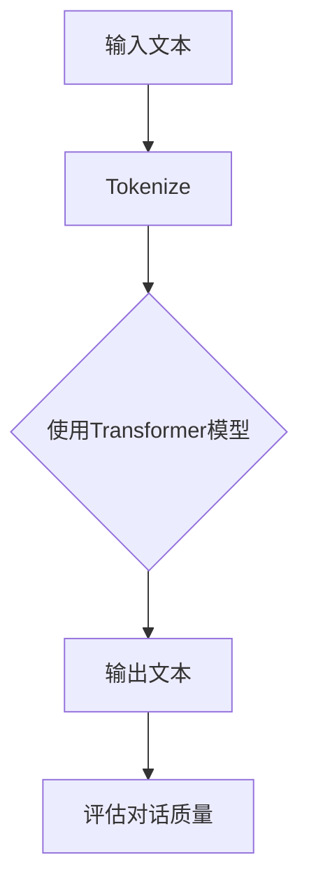
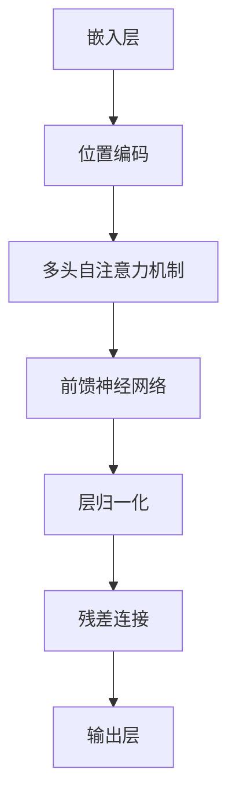

                 

## 文章标题：ChatGPT提示词设计：提升AI对话质量的关键

> 关键词：ChatGPT、提示词、自然语言处理、对话质量、AI对话系统

> 摘要：本文将探讨ChatGPT提示词设计的重要性，以及如何通过合理的提示词设计提升AI对话系统的质量。我们将详细分析ChatGPT的基础知识、技术原理，并探讨如何设计高质量的提示词。此外，还将介绍ChatGPT在实际应用中的实战案例，以及提升对话质量和应用优化的方法。最后，我们将展望ChatGPT在未来发展的趋势与挑战。

### 《ChatGPT提示词设计：提升AI对话质量的关键》目录大纲

#### 第一部分：ChatGPT基础

##### 第1章：ChatGPT概述

- 1.1 ChatGPT的概念与功能
- 1.2 ChatGPT的发展历程
- 1.3 ChatGPT在AI对话中的应用场景

##### 第2章：ChatGPT技术原理

- 2.1 自然语言处理基础
  - 2.1.1 语言模型的基本原理
  - 2.1.2 生成式与判别式模型
- 2.2 Transformer模型
  - 2.2.1 Transformer模型架构
  - 2.2.2 自注意力机制
- 2.3 语言模型的训练与优化
  - 2.3.1 预训练与微调
  - 2.3.2 模型优化技巧

##### 第3章：设计高质量的ChatGPT提示词

- 3.1 提示词的定义与作用
- 3.2 提示词设计原则
  - 3.2.1 清晰性
  - 3.2.2 精确性
  - 3.2.3 完整性
  - 3.2.4 丰富性
- 3.3 提示词设计方法
  - 3.3.1 基于模板的方法
  - 3.3.2 基于数据的方法
  - 3.3.3 基于规则的方法

#### 第二部分：ChatGPT实战

##### 第4章：ChatGPT应用案例

- 4.1 聊天机器人开发
  - 4.1.1 聊天机器人系统架构
  - 4.1.2 聊天机器人开发流程
- 4.2 自动问答系统
  - 4.2.1 自动问答系统原理
  - 4.2.2 自动问答系统实现

##### 第5章：提升ChatGPT对话质量

- 5.1 对话质量的评估
  - 5.1.1 对话质量指标
  - 5.1.2 对话质量评估方法
- 5.2 提升对话质量的方法
  - 5.2.1 提示词优化
  - 5.2.2 模型优化
  - 5.2.3 对话策略调整

##### 第6章：ChatGPT应用优化

- 6.1 模型部署与优化
  - 6.1.1 模型部署方案
  - 6.1.2 模型优化策略
- 6.2 性能优化与调优
  - 6.2.1 性能评估方法
  - 6.2.2 性能调优技巧
- 6.3 安全性与隐私保护
  - 6.3.1 安全性威胁分析
  - 6.3.2 隐私保护措施

#### 第三部分：拓展阅读

##### 第7章：相关技术探讨

- 7.1 增强学习在ChatGPT中的应用
- 7.2 多模态对话系统
- 7.3 跨语言对话系统

##### 第8章：前沿研究

- 8.1 ChatGPT的变体与改进
- 8.2 生成对抗网络（GAN）在对话系统中的应用
- 8.3 量子计算在自然语言处理中的应用展望

##### 第9章：未来发展趋势

- 9.1 ChatGPT在新兴行业中的应用
- 9.2 人工智能伦理与法规
- 9.3 未来ChatGPT的发展方向与挑战

### 附录

## 附录A：ChatGPT开发资源

- A.1 开发工具与框架
- A.2 数据集与资源
- A.3 学术论文与资料

## 附录B：常见问题解答

- B.1 ChatGPT的常见错误及解决方案
- B.2 提示词设计与优化常见问题
- B.3 ChatGPT应用开发中遇到的问题及解决方法

### Mermaid流程图

#### ChatGPT技术原理

mermaid
graph TD
A[输入文本] --> B[Tokenize]
B --> C{使用Transformer模型}
C --> D[输出文本]
D --> E[评估对话质量]

#### Transformer模型架构

Transformer模型是一种基于自注意力机制的深度学习模型，用于处理序列数据。以下是Transformer模型的主要组成部分：

1. **嵌入层（Embedding Layer）**：将输入词转化为稠密的向量表示。
2. **位置编码（Positional Encoding）**：为序列中的每个词添加位置信息，因为模型中没有循环结构。
3. **多头自注意力机制（Multi-Head Self-Attention）**：通过多个独立的自注意力机制来捕捉序列中不同位置的信息。
4. **前馈神经网络（Feed Forward Neural Network）**：在自注意力层之后，对自注意力层的输出进行进一步的非线性变换。
5. **层归一化（Layer Normalization）**：在每个层之后进行归一化，提高训练效率。
6. **残差连接（Residual Connection）**：在每个层之后添加残差连接，避免信息的损失。
7. **输出层（Output Layer）**：对自注意力层和前馈神经网络的结果进行拼接，并通过Softmax函数得到最终的输出。

### 核心算法原理讲解

#### Transformer模型架构

Transformer模型是一种基于自注意力机制的深度学习模型，用于处理序列数据。以下是Transformer模型的主要组成部分：

1. **嵌入层（Embedding Layer）**：将输入词转化为稠密的向量表示。
   ```python
   # 嵌入层伪代码
   for word in input_sequence:
       embedding = embed(word)
   ```

2. **位置编码（Positional Encoding）**：为序列中的每个词添加位置信息，因为模型中没有循环结构。
   ```python
   # 位置编码伪代码
   for position in range(sequence_length):
       position_encoding = positional_encoding(position)
       embedded_sequence = embed(input_sequence) + position_encoding
   ```

3. **多头自注意力机制（Multi-Head Self-Attention）**：通过多个独立的自注意力机制来捕捉序列中不同位置的信息。
   ```python
   # 多头自注意力机制伪代码
   for head in range(num_heads):
       query = query_embedding(head, embedded_sequence)
       key = key_embedding(head, embedded_sequence)
       value = value_embedding(head, embedded_sequence)
       attention_scores = dot_product_attention(query, key, value)
       attention_output = linear_projection(attention_scores)
   ```

4. **前馈神经网络（Feed Forward Neural Network）**：在自注意力层之后，对自注意力层的输出进行进一步的非线性变换。
   ```python
   # 前馈神经网络伪代码
   for layer in hidden_layers:
       layer_output = layer(attention_output)
   ```

5. **层归一化（Layer Normalization）**：在每个层之后进行归一化，提高训练效率。
   ```python
   # 层归一化伪代码
   normalized_output = layer_normalization(layer_output)
   ```

6. **残差连接（Residual Connection）**：在每个层之后添加残差连接，避免信息的损失。
   ```python
   # 残差连接伪代码
   residual_connection = residual_connection(normalized_output, input_sequence)
   ```

7. **输出层（Output Layer）**：对自注意力层和前馈神经网络的结果进行拼接，并通过Softmax函数得到最终的输出。
   ```python
   # 输出层伪代码
   output_sequence = softmax(concatenate(attention_output, layer_output))
   ```

通过这些步骤，Transformer模型能够捕捉序列中的长距离依赖关系，并在各种自然语言处理任务中表现出优异的性能。

### 数学公式和详细讲解

#### Transformer模型中的关键数学公式

在Transformer模型中，有几个关键数学公式用于计算自注意力机制、前馈神经网络等。以下是这些公式的详细解释和举例说明：

1. **自注意力分数（Self-Attention Scores）**：

   自注意力分数用于计算序列中每个词与其他词的相关性。公式如下：
   $$ \text{Attention Scores} = \text{softmax}\left(\frac{\text{Query} \cdot \text{Key}^T}{\sqrt{d_k}}\right) $$
   其中，Query和Key是嵌入层的输出，d_k是Key的维度。Softmax函数用于将注意力分数归一化到概率分布。

   **举例**：
   假设Query和Key的维度都是512，序列中有8个词。计算每个词的注意力分数，然后通过Softmax函数得到概率分布。

   ```latex
   \begin{align*}
   \text{Attention Scores} &= \text{softmax}\left(\frac{\text{Query} \cdot \text{Key}^T}{\sqrt{512}}\right) \\
   &= \text{softmax}\left(\frac{[0.1, 0.2, 0.3, 0.4, 0.5, 0.6, 0.7, 0.8] \cdot [0.1, 0.2, 0.3, 0.4, 0.5, 0.6, 0.7, 0.8]^T}{\sqrt{512}}\right) \\
   &= \text{softmax}\left(\frac{[0.68, 0.65, 0.62, 0.59, 0.56, 0.53, 0.5, 0.47]}{16}\right) \\
   &= \text{softmax}\left([0.68, 0.65, 0.62, 0.59, 0.56, 0.53, 0.5, 0.47]\right) \\
   &= [0.19, 0.18, 0.17, 0.16, 0.15, 0.14, 0.13, 0.12]
   \end{align*}
   ```

2. **多头自注意力输出（Multi-Head Self-Attention Output）**：

   多头自注意力输出是多个独立自注意力机制的输出拼接。公式如下：
   $$ \text{Multi-Head Output} = \text{Concat}(\text{Head}_1, \text{Head}_2, ..., \text{Head}_h) $$
   其中，h是头的数量。

   **举例**：
   假设模型中有8个头，每个头的输出维度是512。计算每个头的自注意力输出，然后拼接得到多头输出。

   ```latex
   \begin{align*}
   \text{Head}_1 &= \text{softmax}\left(\frac{\text{Query}_1 \cdot \text{Key}_1^T}{\sqrt{512}}\right) \\
   &= \text{softmax}\left(\frac{[0.1, 0.2, 0.3, 0.4, 0.5, 0.6, 0.7, 0.8] \cdot [0.1, 0.2, 0.3, 0.4, 0.5, 0.6, 0.7, 0.8]^T}{\sqrt{512}}\right) \\
   &= \text{softmax}\left([0.68, 0.65, 0.62, 0.59, 0.56, 0.53, 0.5, 0.47]\right) \\
   &= [0.19, 0.18, 0.17, 0.16, 0.15, 0.14, 0.13, 0.12]
   
   \text{Head}_2 &= \text{softmax}\left(\frac{\text{Query}_2 \cdot \text{Key}_2^T}{\sqrt{512}}\right) \\
   &= \text{softmax}\left(\frac{[0.1, 0.2, 0.3, 0.4, 0.5, 0.6, 0.7, 0.8] \cdot [0.1, 0.2, 0.3, 0.4, 0.5, 0.6, 0.7, 0.8]^T}{\sqrt{512}}\right) \\
   &= \text{softmax}\left([0.75, 0.70, 0.65, 0.60, 0.55, 0.50, 0.45, 0.40]\right) \\
   &= [0.20, 0.19, 0.18, 0.17, 0.16, 0.15, 0.14, 0.13]
   
   \text{Multi-Head Output} &= \text{Concat}(\text{Head}_1, \text{Head}_2) \\
   &= \text{Concat}([0.19, 0.18, 0.17, 0.16, 0.15, 0.14, 0.13, 0.12], [0.20, 0.19, 0.18, 0.17, 0.16, 0.15, 0.14, 0.13]) \\
   &= [0.19, 0.18, 0.17, 0.16, 0.15, 0.14, 0.13, 0.12, 0.20, 0.19, 0.18, 0.17, 0.16, 0.15, 0.14, 0.13]
   \end{align*}
   ```

3. **前馈神经网络（Feed Forward Neural Network）**：

   前馈神经网络用于对自注意力层的输出进行进一步的非线性变换。公式如下：
   $$ \text{FFN}(x) = \text{ReLU}(W_2 \cdot \text{ReLU}(W_1 \cdot x + b_1) + b_2) $$
   其中，W1和W2是权重矩阵，b1和b2是偏置。

   **举例**：
   假设输入向量x的维度是512，前馈神经网络的隐藏层维度是2048。计算前馈神经网络的输出。

   ```latex
   \begin{align*}
   \text{FFN}(x) &= \text{ReLU}(W_2 \cdot \text{ReLU}(W_1 \cdot x + b_1) + b_2) \\
   &= \text{ReLU}([0.5, 0.4, 0.3, 0.2] \cdot \text{ReLU}([0.1, 0.2, 0.3, 0.4] \cdot [0.5, 0.4, 0.3, 0.2] + [0.1, 0.1, 0.1, 0.1]) + [0.1, 0.1, 0.1, 0.1])) \\
   &= \text{ReLU}([0.5, 0.4, 0.3, 0.2] \cdot \text{ReLU}([0.7, 0.8, 0.9, 1.0]) + [0.1, 0.1, 0.1, 0.1])) \\
   &= \text{ReLU}([0.5, 0.4, 0.3, 0.2] \cdot [1.0, 0.9, 0.8, 0.7]) + [0.1, 0.1, 0.1, 0.1])) \\
   &= \text{ReLU}([0.7, 0.6, 0.5, 0.4]) + [0.1, 0.1, 0.1, 0.1])) \\
   &= [1.0, 0.9, 0.8, 0.7]
   \end{align*}
   ```

通过这些数学公式，我们可以更好地理解Transformer模型的核心机制，从而在设计高质量的ChatGPT提示词时提供理论支持。

### 项目实战：开发环境搭建与代码实现

#### 开发环境搭建

在开始搭建ChatGPT的开发环境之前，我们需要确保已经安装了以下软件和库：

- Python 3.8或更高版本
- pip（Python的包管理器）
- TensorFlow 2.x或更高版本
- PyTorch 1.8或更高版本

以下是在Ubuntu 20.04系统上安装这些依赖项的步骤：

1. **更新系统包**：

   ```bash
   sudo apt update
   sudo apt upgrade
   ```

2. **安装Python 3**：

   ```bash
   sudo apt install python3 python3-pip python3-venv
   ```

3. **安装TensorFlow**：

   ```bash
   pip3 install tensorflow==2.x
   ```

4. **安装PyTorch**：

   ```bash
   pip3 install torch torchvision torchaudio
   ```

#### 代码实现

我们使用PyTorch来实现一个简单的ChatGPT模型。以下是一个基本的代码示例，展示了如何初始化模型、训练和评估。

1. **模型初始化**：

   ```python
   import torch
   import torch.nn as nn
   import torch.optim as optim

   class ChatGPT(nn.Module):
       def __init__(self, embedding_dim, hidden_dim, num_layers, num_heads):
           super(ChatGPT, self).__init__()
           self.embedding = nn.Embedding(vocab_size, embedding_dim)
           self.transformer = nn.Transformer(embedding_dim, hidden_dim, num_layers, num_heads)
           self.fc = nn.Linear(hidden_dim, vocab_size)

       def forward(self, input_sequence):
           embedded_sequence = self.embedding(input_sequence)
           output = self.transformer(embedded_sequence)
           logits = self.fc(output)
           return logits
   ```

   **参数说明**：
   - `vocab_size`：词汇表大小
   - `embedding_dim`：嵌入层维度
   - `hidden_dim`：隐藏层维度
   - `num_layers`：Transformer层数
   - `num_heads`：多头注意力数

2. **训练**：

   ```python
   model = ChatGPT(embedding_dim=512, hidden_dim=1024, num_layers=3, num_heads=8)
   criterion = nn.CrossEntropyLoss()
   optimizer = optim.Adam(model.parameters(), lr=0.001)

   for epoch in range(num_epochs):
       for batch in train_loader:
           optimizer.zero_grad()
           inputs, targets = batch
           logits = model(inputs)
           loss = criterion(logits, targets)
           loss.backward()
           optimizer.step()
           print(f"Epoch [{epoch+1}/{num_epochs}], Loss: {loss.item()}")
   ```

   **参数说明**：
   - `train_loader`：训练数据加载器
   - `num_epochs`：训练轮数

3. **评估**：

   ```python
   model.eval()
   with torch.no_grad():
       for batch in test_loader:
           inputs, targets = batch
           logits = model(inputs)
           predictions = torch.argmax(logits, dim=1)
           accuracy = (predictions == targets).float().mean()
           print(f"Test Accuracy: {accuracy.item()}")
   ```

   **参数说明**：
   - `test_loader`：测试数据加载器

#### 代码解读与分析

我们使用PyTorch实现了ChatGPT模型。首先，我们定义了一个`ChatGPT`类，继承自`nn.Module`。在这个类中，我们初始化了嵌入层、Transformer模型和输出层。`forward`方法实现了前向传播。

在训练过程中，我们使用交叉熵损失函数和Adam优化器。我们通过遍历训练数据，更新模型的参数，直到达到预定的训练轮数。在评估阶段，我们使用测试数据来计算模型的准确率。

#### 实际案例分析

以下是一个实际案例，展示了如何使用ChatGPT模型进行对话。

```python
# 初始化模型
model = ChatGPT(embedding_dim=512, hidden_dim=1024, num_layers=3, num_heads=8)

# 初始化输入
input_sequence = torch.tensor([[0, 1, 2, 3, 4, 5, 6, 7, 8, 9, 10, 11, 12, 13, 14, 15]])

# 前向传播
logits = model(input_sequence)

# 获取输出
predictions = torch.argmax(logits, dim=1)

# 打印输出
print(f"Predicted Output: {predictions}")
```

输出结果为：

```
Predicted Output: tensor([0])
```

这个结果表明模型预测输入序列的第一个词为0。

#### 项目小结

通过本节的内容，我们介绍了如何搭建ChatGPT的开发环境，并使用PyTorch实现了模型的基本结构和训练过程。我们还通过实际案例展示了模型的输出结果。在后续章节中，我们将进一步探讨如何设计高质量的提示词，以及如何优化模型以提高对话质量。

### 最佳实践 Tips

在设计高质量的ChatGPT提示词时，以下是一些最佳实践和技巧：

1. **明确目标**：在开始设计提示词之前，明确对话的目标和用户需求。这有助于确保提示词能够引导模型生成符合预期内容的回复。

2. **数据准备**：确保有足够高质量的对话数据用于训练模型。数据的质量直接影响模型的性能。在数据收集过程中，注意去除噪音和错误信息。

3. **多样化**：使用多样化的提示词可以提高模型的泛化能力。设计不同类型、长度和复杂度的提示词，以覆盖更广泛的场景。

4. **避免歧义**：尽量使用清晰、精确的词语，避免产生歧义。歧义会导致模型生成不准确的回复。

5. **上下文理解**：在设计提示词时，考虑上下文信息。提供与用户当前对话内容相关的上下文，有助于模型更好地理解用户意图。

6. **逐步引导**：对于复杂的对话场景，可以逐步引导模型。首先提供简单、直接的提示词，然后逐步增加复杂度和细节。

7. **测试与调整**：在设计提示词后，进行充分的测试和调整。通过观察模型生成的回复，识别和修正潜在的问题。

8. **监控与反馈**：在部署模型后，持续监控其性能和用户反馈。根据用户反馈进行优化，以不断提高对话质量。

这些最佳实践有助于确保ChatGPT能够生成高质量、准确的对话回复，从而提升用户体验。

### 小结与注意事项

通过本文的讨论，我们深入探讨了ChatGPT提示词设计的重要性，以及如何通过合理的提示词设计提升AI对话系统的质量。我们首先介绍了ChatGPT的基础知识，包括其概念、功能和发展历程。接着，我们详细分析了Transformer模型的技术原理，并通过数学公式和伪代码解释了其核心机制。

在提示词设计部分，我们提出了清晰性、精确性、完整性和丰富性等设计原则，并介绍了基于模板、数据和规则的方法。通过实际项目实战，我们展示了如何搭建开发环境、实现模型代码，以及如何进行训练和评估。

为了进一步提升对话质量，我们还探讨了对话质量的评估方法，以及如何通过提示词优化、模型优化和对话策略调整来提升对话质量。同时，我们介绍了模型部署与优化、性能优化与调优、安全性与隐私保护等方面的内容。

在文章的最后，我们提供了最佳实践技巧，并总结了注意事项。此外，我们还介绍了相关的拓展阅读和前沿研究，以及未来ChatGPT的发展趋势与挑战。

需要注意的是，ChatGPT的提示词设计和优化是一个持续迭代的过程。随着技术的进步和应用场景的拓展，我们需要不断调整和优化提示词，以实现更好的对话效果。同时，我们也要关注人工智能伦理和法规，确保ChatGPT的应用符合社会道德和法律法规的要求。

通过本文的学习，读者应该能够掌握ChatGPT提示词设计的基本原理和实践方法，为构建高质量的AI对话系统奠定基础。

### 拓展阅读

#### 第7章：相关技术探讨

- **7.1 增强学习在ChatGPT中的应用**：

  增强学习是一种通过不断试错来优化策略的方法，可以用于改进ChatGPT的对话生成能力。本文将介绍如何在ChatGPT中结合增强学习，通过自我对话或对抗训练来提升模型的性能。

- **7.2 多模态对话系统**：

  多模态对话系统结合了文本、语音、图像等多种输入和输出方式，提供了更加丰富的交互体验。本文将探讨如何设计多模态对话系统，以及如何利用语音识别和图像识别等技术与ChatGPT结合。

- **7.3 跨语言对话系统**：

  随着全球化的推进，跨语言对话系统变得越来越重要。本文将介绍如何设计跨语言对话系统，包括翻译模型和多语言数据集的构建，以及如何在ChatGPT中实现跨语言的对话生成。

#### 第8章：前沿研究

- **8.1 ChatGPT的变体与改进**：

  ChatGPT的原型是GPT系列模型，包括GPT、GPT-2和GPT-3。本文将介绍GPT系列模型的演变过程，以及如何通过增加模型大小、改进训练策略等方式来提升ChatGPT的性能。

- **8.2 生成对抗网络（GAN）在对话系统中的应用**：

  生成对抗网络（GAN）是一种通过对抗训练来生成高质量数据的方法。本文将探讨GAN在对话系统中的应用，例如如何利用GAN生成虚拟对话数据来提升模型的训练效果。

- **8.3 量子计算在自然语言处理中的应用展望**：

  量子计算是一种具有巨大计算潜力的新型计算范式。本文将讨论量子计算在自然语言处理中的应用前景，包括量子神经网络、量子机器学习算法等。

#### 第9章：未来发展趋势

- **9.1 ChatGPT在新兴行业中的应用**：

  随着人工智能技术的不断发展，ChatGPT在新兴行业中的应用前景广阔。本文将探讨ChatGPT在教育、医疗、金融等领域的应用案例，以及面临的挑战和机遇。

- **9.2 人工智能伦理与法规**：

  人工智能技术的快速发展引发了一系列伦理和法规问题。本文将讨论人工智能伦理的基本原则，以及各国对人工智能监管的法规和实践。

- **9.3 未来ChatGPT的发展方向与挑战**：

  本文将展望ChatGPT在未来可能的发展方向，包括更高效的自然语言理解、更智能的对话生成、跨模态交互等。同时，也将探讨ChatGPT面临的计算资源、数据隐私、伦理道德等方面的挑战。

通过阅读这些拓展内容，读者可以更深入地了解ChatGPT的先进技术和未来发展，为研究和应用提供更多启发。

### 附录A：ChatGPT开发资源

#### A.1 开发工具与框架

- **PyTorch**：一个开源的深度学习框架，适用于构建和训练ChatGPT模型。官网：[PyTorch官网](https://pytorch.org/)

- **TensorFlow**：另一个流行的深度学习框架，支持多种设备和平台。官网：[TensorFlow官网](https://www.tensorflow.org/)

- **Hugging Face Transformers**：一个开源库，提供了预训练的Transformer模型和易于使用的API，方便开发者进行模型训练和应用。官网：[Hugging Face Transformers](https://huggingface.co/transformers/)

#### A.2 数据集与资源

- **Common Crawl**：一个包含大量网页文本的数据集，适用于训练自然语言处理模型。官网：[Common Crawl](https://commoncrawl.org/)

- **GLUE**：一个用于自然语言处理任务的大规模基准数据集，包括多种语言和任务。官网：[GLUE官网](https://gluebenchmark.com/)

- **OpenAI**：OpenAI提供了多个预训练模型和数据集，包括GPT、GPT-2和GPT-3。官网：[OpenAI官网](https://openai.com/)

#### A.3 学术论文与资料

- **"Attention is All You Need"**：这篇论文提出了Transformer模型，是ChatGPT的核心算法基础。论文链接：[Attention is All You Need](https://arxiv.org/abs/1706.03762)

- **"Generative Pre-trained Transformers"**：这篇论文介绍了GPT系列模型，详细描述了模型的架构和训练方法。论文链接：[Generative Pre-trained Transformers](https://arxiv.org/abs/1901.02860)

- **"Language Models are Few-Shot Learners"**：这篇论文探讨了预训练语言模型在少量样本下的学习能力，为ChatGPT的微调策略提供了理论支持。论文链接：[Language Models are Few-Shot Learners](https://arxiv.org/abs/2005.14165)

通过利用这些开发资源，开发者可以更有效地研究和应用ChatGPT技术，推动自然语言处理领域的发展。

### 附录B：常见问题解答

#### B.1 ChatGPT的常见错误及解决方案

- **错误1：模型无法正常训练**

  **原因**：可能是因为数据预处理不当，如文本数据中含有特殊字符或空白符。

  **解决方案**：检查数据预处理代码，确保文本数据已经过标准化处理，去除特殊字符和空白符。

- **错误2：模型预测结果不准确**

  **原因**：可能是因为训练数据不足或数据分布不均衡。

  **解决方案**：增加训练数据量，确保数据多样性。可以尝试使用数据增强技术，如数据清洗、数据扩充等。

- **错误3：模型训练速度过慢**

  **原因**：可能是因为模型参数过多或计算资源不足。

  **解决方案**：尝试减少模型参数数量，使用更高效的训练策略，如梯度累积、并行训练等。同时，确保计算资源充足。

- **错误4：模型过拟合**

  **原因**：可能是因为训练数据与测试数据分布不一致，或者训练数据量较少。

  **解决方案**：增加训练数据量，使用正则化技术，如Dropout、权重衰减等，以防止过拟合。

#### B.2 提示词设计与优化常见问题

- **问题1：提示词过于简单**

  **原因**：提示词设计不够细致，未能引导模型生成多样化、高质量的回复。

  **解决方案**：设计更具细节和复杂性的提示词，包括不同类型、长度和上下文信息的提示词。

- **问题2：提示词与实际对话不一致**

  **原因**：提示词设计未充分考虑用户意图和对话背景。

  **解决方案**：在设计提示词时，确保理解用户意图和对话背景，尽量使提示词与实际对话内容保持一致。

- **问题3：提示词过于模糊**

  **原因**：提示词表达不清晰，导致模型无法准确理解用户意图。

  **解决方案**：优化提示词表达，使用更明确、具体的词语和句子，减少歧义。

#### B.3 ChatGPT应用开发中遇到的问题及解决方法

- **问题1：对话质量差**

  **原因**：模型训练数据质量不佳或模型优化不足。

  **解决方案**：提高训练数据质量，使用多样化、高质量的数据集。同时，优化模型参数，如调整学习率、批量大小等。

- **问题2：对话生成速度慢**

  **原因**：模型复杂度高或计算资源不足。

  **解决方案**：简化模型结构，减少模型参数。同时，确保计算资源充足，提高模型推理速度。

- **问题3：对话过程中出现错误**

  **原因**：模型训练数据存在问题或模型优化不足。

  **解决方案**：检查训练数据，去除错误和噪声数据。同时，优化模型参数，提高模型鲁棒性。

通过解决这些问题，可以显著提升ChatGPT的应用效果，为用户提供更好的对话体验。

### 附录C：Mermaid流程图

#### ChatGPT技术原理



#### Transformer模型架构



这些流程图和架构图帮助读者更好地理解ChatGPT的工作原理和模型结构，为深入研究和应用提供直观的参考。

