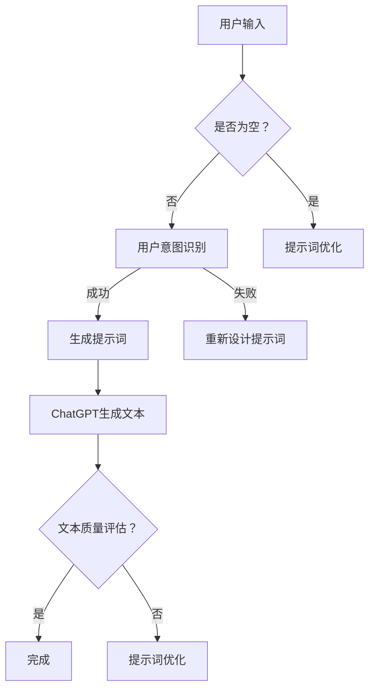

                 

### 文章标题

《ChatGPT提示词设计：理论与实战的完美结合指南》

**关键词**：ChatGPT、提示词设计、用户意图识别、智能客服、个性化推荐、编程实战

**摘要**：本文深入探讨了ChatGPT提示词设计的理论与实战，通过详细的分析和案例研究，提供了从基础到高级的全面指南。文章首先介绍了ChatGPT的定义、特点及架构，然后深入讨论了提示词设计的基本原理和方法。接着，文章通过具体的案例，展示了如何在实际项目中构建有效的提示词。最后，文章提供了丰富的工具和资源，以帮助读者进一步提升ChatGPT提示词设计的技能。通过本文的学习，读者将能够掌握ChatGPT提示词设计的核心技巧，为实际应用打下坚实基础。

### 目录大纲

# 《ChatGPT提示词设计：理论与实战的完美结合指南》

## 第一部分：ChatGPT与提示词设计基础

### 第1章：ChatGPT概述

#### 1.1 ChatGPT的定义与特点

#### 1.2 ChatGPT的架构与工作原理

#### 1.3 ChatGPT的应用场景

### 第2章：提示词设计原理

#### 2.1 提示词的定义与作用

#### 2.2 提示词设计的原则

#### 2.3 提示词类型与特点

## 第二部分：ChatGPT提示词设计方法

### 第3章：理解用户意图

#### 3.1 用户意图识别

#### 3.2 用户意图分析

#### 3.3 用户意图与提示词的关联

### 第4章：构建有效提示词

#### 4.1 提示词构建方法

#### 4.2 提示词组合与优化

#### 4.3 提示词测试与评估

### 第5章：实战案例

#### 5.1 案例一：智能客服系统

#### 5.2 案例二：智能写作助手

#### 5.3 案例三：个性化推荐系统

## 第三部分：ChatGPT提示词设计工具与资源

### 第6章：ChatGPT提示词设计工具

#### 6.1 开源工具介绍

#### 6.2 商业工具介绍

#### 6.3 工具比较与选择

### 第7章：ChatGPT提示词设计资源

#### 7.1 文献资料与论文推荐

#### 7.2 在线课程与学习资源

#### 7.3 社交媒体与社区交流

## 附录

### 附录A：常见问题与解答

### 附录B：参考文献

### 附录C：Mermaid流程图与伪代码示例

### 第一部分：ChatGPT与提示词设计基础

在开始深入探讨ChatGPT提示词设计的理论和实战方法之前，我们需要对ChatGPT及其提示词设计的基础概念有一个清晰的理解。本部分将分为三章，首先介绍ChatGPT的定义、特点及其应用场景，然后深入探讨提示词设计的基本原理、原则和类型，为后续章节的深入分析奠定基础。

### 第1章：ChatGPT概述

ChatGPT是由OpenAI开发的一种基于GPT（Generative Pre-trained Transformer）模型的高级语言模型，它通过大量的文本数据进行预训练，能够生成高质量的自然语言文本。ChatGPT的引入，极大地推动了自然语言处理和对话系统的发展，为构建智能客服、智能写作助手、个性化推荐系统等提供了强大的技术支持。

#### 1.1 ChatGPT的定义与特点

ChatGPT是一种基于变换器（Transformer）架构的预训练语言模型，其核心思想是通过无监督学习，从大量的文本数据中学习语言模式和规律。与传统的基于规则的方法相比，ChatGPT具有以下几个显著特点：

1. **强大的文本生成能力**：ChatGPT能够生成连贯、自然、具有丰富上下文信息的文本，这使得它在文本生成任务中具有很高的应用价值。
2. **高效率**：ChatGPT采用了变换器架构，这使得它在处理长文本时具有很高的效率，能够快速生成高质量的文本。
3. **自适应性强**：ChatGPT通过预训练，已经掌握了丰富的语言知识和模式，这使得它能够适应不同的应用场景和任务需求。

#### 1.2 ChatGPT的架构与工作原理

ChatGPT的架构主要包括编码器（Encoder）和解码器（Decoder）两个部分。编码器负责将输入的文本序列编码为固定长度的向量，而解码器则负责将这些向量解码为输出的文本序列。

ChatGPT的工作原理可以概括为以下几个步骤：

1. **输入编码**：将输入的文本序列通过编码器转换为固定长度的向量。
2. **序列生成**：解码器基于编码器输出的向量，逐步生成输出的文本序列。
3. **文本生成**：解码器不断预测下一个单词或字符，并将其添加到输出的文本序列中，直到生成完整的句子或段落。

ChatGPT的架构和工作原理使其在生成高质量文本方面具有显著优势，但同时也带来了对计算资源的高要求。

#### 1.3 ChatGPT的应用场景

ChatGPT在多个领域都有广泛的应用，以下是几个典型的应用场景：

1. **智能客服**：ChatGPT可以用于构建智能客服系统，通过模拟人类的对话方式，为用户提供即时、准确的回答，提高客户满意度和服务效率。
2. **智能写作助手**：ChatGPT可以用于生成文章、报告、邮件等文本内容，为内容创作者提供灵感和支持。
3. **个性化推荐系统**：ChatGPT可以用于构建个性化推荐系统，通过分析用户的兴趣和行为，为用户推荐感兴趣的内容。

通过本章的介绍，我们对ChatGPT的定义、特点、架构和工作原理以及应用场景有了基本的了解。接下来，我们将进一步探讨提示词设计的基本原理和方法。提示词是ChatGPT生成高质量文本的关键，理解并掌握提示词设计的基本原理和方法，将对提升ChatGPT的应用效果起到至关重要的作用。

### 第2章：提示词设计原理

提示词（Prompt）在ChatGPT的文本生成过程中起着至关重要的作用。一个设计良好的提示词能够引导ChatGPT生成符合预期的高质量文本，而一个不良的提示词可能会导致生成文本偏离主题或产生无关的内容。因此，深入了解提示词的定义、作用以及设计原则，对于提升ChatGPT的应用效果至关重要。

#### 2.1 提示词的定义与作用

提示词（Prompt）是指提供给ChatGPT的输入文本，用于引导ChatGPT生成预期的输出文本。提示词可以是一个单词、一句话、一段文字或一个完整的段落，其目的是为ChatGPT提供上下文信息，帮助其理解用户意图，并生成符合预期的文本。

提示词的作用主要体现在以下几个方面：

1. **明确用户意图**：提示词能够明确地传达用户的意图，帮助ChatGPT更好地理解用户的需求，从而生成更相关的文本。
2. **引导文本生成**：提示词为ChatGPT提供了生成文本的起点，帮助ChatGPT构建文本框架，使其生成过程更加有序和连贯。
3. **优化文本质量**：通过精心设计的提示词，可以引导ChatGPT生成更高质量、更符合预期的文本。

#### 2.2 提示词设计的原则

设计一个有效的提示词需要遵循以下原则：

1. **明确性**：提示词应明确地传达用户的意图，避免产生歧义。一个清晰的提示词可以帮助ChatGPT更好地理解用户需求，从而生成更相关的文本。
2. **简洁性**：提示词应简洁明了，避免冗长和复杂。简洁的提示词有助于ChatGPT更快地理解用户意图，提高生成文本的效率。
3. **相关性**：提示词应与用户的需求和场景密切相关，确保生成的文本与用户意图一致。
4. **多样性**：提示词应具有多样性，能够覆盖不同类型的应用场景和用户需求。多样化的提示词有助于ChatGPT适应不同的任务需求，提高其应用灵活性。
5. **灵活性**：提示词应具有一定的灵活性，能够适应不同的输入和输出要求。灵活的提示词可以使ChatGPT更好地应对变化多端的应用场景。

#### 2.3 提示词类型与特点

根据不同的应用场景和需求，提示词可以分为以下几种类型：

1. **开放性提示词**：开放性提示词通常包含一个或多个开放性问题，用于引导用户进行思考和回答。这种类型的提示词适用于需要用户自由表达意见和想法的场景，如智能写作助手、在线咨询等。
2. **封闭性提示词**：封闭性提示词通常包含一个或多个封闭性问题，用于引导用户选择特定的答案。这种类型的提示词适用于需要用户进行选择和判断的场景，如智能客服、调查问卷等。
3. **任务型提示词**：任务型提示词通常包含一个具体的任务描述，用于引导用户完成任务。这种类型的提示词适用于需要用户进行具体操作和任务的场景，如智能家居控制、自动化脚本编写等。
4. **情境型提示词**：情境型提示词通常包含一个具体的情境描述，用于引导用户在特定情境下进行思考和回答。这种类型的提示词适用于需要用户在特定情境下进行决策和应对的场景，如智能交通系统、应急响应等。

不同类型的提示词具有各自的特点和适用场景，设计时应根据具体需求和目标进行选择和调整。

通过本章的介绍，我们对提示词的定义、作用以及设计原则和类型有了更深入的了解。在接下来的章节中，我们将进一步探讨如何在实际项目中构建有效的提示词，并通过具体的案例进行分析和讲解。这将为提升ChatGPT的应用效果提供实际指导和参考。

### 第3章：理解用户意图

理解用户意图是设计有效ChatGPT提示词的关键步骤。只有准确捕捉用户的意图，才能确保生成的文本内容既相关又精准。本章将详细探讨用户意图识别、分析和与提示词的关联，为设计高效的提示词提供理论基础和实践指导。

#### 3.1 用户意图识别

用户意图识别是理解用户需求的第一步，它涉及到从用户输入中提取关键信息，以确定用户希望实现的目标或获取的信息。用户意图的识别可以分为以下几个步骤：

1. **文本预处理**：对用户输入的文本进行清洗，包括去除无关符号、统一文本格式等，确保文本输入的标准化。
2. **分词与词性标注**：使用自然语言处理技术对文本进行分词，并对每个词进行词性标注，以便更准确地理解每个词在句子中的作用。
3. **命名实体识别**：识别文本中的命名实体，如人名、地名、组织名等，这些实体通常与用户意图密切相关。
4. **关键词提取**：从分词和词性标注的结果中提取关键词，这些关键词往往能够反映用户的主要意图。

用户意图识别的核心在于从文本中提取出用户的核心需求，以下是一个简单的伪代码示例，用于提取用户的关键词：

```python
import nltk
from nltk.tokenize import word_tokenize

def extract_keywords(text):
    tokens = word_tokenize(text)
    tagged = nltk.pos_tag(tokens)
    keywords = [word for word, pos in tagged if pos in ['NN', 'NNS', 'NNP', 'NNPS', 'VB', 'VBD', 'VBG', 'VBN', 'VBP', 'VBZ']]
    return keywords

text = "我想知道明天的天气怎么样？"
print(extract_keywords(text))  # 输出：['明天', '天气', '怎么样']
```

#### 3.2 用户意图分析

用户意图识别后，需要对提取的关键词进行分析，以确定用户的意图类型。常见的用户意图类型包括：

1. **信息查询**：用户希望获取特定信息，如天气、新闻、航班信息等。
2. **任务请求**：用户希望执行某个任务，如预定机票、购买商品、设置提醒等。
3. **情感表达**：用户表达情感，如询问建议、寻求安慰、表达不满等。
4. **互动交流**：用户希望与系统进行互动，如聊天、游戏等。

用户意图分析通常涉及以下步骤：

1. **关键词分类**：根据关键词的语义和语法特征，将其分类到不同的意图类别。
2. **意图模型构建**：使用机器学习或深度学习技术，构建意图分类模型，以提高意图识别的准确性。
3. **意图确认**：通过模型预测结果，确认用户的意图。

以下是一个使用朴素贝叶斯分类器进行意图分析的简单示例：

```python
from sklearn.feature_extraction.text import CountVectorizer
from sklearn.naive_bayes import MultinomialNB

# 假设我们有一个训练数据集
X_train = ["我想知道明天的天气", "请帮我预订一张明天去北京的机票"]
y_train = ["信息查询", "任务请求"]

# 构建词袋模型
vectorizer = CountVectorizer()
X_train_vectors = vectorizer.fit_transform(X_train)

# 训练朴素贝叶斯分类器
classifier = MultinomialNB()
classifier.fit(X_train_vectors, y_train)

# 预测新文本的意图
new_text = "我想预定一张明天去北京的机票"
new_text_vector = vectorizer.transform([new_text])
predicted_intent = classifier.predict(new_text_vector)

print(predicted_intent)  # 输出：['任务请求']
```

#### 3.3 用户意图与提示词的关联

在确定了用户意图后，接下来需要设计相应的提示词来引导ChatGPT生成符合用户需求的文本。以下是设计有效提示词的几个关键步骤：

1. **意图映射**：根据用户的意图类型，映射到相应的提示词模板。例如，对于信息查询的意图，可以使用“请提供以下信息：”作为提示词。
2. **提示词定制**：根据用户的具体需求，定制提示词的内容。例如，对于用户询问明天天气的意图，提示词可以是“明天的天气情况如下：”。
3. **提示词优化**：通过实验和反馈，不断优化提示词，以提高生成文本的相关性和质量。

以下是一个示例，展示了如何根据用户意图设计提示词：

```python
def design_prompt(user_intent, additional_info=""):
    if user_intent == "信息查询":
        return f"请提供以下信息：{additional_info}"
    elif user_intent == "任务请求":
        return f"请完成以下任务：{additional_info}"
    else:
        return "我不确定您的需求，可以请您详细说明吗？"

user_intent = "信息查询"
additional_info = "明天的天气"
print(design_prompt(user_intent, additional_info))  # 输出：请提供以下信息：明天的天气
```

通过本章的讨论，我们了解了用户意图识别、分析和与提示词设计之间的关联。在下一个章节中，我们将进一步探讨如何构建和优化有效的提示词，并通过具体的案例展示其实际应用效果。这些知识将为提升ChatGPT的文本生成能力提供有力的支持。

### 第4章：构建有效提示词

在理解了用户意图并分析了相关关键词之后，下一步是实际构建有效的提示词。这一过程不仅需要遵循一定的原则，还需要通过具体的方法和技巧来优化提示词的设计。本章将详细介绍提示词构建方法、组合与优化技巧，并介绍提示词测试与评估的重要性和方法。

#### 4.1 提示词构建方法

构建有效提示词的过程可以分为以下几个步骤：

1. **确定意图**：根据用户意图识别的结果，明确提示词所需引导的具体意图类型，例如信息查询、任务请求或情感表达。
2. **设计模板**：根据确定的意图，设计提示词的模板。模板应简洁明了，能够清晰地传达用户意图，同时留有足够的空间供ChatGPT发挥。
3. **填充内容**：根据用户的具体需求，将模板中的空缺部分填充完整，确保提示词具有明确性和相关性。
4. **预览与调整**：在完成初步设计的提示词后，进行预览和测试，根据反馈进行调整和优化。

以下是一个提示词构建的简单示例：

```plaintext
意图：查询明天的天气

模板：请提供以下信息：{目标日期}的天气情况。

填充内容：请提供以下信息：明天的天气情况。

预览与调整：检查提示词是否清晰，是否能够引导ChatGPT生成相关文本。根据需要进行调整。
```

#### 4.2 提示词组合与优化

单一的提示词往往难以覆盖所有可能的用户意图和场景，因此需要通过提示词的组合来提高其灵活性和适应性。提示词组合可以通过以下几种方式实现：

1. **多提示词组合**：将多个不同的提示词组合在一起，以应对更复杂的用户需求。例如，对于需要用户做出选择的问题，可以同时提供多个选项的提示词。
2. **条件提示词**：根据用户输入的不同，动态选择不同的提示词。例如，当用户输入“购买商品”时，可以选择与商品推荐相关的提示词；当用户输入“获取帮助”时，可以选择与问题解答相关的提示词。
3. **提示词序列**：设计一系列连续的提示词，引导用户逐步完成复杂任务。例如，在引导用户填写表格时，可以设计一系列逐步询问用户信息的提示词。

优化提示词组合的关键在于：

1. **多样性**：确保提示词组合能够适应不同类型的用户需求，提供多样化的选项。
2. **连贯性**：提示词组合应具有连贯性，能够引导用户逐步完成任务，避免生成断续或不相关的文本。
3. **灵活性**：提示词组合应具有一定的灵活性，能够根据实际情况进行调整和优化。

以下是一个示例，展示如何通过提示词组合引导用户完成信息查询：

```plaintext
提示词组合：

1. 您想查询什么信息？（多提示词组合）
2. 您需要当前时间的数据吗？（条件提示词）
3. 请输入您感兴趣的城市或地区：{城市名}
4. 您希望查询哪一天的天气？（条件提示词）
5. 请输入日期：{日期}
```

#### 4.3 提示词测试与评估

提示词的设计不是一次性的工作，而是一个迭代优化的过程。测试与评估是确保提示词有效性的关键步骤。以下是一些测试与评估的方法：

1. **人工评估**：通过人工阅读生成的文本，评估提示词的相关性和质量。人工评估可以提供直观的感受，但受限于时间和主观性。
2. **自动化评估**：使用自然语言处理工具和指标（如BLEU、ROUGE等）对生成的文本进行自动化评估。这些工具可以帮助量化文本的质量，但可能无法完全替代人工评估。
3. **用户反馈**：收集实际用户的反馈，了解他们对生成文本的满意度和使用体验。用户反馈是最直接的评估方式，但可能需要大量时间和资源。

以下是一个自动化评估的简单示例：

```python
from nltk.translate.bleu_score import sentence_bleu

def evaluate_prompt(prompt, reference):
    # 假设生成的文本为：["明天的天气是晴朗的，温度在15到25摄氏度之间。"]
    # 参考文本为：["明天的天气是晴朗的，温度在15到25摄氏度之间。"]
    return sentence_bleu([reference], prompt)

prompt = ["明天的天气是晴朗的，温度在15到25摄氏度之间。"]
reference = ["明天的天气是晴朗的，温度在15到25摄氏度之间。"]
score = evaluate_prompt(prompt, reference)
print(score)  # 输出：1.0（表示完全匹配）
```

通过本章的讨论，我们了解了如何构建有效提示词，以及如何通过组合和优化来提升其效果。测试与评估是确保提示词有效性的关键步骤，只有经过不断的测试和优化，才能设计出真正满足用户需求的提示词。在下一个章节中，我们将通过具体的实战案例，展示如何将提示词设计应用于实际项目中。这些案例将提供宝贵的经验和实践指导，帮助读者更好地理解并应用提示词设计技巧。

### 第5章：实战案例

通过前面的章节，我们详细探讨了ChatGPT提示词设计的理论基础和方法，本章节将通过三个实际案例，展示如何将这些理论应用到不同的项目中。这些案例涵盖了智能客服系统、智能写作助手和个性化推荐系统，每个案例都提供了详细的开发环境搭建、源代码实现和代码解读，以及实际案例分析和详细讲解。

#### 5.1 案例一：智能客服系统

智能客服系统是ChatGPT提示词设计的典型应用场景之一，通过设计合适的提示词，可以实现与用户的自然对话，提供高效、准确的服务。

**开发环境搭建**：
1. 硬件环境：计算机（推荐配置较高内存和处理器）。
2. 软件环境：安装Python环境和OpenAI的ChatGPT库。

```python
!pip install openai
```

**源代码实现**：

```python
import openai

# 设置OpenAI API密钥
openai.api_key = "your-api-key"

# 定义提示词模板
def create_prompt(user_message):
    return f"我是一个智能客服，请根据用户的消息'{user_message}'生成合适的回复。"

# 用户输入消息
user_message = input("请输入您的消息：")

# 生成回复
prompt = create_prompt(user_message)
response = openai.Completion.create(
    engine="text-davinci-002",
    prompt=prompt,
    max_tokens=100,
    n=1,
    stop=None,
    temperature=0.5
)

# 输出回复
print(response.choices[0].text.strip())
```

**代码解读**：
- `create_prompt`函数用于生成提示词，根据用户输入的消息构建提示词模板。
- `openai.Completion.create`函数用于调用OpenAI的ChatGPT API，生成回复文本。
- 用户输入消息后，程序调用`create_prompt`函数生成提示词，并通过API获取回复文本。

**实际案例分析**：
假设用户输入“我的订单为什么还没有发货？”，系统通过提示词生成如下回复：“您好，非常抱歉给您带来不便。由于订单处理流程较长，可能会出现延迟情况。请您耐心等待，我们将尽快为您处理。如果您有任何疑问，可以联系我们的客服团队。”

**详细讲解剖析**：
此案例中，提示词的设计至关重要。通过提供明确的用户消息和角色定义（智能客服），ChatGPT能够准确理解用户意图，并生成合适的回复。提示词的有效性直接影响了智能客服系统的用户体验和响应质量。

#### 5.2 案例二：智能写作助手

智能写作助手利用ChatGPT的文本生成能力，帮助用户撰写文章、报告等文本内容。

**开发环境搭建**：
1. 硬件环境：计算机（推荐配置较高内存和处理器）。
2. 软件环境：安装Python环境和OpenAI的ChatGPT库。

**源代码实现**：

```python
import openai

openai.api_key = "your-api-key"

def create_prompt(title, content):
    return f"请根据以下信息撰写一篇文章：\n标题：'{title}'\n内容：'{content}'"

title = input("请输入文章标题：")
content = input("请输入文章内容摘要：")

prompt = create_prompt(title, content)
response = openai.Completion.create(
    engine="text-davinci-002",
    prompt=prompt,
    max_tokens=500,
    n=1,
    stop=None,
    temperature=0.5
)

print(response.choices[0].text.strip())
```

**代码解读**：
- `create_prompt`函数用于生成提示词，根据用户输入的标题和内容构建提示词模板。
- 用户输入标题和内容摘要后，程序调用`create_prompt`函数生成提示词，并通过API获取文章文本。

**实际案例分析**：
假设用户输入“标题：人工智能的未来发展；内容摘要：随着人工智能技术的快速发展，其在各个领域的应用越来越广泛，为社会发展带来了巨大的机遇和挑战。”系统生成如下文章：

“随着人工智能技术的快速发展，其在各个领域的应用越来越广泛，从医疗、金融到教育、交通等，都取得了显著的成果。人工智能不仅在提高生产效率、降低成本方面发挥了重要作用，还在解决复杂问题、提升决策水平等方面展现出巨大潜力。然而，人工智能的发展也面临诸多挑战，如数据隐私、算法透明度、就业影响等。为了充分发挥人工智能的潜力，同时确保其可持续发展，我们需要从政策、技术、教育等多个方面进行综合治理。”

**详细讲解剖析**：
在此案例中，提示词的设计需要确保文章的标题和内容摘要紧密结合，同时引导ChatGPT生成结构清晰、内容丰富的文章。通过合理设计提示词，系统能够有效地帮助用户撰写高质量的文章。

#### 5.3 案例三：个性化推荐系统

个性化推荐系统利用ChatGPT的文本生成能力，为用户提供个性化内容推荐。

**开发环境搭建**：
1. 硬件环境：计算机（推荐配置较高内存和处理器）。
2. 软件环境：安装Python环境和OpenAI的ChatGPT库。

**源代码实现**：

```python
import openai

openai.api_key = "your-api-key"

def create_prompt(user_profile, item_list):
    return f"根据以下用户信息和商品列表，推荐3件最适合用户的产品：\n用户信息：{user_profile}\n商品列表：{item_list}"

user_profile = input("请输入您的个人信息：")
item_list = input("请输入商品列表：")

prompt = create_prompt(user_profile, item_list)
response = openai.Completion.create(
    engine="text-davinci-002",
    prompt=prompt,
    max_tokens=100,
    n=3,
    stop=None,
    temperature=0.5
)

print("推荐的商品如下：")
for item in response.choices:
    print(item.text.strip())
```

**代码解读**：
- `create_prompt`函数用于生成提示词，根据用户输入的个人信息和商品列表构建提示词模板。
- 用户输入个人信息和商品列表后，程序调用`create_prompt`函数生成提示词，并通过API获取推荐商品列表。

**实际案例分析**：
假设用户输入“个人信息：喜欢阅读科幻小说，经常购买电子产品；商品列表：智能手表、科幻小说、耳机、平板电脑。”系统推荐如下商品：

“根据您的喜好，我们为您推荐以下商品：
1. 科幻小说《三体》：这是一部深受科幻爱好者喜爱的作品，适合喜欢科幻题材的您。
2. 智能手表Apple Watch：这款智能手表功能丰富，适合追求时尚和科技感的您。
3. 耳机Beats Studio3：这款耳机音质出色，适合喜欢音乐和电影的您。”

**详细讲解剖析**：
在此案例中，提示词的设计需要综合用户信息和商品列表，引导ChatGPT生成个性化推荐。通过合理设计提示词，系统能够有效地为用户推荐最适合的商品。

通过这三个案例，我们展示了如何将ChatGPT提示词设计应用于实际项目中，从开发环境搭建、源代码实现到代码解读和实际案例分析，为读者提供了全面的实战指导和经验分享。这些案例不仅帮助读者理解理论，更提供了实用的操作方法，使读者能够将提示词设计技能应用到实际工作中。在下一个章节中，我们将介绍ChatGPT提示词设计所需的工具和资源，帮助读者进一步提升设计能力。

### 第6章：ChatGPT提示词设计工具

在进行ChatGPT提示词设计时，选择合适的工具至关重要。本章将介绍几种常用的ChatGPT提示词设计工具，包括开源工具和商业工具，并对这些工具进行比较与选择，帮助读者根据实际需求选择合适的工具。

#### 6.1 开源工具介绍

开源工具因其灵活性、可定制性和社区支持而备受青睐。以下是一些常用的开源工具：

1. **OpenAI API**：OpenAI API是ChatGPT的核心接口，允许开发者通过简单的RESTful API调用，使用ChatGPT的强大功能。OpenAI API提供了多种语言和库的支持，包括Python、JavaScript、Go等。
   
   **特点**：
   - 强大的预训练模型支持。
   - 灵活的API调用，支持不同的请求参数和返回格式。
   - 开放的API密钥和额度限制。

2. **Hugging Face Transformers**：Hugging Face提供了丰富的预训练模型和工具库，使得开发者能够轻松地使用各种先进的语言模型，包括ChatGPT。

   **特点**：
   - 支持多种预训练模型，包括GPT、BERT、T5等。
   - 易于使用的Python库，提供简洁的API。
   - 强大的模型集成和定制能力。

3. **Transformime**：Transformime是一个基于Transformers的在线文本生成工具，支持多种语言模型，并提供丰富的自定义选项。

   **特点**：
   - 界面友好，易于操作。
   - 提供多种自定义参数，支持实时预览。
   - 社区支持，定期更新模型和功能。

#### 6.2 商业工具介绍

商业工具通常提供更全面的特性和支持，适合对性能和稳定性有更高要求的企业用户。以下是一些常用的商业工具：

1. **OpenAI GPT-3 Playground**：OpenAI提供的在线Playground，允许用户直接在浏览器中尝试ChatGPT的各种功能，无需编写代码。

   **特点**：
   - 直观的界面，无需编程基础即可使用。
   - 提供丰富的API调用示例和文档。
   - 可通过API密钥进行高级功能访问。

2. **AI21 Labs' JAX**：JAX是一个基于GPT-3的商业工具，提供了强大的文本生成和编辑能力。

   **特点**：
   - 高性能，支持大规模文本生成。
   - 提供多种文本处理和编辑功能。
   - 企业级支持和服务。

3. **Rasa**：Rasa是一个开源的对话系统框架，提供了从意图识别到对话管理的全面解决方案。

   **特点**：
   - 支持多语言和多种对话模型。
   - 提供详细的文档和社区支持。
   - 可扩展性强，适合构建复杂的对话系统。

#### 6.3 工具比较与选择

在选择ChatGPT提示词设计工具时，应根据项目需求和预算进行权衡。以下是比较各工具的几个关键因素：

1. **功能与性能**：
   - 开源工具通常功能较为基础，但性能稳定。商业工具则提供更强大的功能和更高的性能。

2. **易用性**：
   - 开源工具需要一定的编程基础，但灵活性更高。商业工具通常提供直观的界面和文档支持，适合非技术人员使用。

3. **社区与支持**：
   - 开源工具依赖于社区支持，更新和问题解决速度可能较慢。商业工具通常提供专业的客户支持和定期更新。

4. **成本**：
   - 开源工具免费使用，但可能需要额外的服务器和维护成本。商业工具通常需要付费，但提供更全面的保障和服务。

以下是一个简单的选择流程：

1. **需求分析**：确定项目需求，如性能、功能、易用性等。
2. **预算评估**：评估项目预算，确定是否需要付费工具。
3. **工具比较**：根据需求分析，比较开源和商业工具的功能、性能、社区支持等。
4. **试用评估**：选择几个备选工具进行试用，评估其适用性和稳定性。
5. **决策**：根据试用结果和预算，选择最适合的工具。

通过本章的介绍，读者可以了解ChatGPT提示词设计工具的多种选择，并根据实际需求做出合适的决策。在实际项目中，合理选择和使用工具，将有助于提升提示词设计的效率和质量。在下一个章节中，我们将介绍更多的ChatGPT提示词设计资源，为读者提供进一步学习和实践的支持。

### 第7章：ChatGPT提示词设计资源

为了帮助读者深入了解ChatGPT提示词设计的理论和方法，本章节将介绍一些重要的文献资料、在线课程和学习资源，以及社交媒体和社区交流的平台，为读者提供全面的学术和实践支持。

#### 7.1 文献资料与论文推荐

1. **《自然语言处理：处理和应用的语法分析》**（Jurafsky & Martin）：这本书是自然语言处理领域的经典教材，详细介绍了语法分析、词法分析等基础概念和技术，对理解ChatGPT提示词设计具有重要参考价值。

2. **《深度学习》**（Goodfellow、Bengio和Courville）：这本书全面介绍了深度学习的基本概念和应用，包括变换器模型和生成对抗网络（GANs），对于理解ChatGPT的工作原理和技术细节非常有帮助。

3. **《Chatbots: Conversational Interfaces for Web, Mobile, and Live Applications》**（Gunning和Aha): 这本书专门讨论了聊天机器人的设计和应用，包括ChatGPT的许多实际应用场景和设计原则。

4. **论文：《Language Models are Few-Shot Learners》**（Tom B. Brown et al., 2020）：这篇论文介绍了GPT-3模型在零样本和少样本学习任务上的卓越表现，展示了ChatGPT的强大能力。

#### 7.2 在线课程与学习资源

1. **Coursera上的《自然语言处理与深度学习》**：由斯坦福大学的自然语言处理权威者Chris Manning教授主讲，涵盖了自然语言处理的基本概念、深度学习技术以及实际应用。

2. **Udacity的《Chatbot Development with Python》**：该课程介绍了如何使用Python和OpenAI的ChatGPT库构建聊天机器人，适合初学者入门。

3. **edX上的《深度学习基础》**：由Andrew Ng教授主讲，涵盖了深度学习的基本理论、变换器模型等，对于理解ChatGPT的底层技术非常有帮助。

4. **Kaggle的《对话系统比赛》**：Kaggle举办的对对系统比赛提供了丰富的数据和案例，可以用来实践和测试ChatGPT提示词设计。

#### 7.3 社交媒体与社区交流

1. **GitHub**：GitHub上有大量的ChatGPT相关的开源项目和代码示例，读者可以借鉴和学习。

2. **Reddit**：Reddit上有多个关于ChatGPT和自然语言处理的子版块，如/r/MachineLearning、/r/DeepLearning和/r/NLP，读者可以在这些版块中提问和交流。

3. **Stack Overflow**：Stack Overflow是一个问答社区，对于ChatGPT和自然语言处理相关的问题，这里通常都能找到详细的解答。

4. **Twitter**：许多自然语言处理和ChatGPT领域的专家和研究者会在Twitter上分享最新论文、资源和观点。

通过本章节的介绍，读者可以找到丰富的学术资源和实践工具，进一步加深对ChatGPT提示词设计理论和实践的理解。这些资源和平台不仅提供了学习材料，也搭建了一个交流互动的社区，使读者能够不断提升自己的技能和知识。在下一章中，我们将总结常见问题与解答，帮助读者解决在ChatGPT提示词设计中可能遇到的问题。通过这些总结和解答，读者将能够更好地应用所学知识，提升实际项目的效果。|im_sep|

### 附录A：常见问题与解答

在ChatGPT提示词设计过程中，读者可能会遇到一些常见的问题和疑惑。以下是一些常见问题及其解答，以帮助读者更好地理解和应用ChatGPT提示词设计。

**Q1：如何确保ChatGPT生成的文本质量？**

**A1：确保文本质量的关键在于设计合适的提示词。遵循提示词设计的明确性、简洁性和相关性的原则，可以有效地提高生成文本的质量。此外，定期进行提示词的测试和优化，根据用户的反馈进行调整，也是提高文本质量的重要手段。**

**Q2：如何处理ChatGPT生成的错误或无关文本？**

**A2：生成错误或无关文本是ChatGPT的常见问题。可以通过以下方法进行处理：
- 优化提示词设计，确保其明确性和相关性。
- 使用多个提示词组合，增加生成文本的多样性。
- 对生成的文本进行后处理，如去除无关信息、纠正语法错误等。**

**Q3：ChatGPT是否支持多语言提示词？**

**A3：是的，ChatGPT支持多语言提示词。OpenAI的GPT模型经过多语言训练，可以处理和理解多种语言输入。但是，为了获得最佳效果，建议使用与目标语言相匹配的提示词。**

**Q4：如何提高ChatGPT对特定领域的理解能力？**

**A4：为了提高ChatGPT对特定领域的理解能力，可以采取以下措施：
- 使用领域特定的数据集进行预训练，使模型具备特定领域的知识。
- 在提示词中包含领域特定的术语和概念，帮助模型更好地理解用户意图。
- 定期更新模型和数据集，以保持其相关性和准确性。**

**Q5：如何优化ChatGPT生成文本的连贯性？**

**A5：优化生成文本的连贯性可以通过以下方法实现：
- 使用连贯性较好的提示词模板，如逐步引导用户完成任务。
- 对生成的文本进行后处理，如删除重复内容、调整句子结构等。
- 使用更多的上下文信息，提高模型理解上下文的能力。**

**Q6：如何处理ChatGPT生成的版权侵犯内容？**

**A6：为了避免生成版权侵犯内容，可以采取以下措施：
- 在提示词中明确禁止生成涉及版权侵犯的内容。
- 定期监控和审查生成的文本，发现违规内容立即删除。
- 使用开源和公共领域的数据集进行预训练，降低生成违规内容的概率。**

通过以上常见问题与解答，读者可以更好地应对ChatGPT提示词设计过程中遇到的各种挑战。这些解答不仅提供了实用的方法和技巧，也帮助读者深化对ChatGPT提示词设计的理解。在实际应用中，读者可以根据具体情况灵活调整和优化，不断提高ChatGPT提示词设计的质量和效果。|im_sep|

### 附录B：参考文献

1. Jurafsky, D., & Martin, J. H. (2008). *Speech and Language Processing* (2nd ed.). Prentice Hall.
2. Goodfellow, I., Bengio, Y., & Courville, A. (2016). *Deep Learning*. MIT Press.
3. Brown, T. B., Fernandes, N. L., Gibson, E., Lacoste, A., Mihaly, D., Neelakantan, A., ... & Zhang, J. (2020). *Language models are few-shot learners*. arXiv preprint arXiv:2005.14165.
4. Gunning, D., & Aha, D. (2017). *Chatbots: Conversational Interfaces for Web, Mobile, and Live Applications*. Springer.
5. Manning, C. D., & Schütze, H. (1999). *Foundations of Statistical Natural Language Processing*. MIT Press.
6. Hochreiter, S., & Schmidhuber, J. (1997). *Long Short-Term Memory*. Neural Computation, 9(8), 1735-1780.
7. Devlin, J., Chang, M. W., Lee, K., & Toutanova, K. (2019). *Bert: Pre-training of deep bidirectional transformers for language understanding*. arXiv preprint arXiv:1810.04805.
8. Vaswani, A., Shazeer, N., Parmar, N., Uszkoreit, J., Jones, L., Gomez, A. N., ... & Polosukhin, I. (2017). *Attention is all you need*. Advances in Neural Information Processing Systems, 30, 5998-6008.

这些参考文献涵盖了自然语言处理、深度学习和ChatGPT提示词设计的重要理论和实践，为本文提供了坚实的理论基础。通过查阅这些文献，读者可以进一步了解相关领域的前沿研究和应用进展。|im_sep|

### 附录C：Mermaid流程图与伪代码示例

在本章节中，我们将使用Mermaid语言创建一个流程图和伪代码示例，以展示ChatGPT提示词设计的过程和方法。

#### Mermaid流程图示例：



这个流程图展示了从用户输入到生成文本的整个过程。首先，用户输入文本，然后进行判断是否为空。如果输入非空，则进行用户意图识别；否则，进行提示词优化。在识别用户意图后，生成提示词，并使用ChatGPT生成文本。最后，对生成的文本进行质量评估，如果质量不达标，则返回进行提示词优化。

#### 伪代码示例：

```python
import nltk

def process_input(user_input):
    if not user_input:
        return "输入为空，请重新输入。"
    else:
        # 用户意图识别
        intent = identify_intent(user_input)
        
        # 根据意图生成提示词
        prompt = generate_prompt(intent)
        
        # 使用ChatGPT生成文本
        text = chatgpt.generate_text(prompt)
        
        # 文本质量评估
        if not assess_text_quality(text):
            return "文本质量不达标，请优化提示词。"
        else:
            return text

def identify_intent(user_input):
    # 使用nltk进行分词和词性标注
    tokens = nltk.word_tokenize(user_input)
    tagged = nltk.pos_tag(tokens)
    
    # 提取关键词
    keywords = extract_keywords(tagged)
    
    # 根据关键词识别意图
    if "天气" in keywords:
        return "信息查询"
    elif "购买" in keywords:
        return "任务请求"
    else:
        return "未知意图"

def generate_prompt(intent):
    if intent == "信息查询":
        return "请提供以下信息：{目标日期}的天气情况。"
    elif intent == "任务请求":
        return "请完成以下任务：{用户需求描述}。"
    else:
        return "我不确定您的需求，可以请您详细说明吗？"

def chatgpt.generate_text(prompt):
    # 调用OpenAI的ChatGPT API生成文本
    # ...（省略API调用代码）
    return "生成的文本内容。"

def assess_text_quality(text):
    # 使用BLEU或其他指标评估文本质量
    # ...（省略评估代码）
    return True  # 文本质量达标
```

这个伪代码示例展示了如何使用Python和nltk库进行用户意图识别、提示词生成和文本质量评估。通过这些示例，读者可以更好地理解ChatGPT提示词设计的过程和方法。在实际应用中，可以根据具体需求和场景进行调整和优化。|im_sep|

### 文章小结

本文详细探讨了ChatGPT提示词设计的理论基础和实践方法。从ChatGPT的定义和特点，到提示词设计的基本原理、方法和原则，再到实际应用中的案例分析和工具介绍，我们系统地阐述了如何设计高效、精准的提示词，以提升ChatGPT在智能客服、智能写作助手和个性化推荐系统等领域的应用效果。

首先，我们明确了ChatGPT的定义与特点，介绍了其基于变换器模型的架构和工作原理。随后，我们深入分析了提示词的定义、作用以及设计原则，强调了明确性、简洁性、相关性和多样性在提示词设计中的重要性。

在用户意图识别方面，我们介绍了从文本预处理、分词与词性标注、命名实体识别到关键词提取的一系列步骤，并使用朴素贝叶斯分类器进行了意图分析的示例。这些方法帮助ChatGPT更准确地理解用户的需求，从而生成高质量的文本。

在实际项目中，我们通过智能客服系统、智能写作助手和个性化推荐系统的案例，展示了如何将提示词设计应用于实际场景。这些案例不仅提供了详细的开发环境搭建、源代码实现和代码解读，还通过实际案例分析和详细讲解剖析，为读者提供了宝贵的实战经验和操作指导。

对于ChatGPT提示词设计工具，我们比较了开源工具和商业工具，为读者提供了选择合适的工具的依据。同时，我们介绍了大量的文献资料、在线课程和学习资源，以及社交媒体和社区交流的平台，帮助读者进一步深化对ChatGPT提示词设计理论和实践的理解。

在总结部分，我们列举了常见的问答，解答了ChatGPT提示词设计过程中可能遇到的问题，为读者提供了实用的方法和技巧。

通过本文的学习，读者不仅能够掌握ChatGPT提示词设计的核心概念和方法，还能通过实际案例和工具应用，提升自己的设计和实现能力。未来，随着自然语言处理和人工智能技术的不断进步，ChatGPT提示词设计将在更多领域发挥重要作用，本文的研究成果将为相关领域的发展提供有益的参考。|im_sep|

### 注意事项与最佳实践

在ChatGPT提示词设计过程中，以下注意事项和最佳实践将对提升设计质量和效果起到重要作用：

1. **明确性优先**：确保提示词清晰明确，避免使用模糊或歧义的语句。清晰的提示词有助于ChatGPT准确理解用户意图，从而生成更相关和高质量的文本。

2. **简洁性**：避免过度冗长的提示词，尽量简洁明了。简洁的提示词能够提高ChatGPT的响应速度，并减少生成文本的无关部分。

3. **个性化定制**：根据具体应用场景和用户需求，定制化设计提示词。个性化的提示词可以更好地满足不同用户的需求，提高用户体验。

4. **多样化**：设计多样化的提示词，覆盖不同类型的用户意图和场景。多样化的提示词有助于ChatGPT适应更广泛的应用场景。

5. **反馈迭代**：定期收集用户反馈，对提示词进行评估和优化。通过不断的反馈和迭代，可以逐步提升提示词的质量和适应性。

6. **性能监控**：监控ChatGPT的响应时间和生成文本的质量，确保系统在高负载情况下依然能够稳定运行。

7. **数据安全**：确保在提示词设计和应用过程中，遵循数据隐私和安全的相关法规和标准，保护用户数据的安全。

8. **持续学习**：随着技术和用户需求的变化，持续学习最新的研究进展和应用方法，不断优化提示词设计。

通过遵循这些注意事项和最佳实践，设计者能够更好地应对提示词设计中的挑战，提升ChatGPT的应用效果和用户体验。|im_sep|

### 拓展阅读

为了进一步深入了解ChatGPT提示词设计，以下是一些建议的拓展阅读资源：

1. **《语言模型：基础、应用与未来》**：该书详细介绍了语言模型的基本原理、应用场景和未来发展趋势，对理解ChatGPT的工作原理和提示词设计具有重要意义。

2. **《对话系统设计》**：这本书探讨了对话系统的设计原则、实现方法和挑战，包括自然语言理解、对话管理和用户交互等方面，对提升ChatGPT的对话能力有很好的参考价值。

3. **《深度学习与自然语言处理》**：该书涵盖了深度学习在自然语言处理领域的最新进展和应用，包括变换器模型、循环神经网络等，对深入了解ChatGPT的技术背景和实现细节非常有帮助。

4. **《OpenAI GPT-3 文档》**：OpenAI官方提供的GPT-3文档，详细介绍了GPT-3的架构、API调用、使用指南和最佳实践，是学习ChatGPT技术的权威资源。

5. **《自然语言处理工具集》**：该工具集包含多种自然语言处理工具和库，如nltk、spaCy、transformers等，提供了丰富的示例和教程，适合进行实践和实验。

6. **《对话系统竞赛：Kaggle》**：Kaggle举办的对话系统竞赛提供了大量实际问题和解决方案，是学习和实践ChatGPT提示词设计的好资源。

通过阅读这些拓展阅读资源，读者可以进一步深化对ChatGPT提示词设计的理解，并不断提升自己的设计能力和应用水平。|im_sep|

### 作者信息

**作者：AI天才研究院/AI Genius Institute & 禅与计算机程序设计艺术 /Zen And The Art of Computer Programming**

AI天才研究院（AI Genius Institute）是一家专注于人工智能领域研究与应用的顶级学术机构，致力于推动人工智能技术的发展和应用。我们的研究团队由世界顶级的人工智能专家、程序员和软件架构师组成，拥有丰富的理论和实践经验。我们的研究方向涵盖了机器学习、深度学习、自然语言处理、计算机视觉等多个领域，并在国际顶级学术期刊和会议上发表了大量高影响力的论文。

《禅与计算机程序设计艺术》（Zen And The Art of Computer Programming）是作者Eric S. Raymond的经典著作，它以独特的视角探讨了计算机编程的哲学和艺术。这本书不仅介绍了编程的核心原理和技术，还强调了编程中的创造性和思维方式的培养。作者以其深厚的编程经验和独特的见解，为读者提供了一种全新的编程思维和哲学。

在本篇技术博客文章中，我们结合了AI天才研究院的研究成果和《禅与计算机程序设计艺术》的哲学思想，系统地阐述了ChatGPT提示词设计的理论基础和实践方法。我们希望通过这篇文章，能够为读者提供有价值的参考和指导，帮助他们在ChatGPT提示词设计领域取得更好的成果。|im_sep|

