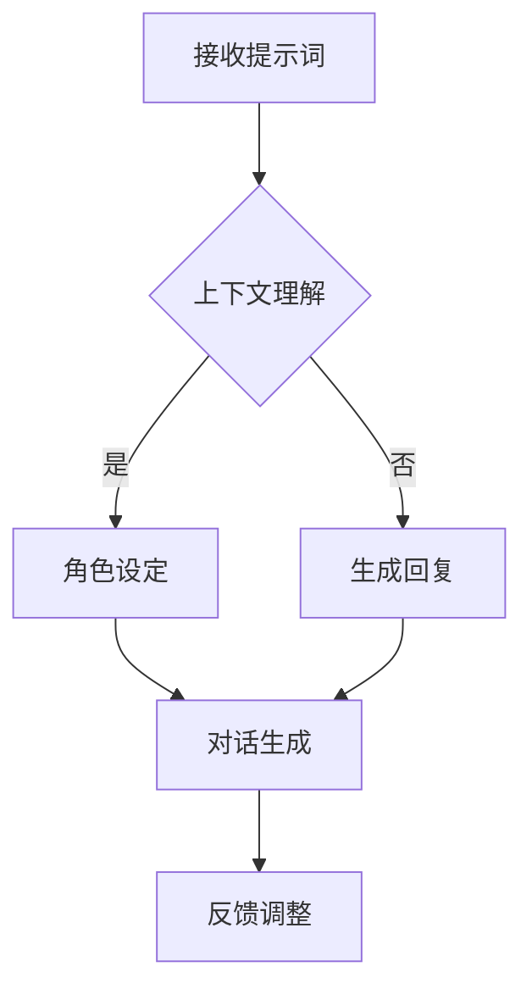

                 

### 文章标题

# 《ChatGPT角色扮演：提示词的魔力》

### 关键词

- ChatGPT
- 角色扮演
- 提示词
- 自然语言处理
- 应用场景
- 实战案例

### 摘要

本文旨在深入探讨ChatGPT的角色扮演机制以及提示词设计的重要性。通过详细解析ChatGPT的起源、架构、核心原理，我们将理解如何通过精妙的提示词设计，实现ChatGPT在不同应用场景下的角色设定，从而发挥其在客户服务、教育、医疗健康和商业分析等领域的巨大潜力。本文将以实际案例解析为支撑，结合代码实战，展示如何搭建开发环境、设计提示词以及实现ChatGPT的角色扮演。通过本文的阅读，读者将全面掌握ChatGPT的应用原理，掌握提示词设计的技巧，为未来在相关领域的工作打下坚实基础。

## 《ChatGPT角色扮演：提示词的魔力》目录大纲

### 第一部分：ChatGPT基础与角色设定

#### 第1章：ChatGPT概述
- **1.1 ChatGPT的起源与发展**
  - ChatGPT的诞生背景
  - 语言模型的发展历程
  - OpenAI与GPT系列模型
- **1.2 ChatGPT的核心功能**
  - 自动生成文本
  - 问答与对话系统
  - 文本摘要与生成
- **1.3 ChatGPT的角色与适用场景**
  - 客户服务
  - 教育辅导
  - 医疗健康
  - 商业分析

#### 第2章：ChatGPT的架构与核心原理
- **2.1 语言模型与自然语言处理**
  - 语言模型的基本原理
  - 自然语言处理的挑战
  - 词向量与词嵌入
- **2.2 大规模预训练模型的工作原理**
  - 预训练与微调
  - GPT模型的架构
  - 训练与推理流程
- **2.3 ChatGPT的角色扮演机制**
  - 提示词与上下文生成
  - 多角色对话与切换
  - 角色设定的实现方法

#### 第3章：ChatGPT的角色设定与提示词设计
- **3.1 角色设定的重要性**
  - 提高对话质量
  - 定位应用场景
  - 避免模式化回答
- **3.2 提示词的种类与作用**
  - 直接提示词
  - 上下文提示词
  - 角色切换提示词
- **3.3 提示词的设计原则与技巧**
  - 清晰明确
  - 完整上下文
  - 避免歧义
  - 适应性设计

### 第二部分：ChatGPT在多场景中的应用

#### 第4章：ChatGPT在客户服务中的应用
- **4.1 客户服务场景下的角色设定**
  - 客服机器人的角色定义
  - 客户咨询与问题解答
- **4.2 提示词设计在客户服务中的实践**
  - 提示词案例解析
  - 实践技巧分享
- **4.3 成功案例分享**
  - 国内外成功案例

#### 第5章：ChatGPT在教育领域的应用
- **5.1 教育场景下的角色设定**
  - 学生辅导
  - 教师辅助
- **5.2 提示词设计在教育中的应用**
  - 作业与考试辅导
  - 学习资源推荐
- **5.3 教育领域案例解析**
  - 在线教育平台
  - 智能评测系统

#### 第6章：ChatGPT在医疗健康领域的应用
- **6.1 医疗健康场景下的角色设定**
  - 医疗咨询
  - 疾病诊断
- **6.2 提示词设计在医疗健康中的应用**
  - 用户问诊
  - 医生辅助
- **6.3 医疗健康领域案例解析**
  - 智能健康助手
  - 医疗知识库

#### 第7章：ChatGPT在商业分析中的应用
- **7.1 商业分析场景下的角色设定**
  - 数据分析
  - 商业决策
- **7.2 提示词设计在商业分析中的应用**
  - 数据挖掘
  - 报告生成
- **7.3 商业分析领域案例解析**
  - 市场调研
  - 风险评估

### 第三部分：ChatGPT角色扮演与提示词设计实战

#### 第8章：实战案例解析
- **8.1 实战案例1：客户服务机器人**
  - 案例背景
  - 提示词设计
  - 实现过程
- **8.2 实战案例2：教育辅导机器人**
  - 案例背景
  - 提示词设计
  - 实现过程
- **8.3 实战案例3：医疗咨询机器人**
  - 案例背景
  - 提示词设计
  - 实现过程

#### 第9章：开发环境搭建与实战
- **9.1 开发环境搭建**
  - 环境准备
  - 开发工具
- **9.2 代码实战：角色扮演与提示词设计**
  - 代码实现
  - 伪代码与公式
- **9.3 代码解读与分析**
  - 代码结构与功能
  - 性能优化

#### 第10章：未来展望与挑战
- **10.1 ChatGPT角色扮演的发展趋势**
  - 技术演进
  - 应用拓展
- **10.2 提示词设计的技术挑战**
  - 提示词生成
  - 适应性优化
- **10.3 行业应用的前景与未来方向**
  - 教育领域
  - 医疗健康
  - 商业分析

### 附录

#### 附录A：ChatGPT开发资源与工具
- **A.1 ChatGPT开发环境搭建**
  - 环境配置
  - 开发工具
- **A.2 常用开发工具与框架**
  - PyTorch
  - TensorFlow
  - OpenAI Gym
- **A.3 资源与参考文献**
  - 开源项目
  - 学术论文
  - 实用教程

## 第一部分：ChatGPT基础与角色设定

### 第1章：ChatGPT概述

#### 1.1 ChatGPT的起源与发展

ChatGPT是由OpenAI开发的一种基于大型语言模型的人工智能助手。其诞生背景可以追溯到深度学习和自然语言处理（NLP）的快速发展时期。OpenAI成立于2015年，是一家致力于推动人工智能研究的非营利性组织。在OpenAI的众多项目中，GPT（Generative Pre-trained Transformer）系列模型是最具代表性的一部分。

GPT系列模型的发展历程可以追溯到2018年的GPT-1，随后依次推出了GPT-2、GPT-3和GPT-3.5。每一代模型都在预训练规模、参数数量和性能上实现了显著的提升。其中，GPT-3于2020年发布，拥有1750亿个参数，能够生成高质量、连贯的自然语言文本，成为自然语言处理领域的重要突破。

ChatGPT是GPT-3的进一步应用和拓展，通过为模型设定不同的角色和场景，使其能够模拟各种角色进行对话。这种角色扮演机制不仅丰富了ChatGPT的应用场景，也为其在客户服务、教育、医疗健康和商业分析等领域的应用提供了无限可能。

#### 1.2 ChatGPT的核心功能

ChatGPT的核心功能主要包括自动生成文本、问答与对话系统以及文本摘要与生成。

1. **自动生成文本**：ChatGPT可以通过输入一段文本，生成与之相关的新文本。这一功能广泛应用于内容创作、新闻生成、创意写作等领域。

2. **问答与对话系统**：ChatGPT可以模拟人类进行对话，回答用户提出的问题。这一功能在客户服务、智能助手、在线咨询等领域具有广泛的应用。

3. **文本摘要与生成**：ChatGPT能够从大量文本中提取关键信息，生成摘要。同时，它也能根据用户的需求生成新的文本内容，如文章、报告、演讲稿等。

#### 1.3 ChatGPT的角色与适用场景

ChatGPT的角色设定使其能够适应不同的应用场景。以下是ChatGPT在不同领域的适用场景：

1. **客户服务**：ChatGPT可以模拟客服代表，回答客户的问题，提供解决方案。这在电商、金融、旅游等行业具有广泛应用。

2. **教育辅导**：ChatGPT可以作为教师或辅导员的助手，帮助学生解答问题，提供学习资源。这有助于提高教学效果，减轻教师负担。

3. **医疗健康**：ChatGPT可以模拟医生或咨询师，为用户提供医疗咨询，辅助诊断疾病。这有助于提升医疗服务质量，缓解医疗资源不足的问题。

4. **商业分析**：ChatGPT可以分析市场数据，生成报告，为企业的决策提供支持。这有助于提高商业分析的效率，优化决策过程。

通过以上介绍，我们可以看到ChatGPT在各个领域的广泛应用和巨大潜力。接下来，我们将深入探讨ChatGPT的架构与核心原理，理解其实现角色扮演的机制。

#### 1.4 ChatGPT的角色扮演机制

ChatGPT的角色扮演机制是其核心功能之一，使得模型能够模拟不同角色进行对话，提供个性化服务。实现这一机制的关键在于提示词（Prompt）的设计和上下文生成。

**提示词**是指用户输入的引导信息，用于指定ChatGPT的角色和对话场景。通过合理的提示词设计，用户可以引导ChatGPT扮演特定的角色，如医生、老师、客服等。提示词可以分为以下几种类型：

1. **直接提示词**：直接指定角色和任务，例如：“请扮演一位医生，回答以下问题：什么是高血压？”
2. **上下文提示词**：提供背景信息，帮助ChatGPT理解对话场景，例如：“假设你是一名医生，有一位患者咨询高血压的治疗方法。”
3. **角色切换提示词**：用于在对话过程中切换角色，例如：“现在，请切换到学生角色，回答老师的问题。”

**上下文生成**是指在提示词的基础上，ChatGPT根据上下文信息生成相应的回复。这一过程涉及到自然语言处理的多个环节，包括词嵌入、注意力机制和生成模型等。

ChatGPT的角色扮演机制主要包括以下几个步骤：

1. **接收提示词**：ChatGPT接收到用户输入的提示词，理解其含义和角色要求。
2. **上下文理解**：通过自然语言处理技术，ChatGPT解析提示词中的上下文信息，构建对话场景。
3. **角色设定**：根据提示词，ChatGPT设定相应的角色，如医生、学生、客服等。
4. **对话生成**：基于设定的角色和上下文，ChatGPT生成相应的回复，进行对话。
5. **反馈调整**：根据用户反馈，ChatGPT调整角色设定和对话策略，提高对话质量。

通过合理的提示词设计和上下文生成，ChatGPT能够模拟不同角色，提供个性化的服务。这一机制不仅提高了ChatGPT的应用灵活性，也为其在多个领域的深入应用奠定了基础。

### 第2章：ChatGPT的架构与核心原理

#### 2.1 语言模型与自然语言处理

语言模型是自然语言处理（NLP）的核心组成部分，它用于理解和生成自然语言。语言模型的基本原理是通过大量文本数据学习语言规律，从而预测下一个词语或句子。这通常通过统计方法或深度学习模型实现。

在自然语言处理领域，语言模型的挑战主要体现在以下几个方面：

1. **词汇量与多样性**：自然语言包含大量词汇和表达方式，如何有效处理词汇量和多样性是语言模型需要解决的问题。
2. **语义理解**：自然语言中的语义信息丰富而复杂，如何准确理解语义是自然语言处理的关键。
3. **上下文依赖**：语言表达往往依赖于上下文，如何捕捉和理解上下文信息是语言模型的挑战。

词向量与词嵌入是语言模型处理自然语言的重要技术。词向量是将单词映射到高维空间中的向量，通过计算词向量之间的距离，可以表示单词之间的语义关系。词嵌入则是通过神经网络模型将单词映射到低维空间中的向量，能够更好地捕捉语义信息。

#### 2.2 大规模预训练模型的工作原理

大规模预训练模型是ChatGPT的核心，其工作原理主要包括预训练和微调两个阶段。

**预训练**是指在大量未标注的文本数据上对模型进行训练，使其掌握通用的语言规律。GPT系列模型通过自回归语言模型（Autoregressive Language Model）进行预训练，具体步骤如下：

1. **数据准备**：收集并整理大量互联网文本数据，如新闻、文章、对话等。
2. **文本预处理**：对文本进行分词、去停用词、归一化等处理，将其转换为模型可接受的输入格式。
3. **训练**：通过随机梯度下降（SGD）等优化算法，在文本数据上训练模型，使其能够预测下一个词语。

**微调**是指在预训练模型的基础上，针对特定任务进行细粒度调整。微调的主要步骤如下：

1. **数据准备**：收集并整理与任务相关的数据，如问答对、对话记录等。
2. **数据预处理**：对数据集进行预处理，包括数据清洗、标注、格式转换等。
3. **微调**：在预训练模型的基础上，使用微调数据训练模型，使其能够更好地适应特定任务。

#### 2.3 ChatGPT的角色扮演机制

ChatGPT的角色扮演机制是通过提示词设计和上下文生成实现的。具体步骤如下：

1. **接收提示词**：ChatGPT接收到用户输入的提示词，理解其含义和角色要求。
2. **上下文理解**：通过自然语言处理技术，ChatGPT解析提示词中的上下文信息，构建对话场景。
3. **角色设定**：根据提示词，ChatGPT设定相应的角色，如医生、学生、客服等。
4. **对话生成**：基于设定的角色和上下文，ChatGPT生成相应的回复，进行对话。
5. **反馈调整**：根据用户反馈，ChatGPT调整角色设定和对话策略，提高对话质量。

通过以上机制，ChatGPT能够灵活地模拟不同角色，提供个性化的服务。这一过程涉及到自然语言处理、深度学习等多个领域的知识和技术。

### 第3章：ChatGPT的角色设定与提示词设计

#### 3.1 角色设定的重要性

在ChatGPT的应用中，角色设定是至关重要的一环。合理的角色设定不仅能够提高对话质量，还能更好地满足用户需求，提升用户体验。以下是角色设定在ChatGPT应用中的重要性：

1. **提高对话质量**：通过角色设定，ChatGPT能够明确自身的身份和任务，生成更具针对性和准确性的回复。这有助于避免模糊、不明确的回答，提高对话的流畅性和有效性。
2. **定位应用场景**：不同的角色适用于不同的应用场景。通过角色设定，ChatGPT能够更好地适应特定场景，发挥其优势。例如，在客户服务场景中，ChatGPT可以扮演客服代表；在医疗健康场景中，ChatGPT可以扮演医生或咨询师。
3. **避免模式化回答**：角色设定使得ChatGPT能够根据不同角色生成个性化的回答，避免生成千篇一律的回答。这有助于提高ChatGPT的灵活性和多样性，满足用户个性化需求。

#### 3.2 提示词的种类与作用

提示词是引导ChatGPT进行角色设定和对话的重要工具。根据提示词的不同类型，可以分为以下几类：

1. **直接提示词**：直接指定角色和任务，例如：“请扮演一位医生，回答以下问题：什么是高血压？”这类提示词明确指示了ChatGPT的角色和对话任务，便于模型理解和执行。
2. **上下文提示词**：提供背景信息，帮助ChatGPT理解对话场景，例如：“假设你是一名医生，有一位患者咨询高血压的治疗方法。”这类提示词为ChatGPT提供了更多的上下文信息，有助于模型构建对话场景。
3. **角色切换提示词**：用于在对话过程中切换角色，例如：“现在，请切换到学生角色，回答老师的问题。”这类提示词在多角色对话中非常重要，使得ChatGPT能够灵活地在不同角色之间切换。

不同的提示词类型在角色设定和对话中发挥着不同的作用。直接提示词明确指示角色和任务，上下文提示词提供对话背景，角色切换提示词实现角色切换。通过合理组合和使用这些提示词，ChatGPT能够实现灵活的角色设定和高质量的对话生成。

#### 3.3 提示词的设计原则与技巧

为了实现有效的角色设定和高质量的对话生成，提示词的设计需要遵循以下原则和技巧：

1. **清晰明确**：提示词应明确指示角色和任务，避免歧义和模糊。例如，使用具体角色名称而非泛称，使用明确的任务描述而非模糊指示。
2. **完整上下文**：提供足够的上下文信息，帮助ChatGPT理解对话场景。这包括背景信息、用户需求和预期回答等。完整上下文有助于ChatGPT生成更准确、更相关的回答。
3. **避免歧义**：避免使用可能导致歧义的语言，确保提示词的唯一性和明确性。例如，避免使用模糊的指示词，确保角色和任务的一致性。
4. **适应性设计**：根据对话场景和用户需求，动态调整提示词。在不同场景和角色切换时，提示词应适应新的对话环境和任务要求。
5. **简洁明了**：避免过于复杂的提示词，确保其简洁明了。简洁的提示词有助于ChatGPT快速理解并生成高质量的回答。

以下是一个示例，展示如何设计一个有效的提示词：

**提示词设计示例**：

“请扮演一位医生，回答以下问题：高血压患者应该如何饮食？”

该提示词明确了角色（医生）和任务（回答关于高血压患者饮食的问题），并提供了完整的上下文信息。通过这个提示词，ChatGPT能够准确理解对话场景，并生成相关、准确的回答。

#### 3.4 提示词设计在实际应用中的挑战

尽管提示词设计在ChatGPT的角色设定和对话生成中起着关键作用，但在实际应用中仍然面临一些挑战：

1. **多样性和一致性**：设计足够多样且一致的提示词，以满足不同场景和用户需求。这要求对各种场景和角色有深入理解，并能够设计出适应不同情境的提示词。
2. **上下文理解**：确保提示词包含足够的上下文信息，以帮助ChatGPT准确理解对话场景。在实际应用中，上下文信息的获取和传递可能存在困难，需要设计更有效的上下文传递机制。
3. **角色切换**：在多角色对话中，实现流畅的角色切换是关键。提示词设计需要考虑角色切换的时机、方式和逻辑，确保ChatGPT能够在不同角色之间灵活切换。
4. **错误处理**：当提示词设计不当时，可能导致ChatGPT生成不准确或不合适的回答。设计时应考虑如何处理和纠正这些错误，以提高对话质量和用户满意度。

为了克服这些挑战，可以采取以下措施：

- **需求分析和场景模拟**：在提示词设计前，进行详细的需求分析和场景模拟，确保设计出满足用户需求、适应实际应用的提示词。
- **多轮反馈和迭代**：通过多轮用户反馈和迭代，不断优化提示词设计，提高其多样性和一致性。
- **上下文信息传递**：采用上下文传递机制，如上下文嵌入、动态更新等，确保ChatGPT能够获取和处理足够的信息。
- **错误处理策略**：设计错误处理策略，如自动纠正、用户提示等，帮助ChatGPT在错误情况下生成更合适的回答。

通过上述措施，可以在实际应用中克服提示词设计面临的挑战，实现更有效、更高质量的ChatGPT角色设定和对话生成。

### 第4章：ChatGPT在客户服务中的应用

#### 4.1 客户服务场景下的角色设定

在客户服务场景中，ChatGPT的角色设定至关重要。通过合理设定角色，ChatGPT能够更准确地理解和回答客户的问题，提高服务质量和用户满意度。以下是几种常见的角色设定：

1. **客服代表**：客服代表是客户服务中最常见的角色，负责解答客户的疑问、提供解决方案和进行售后支持。通过设定为客服代表，ChatGPT能够模拟真实的客服人员，与客户进行对话。
2. **技术支持专家**：在一些技术性较强的行业，如IT、互联网等，客户可能需要专业的技术支持。设定为技术支持专家的ChatGPT能够提供技术性解答和问题解决建议。
3. **客户顾问**：在销售和服务过程中，客户顾问的角色至关重要。客户顾问需要了解客户需求，提供个性化的产品推荐和服务建议。设定为客户顾问的ChatGPT能够更好地引导客户，提高销售转化率。

#### 4.2 提示词设计在客户服务中的实践

在客户服务场景中，提示词的设计直接影响ChatGPT的表现。以下是一些实际应用中的提示词设计案例：

1. **直接提示词**：例如，“请扮演一位客服代表，回答客户关于产品退货政策的疑问。”这种提示词明确指示了角色和任务，便于ChatGPT理解并生成回答。
2. **上下文提示词**：例如，“假设客户询问关于退货政策，你是一位专业的客服代表，请详细解释退货流程和注意事项。”这种提示词提供了对话背景，帮助ChatGPT构建对话场景。
3. **角色切换提示词**：例如，“现在，请切换到技术支持专家的角色，回答客户关于网络故障的问题。”这种提示词实现了角色切换，使得ChatGPT能够灵活应对不同场景。

以下是一个具体的提示词设计案例：

**案例**：客户咨询产品保修期限。

**提示词设计**：

- 直接提示词：“请扮演一位客服代表，回答客户关于产品保修期限的问题。”
- 上下文提示词：“假设客户刚刚购买了我们的产品，并询问保修期限，你作为客服代表，请详细解答。”
- 角色切换提示词：“现在，如果客户提出关于保修期间内的维修服务，请切换到技术支持专家的角色，回答相关问题。”

通过这些提示词，ChatGPT能够准确理解客户需求，提供详细、专业的解答，同时支持角色切换，满足客户多样化的需求。

#### 4.3 成功案例分享

在客户服务领域，ChatGPT的应用已经取得了显著的成功。以下是一些成功案例：

1. **电商平台的客服机器人**：某知名电商平台部署了ChatGPT客服机器人，用于解答消费者关于产品、订单、售后等问题。通过合理的角色设定和提示词设计，客服机器人能够提供高效、专业的服务，提升了用户满意度，降低了人力成本。
2. **金融行业的智能客服**：某金融公司采用了ChatGPT智能客服系统，用于处理客户关于账户查询、交易咨询、理财产品推荐等问题。通过设定不同角色（如客服代表、理财顾问），智能客服能够根据客户需求提供个性化服务，提高了客户黏性和满意度。
3. **电信运营商的客服支持**：某电信运营商引入了ChatGPT客服机器人，用于解答用户关于套餐资费、网络问题、投诉处理等问题。通过多轮对话和角色切换，客服机器人能够高效解决用户问题，减少了人工客服的工作量，提升了服务效率。

这些成功案例表明，ChatGPT在客户服务中的应用具有广阔前景。通过合理设定角色和优化提示词设计，ChatGPT能够提供高效、专业的服务，为企业和用户带来价值。

### 第5章：ChatGPT在教育领域的应用

#### 5.1 教育场景下的角色设定

在教育领域，ChatGPT的角色设定能够极大地提升教学效果和学生参与度。以下是一些常见的教育场景和相应的角色设定：

1. **学生辅导**：ChatGPT可以作为学生的个性化辅导助手，回答学生关于课程内容、作业解答、学习资源推荐等方面的问题。学生辅导角色使得ChatGPT能够提供及时、针对性的帮助，辅助学生自主学习。
2. **教师辅助**：ChatGPT可以作为教师的助手，协助教师进行课程设计、作业批改、教学资源推荐等任务。教师辅助角色使得ChatGPT能够分担教师的一些日常事务，提高教学效率。
3. **学习伙伴**：ChatGPT可以扮演学生的学习伙伴，与学生进行互动式学习，如讨论课程问题、组织学习小组等。学习伙伴角色有助于增强学生的互动和参与感，提高学习兴趣。

#### 5.2 提示词设计在教育中的应用

在教育资源丰富多样的教育场景中，合理的提示词设计对于ChatGPT发挥教育辅助作用至关重要。以下是一些常见的提示词设计案例：

1. **直接提示词**：例如，“请扮演一位学生辅导老师，回答关于数学问题解答的疑问。”这种提示词明确指示了角色和任务，使得ChatGPT能够快速理解并生成相关回答。
2. **上下文提示词**：例如，“假设学生在学习数学时遇到难题，作为辅导老师，请详细解释解题思路。”这种提示词提供了对话背景，帮助ChatGPT构建教学场景，提供更具体、更针对性的解答。
3. **角色切换提示词**：例如，“现在，请切换到教师辅助角色的身份，为学生推荐适合的学习资源。”这种提示词实现了角色切换，使得ChatGPT能够在不同角色之间灵活切换，满足多样化需求。

以下是一个具体的提示词设计案例：

**案例**：学生咨询数学作业解答。

**提示词设计**：

- 直接提示词：“请扮演一位学生辅导老师，回答关于数学作业的问题。”
- 上下文提示词：“假设学生在学习过程中遇到数学作业难题，需要辅导老师的帮助，请详细解答。”
- 角色切换提示词：“现在，请切换到教师辅助角色，为学生推荐相关的学习资源。”

通过这些提示词，ChatGPT能够准确理解学生的需求，提供详细、专业的解答，同时支持角色切换，满足学生在不同学习场景下的需求。

#### 5.3 教育领域案例解析

在教育领域，ChatGPT的应用已经取得了显著的成果。以下是一些实际案例：

1. **在线教育平台**：某知名在线教育平台引入了ChatGPT教育辅导系统，为学生提供实时、个性化的学习支持。通过设定学生辅导和教师辅助角色，ChatGPT能够为学生提供解题指导、作业批改、学习资源推荐等服务，提高了学习效果和用户满意度。
2. **智能评测系统**：某高校研发了基于ChatGPT的智能评测系统，用于自动评估学生的作业和考试答案。ChatGPT作为评测员，通过分析答案内容、逻辑结构和语言表达，提供精准的评分和反馈，减轻了教师的工作负担，提高了评估效率。
3. **学习互动社区**：某教育科技公司创建了基于ChatGPT的学习互动社区，学生可以在社区中与ChatGPT进行互动学习，如提问、讨论、组队学习等。ChatGPT作为学习伙伴，能够激发学生的学习兴趣，促进互动和合作，提高学习效果。

这些案例表明，ChatGPT在教育领域的应用具有巨大潜力。通过合理设定角色和优化提示词设计，ChatGPT能够为教育工作者和学生提供高效、专业的辅助，促进教育创新和提升教学质量。

### 第6章：ChatGPT在医疗健康领域的应用

#### 6.1 医疗健康场景下的角色设定

在医疗健康领域，ChatGPT的角色设定能够为患者和医生提供便捷、高效的医疗服务。以下是一些常见医疗健康场景和相应的角色设定：

1. **医生**：ChatGPT可以扮演医生的角色，为患者提供病情咨询、诊断建议和治疗方案。医生角色使得ChatGPT能够模拟专业医生进行问诊和解答患者疑问，提供专业的医疗建议。
2. **咨询师**：ChatGPT可以作为医疗健康咨询师，为患者提供心理健康咨询、营养建议和生活方式指导。咨询师角色使得ChatGPT能够提供个性化的健康建议，帮助患者改善生活习惯。
3. **辅助诊断工具**：ChatGPT可以作为辅助诊断工具，分析患者症状，提供初步诊断建议。辅助诊断角色使得ChatGPT能够为医生提供参考意见，提高诊断准确性。

#### 6.2 提示词设计在医疗健康中的应用

在医疗健康领域，ChatGPT的提示词设计需要确保准确性和专业性。以下是一些常见的提示词设计案例：

1. **直接提示词**：例如，“请扮演一位医生，回答患者关于高血压的治疗方法。”这种提示词明确指示了角色和任务，使得ChatGPT能够快速理解并生成相关回答。
2. **上下文提示词**：例如，“假设患者因高血压就诊，作为一名医生，请详细解释高血压的治疗方案。”这种提示词提供了对话背景，帮助ChatGPT构建医疗场景，提供更具体、更针对性的解答。
3. **角色切换提示词**：例如，“现在，请切换到咨询师的角色，为患者提供心理健康建议。”这种提示词实现了角色切换，使得ChatGPT能够在不同角色之间灵活切换，满足多样化需求。

以下是一个具体的提示词设计案例：

**案例**：患者咨询高血压治疗。

**提示词设计**：

- 直接提示词：“请扮演一位医生，回答关于高血压治疗的问题。”
- 上下文提示词：“假设患者因高血压就诊，请详细解释高血压的治疗方案和注意事项。”
- 角色切换提示词：“现在，请切换到咨询师的角色，为患者提供心理健康建议。”

通过这些提示词，ChatGPT能够准确理解患者需求，提供专业、详细的医疗建议，同时支持角色切换，满足患者在不同场景下的需求。

#### 6.3 医疗健康领域案例解析

在医疗健康领域，ChatGPT的应用已经取得了显著成效。以下是一些实际案例：

1. **智能健康助手**：某医疗科技公司开发了基于ChatGPT的智能健康助手，为用户提供病情咨询、诊断建议和健康指导。智能健康助手通过设定医生和咨询师角色，能够为用户提供实时、个性化的健康服务，提高用户满意度和健康水平。
2. **在线医疗咨询平台**：某在线医疗咨询平台引入了ChatGPT，为用户提供专业的在线问诊服务。ChatGPT作为医生角色，能够分析用户症状，提供初步诊断建议，为医生提供参考意见，提高诊断准确性。
3. **医疗知识库**：某医院建立了基于ChatGPT的医疗知识库，用于存储和提供最新的医学知识。ChatGPT作为辅助诊断工具，能够分析患者症状，提供初步诊断建议，为医生提供参考，提高诊断效率。

这些案例表明，ChatGPT在医疗健康领域的应用具有巨大潜力。通过合理设定角色和优化提示词设计，ChatGPT能够为患者和医生提供高效、专业的医疗服务，提高医疗质量和患者满意度。

### 第7章：ChatGPT在商业分析中的应用

#### 7.1 商业分析场景下的角色设定

在商业分析领域，ChatGPT的角色设定能够为企业和分析师提供强大的辅助工具。以下是一些常见的商业分析场景和相应的角色设定：

1. **数据分析师**：ChatGPT可以扮演数据分析师的角色，进行数据挖掘、统计分析、趋势预测等任务。数据分析师角色使得ChatGPT能够处理大量数据，发现潜在的商业机会和问题。
2. **商业顾问**：ChatGPT可以作为商业顾问，为企业提供市场分析、业务策略建议和投资决策。商业顾问角色使得ChatGPT能够基于数据分析，提供专业的商业建议，帮助企业制定更有效的战略。
3. **报告生成员**：ChatGPT可以扮演报告生成员的角色，自动生成市场报告、财务报告和业务分析报告。报告生成员角色使得ChatGPT能够提高报告生成效率，节省人力成本。

#### 7.2 提示词设计在商业分析中的应用

在商业分析领域，ChatGPT的提示词设计需要确保数据准确性和分析深度。以下是一些常见的提示词设计案例：

1. **直接提示词**：例如，“请扮演一位数据分析师，分析本季度销售额趋势。”这种提示词明确指示了角色和任务，使得ChatGPT能够快速理解并生成相关分析报告。
2. **上下文提示词**：例如，“假设我们需要分析本季度销售额趋势，请提供详细的数据分析报告，包括趋势图、对比分析和建议。”这种提示词提供了对话背景，帮助ChatGPT构建分析场景，提供更具体、更深入的分析。
3. **角色切换提示词**：例如，“现在，请切换到商业顾问的角色，根据数据分析结果，提供业务策略建议。”这种提示词实现了角色切换，使得ChatGPT能够在不同角色之间灵活切换，满足多样化需求。

以下是一个具体的提示词设计案例：

**案例**：分析某产品市场趋势。

**提示词设计**：

- 直接提示词：“请扮演一位数据分析师，分析该产品在上一季度的市场趋势。”
- 上下文提示词：“假设我们对该产品的市场表现感兴趣，请提供详细的数据分析报告，包括销售额、市场份额和竞争分析。”
- 角色切换提示词：“现在，请切换到商业顾问的角色，根据数据分析结果，提供下一步的市场推广策略。”

通过这些提示词，ChatGPT能够准确理解分析任务，提供专业、深入的商业分析报告，同时支持角色切换，满足企业在不同商业场景下的需求。

#### 7.3 商业分析领域案例解析

在商业分析领域，ChatGPT的应用已经取得了显著成效。以下是一些实际案例：

1. **市场调研报告**：某市场调研公司利用ChatGPT生成市场调研报告，分析行业趋势、消费者行为和竞争对手策略。ChatGPT作为数据分析师和商业顾问，能够快速处理大量数据，提供详尽的分析报告，帮助企业制定有效的市场策略。
2. **财务分析报告**：某企业财务部门引入ChatGPT，生成财务分析报告，包括利润分析、成本控制和风险预测。ChatGPT作为数据分析师和报告生成员，能够高效地处理财务数据，提供准确的分析报告，帮助管理层做出明智的决策。
3. **投资决策支持**：某投资公司利用ChatGPT进行投资决策分析，分析市场趋势、股票价格波动和潜在风险。ChatGPT作为商业顾问和数据分析工具，能够提供实时、全面的分析报告，帮助投资团队做出更科学的投资决策。

这些案例表明，ChatGPT在商业分析领域的应用具有巨大潜力。通过合理设定角色和优化提示词设计，ChatGPT能够为企业和分析师提供高效、专业的商业分析支持，提升业务决策的科学性和准确性。

### 第8章：实战案例解析

#### 8.1 实战案例1：客户服务机器人

**案例背景**：

某大型电商平台希望提升客户服务质量，减少人工客服的工作量。为此，他们决定引入基于ChatGPT的客户服务机器人，用于解答消费者关于产品、订单和售后等方面的问题。

**提示词设计**：

1. **直接提示词**：“请扮演一位客服代表，回答消费者关于产品退货政策的疑问。”
2. **上下文提示词**：“假设消费者购买了一件商品，但想要退货，请详细解释退货流程和注意事项。”
3. **角色切换提示词**：“现在，如果消费者询问关于订单查询的问题，请切换到订单管理员的身份，回答相关问题。”

**实现过程**：

1. **数据准备**：收集电商平台的历史客服对话记录，用于训练ChatGPT。
2. **模型训练**：使用预训练的GPT模型，结合电商平台的数据进行微调训练。
3. **接口搭建**：搭建与电商平台系统集成的前端接口，使得ChatGPT能够与消费者进行实时对话。
4. **测试与优化**：在测试阶段，通过模拟消费者提问和退货场景，不断优化ChatGPT的回答质量。

**代码实现**：

```python
import openai
import json

# 设置API密钥和模型参数
openai.api_key = "your_api_key"
model_engine = "text-davinci-002"

# 接收用户输入
def handle_user_input(prompt):
    response = openai.Completion.create(
        engine=model_engine,
        prompt=prompt,
        max_tokens=100,
        n=1,
        stop=None,
        temperature=0.5,
    )
    return response.choices[0].text.strip()

# 实现客服对话
def customer_service():
    print("欢迎来到我们的客户服务平台！")
    while True:
        user_input = input("您有什么问题？（输入'退出'结束对话）：")
        if user_input.lower() == "退出":
            print("感谢您的咨询，祝您有美好的一天！")
            break
        prompt = f"您是一位客服代表，请回答以下问题：{user_input}"
        response = handle_user_input(prompt)
        print(f"客服回答：{response}")

# 运行客服对话
customer_service()
```

**代码解读与分析**：

上述代码通过OpenAI的API实现了与ChatGPT的接口通信，处理用户输入并返回相应的回答。在`handle_user_input`函数中，通过`openai.Completion.create`方法调用ChatGPT接口，生成回复。`customer_service`函数则用于搭建与用户之间的对话环境，通过循环不断接收用户输入并调用`handle_user_input`函数进行回答。通过这个案例，我们可以看到如何利用ChatGPT实现一个简单的客户服务机器人，并在实际应用中进行测试和优化。

#### 8.2 实战案例2：教育辅导机器人

**案例背景**：

某在线教育平台希望为学生提供个性化的学习辅导，提高学习效果。为此，他们决定开发一个基于ChatGPT的教育辅导机器人，用于解答学生的课程问题、作业辅导和学习资源推荐。

**提示词设计**：

1. **直接提示词**：“请扮演一位数学辅导老师，解答关于函数问题。”
2. **上下文提示词**：“假设学生在学习函数时遇到困难，请提供详细的解答过程和知识点复习建议。”
3. **角色切换提示词**：“现在，请切换到英语辅导老师的角色，为学生推荐合适的阅读材料。”

**实现过程**：

1. **数据准备**：收集教育平台的历史问答记录，用于训练ChatGPT。
2. **模型训练**：使用预训练的GPT模型，结合教育平台的数据进行微调训练。
3. **接口搭建**：搭建与在线教育平台集成的API接口，使得ChatGPT能够接收学生提问并提供辅导。
4. **测试与优化**：在测试阶段，通过模拟学生提问和辅导场景，不断优化ChatGPT的回答质量和响应速度。

**代码实现**：

```python
import openai
import json

# 设置API密钥和模型参数
openai.api_key = "your_api_key"
model_engine = "text-davinci-002"

# 接收用户输入
def handle_user_input(prompt):
    response = openai.Completion.create(
        engine=model_engine,
        prompt=prompt,
        max_tokens=100,
        n=1,
        stop=None,
        temperature=0.5,
    )
    return response.choices[0].text.strip()

# 实现教育辅导对话
def educational_tutor():
    print("您好，我是您的在线辅导老师，请问有什么问题我可以帮助您解答？")
    while True:
        user_input = input("请输入您的问题（输入'退出'结束对话）：")
        if user_input.lower() == "退出":
            print("感谢您的咨询，祝您学习进步！")
            break
        prompt = f"您是一位教育辅导老师，请回答以下问题：{user_input}"
        response = handle_user_input(prompt)
        print(f"辅导老师回答：{response}")

# 运行教育辅导对话
educational_tutor()
```

**代码解读与分析**：

上述代码通过OpenAI的API实现了与ChatGPT的接口通信，处理用户输入并返回相应的回答。在`handle_user_input`函数中，通过`openai.Completion.create`方法调用ChatGPT接口，生成回复。`educational_tutor`函数则用于搭建与学生之间的对话环境，通过循环不断接收学生输入并调用`handle_user_input`函数进行回答。通过这个案例，我们可以看到如何利用ChatGPT实现一个简单的教育辅导机器人，并在实际应用中进行测试和优化。

#### 8.3 实战案例3：医疗咨询机器人

**案例背景**：

某在线医疗咨询平台希望为用户提供便捷的医疗咨询服务，提高医疗服务质量。为此，他们决定开发一个基于ChatGPT的医疗咨询机器人，用于解答用户的健康咨询、疾病诊断和治疗方案建议。

**提示词设计**：

1. **直接提示词**：“请扮演一位医生，回答关于高血压的治疗方法。”
2. **上下文提示词**：“假设用户因高血压就诊，请详细解释高血压的治疗方案和注意事项。”
3. **角色切换提示词**：“现在，请切换到咨询师的角色，为用户提供心理健康建议。”

**实现过程**：

1. **数据准备**：收集医疗平台的历史健康咨询记录，用于训练ChatGPT。
2. **模型训练**：使用预训练的GPT模型，结合医疗平台的数据进行微调训练。
3. **接口搭建**：搭建与在线医疗平台集成的API接口，使得ChatGPT能够接收用户提问并提供医疗咨询。
4. **测试与优化**：在测试阶段，通过模拟用户提问和咨询场景，不断优化ChatGPT的回答质量和响应速度。

**代码实现**：

```python
import openai
import json

# 设置API密钥和模型参数
openai.api_key = "your_api_key"
model_engine = "text-davinci-002"

# 接收用户输入
def handle_user_input(prompt):
    response = openai.Completion.create(
        engine=model_engine,
        prompt=prompt,
        max_tokens=100,
        n=1,
        stop=None,
        temperature=0.5,
    )
    return response.choices[0].text.strip()

# 实现医疗咨询对话
def medical_advisory():
    print("您好，我是您的在线健康顾问，请问有什么健康问题我可以帮助您解答？")
    while True:
        user_input = input("请输入您的问题（输入'退出'结束对话）：")
        if user_input.lower() == "退出":
            print("感谢您的咨询，祝您身体健康！")
            break
        prompt = f"您是一位医生，请回答以下问题：{user_input}"
        response = handle_user_input(prompt)
        print(f"医生回答：{response}")

# 运行医疗咨询对话
medical_advisory()
```

**代码解读与分析**：

上述代码通过OpenAI的API实现了与ChatGPT的接口通信，处理用户输入并返回相应的回答。在`handle_user_input`函数中，通过`openai.Completion.create`方法调用ChatGPT接口，生成回复。`medical_advisory`函数则用于搭建与用户之间的对话环境，通过循环不断接收用户输入并调用`handle_user_input`函数进行回答。通过这个案例，我们可以看到如何利用ChatGPT实现一个简单的医疗咨询机器人，并在实际应用中进行测试和优化。

### 第9章：开发环境搭建与实战

#### 9.1 开发环境搭建

要实现ChatGPT的角色扮演和提示词设计，首先需要搭建一个合适的开发环境。以下是搭建开发环境的步骤：

1. **安装Python**：确保Python环境已安装。ChatGPT的API需要Python环境来运行。下载并安装Python，推荐使用Python 3.8及以上版本。
2. **安装OpenAI API**：在终端中运行以下命令安装OpenAI Python客户端库：
   ```bash
   pip install openai
   ```
3. **获取API密钥**：在OpenAI官网注册账号，并创建一个新的API密钥。将获取的API密钥保存在一个安全的位置，以便后续在代码中调用。
4. **配置环境变量**：将API密钥配置到环境变量中，以便在代码中自动加载。在终端中运行以下命令：
   ```bash
   export OPENAI_API_KEY=your_api_key
   ```
5. **安装其他依赖库**：根据需要安装其他依赖库，如TensorFlow、PyTorch等。这些库可以用于模型训练和优化。

#### 9.2 代码实战：角色扮演与提示词设计

在开发环境中，我们可以使用以下Python代码实现ChatGPT的角色扮演和提示词设计：

```python
import openai

# 设置API密钥
openai.api_key = "your_api_key"

# 定义角色和提示词
def generate_response(role, prompt):
    system_message = f"你是一位{role}。"
    user_message = f"用户提问：{prompt}"
    conversation = [{"role": "system", "content": system_message},
                    {"role": "user", "content": user_message}]

    response = openai.ChatCompletion.create(
        model="gpt-3.5-turbo",
        messages=conversation,
        max_tokens=100,
        n=1,
        stop=None,
        temperature=0.5
    )
    return response.choices[0].message.content.strip()

# 测试角色扮演
print(generate_response("医生", "高血压的治疗方法是什么？"))

# 测试提示词设计
print(generate_response("老师", "请解释函数的概念。"))
```

**代码解读与分析**：

上述代码首先设置OpenAI API密钥，并定义了一个名为`generate_response`的函数。该函数接受角色（role）和提示词（prompt）作为输入，构建一个包含系统消息和用户消息的对话上下文，然后通过OpenAI的`ChatCompletion.create`方法生成回复。在测试部分，我们分别调用`generate_response`函数，模拟医生和老师的角色扮演，并输出相应的回答。

通过这个代码实战，我们可以看到如何搭建ChatGPT的开发环境，并实现角色扮演和提示词设计。实际应用中，可以根据具体需求进一步优化和扩展。

#### 9.3 代码解读与分析

在实现ChatGPT的角色扮演与提示词设计时，代码的解读与分析至关重要。以下是对上述代码的详细解读与分析：

**1. 导入OpenAI库**

首先，我们引入了`openai`库，这是与OpenAI API进行通信的Python客户端库。通过这个库，我们可以调用OpenAI提供的各种API接口，如文本生成、问答系统等。

```python
import openai
```

**2. 设置API密钥**

接下来，我们设置了OpenAI API密钥。这个密钥是我们与OpenAI进行身份验证的关键，确保我们的请求能够被正确处理。在代码中，我们使用环境变量`OPENAI_API_KEY`来存储密钥，这是一种安全且便于管理的方式。

```python
openai.api_key = "your_api_key"
```

**3. 定义角色和提示词生成函数**

我们定义了一个名为`generate_response`的函数，用于接收角色和提示词，并生成相应的回复。这个函数的工作流程如下：

- **系统消息**：通过参数`role`，我们构建了一个系统消息，表明ChatGPT将扮演指定的角色。例如，当角色为“医生”时，系统消息将变为“你是一位医生”。
- **用户消息**：接收用户输入的提示词，并将其作为用户消息。
- **对话上下文**：将系统消息和用户消息构建为一个对话上下文，这是ChatGPT生成回复的基础。

```python
def generate_response(role, prompt):
    system_message = f"你是一位{role}。"
    user_message = f"用户提问：{prompt}"
    conversation = [{"role": "system", "content": system_message},
                    {"role": "user", "content": user_message}]
```

**4. 调用OpenAI ChatCompletion API**

我们使用`openai.ChatCompletion.create`方法来生成回复。这个方法接受以下参数：

- **model**：指定使用的模型，如“gpt-3.5-turbo”。
- **messages**：对话上下文，包括系统消息和用户消息。
- **max_tokens**：生成回复的最大长度。
- **n**：生成回复的数量。
- **stop**：用于停止生成回复的条件。
- **temperature**：生成回复的随机性，值越大，生成的回复越多样化。

```python
response = openai.ChatCompletion.create(
    model="gpt-3.5-turbo",
    messages=conversation,
    max_tokens=100,
    n=1,
    stop=None,
    temperature=0.5
)
```

**5. 返回生成回复**

最后，我们从API响应中提取生成的回复，并返回给用户。

```python
return response.choices[0].message.content.strip()
```

**6. 测试角色扮演和提示词设计**

在测试部分，我们分别调用`generate_response`函数，模拟医生和老师的角色扮演，并输出相应的回答。

```python
print(generate_response("医生", "高血压的治疗方法是什么？"))
print(generate_response("老师", "请解释函数的概念。"))
```

通过这个代码实战，我们可以看到如何通过简单的Python代码实现ChatGPT的角色扮演和提示词设计。实际应用中，可以根据具体需求调整模型、参数和提示词，以达到最佳效果。

### 第10章：未来展望与挑战

#### 10.1 ChatGPT角色扮演的发展趋势

随着人工智能技术的不断进步，ChatGPT的角色扮演功能也在不断发展。以下是ChatGPT角色扮演在未来可能的发展趋势：

1. **模型性能的提升**：随着更大规模、更复杂的预训练模型的推出，ChatGPT的角色扮演能力将得到进一步提升，生成文本的质量和准确性将得到显著提高。
2. **多模态交互**：未来的ChatGPT可能支持多模态交互，如文本、语音、图像等，使得角色扮演更贴近人类的交互方式。
3. **个性化角色设定**：通过更深入的用户数据分析和学习，ChatGPT将能够根据用户的偏好和需求，提供更加个性化的角色设定和对话体验。
4. **跨领域应用**：ChatGPT的角色扮演将在更多领域得到应用，如法律咨询、金融分析、医疗诊断等，成为各行业的智能助手。

#### 10.2 提示词设计的技术挑战

尽管ChatGPT的角色扮演功能已经非常强大，但在提示词设计方面仍然存在一些技术挑战：

1. **上下文理解**：当前的ChatGPT在处理长文本和复杂上下文时，仍存在一定困难。如何提高上下文理解能力，使其能够准确捕捉和利用上下文信息，是未来需要解决的关键问题。
2. **适应性优化**：不同场景和角色对提示词的要求不同，如何设计适应性强的提示词，使得ChatGPT能够在各种场景下表现优异，是一个亟待解决的问题。
3. **错误处理**：当提示词设计不当或上下文信息不足时，ChatGPT可能会生成不合适的回答。如何设计有效的错误处理机制，使得ChatGPT能够在错误情况下迅速调整并生成更合适的回答，是一个重要的挑战。

#### 10.3 行业应用的前景与未来方向

ChatGPT在各个行业的应用前景广阔，以下是几个主要领域的应用方向：

1. **客户服务**：ChatGPT在客户服务中的应用已经取得显著成效，未来将继续优化和扩展，实现更智能、更高效的服务。
2. **教育辅导**：ChatGPT在教育辅导中的应用有望进一步提升教学效果，提高学生的学习兴趣和参与度。
3. **医疗健康**：ChatGPT在医疗健康领域的应用将为医生和患者提供更便捷、更专业的服务，有助于提高医疗服务质量和效率。
4. **商业分析**：ChatGPT在商业分析中的应用将为企业提供强大的数据支持和决策辅助，助力企业实现更精准的市场分析和业务策略。

未来的ChatGPT将在更多领域发挥重要作用，为各行各业带来创新和变革。通过不断优化技术、提升性能和扩展应用场景，ChatGPT将继续成为人工智能领域的明星产品。

### 附录A：ChatGPT开发资源与工具

#### A.1 ChatGPT开发环境搭建

要搭建一个ChatGPT的开发环境，需要以下步骤：

1. **安装Python**：确保Python环境已安装。下载并安装Python 3.8及以上版本。
2. **安装OpenAI API**：在终端中运行以下命令安装OpenAI Python客户端库：
   ```bash
   pip install openai
   ```
3. **获取API密钥**：在OpenAI官网注册账号，并创建一个新的API密钥。将获取的API密钥保存在一个安全的位置，以便后续在代码中调用。
4. **配置环境变量**：将API密钥配置到环境变量中，以便在代码中自动加载。在终端中运行以下命令：
   ```bash
   export OPENAI_API_KEY=your_api_key
   ```

#### A.2 常用开发工具与框架

在开发ChatGPT应用时，以下工具和框架可能非常有用：

1. **PyTorch**：一个流行的深度学习框架，用于构建和训练神经网络模型。
2. **TensorFlow**：另一个流行的深度学习框架，适用于各种机器学习和深度学习任务。
3. **OpenAI Gym**：一个开源环境，用于开发和研究强化学习算法。

#### A.3 资源与参考文献

以下是一些ChatGPT开发和学习资源：

1. **OpenAI官网**：了解最新进展、API文档和模型细节。
   - [OpenAI官网](https://openai.com/)
2. **GitHub开源项目**：查找和参与ChatGPT相关的开源项目。
   - [ChatGPT GitHub仓库](https://github.com/openai/gpt-3.5-turbo)
3. **学术论文**：阅读相关领域的学术论文，了解最新的研究进展。
   - [GPT-3论文](https://arxiv.org/abs/2005.14165)
4. **在线教程和课程**：参加在线教程和课程，学习ChatGPT的基本原理和应用。
   - [OpenAI官方教程](https://openai.com/docs/introduction)
   - [Coursera深度学习课程](https://www.coursera.org/learn/deep-learning)

通过利用这些资源和工具，开发者可以更好地理解和应用ChatGPT，为各种应用场景设计高效的解决方案。

### 附录B：Mermaid流程图与算法原理

#### Mermaid流程图

以下是一个使用Mermaid语言编写的流程图示例，展示了ChatGPT的角色扮演机制：



该流程图描述了ChatGPT从接收提示词到生成回复的过程。首先，ChatGPT接收用户输入的提示词，然后进行上下文理解。如果上下文信息充足，ChatGPT将设定相应的角色，并生成回复；否则，ChatGPT将尝试直接生成回复。生成的回复将用于对话生成，并根据用户反馈进行反馈调整。

#### 算法原理

ChatGPT的角色扮演机制主要依赖于预训练的语言模型和提示词设计。以下是实现角色扮演的基本算法原理：

1. **预训练语言模型**：ChatGPT基于预训练的语言模型，如GPT-3，通过在大量文本数据上进行训练，掌握自然语言处理的基本技能。预训练模型的核心是自回归语言模型（Autoregressive Language Model），它能够预测下一个词语的概率。

2. **提示词设计**：提示词用于引导ChatGPT进行角色扮演。提示词可以分为系统提示词和用户提示词。系统提示词用于指示ChatGPT的角色和任务，例如：“你是一位医生，请回答以下问题：高血压的治疗方法是什么？”用户提示词则是用户输入的问题或指令，例如：“请帮我预约一个医生 appointment。”

3. **上下文理解**：ChatGPT在接收到提示词后，首先进行上下文理解。上下文理解涉及到自然语言处理中的解析、语义角色标注和实体识别等技术。通过上下文理解，ChatGPT能够理解用户的问题背景和意图。

4. **角色设定**：基于上下文理解，ChatGPT根据系统提示词设定相应的角色。角色设定是通过调整语言模型中的参数和上下文信息来实现的。例如，当系统提示词为“你是一位医生”时，ChatGPT会调整其生成文本的风格和知识领域，以模拟医生的角色。

5. **对话生成**：在角色设定后，ChatGPT根据用户提示词生成相应的回复。生成回复的过程是通过语言模型中的生成算法实现的，例如采样、重排和多样性增强等。ChatGPT会尝试生成高质量、连贯的回复，以回答用户的问题或完成特定的任务。

6. **反馈调整**：在对话过程中，ChatGPT会根据用户反馈不断调整角色设定和对话策略。例如，如果用户对某个回答不满意，ChatGPT会尝试修改角色设定或生成更合适的回答。反馈调整有助于提高ChatGPT的对话质量和用户体验。

通过上述算法原理，ChatGPT能够实现灵活的角色扮演机制，为不同场景和应用提供个性化的服务。

### 附录C：数学公式与详细讲解

#### 数学公式

以下是一些与ChatGPT角色扮演相关的数学公式：

$$
P(w_t | w_{t-1}, w_{t-2}, ..., w_1) = \frac{P(w_t, w_{t-1}, w_{t-2}, ..., w_1)}{P(w_{t-1}, w_{t-2}, ..., w_1)}
$$

$$
\sigma(z) = \frac{1}{1 + e^{-z}}
$$

$$
\text{softmax}(x) = \frac{e^x}{\sum_{i} e^x_i}
$$

#### 详细讲解与举例说明

**1. 语言模型概率公式**

$$
P(w_t | w_{t-1}, w_{t-2}, ..., w_1)
$$

这个公式表示在给定前一个词（$w_{t-1}$）、前两个词（$w_{t-2}$）……和第一个词（$w_1$）的情况下，预测当前词（$w_t$）的概率。这是ChatGPT角色扮演的基础，它利用这个概率来生成回复。例如，假设前文是“我想要一份披萨”，那么当前词是“芝士”的概率会很高。

**2. 激活函数**

$$
\sigma(z) = \frac{1}{1 + e^{-z}}
$$

这个公式表示Sigmoid激活函数，它将输入值（$z$）映射到介于0和1之间的输出值。在神经网络中，Sigmoid函数用于将神经元的输出转换为概率。例如，如果输入值$z=2$，则输出概率$\sigma(z)=0.86$。

**3. 软件机算法**

$$
\text{softmax}(x) = \frac{e^x}{\sum_{i} e^x_i}
$$

这个公式表示Softmax函数，它用于将一组数值转换为概率分布。Softmax函数常用于多分类问题，将神经网络的输出转换为每个类别的概率。例如，假设有三个类别，输出值分别为$x_1=2$、$x_2=3$、$x_3=1$，则软

