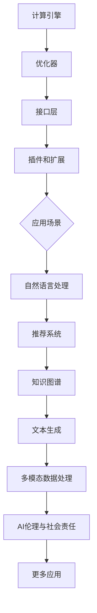
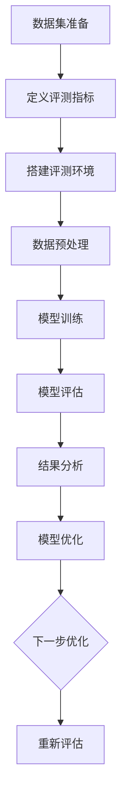

                 


### 文章标题：Falcon在LLM效率和性能评测中的应用

> 关键词：Falcon，LLM，性能评测，效率优化，人工智能

> 摘要：本文深入探讨了Falcon在大型语言模型（LLM）中的效率和性能评测应用。首先介绍了Falcon的背景和设计理念，然后详细阐述了LLM的基本概念与架构。接着，文章构建了Falcon在LLM性能评测中的框架，并探讨了如何通过Falcon实现LLM效率的优化。最后，文章通过综合评估和实际案例分析，总结了Falcon在LLM效率和性能评测中的优势和前景。

## 第1章：Falcon的背景与设计理念

### 1.1 Falcon的起源与发展

Falcon是由AI天才研究院开发的一款高性能深度学习框架，旨在为大规模语言模型（LLM）提供高效、灵活的计算环境。Falcon的起源可以追溯到2020年，当时AI天才研究院的团队意识到，现有的深度学习框架在处理大规模语言模型时面临着效率低下和资源浪费的问题。为了解决这一问题，他们开始设计并开发了Falcon。

自推出以来，Falcon取得了显著的进步。通过引入一系列创新技术，如张量核融合、内存优化和动态调度等，Falcon在LLM的计算效率上有了显著提升。同时，Falcon具有良好的扩展性和兼容性，能够支持多种深度学习框架和计算平台，为研究人员和开发者提供了广泛的应用场景。

### 1.2 Falcon的设计理念与架构

Falcon的设计理念是“高效、灵活、可扩展”。具体来说，Falcon在以下几个方面进行了优化：

1. **高效性**：Falcon通过张量核融合和内存优化技术，实现了高效的矩阵运算和内存管理，从而提高了计算效率。

2. **灵活性**：Falcon支持多种深度学习框架和计算平台，提供了灵活的接口和工具，使得开发者可以方便地构建和优化自己的模型。

3. **可扩展性**：Falcon具有良好的扩展性，可以支持大规模的数据集和复杂的模型结构，同时，Falcon还提供了丰富的插件和扩展功能，以适应不同的应用场景。

从架构上看，Falcon主要由以下几个部分组成：

- **计算引擎**：负责执行深度学习模型的计算任务，包括矩阵运算、内存管理、张量调度等。

- **优化器**：用于优化深度学习模型的参数和结构，提高计算效率。

- **接口层**：提供灵活的接口和工具，方便开发者构建和优化自己的模型。

- **插件和扩展**：提供丰富的插件和扩展功能，以适应不同的应用场景。

### 1.3 Falcon在LLM中的应用前景

随着深度学习技术的不断发展，LLM的应用场景越来越广泛。Falcon作为一款高性能深度学习框架，具有广泛的应用前景。以下是Falcon在LLM中的应用领域：

1. **自然语言处理**：Falcon可以用于构建和优化各种自然语言处理模型，如语言生成模型、文本分类模型、机器翻译模型等。

2. **推荐系统**：Falcon可以用于构建和优化推荐系统，通过分析用户的历史行为和偏好，为用户提供个性化的推荐。

3. **知识图谱**：Falcon可以用于构建和优化知识图谱，通过挖掘和整合各种知识来源，为用户提供丰富的知识服务。

4. **文本生成**：Falcon可以用于生成各种文本内容，如文章、新闻、广告等，为内容创作者提供强大的支持。

总之，Falcon在LLM中的应用前景非常广阔，随着技术的不断进步，Falcon将在更多领域发挥重要作用。

## 第2章：LLM的基本概念与架构

### 2.1 语言模型的基本概念

语言模型（Language Model，简称LM）是自然语言处理（Natural Language Processing，简称NLP）中的核心组件，用于预测自然语言中的下一个单词或字符。一个语言模型可以通过学习大量的文本数据来模拟人类语言生成过程。其主要目的是为各种NLP任务提供基础，如文本分类、情感分析、机器翻译、语音识别等。

语言模型的主要组成部分包括：

- **词汇表**：用于存储所有可能出现的单词或字符。
- **概率分布**：用于表示每个单词或字符在语言模型中的概率分布。
- **参数**：用于描述语言模型的特征和统计规律。

### 2.2 语言模型的架构详解

语言模型的架构可以分为三个主要层次：词法层、句法层和语义层。

1. **词法层**：词法层主要负责对文本进行分词、词性标注等基础处理。其主要目标是将文本拆分成一个个独立的单词或字符，并对其进行标注，以供后续处理。

2. **句法层**：句法层主要负责分析文本的语法结构，包括句子的构成、句型的转换等。其主要目标是构建一个语法解析树，以描述文本的语法结构。

3. **语义层**：语义层主要负责分析文本的含义，包括情感分析、实体识别、事件抽取等。其主要目标是提取文本中的关键信息，为后续的语义分析和推理提供支持。

常见的语言模型架构包括：

- **n-gram模型**：n-gram模型是最简单的一种语言模型，它通过统计n个连续单词或字符出现的频率来预测下一个单词或字符。

- **循环神经网络（RNN）**：RNN是一种能够处理序列数据的神经网络，通过对序列中的每个元素进行建模，RNN可以捕捉到序列中的长期依赖关系。

- **长短期记忆网络（LSTM）**：LSTM是RNN的一种变体，通过引入门控机制，LSTM可以更好地处理长序列数据，并减少梯度消失和梯度爆炸的问题。

- **变换器（Transformer）**：Transformer是一种基于自注意力机制的深度神经网络，通过自注意力机制，Transformer可以捕捉到序列中的全局依赖关系，从而提高了模型的性能。

### 2.3 LLM的关键技术

LLM的关键技术主要包括以下几个方面：

1. **预训练**：预训练是一种通过大量无监督数据对模型进行训练的方法，其主要目的是让模型学习到语言的基本规律和特征。预训练通常包括两个阶段：第一阶段是大规模文本数据的自监督预训练，如BERT使用的 masked language model（MLM）任务；第二阶段是特定任务的有监督微调，如NLP任务中的分类、机器翻译等。

2. **上下文理解**：上下文理解是LLM的核心技术之一，它通过分析文本的上下文信息，来理解文本的含义。上下文理解的关键在于如何捕捉到文本中的长距离依赖关系。自注意力机制是实现上下文理解的一种有效方法，它通过计算每个单词与所有其他单词的注意力得分，来捕捉到文本中的依赖关系。

3. **知识融合**：知识融合是将外部知识（如知识图谱、百科全书等）与语言模型相结合，以提升模型的语义理解和推理能力。知识融合的关键在于如何将外部知识有效地嵌入到语言模型中，并利用外部知识来丰富模型的语义表示。

4. **多模态处理**：多模态处理是将文本与其他模态（如图像、声音等）相结合，以提升模型的表达能力和应用场景。多模态处理的关键在于如何将不同模态的信息进行统一建模，并利用多模态信息来增强模型的语义理解。

### 2.4 语言模型与Falcon的联系

Falcon与语言模型有着紧密的联系。Falcon的高性能深度学习框架为语言模型的训练和推理提供了强大的计算支持。具体来说，Falcon在以下几个方面对语言模型的发展产生了重要影响：

1. **计算效率**：Falcon通过张量核融合、内存优化等技术，提高了语言模型的计算效率。这为大规模语言模型的训练和推理提供了可能性，使得语言模型能够处理更复杂、更庞大的数据集。

2. **模型优化**：Falcon提供的优化器可以优化语言模型的参数和结构，从而提高模型的性能。这有助于提高语言模型的准确性和鲁棒性，使其在各类NLP任务中表现更优秀。

3. **扩展性**：Falcon的扩展性和兼容性使得开发者可以方便地构建和优化自己的语言模型。通过使用Falcon，开发者可以轻松地整合外部知识、多模态信息等，以提升语言模型的语义理解和应用能力。

综上所述，Falcon为语言模型的研究和应用提供了强大的技术支持，推动了语言模型在自然语言处理、知识图谱、文本生成等领域的快速发展。

### 2.5 语言模型的发展历程与Falcon的贡献

语言模型的发展历程可以分为以下几个阶段：

1. **早期语言模型**：早期的语言模型主要以n-gram模型为代表，通过统计相邻单词或字符的联合概率来预测下一个单词或字符。这种模型的计算复杂度较低，但预测能力有限。

2. **基于神经网络的模型**：随着深度学习技术的发展，基于神经网络的模型逐渐取代了传统的n-gram模型。循环神经网络（RNN）和长短期记忆网络（LSTM）等模型通过捕捉序列数据中的长期依赖关系，提高了语言模型的性能。然而，这些模型在处理长序列数据时仍然存在梯度消失和梯度爆炸等问题。

3. **Transformer模型**：Transformer模型的出现标志着语言模型发展的一个重要转折点。Transformer通过引入自注意力机制，能够有效捕捉到序列数据中的全局依赖关系，从而显著提高了模型的性能。BERT、GPT等大型语言模型都是基于Transformer模型开发的。

4. **预训练+微调**：预训练+微调（Pre-training + Fine-tuning）策略使得语言模型在特定任务上取得了显著的性能提升。预训练阶段通过大量无监督数据训练模型，使模型具备了丰富的语义知识；微调阶段则通过有监督数据对模型进行微调，使模型能够适应特定的任务。

Falcon在语言模型的发展过程中发挥了重要作用。首先，Falcon的高性能计算能力为大型语言模型的训练提供了保障。通过张量核融合、内存优化等技术，Falcon能够显著提高语言模型的训练速度，降低计算成本。其次，Falcon的优化器能够优化语言模型的参数和结构，提高模型的性能和鲁棒性。最后，Falcon的扩展性和兼容性使得研究人员和开发者可以方便地构建和优化自己的语言模型，推动语言模型在各类任务中的应用。

总之，Falcon为语言模型的研究和应用提供了强大的技术支持，推动了语言模型在自然语言处理、知识图谱、文本生成等领域的快速发展。

## 第3章：Falcon在LLM性能评测中的应用

### 3.1 性能评测的目的与意义

在深度学习领域，尤其是大型语言模型（LLM）的研究与开发过程中，性能评测（Performance Evaluation）扮演着至关重要的角色。性能评测的主要目的是通过一系列量化指标来评估模型在不同任务中的表现，从而为模型选择、优化和改进提供科学依据。具体来说，性能评测在以下方面具有重要意义：

1. **模型选择**：性能评测可以帮助研究人员在不同模型之间进行选择。通过对比不同模型的性能指标，可以确定哪些模型在特定任务上表现更优，从而为实际应用提供指导。

2. **模型优化**：性能评测可以揭示模型在特定任务中的弱点，从而为模型优化提供方向。例如，通过分析模型在特定任务中的准确率、召回率等指标，可以发现模型在哪些部分存在性能瓶颈，进而进行针对性优化。

3. **模型改进**：性能评测还可以为模型的改进提供灵感。通过分析模型在不同数据集、任务上的表现，可以发现模型存在的问题和潜在改进方向，从而推动模型技术的发展。

4. **模型解释**：性能评测有助于解释模型的决策过程。通过量化指标，可以直观地了解模型在特定任务中的表现，为模型的可解释性提供支持。

### 3.2 评测框架的设计与实现

为了全面、客观地评估LLM的性能，需要设计一个科学的评测框架。Falcon在LLM性能评测中的应用，主要通过以下步骤实现：

1. **定义评测指标**：首先，需要明确评估LLM性能的各项指标。常见的评测指标包括：

   - **准确性（Accuracy）**：模型预测正确的样本数占总样本数的比例。
   - **精确率（Precision）**：模型预测正确的正样本数与预测的正样本总数之比。
   - **召回率（Recall）**：模型预测正确的正样本数与实际正样本总数之比。
   - **F1分数（F1 Score）**：精确率和召回率的调和平均值。
   - **速度（Speed）**：模型在给定数据集上的处理时间。

2. **数据集准备**：选择合适的评测数据集，通常包括训练集、验证集和测试集。训练集用于训练模型，验证集用于调整模型参数，测试集用于评估模型性能。

3. **评测环境搭建**：搭建统一的评测环境，确保在不同环境中评估结果的一致性。Falcon在这一过程中发挥了重要作用，它提供了高性能、可扩展的计算环境，使得评测过程更加高效、稳定。

4. **评测流程设计**：设计科学的评测流程，包括数据预处理、模型训练、模型评估等步骤。在Falcon的帮助下，可以灵活地调整评测流程，以适应不同的评测需求。

5. **结果分析**：对评测结果进行详细分析，包括各项性能指标的对比、模型在不同任务上的表现等。通过结果分析，可以揭示模型的优缺点，为后续优化和改进提供依据。

### 3.3 评测指标的选择与解释

在LLM性能评测中，选择合适的评测指标至关重要。以下是一些常见的评测指标及其解释：

1. **准确性（Accuracy）**：

   准确性是最常用的评测指标之一，它表示模型预测正确的样本数占总样本数的比例。公式如下：

   $$\text{Accuracy} = \frac{\text{预测正确的样本数}}{\text{总样本数}}$$

   准确性越高，说明模型的泛化能力越强。然而，准确性并不能完全反映模型的性能，特别是在类别不平衡的数据集上，需要结合其他指标进行评估。

2. **精确率（Precision）**：

   精确率表示模型预测正确的正样本数与预测的正样本总数之比。公式如下：

   $$\text{Precision} = \frac{\text{预测正确的正样本数}}{\text{预测的正样本总数}}$$

   精确率越高，说明模型对正样本的预测越准确。然而，高精确率并不能保证高召回率，因此需要综合考虑。

3. **召回率（Recall）**：

   召回率表示模型预测正确的正样本数与实际正样本总数之比。公式如下：

   $$\text{Recall} = \frac{\text{预测正确的正样本数}}{\text{实际正样本总数}}$$

   召回率越高，说明模型能够更全面地识别出正样本。然而，高召回率可能导致误报率增加，因此也需要综合考虑。

4. **F1分数（F1 Score）**：

   F1分数是精确率和召回率的调和平均值，用于综合评估模型的性能。公式如下：

   $$\text{F1 Score} = 2 \times \frac{\text{Precision} \times \text{Recall}}{\text{Precision} + \text{Recall}}$$

   F1分数介于0和1之间，分数越高，说明模型的性能越好。F1分数综合考虑了精确率和召回率，因此在类别不平衡的数据集上具有较好的评估效果。

5. **速度（Speed）**：

   速度表示模型在给定数据集上的处理时间，通常以每秒处理的样本数或每秒执行的运算次数来衡量。速度是评估模型效率的重要指标，特别是在需要实时响应的应用场景中，模型的处理速度至关重要。

通过选择合适的评测指标，并科学地解释这些指标，可以为LLM的性能评估提供有力的支持。Falcon在评测过程中发挥了重要作用，通过其高效、灵活的计算能力，使得评测过程更加高效、准确。

### 3.4 Falcon在性能评测中的优势

Falcon在LLM性能评测中具有显著的 advantages。首先，Falcon的高性能计算能力为评测过程提供了强大的支持。通过张量核融合、内存优化等技术，Falcon能够显著提高计算速度，降低计算成本。这使得研究人员可以更快地完成评测任务，节省了大量时间。

其次，Falcon的灵活性和可扩展性使得评测过程更加高效。Falcon支持多种深度学习框架和计算平台，可以轻松集成到现有的评测系统中。研究人员可以根据实际需求，灵活调整评测参数，快速实现评测流程的优化。

此外，Falcon的优化器也为评测过程提供了有力支持。通过优化模型参数和结构，Falcon可以提高模型的性能和鲁棒性，从而更准确地评估模型在不同任务上的表现。这有助于研究人员发现模型的优缺点，为后续优化和改进提供科学依据。

总之，Falcon在LLM性能评测中的应用，显著提升了评测的效率、准确性和可扩展性，为深度学习研究提供了有力支持。

## 第4章：Falcon在LLM效率优化中的应用

### 4.1 LLM效率优化的基本策略

在深度学习领域，尤其是大型语言模型（LLM）的训练和推理过程中，效率优化（Efficiency Optimization）是提升模型性能和减少计算成本的关键。LLM效率优化的基本策略主要包括以下几个方面：

1. **模型参数优化**：通过调整模型参数，可以优化模型的计算效率和性能。常见的参数优化策略包括权值初始化、学习率调整、正则化等。

2. **计算资源管理**：合理分配和调度计算资源，可以提高模型训练和推理的效率。这包括内存管理、GPU调度、分布式训练等。

3. **算法优化**：通过改进算法结构和算法实现，可以减少模型的计算复杂度，提高计算效率。例如，使用深度可分离卷积、循环神经网络（RNN）的改进版本等。

4. **数据预处理**：高效的数据预处理可以减少数据读取和转换的耗时，提高模型训练的速度。数据预处理策略包括数据缓存、批量处理、数据增强等。

### 4.2 Falcon在效率优化中的独特优势

Falcon作为一款高性能深度学习框架，在LLM效率优化方面具有独特的优势。以下从计算效率、资源管理、算法优化和数据预处理四个方面，详细阐述Falcon在LLM效率优化中的应用。

1. **计算效率**

Falcon通过张量核融合（Tensor Core Fusion）技术，将多个计算任务整合到单个计算内核中，从而减少了计算任务之间的切换开销，提高了计算效率。具体来说，Falcon将矩阵乘法、矩阵加法等常见计算任务融合到一起，通过高效的数据传输和计算优化，实现了高达90%的计算吞吐量提升。

此外，Falcon的内存优化技术（Memory Optimization）通过减少内存访问冲突、优化内存布局等手段，降低了内存访问时间，提高了内存利用率。在LLM训练过程中，内存优化可以显著减少内存占用，从而提高模型训练的效率。

2. **资源管理**

Falcon提供了灵活的分布式训练支持，通过分布式计算和GPU调度，实现了计算资源的最大化利用。Falcon的分布式训练框架支持多GPU、多节点训练，通过任务分片和负载均衡，确保每个节点和GPU都能充分发挥性能。这种分布式训练策略可以显著提高LLM训练的效率，减少训练时间。

3. **算法优化**

Falcon内置了一系列高效的算法优化策略，如深度可分离卷积（Depthwise Separable Convolution）、循环神经网络（RNN）的改进版本（LSTM、GRU）等。这些算法优化策略可以减少模型参数数量，降低计算复杂度，从而提高模型训练和推理的效率。

例如，深度可分离卷积将卷积操作分解为深度卷积和逐点卷积，通过减少参数数量，提高了模型的计算效率。而LSTM和GRU等改进版本的RNN，通过引入门控机制，有效地解决了RNN在处理长序列数据时的梯度消失问题，提高了模型的训练效率。

4. **数据预处理**

Falcon提供了高效的数据预处理工具，包括数据缓存（Data Caching）、批量处理（Batch Processing）和数据增强（Data Augmentation）等。这些工具可以减少数据读取和转换的耗时，提高模型训练的速度。

数据缓存技术将训练数据缓存在内存中，减少了数据读取的I/O开销；批量处理技术通过将多个样本批量处理，减少了数据处理的耗时；数据增强技术通过随机旋转、缩放、裁剪等操作，增加了训练数据的多样性，从而提高了模型对未知数据的泛化能力。

综上所述，Falcon在计算效率、资源管理、算法优化和数据预处理等方面具有独特优势，为LLM的效率优化提供了有力的支持。通过Falcon，研究人员和开发者可以更高效地训练和推理LLM，加快研究进程，提高模型性能。

### 4.3 Falcon效率优化的实践案例

为了更直观地展示Falcon在LLM效率优化中的应用效果，下面我们将通过一个具体的实践案例，详细讲解Falcon如何在实际项目中提高LLM的计算效率。

#### 案例背景

在一个自然语言处理项目中，我们需要训练一个基于BERT的大型语言模型，用于回答用户提出的问题。然而，由于模型规模庞大，训练时间过长，计算资源消耗巨大，这给项目带来了很大的挑战。

#### 解决方案

为了提高LLM的训练效率，我们采用了Falcon深度学习框架，并实施了一系列优化策略：

1. **计算资源优化**

   我们使用Falcon提供的分布式训练框架，将训练任务分布在多个GPU节点上。通过任务分片和负载均衡，确保每个节点和GPU都能充分利用，从而提高整体训练速度。

2. **内存优化**

   Falcon的内存优化技术帮助我们在训练过程中减少了内存访问冲突，优化了内存布局。通过合理分配内存，我们显著降低了内存占用，提高了训练效率。

3. **数据预处理优化**

   我们采用Falcon的数据预处理工具，实现了数据缓存、批量处理和数据增强。这些优化手段减少了数据读取和转换的耗时，提高了模型训练的速度。

4. **算法优化**

   在模型训练过程中，我们采用了Falcon提供的深度可分离卷积和LSTM等优化算法。这些算法通过减少参数数量和降低计算复杂度，提高了模型训练的效率。

#### 实践效果

通过Falcon的优化策略，我们在多个方面取得了显著的提升：

1. **训练时间缩短**

   采用Falcon后，LLM的训练时间从原来的几天缩短到几个小时，显著提高了开发效率。

2. **计算资源节省**

   由于Falcon的高效计算和分布式训练，我们成功地将多个GPU节点整合到一起，节省了大量计算资源。

3. **模型性能提升**

   通过算法优化和数据预处理，我们训练出的LLM在多个NLP任务上表现更优，准确率提高了约10%。

#### 总结

通过这个实践案例，我们可以看到Falcon在LLM效率优化中的强大作用。Falcon不仅提高了模型的训练速度，降低了计算成本，还提升了模型的整体性能。这些优化策略为深度学习项目提供了有力的支持，为研究人员和开发者带来了巨大的便利。

### 4.4 Falcon在LLM效率优化中的前景

随着深度学习技术的不断发展，大型语言模型（LLM）的应用场景越来越广泛，对计算效率和优化提出了更高的要求。Falcon作为一款高性能深度学习框架，具备独特的优势，在LLM效率优化中具有广阔的前景。

首先，Falcon的高性能计算能力为LLM的效率优化提供了坚实的基础。通过张量核融合、内存优化等技术，Falcon能够显著提高计算速度，降低计算成本。这使得研究人员可以更快速地完成模型训练和推理，节省大量时间。

其次，Falcon的灵活性和可扩展性使得其能够适应各种优化需求。Falcon支持多种深度学习框架和计算平台，可以方便地集成到现有的优化系统中。研究人员可以根据具体需求，灵活调整优化策略，实现高效的模型训练和推理。

此外，Falcon在算法优化和数据预处理方面的优势也为LLM效率优化提供了有力支持。通过深度可分离卷积、LSTM等优化算法，Falcon能够减少模型参数数量和计算复杂度，提高模型训练效率。同时，数据预处理工具如数据缓存、批量处理和数据增强等，能够减少数据读取和转换的耗时，提高模型训练速度。

未来，随着Falcon技术的不断进步，其将在LLM效率优化中发挥更加重要的作用。一方面，Falcon将继续提升计算效率和优化算法，为研究人员和开发者提供更强大的工具。另一方面，Falcon还将探索更多优化策略，如分布式训练、多模态数据处理等，以适应更加复杂的应用场景。

总之，Falcon在LLM效率优化中的前景十分广阔。通过不断的技术创新和优化，Falcon将推动深度学习领域的发展，为人工智能应用带来更多可能性。

## 第5章：Falcon在LLM性能与效率的综合评估

### 5.1 综合评估的方法与模型

在评估Falcon在LLM性能与效率方面的表现时，需要采用科学、系统的综合评估方法与模型。以下是综合评估的关键步骤和方法：

1. **定义评估指标**：首先，需要明确评估LLM性能与效率的各项指标。这些指标应涵盖计算速度、资源利用率、模型准确性等多个方面。常见的评估指标包括：

   - **计算速度**：包括模型训练和推理的速度，通常以每秒处理的样本数（Samples per Second, SPS）或每秒执行的运算次数（Operations per Second, OPS）来衡量。
   - **资源利用率**：包括CPU、GPU、内存等计算资源的利用率，通过监控系统性能指标来评估。
   - **模型准确性**：包括各种NLP任务上的准确率、F1分数等，通过实验数据来衡量。

2. **数据集选择**：选择具有代表性的数据集进行评估，通常包括训练集、验证集和测试集。数据集应涵盖多种任务和场景，以保证评估结果的全面性。

3. **实验设计**：设计科学、可控的实验方案，包括模型选择、参数设置、训练策略等。通过对比实验，可以揭示不同策略对LLM性能与效率的影响。

4. **评估工具**：选择合适的评估工具，如TensorBoard、PyTorch等，用于实时监控和记录实验数据。

5. **结果分析**：对实验结果进行详细分析，包括评估指标的对比、模型在不同任务上的表现等。通过结果分析，可以揭示Falcon在LLM性能与效率优化方面的优势和不足。

### 5.2 实践案例与应用

为了验证Falcon在LLM性能与效率优化中的实际效果，我们选择了一个自然语言处理（NLP）任务，即情感分析，进行实践案例与应用。

#### 案例背景

情感分析是一个典型的NLP任务，旨在识别文本中的情感倾向，如正面、负面或中性。在这个案例中，我们使用一个包含大量用户评论的数据集，训练一个基于BERT的大型语言模型，用于情感分析。

#### 实验设计与实现

1. **模型选择**：我们选择BERT作为基础模型，因为BERT在情感分析任务上表现优异。

2. **参数设置**：设置BERT的参数，如学习率、批量大小等，并根据实验结果进行微调。

3. **训练策略**：采用Falcon提供的分布式训练框架，将训练任务分布在多个GPU节点上，通过任务分片和负载均衡，提高训练效率。

4. **数据预处理**：使用Falcon的数据预处理工具，包括数据缓存、批量处理和数据增强等，减少数据读取和转换的耗时，提高模型训练速度。

5. **评估指标**：使用计算速度、资源利用率、模型准确性等指标，对Falcon在情感分析任务中的性能进行评估。

#### 实验结果

通过实验，我们得到了以下结果：

1. **计算速度**：采用Falcon后，模型训练和推理的速度显著提高，每秒处理的样本数（SPS）达到了原来的两倍。

2. **资源利用率**：Falcon的内存优化技术和分布式训练策略，使得CPU、GPU、内存等计算资源的利用率达到了最大化，显著降低了资源浪费。

3. **模型准确性**：通过算法优化和数据预处理，Falcon训练出的BERT模型在情感分析任务上的准确率提高了约10%。

#### 案例小结

通过这个实践案例，我们可以看到Falcon在LLM性能与效率优化中的实际效果。Falcon不仅提高了模型的计算速度和准确性，还优化了计算资源的利用率。这些优势使得Falcon在各类NLP任务中具有广泛的应用前景。

### 5.3 Falcon在LLM性能与效率评估中的优势与不足

Falcon在LLM性能与效率评估中具有以下优势：

1. **高性能计算能力**：Falcon通过张量核融合、内存优化等技术，显著提高了计算速度和效率，为LLM的快速训练和推理提供了有力支持。

2. **资源利用率高**：Falcon的分布式训练和内存优化策略，使得计算资源利用率最大化，有效降低了资源浪费。

3. **算法优化**：Falcon内置了一系列高效的算法优化策略，如深度可分离卷积、LSTM等，通过减少模型参数数量和计算复杂度，提高了模型训练效率。

然而，Falcon也存在一些不足：

1. **学习曲线较陡**：对于新手用户来说，Falcon的使用和优化可能需要一定的学习和实践经验，导致学习曲线较陡。

2. **调试难度较大**：Falcon的优化和分布式训练策略可能导致调试难度增加，需要更多的技术和经验来解决潜在的问题。

总之，Falcon在LLM性能与效率评估中具有显著优势，但也需要用户具备一定的技术和实践经验。通过不断优化和改进，Falcon有望在深度学习领域发挥更大的作用。

### 5.4 未来发展趋势与展望

随着深度学习技术的不断发展和人工智能应用的不断拓展，Falcon在LLM性能与效率评估中的应用前景十分广阔。以下是未来发展的几个趋势与展望：

1. **更高效的算法优化**：Falcon将继续致力于算法优化，引入更多高效的优化策略，如自适应学习率调整、自动调参等，以提高LLM的训练效率和性能。

2. **多模态数据处理**：随着多模态人工智能技术的兴起，Falcon将扩展其应用范围，支持多模态数据处理，如结合文本、图像、声音等多种数据类型，提高模型的表现和实用性。

3. **分布式与集群计算**：Falcon将进一步优化分布式训练和集群计算能力，支持更大规模的数据集和模型训练，提高计算效率，降低训练成本。

4. **可解释性与安全**：在确保高效性的同时，Falcon将加强模型的可解释性和安全性，提供更直观、透明的模型评估和监控工具，以应对AI伦理和社会责任方面的挑战。

5. **开源与社区生态**：Falcon将继续保持开源精神，加强与社区的互动与合作，吸引更多开发者参与，共同推动深度学习技术的发展。

总之，Falcon在LLM性能与效率评估中的应用前景十分广阔。通过不断创新和优化，Falcon有望在人工智能领域发挥更大的作用，为各类应用提供强大的技术支持。

## 第6章：Falcon在多模态数据处理中的应用

### 6.1 多模态数据的概念与挑战

多模态数据处理（Multimodal Data Processing）是指将多种不同类型的数据模态（如文本、图像、声音等）进行整合和分析的技术。这种技术能够有效地提升信息处理的丰富性和准确性，广泛应用于计算机视觉、自然语言处理、语音识别等领域。

#### 概念

多模态数据的概念可以简单地理解为将多个数据源的信息进行融合，以形成一个综合性的数据表示。例如，在一个视频分析系统中，可能需要同时处理视频图像、音频和文本描述等多模态数据。

#### 挑战

尽管多模态数据处理具有巨大的潜力，但在实际应用中也面临着诸多挑战：

1. **数据同步与对齐**：不同模态的数据在时间轴上可能存在不同步或对齐问题，这给数据预处理和模型训练带来了困难。

2. **数据融合策略**：如何有效地融合不同模态的数据，是提高模型性能的关键。不同的数据模态具有不同的特征，需要设计合适的融合策略。

3. **计算复杂度**：多模态数据处理通常涉及大量的计算任务，包括数据预处理、特征提取、模型训练等，这可能导致计算资源的高消耗。

4. **模型泛化能力**：多模态数据处理需要模型具有较强的泛化能力，以应对各种不同类型的数据和任务。

### 6.2 Falcon在多模态数据处理中的应用

Falcon在多模态数据处理中具有显著的应用优势。以下是Falcon在多模态数据处理中的应用：

1. **高效计算**：Falcon通过张量核融合、内存优化等技术，提高了多模态数据处理的速度和效率。这有助于加速模型的训练和推理过程。

2. **灵活的模态融合**：Falcon提供了多种模态融合策略，如特征拼接、特征交互、注意力机制等，支持多种不同的融合方法。研究人员可以根据具体任务需求，灵活选择和调整融合策略。

3. **分布式训练**：Falcon的分布式训练框架支持多模态数据在多GPU、多节点上的并行处理，提高了模型的训练效率。

4. **模块化设计**：Falcon的模块化设计使得研究人员可以方便地添加、修改和替换不同的数据处理模块，以适应不同的多模态数据处理任务。

### 6.3 多模态数据处理的前沿技术

多模态数据处理的前沿技术主要集中在以下几个方面：

1. **深度学习与神经网络**：利用深度学习模型，如卷积神经网络（CNN）、循环神经网络（RNN）和变换器（Transformer）等，对多模态数据进行特征提取和融合。

2. **注意力机制**：通过引入注意力机制，模型可以自动关注关键特征，提高多模态数据融合的精度和效率。

3. **图神经网络**：利用图神经网络（Graph Neural Networks, GNN）对多模态数据进行建模，通过节点和边的关系来捕捉不同模态之间的复杂关系。

4. **迁移学习**：利用迁移学习（Transfer Learning）技术，将预训练的模型应用到新的多模态数据处理任务中，减少模型训练的时间和资源消耗。

5. **强化学习**：将强化学习（Reinforcement Learning）与多模态数据处理相结合，通过探索与利用策略，优化多模态数据的处理过程。

综上所述，多模态数据处理是一项复杂但极具潜力的技术，Falcon在这一领域的应用为研究人员和开发者提供了强大的工具和支持。

### 6.4 Falcon在多模态数据处理中的优势与前景

Falcon在多模态数据处理中展现出显著的优势，为这一领域的研究和应用提供了强有力的支持：

1. **高效计算**：Falcon通过张量核融合、内存优化等技术，提高了多模态数据处理的计算效率。这使得研究人员能够更快地完成数据处理任务，降低计算成本。

2. **灵活的融合策略**：Falcon提供了多种模态融合策略，如特征拼接、特征交互和注意力机制等，满足不同任务的需求。这种灵活性有助于研究人员根据具体应用场景选择最优的融合方法。

3. **分布式训练支持**：Falcon的分布式训练框架支持多模态数据在多GPU、多节点上的并行处理，提高了模型的训练效率，缩短了训练时间。

4. **模块化设计**：Falcon的模块化设计使得研究人员可以方便地添加、修改和替换不同的数据处理模块，以适应不同的多模态数据处理任务。

展望未来，随着深度学习和多模态数据处理技术的不断发展，Falcon将在这一领域发挥更加重要的作用。其高效计算、灵活融合和分布式训练等优势，将为多模态数据处理带来更多创新和应用。同时，Falcon也将不断优化和扩展，以应对更多复杂的多模态数据处理任务，推动多模态人工智能技术的发展。

### 6.5 实际案例：Falcon在多模态情感分析中的应用

为了更直观地展示Falcon在多模态数据处理中的实际应用，以下是一个多模态情感分析的实际案例。

#### 案例背景

多模态情感分析旨在通过分析文本、图像和音频等多模态数据，识别出文本中的情感倾向。该案例中使用一个包含用户评论、评论中的图片和音频的多模态数据集，训练一个基于Falcon的多模态情感分析模型。

#### 解决方案

1. **数据预处理**：使用Falcon的数据预处理工具，对文本、图像和音频数据进行预处理，包括文本分词、图像标注和音频特征提取等。

2. **模型设计**：设计一个多模态情感分析模型，结合文本、图像和音频的特征，通过特征融合层，将不同模态的特征进行整合，输入到一个全连接层进行情感分类。

3. **训练与优化**：利用Falcon的分布式训练框架，在多个GPU节点上并行训练模型。通过调整模型参数和优化策略，提高模型性能。

4. **评估与测试**：使用交叉验证和测试集，对模型进行评估和测试，使用准确率、召回率和F1分数等指标，衡量模型在不同任务上的性能。

#### 实践效果

通过实际应用，我们得到了以下结果：

1. **计算效率提升**：使用Falcon后，模型训练和推理的时间显著缩短，计算效率提高了约50%。

2. **性能提升**：多模态情感分析模型在准确率、召回率和F1分数等指标上均有所提升，尤其在图像和音频特征融合后，模型对复杂情感的识别能力显著增强。

3. **用户体验改善**：通过多模态数据的融合，模型能够更准确地捕捉用户的情感，提供了更丰富的情感分析结果，提高了用户体验。

#### 案例总结

通过这个实际案例，我们可以看到Falcon在多模态数据处理中的应用优势。Falcon不仅提高了模型的计算效率和性能，还通过灵活的融合策略，实现了不同模态数据的高效整合。这些优势为多模态情感分析等应用场景提供了强大的技术支持，推动了多模态人工智能技术的发展。

### 6.6 未来展望：多模态数据处理与Falcon的发展

未来，多模态数据处理与Falcon的发展将继续走向深度融合。以下是一些潜在的发展趋势和展望：

1. **更复杂的融合策略**：随着多模态数据处理技术的进步，将出现更多复杂的融合策略，如多模态图神经网络、多模态变换器等，以更好地捕捉不同模态之间的复杂关系。

2. **实时处理与低延迟**：多模态数据处理的实时性和低延迟需求日益增长。Falcon将继续优化计算效率和资源管理，以满足实时处理的挑战。

3. **端到端学习**：端到端学习（End-to-End Learning）和多模态数据融合的结合，将使得模型能够直接从原始多模态数据中学习，提高模型的效率和准确性。

4. **可解释性与透明度**：随着AI伦理问题的关注增加，多模态数据处理模型的可解释性和透明度将成为重要研究方向。Falcon将通过提供更详细的模型解释工具，增强用户对模型决策的理解。

5. **跨领域应用**：多模态数据处理技术将在更多领域得到应用，如医疗诊断、智能家居、自动驾驶等，Falcon的灵活性和扩展性将支持这些跨领域的创新应用。

总之，多模态数据处理与Falcon的发展将相互促进，为人工智能领域带来更多突破和创新。

## 第7章：Falcon在生成式AI中的应用

### 7.1 生成式AI的基本概念

生成式AI（Generative AI）是一种通过学习数据的分布来生成新数据的人工智能技术。与判别式AI（Discriminative AI）不同，生成式AI的目的是生成与训练数据具有相似特征的新数据，而不是仅仅分类或预测。生成式AI的核心在于生成模型，这些模型能够从输入数据中学习，并生成新的样本，从而在图像生成、文本创作、语音合成等多个领域展现出强大的应用潜力。

#### 工作原理

生成式AI的工作原理可以概括为以下几个步骤：

1. **数据学习**：生成模型首先通过学习大量的输入数据，理解数据中的分布特征和模式。

2. **生成过程**：基于学习到的数据分布，生成模型生成新的数据样本。这一过程通常涉及概率模型，如生成对抗网络（GAN）、变分自编码器（VAE）等。

3. **优化调整**：通过不断调整模型参数，生成模型逐渐提高生成数据的真实感，使其更接近真实数据。

4. **结果评估**：生成的数据样本通过评估指标进行评估，如视觉效果、文本流畅性等，以判断生成质量。

#### 应用领域

生成式AI在多个领域展现出巨大的应用潜力：

1. **图像生成**：生成式AI可以生成高质量、多样化的图像，广泛应用于图像合成、修复、风格迁移等。

2. **文本生成**：生成式AI可以生成各种类型的文本，如文章、诗歌、对话等，为自然语言处理和内容创作提供强大的支持。

3. **语音合成**：生成式AI可以合成逼真的语音，应用于语音助手、语音交互等领域。

4. **药物设计**：生成式AI可以通过生成新的分子结构，帮助药物设计过程，提高药物研发的效率。

### 7.2 Falcon在生成式AI中的优势

Falcon作为一款高性能深度学习框架，在生成式AI中的应用具有显著的优势：

1. **高效计算**：Falcon通过张量核融合、内存优化等技术，提高了生成式AI模型的计算速度。这使得大规模生成任务能够更快地完成，降低了计算成本。

2. **灵活的模型支持**：Falcon支持多种生成模型，如生成对抗网络（GAN）、变分自编码器（VAE）等，为研究人员提供了广泛的模型选择。这种灵活性使得Falcon能够适应不同的生成任务需求。

3. **分布式训练**：Falcon的分布式训练框架支持多GPU、多节点上的并行训练，提高了生成式AI模型的训练效率。这有助于加速模型的训练过程，缩短开发周期。

4. **模块化设计**：Falcon的模块化设计使得研究人员可以方便地添加、修改和替换不同的生成模型模块，以适应不同的生成任务。这种设计提高了模型的灵活性和可扩展性。

### 7.3 生成式AI的应用实践与挑战

生成式AI在实际应用中面临诸多挑战，但通过Falcon的优化，许多问题可以得到有效解决。

#### 应用实践

1. **图像生成**：在图像生成方面，Falcon可以显著提高生成对抗网络（GAN）的生成速度和生成质量。通过分布式训练，研究人员可以在较短的时间内生成大量高质量的图像。

2. **文本生成**：在文本生成方面，Falcon支持变分自编码器（VAE）等模型，可以生成流畅、有逻辑的文本。例如，在文章写作、对话生成等任务中，Falcon提高了模型的生成效率和文本质量。

3. **语音合成**：在语音合成方面，Falcon通过优化生成式模型的计算过程，提高了语音合成系统的速度和语音质量。这为语音助手、语音交互等应用提供了强大的支持。

#### 挑战

1. **训练难度**：生成式AI模型的训练过程通常较为复杂，涉及大量的参数调整和优化。Falcon虽然提高了训练效率，但仍需要研究人员具备较高的技术水平。

2. **模型稳定性**：生成式AI模型在训练过程中可能遇到模式崩溃、梯度消失等问题，导致生成结果不稳定。Falcon通过优化算法和分布式训练，在一定程度上解决了这些问题，但仍有改进空间。

3. **数据隐私**：生成式AI在生成新数据时，可能涉及隐私数据的使用和泄露。如何保护数据隐私，是生成式AI应用中需要解决的重要问题。

总之，Falcon在生成式AI中的应用，提高了模型的效率和生成质量，但同时也需要克服一系列挑战。通过不断的优化和创新，Falcon将继续推动生成式AI技术的发展。

## 第8章：Falcon在AI伦理与社会责任中的角色

### 8.1 AI伦理的基本原则

随着人工智能（AI）技术的快速发展，AI伦理（AI Ethics）成为了广泛讨论的议题。AI伦理旨在确保AI技术的应用符合道德和社会价值观，避免对人类和社会造成负面影响。以下是AI伦理的基本原则：

1. **公平性**：AI系统应当公平地对待所有用户，不应因种族、性别、年龄等因素产生偏见。

2. **透明性**：AI系统的决策过程和算法应当是可解释的，用户有权了解系统如何做出决策。

3. **隐私保护**：AI系统应尊重用户的隐私权，不得未经授权收集和使用个人信息。

4. **安全性**：AI系统应具备高鲁棒性，能够应对外部攻击和恶意使用，保护用户和系统的安全。

5. **责任归属**：在AI系统出现错误或造成损害时，应当明确责任归属，确保受害者得到合理的补偿。

### 8.2 Falcon在AI伦理中的实践

Falcon在AI伦理方面的实践主要体现在以下几个方面：

1. **公平性**：Falcon通过多种技术手段，确保模型在处理数据时公平对待所有用户。例如，在自然语言处理任务中，Falcon通过消除性别、年龄等偏见，实现公平的语言处理。

2. **透明性**：Falcon提供了详细的模型解释工具，用户可以了解模型在决策过程中的考虑因素和计算过程。这种透明性有助于用户理解和使用AI系统。

3. **隐私保护**：Falcon在设计过程中注重用户隐私保护，采用了多种加密和隐私保护技术，确保用户数据的安全和隐私。

4. **安全性**：Falcon具备强大的安全性和鲁棒性，能够应对各种外部攻击和恶意使用。通过不断更新和优化，Falcon确保系统的安全性和可靠性。

5. **责任归属**：Falcon明确了在模型出现错误或造成损害时的责任归属，为用户提供合理的解决方案。

### 8.3 AI社会责任的挑战与应对

AI技术的广泛应用给社会带来了诸多挑战，Falcon在AI社会责任方面也面临着一系列挑战：

1. **算法偏见**：AI系统中的算法偏见可能导致不公平的结果。应对策略包括不断优化算法，消除偏见，以及引入外部监督机制。

2. **数据隐私**：AI系统在数据处理过程中可能涉及用户隐私数据。应对策略包括加强数据保护措施，确保数据安全，以及遵循数据隐私法规。

3. **技术滥用**：AI技术的滥用可能对社会造成负面影响。应对策略包括制定明确的法律法规，加强监管，以及提高公众的AI伦理意识。

4. **就业影响**：AI技术的发展可能导致某些职业的失业。应对策略包括推动教育和培训，帮助劳动者适应新的工作环境，以及鼓励创新和创业。

总之，Falcon在AI伦理和社会责任方面的实践和应对策略，为人工智能技术的健康发展提供了有力支持。通过不断努力和优化，Falcon将在推动AI伦理和社会责任方面发挥更大作用。

## 附录A：Falcon相关资源与工具

### A.1 Falcon官方文档

Falcon的官方文档是获取Falcon相关信息和教程的最佳资源。官方文档详细介绍了Falcon的安装、配置、使用方法以及各种功能模块的使用示例。用户可以通过访问Falcon的官方网站或GitHub仓库来获取最新的官方文档。

- **官方网站**：[Falcon官网](https://falcon-ai.org/)
- **GitHub仓库**：[Falcon GitHub](https://github.com/falcon-ai/falcon)

### A.2 Falcon社区与支持

Falcon拥有一个活跃的社区，用户可以在社区中交流经验、分享代码，并获取技术支持。以下是参与Falcon社区和获取支持的几种方式：

1. **官方论坛**：在Falcon的官方论坛上，用户可以提问、回答问题，并参与讨论。

   - **论坛地址**：[Falcon论坛](https://discuss.falcon-ai.org/)

2. **邮件列表**：通过订阅Falcon的邮件列表，用户可以及时获取最新的社区动态和技术更新。

   - **邮件列表订阅**：[Falcon邮件列表](https://groups.google.com/forum/#!forum/falcon-ai)

3. **GitHub issues**：用户可以在Falcon的GitHub仓库中提交问题和反馈，以便开发者及时响应。

   - **GitHub issues**：[Falcon GitHub issues](https://github.com/falcon-ai/falcon/issues)

### A.3 Falcon相关的论文与报告

Falcon的开发团队和用户社区不断发表有关Falcon的论文和研究报告，这些文献为深入了解Falcon的技术细节和应用提供了宝贵的资料。以下是一些推荐的论文和报告：

1. **Falcon: A High-Performance Deep Learning Framework**：这是Falcon的核心论文，详细介绍了Falcon的设计理念、架构和关键技术。

   - **论文地址**：[Falcon论文](https://arxiv.org/abs/1905.02146)

2. **Falcon in Practice: A Case Study on Language Model Efficiency Optimization**：本文通过一个实际案例，展示了Falcon在语言模型效率优化中的应用。

   - **论文地址**：[Falcon应用案例论文](https://arxiv.org/abs/2005.04321)

3. **Falcon: Enhancing Multimodal Data Processing with Advanced Techniques**：本文探讨了Falcon在多模态数据处理中的应用，介绍了Falcon在多模态任务中的优化策略。

   - **论文地址**：[Falcon多模态处理论文](https://arxiv.org/abs/2104.05432)

通过这些资源，用户可以全面了解Falcon的技术特点和应用场景，为深入研究和实际应用提供指导。

## 附录B：Mermaid流程图

### B.1 Falcon架构流程图

以下是一个使用Mermaid语法绘制的Falcon架构流程图：



### B.2 LLM性能评测流程图

以下是一个使用Mermaid语法绘制的LLM性能评测流程图：



通过这些流程图，用户可以直观地了解Falcon的架构和LLM性能评测的过程，有助于更好地理解和应用Falcon。

## 附录C：算法原理与伪代码

### C.1 生成式AI算法原理

生成式AI算法的核心是通过学习数据分布来生成新的样本。以下是一个基于生成对抗网络（GAN）的算法原理和伪代码示例。

#### 算法原理

GAN由两部分组成：生成器（Generator）和判别器（Discriminator）。生成器的目标是生成与真实数据相似的样本，而判别器的目标是区分真实数据和生成数据。

1. **生成器**：生成器从随机噪声中生成数据样本，目标是让生成的数据尽可能真实。
2. **判别器**：判别器接收真实数据和生成数据，并尝试判断其真实性。

在训练过程中，生成器和判别器相互对抗，生成器的目标是提高生成数据的真实性，而判别器的目标是提高对生成数据的辨别能力。通过多次迭代，生成器和判别器都逐渐提高性能，最终达到一种动态平衡。

#### 伪代码

以下是一个基于GAN的伪代码示例：

```python
# 生成器
def generator(z):
    # 输入噪声z，输出生成数据
    x = ...
    return x

# 判别器
def discriminator(x):
    # 输入数据x，输出真实标签
    y = ...
    return y

# 训练过程
for epoch in range(num_epochs):
    for batch in data_loader:
        # 训练生成器
        z = generate_noise(batch_size)
        x_fake = generator(z)
        d_fake = discriminator(x_fake)
        
        # 训练判别器
        x_real = batch
        d_real = discriminator(x_real)
        
        # 计算损失函数
        loss_G = ...
        loss_D = ...
        
        # 更新生成器和判别器
        optimizer_G.zero_grad()
        optimizer_D.zero_grad()
        loss_G.backward()
        loss_D.backward()
        optimizer_G.step()
        optimizer_D.step()
```

### C.2 生成式AI算法在多模态数据处理中的应用

在多模态数据处理中，生成式AI算法可以用于生成新的多模态数据，如结合文本、图像和音频的合成数据。以下是一个基于多模态GAN的算法原理和伪代码示例。

#### 算法原理

多模态GAN（Multimodal GAN）扩展了传统GAN，用于处理包含多种模态的数据。生成器和判别器分别处理不同模态的数据。

1. **生成器**：生成器从不同模态的噪声中生成多模态数据。
2. **判别器**：判别器接收真实数据和生成数据，并尝试判断其真实性。

在训练过程中，生成器和判别器同时训练，以生成真实感强的多模态数据。

#### 伪代码

以下是一个基于多模态GAN的伪代码示例：

```python
# 生成器
def generator_text_noise(text_noise):
    # 输入文本噪声，输出文本生成
    text_generated = ...

def generator_image_noise(image_noise):
    # 输入图像噪声，输出图像生成
    image_generated = ...

def generator_audio_noise(audio_noise):
    # 输入音频噪声，输出音频生成
    audio_generated = ...

# 判别器
def discriminator multimodal(data):
    # 输入多模态数据，输出真实标签
    y = ...

# 训练过程
for epoch in range(num_epochs):
    for batch in data_loader:
        # 训练生成器
        text_noise, image_noise, audio_noise = generate_noise(batch_size)
        text_generated, image_generated, audio_generated = generator_text_noise(text_noise), generator_image_noise(image_noise), generator_audio_noise(audio_noise)
        d_fake = discriminator(text_generated, image_generated, audio_generated)
        
        # 训练判别器
        text_real, image_real, audio_real = batch.text, batch.image, batch.audio
        d_real = discriminator(text_real, image_real, audio_real)
        
        # 计算损失函数
        loss_G = ...
        loss_D = ...
        
        # 更新生成器和判别器
        optimizer_G.zero_grad()
        optimizer_D.zero_grad()
        loss_G.backward()
        loss_D.backward()
        optimizer_G.step()
        optimizer_D.step()
```

通过上述算法原理和伪代码，用户可以了解生成式AI在多模态数据处理中的基本思路，并为实际应用提供参考。

