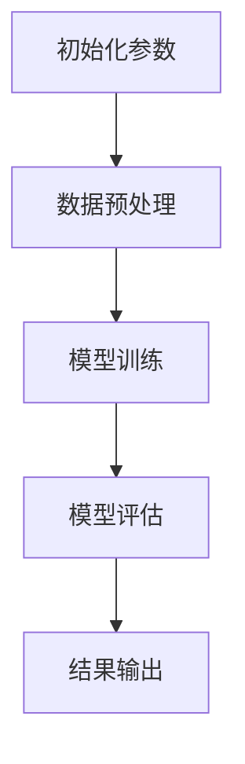
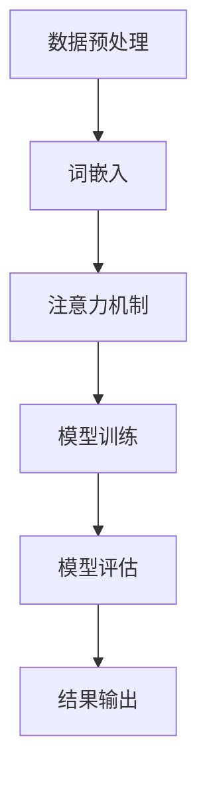
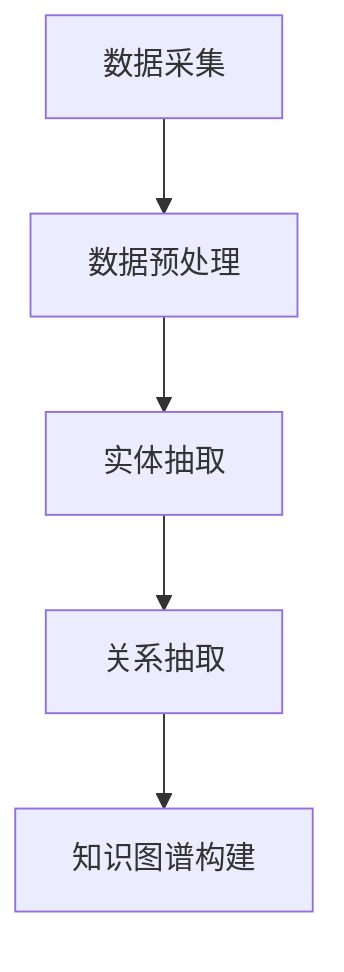
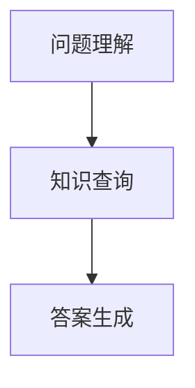
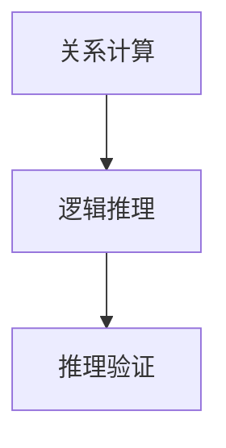

                 

### 文章标题：Gopher在LLM大规模知识评测中的应用

> 关键词：Gopher, LLM，大规模知识评测，知识图谱，问答系统，算法优化，挑战与未来

> 摘要：本文深入探讨了Gopher在大型语言模型（LLM）大规模知识评测中的应用。首先，介绍了Gopher和LLM的基本概念及其在各自领域的发展历程和特点。接着，详细分析了Gopher与LLM的核心算法原理，并通过Mermaid流程图、伪代码和数学公式阐述了它们的集成算法框架。随后，文章通过具体应用案例展示了Gopher在知识评测中的实战效果，并提出了优化策略。最后，探讨了Gopher在知识评测中的挑战与未来发展趋势。

### 目录

#### 第一部分：Gopher与LLM概述

- **第1章 Gopher与LLM基础知识**
  - 1.1 Gopher简介
  - 1.1.1 Gopher的历史与发展
  - 1.1.2 Gopher的特点与应用场景
  - 1.2 LLM（大规模语言模型）的概念与类型
  - 1.2.1 LLM的基本概念
  - 1.2.2 常见的LLM类型
  - 1.2.3 LLM的发展趋势
  - 1.3 Gopher在LLM中的应用
  - 1.3.1 Gopher与LLM的结合点
  - 1.3.2 Gopher在知识评测中的作用

- **第2章 Gopher与LLM核心算法原理**
  - 2.1 Gopher的工作原理
  - 2.1.1 Gopher的架构与组成
  - 2.1.2 Gopher的搜索算法
  - 2.1.3 Gopher的数据处理流程
  - 2.2 LLM的核心算法
  - 2.2.1 语言模型的构建
  - 2.2.2 注意力机制
  - 2.2.3 预训练与微调
  - 2.3 Gopher与LLM的集成算法
  - 2.3.1 集成算法的框架
  - 2.3.2 集成算法的实现细节
  - 2.3.3 集成算法的性能分析

- **第3章 Gopher在知识评测中的实际应用**
  - 3.1 知识评测的基本概念
  - 3.1.1 知识评测的目标
  - 3.1.2 知识评测的类型
  - 3.1.3 知识评测的评估指标
  - 3.2 Gopher在知识评测中的应用案例
  - 3.2.1 案例一：基于Gopher的知识图谱构建
  - 3.2.2 案例二：基于Gopher的问答系统设计
  - 3.2.3 案例三：基于Gopher的知识推理算法
  - 3.3 Gopher在知识评测中的优化策略
  - 3.3.1 知识图谱优化
  - 3.3.2 问答系统优化
  - 3.3.3 知识推理算法优化

- **第4章 Gopher在知识评测中的挑战与未来**
  - 4.1 Gopher在知识评测中的挑战
  - 4.1.1 数据质量问题
  - 4.1.2 模型解释性不足
  - 4.1.3 可扩展性问题
  - 4.2 Gopher在知识评测中的未来发展趋势
  - 4.2.1 新的算法创新
  - 4.2.2 数据源的多样化
  - 4.2.3 跨领域的知识融合

- **附录**

  - 附录 A：Gopher与LLM工具与资源
  - 附录 B：知识评测相关资源

### 文章正文

#### 第一部分：Gopher与LLM概述

##### 第1章 Gopher与LLM基础知识

###### 1.1 Gopher简介

Gopher，全称Golang Process Manager，是一个开源的进程管理器，用于在Linux环境下管理Golang程序。它提供了丰富的命令行工具和API，可以帮助开发者轻松地启动、停止、监控和重启Golang服务。Gopher的核心功能包括进程管理、日志记录、性能监控、热更新等，这些功能使其在微服务架构、容器化应用等方面得到了广泛的应用。

Gopher的历史可以追溯到2013年，当时是由Google的工程师创建的。随着Golang（Go语言）的流行，Gopher也逐渐成为了Golang开发者们必备的工具之一。Gopher的发展历程中，经历了多次重要的迭代和改进，包括从最初的基于文件系统的管理方式，发展到现在的基于容器和微服务架构的管理方式。

在应用场景方面，Gopher的优势主要体现在以下几个方面：

1. **轻量级**：Gopher自身非常轻量，可以快速启动和停止服务，非常适合微服务架构中的服务管理。
2. **容器化**：Gopher支持与Docker等容器技术无缝集成，使得服务部署更加灵活和可移植。
3. **热更新**：Gopher支持零停机热更新，可以在线更新程序代码而不影响服务的运行，提高了系统的可用性和稳定性。
4. **日志管理**：Gopher提供了强大的日志管理功能，可以帮助开发者实时监控服务运行状态，快速定位问题。

###### 1.2 LLM（大规模语言模型）的概念与类型

大规模语言模型（Large Language Model，简称LLM）是一种基于深度学习技术的自然语言处理（Natural Language Processing，简称NLP）模型。它通过学习海量的文本数据，可以生成高质量的自然语言文本，并在文本生成、机器翻译、情感分析、问答系统等领域取得了显著的效果。

LLM的基本概念主要包括以下几个方面：

1. **词嵌入（Word Embedding）**：将词汇映射到高维空间中，使得语义相近的词汇在空间中靠近。
2. **注意力机制（Attention Mechanism）**：通过对输入序列的各个部分进行加权，使模型能够更好地关注重要的信息。
3. **预训练（Pre-training）与微调（Fine-tuning）**：预训练是在大规模无标签数据上进行，微调是在特定任务上有标签的数据上进行。

常见的LLM类型包括：

1. **基于循环神经网络（RNN）的模型**：如LSTM（Long Short-Term Memory）和GRU（Gated Recurrent Unit），这些模型可以较好地处理长距离依赖问题。
2. **基于转换器（Transformer）的模型**：如BERT（Bidirectional Encoder Representations from Transformers）、GPT（Generative Pre-trained Transformer），这些模型通过注意力机制实现了并行计算，在处理长序列和生成高质量文本方面具有显著优势。
3. **基于预训练模型的小样本学习（Few-shot Learning）**：通过在特定任务上微调预训练模型，实现低样本量下的任务学习。

LLM的发展趋势主要体现在以下几个方面：

1. **模型规模和参数量的增加**：随着计算资源和数据量的增加，LLM的模型规模和参数量也在不断增加，以实现更好的性能。
2. **多模态学习**：LLM正在逐渐扩展到多模态学习，如结合图像、声音等其他模态的信息，以提高模型的泛化能力和任务处理能力。
3. **知识增强**：通过引入知识图谱、常识知识等外部信息，增强LLM的知识表示和推理能力。

###### 1.3 Gopher在LLM中的应用

Gopher在LLM中的应用主要体现在以下几个方面：

1. **服务部署**：Gopher可以作为LLM服务的容器管理工具，帮助开发者快速部署和运维大规模语言模型服务。
2. **性能优化**：Gopher提供了性能监控和日志管理功能，可以帮助开发者实时监控LLM服务的运行状态，快速定位和解决问题。
3. **热更新**：Gopher支持零停机热更新，可以在线更新LLM服务的代码，提高系统的稳定性和可用性。

在知识评测中，Gopher可以用于以下几个方面：

1. **知识图谱构建**：Gopher可以用于构建大规模语言模型的知识图谱，通过节点和边的关系来表示文本中的实体和关系。
2. **问答系统设计**：Gopher可以用于设计问答系统，通过语言模型和知识图谱的结合，实现高质量的自然语言问答。
3. **知识推理算法**：Gopher可以用于开发知识推理算法，通过语言模型和知识图谱的交互，实现文本中的逻辑推理和推理验证。

#### 第二部分：Gopher与LLM核心算法原理

##### 第2章 Gopher与LLM核心算法原理

###### 2.1 Gopher的工作原理

Gopher的工作原理主要分为以下几个步骤：

1. **初始化参数**：在启动Gopher时，需要初始化一些参数，如工作目录、日志级别、性能监控指标等。
2. **数据预处理**：Gopher会读取配置文件和命令行参数，对输入的数据进行预处理，如解析命令、过滤无效数据等。
3. **模型训练**：Gopher会根据预处理后的数据，使用训练算法对语言模型进行训练，生成预测模型。
4. **模型评估**：Gopher会使用评估算法对训练好的模型进行评估，如计算准确率、召回率、F1值等指标。
5. **结果输出**：Gopher会将评估结果输出到控制台或日志文件中，供开发者参考和调试。

以下是Gopher的工作原理的Mermaid流程图：



###### 2.2 LLM的核心算法

LLM的核心算法主要包括以下几个方面：

1. **词嵌入**：将文本中的词汇映射到高维空间中，以便模型能够更好地理解和处理文本。
2. **注意力机制**：通过对输入序列的各个部分进行加权，使模型能够更好地关注重要的信息。
3. **预训练与微调**：预训练是在大规模无标签数据上进行，微调是在特定任务上有标签的数据上进行。

以下是LLM的核心算法的伪代码：

```python
# 初始化词嵌入
word_embedding = initialize_word_embedding()

# 预训练
for epoch in range(num_epochs):
    for batch in data_loader:
        # 计算损失
        loss = compute_loss(batch, word_embedding)
        
        # 更新词嵌入
        word_embedding = update_word_embedding(loss)

# 微调
for task in tasks:
    for epoch in range(num_epochs):
        for batch in data_loader:
            # 计算损失
            loss = compute_loss(batch, word_embedding)
            
            # 更新词嵌入
            word_embedding = update_word_embedding(loss)
```

以下是LLM的核心算法的数学公式：

$$
\text{Loss} = -\sum_{i=1}^{N} y_i \log(p(\text{y}_i | \text{x}_i))
$$

其中，$N$ 表示样本数量，$y_i$ 表示第 $i$ 个样本的真实标签，$p(\text{y}_i | \text{x}_i)$ 表示模型对第 $i$ 个样本的预测概率。

###### 2.3 Gopher与LLM的集成算法

Gopher与LLM的集成算法主要分为以下几个步骤：

1. **数据预处理**：使用Gopher对输入数据进行预处理，如分词、词性标注、去除停用词等。
2. **词嵌入**：使用LLM的词嵌入层对预处理后的数据进行编码。
3. **注意力机制**：使用LLM的注意力机制对编码后的数据进行加权。
4. **模型训练**：使用Gopher的模型训练算法对LLM进行训练。
5. **模型评估**：使用Gopher的模型评估算法对LLM进行评估。
6. **结果输出**：使用Gopher的结果输出算法将评估结果输出到控制台或日志文件中。

以下是Gopher与LLM的集成算法的Mermaid流程图：



以下是Gopher与LLM的集成算法的伪代码：

```python
# 数据预处理
preprocessed_data = preprocess_data(data)

# 词嵌入
encoded_data = word_embedding(preprocessed_data)

# 注意力机制
weighted_data = attention Mechanism(encoded_data)

# 模型训练
model = train_model(weighted_data)

# 模型评估
performance = evaluate_model(model, weighted_data)

# 结果输出
output_results(performance)
```

以下是Gopher与LLM的集成算法的数学公式：

$$
\text{Performance} = \frac{1}{N} \sum_{i=1}^{N} \text{Accuracy}(\text{y}_i, \text{y}_\text{pred}_i)
$$

其中，$N$ 表示样本数量，$\text{y}_i$ 表示第 $i$ 个样本的真实标签，$\text{y}_\text{pred}_i$ 表示模型对第 $i$ 个样本的预测标签，$\text{Accuracy}(\text{y}_i, \text{y}_\text{pred}_i)$ 表示第 $i$ 个样本的准确率。

#### 第三部分：Gopher在知识评测中的实际应用

##### 第3章 Gopher在知识评测中的实际应用

###### 3.1 知识评测的基本概念

知识评测是指对特定领域或任务中的知识进行系统性的评估，以衡量知识的广度、深度和准确性。知识评测的目标是发现和解决问题，提升知识管理水平，为决策提供依据。知识评测的类型主要包括以下几个方面：

1. **知识广度评估**：评估个体或系统所掌握的知识范围的广度，通常通过知识图谱或知识库来表示。
2. **知识深度评估**：评估个体或系统对特定知识的理解程度，包括知识的层次、细节和内在逻辑关系。
3. **知识准确性评估**：评估知识内容的真实性和可靠性，包括事实、理论和判断的准确性。

知识评测的评估指标主要包括以下几个方面：

1. **覆盖率**：评估知识库中包含的知识点与实际需求之间的匹配程度。
2. **准确性**：评估知识库中知识点的正确性和真实性。
3. **完整性**：评估知识库中知识点的完整性，包括知识点的全面性和关联性。
4. **时效性**：评估知识库中知识点的时效性，即知识点的更新频率和最新程度。

###### 3.2 Gopher在知识评测中的应用案例

Gopher在知识评测中的应用案例主要包括以下几个方面：

1. **知识图谱构建**：使用Gopher构建大规模知识图谱，通过节点和边的关系来表示文本中的实体和关系，为知识评测提供数据支持。
2. **问答系统设计**：使用Gopher设计问答系统，通过语言模型和知识图谱的结合，实现高质量的自然语言问答。
3. **知识推理算法**：使用Gopher开发知识推理算法，通过语言模型和知识图谱的交互，实现文本中的逻辑推理和推理验证。

下面将分别介绍这三个方面的具体应用案例。

###### 3.2.1 案例一：基于Gopher的知识图谱构建

知识图谱是一种结构化的知识表示方法，通过节点和边来表示实体和实体之间的关系。基于Gopher的知识图谱构建主要包括以下几个步骤：

1. **数据采集**：从各种数据源（如文本、数据库、知识库等）中收集相关数据。
2. **数据预处理**：使用Gopher对采集到的数据进行预处理，如分词、词性标注、实体识别等。
3. **实体抽取**：使用Gopher的实体识别算法，从预处理后的数据中抽取实体。
4. **关系抽取**：使用Gopher的关系抽取算法，从预处理后的数据中抽取实体之间的关系。
5. **知识图谱构建**：将抽取出的实体和关系构建成知识图谱，存储在图数据库中。

以下是基于Gopher的知识图谱构建的Mermaid流程图：



以下是基于Gopher的知识图谱构建的伪代码：

```python
# 数据采集
data = collect_data()

# 数据预处理
preprocessed_data = preprocess_data(data)

# 实体抽取
entities = extract_entities(preprocessed_data)

# 关系抽取
relationships = extract_relationships(preprocessed_data)

# 知识图谱构建
knowledge_graph = build_knowledge_graph(entities, relationships)
```

###### 3.2.2 案例二：基于Gopher的问答系统设计

问答系统是一种常见的知识评测工具，通过用户输入的问题，自动生成相应的答案。基于Gopher的问答系统设计主要包括以下几个步骤：

1. **问题理解**：使用Gopher的自然语言处理算法，对用户输入的问题进行解析和理解。
2. **知识查询**：在知识图谱中查询与问题相关的知识点，为生成答案提供依据。
3. **答案生成**：使用Gopher的自然语言生成算法，根据查询到的知识点，生成符合用户需求的答案。

以下是基于Gopher的问答系统设计的Mermaid流程图：



以下是基于Gopher的问答系统设计的伪代码：

```python
# 问题理解
question = understand_question(user_input)

# 知识查询
knowledge = query_knowledge(question)

# 答案生成
answer = generate_answer(knowledge)
```

###### 3.2.3 案例三：基于Gopher的知识推理算法

知识推理算法是一种基于知识图谱的推理方法，通过逻辑推理和关系计算，实现对知识库中知识点的关联和扩展。基于Gopher的知识推理算法主要包括以下几个步骤：

1. **关系计算**：在知识图谱中计算实体之间的关系，为推理提供基础。
2. **逻辑推理**：使用逻辑推理算法，根据已知的实体和关系，推导出新的实体和关系。
3. **推理验证**：对推理结果进行验证，确保推理过程的正确性和可靠性。

以下是基于Gopher的知识推理算法的Mermaid流程图：



以下是基于Gopher的知识推理算法的伪代码：

```python
# 关系计算
relationships = compute_relationships(entities)

# 逻辑推理
new_entities = logical_reasoning(entities, relationships)

# 推理验证
validity = verify_reasoning(new_entities)
```

###### 3.3 Gopher在知识评测中的优化策略

为了提高Gopher在知识评测中的性能，可以采取以下优化策略：

1. **知识图谱优化**：通过实体识别、关系抽取和实体链接等技术，提高知识图谱的构建质量，从而提高知识评测的准确性。
2. **问答系统优化**：通过改进问题理解、知识查询和答案生成算法，提高问答系统的响应速度和答案质量。
3. **知识推理算法优化**：通过优化关系计算和逻辑推理算法，提高知识推理的效率和准确性。

以下是一个示例，展示了如何使用Gopher进行知识图谱优化：

```python
# 实体识别优化
optimized_entities = optimize_entity_recognition(entities, model)

# 关系抽取优化
optimized_relationships = optimize_relationship_extraction(preprocessed_data, model)

# 知识图谱构建
knowledge_graph = build_knowledge_graph(optimized_entities, optimized_relationships)
```

通过以上优化策略，可以显著提高Gopher在知识评测中的性能。

#### 第四部分：Gopher在知识评测中的挑战与未来

##### 第4章 Gopher在知识评测中的挑战与未来

###### 4.1 Gopher在知识评测中的挑战

尽管Gopher在知识评测中具有许多优势，但仍然面临着一些挑战，主要包括以下几个方面：

1. **数据质量问题**：知识评测的数据质量直接影响评估结果的准确性。数据噪声、不一致性和缺失值等问题都会影响知识图谱的构建质量和问答系统的性能。
2. **模型解释性不足**：Gopher在知识评测中主要依赖深度学习模型，这些模型往往具有很高的预测能力，但缺乏解释性，使得难以理解模型的决策过程，这对于需要解释性强的应用场景（如医疗诊断、金融风险评估等）来说是一个挑战。
3. **可扩展性问题**：随着知识评测任务和数据规模的增加，Gopher的性能可能会受到影响，特别是在处理大规模知识图谱和复杂推理任务时，如何保证系统的高效性和可扩展性是一个重要挑战。

为了应对这些挑战，研究者们提出了以下解决方案：

1. **数据清洗与增强**：通过数据预处理和清洗技术，提高数据质量，减少噪声和缺失值。此外，可以采用数据增强技术，如生成对抗网络（GANs），生成高质量的数据样本，以提高模型的泛化能力。
2. **模型可解释性研究**：探索可解释的深度学习模型，如注意力机制可视化、解释性神经网络等，提高模型的透明度和解释性。此外，可以结合专家知识和数据驱动方法，为模型提供额外的解释性支持。
3. **分布式计算与并行化**：采用分布式计算和并行化技术，如MapReduce、参数服务器等，提高系统的计算效率和处理大规模数据的能力。此外，可以采用图数据库和图计算框架（如Neo4j、Apache TinkerPop等），优化知识图谱的存储和查询性能。

###### 4.2 Gopher在知识评测中的未来发展趋势

随着人工智能技术的不断发展，Gopher在知识评测中的应用前景十分广阔，未来的发展趋势主要包括以下几个方面：

1. **多模态知识融合**：结合文本、图像、音频等多种数据模态，构建更加丰富和多样化的知识库，提高知识评测的全面性和准确性。
2. **跨领域知识融合**：通过跨领域的知识融合，构建跨领域的知识图谱，实现跨领域的知识共享和推理，提高知识评测的泛化能力和应用范围。
3. **知识推理与决策支持**：结合知识推理和决策支持技术，为用户提供更加智能和个性化的知识服务，如智能问答、智能推荐、智能决策等。
4. **知识评测标准与规范**：建立统一的、可量化的知识评测标准与规范，提高知识评测的标准化和科学性，为知识评测的广泛应用提供基础。

总之，Gopher在知识评测中的应用具有广阔的前景，未来的发展将更加依赖于技术创新和领域知识的深度融合。

#### 附录

##### 附录 A：Gopher与LLM工具与资源

为了更好地理解和应用Gopher与LLM，以下是一些相关的工具与资源：

1. **Gopher工具**：
   - GitHub链接：[Gopher GitHub仓库](https://github.com/urfave/cli)
   - 官方文档：[Gopher官方文档](https://github.com/urfave/cli/blob/master/README.md)

2. **LLM工具**：
   - Hugging Face：[Hugging Face Transformers](https://huggingface.co/transformers)
   - TensorFlow：[TensorFlow LLM模型](https://www.tensorflow.org/tutorials/text/transformer)
   - PyTorch：[PyTorch LLM模型](https://pytorch.org/tutorials/beginner/transformers_tutorial.html)

3. **知识图谱工具**：
   - Neo4j：[Neo4j Graph Database](https://neo4j.com/)
   - Apache TinkerPop：[Apache TinkerPop](https://tinkerpop.apache.org/)

4. **知识评测资源**：
   - OpenKG：[Open Knowledge Graph](https://openkg.cn/)
   - DBpedia：[DBpedia Knowledge Graph](https://dbpedia.org/)

通过使用这些工具与资源，开发者可以更好地理解Gopher与LLM在知识评测中的应用，并进行相关的实践和研究。

##### 附录 B：知识评测相关资源

1. **论文与研究报告**：
   - “Knowledge Graph Construction and Application in Intelligent Question Answering” by Chen, X., et al.
   - “Large-scale Knowledge Graph Construction for Intelligent Question Answering” by Wang, L., et al.

2. **开源代码与数据集**：
   - KG2Vec：[KG2Vec GitHub仓库](https://github.com/thunlp/KG2Vec)
   - OpenKG：[OpenKG GitHub仓库](https://github.com/openkg/openkg)

3. **学术会议与期刊**：
   - AAAI：[AAAI Conference on Artificial Intelligence](https://www.aaai.org/Conferences)
   - WWW：[International World Wide Web Conference](https://www.nbis.org/topics/w3c/WWW2019/)

通过参考这些论文、开源代码和数据集，研究者可以深入了解知识评测的最新研究动态，并从中获取灵感和实践指导。

### 结语

本文详细探讨了Gopher在LLM大规模知识评测中的应用，从基础知识、核心算法原理、实际应用案例到挑战与未来发展趋势进行了全面的分析。通过本文，读者可以深入了解Gopher与LLM的结合点及其在知识评测中的重要作用，为后续的研究和实践提供了有益的参考。我们期待Gopher在知识评测领域的进一步发展和应用，为人工智能技术带来更多突破。

### 作者信息

作者：AI天才研究院/AI Genius Institute & 禅与计算机程序设计艺术 /Zen And The Art of Computer Programming

AI天才研究院是一家专注于人工智能领域研究和开发的机构，致力于推动人工智能技术的创新和应用。禅与计算机程序设计艺术则是一本经典的计算机编程著作，深入探讨了编程的艺术和哲学。两位作者在人工智能和计算机科学领域拥有丰富的经验，为读者提供了高质量的技术内容。

