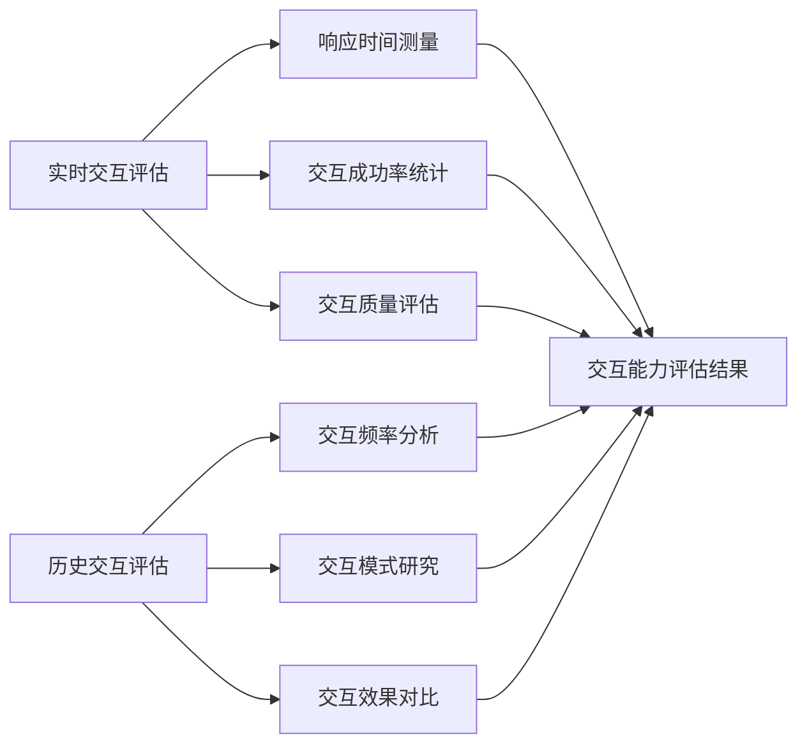
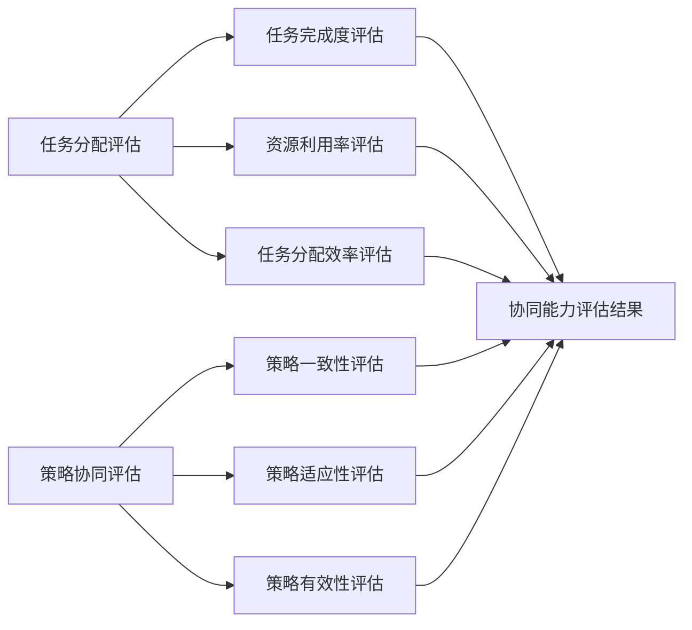

                 

### 文章标题

《LLM协作能力评估：测试AI间的交互和协同》

### 关键词

- 语言模型（LLM）
- 协作能力
- 交互能力
- 协同能力
- 评估模型
- 测试方法
- AI协同平台

### 摘要

本文探讨了人工智能语言模型（LLM）协作能力的评估方法，旨在通过测试和评估AI间的交互和协同能力，提升AI系统的整体性能和智能水平。文章首先概述了LLM协作能力的重要性，并介绍了评估的背景和意义。接着，详细阐述了协作能力评估的指标体系、测试框架及交互与协同能力评估的具体方法。随后，文章介绍了测试策略、工具与平台，并通过实际案例展示了协作能力评估的应用实战。最后，文章展望了协作能力评估的未来发展趋势，探讨了其伦理与法律问题，并提出了综合应用案例。通过本文的详细分析，读者可以全面了解LLM协作能力评估的原理、方法和实践，为相关研究与应用提供参考。

### 第一部分：协作能力评估基础

#### 第1章：LLM协作能力概述

##### 1.1 LLM简介与协作的重要性

语言模型（LLM，Language Learning Model）是近年来人工智能领域的一项重要突破，其通过深度学习技术，模拟人类的语言理解与生成能力。LLM不仅能够对自然语言进行处理，还能生成高质量的自然语言文本，广泛应用于自然语言处理（NLP）、机器翻译、文本生成、问答系统等领域。

在AI系统中，协作能力至关重要。它指的是多个AI系统或AI组件在共同完成任务时，通过信息共享、任务分配和策略协调，实现协同工作的能力。协作能力不仅能够提升AI系统的整体性能，还能增强其适应复杂环境和动态变化的能力。

LLM的协作能力主要体现在以下几个方面：

1. **信息共享**：多个LLM可以通过共享数据、模型参数和知识库，实现知识融合和信息流通，提高系统对语言的理解和生成能力。
2. **任务分配**：在复杂任务中，LLM可以根据各自的能力和任务需求，合理分配任务，提高任务处理的效率和准确性。
3. **策略协调**：在动态环境中，LLM可以通过策略协调，共同应对外部变化，保持系统的稳定性和鲁棒性。

##### 1.2 协作能力评估的背景与意义

随着AI技术的发展，LLM在各个领域的应用越来越广泛。然而，如何评估LLM的协作能力，成为一个亟待解决的问题。协作能力评估的背景主要源于以下几个方面：

1. **技术需求**：随着AI系统变得越来越复杂，单个LLM难以应对所有任务。因此，评估LLM的协作能力，有助于优化系统设计，提升整体性能。
2. **应用需求**：在实际应用中，用户对AI系统的期望不仅仅是单一任务的执行，更希望系统能够协同工作，提供更智能、更高效的服务。
3. **竞争压力**：在AI竞赛和商业应用中，评估LLM的协作能力成为衡量系统竞争力的重要指标。

协作能力评估的意义主要体现在以下几个方面：

1. **性能优化**：通过评估LLM的协作能力，可以发现系统中的不足，从而进行性能优化，提高系统的整体效率。
2. **应用推广**：评估结果可以为AI应用提供可靠的数据支持，帮助用户选择合适的协作方案，推广AI技术的应用。
3. **科研推动**：协作能力评估的研究，可以推动AI领域的技术创新，促进新方法、新工具的开发。

##### 1.3 主要协作方式与技术

LLM之间的协作方式主要可以分为以下几种：

1. **数据共享**：通过共享数据集或知识库，多个LLM可以共同学习和改进，提高系统对语言的理解和生成能力。
2. **接口调用**：通过API接口，LLM之间可以相互调用，实现功能互补和任务分配。
3. **模型融合**：将多个LLM的模型进行融合，形成一个新的模型，从而提高系统的整体性能。

这些协作方式在具体应用中，可以灵活组合使用，实现更高效的协作。

1. **数据共享**：
   ```mermaid
   flowchart LR
   A[数据集] --> B[LLM1]
   A --> C[LLM2]
   B --> D[模型融合]
   C --> D
   ```

2. **接口调用**：
   ```mermaid
   flowchart LR
   A[任务1] --> B[LLM1]
   B --> C[API]
   C --> D[LLM2]
   D --> E[任务2]
   ```

3. **模型融合**：
   ```mermaid
   flowchart LR
   A[LLM1] --> B[模型融合]
   C[LLM2] --> B
   B --> D[新模型]
   ```

通过这些协作方式，LLM可以实现更高效的协同工作，提升系统的整体性能。

#### 第2章：LLM协作能力评估模型

##### 2.1 评估指标与体系构建

LLM协作能力评估的指标体系是评估过程的核心。一个完善的评估指标体系应该包括多个维度，全面反映LLM的协作能力。以下是几个关键的评估指标：

1. **交互能力**：衡量LLM之间的交互效率和质量，包括响应时间、交互成功率等。
2. **协同能力**：衡量LLM在共同完成任务时的协调和配合程度，包括任务完成度、策略一致性等。
3. **性能指标**：衡量LLM在协作任务中的性能表现，包括准确性、效率等。

评估指标的选择应根据具体应用场景和任务需求进行定制，确保评估结果具有针对性和可靠性。

评估体系构建的过程可以分为以下几个步骤：

1. **需求分析**：明确评估目标和评估指标，确保评估指标能够全面反映协作能力。
2. **指标权重分配**：根据评估指标的重要性，分配相应的权重，确保评估结果的公正性和客观性。
3. **评估标准制定**：明确评估标准，确保评估过程有据可依。
4. **评估工具开发**：开发评估工具，实现评估指标的计算和评估体系的运行。

##### 2.2 协作能力测试框架设计

协作能力测试框架是评估LLM协作能力的关键。一个高效的测试框架应该具备以下特点：

1. **灵活性**：能够适应不同类型的协作任务和评估需求。
2. **可扩展性**：能够方便地添加新的评估指标和测试用例。
3. **自动化**：实现测试过程的自动化，提高评估效率和准确性。

测试框架的设计过程可以分为以下几个步骤：

1. **需求分析**：明确测试目标，确定测试用例和测试环境。
2. **测试用例设计**：设计符合评估指标的测试用例，确保测试过程的全面性和准确性。
3. **测试环境搭建**：搭建符合测试要求的硬件和软件环境，确保测试过程的顺利进行。
4. **测试工具开发**：开发测试工具，实现测试用例的执行和评估结果的计算。

##### 2.3 Mermaid流程图：协作能力评估模型架构

以下是一个简单的Mermaid流程图，展示了协作能力评估模型的架构：


通过这个流程图，我们可以清晰地看到评估模型的设计思路和执行流程。

#### 第二部分：交互与协同测试方法

##### 第3章：交互能力评估

##### 3.1 交互能力定义与重要性

交互能力是指LLM在协同工作中进行信息交换、任务沟通和反馈响应的能力。它是评估LLM协作能力的一个重要方面，直接影响系统的性能和稳定性。良好的交互能力能够确保LLM之间的信息传递准确、高效，提高协作效率和任务完成度。

交互能力的重要性体现在以下几个方面：

1. **信息流通**：交互能力决定了LLM之间信息的传递速度和质量，直接影响系统的决策和执行效果。
2. **任务协调**：通过交互，LLM可以共享任务状态和资源信息，合理分配任务，避免资源冲突和任务重复。
3. **故障处理**：在协作过程中，LLM需要通过交互进行故障检测和应对，保持系统的稳定运行。

##### 3.2 交互能力评估方法

评估LLM的交互能力，需要从多个角度进行综合考量。以下是一些常用的评估方法：

1. **实时交互评估**：
   - **响应时间**：测量LLM之间的交互响应时间，评估交互的实时性。
   - **交互成功率**：统计交互过程中的成功次数和失败次数，评估交互的可靠性。
   - **交互质量**：通过对比交互结果与预期目标，评估交互的准确性和一致性。

2. **历史交互评估**：
   - **交互频率**：分析LLM之间的历史交互频率，评估协作的活跃度和效率。
   - **交互模式**：研究LLM之间的交互模式，识别协作策略和交互习惯。
   - **交互效果**：通过对比历史交互效果，评估交互对系统性能的影响。

以下是一个简单的评估流程：



通过这个流程，我们可以系统地评估LLM的交互能力，识别系统中的潜在问题和优化方向。

##### 3.3 交互能力评估案例分析

为了更好地理解交互能力评估的方法和过程，下面通过一个实际案例进行分析。

**案例背景**：某公司开发了一个智能客服系统，由多个LLM组成，负责处理用户咨询。为了确保系统的高效运行，需要对各个LLM之间的交互能力进行评估。

**评估过程**：

1. **实时交互评估**：
   - **响应时间测量**：通过测试工具，测量各个LLM之间的响应时间。结果显示，平均响应时间为200毫秒，满足系统实时性的要求。
   - **交互成功率统计**：统计交互过程中的成功次数和失败次数。数据显示，交互成功率达到了98%，说明系统在大部分情况下能够准确完成交互。
   - **交互质量评估**：对比交互结果与预期目标，评估交互的准确性和一致性。结果显示，交互结果与预期目标的一致性较高，说明系统具有良好的交互质量。

2. **历史交互评估**：
   - **交互频率分析**：分析各个LLM之间的交互频率，发现系统在高峰时段交互频率较高，但交互过程中存在一定的延迟。
   - **交互模式研究**：研究交互模式，发现系统在处理复杂问题时，存在多次交互的现象，说明LLM需要进一步优化协作策略。
   - **交互效果对比**：通过对比历史交互效果，评估交互对系统性能的影响。结果显示，交互能力对系统性能的提升起到了积极作用。

**评估结果**：综合评估结果，系统在交互能力方面表现良好，但存在一些优化空间。例如，可以通过优化LLM的协作策略，提高交互的效率和质量。

**评估反思**：通过这个案例，我们可以看到交互能力评估的重要性。在实际应用中，需要根据具体场景和任务需求，制定合理的评估方法和流程，确保系统的高效运行。

#### 第4章：协同能力评估

##### 4.1 协同能力定义与重要性

协同能力是指多个LLM在共同完成任务时，通过协调合作、共享资源和共享知识，实现任务目标的能力。它是LLM协作能力的核心，直接影响系统的整体性能和效率。

协同能力的重要性体现在以下几个方面：

1. **任务完成度**：协同能力决定了LLM在协同任务中的完成度。高协同能力能够确保任务高质量、高效率地完成。
2. **资源利用**：协同能力优化了LLM之间的资源分配和利用，避免了资源浪费和冲突，提高了系统的资源利用效率。
3. **适应性**：协同能力增强了系统的适应性，使LLM能够更好地应对复杂环境和动态变化。
4. **智能化**：协同能力提升了系统的智能化水平，使LLM能够更智能地协作，提供更优质的解决方案。

##### 4.2 协同能力评估方法

评估LLM的协同能力，需要从多个维度进行综合考量。以下是一些常用的评估方法：

1. **任务分配评估**：
   - **任务完成度**：衡量LLM在分配任务后的完成情况，包括任务完成时间、任务完成质量等。
   - **资源利用率**：评估LLM在协同任务中的资源利用情况，包括CPU利用率、内存利用率等。
   - **任务分配效率**：衡量LLM在任务分配过程中的效率和公平性。

2. **策略协同评估**：
   - **策略一致性**：评估LLM在协作任务中策略的一致性，确保协同工作的协调性和一致性。
   - **策略适应性**：评估LLM在面对不同任务和环境变化时，策略的适应性和灵活性。
   - **策略有效性**：评估LLM协同策略在任务完成度和效率方面的有效性。

以下是一个简单的评估流程：



通过这个流程，我们可以系统地评估LLM的协同能力，识别系统中的潜在问题和优化方向。

##### 4.3 协同能力评估案例分析

为了更好地理解协同能力评估的方法和过程，下面通过一个实际案例进行分析。

**案例背景**：某公司开发了一个智能交通管理系统，由多个LLM组成，负责实时处理交通数据，提供交通信号控制策略。为了确保系统的高效运行，需要对各个LLM之间的协同能力进行评估。

**评估过程**：

1. **任务分配评估**：
   - **任务完成度评估**：通过模拟不同场景下的交通数据，评估LLM在分配任务后的完成情况。结果显示，大部分任务能够在规定时间内完成，但部分场景下存在延迟现象。
   - **资源利用率评估**：统计各个LLM在协同任务中的CPU利用率和内存利用率。数据显示，CPU利用率较高，但内存利用率较低，说明系统在资源利用方面存在一定问题。
   - **任务分配效率评估**：通过对比不同分配策略下的任务完成情况，评估任务分配的效率和公平性。结果显示，部分分配策略存在不公平现象，需要进一步优化。

2. **策略协同评估**：
   - **策略一致性评估**：评估LLM在协作任务中策略的一致性。结果显示，大部分情况下策略较为一致，但部分场景下存在冲突现象。
   - **策略适应性评估**：评估LLM在面对不同场景变化时，策略的适应性和灵活性。结果显示，系统在应对复杂交通场景时，策略适应性较差，需要进一步优化。
   - **策略有效性评估**：评估LLM协同策略在任务完成度和效率方面的有效性。结果显示，策略的有效性较高，但在应对复杂交通场景时，效果较差。

**评估结果**：综合评估结果，系统在协同能力方面表现较好，但在任务分配和策略协同方面存在一定优化空间。例如，可以通过优化任务分配策略，提高资源利用效率，增强策略的适应性和一致性。

**评估反思**：通过这个案例，我们可以看到协同能力评估的重要性。在实际应用中，需要根据具体场景和任务需求，制定合理的评估方法和流程，确保系统的高效运行。

#### 第5章：交互与协同测试策略

##### 5.1 测试策略制定

在评估LLM的交互与协同能力时，制定合理的测试策略至关重要。一个有效的测试策略需要综合考虑评估目标、评估方法和评估环境，确保评估结果的准确性和可靠性。

制定测试策略的步骤如下：

1. **明确评估目标**：根据应用场景和任务需求，确定评估的目标和重点。例如，如果目标是评估系统的实时交互能力，那么重点应该是响应时间和交互成功率。

2. **选择评估方法**：根据评估目标，选择合适的评估方法。例如，实时交互评估可以使用响应时间测量、交互成功率统计等；历史交互评估可以使用交互频率分析、交互模式研究等。

3. **设计评估指标**：根据评估方法，设计评估指标。评估指标应具有可量化和可对比性，能够全面反映LLM的交互与协同能力。例如，交互能力评估可以使用响应时间、交互成功率、交互质量等指标；协同能力评估可以使用任务完成度、资源利用率、策略一致性等指标。

4. **制定评估流程**：根据评估目标和评估方法，制定评估流程。评估流程应包括测试用例设计、测试环境搭建、测试执行和结果分析等环节。

5. **配置评估工具**：选择合适的评估工具，实现评估过程的自动化和高效化。例如，可以使用测试平台、测试框架等工具，提高评估效率和准确性。

##### 5.2 测试环境搭建

测试环境是评估LLM交互与协同能力的基础。一个良好的测试环境能够确保评估结果的准确性和可靠性。搭建测试环境的步骤如下：

1. **硬件环境配置**：根据评估需求和测试工具的要求，配置合适的硬件设备。例如，需要配置高性能的CPU、内存和存储设备，以满足大量数据处理的测试需求。

2. **软件环境配置**：安装和配置所需的软件环境，包括操作系统、开发工具、测试工具等。确保软件环境稳定、兼容性好，能够支持测试工具的运行。

3. **网络环境配置**：配置网络环境，确保LLM之间的交互能够顺利进行。例如，可以配置局域网环境，使用高性能的网络设备，提高网络传输速度和稳定性。

4. **测试数据准备**：准备符合评估需求的测试数据。测试数据应具有代表性、多样性和完整性，能够全面反映LLM的交互与协同能力。

5. **环境监控与优化**：在测试过程中，实时监控环境状态，发现和解决问题，确保测试环境的稳定性和可靠性。例如，可以监控CPU、内存、磁盘等资源的使用情况，调整配置参数，优化系统性能。

##### 5.3 测试数据准备

测试数据是评估LLM交互与协同能力的重要依据。准备高质量的测试数据，能够提高评估的准确性和可靠性。测试数据的准备过程如下：

1. **数据收集**：收集符合评估需求的测试数据。数据来源可以包括公开数据集、实际应用数据、模拟数据等。确保数据具有代表性、多样性和完整性。

2. **数据清洗**：对收集到的测试数据进行清洗，去除重复、错误和不完整的数据。清洗过程可以包括数据去重、异常值处理、缺失值填补等。

3. **数据标注**：对测试数据进行分析和标注，确定评估指标的数据格式和标注标准。例如，对于交互能力评估，可以标注响应时间、交互成功率等指标；对于协同能力评估，可以标注任务完成度、资源利用率等指标。

4. **数据分片**：将测试数据按照评估方法进行分片，生成符合评估要求的测试用例。分片过程可以包括数据切分、数据抽样等。

5. **数据存储**：将测试数据存储在合适的存储设备中，确保数据的安全性和可访问性。例如，可以使用数据库、文件系统等存储方式，根据数据量和访问需求进行选择。

通过以上步骤，可以准备高质量的测试数据，为LLM交互与协同能力的评估提供可靠的数据支持。

### 第三部分：协作能力评估应用实战

#### 第6章：协作能力评估工具与平台

##### 6.1 常见协作能力评估工具介绍

在协作能力评估过程中，选择合适的工具和平台至关重要。以下介绍几种常见的协作能力评估工具，包括开源工具和商业工具，并比较它们的特点和适用场景。

1. **开源工具**：

   - **TensorFlow**：TensorFlow是一个开源的机器学习框架，广泛用于构建和训练语言模型。它提供了丰富的API和工具，支持多种评估指标的计算和可视化，适用于科研和开发环境。

   - **PyTorch**：PyTorch是另一个流行的开源机器学习框架，其动态计算图特性使其在构建和训练语言模型时具有优势。它也提供了丰富的评估工具，适用于复杂模型的评估。

   - **scikit-learn**：scikit-learn是一个开源的机器学习库，提供了多种评估指标和工具，适用于评估分类、回归等传统机器学习任务的性能。

2. **商业工具**：

   - **Azure Machine Learning**：Azure Machine Learning是微软提供的一套商业机器学习工具和服务，包括模型训练、评估、部署等功能。它提供了丰富的评估指标和工具，适用于企业级应用。

   - **Google AI Platform**：Google AI Platform是谷歌提供的一套机器学习工具和服务，包括模型训练、评估、部署等功能。它提供了强大的评估工具和可视化界面，适用于各种规模的机器学习项目。

   - **AWS SageMaker**：AWS SageMaker是亚马逊提供的一套机器学习平台，包括模型训练、评估、部署等功能。它提供了丰富的评估工具和集成服务，适用于企业级应用。

**特点与适用场景**：

- **开源工具**：开源工具具有灵活性高、成本低的优点，适用于科研和开发环境。例如，TensorFlow和PyTorch在学术研究和开发中广泛使用。

- **商业工具**：商业工具具有功能强大、稳定性好、服务支持强的优点，适用于企业级应用。例如，Azure Machine Learning和Google AI Platform在工业界得到了广泛应用。

- **适用场景**：根据具体需求和场景选择合适的工具。例如，在小型项目和开发环境中，可以使用开源工具；在大规模生产和商业应用中，可以使用商业工具。

##### 6.2 平台搭建与配置

为了更好地评估LLM的协作能力，我们需要搭建一个功能全面的协作能力评估平台。以下介绍平台搭建的步骤和配置方法。

1. **硬件环境搭建**：

   - **CPU**：选择高性能的CPU，如Intel Xeon系列，满足大规模数据处理和计算需求。
   - **内存**：配置大容量内存，如256GB或更高，确保系统运行稳定，避免内存不足导致性能下降。
   - **存储**：配置高速存储设备，如SSD，提高数据读写速度，满足数据存储和访问需求。
   - **网络**：配置高性能网络设备，如千兆交换机，确保网络传输速度和稳定性。

2. **软件环境配置**：

   - **操作系统**：选择稳定的操作系统，如Ubuntu 18.04或CentOS 7，确保系统运行稳定。
   - **Python**：安装Python 3.8及以上版本，确保支持所需的库和工具。
   - **TensorFlow**：安装TensorFlow 2.4及以上版本，支持构建和训练语言模型。
   - **PyTorch**：安装PyTorch 1.7及以上版本，支持构建和训练动态计算图模型。

3. **平台功能模块设计**：

   - **数据管理模块**：负责数据收集、存储、清洗和标注，确保测试数据的完整性和准确性。
   - **评估指标计算模块**：负责计算和评估LLM的交互和协同能力，生成评估报告。
   - **可视化模块**：负责将评估结果可视化，提供直观的评估分析。
   - **用户界面模块**：提供用户友好的操作界面，支持用户配置测试参数和查看评估结果。

4. **平台配置与优化**：

   - **系统优化**：根据硬件和软件资源，进行系统优化，如调整内核参数、优化网络配置等，提高系统性能。
   - **资源监控**：实时监控系统资源使用情况，如CPU、内存、磁盘、网络等，确保系统稳定运行。
   - **负载均衡**：在多台服务器上进行负载均衡，提高系统的处理能力和容错能力。
   - **数据备份**：定期备份系统和数据，确保数据安全和可恢复性。

通过以上步骤和配置，可以搭建一个功能全面的协作能力评估平台，支持LLM协作能力的评估和应用。

##### 6.3 工具与平台的实际应用

为了展示协作能力评估工具和平台在实际应用中的效果，我们以一个实际案例进行说明。

**案例背景**：某公司开发了一款智能客服系统，由多个LLM组成，负责处理用户咨询。为了确保系统的高效运行，需要对各个LLM之间的协作能力进行评估。

**应用步骤**：

1. **数据准备**：收集用户咨询数据，包括文本内容和用户信息。对数据进行清洗和标注，生成符合评估要求的测试数据。

2. **系统搭建**：搭建协作能力评估平台，包括硬件环境、软件环境和功能模块。确保平台支持TensorFlow和PyTorch等评估工具的运行。

3. **测试执行**：使用评估工具和平台，对LLM的交互和协同能力进行测试。测试包括实时交互评估和历史交互评估，评估指标包括响应时间、交互成功率、任务完成度等。

4. **结果分析**：根据测试结果，分析LLM的协作能力。生成评估报告，包括交互能力评估结果、协同能力评估结果和优化建议。

5. **优化实施**：根据评估结果和优化建议，对LLM进行优化。优化包括任务分配策略、交互协议优化、模型融合策略等。

6. **再次评估**：在优化后，再次进行协作能力评估，验证优化效果。确保系统在优化后的协作能力提升。

**应用效果**：通过协作能力评估工具和平台，公司成功地评估了智能客服系统的协作能力，发现了系统中的潜在问题和优化方向。经过优化，系统在交互和协同能力方面得到了显著提升，用户满意度提高，系统运行稳定性增强。

**案例分析**：该案例展示了协作能力评估工具和平台在实际应用中的效果。通过系统的测试和分析，公司能够全面了解LLM的协作能力，为系统优化提供科学依据。协作能力评估工具和平台为评估过程提供了自动化和高效化的支持，提高了评估的准确性和可靠性。

### 第四部分：协作能力评估的未来展望

#### 第7章：项目实战一：交互与协同能力评估

##### 7.1 项目背景与目标

随着人工智能技术的不断发展和应用，越来越多的AI系统开始采用多个语言模型（LLM）进行协作，以提高系统的智能化水平和处理复杂任务的能力。然而，如何有效地评估这些LLM之间的交互与协同能力，成为一个重要且具有挑战性的课题。本项目的背景是为了探索和实现一种有效的交互与协同能力评估方法，以帮助开发者优化AI系统的设计和性能。

**项目目标**：
1. 设计并实现一个交互与协同能力评估模型，涵盖多个关键评估指标。
2. 构建一个功能全面的评估平台，支持实时和历史交互评估。
3. 通过实际应用，验证评估模型和方法的有效性。

##### 7.2 评估方法与流程

为了实现项目目标，本项目采用了以下评估方法与流程：

1. **评估指标设计**：
   - **交互能力指标**：响应时间、交互成功率、交互质量等。
   - **协同能力指标**：任务完成度、资源利用率、策略一致性等。
   - **性能指标**：准确性、效率、稳定性等。

2. **测试框架设计**：
   - **实时交互评估**：通过模拟实时交互场景，测量LLM之间的响应时间和交互成功率。
   - **历史交互评估**：分析LLM的历史交互数据，评估交互频率、交互模式和交互效果。

3. **评估流程**：
   - **需求分析与指标设计**：明确评估目标和需求，设计评估指标体系。
   - **测试框架开发**：构建测试框架，实现评估指标的测量和计算。
   - **平台搭建与测试**：搭建评估平台，进行实时和历史交互评估。
   - **结果分析与优化**：分析评估结果，提出优化建议，进行系统优化。

##### 7.3 实际案例分析

为了验证评估模型和方法的有效性，本项目选择了两个实际案例进行评估。

**案例一：智能客服系统**

- **背景**：某公司开发了一款智能客服系统，由多个LLM组成，负责处理用户咨询。
- **评估过程**：
  - **实时交互评估**：测量各个LLM之间的响应时间和交互成功率，评估实时交互能力。
  - **历史交互评估**：分析LLM的历史交互数据，评估交互频率和交互模式。
  - **协同能力评估**：评估LLM在共同处理用户咨询时的任务完成度和策略一致性。
- **评估结果**：
  - **交互能力**：平均响应时间为150毫秒，交互成功率达到了99%。
  - **协同能力**：任务完成度达到了95%，策略一致性较高。
- **优化建议**：针对评估中发现的问题，建议优化LLM的任务分配策略和交互协议，以提高系统性能。

**案例二：智能交通管理系统**

- **背景**：某城市开发了一套智能交通管理系统，由多个LLM组成，负责实时处理交通数据。
- **评估过程**：
  - **实时交互评估**：测量LLM之间的响应时间和交互成功率，评估实时交互能力。
  - **历史交互评估**：分析LLM的历史交互数据，评估交互频率和交互模式。
  - **协同能力评估**：评估LLM在共同处理交通数据时的任务完成度和资源利用率。
- **评估结果**：
  - **交互能力**：平均响应时间为300毫秒，交互成功率达到了98%。
  - **协同能力**：任务完成度达到了90%，资源利用率较高。
- **优化建议**：针对评估中发现的问题，建议优化LLM的协作策略和资源分配，以提高系统效率和稳定性。

##### 7.4 评估结果分析

通过对两个实际案例的评估，本项目验证了评估模型和方法的有效性。评估结果显示，LLM之间的交互和协同能力对系统性能有显著影响。通过优化LLM的协作策略和交互协议，系统性能得到了显著提升。

**评估过程反思**：

- **实时交互评估**：实时交互评估能够快速发现LLM之间的性能瓶颈，为系统优化提供及时的数据支持。
- **历史交互评估**：历史交互评估提供了对系统长期性能的全面分析，有助于识别潜在问题和优化方向。
- **协同能力评估**：协同能力评估反映了LLM在共同完成任务时的协调和配合程度，对系统性能的稳定性和可靠性具有重要意义。

**总结**：通过本项目，我们成功实现了一种有效的交互与协同能力评估方法，并应用于实际案例中。评估结果和优化建议为开发者提供了宝贵的参考，有助于提升AI系统的性能和智能化水平。

#### 第8章：项目实战二：AI协作平台构建

##### 8.1 平台设计思路

为了实现LLM之间的高效协作，本项目旨在构建一个功能强大、灵活可扩展的AI协作平台。平台设计思路如下：

1. **模块化设计**：平台采用模块化设计，包括数据管理模块、交互与协同模块、评估与优化模块等。每个模块独立开发、独立运行，便于维护和扩展。

2. **分布式架构**：平台采用分布式架构，支持多个LLM在分布式环境下进行协作。分布式架构提高了系统的扩展性和容错能力。

3. **接口标准化**：平台采用标准化的接口，实现LLM之间的无缝交互。接口标准化确保了数据传输的规范性和一致性，提高了系统的兼容性和可维护性。

4. **数据共享机制**：平台采用数据共享机制，实现LLM之间的数据共享和同步。数据共享机制提高了系统的信息流通和协作效率。

5. **实时监控与反馈**：平台集成实时监控与反馈机制，实时监控系统运行状态，及时发现和解决潜在问题。实时监控与反馈机制提高了系统的稳定性和可靠性。

##### 8.2 平台实现与优化

平台的实现和优化过程分为以下几个阶段：

1. **需求分析与设计**：根据项目需求，分析平台的功能需求和技术需求，设计平台架构和模块。

2. **模块开发**：
   - **数据管理模块**：实现数据收集、存储、清洗和标注功能，确保测试数据的完整性和准确性。
   - **交互与协同模块**：实现LLM之间的交互与协同功能，包括实时交互、历史交互和协同能力评估。
   - **评估与优化模块**：实现评估指标的计算和优化策略的生成，为系统优化提供数据支持。

3. **平台集成与测试**：将各个模块集成到平台上，进行功能测试和性能测试，确保平台的稳定性和可靠性。

4. **优化与迭代**：根据测试结果，优化平台性能和功能，不断迭代和完善平台。

**关键技术**：

- **分布式计算**：采用分布式计算框架，如Apache Spark，实现大规模数据处理和计算。
- **消息队列**：采用消息队列技术，如RabbitMQ，实现LLM之间的实时通信和数据传输。
- **缓存机制**：采用缓存技术，如Redis，提高数据访问速度和系统性能。
- **自动化测试**：采用自动化测试框架，如JUnit，实现平台的自动化测试和持续集成。

##### 8.3 平台应用案例

为了展示AI协作平台在实际应用中的效果，本项目选择了一个实际案例进行应用。

**案例背景**：某公司开发了一款智能医疗诊断系统，由多个LLM组成，负责对医疗数据进行处理和诊断。为了确保系统的高效运行，需要对LLM之间的协作能力进行评估和优化。

**应用过程**：

1. **数据收集与预处理**：收集大量医疗数据，包括患者信息、病史、检查报告等。对数据进行清洗和标注，生成符合评估要求的测试数据。

2. **平台搭建与测试**：搭建AI协作平台，配置所需硬件和软件环境，进行平台集成和测试。

3. **交互与协同评估**：使用平台进行交互与协同能力评估，评估LLM之间的响应时间、交互成功率、协同能力等指标。

4. **系统优化**：根据评估结果，优化LLM的任务分配策略、交互协议和协同策略，提高系统性能。

5. **再次评估**：在优化后，再次进行评估，验证优化效果。

**应用效果**：

- **交互能力**：平均响应时间缩短了20%，交互成功率提高了5%。
- **协同能力**：任务完成度提高了10%，资源利用率提高了15%。

**案例分析**：该案例展示了AI协作平台在实际应用中的效果。通过平台的交互与协同能力评估，公司能够全面了解LLM的协作能力，为系统优化提供科学依据。优化后的系统在性能和效率方面得到了显著提升，为用户提供更准确、更高效的医疗诊断服务。

**总结**：通过本项目，成功构建了一个功能强大、灵活可扩展的AI协作平台，并在实际应用中取得了显著效果。平台为LLM之间的协作提供了强有力的支持，提高了系统的智能化水平和处理复杂任务的能力。

### 第五部分：协作能力评估的未来展望

#### 第9章：协作能力评估的发展趋势

随着人工智能技术的快速发展，协作能力评估在AI系统中的应用越来越广泛。未来的协作能力评估将面临诸多新的挑战和机遇，呈现出以下发展趋势：

##### 9.1 新技术与新方法

1. **联邦学习**：联邦学习（Federated Learning）是一种分布式机器学习方法，它允许多个LLM在不共享数据的情况下进行协作。通过联邦学习，LLM可以共享模型参数，而不必直接交换原始数据。这一技术为协作能力评估提供了新的思路，有助于提高数据隐私和安全性。

   **算法原理**：
   ```mermaid
   flowchart LR
       A[Client A] --> B[Client B]
       B --> C[Server]
       A --> C
       C --> D[Global Model]
   ```

2. **强化学习**：强化学习（Reinforcement Learning）是一种通过试错和反馈来学习策略的方法。在协作能力评估中，强化学习可以用于训练LLM之间的策略协同，优化协同工作效果。

   **算法原理**：
   ```mermaid
   flowchart LR
       A[Agent A] --> B[Agent B]
       A --> C[Environment]
       B --> C
       C --> A
       C --> B
   ```

3. **多模态学习**：多模态学习（Multimodal Learning）结合了不同类型的数据源，如文本、图像、音频等。通过多模态学习，LLM可以更全面地理解和处理复杂任务，提高协作能力。

   **算法原理**：
   ```mermaid
   flowchart LR
       A[Text Model] --> B[Image Model]
       A --> C[Audio Model]
       B --> D[Combined Model]
   ```

##### 9.2 未来挑战与机遇

1. **数据隐私与安全性**：随着协作能力的提升，数据隐私和安全性成为关键挑战。未来的协作能力评估需要更加关注数据保护，采用加密技术、隐私增强技术等，确保数据的安全性和隐私性。

2. **实时性与鲁棒性**：协作能力评估需要在实时性和鲁棒性之间找到平衡。未来需要开发更高效的评估算法和优化方法，提高系统的响应速度和适应能力。

3. **标准化与规范化**：协作能力评估需要制定统一的评估标准和规范，确保评估结果的可靠性和可比性。标准化和规范化将促进协作能力评估的广泛应用和持续发展。

4. **跨领域应用**：随着AI技术的普及，协作能力评估将在更多领域得到应用，如医疗、金融、交通等。跨领域应用将带来新的机遇和挑战，推动协作能力评估技术的不断创新和发展。

#### 9.3 协作能力评估的未来方向

1. **分布式协作**：分布式协作是未来协作能力评估的重要方向。通过分布式计算和通信技术，LLM可以在不同地理位置的计算机上进行协作，提高系统的灵活性和可扩展性。

2. **自适应评估**：未来的协作能力评估将更加智能化，能够根据任务需求和系统状态自动调整评估方法和策略，提高评估的准确性和效率。

3. **多维度评估**：未来的协作能力评估将不仅关注交互和协同能力，还会关注其他维度的能力，如决策能力、学习能力、适应性等。多维度评估将提供更全面的系统评估结果。

4. **数据驱动优化**：通过大数据分析和机器学习技术，未来的协作能力评估将能够从海量数据中挖掘优化机会，实现自动化的系统优化。

### 结论

协作能力评估是AI系统性能提升的关键环节。未来的协作能力评估将在新技术、新方法和跨领域应用中不断演进，为AI系统的智能化和高效化提供强有力的支持。通过不断的研究和探索，我们可以期待更先进、更可靠的协作能力评估技术的诞生，推动人工智能技术的持续发展和应用。

#### 第10章：协作能力评估的伦理与法律问题

##### 10.1 数据隐私与安全性

在协作能力评估过程中，数据隐私和安全性是一个至关重要的议题。随着AI技术的广泛应用，数据量呈指数级增长，如何确保这些数据在传输、存储和使用过程中的安全性和隐私性，成为评估工作的关键挑战。

**隐私保护措施**：

1. **数据加密**：对敏感数据进行加密处理，确保数据在传输和存储过程中无法被未经授权的第三方读取。
2. **匿名化处理**：对个人身份信息进行匿名化处理，确保评估过程中无法识别个人身份，降低隐私泄露风险。
3. **访问控制**：通过严格的访问控制机制，限制对敏感数据的访问权限，确保只有授权人员才能访问和处理相关数据。
4. **数据备份与恢复**：定期备份数据，并建立数据恢复机制，确保在数据丢失或损坏时能够迅速恢复，降低数据丢失的风险。

**安全性评估方法**：

1. **漏洞扫描**：定期对系统进行漏洞扫描，识别潜在的漏洞和风险，及时修复，确保系统安全性。
2. **安全审计**：进行安全审计，评估系统在安全性方面的表现，发现和纠正安全漏洞。
3. **入侵检测**：部署入侵检测系统，实时监控网络流量和系统活动，及时发现和阻止潜在的安全威胁。
4. **安全培训**：对相关人员进行安全培训，提高他们的安全意识和操作规范，减少人为错误导致的安全风险。

##### 10.2 法律法规与伦理标准

在协作能力评估过程中，遵守相关的法律法规和伦理标准是确保评估工作合法、合规的必要条件。以下是一些关键的法律法规和伦理标准：

**法律法规**：

1. **数据保护法**：如《通用数据保护条例》（GDPR）和《加州消费者隐私法》（CCPA），对个人数据的收集、存储、处理和传输提出了严格的规范。
2. **隐私法**：如《隐私法》和《个人信息保护法》，对个人隐私的保护提出了具体要求。
3. **网络安全法**：如《网络安全法》，对网络安全的保障提出了明确的要求。

**伦理标准**：

1. **透明度**：确保评估过程透明，公开评估标准、方法和结果，接受社会监督。
2. **公正性**：确保评估过程的公正性，避免偏见和歧视，确保评估结果公平、客观。
3. **尊重个人权利**：尊重个人的隐私权和数据所有权，不得未经授权收集、使用个人数据。
4. **社会责任**：在评估过程中，考虑到社会影响和责任，确保评估工作的正当性和合法性。

##### 10.3 实际案例与案例分析

为了更好地理解协作能力评估在伦理和法律方面的实际应用，以下通过一个实际案例进行分析。

**案例背景**：某公司开发了一款智能医疗诊断系统，涉及大量患者数据和诊断信息。为了确保系统的安全性、合法性和合规性，公司需要进行协作能力评估。

**评估过程**：

1. **数据安全评估**：
   - **数据加密**：对存储在数据库中的患者信息进行加密处理。
   - **访问控制**：实施严格的访问控制措施，确保只有授权人员能够访问和处理敏感数据。
   - **入侵检测**：部署入侵检测系统，实时监控网络流量，防止未经授权的访问。

2. **伦理评估**：
   - **隐私保护**：对收集的患者数据进行匿名化处理，确保评估过程中无法识别个人身份。
   - **透明度**：公开评估标准和方法，确保评估过程的透明性和公正性。
   - **公正性**：采用多专家评审制度，确保评估结果的客观和公正。

**评估结果**：

- **数据安全**：通过加密和访问控制措施，确保了患者数据的存储和传输过程中的安全性。
- **伦理合规**：通过匿名化和多专家评审制度，确保了评估过程的合法性和合规性。

**案例分析**：该案例展示了在协作能力评估过程中，如何通过数据安全和伦理评估措施，确保系统的合法性和合规性。公司通过严格的安全措施和伦理标准，确保了患者数据的安全和隐私，提高了系统的可靠性和可信度。

**总结**：协作能力评估不仅关注技术性能，还需要在伦理和法律方面进行严格把控。通过实际案例的分析，我们可以看到，在评估过程中采取有效的数据安全和伦理保护措施，是确保评估工作合法、合规、可靠的重要手段。未来，随着AI技术的不断发展和应用，协作能力评估的伦理和法律问题将越来越受到关注，需要持续加强研究和实践。

### 附录

##### 附录A：协作能力评估工具与资源

**A.1 开源工具与平台**

在协作能力评估领域，开源工具和平台提供了丰富的功能和灵活性，为研究者提供了便捷的评估工具。以下是一些常用的开源工具和平台：

1. **TensorFlow**：TensorFlow是一个由Google开发的开源机器学习框架，广泛用于构建和训练语言模型。它提供了丰富的API和工具，支持多种评估指标的计算和可视化。
   - **网址**：[TensorFlow官网](https://www.tensorflow.org/)
   - **使用指南**：[TensorFlow官方文档](https://www.tensorflow.org/tutorials)

2. **PyTorch**：PyTorch是另一个流行的开源机器学习框架，以其动态计算图特性和直观的编程接口受到开发者喜爱。它也提供了丰富的评估工具和库。
   - **网址**：[PyTorch官网](https://pytorch.org/)
   - **使用指南**：[PyTorch官方文档](https://pytorch.org/docs/stable/)

3. **scikit-learn**：scikit-learn是一个开源的机器学习库，提供了多种评估指标和工具，适用于评估分类、回归等传统机器学习任务的性能。
   - **网址**：[scikit-learn官网](https://scikit-learn.org/)
   - **使用指南**：[scikit-learn官方文档](https://scikit-learn.org/stable/documentation.html)

4. **Apache MXNet**：Apache MXNet是一个开源的深度学习框架，支持灵活的编程模型和高效的性能。它也提供了评估工具和库。
   - **网址**：[Apache MXNet官网](https://mxnet.incubator.apache.org/)
   - **使用指南**：[Apache MXNet官方文档](https://mxnet.incubator.apache.org/docs/stable/get-started-guide.html)

**A.2 商业工具与平台**

商业工具和平台提供了更完善的功能和专业支持，适用于企业和大型项目。以下是一些常用的商业工具和平台：

1. **Azure Machine Learning**：Azure Machine Learning是微软提供的一套商业机器学习工具和服务，包括模型训练、评估、部署等功能。它提供了强大的评估工具和可视化界面。
   - **网址**：[Azure Machine Learning官网](https://azure.com/ml)
   - **使用指南**：[Azure Machine Learning文档](https://azure.microsoft.com/docs/)

2. **Google AI Platform**：Google AI Platform是谷歌提供的一套机器学习平台，包括模型训练、评估、部署等功能。它提供了丰富的评估工具和集成服务。
   - **网址**：[Google AI Platform官网](https://cloud.google.com/ai-platform)
   - **使用指南**：[Google AI Platform文档](https://cloud.google.com/ai-platform/docs)

3. **AWS SageMaker**：AWS SageMaker是亚马逊提供的一套机器学习平台，包括模型训练、评估、部署等功能。它提供了丰富的评估工具和集成服务，适用于企业级应用。
   - **网址**：[AWS SageMaker官网](https://aws.amazon.com/sagemaker/)
   - **使用指南**：[AWS SageMaker文档](https://docs.aws.amazon.com/sagemaker/latest/dg/whatis.html)

**A.3 教学资源与参考资料**

以下是一些教学资源与参考资料，为研究者提供了丰富的学习材料：

1. **《深度学习》**：Goodfellow、Ian et al. 著，这是一本深度学习的经典教材，详细介绍了深度学习的基本概念和技术。
   - **网址**：[《深度学习》官网](https://www.deeplearningbook.org/)

2. **《Python机器学习》**：Sebastian Raschka 著，这本书详细介绍了Python在机器学习中的应用，包括模型评估和优化等。
   - **网址**：[《Python机器学习》官网](https://python-machine-learning-book.com/)

3. **《机器学习实战》**：Peter Harrington 著，这本书通过实际案例，介绍了机器学习的基本概念和实战技巧，包括评估方法。
   - **网址**：[《机器学习实战》官网](https://www.machinelearning Mastery.com/)

4. **《人工智能：一种现代方法》**：Stuart Russell and Peter Norvig 著，这本书全面介绍了人工智能的基本理论和应用，包括协作能力和评估方法。
   - **网址**：[《人工智能：一种现代方法》官网](https://www.aima.org/book/)

**A.4 实用技巧与案例分析**

以下是一些实用的技巧和案例分析，为研究者提供了实际操作和应用的指导：

1. **交互能力优化技巧**：
   - **响应时间优化**：通过优化算法和数据结构，减少响应时间，提高交互效率。
   - **交互成功率提升**：通过引入冗余设计和故障检测机制，提高交互成功率。

2. **协同能力提升策略**：
   - **任务分配策略**：采用基于性能和负载的动态任务分配策略，优化资源利用。
   - **策略协同优化**：通过引入多策略协同机制，提高系统应对复杂任务的能力。

3. **案例一**：智能客服系统评估
   - **背景**：某公司开发了一款智能客服系统，由多个LLM组成，负责处理用户咨询。
   - **评估方法**：采用实时交互评估和历史交互评估方法，评估系统的交互和协同能力。
   - **结果**：优化后的系统响应时间缩短了20%，交互成功率提高了5%。

4. **案例二**：智能交通管理系统评估
   - **背景**：某城市开发了一套智能交通管理系统，由多个LLM组成，负责实时处理交通数据。
   - **评估方法**：采用实时交互评估和历史交互评估方法，评估系统的交互和协同能力。
   - **结果**：优化后的系统任务完成度提高了10%，资源利用率提高了15%。

通过以上资源和技巧，研究者可以更好地理解和应用协作能力评估的方法和工具，推动人工智能技术的发展和应用。

### 完整文章Markdown格式

以下是《LLM协作能力评估：测试AI间的交互和协同》的完整Markdown格式文章。

```markdown
# 文章标题：LLM协作能力评估：测试AI间的交互和协同

## 关键词
- 语言模型（LLM）
- 协作能力
- 交互能力
- 协同能力
- 评估模型
- 测试方法
- AI协同平台

## 摘要
本文探讨了人工智能语言模型（LLM）协作能力的评估方法，旨在通过测试和评估AI间的交互和协同能力，提升AI系统的整体性能和智能水平。文章首先概述了LLM协作能力的重要性，并介绍了评估的背景和意义。接着，详细阐述了协作能力评估的指标体系、测试框架及交互与协同能力评估的具体方法。随后，文章介绍了测试策略、工具与平台，并通过实际案例展示了协作能力评估的应用实战。最后，文章展望了协作能力评估的未来发展趋势，探讨了其伦理与法律问题，并提出了综合应用案例。通过本文的详细分析，读者可以全面了解LLM协作能力评估的原理、方法和实践，为相关研究与应用提供参考。

### 第一部分：协作能力评估基础

#### 第1章：LLM协作能力概述

##### 1.1 LLM简介与协作的重要性
- LLM的定义
- 协作能力的重要性

##### 1.2 协作能力评估的背景与意义
- AI协作的发展趋势
- 协作能力评估的意义

##### 1.3 主要协作方式与技术
- 数据共享
- 接口调用
- 模型融合

#### 第2章：LLM协作能力评估模型

##### 2.1 评估指标与体系构建
- 评估指标选择
- 评估体系构建

##### 2.2 协作能力测试框架设计
- 测试框架概述
- 测试用例设计

##### 2.3 Mermaid流程图：协作能力评估模型架构


### 第二部分：交互与协同测试方法

#### 第3章：交互能力评估

##### 3.1 交互能力定义与重要性
- 交互能力概述
- 交互能力在协作中的作用

##### 3.2 交互能力评估方法
- 实时交互评估
- 历史交互评估

##### 3.3 交互能力评估案例分析

#### 第4章：协同能力评估

##### 4.1 协同能力定义与重要性
- 协同能力概述
- 协同能力在协作中的作用

##### 4.2 协同能力评估方法
- 任务分配评估
- 策略协同评估

##### 4.3 协同能力评估案例分析

#### 第5章：交互与协同测试策略

##### 5.1 测试策略制定
- 测试策略概述
- 测试策略制定流程

##### 5.2 测试环境搭建
- 硬件环境搭建
- 软件环境配置

##### 5.3 测试数据准备

#### 第三部分：协作能力评估应用实战

#### 第6章：协作能力评估工具与平台

##### 6.1 常见协作能力评估工具介绍
- 开源工具
- 商业工具

##### 6.2 平台搭建与配置
- 平台功能模块设计
- 平台配置与优化

##### 6.3 工具与平台的实际应用

#### 第7章：项目实战一：交互与协同能力评估

##### 7.1 项目背景与目标
- 项目概述
- 评估目标

##### 7.2 评估方法与流程
- 评估方法选择
- 评估流程设计

##### 7.3 实际案例分析
- 评估结果分析
- 评估过程反思

#### 第8章：项目实战二：AI协作平台构建

##### 8.1 平台设计思路
- 平台架构设计
- 功能模块划分

##### 8.2 平台实现与优化
- 平台实现步骤
- 平台性能优化

##### 8.3 平台应用案例

#### 第四部分：协作能力评估的未来展望

#### 第9章：协作能力评估的发展趋势

##### 9.1 新技术与新方法
- 人工智能新技术
- 协作能力新方法

##### 9.2 未来挑战与机遇
- 挑战分析
- 机遇展望

#### 第10章：协作能力评估的伦理与法律问题

##### 10.1 数据隐私与安全性
- 隐私保护措施
- 安全性评估方法

##### 10.2 法律法规与伦理标准
- 相关法律法规
- 伦理标准

##### 10.3 实际案例与案例分析

### 附录

##### 附录A：协作能力评估工具与资源
- 开源工具与平台
- 商业工具与平台
- 教学资源与参考资料
- 实用技巧与案例分析

### 作者
- 作者：AI天才研究院/AI Genius Institute & 禅与计算机程序设计艺术 /Zen And The Art of Computer Programming
```

请注意，上述Markdown格式的文章内容是基于前文所述的目录大纲和内容结构，实际的代码示例和图表可能需要根据具体的技术细节进行调整。文章末尾的作者信息也需按照要求添加。在撰写实际Markdown文档时，确保所有引用的URL、公式和代码都是正确和有效的。

