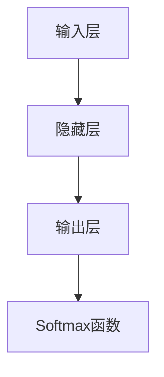

                 

# 文章标题：LLM应用开发中的持续优化策略

> 关键词：LLM，自然语言处理，深度学习，优化算法，应用开发

> 摘要：本文从LLM（大型语言模型）的基本概念、架构和组成部分出发，详细阐述了LLM在自然语言处理中的应用和优势。接着，深入分析了LLM的核心算法原理，包括语言模型的训练过程、生成过程以及优化算法。最后，通过项目实战，展示了如何在实际开发中应用这些核心算法，并对优化策略进行了详细讲解。本文旨在为读者提供一份全面、系统的LLM应用开发指南。

## 第一部分：核心概念与联系

### 1.1 LLM的概念与架构

#### 1.1.1 语言模型的基础概念

LLM（Large Language Model）是一种基于深度学习的自然语言处理模型，它通过大规模的文本数据进行预训练，可以理解并生成自然语言。LLM的核心目标是通过学习大量的文本数据，捕捉语言的统计规律和语义信息，从而实现对自然语言的生成、理解和翻译。

#### 1.1.2 LLM的架构

LLM的架构通常包括三个主要层次：输入层、隐藏层和输出层。

- **输入层**：接收文本输入，包括词嵌入和句子嵌入。词嵌入是将单词转换为密集的向量表示，句子嵌入是将整句的语义信息进行编码。
- **隐藏层**：利用深度神经网络处理输入，提取文本的深层语义特征。隐藏层的设计通常采用多层感知机（MLP）或者变换器（Transformer）结构。
- **输出层**：生成文本输出，通过 Softmax 函数计算每个单词的概率分布。输出层的设计与输入层类似，也是采用多层神经网络结构。

下面是一个简单的Mermaid流程图，展示了LLM的架构：



### 1.2 LLM的主要组成部分

#### 1.2.1 词嵌入

词嵌入是将单词转换为密集的向量表示，使得语义相近的词在向量空间中更接近。常见的词嵌入技术包括Word2Vec、GloVe等。

#### 1.2.2 深度神经网络

深度神经网络是LLM的核心组成部分，通过多层神经网络结构，提取文本的深层语义特征。常见的深度神经网络结构包括多层感知机（MLP）和变换器（Transformer）。

#### 1.2.3 自适应优化

自适应优化是LLM训练过程中的关键环节，通过训练过程不断调整网络参数，优化模型性能。常见的自适应优化算法包括Adam优化器等。

### 1.3 LLM与传统语言处理技术的对比

#### 1.3.1 传统语言处理技术

传统语言处理技术主要包括规则匹配和统计语言模型。规则匹配是基于手工编写的规则进行文本处理，效率较低，难以适应复杂的语言环境。统计语言模型使用统计方法生成语言模型，但效果有限，难以捕捉语言的深层语义信息。

#### 1.3.2 LLM的优势

与传统的语言处理技术相比，LLM具有以下几个显著的优势：

- **强大语义理解能力**：通过深度学习，LLM能够更好地理解文本的深层语义。
- **自适应学习**：LLM能够通过不断学习新的数据，自我优化。

## 第二部分：核心算法原理讲解

### 2.1 语言模型的训练过程

#### 2.1.1 数据预处理

在语言模型的训练过程中，数据预处理是至关重要的一步。数据预处理主要包括文本清洗和分词。

- **文本清洗**：去除文本中的噪声，如HTML标签、特殊符号等。
- **分词**：将文本分割为单词或子词。常见的分词算法包括Jieba分词、NLTK分词等。

#### 2.1.2 预训练

预训练是LLM训练过程的核心环节，通过自监督学习，利用未标注的数据，通过预测下一个单词或子词，训练模型。常见的预训练任务包括掩码语言模型（MLM）、生成式语言模型（GLM）等。

#### 2.1.3 微调

微调是在特定任务上，对预训练的LLM进行微调，提高任务性能。微调的过程通常包括以下步骤：

- **数据准备**：准备用于微调的数据集，通常包括训练集和验证集。
- **模型调整**：在预训练模型的基础上，调整部分网络参数，使其适应特定任务。
- **训练过程**：使用调整后的模型，在训练集上进行训练，并在验证集上进行评估。

### 2.2 语言模型的生成过程

#### 2.2.1 输入嵌入

输入嵌入是将输入的单词转换为向量表示的过程。常见的词嵌入技术包括Word2Vec、GloVe等。

#### 2.2.2 神经网络处理

神经网络处理是通过多层神经网络，处理输入的向量，提取语义特征。常见的深度神经网络结构包括多层感知机（MLP）和变换器（Transformer）。

#### 2.2.3 输出预测

输出预测是通过 Softmax 函数，计算每个单词的概率分布，选择概率最高的单词作为输出。

### 2.3 语言模型优化算法

#### 2.3.1 梯度下降

梯度下降是优化算法中最基本的方法，通过反向传播，计算损失函数相对于网络参数的梯度，然后更新参数，减小损失。

- **反向传播**：计算损失函数相对于网络参数的梯度。
  $$ \nabla_{\theta} J(\theta) = \frac{\partial J(\theta)}{\partial \theta} $$
- **参数更新**：利用梯度更新网络参数，减小损失。
  $$ \theta_{t+1} = \theta_{t} - \alpha \nabla_{\theta} J(\theta) $$
  其中，$\theta$为参数，$\alpha$为学习率。

#### 2.3.2 Adam优化器

Adam优化器是一种基于梯度历史信息的自适应优化算法，它结合了AdaGrad和RMSprop的优点，具有较好的收敛速度和稳定性。

- **自适应学习率**：根据梯度历史，自适应调整学习率。
  $$ \alpha_t = \frac{\beta_1 \alpha_{t-1} + (1 - \beta_1) \nabla_{\theta} J(\theta)}{\sqrt{\beta_2 \nabla_{\theta}^2 J(\theta)} + \epsilon} $$
- **动量项**：结合前几步的梯度，提高优化效果。
  $$ m_t = \beta_1 m_{t-1} + (1 - \beta_1) \nabla_{\theta} J(\theta) $$
  $$ v_t = \beta_2 v_{t-1} + (1 - \beta_2) \nabla_{\theta}^2 J(\theta) $$

## 第三部分：数学模型和数学公式

### 3.1 损失函数

#### 3.1.1 交叉熵损失

交叉熵损失是评估模型预测结果与真实结果之间差异的一种损失函数，通常用于分类问题。其定义如下：

$$ H(Y,\hat{Y}) = -\sum_{i} y_i \log \hat{y_i} $$

其中，$y_i$为真实标签，$\hat{y_i}$为预测概率。

### 3.2 优化算法

#### 3.2.1 梯度下降

梯度下降是一种最基本的优化算法，通过不断更新参数，减小损失。其迭代过程如下：

$$ \theta_{t+1} = \theta_{t} - \alpha \nabla_{\theta} J(\theta) $$

其中，$\theta$为参数，$\alpha$为学习率，$J(\theta)$为损失函数。

### 3.3 语言模型的评价指标

#### 3.3.1 BLEU分数

BLEU分数是一种常用的自然语言生成评价指标，其定义如下：

$$ BLEU = \frac{2Nc \cdot L}{N + Nc - 1} $$

其中，$N$为匹配的词对数，$Nc$为重叠词对数，$L$为参考文本的长度。

## 第四部分：项目实战

### 4.1 实践环境搭建

#### 4.1.1 开发环境配置

在搭建LLM应用开发环境时，需要确保Python环境版本为3.8及以上，并安装TensorFlow等依赖库。

```bash
pip install tensorflow
```

#### 4.1.2 数据集准备

数据集准备是语言模型训练的重要步骤，通常需要处理大量的文本数据。以下是一个简单的数据清洗和分词的代码示例：

```python
import jieba

# 读取文本数据
with open('data.txt', 'r', encoding='utf-8') as f:
    text = f.read()

# 数据清洗
text = text.replace('<html>', '').replace('</html>', '')
text = text.replace('<', '').replace('>', '')

# 分词
words = jieba.lcut(text)
```

### 4.2 项目实现

#### 4.2.1 模型搭建

以下是一个简单的LLM模型搭建的代码示例，使用了TensorFlow的Keras API：

```python
from tensorflow.keras.layers import Embedding, LSTM, Dense
from tensorflow.keras.models import Sequential

# 搭建模型
model = Sequential()
model.add(Embedding(input_dim=vocab_size, output_dim=embedding_size))
model.add(LSTM(units=128))
model.add(Dense(units=vocab_size, activation='softmax'))

# 编译模型
model.compile(optimizer='adam', loss='categorical_crossentropy', metrics=['accuracy'])

# 模型总结
model.summary()
```

#### 4.2.2 模型训练

以下是一个简单的LLM模型训练的代码示例：

```python
# 训练模型
model.fit(x_train, y_train, epochs=10, batch_size=32, validation_data=(x_val, y_val))
```

#### 4.2.3 模型评估

以下是一个简单的LLM模型评估的代码示例：

```python
# 评估模型
loss, accuracy = model.evaluate(x_test, y_test)
print('Test accuracy:', accuracy)
```

### 4.3 项目分析

在LLM应用开发中，持续优化是提高模型性能的关键。以下是一些常见的优化策略：

- **数据增强**：通过数据增强，增加模型的泛化能力。
- **超参数调整**：通过调整学习率、批量大小等超参数，优化模型性能。
- **模型集成**：通过集成多个模型，提高模型的预测准确性。
- **注意力机制**：通过引入注意力机制，提高模型对输入的注意力分配能力。

### 4.4 项目小结

通过本项目，我们深入了解了LLM的应用开发过程，包括环境搭建、模型搭建、模型训练和模型评估等。同时，我们也掌握了一些常见的优化策略，这些策略对于提高模型性能具有重要意义。

## 最佳实践 tips

- **数据预处理**：数据预处理是语言模型训练的重要步骤，需要确保数据的干净和一致性。
- **模型选择**：根据实际需求，选择合适的模型结构，如LSTM、GRU、Transformer等。
- **超参数调整**：超参数对模型性能有重要影响，需要通过实验进行调整。
- **持续学习**：LLM模型需要不断学习新的数据，以保持其性能和适应性。

## 小结与注意事项

本文从LLM的基本概念、架构和组成部分出发，详细阐述了LLM在自然语言处理中的应用和优势。通过核心算法原理的讲解，读者可以深入理解LLM的训练过程、生成过程和优化算法。最后，通过项目实战，读者可以实际操作LLM的应用开发，掌握持续优化的策略。

注意事项：

- **数据质量**：数据质量对模型性能有重要影响，确保数据的干净和一致性。
- **模型选择**：根据实际需求，选择合适的模型结构。
- **持续学习**：LLM模型需要不断学习新的数据，以保持其性能和适应性。

## 拓展阅读

- [《深度学习》](https://www.deeplearningbook.org/)：深度学习的基础教材，详细介绍了深度学习的原理和应用。
- [《自然语言处理综合教程》](https://nlp.seas.harvard.edu/edu/courses/AI558/spring21/)：自然语言处理领域的经典教材，涵盖了自然语言处理的基本概念和算法。

作者：AI天才研究院/AI Genius Institute & 禅与计算机程序设计艺术 /Zen And The Art of Computer Programming

