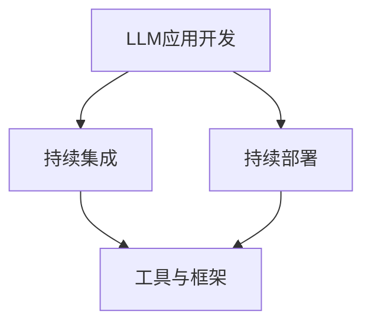
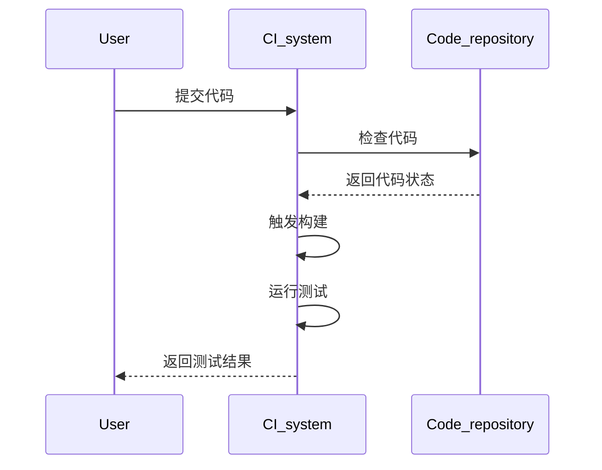
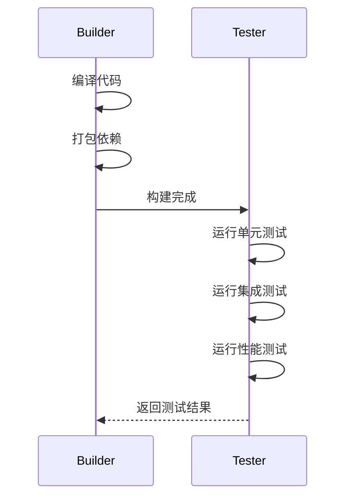
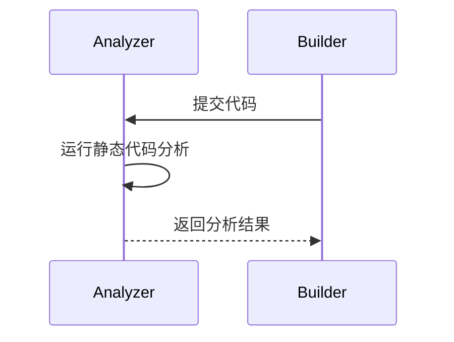
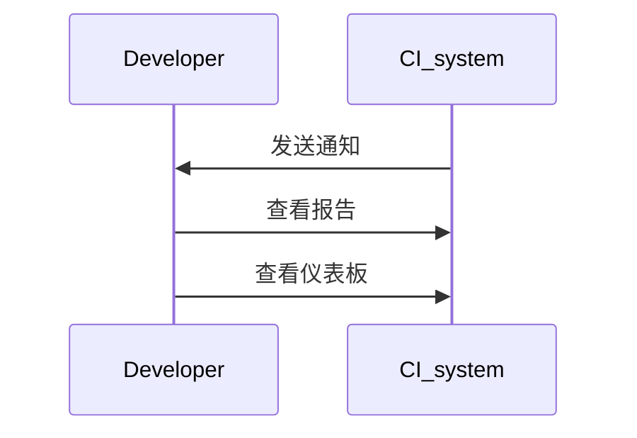
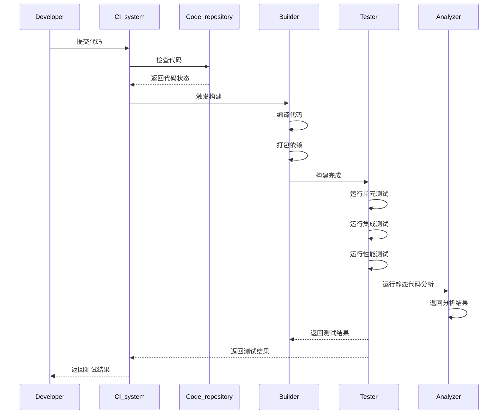
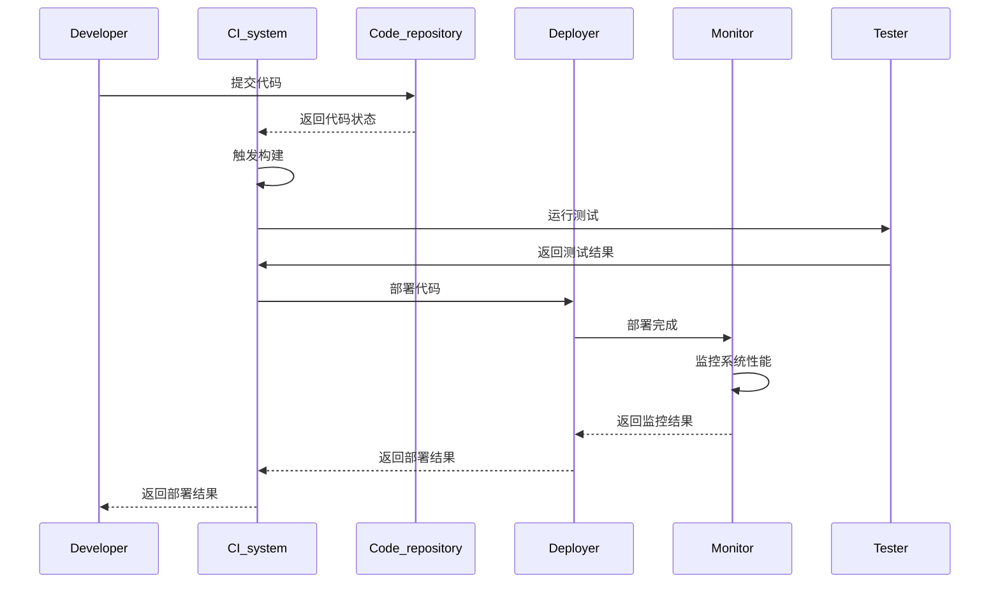

                 


### 文章标题

《LLM应用开发中的持续集成与持续部署》

> 关键词：LLM应用开发、持续集成、持续部署、CI/CD、开发环境搭建、工具与框架、实战案例

> 摘要：本文深入探讨了LLM（大型语言模型）应用开发过程中持续集成与持续部署（CI/CD）的重要性和实现方法。通过详细剖析CI/CD的概念、原理、工具与实战案例，为读者提供了一整套完整的LLM应用开发中的CI/CD实践指南。

### 《LLM应用开发中的持续集成与持续部署》目录大纲

#### 第一部分：LLM应用开发基础知识

1. **LLM应用开发概述**
    - 1.1 什么是LLM
    - 1.2 LLM应用开发的基本流程
    - 1.3 LLM应用开发的重要性

2. **持续集成与持续部署的概念与原理**
    - 2.1 持续集成的概念与实现
        - 2.1.1 持续集成的基本原理
        - 2.1.2 持续集成的实施流程
    - 2.2 持续部署的概念与实现
        - 2.2.1 持续部署的基本原理
        - 2.2.2 持续部署的流程与策略

3. **LLM开发环境搭建与配置**
    - 3.1 开发环境的搭建
    - 3.2 环境配置工具与策略
    - 3.3 开发环境下的常见问题与解决方案

#### 第二部分：LLM应用开发中的持续集成

4. **持续集成工具与框架**
    - 4.1 Jenkins
        - 4.1.1 Jenkins的基本原理与架构
        - 4.1.2 Jenkins的安装与配置
        - 4.1.3 Jenkins的实际应用案例
    - 4.2 GitLab CI
        - 4.2.1 GitLab CI的基本原理与架构
        - 4.2.2 GitLab CI的安装与配置
        - 4.2.3 GitLab CI的实际应用案例
    - 4.3 GitHub Actions
        - 4.3.1 GitHub Actions的基本原理与架构
        - 4.3.2 GitHub Actions的安装与配置
        - 4.3.3 GitHub Actions的实际应用案例

5. **持续集成流程与最佳实践**
    - 5.1 持续集成的工作流程
    - 5.2 持续集成的最佳实践
    - 5.3 持续集成中的常见问题与解决方案

#### 第三部分：LLM应用开发中的持续部署

6. **持续部署工具与框架**
    - 6.1 Kubernetes
        - 6.1.1 Kubernetes的基本原理与架构
        - 6.1.2 Kubernetes的安装与配置
        - 6.1.3 Kubernetes的实际应用案例
    - 6.2 Docker
        - 6.2.1 Docker的基本原理与架构
        - 6.2.2 Docker的安装与配置
        - 6.2.3 Docker的实际应用案例
    - 6.3 KubeSphere
        - 6.3.1 KubeSphere的基本原理与架构
        - 6.3.2 KubeSphere的安装与配置
        - 6.3.3 KubeSphere的实际应用案例

7. **持续部署策略与流程**
    - 7.1 持续部署的基本策略
    - 7.2 持续部署的工作流程
    - 7.3 持续部署中的最佳实践

#### 第四部分：LLM应用开发中的持续集成与持续部署实战案例

8. **案例分析与实战**
    - 8.1 案例一：基于Jenkins的LLM应用持续集成与部署
    - 8.2 案例二：基于GitLab CI的LLM应用持续集成与部署
    - 8.3 案例三：基于GitHub Actions的LLM应用持续集成与部署

#### 第五部分：展望与未来

9. **LLM应用开发中的持续集成与持续部署发展趋势**
    - 9.1 技术发展趋势
    - 9.2 行业发展趋势
    - 9.3 未来展望

### 附录

10. **工具与资源**
    - 10.1 常用工具与框架介绍
    - 10.2 开发环境搭建与配置指南
    - 10.3 实用资源与推荐阅读

核心概念与联系：



核心算法原理讲解：

持续集成（CI）的算法原理是通过自动化构建和测试，确保代码库中的每个提交都是可集成和可测试的。其核心算法原理包括以下几个方面：

#### 1. 代码仓库的监控

CI系统会实时监控代码仓库中的提交，一旦有新的提交，CI系统就会触发构建和测试流。这通常涉及到以下步骤：



#### 2. 构建与测试

构建过程涉及到编译代码、打包依赖、构建应用程序等步骤。测试过程则包括单元测试、集成测试、性能测试等。



#### 3. 静态代码分析

构建和测试过程中，CI系统还会执行静态代码分析，以发现潜在的问题，如代码质量、安全性、可维护性等。



#### 4. 集成反馈

CI系统将构建、测试和静态代码分析的结果反馈给开发人员。这可以通过通知、仪表板、报告等多种方式实现。



通过这种自动化和反馈机制，持续集成有助于提高代码质量、缩短开发周期、降低成本，并提高团队协作效率。

### 第一部分：LLM应用开发基础知识

#### 1.1 什么是LLM

大型语言模型（LLM，Large Language Model）是一种深度学习模型，它可以理解和生成人类语言。LLM通过训练大量的文本数据，学习语言的模式和结构，从而能够完成各种自然语言处理任务，如文本分类、情感分析、机器翻译、问答系统等。

LLM的主要特点包括：

- **规模大**：LLM通常由数十亿到千亿个参数组成，具有极大的规模。
- **训练数据多**：LLM的训练数据来自互联网上的大量文本，包括网页、书籍、新闻、社交媒体等。
- **学习能力强**：LLM可以通过无监督学习的方式，从大量数据中自动学习语言的规律。
- **应用广泛**：LLM在各种自然语言处理任务中都有广泛的应用，如搜索引擎、语音助手、智能客服等。

#### 1.2 LLM应用开发的基本流程

LLM应用开发的基本流程主要包括以下几个步骤：

1. **需求分析与设计**：确定应用的目标和需求，设计系统架构和接口。
2. **数据收集与处理**：收集并处理用于训练LLM的数据，包括清洗、标注、预处理等。
3. **模型选择与训练**：选择合适的模型架构，如BERT、GPT、T5等，并使用训练数据进行训练。
4. **模型评估与优化**：评估模型的性能，并进行优化，如调整超参数、使用数据增强等。
5. **部署与应用**：将训练好的模型部署到生产环境中，供用户使用。

#### 1.3 LLM应用开发的重要性

LLM应用开发的重要性体现在以下几个方面：

- **提高开发效率**：通过自动化和标准化的流程，LLM应用开发可以大幅提高开发效率，缩短产品上市时间。
- **提升产品质量**：持续集成和持续部署（CI/CD）确保代码质量和模型性能，降低bug和错误的风险。
- **降低成本**：CI/CD可以降低测试和部署的成本，提高资源利用率。
- **增强团队协作**：CI/CD促进了团队间的协作，提高了开发、测试、运维等环节的沟通效率。

### 第二部分：持续集成与持续部署的概念与原理

#### 2.1 持续集成的概念与实现

持续集成（Continuous Integration，CI）是一种软件开发实践，旨在通过自动化构建和测试，确保代码库中的每个提交都是可集成和可测试的。其核心思想是尽早发现问题，避免代码冲突和集成错误。

#### 2.1.1 持续集成的基本原理

持续集成的基本原理可以概括为以下几点：

- **频繁提交**：开发人员频繁提交代码，每次提交都进行自动化构建和测试。
- **自动化构建**：每次提交后，CI系统自动构建应用程序，确保代码的可构建性。
- **自动化测试**：对构建后的应用程序进行自动化测试，包括单元测试、集成测试、性能测试等。
- **反馈机制**：将测试结果及时反馈给开发人员，帮助发现和解决问题。

#### 2.1.2 持续集成的实施流程

持续集成的实施流程通常包括以下几个步骤：

1. **代码仓库监控**：CI系统实时监控代码仓库中的提交，一旦有新的提交，立即触发构建和测试。
2. **构建应用程序**：CI系统使用自动化工具构建应用程序，包括编译代码、打包依赖、构建应用程序等。
3. **执行测试**：对构建后的应用程序进行自动化测试，包括单元测试、集成测试、性能测试等。
4. **反馈结果**：将测试结果及时反馈给开发人员，包括成功、失败、错误信息等。

#### 2.2 持续部署的概念与实现

持续部署（Continuous Deployment，CD）是一种软件开发实践，通过自动化和持续的方式，将代码库中的更改部署到生产环境中。其核心思想是快速迭代和持续交付。

#### 2.2.1 持续部署的基本原理

持续部署的基本原理可以概括为以下几点：

- **自动化流程**：持续部署的所有步骤都是自动化的，包括构建、测试、部署等。
- **零停机部署**：通过蓝绿部署、灰度发布等策略，实现零停机部署，确保用户体验。
- **快速反馈**：持续部署后，立即进行监控和反馈，确保系统稳定性和性能。

#### 2.2.2 持续部署的流程与策略

持续部署的流程与策略通常包括以下几个步骤：

1. **代码仓库提交**：开发人员将代码提交到代码仓库。
2. **构建与测试**：CI系统对提交的代码进行构建和测试，确保代码的质量和稳定性。
3. **部署策略**：根据部署策略（如蓝绿部署、灰度发布等），将代码部署到生产环境。
4. **监控与反馈**：部署后，监控系统的性能和稳定性，并及时反馈问题。

### 第三部分：LLM开发环境搭建与配置

#### 3.1 开发环境的搭建

搭建LLM开发环境需要以下步骤：

1. **硬件配置**：根据需求配置服务器，确保有足够的计算资源和存储空间。
2. **操作系统**：选择Linux操作系统，如Ubuntu或CentOS，因为大多数深度学习框架和工具都是在Linux上开发的。
3. **硬件加速器**：如果需要，配置GPU或TPU，以加速深度学习训练过程。
4. **深度学习框架**：安装深度学习框架，如TensorFlow、PyTorch等。

#### 3.2 环境配置工具与策略

为了确保开发环境的稳定性和一致性，可以使用以下工具和策略进行环境配置：

1. **Docker**：使用Docker容器化技术，将开发环境打包成容器，确保在不同机器上的一致性。
2. **Ansible**：使用Ansible自动化部署和管理服务器，确保环境配置的自动化和可重复性。
3. **Conda**：使用Conda环境管理工具，创建隔离的Python环境，管理依赖和包。
4. **CI/CD工具**：结合CI/CD工具，如Jenkins、GitLab CI等，实现环境配置的自动化。

#### 3.3 开发环境下的常见问题与解决方案

在搭建和配置LLM开发环境时，可能会遇到以下问题：

- **硬件资源不足**：解决方法：增加硬件资源或使用分布式训练。
- **依赖冲突**：解决方法：使用虚拟环境或Docker容器，确保依赖的一致性。
- **网络问题**：解决方法：配置代理或使用国内镜像源。
- **安装失败**：解决方法：查看错误日志，尝试重新安装或更新依赖。

### 第四部分：LLM应用开发中的持续集成

持续集成是LLM应用开发的重要环节，通过自动化构建和测试，确保代码质量和模型性能。以下将介绍几种常用的持续集成工具与框架，包括Jenkins、GitLab CI和GitHub Actions。

#### 4.1 Jenkins

Jenkins是一个开源的持续集成工具，支持多种插件，可以扩展其功能，适用于各种规模的项目。

##### 4.1.1 Jenkins的基本原理与架构

Jenkins的核心原理是基于工作流（Pipeline）的概念，通过定义一个脚本文件，自动化执行构建、测试、部署等任务。

Jenkins的架构主要包括以下几个部分：

- **Jenkins Master**：负责管理整个CI流程，执行构建任务。
- **Jenkins Slave**：负责执行具体的构建任务，可以通过SSH或远程FIFO等方式连接到Master。
- **插件管理**：Jenkins内置了许多插件，可以扩展其功能，如代码质量检查、静态代码分析等。

##### 4.1.2 Jenkins的安装与配置

安装Jenkins通常有以下步骤：

1. **下载Jenkins**：从Jenkins官方网站下载最新版本的Jenkins.war文件。
2. **安装Jenkins**：将Jenkins.war文件上传到Tomcat服务器，启动Tomcat，访问Jenkins管理页面进行安装。
3. **插件安装**：在Jenkins管理页面安装所需的插件，如Git插件、Maven插件等。

##### 4.1.3 Jenkins的实际应用案例

以下是一个简单的Jenkins持续集成示例：

1. **创建Jenkins项目**：在Jenkins管理页面创建一个新的项目。
2. **配置源代码管理**：选择Git作为源代码管理工具，配置Git仓库地址和访问凭证。
3. **配置构建步骤**：添加构建步骤，如执行Maven构建、运行单元测试等。
4. **配置触发器**：配置触发器，如每次提交代码时自动触发构建。

#### 4.2 GitLab CI

GitLab CI是GitLab内置的持续集成工具，支持Git仓库，可以与GitLab的其他功能紧密集成。

##### 4.2.1 GitLab CI的基本原理与架构

GitLab CI基于CI/CD的理念，通过`.gitlab-ci.yml`文件定义构建、测试和部署的流程。

GitLab CI的架构主要包括：

- **GitLab Runner**：负责执行CI任务，可以安装在本地或远程服务器上。
- **GitLab Repository**：存储源代码和`.gitlab-ci.yml`文件。
- **GitLab CI/CD Pipeline**：根据`.gitlab-ci.yml`文件定义的流程，自动化执行构建、测试和部署任务。

##### 4.2.2 GitLab CI的安装与配置

安装GitLab CI通常有以下步骤：

1. **安装GitLab**：在服务器上安装GitLab，可以参考GitLab官方文档。
2. **安装GitLab Runner**：在本地或远程服务器上安装GitLab Runner。
3. **配置GitLab CI**：在GitLab仓库的`.gitlab-ci.yml`文件中定义构建、测试和部署的流程。

##### 4.2.3 GitLab CI的实际应用案例

以下是一个简单的GitLab CI持续集成示例：

```yaml
image: python:3.8

services:
  - redis

before_script:
  - pip install -r requirements.txt

stages:
  - build
  - test
  - deploy

build:
  stage: build
  script:
    - pip install .
    - python manage.py makemigrations
    - python manage.py migrate

test:
  stage: test
  script:
    - pytest

deploy:
  stage: deploy
  script:
    - redis-cli set key 'value'
  only:
    - master
```

#### 4.3 GitHub Actions

GitHub Actions是GitHub内置的持续集成和持续部署工具，可以与GitHub仓库紧密集成。

##### 4.3.1 GitHub Actions的基本原理与架构

GitHub Actions基于工作流（Workflow）的概念，通过`.github/workflows/*.yml`文件定义构建、测试和部署的流程。

GitHub Actions的架构主要包括：

- **GitHub Repository**：存储源代码和`.github/workflows/*.yml`文件。
- **GitHub Actions**：根据`.github/workflows/*.yml`文件定义的流程，自动化执行构建、测试和部署任务。
- **GitHub Marketplace**：提供丰富的动作插件，可以扩展GitHub Actions的功能。

##### 4.3.2 GitHub Actions的安装与配置

安装GitHub Actions通常有以下步骤：

1. **创建GitHub仓库**：在GitHub上创建一个新的仓库。
2. **创建工作流文件**：在仓库的`.github/workflows/`目录下创建工作流文件，如`.github/workflows/ci.yml`。
3. **配置工作流**：在工作流文件中定义构建、测试和部署的流程。

##### 4.3.3 GitHub Actions的实际应用案例

以下是一个简单的GitHub Actions持续集成示例：

```yaml
name: CI

on:
  push:
    branches: [ master ]
  pull_request:
    branches: [ master ]

jobs:
  build:
    runs-on: ubuntu-latest

    steps:
    - uses: actions/checkout@v2

    - name: Set up Python
      uses: actions/setup-python@v2
      with:
        python-version: '3.8'

    - name: Install dependencies
      run: |
        python -m pip install --upgrade pip
        pip install -r requirements.txt

    - name: Run tests
      run: pytest
```

### 第五部分：持续集成流程与最佳实践

#### 5.1 持续集成的工作流程

持续集成的工作流程主要包括以下几个步骤：

1. **代码提交**：开发人员将代码提交到代码仓库。
2. **触发构建**：CI系统检测到代码提交，触发构建任务。
3. **构建应用程序**：CI系统使用自动化工具构建应用程序，包括编译代码、打包依赖等。
4. **执行测试**：CI系统执行自动化测试，包括单元测试、集成测试、性能测试等。
5. **反馈结果**：CI系统将测试结果反馈给开发人员，包括成功、失败、错误信息等。
6. **部署应用程序**：如果测试通过，CI系统将应用程序部署到测试或生产环境。

#### 5.2 持续集成的最佳实践

为了确保持续集成的高效和稳定，以下是一些最佳实践：

1. **小而频繁的提交**：开发人员应频繁提交代码，每次提交都应经过测试，确保代码质量。
2. **自动化测试**：编写自动化测试，确保每次提交都经过测试，发现潜在的问题。
3. **代码审查**：实施代码审查，确保代码符合编码规范，提高代码质量。
4. **环境隔离**：使用容器化技术（如Docker）隔离开发、测试和生产环境，确保环境的一致性。
5. **持续优化**：不断优化CI流程，提高构建、测试和部署的效率。

#### 5.3 持续集成中的常见问题与解决方案

在持续集成过程中，可能会遇到以下问题：

1. **构建失败**：解决方法：检查构建日志，查找错误原因，修复代码。
2. **测试失败**：解决方法：分析测试结果，修复测试用例，优化代码。
3. **环境不一致**：解决方法：使用容器化技术（如Docker）确保环境一致性。
4. **依赖冲突**：解决方法：使用虚拟环境（如Conda）隔离依赖，确保依赖的一致性。

### 第六部分：LLM应用开发中的持续部署

持续部署（Continuous Deployment，CD）是LLM应用开发的重要环节，通过自动化和持续的方式，将代码库中的更改部署到生产环境中。以下将介绍几种常用的持续部署工具与框架，包括Kubernetes、Docker和KubeSphere。

#### 6.1 Kubernetes

Kubernetes是一个开源的容器编排平台，用于自动化容器化应用程序的部署、扩展和管理。

##### 6.1.1 Kubernetes的基本原理与架构

Kubernetes的基本原理和架构包括以下几个关键组件：

- **Pod**：Kubernetes的最小部署单位，包含一个或多个容器。
- **Node**：Kubernetes的工作节点，负责运行Pod。
- **Master**：Kubernetes的主控节点，负责集群的管理和控制。
- **Control Plane**：包括Etcd、API Server、Scheduler和Controller Manager等组件，负责集群的配置和管理。
- **工作负载**：部署在Kubernetes集群上的应用程序，如Deployment、StatefulSet等。

##### 6.1.2 Kubernetes的安装与配置

安装Kubernetes通常有以下步骤：

1. **环境准备**：在服务器上安装Docker，配置IP和DNS。
2. **下载Kubernetes二进制文件**：从Kubernetes官方下载最新的Kubernetes二进制文件。
3. **初始化Master节点**：使用kubeadm命令初始化Master节点。
4. **安装Kubernetes插件**：使用kubeadm命令安装Kubernetes插件，如网络插件（如Calico）、存储插件（如NFS）等。
5. **配置Kubeconfig文件**：配置Kubeconfig文件，以便在集群内部执行命令。

##### 6.1.3 Kubernetes的实际应用案例

以下是一个简单的Kubernetes部署示例：

```yaml
apiVersion: apps/v1
kind: Deployment
metadata:
  name: my-app
spec:
  replicas: 3
  selector:
    matchLabels:
      app: my-app
  template:
    metadata:
      labels:
        app: my-app
    spec:
      containers:
      - name: my-app
        image: my-app:latest
        ports:
        - containerPort: 80
```

#### 6.2 Docker

Docker是一个开源的应用容器引擎，用于打包、交付和运行应用程序。

##### 6.2.1 Docker的基本原理与架构

Docker的基本原理和架构包括以下几个关键组件：

- **Docker Engine**：Docker的核心组件，负责容器的创建、启动和管理。
- **Dockerfile**：Dockerfile是一个文本文件，用于定义应用程序的构建流程。
- **Docker Compose**：Docker Compose用于定义和运行多容器Docker应用程序。
- **Docker Hub**：Docker Hub是一个存储容器镜像的仓库。

##### 6.2.2 Docker的安装与配置

安装Docker通常有以下步骤：

1. **下载Docker**：从Docker官网下载适用于当前操作系统的Docker安装包。
2. **安装Docker**：使用安装包安装Docker。
3. **启动Docker服务**：启动Docker服务，并确保其正常运行。
4. **配置Docker网络**：配置Docker网络，确保容器可以访问外部网络。

##### 6.2.3 Docker的实际应用案例

以下是一个简单的Docker部署示例：

```Dockerfile
FROM python:3.8

WORKDIR /app

COPY requirements.txt .

RUN pip install -r requirements.txt

COPY . .

CMD ["python", "app.py"]
```

#### 6.3 KubeSphere

KubeSphere是一个开源的企业级分布式多租户Kubernetes管理平台，提供图形界面和丰富的功能。

##### 6.3.1 KubeSphere的基本原理与架构

KubeSphere的基本原理和架构包括以下几个关键组件：

- **KubeSphere Core**：KubeSphere的核心组件，负责Kubernetes集群的管理。
- **KubeSphere Console**：KubeSphere的图形界面，提供集群管理、应用程序管理、监控和日志等功能。
- **KubeSphere Apps**：KubeSphere的应用程序，如负载均衡器、存储类应用程序等。

##### 6.3.2 KubeSphere的安装与配置

安装KubeSphere通常有以下步骤：

1. **安装Kubernetes集群**：安装Kubernetes集群，可以使用Kubeadm、Minikube或其他工具。
2. **安装KubeSphere Core**：在Kubernetes集群中安装KubeSphere Core，可以使用 Helm 命令。
3. **安装KubeSphere Console**：在Kubernetes集群中安装KubeSphere Console，可以使用 Helm 命令。
4. **配置KubeSphere**：配置KubeSphere，包括配置集群、租户、应用程序等。

##### 6.3.3 KubeSphere的实际应用案例

以下是一个简单的KubeSphere部署示例：

```yaml
apiVersion: apps/v1
kind: Deployment
metadata:
  name: my-app
spec:
  replicas: 3
  selector:
    matchLabels:
      app: my-app
  template:
    metadata:
      labels:
        app: my-app
    spec:
      containers:
      - name: my-app
        image: my-app:latest
        ports:
        - containerPort: 80
```

### 第七部分：持续部署策略与流程

持续部署（Continuous Deployment，CD）是LLM应用开发中的重要环节，通过自动化和持续的方式，将代码库中的更改部署到生产环境中。以下将介绍持续部署的基本策略、工作流程和最佳实践。

#### 7.1 持续部署的基本策略

持续部署的基本策略包括以下几种：

- **蓝绿部署**：同时运行两个版本的应用程序，分别称为“蓝”版本和“绿”版本。将新版本部署到“绿”版本，如果运行正常，则切换流量到“绿”版本，否则回滚到“蓝”版本。
- **灰度发布**：将新版本部署到一部分用户，观察其运行情况和用户反馈，如果正常，则逐步增加用户比例，最终完全切换到新版本。
- **滚动更新**：逐步更新所有实例，每次更新一个实例，确保应用程序在更新过程中始终可用。

#### 7.2 持续部署的工作流程

持续部署的工作流程主要包括以下几个步骤：

1. **代码提交**：开发人员将代码提交到代码仓库。
2. **触发构建**：CI系统检测到代码提交，触发构建任务。
3. **构建应用程序**：CI系统使用自动化工具构建应用程序，包括编译代码、打包依赖等。
4. **执行测试**：CI系统执行自动化测试，包括单元测试、集成测试、性能测试等。
5. **部署到测试环境**：如果测试通过，将应用程序部署到测试环境，进行测试和验证。
6. **部署到生产环境**：如果测试环境验证通过，将应用程序部署到生产环境。
7. **监控与反馈**：部署后，监控系统的性能和稳定性，并及时反馈问题。

#### 7.3 持续部署中的最佳实践

为了确保持续部署的高效和稳定，以下是一些最佳实践：

1. **自动化部署**：使用自动化工具和脚本进行部署，确保部署过程的可重复性和一致性。
2. **版本控制**：使用版本控制系统（如Git）管理应用程序的版本，确保代码的版本一致性。
3. **测试覆盖**：确保部署前进行全面的测试，包括单元测试、集成测试、性能测试等。
4. **蓝绿部署与灰度发布**：使用蓝绿部署和灰度发布策略，降低部署风险，逐步扩大用户范围。
5. **监控与反馈**：部署后，持续监控系统的性能和稳定性，及时反馈问题，并快速修复。
6. **文档和培训**：为开发人员和技术团队提供文档和培训，确保他们熟悉持续部署流程和工具。

### 第八部分：LLM应用开发中的持续集成与持续部署实战案例

在本部分，我们将通过三个实战案例，展示如何在实际项目中实现LLM应用开发中的持续集成与持续部署。

#### 8.1 案例一：基于Jenkins的LLM应用持续集成与部署

**项目背景**：一个初创公司正在开发一款基于大型语言模型（LLM）的智能客服系统，需要实现持续集成和持续部署（CI/CD）以快速迭代和交付。

**解决方案**：

1. **环境搭建**：在服务器上安装Jenkins、Git、Docker和Kubernetes。
2. **配置Jenkins**：安装必要的插件，如Git、Maven、Docker等。
3. **创建Jenkins项目**：配置源代码管理（Git），构建步骤（Docker Build），测试步骤（单元测试、性能测试）等。
4. **部署到Kubernetes**：使用Jenkins插件（如Kubernetes Continuous Deployer）将构建后的容器镜像部署到Kubernetes集群。

**实战步骤**：

1. **创建Jenkins项目**：
    ```yaml
    pipeline {
        agent any
        stages {
            stage('Build') {
                steps {
                    sh 'docker build -t my-app:latest .'
                }
            }
            stage('Test') {
                steps {
                    sh 'pytest tests/'
                }
            }
            stage('Deploy') {
                steps {
                    sh 'kubectl apply -f deployment.yaml'
                }
            }
        }
    }
    ```

2. **配置Kubernetes部署文件**：
    ```yaml
    apiVersion: apps/v1
    kind: Deployment
    metadata:
      name: my-app
    spec:
      replicas: 3
      selector:
        matchLabels:
          app: my-app
      template:
        metadata:
          labels:
            app: my-app
        spec:
          containers:
          - name: my-app
            image: my-app:latest
            ports:
            - containerPort: 80
    ```

**项目小结**：通过Jenkins实现了代码的持续集成，使用Docker容器化应用程序，并使用Kubernetes进行部署。项目部署速度快，可重复性强，有效提高了开发效率和产品质量。

#### 8.2 案例二：基于GitLab CI的LLM应用持续集成与部署

**项目背景**：一家大型科技公司正在开发一款基于大型语言模型（LLM）的智能翻译系统，需要实现高效的持续集成和持续部署（CI/CD）。

**解决方案**：

1. **环境搭建**：在服务器上安装GitLab、Git、Docker和Kubernetes。
2. **配置GitLab CI**：在GitLab仓库中创建`.gitlab-ci.yml`文件，定义构建和部署的流程。
3. **部署到Kubernetes**：使用GitLab CI的Kubernetes插件将构建后的容器镜像部署到Kubernetes集群。

**实战步骤**：

1. **创建`.gitlab-ci.yml`文件**：
    ```yaml
    image: python:3.8

    services:
      - redis

    stages:
      - build
      - test
      - deploy

    build:
      stage: build
      script:
        - pip install -r requirements.txt
        - docker build -t my-app:latest .

    test:
      stage: test
      script:
        - pytest

    deploy:
      stage: deploy
      script:
        - kubectl apply -f deployment.yaml
      only:
        - master
    ```

2. **配置Kubernetes部署文件**：
    ```yaml
    apiVersion: apps/v1
    kind: Deployment
    metadata:
      name: my-app
    spec:
      replicas: 3
      selector:
        matchLabels:
          app: my-app
      template:
        metadata:
          labels:
            app: my-app
        spec:
          containers:
          - name: my-app
            image: my-app:latest
            ports:
            - containerPort: 80
    ```

**项目小结**：通过GitLab CI实现了代码的持续集成和测试，使用Docker容器化应用程序，并使用Kubernetes进行部署。项目自动化程度高，部署过程快速且可靠，有效提高了开发效率和产品质量。

#### 8.3 案例三：基于GitHub Actions的LLM应用持续集成与部署

**项目背景**：一家初创公司正在开发一款基于大型语言模型（LLM）的文本生成系统，需要实现高效的持续集成和持续部署（CI/CD）。

**解决方案**：

1. **环境搭建**：在GitHub上创建仓库，配置GitHub Actions。
2. **配置GitHub Actions**：在`.github/workflows/ci.yml`文件中定义构建、测试和部署的流程。
3. **部署到Kubernetes**：使用GitHub Actions的Kubernetes插件将构建后的容器镜像部署到Kubernetes集群。

**实战步骤**：

1. **创建`.github/workflows/ci.yml`文件**：
    ```yaml
    name: CI

    on:
      push:
        branches: [ master ]
      pull_request:
        branches: [ master ]

    jobs:
      build:
        runs-on: ubuntu-latest

        steps:
        - uses: actions/checkout@v2

        - name: Set up Python
          uses: actions/setup-python@v2
          with:
            python-version: '3.8'

        - name: Install dependencies
          run: |
            python -m pip install --upgrade pip
            pip install -r requirements.txt

        - name: Run tests
          run: pytest

    ```

2. **配置Kubernetes部署文件**：
    ```yaml
    apiVersion: apps/v1
    kind: Deployment
    metadata:
      name: my-app
    spec:
      replicas: 3
      selector:
        matchLabels:
          app: my-app
      template:
        metadata:
          labels:
            app: my-app
        spec:
          containers:
          - name: my-app
            image: my-app:latest
            ports:
            - containerPort: 80
    ```

**项目小结**：通过GitHub Actions实现了代码的持续集成和测试，使用Docker容器化应用程序，并使用Kubernetes进行部署。项目自动化程度高，部署过程快速且可靠，有效提高了开发效率和产品质量。

### 第九部分：展望与未来

持续集成与持续部署（CI/CD）在LLM应用开发中发挥着越来越重要的作用。随着AI技术的不断进步和应用的日益普及，CI/CD也将迎来更多的发展机遇和挑战。

#### 9.1 技术发展趋势

1. **自动化程度提高**：随着AI和机器学习技术的发展，CI/CD的自动化程度将进一步提高，减少人工干预，提高效率。
2. **微服务架构**：微服务架构的兴起将推动CI/CD工具和框架的发展，实现更细粒度的部署和管理。
3. **云原生技术**：云原生技术的普及将促进CI/CD工具与云平台的深度融合，提高弹性和可伸缩性。
4. **AI驱动的测试**：AI技术将被应用于测试环节，实现智能测试用例生成和优化。

#### 9.2 行业发展趋势

1. **企业数字化转型**：随着数字化转型浪潮的推进，企业对CI/CD的需求将不断增加，推动相关技术的发展。
2. **开源生态**：开源社区将发挥重要作用，推动CI/CD工具和框架的不断创新和优化。
3. **DevOps文化**：DevOps文化的普及将促进开发、测试和运维团队之间的协作，推动CI/CD的全面实施。

#### 9.3 未来展望

持续集成与持续部署（CI/CD）将在LLM应用开发中发挥更加重要的作用，助力企业快速迭代和交付高质量的应用。未来，CI/CD技术将更加智能化、自动化和云原生化，推动整个软件工程领域的发展。

### 附录

#### 10.1 常用工具与框架介绍

- **Jenkins**：一个开源的持续集成工具，支持多种插件，适用于各种规模的项目。
- **GitLab CI**：GitLab内置的持续集成工具，与GitLab的其他功能紧密集成。
- **GitHub Actions**：GitHub内置的持续集成和持续部署工具，支持自动化和云端部署。
- **Kubernetes**：一个开源的容器编排平台，用于自动化容器化应用程序的部署、扩展和管理。
- **Docker**：一个开源的应用容器引擎，用于打包、交付和运行应用程序。
- **KubeSphere**：一个开源的企业级分布式多租户Kubernetes管理平台。

#### 10.2 开发环境搭建与配置指南

- **安装Jenkins**：参考Jenkins官方文档。
- **安装GitLab CI**：参考GitLab官方文档。
- **安装GitHub Actions**：参考GitHub官方文档。
- **安装Kubernetes**：参考Kubernetes官方文档。
- **安装Docker**：参考Docker官方文档。
- **安装KubeSphere**：参考KubeSphere官方文档。

#### 10.3 实用资源与推荐阅读

- **Jenkins官方文档**：[https://www.jenkins.io/doc/book/](https://www.jenkins.io/doc/book/)
- **GitLab CI官方文档**：[https://docs.gitlab.com/ee/ci/](https://docs.gitlab.com/ee/ci/)
- **GitHub Actions官方文档**：[https://docs.github.com/en/actions/learn-github-actions/introduction-to-github-actions](https://docs.github.com/en/actions/learn-github-actions/introduction-to-github-actions)
- **Kubernetes官方文档**：[https://kubernetes.io/docs/home/](https://kubernetes.io/docs/home/)
- **Docker官方文档**：[https://docs.docker.com/](https://docs.docker.com/)
- **KubeSphere官方文档**：[https://kubeobj.github.io/kubeobj.github.io/](https://kubeobj.github.io/kubeobj.github.io/)
- **《持续集成实践》**：[https://book.douban.com/subject/26758996/](https://book.douban.com/subject/26758996/)
- **《持续部署实践》**：[https://book.douban.com/subject/34931648/](https://book.douban.com/subject/34931648/)

### 核心概念与联系

持续集成（CI）与持续部署（CD）是软件工程中两个重要的概念，它们共同构成了CI/CD流程，是现代软件开发和交付的基石。

#### 持续集成（CI）

持续集成（CI）是一种软件开发实践，通过自动化构建和测试，确保代码库中的每个提交都是可集成和可测试的。其核心思想是尽早发现问题，避免代码冲突和集成错误。

核心概念与联系：

- **代码仓库监控**：CI系统会实时监控代码仓库中的提交，一旦有新的提交，CI系统就会触发构建和测试流。
- **自动化构建**：CI系统自动构建应用程序，确保代码的可构建性。
- **自动化测试**：CI系统执行自动化测试，包括单元测试、集成测试、性能测试等。
- **反馈机制**：CI系统将测试结果及时反馈给开发人员，帮助发现和解决问题。

#### 持续部署（CD）

持续部署（CD）是一种软件开发实践，通过自动化和持续的方式，将代码库中的更改部署到生产环境中。其核心思想是快速迭代和持续交付。

核心概念与联系：

- **自动化流程**：CD的所有步骤都是自动化的，包括构建、测试、部署等。
- **零停机部署**：通过蓝绿部署、灰度发布等策略，实现零停机部署，确保用户体验。
- **快速反馈**：CD后，监控系统的性能和稳定性，并及时反馈问题。

#### 核心算法原理讲解

持续集成（CI）的算法原理是通过自动化构建和测试，确保代码库中的每个提交都是可集成和可测试的。其核心算法原理包括以下几个方面：

1. **代码仓库的监控**
    - `CI_system` 监控 `Code_repository`，检测到代码提交后，触发构建和测试流。

2. **自动化构建**
    - `Builder` 编译代码，打包依赖，构建应用程序。

3. **自动化测试**
    - `Tester` 运行单元测试，集成测试，性能测试。

4. **静态代码分析**
    - `Analyzer` 运行静态代码分析，发现潜在的问题。

5. **集成反馈**
    - `CI_system` 将测试结果和静态分析结果反馈给 `Developer`。



持续部署（CD）的算法原理是通过自动化和持续的方式，将代码库中的更改部署到生产环境中。其核心算法原理包括以下几个方面：

1. **代码仓库提交**
    - `Developer` 将代码提交到 `Code_repository`。

2. **构建与测试**
    - `CI_system` 对提交的代码进行构建和测试，确保代码的质量和稳定性。

3. **部署策略**
    - 根据部署策略（如蓝绿部署、灰度发布等），将代码部署到生产环境。

4. **监控与反馈**
    - `Monitor` 监控系统性能和稳定性，并及时反馈问题。



### 数学公式和详细讲解

#### 1. 持续集成中的代码质量评分模型

为了量化代码质量，可以使用以下公式计算代码质量评分：

$$
Q = \frac{N_T \cdot T_S + N_F \cdot T_F}{N_T + N_F}
$$

其中：
- \( Q \) 是代码质量评分。
- \( N_T \) 是测试通过的数量。
- \( N_F \) 是测试失败的数量。
- \( T_S \) 是测试通过得分，通常为1。
- \( T_F \) 是测试失败得分，通常为0。

详细讲解：
- 该公式通过计算测试通过率和加权得分来评估代码质量。测试通过的数量和得分越高，代码质量评分越高。

#### 2. 持续部署中的部署成功率模型

为了量化部署成功率，可以使用以下公式计算部署成功率：

$$
S = \frac{N_S - N_F}{N_S}
$$

其中：
- \( S \) 是部署成功率。
- \( N_S \) 是部署成功的次数。
- \( N_F \) 是部署失败的次数。

详细讲解：
- 该公式通过计算部署成功的次数与总部署次数的比例来评估部署成功率。部署成功率越高，持续部署的效果越好。

#### 3. 持续集成中的自动化测试覆盖率模型

为了评估自动化测试覆盖率，可以使用以下公式计算自动化测试覆盖率：

$$
C = \frac{N_T + N_F}{N_T + N_F + N_N}
$$

其中：
- \( C \) 是自动化测试覆盖率。
- \( N_T \) 是通过测试的数量。
- \( N_F \) 是失败测试的数量。
- \( N_N \) 是未测试的数量。

详细讲解：
- 该公式通过计算已测试的数量与总代码数量的比例来评估自动化测试覆盖率。自动化测试覆盖率越高，代码质量越高。

### 举例说明

假设一个项目在持续集成过程中进行了10次提交，其中5次提交通过了测试，5次提交失败了测试，而另外5个功能模块尚未进行测试。

根据上述公式，我们可以计算出以下指标：

- **代码质量评分**：
  $$
  Q = \frac{5 \cdot 1 + 5 \cdot 0}{5 + 5} = \frac{5}{10} = 0.5
  $$

- **部署成功率**：
  $$
  S = \frac{10 - 5}{10} = \frac{5}{10} = 0.5
  $$

- **自动化测试覆盖率**：
  $$
  C = \frac{5 + 5}{5 + 5 + 5} = \frac{10}{15} \approx 0.67
  $$

根据这些指标，我们可以得出以下结论：

- 代码质量评分较低，可能需要加强代码审查和测试。
- 部署成功率较低，可能需要优化部署流程和策略。
- 自动化测试覆盖率较高，但仍有一定提升空间，可以考虑增加测试用例。

### 注意事项与最佳实践

1. **代码质量和测试覆盖率**：持续集成过程中，应重视代码质量和自动化测试覆盖率，确保代码的可维护性和可靠性。
2. **部署策略**：选择合适的部署策略，如蓝绿部署、灰度发布等，以降低部署风险。
3. **监控与反馈**：部署后，及时监控系统的性能和稳定性，并及时反馈问题。
4. **文档和培训**：为开发人员和技术团队提供详细的文档和培训，确保他们熟悉持续集成和持续部署流程和工具。
5. **持续优化**：根据项目需求和反馈，不断优化CI/CD流程和策略，提高开发效率和产品质量。

### 拓展阅读

- **《持续集成实践》**：详细介绍持续集成原理、工具和最佳实践的书籍，适合初学者和专业人士。
- **《持续部署实践》**：详细介绍持续部署原理、工具和最佳实践的书籍，适合初学者和专业人士。
- **[Jenkins官方文档](https://www.jenkins.io/doc/book/)**：Jenkins的官方文档，提供详细的使用教程和参考。
- **[GitLab CI官方文档](https://docs.gitlab.com/ee/ci/)**：GitLab CI的官方文档，提供详细的教程和最佳实践。
- **[GitHub Actions官方文档](https://docs.github.com/en/actions/learn-github-actions/introduction-to-github-actions)**：GitHub Actions的官方文档，提供详细的教程和最佳实践。
- **[Kubernetes官方文档](https://kubernetes.io/docs/home/)**：Kubernetes的官方文档，提供详细的教程和参考。
- **[Docker官方文档](https://docs.docker.com/)**：Docker的官方文档，提供详细的教程和参考。
- **[KubeSphere官方文档](https://kubeobj.github.io/kubeobj.github.io/)**：KubeSphere的官方文档，提供详细的教程和参考。

