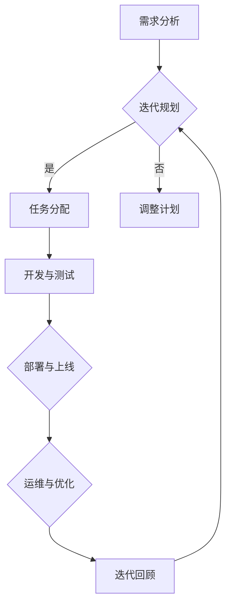

                 

### 文章标题

《LLM应用开发中的敏捷度量与报告》

### 关键词

- 语言模型
- 敏捷开发
- 度量与报告
- 应用开发
- 优化与评估

### 摘要

本文深入探讨了在大型语言模型（LLM）应用开发过程中，敏捷度量与报告的重要性。首先，文章介绍了LLM的基础概念、架构及其应用场景，并探讨了LLM的优势与挑战。接下来，文章详细阐述了LLM的技术基础，包括词嵌入、序列模型、注意力机制等核心技术。随后，文章重点讨论了敏捷度量在LLM开发中的应用，包括需求度量、进度度量、质量度量以及敏捷报告的撰写与展示技巧。文章还结合实际案例，分析了敏捷度量在LLM应用开发中的具体实践，并总结了最佳实践和注意事项。通过本文的阅读，读者将能够全面了解和掌握LLM应用开发中的敏捷度量与报告方法。

### 第一部分：LLM应用开发的基础

#### 第1章: LLM概述

##### 1.1 什么是LLM

大型语言模型（Large Language Model，简称LLM）是一种基于深度学习技术的自然语言处理（NLP）模型，能够对自然语言文本进行理解、生成和预测。LLM的核心思想是通过学习大量的文本数据，捕捉语言中的复杂模式和规律，从而实现对未知文本的生成和理解。

**定义与基本概念**：LLM通常由多层神经网络构成，其中每一层都能够对输入文本的特征进行提取和转换。LLM的核心模块是词嵌入层和编码器层，词嵌入层负责将输入文本中的单词转换为固定长度的向量表示，编码器层则通过多个层次的卷积或递归操作，将词向量转化为高维语义表示。

**架构简述**：常见的LLM架构包括Transformer、BERT、GPT等。Transformer模型通过自注意力机制实现了全局信息的高效捕捉，BERT模型通过双向编码器结构增强了上下文理解能力，GPT模型则通过自回归语言模型实现了文本的生成和预测。

**发展历程**：LLM的发展可以追溯到早期的统计语言模型和规则驱动模型。随着深度学习技术的崛起，GPT等模型的出现标志着语言模型进入了一个新的时代。近年来，随着计算资源和数据量的增加，LLM的规模和性能不断提升，从最初的GPT到后来的BERT、GPT-3，LLM在文本生成、翻译、摘要等任务中取得了显著的性能提升。

##### 1.2 LLM的应用场景

**通用应用场景**：LLM在通用应用场景中具有广泛的应用，如文本生成、翻译、摘要等。在文本生成方面，LLM可以用于自动生成文章、报告、新闻摘要等；在翻译方面，LLM可以实现高精度的机器翻译；在摘要方面，LLM可以自动提取文本的核心信息，生成简洁明了的摘要。

**专业应用场景**：LLM在专业领域也具有广泛的应用潜力。在法律领域，LLM可以用于法律文档的自动生成、审查和分类；在医疗领域，LLM可以用于医学文本的自动解析、病历生成和诊断辅助；在金融领域，LLM可以用于金融文本的自动分析、股票预测和风险管理。

##### 1.3 LLM的优势与挑战

**优势**：与传统的语言处理模型相比，LLM具有以下优势：

1. **更好的上下文理解能力**：LLM通过深度学习技术，能够捕捉文本中的复杂上下文关系，从而实现更准确的语言理解。
2. **更高效的文本生成**：LLM可以通过自回归机制实现高效的文本生成，生成文本的质量和连贯性显著提高。
3. **更广泛的应用范围**：LLM可以在多个自然语言处理任务中应用，如文本分类、命名实体识别、情感分析等。

**挑战**：尽管LLM具有诸多优势，但也面临一些挑战：

1. **数据隐私问题**：LLM的训练需要大量的文本数据，这些数据可能涉及用户的隐私信息，如何保护用户隐私成为一个重要问题。
2. **模型可解释性问题**：LLM作为一个复杂的深度学习模型，其内部决策过程往往难以解释，如何提高模型的可解释性是一个重要挑战。
3. **计算资源消耗**：大规模的LLM模型需要大量的计算资源和存储空间，如何高效地部署和运行LLM模型是一个技术难题。

#### 第2章: LLM技术基础

##### 2.1 语言模型的基础

**词嵌入**：词嵌入（Word Embedding）是将自然语言文本中的单词转换为固定长度的向量表示的技术。词嵌入的主要目的是将语义信息编码到向量中，从而实现单词之间的相似性计算和文本分类等任务。

- **Word2Vec**：Word2Vec是最早的词嵌入技术之一，通过训练神经网络模型，将单词映射到高维空间中的向量。Word2Vec模型主要有两种架构：连续词袋（CBOW）和Skip-Gram。
  
  - **CBOW**：CBOW模型通过上下文词的平均表示来预测中心词。具体来说，给定一个中心词，CBOW模型会考虑中心词周围的一组上下文词，并预测中心词。CBOW模型的公式如下：

    $$
    \hat{p}(w_t | w_{t-k}, w_{t-k+1}, \ldots, w_{t+k}) = \frac{\exp(\text{vec}(w_t)^T \text{W})}{\sum_{j=1}^{V} \exp(\text{vec}(w_j)^T \text{W})}
    $$

    其中，$\text{vec}(w_t)$ 表示单词 $w_t$ 的向量表示，$\text{W}$ 是权重矩阵，$V$ 是词汇表的大小。

  - **Skip-Gram**：Skip-Gram模型与CBOW模型相反，它通过预测一组上下文词来生成中心词。Skip-Gram模型的公式如下：

    $$
    \hat{p}(w_{t-k}, w_{t-k+1}, \ldots, w_{t+k} | w_t) = \frac{\exp(\text{vec}(w_t)^T \text{W})}{\sum_{j=1}^{V} \exp(\text{vec}(w_j)^T \text{W})}
    $$

- **BERT**：BERT（Bidirectional Encoder Representations from Transformers）是一种基于Transformer的预训练模型，通过双向编码器结构，BERT模型能够捕捉文本中的复杂上下文关系。BERT模型的主要任务是预测下一个词，从而学习单词之间的语义关系。

  - **预训练任务**：BERT的预训练任务包括两个部分：Masked Language Model（MLM）和Next Sentence Prediction（NSP）。MLM任务通过随机遮蔽文本中的单词，并预测遮蔽的单词；NSP任务通过判断两个连续句子是否在原始文本中相邻，从而学习句子间的语义关系。

  - **模型结构**：BERT模型由多个Transformer编码器层组成，每个编码器层包含多个自注意力头（Attention Heads）。自注意力机制使得BERT模型能够同时关注输入文本的不同部分，从而实现双向的上下文理解。

**序列模型**：序列模型（Sequence Model）是一类专门用于处理序列数据的机器学习模型，如循环神经网络（RNN）和长短时记忆网络（LSTM）。序列模型的主要任务是捕捉序列数据中的时间依赖关系。

- **RNN**：循环神经网络（Recurrent Neural Network，RNN）是一类能够处理序列数据的神经网络模型。RNN通过在时间步之间传递状态信息，实现了对序列数据的时间依赖关系建模。

  - **基本结构**：RNN的基本结构包括输入层、隐藏层和输出层。在时间步 $t$，输入层接收输入序列 $x_t$，隐藏层通过激活函数计算隐藏状态 $h_t$，输出层产生预测 $y_t$。RNN的递归关系如下：

    $$
    h_t = \text{激活函数}(\text{W} h_{t-1} + \text{U} x_t)
    $$

    其中，$\text{W}$ 和 $\text{U}$ 分别是权重矩阵，$\text{激活函数}$ 是如ReLU或Sigmoid的激活函数。

- **LSTM**：长短时记忆网络（Long Short-Term Memory，LSTM）是RNN的一种改进模型，能够更好地捕捉长序列中的时间依赖关系。LSTM通过引入门控机制，实现了对遗忘和输入信息的有效控制。

  - **基本结构**：LSTM的基本结构包括输入门、遗忘门、输出门和单元状态。在时间步 $t$，LSTM接收输入序列 $x_t$ 和前一个隐藏状态 $h_{t-1}$，并更新单元状态 $c_t$ 和隐藏状态 $h_t$。LSTM的递归关系如下：

    $$
    \begin{align*}
    i_t &= \text{sigmoid}(\text{W}_i h_{t-1} + \text{U}_i x_t) \\
    f_t &= \text{sigmoid}(\text{W}_f h_{t-1} + \text{U}_f x_t) \\
    o_t &= \text{sigmoid}(\text{W}_o h_{t-1} + \text{U}_o x_t) \\
    c_t &= f_t \circ c_{t-1} + i_t \circ \text{tanh}(\text{W}_c h_{t-1} + \text{U}_c x_t) \\
    h_t &= o_t \circ \text{tanh}(c_t)
    \end{align*}
    $$

    其中，$\text{sigmoid}$ 是激活函数，$i_t$、$f_t$、$o_t$ 分别是输入门、遗忘门和输出门的激活值，$\circ$ 表示元素乘法。

**注意力机制**：注意力机制（Attention Mechanism）是一类能够动态调整模型关注点的技术，常用于序列模型中。注意力机制通过为每个输入序列元素分配不同的权重，实现了对输入信息的自适应处理。

- **自注意力**：自注意力（Self-Attention）机制是Transformer模型的核心组件，能够同时关注输入序列的不同部分。自注意力机制通过计算输入序列中每个元素与其他元素的相关性，生成权重向量，用于加权求和。

  - **基本结构**：自注意力机制的基本结构包括查询（Query）、键（Key）和值（Value）三个部分。给定一个输入序列，自注意力机制首先计算查询向量 $\text{Q}$、键向量 $\text{K}$ 和值向量 $\text{V}$，然后通过计算相似性得分和权重向量，进行加权求和。

    $$
    \text{Attention}(Q, K, V) = \text{softmax}(\frac{QK^T}{\sqrt{d_k}})V
    $$

    其中，$d_k$ 是键向量的维度，$\text{softmax}$ 是归一化函数。

- **多头注意力**：多头注意力（Multi-Head Attention）机制是自注意力机制的扩展，通过将输入序列分解为多个子序列，实现了对输入信息的更高层次的理解。

  - **基本结构**：多头注意力机制通过多个独立的自注意力层，同时关注输入序列的不同部分。多头注意力机制的基本结构包括多个查询向量 $\text{Q}$、多个键向量 $\text{K}$ 和多个值向量 $\text{V}$，每个查询向量与相应的键向量和值向量进行自注意力计算。

    $$
    \text{MultiHead}(Q, K, V) = \text{Concat}(\text{head}_1, \ldots, \text{head}_h)W_O
    $$

    其中，$\text{head}_i = \text{Attention}(Q, K, V)$ 表示第 $i$ 个头的结果，$W_O$ 是输出权重矩阵。

##### 2.2 LLM的预训练与微调

**预训练**：预训练（Pre-training）是LLM训练的一个重要阶段，通过在大量无标签数据上进行预训练，LLM能够学习到通用语言知识和特征表示。预训练的主要任务是优化模型参数，使模型能够更好地理解和生成自然语言。

- **自监督学习**：自监督学习（Self-Supervised Learning）是一种在无监督数据上进行监督学习的技术，通过设计自监督任务，使模型能够从大量无标签数据中学习到有用的特征表示。

  - **常见任务**：常见的自监督学习任务包括Masked Language Model（MLM）、Next Sentence Prediction（NSP）和 masked tokens prediction 等。MLM任务通过随机遮蔽文本中的部分单词，并预测遮蔽的单词；NSP任务通过判断两个连续句子是否在原始文本中相邻，从而学习句子间的语义关系；masked tokens prediction 任务通过预测文本中被遮蔽的标记。

- **无监督预训练**：无监督预训练（Unsupervised Pre-training）是在无监督数据上进行预训练的过程，通过大规模无标签数据，使模型能够学习到丰富的语言特征。常见的无监督预训练模型包括GPT、BERT和RoBERTa等。

**微调**：微调（Fine-tuning）是在预训练的基础上，针对特定任务对模型进行微调，使模型能够适应特定领域或任务。微调的主要任务是调整模型参数，优化模型在特定任务上的性能。

- **任务定义**：在微调过程中，首先需要对任务进行定义，包括输入数据、输出数据和评估指标等。常见的任务包括文本分类、命名实体识别、情感分析等。

- **数据准备**：在微调过程中，需要对数据进行预处理和标注，以便模型能够从数据中学习到有用的特征。预处理步骤包括数据清洗、分词、词嵌入等。

- **模型优化**：在微调过程中，采用梯度下降等优化算法，对模型参数进行更新和优化，使模型在特定任务上取得更好的性能。

##### 2.3 LLM的评估与优化

**评估指标**：评估指标是用于衡量模型性能的重要工具，常见的评估指标包括 perplexity、accuracy、F1 score、BLEU score 等。

- **Perplexity**：Perplexity 是衡量语言模型生成文本的复杂度的指标，表示模型生成文本的概率对数的平均值。Perplexity 越小，表示模型生成文本的能力越强。

- **Accuracy**：Accuracy 是衡量分类模型准确性的指标，表示模型正确分类的样本数占总样本数的比例。

- **F1 score**：F1 score 是衡量分类模型精确度和召回率的指标，表示精确度和召回率的调和平均值。

- **BLEU score**：BLEU score 是衡量机器翻译质量的指标，通过比较机器翻译文本与人工翻译文本的匹配度，评估机器翻译的性能。

**优化方法**：优化方法用于提升模型性能和稳定训练过程，常见的优化方法包括梯度裁剪、学习率调整、权重初始化等。

- **梯度裁剪**：梯度裁剪（Gradient Clipping）是一种防止梯度爆炸和梯度消失的方法，通过限制梯度的大小，避免模型训练过程中的不稳定现象。

- **学习率调整**：学习率调整（Learning Rate Scheduling）是一种调整学习率的方法，通过逐步降低学习率，使模型在训练过程中能够稳定收敛。

- **权重初始化**：权重初始化（Weight Initialization）是一种初始化模型参数的方法，通过合理的初始化方法，使模型能够更快地收敛并提高性能。

### 第二部分：敏捷度量与报告在LLM应用开发中的应用

#### 第3章: 敏捷度量在LLM开发中的应用

##### 3.1 敏捷度量概述

敏捷开发（Agile Development）是一种以人为核心、迭代式、增量式的软件开发方法。敏捷开发强调快速响应变化、持续交付价值、高效团队合作和持续改进。敏捷度量（Agile Metrics）是敏捷开发中用于衡量项目进度、质量和效率的重要工具。

**敏捷开发原则**：敏捷开发的基本原则包括：

- **客户满意**：关注客户需求，确保交付的产品能够满足客户期望。
- **迭代开发**：通过短周期的迭代开发，快速交付可用的产品。
- **团队协作**：鼓励团队成员之间的沟通和协作，提高团队效率。
- **持续交付**：持续交付高质量的产品，确保客户能够持续获得价值。
- **响应变化**：灵活应对需求变化，快速调整开发计划。

**度量方法**：敏捷度量主要包括以下几种方法：

- **故事点（Story Points）**：故事点是一种相对的度量方法，用于估算任务的难度和开发工作量。故事点可以根据团队的经验和共识进行分配，通常用于迭代规划和任务分配。
- **工作量估计（Workload Estimation）**：工作量估计是一种基于历史数据和团队经验的估算方法，用于预测任务完成所需的时间和工作量。工作量估计可以用于制定迭代计划和资源分配。
- **迭代时间（Iteration Time）**：迭代时间是指一个迭代周期的时间长度，通常是一个固定的时间窗口，如2周或4周。迭代时间可以用于衡量项目的进度和团队的工作效率。

##### 3.2 LLM项目中的敏捷度量

在LLM项目开发中，敏捷度量可以用于以下几个方面：

**需求度量**：需求度量是评估项目需求的重要手段，用于确定项目范围和优先级。

- **用户故事（User Story）**：用户故事是一种描述用户需求和功能的简短故事，通常包含三个部分：用户角色、用户目标和业务价值。用户故事可以用于确定需求优先级和任务分配。
- **故事点分配**：根据用户故事的复杂度和开发工作量，为每个用户故事分配相应的故事点，以评估需求的难度和优先级。
- **需求矩阵**：需求矩阵是一种用于评估需求优先级和风险的方法，通过矩阵中的行和列，分别表示需求的优先级和风险，确定每个需求的优先级和风险等级。

**进度度量**：进度度量是衡量项目进展的重要手段，用于确保项目按计划进行。

- **迭代计划**：根据需求矩阵和团队的工作量估计，制定每个迭代的具体任务和时间安排，确保项目进度可控。
- **迭代回顾**：在每个迭代结束时，进行迭代回顾，分析项目进度和问题，制定下一迭代的工作计划，确保项目按计划推进。
- **燃尽图（Burn-down Chart）**：燃尽图是一种用于可视化项目进度的图表，通过显示已完成的工作量和剩余工作量，分析项目进度和风险。

**质量度量**：质量度量是评估项目质量的重要手段，用于确保项目的功能和质量。

- **测试覆盖率（Test Coverage）**：测试覆盖率是指测试用例覆盖代码的比例，用于评估代码的测试完整性。
- **缺陷密度（Defect Density）**：缺陷密度是指单位代码行数中的缺陷数，用于评估代码的质量。
- **质量指标（Quality Metrics）**：质量指标包括代码质量、测试质量、用户满意度等，用于评估项目的整体质量。

##### 3.3 敏捷报告

敏捷报告是敏捷开发中用于与团队成员和利益相关者沟通的重要工具，用于展示项目进度、质量和风险。

**报告内容**：敏捷报告主要包括以下内容：

- **迭代总结**：总结每个迭代的具体任务完成情况、遇到的困难和解决方案。
- **工作量统计**：统计每个迭代的工作量、故事点完成情况和剩余工作量。
- **风险分析**：分析项目中的风险和问题，并提出相应的应对措施。
- **计划调整**：根据项目进度和问题，调整后续迭代的工作计划和目标。

**报告格式**：敏捷报告的常见格式包括：

- **迭代回顾报告**：用于总结每个迭代的工作情况和问题，制定下一迭代的工作计划。
- **燃尽图**：用于可视化项目进度和风险。
- **Cone of Uncertainty**：用于展示项目中的不确定性和风险。
- **Scrum Board**：用于展示任务的状态和进度。

### 第三部分：敏捷实践在LLM应用开发中的应用

#### 第4章: 敏捷迭代管理

##### 4.1 敏捷迭代管理概述

敏捷迭代管理是敏捷开发中的一种核心实践，通过短周期的迭代，快速交付可用的产品，并不断调整和改进开发过程。敏捷迭代管理主要包括迭代规划、迭代执行和迭代回顾等环节。

**迭代规划**：迭代规划是敏捷开发的第一步，旨在确定每个迭代的具体任务和时间安排，确保项目按计划进行。迭代规划主要包括以下步骤：

1. **需求分析**：分析项目需求，确定每个迭代的目标和任务。
2. **任务分配**：根据团队成员的能力和兴趣，为每个任务分配负责人。
3. **时间估算**：对每个任务的完成时间进行估算，制定迭代计划。

**迭代执行**：迭代执行是敏捷开发的核心环节，通过短周期的迭代，快速交付可用的产品。在迭代执行过程中，团队成员需要保持紧密的沟通和协作，确保任务按时完成。迭代执行主要包括以下步骤：

1. **任务启动**：为每个任务分配资源和时间，确保任务能够按时启动。
2. **任务执行**：团队成员按照任务计划，完成各自的任务。
3. **任务检查**：在任务执行过程中，定期检查任务的进度和质量，确保任务按计划进行。

**迭代回顾**：迭代回顾是敏捷开发中的一种重要实践，通过总结和反思每个迭代的工作情况，发现问题并制定改进措施，提高团队的工作效率和产品质量。迭代回顾主要包括以下步骤：

1. **回顾总结**：总结每个迭代的具体任务完成情况、遇到的困难和解决方案。
2. **问题分析**：分析项目中的问题，找出根本原因。
3. **改进计划**：制定改进措施，提高团队的工作效率和产品质量。

##### 4.2 敏捷迭代管理在LLM开发中的应用

在LLM开发中，敏捷迭代管理可以用于以下几个方面：

**需求管理**：LLM项目通常涉及复杂的需求和功能，通过敏捷迭代管理，可以逐步实现需求，并不断调整和优化产品。在需求管理中，可以使用用户故事、需求矩阵等方法，明确项目需求和优先级，确保项目能够按时交付。

**进度管理**：在LLM开发中，进度管理至关重要，需要确保项目按计划进行。通过敏捷迭代管理，可以定期检查任务进度，及时发现和解决问题，确保项目按时交付。

**风险管理**：在LLM开发中，风险管理尤为重要，需要识别和应对各种风险。通过敏捷迭代管理，可以定期回顾项目风险，制定应对措施，降低项目风险。

**团队协作**：在LLM开发中，团队协作至关重要，需要团队成员紧密合作，共同完成项目。通过敏捷迭代管理，可以加强团队成员之间的沟通和协作，提高团队的工作效率和产品质量。

#### 第5章: 敏捷测试与部署

##### 5.1 敏捷测试策略

敏捷测试（Agile Testing）是敏捷开发中的一种核心实践，旨在确保项目的功能和质量。敏捷测试策略主要包括以下几个方面：

**自动化测试**：自动化测试是一种用于验证软件功能和质量的方法，通过编写自动化测试脚本，自动化执行测试用例，提高测试效率和覆盖率。在LLM开发中，自动化测试可以用于测试模型的准确性、稳定性等性能指标。

- **单元测试**：单元测试是针对模型的基本模块（如词嵌入层、编码器层等）进行测试，确保每个模块的功能和性能符合预期。
- **集成测试**：集成测试是针对整个模型进行测试，确保模型的各个部分能够协同工作，并满足整体功能要求。
- **性能测试**：性能测试是评估模型在特定硬件环境下的性能指标，如计算速度、内存占用等。

**持续集成（CI）**：持续集成是一种在软件开发过程中，将代码合并到主干分支并自动化执行测试的方法，以确保代码的质量和稳定性。在LLM开发中，持续集成可以用于自动化构建和测试模型，提高开发效率和代码质量。

**回归测试**：回归测试是在每次代码变更后，对已测试功能进行重新测试，确保新代码不会影响已实现的功能。在LLM开发中，回归测试可以确保模型在每次更新后，仍能保持原有的性能和功能。

##### 5.2 敏捷部署流程

敏捷部署（Agile Deployment）是敏捷开发中的一种核心实践，旨在快速交付可用的产品。敏捷部署流程主要包括以下几个方面：

**持续交付（CD）**：持续交付是一种在软件开发过程中，通过自动化构建、测试和部署，实现快速交付和持续改进的方法。在LLM开发中，持续交付可以用于自动化部署模型，提高开发效率和产品质量。

- **自动化构建**：自动化构建是将代码从版本控制系统拉取到构建环境中，执行编译、打包等操作，生成可部署的模型文件。
- **自动化测试**：自动化测试是针对构建后的模型进行测试，确保模型的功能和性能符合预期。
- **自动化部署**：自动化部署是将测试通过的模型部署到生产环境中，实现快速交付。

**容器化部署**：容器化部署是将模型部署到容器中，通过容器管理工具（如Docker、Kubernetes等）进行管理和部署。在LLM开发中，容器化部署可以提高模型的部署效率和可移植性。

**蓝绿部署**：蓝绿部署是一种将新旧版本同时部署到生产环境中的方法，通过逐步切换流量，确保新旧版本之间的平滑过渡。在LLM开发中，蓝绿部署可以减少部署过程中可能出现的风险和中断。

#### 第6章: 敏捷度量工具与应用

##### 6.1 敏捷度量工具

敏捷度量工具是敏捷开发中用于收集、分析和展示项目数据的重要工具。常见的敏捷度量工具有JIRA、Trello、Asana等。

- **JIRA**：JIRA是一款功能强大的敏捷项目管理工具，支持任务管理、需求管理、迭代规划、进度跟踪等功能。JIRA提供了丰富的报表和分析功能，可以帮助团队了解项目进展和性能。
- **Trello**：Trello是一款基于看板（Kanban）模型的敏捷项目管理工具，通过卡片和看板，直观地展示任务状态和进度。Trello简单易用，适用于小型团队和项目。
- **Asana**：Asana是一款功能丰富的敏捷项目管理工具，支持任务管理、团队协作、进度跟踪等功能。Asana提供了强大的报表和分析功能，可以帮助团队了解项目进展和问题。

##### 6.2 敏捷度量实践

在LLM开发中，敏捷度量实践可以应用于以下几个方面：

**需求管理**：通过敏捷度量工具，可以收集和整理项目需求，明确需求优先级和任务分配。在需求管理中，可以使用用户故事、故事点等方法，对需求进行量化和评估，确保项目能够按时交付。

**进度管理**：通过敏捷度量工具，可以实时跟踪任务进度和工作量，确保项目按计划进行。在进度管理中，可以使用燃尽图、进度报告等方法，分析项目进度和风险，制定改进措施。

**风险管理**：通过敏捷度量工具，可以收集和分析项目中的风险和问题，制定应对措施。在风险管理中，可以使用风险矩阵、风险报告等方法，评估项目风险，确保项目顺利进行。

**质量度量**：通过敏捷度量工具，可以收集和分析项目质量数据，确保项目的功能和质量。在质量度量中，可以使用测试覆盖率、缺陷密度等方法，评估代码质量，确保项目达到质量标准。

### 第四部分：敏捷报告的撰写与展示

#### 第7章: 敏捷报告的撰写与展示

##### 7.1 报告撰写技巧

敏捷报告是敏捷开发中用于与团队成员和利益相关者沟通的重要工具，撰写一份清晰、准确、有价值的报告至关重要。以下是一些报告撰写的技巧：

**内容结构**：报告的内容结构应该清晰明了，逻辑连贯。通常，报告可以分为以下几个部分：

1. **标题**：简洁明了地表达报告的主题。
2. **摘要**：简要概述报告的核心内容和结论。
3. **背景介绍**：介绍项目背景、目标和任务。
4. **进展报告**：详细描述项目进展情况，包括已完成的任务、进行中的任务和计划中的任务。
5. **问题与挑战**：分析项目过程中遇到的问题和挑战，并提出解决方案。
6. **数据分析**：展示项目数据和分析结果，包括进度、质量、风险等方面的数据。
7. **结论与建议**：总结项目成果和经验教训，提出改进建议。

**语言风格**：报告的语言风格应该简明扼要，通俗易懂。避免使用过于专业或复杂的术语，以便利益相关者能够轻松理解报告内容。

**图表与可视化**：合理使用图表和可视化工具，可以增强报告的可读性和说服力。常用的图表和可视化工具包括：

- **柱状图**：用于比较不同类别或时间段的数据。
- **折线图**：用于展示数据的变化趋势。
- **饼图**：用于展示各类别的占比。
- **散点图**：用于展示数据之间的关系。
- **热力图**：用于展示数据的分布情况。

**图表说明**：在图表旁边添加简要的说明文字，解释图表的含义和数据来源，以便读者更好地理解图表内容。

##### 7.2 报告展示技巧

报告展示是敏捷报告的重要组成部分，通过有效的展示技巧，可以增强报告的吸引力、说服力和影响力。以下是一些报告展示的技巧：

**演示工具**：选择合适的演示工具，如PowerPoint、Keynote、Google Slides等，以便于展示报告内容。这些工具提供了丰富的模板、动画和过渡效果，可以增强报告的视觉效果。

**结构清晰**：报告展示的结构应该清晰明了，避免内容过于杂乱。通常，报告展示可以分为以下几个部分：

1. **开场**：简要介绍报告的主题和目的，吸引观众的注意力。
2. **主要内容**：逐一展示报告的主要内容，包括进展、问题、数据分析等。
3. **结论与建议**：总结项目成果和经验教训，提出改进建议。
4. **互动环节**：邀请观众提问和讨论，增强报告的互动性和参与感。

**视觉设计**：报告展示的视觉设计至关重要，可以增强报告的美观度和专业性。以下是一些视觉设计的建议：

- **简洁的布局**：避免过多文字和复杂的设计，确保报告内容简洁明了。
- **统一的风格**：使用统一的字体、颜色和图标，保持报告风格的统一性。
- **适当的动画**：合理使用动画效果，增强报告的动态感和视觉效果。
- **重点突出**：使用粗体、颜色突出重点内容，以便观众更容易抓住关键信息。

**声音与节奏**：报告展示的声音和节奏也对观众的接受度有重要影响。以下是一些声音和节奏的建议：

- **清晰的声音**：使用清晰的语音和合适的语速，确保观众能够听懂报告内容。
- **适当的停顿**：在展示过程中，适当停顿，给观众思考和吸收的时间。
- **声音效果**：合理使用背景音乐、音效等，增强报告的视听效果。

**互动与反馈**：在报告展示过程中，鼓励观众提问和讨论，收集反馈意见，以便改进报告内容和展示技巧。

### 案例分析与实战

#### 第8章: LLM应用开发中的敏捷度量与报告实践

##### 8.1 案例介绍

本案例以一个基于GPT-3的智能客服系统为例，详细分析敏捷度量与报告在LLM应用开发中的实际应用。

**案例背景**：某公司开发了一款基于GPT-3的智能客服系统，旨在为客户提供快速、准确的在线客服服务。系统的主要功能包括：自动回答常见问题、提供个性化建议和解决方案、记录客户问题和反馈。

**项目目标**：通过敏捷开发方法，确保智能客服系统按期上线，并达到以下目标：

1. **功能完整性**：实现系统的所有功能需求，包括自动回答常见问题、提供个性化建议和解决方案等。
2. **性能稳定性**：确保系统在高并发环境下稳定运行，响应时间在可接受范围内。
3. **用户体验**：提供优质的用户体验，提高客户满意度。

**项目团队**：项目团队由开发人员、测试人员、产品经理和项目经理组成，团队成员具备丰富的LLM开发和敏捷开发经验。

##### 8.2 敏捷度量应用

在案例项目中，敏捷度量被广泛应用于项目管理的各个阶段，包括需求管理、进度管理、质量管理和风险管理。

**需求管理**：

1. **用户故事**：项目团队使用用户故事来描述需求，确保需求具有可测试性和可追溯性。每个用户故事包括用户角色、用户目标和业务价值。
2. **故事点分配**：根据用户故事的复杂度和开发工作量，为每个用户故事分配相应的故事点，以评估需求的难度和优先级。
3. **需求矩阵**：使用需求矩阵对用户故事进行优先级和风险评估，确保项目团队重点关注高优先级和低风险的需求。

**进度管理**：

1. **迭代计划**：项目团队制定每个迭代的具体任务和时间安排，确保项目按计划进行。迭代计划包括任务分配、时间估算和进度跟踪。
2. **燃尽图**：通过燃尽图实时跟踪项目进度，分析项目进度和风险，制定改进措施。
3. **迭代回顾**：在每个迭代结束时，进行迭代回顾，总结项目进展和问题，制定下一迭代的工作计划，确保项目按计划推进。

**质量管理**：

1. **测试覆盖率**：项目团队制定自动化测试计划，确保测试覆盖率达到100%。通过单元测试、集成测试和性能测试，确保系统的功能和质量。
2. **缺陷密度**：项目团队对代码进行审查和测试，统计缺陷密度，分析代码质量。
3. **质量报告**：项目团队定期发布质量报告，包括测试覆盖率、缺陷密度、用户满意度等数据，评估项目的整体质量。

**风险管理**：

1. **风险识别**：项目团队定期识别项目中的潜在风险，包括技术风险、市场风险、人力资源风险等。
2. **风险矩阵**：使用风险矩阵对风险进行优先级和影响评估，制定相应的应对措施。
3. **风险报告**：项目团队定期发布风险报告，包括风险识别、评估和应对措施，确保项目风险得到有效控制。

##### 8.3 敏捷报告应用

在案例项目中，敏捷报告被广泛应用于项目管理和沟通。

**迭代报告**：项目团队在每个迭代结束时发布迭代报告，包括任务完成情况、进度、质量和风险等方面的数据。迭代报告帮助团队成员了解项目进展，发现问题并制定改进措施。

**进度报告**：项目团队定期发布进度报告，包括项目进度、工作量、风险等方面的数据。进度报告帮助利益相关者了解项目进展，评估项目风险。

**质量报告**：项目团队定期发布质量报告，包括测试覆盖率、缺陷密度、用户满意度等数据。质量报告帮助团队了解项目的整体质量，制定改进措施。

**风险报告**：项目团队定期发布风险报告，包括风险识别、评估和应对措施。风险报告帮助团队了解项目风险，确保项目风险得到有效控制。

##### 8.4 实践效果

通过敏捷度量与报告的应用，案例项目取得了以下实践效果：

1. **项目进度可控**：通过燃尽图和迭代计划，项目团队能够实时跟踪项目进度，确保项目按计划进行。
2. **质量保障**：通过测试覆盖率和缺陷密度等指标，项目团队能够确保项目的功能和质量。
3. **风险控制**：通过风险矩阵和风险报告，项目团队能够及时发现和应对项目风险，确保项目顺利进行。
4. **团队协作提升**：通过迭代回顾和敏捷报告，项目团队成员能够更好地沟通和协作，提高团队的工作效率和产品质量。

### 最佳实践

#### 第9章: LLM应用开发中的最佳实践

在LLM应用开发过程中，遵循一些最佳实践可以提高项目效率和质量，确保项目能够按时交付并达到预期目标。以下是一些最佳实践：

1. **需求管理**：

   - 使用用户故事来明确需求，确保需求具有可测试性和可追溯性。
   - 定期与利益相关者进行需求讨论，确保需求的一致性和完整性。
   - 根据用户故事的优先级和风险，制定合理的迭代计划和任务分配。

2. **进度管理**：

   - 使用燃尽图、进度报告等工具，实时跟踪项目进度，确保项目按计划进行。
   - 定期进行迭代回顾，总结项目进展和问题，制定改进措施。
   - 根据项目进展和需求变化，灵活调整迭代计划和任务分配。

3. **质量管理**：

   - 制定自动化测试计划，确保测试覆盖率达到100%。
   - 对代码进行审查和测试，统计缺陷密度，分析代码质量。
   - 定期发布质量报告，包括测试覆盖率、缺陷密度、用户满意度等数据，评估项目的整体质量。

4. **风险管理**：

   - 定期识别项目中的潜在风险，包括技术风险、市场风险、人力资源风险等。
   - 使用风险矩阵对风险进行优先级和影响评估，制定相应的应对措施。
   - 定期发布风险报告，包括风险识别、评估和应对措施，确保项目风险得到有效控制。

5. **团队协作**：

   - 建立有效的沟通机制，确保团队成员之间的信息共享和协作。
   - 定期组织团队活动，增强团队成员的凝聚力和归属感。
   - 鼓励团队成员积极参与迭代回顾和问题讨论，共同解决项目中的问题。

### 小结

本文通过详细分析和实际案例，阐述了敏捷度量与报告在LLM应用开发中的重要性。敏捷度量与报告能够帮助团队有效管理需求、进度、质量和风险，确保项目按时交付并达到预期目标。在LLM应用开发中，遵循最佳实践和敏捷方法，可以提高项目效率和质量，推动人工智能技术的发展和应用。未来的研究和实践将继续探索敏捷度量与报告在LLM应用开发中的新方法和新思路，为人工智能领域的创新和发展提供支持。

### 注意事项

1. **数据隐私**：在LLM应用开发过程中，需要注意数据隐私保护，确保用户数据的安全和合规性。
2. **模型可解释性**：提高模型的可解释性，有助于提高用户对模型信任度，减少误用和误解。
3. **资源分配**：合理分配计算资源和存储资源，确保项目能够在有限的资源下顺利进行。
4. **团队协作**：加强团队协作，提高团队成员之间的沟通和合作，确保项目能够高效推进。

### 拓展阅读

1. **敏捷开发方法**：深入理解敏捷开发的基本原则和实践方法，参考《敏捷开发实践指南》、《Scrum精髓》等经典著作。
2. **LLM技术基础**：了解LLM的基本概念、架构和关键技术，参考《深度学习》、《自然语言处理原理》等教材。
3. **敏捷度量工具**：学习常用的敏捷度量工具，如JIRA、Trello、Asana等，参考相关教程和案例。
4. **敏捷报告撰写**：掌握敏捷报告的撰写技巧和展示方法，参考相关教程和实际案例。

### 附录

#### 附录A: Mermaid 流程图

以下是一个简单的Mermaid流程图示例，用于展示LLM应用开发中的关键步骤：



#### 附录B: 代码示例

以下是一个简单的Python代码示例，用于实现词嵌入技术：

```python
import numpy as np

# 假设词汇表大小为10，嵌入维度为3
vocab_size = 10
embedding_size = 3

# 初始化权重矩阵
weights = np.random.rand(vocab_size, embedding_size)

# 输入单词
word = "hello"

# 转换为单词索引
word_index = vocab_size - 1

# 计算词嵌入
embed = weights[word_index]

print(embed)
```

#### 附录C: Math 公式

以下是一个简单的Math公式示例：

$$
\text{f}(x) = \frac{1}{1 + e^{-x}}
$$

### 总结

本文深入探讨了LLM应用开发中的敏捷度量与报告方法，包括LLM的基础概念、技术基础、敏捷度量与报告实践以及最佳实践。通过实际案例分析和最佳实践总结，本文展示了敏捷度量与报告在LLM应用开发中的重要性。希望本文能为读者提供有价值的参考和启示，推动人工智能技术的持续发展。

